# 5。用 Docker 编写编写环境

概观

本章介绍了使用 Docker Compose 创建和管理多容器应用。您将学习如何创建 Docker Compose 文件来定义复杂的容器化应用，以及如何运行 Docker Compose CLI 来管理多容器应用的生命周期。本章将使您能够使用不同的方法配置 Docker Compose 应用，并设计依赖于其他应用的应用。

# 简介

在前几章中，我们讨论了如何使用 Docker 容器和`Dockerfiles`来创建容器化的应用。随着应用变得越来越复杂，容器及其配置的管理变得更加复杂。

例如，假设您正在开发一个具有前端、后端、支付和订购微服务的在线商店。在构建、打包和配置之前，每个微服务都用最合适的编程语言实现。因此，复杂的应用被设计成在 Docker 生态系统中的独立容器中运行。不同的容器需要多个`Dockerfiles`来定义 Docker 映像。

他们还需要复杂的命令来配置、运行和排除应用故障。所有这些都可以通过使用 **Docker Compose** 来实现，这是一个在多个容器中定义和管理应用的工具。复杂的应用(如 YAML 文件)可以通过 Docker Compose 中的一个命令进行配置和运行。适用于各种环境，包括开发、测试、**持续集成** ( **CI** )管道、生产。

Docker Compose 的基本功能可以分为三类:

*   **隔离** : Docker Compose 允许您完全隔离地运行复杂应用的多个实例。虽然这看起来是一个微不足道的功能，但它使在开发人员机器、配置项服务器或共享主机上运行同一应用堆栈的多个副本成为可能。因此，共享资源可以提高利用率，同时降低运营复杂性。
*   **状态数据管理** : Docker Compose 管理容器的卷，这样它们就不会丢失之前运行的数据。此功能使创建和操作将其状态存储在磁盘(如数据库)上的应用变得更加容易。
*   **迭代设计** : Docker Compose 使用由多个容器组成的显式定义的配置。配置中的容器可以用新容器扩展。例如，假设您的应用中有两个容器。如果添加第三个容器并运行 Docker Compose 命令，前两个容器将不会重新启动或重新创建。Docker Compose 将只创建和加入新添加的第三个容器。

这些特性使得 Compose 成为在各种平台上作为多个容器创建和管理应用的基本工具。在本章中，您将看到 Docker Compose 如何帮助您管理复杂应用的完整生命周期。

您将从深入编写命令行界面和文件解剖开始。接下来，您将学习如何使用多种技术配置应用，以及如何定义服务依赖关系。由于 Docker Compose 是 Docker 环境的一个基本工具，所以技术和实践经验对于工具箱来说都是至关重要的。

# 坞站组成 CLI

Docker Compose 与 **Docker 引擎**一起创建和管理多容器应用。为了与 Docker 引擎交互，Compose 使用了一个名为`docker-compose`的命令行界面工具。在 Mac 和 Windows 系统上，`docker-compose`已经是 Docker Desktop 的一部分。但是在 Linux 系统上，安装 Docker Engine 后需要安装`docker-compose` CLI 工具。它被打包成一个可执行文件，您可以使用以下命令在 Linux 系统上安装它。

## 在 Linux 上安装坞站复合 CLI

1.  用终端中的以下命令将二进制文件下载到`/usr/local/bin`:

    ```
    sudo curl -L "https://github.com/docker/compose/releases/download/1.25.0/docker-compose-$(uname -s)-$(uname -m)" -o /usr/local/bin/docker-compose
    ```

2.  使用以下命令使下载的二进制文件可执行:

    ```
    sudo chmod +x /usr/local/bin/docker-compose
    ```

3.  Test the CLI and installation with the following command in the Terminal on all operating systems:

    ```
    docker-compose version
    ```

    如果安装正确，您将看到命令行界面的版本及其依赖关系如下。例如，在下面的输出中，`docker-compose` CLI 有版本`1.25.1-rc1`，其依赖项`docker-py`、`CPython`和`OpenSSL`也列出了它们的版本:

    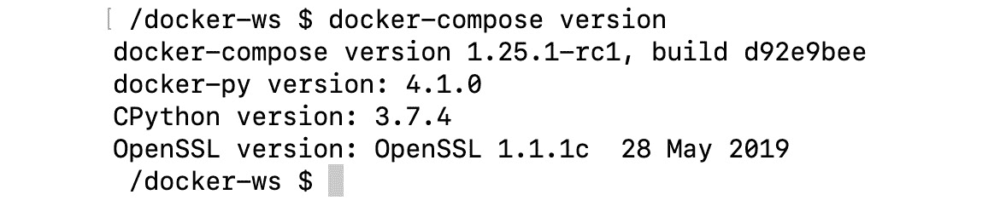

图 5.1:坞站-合成输出版本

到目前为止，我们已经学习了如何在 Linux 中安装 Docker Compose CLI。现在我们将研究管理多容器应用整个生命周期的命令和子命令。

## 坞站构成 CLI 命令

`docker-compose`命令能够管理多容器应用的整个生命周期。使用子命令，可以启动、停止和重新创建服务。此外，还可以检查正在运行的堆栈的状态并获取日志。在本章中，您将获得基本命令的实际操作经验。同样，可以使用以下命令列出所有功能的预览:

```
docker-compose --help
```

命令的输出应该如下所示:

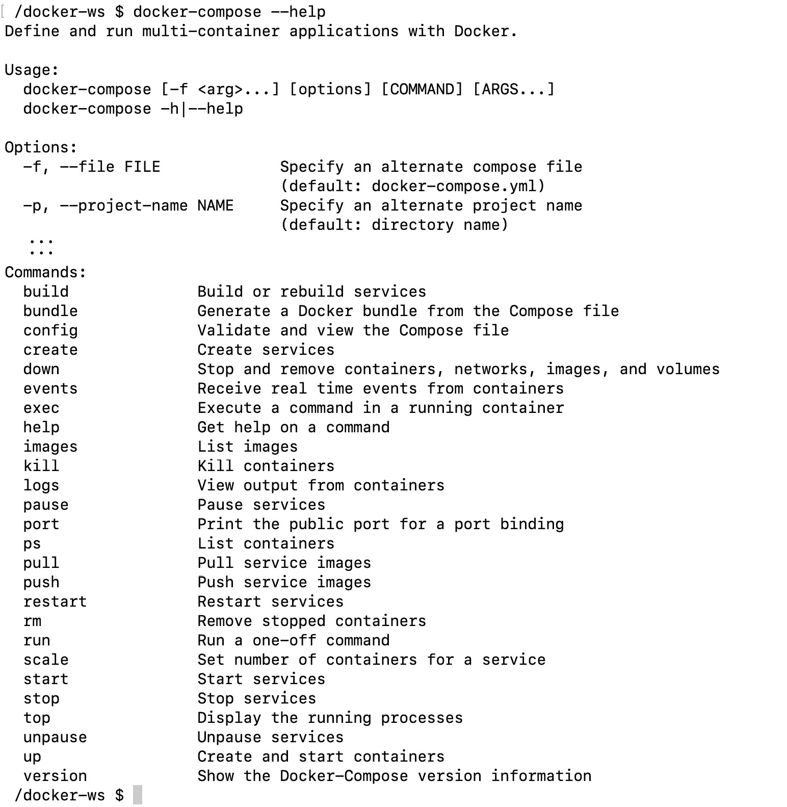

图 5.2:坞站-合成命令

有三个基本的`docker-compose`命令用于管理应用的生命周期。生命周期和命令可以说明如下:


图 5.3:坞站-合成生命周期

*   `docker-compose up`:该命令创建并启动配置中定义的容器。可以从注册表中构建容器映像或使用预构建的映像。此外，还可以在后台运行带有`-d`或`--detach`标志的`detached`模式的容器。对于长期运行的容器，如网络服务器，使用`detached`模式很方便，我们预计短期内不会停止。可以使用`docker-compose up --help`命令检查附加选项和标志。
*   `docker-compose ps`:该命令列出容器及其状态信息。这对故障排除和容器运行状况检查很有帮助。例如，如果您创建一个具有后端和前端的双容器应用，您可以使用`docker-compose ps`命令检查每个容器的状态。它有助于发现您的后端或前端是否关闭，没有对它们的运行状况检查做出响应，或者由于配置错误而无法启动。
*   `docker-compose down`:此命令停止并删除所有资源，包括容器、网络、映像和卷。

## 坞站构成文件

使用`docker-compose`命令行界面运行和定义多容器应用。按照惯例，这些文件的默认名称是`docker-compose.yaml`。Docker Compose 是一个强大的工具；但是，它的功率取决于配置。因此，知道如何创建`docker-compose.yaml`文件是必不可少的，需要非常注意。

注意

默认情况下，Docker Compose 使用`docker-compose.yaml`和`docker-compose.yml`文件扩展名。

`docker-compose.yaml`文件由四个主要部分组成，如图*图 5.4* 所示:

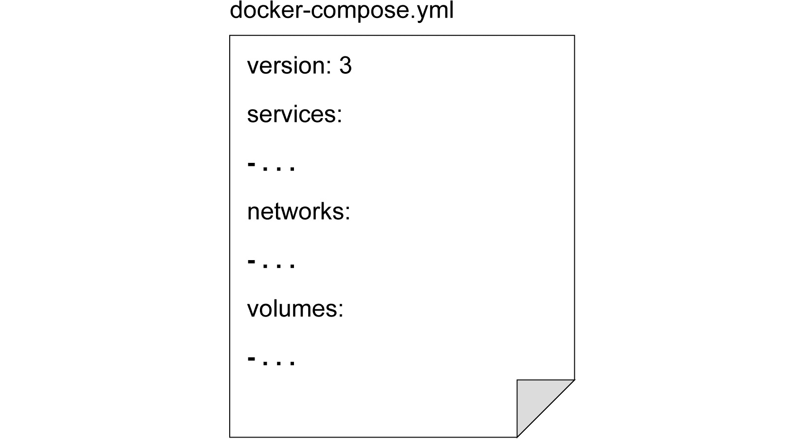

图 5.4:文件结构

*   `version`:本节定义了`docker-compose`文件的语法版本，目前最新的语法版本是`3`。
*   `services`:本节描述了将在需要时构建的 Docker 容器，并将由`docker-compose`启动。
*   `networks`:本节描述服务将使用的网络。
*   `volumes`:本节描述了将在服务中装载到容器的数据卷。

对于`services`部分，创建容器有两个基本选项。第一个选项是构建容器，第二个选项是使用注册表中的 Docker 映像。当您在本地创建和测试容器时，建议构建映像。另一方面，在生产和 CI/CD 系统中使用来自注册表的 Docker 映像更快、更容易。

假设您想要使用名为`Dockerfile-server`的`Dockerfile`来构建您的服务器容器。然后，需要将文件放入`server`文件夹，文件夹结构如下:


图 5.5:文件夹结构

`tree`命令的输出显示有一个包含`Dockerfile-server`的`server`文件夹。

当在根目录的`docker-compose.yaml`文件中定义了以下内容时，将在运行服务之前构建`server`容器:

```
version: "3"
services:
  server:
    build:
      context: ./server
      dockerfile: Dockerfile-server
```

同样，如果您想使用 Docker 注册表中的映像，您可以定义一个只有`image`字段的服务:

```
version: "3"
services:
  server:
    image: nginx
```

默认情况下，Docker Compose 创建一个网络，每个容器都连接到这个网络。此外，容器可以使用主机名连接到其他容器。例如，假设您在`webapp`文件夹中有以下`docker-compose.yaml`文件:

```
version: "3"
services:
  server:
    image: nginx
  db:
    image: postgres
    ports:
      - "8032:5432"
```

当您以此配置启动`docker-compose`时，它首先创建名为`webapp_default`的网络。随后，`docker-compose`创建`server`和`db`容器，并分别以名称`server`和`db`加入`webapp_default`网络。

此外，`server`容器可以使用其`container`端口和主机名连接到数据库，如下所示:`postgres://db:5432`。同样，通过主机端口`8032`可以从主机访问数据库，如下所示:`postgres://localhost:8032`。网络结构如下图所示:

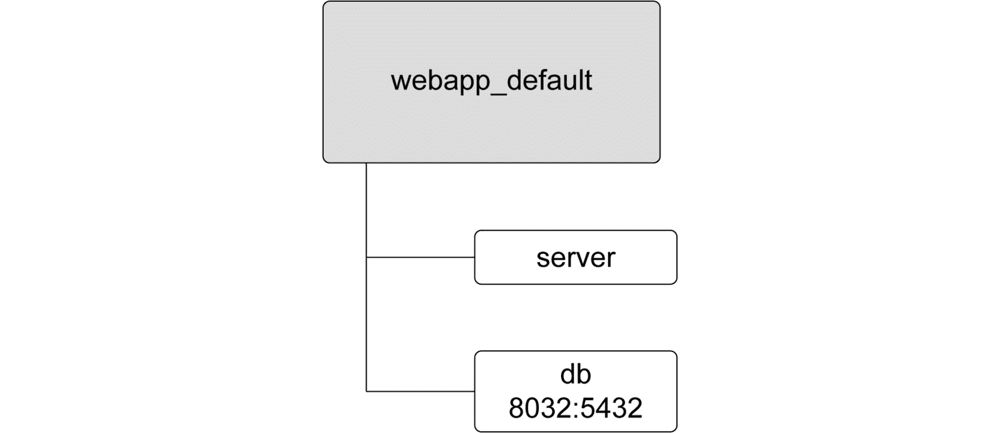

图 5.6:网络结构

在`docker-compose.yaml`文件中，您可以定义自定义网络，而不是使用默认网络。`network`配置使您能够基于自定义网络驱动程序创建复杂的网络技术。Docker容器联网在*第 6 章*、*Docker联网介绍*中有全面介绍。用自定义网络驱动程序扩展 Docker 引擎将在以下章节中介绍。

Docker Compose 还创建和管理卷作为`docker-compose.yaml`文件的一部分。卷在容器之间提供持久性，并由 Docker 引擎管理。所有服务容器都可以重用卷。换句话说，数据可以在容器之间共享，用于同步、数据准备和备份操作。在*第 7 章*、*Docker仓库*中，将详细介绍Docker卷。

使用下面的`docker-compose.yaml`文件，`docker-compose`将使用 Docker 引擎中的默认卷插件创建一个名为`data`的卷。该卷将安装到`database`容器的`/database`路径和`backup`容器的`/backup`路径。这个 YAML 文件及其内容创建了一个服务堆栈，该服务堆栈运行一个数据库并不间断地备份:

```
version: "3"
services:
  database:
    image: my-db-service
    volumes:
      - data:/database
  backup:
    image: my-backup-service
    volumes:
      - data:/backup
volumes:
  data:
```

注意

Docker Compose 文件的官方参考文件可在[https://docs.docker.com/compose/compose-file/](https://docs.docker.com/compose/compose-file/)获得。

在下面的练习中，将使用 Docker Compose 创建一个具有网络和卷使用的多容器应用。

注意

请使用`touch`命令创建文件，使用`vim`命令使用 vim 编辑器处理文件。

## 练习 5.01:Docker写作入门

容器中的 Web 服务器在启动前需要操作任务，例如配置、文件下载或依赖项安装。借助`docker-compose`，可以将这些操作定义为多容器应用，并使用单个命令运行它们。在本练习中，您将创建一个准备容器来生成静态文件，如`index.html`文件。然后，服务器容器将提供静态文件，并且通过网络配置可以从主机到达。您还将使用各种`docker-compose`命令管理应用的生命周期。

要完成练习，请执行以下步骤:

1.  创建一个名为`server-with-compose`的文件夹，并使用`cd`命令导航到该文件夹:

    ```
    mkdir server-with-compose
    cd server-with-compose
    ```

2.  创建一个名为`init`的文件夹，并使用`cd`命令导航至该文件夹:

    ```
    mkdir init
    cd init
    ```

3.  Create a Bash script file with the following content and save it as `prepare.sh`:

    ```
    #!/usr/bin/env sh
    rm /data/index.html
    echo "<h1>Welcome from Docker Compose!</h1>" >> /data/index.html
    echo "" >> /data/index.html
    ```

    该脚本使用`echo`命令生成一个示例 HTML 页面。

4.  Create a `Dockerfile` with the name `Dockerfile` and the following content:

    ```
    FROM busybox
    ADD prepare.sh /usr/bin/prepare.sh
    RUN chmod +x /usr/bin/prepare.sh
    ENTRYPOINT ["sh", "/usr/bin/prepare.sh"] 
    ```

    这个`Dockerfile`基于`busybox`，这是一个用于节省空间的容器的小型操作系统，它将`prepare.sh`脚本添加到文件系统中。此外，它使文件可执行，并将其设置为`ENTRYPOINT`命令。`ENTRYPOINT`命令，在我们的例子中，`prepare.sh`脚本是用 Docker 容器的开始初始化的。

5.  Change the directory to the parent folder with the `cd ..` command and create a `docker-compose.yaml` file with the following content:

    ```
    version: "3"
    services:
      init:
        build:
          context: ./init
        volumes:
          - static:/data

      server:
        image: nginx
        volumes:
          - static:/usr/share/nginx/html  
        ports:
          - "8080:80"
    volumes:
      static:
    ```

    这个`docker-compose`文件创建了一个名为`static`的卷和两个名为`init`和`server`的服务。该卷安装在两个容器上。此外，服务器还发布了端口`8080`，连接容器端口`80`。

6.  Start the application with the following command in `detach` mode to continue using the Terminal:

    ```
    docker-compose up --detach 
    ```

    下图显示了执行上述命令时发生的情况:

    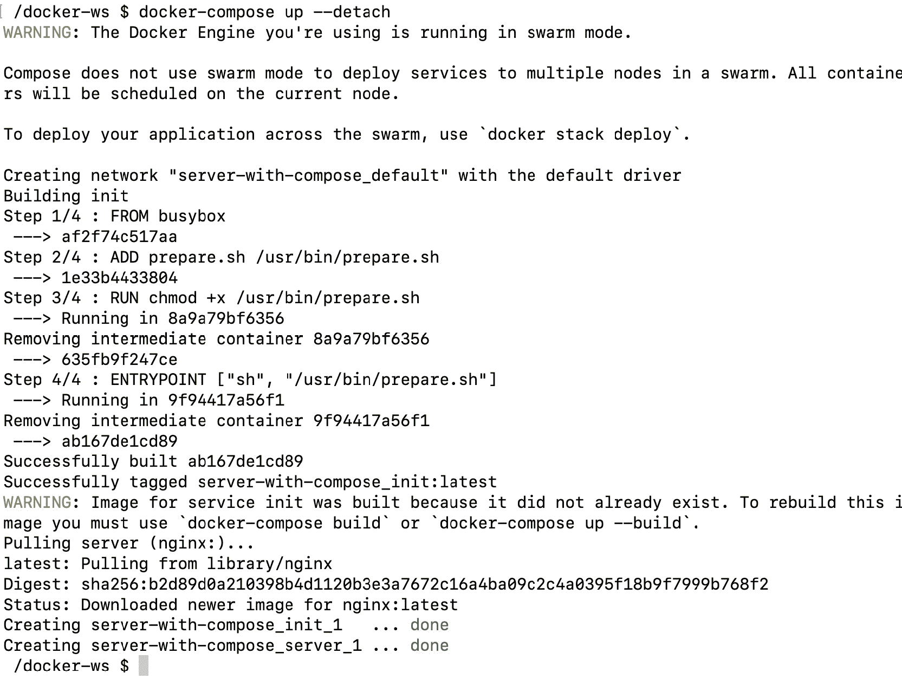

    图 5.7:启动应用

    上述命令在`detached`模式下创建并启动容器。它从创建`server-with-compose_default`网络和`server-with-compose_static`卷开始。然后，它从*步骤 4* 使用`Dockerfile`构建`init`容器，为服务器下载`nginx` Docker 映像，并启动容器。最后，它打印容器的名称，并使它们在后台运行。

    注意

    您可以忽略关于 Swarm 模式的警告，因为我们希望将所有容器部署到同一个节点。

7.  Check the status of the application with the `docker-compose ps` command:

    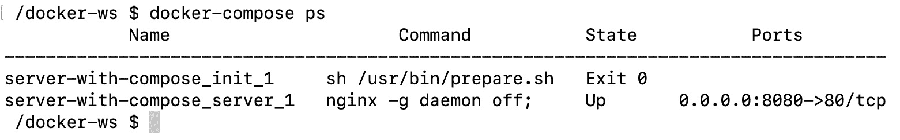

    图 5.8:应用状态

    该输出列出了两个容器。`init`容器成功退出，代码为`0`，而`server`容器为`Up`，其港口可用。这是预期的输出，因为`init`容器被设计为准备`index.html`文件并完成其操作，而`server`容器应该总是启动并运行。

8.  Open `http://localhost:8080` in the browser. The following figure shows the output:

    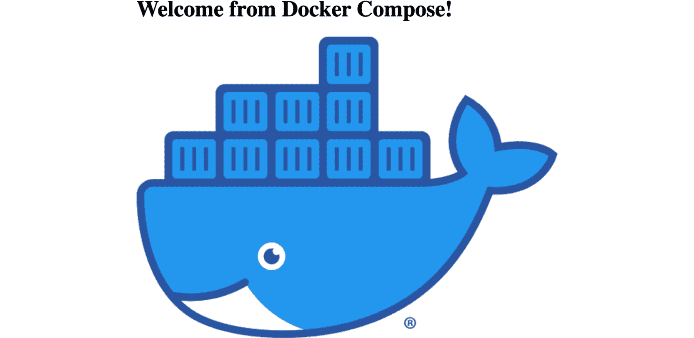

    图 5.9:服务器输出

    *图 5.9* 显示了`init`容器创建的`index.html`页面。换句话说，这表明`docker-compose`创建了该卷，将其安装到容器上，并成功启动它们。

9.  Stop and remove all the resources with the following command if you do not need the application up and running:

    ```
    docker-compose down
    ```

    该命令将返回如下输出:

    

图 5.10:停止应用

在本练习中，多容器应用由`docker-compose`创建和配置。网络和卷选项存储在`docker-compose.yaml`文件中。此外，CLI 命令还显示了创建应用、检查状态和删除应用的操作。

在下一节中，将介绍 Docker Compose 环境中应用的配置选项。

# 服务的配置

云原生应用应该将其配置存储在环境变量中。环境变量很容易在不同的平台之间改变，而无需改变源代码。环境变量是存储在基于 Linux 的系统中并由应用使用的动态值。换句话说，变量可以通过改变它们的值来配置应用。

例如，假设您的应用使用一个`LOG_LEVEL`环境变量来配置记录的内容。如果您将`LOG_LEVEL`环境变量从`INFO`更改为`DEBUG`并重新启动应用，您将看到更多的日志，并且能够更轻松地排除问题。此外，您可以将具有不同环境变量集的同一应用部署到试运行、测试和生产中。同样，在 Docker Compose 中配置服务的方法是为容器设置环境变量。

在 Docker Compose 中有三种定义环境变量的方法，优先级如下:

1.  使用合成文件
2.  使用外壳环境变量
3.  使用环境文件

如果环境变量变化不是很频繁，但是容器需要，最好将它们存储在`docker-compose.yaml`文件中。如果有敏感的环境变量，比如密码，建议在调用`docker-compose` CLI 之前通过 shell 环境变量传递。但是，如果变量的数量很大，并且在测试、试运行或生产系统之间存在差异，则更容易将它们收集到`.env`文件中，并将其传递到`docker-compose.yaml`文件中。

在`docker-compose.yaml`文件的`services`部分，可以为每个服务定义环境变量。例如，`server`服务的`LOG_LEVEL`和`METRICS_PORT`环境变量在 Docker Compose 文件中设置如下:

```
server:
  environment:
    - LOG_LEVEL=DEBUG
    - METRICS_PORT=8444
```

当`docker-compose.yaml`文件中没有为环境变量设置值时，可以通过运行`docker-compose`命令从外壳中获取值。例如，`server`服务的`HOSTNAME`环境变量将直接从 shell 中设置:

```
server:
  environment:
    - HOSTNAME
```

当运行`docker-compose`命令的外壳没有`HOSTNAME`环境变量的值时，容器将以一个空的环境变量开始。

此外，还可以将环境变量存储在`.env`文件中，并在`docker-compose.yaml`文件中进行配置。一个示例`database.env`文件可以用如下键值列表来构造:

```
DATABASE_ADDRESS=mysql://mysql:3535
DATABASE_NAME=db
```

在`docker-compose.yaml`文件中，环境变量文件字段在相应的服务下配置如下:

```
server:
  env_file:
    - database.env
```

当 Docker Compose 创建`server`服务时，它会将`database.env`文件中列出的所有环境变量设置到容器中。

在下面的练习中，您将使用 Docker Compose 中的所有三种配置方法来配置应用。

## 练习 5.02:使用 Docker 编写配置服务

Docker Compose 中的服务由环境变量配置。在本练习中，您将创建一个 Docker Compose 应用，该应用通过设置变量的不同方法进行配置。在名为`print.env`的文件中，您将定义两个环境变量。此外，您将在`docker-compose.yaml`文件中创建和配置一个环境变量，并从终端动态传递一个环境变量。您将看到来自不同来源的四个环境变量如何在您的容器中聚集在一起。

要完成练习，请执行以下步骤:

1.  创建一个名为`server-with-configuration`的文件夹，并使用`cd`命令导航到该文件夹:

    ```
    mkdir server-with-configuration
    cd server-with-configuration
    ```

2.  Create an `.env` file with the name `print.env` and the following content:

    ```
    ENV_FROM_ENV_FILE_1=HELLO
    ENV_FROM_ENV_FILE_2=WORLD
    ```

    在这个文件中，两个环境变量`ENV_FROM_ENV_FILE_1`和`ENV_FROM_ENV_FILE_2`是用它们的值定义的。

3.  Create a file with the name `docker-compose.yaml` and the following content:

    ```
    version: "3"
    services:
      print:
        image: busybox
        command: sh -c 'sleep 5 && env'
        env_file:
        - print.env
        environment:
        - ENV_FROM_COMPOSE_FILE=HELLO
        - ENV_FROM_SHELL
    ```

    在这个文件中，定义了一个单容器应用，容器运行`env`命令打印环境变量。它还使用名为`print.env`的环境文件，以及另外两个环境变量`ENV_FROM_COMPOSE_FILE`和`ENV_FROM_SHELL`。

4.  使用以下命令将`ENV_FROM_SHELL`导出到外壳:

    ```
    export ENV_FROM_SHELL=WORLD
    ```

5.  Start the application with the `docker-compose up` command. The output should look like the following:

    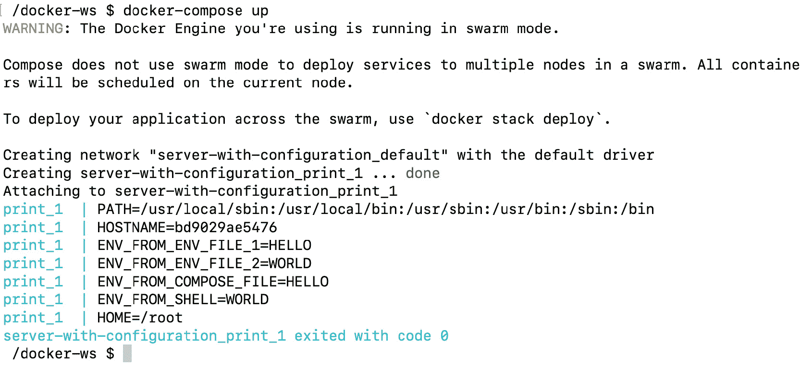

图 5.11:启动应用

输出是在`docker-compose`文件中定义的`print`容器的结果。该容器有一个命令要运行，`env`，它打印可用的环境变量。不出所料，有两个环境变量`ENV_FROM_ENV_FILE_1`和`ENV_FROM_ENV_FILE_2`，对应的数值为`HELLO`和`WORLD`。此外，在*步骤 3* 中的`docker-compose.yaml`文件中定义的环境变量可用名称`ENV_FROM_COMPOSE_FILE`和值`HELLO`。最后，在*步骤 4* 中导出的环境变量可以使用名称`ENV_FROM_SHELL`和值`WORLD`。

在本练习中，创建了一个 Docker Compose 应用，并用不同的方法进行了配置。使用 Docker Compose 文件，可以使用环境定义文件和导出的值将同一个应用部署到不同的平台。

由于 Docker Compose 管理多容器应用，因此需要定义它们之间的相互依赖关系。Docker Compose 应用中容器的相互依赖关系将在下一节中介绍。

# 服务依赖

Docker Compose 运行和管理在`docker-compose.yaml`文件中定义的多容器应用。尽管容器被设计为独立的微服务，但是创建相互依赖的服务是非常值得期待的。例如，假设您有一个包含数据库和后端组件的两层应用，例如 PostgreSQL 数据库和 Java 后端。Java 后端组件要求 PostgreSQL 启动并运行，因为它应该连接到数据库来运行业务逻辑。因此，您可能需要定义多容器应用的服务之间的依赖关系。使用 Docker Compose，可以控制服务的启动和关闭顺序。

假设您有一个三容器应用，包含以下`docker-compose.yaml`文件:

```
version: "3"
services:
  init:
    image: busybox
  pre:
    image: busybox
    depends_on:
    - "init"
  main:
    image: busybox
    depends_on:
    - "pre"
```

在这个文件中，`main`容器依赖于`pre`容器，而`pre`容器依赖于`init`容器。Docker Compose 按照`init`、`pre`和`main`的顺序启动容器，如图 5.12 所示。此外，容器将以相反的顺序停止:`main`、`pre`，然后`init`:


图 5.12:服务启动顺序

在下面的练习中，容器的顺序将用于填充文件的内容，然后将其提供给 web 服务器。

## 练习 5.03:Docker 编写的服务依赖关系

Docker Compose 中的服务可以配置为依赖于其他服务。在本练习中，您将创建一个包含四个容器的应用。前三个容器将连续运行，以创建一个由第四个容器提供服务的静态文件。

要完成练习，请执行以下步骤:

1.  创建一个名为`server-with-dependency`的文件夹，并使用`cd`命令导航到该文件夹:

    ```
    mkdir server-with-dependency
    cd server-with-dependency
    ```

2.  Create a file with the name `docker-compose.yaml` and the following content:

    ```
    version: "3"
    services:
      clean:
        image: busybox
        command: "rm -rf /static/index.html"
        volumes:
          - static:/static 
      init:
        image: busybox
        command: "sh -c 'echo This is from init container >>       /static/index.html'"
        volumes:
          - static:/static 
        depends_on:
        - "clean"
      pre:
        image: busybox
        command: "sh -c 'echo This is from pre container >>       /static/index.html'"
        volumes:
          - static:/static 
        depends_on:
        - "init"
      server:
        image: nginx
        volumes:
          - static:/usr/share/nginx/html  
        ports:
          - "8080:80"
        depends_on:
        - "pre"
    volumes:
      static:
    ```

    该文件由四个服务和一个卷组成。该卷名为`static`，它被安装到所有服务中。前三个服务对静态卷采取单独的操作。`clean`容器取出`index.html`文件，然后`init`容器开始填充`index.html`。接下来，`pre`容器向`index.html`文件写入一行。最后，`server`容器提供`static`文件夹中的内容。

3.  Start the application with the `docker-compose up` command. The output should look like the following:

    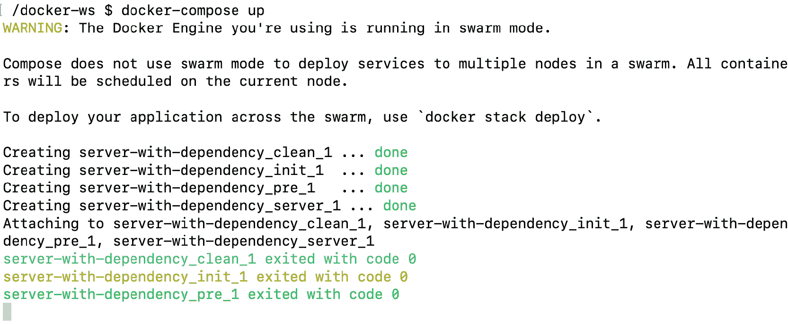

    图 5.13:启动应用

    输出显示 Docker Compose 按照`clean`、`init`和`pre`的顺序创建容器。

4.  Open `http://localhost:8080` in the browser:

    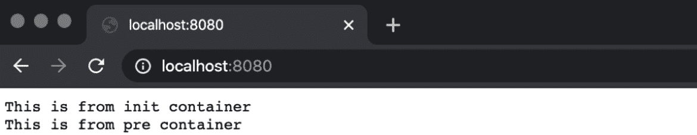

    图 5.14:服务器输出

    服务器的输出显示`clean`、`init`和`pre`容器按照预期的顺序工作。

5.  Return to the Terminal in *step 3* and use *Ctrl* + *C* to close the application gracefully. You will see some HTTP request logs and, in the end, the `Stopping server-with-dependency_server_1` line:

    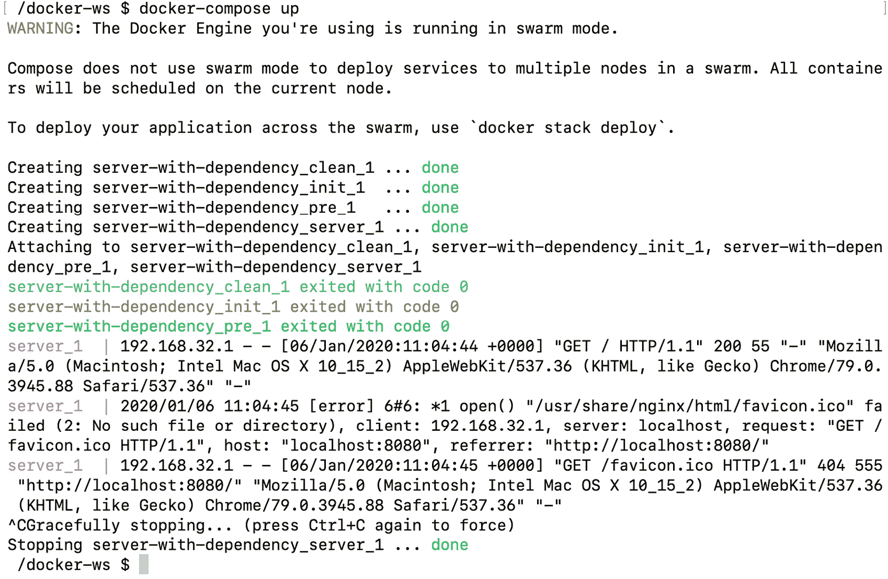

图 5.15:停止应用

在本练习中，使用相互依赖的服务创建了一个 Docker Compose 应用。显示了 Docker Compose 如何以定义的顺序启动和管理容器。这是 Docker Compose 的一个基本特性，使用它可以创建复杂的多容器应用。

现在，让我们通过实施以下活动来测试我们在本章中已经获得的知识。在下一个活动中，您将学习如何使用 Docker Compose 安装 WordPress。

## 活动 5.01:使用 Docker 编写安装 WordPress

您被指派设计和部署一个博客，其数据库作为 Docker 中的微服务。您将使用 **WordPress** ，因为它是最受欢迎的**内容管理系统** ( **CMS** )，互联网上超过三分之一的网站都使用它。此外，开发和测试团队需要在不同的平台上隔离多次安装 WordPress 和数据库。因此，您需要将其设计为 Docker Compose 应用，并使用`docker-compose` CLI 进行管理。

执行以下步骤完成本活动:

1.  首先为你的`docker-compose.yaml`文件创建一个目录。
2.  使用 MySQL 和在`docker-compose.yaml`文件中定义的卷为数据库创建一个服务。确保设置了`MYSQL_ROOT_PASSWORD`、`MYSQL_DATABASE`、`MYSQL_USER`和`MYSQL_PASSWORD`环境变量。
3.  为在`docker-compose.yaml`文件中定义的 WordPress 创建一个服务。确保 WordPress 容器在数据库之后启动。对于 WordPress 的配置，不要忘记按照*步骤 2* 设置`WORDPRESS_DB_HOST`、`WORDPRESS_DB_USER`、`WORDPRESS_DB_PASSWORD`和`WORDPRESS_DB_NAME`环境变量。此外，您需要发布它的端口，以便能够从浏览器访问它。
4.  Start the Docker Compose application in `detached` mode. Upon successful deployment, you will have two containers running:

    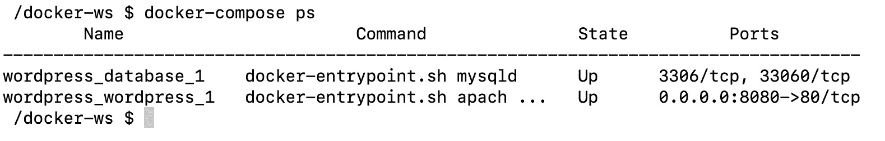

图 5.16: WordPress 和数据库容器

然后，您将能够在浏览器中到达 WordPress 的设置屏幕:

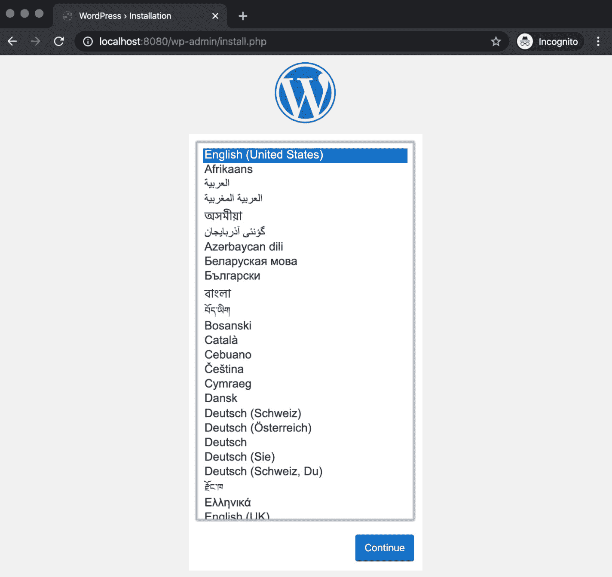

图 5.17: WordPress 设置屏幕

注意

此活动的解决方案可以通过[这个链接](16.html#_idTextAnchor328)找到。

在下一个活动中，您将通过创建一个三容器 Docker 应用并使用`docker-compose` CLI 进行管理，获得使用 Docker Compose 安装全景徒步应用的实践经验。

## 活动 5.02:使用 Docker Compose 记录全景徒步旅行应用

您的任务是使用 Docker Compose 创建全景徒步旅行应用的部署。您将利用全景徒步应用的三层架构，创建一个三容器 Docker 应用，其中包含数据库、网络后端和`nginx`容器。因此，您将把它设计为 Docker Compose 应用，并使用`docker-compose` CLI 进行管理。

执行以下步骤完成本活动:

1.  为你的`docker-compose.yaml`文件创建一个目录。
2.  使用 PostgreSQL 和在`docker-compose.yaml`文件中定义的卷为数据库创建服务。确保`POSTGRES_PASSWORD`环境变量设置为`docker`。此外，您需要在`docker-compose.yaml`中创建一个`db_data`卷，并将其装载到`/var/lib/postgresql/data/`中以存储数据库文件。
3.  Create a service for the Panoramic Trekking App defined in the `docker-compose.yaml` file. Ensure that you are using the `packtworkshops/the-docker-workshop:chapter5-pta-web` Docker image, which is prebuilt and ready to use from the registry. In addition, since the application is dependent on the database, you should configure the container to start after the database. To store the static files, create a `static_data` volume in `docker-compose.yaml` and mount it to `/service/static/`.

    最后，为`nginx`创建一个服务，并确保您正在使用注册表中的`packtworkshops/the-docker-workshop:chapter5-pta-nginx` Docker 映像。确保`nginx`容器在全景徒步应用容器之后启动。您还需要将相同的`static_data`卷安装到`/service/static/`位置。别忘了发布`nginx`端口`80`到`8000`从浏览器到达。

4.  Start the Docker Compose application in `detached` mode. Upon successful deployment, you will have three containers running:

    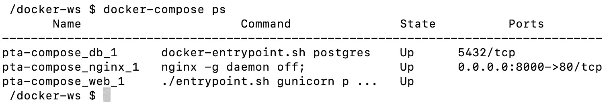

    图 5.18:应用、数据库和 nginx 容器

5.  Go to the administration section of the Panoramic Trekking App in the browser with the address `http://0.0.0.0:8000/admin`:

    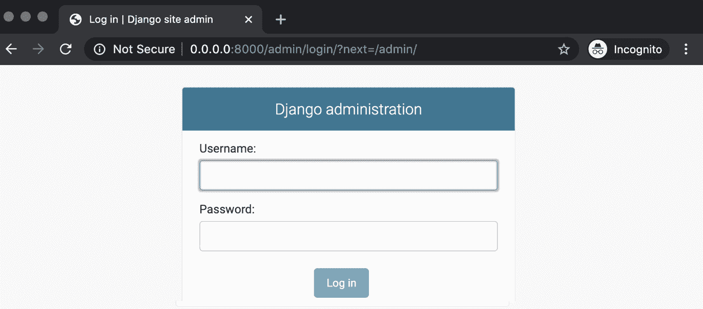

    图 5.19:管理员设置登录

    您可以使用用户名`admin`和密码`changeme`登录，并添加新的照片和国家:

    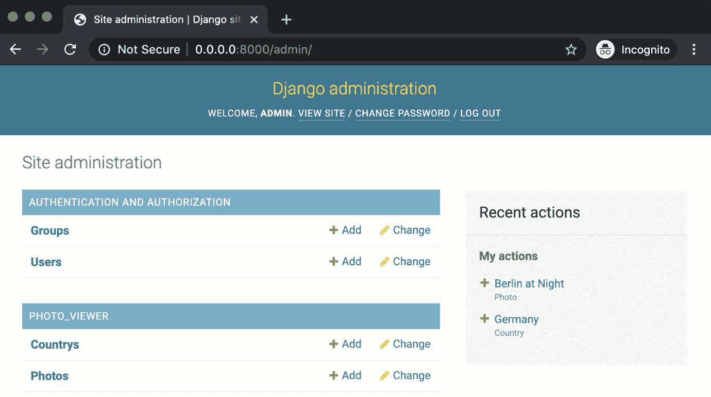

    图 5.20:管理设置视图

6.  Access the Panoramic Trekking App at the address `http://0.0.0.0:8000/photo_viewer` in the browser:

    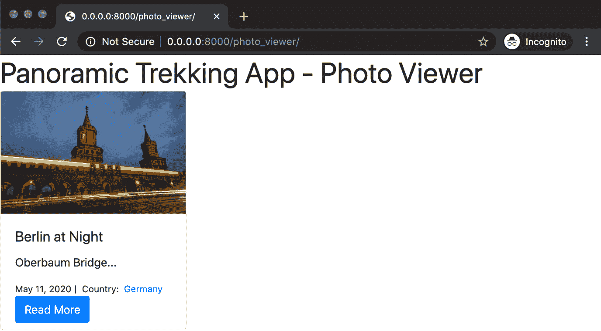

图 5.21:应用视图

注意

此活动的解决方案可以通过[这个链接](16.html#_idTextAnchor329)找到。

# 总结

本章重点介绍如何使用 Docker Compose 来设计、创建和管理多容器应用。随着微服务架构的兴起，容器化应用的复杂性增加了。因此，如果没有适当的工具，创建、管理和排除多容器应用的故障就变得很困难。Docker Compose 是 Docker 工具箱中用于此目的的官方工具。

本章主要重点是全面学习`docker-compose`。为此，本章从`docker-compose`命令行界面的功能及其命令和标志开始。然后，`docker-compose.yaml`的解剖档案被呈现出来。Docker Compose 的功能实际上来自于`docker-compose.yaml`文件中定义的配置功能。因此，学习如何使用这些文件来管理多容器应用是至关重要的。

随后，说明了 Docker Compose 中的服务配置。您已经学习了如何为不同的环境配置服务并适应未来的变化。然后，我们转向服务依赖关系，学习如何创建更复杂的容器化应用。

本章中的每个练习都旨在展示 Docker 的功能，包括不同的 CLI 命令和 YAML 文件部分。获得命令行界面的实践经验以及创建用于测试和生产环境的多容器应用所需的文件是至关重要的。

在下一章中，您将在 Docker 中了解网络。容器化和可扩展应用中的网络是基础架构的关键部分之一，因为它将分布式部分粘合在一起。这就是为什么 Docker 中的网络由可插入的驱动程序和选项组成，以增强容器化的应用开发和管理体验。