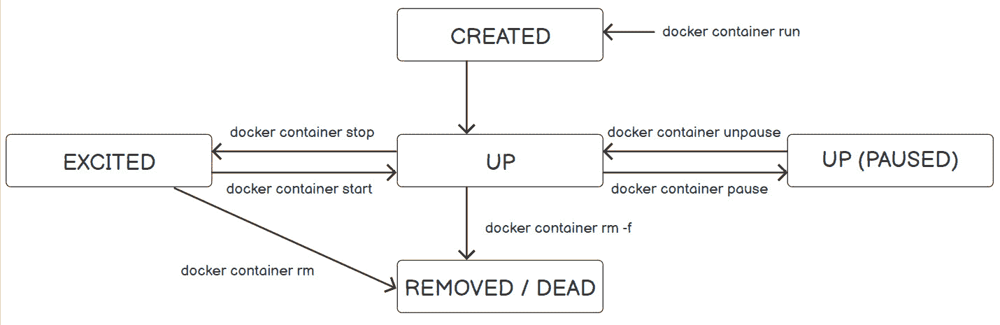
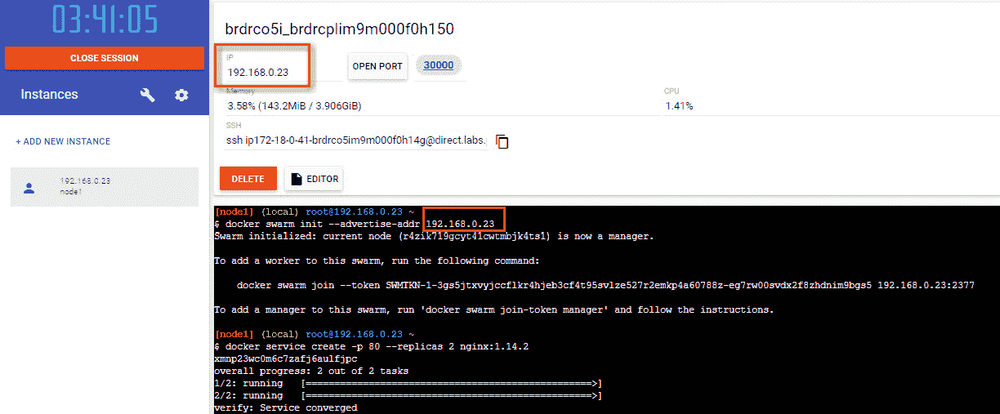
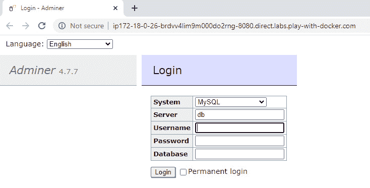
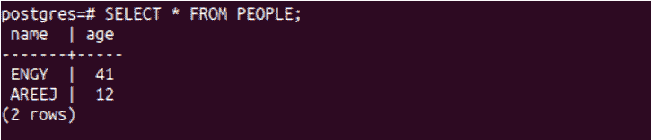
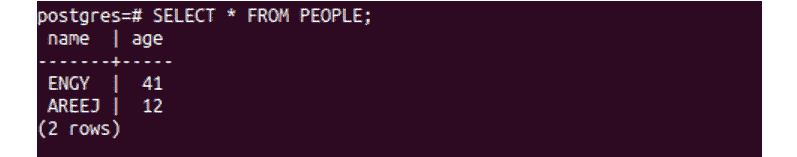
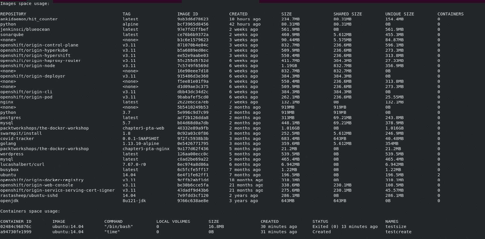
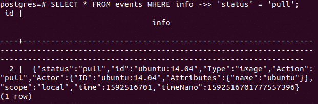
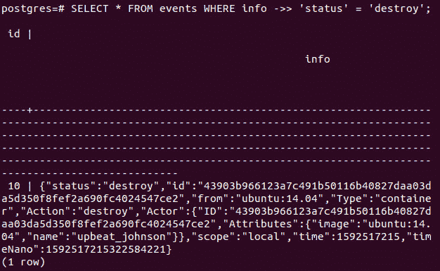
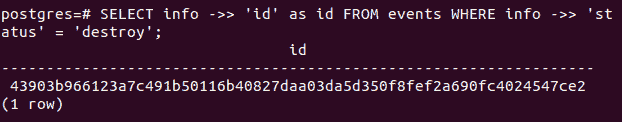

# 七、Docker仓库

概观

在本章中，您将学习 Docker 如何管理数据。知道将数据存储在哪里以及您的服务将如何访问数据是至关重要的。本章将探讨运行无状态和有状态 Docker 容器，并将深入研究不同应用的存储配置设置选项。到本章结束时，您将能够区分 Docker 中的不同存储类型，并识别容器的生命周期及其各种状态。您还将学习如何创建和管理 Docker 卷。

# 简介

在前几章中，您学习了如何从映像运行容器以及如何配置其网络。您还了解到，在从映像制作容器时，您可以传递各种 Docker 命令。在本章中，您将学习如何在创建容器后控制它们。

假设您被指派为电子商店构建一个 web 应用。您将需要一个数据库来存储产品目录、客户信息和购买交易。要存储这些详细信息，您需要配置应用的存储设置。

Docker 中有两种类型的数据存储。第一个是与容器生命周期紧密耦合的存储。如果容器被移除，该存储类型上的文件也将被移除，并且无法检索。这些文件存储在容器内部的精简读/写层中。这种类型的存储也称为其他术语，例如本地存储、`graphdriver`存储和存储驱动程序。本章的第一节重点介绍这种类型的存储。这些文件可以是任何类型的，例如，Docker 在基本映像上安装新图层后创建的文件。

本章的第二部分探讨无状态和有状态服务。有状态的应用是需要持久存储的应用，例如持久存储并且比容器更持久的数据库。在有状态服务中，即使容器被移除，数据仍然可以被访问。

容器以两种方式在主机上存储数据:通过卷和绑定装载。不建议使用绑定装载，因为绑定装载会将主机上的现有文件或目录绑定到容器内的路径。这种绑定通过使用主机上的完整或相对路径增加了引用负担。但是，当您使用卷时，会在主机上 Docker 的存储目录中创建一个新目录，Docker 会管理该目录的内容。我们将在本章的第三部分集中讨论如何使用卷。

在 Docker 中探索不同类型的存储之前，让我们先来探索一下容器的生命周期。

# 容器生命周期

容器是由它们的基本映像制作的。该容器通过在映像层栈的顶部创建一个薄读/写层来继承映像的文件系统。基本映像保持不变，不会对其进行任何更改。您的所有更改都发生在容器的顶层。比如说你创建一个`ubuntu: 14.08`的容器。此映像中没有`wget`包。当你安装`wget`软件包时，你实际上是把它安装在顶层。所以，你有一个基础映像层，在它上面，还有一个`wget`层。

如果你也安装`Apache`服务器，它将是前两层之上的第三层。要保存所有更改，您需要将所有这些更改提交到一个新的映像，因为您不能覆盖基本映像。如果不将更改提交到新映像，这些更改将随着容器的移除而被删除。

容器在其生命周期中会经历许多其他状态，因此查看容器在其生命周期中可能具有的所有状态非常重要。因此，让我们深入了解不同的容器状态:



图 7.1:容器生命周期

容器经历的不同阶段如下:

*   使用`docker container run`子命令，容器进入`CREATED`状态，如图*图 7.1* 所示。
*   在每个容器内部，都有一个主进程在运行。当该过程开始运行时，容器的状态变为`UP`状态。
*   使用`docker container pause`子命令，容器的状态变为`UP(PAUSED)`。容器冻结或暂停，但仍处于`UP`状态，且未停止或移除。
*   要继续运行容器，请使用`docker container unpause`子命令。在这里，容器的状态将再次变为`UP`状态。
*   使用`docker container stop`子命令停止容器，但不将其移除。容器的状态变为`EXITED`状态。
*   如果执行`docker container kill`或`docker container stop`子命令，容器将退出。要杀死容器，使用`docker container kill`子命令。容器状态变为`EXITED`。但是，要退出容器，应该使用`docker container stop`子命令，而不是`docker container kill`子命令。不要杀死你的容器；一定要删除它们，因为删除容器会触发容器的宽限关闭，例如，给时间将数据保存到数据库，这是一个较慢的过程。但是，killing 不会这样做，可能会导致数据不一致。
*   停止或终止容器后，也可以继续运行容器。要启动容器并将其返回到`UP`状态，请使用`docker container start`或`docker container start -a`子命令。`docker container start -a`等于跑`docker container start`再跑`docker container attach`。不能将本地标准输入、输出和错误流附加到已退出的容器；容器必须首先处于`UP`状态，以附加本地标准输入、输出和错误流。
*   要重新启动容器，请使用`docker container restart`子命令。重启子命令的作用类似于执行`docker container stop`后跟`docker container start`。
*   Stopping or killing the container does not remove the container from the system. To remove the container entirely, use the `docker container rm` subcommand.

    注意

    您可以将几个 Docker 命令相互连接起来，例如`docker container rm -f $(docker container ls -aq)`。您想首先执行的那个应该包含在括号中。

    在这种情况下，`docker container ls -aq`告诉 Docker 在安静模式下列出所有容器，甚至是退出的容器。`-a`选项表示显示所有容器，无论它们的状态如何。`-q`选项用于安静模式，这意味着只显示数字标识，而不是所有容器的详细信息。该命令`docker container ls -aq`的输出将是`docker container rm -f`命令的输入。

理解 Docker 容器生命周期事件为为什么一些应用可能需要或可能不需要持久存储提供了一个很好的背景。在进入 Docker 中呈现的不同存储类型之前，让我们执行前面提到的命令，并在下面的练习中探索不同的容器状态。

注意

请使用`touch`命令创建文件，使用`vim`命令使用 vim 编辑器处理文件。

## 练习 7.01:通过 Docker 容器的公共状态进行转换

ping www.google.com 是验证服务器或集群节点是否连接到互联网的常见做法。在本练习中，您将遍历 Docker 容器的所有状态，同时检查服务器或集群的节点是否连接到互联网。

在本练习中，您将使用两个终端。一个终端将用于运行一个容器来 ping www.google.com，另一个终端将用于通过执行前面提到的命令来控制这个正在运行的容器。

要 ping www.google.com，您将根据`ubuntu:14.04`映像制作一个名为`testevents`的容器:

1.  Open the first terminal and execute the `docker container run` command to run a container. Use the `--name` option to give the container a specific nickname—for example, `testevents`. Don't let the Docker host generate a random name for your container. Use the `ubuntu:14.04` image and the `ping google.com` command to verify that the server is running on the container:

    ```
    $docker container run --name testevents ubuntu:14.04 ping google.com
    ```

    输出如下:

    ```
    PING google.com (172.217.165.142) 56(84) bytes of data.
    64 bytes from lax30s03-in-f14.1e100.net (172.217.165.142):
    icmp_seq=1 ttl=115 time=68.9 ms
    64 bytes from lax30s03-in-f14.1e100.net (172.217.165.142):
    icmp_seq=2 ttl=115 time=349 ms
    64 bytes from lax30s03-in-f14.1e100.net (172.217.165.142):
    icmp_seq=3 ttl=115 time=170 ms
    ```

    正如您在前面的输出中看到的，ping 已经开始。你会发现数据包正在传输到`google.com`。

2.  Dedicate the first terminal to the pinging output. Now, control this container by executing the commands in another terminal. In the second terminal, execute `docker container ls` to list all the running containers:

    ```
    $docker container ls
    ```

    寻找名为`testevents`的容器。状态应为`Up`:

    ```
    CONTAINER ID    IMAGE           COMMAND            CREATED
       STATUS           PORTS          NAMES
    10e235033813     ubuntu:14.04   "ping google.com"  10 seconds ago
       Up 5 seconds                    testevents
    ```

3.  Now, run the `docker container pause` command in the second terminal to pause the running container in the first terminal:

    ```
    $docker container pause testevents
    ```

    您将看到 being 已经停止，不再传输任何数据包。

4.  List the running containers again by using `docker container ls` in the second terminal:

    ```
    $docker container ls
    ```

    如下图所示，`testevents`的状态为`Up(Paused)`。这是因为你先前运行了`docker container pause`命令:

    ```
    CONTAINER ID    IMAGE         COMMAND            CREATED
       STATUS            PORTS          NAMES
    10e235033813    ubuntu:14.04  "ping google.com"  26 seconds ago
       Up 20 seconds (Paused)           testevents
    ```

5.  Use `docker container unpause` in the second terminal to start the paused container and make it resume sending packets:

    ```
    $docker container unpause testevents
    ```

    您会发现 ping 会恢复，新数据包会在第一个终端中传输。

6.  In the second terminal, run the `docker container ls` command again to see the container's current status:

    ```
    $docker container ls
    ```

    您会看到`testevents`容器的状态为`Up`:

    ```
    CONTAINER ID    IMAGE         COMMAND            CREATED
       STATUS            PORTS          NAMES
    10e235033813    ubuntu:14.04  "ping google.com"  43 seconds ago
       Up 37 seconds                    testevents
    ```

7.  Now, run the `docker container stop` command to stop the container:

    ```
    $docker container stop testevents
    ```

    您将看到容器在第一个终端退出，shell 提示符返回:

    ```
    64 bytes from lax30s03-in-f14.1e100.net (142.250.64.110):
    icmp_seq = 42 ttl=115 time=19.8 ms
    64 bytes from lax30s03-in-f14.1e100.net (142.250.64.110):
    icmp_seq = 43 ttl=115 time=18.7 ms
    ```

8.  Now, run the `docker container ls` command in any terminal:

    ```
    $docker container ls
    ```

    您将看到`testevents`容器不再在列表中，因为`docker container ls`子命令仅显示正在运行的容器:

    ```
    CONTAINER ID      IMAGE      COMMAND     CREATED
            STATUS         PORTS                   NAMES
    ```

9.  Run the `docker container ls -a` command to display all the containers:

    ```
    $docker container ls -a
    ```

    可以看到`testevents`容器现在的状态是`Exited`:

    ```
    CONTAINER ID    IMAGE         COMMAND            CREATED
       STATUS            PORTS          NAMES
    10e235033813    ubuntu:14.04  "ping google.com"  1 minute ago
       Exited (137) 13 seconds ago      testevents
    ```

10.  Use the `docker container start` command to start the container. Also, add the `-a` option to attach local standard input, output, and error streams to the container and see its output:

    ```
    $docker container start -a testevents
    ```

    正如您在下面的代码片段中看到的，ping 会继续，并在第一个终端中执行:

    ```
    64 bytes from lax30s03-in-f14.1e100.net (142.250.64.110):
    icmp_seq = 55 ttl=115 time=63.5 ms
    64 bytes from lax30s03-in-f14.1e100.net (142.250.64.110):
    icmp_seq = 56 ttl=115 time=22.2 ms
    ```

11.  Run the `docker ls` command again in the second terminal:

    ```
    $docker container ls
    ```

    你会观察到`testevents`返回列表，状态为`Up`，正在运行:

    ```
    CONTAINER ID    IMAGE         COMMAND            CREATED
       STATUS            PORTS          NAMES
    10e235033813    ubuntu:14.04  "ping google.com"  43 seconds ago
       Up 37 seconds                    testevents
    ```

12.  Now, remove the `testevents` container using the `rm` command with the `-f` option. The `-f` option is used to force-remove the container:

    ```
    $docker container rm -f testevents
    ```

    第一个终端停止执行`ping`命令，第二个终端返回容器名称:

    ```
    testevents
    ```

13.  Run the `ls -a` command to check whether the container is running or not:

    ```
    $docker container ls -a
    ```

    你不会在列表中找到`testevents`容器，因为我们刚刚从系统中删除了它。

    现在，除了`CREATED`，你已经看到了容器的所有各种状态。这是典型的，因为你通常看不到`CREATED`状态。在每个容器中，都有一个主进程，其**进程标识(PID)** 为 0，**父进程标识(PPID)** 为 1。该进程在容器外有不同的标识。当此进程被终止或移除时，容器也会被终止或移除。通常，当主进程运行时，容器的状态从`CREATED`变为`UP`，这表明容器已经成功创建。如果主进程失败，容器状态不会从`CREATED`改变，这就是你要设置的:

14.  Run the following command to see the `CREATED` status. Craft a container named `testcreate` from the `ubuntu:14.04` image using the `docker container run` command:

    ```
    $docker container run --name testcreate ubuntu:14.04 time
    ```

    `time`命令会产生错误，因为`ubuntu:14.04`里面没有这样的命令。

15.  Now, list the running containers:

    ```
    $docker container ls
    ```

    您会看到列表是空的:

    ```
    CONTAINER ID    IMAGE         COMMAND            CREATED
       STATUS            PORTS          NAMES
    ```

16.  Now, list all the containers by adding the `-a` option:

    ```
    $docker container ls -a
    ```

    在列表中查找名为`testcreate`的容器；你会观察到它的状态是`Created`:

    ```
    CONTAINER ID    IMAGE         COMMAND         CREATED
       STATUS            PORTS          NAMES
    C262e6718724    ubuntu:14.04  "time"          30 seconds ago
       Created                          testcreate
    ```

    如果容器卡在`CREATED`状态，这表明已经产生错误，Docker 无法启动容器并运行。

在本练习中，您探索了容器生命周期及其不同状态。您还学习了如何使用`docker container start -a <container name or ID>`命令从附件开始，以及如何使用`docker container rm <container name or ID>`停止容器。最后，我们讨论了如何使用`docker container rm -f <container name or ID>`强制移除正在运行的容器。然后，我们看到了`CREATED`的罕见情况，只有当命令产生错误，容器无法启动时才会显示。

到目前为止，我们关注的是容器的状态，而不是它的大小。在下一个练习中，我们将学习如何确定容器占用的内存大小。

## 练习 7.02:检查磁盘上的容器大小

当您第一次制作一个容器时，它的大小与带有顶部读/写层的基础映像相同。随着添加到容器中的每一层，其大小都会增加。在本练习中，您将创建一个以`ubuntu:14.04`为基础映像的容器。更新并在其顶部安装`wget`，以突出状态转换对数据保留的影响:

1.  Run the `docker container run` command with the `-it` option to create a container named `testsize`. The `-it` option is used to have an interactive terminal to run commands inside the running container:

    ```
    $docker container run -it --name testsize ubuntu:14.04
    ```

    该提示现在看起来像`root@<container ID>:/#`，其中容器标识是 Docker 引擎生成的一个数字。因此，当您在机器上运行此命令时，您将有一个不同的数字。如前所述，在容器内意味着容器将处于`UP`状态。

2.  Dedicate the first terminal to the running container and execute the commands in the second terminal. Having two terminals saves us from detaching the container to run a command and then reattaching to the container to run another command inside it.

    现在，验证容器最初具有基础映像的大小，即`ubuntu:14.04`。使用第二个终端中的`docker image ls`命令列出映像。检查`ubuntu:14.04`映像的大小:

    ```
    $docker image ls
    ```

    在下面的输出中可以看到，映像的大小为`188MB`:

    ```
    REPOSITORY     TAG      IMAGE ID         CREATED
      SIZE
    ubuntu         14.04    971bb3841501     23 months ago
      188MB
    ```

3.  Now, check the size of the container by running the `docker container ls -s` command to get the container's size:

    ```
    $docker container ls -s
    ```

    寻找`testsize`容器。你会发现尺寸是`0B (virtual 188MB)`:

    ```
    CONTAINER ID    IMAGE          COMMAND      CREATED
      STATUS     PORTS    NAMES      SIZE
    9f2d2d1ee3e0    ubuntu:14.04   "/bin/bash"  6 seconds ago
      Up 6 minutes        testsize   0B (virtual 188MB)
    ```

    `SIZE`列仅指示容器的薄读/写层的大小，而虚拟大小指示薄读/写层和封装在容器中的所有先前层的大小。因此，在这种情况下，薄层等于`0B`，虚拟尺寸等于映像尺寸。

4.  现在，安装`wget`包。在第一个终端运行`apt-get update`命令。在 Linux 中，一般的建议是在安装任何软件包之前运行`apt-get update`，以更新您系统中当前软件包的最新版本:

    ```
    root@9f2d2d1ee3e0: apt-get update
    ```

5.  当容器完成更新时，运行以下命令，在基础映像上安装`wget`包。`-y`选项用于自动回答所有安装问题:

    ```
    root@9f2d2d1ee3e: apt-get install -y wget
    ```

6.  When it finishes installing `wget` on top of `ubuntu:14.04`, recheck the container's size by running the `ls -s` command in the second terminal:

    ```
    $docker container ls -s
    ```

    从下面的片段可以看到，`testsize`容器的大小为`27.8 MB (virtual 216 MB)`:

    ```
    CONTAINER ID    IMAGE          COMMAND      CREATED
      STATUS     PORTS    NAMES      SIZE
    9f2d2d1ee3e0    ubuntu:14.04   "/bin/bash"  9 seconds ago
      Up 9 minutes        testsize   27.8MB (virtual 216MB)
    ```

    现在，薄层等于`27.8MB`，虚拟尺寸等于所有层的尺寸。在本练习中，图层是基础映像，大小为 188 MB 更新；和尺寸为 27.8 兆字节的`wget`层。因此，近似后的总大小将为 216 MB。

在本练习中，您学习了与`docker container ls`子命令一起使用的`-s`选项的功能。此选项用于显示基础映像的大小和顶部可写层的大小。了解每个容器消耗的大小对于避免磁盘空间不足异常非常有用。此外，它可以帮助我们排除故障并为每个容器设置最大尺寸。

注意

Docker 使用存储驱动程序写入可写层。存储驱动程序因您使用的操作系统而异。要查找存储驱动程序的更新列表，请查看 https://docs . docker . com/storage/storage driver/select-storage-driver/。

要了解您的操作系统使用的驱动程序，请运行`$docker info`命令。

了解 Docker 容器生命周期事件为研究为什么一些应用可能需要或可能不需要持久存储提供了一个很好的背景，并概述了在显式移除容器之前 Docker 的默认主机存储区域(文件系统位置)。

现在，让我们深入研究有状态和无状态模式，以决定哪个容器需要持久存储。

# 有状态与无状态容器/服务

容器和服务可以以两种模式运行:**有状态**和**无状态**。无状态服务是不保留持久数据的服务。这种类型比有状态类型更容易扩展和更新。有状态服务需要持久存储(如在数据库中)。因此，因为有状态服务需要与应用的其他组件同步，所以更难归档。

假设您正在处理一个需要特定文件才能正常工作的应用。如果这个文件保存在一个容器中，就像在有状态模式中一样，当这个容器因为任何原因被移除时，整个应用就会崩溃。但是，如果该文件保存在卷或外部数据库中，任何容器都可以访问它，应用也可以正常工作。假设业务正在蓬勃发展，我们需要扩大容器的数量来满足客户的需求。所有的容器都能够访问文件，缩放将变得容易和平滑。

Apache 和 NGINX 是无状态服务的例子，而数据库是有状态容器的例子。 *Docker 卷和状态持久性*部分将关注数据库映像正常运行所需的卷。

在下面的练习中，您将首先创建一个无状态服务，然后创建一个有状态服务。两者都将使用 Docker 游乐场，这是一个在几秒钟内提供 Docker Engine 的网站。它是浏览器中的一个免费虚拟机，您可以在其中执行 Docker 命令，并以集群模式创建集群。

## 练习 7.03:创建和扩展无状态服务，NGINX

通常，在基于 web 的应用中，有前端和后端。例如，在全景徒步应用中，您可以在前端使用 NGINX，因为它可以处理大量的连接，并将负载分配给后端较慢的数据库。因此，NGINX 被用作反向代理服务器和负载平衡器。

在本练习中，您将专注于单独创建一个无状态服务 NGINX，并看看扩展它有多容易。您将初始化一个群来创建一个集群，并在其上扩展 NGINX。您将使用 Docker 游乐场以群体模式工作:

1.  Connect to the Docker playground at https://labs.play-with-docker.com/, as in *Figure 7.2*:

    

    图 7.2:Docker游乐场

2.  点击左侧菜单中的`ADD NEW INSTANCE`创建一个新节点。从顶部节点信息部分获取节点 IP。现在，使用带有`–advertise-addr`选项的`docker swarm init`命令创建一个群来指定节点 IP。如*图 7.2* 所示，Docker 引擎生成一个长令牌，允许其他节点，无论是经理还是工人，加入集群:

    ```
    $docker swarm init --advertise-addr <IP>
    ```

3.  Use the `docker service create` command to create a service and specify port `80` using the `-p` option. Set the number of replicas as `2` for the `--replicas` option of the `nginx:1.14.2` image:

    ```
    $ docker service create -p 80 --replicas 2 nginx:1.14.2
    ```

    `docker service create`命令在容器内的港口`80`从`nginx:1.14.2`映像创建两个复制服务。Docker 守护程序选择任何可用的主机端口。在这种情况下，选择端口`30000`，如*图 7.2* 顶部所示。

4.  To verify that the service has been created, list all of the available services using the `docker service ls` command:

    ```
    $docker service ls
    ```

    如以下输出所示，Docker 守护程序自动生成了一个服务 ID，并为该服务分配了一个名称`amazing_hellman`，因为您没有使用`--name`选项指定一个名称:

    ```
    ID            NAME             MODE        REPLICAS  IMAGE
         PORTS
    xmnp23wc0m6c  amazing_hellman  replicated  2/2       nginx:1.14.2
         *:30000->80/tcp
    ```

    注意

    在容器中，Docker 守护进程为容器分配一个随机的**形容词 _ 名词**名称。

5.  Use the `curl <IP:Port Number>` Linux command to see the output of the service and connect to it without using a browser:

    ```
    $curl 192.168.0.223:3000
    ```

    输出是`NGINX`欢迎页面的 HTML 版本。这表明它已正确安装:

    ```
    <!DOCTYPE html>
    <html>
    <head>
    <title>Welcome to nginx!</title>
    <style>
        body {
            width: 35em;
            margin: 0 auto;
            font-family: Tahoma, Verdana, Arial, sans-serif;
        }
    </style>
    </head>
    </body>
    <h1>Welcome to nginx!<h1>
    <p>If you see this page, the nginx web server is successfully 
    installed and working. Further configuration is required. </p>
    <p>For online documentation and support please refer to
    <a href="http://nginx.org/">nginx.org</a>.<br/>
    Commercial support is available at
    <a href="http://nginx.com/">nginx.com</a>.</p>
    <p><em>Thank you for using nginx.</em></p>
    </body>
    <html>
    ```

6.  Assume that business is booming even more, and two replicas are not enough. You need to scale it to five replicas instead of two. Use the `docker service scale <service name>=<number of replicas>` subcommand:

    ```
    $docker service scale amazing_hellman=5
    ```

    您将获得如下输出:

    ```
    amazing_hellman scaled to 5
    overall progress: 5 out of 5 tasks
    1/5: running
    2/5: running
    3/5: running
    4/5: running
    5/5: running
    verify: Service converged
    ```

7.  To verify that the Docker swarm replicated the service, use the `docker service ls` subcommand one more time:

    ```
    $docker service ls
    ```

    输出显示副本数量从`2`增加到`5`副本:

    ```
    ID            NAME             MODE        REPLICAS  IMAGE
         PORTS
    xmnp23wc0m6c  amazing_hellman  replicated  5/5       nginx:1.14.2
         *:30000->80/tcp
    ```

8.  Delete the service using the `docker service rm` subcommand:

    ```
    $docker service rm amazing_hellman
    ```

    该命令将返回服务的名称:

    ```
    amazing_hellman
    ```

9.  To verify that the service has been deleted, list the service one more time using the `docker service ls` subcommand:

    ```
    $docker service ls
    ```

    输出将是一个空列表:

    ```
    ID       NAME      MODE      REPLICAS      IMAGE      PORTS
    ```

在本练习中，您部署了一个无状态服务 NGINX，并使用`docker service scale`命令对其进行了缩放。然后你使用了 Docker 游乐场(一个免费的解决方案，你可以用它来创建一个集群，用 Swarm 来初始化一个集群)。

注意

本练习使用 Docker Swarm。要使用 Kubernetes 执行同样的操作，您可以按照 https://Kubernetes . io/docs/tasks/run-application/run-无状态-application-deployment/。

现在，我们已经完成了 NGINX 的前端示例。在下一个练习中，您将看到如何创建需要持久数据的有状态服务。我们将使用数据库服务 MySQL 来完成以下练习。

## 练习 7.04:部署有状态服务，MySQL

如前所述，基于 web 的应用有前端和后端。在前面的练习中，您已经看到了前端组件的示例。在本练习中，您将部署一个有状态的 MySQL 容器作为数据库后端组件。

要安装 MySQL，请按照 https://hub.docker.com/_/mysql 的`via stack deploy`部分中的步骤进行操作。选择`stack.yml`文件并复制到内存中:

1.  Use an editor to paste the `stack.yml` file. You can use the `vi` or `nano` Linux commands to open a text editor in Linux and paste the YAML file:

    ```
    $vi stack.yml
    ```

    粘贴以下代码:

    ```
    # Use root/example as user/password credentials
    version: '3.1'
    services:
      db:
        image: mysql
        command: --default-authentication-plugin=      mysql_native_password
        restart: always
        environment:
          MYSQL_ROOT_PASSWORD: example
      adminer:
        image: adminer
        restart: always
        ports:
          - 8080:8080
    ```

    在这个 YAML 文件中，您有两个服务:`db`和`adminer`。`db`服务基于`mysql`形象，而`adminer`形象是`adminer`服务的基础形象。`adminer`映像是一个数据库管理工具。在`db`服务中，您输入命令并设置环境变量，该变量具有数据库密码和一个策略，如果由于任何原因失败，该策略将始终重新启动。此外，在`adminer`服务中，如果由于任何原因失败，策略将被设置为始终重新启动。

2.  按下键盘上的 *Esc* 键。然后，运行以下命令退出并保存代码:

    ```
    :wq
    ```

3.  To verify that the file has saved correctly, use the `cat` Linux command to display the `stack.yml` contents:

    ```
    $cat stack.yml
    ```

    将显示该文件。如果有错误，请重复前面的步骤。

4.  If the code is correct, deploy the `YML` file by using the `docker stack deploy` subcommand:

    ```
    $docker stack deploy -c stack.yml mysql
    ```

    您应该会看到如下输出:

    ```
    Ignoring unsupported options: restart
    Creating network mysql_default
    Creating service mysql_db
    Creating service mysql_adminer
    ```

    要连接到服务，右键单击 Docker 游乐场窗口中节点 IP 旁边顶部的端口`8080`，并在新窗口中打开它:

    

    图 7.3:连接到服务

5.  Use the `docker stack ls` subcommand to list the stacks:

    ```
    $docker stack ls
    ```

    您应该会看到如下输出:

    ```
    NAME     SERVICES    ORCHESTRATOR
    mysql    2           Swarm
    ```

6.  Use the `docker stack rm` subcommand to remove the stack:

    ```
    $docker stack rm mysql
    ```

    移除栈时，Docker 将移除两个服务:`db`和`adminer`。它还将删除默认情况下为连接所有服务而创建的网络:

    ```
    Removing service mysql_adminer
    Removing service mysql_db
    Removing network mysql_default
    ```

在本练习中，您部署了一个有状态服务 MySQL，并且能够从浏览器访问数据库服务。同样，我们使用 Docker 操场作为我们执行练习的平台。

注意

复制 MySQL 不是一件容易的事情。您不能像我们在*练习 7.03* 、*创建和扩展无状态服务 NGINX* 中所做的那样，在一个数据文件夹上运行多个副本。这种方法不起作用，因为必须应用数据一致性、数据库锁定和缓存来确保数据是正确的。因此，MySQL 使用了一个主复制和一个从属复制，在这种情况下，您向主复制写入数据，数据同步到从属复制。要了解更多关于 MySQL 复制的信息，请访问 https://dev.mysql.com/doc/refman/8.0/en/replication.html.

我们已经了解到，容器需要持久存储，这种存储要比容器的生命周期更长，但是我们还没有讨论如何做到这一点。在下一节中，我们将了解用于保存持久数据的卷。

# Docker 卷和状态持久性

我们可以使用卷来保存持久数据，而不依赖于容器。您可以将卷视为共享文件夹。在任何情况下，如果将卷装载到任意数量的容器中，容器将能够访问卷中的数据。创建卷有两种方法:

*   Create a volume as an independent entity outside any container by using the `docker volume create` subcommand.

    将卷创建为独立于容器的对象增加了数据管理的灵活性。这些类型的卷也被称为**命名卷**，因为您为其指定了一个名称，而不是让 Docker 引擎生成一个匿名的数字名称。命名卷比系统中所有容器的寿命都长，并保留其数据。

    尽管这些卷已装载到容器中，但即使删除了系统中的所有容器，这些卷也不会被删除。

*   使用`docker container run`子命令中的`--mount`或`-v`或`--volume`选项创建一个卷。Docker 为您创建了一个匿名卷。移除容器时，也不会移除体积，除非通过使用`docker container rm`子命令的`-v`选项或使用`docker volume rm`子命令明确指示。

以下练习将提供每种方法的示例。

## 练习 7.05:管理容器范围之外的卷并将其安装到容器上

在本练习中，您将创建一个不限于容器的体积。您将首先创建一个卷，将其装载到一个容器中，并在其上保存一些数据。然后，您将删除容器并列出卷，以检查即使系统上没有容器，卷是否仍然存在:

1.  Create a volume named `vol1` using the `docker volume create` command:

    ```
    $docker volume create vol1
    ```

    该命令将返回卷的名称，如图所示:

    ```
    vol1
    ```

2.  List all the volumes using the `docker volume ls` command:

    ```
    $docker volume ls
    ```

    这将导致以下输出:

    ```
    DRIVER            VOLUME NAME
    Local             vol1
    ```

3.  Inspect the volume to get its mount point using the following command:

    ```
    $docker volume inspect vol1
    ```

    您应该得到如下输出:

    ```
    [
        {
            "CreatedAt": "2020-06-16T16:44:13-04:00",
            "Driver": "local",
            "Labels": {},
            "Mountpoint: "/var/lib/docker/volumes/vol1/_data",
            "Name": "vol1",
            "Options": {},
            "Scope": "local"
        }
    ]
    ```

    卷检查显示其创建日期和时间、装载路径、名称和范围。

4.  Mount the volume to a container and modify its contents. Any data that is added to `vol1` will be copied to the volume inside the container:

    ```
    $ docker container run -it -v vol1:/container_vol --name container1 ubuntu:14.04 bash
    ```

    在前面的命令中，您已经使用`bash`命令从`ubuntu:14.04`映像中创建了一个容器。`bash`命令允许您在容器内输入命令。`-it`选项用于拥有交互式终端。`-v`选项用于同步主机上的`vol1`和容器内的`container_vol`之间的数据。使用`--name`选项命名容器`container1`。

5.  提示发生变化，表明您现在在容器内。将名为`new_file.txt`的文件中的单词`hello`写入卷中。容器内的容积称为`container_vol`。在这种情况下，该卷在主机和容器之间共享。从主机上看，这个卷叫做`vol1` :

    ```
    root@acc8900e4cf1:/# echo hello > /container_vol/new_file.txt
    ```

6.  列出卷的内容，验证文件是否保存:

    ```
    root@acc8900e4cf1:/# ls /container_vol
    ```

7.  使用`exit`命令退出容器:

    ```
    root@acc8900e4cf1:/# exit
    ```

8.  Check the contents of the new file from the host by running the following command:

    ```
    $ sudo ls /var/lib/docker/volumes/vol1/_data
    ```

    该命令将返回新文件的名称:

    ```
    new_file.txt
    ```

9.  通过运行以下命令来验证作为文件内容的单词`hello`是否也已保存:

    ```
    $ sudo cat /var/lib/docker/volumes/vol1/_data/new_file.txt
    ```

10.  Remove the container with the `-v` option to remove any volumes that are created within the container's scope:

    ```
    $docker container rm -v container1
    ```

    该命令将返回容器的名称:

    ```
    container1
    ```

11.  Verify that the volume still exists by listing all the volumes:

    ```
    $docker volume ls
    ```

    卷`vol1`被列出，表示该卷是在容器外部创建的，即使使用`-v`选项，在移除容器时也不会被移除:

    ```
    DRIVER        VOLUME NAME
    Local         vol1
    ```

12.  Now, remove the volume using the `rm` command:

    ```
    $docker volume rm vol1
    ```

    该命令应返回卷的名称:

    ```
    vol1
    ```

13.  Verify that the volume is removed by listing the current list of volumes:

    ```
    $docker volume ls
    ```

    将显示一个空列表，指示卷已被删除:

    ```
    DRIVER        VOLUME NAME
    ```

在本练习中，您学习了如何在 Docker 中将卷创建为独立对象，而不在容器的范围内，以及如何将该卷装入容器。当您移除容器时，该卷未被移除，因为该卷是在容器范围之外创建的。最后，您学习了如何删除这些类型的卷。

在下一个练习中，我们将创建、管理和删除容器范围内的未命名或匿名卷。

## 练习 7.06:管理容器范围内的卷

您不需要像前面的示例那样在运行容器之前创建卷。Docker 会自动为您创建一个未命名的卷。同样，除非您在`docker container rm`子命令中指定`-v`选项，否则移除容器时不会移除体积。在本练习中，您将在容器的范围内创建一个匿名卷，然后学习如何删除它:

1.  Create a container with an anonymous volume using the following command:

    ```
    $docker container run -itd -v /newvol --name container2 ubuntu:14.04 bash
    ```

    该命令应该返回一个长的十六进制数字，即卷标识。

2.  List all the volumes:

    ```
    $ docker volume ls
    ```

    注意这次，`VOLUME NAME`是一个很长的十六进制数字，不是名字。这种类型的卷称为匿名卷，可以通过在`docker container rm`子命令中添加`-v`选项来删除:

    ```
    DRIVER     VOLUME NAME
    Local      8f4087212f6537aafde7eaca4d9e4a446fe99933c3af3884d
    0645b66b16fbfa4
    ```

3.  Remove the container with the volume, this time. Use the `-f` option to force remove the container since it is in detached mode and running in the background. Add the `v` option (making this `-fv`) to remove the volume as well. If this volume is not anonymous, and you named it, it will not be removed by this option and you must use `docker volume rm <volume name>` to remove it:

    ```
    $docker container rm -fv container2
    ```

    该命令将返回容器的名称。

4.  验证该卷是否已被删除。使用`docker volume ls`子命令，你会发现列表是空的:

    ```
    $ docker volume ls
    ```

与前面的练习相比，当使用`rm`子命令中的`-v`选项移除容器时，体积被移除。Docker 这次删除了该卷，因为该卷最初是在容器的范围内创建的。

注意

1.如果要将卷装入服务而不是容器，则不能使用`-v`或`--volume`选项。您必须使用`--mount`选项。

2.要删除容器被移除时未被移除的所有匿名卷，可以使用`docker volume prune`子命令。

欲知详情，请访问 https://docs.docker.com/storage/volumes/.

现在，我们将看到更多卷与有状态容器一起使用的例子。请记住，将带有状态容器的卷用作数据库是最佳做法。容器是短暂的，而数据库中的数据应该保存为一个持久的卷，任何新的容器都可以在其中获取和使用保存的数据。因此，卷必须命名，您不应该让 Docker 自动生成一个十六进制数字作为其名称的匿名卷。

在下一个练习中，您将运行一个带有卷的 PostgreSQL 数据库容器。

## 练习 7.07:运行带有卷的 PostgreSQL 容器

假设您在一个组织中工作，其中使用了一个带有数据库卷的 PostgreSQL 容器，并且该容器由于一些意外而被删除。但是，数据会持续存在，并且比容器更长。在本练习中，您将运行一个带有数据库卷的 PostgreSQL 容器:

1.  运行带有卷的 PostgreSQL 容器。命名容器`db1`。如果您本地没有该映像，Docker 将为您提取该映像。根据`postgress`映像创建一个名为`db1`的容器。使用`-v`选项与容器内的`/var/lib/postgresql/data`共享主机上的`db`卷，并使用`-e`选项将 SQL 回显到标准输出流。使用`POSTGRES_PASSWORD`选项设置数据库密码，使用`-d`选项以分离模式运行该容器:

    ```
    $docker container run --name db1 -v db:/var/lib/postgresql/data -e POSTGRES_PASSWORD=password -d postgres
    ```

2.  Use the `exec` command to interact with the container from `bash`. The `exec` command does not create a new process but rather replaces `bash` with the command to be executed. Here, the prompt will change to `posgres=#` to indicate that you are inside the `db1` container:

    ```
    $ docker container exec -it db1 psql -U postgres
    ```

    `psql`命令允许您交互输入、编辑和执行 SQL 命令。`-U`选项用于输入数据库的用户名，即`postgres`。

3.  创建一个表，`PEOPLE`，有两列–`Name`和`age`:T3
4.  在`PEOPLE`表中插入一些值:

    ```
    INSERT INTO PEOPLE VALUES('ENGY','41');
    INSERT INTO PEOPLE VALUES('AREEJ','12');
    ```

5.  Verify that the values are inserted correctly in the table:

    ```
    SELECT * FROM PEOPLE;
    ```

    该命令将返回两行，验证数据是否已正确插入:

    

    图 7.4:SELECT 语句的输出

6.  退出容器以退出数据库。外壳提示将返回:

    ```
    \q
    ```

7.  Verify that your volume is a named one and not anonymous using the `volume ls` command:

    ```
    $ docker volume ls
    ```

    您应该得到如下输出:

    ```
    DRIVER            VOLUME NAME
    Local             db
    ```

8.  Remove the `db1` container with the `-v` option:

    ```
    $ docker container rm -fv db1
    ```

    该命令将返回容器的名称:

    ```
    db1
    ```

9.  List the volumes:

    ```
    $ docker volume ls
    ```

    该列表显示卷仍然存在，并且没有随容器一起移除:

    ```
    DRIVER          VOLUME NAME
    Local           db
    ```

10.  如同在*步骤 1* 中一样，创建一个名为`db2`的新容器，并挂载该卷，`db` :

    ```
    $docker container run --name db2 -v db:/var/lib/postgresql/data -e POSTGRES_PASSWORD=password -d postgres
    ```

11.  Run the `exec` command to execute the commands from `bash` and verify that the data persists even when `db1` is removed:

    ```
    $ docker container exec -it db2 psql -U postgres
    postgres=# SELECT * FROM PEOPLE;
    ```

    上述命令将产生如下输出:

    

    图 7.5:SELECT 语句的输出

12.  退出容器退出数据库:

    ```
    \q
    ```

13.  Now, remove the `db2` container using the following command:

    ```
    $ docker container rm -f db2
    ```

    该命令将返回容器的名称:

    ```
    db2
    ```

14.  Remove the `db` volume using the following command:

    ```
    $ docker volume rm db
    ```

    该命令将返回卷的名称:

    ```
    db
    ```

在本练习中，您使用了一个命名卷来保存数据库，以保持数据的持久性。您看到，即使在移除容器之后，数据仍然存在。新容器能够赶上并访问您保存在数据库中的数据。

在下一个练习中，您将运行一个不带卷的 PostgreSQL 数据库，以将其效果与上一个练习的效果进行比较。

## 练习 7.08:运行不带卷的 PostgreSQL 容器

在本练习中，您将运行一个没有数据库卷的默认 PostgreSQL 容器。然后，您将移除容器及其匿名卷，以检查移除容器后数据是否保持不变:

1.  运行不带卷的 PostgreSQL 容器。命名容器`db1` :

    ```
    $ docker container run --name db1 -e POSTGRES_PASSWORD=password -d postgres
    ```

2.  运行`exec`命令，执行来自`bash`的命令。提示将变为`posgres=#`，表示您在`db1`容器内:

    ```
    $ docker container exec -it db1 psql -U postgres
    ```

3.  创建一个表，`PEOPLE`，有两列–`NAME`和`AGE`:T3
4.  在`PEOPLE`表中插入一些值:

    ```
    INSERT INTO PEOPLE VALUES('ENGY','41');
    INSERT INTO PEOPLE VALUES('AREEJ','12');
    ```

5.  Verify that the values are inserted correctly in the table:

    ```
    SELECT * FROM PEOPLE;
    ```

    该命令将返回两行，验证数据是否正确插入:

    

    图 7.6:SELECT 语句的输出

6.  退出容器以退出数据库。外壳提示将返回:

    ```
    \q
    ```

7.  List the volumes using the following command:

    ```
    $ docker volume ls
    ```

    Docker 为`db1`容器创建了一个匿名卷，从以下输出中可以明显看出:

    ```
    DRIVER     VOLUME NAME
    Local      6fd85fbb83aa8e2169979c99d580daf2888477c654c
    62284cea15f2fc62a42c32
    ```

8.  Remove the container with its anonymous volume using the following command:

    ```
    $ docker container rm -fv db1
    ```

    该命令将返回容器的名称:

    ```
    db1
    ```

9.  List the volumes using the `docker volume ls` command to verify that the volume is removed:

    ```
    $docker volume ls
    ```

    您会发现列表是空的:

    ```
    DRIVER     VOLUME NAME
    ```

与前面的练习相反，本练习使用匿名卷而不是命名卷。因此，该体积在容器的范围内，并从容器中移除。

因此，我们可以得出这样的结论:最佳做法是在一个命名的卷上共享数据库，以确保保存在数据库中的数据将保持不变，并且比容器的寿命更长。

到目前为止，您已经学会了如何列出卷并检查它们。但是还有其他更强大的命令来获取关于您的系统和 Docker 对象的信息，包括卷。这些将是下一节的主题。

## 其他有用的 Docker 命令

许多命令可用于诊断和检查您的系统，其中一些描述如下:

*   Use the `docker system df` command to find out the size of all the Docker objects in your system:

    ```
    $docker system df
    ```

    如以下输出所示，列出了映像、容器和卷的数量及其大小:

    ```
    TYPE            TOTAL     ACTIVE     SIZE      RECLAIMABLE
    Images          6         2          1.261GB   47.9MB (75%)
    Containers      11        2          27.78MB   27.78MB (99%)
    Local Volumes   2         2          83.26MB   OB (0%)
    Build Cache                          0B        0B
    ```

*   You can get more detailed information about the Docker objects by adding the `-v` option to the `docker system df` command:

    ```
    $docker system df -v
    ```

    它应该返回如下输出:

    

图 7.7:Docker系统 df -v 命令的输出

*   Run the `docker volume ls` subcommand to list all the volumes that you have on your system:

    ```
    $docker volume ls
    ```

    复制卷的名称，以便可以用来获取使用它的容器的名称:

    ```
    DRIVER    VOLUME NAME
    local     a7675380798d169d4d969e133f9c3c8ac17e733239330397ed
    ba9e0bc05e509fc
    local     db
    ```

    然后，运行`docker ps -a --filter volume=<Volume Name>`命令获取使用该卷的容器的名称:

    ```
    $docker ps -a --filter volume=db
    ```

    您将获得容器的详细信息，如下所示:

    ```
    CONTAINER ID    IMAGE     COMMAND                 CREATED
      STATUS       PORTS         NAMES
    55c60ad38164    postgres  "docker-entrypoint.s…"  2 hours ago
      Up 2 hours   5432/tcp      db_with
    ```

到目前为止，我们一直在容器和 Docker 主机之间共享卷。这种共享类型不是 Docker 中唯一可用的类型。您还可以在容器之间共享卷。让我们在下一节中看看如何做到这一点。

# 持久和短暂卷

有两种类型的卷:持久卷和临时卷。到目前为止，我们看到的是位于主机和容器之间的持久卷。为了在容器之间共享容积，我们使用`--volumes-from`选项。该卷仅在容器使用时才存在。当使用该卷的最后一个容器退出时，该卷将消失。这种类型的卷可以从一个容器传递到下一个容器，但不会被保存。这些卷称为临时卷。

卷可用于在主机和容器之间或容器之间共享日志文件。与主机在卷上共享它们要容易得多，这样即使容器因错误而被移除，我们仍然可以在容器移除后通过检查主机上的日志文件来跟踪错误。

在实际的微服务应用中，卷的另一个常见用途是在卷上共享代码。这种做法的好处是可以实现零停机。开发团队可以动态编辑代码。团队可以增加新的功能或者改变界面。Docker 监视代码中的更新，以便执行新代码。

在下面的练习中，我们将探索数据容器，并学习一些在容器之间共享卷的新选项。

## 练习 7.09:在容器之间共享体积

有时，您需要一个数据容器来在不同的容器之间共享数据，每个容器运行不同的操作系统。在将数据发送到生产环境之前，跨不同平台测试相同的数据非常有用。在本练习中，您将使用数据容器，该容器将使用`--volume-from`在容器之间共享卷:

1.  创建一个不与主机共享的带有卷`newvol`的容器`c1`:

    ```
    $docker container run -v /newvol --name c1 -it ubuntu:14.04 bash
    ```

2.  移至`newvol`卷:

    ```
    cd newvol/
    ```

3.  在该卷内保存一个文件:

    ```
    echo hello > /newvol/file1.txt
    ```

4.  按下转义序列， *CTRL* + *P* ，然后 *CTRL* + *Q* ，使容器在后台以分离模式运行。
5.  使用`--volumes-from`选项

    ```
    $docker container run --name c2 --volumes-from c1 -it ubuntu:14.04 bash
    ```

    创建第二个容器`c2`，装载`c1`容器的体积
6.  使用`ls`命令:

    ```
    cd newvol/
    ls
    ```

    验证`c2`可以访问您从`c1`保存的`file1.txt`
7.  在`c2`里面添加另一个文件`file2.txt`:

    ```
    echo hello2 > /newvol/file2.txt
    ```

8.  Verify that `c2` can access `file1.txt` and `file2.txt`, which you saved from `c1`, using the `ls` command:

    ```
    ls
    ```

    您会看到两个文件都列出来了:

    ```
    file1.txt	file2.txt
    ```

9.  将本地标准输入、输出和误差流附加到`c1` :

    ```
    docker attach c1
    ```

10.  Check that `c1` can access the two files using the `ls` command:

    ```
    ls
    ```

    您会看到两个文件都列出来了:

    ```
    file1.txt	file2.txt
    ```

11.  使用以下命令退出【T0:

    ```
    exit
    ```

12.  List the volumes using the following command:

    ```
    $ docker volume ls
    ```

    你会发现，即使退出`c1`，音量依然存在:

    ```
    DRIVER    VOLUME NAME
    local     2d438bd751d5b7ec078e9ff84a11dbc1f11d05ed0f82257c
    4e8004ecc5d93350
    ```

13.  使用`-v`选项

    ```
    $ docker container rm -v c1
    ```

    移除`c1`
14.  List the volumes again:

    ```
    $ docker volume ls
    ```

    你会发现`c1`并没有去掉音量，因为`c2`还在用:

    ```
    DRIVER    VOLUME NAME
    local     2d438bd751d5b7ec078e9ff84a11dbc1f11d05ed0f82257c
    4e8004ecc5d93350
    ```

15.  现在，使用`-v`选项移除`c2`以移除其体积。您还必须使用`-f`选项来强制移除容器，因为它已启动并运行:

    ```
    $ docker container rm -fv c2
    ```

16.  List the volumes again:

    ```
    $ docker volume ls
    ```

    您会发现卷列表现在是空的:

    ```
    DRIVER           VOLUME NAME
    ```

    这将验证临时卷是否在使用这些卷的所有容器都被移除时被移除。

在本练习中，您使用了`--volumes-from`选项在容器之间共享体积。此外，本练习证明了最佳实践是始终使用`-v`选项移除容器。只要至少有一个容器正在使用该卷，Docker 就不会删除该卷。

如果我们将这两个容器`c1`或`c2`中的任何一个提交给新映像，则保存在共享卷上的数据仍然不会上载到该新映像。任何卷上的数据，即使该卷在容器和主机之间共享，也不会上载到新映像。

在下一节中，我们将看到如何使用文件系统而不是卷将这些数据雕刻到新提交的映像中。

# 卷与文件系统和映像

请注意，卷不是映像的一部分，因此保存在卷上的数据不会与映像一起上传或下载。这些卷将被刻在映像中，但不是它的数据。因此，如果要将某些数据保存在映像中，请将其保存为文件，而不是卷。

下一个练习将演示并阐明将数据保存在卷上和保存在文件上的不同输出。

## 练习 7.10:在卷上保存文件并将其提交到新映像

在本练习中，您将运行一个带有卷的容器，在卷上保存一些数据，将容器提交到一个新映像，并基于这个新映像创建一个新容器。当您从容器内部检查数据时，您将找不到它。数据将会丢失。本练习将演示将容器提交到新映像时数据将如何丢失。请记住，卷上的数据不会刻在新映像中:

1.  创建一个新容器，其体积为:

    ```
    $docker container run --name c1 -v /newvol -it ubuntu:14.04 bash
    ```

2.  在该卷内保存一个文件:

    ```
    echo hello > /newvol/file.txt
    cd newvol
    ```

3.  导航至`newvol`卷:

    ```
    cd newvol
    ```

4.  Verify that `c1` can access `file.txt` using the `ls` command:

    ```
    ls
    ```

    您将看到文件被列出:

    ```
    file.txt
    ```

5.  View the content of the file using the `cat` command:

    ```
    cat file.txt
    ```

    这将导致以下输出:

    ```
    hello
    ```

6.  使用以下命令退出容器:

    ```
    exit
    ```

7.  将此容器提交给名为`newimage` :

    ```
    $ docker container commit c1 newimage
    ```

    的新映像
8.  Inspect the image to verify that the volume is engraved inside it:

    ```
    $ docker image inspect newimage --format={{.ContainerConfig.Volumes}}
    ```

    这将导致以下输出:

    ```
    map[/newvol:{}]
    ```

9.  根据您刚刚创建的`newimage`映像制作容器:

    ```
    $ docker container run -it newimage
    ```

10.  导航至`newvol`并列出卷中的文件及其数据。你会发现文件和单词`hello`并没有保存在映像中:

    ```
    cd newvol
    ls
    ```

11.  使用以下命令退出容器:

    ```
    exit
    ```

从本练习中，您了解到卷上的数据不会上载到映像中。要解决这个问题，请使用文件系统而不是卷。

假设单词`hello`是我们希望保存在映像内部`file.txt`中的重要数据，这样当我们从该映像制作容器时就可以访问它。在下一个练习中，您将看到如何做到这一点。

## 练习 7.11:在新的映像文件系统中保存文件

在本练习中，您将使用文件系统而不是卷。您将创建一个目录而不是卷，并将数据保存在这个新目录中。然后，您将把容器提交给一个新的映像。当您使用此映像作为基本映像创建一个新容器时，您会发现容器中的目录以及保存在其中的数据:

1.  Remove any container that you might have from previous labs. You can concatenate several Docker commands to each other:

    ```
    $ docker container rm -f $(docker container ls -aq)
    ```

    该命令将返回将要删除的容器的标识。

2.  创建一个没有体积的新容器:

    ```
    $ docker container run --name c1 -it ubuntu:14.04 bash
    ```

3.  使用`mkdir`命令创建名为`new`的文件夹，并使用`cd`命令打开它:

    ```
    mkdir new 
    cd new
    ```

4.  导航至`new`目录，将单词`hello`保存在名为`file.txt` :

    ```
    echo hello > file.txt
    ```

    的新文件中
5.  View the content of the file using the following command:

    ```
    cat file.txt
    ```

    该命令应返回`hello`:

    ```
    hello
    ```

6.  使用以下命令退出【T0:

    ```
    exit
    ```

7.  将此容器提交给名为`newimage` :

    ```
    $ docker container commit c1 newimage
    ```

    的新映像
8.  根据您刚刚创建的`newimage`映像制作容器:

    ```
    $ docker container run -it newimage
    ```

9.  List the files using the `ls` command:

    ```
    ls
    ```

    你会发现`file.txt`这次被保存了:

    ```
    bin  boot  dev  etc  home  lib  lib64  media  mnt  new  opt
    proc  root  run sbin  srv  sys  tmp  usr  var
    ```

10.  Navigate to the `new` directory and verify that the container can access `file.txt` using the `ls` command:

    ```
    cd new/
    ls
    ```

    您将看到文件被列出:

    ```
    file.txt
    ```

11.  Use the `cat` command to display the contents of `file.txt`:

    ```
    cat file.txt
    ```

    它会显示`hello`这个词被保存了:

    ```
    hello
    ```

12.  使用以下命令退出容器:

    ```
    exit
    ```

在本练习中，您看到当使用文件系统时，数据被上传到映像，而不是我们看到的数据保存在卷上的情况。

在下面的活动中，我们将看到如何在 PostgreSQL 数据库中保存容器的状态。因此，如果容器崩溃，我们将能够追溯发生的事情。它将充当一个黑匣子。此外，您将在下面的活动中使用 SQL 语句查询这些事件。

## 练习 y 7.01:在 PostgreSQL 数据库中存储容器事件(状态)数据

在 Docker 中，日志记录和监控可以通过几种方式完成。其中一种方法是使用`docker logs`命令，该命令获取单个容器内发生的事情。另一种方法是使用`docker events`子命令，它实时获取 Docker 守护程序内部发生的一切。这个特性非常强大，因为它监控发送到 Docker 服务器的所有对象事件，而不仅仅是容器。对象包括容器、映像、卷、网络、节点等。将这些事件存储在数据库中是很有用的，因为可以对它们进行查询和分析，以便在出现错误时进行调试和故障排除。

在本练习中，您需要使用`docker events --format '{{json .}}'`命令将容器事件输出的样本以`JSON`格式存储到 PostgreSQL 数据库中。

执行以下步骤完成本活动:

1.  通过删除所有 Docker 对象来清理您的主机。
2.  打开两个终端:一个看`docker events --format '{{json .}}'`生效，一个控制运行容器。
3.  在`docker events`终端点击 *Ctrl* + *C* 终止。
4.  了解 JSON 输出结构。
5.  运行 PostgreSQL 容器。
6.  创建一个表格。
7.  从第一个终端复制`docker events`子命令输出。
8.  将这个 JSON 输出插入 PostgreSQL 数据库。
9.  Query the JSON data using the SQL `SELECT` statement with the following SQL queries.

    **查询 1** :

    ```
    SELECT * FROM events WHERE info ->> 'status' = 'pull';
    ```

    您应该会得到以下输出:

    

图 7.8:查询 1 的输出

**查询 2** :

```
SELECT * FROM events WHERE info ->> 'status' = 'destroy';
```

您将获得如下输出:



图 7.9:查询 2 的输出

**查询 3** :

```
SELECT info ->> 'id' as id FROM events WHERE info ->> status'     = 'destroy';
```

最终输出应该类似于以下内容:



图 7.10:查询 3 的输出

注意

此活动的解决方案可以通过[这个链接](16.html#_idTextAnchor336)找到。

在下一个活动中，我们将查看共享容器的 NGINX 日志文件的另一个示例，而不仅仅是它的事件。您还将学习如何在容器和主机之间共享日志文件。

## 活动 7 .02:与主机共享 NGINX 日志文件

正如我们之前提到的，将应用的日志文件共享给主机是很有用的。这样，如果容器崩溃，您可以很容易地从容器外部检查其日志文件，因为您将无法从容器中提取它们。这种做法对于无状态和有状态容器很有用。

在本练习中，您将与主机共享从 NGINX 映像创建的无状态容器的日志文件。然后，通过从主机访问 NGINX 日志文件来验证这些文件。

**步骤**:

1.  确认您的主机上没有`/var/mylogs`文件夹。
2.  基于 NGINX 映像运行一个容器。在`run`命令中指定主机上和容器内共享卷的路径。在容器内部，NGINX 使用`/var/log/nginx`路径来存放日志文件。在主机上指定路径为`/var/mylogs`。
3.  Go to the path of `/var/mylogs`. List all the files in that directory. You should find two files there:

    ```
    access.log       error.log
    ```

    注意

    此活动的解决方案可以通过[这个链接](16.html#_idTextAnchor337)找到。

# 总结

本章讲述了 Docker 容器的生命周期和各种事件。它比较了有状态和无状态应用，以及每个应用如何保存数据。如果我们需要数据持久，我们应该使用卷。这一章讲述了卷的创建和管理。它进一步讨论了不同类型的卷，以及卷和文件系统使用之间的差异，以及当容器提交到新映像时，两者中的数据会受到怎样的影响。

在下一章中，您将了解持续集成和持续交付的概念。您将学习如何集成 GitHub、Jenkins、Docker Hub 和 SonarQube，以将您的映像自动发布到注册表中，为生产做好准备。