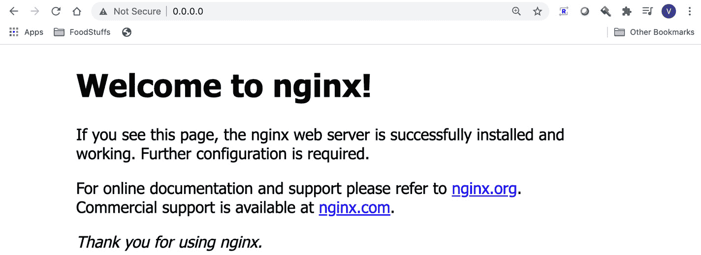
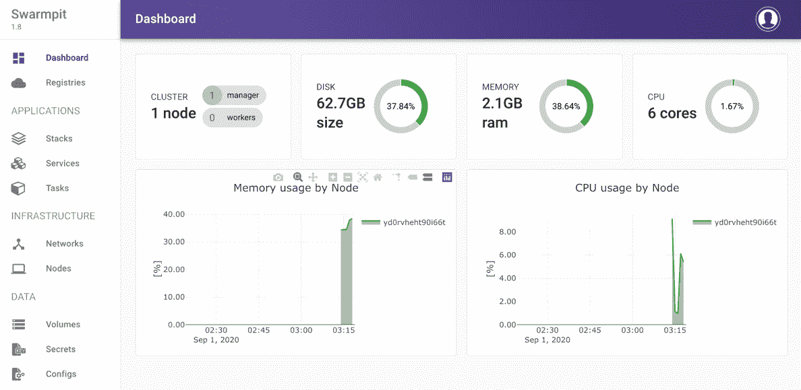
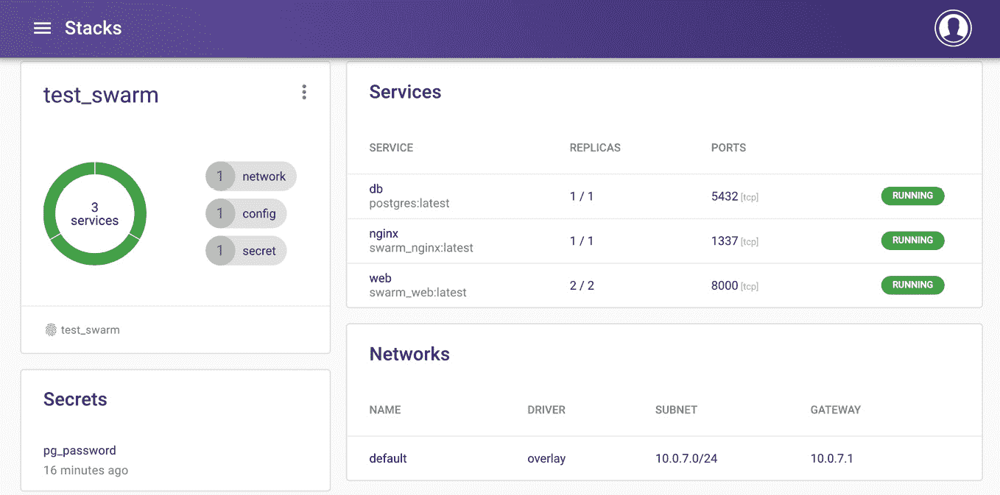
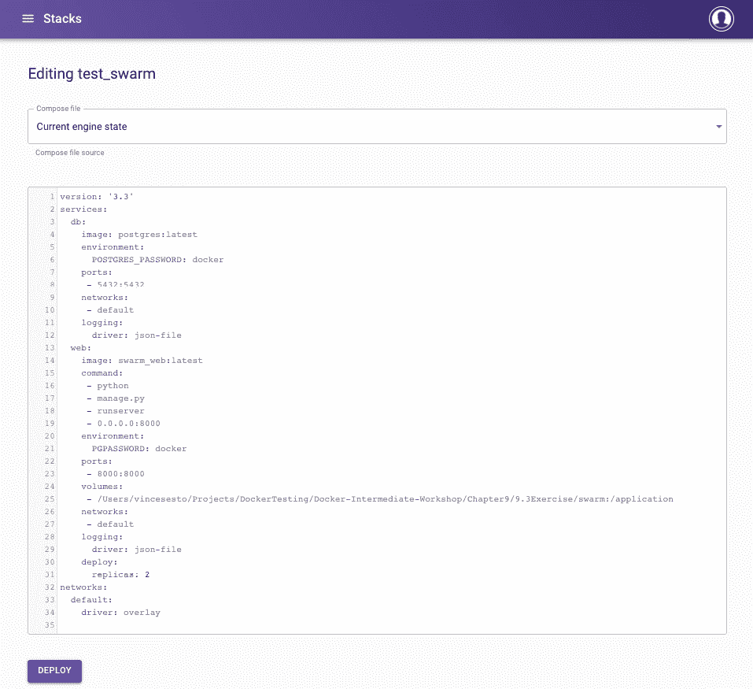
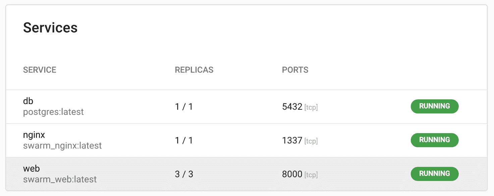
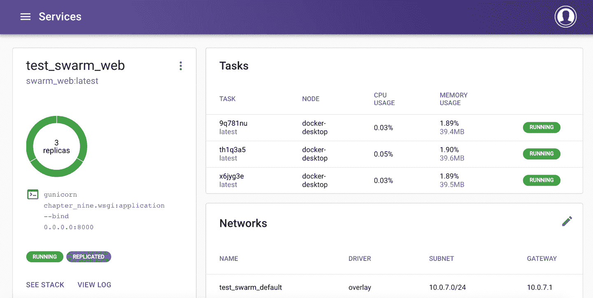
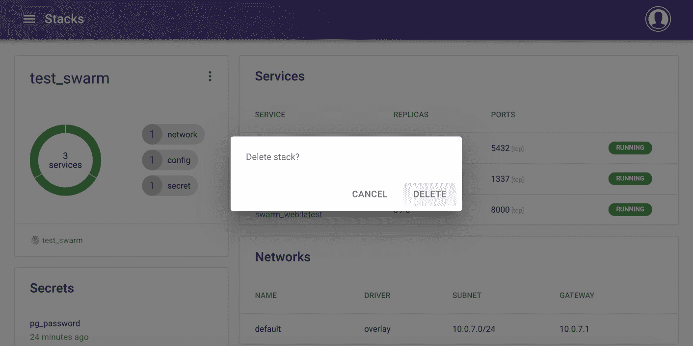

# 9。Docker群

概观

在本章中，您将从命令行使用 Docker Swarm 来管理正在运行的节点，部署服务，并在需要时对服务执行滚动更新。您将学习如何对您的 Swarm 节点进行故障排除，并使用您现有的 Docker Compose 文件部署整个堆栈，以及学习如何使用 Swarm 来管理您的服务配置和机密。本章的最后一部分将为您提供开始使用 Swarmpit 所需的知识，Swarm pit 是一个基于网络的界面，用于运行和管理 Docker Swarm 服务和集群。

# 简介

到目前为止，在本书中，我们已经运行了我们的 Docker 容器，并使用直接命令(如`docker run`来启动容器)来控制它们从命令行运行的方式。我们的下一步是使用 Docker Compose 实现自动化，它允许整个容器环境协同工作。Docker Swarm 是管理我们的 Docker 环境的下一步。 **Docker Swarm** 允许您编排您的容器如何扩展和协同工作，以向您的最终用户提供更可靠的服务。

Docker Swarm 允许您设置多个运行 Docker 引擎的服务器，并将它们组织为一个集群。Docker Swarm 然后可以运行命令来协调集群中的容器，而不仅仅是一个服务器。Swarm 将配置您的集群，以确保您的服务在集群中是平衡的，从而确保您的服务具有更高的可靠性。它还会根据集群中的负载为您决定将哪个服务分配给哪个服务器。Docker Swarm 在管理容器运行方式方面是一个进步，默认情况下由 Docker 提供。

Docker Swarm 允许您为服务配置冗余和故障转移，同时根据负载上下扩展容器的数量。您可以跨服务执行滚动更新，以减少中断的机会，这意味着您的容器应用的新版本可以应用到集群，而这些更改不会导致您的客户中断。它将允许您通过集群编排您的容器工作负载，而不是逐个手动管理容器。

Swarm 还引入了一些新的术语和概念来管理您的环境，定义如下:

*   **集群**:多个 Docker 主机以集群模式运行，充当管理人员和工作人员。作为 Docker Swarm 的一部分，拥有多个节点和工作人员并不是强制性的。您可以将服务作为单个节点群来运行，这就是我们在本章中的工作方式，即使生产集群可能有多个可用节点来确保您的服务尽可能容错。
*   **任务**:管理器分配任务在节点内部运行。任务由一个 Docker 容器和将在容器内运行的命令组成。
*   **服务**:这定义了要在经理或员工身上执行的任务。服务和独立容器的区别在于，您可以在不重新启动服务的情况下修改服务的配置。
*   **Node**: An individual system running Docker Engine and participating in the swarm is a node. More than one node can run on a single physical computer at one time through the use of virtualization.

    注意

    我们将只使用系统中的一个节点。

*   **管理器**:管理器将任务分派给工作节点。管理器执行编排和集群管理。它还承载集群上的服务。
*   **领导者节点**:群中的管理器节点选择单个主领导者节点来执行集群中的编排任务。
*   **工作节点**:工作节点执行管理节点分配的任务。

现在您已经熟悉了关键术语，让我们在下一节探讨 Docker Swarm 是如何工作的。

# Docker Swarm 是如何工作的？

群管理器节点处理集群管理，主要目标是保持群和其上运行的服务的一致状态。这包括确保集群始终运行，并在需要时运行和调度服务。

由于有多个管理器同时运行，这意味着有容错能力，尤其是在生产环境中。也就是说，如果一个管理器关闭，集群将仍然有另一个管理器来协调集群上的服务。工作节点的唯一目的是运行 Docker 容器。它们需要至少一个管理器才能运行，但是如果需要，工作节点可以升级为管理器。

服务允许您将应用映像部署到 Docker 群中。这些是要运行的容器和要在运行的容器中执行的命令。创建服务时会提供服务选项，您可以在其中指定应用可以发布的端口、CPU 和内存限制、滚动更新策略以及可以运行的映像副本数量。

为服务设置了所需的状态，经理的职责是监控服务。如果服务没有处于所需的状态，它将纠正任何问题。如果任务失败，编排者只需移除与失败任务相关的容器并替换它。

现在您已经知道了 Docker Swarm 是如何工作的，下一部分将让您开始使用基本命令，并指导您完成一个实践练习，以进一步演示它的操作。

# 与Docker群体一起工作

本章的前一节已经向您展示了 Swarm 使用了与您在本书中已经学习到的相似的概念。您将看到 Swarm 的使用采用了您非常熟悉的 Docker 命令，并对它们进行了扩展，以允许您创建集群、管理服务和配置节点。Docker Swarm 为运行您的服务做了大量艰苦的工作，因为 Swarm 将确定您的服务最好放在哪里，负责调度您的容器，并决定最好放在哪个节点上。例如，如果一个节点上已经有三个服务在运行，而您的第二个节点上只有一个服务，Swarm 将知道它应该在您的系统中平均分配服务。

默认情况下，Docker swarm 处于禁用状态，因此要在 Swarm 模式下运行 Docker，您需要加入现有集群或创建新的 Swarm。要创建一个新的群并在您的系统中激活它，您可以使用这里显示的`swarm init`命令:

```
docker swarm init
```

这将在您当前工作的节点上创建一个新的单节点群集。您的系统将成为您刚刚创建的群的管理器节点。当您运行`init`命令时，您还将获得允许其他节点加入您的群所需的命令的详细信息。

对于加入群的节点，它需要一个秘密令牌，并且工作节点的令牌不同于管理节点的令牌。管理器令牌需要受到强有力的保护，这样您就不会让集群变得脆弱。一旦获得了您的节点需要加入的群的令牌、IP 地址和端口，您就可以使用`--token`选项运行类似于这里所示的命令:

```
docker swarm join --token <swarm_token> <ip_address>:<port>
```

如果出于某种原因您需要更改令牌(可能是出于安全原因)，您可以运行`join-token --rotate`选项来生成新令牌，如下所示:

```
docker swarm join-token --rotate
```

从群管理器节点，以下`node ls`命令将允许您查看群中可用的节点，并提供节点状态的详细信息，无论是管理器还是工作器，以及节点是否有任何问题:

```
docker node ls
```

一旦集群可用并准备好开始托管服务，您就可以使用`service create`命令创建一个服务，提供服务的名称、容器映像以及服务正确运行所需的命令，例如，如果您需要公开端口或装载卷:

```
docker service create --name <service> <image> <command>
```

然后可以对服务配置进行更改，或者您可以使用`update`命令更改服务的运行方式，如下所示:

```
docker service update <service> <changes>
```

最后，如果需要删除或停止服务运行，只需使用`service remove`命令:

```
docker service remove <service>
```

我们在这里提供了很多关于 Docker Swarm 的理论，我们希望它能让您清楚地了解它是如何工作的，以及您可以如何使用 Swarm 来启动您的服务，并在有高需求时进行扩展以提供稳定的服务。下面的练习将利用我们到目前为止所学的知识，并向您展示如何在您的项目中实现它。

注意

请使用`touch`命令创建文件，使用`vim`命令使用 vim 编辑器处理文件。

## 练习 9.01:用 Docker Swarm 运行服务

本练习旨在帮助您熟悉如何使用 Docker Swarm 命令来管理您的服务和容器。在本练习中，您将激活一个集群，设置一个新服务，测试服务的扩展，然后使用 Docker Swarm 从集群中删除该服务:

1.  Although Swarm is included by default with your Docker installation, you still need to activate it on your system. Use the `docker swarm init` command to put your local system into Docker Swarm mode:

    ```
    docker swarm init
    ```

    您的输出可能与您在这里看到的略有不同，但是正如您所看到的，一旦创建了群，输出将提供如何使用`docker swarm join`命令向集群添加额外节点的详细信息:

    ```
    Swarm initialized: current node (j2qxrpf0a1yhvcax6n2ajux69) is 
    now a manager.
    To add a worker to this swarm, run the following command:
        docker swarm join --token SWMTKN-1-2w0fk5g2e18118zygvmvdxartd43n0ky6cmywy0ucxj8j7net1-5v1xvrt7
    1ag6ss7trl480e1k7 192.168.65.3:2377
    To add a manager to this swarm, run 'docker swarm join-token 
    manager' and follow the instructions.
    ```

2.  Now list the nodes you have in your cluster, using the `node ls` command:

    ```
    docker node ls
    ```

    您应该有一个当前正在处理的节点，它的状态应该是`Ready`:

    ```
    ID         HOSTNAME          STATUS    AVAILABILITY
      MANAGER STATUS
    j2qx.. *   docker-desktop    Ready     Active
      Leader 
    ```

    为了清楚起见，我们从输出中删除了`Engine Version`列。

3.  From your node, check the status of your swarm using the `docker info` command, providing further details of your Swarm cluster and how the node is interacting with it. It will also give you extra information if you need to troubleshoot issues later:

    ```
    docker info
    ```

    从输出中可以看到，您获得了 Docker Swarm 集群的所有具体细节，包括`NodeID`和`ClusterID`。如果您的系统没有正确设置 Swarm，您将看到的只是`Swarm: inactive`的输出:

    ```
    …
    Swarm: active
      NodeID: j2qxrpf0a1yhvcax6n2ajux69
      Is Manager: true
      ClusterID: pyejfsj9avjn595voauu9pqjv
      Managers: 1
      Nodes: 1
      Default Address Pool: 10.0.0.0/8  
      SubnetSize: 24
      Data Path Port: 4789
      Orchestration:
       Task History Retention Limit: 5
      Raft:
       Snapshot Interval: 10000
       Number of Old Snapshots to Retain: 0
       Heartbeat Tick: 1
       Election Tick: 10
      Dispatcher:
       Heartbeat Period: 5 seconds
      CA Configuration:
       Expiry Duration: 3 months
       Force Rotate: 0
    ```

4.  Start your first service on your newly created swarm. Create a service named `web` using the `docker service create` command and the `--replicas` option to set two instances of the container running:

    ```
    docker service create --replicas 2 -p 80:80 --name web nginx
    ```

    您将看到成功创建了两个实例:

    ```
    uws28u6yny7ltvutq38166alf
    overall progress: 2 out of 2 tasks 
    1/2: running   [==========================================>] 
    2/2: running   [==========================================>] 
    verify: Service converged
    ```

5.  Similar to the `docker ps` command, you can see a listing of the services running on your cluster with the `docker service ls` command. Execute the `docker service ls` command to view the details of the `web` service created in the *step 4*:

    ```
    docker service ls
    ```

    该命令将返回`web`服务的详细信息:

    ```
    ID              NAME  MODE          REPLICAS   IMAGE
      PORTS
    uws28u6yny7l    web   replicated    2/2        nginx:latest
      *:80->80/tcp
    ```

6.  To view the containers currently running on your swarm, use the `docker service ps` command with the name of your service, `web`:

    ```
    docker service ps web
    ```

    如您所见，您现在有了运行我们服务的容器列表:

    ```
    ID     NAME    IMAGE    NODE               DESIRED
      CURRENT STATE
    viyz   web.1   nginx    docker-desktop     Running
      Running about a minute ago
    mr4u   web.2   nginx    docker-desktop     Running
      Running about a minute ago
    ```

7.  The service will only run the default `Welcome to nginx!` page. Use the node IP address to view the page. In this instance, it will be your localhost IP, `0.0.0.0`:

    

    图 9.1:Docker Swarm 的 nginx 服务

8.  Scaling the number of containers running your service is easy with Docker Swarm. Simply provide the `scale` option with the number of total containers you want to have running, and the swarm will do the work for you. Perform the command shown here to scale your running web containers to `3`:

    ```
    docker service scale web=3
    ```

    以下输出显示了`web`服务现在扩展到了`3`容器:

    ```
    web scaled to 3
    overall progress: 3 out of 3 tasks 
    1/3: running   [==========================================>]
    2/3: running   [==========================================>]
    3/3: running   [==========================================>]
    verify: Service converged
    ```

9.  As in *step 5* of this exercise, run the `service ls` command:

    ```
    docker service ls
    ```

    现在，您应该看到三个`web`服务在您的集群上运行:

    ```
    ID              NAME    MODE          REPLICAS   IMAGE
        PORTS
    uws28u6yny7l    web     replicated    3/3        nginx:latest
        *:80->80/tcp
    ```

10.  下面的更改更适合具有多个节点的集群，但是您仍然可以运行它来看看会发生什么。运行以下`node update`命令，将可用性设置为`drain`，并使用您的节点标识号或名称。这将删除此节点上运行的所有容器，因为它在您的群集上不再可用。您将获得节点标识作为输出:

    ```
    docker node update --availability drain j2qxrpf0a1yhvcax6n2ajux69
    ```

11.  If you were to run the `docker service ps web` command, you would see each of your `web` services shut down while trying to start up new `web` services. As you only have one node running, the services would be sitting in a pending state with `no suitable node` error. Run the `docker service ps web` command:

    ```
    docker service ps web
    ```

    输出已经减少到只显示第二、第三、第五和第六列，但是您可以看到服务无法启动。`CURRENT STATE`列同时具有`Pending`和`Shutdown`状态:

    ```
    NAME         IMAGE            CURRENT STATE
      ERROR
    web.1        nginx:latest     Pending 2 minutes ago
      "no suitable node (1 node…"
    \_ web.1     nginx:latest     Shutdown 2 minutes ago
    web.2        nginx:latest     Pending 2 minutes ago
      "no suitable node (1 node…"
    \_ web.2     nginx:latest     Shutdown 2 minutes ago
    web.3        nginx:latest     Pending 2 minutes ago
      "no suitable node (1 node…"
    \_ web.3     nginx:latest     Shutdown 2 minutes ago
    ```

12.  Run the `docker node ls` command:

    ```
    docker node ls
    ```

    这表明您的节点已准备好，但处于`Drain`的`AVAILABILITY`状态:

    ```
    ID         HOSTNAME          STATUS    AVAILABILITY
      MANAGER STATUS
    j2qx.. *   docker-desktop    Ready     Drain
      Leader 
    ```

13.  Stop the service from running. Use the `service rm` command, followed by the service name (in this instance, `web`) to stop the service from running:

    ```
    docker service rm web
    ```

    显示的唯一输出将是您要删除的服务的名称:

    ```
    web
    ```

14.  You don't want to leave your node in a `Drain` state as you want to keep using it through the rest of the exercises. To get the node out of a `Drain` state and prepare to start managing swarm, set the availability to `active` with the following command using your node ID:

    ```
    docker node update --availability active j2qxrpf0a1yhvcax6n2ajux69
    ```

    该命令将返回节点的哈希值，每个用户的哈希值都不同。

15.  Run the `node ls` command:

    ```
    docker node ls
    ```

    现在它将显示我们节点的可用性`Active`，并准备好您的服务再次运行:

    ```
    ID         HOSTNAME          STATUS    AVAILABILITY
      MANAGER STATUS
    j2qx.. *   docker-desktop    Ready     Active
      Leader 
    ```

16.  Use the `docker node inspect` command with the `--format` option and search for the `ManagerStatus.Reachability` status to ensure that your node is reachable:

    ```
    docker node inspect j2qxrpf0a1yhvcax6n2ajux69 --format "{{ .ManagerStatus.Reachability }}"
    ```

    如果节点可用，可以联系，应该会看到`reachable`的结果:

    ```
    reachable
    ```

17.  Search for `Status.State` to ensure that the node is ready:

    ```
    docker node inspect j2qxrpf0a1yhvcax6n2ajux69 --format "{{ .Status.State }}"
    ```

    这会产生`ready`:

    ```
    ready
    ```

本练习应该已经很好地向您展示了 Docker Swarm 是如何简化您的工作的，尤其是当您开始考虑将您的工作部署到生产环境中时。我们使用了 Docker Hub NGINX 映像，但是我们可以轻松地使用我们创建的任何服务作为我们的 Swarm 节点可用的 Docker 映像。

下一节将快速讨论如果你发现自己在 Swarm 节点上遇到麻烦时需要采取的一些行动。

# 集群节点故障排除

对于我们将在本章中进行的工作，我们将只使用单节点群来托管我们的服务。Docker Swarm 多年来一直在提供生产级环境。然而，这并不意味着您的环境永远不会有任何问题，尤其是当您开始在多节点群中托管服务时。如果您需要对集群上运行的任何节点进行故障排除，您可以采取许多步骤来确保纠正它们可能存在的任何问题:

*   **重启**:通常最简单的选择是重启或重启节点系统，看看这是否解决了您可能遇到的问题。
*   **Demote the node**: If the node is a manager on your cluster, try demoting the node using the `node demote` command:

    ```
    docker node demote <node_id>
    ```

    如果这个节点是领导者，它将允许其他管理节点之一成为群体的领导者，并希望解决您可能遇到的任何问题。

*   **Remove the node from the cluster**: Using the `node rm` command, you can remove the node from the cluster:

    ```
    docker node rm <node_id>
    ```

    如果节点没有与集群的其他节点正确通信，这也可能是一个问题，您可能需要使用`--force`选项从集群中删除该节点:

    ```
    docker node rm --force <node_id>
    ```

*   **Join back to the cluster**: If the preceding has worked correctly, you may be able to successfully join the node back onto the cluster with the `swarm join` command. Remember to use the token that you used before when joining the swarm:

    ```
    docker node swarm join --token <token> <swarm_ip>:<port>
    ```

    注意

    如果您的服务在 Docker Swarm 上运行时仍然有问题，并且您已经纠正了 Swarm 节点的所有问题，Swarm 只是使用 Docker 来运行您的服务并将其部署到您环境中的节点上。任何问题都可以归结为您试图在 Swarm 上运行的容器映像的基本故障排除，而不是 Swarm 环境本身。

一群管理人员被称为“T2”法定人数“T3”，大多数管理人员需要就群的建议更新达成一致，例如添加新节点或缩减容器数量。正如我们在上一节中看到的，您可以通过运行`docker node ls`命令来监控集群管理器或节点的运行状况，使用管理器的标识，然后使用`docker node inspect`命令，如下所示:

```
docker node inspect <node_id>
```

注意

关于 Swarm 节点的最后一个注意事项是记住将服务部署到已经创建为 Docker 映像的节点。容器映像本身需要可以从中央 Docker 注册表下载，该注册表可供所有节点下载，而不是简单地构建在一个 Swarm 节点上。

虽然我们已经绕了一小段路来讨论如何对您的 Swarm 节点进行故障排除，但这不应该是在 Swarm 上运行服务的一个主要方面。本章的下一部分将进一步向您展示如何使用新的或现有的`docker-compose.yml`文件来自动将您的服务部署到 Docker Swarm 中。

# 从 Docker Compose 部署集群部署

使用 Docker Swarm 部署一个完整的环境很容易；如果您一直使用 Docker Compose 运行容器，您会看到大部分工作已经完成。这意味着您不需要像我们在本章前面部分所做的那样，在 Swarm 中逐个手动启动服务。

如果您已经有了一个`docker-compose.yml`文件来启动您的服务和应用，那么它很有可能会毫无问题地工作。Swarm 将使用`stack deploy`命令在 Swarm 节点上部署您的所有服务。您所需要做的就是提供`compose`文件并为堆栈指定一个名称:

```
docker stack deploy --compose-file <compose_file> <swarm_name>
```

堆栈的创建是快速和无缝的，但是在后台发生了很多事情来确保所有服务都正确运行，包括在所有服务之间建立网络以及按照所需的顺序启动每个服务。使用您在创建时提供的`swarm_name`运行`stack ps`命令将显示您部署中的所有服务是否都在运行:

```
docker stack ps <swarm_name>
```

一旦您使用完集群上的服务，或者您需要清理部署的所有内容，您只需使用`stack rm`命令，提供您在创建堆栈部署时提供的`swarm_name`。这将自动停止并清理群集中运行的所有服务，并为您重新分配给其他服务做好准备:

```
docker stack rm <swarm_name>
```

现在，由于我们知道了用于部署、运行和管理 Swarm 堆栈的命令，我们可以看看如何为我们的服务执行滚动更新。

# 群组服务滚动更新

Swarm 还能够对正在运行的服务执行滚动更新。这意味着，如果您的 Swarm 上运行的应用有新的更新，您可以创建一个新的 Docker 映像并更新您的服务，Swarm 将确保新映像在关闭旧版本的容器映像之前启动并成功运行。

对您在 Swarm 中运行的服务执行滚动更新只是运行`service update`命令。在下面的命令中，您可以看到新的容器映像名称和要更新的服务。Swarm 会处理剩下的:

```
docker service update --image <image_name:tag> <service_name>
```

您将很快有机会使用我们在这里解释的所有命令。在下面的例子中，您将使用 Django 和 PostgreSQL 创建一个小的测试应用。您将要设置的网络应用是非常基本的，因此不需要事先了解姜戈网络框架。简单地跟着做，我们将在练习中解释正在发生的事情。

## 练习 9.02:从 Docker Compose 部署你的群

在下面的练习中，您将使用`docker-compose.yml`使用 PostgreSQL 数据库和 Django web 框架创建一个基本的 web 应用。然后，您将使用此`compose`文件将您的服务部署到群中，而无需手动运行您的服务:

1.  首先，创建一个运行应用的目录。调用目录`swarm`并使用`cd`命令进入目录:

    ```
    mkdir swarm; cd swarm
    ```

2.  在新目录中为您的 Django 应用创建一个`Dockerfile`，并使用您的文本编辑器在下面的代码块中输入详细信息。`Dockerfile`将使用默认的`Python3`映像，设置与 Django 相关的环境变量，安装相关应用，并将代码复制到容器映像的当前目录:

    ```
    FROM python:3
    ENV PYTHONUNBUFFERED 1
    RUN mkdir /application
    WORKDIR /application
    COPY requirements.txt /application/
    RUN pip install -r requirements.txt
    COPY . /application/
    ```

3.  创建您的`Dockerfile`在上一步中使用的`requirements.txt`文件，以安装运行所需的所有相关应用。用文本编辑器添加以下两行，安装 Django 应用与 PostgreSQL 数据库通信所需的版本`Django`和`Psycopg2`:

    ```
    1 Django>=2.0,<3.0
    2 psycopg2>=2.7,<3.0
    ```

4.  使用文本编辑器创建一个`docker-compose.yml`文件。为您的数据库添加第一个服务，如下面的代码所示。`db`服务将使用来自 Docker Hub 的最新`postgres`映像，暴露端口`5432`，并为`POSTGRES_PASSWORD` :

    ```
    1 version: '3.3'
    2
    3 services:
    4   db:
    5     image: postgres
    6     ports:
    7       - 5432:5432
    8     environment:
    9       - POSTGRES_PASSWORD=docker
    ```

    设置环境变量
5.  `docker-compose.yml`文件的后半部分构建和部署您的 web 应用。在*第 10 行*中建立您的`Dockerfile`，暴露端口`8000`以从您的网络浏览器访问它，并设置数据库密码以匹配您的`db`服务。您还会注意到第 13 行*中的一个 Python 命令，该命令将启动 Django 应用的开发 web 服务器:

    ```
    10   web:
    11     build: .
    12     image: swarm_web:latest
    13     command: python manage.py runserver 0.0.0.0:8000
    14     volumes:
    15       - .:/application
    16     ports:
    17       - 8000:8000
    18     environment:
    19       - PGPASSWORD=docker
    20     depends_on:
    21       - db
    ```* 
6.  Run the following command to pull and build the `db` and `web` services in your `docker-compose.yml`. The command will then run `django-admin startproject`, which will create your basic Django project, named `chapter_nine`:

    ```
    docker-compose run web django-admin startproject chapter_nine .
    ```

    该命令应该返回以下输出，在其中您可以看到容器被拉出和构建:

    ```
    …
    Status: Downloaded newer image for postgres:latest
    Creating swarm_db_1 ... done
    Building web
    …
    Successfully built 41ff06e17fe2
    Successfully tagged swarm_web:latest
    ```

7.  The `startproject` command you ran in the previous step should have created some extra files and directories in your swarm directory. Run the `ls` command to list all the files and directories in the swarm directory:

    ```
    ls -l
    ```

    您之前创建了`Dockerfile`、`docker-compose.yml`文件和`requirements.txt`文件，但是现在容器的构建添加了`chapter_nine` Django 目录和`manage.py`文件:

    ```
    -rw-r--r--  1 user  staff  175  3 Mar 13:45 Dockerfile
    drwxr-xr-x  6 user  staff  192  3 Mar 13:48 chapter_nine
    -rw-r--r--  1 user  staff  304  3 Mar 13:46 docker-compose.yml
    -rwxr-xr-x  1 user  staff  634  3 Mar 13:48 manage.py
    -rw-r--r--  1 user  staff   36  3 Mar 13:46 requirements.txt
    ```

8.  To get your basic application running, you need to make some minor changes to the Django project settings. Open the `chapter_nine/settings.py` file with your text editor and locate the entry that starts with `DATABASES`. This controls how Django will connect to your database, and by default, Django is set up to work with an SQLite database. The `DATABASES` entry should look like the following:

    ```
    76 DATABASES = {
    77     'default': {
    78         'ENGINE': 'django.db.backends.sqlite3',
    79         'NAME': os.path.join(BASE_DIR, 'db.sqlite3'),
    80     }
    81 }
    ```

    作为我们安装的一部分，您有一个 PostgreSQL 数据库要部署到 Swarm，因此请使用以下八行代码编辑`DATABASES`设置，这样 Django 就可以访问这个 PostgreSQL 数据库:

    settings.py

    ```
    76 DATABASES = {
    77     'default': {
    78         'ENGINE': 'django.db.backends.postgresql',
    79         'NAME': 'postgres',
    80         'USER': 'postgres',
    81         'PASSWORD': 'docker',
    82         'HOST': 'db',
    83         'PORT': 5432,
    84     }
    85 }
    ```

    这一步的完整代码可以在[https://packt.live/2DWP9ov](https://packt.live/2DWP9ov)找到。

9.  在我们的`settings.py`文件的*第 28 行*处，我们还需要添加我们将要用作`ALLOWED_HOSTS`配置的 IP 地址。我们将把我们的应用配置为可以从 IP 地址`0.0.0.0`访问。在*第 28 行*对设置文件进行相关更改，使其看起来像下面的代码:

    ```
     27 
     28 ALLOWED_HOSTS = ["0.0.0.0"]
    ```

10.  Now test to see whether your basic project is working as expected. From the command line, deploy your services to Swarm with the `stack deploy` command. In the following command, specify the `docker-compose.yml` file to use with the `--compose-file` option and name the stack `test_swarm`:

    ```
    docker stack deploy --compose-file docker-compose.yml test_swarm
    ```

    该命令应该设置群网络、数据库和 web 服务:

    ```
    Creating network test_swarm_default
    Creating service test_swarm_db
    Creating service test_swarm_web
    ```

11.  Run the `docker service ls` command, and you should be able to see the status for both the `test_swarm_db` and `test_swarm_web` services:

    ```
    docker service ls
    ```

    如您在以下输出中所见，它们都显示了`1/1`的`REPLICAS`值:

    ```
    ID     NAME            MODE        REPLICAS  IMAGE
      PORTS
    dsr.   test_swarm_db   replicated  1/1       postgres
    kq3\.   test_swarm_web  replicated  1/1       swarm_web:latest
      *:8000.
    ```

12.  If your work has been successful, test it by opening a web browser and going to `http://0.0.0.0:8000`. If everything has worked, you should see the following Django test page displayed on your web browser:

    

    图 9.2:使用 Docker 编写文件将服务部署到 Swarm

13.  To view the stacks currently running on your system, use the `stack ls` command:

    ```
    docker stack ls
    ```

    您应该会看到以下输出，其中显示了两个运行在`test_swarm`名称下的服务:

    ```
    NAME                SERVICES            ORCHESTRATOR
    test_swarm          2                   Swarm
    ```

14.  Use the `stack ps` command with the name of your swarm to view the services running and check whether there are any issues:

    ```
    docker stack ps test_swarm
    ```

    `ID`、`DESIRED STATE`和`ERROR`列不包括在以下减少的输出中。此外，可以看到`test_swarm_web.1`和`test_swarm_db.1`服务正在运行:

    ```
    NAME                IMAGE               NODE
      CURRENT STATE
    test_swarm_web.1    swarm_web:latest    docker-desktop
      Running
    test_swarm_db.1     postgres:latest     docker-desktop
      Running
    ```

15.  Just as you were able to start up all your services at once with the `deploy` command, you can stop the services all at once, as well. Use the `stack rm` command with the name of your swarm to stop all of your services from running and remove the stack:

    ```
    docker stack rm test_swarm
    ```

    请注意，所有服务都将在以下输出中停止:

    ```
    Removing service test_swarm_db
    Removing service test_swarm_web
    Removing network test_swarm_default
    ```

16.  You still want to perform some extra work on your swarm as part of this exercise, but first, make a minor change to the `compose` file. Open the `docker-compose.yml` file with your text editor and add the following lines to your web service to now have two replica web services created when deployed to the swarm:

    ```
    22     deploy:
    23       replicas: 2
    ```

    完整的`docker-compose.yml`文件应该如下所示:

    ```
    version: '3.3'
    services:
      db:
        image: postgres
        ports:
          - 5432:5432
        environment:
          - POSTGRES_PASSWORD=docker
      web:
        build: .
        image: swarm_web:latest
        command: python manage.py runserver 0.0.0.0:8000
        volumes:
          - .:/application
        ports:
          - 8000:8000
        environment:
          - PGPASSWORD=docker
        deploy:
          replicas: 2
        depends_on:
          - db
    ```

17.  使用您之前在*步骤 8* 中所做的相同命令，使用您所做的更改再次部署群。即使`test_swarm`栈仍在运行，它也会记录并对服务进行相关的更改:

    ```
    docker stack deploy --compose-file docker-compose.yml test_swarm
    ```

18.  Run the `docker ps` command as follows:

    ```
    docker ps | awk '{print $1 "\t" $2 }'
    ```

    在此处显示的输出中，仅打印前两列。您现在可以看到有两个`swarm_web`服务正在运行:

    ```
    CONTAINER         ID
    2f6eb92414e6      swarm_web:latest
    e9241c352e12      swarm_web:latest
    d5e6ece8a9bf      postgres:latest
    ```

19.  要在不停止服务的情况下将新版本的`swarm_web`服务部署到您的群中，首先，为我们的网络服务构建一个新的 Docker 映像。不要对映像进行任何更改，但这次使用`patch1`标签标记映像，以演示服务运行时的更改:

    ```
    docker build . -t swarm_web:patch1
    ```

20.  To perform a rolling update, use the `service update` command, providing details of the image you wish to update to and the service name. Run the following command, which uses the image you have just created with the `patch1` tag, on the `test_swarm_web` service:

    ```
    docker service update --image swarm_web:patch1 test_swarm_web
    ```

    Swarm 将管理更新，以确保在将更新应用于其余映像之前，其中一个服务始终在运行:

    ```
    image swarm_web:patch1 could not be accessed on a registry 
    to record its digest. Each node will access 
    swarm_web:patch1 independently, possibly leading to different 
    nodes running different versions of the image.
    test_swarm_web
    overall progress: 2 out of 2 tasks 
    1/2: running   [=========================================>]
    2/2: running   [=========================================>]
    verify: Service converged
    ```

    注意

    您会注意到输出显示映像在存储库中不可用。由于我们只有一个节点运行我们的群，更新将使用在该节点上构建的映像。在现实场景中，我们需要将这个映像推送到我们所有节点都可以访问的中央存储库，这样他们就可以提取它。

21.  Run the `docker ps` command given here, which pipes its output to an `awk` command to only print the first two columns of `CONTAINER` and `ID`:

    ```
    docker ps | awk '{print $1 "\t" $2 }'
    ```

    该命令将返回如下输出:

    ```
    CONTAINER         ID
    ef4107b35e09      swarm_web:patch1
    d3b03d8219dd      swarm_web:patch1
    d5e6ece8a9bf      postgres:latest
    ```

22.  如果您想控制滚动更新的发生方式，该怎么办？运行以下命令对您的`test_swarm_web`服务执行新的滚动更新。恢复您为部署带有`latest`标签的映像所做的更改，但这一次，请确保在执行更新时有`30`秒的延迟，因为这将使您的 web 服务在第二次更新运行前有额外的时间启动:

    ```
    docker service update --update-delay 30s --image swarm_web:latest test_swarm_web
    ```

23.  Run the `docker ps` command again:

    ```
    docker ps | awk '{print $1 "\t" $2 }'
    ```

    请注意，在您执行滚动更新后，容器现在再次运行`swarm_web:latest`映像:

    ```
    CONTAINER         ID
    414e62f6eb92      swarm_web:latest
    352e12e9241c      swarm_web:latest
    d5e6ece8a9bf      postgres:latest
    ```

到目前为止，您应该已经看到了使用集群的好处，尤其是当我们开始使用 Docker Compose 扩展我们的应用时。在本练习中，我们演示了如何使用 Docker Compose 轻松地在集群上部署和管理一组服务，并使用滚动更新来升级服务。

本章的下一节将进一步扩展您的知识，展示如何使用 Swarm 来管理您的环境中使用的配置和机密值。

# 用 Docker Swarm 管理秘密和配置

到目前为止，在本章中，我们已经观察到 Docker Swarm 在编排我们的服务和应用方面的熟练程度。它还提供了允许我们在环境中定义配置并使用这些值的功能。为什么我们需要这个功能呢？

首先，我们存储诸如秘密等细节的方式并不十分安全，尤其是当我们在我们的`docker-compose.yml`文件中以纯文本形式键入它们或者将它们作为我们构建的 Docker 映像的一部分时。对于我们的秘密，Swarm 允许我们存储加密值，然后由我们的服务使用。

其次，通过使用这些功能，我们可以开始远离在`Dockerfile`中设置配置。这意味着我们可以创建和构建一个容器映像。然后，我们可以在任何环境下运行我们的应用，无论是笔记本电脑上的开发系统还是测试环境。我们还可以在生产环境中运行应用，在生产环境中，我们为它分配一个单独的配置或机密值，以便在该环境中使用。

创建一个 Swarm `config`很简单，尤其是如果你已经有一个现有的文件要使用。下面的代码展示了如何通过提供我们的`config_name`和我们的`configuration_file`的名称，使用`config create`命令创建一个新的`config`:

```
docker config create <config_name> <configuration_file> 
```

该命令创建一个`config`存储为集群的一部分，并且对集群中的所有节点可用。要查看系统和群集上的可用配置，请使用`config`命令运行`ls`选项:

```
docker config ls
```

您也可以使用`config inspect`命令查看配置中的详细信息。请确保您使用的是`--pretty`选项，因为输出是一个很长的 JSON 输出，没有它几乎无法读取:

```
docker config inspect --pretty <config_name>
```

在 Swarm 中使用机密提供了一种安全的方法，可以在我们的环境中以加密状态创建和存储敏感信息，例如用户名和密码，以便我们的服务可以使用这些信息。

要创建仅保存单个值(如用户名或密码)的秘密，我们可以简单地从命令行创建秘密，在命令行中，我们将秘密值导入`secret create`命令。下面的示例命令提供了一个如何做到这一点的示例。创建秘密时，请记住命名它:

```
echo "<secret_password>" | docker secret create <secret_name> –
```

你可以从文件中得到一个秘密。例如，假设您希望将证书文件设置为机密。下面的命令显示了如何使用`secret create`命令，通过提供秘密的名称和您需要从中创建秘密的文件名来实现这一点:

```
docker secret create <secret_name> <secret_file> 
```

一旦创建，你的秘密将在你的群中运行的所有节点上可用。正如您可以查看您的`config`一样，您可以使用`secret ls`命令查看群中所有可用秘密的列表:

```
docker secret ls
```

我们可以看到 Swarm 为我们提供了在编排中实现配置和秘密的灵活选项，而不需要将其设置为 Docker 映像的一部分。

下面的练习将演示如何在当前的 Docker Swarm 环境中使用配置和机密。

## 练习 9.03:在你的群中实现配置和秘密

在本练习中，您将进一步扩展您的 Docker Swarm 环境。您将向您的环境添加一个服务，该服务将帮助 NGINX 在进入您的 web 服务之前通过代理路由请求。您将使用传统方法进行设置，然后使用`config`和`secret`功能作为环境的一部分，观察它们在 Swarm 中的操作，并帮助用户更高效地部署和配置服务:

1.  Currently, the web service is using the Django development web server via the `runserver` command to provide web requests. NGINX will not be able to route traffic requests through to this development server, and instead, you will need to install the `gunicorn` application onto our Django web service for traffic to be routed via NGINX. Start by opening your `requirements.txt` file with your text editor and add the application as in the highlighted third line:

    ```
    Django>=2.0,<3.0
    psycopg2>=2.7,<3.0
    gunicorn==19.9.0
    ```

    注意

    Gunicorn 是**绿色独角兽**的缩写，用作 Python 应用的**网络服务网关接口** ( **WSGI** )。Gunicorn 被广泛用于生产环境，因为它被视为可用的最稳定的 WSGI 应用之一。

2.  要将 Gunicorn 作为网络应用的一部分运行，请调整您的`docker-compose.yml`文件。用文本编辑器打开`docker-compose.yml`文件，将*第 13 行*改为运行`gunicorn`应用，而不是 Django `manage.py runserver`命令。以下`gunicorn`命令通过其 WSGI 服务运行`chapter_nine` Django 项目，并绑定到 IP 地址和端口`0.0.0.0:8000` :

    ```
    12     image: swarm_web:latest
    13     command: gunicorn chapter_nine.wsgi:application          --bind 0.0.0.0:8000
    14     volumes:
    ```

3.  重新构建您的 web 服务，以确保 Gunicorn 应用安装在容器上并且可以运行。运行`docker-compose build`命令:

    ```
    docker-compose build
    ```

4.  Gunicorn can also run without the need of the NGINX proxy, so test the changes you have made by running the `stack deploy` command again. If you already have your services deployed, don't worry, you can still run this command again. It will simply make the relevant changes to your swarm and match the changes in your `docker-compose.yml`:

    ```
    docker stack deploy --compose-file docker-compose.yml test_swarm
    ```

    该命令将返回以下输出:

    ```
    Ignoring unsupported options: build
    Creating network test_swarm_default
    Creating service test_swarm_web
    Creating service test_swarm_db
    ```

5.  为了确保更改生效，请确保您打开了 web 浏览器，并在继续下一步之前验证您的 web 服务是否仍在提供 Django 测试页面。根据您的更改，页面仍应显示在`http://0.0.0.0:8000`处。
6.  要开始 NGINX 的实现，再次打开`docker-compose.yml`文件，将*第 16 行和第 17 行*从原来的`ports`命令修改为

    ```
    10   web:
    11     build: .
    12     image: swarm_web:latest
    13     command: gunicorn chapter_nine.wsgi:application          --bind 0.0.0.0:8000
    14     volumes:
    15       - .:/application
    16     ports:
    17       - 8000:8000
    18     environment:
    19       - PGPASSWORD=docker
    20     deploy:
    21       replicas: 2
    22     depends_on:
    23       - db
    ```

    暴露端口`8000`
7.  保持`docker-compose.yml`文件打开，在`compose`文件末尾添加您的`nginx`服务。现在这里的所有信息你应该都很熟悉了。*第 25 行*提供了新 NGINX 目录的位置，您将很快创建的`Dockerfile`，以及部署服务时要使用的映像的名称。*线路* *27* 和 *28* 将港口`1337`暴露于港口`80`*线路* *29* 和 *30* 显示 NGINX 需要依靠`web`服务运行:

    ```
    24   nginx:
    25     build: ./nginx
    26     image: swarm_nginx:latest
    27     ports:
    28       - 1337:80
    29     depends_on:
    30       - web
    ```

8.  现在，为服务设置 NGINX `Dockerfile`和配置。首先创建一个名为`nginx`的目录，如下命令所示:

    ```
    mkdir nginx
    ```

9.  在`nginx`目录中创建新的`Dockerfile`，用你的文本编辑器打开文件，加入这里显示的细节。`Dockerfile`是根据 Docker Hub 上最新的`nginx`映像创建的。它删除了*第 3 行*中的默认配置`nginx`文件，然后添加了一个您需要立即设置的新配置:

    ```
    FROM nginx
    RUN rm /etc/nginx/conf.d/default.conf
    COPY nginx.conf /etc/nginx/conf.d
    ```

10.  Create the `nginx.conf` file that the `Dockerfile` will use to create your new image. Create a new file called `nginx.conf` in the `nginx` directory and use your text editor to add the following configuration details:

    ```
    upstream chapter_nine {
        server web:8000;
    }
    server {
        listen 80;
        location / {
            proxy_pass http://chapter_nine;
            proxy_set_header X-Forwarded-For             $proxy_add_x_forwarded_for;
            proxy_set_header Host $host;
            proxy_redirect off;
        }
    }
    ```

    如果您不熟悉 NGINX 配置，前面的细节只是寻找对 web 服务的请求，并将请求路由到`chapter_nine` Django 应用。

11.  现在所有的细节都准备好了，为你的`docker-compose.yml`文件中现在设置的 NGINX 服务建立你的新形象。运行以下命令构建映像:

    ```
    docker-compose build
    ```

12.  Run the `stack deploy` command again:

    ```
    docker stack deploy --compose-file docker-compose.yml test_swarm
    ```

    这一次，您会注意到您的输出显示`test_swarm_nginx`服务已经创建并应该运行:

    ```
    Creating network test_swarm_default
    Creating service test_swarm_db
    Creating service test_swarm_web
    Creating service test_swarm_nginx
    ```

13.  Verify that all the services are running as part of your swarm with the `stack ps` command:

    ```
    docker stack ps test_swarm
    ```

    得到的输出已经缩小到只显示八列中的四列。您可以看到`test_swarm_nginx`服务正在运行:

    ```
    NAME                  IMAGE                 NODE
      DESIRED STATE
    test_swarm_nginx.1    swarm_nginx:latest    docker-desktop
      Running
    test_swarm_web.1      swarm_web:latest      docker-desktop
      Running
    test_swarm_db.1       postgres:latest       docker-desktop
      Running
    test_swarm_web.2      swarm_web:latest      docker-desktop
      Running
    ```

14.  要证明请求是通过 NGINX 代理路由的，请使用端口`1337`而不是端口`8000`。通过使用`http://0.0.0.0:1337`的新网址，确保您的网络浏览器仍在提供网页。
15.  This has been a great addition to the services running on Swarm but is not using the correct configuration management features. You already have an NGINX configuration created previously in this exercise. Create a Swarm configuration by using the `config create` command with the name of the new configuration and the file you are going to create the configuration from. Run the following command to create the new configuration from your `nginx/nginx.conf` file:

    ```
    docker config create nginx_config nginx/nginx.conf 
    ```

    该命令的输出将为您提供创建的配置标识:

    ```
    u125x6f6lhv1x6u0aemlt5w2i
    ```

16.  Swarm also gives you a way to list all the configurations created as part of your Swarm, using the `config ls` command. Make sure the new `nginx_config` file has been created in the previous step and run the following command:

    ```
    docker config ls
    ```

    `nginx_config`已在以下输出中创建:

    ```
    ID           NAME           CREATED           UPDATED
    u125x6f6…    nginx_config   19 seconds ago    19 seconds ago
    ```

17.  View the full details of the configuration you have created using the `docker config inspect` command. Run the following command with the `--pretty` option to make sure the configuration output is in a readable form:

    ```
    docker config inspect --pretty nginx_config
    ```

    输出应该类似于您在这里看到的，显示了您刚刚创建的 NGINX 配置的详细信息:

    ```
    ID:             u125x6f6lhv1x6u0aemlt5w2i
    Name:           nginx_config
    Created at:          2020-03-04 19:55:52.168746807 +0000 utc
    Updated at:          2020-03-04 19:55:52.168746807 +0000 utc
    Data:
    upstream chapter_nine {
        server web:8000;
    }
    server {
        listen 80;
        location / {
            proxy_pass http://chapter_nine;
            proxy_set_header X-Forwarded-For             $proxy_add_x_forwarded_for;
            proxy_set_header Host $host;
            proxy_redirect off;
        }
    }
    ```

18.  As you have now set up the configuration in Swarm, make sure the configuration is no longer built into the container image. Instead, it will be provided when the Swarm is deployed. Open the `Dockerfile` in the `nginx` directory and remove the fourth line of the `Dockerfile`. It should now look similar to the details given here:

    ```
    FROM nginx:1.17.4-alpine
    RUN rm /etc/nginx/conf.d/default.conf
    ```

    注意

    请记住，我们在这里进行的更改将确保我们不需要在每次配置更改时都构建新的 NGINX 映像。这意味着我们可以使用相同的映像，并将其部署到开发群或生产群中。我们所要做的就是改变配置来创建环境。不过，我们确实需要创建可以使用我们已经创建并存储在 Swarm 中的配置的映像。

19.  本练习的上一步对`nginx` `Dockerfile`进行了更改，因此现在重建映像以确保它是最新的:

    ```
    docker-compose build
    ```

20.  用你的文本编辑器打开`docker-compose.yml`文件来更新`compose`文件，这样我们的`nginx`服务将使用新创建的 Swarm `config`。在`nginx`服务的底部，用您之前创建的`nginx_cof`配置的源名称添加配置详细信息。请务必将其添加到正在运行的`nginx`服务中，以便容器可以使用。然后，为文件设置一个单独的配置。即使您已经在前面的步骤中手动创建了它，您的集群也需要在部署时了解它。将以下内容添加到您的`docker-compose.yml` :

    ```
    25   nginx:
    26     build: ./nginx
    27     image: swarm_nginx:latest
    28     ports:
    29       - 1337:80
    30     depends_on:
    31       - web
    32     configs:
    33       - source: nginx_conf
    34         target: /etc/nginx/conf.d/nginx.conf
    35 
    36 configs:
    37   nginx_conf:
    38     file: nginx/nginx.conf
    ```

21.  Deploy your swarm again:

    ```
    docker stack deploy --compose-file docker-compose.yml test_swarm
    ```

    在下面的输出中，您应该会看到一条额外的线显示`Creating config test_swarm_nginx_conf`:

    ```
    Creating network test_swarm_default
    Creating config test_swarm_nginx_conf
    Creating service test_swarm_db
    Creating service test_swarm_web
    Creating service test_swarm_nginx
    ```

22.  There is still more you can do to take advantage of Swarm, and one extra feature not used yet is the secrets function. Just as you created a configuration earlier in this exercise, you can create a `secret` with a similar command. The command shown here first uses `echo` to output the password you want as your secret value, and then, using the `secret create` command, it uses this output to create the secret named `pg_password`. Run the following command to name your new secret `pg_password`:

    ```
    echo "docker" | docker secret create pg_password –
    ```

    该命令将输出创建的秘密的标识:

    ```
    4i1cwxst1j9qoh2e6uq5fjb8c
    ```

23.  View the secrets in your swarm using the `secret ls` command. Run this command now:

    ```
    docker secret ls
    ```

    你可以看到你的秘密已经成功创建，名字为`pg_password`:

    ```
    ID                          NAME           CREATED
      UPDATED
    4i1cwxst1j9qoh2e6uq5fjb8c   pg_password    51 seconds ago
      51 seconds ago
    ```

24.  现在，对您的`docker-compose.yml`文件进行相关更改。以前，您只需为`postgres`用户输入您想要的密码。正如您在下面的代码中所看到的，在这里，您将把环境变量指向您之前创建的秘密`/run/secrets/pg_password`。这意味着它将在你的群中搜索可用的秘密，并分配存储在`pg_password`中的秘密。您还需要参考`db`服务中的秘密以允许其访问。用文本编辑器打开文件，并对文件进行以下更改:

    ```
    4   db:
    5     image: postgres
    6     ports:
    7       - 5432:5432
    8     environment:
    9       - POSTGRES_PASSWORD=/run/secrets/pg_password
    10    secrets:
    11      - pg_password
    ```

25.  `web`服务使用相同的秘密来访问 PostgreSQL 数据库。进入`docker-compose.yml`的`web`服务区，将*第 21 行*更改为类似以下内容，因为它现在将使用您创建的秘密:

    ```
    20    environment:
    21       - PGPASSWORD=/run/secrets/pg_password
    22    deploy:
    ```

26.  最后，就像你已经完成了你的配置一样，在`docker-compose.yml`的末尾定义这个秘密。在你的`compose`文件末尾加上以下几行:

    ```
    41 secrets:
    42  pg_password:
    43    external: true
    ```

27.  Before deploying your changes, you have made a lot of changes to the `compose` file, so your `docker-compose.yml` file should look similar to what is shown in the following code block. You have three services running with the `db`, `web`, and `nginx` services set up, and we now have one `config` instance and one `secret` instance:

    坞站-组合. yml

    ```
    version: '3.3'
    services:
      db:
        image: postgres
        ports:
          - 5432:5432
        environment:
          - POSTGRES_PASSWORD=/run/secrets/pg_password
        secrets:
          - pg_password
      web:
        build: .
        image: swarm_web:latest
        command: gunicorn chapter_nine.wsgi:application --bind       0.0.0.0:8000
        volumes:
          - .:/application
        ports:
          - 8000:8000
    ```

    这一步的完整代码可以在[https://packt.live/3miUJD8](https://packt.live/3miUJD8)找到。

    注意

    我们的服务有一些更改，如果在将更改部署到 Swarm 时出现任何问题，可能值得删除这些服务，然后重新部署，以确保所有更改正确生效。

    这是本练习中 Swarm 部署的最后一次运行:

    ```
    docker stack deploy --compose-file docker-compose.yml test_swarm
    ```

28.  运行部署，确保服务运行并成功部署:

    ```
    Creating network test_swarm_default
    Creating config test_swarm_nginx_conf
    Creating service test_swarm_db
    Creating service test_swarm_web
    Creating service test_swarm_nginx
    ```

在本练习中，您已经练习了使用 Swarm 使用您的`docker-compose.yml`文件部署一整套服务，并在几分钟内运行它们。本章的这一部分还演示了 Swarm 的一些额外功能，使用`config`和`secret`实例来帮助我们减少将服务移动到不同环境所需的工作量。现在您已经知道如何从命令行管理 Swarm，您可以在下一节中使用 Swarmpit 的 web 界面进一步探索 Swarm 集群管理。

# 用蜂群管理蜂群

命令行为用户控制他们的 Swarm 提供了一种有效且有用的方法。如果您的服务和节点随着需求的增加而增加，这可能会让一些用户感到有些困惑。帮助管理和监控您的 Swarm 的一种方法是使用 web 界面，如 Swarmpit 提供的界面，来帮助您管理不同的环境。

正如您将很快看到的，Swarmpit 提供了一个易于使用的网络界面，允许您管理 Docker Swarm 实例的大多数方面，包括堆栈、秘密、服务、卷网络和配置。

注意

这一章只涉及到 Swarmpit 的使用，但是如果你想了解更多关于这个应用的信息，下面的网站应该会为你提供更多的细节: [https://swarmpit.io](https://swarmpit.io) 。

Swarmpit 是一个简单易用的安装 Docker 映像，当在您的系统上运行时，它会创建部署在您的环境中的服务群，以运行管理和 web 界面。安装后，可从`http://0.0.0.0:888`访问网络界面。

要在您的系统上运行安装程序来运行 Swarm，请执行以下`docker run`命令。这样，您可以命名容器`swampit-installer`并将容器卷安装在`/var/run/docker.sock`上，这样它就可以使用`swarmpit/install:1.8`映像管理我们系统上的其他容器:

```
docker run -it --rm   --name swarmpit-installer   --volume /var/run/docker.sock:/var/run/docker.sock   swarmpit/install:1.8
```

安装程序将建立一个由数据库、代理、网络应用和网络组成的集群，将它们连接在一起。它还将指导您设置一个管理用户首次登录该界面。登录到 web 应用后，界面直观且易于导航。

下面的练习将向您展示如何在您运行的系统上安装和运行 Swarmpit，并开始管理您安装的服务。

## 练习 9.04:安装群坑和管理堆栈

在本练习中，您将安装并运行 Swarmpit，简要浏览 web 界面，并开始从 web 浏览器管理您的服务:

1.  It's not completely necessary to do so, but if you have stopped your `test_swarm` stack from running, start it up again. This will provide you with some extra services to monitor from Swarmpit:

    ```
    docker stack deploy --compose-file docker-compose.yml test_swarm
    ```

    注意

    如果您担心您的系统上一次运行的服务太多，请随意跳过这个`test_swarm`堆栈重启。该练习可以在作为安装过程的一部分创建的群坑堆栈上按如下方式执行。

2.  Run the following `docker run` command:

    ```
    docker run -it --rm   --name swarmpit-installer   --volume /var/run/docker.sock:/var/run/docker.sock   swarmpit/install:1.8
    ```

    它从`swarmpit`存储库中提取`install:1.8`映像，然后运行设置环境详细信息的过程，允许用户更改堆栈名称、端口、管理员用户名和密码。然后，它会创建运行应用所需的相关服务:

    ```
    _____      ____ _ _ __ _ __ ___  _ __ (_) |_ 
    / __\ \ /\ / / _` | '__| '_ ` _ \| '_ \| | __|
    \__ \\ V  V / (_| | |  | | | | | | |_) | | |_ 
    |___/ \_/\_/ \__,_|_|  |_| |_| |_| .__/|_|\__|
                                     |_|          
    Welcome to Swarmpit
    Version: 1.8
    Branch: 1.8
    …
    Application setup
    Enter stack name [swarmpit]: 
    Enter application port [888]: 
    Enter database volume driver [local]: 
    Enter admin username [admin]: 
    Enter admin password (min 8 characters long): ******
    DONE.
    Application deployment
    Creating network swarmpit_net
    Creating service swarmpit_influxdb
    Creating service swarmpit_agent
    Creating service swarmpit_app
    Creating service swarmpit_db
    DONE.
    ```

3.  On the command line, run the `stack ls` command to ensure that you have the Swarmpit swarm deployed to your node:

    ```
    docker stack ls
    ```

    以下输出确认了群坑已部署到我们的节点:

    ```
    NAME               SERVICES         ORCHESTRATOR
    swarmpit           4                Swarm
    test_swarm         3                Swarm
    ```

4.  Use the `service ls` command to verify that the services needed by Swarmpit are running:

    ```
    docker service ls | grep swarmpit
    ```

    为清晰起见，此处显示的输出仅显示前四列。输出还显示每个服务的`REPLICAS`值为`1/1`:

    ```
    ID              NAME                 MODE          REPLICAS
    vi2qbwq5y9c6    swarmpit_agent       global        1/1
    4tpomyfw93wy    swarmpit_app         replicated    1/1
    nuxi5egfa3my    swarmpit_db          replicated    1/1
    do77ey8wz49a    swarmpit_influxdb    replicated    1/1
    ```

    是时候登录到 Swarmpit 网络界面了。打开您的网络浏览器，使用`http://0.0.0.0:888`打开群坑登录页面，输入您在安装过程中设置的管理员用户名和密码:

    

    图 9.3:群坑登录屏幕

5.  Once you log in, you're presented with the Swarmpit welcome screen, showing your dashboard of all your services running on the node, as well as details of the resources being used on the node. The left of the screen provides a menu of all the different aspects of the Swarm stack you can monitor and manage, including the stacks themselves, `Services`, `Tasks`, `Networks`, `Nodes`, `Volumes`, `Secrets`, `Configs`, and `Users`. Click on the `Stacks` option in the left-hand menu and select the `test_swarm` stack:

    

    图 9.4:群坑欢迎面板

6.  You should be presented with a screen similar to the following. The size of the screen has been reduced for clarity, but as you can see, it provides all the details of the interacting components of the stack—including the services available and the secrets and configs being used. If you click on the menu next to the stack name, as shown here, you can edit the stack. Click `Edit Stack` now:

    

    图 9.5:用群坑管理你的群

7.  Editing the stack brings up a page where you can make changes directly to the stack as if you were making changes to `docker-compose.yml`. Move down to the file, find the replicas entry for the web service, and change it to `3` from `2`:

    

    图 9.6:用群坑编辑你的群

8.  Click on the `Deploy` button at the bottom of the screen. This will deploy the changes to your `test_swarm` stack into the environment and return you to the `test_swarm` stack screen, where you should now see `3/3` replicas of the web service running:

    

    图 9.7:群坑中的网络服务数量增加

9.  Notice that most of the options in Swarmpit are linked. On the `test_swarm` stack page, if you click on the web service from the `services` panel, you will open the `Service` page for the `test_swarm_web` service. If you click the menu, you should see the following page:

    

    图 9.8:使用群坑管理服务

10.  从菜单中选择`Rollback Service`，您将看到`test_swarm_web`服务的副本数量回滚到两个副本。
11.  Finally, return to the `Stacks` menu and select the `test_swarm` again. With the `test_swarm` stack open, you have the option to delete the stack by clicking on the trash can icon toward the top of the screen. Confirm that you would like to delete the stack, and this will bring `test_swarm` down again and it will no longer be running on your node:

    

图 9.9:删除群坑中的网络服务

注意

请注意，群坑将允许您删除`swarmpit`堆栈。您将看到一个错误，但是当您尝试重新加载页面时，它将不会再次出现，因为所有服务都将停止运行。

虽然这只是对 Swarmpit 的快速介绍，但是使用本章中的知识，界面将允许您直观地部署和更改您的服务和堆栈。几乎所有你可以从命令行完成的事情，你也可以从 Swarmpit 网络界面完成。这就把我们带到了本练习的结尾和本章的结尾。本章下一节的活动旨在帮助您进一步扩展知识。

## 活动 9.01:将全景徒步应用部署到单节点Docker群

您需要使用 Docker Swarm 在全景徒步应用中部署网络和数据库服务。您将收集配置，为应用创建一个合成文件，并使用`docker-compose.yml`文件将它们部署到单个节点 Swarm。

完成本活动需要采取的步骤如下:

1.  收集所有的应用，构建集群服务所需的 Docker 映像。
2.  创建一个`docker-compose.yml`文件，允许将服务部署到 Docker Swarm。
3.  创建服务部署后需要使用的任何支持映像。
4.  将您的服务部署到 Swarm 上，并验证所有服务都能够成功运行。

您运行的服务应该类似于这里显示的输出:

```
ID       NAME                MODE         REPLICAS
  IMAGE
k6kh…    activity_swarm_db   replicated   1/1
  postgres:latest
copa…    activity_swarm_web  replicated   1/1
  activity_web:latest  
```

注意

此活动的解决方案可以通过[这个链接](16.html#_idTextAnchor342)找到。

继续下一个活动，因为这将巩固您在本章中已经学习的一些信息。

## 活动 9.02:在群运行时执行应用更新

在本活动中，您需要对全景徒步应用进行一个小的更改，这将允许您构建一个新的映像，并将该映像部署到正在运行的 Swarm 中。在本练习中，您将执行滚动更新，将这些更改部署到您的 Swarm 集群中。

完成本活动所需的步骤如下:

1.  如果您在*活动 9.01 中没有群，将全景徒步应用部署到仍在运行的单节点Docker群*，请再次部署群。
2.  对全景徒步应用中的代码做一个小的更改——一些可以测试的小东西，以验证您已经对您的环境进行了更改。您正在进行的更改并不重要，因此它可能是与配置更改一样基本的事情。本活动的主要重点是对服务执行滚动更新。
3.  构建要部署到运行环境中的新映像。
4.  Perform an update to the environment and verify that the changes were successful.

    注意

    此活动的解决方案可以通过[这个链接](16.html#_idTextAnchor343)找到。

# 总结

本章做了大量工作，将我们的 Docker 环境从手动启动单映像服务转移到使用 Docker Swarm 的更加生产就绪和完整的环境。本章开始时，我们深入讨论了 Docker Swarm 以及如何从命令行管理服务和节点，提供了一个命令列表及其用法，随后将它们实现为运行测试 Django web 应用的新环境的一部分。

然后，我们使用 NGINX 代理进一步扩展了该应用，并利用 Swarm 功能来存储配置和机密数据，因此它们不再需要作为 Docker 映像的一部分，而是可以包含在我们正在部署的 Swarm 中。然后，我们向您展示了如何使用带有 Swarmpit 的网络浏览器来管理您的 swarm，提供了我们之前在命令行上所做的工作的概要，并从网络浏览器中进行了许多这样的更改。使用 Docker 时，Swarm 并不是唯一可以编排环境的方法。

在下一章中，我们将介绍 Kubernetes，这是另一个用于管理 Docker 环境和应用的编排工具。在这里，您将看到如何将 Kubernetes 用作项目的一部分，以帮助减少管理服务的时间并改进应用的更新。