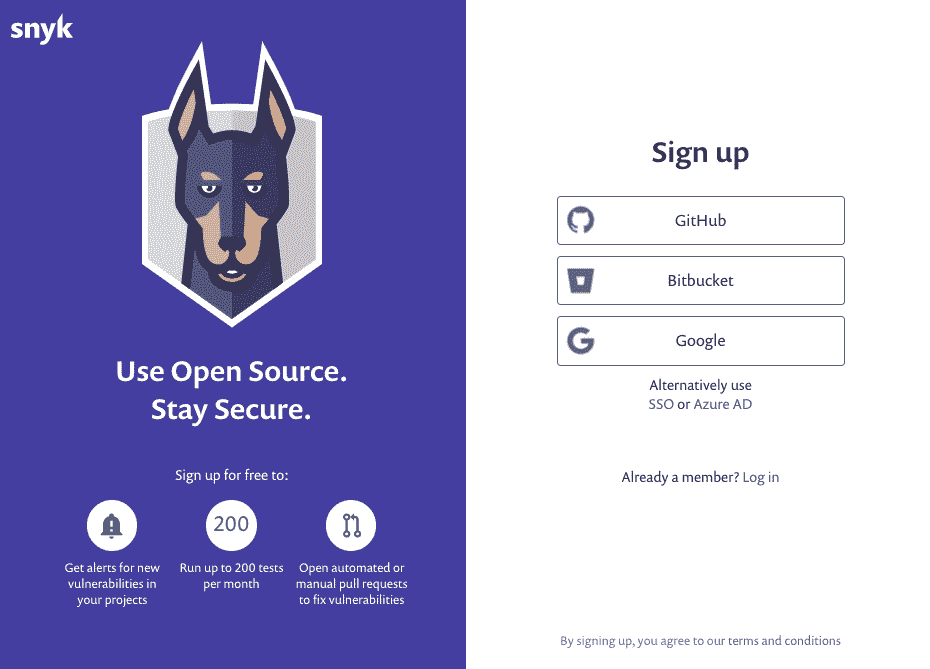
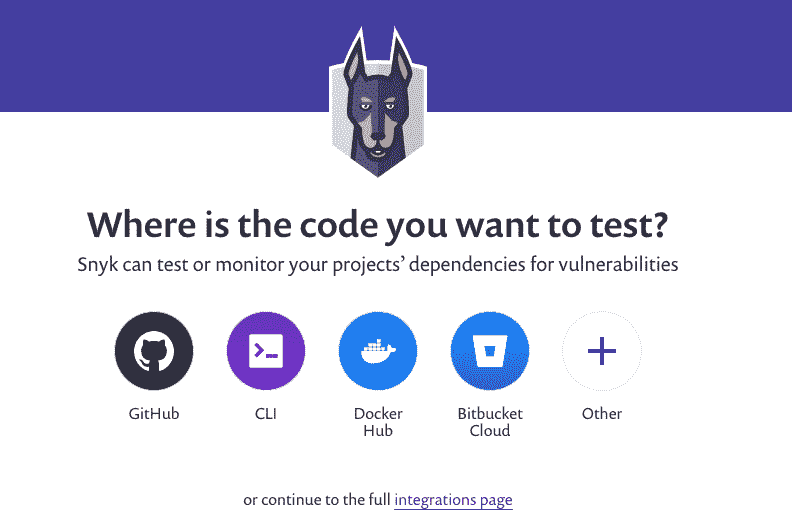
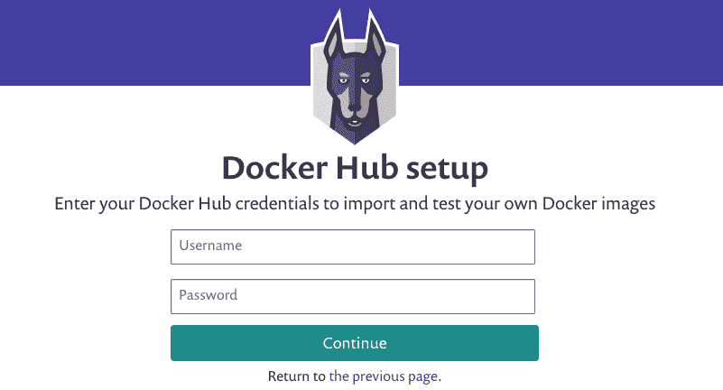
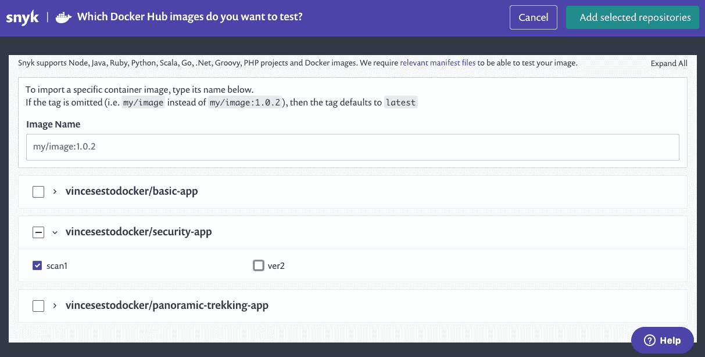
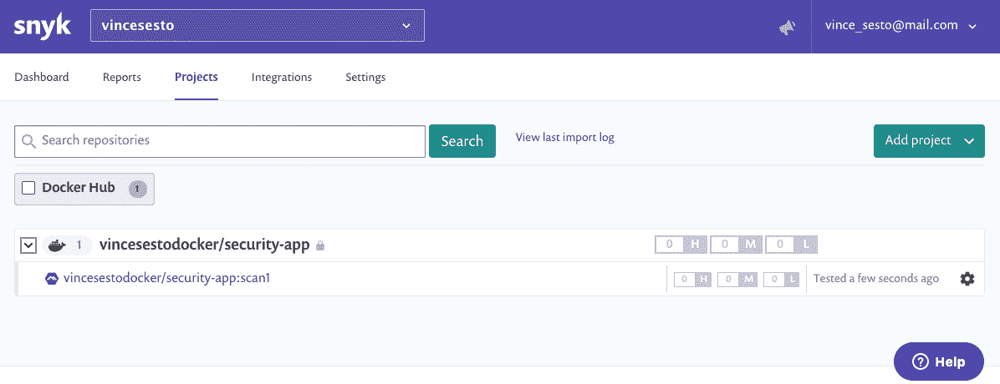
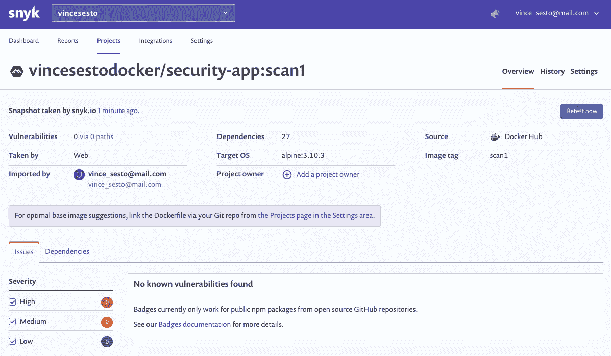

# 十一、Docker 安全

概观

在本章中，我们将为您提供所需的信息，以确保您的容器是安全的，并且不会对使用运行在容器上的应用的人造成安全风险。您将使用特权和非特权容器，并了解为什么不应该在根用户下运行容器。本章将帮助您使用签名密钥验证映像是否来自可信来源。您还将为 Docker 映像设置安全扫描，确保您的映像可以安全使用和分发。您将与 AppArmor 合作，通过使用容器和 Linux 的安全计算模式(`seccomp`)来创建和使用带有 Docker 映像的`seccomp`配置文件，从而进一步保护容器。

# 简介

这一章试图解决一个可能有整本书专门讨论的问题。我们试图通过 Docker 教育您如何处理安全问题。前几章已经为您提供了使用 Docker 构建应用的坚实基础，这一章希望使用这些信息也为它们的运行提供安全稳定的容器。

Docker 和微服务架构允许我们从一个更安全、更健壮的环境开始管理我们的服务，但这并不意味着我们需要完全忘记安全性。本章详细介绍了我们在跨环境创建和维护服务时需要考虑的一些方面，以及您可以在工作系统中开始实现这些过程的方式。

Docker 安全不应该与您的常规 IT 安全流程分开，因为概念是相同的。Docker 有不同的方法来处理这些概念，但是一般来说，从 Docker 安全性开始的一个很好的地方如下:

*   **访问控制**:确保运行的容器不能被攻击者访问，并且权限也受到限制。
*   **更新和修补操作系统**:我们需要确保我们的映像使用的是可信来源。我们还需要能够扫描我们的映像，以确保任何引入的应用不会引入额外的漏洞。
*   **数据敏感度**:所有敏感信息应保持不可访问。这可能是密码、个人信息或您不想让任何人获得的任何其他数据。

在这一章中，我们将涵盖大量的信息，这些信息将涵盖前面的要点和更多内容。我们将首先考虑 Docker 容器在运行时可能具有的不同访问权限，以及如何开始限制它们可以执行的操作。然后，我们将更仔细地研究保护映像、使用签名密钥以及如何验证它们来自可信来源。我们还将练习根据已知漏洞扫描您的映像，以确保它们可以安全使用。本章的最后两部分将集中讨论如何使用 AppArmor 和`seccomp`安全配置文件来进一步限制运行容器的功能和访问权限。

注意

当在 Docker 映像中使用机密和密码时，Swarm 和 Kubernetes 等编排方法提供了安全的方法来存储您的机密，而无需将它们存储为明文配置供每个人访问。如果您没有使用这些编排方法之一，我们也将在下一章中提供一些关于如何在映像中使用机密的想法。

# 容器中的特权和根用户访问

提高容器安全性的一个重要方法是减少攻击者获得访问权限的可能性。攻击者可以在容器上运行的命令类型受限于在容器上运行进程的用户的访问级别。因此，如果在运行的容器上没有根权限或提升的权限，这就限制了攻击者的能力。另一件需要记住的事情是，如果一个容器被破坏并且作为根用户运行，这也可能允许攻击者逃离该容器并访问运行 Docker 的主机系统。

在容器上运行的大多数进程都是不需要 root 访问权限的应用，这与在服务器上运行进程是一样的，在服务器上，您也不会以 root 身份运行它们。运行在容器上的应用应该只能访问它们需要的内容。提供根访问的原因，特别是在基本映像中，是因为应用需要安装在容器上，但这应该只是一种临时措施，您的完整映像作为另一个用户运行。

为此，在创建我们的映像时，我们可以设置一个 Dockerfile，并创建一个用户来运行容器上的进程。下一行与在 Linux 命令行上设置用户相同，我们首先设置组，然后将用户分配到该组:

```
RUN addgroup --gid <GID> <UID> && adduser <UID> -h <home_directory> --disabled-password --uid <UID> --ingroup <UID> <user_name>
```

在前面的命令中，我们还使用了`adduser`选项来设置`home`目录并禁用登录密码。

注意

`addgroup`和`adduser`是特定于基于 Alpine 的映像的，它们是基于 Linux 的映像，但是使用不同于基于 Debian 的映像的包和实用程序。基于 Alpine 的映像之所以使用这些包，是因为它们选择了更轻量级的实用程序和应用。如果您使用的是基于 Ubuntu/Debian 或红帽的映像，您需要使用`useradd`和`groupadd`命令，以及这些命令的相关选项。

正如您将在接下来的练习中看到的，我们将切换到我们专门创建的用户，以创建我们将要运行的流程。您对组和用户的命名是可选的，但是许多用户更喜欢使用四位或五位数字，因为这不会向潜在攻击者突出显示该用户的任何进一步权限，并且通常是创建用户和组的标准做法。在我们的 Dockerfile 中，在我们创建流程之前，我们包含`USER`指令，并包含我们之前创建的用户的用户 ID:

```
USER <UID>
```

在本章的这一部分，我们将介绍一个新的映像，并展示如果容器上的进程由根用户运行时可能出现的问题。我们还将向您展示容器中的根用户如何与底层主机上的根用户相同。然后，我们将更改我们的映像，以显示删除对容器上运行的进程的根访问的好处。

注意

请使用`touch`命令创建文件，使用`vim`命令使用 vim 编辑器处理文件。

## 练习 11.01:作为根用户运行容器

当我们与根用户一起运行容器进程时，可能会出现许多问题。本练习将演示特定的安全问题，例如更改访问权限、终止进程、更改域名系统，以及如何使您的映像和底层操作系统变得易受攻击。您将观察到，作为根用户，攻击者还可以使用`nmap`等工具扫描网络中的开放端口和网络目标。

您还将纠正这些问题，从而限制攻击者对正在运行的容器的操作:

1.  Create a new Dockerfile named `Dockerfile_original` with your favorite text editor and enter the following code into the file. All of the commands are currently being run as the root user in this step:

    ```
    1 FROM alpine
    2
    3 RUN apk update
    4 RUN apk add wget curl nmap libcap
    5
    6 RUN echo "#!/sh\n" > test_memory.sh
    7 RUN echo "cat /proc/meminfo; mpstat; pmap -x 1"     >> test_memory.sh
    8 RUN chmod 755 test_memory.sh
    9
    10 CMD ["sh", "test_memory.sh"]
    ```

    这将创建一个基本应用，运行一个名为`test_memory.sh`的小脚本，该脚本使用`meminfo`、`mpstat`和`pmap`命令来提供容器内存状态的详细信息。您还会注意到，在*第 4 行*上，我们正在安装一些额外的应用，以便使用`nmap`查看网络进程，并允许我们使用`libcap`库查看用户容器功能。

2.  Build the `security-app` image and run the image in the same step:

    ```
    docker build -t security-app . ; docker run –rm security-app
    ```

    输出大幅减少，您应该会看到映像构建，然后运行内存报告:

    ```
    MemTotal:        2036900 kB
    MemFree:         1243248 kB
    MemAvailable:    1576432 kB
    Buffers:          73240 kB
    …
    ```

3.  Use the `whoami` command to view the running user on the container:

    ```
    docker run --rm security-app whoami
    ```

    运行的用户是根用户，这并不奇怪:

    ```
    root
    ```

4.  Use the `capsh –print` command to see the processes that the user is able to run on the container. As the root user, you should have a large number of capabilities available:

    ```
    docker run --rm -it security-app capsh –print
    ```

    您会注意到用户有权更改文件的所有权(`cap_chown`)、终止进程(`cap_kill`)以及更改域名系统(`cap_net_bind_service`)等等。这些都是在运行环境中会导致许多问题的高级流程，容器不应该使用这些流程:

    ```
    Current: = cap_chown,cap_dac_override,cap_fowner,cap_fsetid,
    cap_kill,cap_setgid,cap_setuid,cap_setpcap,cap_net_bind_service,
    cap_net_raw,cap_sys_chroot,cap_mknod,cap_audit_write,
    cap_setfcap+eip
    groups=0(root),1(bin),2(daemon),3(sys),4(adm),6(disk),10(wheel),
    11(floppy),20(dialout),26(tape),27(video)
    ```

5.  As the root user, an attacker would also be able to use tools such as `nmap`, which we installed earlier, to scan the network for open ports and network targets. Run your container images again by passing the `nmap` command, looking for the opened `443` port under `localhost`:

    ```
    docker run --rm -it security-app sh -c 'nmap -sS -p 443 localhost'
    ```

    该命令的输出如下:

    ```
    Starting Nmap 7.70 ( https://nmap.org ) at 2019-11-13 02:40 UTC
    Nmap scan report for localhost (127.0.0.1)
    Host is up (0.000062s latency).
    Other addresses for localhost (not scanned): ::1
    PORT    STATE  SERVICE
    443/tcp closed https
    Nmap done: 1 IP address (1 host up) scanned in 0.27 seconds
    ```

    注意

    前面的`nmap`扫描没有找到任何开放的网络，但是它是一个提升的命令，不应该被任何用户运行。我们将在本练习的后面演示非根用户无法运行此命令。

6.  As previously mentioned, being the root user on your container is the same as being the root user on the underlying host. This can be demonstrated by mounting a file owned by the root onto the container. To do that, create a secret file. Echo your secret password into the `/tmp/secret.txt` file:

    ```
    echo "secret password" > /tmp/secret.txt
    ```

    更改所有权以确保根用户拥有它:

    ```
    sudo chown root /tmp/secret.txt
    ```

7.  Use the `docker run` command to mount the file on the running container and check whether you are able to access it and view the data in the file. The user on the container can access the file that the root user on the host system should only have access to:

    ```
    docker run -v /tmp/secret.txt:/tmp/secret.txt security-app sh -c 'cat /tmp/secret.txt'
    ```

    docker 运行命令的输出将是单词“`secret password`”

    ```
    secret password
    ```

    但是，Docker 容器应该不能公开这些信息。

8.  要开始对您的容器进行一些简单的更改以阻止这种访问再次发生，请再次打开 Dockerfile 并添加突出显示的代码(*第 6 行*、*第 7 行*、*第 8 行*和*第 9 行*，保持前几行代码不变。这几行代码将创建一个组`10001`和一个用户`20002`。用户将被设置一个`home`目录，然后您将进入该目录并开始使用*第 9 行* :

    ```
    1 FROM alpine
    2
    3 RUN apk update
    4 RUN apk add wget curl nmap libcap
    5
    6 RUN addgroup --gid 10001 20002 && adduser 20002 -h     /home/security_apps --disabled-password --uid 20002     --ingroup 20002
    7 WORKDIR /home/security_apps
    8
    9 USER 20002
    ```

    中的`USER`指令
9.  Make a change to *line 15* to make sure the script is being run from the new `security_app` directory, and then save the Dockerfile:

    ```
    11 RUN echo "#!/sh\n" > test_memory.sh
    12 RUN echo "cat /proc/meminfo; mpstat; pmap -x 1" >>     test_memory.sh
    13 RUN chmod 755 test_memory.sh
    14
    15 CMD ["sh", "/home/security_apps/test_memory.sh"]
    ```

    完整的 Dockerfile 应该如下所示:

    ```
    FROM alpine
    RUN apk update
    RUN apk add wget curl nmap libcap
    RUN addgroup --gid 10001 20002 && adduser 20002 -h   /home/security_apps --disabled-password --uid 20002     --ingroup 20002
    WORKDIR /home/security_apps
    USER 20002
    RUN echo "#!/sh\n" > test_memory.sh
    RUN echo "cat /proc/meminfo; mpstat; pmap -x 1" >>   test_memory.sh
    RUN chmod 755 test_memory.sh
    CMD ["sh", "/home/security_apps/test_memory.sh"]
    ```

10.  Build the image again and run it with the `whoami` command:

    ```
    docker build -t security-app . ; docker run --rm security-app whoami
    ```

    您将看到一个新用户为`20002`，而不是根用户:

    ```
    20002
    ```

11.  Previously, you were able to run `nmap` from the container. Verify whether the new user is stopped from accessing the `nmap` command now to scan for network vulnerabilities:

    ```
    docker run --rm -it security-app sh -c 'nmap -sS -p 443 localhost'
    ```

    通过使用`nmap -sS`命令再次运行您的映像，您现在应该被停止运行该命令，因为容器正在运行的`20002`用户没有足够的权限运行该命令:

    ```
    You requested a scan type which requires root privileges.
    QUITTING!
    ```

12.  You have now drastically limited what can be done with the running container, but are files that are owned by the host root user still accessible by the `security-app` running container? Mount the file again and see whether you can output the information on the file:

    ```
    docker run -v /tmp/secret.txt:/tmp/secret.txt security-app sh -c 'cat /tmp/secret.txt'
    ```

    您应该在结果中看到`Permission denied`，确保容器不再能够访问`secret.txt`文件:

    ```
    cat: can't open '/tmp/secret.txt': Permission denied
    ```

正如我们在本练习中所演示的，删除运行容器对根用户的访问是减少攻击者获得对运行映像的访问权限的第一步。下一节将快速了解运行容器的权限和功能，以及如何使用`docker run`命令来操作它们。

## 运行时权限和 Linux 功能

当运行您的容器时，Docker 提供了一个覆盖所有安全和用户选项的标志。这是通过使用`––privileged`选项运行您的容器来完成的。虽然您已经看到了当容器作为根用户运行时用户可以实现什么，但是我们是在非特权状态下运行容器的。虽然提供了`––privileged`选项，但应该谨慎使用，如果有人请求在此模式下运行您的容器，我们应该谨慎。有一些特定的情况——例如，如果您需要在树莓 Pi 上运行 Docker 并需要访问底层架构——您可能希望向用户添加功能。

如果您需要为您的容器提供额外的特权来运行特定的命令和函数，Docker 提供了一种更简单的方法，使用`––cap–add`和`––cap–drop`选项。这意味着您可以使用`––cap–add`和`––cap–drop`来限制用户可以实现的功能，而不是通过`––privileged`选项提供完全控制。

运行容器时，`––cap–add`和`––cap–drop`可以同时使用。例如，您可能希望包括`––cap–add=all`和`––cap–drop=chown`。

以下是`––cap` `–add`和`––cap–drop`可用的一些功能的简短列表:

*   `setcap`:修改运行系统的进程能力。
*   `mknod`:使用`mknod`命令在运行的系统上创建特殊文件。
*   `chown`:对文件的 UID 和 GID 值进行文件所有权更改。
*   `kill`:绕过发送信号停止进程的权限。
*   `setgid/setuid`:更改进程的 UID 和 GID 值。
*   `net_bind_service`:将套接字绑定到域端口。
*   `sys_chroot`:更改运行系统上的`root`目录。
*   `setfcap`:设置文件的功能。
*   `sys_module`:在运行的系统上加载和卸载内核模块。
*   `sys_admin`:执行一系列管理操作。
*   `sys_time`:更改并设置系统时钟的时间。
*   `net_admin`:执行一系列与联网相关的管理操作。
*   `sys_boot`:重启系统，在系统上加载新的内核，以便以后执行。

要添加额外的功能，您只需包含功能，如果您在执行`docker run`命令时添加或删除功能，您的命令如下:

```
docker run –-cap-add|--cap-drop <capability_name> <image_name>
```

如您所见，语法使用`––cap–add`添加功能，使用`––cap–drop`移除功能。

注意

如果您有兴趣查看运行容器时可以添加和删除的功能的完整列表，请前往[http://man7.org/linux/man-pages/man7/capabilities.7.html](http://man7.org/linux/man-pages/man7/capabilities.7.html)。

我们已经简要介绍了权限和功能的使用。在本章的后面，我们将有机会在测试安全配置文件时使用该功能。不过，目前我们将考虑使用数字签名和 Docker 映像来验证它们的真实性。

# 签署和验证 Docker 映像

正如我们可以确保我们在系统上购买和安装的应用来自可信来源一样，我们也可以对我们使用的 Docker 映像进行同样的操作。运行不受信任的 Docker 映像可能会成为巨大的风险，并可能在我们的系统中造成重大问题。这就是为什么我们应该寻找我们正在使用的映像的具体证据。不受信任的来源可能会向运行的映像添加代码，这可能会使整个网络暴露给攻击者。

幸运的是，Docker 有一种对我们的映像进行数字签名的方法，以确保我们使用的映像来自经过验证的供应商或提供商。这也将确保映像在最初签名后没有被更改或损坏，从而确保一定的真实性。这不应该是我们信任自己形象的唯一方式。正如您将在本章后面看到的，一旦我们有了映像，我们就可以扫描它，以确保避免安装可能有安全问题的映像。

Docker 允许我们签名和验证映像的方式是使用 **Docker 内容信任** ( **DCT** )。DCT 作为 Docker Hub 的一部分提供，允许您对从注册表发送和接收的所有数据使用数字签名。离散余弦变换与映像标签相关联，因此并非所有映像都需要标记，因此，并非所有映像都有与之相关联的离散余弦变换。这将意味着任何想要发布映像的人都可以这样做，但是在需要签名之前能够确保映像正常工作。

离散余弦变换不仅止于 Docker Hub。如果用户在他们的环境中启用了 DCT，他们将只能提取、运行或构建受信任的映像，因为 DCT 确保用户只能看到签名的映像。离散余弦变换信任是通过使用签名密钥来管理的，签名密钥是在您第一次运行离散余弦变换时创建的。创建密钥集时，它由三种不同类型的密钥组成:

*   **离线键**:用于创建标记键。它们应该被小心地存储，并且归创建映像的用户所有。如果这些密钥丢失或泄露，可能会给发布者带来很多问题。
*   **存储库或标记键**:它们驻留在发布者处，并与映像存储库相关联。当您签署您的受信任映像准备好被推送到您的存储库时，将使用它们。
*   **Server managed keys**: These are also associated with the image repository and are stored on the server.

    注意

    请确保您的离线密钥安全，因为如果您丢失了离线密钥，将会导致许多问题，因为 Docker 支持很可能需要参与重置存储库状态。它还需要所有使用过存储库中签名映像的消费者的手动干预。

正如我们在前面几节中看到的，Docker 提供了易于使用的命令行选项来生成、加载和使用签名密钥。如果您启用了 DCT，Docker 将设置您的密钥，并直接用它们为您的映像签名。如果你想控制得更远一点，你可以使用`docker trust key generate`命令用你指定的名称创建你的离线键:

```
docker trust key generate <name>
```

您的密钥将存储在`.docker/trust`目录中的`home`目录中。如果您有一组脱机密钥，您可以使用`docker trust key load`命令和密钥以及创建它们的名称，如下所示:

```
docker trust key load <pem_key_file> –name <name>
```

一旦你有了你的钥匙，或者你加载了你的原始钥匙，你就可以开始签署你的映像。您需要使用`docker trust sign`命令包括完整的注册表名称和映像标签:

```
docker trust sign <registry>/<repo>:<tag>
```

一旦您对您的映像进行了签名，或者您有一个需要验证是否已签名的映像，您可以使用`docker trust inspect`命令显示签名密钥和颁发者的详细信息:

```
docker trust inspect –pretty <registry>/<repo>:<tag>
```

使用离散余弦变换作为开发过程的一部分可以防止用户使用来自不可信和未知来源的容器映像。我们将使用我们在本章前面几节中开发的安全应用来创建和实现一个 DCT 签名密钥。

## 练习 11.02:签署 Docker 映像并在您的系统上使用 DCT

在下面的练习中，您将了解如何在您的环境中使用 DCT 和使用签名映像实现流程。您将从导出`DOCKER_CONTENT_TRUST`环境变量开始，以在您的系统上启用离散余弦变换。接下来，您将学习如何签署映像并验证已签署的映像:

1.  将`DOCKER_CONTENT_TRUST`环境变量导出到您的系统，以在您的系统上启用 DCT。另外，确保变量设置为`1` :

    ```
    export DOCKER_CONTENT_TRUST=1
    ```

2.  Now that DCT is enabled, you won't be able to pull or work with any Docker images that do not have a signed key associated with them. We can test this by pulling the `security-app` image from our Docker Hub repository:

    ```
    docker pull vincesestodocker/security-app
    ```

    正如您从错误消息中看到的，我们无法提取最新的映像，这是一个好消息，因为我们最初没有使用签名密钥推送它:

    ```
    Using default tag: latest
    Error: remote trust data does not exist for docker.io/vincesestodocker/security-app: notary.docker.io does 
    not have trust data for docker.io/vincesestodocker/security-app
    ```

3.  Push the image to your image repository:

    ```
    docker push vincesestodocker/security-app
    ```

    您应该无法执行此操作，因为没有与此本地映像相关联的签名密钥:

    ```
    The push refers to repository 
    [docker.io/vincesestodocker/security-app]
    No tag specified, skipping trust metadata push
    ```

4.  将新映像标记为`trust1` :

    ```
    docker tag security-app:latest vincesestodocker/security-app:trust1
    ```

    ，准备推送至 Docker Hub
5.  As mentioned earlier, a signing key will be associated automatically with the image when we push it to our repository for the first time. Make sure to tag your image, as this will stop DCT from recognizing that it needs to be signed. Push the image to the repository again:

    ```
    docker push vincesestodocker/security-app:trust1
    ```

    运行上述命令后，将打印以下行:

    ```
    The push refers to repository 
    [docker.io/vincesestodocker/security-app]
    eff6491f0d45: Layer already exists 
    307b7a157b2e: Layer already exists 
    03901b4a2ea8: Layer already exists 
    ver2: digest: sha256:7fab55c47c91d7e56f093314ff463b7f97968e
    e0f80f5ee927430fc39f525f66 size: 949
    Signing and pushing trust metadata
    You are about to create a new root signing key passphrase. 
    This passphrase will be used to protect the most sensitive key 
    in your signing system. Please choose a long, complex passphrase 
    and be careful to keep the password and the key file itself 
    secure and backed up. It is highly recommended that you use a 
    password manager to generate the passphrase and keep it safe. 
    There will be no way to recover this key. You can find the key 
    in your config directory.
    Enter passphrase for new root key with ID 66347fd: 
    Repeat passphrase for new root key with ID 66347fd: 
    Enter passphrase for new repository key with ID cf2042d: 
    Repeat passphrase for new repository key with ID cf2042d: 
    Finished initializing "docker.io/vincesestodocker/security-app"
    Successfully signed docker.io/vincesestodocker/security-app:
    trust1
    ```

    以下输出显示，当映像被推送到注册表时，作为该过程的一部分，会创建一个新的签名密钥，请求用户在该过程中创建新的根密钥和存储库密钥。

6.  It's a lot more secure now. What about running the image on your system, though? With DCT now enabled on our system, will there be any issues running on our container image? Use the `docker run` command to run the `security-app` image on your system:

    ```
    docker run -it vincesestodocker/security-app sh
    ```

    该命令应返回以下输出:

    ```
    docker: No valid trust data for latest.
    See 'docker run --help'.
    ```

    在前面的输出中，我们特意没有使用`trust1`标签。如前几章，Docker 将尝试运行带有`latest`标签的映像。因为它也没有与之关联的签名密钥，所以您无法运行它。

7.  您可以直接从工作系统中对映像进行签名，并且可以使用之前创建的密钥对后续标记的映像进行签名。用`trust2`标签标记您的映像:

    ```
    docker tag vincesestodocker/security-app:trust1 vincesestodocker/security-app:trust2
    ```

8.  Sign the newly tagged image with the signing key created earlier in this exercise. Use the `docker trust sign` command with the image name and tag to sign the image and layers of the image:

    ```
    docker trust sign vincesestodocker/security-app:trust2
    ```

    该命令还会自动将签名的映像推送到我们的 Docker Hub 存储库中:

    ```
    Signing and pushing trust data for local image 
    vincesestodocker/security-app:trust2, may overwrite remote 
    trust data
    The push refers to repository 
    [docker.io/vincesestodocker/security-app]
    015825f3a965: Layer already exists 
    2c32d3f8446b: Layer already exists 
    1bbb374ec935: Layer already exists 
    bcc0069f86e9: Layer already exists 
    e239574b2855: Layer already exists 
    f5e66f43d583: Layer already exists 
    77cae8ab23bf: Layer already exists 
    trust2: digest: sha256:a61f528324d8b63643f94465511132a38ff945083c
    3a2302fa5a9774ea366c49 size: 1779
    Signing and pushing trust metadataEnter passphrase for 
    vincesestodocker key with ID f4b834e: 
    Successfully signed docker.io/vincesestodocker/security-app:
    trust2
    ```

9.  View the signing information using the `docker trust` command with the `inspect` option:

    ```
    docker trust inspect --pretty vincesestodocker/security-app:trust2
    ```

    输出将为您提供签名者的详细信息、已签名的标记映像以及映像上的其他信息:

    ```
    Signatures for vincesestodocker/security-app:trust2
    SIGNED TAG      DIGEST                     SIGNERS
    trust2          d848a63170f405ad3…         vincesestodocker
    List of signers and their keys for vincesestodocker/security-app:
    trust2
    SIGNER              KEYS
    vincesestodocker    f4b834e54c71
    Administrative keys for vincesestodocker/security-app:trust2
      Repository Key:
        26866c7eba348164f7c9c4f4e53f04d7072fefa9b52d254c573e8b082
        f77c966
      Root Key:
        69bef52a24226ad6f5505fd3159f778d6761ac9ad37483f6bc88b1cb4
        7dda334
    ```

10.  Use the `docker trust revoke` command to remove the signature of the associated key:

    ```
    docker trust revoke vincesestodocker/security-app:trust2
    Enter passphrase for vincesestodocker key with ID f4b834e: 
    Successfully deleted signature for vincesestodocker/security-app:
    trust2
    ```

    注意

    如果您使用自己的 Docker 注册表，您可能需要设置一个公证服务器，以允许 DCT 与您的 Docker 注册表一起工作。亚马逊的弹性容器注册中心和 Docker 可信注册中心等产品在其产品中内置了公证员。

如您所见，使用离散余弦变换对 Docker 映像进行签名和验证，可以轻松控制作为应用一部分的映像。使用来自可信来源的签名映像只是等式的一部分。在下一节中，我们将使用 Anchore 和 Snyk 开始扫描我们的映像以查找漏洞。

# Docker 映像安全扫描

安全扫描不仅在确保应用的正常运行时间方面发挥着重要作用，而且还确保您没有运行过时、未修补或易受攻击的容器映像。应该对您的团队和环境中使用的所有映像执行安全扫描。如果你从头开始创造了它们，并且信任它们，这并不重要；这仍然是降低您环境中潜在风险的重要一步。本章的这一部分将介绍两种扫描映像的方法，这两种方法很容易被您的开发团队采用。

通过对我们的 Docker 映像进行安全扫描，我们希望实现以下目标:

*   我们需要保存一个已知和最新漏洞的数据库，或者使用一个代表我们保存该数据库的应用。
*   我们根据这个漏洞数据库扫描我们的 Docker 映像，不仅验证底层操作系统是安全的和打补丁的，而且验证容器使用的开源应用和我们的软件实现使用的语言是安全的。
*   安全扫描完成后，我们需要获得一份完整的报告，说明在我们的映像上扫描了哪些内容，并报告和提醒扫描过程中可能突出显示的任何问题。
*   最后，通过更新 Dockerfile 中使用的基础映像或支持使用的应用，安全扫描可以对发现的任何问题进行补救并发出警报。

市场上有很多产品可以为您执行安全扫描，包括付费的和开源的。本章的篇幅有限，因此我们选择了两种既易于使用又能提供良好功能的服务。第一个是 Anchore，这是一个开源的容器分析工具，我们将把它安装到我们的系统上，并作为本地工具运行来测试我们的映像。然后我们将看看 Snyk，这是一个在线的 SaaS 产品。有一个 Snyk 的免费版本，这是我们将在本章中用来演示它如何工作的版本。它提供了不错的功能，不需要每月付费。

# 使用锚定安全扫描在本地扫描映像

Anchore Container Analysis 是一个开源静态分析工具，允许您扫描 Docker 映像，并根据用户定义的策略提供通过或失败的结果。Anchore Engine 允许用户在不运行映像的情况下提取映像，分析映像内容，并评估映像是否适合使用。Anchore 使用 PostgreSQL 数据库来存储已知漏洞的详细信息。然后，您可以使用命令行界面根据数据库扫描映像。Anchore 还使入门变得非常容易，我们将在下面的练习中看到，因为它提供了一个易于使用的`docker-compose`文件来自动安装，并让您尽快入门。

注意

如果你有兴趣了解更多关于主播的信息，https://docs.anchore.com/current/有大量的文档和信息。

在接下来的练习中，一旦我们的环境启动并运行，您将使用 Anchore 的应用编程接口与它进行交互。`anchore-cli`命令附带了许多易于使用的命令来检查系统状态，并开始评估我们的映像的漏洞。

一旦我们的系统启动并运行，我们可以使用`system status`命令提供我们所有服务的列表，并确保它们启动并运行:

```
anchore-cli system status
```

一旦系统启动并运行，您需要做的第一件事就是验证提要列表是否是最新的。这将确保您的数据库已经填充了漏洞源。这是通过以下`system feeds list`命令实现的:

```
anchore-cli system feeds list
```

默认情况下，`anchore-cli`将使用 Docker Hub 作为您的映像注册表。如果您的映像位于不同的注册表中，您将需要使用`anchore-cli registry add`命令添加注册表，并指定注册表名称，以及包含 Anchore 可以使用的用户名和密码:

```
anchore-cli registry add <registry> <user> <password>
```

要向 Anchore 添加映像，可以使用`image add`命令行选项，包括 Docker Hub 位置和映像名称:

```
anchore-cli image add <repository_name>/<image_name>
```

如果您希望扫描映像中的漏洞，可以使用`image vuln`选项，包括您最初扫描的映像名称。我们还可以对操作系统特定的漏洞使用`os`选项，对语言相关的漏洞使用`non-os`选项。在以下示例中，我们使用了`all`来包含`os`和`non-os`选项:

```
anchore-cli image vuln <repository_name>/<image_name> all
```

然后，要查看已完成的映像评估，并获得映像是否可以安全使用的合格或不合格信息，请使用`anchore-cli`命令的`evaluate check`选项:

```
anchore-cli evaluate check <repository_name>/<image_name>
```

考虑到这一点，Anchore 确实提供了一个受支持的付费版本，具有易于使用的网络界面，但是正如您将在下面的练习中看到的，让 Anchore 应用在您的系统上运行和扫描并不需要太多的艰苦工作。

注意

前面的练习使用了离散余弦变换作为容器创建和签名的一部分。在下面的练习中，练习所需的 Anchore 映像使用了`latest`标记，因此如果您仍在运行 DCT，则需要在继续下一个练习之前停止它:

`export DOCKER_CONTENT_TRUST=0`

## 练习 11.03:开始主播映像扫描

在下面的练习中，您将使用`docker-compose`将 Anchore 安装到您的本地系统上，并开始分析您在本章中使用的映像:

1.  Create and tag a new version of the `security-app` image that you have been working on. Tag the image with the `scan1` tag:

    ```
    docker tag security-app:latest vincesestodocker/security-app:scan1 ;
    ```

    将其推送到 Docker Hub 存储库:

    ```
    docker push vincesestodocker/security-app:scan1
    ```

2.  创建一个名为`aevolume`的新目录，并使用以下命令进入该目录。这是我们将执行工作的地方:

    ```
    mkdir aevolume; cd aevolume
    ```

3.  Anchore 在一个易于使用的`docker-compose.yaml`文件中为您提供了开始设置和运行 Anchore API 所需的一切。使用以下命令拉出最新的`anchore-engine` Docker 编写文件:

    ```
    curl -O https://docs.anchore.com/current/docs/engine/quickstart/docker-compose.yaml
    ```

4.  浏览`docker-compose.yml`文件。虽然它包含 130 多行，但文件中没有太复杂的内容。`Compose`文件正在设置 Anchore 的功能，包括 PostgreSQL 数据库、目录和分析器以供查询；简单的队列和策略引擎；和运行命令和查询的应用编程接口。
5.  Pull the images needed by the `docker-compose.yml` file using the `docker-compose pull` command, making sure you are in the same directory as the `Compose` file:

    ```
    docker-compose pull
    ```

    该命令将开始提取数据库、目录、分析器、简单队列、策略引擎和应用编程接口:

    ```
    Pulling anchore-db           ... done
    Pulling engine-catalog       ... done
    Pulling engine-analyzer      ... done
    Pulling engine-policy-engine ... done
    Pulling engine-simpleq       ... done
    Pulling engine-api           ... done
    ```

6.  If all our images are now available, as seen in the preceding output, there is nothing left to do other than running the `Compose` file using the `docker-compose up` command. Use the `-d` option to have all of the containers running in the background as daemons:

    ```
    docker-compose up -d
    ```

    该命令应输出以下内容:

    ```
    Creating network "aevolume_default" with the default driver
    Creating volume "aevolume_anchore-db-volume" with default driver
    Creating volume "aevolume_anchore-scratch" with default driver
    Creating aevolume_anchore-db_1 ... done
    Creating aevolume_engine-catalog_1 ... done
    Creating aevolume_engine-analyzer_1      ... done
    Creating aevolume_engine-simpleq_1       ... done
    Creating aevolume_engine-api_1           ... done
    Creating aevolume_engine-policy-engine_1 ... done
    ```

7.  Run the `docker ps` command to have the running containers on your system that make up Anchore ready to start scanning our images. The `IMAGE`, `COMMAND`, and `CREATED` columns are removed from the table for convenience:

    ```
    docker-compose ps
    ```

    输出中的所有值应显示每个固定发动机容器的`healthy`:

    ```
    CONTAINER ID       STATUS         PORTS
        NAMES
    d48658f6aa77       (healthy)      8228/tcp
        aevolume_engine-analyzer_1
    e4aec4e0b463   (healthy)          8228/tcp
        aevolume_engine-policy-engine_1
    afb59721d890   (healthy)          8228->8228/tcp
        aevolume_engine-api_1
    d61ff12e2376   (healthy)          8228/tcp
        aevolume_engine-simpleq_1
    f5c29716aa40   (healthy)          8228/tcp
        aevolume_engine-catalog_1
    398fef820252   (healthy)          5432/tcp
        aevolume_anchore-db_1
    ```

8.  Now that the environment is deployed onto your system, use the `docker-compose exec` command to run the `anchor-cli` commands mentioned earlier. Use the `pip3` command to install the `anchorecli` package onto your running system. The `--version` command has been used to verify whether `anchore-cli` has installed successfully:

    ```
    pip3 install anchorecli; anchore-cli --version
    ```

    该命令返回`anchor-cli`版本:

    ```
    anchore-cli, version 0.5.0
    ```

    注意

    版本可能因您的系统而异。

9.  You could now run your `anchore-cli` command, but you would need to specify the URL (using `--url`) to your API and the username and password (using `--u` and `--p`). Instead, export the values to your environment with the following commands so that you don't need to use the extra command-line options:

    ```
    export ANCHORE_CLI_URL=http://localhost:8228/v1
    export ANCHORE_CLI_USER=admin
    export ANCHORE_CLI_PASS=foobar
    ```

    注意

    前面的变量是 Anchore 提供的`Compose`文件的默认值。如果您决定设置在您的部署环境中运行的环境，您很可能会更改这些环境以提高安全性。

10.  With `anchore-cli` now installed and configured, use the `anchore-cli system status` command to verify that the analyzer, queue, policy engine, catalog, and API are all up and running:

    ```
    anchore-cli system status
    ```

    可能有一两个服务关闭的情况，这意味着您很可能需要重新启动容器:

    ```
    Service analyzer (anchore-quickstart, http://engine-analyzer:
    8228): up
    Service simplequeue (anchore-quickstart, http://engine-simpleq:
    8228): up
    Service policy_engine (anchore-quickstart, http://engine-policy-engine:8228): up
    Service catalog (anchore-quickstart, http://engine-catalog:
    8228): up
    Service apiext (anchore-quickstart, http://engine-api:8228): 
    up
    Engine DB Version: 0.0.11
    Engine Code Version: 0.5.1
    ```

    注意

    `Engine DB Version`和`Engine Code Version`可能因系统而异。

11.  Use the `anchore-cli system feeds list` command to see all of the vulnerabilities in your database:

    ```
    anchore-cli system feeds list
    ```

    可以想象，由于向数据库提供了大量漏洞，以下输出已经减少:

    ```
    Feed                Group          LastSync
        RecordCount
    nvdv2               nvdv2:cves     None
        0
    vulnerabilities     alpine:3\.      2019-10-24T03:47:28.504381
        1485
    vulnerabilities     alpine:3.3     2019-10-24T03:47:36.658242
        457
    vulnerabilities     alpine:3.4     2019-10-24T03:47:51.594635
        681
    vulnerabilities     alpine:3.5     2019-10-24T03:48:03.442695
        875
    vulnerabilities     alpine:3.6     2019-10-24T03:48:19.384824
        1051
    vulnerabilities     alpine:3.7     2019-10-24T03:48:36.626534
        1253
    vulnerabilities     alpine:3.8     None
        0
    vulnerabilities     alpine:3.9     None
        0
    vulnerabilities     amzn:2         None
        0
    ```

    在前面的输出中，您会注意到一些漏洞提要显示`None`。这是因为数据库是最近才建立的，还没有更新所有的漏洞。继续显示提要列表，就像您在上一步中所做的那样，一旦所有条目都在`LastSync`列中显示了日期，您就可以开始扫描映像了。

12.  Once the feed has fully updated, add an image with the `anchore-cli image add` command. Remember to use the full path, including the image repository tags, as Anchore will use the image located on Docker Hub:

    ```
    anchore-cli image add vincesestodocker/security-app:scan1
    ```

    该命令将映像添加到 Anchore 数据库中，准备对其进行扫描:

    ```
    Image Digest: sha256:7fab55c47c91d7e56f093314ff463b7f97968ee0
    f80f5ee927430
    fc39f525f66
    Parent Digest: sha256:7fab55c47c91d7e56f093314ff463b7f97968ee
    0f80f5ee927430fc39f525f66
    Analysis Status: not_analyzed
    Image Type: docker
    Analyzed At: None
    Image ID: 8718859775e5d5057dd7a15d8236a1e983a9748b16443c99f8a
    40a39a1e7e7e5
    Dockerfile Mode: None
    Distro: None
    Distro Version: None
    Size: None
    Architecture: None
    Layer Count: None
    Full Tag: docker.io/vincesestodocker/security-app:scan1
    Tag Detected At: 2019-10-24T03:51:18Z 
    ```

    当您添加映像时，您会注意到我们已经突出显示输出正在显示`not_analyzed`。这将排队进行分析和较小的映像，这将是一个快速的过程。

13.  Monitor your image to see whether it has been analyzed using the `anchore-cli image list` command:

    ```
    anchore-cli image list
    ```

    这将提供我们当前添加的所有映像的列表，并向您提供它们是否已被分析的状态:

    ```
    Full Tag               Image Digest            Analysis Status
    security-app:scan1     sha256:a1bd1f6fec31…    analyzed
    ```

14.  Now that the image is added and analyzed, you can start to look through the image and see what is included as part of the base image and what applications are installed, including the version and license number. Use the `image content os` command for `anchore-cli`. You can also use other content types, including `file` for all the files on the image, `npm` for all the Node.js modules, `gem` for the Ruby gems, `java` for the Java archives, and `python` for the Python artifacts:

    ```
    anchore-cli image content vincesestodocker/security-app:scan1 os
    ```

    该命令将返回如下输出:

    ```
    Package                   Version        License
    alpine-baselayout         3.1.2          GPL-2.0-only
    alpine-keys               2.1            MIT
    apk-tools                 2.10.4         GPL2 
    busybox                   1.30.1         GPL-2.0
    ca-certificates           20190108       MPL-2.0 GPL-2.0-or-later
    ca-certificates-cacert    20190108       MPL-2.0 GPL-2.0-or-later
    curl                      7.66.0         MIT
    libc-utils                0.7.1          BSD
    libcrypto1.1              1.1.1c         OpenSSL
    libcurl                   7.66.0         MIT
    libssl1.1                 1.1.1c         OpenSSL
    libtls-standalone         2.9.1          ISC
    musl                      1.1.22         MIT
    musl-utils                1.1.22         MIT BSD GPL2+
    nghttp2-libs              1.39.2         MIT
    scanelf                   1.2.3          GPL-2.0
    ssl_client                1.30.1         GPL-2.0
    wget                      1.20.3         GPL-3.0-or-later
    zlib                      1.2.11         zlib
    ```

15.  使用`anchore-cli image vuln`命令，并包含您想要扫描的映像，以检查漏洞。如果不存在漏洞，您应该看不到任何输出。我们在下面的命令行中使用了`all`来提供关于操作系统和非操作系统漏洞的报告。我们也可以将`os`用于操作系统特定的漏洞，将`non-os`用于语言相关的漏洞:

    ```
    anchore-cli image vuln vincesestodocker/security-app:scan1 all
    ```

16.  对映像进行评估检查，为我们的映像扫描提供`pass`或`fail`结果。使用`anchore-cli evaluate check`命令查看映像是否可以安全使用:

    ```
    anchore-cli evaluate check vincesestodocker/security-app:scan1
    From the output of the above command, it looks like our image 
    is safe with a pass result.Image Digest: sha256:7fab55c47c91d7e56f093314ff463b7f97968ee0f80f5ee927430fc
    39f525f66
    Full Tag: docker.io/vincesestodocker/security-app:scan1
    Status: pass
    Last Eval: 2019-10-24T03:54:40Z
    Policy ID: 2c53a13c-1765-11e8-82ef-23527761d060
    ```

前面的所有练习都在很大程度上确定了我们的映像是否有任何漏洞以及是否可以安全使用。下一节将向您展示 Anchore 的替代产品，尽管它有付费组件，但通过仅访问免费版本，它仍然提供大量功能。

# 利用 Snyk 进行 SaaS 安全扫描

Snyk 是一个在线 SaaS 应用，提供了一个易于使用的界面，允许您扫描您的 Docker 映像的漏洞。尽管 Snyk 是一个付费应用，但它确实为用户提供了一个具有大量功能的免费层。它为开源项目提供了无限的测试，并允许 GitHub 和 GitLab 集成，对开源项目进行补救和持续监控。您只能进行允许的容器漏洞测试。

下面的练习将使用 web 界面进行，该界面提供了如何注册帐户的指南，然后添加要扫描安全漏洞的容器。

## 练习 11.04:设置 Snyk 安全扫描

在本练习中，您将使用网络浏览器与 Snyk 合作，开始对我们的`security-app`映像实现安全扫描:

1.  如果您以前没有使用过 Snyk 或没有帐户，请使用 Snyk 创建帐户。除非您想将您的帐户升级到付费版本，否则您不需要提供任何信用卡详细信息，但是在本练习中，您将只需要免费选项。所以，登录 Snyk 或者在[https://app.snyk.io/signup](https://app.snyk.io/signup)创建账户。
2.  You will be presented with a web page as in the following screenshot. Choose the method by which you wish to create your account and follow the prompts to continue:

    

    图 11.1:使用 Snyk 创建帐户

3.  Once logged in, you will be presented with a page similar to the one in *Figure 11.2*, asking `Where is the code you want to test?`. Snyk not only scans Docker images but also scans your code for vulnerabilities. You already have your `security-app` image in Docker Hub, so click on the `Docker Hub` button to start the process:

    

    图 11.2:使用 Snyk 启动安全扫描

    注意

    如果您没有看到前面的网页，您可以转到下面的网址添加一个新的存储库。请记住将以下网址中的`<your_account_name>`更改为您创建 Snyk 帐户时分配给您的帐户:

    `https://app.snyk.io/org/<your_account_name>/add`。

4.  Authenticate with Docker Hub to allow it to view your available repositories. When presented with the following page, enter your Docker Hub details and click on `Continue`:

    

    图 11.3:使用 Snyk 中的 Docker 集线器进行认证

5.  Once authenticated, you will then be presented with a list of all your repositories on Docker Hub, including the tags that are stored for each repository. In this exercise, you only need to select one of your images and use the `scan1` tag created in this section. Select the `security-app` image with the `scan1` tag. Once you are happy with your selection, click on the `Add selected repositories` button in the top-right corner of the screen:

    

    图 11.4:为 Snyk 选择要扫描的 Docker Hub 存储库

6.  Snyk will run a scan over your image as soon as you have added it, and depending on the size of the image, this should complete in a matter of seconds. Click on the `Projects` tab at the top of the screen to see the results of your scan, and click and select the repository and tag you would like to view:

    

图 11.5:在 Snyk 中查看项目报告

单击存储库名称后，您将看到一份映像扫描报告，其中概述了映像的详细信息、正在使用的基本映像以及扫描过程中是否发现任何高、中或低问题:



图 11.6:Snyk 中的映像扫描报告页面

Snyk 会每天扫描你的图片，如果发现问题会提醒你。除非发现任何漏洞，否则将通过电子邮件向您发送每周报告。如果有，我们会尽快通知你。

有了 Snyk，你可以用一个简单易用的界面扫描你的映像中的漏洞。作为一个基于 SaaS 网络的应用，这也意味着不需要管理您的应用和服务器进行安全扫描。安全扫描我们的映像一节到此结束，我们现在将继续使用映像的安全配置文件来帮助阻止攻击者利用他们可能访问的任何映像。

# 使用容器安全配置文件

安全配置文件允许您利用 Linux 中现有的安全工具，并在 Docker 映像中实现它们。在接下来的章节中，我们将同时介绍 AppArmor 和`seccomp`。这些方法可以减少进程在 Docker 环境中运行时获得的访问量。它们都很容易使用，你会发现你很可能已经在你的映像中使用它们了。我们将分别研究它们，但是请注意，面向 Linux 的 AppArmor 和 Security Computing 确实与其功能重叠。目前，您需要记住的是，AppArmor 阻止应用访问它们不应该访问的文件，而 Linux 的安全计算将有助于阻止任何 Linux 内核漏洞被利用。

默认情况下，尤其是如果您运行的是 Docker 的最新版本，您可能已经同时运行了这两个版本。您可以通过运行`docker info`命令并查找`Security Options`来验证这一点。以下是显示这两个功能均可用的系统输出:

```
docker info
Security Options:
  apparmor
  seccomp
   Profile: default
```

以下部分将涵盖面向 Linux 的 AppArmor 和安全计算，并让您清楚地了解如何在您的系统上实现和使用这两者。

## 在您的映像上实现设备安全配置文件

AppArmor 代表应用装甲，是一个 Linux 安全模块。AppArmor 的目标是保护操作系统免受安全威胁，它是作为 Docker 1 . 13 . 0 版本的一部分实现的。它允许用户将一个安全概要文件加载到他们正在运行的容器中，并且可以被创建来锁定容器上服务可用的进程。Docker 包含的默认值提供了适度的保护，同时仍然允许访问大量应用。

为了帮助用户编写安全配置文件，AppArmor 提供了一个**投诉模式**，它允许几乎任何任务在不受限制的情况下运行，但是任何违规都将作为事件记录到审核日志中。它还有一个**无约束模式**，与投诉模式相同，但不会记录任何事件。

注意

有关 apparemor 的更多详细信息，包括文档，请使用以下链接，该链接将带您进入 GitLab 上的 apparemor 主页:

https://gitlab . com/apparmor/apparmor/wikis/home。

AppArmor 还附带了一组命令来帮助用户管理应用，包括编译策略和将策略加载到内核中。默认配置文件对新用户来说可能有点混乱。您需要记住的主要规则是，拒绝规则优先于允许和所有者规则，这意味着如果允许规则和所有者规则都在同一个应用上，它们将被后续的拒绝规则覆盖。文件操作更加清晰，其中`'r'`为读取，`'w'`为写入，`'k'`为锁定，`'l'`为链接，`'x'`为执行。

我们可以开始使用 AppArmor，因为它提供了一些易于使用的命令行工具。您将使用的第一个命令是`aa-status`命令，它提供了系统上运行的所有配置文件的状态。这些位于您系统的`/etc/apparmor.d`目录中:

```
aa-status
```

如果我们的系统上安装了概要文件，我们至少应该有`docker-default`概要文件；它可以通过`docker run`命令的`--security-opt`选项应用于我们的 Docker 容器。在以下示例中，您可以看到我们正在将`--security-opt`值设置为`apparmor`配置文件，或者您可以使用`unconfined`配置文件，这意味着没有与映像一起运行的配置文件:

```
docker run --security-opt apparmor=<profile> <image_name>
```

为了生成我们的配置文件，我们可以使用`aa-genprof`命令来进一步了解需要设置什么作为配置文件。当您执行一些示例命令时，AppArmor 将扫描日志，然后在系统上为您创建一个配置文件，并将其放入默认配置文件目录:

```
aa-genprof <application>
```

一旦你对你的个人资料感到满意，你就需要把它们加载到你的系统中，然后你才能开始在你的图片中使用它们。您可以使用带有`-r`(替换，如果已经设置)和`-W`(写入缓存)选项的`apparmor_parser`命令。然后，这些概要文件可以与您的运行容器一起使用:

```
apparmor_parser -r -W <path_to_profile>
```

最后，如果您希望从 AppArmor 中删除一个配置文件，您可以使用带有`-R`选项的`apparmor_parser`命令来完成:

```
apparmor_parser -R <path_to_profile>
```

AppArmor 看起来很复杂，但希望通过下面的练习，您应该对应用感到舒适，并在生成自定义配置文件时获得额外的信心。

## 练习 11.05:开始使用 AppArmor 安全配置文件

以下练习将向您介绍 AppAmor 安全配置文件，并帮助您在运行的 Docker 容器中实现新规则:

1.  如果您运行的是 Docker Engine 版本 19 或更高版本，AppArmor 应该已经作为应用的一部分进行了设置。运行`docker info`命令，确认其正在运行:

    ```
    docker info
    …
    Security Options:
      apparmor
    …
    ```

2.  在本章前面，我们通过创建用户`20002`来更改容器运行时的用户。我们将暂时停止这种情况，来演示 AppArmor 在这种情况下是如何工作的。用你的文本编辑器打开`Dockerfile`，这一次，评论*第 9 行*如下代码所示:

    ```
      8 
      9 #USER 20002
    ```

3.  Build the `Dockerfile` again and verify the user the image is once running as the root user again:

    ```
    docker build -t security-app . ; docker run --rm security-app whoami
    ```

    以上命令将建立`Dockerfile`，然后返回如下输出:

    ```
    root
    ```

4.  Use the AppArmor `status` command by running `aa-status` in the command line:

    ```
    aa-status
    ```

    注意

    如果拒绝运行`aa-status`命令，使用`sudo`。

    这将显示与下面类似的输出，并将提供加载的配置文件和加载的配置文件类型。您会注意到，输出包括了运行在 Linux 系统上的所有 AppArmor 配置文件:

    ```
    apparmor module is loaded.
    15 profiles are loaded.
    15 profiles are in enforce mode.
        /home/vinces/DockerWork/example.sh
        /sbin/dhclient
        /usr/bin/lxc-start
        /usr/lib/NetworkManager/nm-dhcp-client.action
        /usr/lib/NetworkManager/nm-dhcp-helper
        /usr/lib/connman/scripts/dhclient-script
        /usr/lib/lxd/lxd-bridge-proxy
        /usr/lib/snapd/snap-confine
        /usr/lib/snapd/snap-confine//mount-namespace-capture-helper
        /usr/sbin/tcpdump
        docker-default
        lxc-container-default
        lxc-container-default-cgns
        lxc-container-default-with-mounting
        lxc-container-default-with-nesting
    0 profiles are in complain mode.
    1 processes have profiles defined.
    1 processes are in enforce mode.
        /sbin/dhclient (920) 
    0 processes are in complain mode.
    0 processes are unconfined but have a profile defined.
    ```

5.  在后台运行`security-app`容器，帮助我们测试 apparemor:

    ```
    docker run -dit security-app sh
    ```

6.  As we didn't specify a profile to use, AppArmor uses the `docker-default` profile. Verify this by running `aa-status` again:

    ```
    aa-status
    ```

    您将看到，在输出的底部，它现在显示两个进程在`enforce mode`中，一个显示`docker-default`:

    ```
    apparmor module is loaded.
    …
    2 processes are in enforce mode.
        /sbin/dhclient (920) 
        docker-default (9768)
    0 processes are in complain mode.
    0 processes are unconfined but have a profile defined.
    ```

7.  移除我们正在运行的当前容器，以便您在本练习的后面不会感到困惑:

    ```
    docker kill $(docker ps -a -q)
    ```

8.  使用`-–security-opt` Docker 选项，指定`apparmor=unconfined`，在不使用 AppArmor 配置文件的情况下启动容器。此外，使用`–-cap-add SYS_ADMIN`功能确保您可以完全访问正在运行的容器:

    ```
    docker run -dit --security-opt apparmor=unconfined --cap-add SYS_ADMIN security-app sh
    ```

9.  访问容器，看看可以运行什么类型的命令。使用带有`CONTAINER ID`的`docker exec`命令来访问容器，但是请注意您的`CONTAINER ID`值将不同于以下值:

    ```
    docker exec -it db04693ddf1f sh
    ```

10.  Test out the permissions you have by creating two directories and mounting them as a bind mount with the following command:

    ```
    mkdir 1; mkdir 2; mount --bind 1 2
    ls -l
    ```

    能够在容器上装载目录是一种提升的特权，因此，如果您能够做到这一点，很明显，没有配置文件阻止我们，我们可以像这样装载文件系统:

    ```
    total 8
    drwxr-xr-x    2 root     root          4096 Nov  4 04:08 1
    drwxr-xr-x    2 root     root          4096 Nov  4 04:08 2
    ```

11.  使用`docker kill`命令退出容器。您应该看到默认的 AppArmor 配置文件是否会限制对这些命令的访问:

    ```
    docker kill $(docker ps -a -q)
    ```

12.  Create a new instance of the `security-app` image. In this instance, use the `–-cap-add SYS_ADMIN` capability, as well, to allow the default AppArmor profile to be loaded:

    ```
    docker run -dit --cap-add SYS_ADMIN security-app sh
    ```

    该命令将在创建新容器时返回提供给用户的随机散列。

13.  Test the changes by accessing the new running container using `exec` command, and see whether you can perform a bind mount, as in the earlier step:

    ```
    docker exec -it <new_container_ID> sh 
    mkdir 1; mkdir 2; mount --bind 1 2
    ```

    你应该有希望看到`Permission denied`:

    ```
    mount: mounting 1 on 2 failed: Permission denied
    ```

14.  Exit the container again. Delete the original container using the `docker kill` command:

    ```
    docker kill $(docker ps -a -q)
    ```

    在本练习的下一部分，您将查看是否可以为 Docker 容器实现我们的自定义概要文件。

15.  Use AppArmor tools to gather information about the resource needed to be tracked. Use the `aa-genprof` command to track details of the `nmap` command:

    ```
    aa-genprof nmap
    ```

    注意

    如果没有安装`aa-genprof`命令，请使用以下命令安装，然后再次运行`aa-genprof nmap`命令:

    `sudo apt install apparmor - utils`

    我们已经减少了命令的输出，但是如果它成功了，您应该会看到一个输出，显示它正在分析`/usr/bin/nmap`命令:

    ```
    …
    Profiling: /usr/bin/nmap
    [(S)can system log for AppArmor events] / (F)inish
    ```

    注意

    如果系统中没有安装`nmap`，运行以下命令:

    `sudo apt-get update`

    `sudo apt-get install nmap`

16.  在单独的终端窗口中运行`nmap`命令，为`aa-genprof`提供应用的详细信息。使用`-u root`选项作为`docker run`命令的一部分，以 root 用户身份运行`security-app`容器，以便它能够运行`nmap`命令:

    ```
    docker run -it -u root security-app sh -c 'nmap -sS -p 443 localhost'
    ```

17.  Move back to the terminal you have been running the `aa-genprof` command from. Press *S* to scan the system logs for events. Once the scan finishes, press *F* to finish the generation:

    ```
    Reading log entries from /var/log/syslog.
    Updating AppArmor profiles in /etc/apparmor.d.
    ```

    所有配置文件都放在`/etc/apparmor.d/`目录中。如果一切正常，您现在应该会在`/etc/apparmor.d/usr.bin.nmap`文件中看到一个输出类似于以下内容的文件:

    ```
    1 # Last Modified: Mon Nov 18 01:03:31 2019
    2 #include <tunables/global>
    3 
    4 /usr/bin/nmap {
    5   #include <abstractions/base>
    6 
    7   /usr/bin/nmap mr,
    8 
    9 }
    ```

18.  使用`apparmor_parser`命令将新文件加载到系统中。使用`-r`选项替换已经存在的配置文件，使用`-W`选项将其写入缓存:

    ```
    apparmor_parser -r -W /etc/apparmor.d/usr.bin.nmap
    ```

19.  Run the `aa-status` command to verify that the profile is now available and to see whether there is a new profile that is specifying `nmap`:

    ```
    aa-status | grep nmap
    ```

    请注意，概要文件与应用`/usr/bin/nmap`同名，这是您在使用我们的容器运行它时需要使用的名称:

    ```
    /usr/bin/nmap
    ```

20.  Now, test your changes. Run the container with the `-u root` user. Also, use the `–-security-opt apparmor=/usr/bin/nmap` option to run the container with the newly created profile:

    ```
    docker run -it -u root --security-opt apparmor=/usr/bin/nmap security-app sh -c 'nmap -sS -p 443 localhost'
    ```

    您还应该看到`Permission denied`的结果，显示我们创建的 AppArmor 配置文件正在限制使用，正如我们所希望的那样:

    ```
    sh: nmap: Permission denied
    ```

在本练习中，我们演示了如何在系统上开始使用 AppArmor，并向您展示了如何创建您的配置文件。在下一节中，我们将继续讨论一个类似的应用，Linux 的*seccomp*。

## 【Linux 容器的 seccomp

`seccomp` for Linux 是从 3.17 版本加入 Linux 内核的，它提供了一种限制 Linux 进程可以发出的系统调用的方法。该功能也可以在我们正在运行的 Docker 映像中使用，以帮助减少运行容器可用的进程，确保如果容器被攻击者访问或感染了恶意代码，攻击者可用的命令和进程将受到限制。

`seccomp`使用配置文件建立可以执行的系统调用白名单，默认配置文件提供可以执行的系统调用的长列表，并且还禁止大约 44 个系统调用在您的 Docker 容器上运行。你很可能一直在使用默认的`seccomp`配置文件，因为你已经完成了这本书的章节。

Docker 将使用主机系统中的`seccomp`配置，可以通过搜索`/boot/config`文件并检查`CONFIG_SECCOMP`选项是否设置为`y`来定位:

```
cat /boot/config-'uname -r' | grep CONFIG_SECCOMP=
```

当运行我们的容器时，如果我们需要运行没有`seccomp`配置文件的容器，我们可以使用`-–security-opt`选项，然后指定`seccomp`配置文件是未确认的。以下示例为此提供了语法:

```
docker run --security-opt seccomp=unconfined <image_name>
```

我们还可以创建自定义配置文件。在这些情况下，我们将自定义配置文件位置指定为`seccomp`的值，如下所示:

```
docker run --security-opt seccomp=new_default.json <image_name>
```

## 练习 11.06:开始使用 seccomp

在本练习中，您将在当前环境中使用`seccomp`配置文件。您还将创建一个自定义配置文件来阻止 Docker 映像对文件执行更改所有权命令:

1.  Check whether your running Linux system has s`eccomp` enabled. This will then allow you to ensure that it is running for Docker as well:

    ```
    cat /boot/config-'uname -r' | grep CONFIG_SECCOMP=
    ```

    如果在引导配置目录中搜索`CONFIG_SECCOMP`，它应该有一个值`y`:

    ```
    CONFIG_SECCOMP=y
    ```

2.  Use the `docker info` command to ensure that Docker is using a profile:

    ```
    docker info
    ```

    在大多数情况下，您会注意到它正在运行默认配置文件:

    ```
    …
    Security Options:
      seccomp
       Profile: default
    …
    ```

    我们已经减少了`docker info`命令的输出，但是如果你寻找`Security Options`标题，你应该在你的系统上看到`seccomp`。如果您希望关闭此功能，您需要将`CONFIG_SECCOMP`的值更改为`n`。

3.  Run `security-app` to see whether it has also been running with a `seccomp` profile. Also, search for the word `Seccomp` in the `/proc/1/status` file:

    ```
    docker run -it security-app grep Seccomp /proc/1/status
    ```

    `2`值将显示容器一直以`Seccomp`轮廓运行:

    ```
    Seccomp:    2
    ```

4.  There may be some situations where you want to run a container without a `seccomp` profile. You may need to debug a container or the application running on it. To run the container without using any `seccomp` profile, use the `–-security-opt` option of the `docker run` command and specify that `seccomp` will be unconfined. Do this now with your `security-app` container to see the result:

    ```
    docker run -it --security-opt seccomp=unconfined security-app grep Seccomp /proc/1/status
    ```

    `0`值将显示我们已成功关闭`Seccomp`:

    ```
    Seccomp:    0
    ```

5.  创建自定义配置文件也不是很困难，但是可能需要一些额外的故障排除来完全理解语法。首先，测试`security-app`容器，看看我们是否可以在命令行中使用`chown`命令。然后，您的自定义配置文件将停止使用此命令:

    ```
    docker run -it security-app sh
    ```

6.  The current `seccomp` profile running as the default should allow us to run the `chown` command, so while you have access to the running container, test to see whether you can create a new file and change the ownership using the `chown` command. Run the long listing of the directory at the end to verify that the change has taken place:

    ```
    /# touch test.txt
    /# chown 1001 test.txt
    /# ls -l test.txt
    ```

    这些命令应该提供如下输出:

    ```
    -rw-r--r--    1 1001      users        0 Oct 22 02:44 test.txt
    ```

7.  通过修改默认配置文件创建您的自定义配置文件。使用`wget`命令从本书的官方 GitHub 帐户下载自定义配置文件到您的系统中。使用以下命令重命名下载的自定义配置文件`new_default.json` :

    ```
    wget https://raw.githubusercontent.com/docker/docker/v1.12.3/profiles/seccomp/default.json -O new_default.json
    ```

8.  Open the `new_default.json` file with your text editor and, although there will be a large list of configurations, search for the specific configurations that control `chown`. At the time of writing, this was located on *line 59* of the default `seccomp` profile:

    ```
    59                 {  
    60                         "name": "chown",
    61                         "action": "SCMP_ACT_ALLOW",
    62                         "args": []
    63                 },
    ```

    `SCMP_ACT_ALLOW`动作允许运行该命令，但是如果您从`new_default.json`文件中删除*第 59 行*到*第 63 行*，现在应该会阻止我们的配置文件允许运行该命令。删除这些行并保存文件以备我们使用。

9.  如本练习的*第 4 步*一样，使用`–-security-opt`选项，并使用我们编辑的`new_default.json`文件指定现在运行的映像:

    ```
    docker run -it --security-opt seccomp=new_default.json security-app sh
    ```

10.  执行与本练习的*步骤 6* 中相同的测试，如果我们的更改有效，`seccomp`配置文件现在应该会阻止我们运行`chown`命令:

    ```
    /# touch test.txt
    /# chown 1001 test.txt
    chown: test.txt: Operation not permitted
    ```

只需少量的工作，我们就可以创建一个策略来阻止恶意代码或攻击者更改我们容器中文件的所有权。虽然这是一个非常基本的例子，但它让您知道如何开始配置`seccomp`配置文件，以根据您的需求对其进行微调。

## Activi ty 11.01:为全景徒步应用设置 seccomp 配置文件

全景徒步应用进展顺利，但本章已经表明，您需要确保用户可以在容器上进行的操作是有限的。如果有一种方法可以让攻击者访问容器，那么您需要设置一些安全措施来防范可能的攻击者。在本练习中，您将创建一个`seccomp`配置文件，该文件可与应用中的服务一起使用，该文件将阻止用户创建新目录、终止容器上运行的进程，最后，通过运行`uname`命令了解运行容器的更多详细信息。

完成本活动所需的步骤如下:

1.  获取默认`seccomp`配置文件的副本。
2.  在配置文件上找到将禁用`mkdir`、`kill`和`uname`命令的特定控件。
3.  运行全景徒步应用的服务，并确保新的配置文件应用于容器。
4.  Access the container and verify that you are no longer able to perform the `mkdir`, `kill`, and `uname` commands that have been blocked in the `seccomp` profile. For example, if we perform the `mkdir` command on our new image with the new profile added, we should see a similar output to the following:

    ```
    $ mkdir test
    mkdir: can't create directory 'test': Operation not permitted
    ```

    注意

    此活动的解决方案可以通过[这个链接](16.html#_idTextAnchor347)找到。

## Activi ty 11.02:扫描您的全景徒步旅行应用映像以查找漏洞

我们一直在使用其他用户或开发者提供的全景徒步应用的基础映像。在本练习中，您将需要扫描映像中的漏洞，并查看它们是否可以安全使用。

完成本活动所需的步骤如下:

1.  确定用于扫描映像的服务。
2.  将您的映像加载到准备扫描的服务中。
3.  扫描映像，查看映像上是否存在任何漏洞。
4.  Verify whether the image is safe for use. You should be able to perform an evaluation check in Anchore and see a pass status similar to the following output:

    ```
    Image Digest: sha256:57d8817bac132c2fded9127673dd5bc7c3a976546
    36ce35d8f7a05cad37d37b7
    Full Tag: docker.io/dockerrepo/postgres-app:sample_tag
    Status: pass
    Last Eval: 2019-11-23T06:15:32Z
    Policy ID: 2c53a13c-1765-11e8-82ef-23527761d060
    ```

    注意

    此活动的解决方案可以通过[这个链接](16.html#_idTextAnchor348)找到。

# 总结

这一章是关于安全性的，当我们使用 Docker 和我们的容器映像时限制风险，以及我们如何使用 Docker 安全性迈出第一步。我们研究了以根用户身份运行容器进程的潜在风险，并了解了如果攻击者访问正在运行的容器，我们如何进行一些小的更改来防止出现这些问题。然后，我们进一步研究了如何通过对映像使用签名证书，然后对我们的 Docker 映像实现安全扫描来信任我们正在处理的映像。

在本章的最后，我们开始使用安全配置文件。我们使用了两种最常见的安全配置文件——AppArmor 和`seccomp`——在我们的 Docker 映像上实现这两种配置文件，并查看减少对容器的特定访问的结果。下一章将研究在运行和创建 Docker 映像时实现最佳实践。