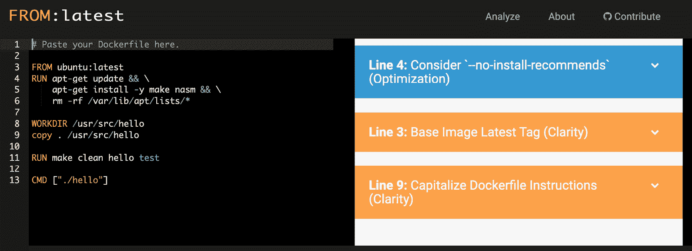
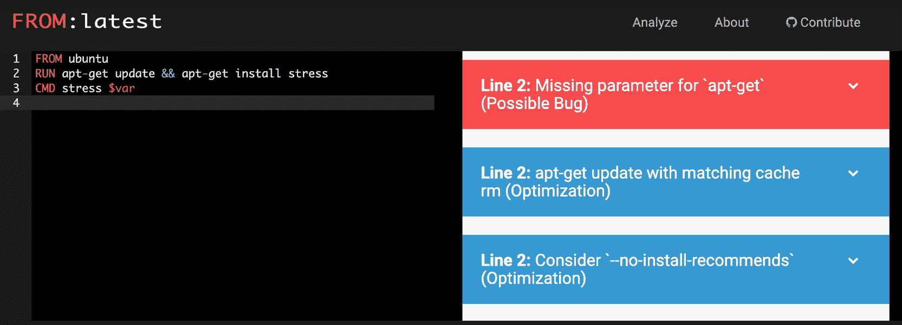
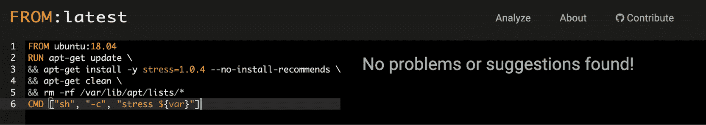

# 12 时。最佳实践

概观

在本章中，您将学习在使用 Docker 和您的容器映像时使用的一些最佳实践。这将使您能够监视和管理容器使用的资源，并限制它们对主机系统的影响。您将分析 Docker 的最佳实践，并了解为什么每个容器只运行一个服务很重要，确保您的容器是可扩展和不可变的，并确保您的底层应用在短时间内启动。本章将帮助您在应用和容器运行之前，借助`hadolint's` `FROM:latest`命令和`dcvalidator`通过林挺您的`Dockerfiles`和`docker-compose.yml`文件来实施这些最佳实践。

# 简介

关于安全性的前一章介绍了 Docker 映像和服务的一些最佳实践，这些实践遵循了这些最佳实践。我们确保了我们的映像和服务是安全的，并且它们限制了攻击者访问映像所能达到的效果。本章不仅将带您了解创建和运行我们的 Docker 映像的最佳实践，还将重点介绍容器性能、配置我们的服务，以及确保在这些服务上运行的服务尽可能高效地运行。

我们将在本章开始深入研究如何监控和配置服务使用的资源，例如内存和 CPU 使用情况。然后，我们将带您了解一些您可以在项目中实现的重要实践，看看您如何创建 Docker 映像以及在其上运行的应用。最后，本章将为您提供一些实用的工具来测试您的`Dockerfiles`和`docker-compose.yml`文件，这将作为确保您遵循上述实践的一种方式。

本章展示了如何确保尽可能优化您的服务和容器，以确保它们在从开发环境到生产的整个过程中无问题地运行。本章的目标是确保您的服务尽可能快地启动，并尽可能高效地处理。本章中提到的实践还确保了可重用性(也就是说，它们确保了任何想要重用您的映像或代码的人都可以这样做，并且能够具体地了解任何时候正在发生的事情)。首先，下一节讨论如何使用容器资源。

# 使用容器资源

从传统服务器环境迁移到 Docker 的主要好处之一是，它使我们能够大幅减少服务和应用的占用空间，即使在迁移到生产环境时也是如此。然而，这并不意味着我们可以简单地在我们的容器上运行任何东西，期望所有的进程简单地完成它们的执行。正如我们需要独立服务器上运行的服务的资源一样，我们需要确保容器使用的资源(如 CPU、内存和磁盘输入输出)不会导致生产环境或任何其他容器崩溃。通过监控我们的开发系统中使用的资源，我们可以帮助优化流程，并确保最终用户在进入生产时体验到无缝操作。

通过测试我们的服务和监控资源使用情况，我们将能够了解正在运行的应用所需的资源，并确保运行我们的 Docker 映像的主机有足够的资源来运行我们的服务。最后，正如您将在接下来的章节中看到的，我们还可以限制容器可以访问的 CPU 和内存资源的数量。当在 Docker 上开发我们的服务时，我们需要在我们的开发系统上测试这些服务，以确切地知道当它们被移动到测试和生产环境中时会发生什么。

当我们将许多不同的服务(如数据库、网络服务器和应用编程接口网关)结合在一起创建应用时，有些服务比其他服务更重要，在某些情况下，这些服务可能需要分配更多的资源。然而，在 Docker 中，运行的容器在默认情况下对它可以使用的资源没有真正的限制。

在前面的章节中，我们学习了使用 Swarm 和 Kubernetes 的编排，这有助于在您的系统中分配资源，但是这一章的这一部分将教您一些测试和监控资源的基本工具。我们还将研究如何配置容器，使其不再使用默认的可用资源。

为了帮助我们完成本章的这一部分，我们将创建一个新的映像，该映像仅用于演示系统中的资源使用情况。在本节的第一部分，我们将创建一个映像，添加一个名为 stress 的应用。压力应用的主要功能是给我们的系统施加沉重的负载。该映像将允许我们查看主机系统上正在使用的资源，然后允许我们在运行 Docker 映像时使用不同的选项来限制正在使用的资源。

注意

本章的这一部分将为您提供一些关于监控我们正在运行的 Docker 容器的资源的简单指南。这一章将只涵盖一些简单的概念，因为我们将在这本书的整整一章中提供关于监视您的容器度量的深入细节。

为了帮助我们查看正在运行的容器正在消耗的资源，Docker 提供了`stats`命令作为正在运行的容器正在消耗的资源的实时流。如果您希望限制流呈现的数据，尤其是如果您有大量容器正在运行，您可以通过指定容器的名称或其 ID 来指定只提供某些容器:

```
docker stats <container_name|container_id>
```

`docker` `stats`命令的默认输出将为您提供容器的名称和 ID、容器正在使用的主机 CPU 和内存的百分比、容器正在发送和接收的数据以及从主机存储中读取和写入的数据量:

```
NAME                CONTAINER           CPU %
docker-stress       c8cf5ad9b6eb        400.43%
```

下一节将重点介绍我们如何使用`docker stats`命令来监控我们的资源。我们还将为`stats`命令提供格式控制，以便只提供我们需要的信息。

# 管理容器 CPU 资源

本章的这一部分将向您展示如何设置容器使用的 CPU 数量的限制，因为没有限制的容器运行可能会耗尽主机服务器上所有可用的 CPU 资源。我们将考虑优化我们正在运行的 Docker 容器，但是使用大量 CPU 的实际问题通常在于底层基础架构或容器上运行的应用。

当我们讨论 CPU 资源时，我们通常指的是单个物理计算机芯片。如今，一个中央处理器很可能有不止一个内核，更多的内核意味着更多的进程。但这并不意味着我们有无限的资源。当我们显示正在使用的 CPU 百分比时，除非您的系统只有一个 CPU 和一个内核，否则您很可能会看到超过 100%的 CPU 正在使用。例如，如果您的系统的 CPU 中有四个核心，并且您的容器正在使用所有的 CPU，您将看到一个 400%的值

我们可以通过提供`--format`选项来修改运行在我们系统上的`docker stats`命令，只提供 CPU 使用的详细信息。该选项允许我们指定所需的输出格式，因为我们可能只需要`stats`命令提供的一个或两个指标。以下示例将`stats`命令的输出配置为以`table`格式显示，仅显示容器的名称、标识和使用的 CPU 百分比:

```
docker stats --format "table {{.Name}}\t{{.Container}}\t{{.CPUPerc}}"
```

如果没有 Docker 映像在运行，该命令将提供一个包含以下三列的表:

```
NAME                CONTAINER           CPU %
```

为了控制我们的运行容器在中央处理器上使用的内核数量，我们可以使用`docker run`命令的`--cpus`选项。以下语法向我们展示了如何运行映像，但通过使用`--cpus`选项来限制映像可以访问的内核数量:

```
docker run --cpus 2 <docker-image>
```

更好的选择不是设置一个容器可以使用的内核数量，而是设置它可以共享的内核总数。Docker 提供了`--cpushares`或`-c`选项来设置容器可以使用的处理能力的优先级。通过使用这个选项，这意味着在运行容器之前，我们不需要知道主机有多少个内核。这也意味着我们可以将正在运行的容器转移到不同的主机系统，而不需要更改运行映像的命令。

默认情况下，Docker 将为每个正在运行的容器分配 1，024 个份额。如果将`--cpushares`值设置为`256`，它将拥有其他运行容器的四分之一处理份额:

```
docker run --cpushares 256 <docker-image>
```

注意

如果您的系统上没有其他容器在运行，即使您已经将`--cpushares`值设置为`256`，该容器也将被允许用尽剩余的处理能力。

即使您的应用可能运行良好，但最好还是看看当您减少它可用的 CPU 数量时它会如何工作，以及在它正常运行时它会消耗多少。

在下一个练习中，我们将使用`stress`应用来监控系统上的资源使用情况。

注意

请使用`touch`命令创建文件，使用`vim`命令使用 vim 编辑器处理文件。

## 练习 12.01:了解 Docker 映像上的 CPU 资源

在本练习中，您将首先创建一个新的 Docker 映像，它将帮助您在系统上生成一些资源。我们将演示如何使用安装在映像上的`stress`应用。该应用将允许您开始监控系统上的资源使用情况，并允许您更改映像正在使用的 CPU 资源数量:

1.  新建`Dockerfile`并打开你喜欢的文本编辑器，输入以下详细信息。您将使用 Ubuntu 作为基础创建映像，因为`stress`应用尚未作为一个包提供，无法轻松安装在阿尔卑斯山的基础映像上:

    ```
    FROM ubuntu
    RUN apt-get update && apt-get install stress
    CMD stress $var
    ```

2.  使用`docker build`命令的`-t`选项构建新映像并将其标记为`docker-stress`:

    ```
    docker build -t docker-stress .
    ```

3.  在运行新的`docker-stress`映像之前，先停止并移除所有其他容器，以确保结果不会被我们系统上运行的其他容器混淆:

    ```
    docker rm -f $(docker -a -q)
    ```

4.  On *line 3* of the `Dockerfile`, you'll notice that the `CMD` instruction is running the stress application following the `$var` variable. This will allow you to add command-line options directly to the stress application running on the container via environment variables, without having to build a new image every time you want to change the functionality. Test this out by running your image and using the `-e` option to add environment variables. Add `var="--cpu 4 --timeout 20"` as a command-line option to the `stress` command:

    ```
    docker run --rm -it -e var="--cpu 4 --timeout 20" docker-stress
    ```

    `docker run`命令添加了`var="--cpu 4 --timeout 20"`变量，该变量将使用这些命令行选项专门运行`stress`命令。`--cpu`选项表示将使用系统的四个 CPU 或核心，而`--timeout`选项将允许压力测试运行指定的秒数——在本例中为`20`:

    ```
    stress: info: [6] dispatching hogs: 4 cpu, 0 io, 0 vm, 0 hdd
    stress: info: [6] successful run completed in 20s
    ```

    注意

    如果我们需要连续运行`stress`命令而不停止，我们将简单地不包括`--timeout`选项。我们的示例都包括`timeout`选项，因为我们不想忘记并持续使用正在运行的主机系统上的资源。

5.  Run the `docker stats` command to see what effect this has on your host system. Limit the output provided to only give CPU usage by using the `--format` option:

    ```
    docker stats --format "table {{.Name}}\t{{.Container}}\t{{.CPUPerc}}"
    ```

    除非您的系统上运行了一个容器，否则您应该只看到表标题，类似于这里提供的输出:

    ```
    NAME                CONTAINER           CPU %
    ```

6.  当`stats`命令运行时，移动到新的终端窗口并再次运行`docker-stress`容器，如本练习的*步骤 4* 所示。使用`docker stress`命令时，使用`--name`选项确保您正在查看正确的映像:

    ```
    docker run --rm -it -e var="--cpu 4 --timeout 20" --name docker-stress docker-stress
    ```

7.  移回终端运行`docker stats`。现在，您应该看到一些输出呈现在您的桌面上。您的输出将与以下不同，因为您的系统上运行的内核数量可能不同。下面的输出显示，我们的 CPU 百分比有 400%被使用。运行命令的系统有六个内核。它显示压力应用 100%使用四个可用的核心:

    ```
    NAME                CONTAINER           CPU %
    docker-stress       c8cf5ad9b6eb        400.43%
    ```

8.  Once again, run the `docker-stress` container, this time with `8` set for the `--cpu` option:

    ```
    docker run --rm -it -e var="--cpu 8 --timeout 20" --name docker-stress docker-stress
    ```

    正如您在下面的统计输出中看到的，我们已经达到了您的 Docker 容器几乎 100%使用我们系统上所有六个内核的极限，为我们系统上的小进程留下了少量的处理能力:

    ```
    NAME                CONTAINER           CPU %
    docker-stress       8946da6ffa90        599.44%
    ```

9.  通过使用`--cpus`选项并指定您希望允许映像使用的内核数量，管理您的`docker-stress`映像可以访问的内核数量。在下面的命令中，`2`被设置为我们的容器允许使用的核心数量:

    ```
    docker run --rm -it -e var="--cpu 8 --timeout 20" --cpus 2 --name docker-stress docker-stress
    ```

10.  Move back to the terminal running `docker stats`. You will see that the CPU percentage being used does not exceed much more than 200%, showing that Docker is restricting resource usage to only two of the cores available on our system:

    ```
    NAME                CONTAINER           CPU %
    docker-stress       79b32c67cbe3        208.91%
    ```

    到目前为止，您一次只能在我们的系统上运行一个容器。本练习的下一部分将允许您以分离模式运行两个容器。在这里，您将在一个运行的容器上使用`--cpu-shares`选项进行测试，以限制它可以使用的内核数量。

11.  如果您没有在终端窗口中运行`docker stats`，请按照您之前所做的那样启动它，以允许我们监控正在运行的进程:

    ```
    docker stats --format "table {{.Name}}\t{{.Container}}\t{{.CPUPerc}}"
    ```

12.  Access another terminal window and start up two `docker-stress` containers – `docker-stress1` and `docker-stress2`. The first will use a `--timeout` value of `60` to have the stress application running for 60 seconds, but here, limit the `--cpu-shares` value to `512`:

    ```
    docker run --rm -dit -e var="--cpu 8 --timeout 60" --cpu-shares 512 --name docker-stress1 docker-stress
    ```

    容器的标识将按如下方式返回:

    ```
    5f617e5abebabcbc4250380b2591c692a30b3daf481b6c8d7ab8a0d1840d395f
    ```

    第二个容器将不受限制，但其`--timeout`值仅为`30`，因此应首先完成:

    ```
    docker run --rm -dit -e var="--cpu 8 --timeout 30" --name docker-stress2 docker-stress2
    ```

    容器的标识将按如下方式返回:

    ```
    83712c28866dd289937a9c5fe4ea6c48a6863a7930ff663f3c251145e2fbb97a
    ```

13.  回到我们正在运行的终端`docker stats`。你会看到两个容器在运行。在下面的输出中，我们可以看到名为`docker-stress1`和`docker-stress2`的容器。当其他容器正在运行时，`docker-stress1`容器被设置为只有`512` CPU 份额。还可以观察到，它使用的 CPU 资源只有我们第二个名为`docker-stress2` :

    ```
    NAME                CONTAINER           CPU %
    docker-stress1      5f617e5abeba        190.25%
    docker-stress2      83712c28866d        401.49%
    ```

    的容器的一半
14.  当您的第二个容器完成`docker-stress1`容器的 CPU 百分比时，它将被允许使用运行系统上几乎所有可用的六个内核:

    ```
    NAME                CONTAINER           CPU %
    stoic_keldysh       5f617e5abeba        598.66%
    ```

CPU 资源在确保应用以最佳状态运行方面发挥着重要作用。本练习向您展示了在将容器部署到生产环境中之前，当容器仍在系统上时，监视和配置容器的处理能力是多么容易。下一节将继续对容器的内存执行类似的监控和配置更改。

# 管理容器内存资源

正如我们可以监视和控制容器在系统上使用的 CPU 资源一样，我们也可以对正在使用的内存执行同样的操作。与 CPU 一样，运行的容器能够使用 Docker 提供的默认设置来使用主机的所有内存，在某些情况下，如果不受限制，可能会导致系统变得不稳定。如果主机系统内核检测到没有足够的可用内存，它将显示一个**内存不足异常**，并开始关闭系统上的进程以帮助释放内存。

好消息是 Docker 守护程序在您的系统上具有很高的优先级，因此内核将在停止 Docker 守护程序运行之前首先杀死正在运行的容器。这意味着，如果高内存使用率是由容器应用引起的，您的系统应该能够恢复。

注意

如果您正在运行的容器被关闭，您还需要确保您已经测试了您的应用，以确保您正在限制它对您正在运行的进程的影响。

`docker stats`命令再次为我们提供了大量关于内存使用的信息。它将输出容器正在使用的内存百分比，以及当前正在使用的内存与它能够使用的内存总量的比较。如前所述，我们可以限制`--format`选项的输出。在下面的命令中，我们通过分别显示`.Name`、`.Container`、`.MemPerc`和`.MemUsage`属性来减少只显示容器名称和 ID 以及内存百分比和内存使用量的输出:

```
docker stats --format "table {{.Name}}\t{{.Container}}\t{{.MemPerc}}\t{{.MemUsage}}"
```

在没有容器运行的情况下，前面的命令将显示以下输出:

```
NAME         CONTAINER          MEM %         MEM USAGE / LIMIT
```

如果我们想限制或控制正在运行的容器使用的内存量，有几个选项可供我们选择。可用的选项之一是`--memory`或`-m`选项，它将为正在运行的容器可以使用的内存量设置一个限制。在下面的例子中，我们使用了`--memory 512MB`的语法将映像可用的内存量限制为`512MB`:

```
docker run --memory 512MB <docker-image>
```

如果运行该容器的主机系统也使用交换空间作为其可用内存的一部分，您也可以从该容器分配内存作为交换运行。只需使用`--memory-swap`选项即可完成。这只能与`--memory`选项结合使用，如我们在以下示例中所演示的。我们已经将`--memory-swap`选项设置为`1024MB`，这是内存和交换内存容器可用的内存总量。因此，在我们的例子中，在交换中将有另一个`512MB`可用:

```
docker run --memory 512MB --memory-swap 1024MB <docker-image>
```

但是，您需要记住，交换内存将被分配给磁盘，因此，它将比内存更慢，响应更慢。

注意

需要将`--memory-swap`选项设置为高于`--memory`选项的数值。如果它被设置为相同的数字，您将无法从运行的容器中分配任何内存进行交换。

另一个可用的选项是`--oom-kill-disable`选项，仅在需要确保运行容器始终可用时使用。如果主机系统内存不足，此选项会阻止内核终止正在运行的容器。这只能与`--memory`选项一起使用，以确保您设置了容器可用内存的限制。没有限制，`--oom-kill-disable`选项可以轻松使用主机系统上的所有内存:

```
docker run --memory 512MB --oom-kill-disable <docker-image>
```

尽管您的应用设计得很好，但是前面的配置为您提供了一些选项来控制正在运行的容器使用的内存量。

下一部分将为您提供分析 Docker 映像上的内存资源的实践经验。

## 练习 12.02:分析 Docker 映像上的内存资源

本练习将帮助您分析活动容器在主机系统上运行时如何使用内存。再一次，您将使用先前创建的`docker-stress`映像，但这次带有仅使用运行容器内存的选项。此命令将允许我们实现一些可用的内存限制选项，以确保我们正在运行的容器不会关闭我们正在运行的主机系统:

1.  Run the `docker stats` command to display the relevant information you need for the percentage memory and memory usage values:

    ```
    docker stats --format "table {{.Name}}\t{{.Container}}\t{{.MemPerc}}\t{{.MemUsage}}"
    ```

    该命令将提供如下输出:

    ```
    NAME        CONTAINER       MEM %         MEM USAGE / LIMIT
    ```

2.  Open a new terminal window to run the `stress` command again. Your `docker-stress` image will only utilize CPU when you use the `--cpu` option. Use the `--vm` option in the following command to start up the number of workers you wish to spawn to consume memory. By default, each of them will consume `256MB`:

    ```
    docker run --rm -it -e var="--vm 2 --timeout 20" --name docker-stress docker-stress
    ```

    当您移回监视正在运行的容器时，使用的内存仅达到限制的 20%左右。不同的系统可能会有所不同。由于只有两个工作进程在运行，每个工作进程消耗 256 MB 的内存，您应该只能看到它达到大约 500 MB 的内存使用量:

    ```
    NAME            CONTAINER      MEM %      MEM USAGE / LIMIT
    docker-stress   b8af08e4d79d   20.89%     415.4MiB / 1.943GiB
    ```

3.  The stress application also has the `--vm-bytes` option to control the number of bytes that each worker being spawned up will consume. Enter the following command, which has set each worker to `128MB`. It should show a lower usage when you monitor it:

    ```
    docker run --rm -it -e var="--vm 2 --vm-bytes 128MB --timeout 20" --name stocker-stress docker-stress
    ```

    如您所见，压力应用努力将内存使用量推高很远。如果您想使用系统上所有的 8 GB 内存，您可以使用 1，024 MB 的`--vm 8 --vm-bytes`:

    ```
    NAME            CONTAINER      MEM %    MEM USAGE / LIMIT
    docker-stress   ad7630ed97b0   0.04%    904KiB / 1.943GiB
    ```

4.  使用`--memory`选项减少`docker-stress`映像可用的内存量。在下面的命令中，您将看到我们已经将运行容器的可用内存设置为限于`512MB` :

    ```
    docker run --rm -it -e var="--vm 2 --timeout 20" --memory 512MB --name docker-stress docker-stress
    ```

5.  移回运行`docker stats`的终端，你会看到内存使用百分比飙升到几乎 100%。这不是一件坏事，因为它只占分配给运行容器的内存的一小部分。在本例中，它为 512 MB，仅为之前的四分之一:

    ```
    NAME            CONTAINER      MEM %     MEM USAGE / LIMIT
    docker-stress   bd84cf27e480   88.11%    451.1MiB / 512MiB
    ```

6.  一次运行多个容器，看看我们的`stats`命令如何响应。使用`-d`选项作为`docker run`命令的一部分，在主机系统的后台运行容器作为守护程序。两个`docker-stress`容器现在将各使用六名工人，但是我们的第一个映像，我们将命名为`docker-stress1`，仅限于`512MB`内存，而我们的第二个映像，命名为`docker-stress2`，仅运行 20 秒，将有无限的内存:

    ```
    docker run --rm -dit -e var="--vm 6 --timeout 60" --memory 512MB --name docker-stress1 docker-stress
    ca05e244d03009531a6a67045a5b1edbef09778737cab2aec7fa92eeaaa0c487
    docker run --rm -dit -e var="--vm 6 --timeout 20" --name docker-stress2 docker-stress
    6d9cbb966b776bb162a47f5e5ff3d88daee9b0304daa668fca5ff7ae1ee887ea
    ```

7.  Move back to the terminal running `docker stats`. You can see that only one container, the `docker-stress1` container, is limited to 512 MB, while the `docker-stress2` image is allowed to run on a lot more memory:

    ```
    NAME             CONTAINER       MEM %    MEM USAGE / LIMIT
    docker-stress1   ca05e244d030    37.10%   190MiB / 512MiB
    docker-stress2   6d9cbb966b77    31.03%   617.3MiB / 1.943GiB
    ```

    如果您稍等片刻，`docker-stress1`映像将自行运行:

    ```
    NAME             CONTAINER      MEM %    MEM USAGE / LIMIT
    docker-stress1   ca05e244d030   16.17%   82.77MiB / 512MiB
    ```

    注意

    这里我们没有涉及的一个选项是`--memory-reservation`选项。这也与`--memory`选项一起使用，需要设置为低于记忆选项。这是一个软限制，当主机系统上的内存不足时会激活，但不能保证会强制实施该限制。

本章的这一部分有助于确定如何运行容器和监控使用情况，以便在容器进入生产环境时，它们不会因耗尽所有可用内存而停止主机系统。现在，您应该能够识别您的映像使用了多少内存，并且如果长时间运行或内存密集型进程出现问题，您还可以限制可用的内存量。在下一节中，我们将了解我们的容器如何消耗主机系统磁盘上的设备读写资源。

# 管理容器磁盘的读写资源

运行中的容器消耗的 CPU 和内存通常是环境运行不佳的最大元凶，但是运行中的容器试图向主机的磁盘驱动器读取或写入太多数据时也可能会出现问题。这很可能比 CPU 或内存问题的影响要小，但是如果有大量数据传输到主机系统的驱动器，它仍然会导致争用并降低服务速度。

幸运的是，Docker 还为我们提供了一种方法来控制我们的运行容器可以执行的读写量。正如我们之前看到的，我们可以通过`docker run`命令使用许多选项来限制我们正在读取或写入设备磁盘的数据量。

`docker stats`命令还允许我们查看正在运行的容器之间的数据传输。它有一个专用列，可以使用我们的`docker stats`命令中的`BlockIO`值添加到我们的表中，该值代表对我们的主机磁盘驱动器或目录的读写:

```
docker stats --format "table {{.Name}}\t{{.Container}}\t{{.BlockIO}}"
```

如果我们的系统上没有任何正在运行的容器，前面的命令应该会为我们提供以下输出:

```
NAME                CONTAINER           BLOCK I/O
```

如果我们需要限制一个正在运行的容器可以移动到我们的主机系统的磁盘存储的数据量，我们可以从使用`docker run`命令的`--blkio-weight`选项开始。该选项代表**块输入输出重量**，允许我们将容器的相对重量设置在`10`和`1000`之间，并且相对于系统上运行的所有其他容器。所有容器将设置相同比例的带宽，即 500。如果任何容器的值为 0，此选项将被关闭:

```
docker run --blkio-weight <value> <docker-image>
```

我们可以使用的下一个选项是`--device-write-bps`，它将以每秒字节数的值限制指定设备可用的特定写入带宽。特定设备与容器在主机系统上使用的设备相关。该选项还有一个`iops (Input/Output) per seconds`选项也可以使用。以下语法提供了该选项的基本用法，其中限制值是设置为 MB 的数值:

```
docker run --device-write-bps <device>:<limit> <docker-image>
```

正如有一种方法可以限制主机系统磁盘的写入进程一样，也有一种方法可以限制可用的读取吞吐量。同样，它也有一个`iops (Input/Output) per seconds`选项可以使用，并将限制可以从您的运行容器中读取的数据量。以下示例使用`--device-read-bps`选项作为`docker run`命令的一部分:

```
docker run --device-read-bps <device>:<limit> <docker-image>
```

如果您坚持容器最佳实践，过度消耗磁盘输入或输出应该不是太大的问题。不过，没有理由认为这不会给你带来任何问题。正如您已经使用了 CPU 和内存一样，在您的服务在生产中实现之前，您的磁盘输入和输出应该在您运行的容器上进行测试。

## 练习 12.03:理解磁盘读写

本练习将让您熟悉如何查看运行容器的磁盘读写。它将允许您通过使用运行时可用的选项配置磁盘使用速度限制来开始运行容器:

1.  Open a new terminal window and run the following command:

    ```
    docker stats --format "table {{.Name}}\t{{.Container}}\t{{.BlockIO}}" 
    ```

    带有`BlockIO`选项的`docker stats`命令帮助我们监控从容器到主机系统磁盘的输入和输出的级别。

2.  启动容器，从 bash 命令行访问它。直接在运行的`docker-stress`映像上执行一些测试。压力应用确实为您提供了一些选项来控制容器和主机系统上的磁盘利用率，但它仅限于磁盘写入:

    ```
    docker run -it --rm --name docker-stress docker-stress /bin/bash
    ```

3.  与 CPU 和内存使用不同，块输入和输出显示容器使用的总量，因此它不会是动态的，并且会随着运行的容器执行更多的更改而改变。回到你正在运行的终端`docker stats`。输入输出见`0B`:

    ```
    NAME                CONTAINER           BLOCK I/O
    docker-stress       0b52a034f814        0B / 0B
    ```

4.  在这种情况下，您将使用 bash shell，因为它允许访问`time`命令来查看每个进程需要多长时间。使用`dd`命令，这是一个用于复制文件系统和备份的 Unix 命令。在下面的选项中，使用`if`(输入文件)选项创建我们的`/dev/zero`目录的副本，并使用`of`(输出文件)选项将其输出到`disk.out`文件。`bs`选项是块大小或一次应该读取的数据量，`count`是要读取的总块数。最后，将`oflag`值设置为`direct`，这意味着副本将避免缓冲区缓存，因此您将看到磁盘读写的真实值:

    ```
    time dd if=/dev/zero of=disk.out bs=1M count=10 oflag=direct
    10+0 records in
    10+0 records out
    10485760 bytes (10 MB, 10 MiB) copied, 0.0087094 s, 1.2 GB/s
    real    0m0.010s
    user    0m0.000s
    sys     0m0.007s
    ```

5.  Move back into the terminal running your `docker stats` command. You will see just over 10 MB of data sent to the host system's disk. Unlike CPU and memory, you do not see this data value go down after the transfer has occurred:

    ```
    NAME                CONTAINER           BLOCK I/O
    docker-stress       0b52a034f814        0B / 10.5MB
    ```

    您还会注意到*第 4 步*中的命令几乎是瞬间完成的，其中`time`命令显示只需`0.01s`实时完成。如果您限制可以写入磁盘的数据量，您将看到会发生什么，但是首先，退出正在运行的容器，以便它不再存在于我们的系统中。

6.  要再次启动我们的`docker-stress`容器，在`/dev/sda`设备驱动上设置`--device-write-bps`选项为`1MB`每秒:

    ```
    docker run -it --rm --device-write-bps /dev/sda:1mb --name docker-stress docker-stress /bin/bash
    ```

7.  Run the `dd` command again, preceded by the `time` command, to test how long it takes. You should see that the command takes a lot longer than what it did in *step 4*. The `dd` command is once again set to copy `1MB` blocks, `10` times:

    ```
    time dd if=/dev/zero of=test.out bs=1M count=10 oflag=direct
    ```

    因为容器被限制为每秒只能写入 1 MB，所以该命令需要 10 秒钟，如以下输出所示:

    ```
    10+0 records in
    10+0 records out
    10485760 bytes (10 MB, 10 MiB) copied, 10.0043 s, 1.0 MB/s
    real    0m10.006s
    user    0m0.000s
    sys     0m0.004s
    ```

我们已经能够很容易地看到我们的运行容器如何影响底层主机系统，特别是在使用磁盘读写时。我们还能够看到如何轻松限制可以写入设备的数据量，从而减少运行容器之间的争用。在下一节中，我们将快速回答如果您正在使用`docker-compose`您需要做什么的问题，并查看限制您的容器正在使用的资源数量。

# 容器资源和Docker组成

像 Kubernetes 和 Swarm 这样的编排者在控制和运行您的资源以及在需要额外资源时启动新主机方面有很大的帮助。但是如果你在你的系统或者测试环境中运行`docker-compose`，你会怎么做呢？幸运的是，前面提到的资源配置也能很好地与`docker-compose`配合使用。

在我们的`docker-compose.yml`文件中，在我们的服务下，我们可以使用`deploy`配置下的`resources`选项，并为我们的服务指定我们的资源限制。正如我们一直在使用`--cpus`、`--cpu_shares`和`--memory`等选项一样，我们也会在`docker-compose.yml`文件中使用与`cpus`、`cpu_shares`和`memory`相同的选项。

下面代码块中的示例`compose`文件正在部署我们在本章中使用的`docker-stress`映像。如果我们看一下*第 8 行*，可以看到`deploy`语句，后面是`resources`语句。这是我们可以设置容器限制的地方。和上一节一样，我们在*11*线上将`cpus`设置为`2`，在*12*线上将`memory`设置为`256MB`:

```
1 version: '3'
2 services:
3   app:
4     container_name: docker-stress
5     build: .
6     environment:
7       var: "--cpu 2 --vm 6 --timeout 20"
8     deploy:
9       resources:
10         limits:
11           cpus: '2'
12           memory: 256M
```

尽管我们只是触及了这个主题，但是前面介绍资源使用的部分应该会指导您如何在`docker-compose.yml`文件中分配资源。关于 Docker 容器的资源使用，这一节到此结束。从这里开始，我们将继续关注创建我们的`Dockerfiles`的最佳实践，以及我们如何开始使用不同的应用来确保我们遵守这些最佳实践。

# Docker的最佳实践

随着我们的容器和服务的规模和复杂性的增长，确保我们在创建 Docker 映像时遵循最佳实践是非常重要的。我们在 Docker 映像上运行的应用也是如此。在本章的后面，我们将查看 lint 我们的`Dockerfiles`和`docker-compose.yml`文件，它们将分析我们的文件中的错误和最佳实践，这将让您有更清晰的理解。与此同时，让我们来看看在创建 Docker 映像时需要记住的一些更重要的最佳实践，以及应用应该如何使用它们。

注意

本章可能会涵盖前几章中的一些要点，但我们将能够为您提供更多的信息，并明确我们为什么要使用这些实践。

在下一节中，我们将介绍一些在创建服务和容器时应该遵循的更常见的最佳实践。

## 每个容器运行一项服务

在现代微服务架构中，我们需要记住每个容器中只应该安装一个服务。容器的主要过程由`Dockerfile`末尾的`ENTRYPOINT`或`CMD`指令设定。

您在容器中安装的服务可以非常容易地运行多个进程，但是为了获得 Docker 和微服务的全部好处，您应该只在每个容器中运行一个服务。为了进一步细分这一点，您的容器应该只有一个单一的职责，如果它负责做一件以上的事情，那么它应该被分解成不同的服务。

通过限制每个容器可以做什么，我们有效地减少了映像使用的资源，并潜在地减少了映像的大小。正如我们在上一章中所看到的，这也将减少攻击者在访问运行中的容器时执行任何不该执行的操作的机会。这也意味着，如果容器由于某种原因停止工作，对环境中运行的其他应用的影响有限，服务将更容易恢复。

## 基础映像

当我们从容器的基础映像开始时，我们需要做的第一件事就是确保我们从最新的映像开始。也做一点调查，以确保您没有使用安装了大量不需要的额外应用的映像。您可能会发现，应用使用的特定语言或特定焦点支持的基本映像会限制所需映像的大小，从而限制您在创建映像时需要安装的内容。

这就是为什么我们使用 PostgreSQL 支持的 Docker 映像，而不是在构建时在映像上安装应用。PostgreSQL 支持的映像确保了它的安全性和在最新版本下的运行，并确保我们没有在不需要的映像上运行应用。

当为我们的`Dockerfile`指定我们的基础映像时，我们需要确保我们也指定了一个特定的版本，而不是让 Docker 简单地使用`latest`映像。此外，请确保您不是从信誉良好或受信任的提供商的存储库或注册表中提取映像。

如果您使用 Docker 已经有一段时间了，您可能会遇到`MAINTAINER`指令，在该指令中您指定生成映像的作者。这已经被否决了，但是您仍然可以使用`LABEL`指令来提供这些细节，正如我们在下面的语法中所做的那样:

```
LABEL maintainer="myemailaddress@emaildomain.com"
```

## 安装应用和语言

当您在映像上安装应用时，请始终记住不需要执行`apt-get update`或`dist-upgrade`。如果需要以这种方式升级映像版本，您应该查看不同的映像。如果您使用`apt-get`或`apk`安装应用，请确保指定您需要的特定版本，因为您不想安装新的或未经测试的版本。

安装软件包时，确保使用`-y`开关确保构建不会停止并要求用户提示。或者，您也应该使用`--no-install-recommends`，因为您不想安装软件包管理器推荐的大量不需要的应用。此外，如果您使用基于 Debian 的容器，请确保您使用的是`apt-get`或`apt-cache`，因为`apt`命令是专门为用户交互而不是脚本安装而设计的。

如果您从其他表单安装应用，例如从代码构建应用，请确保您正在清理安装文件，以再次减小您正在创建的映像的大小。同样，如果您正在使用`apt-get`，您也应该删除`/var/lib/apt/lists/`中的列表，以清理安装文件并减小容器映像的大小。

## 运行命令和执行任务

在创建我们的映像时，我们通常需要在`Dockerfile`内执行一些任务，以便为我们的服务运行准备好环境。务必确保您没有使用`sudo`命令，因为这可能会导致一些意想不到的结果。如果您需要以 root 用户身份运行命令，那么您的基本映像很可能以 root 用户身份运行；只需确保您创建了一个单独的用户来运行您的应用和服务，并且容器在完成构建之前已经更改为所需的用户。

确保您正在使用`WORKDIR`移动到不同的目录，而不是运行指定长路径的指令，因为这对用户来说可能很难阅读。对`CMD`和`ENTRYPOINT`参数使用`JSON`符号，并始终确保您只有一个`CMD`或`ENTRYPOINT`指令。

## 容器需要是不可变和无状态的

我们需要确保我们的容器和运行在容器上的服务是不可变的。我们不能像对待传统的服务器一样对待容器，尤其是一个在运行的容器上更新应用的服务器。您应该能够从代码中更新您的容器并部署它，而完全不需要访问它。

当我们说不可变时，我们指的是容器在其生命周期内根本不会被修改，没有更新、补丁或配置更改。对代码或更新的任何更改都应该通过构建新的映像，然后将其部署到您的环境中来实现。这使得部署更加安全，就好像升级有任何问题，只需重新部署旧版本的映像。这也意味着您在所有环境中运行相同的映像，确保您的环境尽可能相同。

当我们谈论需要无状态的容器时，这意味着运行容器所需的任何数据都应该在容器之外运行。文件存储也应该在容器之外，可能在云存储上或使用装载的卷。从容器中移除数据意味着容器可以随时干净地关闭和销毁，而不用担心数据丢失。当创建一个新容器来替换旧容器时，它只需连接到原始数据存储。

## 将应用设计为高度可用和可扩展

在微服务架构中使用容器旨在允许您的应用扩展到多个实例。因此，当在 Docker 容器上开发应用时，您应该预料到可能会出现应用的许多实例可以同时部署的情况，需要时可以上下扩展。当容器上的负载超过正常水平时，您的服务运行和完成应该也没有问题。

当您的服务因请求增加而需要扩展时，您的应用需要启动多长时间就成了一个重要问题。在将您的服务部署到生产环境中之前，您需要确保启动时间很快，以确保系统能够更高效地扩展，而不会给您的用户带来任何服务延迟。为了确保您的服务符合行业最佳实践，您的服务应该在 10 秒内启动，但少于 20 秒也是可以接受的。

正如我们在上一节中看到的，改善应用启动时间不仅仅是提供更多的 CPU 和内存资源。我们需要确保容器上的应用高效运行，同样，如果它们启动和运行特定进程的时间太长，您可能会在一个应用中执行太多任务。

## 映像和容器需要适当标记

我们在*第 3 章*、*管理您的 Docker Images* 中详细介绍了这个主题，并明确表示我们需要考虑如何命名和标记映像，尤其是当我们开始与更大的开发团队合作时。为了让所有用户都能够理解映像的作用，并了解环境中部署了什么版本，在团队开始大部分工作之前，需要决定并商定相关的标记和命名策略。

映像和容器名称需要与它们运行的应用相关，因为不明确的名称会导致混淆。还必须为版本控制制定一个一致的标准，以确保任何用户都可以识别在特定环境中运行的版本以及最新和稳定的版本。正如我们在*第 3 章*、*管理您的 Docker 映像*中提到的，尽量不要使用`latest`，而是选择语义版本系统或 Git 存储库`commit`哈希，用户可以在其中参考文档或构建环境，以确保他们拥有映像的最新版本。

## 配置和秘密

环境变量和秘密永远不应该被构建到你的 Docker 映像中。这样做，你就违反了可重用映像的规则。使用您的机密凭据构建映像也是一个安全风险，因为它们将存储在其中一个映像层中，因此任何能够提取映像的人都将能够看到凭据。

为您的应用设置配置时，可能需要根据不同的环境进行更改，因此一定要记住，您需要能够在需要时动态更改这些配置。这可能包括应用所用语言的特定配置，甚至包括应用需要连接的数据库。我们之前提到，如果您将应用配置为`Dockerfile`的一部分，那么这将很难更改，您可能需要为您希望将映像部署到的每个环境创建一个特定的`Dockerfile`。

配置您的映像的一种方法，正如我们在`docker-stress`映像中看到的，是在运行映像时使用命令行上设置的环境变量。如果没有提供变量，入口点或命令应该包含默认值。这将意味着即使没有提供额外的变量，容器仍将启动并运行:

```
docker run -e var="<variable_name>" <image_name>
```

通过这样做，我们使我们的配置更加动态，但是当您有更大或更复杂的配置时，这可能会限制您的配置。环境变量可以很容易地从`docker run`命令转移到`docker-compose`命令，然后在 Swarm 或 Kubernetes 中使用。

对于较大的配置，您可能希望通过 Docker 卷装载配置文件。这意味着您将能够设置一个配置文件，并在您的系统上运行它来轻松测试，然后如果您需要转移到一个编排系统，如 Kubernetes 或 Swarm，或者外部配置管理解决方案，您将能够轻松地将其转换为配置图。

如果我们想用我们在本章中使用的`docker-stress`映像来实现这一点，可以修改它以使用配置文件来装载我们想要运行的值。在下面的例子中，我们修改了`Dockerfile`来设置*第 3 行*来运行一个脚本，该脚本将为我们运行`stress`命令:

```
1 FROM ubuntu
2 RUN apt-get update && apt-get install stress
3 CMD ["sh","/tmp/stress_test.sh"]
```

这意味着我们可以构建 Docker 映像，并随时准备好供我们使用。我们只需要一个安装在`/tmp`目录下运行的脚本。我们可以使用以下示例:

```
1 #!/bin/bash
2 
3 /usr/bin/stress --cpu 8 --timeout 20 --vm 6 --timeout 60
```

这说明了将我们的值从环境变量移动到文件的想法。为了同时运行容器和压力应用，我们将执行以下操作，要知道如果我们想要更改`stress`命令所使用的变量，我们只需要对正在装载的文件进行一个小的更改:

```
docker run --rm -it -v ${PWD}/stress_test.sh:/tmp/stress_test.sh docker-stress
```

注意

当您通读这份最佳实践清单时，您会想到的第一件事是，我们在很多方面都与此背道而驰，但请记住，我们在很多情况下都是这样做的，以展示一个过程或想法。

## 使您的映像最小化和小型化

*第 3 章*、*管理你的Docker映像*，也看到我们做了一些工作，使我们的映像尽可能小。我们看到，通过缩小映像的大小，可以更快地构建映像。然后，它们也可以被拉得更快，并在我们的系统上运行。安装在容器上的任何不必要的软件或应用都可能占用主机系统上的额外空间和资源，并可能因此降低我们的服务速度。

使用像我们在*第 11 章*、 *Docker Security* 中使用的 Anchore Engine 这样的应用表明，我们可以审核映像以查看其内容，以及安装在其上的应用。这是一个简单的方法来确保我们正在减少我们的映像尺寸，并使它们尽可能最小。

现在，您已经了解了应该在容器映像和服务中使用的最佳实践。本章的下一节将帮助您通过使用应用来验证您的`Dockerfiles`和`docker-compose.yml`是按其应有的方式创建的，从而实施其中的一些最佳实践。

# 在代码中实施 Docker 最佳实践

正如我们在开发应用时希望让我们的编码更容易一样，我们可以使用外部服务和测试来确保我们的 Docker 映像符合最佳实践。在本章的以下部分中，我们将使用三种工具来确保我们的`Dockerfiles`和`docker-compose.yml`文件符合最佳实践，并确保我们在构建 Docker 映像时不会引入潜在的问题。

包含的工具将会简单易用并提供强大的功能。我们将从使用`hadolint`直接在我们的系统上清理`Dockerfiles`开始，该系统将作为一个单独的 Docker 映像运行，我们将`Dockerfiles`输入其中。然后我们来看看`FROM:latest`，这是一个在线服务，提供一些基本的功能来帮助我们找出`Dockerfiles`的问题。最后，我们看一下**Docker Compose Validator**(**DCValidator**)，它将执行类似的功能，但是在这种情况下，我们将整理我们的`docker-compose.yml`文件来帮助查明潜在的问题。

通过在构建和部署映像之前使用这些工具，我们希望减少 Docker 映像的构建时间，减少引入的错误数量，潜在地减少 Docker 映像的大小，并帮助我们了解和实施 Docker 最佳实践。

## 为您的映像使用 Docker Linter

包含本书所有代码的 GitHub 存储库还包括将与构建的 Docker 映像进行比较的测试。另一方面，在构建映像之前，linter 会分析您的代码并寻找潜在的错误。在本章的这一部分，我们将寻找`Dockerfiles`的潜在问题，特别是使用名为`hadolint`的应用。

名称`hadolint`是 **Haskell Dockerfile Linter** 的缩写，自带 Docker 镜像，可以拉取镜像后将`Dockerfile`发送到运行镜像进行测试。即使你的`Dockerfile`相对较小，构建和运行没有任何问题，`hadolint`通常会提供很多建议，指出你的`Dockerfile`中的缺陷，以及未来可能出现的问题。

要在您的`Dockerfiles`上运行`hadolint`，您需要在系统上有`hadolint` Docker 映像。如您现在所知，这只是运行带有所需映像的名称和存储库的`docker pull`命令的问题。在这种情况下，存储库和映像都被称为`hadolint`:

```
docker pull hadolint/hadolint
```

要使用该应用，您只需运行`hadolint`映像，并使用小于(`<`)符号将您的`Dockerfile`指向该映像，如我们在以下示例中所做的那样:

```
docker run hadolint/hadolint < Dockerfile
```

如果你足够幸运，你的`Dockerfile`没有任何问题，你应该看不到前面命令的任何输出。如果有需要忽略特定警告的情况，您可以使用`--ignore`选项，后跟触发该警告的特定规则标识:

```
docker run hadolint/hadolint hadolint --ignore <hadolint_rule_id> - < Dockerfile
```

如果您需要忽略一些警告，那么在命令行中尝试实现这一点可能会有点复杂，因此`hadolint`也可以选择设置一个配置文件。`hadolint`配置文件仅限于忽略警告和提供可信存储库列表。您还可以设置一个配置文件，其中以 YAML 格式列出您忽略的警告列表。`hadolint`然后需要将此文件装载到运行的映像上，以便应用使用，因为它将在应用的主目录中查找`.hadolint.yml`配置文件位置:

```
docker run --rm -i -v ${PWD}/.hadolint.yml:/.hadolint.yaml hadolint/hadolint < Dockerfile
```

`hadolint`是林挺你的`Dockerfiles`更好的应用之一，可以作为构建和部署管道的一部分轻松实现自动化。作为替代方案，我们还将关注一个名为`FROM:latest`的在线应用。该应用是基于网络的服务，不提供与`hadolint`相同的功能，但允许您轻松地将`Dockerfile`代码复制并粘贴到在线编辑器中，并接收关于`Dockerfile`是否符合最佳实践的反馈。

## 练习 12.04:林挺你的码头文件

本练习将帮助您了解如何在系统上访问和运行`hadolint`，以帮助您在`Dockerfiles`上实施最佳实践。我们还将使用名为`FROM:latest`的在线`Dockerfile`链接来比较我们收到的警告:

1.  使用以下`docker pull`命令从`hadolint`存储库中提取映像:

    ```
    docker pull hadolint/hadolint
    ```

2.  You have a `Dockerfile` ready to go with the `docker-stress` image you used to test and manage your resources earlier in this chapter. Run the `hadolint` image to lint this `Dockerfile`, or any other `Dockerfile`, and send it to the `Dockerfile` using the less than (`<`) symbol, as in the following command:

    ```
    docker run --rm -i hadolint/hadolint < Dockerfile
    ```

    从下面的输出中可以看出，尽管我们的`docker-stress`映像相对较小，`hadolint`给出了许多不同的方法来提高性能并帮助我们的映像遵循最佳实践:

    ```
    /dev/stdin:1 DL3006 Always tag the version of an image explicitly
    /dev/stdin:2 DL3008 Pin versions in apt get install. Instead of 
    'apt-get install <package>' use 'apt-get install 
    <package>=<version>'
    /dev/stdin:2 DL3009 Delete the apt-get lists after installing 
    something
    /dev/stdin:2 DL3015 Avoid additional packages by specifying 
    '--no-install-recommends'
    /dev/stdin:2 DL3014 Use the '-y' switch to avoid manual input 
    'apt-get -y install <package>'
    /dev/stdin:3 DL3025 Use arguments JSON notation for CMD 
    and ENTRYPOINT arguments
    ```

    注意

    如果您的`Dockerfile`通过`hadolint`成功运行，并且没有发现任何问题，命令行上将不会向用户显示任何输出。

3.  `hadolint` also gives you the option to suppress different checks with the `--ignore` option. In the following command, we have chosen to ignore the `DL3008` warning, where it is suggesting that you pin the applications you are installing to a specific version number. Execute the `docker run` command to suppress the `DL3008` warning. Note that you need to provide the full `hadolint` command after specifying the image name you are running, as well as an extra dash (`-`) before you provide the `Dockerfile`:

    ```
    docker run --rm -i hadolint/hadolint hadolint --ignore DL3008 - < Dockerfile
    ```

    您应该得到如下输出:

    ```
    /dev/stdin:1 DL3006 Always tag the version of an image explicitly
    /dev/stdin:2 DL3009 Delete the apt-get lists after installing 
    something
    /dev/stdin:2 DL3015 Avoid additional packages by specifying 
    '--no-install-recommends'
    /dev/stdin:2 DL3014 Use the '-y' switch to avoid manual input 
    'apt-get -y install <package>'
    /dev/stdin:3 DL3025 Use arguments JSON notation for CMD and 
    ENTRYPOINT arguments
    ```

4.  `hadolint`还允许您创建一个配置文件来添加任何要忽略的警告，以及在命令行上指定它们。使用`touch`命令创建一个名为`.hadolint.yml`的文件:

    ```
    touch .hadolint.yml
    ```

5.  用文本编辑器打开配置文件，并在`ignored`字段下输入您希望忽略的任何警告。如您所见，您还可以添加一个`trustedRegistries`字段，您可以在其中列出您将从中提取映像的所有注册表。请注意，`hadolint`将提供一个额外的警告，如果您的映像不是来自配置文件中列出的注册表之一:

    ```
    ignored:
      - DL3006
      - DL3008
      - DL3009
      - DL3015
      - DL3014
    trustedRegistries:
      - docker.io
    ```

6.  `hadolint` will look for your configuration file in the user's home directory. As you are running `hadolint` as a Docker image, mount the file from the current location onto the home directory on the running image when we execute the `docker run` command with the `-v` option:

    ```
    docker run --rm -i -v ${PWD}/.hadolint.yml:/.hadolint.yaml hadolint/hadolint < Dockerfile
    ```

    该命令将给出如下输出:

    ```
    /dev/stdin:3 DL3025 Use arguments JSON notation for CMD and ENTRYPOINT arguments
    ```

    注意

    `hadolint`的源代码库提供了所有警告的列表以及如何在`Dockerfile`中解决它们的细节。如果您还没有这样做，请随意浏览位于[https://github.com/hadolint/hadolint/wiki](https://github.com/hadolint/hadolint/wiki)的 Hadolint 维基页面。

7.  Finally, `hadolint` also allows you the option to output the results of your check in JSON format. Once again, we need to add some extra values to the command line. In the command line, add the extra command-line options of `hadolint -f json` just before you have added and parsed your `Dockerfile` across to `hadolint`. In the following command, you will also need to have the `jq` package installed:

    ```
    docker run --rm -i -v ${PWD}/.hadolint.yml:/.hadolint.yaml hadolint/hadolint hadolint -f json - < Dockerfile | jq
    ```

    您应该得到如下输出:

    ```
    [
      {
        "line": 3,
        "code": "DL3025",
        "message": "Use arguments JSON notation for CMD and ENTRYPOINT arguments",
        "column": 1,
        "file": "/dev/stdin",
        "level": "warning"
      }
    ]
    ```

    注意

    `hadolint`可以很容易地集成到您的构建管道中，以便在构建之前将您的`Dockerfiles`修剪掉。如果您有兴趣将`hadolint`应用直接安装到您的系统上，而不是使用 Docker 映像，您可以通过克隆以下 GitHub 存储库[https://github.com/hadolint/hadolint](https://github.com/hadolint/hadolint)来实现。

    `hadolint`并不是您可以用来确保您的`Dockerfiles`遵守最佳实践的唯一应用。本练习的下一步将关注名为`FROM:latest`的在线服务，该服务也有助于在您的`Dockerfiles`上实施最佳实践。

8.  To use `FROM:latest`, open your favorite web browser and enter the following URL:

    ```
    https://www.fromlatest.io
    ```

    当网页加载时，您应该会看到类似于下面截图中的页面。在网页的左侧，您应该会看到一个输入的示例`Dockerfile`，在网页的右侧，您应该会看到一个潜在问题或优化您的`Dockerfile`的方法的列表。右侧列出的每个项目都有一个下拉列表，向用户提供更多详细信息:

    

    图 12.1:输入了示例 Dockerfile 的 FROM:最新网站的截图

9.  As in the previous part of this exercise, we will use the `Dockerfile` from our `docker-stress` image. To use this with `FROM:latest`, copy the following lines of code into the left-hand side of the web page over the sample `Dockerfile` provided by the site:

    ```
    FROM ubuntu
    RUN apt-get update && apt-get install stress
    CMD stress $var
    ```

    一旦你把`Dockerfile`代码发布到网页上，网页就会开始分析命令。从下面的截图中可以看出，它将提供如何解决潜在问题和优化`Dockerfile`以加快映像构建的详细信息:

    

图 12.2:为我们的Docker压力映像输入的码头文件

`hadolint`和`FROM latest`都提供了易于使用的选项，帮助您确保您的`Dockerfiles`遵循最佳实践。下一个练习将以类似的方式检查您的`docker-compose.yml`文件，以确保它们也将无问题运行，并且不会引入任何不良做法。

## 练习 12.05:验证你的文档

Docker 已经有了一个工具来验证你的`docker-compose.yml`文件，但是内置的验证器不会拾取你的`docker-compose`文件中的所有问题，包括错别字、分配给不同服务的相同端口或者重复的密钥。我们可以使用`dcvalidator`来查找诸如错别字、重复键和分配给号码服务的端口等问题。

要执行以下练习，您需要在系统上安装 Git 和 Python 3 的最新版本。不会向您介绍如何执行安装，但在开始之前需要这些项目:

1.  要开始使用`dcvalidator`，克隆项目的 GitHub 存储库。如果您还没有这样做，您将需要运行以下命令来克隆存储库:

    ```
    git clone https://github.com/serviceprototypinglab/dcvalidator.git
    ```

2.  命令行应用只需要 Python 3 来运行，但是您需要确保首先安装所有的依赖项，因此请转到您刚刚克隆的存储库的`dcvalidator`目录:

    ```
    cd dcvalidator
    ```

3.  安装`dcvalidator`的依赖项很容易，你的系统很可能已经安装了大部分依赖项。要安装依赖项，使用`-r`选项从`dcvalidator`目录运行`pip3 install`命令，以使用服务器目录中的`requirments.txt`文件:

    ```
    pip3 install -r server/requirments.txt
    ```

4.  从头开始创建一个`docker-compose`文件，该文件将使用您在本章中已经创建的一些映像。使用`touch`命令创建`docker-compose.yml`文件:

    ```
    touch docker-compose.yml
    ```

5.  打开你喜欢的文本编辑器编辑`docker-compose`文件。确保您还包括我们特意添加到文件中的错误，以确保`dcvalidator`拾取这些错误，我们将使用本章前面创建的`docker-stress`映像。请务必逐字复制此文件，因为我们试图确保我们在`docker-compose.yml`文件中强制出现一些错误:

    ```
    version: '3'
    services:
      app:
        container_name: docker-stress-20
        build: .
        environment:
          var: "--cpu 2 --vm 6 --timeout 20"
        ports:
          - 80:8080
          - 80:8080
        dns: 8.8.8
        deploy:
          resources:
            limits:
              cpus: '0.50'
              memory: 50M
      app2:
        container_name: docker-stress-30
        build: .
        environment:
          var: "--cpu 2 --vm 6 --timeout 30"
        dxeploy:
          resources:
            limits:
              cpus: '0.50'
              memory: 50M
    ```

6.  Run the `validator-cli.py` script with the `-f` option to parse the specific file we want to validate – in the following command line, the `docker-compose.yml` file. The `-fi` option then allows you to specify the filters available to validate over our `compose` file. In the following code, we are using all the filters available at this point for `validator-cli`:

    ```
    python3 validator-cli.py -f docker-compose.yml -fi 'Duplicate Keys,Duplicate ports,Typing mistakes,DNS,Duplicate expose'
    ```

    您应该得到如下输出:

    ```
    Warning: no kafka support
    loading compose files....
    checking consistency...
    syntax is ok
    = type: docker-compose
    - service:app
    Duplicate ports in service app port 80
    =================== ERROR ===================
    Under service: app
    The DNS is not appropriate!
    =============================================
    - service:app2
    =================== ERROR ===================
    I can not find 'dxeploy' tag under 'app2' service. 
    Maybe you can use: 
    deploy
    =============================================
    services: 2
    labels:
    time: 0.0s
    ```

    不出所料，`validator-cli.py`发现了不少错误。它显示您的应用服务中分配了重复的端口，并且您设置的域名系统也不正确。`App2`显示了一些拼写错误，并建议我们可以使用不同的值来代替。

    注意

    此时，您需要指定您希望您的`docker-compose.yml`文件验证的过滤器，但是这将随着即将到来的版本而改变。

7.  You'll remember that we used a `docker-compose` file to install the Anchore image scanner. When you have the URL location of the `compose` file, use the `-u` option to pass the URL for the file to be validated. In this instance, it is on the Packt GitHub account:

    ```
    python3 validator-cli.py -u https://github.com/PacktWorkshops/The-Docker-Workshop/blob/master/Chapter11/Exercise11.03/docker-compose.yaml -fi 'Duplicate Keys,Duplicate ports,Typing mistakes,DNS,Duplicate expose'
    ```

    从下面的代码块中可以看出，`dcvalidator`在`docker-compose.yml`文件中没有发现任何错误:

    ```
    Warning: no kafka support
    discard cache...
    loading compose files....
    checking consistency...
    syntax is ok
    = type: docker-compose=
    - service:engine-api
    - service:engine-catalog
    - service:engine-simpleq
    - service:engine-policy-engine
    - service:engine-analyzer
    - service:anchore-db
    services: 6
    labels:
    time: 0.6s
    ```

如您所见，Docker Compose 验证器相当基本，但它可以在我们的`docker-compose.yml`文件中拾取一些我们可能遗漏的错误。如果我们有一个更大的文件，情况尤其如此；在尝试部署环境之前，我们可能会遗漏一些小错误。这就结束了这一章的这一部分，我们一直在使用一些自动化的过程和应用来验证和清理我们的`Dockerfiles`和`docker-compose.yml`文件。

现在，让我们继续进行活动，这将有助于测试您对本章的理解。在下面的活动中，您将查看全景徒步应用上运行的服务之一所使用的资源。

## 活动 12.01:查看全景徒步应用使用的资源

在本章的前面，我们研究了运行中的容器如何消耗主机系统上的资源。在本练习中，您将选择全景徒步应用上运行的服务之一，以其默认配置运行容器，并查看它使用的 CPU 和内存资源。然后，在更改 CPU 和内存配置的情况下再次运行容器，看看这对资源使用有何影响:

完成本活动所需的一般步骤如下:

1.  在全景徒步应用中选择您想要测试的服务。
2.  创建一组测试，您可以使用这些测试来测量服务的资源使用情况。
3.  启动您的服务，并使用您在上一步中创建的测试来监控资源使用情况。
4.  停止您的服务运行，然后再次运行它，这次是更改 CPU 和内存配置。
5.  Monitor the resource usage again using the tests you created in *step 2* and compare the changes in resource usage.

    注意

    此活动的解决方案可以通过[这个链接](16.html#_idTextAnchor350)找到。

下一个活动将帮助您在`Dockerfiles`上使用`hadolint`来改进最佳实践。

## Ac 活动 12.02:使用 hadolint 改进文档的最佳实践

`hadolint`提供了一种在创建 Docker 映像时实施最佳实践的好方法。在本活动中，您将再次使用`docker-stress`映像中的`Dockerfile`来查看是否可以使用`hadolint`的建议来改进`Dockerfile`，使其尽可能符合最佳实践。

完成本活动所需的步骤如下:

1.  确保您有可用的`hadolint`映像并在您的系统上运行。
2.  在`docker-stress`映像的`Dockerfile`上运行`hadolint`映像并记录结果。
3.  对上一步中的`Dockerfile`进行建议的更改。
4.  再次测试`Dockerfile`。

成功完成活动后，您应该会得到以下输出:



图 12.3:活动 12.02 的预期产出

不是 e

此活动的解决方案可以通过[这个链接](16.html#_idTextAnchor351)找到。

# 总结

这一章我们已经经历了很多理论以及一些关于练习的深入工作。我们从查看我们运行的 Docker 容器如何利用主机系统的 CPU、内存和磁盘资源开始这一章。我们研究了如何监控容器如何消耗这些资源，以及如何配置正在运行的容器以减少使用的资源数量。

然后，我们查看了 Docker 最佳实践，研究了许多不同的主题，包括利用基础映像、安装程序和清理、开发可伸缩性的底层应用以及配置应用和映像。然后我们引入了一些工具来帮助您实施这些最佳实践，包括`hadolint`和`FROM:latest`来帮助您清理您的`Dockerfiles`，以及`dcvalidator`来检查您的`docker-compose.yml`文件。

下一章将我们的监控技能提升到另一个层次，我们将介绍如何使用 Prometheus 来监控我们的容器指标和资源。