# 十四、收集容器日志

概观

在前一章中，我们确保为正在运行的 Docker 容器和服务收集度量数据。本章以此为基础，致力于收集和监控 Docker 容器和其上运行的应用的日志。它将从讨论为什么我们需要为我们的开发项目有一个清晰的日志监控策略开始，并讨论一些我们需要记住的事情。然后，我们将介绍日志监控策略中的主要参与者，即 Splunk，以收集、可视化和监控我们的日志。我们将安装 Splunk，从我们的系统和运行的容器中转发日志数据，并使用 Splunk 查询语言来设置监控仪表板，使用我们收集的日志数据。到本章结束时，您将具备为 Docker 容器项目设置集中式日志监控服务的技能。

# 简介

每当我们正在运行的应用或服务出现问题时，我们通常在应用日志中查找的第一件事就是找到导致问题的线索。因此，了解如何为项目收集日志和监控日志事件变得很重要。

当我们用 Docker 实现微服务架构时，确保我们能够看到我们的应用和容器正在生成的日志变得更加重要。随着容器和服务数量的增长，试图单独访问每个正在运行的容器变得越来越难以解决出现的任何问题。对于可扩展的应用，它们根据需求上下扩展，跨多个容器跟踪日志错误可能会变得越来越困难。

确保我们有适当的日志监控策略将有助于我们对应用进行故障排除，并确保我们的服务以最佳效率运行。这也有助于我们减少搜索日志的时间。

在为项目构建日志监控策略时，您需要考虑以下几点:

*   您的应用将使用一个框架来处理日志。有时，这可能会导致容器的开销，因此请确保您正在测试您的容器，以确保它们能够在没有任何日志框架问题的情况下运行。
*   容器是短暂的，因此每次容器关闭时日志都会丢失。您必须将日志转发给日志记录服务，或者将日志存储在数据卷中，以确保可以解决可能出现的任何问题。
*   Docker 包含一个日志驱动程序，用于将日志事件转发到主机上运行的 Syslog 实例。除非您使用的是企业版的 Docker，否则如果您使用的是特定的日志驱动程序，`log`命令将不起作用(尽管对于 JSON 来说是这样)。
*   日志聚合应用通常会根据它们在服务中接收的数据量向您收费。此外，如果您的环境中部署了服务，您还需要考虑存储需求，尤其是您计划将日志保留多长时间。
*   您需要考虑与生产环境相比，您的开发环境将如何运行。例如，不需要在您的开发环境中长时间保存日志，但是生产可能会要求您保存一段时间。
*   您可能不仅仅需要应用数据。您可能需要为应用、运行应用的容器以及运行应用和容器的底层主机和操作系统收集日志。

作为日志监控策略的一部分，我们可以使用许多应用，包括 Splunk、Sumo Logic、Nagios 日志、Data Dog 和 Elasticsearch。在本章中，我们决定使用 Splunk 作为我们的日志监控应用。它是最古老的应用之一，拥有大量的支持和文档。在处理数据和创建可视化方面，它也是最好的。

在下面的部分中，您将看到启动、运行和配置应用是多么容易，这样您就可以开始监控您的系统日志和我们的容器应用。

# 介绍 Splunk

早在 Docker 流行起来之前，Splunk 就成立于 2003 年，旨在帮助公司从其环境中不断增长的应用和服务所提供的大量数据中发现一些模式和信息。Splunk 是一个软件应用，允许您从应用和硬件系统中收集日志和数据。然后，它可以让您分析和可视化您收集的数据，通常在一个中心位置。

Splunk 允许您以不同的格式输入数据，在许多情况下，Splunk 将能够识别其数据格式。然后，您可以使用这些数据来帮助解决应用故障，创建监控仪表板，并在特定事件发生时创建警报。

注意

在这一章中，我们将只触及 Splunk 能做什么的表面，但是如果你感兴趣，有很多有价值的资源将向你展示如何从你的数据中获得操作智能，甚至使用 Splunk 来创建机器学习和预测智能模型。

Splunk 提供了许多不同的产品来满足您的需求，包括面向希望选择云日志监控解决方案的用户和公司的 Splunk Cloud。

对于我们的日志监控策略，我们将使用 Splunk 企业版。它易于安装，并带有大量功能。使用 Splunk 时，您可能已经知道许可证费用是根据您发送到 Splunk 的日志数据量收取的，然后这些数据会被编入索引。Splunk Enterprise 允许您在试用的基础上每天免费索引多达 500 MB 的数据。60 天后，您可以升级您的许可证，或者继续使用免费许可证，这将继续允许您每天记录 500 MB 的数据。有一个可供用户使用的开发人员许可证，可以申请并允许用户每天记录 10 GB 的数据。

要开始使用 Splunk，我们首先需要了解它的基本架构。这将在下一节中讨论。

## Splunk 安装的基本架构

通过讨论 Splunk 的体系结构，您将了解每个部分的工作原理，并熟悉我们将在本章中使用的一些术语:

*   **索引器**:对于较大的 Splunk 安装，建议您将专用和复制索引器设置为环境的一部分。索引器的作用是索引您的日期，也就是说，组织您发送到 Splunk 的日志数据。它还添加了元数据和额外的信息来帮助加快搜索过程。索引器将存储你的日志数据，这些数据可以被搜索头使用和查询。
*   **搜索头**:这是执行搜索查询和管理 Splunk 安装的主网页界面。搜索头将与索引器连接，以查询已经收集并存储在索引器上的数据。在较大的安装中，您甚至可能有许多搜索头，以允许进行大量的查询和报告。
*   **数据转发器**:通常安装在你想收集日志的系统上。这是一个小应用，被配置为收集系统上的日志，然后将数据推送到您的 Splunk 索引器。

在下一节中，我们将使用官方的 Splunk Docker 映像，其中我们将在活动容器上运行搜索头和索引器。我们将继续在我们的 Splunk 环境中使用 Docker，因为它还提供索引器和数据转发器作为支持的 Docker 映像。这些允许您在继续安装之前测试和沙箱安装。

注意

请注意，为了简单起见，我们使用的是 Splunk Docker 映像。如果需要，它将允许我们删除应用。如果您喜欢这个选项，安装应用并在您的系统上运行它既简单又直接。

Splunk 的另一个重要特点是，它包括一个由 Splunk 和其他第三方提供商提供的大型应用生态系统。这些应用通常是为了帮助用户监控日志被转发到 Splunk 的服务，然后在搜索头上安装第三方应用。这将提供专门针对这些日志的仪表板和监控工具。例如，您可以从思科设备转发您的日志，然后安装思科提供的 Splunk 应用，以便在您开始索引数据时立即开始监控您的思科设备。您可以创建自己的 Splunk 应用，但要将其列为官方提供的应用，需要通过 Splunk 认证。

注意

有关可用的免费和付费 Splunk 应用的完整列表，Splunk 已经设置了它们的 SplunkBase，允许用户从以下网址搜索和下载可用的应用:[https://splunkbase.splunk.com/apps/](https://splunkbase.splunk.com/apps/)。

这是对 Splunk 的快速介绍，应该有助于您理解我们将在下面几节中进行的一些工作。不过，让您熟悉 Splunk 的最好方法是让容器在您的系统上运行，以便您可以开始使用它。

# 在 Docker 上安装和运行 Splunk

作为本章的一部分，我们将使用官方 Splunk Docker 映像将其安装到我们的系统上。即使直接在您的主机系统上安装 Splunk 并不是一个困难的过程，但将 Splunk 安装为容器映像将有助于扩展我们对 Docker 的知识，并进一步提升我们的技能。

我们的 Splunk 安装将在同一个容器上运行搜索头和索引器，因为我们要监控的数据量将是最小的。但是，如果您要在多个用户访问数据的生产环境中使用 Splunk，您可能需要考虑安装专用索引器以及一个或多个专用搜索头。

注意

在本章中，我们将使用 Splunk 企业版 8.0.2。本章将执行的大部分工作都不会太高级，因此，将来应该与 Splunk 的后续版本兼容。

在我们开始使用 Splunk 之前，让我们浏览一下 Splunk 应用使用的三个主要目录。虽然我们将只执行基本的配置和更改，但是下面的细节将有助于理解应用中的目录是如何组织的，并且正如您将看到的，将有助于您的 Docker 容器设置。

在主 Splunk 应用目录中，通常安装为`/opt/splunk/`，您将看到三个主目录，如下所述:

*   **etc 目录**:这里保存了我们 Splunk 安装的所有配置信息。我们将创建一个目录，并挂载 etc 目录作为我们运行容器的一部分，以确保我们对配置所做的任何更改都被保留，并且不会在我们关闭应用时被破坏。这将包括用户访问、软件设置和保存的搜索、仪表板和 Splunk 应用。
*   **bin 目录**:这是 Splunk 所有的应用和二进制文件存放的地方。此时，您不需要访问此目录或对此目录中的文件进行更改，但这可能是您需要进一步研究的内容。
*   **var directory**: Splunk's indexed data and application logs are stored in this directory. When we first start working with Splunk, we won't bother keeping the data we are storing in the var directory. But when we have ironed out all the bugs with our deployment, we will mount the var directory to keep our indexed data and make sure we can continue to search against it, even if our Splunk container stops running.

    注意

    要下载本章中使用的一些应用和内容，您需要在[splunk.com](http://splunk.com)上注册一个帐户才能访问它。注册时没有义务购买任何东西或提供信用卡详细信息，因为这只是 Splunk 用来跟踪谁在使用他们的应用的一种手段。

为了运行我们的 Splunk 容器，我们将从 Docker Hub 中提取官方映像，然后运行类似于下面的命令:

```
docker run --rm -d -p <port:port> -e "SPLUNK_START_ARGS=--accept-license" -e "SPLUNK_PASSWORD=<admin-password>" splunk/splunk:latest
```

从前面的命令中可以看出，我们需要公开访问安装的不同部分所需的相关端口。您还会注意到，作为运行容器的一部分，我们需要指定两个环境变量。第一个是`SPLUNK_START_ARGS`，我们已经将它设置为`--accept-license`，当您在运行的服务器上安装 Splunk 时，您通常会接受它。其次，我们需要为`SPLUNK_PASSWORD`环境变量提供一个值。这是管理员帐户使用的密码，也是您首次登录 Splunk 时将使用的帐户。

我们已经提供了大量的理论，让您为本章的下一部分做好准备。是时候将这一理论付诸实践，让我们的 Splunk 安装运行起来，这样我们就可以开始从我们的主机系统收集日志了。在下面的练习中，我们将在运行的主机系统上安装一个 Splunk 数据转发器，以收集要转发给我们的 Splunk 索引器的日志。

注意

请使用`touch`命令创建文件，使用`vim`命令使用 vim 编辑器处理文件。

## 练习 14.01:运行 Splunk 容器并开始收集数据

在本练习中，您将使用 Docker Hub 上提供的官方 Splunk Docker 映像运行 Splunk。您将进行一些基本的配置更改，以帮助管理用户对映像上应用的访问，然后您将在系统上安装转发器，以便您可以开始使用 Splunk 安装中的日志:

1.  创建一个名为`chapter14` :

    ```
    mkdir chapter14; cd chapter14/
    ```

    的新目录
2.  使用`docker pull`命令从 Splunk 创建的 Docker 集线器中拉出最新支持的映像。存储库简单地列为`splunk/splunk` :

    ```
    docker pull splunk/splunk:latest
    ```

3.  Run the Splunk image on your system with the `docker run` command. Use the `--rm` option to make sure the container is removed fully when it is killed, the `-d` option to have the container running as a daemon in the background of your system, and the `-p` option to expose port `8000` on your host machine so that you can view the applications on our web browser. Lastly, use the `-e` option to provide environment variables to the system when you start up the container:

    ```
    docker run --rm -d -p 8000:8000 -e "SPLUNK_START_ARGS=--accept-license" -e "SPLUNK_PASSWORD=changeme" --name splunk splunk/splunk:latest
    ```

    在前面的命令中，您公开了 web 界面的端口`8000`，接受带有一个环境变量的 Splunk 许可证，并将管理密码设置为`changeme`。该命令也作为后台守护程序与`-d`一起运行。

4.  Splunk will take 1 or 2 minutes to start up. Use the `docker logs` command to view the progress of the application:

    ```
    docker logs splunk
    ```

    当您看到类似如下所示的一行`Ansible playbook complete`时，您应该已经准备好登录了:

    ```
    …
    Ansible playbook complete, will begin streaming 
    ```

5.  Enter the URL `http://0.0.0.0:8000` to access the web interface of our Splunk installation. You should see something similar to the following. To log in, use `admin` as the username and the password we set with the `SPLUNK_PASSWORD` environment variable while running the image. In this case, you will use `changeme`:

    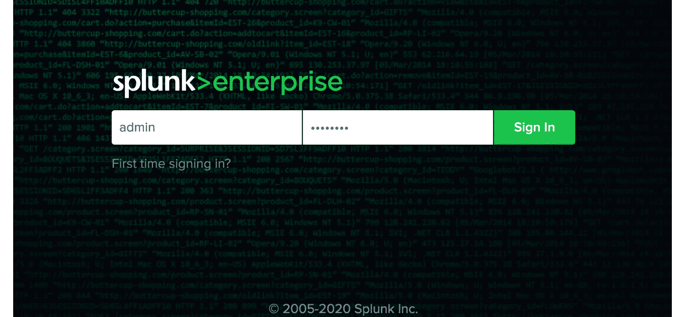

    图 14.1:Splunk 网络登录页面

    登录后，您将看到 Splunk 主屏幕，其外观应类似于以下内容。主屏幕分为单独的部分，如下所示:

    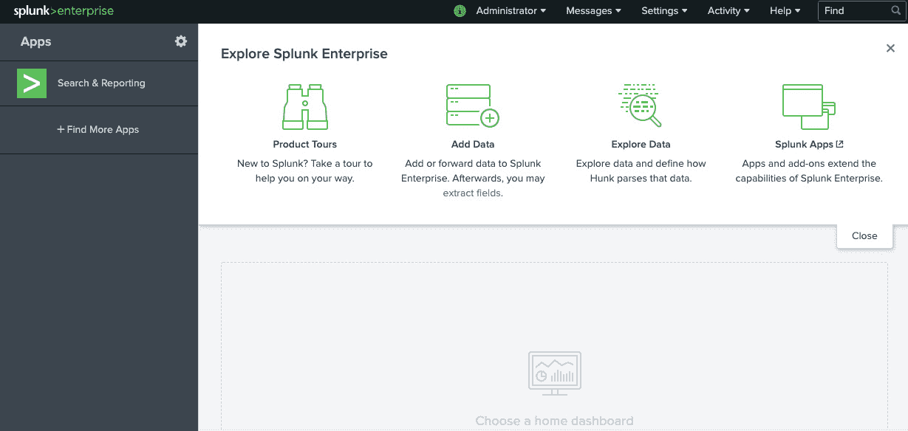

    图 14.2:Splunk 欢迎屏幕

    主屏幕可以分为以下几个部分:

    - **Splunk >** :这是屏幕左上角的图标。只要你点击图标，它就会随时带你回到主屏幕。

    - **应用菜单**:这沿着屏幕的左侧运行，允许您安装和配置 Splunk 应用。

    - **菜单栏**:这沿着屏幕顶部运行，并包含不同的选项，这取决于您对您的帐户拥有的权限级别。当您以管理员帐户登录时，您将获得全部选项。这允许我们配置和管理 Splunk 的运行方式和管理方式。菜单栏中的主要配置选项是`Settings`。它提供了一个大的下拉列表，让您可以控制 Splunk 运行的大部分方面。

    - **主工作区**:主工作区填充了页面的其余部分，您可以在这里开始搜索数据、设置仪表板，并开始可视化数据。您可以设置一个主仪表板，以便每次登录或点击`Splunk>`图标时，您也将看到该仪表板。我们将在本章稍后设置主仪表板，向您展示如何完成。

6.  您可以开始对我们的 Splunk 配置进行更改，但是如果容器由于某种原因停止运行，我们的所有更改都将丢失。相反，创建一个目录，您可以在其中存储 Splunk 环境所需的所有相关配置信息。使用以下命令停止当前正在运行的 Splunk 服务器:

    ```
    docker kill splunk
    ```

7.  创建一个可以装载在 Splunk 主机上的目录。为此称之为`testSplunk`:

    ```
    mkdir -p ${PWD}/testsplunk
    ```

8.  再次运行 Splunk 容器，这次使用`-v`选项将您在上一步中创建的目录装载到容器上的`/opt/splunk/etc`目录。暴露`9997`的额外端口，以便在本练习稍后将数据转发到我们的 Splunk 安装:

    ```
    docker run --rm -d -p 8000:8000 -p 9997:9997 -e 'SPLUNK_START_ARGS=--accept-license' -e 'SPLUNK_PASSWORD=changeme' -v ${PWD}/testsplunk:/opt/splunk/etc/ --name splunk splunk/splunk
    ```

9.  一旦 Splunk 再次启动，请以管理员帐户的身份重新登录到您的 Splunk 网络界面。
10.  Add a new user to your system to make sure you are saving the relevant configuration details in your mounted directory through the `Settings` menu at the top of the screen. Click on the `Settings` menu:

    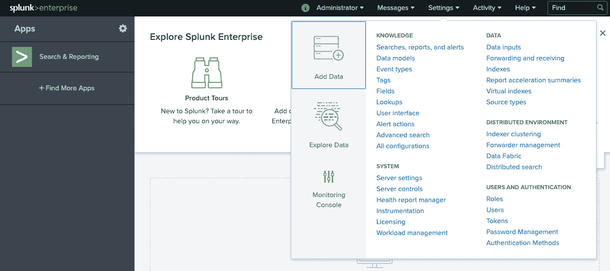

    图 14.3:Splunk 设置菜单

11.  打开`Settings`菜单，移至底部，点击`Users and Authentication`部分的`Users`。您应该会看到在您安装的 Splunk 上创建的所有用户的列表。到目前为止，只有管理员帐户会列在那里。要创建新用户，点击屏幕顶部的`New User`按钮。
12.  You'll be presented with a web form where you can add your new user account details. Fill in the details for the new user. Once you're happy with the details you've added, click on the `Save` button at the bottom of the screen:

    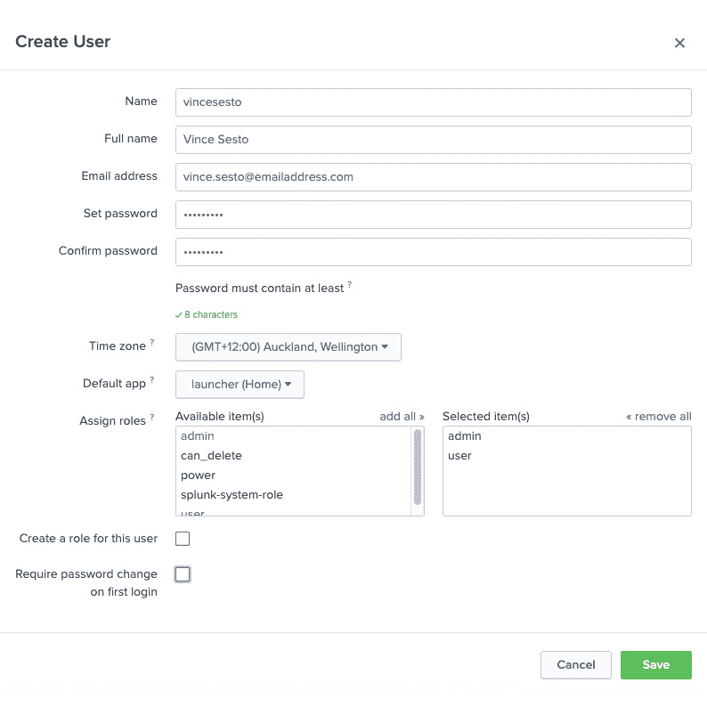

    图 14.4:在 Splunk 上创建新用户

13.  To make sure you are now keeping this data on your mounted directory, move back to your terminal to see whether the new user is stored in your mounted directory. Simply list the directories in the `testsplunk/users` directory using the following command:

    ```
    ls testsplunk/users/
    ```

    您应该看到已经为您在上一步中创建的新帐户设置了一个目录；在这种情况下，`vincesesto`:

    ```
    admin        splunk-system-user        users.ini
    users.ini.default        vincesesto
    ```

14.  是时候开始向系统上运行的 Splunk 实例发送数据了。在开始从正在运行的 Docker 容器收集数据之前，请在正在运行的系统上安装一个转发器，并从那里开始转发日志。要访问特定于您的系统的转发器，请访问以下网址并下载特定于您的操作系统的转发器:[https://www . splunk . com/en _ us/download/universal-转发器. html](https://www.splunk.com/en_us/download/universal-forwarder.html) 。
15.  Follow the prompts to accept the license so that you can use the application. Also, accept the default options presented in the installation program:

    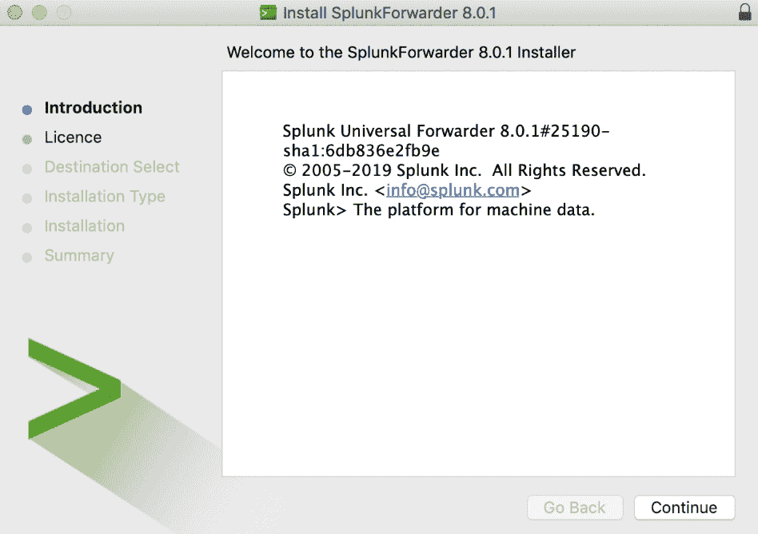

    图 14.5: Splunk 转发器安装程序

16.  转发器通常会自动启动。通过访问您的终端并使用`cd`命令切换到系统上的安装目录，验证转发器是否正在运行。对于 Splunk 转发器，二进制文件和应用文件将位于`/opt/splunkforwarder/bin/`目录:

    ```
    cd /opt/Splunkforwarder/bin/
    ```

17.  In the `bin` directory, check the status of the forwarder by running the `./splunk status` command, as follows:

    ```
    ./splunk status
    ```

    如果它正在运行，您应该会看到类似以下输出的内容:

    ```
    splunkd is running (PID: 2076).
    splunk helpers are running (PIDs: 2078).
    ```

18.  If the forwarder did not start when the installation took place, run it from the `bin` directory with the `start` option using the following command:

    ```
    ./splunk start
    ```

    提供的输出将显示 Splunk 守护程序和服务正在启动。它还将显示系统上运行的服务的进程标识:

    ```
    splunkd is running (PID: 2076).
    splunk helpers are running (PIDs: 2078).
    Splunk> Be an IT superhero. Go home early.
    ...
    Starting splunk server daemon (splunkd)...Done
    ```

19.  You need to let the Splunk forwarder know where it needs to send its data. In *step 8* of this exercise, we made sure we ran our Splunk container with port `9997` exposed for this specific reason. Use the `./splunk` command to tell the forwarder to send the data to our Splunk container running on IP address `0.0.0.0` on port `9997` using the Administrator username and password for our Splunk instance:

    ```
    ./splunk add forward-server 0.0.0.0:9997 -auth admin:changeme
    ```

    该命令应返回类似如下的输出:

    ```
    Added forwarding to: 0.0.0.0:9997.
    ```

20.  最后，要完成 Splunk 转发器的设置，请指定一些日志文件转发到我们的 Splunk 容器。使用转发器上的`./splunk`命令监控我们系统的`/var/log`目录中的文件，并将它们发送到 Splunk 容器进行索引，这样我们就可以开始查看它们:

    ```
    ./splunk add monitor /var/log/
    ```

21.  After a few minutes, if everything has worked as it should, you should have some log events ready to be viewed on your Splunk container. Move back to your web browser and enter the following URL to open a Splunk search page: `http://0.0.0.0:8000/en-US/app/search/search`.

    注意

    下面的步骤使用一个非常基本的 Splunk 搜索查询来搜索您安装的所有数据。如果您以前没有使用过 Splunk 查询语言，请不要担心；我们将花一整节时间*使用 Splunk 查询语言*，更深入地解释查询语言。

22.  Perform a basic search by simply adding an asterisk (`*`) as a search query, as shown in the following screenshot. If everything has worked as it should, you should start to see log events in the results area of the search page:

    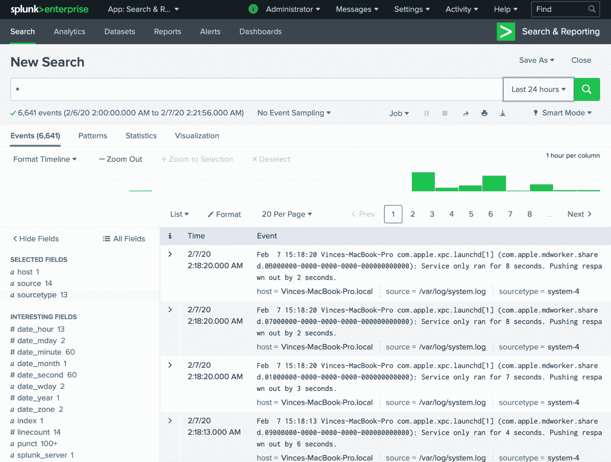

    图 14.6: Splunk 搜索窗口，显示来自我们的转发器的数据

23.  在本练习的最后一部分，您将练习将数据上传到 Splunk 的最简单方法，即简单地将文件直接上传到您运行的系统。从[https://packt.live/3hFbh4C](https://packt.live/3hFbh4C)下载名为`weblog.csv`的样本数据文件，放入您的`/tmp`目录。
24.  Move back to your Splunk web interface and click on the `Settings` menu option. Select `Add Data` from the right-hand side of the menu options, as shown in the following screenshot:

    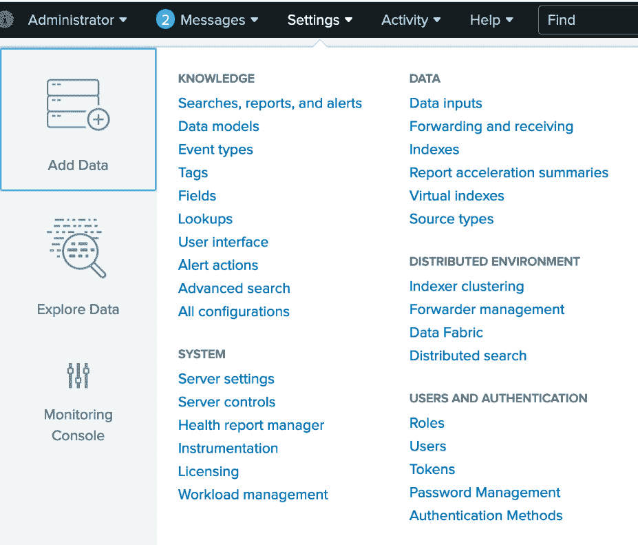

    图 14.7:将文件直接导入 Splunk

25.  Click `Upload files from my computer` toward the bottom of the screen:

    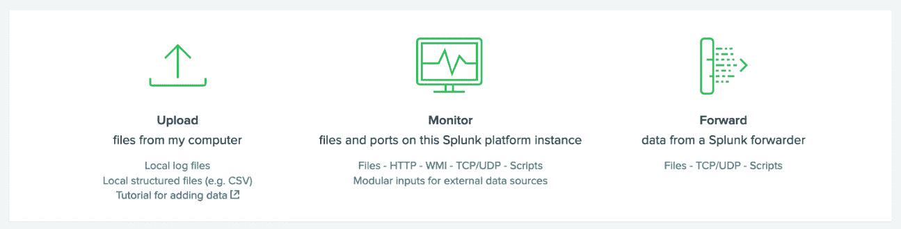

    图 14.8:在 Splunk 上上传文件

26.  下一个屏幕将允许您从机器中选择源文件。选择本练习前面下载的`weblog.csv`文件。选择文件后，点击屏幕顶部的`Next`按钮。
27.  设置`Source Type`选择或接受 Splunk 查看您数据的格式。在这种情况下，它应该已经将您的数据识别为`.csv`文件。点击`Next`按钮。
28.  The `Input Settings` page lets you set the name of your host but leave the index as the default. Click the `Review` button:

    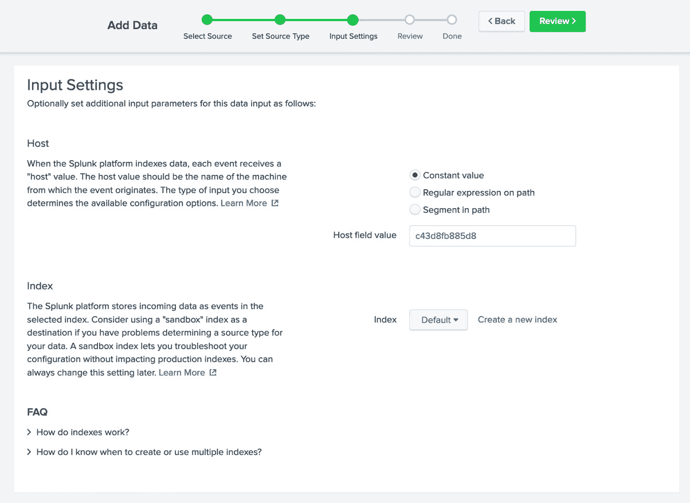

    图 14.9:输入设置页面

29.  Click the `Submit` button if all the entries look correct. Then, click `Start Searching`, where you should see your search screen, along with the sample web log data available and ready to be searched. It should look similar to the following:

    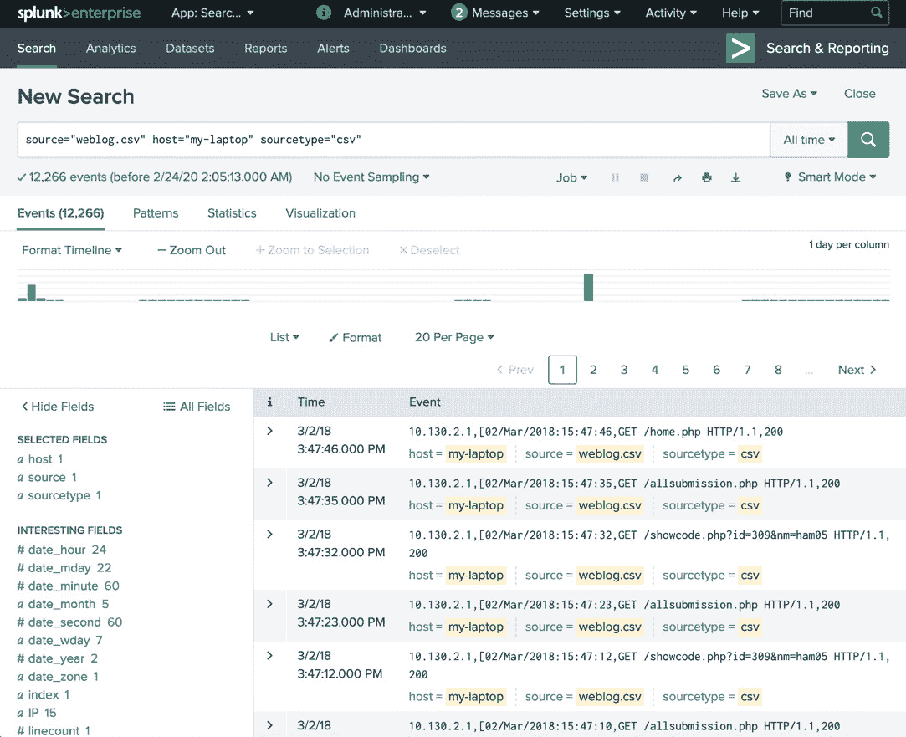

图 14.10:在 Splunk 中搜索导入的文件

在短时间内，我们在系统上设置了一个 Splunk 搜索头和索引器，并安装了一个 Splunk 转发器，将日志发送到索引器和搜索头。我们还手动将日志数据添加到我们的索引中，以便我们可以查看它。

本章的下一部分将着重于将您的 Docker 容器日志放入我们正在运行的新 Splunk 容器中。

# 将容器日志放入 Splunk

我们的日志监控环境开始成形，但是我们需要将 Docker 容器日志放入应用中，以使它值得做这项工作。我们已经设置了 Splunk 转发器，将日志从我们的系统发送到`/var/log`目录。到目前为止，我们已经了解到，我们可以简单地装载容器的日志文件，并使用 Splunk 转发器向 Splunk 索引器发送日志。这是实现这一点的一种方法，但是 Docker 为向 Splunk 发送日志提供了一个更简单的选项。

Docker 提供了一个特定于 Splunk 的日志驱动程序，它将通过我们的网络将我们的容器日志发送到我们的 Splunk 安装上的 HTTP 事件收集器。我们需要打开一个新的端口来公开事件收集器，因为 Splunk 使用端口`8088`在这个方法中收集数据。到目前为止，我们已经在 Splunk 安装中公开了端口`8000`和`9997`。在继续本章的其余部分之前，让我们看看所有可用的端口以及它们在 Splunk 上的功能:

*   `8000`:你一直在使用这个端口进行 web 应用，这是浏览器中用来访问 Splunk 的专用默认 web 端口。
*   `9997`:该端口是 Splunk 转发器向索引器转发数据时使用的默认端口。我们在本章的前一节中公开了这个端口，以确保我们能够从运行的系统中收集日志。
*   `8089` : Splunk 自带一个 API，默认情况下作为搜索头的一部分运行。端口`8089`是应用编程接口管理器与运行在您的实例上的应用编程接口连接的地方。
*   `8088`:端口`8088`需要暴露，以便将信息转发到系统上设置的事件收集器。在接下来的练习中，我们将使用这个端口开始向 HTTP 事件收集器发送 Docker 容器日志。
*   `8080`: If we had a larger Splunk installation with dedicated indexers, port `8080` is used for indexers to communicate among themselves and allow replication among these indexers.

    注意

    Splunk 的网络界面默认运行在端口`8000`上，但是如果您在同一个端口上托管应用，这可能会与我们的全景徒步应用冲突。如果这确实会导致任何问题，请随意将 Splunk 容器上的端口暴露给不同的东西，例如端口`8080`，因为您仍然可以访问网络界面，并且这不会导致我们使用该端口的服务出现任何问题。

一旦在 Splunk 上设置了一个`HTTP Event Collector`，将日志转发到 Splunk 只需向我们的`docker run`命令添加正确的选项。下面的示例命令使用`--log-driver=splunk`向正在运行的容器发出使用 Splunk 日志驱动程序的信号。

然后，它需要包括更多的`--log-opt`选项，以确保日志被正确转发。第一个是`splunk-url`，这是你的系统目前所在的网址。由于我们没有设置域名系统，我们可以简单地使用我们用来托管 Splunk 实例的 IP 地址，以及`8088`的端口。第二个是`splunk-token`。这是 Splunk 在您创建 HTTP 事件收集器时分配的令牌:

```
docker run --log-driver=splunk \
--log-opt splunk-url=<splunk-url>:8088 \
--log-opt splunk-token=<event-collector-token> \
<docker-image>
```

可以选择将 Splunk 日志驱动程序详细信息添加到您的 Docker 配置文件中。在这里，您需要在`/etc/docker`配置文件的`daemon.json`文件中添加以下详细信息。只有当您将 Splunk 作为一个单独的应用而不是系统上的 Docker 实例时，这才会起作用。由于我们已经将 Splunk 实例设置为 Docker 容器，该选项将不起作用。这是因为 Docker 守护程序需要重新启动并连接到配置中列出的`splunk-url`。当然，如果没有 Docker 守护程序的运行，`splunk-url`将永远无法使用:

```
{
  "log-driver": "splunk",
  "log-opts": {
    "splunk-token": "<splunk-token>",
    "splunk-url": "<splunk-url>::8088"
  }
}
```

在下面的练习中，我们将扩展我们的 Splunk 安装，以打开特定于我们的`HTTP Event Collector`的端口，我们也将创建这些端口。然后，我们将开始将日志从我们的容器发送到 Splunk，为我们开始查看它们做好准备。

## 练习 14.02:创建 HTTP 事件收集器并开始收集 Docker 日志

在本练习中，您将为 Splunk 安装创建一个`HTTP Event Collector`，并使用 Docker `log`驱动程序将日志转发到事件收集器。您将使用`random-logger` Docker 映像(由`chentex`存储库提供，可在 Docker Hub 上使用)在您的系统中生成一些日志，并进一步演示 Splunk 的使用:

1.  再次启动 Splunk 映像，这次端口`8088`暴露给我们所有的 Docker 容器，将它们的日志推送到它上面:

    ```
    docker run --rm -d -p 8000:8000 -p 9997:9997 -p 8088:8088 \
     -e 'SPLUNK_START_ARGS=--accept-license' \
     -e 'SPLUNK_PASSWORD=changeme' \
     -v ${PWD}/testsplunk:/opt/splunk/etc/ \
     --name splunk splunk/splunk:latest
    ```

2.  等待 Splunk 再次启动，并使用管理员帐户重新登录到网络界面。
3.  进入`Settings`菜单，选择`Data Inputs`新建`HTTP Event Collector`。从选项列表中选择`HTTP Event Collector`。
4.  Click on the `Global Settings` button on the `HTTP Event Collector` page. You will be presented with a page similar to the following. On this page, click on the `Enabled` button, next to `All Tokens`, and make sure `Enable SLL` is not selected as you will not be using SSL in this exercise. This will make things a little easier for you. When you're happy with the details on the screen, click the `Save` button to save your configurations:

    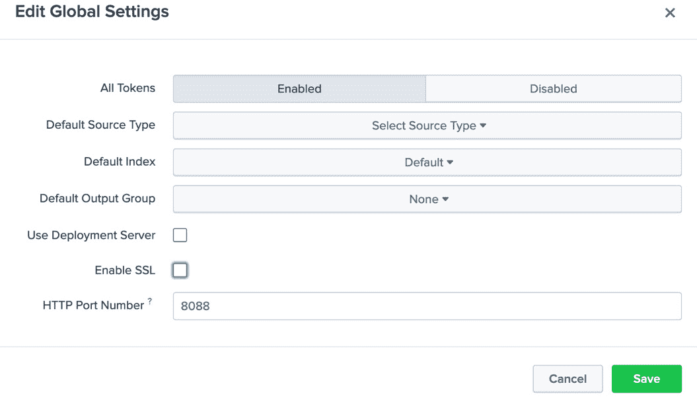

    图 14.11:在系统上启用 HTTP 事件收集器

5.  When you return to the `HTTP Event Collector` page, click the `New Token` button at the top-right of the screen. You'll be presented with a screen similar to the following. This is where you'll set up your new Event Collector so that you can collect your Docker container logs:

    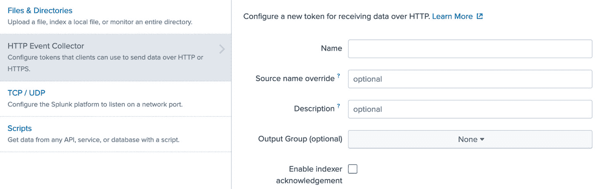

    图 14.12:在 Splunk 上命名您的 HTTP 事件收集器

    在前面的屏幕中，您可以设置新事件收集器的名称。输入名称`Docker Logs`，对于其余条目，将它们留空以接受默认值。点击屏幕顶部的`Next`按钮。

6.  Accept the default values for the `Input Settings` and `Review` pages until you see a page similar to the following, in which a new `HTTP Event Collector` has been created with a token available. The token is displayed as `5c051cdb-b1c6-482f-973f-2a8de0d92ed8`. Yours will be different as Splunk provides a unique token to allow for the secure transfer of data from sources that are trusted by the user. Use this token to allow your Docker containers to start logging data in your Splunk installation:

    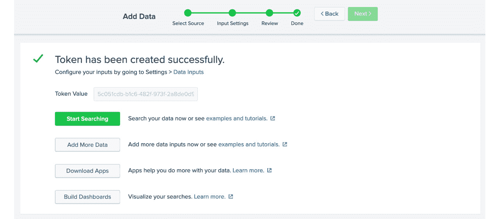

    图 14.13:Splunk 上已完成的 HTTP 事件收集器

7.  Use the `hello-world` Docker image to make sure you can send data to Splunk. In this instance, add four extra command-line options as part of your `docker run` command. Specify `--log-driver` as `splunk`. Provide the log options as the `splunk-url` of our system, including port `8088`, `splunk-token`, which you created in the previous step, and, finally, state `splunk-=insecureipverify` as `true`. This final option will limit the work required in setting up your Splunk installation so that you won't need to organize the SSL certificates that will be used with our Splunk server:

    ```
    docker run --log-driver=splunk \
    --log-opt splunk-url=http://127.0.0.1:8088 \
    --log-opt splunk-token=5c051cdb-b1c6-482f-973f-2a8de0d92ed8 \
    --log-opt splunk-insecureskipverify=true \
    hello-world
    ```

    这些命令应该返回类似于以下内容的输出:

    ```
    Hello from Docker!
    This message shows that your installation appears to be 
    working correctly.
    …
    ```

8.  Return to the Splunk web interface and click the `Start Searching` button. If you have already moved on from the previous screen, go to the Splunk search page at `http://0.0.0.0:8000/en-US/app/search/search`. In the search query box, enter `source="http:Docker Logs"`, as shown in the following screenshot. If everything has worked well, you should also see data entries being provided by the `hello-world` image:

    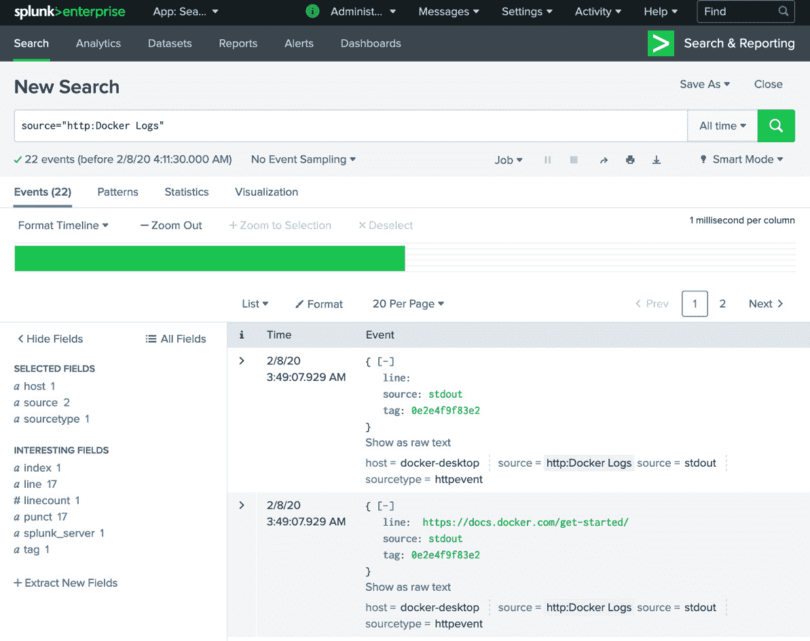

    图 14.14:开始用 Splunk 收集 Docker 日志

9.  上一步已经显示，Splunk 安装现在能够收集 Docker 日志数据，但是您需要创建一个新卷来存储索引数据，这样就不会在每次停止 Splunk 运行时将其销毁。回到你的终端，杀死正在运行的`splunk`容器:

    ```
    docker kill splunk
    ```

10.  在您创建原始`testsplunk`目录的同一个目录中，创建一个新目录，以便我们可以挂载我们的 Splunk 索引数据。在这种情况下，将其命名为`testsplunkindex` :

    ```
    mkdir testsplunkindex
    ```

11.  从您的工作目录中，再次启动 Splunk 映像。安装您刚刚创建的新目录，以便存储您的索引数据:

    ```
    docker run --rm -d -p 8000:8000 -p 9997:9997 -p 8088:8088 \
     -e 'SPLUNK_START_ARGS=--accept-license' \
     -e 'SPLUNK_PASSWORD=changeme' \
     -v ${PWD}/testsplunk:/opt/splunk/etc/ \
     -v ${PWD}/testsplunkindex:/opt/splunk/var/ \
     --name splunk splunk/splunk:latest
    ```

12.  Use the `random-logger` Docker image to generate some logs in your system. In the following command, there's an added `tag` log option. This will mean that each log event that's generated and sent to Splunk will also include this tag as metadata, which can help you search for data when you are searching in Splunk. By using the `{{.Name}}` and `{{.FullID}}` options, these details will be automatically added, just like the container name and ID number will be added as your tag when the container is created:

    ```
    docker run --rm -d --log-driver=splunk \
    --log-opt splunk-url=http://127.0.0.1:8088 \
    --log-opt splunk-token=5c051cdb-b1c6-482f-973f-2a8de0d92ed8 \
    --log-opt splunk-insecureskipverify=true \
    --log-opt tag="{{.Name}}/{{.FullID}}" \
    --name log-generator chentex/random-logger:latest
    ```

    注意

    如果您的 Splunk 实例没有正确运行，或者您没有正确配置某些东西，`log-generator`容器将无法连接或运行。您将看到类似以下内容的错误:

    `docker: Error response from daemon: failed to initialize logging driver:`

13.  Once this is running, move back to the Splunk search page on the web interface and in this instance, include the tag you created in the previous step. The following query will ensure that only new data that has been provided by the `log-generator` image will display in our Splunk output:

    ```
    source="http:docker logs" AND "log-generator/"
    ```

    您的 Splunk 搜索结果应该类似于以下内容。在这里，你可以看到`log-generator`映像生成的日志。您可以看到它在随机时间记录日志，并且每个条目现在都标记有容器的名称和实例标识:

    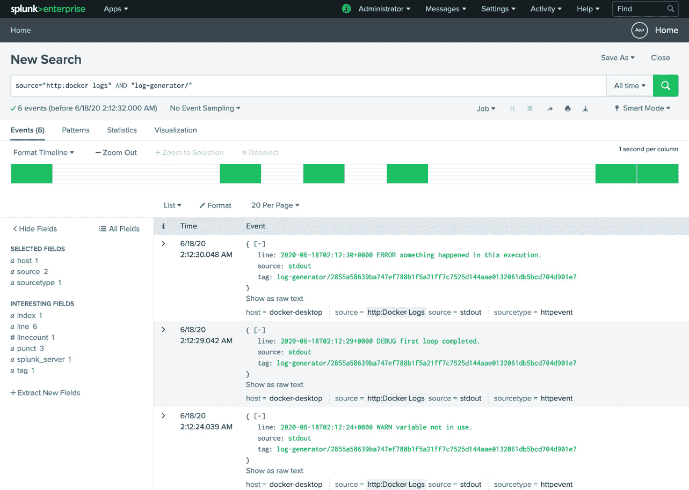

图 14.15: Splunk 搜索结果

我们的 Splunk 安装进展顺利，因为我们现在已经能够将应用配置为包含一个`HTTP Event Collector`，并且已经开始从`log-generator` Docker 映像收集日志。即使我们停止了 Splunk 实例，它们仍然应该可供我们搜索和提取有用的信息。

下一节将更深入地演示如何使用 Splunk 查询语言。

# 使用 Splunk 查询语言

Splunk 查询语言可能有点难学，但是一旦你学了，你会发现从 Splunk 环境中解释、分析和呈现你的数据很有帮助。适应查询语言的最好方法是简单地钻研。

下面的列表描述了使用查询语言时需要考虑的几件事:

*   **缩小搜索范围**:想要搜索的数据量越大，查询返回结果所需的时间就越长。如果您知道时间框架或来源，例如我们为`docker logs`创建的时间框架或来源，查询将更快地返回结果。
*   **使用简单的搜索词**:如果你知道你的日志中会包含什么(例如`ERROR`或`DEBUG`)，这是一个从搜索词开始的好地方，因为它也有助于限制你接收的数据量。这是我们在向 Splunk 实例添加日志时使用上一节中的标签的另一个原因。
*   **连锁搜索词**:我们可以用`AND`对搜索词进行分组。我们也可以使用`OR`搜索使用多个搜索词的日志。
*   **添加通配符搜索多个术语**:查询语言也有使用通配符的选项，比如星号。例如，如果使用`ERR*`查询，它不仅会搜索`ERROR`，还会搜索`ERR`和`ERRORS`。
*   **提取字段提供更多详细信息** : Splunk 会尽最大努力在日志事件中查找和定位字段，尤其是如果您的日志是已知的日志格式，如 Apache 日志文件格式，或者是可识别的格式，如 CSV 或 JSON 日志。如果您正在为应用创建日志，那么如果您将数据作为键值对呈现，Splunk 将在提取字段方面做得非常出色。
*   **向组中添加功能并可视化数据**:向搜索词中添加功能可以帮助您转换和呈现数据。它们通常以管道(`|`)字符添加到您的搜索词中。以下练习将使用`stats`、`chart`和`timechart`功能来帮助聚合搜索结果并计算统计数据，如`average`、`count`和`sum`。举个例子，如果我们使用的是像`ERR*`这样的搜索词，那么我们可以将它传送到`stats`命令，计算我们看到错误事件的次数:`ERR* | stats count`

当您输入查询时，Splunk 还提供了方便的提示。一旦掌握了基础知识，它将帮助您为数据提供额外的功能。

在下面的练习中，您会发现，即使 Splunk 找不到您提取的字段，您也可以创建自己的字段，以便分析您的数据。

## 练习 14.03:熟悉 Splunk 查询语言

在本练习中，您将完成一系列任务，演示查询语言的基本功能，并帮助您更加熟悉如何使用它。这将帮助您检查和可视化自己的数据:

1.  确保您的 Splunk 容器正在运行，并且`log-generator`容器正在向 Splunk 发送数据。
2.  登录 Splunk 后，从首页点击左侧菜单的`Search & Reporting app`或者转到 URL `http://0.0.0.0:8000/en-US/app/search/search`调出搜索页面。
3.  When you get to the search page, you will see a textbox that says `enter search here`. Start with a simple term such as the word `ERROR`, as shown in the following screenshot, and press *Enter* to have Splunk run the query:

    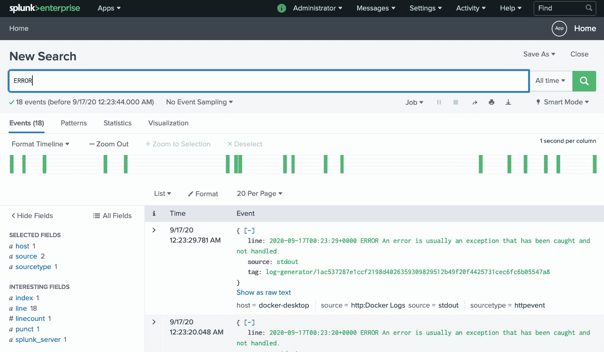

    图 14.16: Splunk 搜索页面

    如果您只在术语末尾输入带有星号(`*`)的术语`ERR*`，这也应该会给出类似于上一个截图所示的结果。

4.  Chain search terms together using `AND` to make sure our log events include multiple values. Enter a search similar to `sourcetype=htt* AND ERR*` to search for all `HTTP` Event Collector logs that are also showing `ERR` values in their logs:

    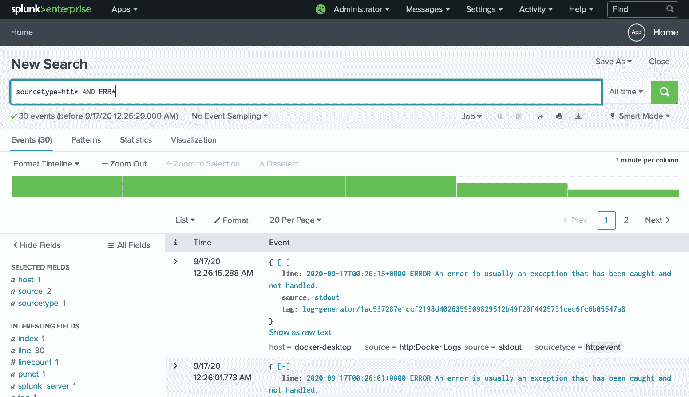

    图 14.17:将搜索词链接在一起

5.  The searches you enter will most likely default to searching through all the data since your installation. Looking through all your data could result in a very time-consuming search. Narrow this down by entering a time range to search over. Click the drop-down menu to the right of the query textbox to limit the data your search is run over. Limit the search to `Last 24 hours`:

    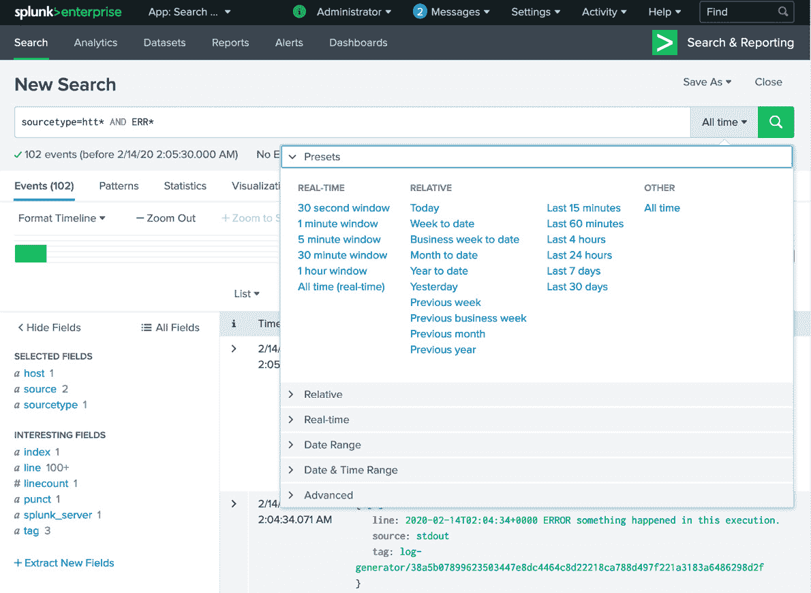

    图 14.18:用时间范围限制搜索

6.  Look through the extracted fields on the left-hand side of the results page. You'll notice that there are two sections. The first is `SELECTED FIELDS`, which includes data specific to your search. The second is `INTERESTING FIELDS`. This data is still relevant and part of your data but not specifically related to your search query:

    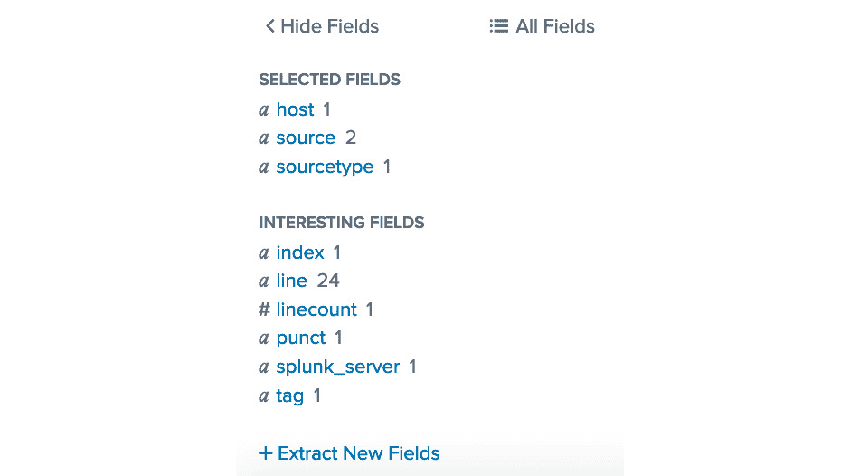

    图 14.19:提取的字段

7.  要创建要列出的字段，请单击`Extract Your Own Fields`链接。以下步骤将介绍创建与`log-generator`容器提供的数据相关的新字段的过程。
8.  您将进入一个新页面，在那里您将看到来自您最近搜索的`httpevent`源类型的样本数据。首先，您需要选择一个示例事件。选择与此处列出的类似的第一行。点击屏幕顶部的`Next`按钮进入下一步:

    ```
    {"line":"2020-02-19T03:58:12+0000 ERROR something happened in this execution.","source":"stdout","tag":"log-generator/3eae26b23d667bb12295aaccbdf919c9370ffa50da9e401d0940365db6605e3"}
    ```

9.  You'll then be asked to choose the method you want to use in order to extract fields. If you are working with files that have a clear delimiter, such as a `.SSV` file, use the `Delimiters` method. In this instance, though, you are going to use the `Regular Expression` method. Click `Regular Expression` and then click the `Next` button:

    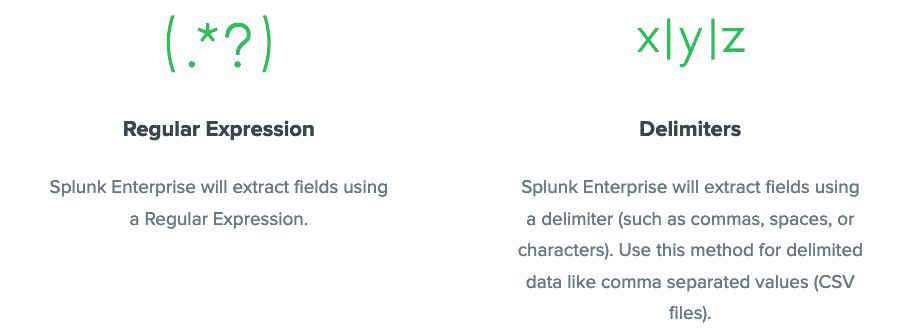

    图 14.20:字段提取方法

10.  You should now have one line of data where you can start to select fields to extract. All the log data provided by the `log-generator` container is the same, so this line will serve as a template for all the events Splunk receives. As shown in the following screenshot, click `ERROR`, and when you're provided with the opportunity to enter a field name, enter `level`, and then select the `Add Extraction` button. Select the line of text after `ERROR`. In this example, it is `something happened in this execution`. Add a field name of `message`. Click the `Add Extraction` button. Then, click the `Next` button when you have selected all the relevant fields:

    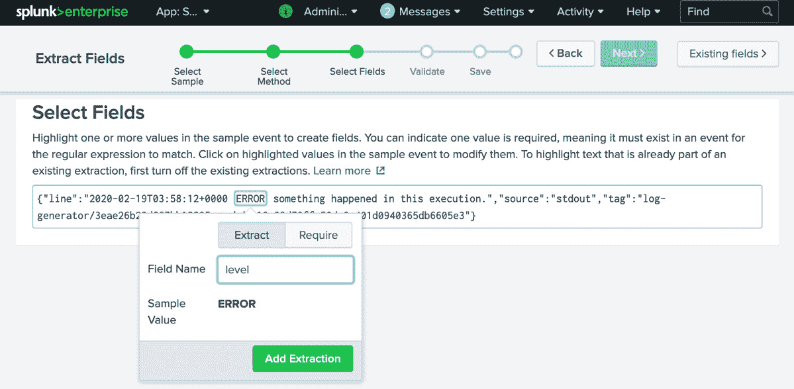

    图 14.21:Splunk 中的字段提取

11.  You should now be able to see all the events with the new fields you have highlighted. Click the `Next` button:

    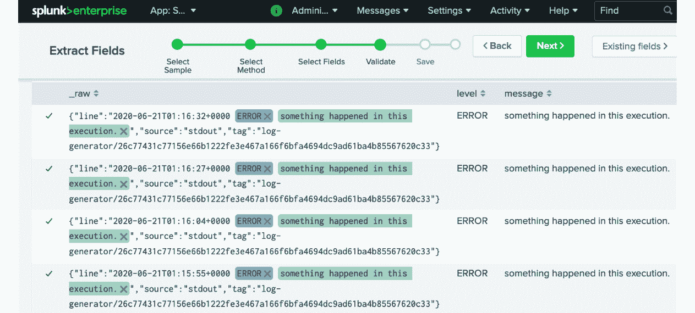

    图 14.22:带有新字段的事件

12.  Finally, you'll be presented with a screen similar to the following. In the `Permissions` section, click the `All apps` button to allow this field extraction to occur across your entire Splunk installation, not limiting it to one app or the owner. If you're happy with the extractions name and other options, click the `Finish` button at the top of the screen:

    

    图 14.23:Splunk 中的字段提取完成

13.  Move back into your search page and add `sourcetype=httpevent` to the search query. Once it loads, look through the extracted fields. You should now have the `level` and `message` fields you added as `INTERESTING FIELDS`. If you click on the `level` field, you will get a breakdown of the number of events received, similar to what's shown in the following screenshot:

    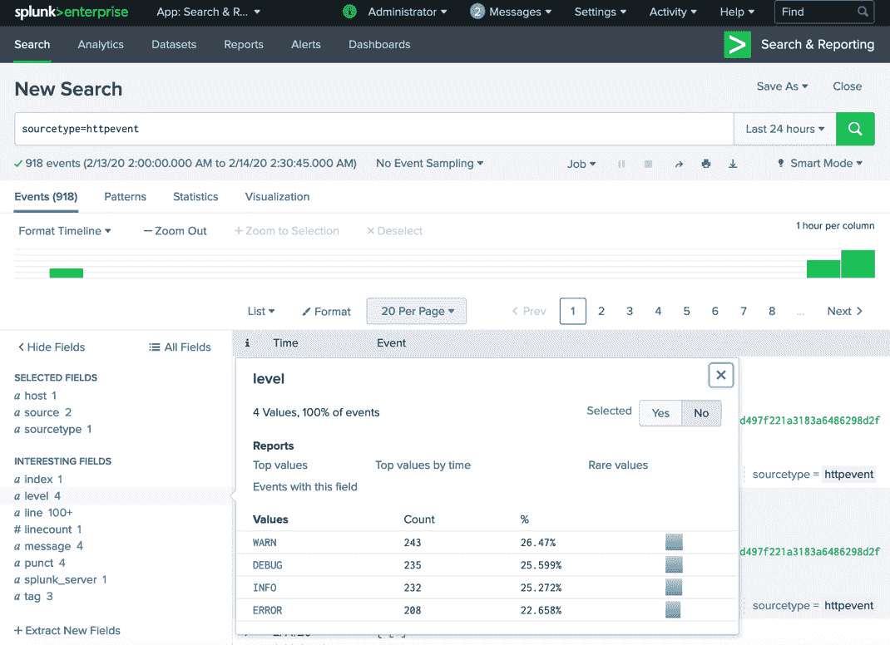

    图 14.24:在搜索结果中显示字段细分

14.  Use the `stats` function to count the number of events for each error level in your logs. Do this by using the `sourcetype=httpevent | stats count by level` search query for the results of your search from the previous step and pipe the values of the `stats` function to `count by level`:

    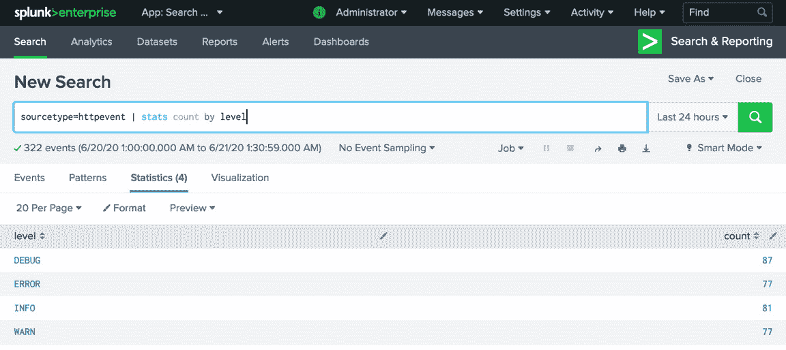

    图 14.25:使用统计函数

15.  The `stats` function gives you some nice information, but if you want to see the data presented over a period of time, use the `timechart` function. Run the `sourcetype=httpevent | timechart span=1m count by level` query to give the result over a range of time. If you perform your search over the past 15 minutes, the preceding query should give you a breakdown of data by each minute. Click the `Visualization` tab under the search query textbox. You will be presented with a graph representing the results of our search:

    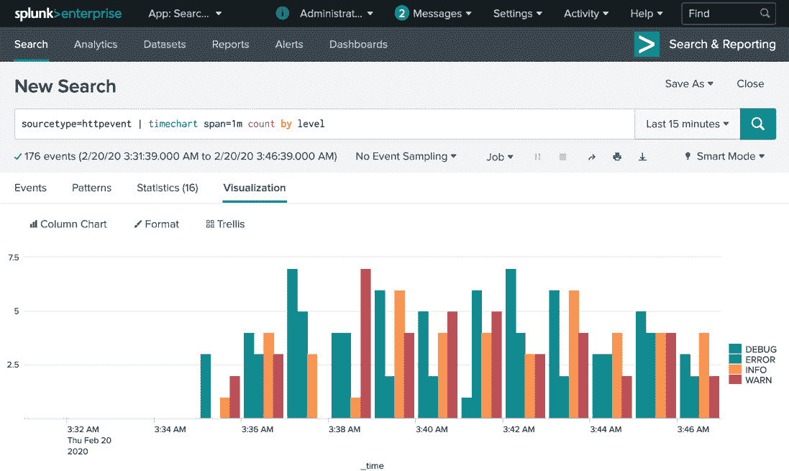

    图 14.26:从搜索结果创建可视化

    您可以在查询中使用 span 选项，按分钟(1m)、小时(5)、天(1d)等对数据进行分组。

16.  In the preceding screenshot, where it mentions the chart type (`Column Chart`), you can change the type you currently have displayed. Click the `Column Chart` text. It will let you select from a few different types of charts. In this instance, use the line chart:

    

    图 14.27:选择图表类型

    注意

    在以下步骤中，您将为数据可视化创建一个仪表板。仪表板是一种向用户显示您的数据的方式，用户不需要知道任何关于 Splunk 或相关数据的具体信息。它非常适合非技术用户，因为您只需提供仪表板的网址，这样用户就可以简单地加载仪表板来查看他们需要的信息。仪表板也非常适合您需要定期执行的搜索，以便限制您需要做的工作量。

17.  When you are happy with the chart, click the `Save As` button at the top of the screen and select the `Dashboard Panel`. You'll be presented with a form similar to the one shown in the following screenshot. Create a new dashboard called `Log Container Dashboard` that is `Shared in App` (the current search app) with the specific panel you have just created, named `Error Level`:

    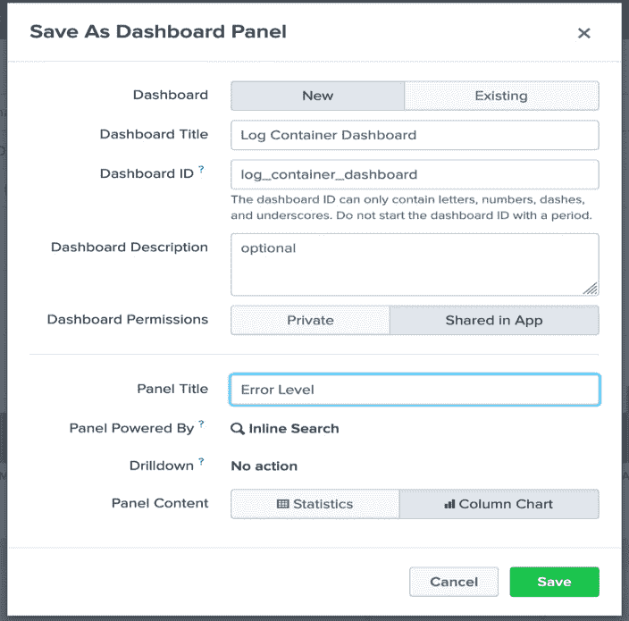

    图 14.28:从搜索结果创建仪表板

18.  Click the `Save` button to create the new dashboard. You'll be given the opportunity to view your dashboard when you click save. But if you need to view the dashboard at a later stage, go to the app you've created the dashboard in (in this case, the `Search & Reporting` app) and click the `Dashboards` menu at the top of the screen. You will be presented with the available dashboards. This is where you can click the relevant one. You'll notice you have two other dashboards available that have been provided by default as part of your Splunk installation:

    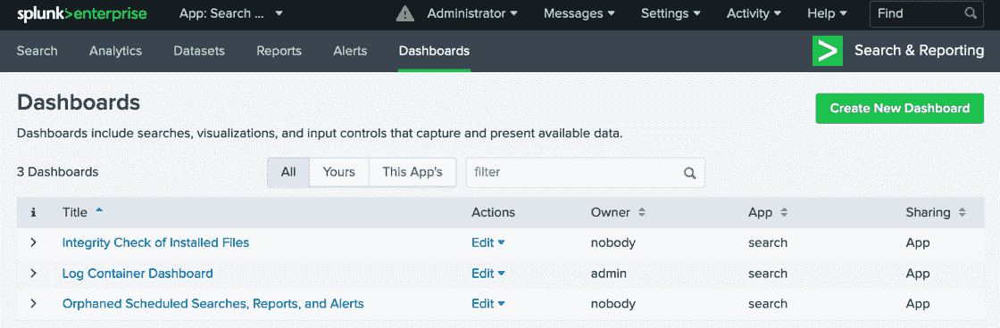

    图 14.29:Splunk 中的仪表板

19.  打开刚刚创建的`Log Container`仪表盘，点击屏幕顶部的`Edit`按钮。这将允许您向仪表板添加一个新面板，而无需移回搜索窗口。
20.  当您点击`Edit`按钮时，您将获得额外的选项来更改仪表板的外观和感觉。现在点击`Add Panel`按钮。
21.  当您选择`Add Panel`时，屏幕右侧会出现一些额外的选项。单击`New`菜单选项，然后选择`Single Value`。
22.  Name the panel `Total Errors` and add `sourcetype=httpevent AND ERROR | stats count` as the search string. The screen where you can add the new dashboard panel should look similar to the following. It should provide details regarding the `Content Title` and `Search String`:

    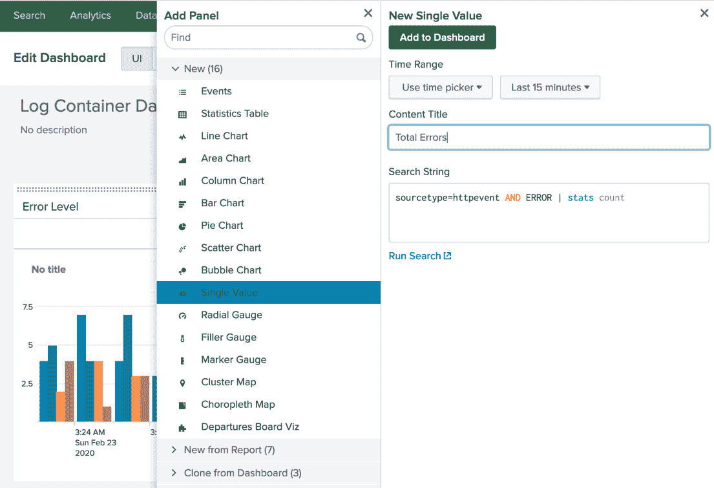

    图 14.30:向 Splunk 仪表板添加面板

23.  点击`Add to Dashboard`按钮，将新面板作为单值面板添加到仪表盘底部。
24.  While the dashboard is in edit mode, you can move and resize the panels if needed and add extra headings or details. When you are happy with your new panel, click the `Save` button at the top-right of the screen.

    您的仪表板应该看起来类似于以下内容:

    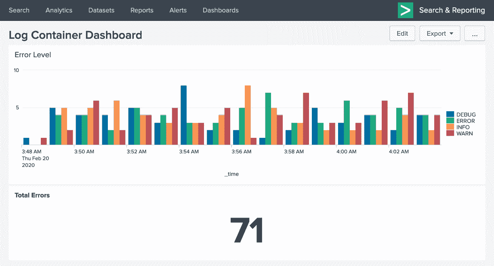

    图 14.31:向仪表板添加新面板

    最后，您的仪表板面板有一些额外的功能，您可以通过单击屏幕右上角的省略号按钮来找到这些功能。如果您对仪表板不满意，可以从这里将其删除。

25.  Click the `Set as Home Dashboard Panel` option, which is available under the ellipses button. This will take you back to the Splunk home screen, where your `Log Container Dashboard` is now available and will be the first thing you see when you log in to Splunk:

    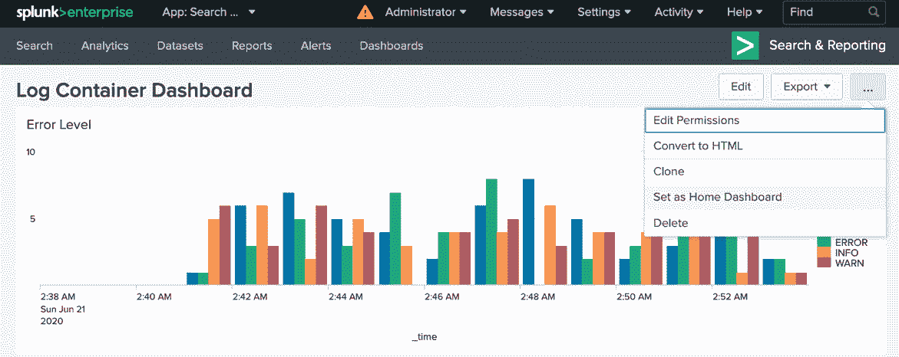

图 14.32:日志容器仪表板

本练习向您展示了如何执行基本查询，将它们与函数链接在一起，并开始创建可视化、仪表板和面板。虽然我们在这个主题上只花了很短的时间，但它应该会让您更有信心进一步处理您的 Splunk 查询。

在下一节中，我们将了解什么是 Splunk 应用，以及它们如何帮助将您的数据、搜索、报告和仪表板分成不同的区域。

# Splunk 应用和保存的搜索

Splunk 应用是您将数据、搜索、报告和仪表板分离到不同区域的一种方式，您可以在这些区域配置谁可以访问什么。Splunk 提供了一个大型生态系统来帮助第三方开发者和公司向公众提供这些应用。

我们在本章前面提到，Splunk 还为通过 Splunk 认证的用户应用提供“SplunkBase”，例如思科网络设备的应用。它不需要是经过批准的应用，就可以在您的系统上使用。Splunk 允许您创建自己的应用，如果需要，您可以将它们以打包文件的形式分发给希望使用它们的用户。Splunk 应用、仪表板和保存的搜索的全部目的是减少重复的工作量，并在需要时向非技术用户提供信息。

以下练习将为您提供一些使用 Splunk 应用的实践经验。

## 练习 14.04:熟悉 Splunk 应用和保存的搜索

在本练习中，您将安装 SplunkBase 中的新应用，并根据自己的需要进行修改。本练习还将向您展示如何保存您的搜索以备将来使用:

1.  确保您的 Splunk 容器正在运行，并且`log-generator`容器正在向 Splunk 发送数据。
2.  When you are logged back in to Splunk, click the cog icon next to the word `Apps` in the `Apps` menu. When you are taken to the `Apps` page, you should see something similar to the following. The page contains a list of all Splunk apps currently installed on your system. You'll notice that some are enabled, while some are disabled.

    您还可以选择从 Splunk 应用库中浏览更多应用、从文件安装应用或创建自己的 Splunk 应用:

    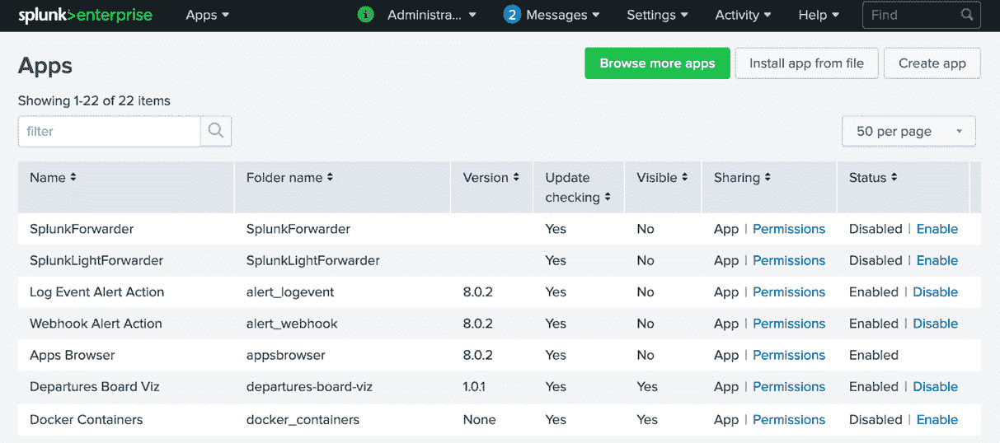

    图 14.33:使用 Splunk 中的应用页面

3.  点击屏幕顶部的`Browse more apps`按钮。
4.  You'll be taken to a page that provides a list of all the Splunk apps available to your system. Some of them are paid, but the majority of them are free to use and install. You can also search by name, category, and support level. Enter `Departures Board Viz` in the search box at the top of the screen and click *Enter*:

    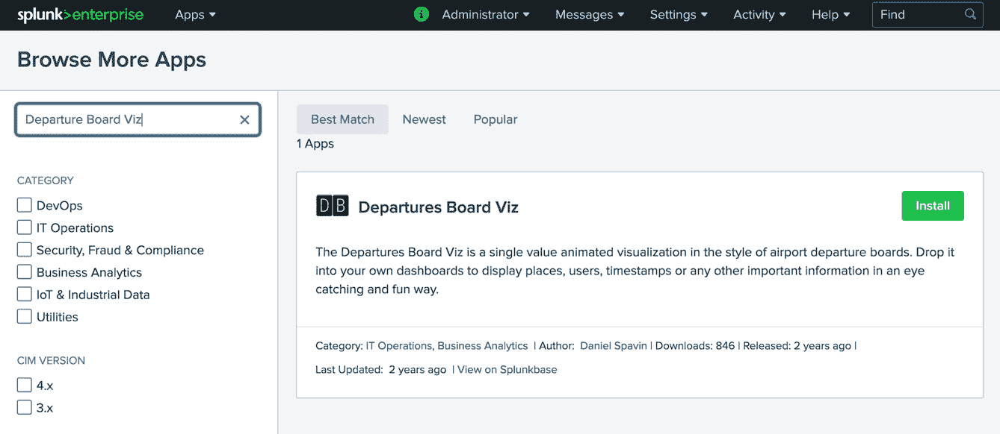

    图 14.34:出发板 Viz 应用

    注意

    本节以`Departures Board Viz`应用为例，因为它易于使用和安装，只需很少的改动。每个应用都应该给你一些关于它使用的信息类型以及如何开始处理所需数据的细节。你会注意到有数百个应用可供选择，所以你一定会找到适合你需求的东西。

5.  You need to have registered with Splunk to be able to install and use the apps available. Click the `Install` button for the `Departures Board Viz` app and follow the prompts to sign in, if needed:

    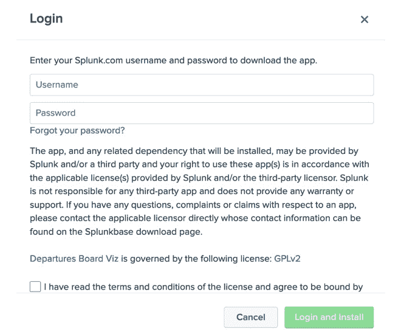

    图 14.35:安装启运板 Viz 应用

6.  如果安装成功，应该会提示您打开刚刚安装的应用或返回 Splunk 主页。返回主页查看您所做的更改。
7.  From the home page, you should now see that the new app, called `Departures Board Viz`, has been installed. This is simply a visualization extension. Click the `Departures Board Vis` button on the home screen to open the app:

    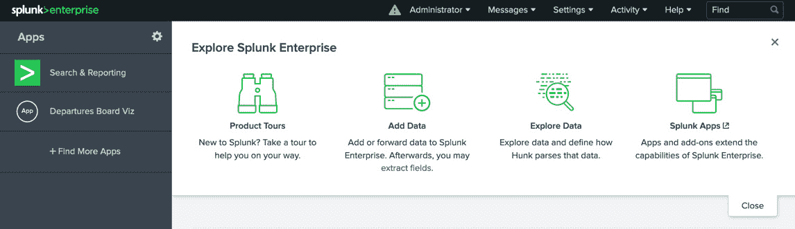

    图 14.36:打开出发板 Viz 应用

8.  When you open the app, it will take you to the `About` page. This is simply a dashboard that provides details of the app and how to use it with your data. Click the `Edit` button at the top of the screen to continue:

    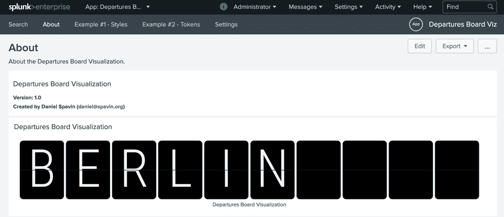

    图 14.37:出发板 Viz 应用的“关于”页面

9.  点击`Edit Search`添加新的搜索，显示特定于您的数据。
10.  Remove the default search string and place the `sourcetype=httpevent | stats count by level | sort - count | head 1 | fields level` search query in the textbox. The query will look through your `log-generator` data and provide a count of each level. Then, sort the results from the highest to lowest order (`sort - count`) and provide the level with the top value (`head 1 | fields level`):

    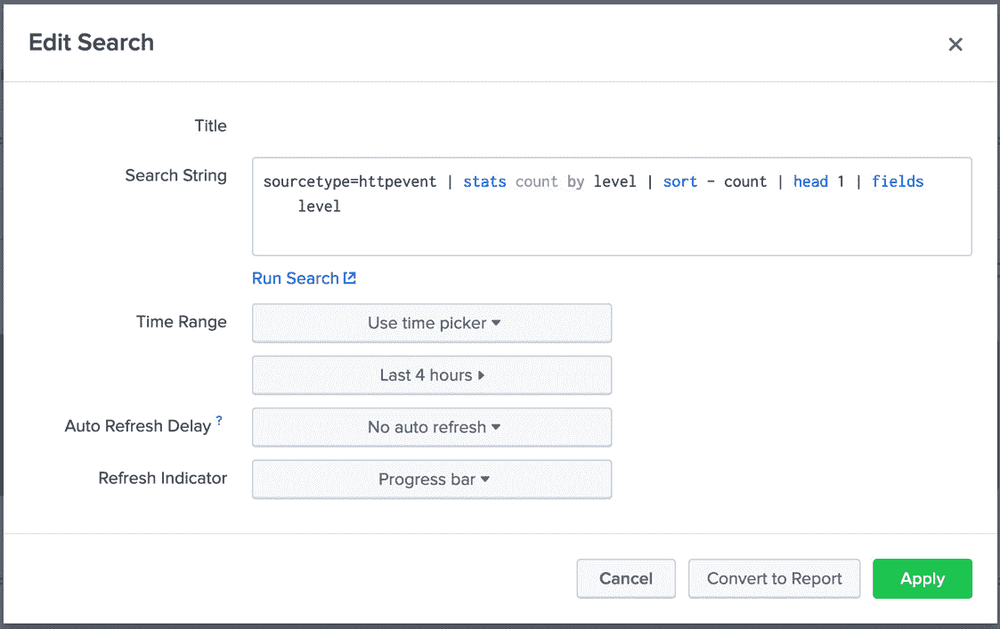

    图 14.38:添加新的搜索查询

11.  Click the `Save` button to save the changes you've made to the visualization. Instead of a city name that is provided by default by `Departures Board Viz`, you should see the top error level provided in our data. As shown in the following screenshot, the top error being reported in our logs is `INFO`:

    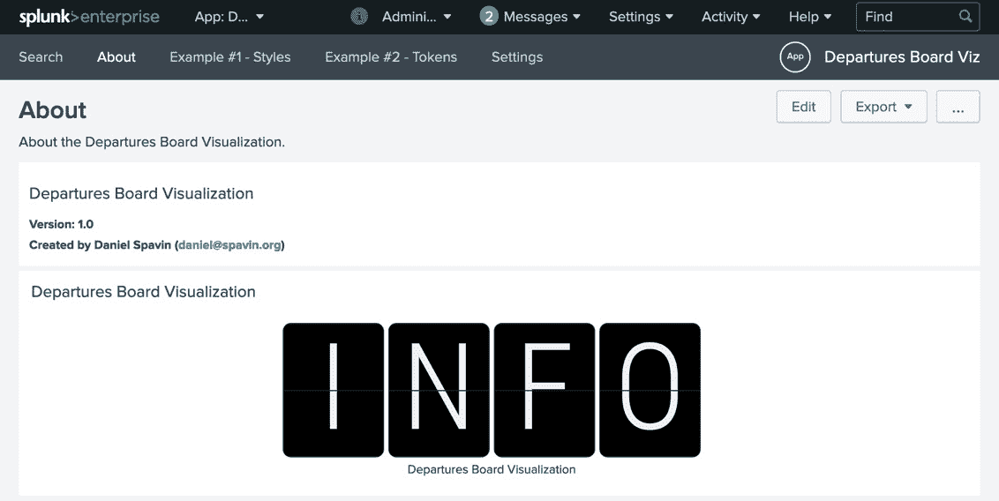

    图 14.39:在 Splunk 中编辑 Splunk 应用

12.  现在您已经添加了一个 Splunk 应用，您将创建一个自己的非常基本的应用来进一步修改您的环境。回到主屏幕，再次点击`Apps`菜单旁边的齿轮。
13.  On the `Apps` page, click on the `Create app` button on the right-hand side of the screen:

    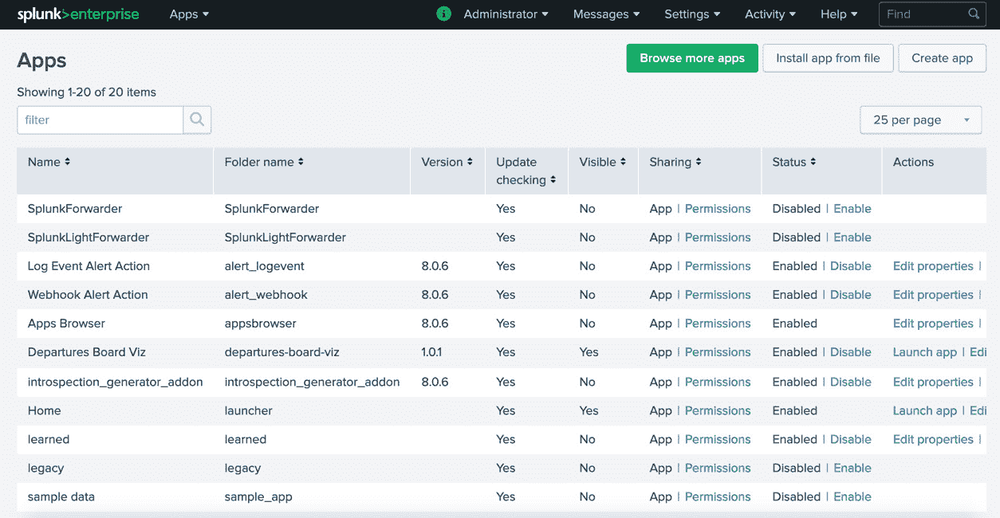

    图 14.40: Splunk 应用

14.  When you create an app of your own, you'll be presented with a form similar to the one shown here. You are going to create a test app for your Splunk install. Fill in the form using the information provided in the following screenshot, but make sure you add values for `Name` and `Folder Name`. The version is also a required field and needs to be in the form of `major_version.minor_version.patch_version`. Add the version number as `1.0.0`. The following example has also selected the `sample_app` option instead of the `barebones` template. This means the app will be filled with sample dashboards and reports that you can modify for the data you are working on. You won't be working with any of these sample dashboards and reports, so you can choose either. The `Upload asset` option is only needed if you have a pre-created Splunk app available, but in our instance, it can be left blank:

    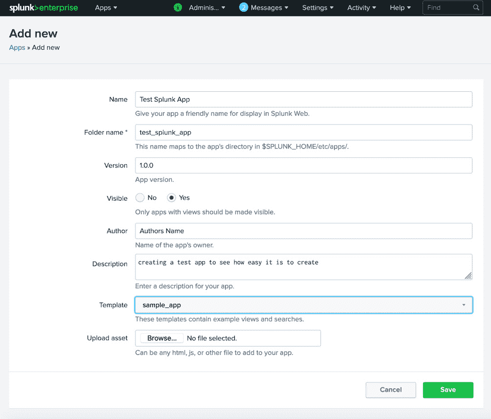

    图 14.41:创建 Splunk 应用

15.  Click the `Save` button to create your new app and then move back to the home screen of your installation. You'll notice that you now have an app listed on your home screen called `Test Splunk App`. Click on your new app to open it up:

    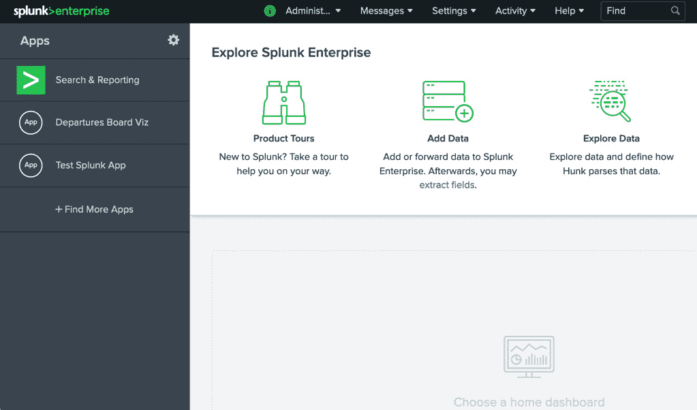

    图 14.42:在主屏幕上测试 Splunk 应用

16.  该应用与`Search & Reporting`应用看起来没有任何不同，但是如果您单击屏幕顶部的`Reports or Dashboards`选项卡，您会注意到将会有一些示例报告和仪表板到位。不过，暂时先创建一份报告，以便日后参考。首先确保你在你的应用的`Search`标签中。
17.  在查询栏中输入`sourcetype=httpevent earliest=-7d | timechart span=1d count by level`。您会注意到我们已经将该值设置为`earliest=-7d`，它会自动选择前 7 天的数据，因此您不需要为您的搜索指定时间范围。然后，它会创建一个数据的时间图，将每天的值相加。
18.  Click the `Save As` button at the top of the screen and select `Report` from the drop-down menu. You'll be presented with the following form so that you can save your report. Simply name the report and provide a description before clicking on the `Save` button at the bottom of the screen:

    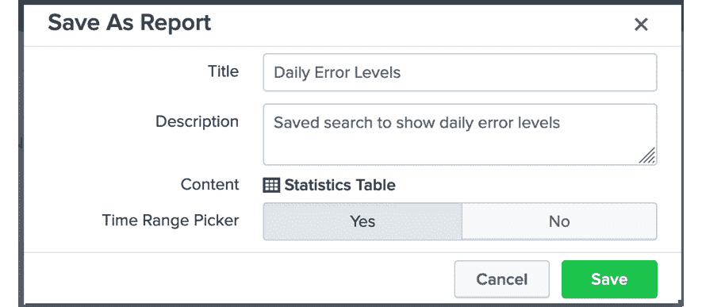

    图 14.43:在 Splunk 应用中创建保存的报告

19.  When you click `Save`, you'll be given the option to view your new report. It should look similar to the following:

    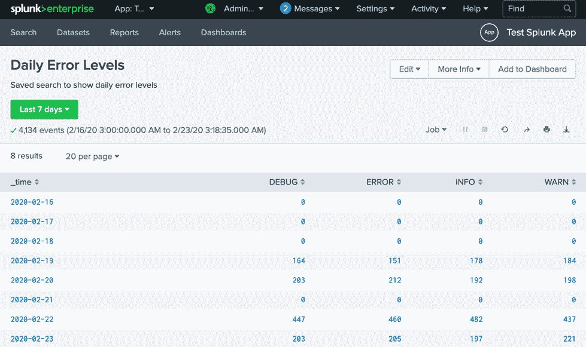

图 14.44:Splunk 中的每日错误级别报告

如果您需要再次参考该报告，您可以点击您的新 Splunk 应用的`Reports`选项卡，它将与首次创建该应用时提供的示例报告一起列出。下面的截图显示了你的应用的`Reports`标签，其中列出了示例报告，但是你也有你刚刚创建的`Daily Errors`报告，它已经被添加到列表的顶部:

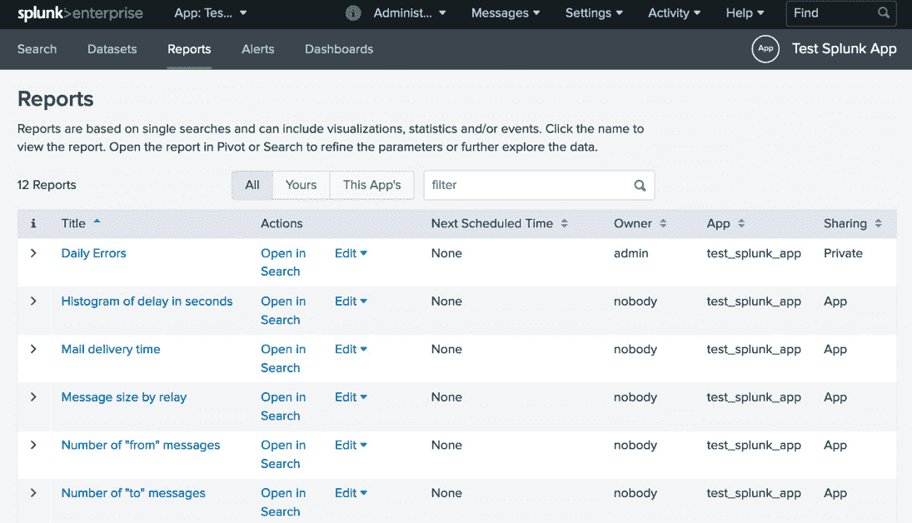

图 14.45:报告页面

这就结束了本次练习，我们已经安装了第三方 Splunk 应用，并创建了自己的应用。这也将我们带到这一章的结尾。然而，在你进入下一章之前，确保你完成了接下来提供的活动，以重申你在这一章学到的一切。

## 活动 14.01:为 Splunk 安装创建 docker-compose.yml 文件

到目前为止，您已经通过简单地使用`docker run`命令在 Docker 容器上运行了 Splunk。现在是时候使用您在本书前面几节中获得的知识来创建一个`docker-compose.yml`文件，以便您可以在需要时在您的系统上安装和运行我们的 Splunk 环境。作为本活动的一部分，添加一个作为全景徒步应用一部分运行的容器。此外，请确保您可以查看所选服务的日志。

执行以下步骤完成本活动:

1.  决定您希望 Splunk 安装作为 Docker 编写文件的一部分运行后的外观。这将包括安装需要在安装过程中公开的目录和端口。
2.  创建您的`docker-compose.yml`文件并运行`Docker Compose`。确保它根据您在上一步中的要求启动您的 Splunk 安装。
3.  一旦 Splunk 安装启动并运行，从全景徒步应用启动一项服务，并确保您可以将日志数据发送到您的 Splunk 设置。

**预期输出:**

这将产生类似于以下内容的屏幕:

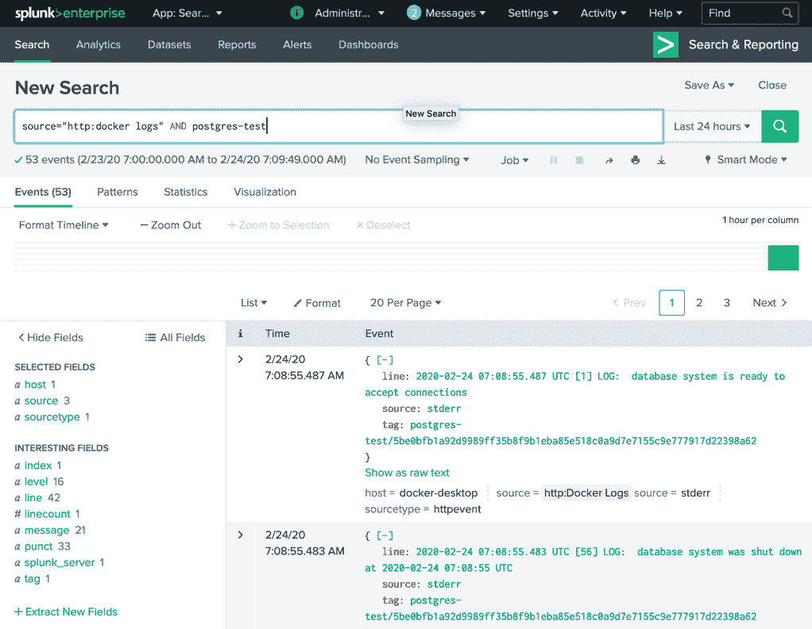

图 14.46:活动 14.01 的预期产出

注意

此活动的解决方案可以通过[这个链接](16.html#_idTextAnchor356)找到。

下一个活动将允许您为正在登录 Splunk 的新数据创建一个 Splunk 应用和仪表板。

## 活动 14.02:为 Monit 或全景徒步应用创建一个 Splunk 应用

在上一个活动中，您确保作为全景徒步旅行应用的一部分而设置的服务之一正在您的 Splunk 环境中记录数据。在本活动中，您需要在您的安装中创建一个新的 Splunk 应用，以专门监控您的服务，并创建一个与将服务数据记录到 Splunk 相关的仪表板。

完成本活动需要遵循的步骤如下:

1.  确保您的 Splunk 安装正在运行，并且全景徒步应用中至少有一项服务正在将数据记录到 Splunk 中。
2.  创建一个新的 Splunk 应用，并将其命名为与监控全景徒步应用相关的东西。请确保您可以从 Splunk 主屏幕查看它。
3.  创建与您正在监控的服务相关的仪表板，并添加一些可视化效果来帮助您监控您的服务。

**预期输出**:

成功完成此活动后，将显示类似于以下内容的控制面板:

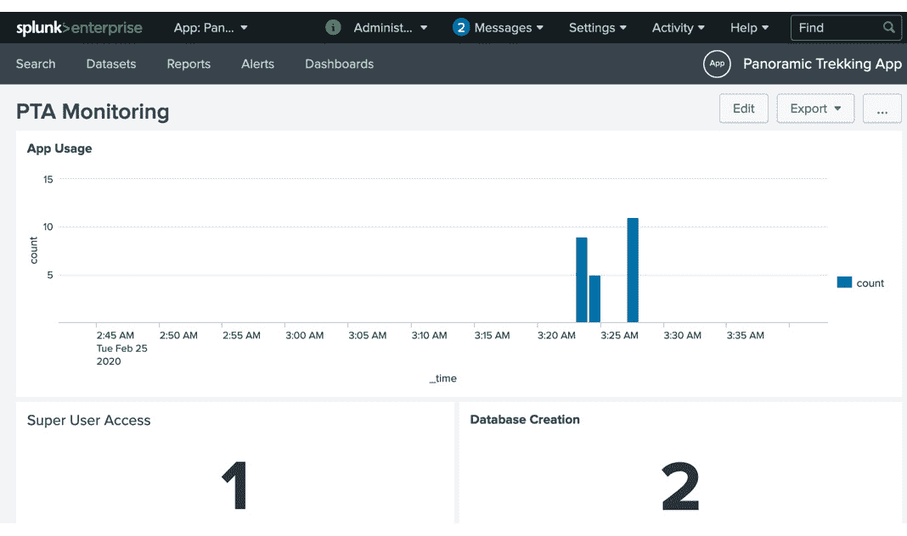

图 14.47:活动 14.02 的预期解决方案

注意

此活动的解决方案可以通过[这个链接](16.html#_idTextAnchor357)找到。

# 总结

本章向您介绍了 Splunk 等应用如何通过将容器日志聚合到一个中心区域来帮助您监控和排除应用故障。本章一开始，我们讨论了使用 Docker 时日志管理策略的重要性，然后通过讨论 Splunk 的体系结构以及如何运行应用的一些细节来介绍它。

我们直接与 Splunk 合作，运行 Docker 容器映像，并开始从我们运行的系统转发日志。然后，我们使用 Splunk 日志驱动程序将我们的容器日志直接发送到我们的 Splunk 容器，装载重要的目录以确保我们的数据被保存并可用，即使在我们停止运行我们的容器之后。最后，我们仔细研究了 Splunk 查询语言，使用该语言我们创建了仪表板并保存了搜索，并考虑了 Splunk 应用生态系统的优势。

下一章将介绍 Docker 插件，并教你如何利用它们来帮助扩展你的容器和运行在它们上面的服务。