# 十五、使用插件扩展 Docker

概观

在本章中，您将学习如何通过创建和安装插件来扩展 Docker Engine 的功能。您将看到如何在使用 Docker 容器时实现您的高级和定制需求。到本章结束时，您将能够确定扩展 Docker 的基础。您还将能够安装和配置不同的 Docker 插件。接下来，您将使用 Docker 插件 API 开发自定义插件，并使用各种 Docker 插件来扩展 Docker 中的卷、网络和授权功能。

# 简介

在前几章中，您使用 **Docker Compose** 和 **Docker Swarm** 运行了多个 Docker 容器。此外，您还从容器中监控指标并收集日志。Docker 允许您管理容器的整个生命周期，包括网络、卷和进程隔离。如果您想要自定义 Docker 的操作以与您的自定义存储、网络提供商或认证服务器一起工作，您需要扩展 Docker 的功能。

例如，如果您有一个定制的基于云的存储系统，并且您想要将其装载到您的 Docker 容器中，您可以实现一个存储插件。同样，您可以使用授权插件从您的企业用户管理系统中验证您的用户，并允许他们使用 Docker 容器。

在本章中，您将学习如何用插件扩展 Docker。您将从插件管理和 API 开始，接下来是最高级和请求的插件类型:授权、网络和卷。下一节将介绍 Docker 中插件的安装和操作。

# 插件管理

Docker 中的插件是独立于 Docker 引擎运行的外部进程。这意味着 Docker 引擎不依赖插件，反之亦然。我们只需要通知 Docker 引擎插件的位置和它的功能。Docker 提供了以下 CLI 命令来管理插件的生命周期:

*   `docker plugin create`:这个命令创建一个新的插件及其配置。
*   `docker plugin enable/disable`:这些命令启用或禁用插件。
*   `docker plugin install`:这个命令安装一个插件。
*   `docker plugin upgrade`:此命令将现有插件升级到新版本。
*   `docker plugin rm`:该命令通过从 Docker 引擎中移除插件的信息来移除插件。
*   `docker plugin ls`:该命令列出已安装的插件。
*   `docker plugin inspect`:该命令显示插件的详细信息。

在下一节中，你将学习插件如何在 Docker 中用插件 API 实现。

# 插件接口

Docker 维护一个插件 API 来帮助社区编写他们的插件。这意味着任何人都可以开发新的插件，只要他们按照插件应用编程接口实现它。这种方法使 Docker 成为一个开放和可扩展的平台。插件应用编程接口是一个通过超文本传输协议工作的**远程过程调用** ( **RPC** )风格的 JSON 应用编程接口。Docker 引擎向插件发送 HTTP POST 请求，并使用响应继续其操作。

Docker 还提供了一个官方开源 SDK，用于创建新的插件和**助手包**来扩展 Docker Engine。如果你想轻松地创建和运行新的插件，助手包是样板模板。目前，Go 中只有助手包，因为 Go 是 Docker 引擎本身的主要实现语言。它位于[https://github.com/docker/go-plugins-helpers](https://github.com/docker/go-plugins-helpers)，为 Docker 支持的各种插件提供助手:


图 15.1: Go 插件助手

您可以检查存储库中列出的每个文件夹，以便轻松创建和运行不同类型的插件。在本章中，您将通过几个实践练习来探索支持的插件类型，即授权、网络和批量插件。插件通过提供附加功能和默认的 Docker 功能，使 Docker 引擎能够实现定制的业务需求。

# 授权插件

Docker 授权基于两种模式:**各种动作被启用**或**各种动作被禁用**。换句话说，如果用户可以访问 Docker 守护程序，他们可以运行任何命令并使用 API 或 Docker 客户端命令。如果需要更细粒度的访问控制方法，需要在 Docker 中使用授权插件。授权插件增强了 Docker 引擎操作的认证和权限。它们支持更精细的访问，以控制谁可以在 Docker Engine 上采取特定操作。

授权插件使用请求上下文批准或拒绝 Docker 守护程序转发的请求。因此，插件应该实现以下两种方法:

*   `AuthZReq`:在 Docker 守护进程处理请求之前调用这个方法。
*   `AuthZRes`:在 Docker 守护进程向客户端返回响应之前，调用该方法。

在下面的练习中，您将学习如何配置和安装授权插件。您将安装由开放策略代理([https://www.openpolicyagent.org/](https://www.openpolicyagent.org/))创建和维护的**基于策略的授权**插件。**基于策略的访问**是基于基于一些规则授予用户访问权限的思想，即**策略**。该插件的源代码可在 GitHub 上的[https://github.com/open-policy-agent/opa-docker-authz](https://github.com/open-policy-agent/opa-docker-authz)获得，它与类似于以下的策略文件一起工作:

```
package docker.authz 
allow {
    input.Method = "GET"
}
```

策略文件存储在 Docker 守护程序可以读取的主机系统中。例如，这里显示的策略文件只允许`GET`作为请求的方法。它实际上通过禁止任何其他方法使 Docker 守护程序成为只读的，例如`POST`、`DELETE`或`UPDATE`。在下面的练习中，您将使用策略文件并配置 Docker 守护程序来与授权插件通信并限制一些请求。

注意

考虑到 Docker 守护程序的安装和配置，以下练习中的插件和命令在 Linux 环境中工作得最好。如果您正在使用自定义或工具箱 Docker 安装，您可能希望使用虚拟机完成本章中的练习。

注意

请使用`touch`命令创建文件，使用`vim`命令使用 vim 编辑器处理文件。

## 练习 15.01:带有授权插件的只读 Docker 守护程序

在本练习中，您需要创建一个只读的 Docker 守护程序。如果您想要限制对生产环境的访问和更改，这是一种常见的方法。为了实现这一点，您将安装和配置带有策略文件的插件。

要完成练习，请执行以下步骤:

1.  Create a file located at `/etc/docker/policies/authz.rego` by running the following commands:

    ```
    mkdir -p /etc/docker/policies
    touch /etc/docker/policies/authz.rego
    ls /etc/docker/policies
    ```

    这些命令创建一个位于`/etc/docker/policies`的文件:

    ```
    authz.rego
    ```

2.  Open the file with an editor and insert the following data:

    ```
    package docker.authz 
    allow {
        input.Method = "GET"
    }
    ```

    您可以使用以下命令将内容写入文件:

    ```
    cat > /etc/docker/policies/authz.rego << EOF
    package docker.authz 
    allow {
        input.Method = "GET"
    }
    EOF
    cat /etc/docker/policies/authz.rego
    ```

    注意

    `cat`命令用于使文件内容在终端可编辑。除非您在无头模式下运行 Ubuntu，否则您可以跳过使用基于命令行界面的命令来编辑文件内容。

    策略文件只允许 Docker 守护程序中的`GET`方法；换句话说，它使 Docker 守护程序成为只读的。

3.  Install the plugin by running the following command in your terminal and enter *y* when it prompts for permissions:

    ```
    docker plugin install --alias opa-docker-authz:readonly \
    openpolicyagent/opa-docker-authz-v2:0.5 \
    opa-args="-policy-file /opa/policies/authz.rego"
    ```

    该命令安装别名为`opa-docker-authz:readonly`的位于`openpolicyagent/opa-docker-authz-v2:0.5`的插件。另外*第 1 步*的策略文件作为`opa-args`传递:

    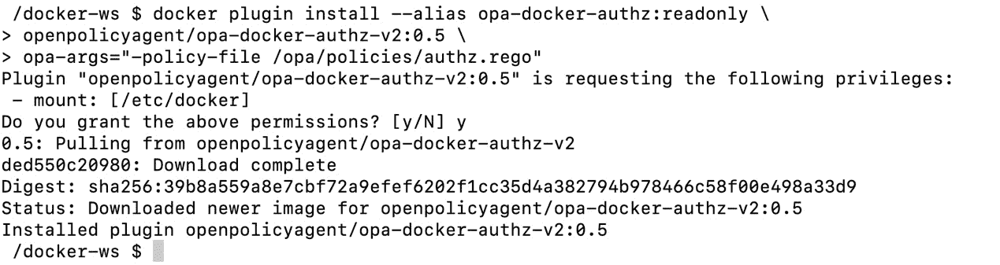

    图 15.2:插件安装

4.  Check for the installed plugins using the following command:

    ```
    docker plugin ls
    ```

    该命令列出了插件:

    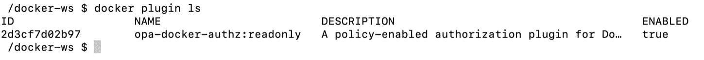

    图 15.3:插件列表

5.  Edit the Docker daemon configuration at `/etc/docker/daemon.json` with the following edition:

    ```
    {
        "authorization-plugins": ["opa-docker-authz:readonly"]
    }
    ```

    可以用`cat /etc/docker/daemon.json`命令检查文件内容。

6.  Reload the Docker daemon with the following command:

    ```
    sudo kill -HUP $(pidof dockerd)
    ```

    该命令通过用`pidof`命令获取进程标识来终止`dockerd`进程。此外，它发送`HUP`信号，这是发送给 Linux 进程更新其配置的信号。简而言之，您正在用新的授权插件配置重新加载 Docker 守护程序。运行以下 listing 命令检查是否允许列表操作:

    ```
    docker ps
    ```

    该命令列出了正在运行的容器，并显示允许列表操作:

    ```
    CONTAINER ID  IMAGE  COMMAND  CREATED  STATUS  PORTS  NAMES
    ```

7.  Run the following command to check whether creating new containers is permitted:

    ```
    docker run ubuntu
    ```

    该命令创建并运行一个容器；但是，由于该操作不是只读的，因此不允许:

    ```
    Error response from daemon: authorization denied by plugin 
    opa-docker-authz:readonly: request rejected by administrative policy.
    See 'docker run –-help'.
    ```

8.  Check for the logs of the Docker daemon for any plugin-related lines:

    ```
    journalctl -u docker | grep plugin | grep "OPA policy decision"
    ```

    注意

    `journalctl`是显示`systemd`进程日志的命令行工具。`systemd`进程以二进制格式存储日志。`journalctl`需要读取日志文本。

    下面的输出显示了在*第 7 步*和*第 8 步*中测试的动作通过了带有`"Returning OPA policy decision: true"`和`"Returning OPA policy decision: false"`行的授权插件。它显示我们的插件允许第一个动作，拒绝第二个动作:

    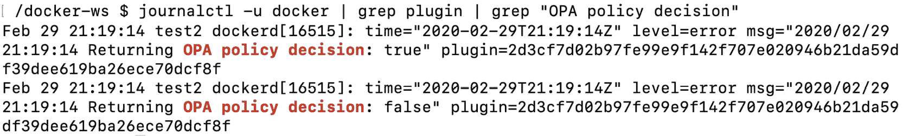

    图 15.4:插件日志

9.  通过从`/etc/docker/daemon.json`中移除`authorization-plugins`部分来停止使用插件，并重新加载 Docker 守护程序，类似于在*步骤 6* :

    ```
    cat > /etc/docker/daemon.json << EOF
    {}
    EOF
    cat /etc/docker/daemon.json
    sudo kill -HUP $(pidof dockerd)
    ```

    中所做的操作
10.  Disable and remove the plugin with the following commands:

    ```
    docker plugin disable opa-docker-authz:readonly 
    docker plugin rm opa-docker-authz:readonly  
    ```

    这些命令通过返回插件的名称来禁用和删除 Docker 中的插件。

在本练习中，您已经在 Docker 中配置并安装了一个授权插件。在下一节中，您将在 Docker 中了解更多关于网络插件的信息。

# 网络插件

在 Docker 网络插件的帮助下，Docker 支持多种网络技术。虽然它支持容器到容器和主机到容器的网络，具有完整的功能，插件使我们能够将网络扩展到其他技术。网络插件将远程驱动程序实现为不同网络拓扑的一部分，例如虚拟可扩展局域网(T0)和媒体访问控制虚拟局域网(T1)。您可以使用 Docker 插件命令安装和启用网络插件。此外，您需要用`--driver`标志指定网络驱动程序的名称。例如，如果您已经安装了启用的`my-new-network-technology`驱动程序，并且希望您的新网络成为其中的一部分，您需要设置一个`driver`标志:

```
docker network create --driver my-new-network-technology mynet
```

该命令创建一个名为`mynet`的网络，`my-new-network-technology`插件管理所有网络操作。

社区和第三方公司开发网络插件。然而，目前 Docker Hub 中只有两个经过认证的网络插件——Weave Net 和 Infoblox IPAM 插件:

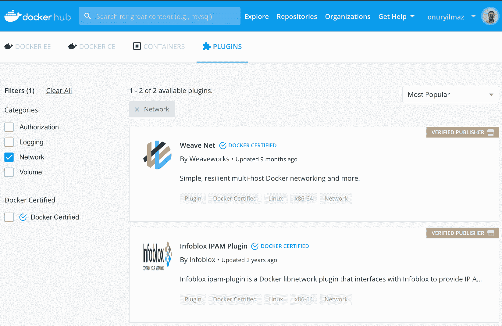

图 15.5:Docker 集线器中的网络插件

**Infoblox IPAM 插件**专注于提供 IP 地址管理服务，比如写 DNS 记录和配置 DHCP 设置。**编织网**专注于通过加密、服务发现和组播网络为 Docker 容器创建弹性网络。

在`go-plugin-helpers`中提供的官方 SDK 有 Go 处理程序来为 Docker 创建网络扩展。`Driver`界面定义如下:

```
// Driver represent the interface a driver must fulfill.
type Driver interface {
     GetCapabilities() (*CapabilitiesResponse, error)
     CreateNetwork(*CreateNetworkRequest) error
     AllocateNetwork(*AllocateNetworkRequest)        (*AllocateNetworkResponse, error)
     DeleteNetwork(*DeleteNetworkRequest) error
     FreeNetwork(*FreeNetworkRequest) error
     CreateEndpoint(*CreateEndpointRequest)        (*CreateEndpointResponse, error)
     DeleteEndpoint(*DeleteEndpointRequest) error
     EndpointInfo(*InfoRequest) (*InfoResponse, error)
     Join(*JoinRequest) (*JoinResponse, error)
     Leave(*LeaveRequest) error
     DiscoverNew(*DiscoveryNotification) error
     DiscoverDelete(*DiscoveryNotification) error
     ProgramExternalConnectivity(*ProgramExternalConnectivityRequest)        error
     RevokeExternalConnectivity(*RevokeExternalConnectivityRequest)        error
}
```

注意

完整代码见[https://github . com/docker/go-plugins-helper/blob/master/network/API . go](https://github.com/docker/go-plugins-helpers/blob/master/network/api.go)。

当您检查接口功能时，网络插件应该为网络、端点和外部连接提供操作。例如，一个网络插件应该用`CreateNetwork`、`AllocateneNetwork`、`DeleteNetwork`和`FreeNetwork`功能实现一个网络生命周期。

同样，端点生命周期应该由`CreateEndpoint`、`DeleteEndpoint`和`EndpointInfo`函数实现。此外，还有一些扩展集成和管理功能需要实现，包括`GetCapabilities`、`Leave`、`Join`。这些服务还需要它们特定的请求和响应类型才能在托管插件环境中工作。

在下面的练习中，您将使用编织网插件创建一个新网络，并让容器使用新网络进行连接。

## 练习 15.02: Docker 网络插件正在运行

Docker 网络插件接管特定网络实例的网络操作，并实现定制技术。在本练习中，您将安装和配置一个网络插件来创建 Docker 网络。然后，您将创建一个 Docker 映像的三副本应用，并使用插件来连接这三个实例。你可以使用编织网插件来实现这个目标。

要完成练习，请执行以下步骤:

1.  Initialize a Docker swarm (if you have not enabled one before) by running the following command in the terminal:

    ```
    docker swarm init
    ```

    此命令创建一个 Docker 群来部署应用的多个实例:

    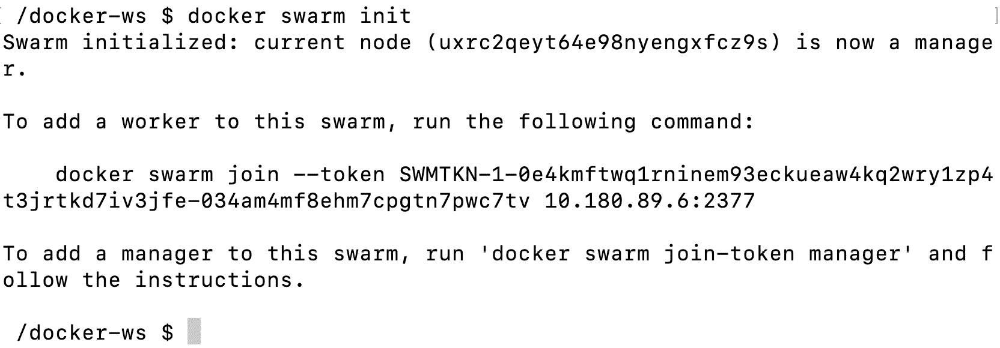

    图 15.6:群初始化

2.  Install the **Weave Net** plugin by running the following command:

    ```
    docker plugin install --grant-all-permissions \
    store/weaveworks/net-plugin:2.5.2
    ```

    此命令从存储中安装插件，并授予所有权限:

    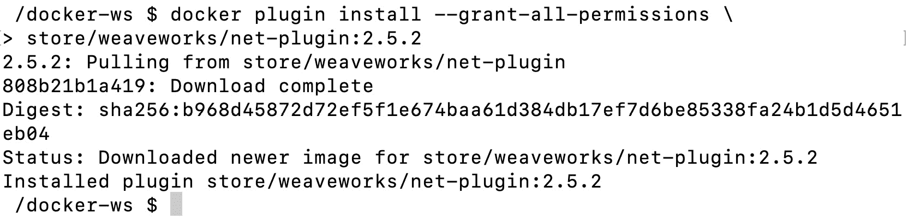

    图 15.7:插件安装

3.  Create a new network using the driver with the following command:

    ```
    docker network create  \
    --driver=store/weaveworks/net-plugin:2.5.2  \
    weave-custom-net
    ```

    该命令使用插件提供的驱动程序创建一个名为`weave-custom-net`的新网络:

    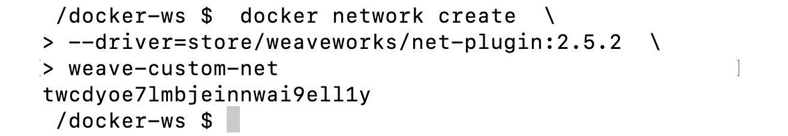

    图 15.8:创建网络

    成功创建网络后，将打印一个随机生成的网络名称，如前面的代码所示。

4.  Create a three-replica application with the following command:

    ```
    docker service create --network=weave-custom-net \
    --replicas=3 \
    --name=workshop \
    -p 80:80 \
    onuryilmaz/hello-plain-text
    ```

    该命令创建三个`onuryilmaz/hello-plain-text`映像的副本，并使用`the weave-custom-net`网络连接实例。此外，它使用名称`workshop`并发布到港口`80`:

    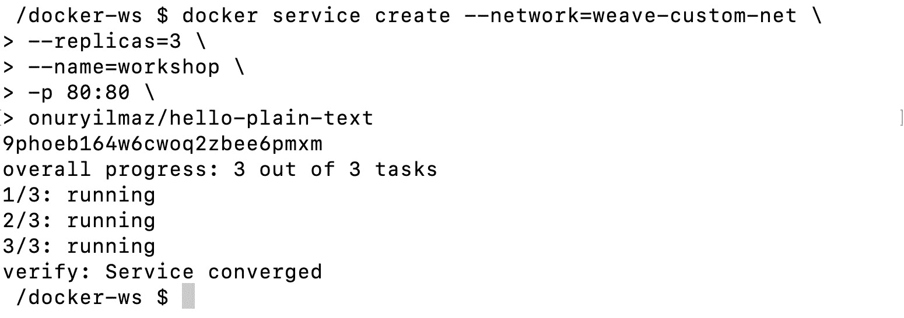

    图 15.9:应用创建

5.  Get the names of the containers by running the following commands:

    ```
    FIRST_CONTAINER=$(docker ps --format "{{.Names}}" |grep "workshop.1")
    echo $FIRST_CONTAINER
    SECOND_CONTAINER=$(docker ps --format "{{.Names}}" |grep "workshop.2")
    echo $SECOND_CONTAINER
    THIRD_CONTAINER=$(docker ps --format "{{.Names}}" |grep "workshop.3")
    echo $THIRD_CONTAINER
    ```

    这些命令列出正在运行的 Docker 容器名称，并按`workshop`实例进行过滤。您需要容器的名称来测试它们之间的连接:

    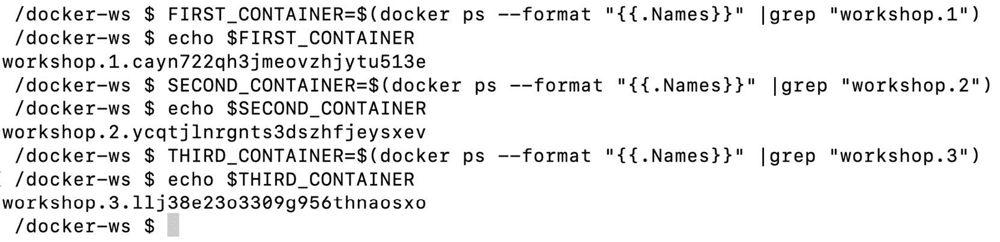

    图 15.10:容器名称

6.  Run the following command to connect the first container to the second one:

    ```
    docker exec -it $FIRST_CONTAINER sh -c "curl $SECOND_CONTAINER" 
    ```

    该命令使用`curl`命令连接第一和第二容器:

    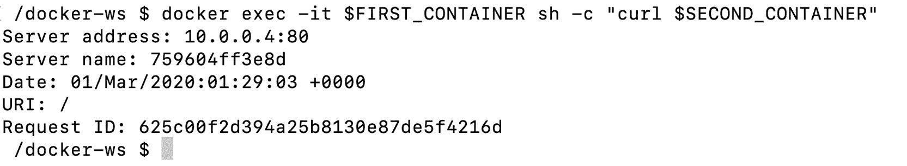

    图 15.11:容器之间的连接

    前面的命令在第一个容器内运行，`curl`命令到达第二个容器。输出显示了服务器和请求信息。

7.  Similar to *Step 6*, connect the first container to the third one:

    ```
    docker exec -it $FIRST_CONTAINER sh -c "curl $THIRD_CONTAINER" 
    ```

    不出所料，在*步骤 6* 和*步骤 7* 中检索到不同的服务器名称和地址:

    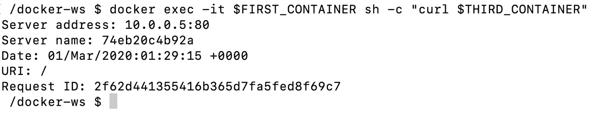

    图 15.12:容器之间的连接

    这表明使用自定义编织网络创建的容器正在按预期工作。

8.  您可以使用以下命令删除应用和网络:

    ```
    docker service rm workshop
    docker network rm weave-custom-net
    ```

在本练习中，您已经在 Docker 中安装并使用了一个网络插件。除此之外，您还创建了一个使用自定义网络驱动程序进行连接的容器化应用。在下一节中，您将了解更多关于 Docker 中的卷插件的信息。

# 卷插件

Docker 卷被装载到容器中，以允许有状态应用在容器中运行。默认情况下，卷在主机的文件系统中创建，并由 Docker 管理。此外，在创建卷时，可以指定卷驱动程序。例如，您可以通过网络或存储提供商装载卷，如**谷歌**、 **Azure** 或 **AWS** 。您还可以在 Docker 容器中本地运行数据库，同时数据卷在 AWS 存储服务中保持不变。这样，您的数据卷将来可以在任何其他位置运行的其他数据库实例中重用。要使用不同的卷驱动程序，您需要使用卷插件来增强 Docker。

Docker 卷插件控制卷的生命周期，包括`Create`、`Mount`、`Unmount`、`Path`和`Remove`功能。在插件软件开发工具包中，卷驱动程序接口定义如下:

```
// Driver represent the interface a driver must fulfill.
type Driver interface {
     Create(*CreateRequest) error
     List() (*ListResponse, error)
     Get(*GetRequest) (*GetResponse, error)
     Remove(*RemoveRequest) error
     Path(*PathRequest) (*PathResponse, error)
     Mount(*MountRequest) (*MountResponse, error)
     Unmount(*UnmountRequest) error
     Capabilities() *CapabilitiesResponse
}
```

注意

完整的驱动程序代码可在[https://github . com/docker/go-plugins-helper/blob/master/volume/API . go](https://github.com/docker/go-plugins-helpers/blob/master/volume/api.go)获得。

驱动程序界面的功能显示，卷驱动程序专注于卷的基本操作，如`Create`、`List`、`Get`、`Remove`操作。插件负责在容器中装载和卸载卷。如果您想要创建一个新的卷驱动程序，您需要用相应的请求和响应类型来实现这个接口。

Docker Hub 和开源社区已经提供了许多卷插件。例如，目前有 18 个卷插件在 Docker Hub 上分类和验证:

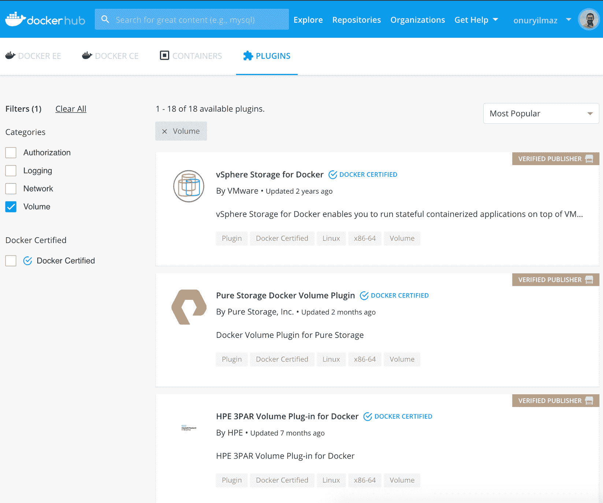

图 15.13:Docker 集线器中的卷插件

大多数插件专注于从不同来源提供存储，例如云提供商和存储技术。根据您的业务需求和技术栈，您可以在 Docker 设置中考虑卷插件。

在下面的练习中，您将使用 SSH 连接在远程系统中创建卷，并在容器中创建卷。对于通过 SSH 连接创建和使用的卷，您将使用[https://github.com/vieux/docker-volume-sshfs](https://github.com/vieux/docker-volume-sshfs)提供的`open-source docker-volume-sshfs`插件。

## 练习 15.03:卷插件正在运行

Docker 卷插件通过提供来自不同提供商和技术的存储来管理卷的生命周期。在本练习中，您将安装和配置一个卷插件，通过 SSH 连接创建卷。成功创建卷后，您将在容器中使用它们，并确保文件被持久保存。你可以使用`docker-volume-sshfs`插件来实现这个目标。

要完成练习，请执行以下步骤:

1.  Install the `docker-volume-sshfs` plugin by running the following command in your terminal:

    ```
    docker plugin install --grant-all-permissions vieux/sshfs
    ```

    此命令通过授予以下所有权限来安装插件:

    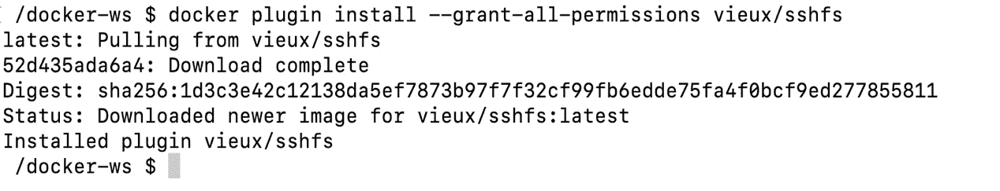

    图 15.14:插件安装

2.  Create a Docker container with an SSH connection to provide volumes to other containers with the following command:

    ```
    docker run -d -p 2222:22 \
    --name volume_provider \
    rastasheep/ubuntu-sshd:14.04
    ```

    该命令创建并运行名为`volume_provider`的`sshd`容器。港口`2222`已发布，将在以下步骤中用于连接该容器。

    您应该得到如下输出:

    ```
    87eecaca6a1ea41e682e300d077548a4f902fdda21acc218a51253a883f725d
    ```

3.  Create a new volume, named `volume-over-ssh`, by running the following command:

    ```
    docker volume create -d vieux/sshfs \
    --name volume-over-ssh \
    -o sshcmd=root@localhost:/tmp \
    -o password=root \
    -o port=2222
    ```

    该命令使用`vieux/sshfs`驱动程序和用`sshcmd`指定的`ssh`连接以及`password`和`port`参数创建新的卷:

    ```
    volume-over-ssh
    ```

4.  Create a new file and save it in the volume created in *Step 3* by running the following command:

    ```
    docker run --rm -v volume-over-ssh:/data busybox \
    sh -c "touch /data/test.txt && echo 'Hello from Docker Workshop' >> /data/test.txt"
    ```

    该命令通过安装`volume-over-ssh`来运行容器。然后它创建一个文件并写入其中。

5.  Check the contents of the file created in *Step 4* by running the following command:

    ```
    docker run --rm -v volume-over-ssh:/data busybox \
    cat /data/test.txt
    ```

    此命令通过装载相同的卷来运行容器，并从中读取文件:

    ```
    Hello from Docker Workshop
    ```

6.  (可选)通过运行以下命令删除卷:

    ```
    docker volume rm volume-over-ssh
    ```

在本练习中，您已经在 Docker 中安装并使用了一个卷插件。此外，您已经创建了一个卷，并从多个容器中使用它进行写入和读取。

在下一个活动中，您将使用网络和卷插件在 Docker 中安装 WordPress。

## 活动 15.01 :安装带有网络和音量插件的 WordPress

您的任务是使用网络和卷插件在 Docker 中将博客及其数据库设计和部署为微服务。您将使用 **WordPress** ，因为它是最受欢迎的**内容管理系统** ( **CMS** )，被互联网上超过三分之一的网站使用。存储团队要求您对 WordPress 内容使用通过 **SSH** 的卷。此外，网络团队希望您使用**编织网络**在容器之间建立网络。使用这些工具，您将使用 Docker 插件创建网络和卷，并将它们用于 WordPress 及其数据库:

1.  使用**编织网**插件创建一个 Docker 网络(即`wp-network`)。
2.  使用`vieux/sshfs`驱动程序创建一个名为`wp-content`的卷。
3.  创建一个名为`mysql`的容器来运行`mysql:5.7`映像。确保设置了`MYSQL_ROOT_PASSWORD`、`MYSQL_DATABASE`、`MYSQL_USER`和`MYSQL_PASSWORD`环境变量。此外，容器应从*第 1 步*开始使用`wp-network`。
4.  Create a container with the name `wordpress` and use the volume from *Step 2* mounted at `/var/www/html/wp-content`. For the configuration of WordPress, do not forget to set the `WORDPRESS_DB_HOST`, `WORDPRESS_DB_USER`, `WORDPRESS_DB_PASSWORD`, and `WORDPRESS_DB_NAME` environment variables in accordance with *Step 3*. In addition, you need to publish port `80` to port `8080`, reachable from the browser.

    您应该让`wordpress`和`mysql`容器运行:

    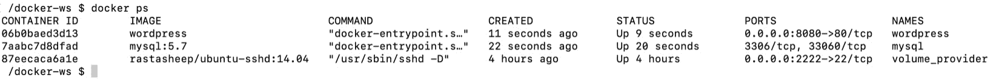

图 15.15:WordPress 和数据库容器

此外，您应该能够在浏览器中访问 WordPress 设置屏幕:

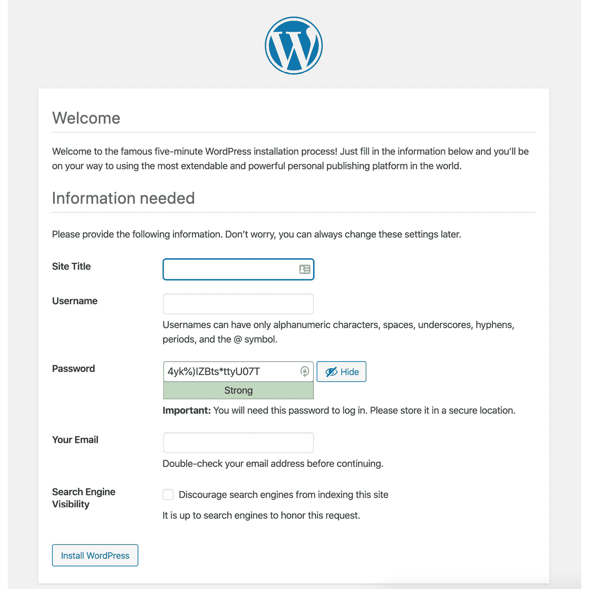

图 15.16: WordPress 设置屏幕

注意

此活动的解决方案可以通过[这个链接](16.html#_idTextAnchor359)找到。

# 总结

这一章着重于用插件扩展 Docker。通过安装和使用 Docker 插件，可以通过自定义存储、网络或授权方法来增强 Docker 操作。您首先考虑了 Docker 中的插件管理和插件 API。有了插件应用编程接口，你可以通过编写新的插件来扩展 Docker，让 Docker 为你工作。

本章接着讲述了授权插件以及 Docker 守护程序是如何配置为使用插件的。如果您在生产或企业环境中使用 Docker，授权插件是控制谁可以访问您的容器的基本工具。然后，您探索了网络插件以及它们如何扩展容器之间的通信。

虽然 Docker 已经介绍了基本的网络，但我们还是看了网络插件是如何成为新网络功能的门户的。这就引出了最后一节，在这一节中，卷插件展示了如何在 Docker 中启用自定义存储选项。如果您的业务环境或技术栈要求您扩展 Docker 的功能，那么学习插件以及如何使用它们是至关重要的。

这一章的结尾也把我们带到了这本书的结尾。您在第一章就已经开始了这段旅程，学习了 Docker 的基础知识，并在您的系统上运行了第一个容器，看看您已经走了多远。就在这本书的过程中，您已经使用 Dockerfiles 创建了您的映像，并学习了如何使用公共存储库(如 Docker Hub)发布这些映像，或者如何将您的映像存储在系统上运行的存储库中。您已经学会了使用多阶段 Dockerfiles，并使用 docker-compose 实现您的服务。您甚至已经掌握了网络和容器存储的细节，以及作为项目一部分的 CI/CD 管道的实现和作为 Docker 映像构建一部分的测试。

在进一步了解 Docker 安全性和容器最佳实践之前，您已经使用 Docker Swarm 和 Kubernetes 等应用练习了编排 Docker 环境。然后，您的旅程继续进行，对您的服务度量和容器日志进行现实世界的监控，最后使用 Docker 插件来帮助扩展您的容器服务功能。我们已经介绍了许多工作来提高您对 Docker 的技能和知识。希望它能让你的应用体验更上一层楼。请参考交互式版本，了解如何在出现问题时排除故障并报告问题。您还将了解 Docker Enterprise 的当前状态，以及在使用和开发 Docker 时将采取的下一个重大举措。