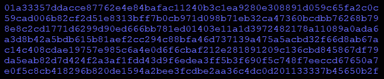
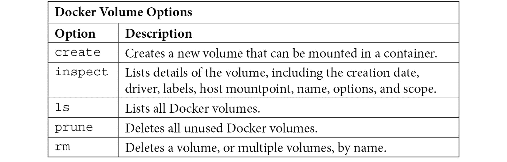
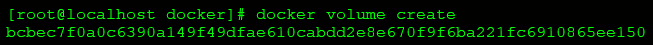
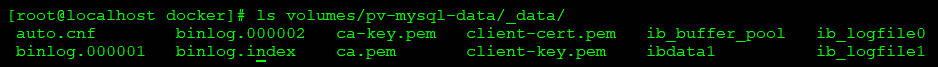
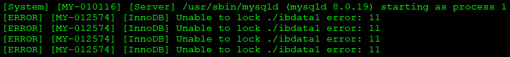
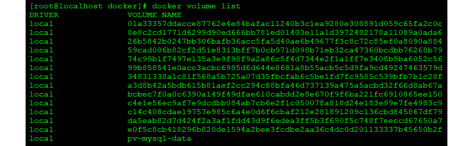
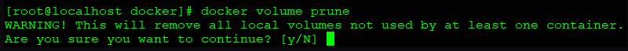
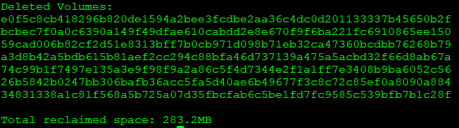
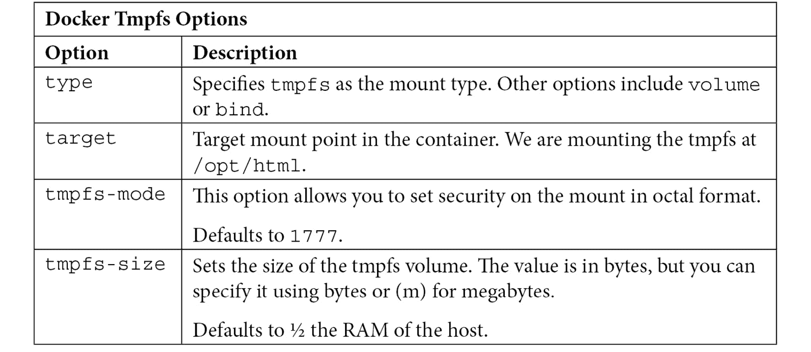
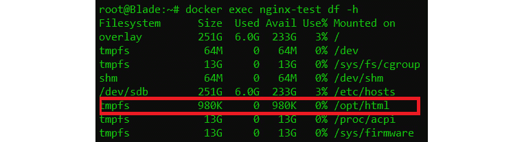

# *第二章*:处理Docker数据

曾经，容器用于无状态工作负载，这些工作负载可以纵向扩展、快速扩展，并在不影响工作负载的情况下从一个位置移动到另一个位置。无状态工作负载限制了您可以运行的容器类型，禁止您运行除存储在基本映像中的项目之外的任何内容。

在本章中，我们将涵盖以下主题:

*   为什么需要持久数据
*   Docker卷
*   Docker 绑定安装
*   tmpfs 挂载坞站

我们开始吧！

# 技术要求

本章没有任何技术要求。

如果您想使用本章中的示例创建卷，可以使用我们在 [*第 1 章*](01.html#_idTextAnchor018)*Docker 和 Container Essentials* 中创建的 Docker 主机。我们将在本章中用作示例的卷在以后的章节中不需要。

您可以从第 1 章*Docker 和 Containers Essentials* 访问代码来创建 Docker 主机，方法是访问以下 GitHub 存储库:[https://GitHub . com/PacktPublishing/Kubernetes-and-Docker-The-Complete-Guide](https://github.com/PacktPublishing/Kubernetes-and-Docker-The-Complete-Guide)。

# 为什么需要持久数据

让我们考虑一个示例用例，其中您可能想要从一个容器向一个持久位置写入数据。

假设您有一个系统，要求您部署一个 **MySQL** 数据库，该数据库由运行在 **NGINX** 上的基于网络的应用作为前端。使用标准的`docker run`命令启动应用的两个容器。你和用户一起做一些初始测试，他们确认一切都按预期进行。当涉及到添加记录、查询记录、编辑和删除时，用户是成功的——这些都工作正常。容器运行几天后，您会收到一封来自安全部门的电子邮件，告诉所有用户所有 MySQL 服务器都需要尽快部署新的补丁来解决安全漏洞。

您可以快速创建一个包含最新补丁的新 MySQL 映像，并将其推送到您的容器注册表中。通过与用户一起工作，您可以决定部署新容器的时间，并通过执行以下操作开始该过程:

*   停止运行容器。
*   使用与上一个映像使用的容器名称运行新映像。为此，您需要使用`docker rm`命令移除当前容器。
*   启动新的 MySQL 容器。

容器启动后，您登录以验证 MySQL 是否正在运行，并确认修补程序已经应用。接下来，您登录到应用并在数据库中搜索记录，然后收到一个“未找到记录”错误。你会觉得这很奇怪，因为系统已经运行了几天了。要进一步排除故障，您可以直接登录数据库来检查数据库的运行状况，并发现服务器上没有数据库。

你的数据库怎么了？为什么数据库服务器似乎已被清除并重新初始化？您知道系统在过去的几天里一直在工作，一切都在按预期运行，也就是说，直到您下载了一个新的 MySQL 映像并启动它来代替原始容器。

回想一下我们在 [*第 1 章*](01.html#_idTextAnchor018)*Docker 和 Container Essentials* 中的短暂讨论，容器的可写层是短暂的，当容器被移除时，写入其中的所有数据都将丢失，即使您启动了一个同名的容器。当您移除容器以重新使用名称时，包含数据库的容器层被删除。当新的容器启动时，它创建了一个新的容器层，当 MySQL 启动时，它没有看到它的任何基本文件，并创建了一个新的、完全初始化的 MySQL 实例。

当然，您不希望每次需要部署新版本的数据库服务器时都丢失数据库。由于容器层是短暂的，您需要将您的数据库存储在基础层之外的一些东西上，这些东西将在映像升级之间保持不变。到目前为止，我们一直告诉您容器是短暂的，那么您如何配置您的容器来保存数据呢？

幸运的是，Docker 包括使用两种方法向容器添加持久数据的能力:

*   Docker卷
*   Docker 绑定安装

还有第三种选择使用主机的内存提供存储，称为 **tmpfs** 。这种类型的装载不会通过容器重启、Docker 重启或主机重启而持久化。它仅用作在高速随机存取存储器中临时存储数据的位置，并且是真正短暂的。虽然它不提供持久性，但是在一些特定的用例中，选择 tmpfs 可能是有益的。

当需要运行需要持久数据的容器时，应该选择哪个选项？卷和绑定装载的功能类似，将文件存储在本地主机文件系统上，为容器提供持久性。最终的决定归结为理解每个选项是如何管理的，以及如果使用不当会暴露哪些数据

# Docker卷

Docker 卷是向容器添加持久数据的首选选项。卷只不过是本地主机上使用卷装载映射到容器的目录。创建卷时，会在主机文件系统上创建一个新目录，通常在`/var/lib/docker/volumes/<volume ID>/`下。如果您拥有主机的根访问权限，您可以像查看任何其他目录一样查看文件结构。下面的截图显示了来自 Docker 主机的`volumes`目录下的目录，该 Docker 主机使用卷运行容器:



图 2.1–Docker 文件夹目录

为了在重启之间维护信息，Docker 使用 Boltdb 将密钥元数据存储在主机上的各种数据库中，Boltdb 是一个用 Go 编写的快速数据库，用于存储持久密钥值。浏览`/var/lib/docker`文件夹时，您可能会遇到两个 Boltdb 数据库:

*   `/var/lib/docker/volumes/metadata.db`:维护 Docker 卷的元数据，如名称、驱动程序、标签和选项
*   `/var/lib/docker/network/files/local-kv.db`:维护 Docker 网络的元数据

由于我们在本章中关注的是数据，因此我们将使用`metadata.db`数据库。正如您将在本章后面看到的，当您创建 Docker 卷时，您可以提供诸如名称或标签之类的选项。这些信息存储在数据库中，以保持卷的持久性。

以下是一个来自名为`webdata`的 Docker 卷的 JSON 格式的`metadata.db`示例:

```
webdata{"Name":"webdata","Driver":"local","Labels":null,"Options":null}
```

每个 Docker 卷在`/var/lib/docker/volumes`目录中都有一个目录。在每个卷文件夹中，都有一个名为`_data`的目录，其中包含容器的实际数据。

在使用带有容器的卷之前，必须先创建它。创建 Docker 卷可以使用 Docker CLI 手动完成，也可以在容器启动时由 Docker 守护程序自动完成。由于这两种方法都是由 Docker 创建的，它们由 Docker 自己拥有和管理，因此使用 Docker CLI 管理和跟踪它们非常容易。

## 使用命令行界面创建卷

要创建一个 Docker 卷，我们可以使用卷管理选项:

```
docker volume <option>
```

可用选项如下:



表 2.1–卷管理选项

要创建新卷，请使用`create`选项:

```
docker volume create <optional volume name>
```

执行`create`后，会看到创建的卷名。如果您没有提供可选的卷名，Docker 将分配一个卷标识作为名称。创建卷而不提供卷名被称为匿名卷:



图 2.2–匿名卷输出

当您向使用卷的主机添加其他容器时，匿名卷可能很难跟踪。因此，最好在创建时命名卷，而不是让 Docker 生成一个长的匿名卷名。

您在创建时为其提供卷名的任何卷都称为命名卷。要创建命名卷，您需要向`docker volume create`命令提供卷名:


图 2.3–命名卷输出

一旦使用任一方法创建了卷，您可以通过查看`/var/lib/docker/volumes`来验证目录是为您的卷创建的。您会发现一个目录，其卷名由`create`命令返回。

现在您已经知道如何创建卷，下一步是将其与容器一起使用。

## 在容器中安装容积

将卷装入容器的过程与命名卷或匿名卷的过程相同。我们已经讨论了使用 Docker CLI 创建卷的过程，但是没有解释如何让 Docker 自动创建卷。

在本节中，我们将解释如何让 Docker 自动创建卷并装载它。我们还将解释如何将以前创建的命名卷装入容器。

将卷装入容器时，需要向`docker start`命令提供两个选项之一。可以用来装载卷的两个选项是`--mount`或`-v`。如果您运行的是标准容器，可以使用任一选项，但`-v`是最常用的选项。

在本章的前面，我们创建了一个名为`pv-mysql-data`的卷。我们现在想用命名的卷来启动我们的 MySQL 容器，这样我们将有一个持久的数据库。要在容器中装入一个卷，您需要在启动容器时通过`-v`选项。`-v`选项需要两个参数:卷名和容器挂载点。在下面的命令示例中，您可以看到使用命名卷装载启动 MySQL 的命令。我们还添加了一些传递给容器的附加选项，特别是`-e`选项，用于设置环境变量:

```
docker run --name mysql-01 -v pv-mysql-data:/var/lib/mysql -e MYSQL_ROOT_PASSWORD=my-password -d mysql
```

这将启动一个名为`mysql-01`的运行 MySQL 的容器，该容器在容器中名为`/var/lib/mysql`的挂载点挂载名为`pv-mysql-data`的卷。最后一个选项是使用`-e`，创建一个名为`MYSQL_ROOT_PASSWORD`的环境变量，设置为`my-password`。

一旦容器启动并运行，您可以查看卷目录，通过检查目录中的数据来验证 MySQL 是否正确装载了卷:



图 2.4–MySQL 持久卷

如您所见，新的卷包含所有标准文件，这些文件是在新的 MySQL 服务器第一次启动时创建的。

我们还提到，您可以让 Docker 自动创建卷，而不是自己创建卷。要让 Docker 在容器启动时创建卷，请运行与使用预创建卷时相同的命令。例如，使用前面的 MySQL 示例，让我们假设*没有使用`docker volume create`命令*预创建卷。

让我们执行相同的命令:

```
docker run --name mysql-01 -v pv-mysql-data:/var/lib/mysql -e MYSQL_ROOT_PASSWORD=my-password -d mysql
```

当我们这样做的时候，Docker 守护程序会意识到不存在名为`pv-mysql-data`的现有卷，并且在它装入容器之前会创建一个卷。

## 安装现有体积

与也存储在本地主机上的容器层不同，如果从 Docker 中移除容器，卷不会丢失。在之前的 MySQL 升级示例中，我们将数据库服务器升级到了更新的版本。由于我们希望保持容器名称与先前部署的容器相同，因此我们移除了旧容器，并以相同的名称启动了新容器。通过移除容器，我们移除了存储在本地文件系统上的容器层。

为了避免在升级后或从主机上移除容器后丢失数据库，我们可以在新的运行容器中装载现有卷。由于默认情况下不会删除卷，因此数据仍在本地文件系统上，并准备好供任何其他容器使用。

当我们停止并移除 MySQL 服务器时，卷保持不变。当我们启动新的 MySQL 容器时，我们只需要使用原始容器中使用的相同卷名来提供`-v`选项。这就是为什么创建命名卷优于创建匿名卷的原因。在我们的示例中，我们创建了一个名为`pv-mysql-data`的命名卷。要使用相同的卷运行新容器，我们可以使用带有`-v`选项的`docker run`命令，如下所示:

```
docker run --name mysql-01 -v pv-mysql-data:/var/lib/mysql -e MYSQL_ROOT_PASSWORD=my-password -d mysql:v2
```

这将启动我们的新`mysql:v2`容器，其体积与之前的容器相同，现有数据库完全完好无损。

## 在多个容器中安装一个容积

如果您有一个需要多个容器的应用，并且每个容器都需要完全相同的数据，该怎么办？虽然您可以为每个容器创建一个卷并将数据复制到每个容器中，但更有效的方法是在多个容器之间共享一个卷。

Docker 卷的一个独特特征是多个容器可以访问同一个卷。虽然这听起来像是为共享数据提供单一位置的简单解决方案，但您需要记住，当多个进程访问相同数据时，并不是每个应用都能很好地运行。使用我们的数据库示例，使用相同的卷启动第二个容器会导致第二个容器的 MySQL 服务器在启动时失败。由于文件被第一个容器的数据库锁定，第二个容器不能独占访问数据库来装载它。如果查看第二个实例的日志，您会看到如下所示的错误:



图 2.5–锁定错误输出

在一些用例中，共享卷将为您的应用带来好处。想象一下，您正在主机上运行几个 web 服务器实例，这些实例只显示从夜间更改的文件夹中检索到的数据。一种选择是每天晚上使用管道创建一个新的容器，但是对于这个例子，我们假设您没有配置项/光盘系统。

相反，您可能在主机上有一个进程，将数据拉入创建 Docker 卷的目录中。每个网络服务器将使用一个卷挂载，使用相同的 Docker 卷。这允许每个容器从单个共享位置访问数据，而不需要对基础映像进行任何更改。

为了实现这一点，您只需要在容器启动时为每个容器提供相同的装载选项。例如，我们在主机上创建了一个名为`webdata`的卷，我们希望启动四个 NGINX 服务器，它们将使用 Docker 卷中的数据。启动每个实例时，只需使用相同的`webdata`命名卷:

```
docker run --name webserver01 -v webdata:/opt/web/data -d bitnami/nginx:latest docker run --name webserver02 -v webdata:/opt/web/data -d bitnami/nginx:latest docker run --name webserver03 -v webdata:/opt/web/data -d bitnami/nginx:latest docker run --name webserver04 -v webdata:/opt/web/data -d bitnami/nginx:latest
```

由于 NGINX 服务器只读取数据，所以我们不会遇到 MySQL 遇到的任何锁定错误。

现在我们已经讨论了卷，并创建了其中的一些卷，您可能会意识到，当主机上有许多卷时，可能很难记住存在哪些卷。下一节将讨论我们的卷的一些基本管理选项。

## 上市码头卷〔t0〕月

请记住卷由 Docker 管理，因此守护程序知道创建的每个卷。如果您想列出您或 Docker 守护程序创建的每个卷，请使用`docker volume list`选项:



图 2.6–docker 卷列表输出

此选项将显示当前由 Docker 管理的所有卷。

## 清理卷 mes

默认情况下，Docker 从不删除为容器创建的卷。我们已经知道，当我们使用一个卷停止和启动一个容器时，数据会一直存在，但是当我们不再需要数据时，我们能做些什么呢？

想象一下`/var/lib/docker/volumes`文件夹中的数据量会以惊人的速度增长。因此，最佳做法是清理或删除卷以释放磁盘空间，我们通常将其称为垃圾收集过程的一部分。

从不再需要的映像中删除数据的最简单方法是在从 Docker 中移除容器时使用`-v`选项。在本书中，我们已经多次使用`docker rm <image name>`从主机中移除映像。如果您有一个附加到容器的卷，并且您想要在删除映像时删除数据，您可以将`-v`选项添加到`rm`命令，这将删除与容器相关联的所有卷。要删除 MySQL 服务器和持久数据，我们将使用以下命令:

```
docker rm -v mysql
```

有时您不想通过移除容器来删除数据。删除卷无法撤消，因此更好的做法是移除容器，并将卷保留一定的天数。经过一段时间后，您可能会更愿意删除卷。

如果您想删除单个或多个卷，可以使用`docker volume rm`选项。您可以在`rm`选项后提供卷名。系统将删除提供的每个卷，从而释放主机系统上的磁盘空间。

您可能担心会删除容器正在使用的卷。不要害怕——Docker已经帮你搞定了。如果您试图删除当前正在运行的容器正在使用的或分配给已停止的容器的任何卷，您将收到一个错误:

```
Error response from daemon: remove test-auto: volume is in use - [51000e2f61c79ae705cdac78692fa5590fb2b26d3d0eb0a3916df230 daf1b617]
```

Docker 将只允许您删除尚未被正在运行的容器打开的卷。

您可能有许多要删除的卷。虽然您可以使用`remove`命令提供每个名称，但是 Docker 提供了另一个选项，称为修剪。清理将查看所有卷，并删除当前未装载到正在运行的容器上的任何卷。

使用此选项时要小心，只有当您知道未使用的卷不包含您出于任何原因需要的数据时，才使用它。这个过程是最终的，一旦运行，它将删除所有不使用的卷。

要删除未使用的卷，我们使用`docker volume prune`选项。此命令将查看所有卷，任何未连接到正在运行的容器的卷都将被删除。当您发出命令时，它将警告您，它将删除任何没有至少一个运行容器的卷:



图 2.7–Docker清理确认

**选择** `y` **为是小心**–此动作没有撤销命令。执行后，您将收到已删除卷的摘要，包括它们的名称和回收的总磁盘空间:



图 2.8–Docker清理结果

这就完成了本章的 Docker 卷部分。请记住，卷只是向容器提供数据持久性的一种方式。另一种方法称为绑定装载，虽然它也像卷一样使用主机文件系统，但绑定装载有一个非常不同的用例。

# 坞接器绑定 mo〔t0〕unts

您可以用来向容器提供持久数据的第二个选项称为绑定装载。总的来说，卷和绑定安装可能看起来相似；两者都使用本地主机的文件系统，并且都使用`docker -v`选项装载。虽然它们有许多相同的特征，但是绑定挂载和卷挂载在一个主要方面是不同的:它是由 Docker 管理的*而不是*。

与 Docker 卷不同，Docker 无法创建绑定装载。您不能使用`docker volume create`选项创建绑定挂载；但是，当容器启动时，Docker 可以自动创建绑定挂载。即使 Docker 可以在主机上创建绑定装载位置，它也不会“管理”装载。

由于 Docker 不管理绑定装载，因此不能使用 Docker 命令删除它们。Docker 不跟踪列表中绑定挂载的位置。如果在主机上文件系统的不同区域创建绑定装载，一旦不再需要手动删除数据，就需要跟踪每个要删除的绑定装载的位置。

绑定挂载是位于主机文件系统上任何位置的目录，使用`docker -v`选项绑定到容器。与通常总是位于预定义位置(如`/var/lib/docker/volumes`)的卷不同，绑定挂载可以位于主机文件系统的任何位置。由于目录位于文件系统上，因此在尝试访问目录时，您可能会遇到权限问题。这个讨论超出了本书的范围，进入了 Linux 文件系统权限的领域。

您可以绑定任何现有目录或创建新目录，方法是预先创建目录或让 Docker 在容器启动时创建目录。

在我们解释如何使用绑定挂载之前，您可能会问自己:*“我为什么要使用绑定挂载？”*或*“我为什么要用音量？我为什么要在乎用哪一个？”。*我们将解释为什么您可能希望或可能不希望使用绑定装载，然后将它们与卷进行比较。

当您需要与正在运行的容器共享主机系统上的某些内容时，绑定装载可能是有益的。例如，您在本地笔记本电脑上开发了一个应用，并希望在代码定稿之前测试该应用。与其在本地控制台上运行它，不如在容器中测试它。您可以将源代码存储在`/source`中，然后在编译时，您可以将可执行文件和任何库存储在`/apps/testapp`中。让我们来看看:

1.  You start a container with the `-v` option, which will bind mount the local host's `/apps/testapp` folder in the container. This doesn't change very much from using a volume in a container. In fact, the syntax to mount a bind location is the same as mounting a volume to a container when using the `docker run -v` option. However, rather than providing a volume name in the `-v` option, you need to provide the local host directory instead; for example:

    ```
    docker run -d -v /apps/testapp:/bin/testapp ubuntu:latest
    ```

    这将启动一个运行 Ubuntu 的容器，容器内部有一个挂载点，绑定到本地主机的`/apps/testapp`路径，编译后的应用位于该路径。

2.  为了测试应用，您可以附加到运行的映像，并通过运行`/bin/testapp/testapp`来执行应用。由于容器的装载使用本地主机目录，您可以测试应用，如果遇到任何错误，您可以修复代码并简单地重新编译可执行文件。
3.  重新编译后，您可以在容器中再次运行新的可执行文件来测试应用。这样可以避免创建多个测试映像，在发现问题后迭代映像。一旦成功测试了应用，就可以停止容器并创建包含应用的最终容器映像。

Docker 卷不能提供相同的解决方案，因为它们都位于主机上的目录中，并且不能指向现有目录。

还有其他使用绑定挂载的示例用例。需要记住的主要一点是，绑定装载可用于通过容器在主机系统的任何地方共享数据。在正确的场景中使用时，绑定挂载非常有用，但是如果使用不当，它们的使用可能会导致系统不稳定或安全漏洞。

不言而喻，在将主机系统上的任何现有目录与容器一起使用时，您都应该小心。将主机的`/etc`目录绑定到容器中可能会导致意外的结果。在容器中运行 shell 的人可以轻松删除或编辑一个文件或多个文件，从而使主机系统不稳定。

# tmpfs 坞站〔t0〕挂载

在本章的开头，我们提到 Docker 允许您使用主机的 RAM 作为容器数据的临时存储位置。这种类型的装载不会保留数据，但是对于正确的工作负载，它可能是一个非常有用的存储位置。tmpfs 提供了一些在卷或绑定装载中不可用的独特优势:

*   大小可以预先定义，以限制存储消耗的内存量。
*   提供非常快速的数据访问。

tmpfs 安装也有一些限制:

*   它们只在 Linux 上可用；不支持 Windows。
*   单个 tmpfs 只能安装在一个容器上。

## 使用安装在容器中的 tmpfs

通过添加`--mount`或使用`--tmpfs`选项，可以用 tmpfs 底座启动容器。在一般情况下，您应该默认使用`--mount`选项，因为`--tmpfs`不允许在挂载上进行任何自定义。如果您使用`--tmpfs`，您将无法设置大小限制或任何文件模式安全性。由于这种类型的装载将使用昂贵的资源，即主机的内存，因此您需要为装载创建一个大小。由于这些限制，我们强烈建议您不要使用`--tmpfs`来创建您的 tmpfs 坐骑。

要为 NGINX 容器使用 tmpfs 挂载，您需要在启动映像时使用`--mount`选项:

```
docker run --mount type=tmpfs,target=/opt/html,tmpfs-mode=1770,tmpfs-size=1000000 --name nginx-test -d bitnami/nginx:latest
```

在`run`命令中指定`--mount`后，挂载选项允许您添加多个选项。在我们的示例中，我们为装载类型、容器中的目标装载、文件模式和大小添加了选项。下表显示了每个选项的详细信息:



表 2.2–tmpfs option 坞站

现在我们已经创建了 tmpfs 装载，我们想要列出主机上的卷，以验证我们有 tmpfs 装载。您可能还记得，我们可以使用`docker volume ls`命令列出卷。创建 tmpfs 挂载后的输出如下所示:


图 2.9–Docker 卷列表

请注意，列表是空的；根据 Docker 守护程序，没有正在使用的卷。tmpfs 装载不会出现在卷列表中，因为它们不是“真实”卷；使用`docker volume ls`命令时，仅显示体积。

如果您想验证容器中的 tmpfs 安装，您可以查看容器中的`docker inspect`命令输出，并查找`"Mounts"`部分:


图 2.10–Docker检查输出

当使用`docker exec`命令时，您也可以通过执行 Linux `df`命令来验证正在运行的容器内的装载:



图 2.11–Linux 中的 tmpfs 挂载

正如您在`df`命令输出的高亮部分所看到的，装载存在于容器中，并且大小正确。

我们想展示使用挂载的最后一个例子，其中我们没有指定 tmpfs 空间的大小。如果不指定大小，Docker 将使用主机一半的内存创建装载。我们的示例服务器有 26 GB 的内存，我们在没有指定大小的情况下用同一个容器执行了一个 T0 命令。

请注意，我们确实在`mount`命令中指定了一个大小。要验证容器是否有`/opt/html`目标，我们可以使用`docker exec`执行`df -u`命令，并确认`/opt/html`挂载已经创建。大家可能已经注意到了，卷大小为 **13 GB** ，是主机 RAM**26gb**的**一半**。需要指出的是，虽然卷被设置为 26 GB，但此时它没有数据，因此它还没有消耗任何内存。内存直到数据存储在容器中才会被消耗，所以您需要非常小心 tmpfs 卷，否则您可能会耗尽主机上的内存并导致系统崩溃。

# 总结

在本章中，您学习了在容器中处理数据的多种方法。阅读本章后，您应该知道如何决定容器的合适存储类型。

在下一章中，我们将通过了解 Docker 默认桥接网络来了解 Docker 网络。我们还将学习如何使用和创建用户定义的桥，并在网络上公开容器服务。

# 问题

1.  Which of the following volumes provides persistent storage for containers?

    A.tmpfs

    B.绑定安装

    C.卷

    D.存储区域网

2.  Docker volumes must be created before they can be mounted.

    A.真实的

    B.错误的

3.  You create a tmpfs volume on a host that has 64 GB of RAM. During its creation, you failed to set a size. What size volume will Docker create?

    A.1 GB

    B. 64 GB

    C.20 GB

    D.32 GB

4.  Docker volumes are automatically deleted when you remove a container.

    A.真实的

    B.错误的

5.  Which volume type is managed by the Docker daemon?

    A.绑定卷

    B.命名卷

    C.所有卷

    D.没有人

6.  How do you delete an unused bind volume?

    A.没必要；Docker 会自动删除它

    B.`docker volume prune`

    C.`docker volume bind prune`

    D.您必须手动删除绑定文件夹