# *第三章*:了解码头工人网络

到目前为止，我们主要关注当我们位于主机系统的本地时如何访问容器。在一些用例中，可能只需要本地容器访问，但是通常，您会希望向外部用户或系统公开您的容器。向外部用户公开容器并不总是像运行一个容器那么简单。您需要考虑 Docker 提供的各种选项来将您的容器连接到网络。为了避免挫败感，您还应该了解系统如何使用 IP 进行通信，包括关于公开 IP 端口的任何限制。

在本章中，我们将涵盖以下主题:

*   探索 Docker 网络
*   创建用户定义的桥接网络

我们开始吧！

# 技术要求

本章没有任何技术要求。

如果您想使用本章中的示例创建网络，您可以使用我们在 [*第 1 章*](01.html#_idTextAnchor018)*Docker 和 Container Essentials* 中创建的 Docker 主机。我们将在本章示例中使用的网络在以后的章节中不需要。

您可以从第 1 章*Docker 和 Containers Essentials* 访问代码来创建 Docker 主机，方法是访问以下 GitHub 存储库:[https://GitHub . com/PacktPublishing/Kubernetes-and-Docker-The-Complete-Guide](https://github.com/PacktPublishing/Kubernetes-and-Docker-The-Complete-Guide)。

# 探索码头工人网络

在本节中，我们将讨论 Docker 中可用的网络选项，以及如何使用它们向外部用户和系统公开您的容器。Docker 包括各种网络选项来将容器连接到您的网络，如果没有一个包含的网络选项符合您的要求，您可以从许多第三方网络附加组件中进行选择，这些附加组件提供的功能可能不包含在基本网络堆栈中。默认情况下，Docker 网络专注于单个主机，但对于更复杂的用例，它包括网络功能，通过使用 Docker Swarm 来促进跨主机网络。由于该行业已经从使用 Docker Swarm 转向其他产品，如 Kubernetes，本章将重点介绍单主机网络。

为了避免暴露容器时的潜在挫败感，您应该很好地了解 IP 如何使用端口进行通信。你们中的许多人可能很了解 IP，但是我们认为提供一个关于 TCP/IP 如何使用端口进行通信的简短复习将是有益的。

## 快速的 TCP/IP 端口刷新

我们确实假设您有 TCP/IP 的工作知识，但是对于那些对此不熟悉的人来说，重要的是突出本章将参考的一些网络主题。理解端口是充分理解在 Docker 中公开服务的局限性的重要概念。

您可能知道，在系统上配置 IP 时，您会为系统中的每个网络适配器分配一个唯一的 IP 地址。当进行传入或传出连接时，请求包括 IP 地址和`1`和`65535`之间的端口。您可能并不总是在请求中看到端口，因为许多应用会根据所使用的协议自动将其包含在默认请求中。当您在浏览器中输入网址时，通常只需使用协议和主机名输入网址。举个例子，假设你想打开 Kubernetes 主页面，那么你在浏览器中输入 [http://kubernetes.io](http://kubernetes.io) 。未显示或未要求的是端口。HTTP 默认端口为 80，所有浏览器都会默认使用端口`80`的请求——幕后，浏览器正在请求 [http://kubernetes.io:80](http://kubernetes.io:80) 。

这个 IP 地址和端口的组合称为套接字，表示为 **< IP 地址> : <端口>** (即`192.168.1.1:443`)。双向通信需要一个套接字。当您请求网页时，您的计算机将使用从`49152`和`65535`之间随机选择的端口发出请求。如果您是知识产权新手，这可能会有点混乱，因此下面是一个从工作站连接到两个不同 web 服务器的示例:

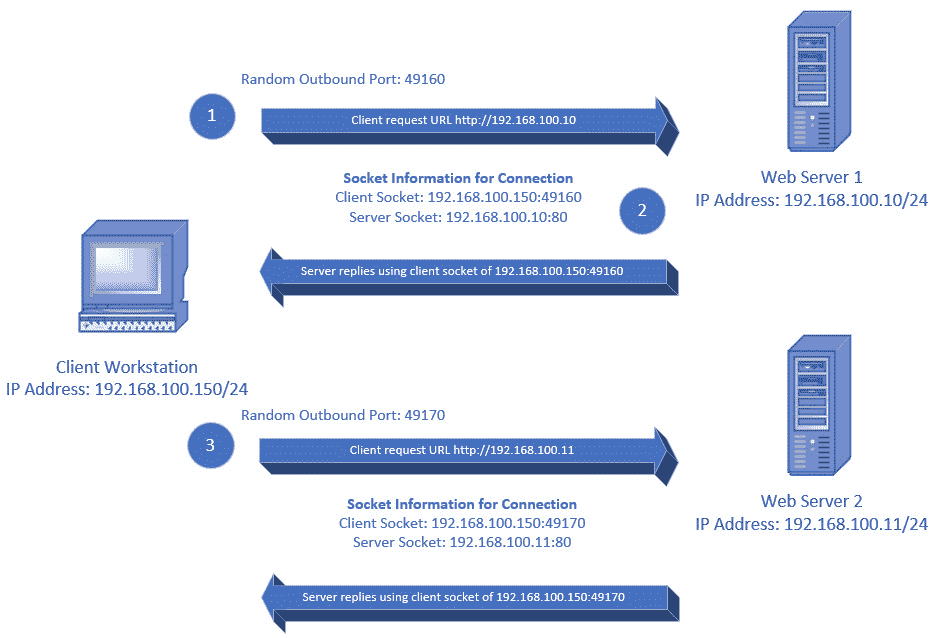

图 3.1–插座示例

在*步骤 1* 中，从工作站向运行在`192.168.100.10`上的网络服务器发送请求。工作站使用随机生成的端口向端口`80`上的网络服务器发起输出请求。接下来，在*步骤 2* 中，网络服务器使用端口`49160`上的客户端 IP `of 192.168.100.150`回复客户端。

我们添加了*步骤 3* 来显示同时连接到另一个网络服务器将生成不同的输出端口，目标是端口 80 上的第二个网络服务器。

## 将端口绑定到服务

在服务器端你可能正在运行一个服务器比如 NGINX 来托管一个网站，你必须绑定一个套接字到 web 服务器进程。绑定的 IP 地址可以是单个 IP，也可以使用 0.0.0.0 地址绑定到所有 IP 地址，0.0.0 地址将端口绑定到服务器上所有可用的 IP 地址。

举个例子，我们将使用一台只有一张网卡和一个 IP 地址的主机。当你想将一个端口绑定到一个进程时，你要配置这个进程，使它使用服务器的 IP，并分配一个端口`80`。我们想突出最后一句的一个关键词，*捆绑*——顾名思义，捆绑某物就是把某物绑或系紧。当您将端口绑定到一个 IP 地址时，它是独占绑定的，不能绑定到使用该 IP 地址的任何其他正在运行的进程。换句话说，由于套接字已经绑定，它不能绑定到主机上的任何其他进程。

如果您尝试在已绑定的端口上配置进程，您将收到类似以下内容的错误:

```
Bind for 192.168.1.1:443 failed: port is already allocated
```

如果您想在主机上运行另一个进程，您只需要指定一个唯一的端口。在运行 NGINX 的同一台服务器上，您可以运行运行在端口`3306`上的 MySQL 服务器。由于该端口不同于运行在端口`80`上的网络服务器，因此它会创建一个唯一的套接字。

根据您对容器使用的 Docker 网络驱动程序，使用端口公开容器的方式会有所不同。在本章中，我们将解释常见的网络选项以及如何在您的主机上配置和使用它们。一旦您理解了这些选项，我们将通过查看如何使用端口分配向本地主机系统之外的用户公开您的容器来完成本章。

首先，让我们从讨论 Docker 包含的各种网络驱动程序开始。

## Docker 网络驱动程序

Docker 的网络系统是模块化的。一个基本的 Docker 安装包括几个网络驱动程序，如果你需要一个专门的网络驱动程序，有其他供应商提供的选项。出于本书的目的，我们将只为我们的网络使用随附的网络驱动程序。

默认情况下，您可以选择使用五种网络选项。现实中，你有四个选项，第五个选项是无；也就是说，禁用网络。下表详细说明了 Docker 包含的选项:

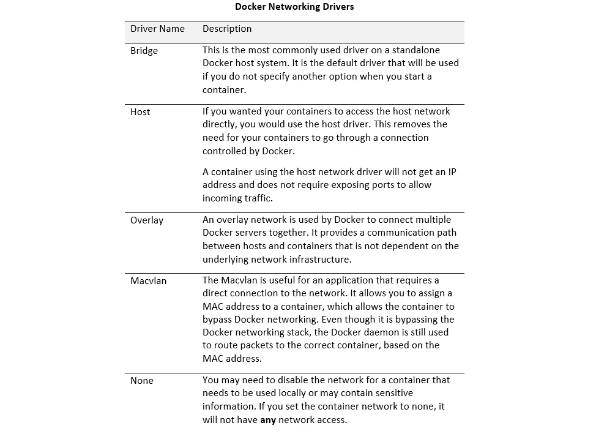

图 3.2–Docker 网络驱动程序

默认的 Docker 安装将包括几个预配置的网络:

*   默认桥接网络
*   默认主机网络
*   没有人

大多数 Docker 用户只是使用默认的桥接网络，这将适用于大多数用例，但它确实有一些需要考虑的限制。

在本节中，我们将讨论默认网桥网络、自定义网桥网络和无网络选项。当您的主机是 Docker Swarm 的一部分时，主要使用主机网络选项，但是如果您了解使用端口时如何暴露端口的限制，它可以在没有 Swarm 的情况下使用。

## 默认网桥网络

在上表中，您了解到桥接网络仅向运行在同一 Docker 主机上的容器提供网络连接。除非您使用 Docker Swarm 运行多个 Docker 主机，否则您通常会使用带有 Docker 容器的桥接网络。当您安装 Docker 时，它将创建默认的 Docker 桥接网络。通过为所有安装提供默认网桥，Docker 使得在容器中使用网络变得非常简单。许多用户只是开始使用带有默认网络设置和选项的 Docker，从而在不知道默认桥的限制和潜在安全风险的情况下启动容器。在使用 Docker 主机之前，您应该始终考虑根据您的需求创建一个用户定义的桥或多个桥。

Docker 包含一个易于使用的默认网络，那么为什么要考虑创建一个用户定义的网桥呢？由于默认桥保持向后兼容性，许多桥的特性不得不受到限制。由于这些限制，默认桥被认为比用户定义的桥差。虽然这听起来有点刺耳，但请考虑以下列表，其中详细列出了使用默认网桥时要考虑的事项:

*   When a container is started **without** a network specified, it will use the default bridge. This means that multiple containers will be able to communicate by default, without any consideration being given to the workloads.

    *考虑*:如果您正在运行多个容器，并且您想要将一些容器与其他容器隔离，您可能会无意中允许容器之间的通信，因为它们正在使用默认桥。

*   The default bridge limits communications between containers to IP addresses only. Containers connected to user-defined bridges can communicate using container names or IP addresses. Containers that use a user-defined bridge can communicate using IP addresses or host names.

    *考虑*:当你启动一个容器的时候，IP 地址可能和你上次运行镜像的时候不一样。

    如果您想配置一个具有多个交互容器的应用，您可以使用容器名称，这些名称在重新启动时将保持不变。如果您使用默认网桥，您可能需要更改配置文件，因为容器以不同的 IP 地址开始。

*   Containers that use the default bridge need to be stopped before you can move them to a different network. However, on a container using a user-defined switch, you can change the network without restarting the container.

    *考虑*:根据您的工作负载，如果没有同意的维护窗口，您可能无法停止正在运行的集装箱。虽然在大多数公司中，网络变更仍然需要变更请求，但是如果您使用的是用户定义的桥，则无需停止容器即可完成。这将限制对应用的任何潜在影响，并在新网桥配置错误时提供快速回切。

*   Using a single default bridge limits networking options for all containers. Since all the containers are on a single network, all networking settings are the same for all containers.

    *考虑*:您可能会要求某些容器运行巨型帧，而其他容器将使用标准的 MTU 大小。如果只使用了单个默认网桥，则只能设置一个 MTU 大小。但是，您可以创建一个用户定义的桥，将 MTU 设置为 9000，另一个保持默认 MTU 大小为 1500。

有了这个，你就可以明白为什么我们提到默认桥不如用户定义的桥了。根据您的使用情况，您可能能够使用默认桥来满足您的所有需求，就本书而言，我们将在练习中使用默认桥。但是，在运行 Docker 的生产环境中，您应该**始终**创建一个新的用户定义的桥。

现在，您已经了解了各种网络选项以及每种类型的优缺点，是时候深入研究管理和创建 Docker 网络了。在创建网络之前，我们将了解 Docker 默认包含的默认网络，以及如何使用 Docker CLI 查看网络的详细信息。

## 查看可用网络

要查看 Docker 主机上的所有现有网络，我们可以使用 Docker CLI 中的`network`管理选项和`ls`选项。当您执行 Docker 网络列表时，您的输出将类似于以下内容:

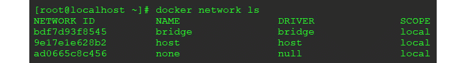

图 3.3–默认 Docker 网络列表

上面的列表来自基本的 Docker 安装，因此只有三个默认网络选项可用。

`docker network ls`命令不包含很多信息；它旨在为您提供可用网络的快速摘要。为了更深入地了解网络的细节，您可以请 Docker 检查网络，它将提供所有的网络设置。

## 检索网络上的详细信息

一旦你创建了多个用户定义的网络，你可能会开始忘记每个网络的设置，或者每个网络上运行的是什么容器。您可以使用`docker network inspect <network name>`选项查看主机上每个网络的详细信息。`inspect`命令的输出包含网络的详细信息，包括子网、网关、驱动程序类型和所有连接的容器:

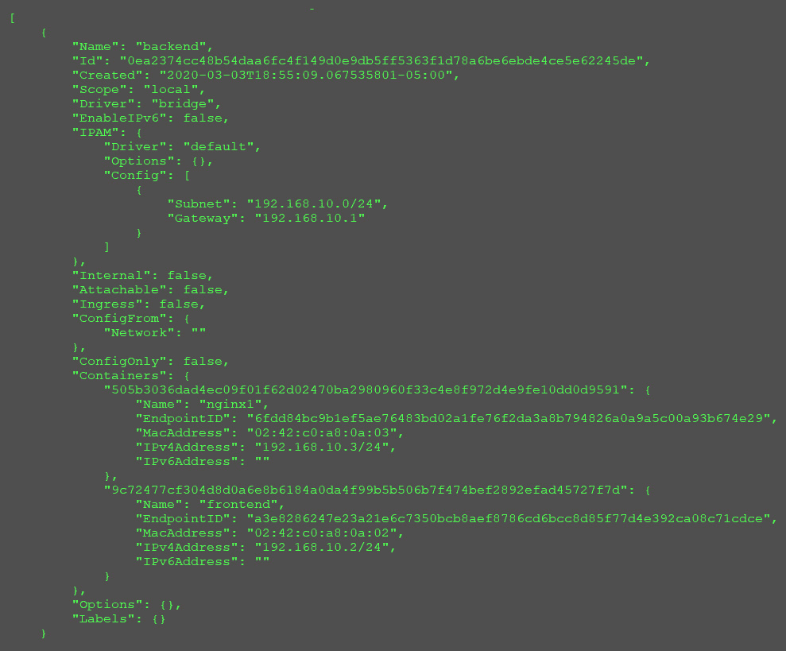

图 3.4–网络检查输出

前面的截图显示网络是一座桥，但是我们已经从`"Driver": "bridge"`部分的输出中知道了。在输出的容器部分，可以看到桥上连接了两个容器。第一个容器名为`NGINX1`，IP 地址为`192.168.10.3`，第二个容器名为`frontend`，IP 地址为`192.168.10.2`。`inspect`命令还显示每个容器的分配的媒体访问控制地址，如果启用，还显示 IPV6 地址。

现在，您已经知道如何跟踪主机上的网络，让我们深入了解用户定义的网桥。

# 创建用户定义的网桥网络

当您创建新的用户定义网络时，您可以提供在 Docker 之外创建新网络时使用的大多数标准 IP 选项。您可以为子网、IP 范围和网关设置选项。请记住，您在此定义的网络仅在 Docker 主机内部，您分配的 IP 地址在主机外部不可寻址。要了解更多高级选项，您可以访问[的高级 Docker 网络页面。](https://docs.docker.com/engine/reference/commandline/network_create/#specify-advanced-options)

要创建用户定义的网络，我们使用 Docker CLI 中的`network management`选项以及`create`选项。语法很简单；您只需要为新网络提供所需的网络名称，Docker 就会创建新网络。要创建一个名为 frontend 的新网络，我们只需执行以下命令:


图 3.5–创建 Docker 网络的输出

这将返回网络标识。如果您再次列出网络，您将看到一个新的网桥网络可用:

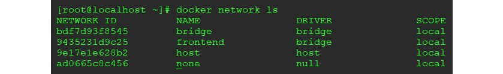

图 3.6–Docker 网络列表

由于我们没有指定网络名称以外的任何选项，Docker 将为网络分配一个不重叠的 IP 范围。

如果您想使用网关`192.168.10.1`创建第二个使用`192.168.10.0/24`子网的名为后端的网络，您只需将`--subnet`和`--gateway`添加到`docker network create`命令中:

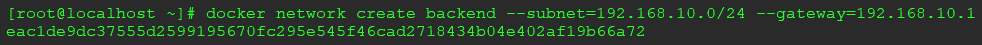

图 3.7–添加选项示例

当您创建一个新网络时，就像我们在后端网络示例中所做的那样，Docker 在主机上绑定了一个新的 IP，该 IP 等于我们在`create`命令中使用的网关地址。以下是在我们的主机上使用`ip addr`的输出:

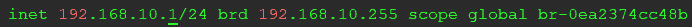

图 3.8–网络创建后添加的主机 IP

这将允许您的主机将网络流量路由到连接到交换机的任何容器。容器可以通过使用主机的 IP 作为默认网关来访问主机外部的网络资源。

现在您已经创建了一个用户定义的网络，让我们看看在运行映像时如何将新网络分配给一个容器。

## 将容器连接到用户定义的网络

通过在`docker run`命令中添加`--network`选项，您可以在启动容器时将容器连接到特定网络。要将新的 NGINX 容器附加到我们之前创建的前端网络，我们只需要在启动容器时添加`--network=frontend`:

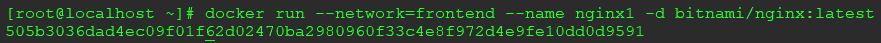

图 3.9–启动时连接网络

前面的命令将在名为`frontend`的用户定义网络上启动一个名为 frontend 的新 NGINX 容器。

## 在运行的容器上更改网络

我们提到与默认网络相比，使用用户定义的网络的一个优势是能够在不停止容器的情况下动态更改容器的网络。

要更改正在运行的容器的网络，您可以使用称为`connect`和`disconnect`的 Docker 网络选项，以及网络名称和容器名称。当您使用`connect`选项时，您可以向容器中添加网络，而如果您使用`disconnect`选项，您可以从容器中移除网络，而无需停止容器。

在我们的 NGINX 示例中，我们分配了前端网络，但是如果我们想将其更改为后端网络，我们只需要添加一个网络并删除另一个网络。第一步是使用`docker network connect`命令连接后端网络:


图 3.10–连接网络

这将把名为后端的网络连接到名为前端的容器。

第二步是使用`disconnect`选项移除前端网络:


图 3.11–断开网络

您可能想知道是否可以将一个容器连接到多个网络，答案是肯定的。如果您要求容器访问需要巨型帧的网络，但它也需要访问标准网络连接，您可以将容器连接到两个不同的用户定义的网络。详细描述这个场景超出了本书的范围，可能会成为一个复杂的主题，因为它可能需要在容器中创建自定义路由，但是知道这是可以做到的并且有特定的用例是很好的。

## 移除网络

如果您不再需要用户定义的网络，您可以使用`docker network rm <network name>`命令从您的主机中删除该网络。要删除我们之前创建的前端网络，我们将执行网络名称为`frontend`的`docker network rm`命令:


图 3.12–移除网络

如果您有多个要删除的网络，则可以使用`prune`命令，该命令将删除主机上所有未使用的网络。这类似于修剪未使用的卷。您只需运行`docker network prune`即可删除未使用的网络:

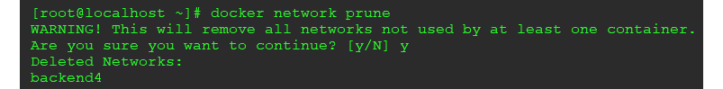

图 3.13–修剪网络

一旦您确认要继续，Docker 将列出已删除的网络。在我们的例子中，它删除了一个名为`network4`的网络。

就像我们之前讨论的`volume prune`命令一样，**这是一个单向的过程**。当您对选择“是”来修剪网络时，没有撤销，因此在验证操作之前，请始终确保 **100%** 您想要删除网络。

## 运行没有联网的容器

请记住，如果您启动一个没有网络选项的容器，它将开始连接到默认桥接网络。您可能需要测试一个可能包含可疑内容的容器，将其连接到`network`可能会危及整个网络。

这和物质世界没什么不同。例如，如果您有一台机器似乎在以恶意方式运行，您将关闭网络端口或断开网络电缆。在容器领域，我们可能在主机上运行多个容器，并且我们可能无法在不影响许多工作负载的情况下简单地拉动电缆。我们有两个选项可用，这取决于容器是否已经在运行，如果是，您不想失去运行状态。

如果容器停止，您可以在启动容器时使用`--network=none`选项，在没有连接网络的情况下简单地启动容器。除了我们将网络名称指定为`none`之外，这与使用用户定义的网络启动容器的过程相同。

如果您怀疑容器中有恶意运行的东西，您可能无法停止它。如果您需要查看正在运行的进程、内存内容等，停止映像会破坏正在运行的任何东西，并且您可能会丢失有价值的信息。您可以直接断开正在运行的容器与网络的连接，而不是使用网络值 none 来停止和重新启动容器。这将限制容器影响本地映像之外的任何东西的能力。

## 公开容器服务

现在您已经知道了 Docker 中可用的网络选项，下一步是在启动容器时公开您希望接受流量的任何端口。公开端口有两种选择。第一种是使用`host network`选项，第二种是在容器启动时暴露桥网络上的端口。使用`host network`选项更容易，因为您不需要任何手动端口映射，但是随着运行容器数量的增加，跟踪端口变得很困难。我们仅建议您在计划运行单个容器时使用`host network`选项。

## 使用主机网络暴露端口

正如我们在本章前面提供的表格中所述，*“使用主机网络驱动程序的容器将不会获得 IP 地址，并且不需要公开端口来允许传入流量。”*由于容器将直接在主机网络上启动，完全绕过 Docker 的网络堆栈，您不需要为容器公开任何端口。

例如，要使用主机网络启动主机上运行 NGINX 的 web 服务器，您可以运行`docker run`命令，同时提供`host`作为网络类型:

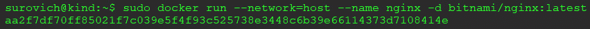

图 3.14–使用主机网络选项

我们想要验证容器是否正在运行，并查看任何可能暴露的端口，因此我们将运行`docker ps`来列出正在运行的容器。容器显示为正在运行，但是在`PORTS`下，我们没有看到任何列表:


图 3.15–主机连接的端口视图示例

由于容器是使用`host network`选项启动的，我们不需要暴露任何端口。我们一直在使用的 NGINX 容器运行在端口`8080`上，由于它绕过了 Docker 网络，证明它正在使用端口`8080`的唯一方法是在主机系统上运行`netstat`:


图 3.16–主机 netstat 显示端口 8080 正在使用

看起来容器正在端口 8080 上运行并监听。从网络上的另一台机器，我们可以打开浏览器，输入 Docker 主机的 IP 地址，并使用端口 8080:

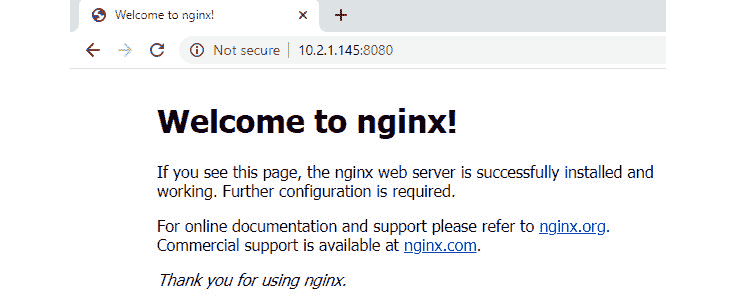

图 3.17–在主机网络上运行的 NGINX

在这里，我们收到了来自 NGINX 的欢迎页面，证明容器正在运行。

由于`docker ps`命令没有列出正在使用的端口，因此当使用`host network`选项时，如果您的主机运行多个容器，您可以看到您可能开始失去对分配端口的跟踪。这就是为什么我们建议限制使用`host network`选项，除非您运行的是单个容器或需要主机联网的容器。

重要说明

正如我们所说的，套接字在主机上必须是唯一的。在我们的示例中，我们一直使用单个网卡和单个 IP 地址，这意味着一个端口只能在主机上使用一个。由于套接字是 IP 地址和端口的组合，您可以向单个网卡添加第二个 IP 地址，或者添加一个具有新 IP 地址的附加网卡，以创建一个新的、唯一的套接字。这将允许您创建一个已分配端口到另一个进程的新绑定，因为套接字是唯一的。

现在，让我们停止 NGINX 容器，再次查看`netstat`以显示端口不再使用了。我们将使用以下命令:

```
sudo docker stop nginx
sudo docker rm nginx
```

然后，我们将使用 netstat 显示活动端口:

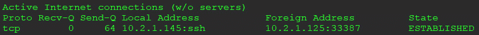

图 3.18–主机 netstat 显示端口 8080 未被使用

如您所见，主机上唯一打开的端口是 SSH 自集装箱停止以来，港口`8080`已经关闭。

## 使用桥接网络暴露端口

似乎使用`host network`选项使得暴露端口变得容易，因为你不需要实际做任何事情来暴露它们。这在最初看起来很有吸引力，但是如果您在一个主机上运行多个容器，并且多个容器被配置为在同一个端口上运行，例如我们的 NGINX 容器的端口 8080，由于端口冲突，您将被限制在单个容器中。

当一个选项看起来更容易时，它通常不太健壮或不太可配置，这就是为什么它在开始时看起来更容易。这是使用主机网络公开端口与桥接网络公开端口的情况，但是一旦您理解了我们如何以及为什么使用桥接网络公开端口，您就会明白为什么它提供了更好的全方位解决方案。

当您想要公开使用桥接网络的容器上的端口时，您只需要指定启动容器时要打开的端口。如果您有多个网桥，您还需要提供网络名称，但是在我们的示例中，我们假设您使用的是内置网桥网络。

在 Docker 中公开端口时，需要使用`incoming port:destination port`语法提供传入(Docker 主机)端口和目的(容器)端口。通常情况下，为了简单起见，数字是相同的，但是在的场景中，可能需要使用不同的端口。

如果您只为目的地提供一个端口，将会采用 TCP 连接。您可能需要为容器公开 UDP 端口，要将端口公开为 UDP 端口，只需将`/udp`添加到目的端口分配中。所以，你的语法会变成`incoming port:destination port/udp`。

使用我们的示例 web 服务器，我们将使用端口`8080`上的默认网桥监听启动容器，使用带有端口`-p`选项的`docker run`命令；也就是`docker run -p 8080:8080 -p 8443:8443`:

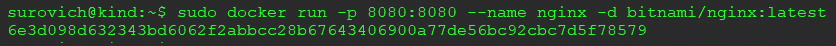

图 3.19–暴露端口 8080

为了验证容器是否正在运行，我们将使用`docker ps`命令并注意`PORTS`列，该列显示了容器的映射端口:


图 3.20–显示分配端口的 docker ps 输出

在这里，我们可以看到容器正在运行，并且我们已经将传入的主机端口`8080`和`8443`映射到容器端口`8080`和`8443`。在任何接口(0.0.0.0)上对`8080`和`8443`上的 Docker 主机的任何传入请求都将被转发到容器。

就像我们使用主机网络时一样，我们可以看到主机正在使用 netstat 监听`8080`和`8443`:

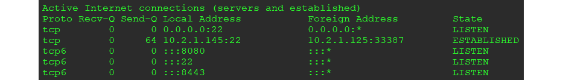

图 3.21–主机 netstat 显示端口 8080

您的项目现在需要另一个开发站点的第二个 web 服务器，并且您想要部署另一个 NGINX 容器。该映像使用端口`8080`和`8443`，但是这两个端口都被我们的第一个 NGINX 容器使用。尝试在主机上使用`8080`和`8443`运行另一个容器将导致端口已分配错误:

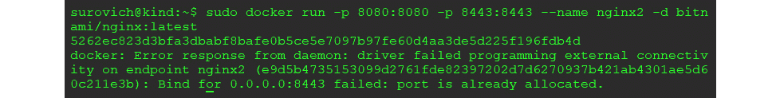

图 3.22–端口冲突示例

一种解决方案是创建另一个监听不同端口的容器，例如`8081`和`8444`，但这开始变得难以维护。相反，请记住，当您公开一个端口时，您要指定传入端口和目的端口。我们希望使用相同的 NGINX 映像，因此不能更改容器端口，但可以更改主机上的传入端口。当我们开始我们的第二个集装箱时，我们将每个港口增加一个，以避免与现有的`8080`和`8443`规则冲突，但是我们仍然将港口转发到新集装箱上的`8080`和`8433`。这听起来可能有些混乱，所以更容易看到一个示例`docker run`命令；也就是`docker run -p 8081:8080 -p 80444:8443 –name nginx2 bitnami/nginx:latest`:

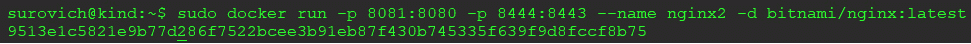

图 3.23–分配端口 8081 和 8443 的示例

由于 Docker 返回了新的容器 ID，我们可以看到，通过将传入端口增加 1，我们不再有任何冲突的端口。

列出当前运行的容器将显示 NGINX 容器和端口映射:

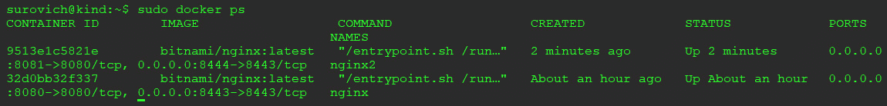

图 3.24–显示两台运行 NGINX 服务器的 docker ps

从网络上的另一台机器通过端口 8081 浏览到主机将显示默认的 NGINX 欢迎页面:

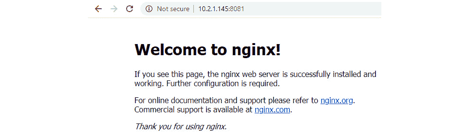

图 3.25–浏览端口 8081 上的 NGINX 示例

查看 netstat，可以看到所有四个端口都在监听主机上的:

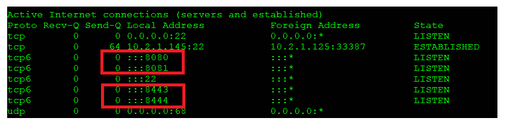

图 3.26–显示四个分配的 NGINX 端口的主机网络状态

如果您需要运行另一个 NGINX 容器，您可以使用另一个主机端口，可能是`8082`或`8445`。主要的要点是，主机上的传入端口必须是唯一的，以避免端口冲突。容器的端口可以是相同的，因为每个容器都在自己的名称空间中运行，并且每个容器都有自己的资源和端口。

# 总结

在本章中，您学习了 IP 套接字以及主机如何使用端口与服务器建立连接。您了解到套接字是一个 IP 地址和端口的组合，它在主机上必须是唯一的。然后，我们介绍了 Docker 提供的每种网络类型和每种类型的用例，以及何时使用默认桥接网络、自定义桥接网络、主机网络或不使用网络。最后，您学习了如何向外部用户公开容器。

在下一章中，我们将开始探索 Kubernetes，方法是探索 Kubernetes 集群，查看其控制平面，了解`kublet`和 API 之间的区别，了解工作节点如何工作，以及查看超过 25 个 Kubernetes 对象。

# 问题

1.  Since Docker creates a default bridge network, there is no reason to create a custom bridge.

    A.真实的

    B.错误的

2.  Which of the following is an example of a socket?

    A.`http:192.168.100.10`

    B.`192.168.100.10`

    C.`192.168.100.10:80`

    D.`https://192.168.100.10`

3.  How would you start a container running a web server on port `8080` named `nginx-web` on a host that already has its host port (`8080`) bound to another container?

    A.`docker run -d nginx-web bitnami/nginx`

    B.`docker run -p 8080:8080 -d nginx-web bitnami/nginx –force`

    C.`docker run -p 8081:8080 -d nginx-web bitnami/nginx`

    D.由于端口`8080`绑定在主机上，您不能在端口`8080`上运行容器

4.  You suspect an image may contain malware. You need to run the image safely to look at its contents. What Docker command will mitigate any network impact?

    A.`docker run -isolate -it badimage bash`

    B.`docker run -p 0:0 -it badimage bash`

    C.`docker run -it badimage bash`

    D.`docker run --network=none -it badimage bash`

5.  Once a container is connected to a custom bridge network, you cannot change the connected network.

    A.真实的

    B.错误的

6.  What is the highest IP port number you can expose on a container?

    A.没有限制

    B.65535

    C.65530

    D.65532

    E.65435