# 五、Kubes训练营

我们相信，你们中的许多人已经在一定程度上使用了 Kubernetes 您可能有正在生产中运行的集群，或者您可能已经使用 kubeadm、Minikube 或 Docker Desktop 踢过轮胎。这本书的目标是超越 Kubernetes 的基础，因此，我们不想重复 Kubernetes 的所有基础。相反，我们添加了这一章作为任何可能对 Kubernetes 不熟悉或者可能只是玩了一会儿的人的训练营。

因为这是一个训练营章节，所以我们不会深入每个主题，但是到最后，您应该对 Kubernetes 的基础知识有足够的了解，才能理解剩下的章节。如果你有很强的 Kubernetes 背景，你可能仍然会发现这一章作为复习很有用，我们将从 [*第 6 章*](06.html#_idTextAnchor174) *、服务、负载平衡和外部 DNS 开始进入更复杂的主题。*

在本章中，我们将介绍运行中的 Kubernetes 集群的组件，包括控制平面和工作节点。我们将详细介绍每个 Kubernetes 对象及其用例。如果您过去使用过 Kubernetes，并且对使用`kubectl`感到舒适，并且完全了解 Kubernetes 对象(如`DaemonSets`、`StatefulSets`、`ReplicaSets`等……)，那么您可能想跳转到 [*第 6 章*](06.html#_idTextAnchor174) 、*服务、负载均衡和外部 DNS* ，我们将使用 KinD 在这里安装 Kubernetes。

在本章中，我们将涵盖以下主题:

*   Kubernetes 组件概述
*   探索控制平面
*   了解工作节点组件
*   与应用编程接口服务器交互
*   介绍 Kubernetes 对象

# 技术要求

本章有以下技术要求:

*   一台 Ubuntu 18.04 服务器，至少有 4 **千兆字节**(**GB**)**随机存取存储器** ( **内存**)
*   一个不可思议的群集的孩子

您可以在以下 GitHub 存储库中访问本章的代码:[https://GitHub . com/PacktPublishing/Kubernetes-and-Docker-The-Complete-Guide](https://github.com/PacktPublishing/Kubernetes-and-Docker-The-Complete-Guide)。

# Kubernetes成分概述

在任何基础设施中，理解系统如何协同工作来提供服务总是一个好主意。如今有这么多安装程序选项，许多 Kubernetes 用户都没有必要了解 Kubernetes 组件是如何集成的。

几年前，如果您想运行 Kubernetes 集群，您需要手动安装和配置每个组件。安装一个正常运行的集群是一个陡峭的学习曲线，这经常会导致沮丧，导致许多人和公司说*“Kubernetes 太难了”*。手动安装的优势在于，您真正了解每个组件是如何相互作用的，如果您的集群在安装后遇到问题，您就知道应该寻找什么。

如今，大多数人点击云提供商的按钮，几分钟内就能拥有一个功能齐全的 Kubernetes 集群。内部安装也变得同样容易，有了谷歌、红帽、Rancher 等的选项，消除了安装 Kubernetes 集群的复杂性。当您在安装后遇到问题或有疑问时，就会出现我们看到的问题。由于您没有配置 Kubernetes 组件，您可能无法向开发人员解释如何在工作节点上调度 Pod。最后，由于您正在运行由第三方提供的安装程序，它们可能会启用或禁用您不知道的功能，从而导致安装可能违反您公司的安全标准。

要了解 Kubernetes 组件如何协同工作，您必须首先了解 Kubernetes 集群的不同组件。下图来自`Kubernetes.io`站点，显示了 Kubernetes 集群组件的高级概述:

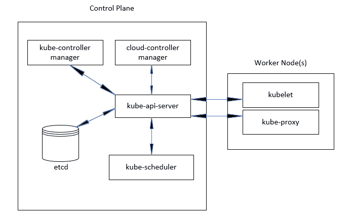

图 5.1–Kubernetes 集群组件

如你所见， Kubernetes 星团由几个部分组成。随着本章的深入，我们将讨论这些组件以及它们在 Kubernetes 集群中扮演的角色。

# 探索控制平面

顾名思义，控制平面控制着一个集群的每一个方面。如果您的控制平面发生故障，您可能会认为您的集群会遇到问题。没有控制平面，集群将没有任何调度能力，这意味着正在运行的工作负载将保持运行，除非它们停止并重新启动。因为控制平面极其重要，所以总是建议您至少有三个主节点。许多生产安装运行三个以上的主节点，但是安装的节点数量应该总是奇数。让我们通过检查每一个来看看为什么控制平面及其组件对运行的集群如此重要。

## 不灭 API 服务器

集群中第一个需要理解的组件是`kube-apiserver`组件。由于 Kubernetes 是**应用编程接口** ( **API** )驱动的，所以进入集群的每个请求都要经过 API 服务器。让我们看一个使用 API 端点的简单`get nodes`请求，如下所示:

`https://10.240.100.100:6443/api/v1/nodes?limit=500`

Kubernetes 的用户部署与 API 服务器交互的一种常见方法是 kubectl 实用程序。使用 kubectl 发出的每个命令都在幕后调用一个 API 端点。在前面的例子中，我们执行了一个`kubectl get nodes`命令，该命令向端口`6443`上的`10.240.100.100`上的`kube-apiserver`进程发送了一个 API 请求。API 调用请求`/api/vi/nodes`端点，该端点返回集群中节点的列表，如下图所示:

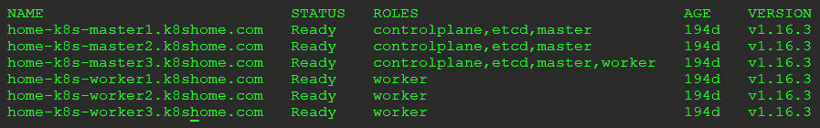

图 5.2–Kubernetes 节点列表

如果没有运行的应用编程接口服务器，对集群的所有请求都将失败。所以，如你所见，让`kube-apiserver`组件一直运行是非常重要的。通过运行三个或更多主节点，我们可以限制丢失主节点的任何影响。

注意

当运行多个主节点时，您需要在集群前面有一个负载平衡器。Kubernetes API 服务器可以由大多数标准解决方案来引导，包括 F5、HAProxy 和 Seesaw。

## Etcd 数据库

说 Etcd 是你的 Kubernetes 集群并不夸张。Etcd 是一个快速且高度可用的分布式键值数据库，Kubernetes 使用它来存储所有集群数据。集群中的每个资源在数据库中都有一个键。如果您登录到运行 Etcd 的节点(或 Pod)，您可以使用`etcdctl`可执行文件查看数据库中的所有键。下面的代码片段显示了一个运行 KinD 的集群示例:

```
EtcdCTL_API=3 etcdctl --endpoints=https://127.0.0.1:2379 --cacert=/etc/kubernetes/pki/etcd/ca.crt --key=/etc/kubernetes/pki/etcd/server.key --cert=/etc/kubernetes/pki/etcd/server.crt  get / --prefix --keys-only
```

前面命令的输出包含太多数据，本章无法一一列出。一个基本的 KinD 集群将返回大约 317 个条目。所有按键以`/registry/<object>`开始。例如，返回的一个键是`cluster-admin`键的`ClusterRole`，如下所示:`/registry/clusterrolebindings/cluster-admin`。

通过稍微修改我们之前的命令，我们可以使用键名称使用`etcdctl`实用程序检索值，如下所示:

```
EtcdCTL_API=3 etcdctl --endpoints=https://127.0.0.1:2379 --cacert=/etc/kubernetes/pki/etcd/ca.crt --key=/etc/kubernetes/pki/etcd/server.key --cert=/etc/kubernetes/pki/etcd/server.crt  get /registry/clusterrolebindings/cluster-admin
```

输出将包含外壳无法解释的字符，但您将了解存储在 Etcd 中的数据。对于`cluster-admin`键，输出显示如下:

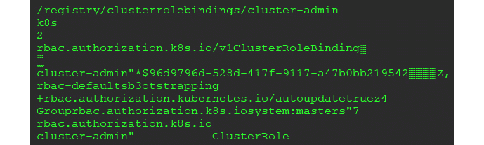

图 5.3–etc dctl 集群角色绑定输出

我们解释 Etcd 中的条目的原因是为了提供一个关于 Kubernetes 如何使用它来运行集群的背景。您已经直接从数据库中看到了`cluster-admin`键的输出，但是在日常生活中，您会使用`kubectl get clusterrolebinding cluster-admin -o yaml`查询应用编程接口服务器，这会返回以下内容:

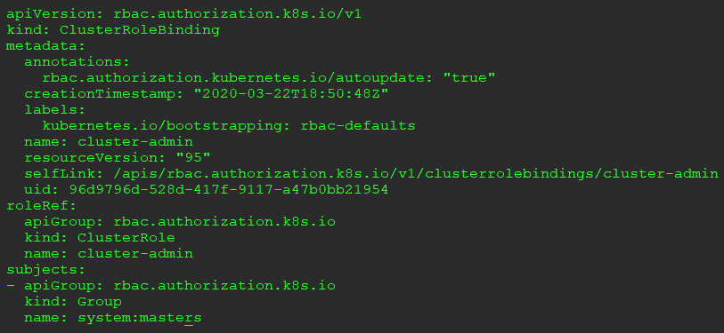

图 5.4–kube CTL 集群角色绑定输出

如果您查看`kubectl`命令的输出，并将其与`etcdctl`查询的输出进行比较，您将看到匹配的信息。当您执行`kubectl`命令时，该请求将被发送到应用编程接口服务器，然后该服务器将向 Etcd 数据库查询对象的信息。

## 多维数据集调度程序

顾名思义，组件负责调度运行的 Pods。每当在集群中启动 Pod 时，应用编程接口服务器都会接收请求，并根据多项标准(包括主机资源和集群策略)决定在哪里运行工作负载。

## 库贝-控制器-管理器

`kube-controller-manager`组件实际上是包含在单个二进制中的多个控制器的集合。将四个控制器包含在一个可执行文件中，通过在一个进程中运行所有四个控制器来降低复杂性。`kube-controller-manager`组件中包含的四个控制器是节点、复制、端点以及服务帐户和令牌控制器。

每个控制器为集群提供唯一的功能，这里列出了每个控制器及其功能:

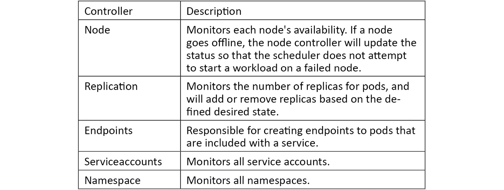

每个控制器运行一个不终止(永不结束)的控制回路。这些控制循环监视每个资源的状态，进行任何必要的更改来规范化资源的状态。例如，如果您需要将部署从一个节点扩展到三个节点，复制控制器会注意到当前状态有一个 Pod 正在运行，而期望的状态是有三个 Pod 正在运行。要将当前状态移动到所需状态，复制控制器将请求另外两个 Pods。

## 云-控制器-管理器

这是一个您可能没有遇到的组件，具体取决于您的集群是如何配置的。类似于`kube-controller-manager`组件，这个控制器在一个二进制文件中包含四个控制器。包括的控制器有节点控制器、路由控制器、服务控制器和卷控制器，每个控制器都负责与各自的云服务提供商产品进行交互。

# 了解工作节点组件

工人节点，顾名思义，负责运行工作负载。当我们讨论控制平面的`kube-scheduler`组件时，我们提到当调度新的 Pod 时，`kube-scheduler`组件将决定在哪个节点上运行 Pod。它使用从工作节点发送给它的信息来实现这一点。此信息会不断更新，以帮助将 Pods 分布在集群中，从而有效利用资源。下面是工作节点组件的列表。

## 忽必烈

你可能会听到一个工人节点被称为`kubelet`。`kubelet`是一个在所有工作节点上运行的代理，它负责运行实际的容器。

## 多维数据集代理

与的名字相反，`kube-proxy`根本不是代理服务器。`kube-proxy`负责在 Pod 和外部网络之间路由网络通信。

## 容器运行时

这是图中没有表示的，但是每个节点也需要一个容器运行时。容器运行时负责运行容器。你首先想到的可能是 Docker。虽然 Docker 是一个容器运行时，但它不是唯一可用的运行时选项。在过去的一年里，其他选项变得可用，并迅速取代 Docker 成为首选的容器运行时。两个最突出的 Docker 替代品是 CRI-O 和 container der。

对于书本练习，我们将使用 KinD 创建一个 Kubernetes 集群。在撰写本文时，KinD 只提供了 Docker 作为容器运行时的官方支持，对 Podman 的支持有限。

# 与 API 服务器交互

正如我们前面提到的，您可以使用直接的应用编程接口请求或`kubectl`实用程序与应用编程接口服务器交互。在本书中，我们将主要使用`kubectl`进行大部分的交互，但是在适用的情况下，我们将使用直接的 API 调用进行调用。

## 使用 Kubernetes kubectl 实用程序

`kubectl`是一个单一的可执行文件，允许您使用**命令行界面** ( **CLI** )与 Kubernetes API 进行交互。它适用于大多数主要的操作系统和架构，包括 Linux、Windows 和 Mac。

大多数操作系统的安装说明位于 T2 https://kubernetes.io/docs/tasks/tools/install-kubectl/的 Kubernetes 站点。由于我们在本书的练习中使用的是 Linux 作为我们的操作系统，我们将介绍在 Linux 机器上安装`kubectl`。请遵循以下步骤:

1.  要下载最新版本的`kubectl`，可以运行`curl`命令下载，如下所示:

    ```
    curl -LO https://storage.googleapis.com/kubernetes-release/release/`curl -s https://storage.googleapis.com/kubernetes-release/release/stable.txt`/bin/linux/amd64/kubectl
    ```

2.  下载后，需要通过运行以下命令使文件可执行:

    ```
    chmod +x ./kubectl
    ```

3.  最后，我们将可执行文件移动到您的路径，如下所示:

    ```
    sudo mv ./kubectl /usr/local/bin/kubectl
    ```

现在您的系统上有了最新的`kubectl`实用程序，可以从任何工作目录执行`kubectl`命令。

Kubernetes 每 3 个月更新一次。这包括对基本Kubernetes集群组件和`kubectl`实用程序的升级。您可能会遇到集群和您的`kubectl`命令版本不匹配的情况，需要您升级或下载您的`kubectl`可执行文件。您可以通过运行`kubectl version`命令来检查两者的版本，该命令将输出应用编程接口服务器和`kubectl`客户端的版本。版本检查的输出显示在下面的代码片段中:

```
Client Version: version.Info{Major:"1", Minor:"17", GitVersion:"v1.17.1", GitCommit:"d224476cd0730baca2b6e357d144171ed74192d6", GitTreeState:"clean", BuildDate:"2020-01-14T21:04:32Z", GoVersion:"go1.13.5", Compiler:"gc", Platform:"linux/amd64"}
Server Version: version.Info{Major:"1", Minor:"17", GitVersion:"v1.17.0", GitCommit:"70132b0f130acc0bed193d9ba59dd186f0e634cf", GitTreeState:"clean", BuildDate:"2020-01-14T00:09:19Z", GoVersion:"go1.13.4", Compiler:"gc", Platform:"linux/amd64"}
```

从的输出可以看到，`kubectl`客户端正在运行版本`1.17.1`，集群正在运行`1.17.0`。两者之间的微小版本差异不会导致任何问题。事实上，官方支持的版本差异是在一个主要版本版本内。因此，如果您的客户端运行的是 1.16 版本，而群集运行的是 1.17 版本，那么您将处于支持的版本差异之内。虽然这可能得到支持，但这并不意味着如果您尝试使用更高版本中包含的任何新命令或对象，就不会遇到问题。通常，您应该尝试保持集群和客户端版本同步，以避免任何问题。

通过本章的剩余部分，我们将讨论 Kubernetes 对象以及如何与 API 服务器交互来管理每个对象。但是在深入研究不同的对象之前，我们想提一下`kubectl`实用程序中一个通常被忽略的选项:`verbose`选项。

## 了解详细选项

当您执行`kubectl`命令时，默认情况下，您将看到的唯一输出是对您的命令的任何直接响应。如果您查看`kube-system`名称空间中的所有 Pods，您将收到所有 Pods 的列表。在大多数情况下，这是期望的输出，但是如果您发出了一个`get Pods`请求并从 API 服务器收到了一个错误呢？如何获得更多可能导致错误的信息？

通过在您的`kubectl`命令中添加`verbose`选项，您可以获得关于应用编程接口调用本身的更多细节以及来自应用编程接口服务器的任何回复。通常，来自应用编程接口服务器的回复将包含有助于找到问题根源的附加信息。

`verbose`选项有从 0 到 9 的多个级别；数字越高，您将获得越多的输出。以下截图取自 Kubernetes 网站，详细介绍了每个级别以及输出内容:

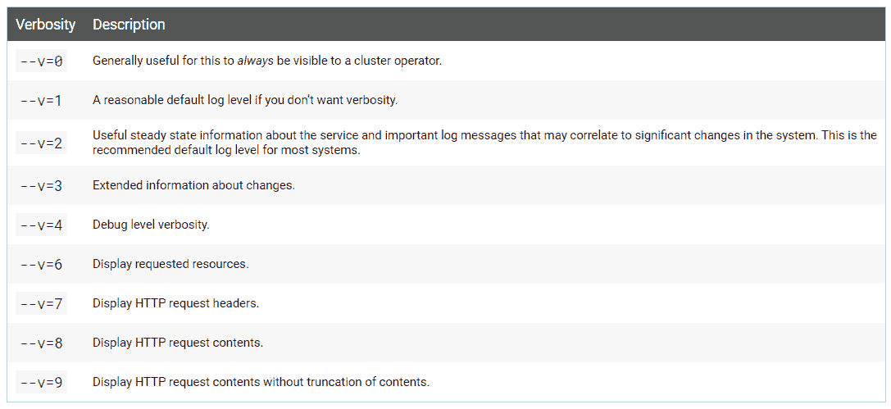

图 5.5–详细描述

您可以通过在任何`kubectl`命令中添加`-v`或`--v`选项来试验这些级别。

## 库贝克特尔将军命令

命令行界面允许您以命令和声明的方式与Kubernetes进行交互。使用命令式命令需要您告诉 Kubernetes 该做什么——例如，`kubectl run nginx –image nginx`。这告诉应用编程接口服务器创建一个名为`nginx`的新部署，运行名为`nginx`的映像。虽然命令式命令对于开发和快速修复或测试很有用，但是在生产环境中，您将更经常地使用声明式命令。在声明性命令中，您告诉 Kubernetes 您想要什么。要使用声明性命令，您需要向应用编程接口服务器发送一个清单，该清单通常用 **YAML 非标记语言** ( **YAML** )编写，该清单声明您希望Kubernetes创建的内容。

`kubectl`包括命令和选项，可以提供一般的集群信息或关于对象的信息。下表包含命令及其用途的备忘单。我们将在以后的章节中使用其中的许多命令，因此您将在整本书中看到它们的实际应用:

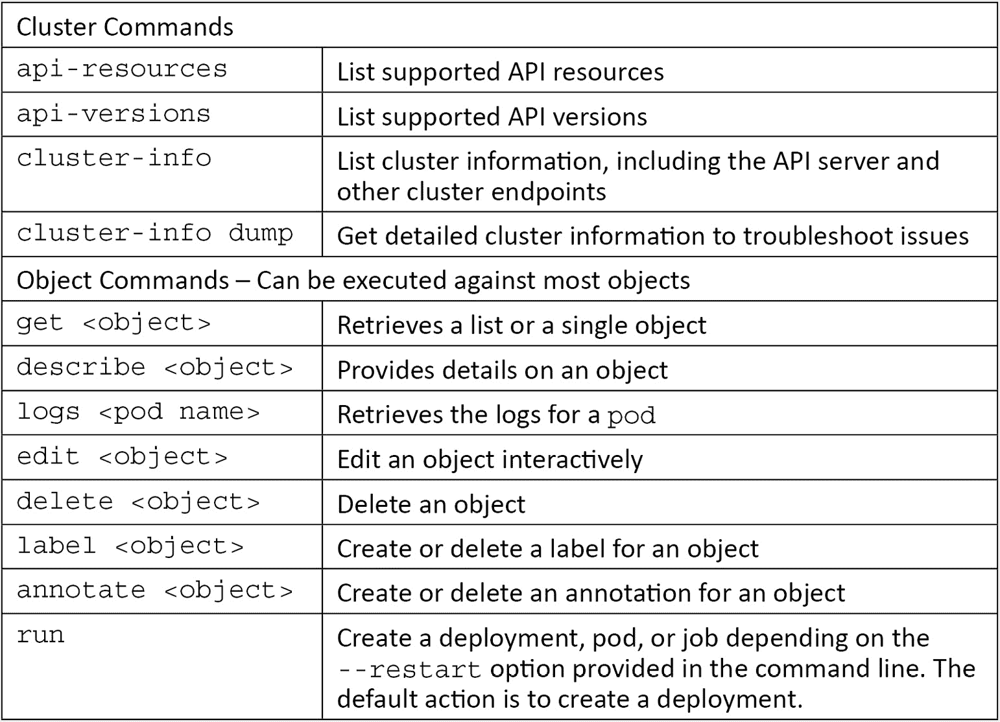

了解了每个 Kubernetes 组件以及如何使用命令与 API 服务器交互后，我们现在可以继续讨论 Kubernetes 对象以及如何使用`kubectl`来管理它们。

# 介绍 Kubernetes 对象

这一部分将包含大量信息，由于这是一个训练营，我们将不深入讨论每个对象的细节。可以想象，在一本书里，每个对象都可以有自己的章节，或者多个章节。因为有很多关于Kubernetes的书详细介绍了基本对象，我们将只介绍每本书的必要细节，以便理解每一本书。在接下来的章节中，当我们使用书本练习构建集群时，我们将包括对象的附加细节。

在我们继续理解Kubernetes对象到底是什么之前，让我们首先解释Kubernetes对象的表现。

## 立方结构清单

我们将用来创建 Kubernetes 对象的文件被称为清单。清单可以使用 YAML 或 **JavaScript 对象符号** ( **JSON** )创建—大多数清单使用 YAML，这是我们将在本书中使用的格式。

清单的内容将根据将要创建的一个或多个对象而有所不同。至少，所有清单都需要基本配置，包括`apiVersion`、对象`KinD`和`metadata`字段，如下图所示:

```
apiVersion: apps/v1
KinD: Deployment
metadata:
  labels:
    app: grafana
  name: grafana
  namespace: monitoring
```

前面的清单本身并不完整；我们只显示了完整部署清单的开始。正如您在文件中所看到的，我们从所有清单都必须具有的三个必填字段开始:`apiVersion`、`KinD`和`metadata`字段。

您可能还会注意到文件中有空格。YAML 是非常特定于格式的，如果任何一行的格式偏离了一个空格，那么当您试图部署清单时就会收到一个错误。这需要时间来适应，即使在创建清单很长一段时间后，格式问题仍然会不时出现。

## 什么是 Kubernetes 对象？

当你想在集群中添加或删除一些东西时，你正在与一个 Kubernetes 对象进行交互。对象是集群用来保存所需状态列表的对象。期望的状态可以是创建、删除或缩放对象。基于对象的期望状态，应用编程接口服务器将确保当前状态等于期望状态。

要检索集群支持的对象列表，可以使用`kubectl api-resources`命令。应用编程接口服务器将回复所有对象的列表，包括任何有效的短名称、名称空间支持和支持的应用编程接口组。一个基本集群大约包含 53 个基本对象，但最常见对象的缩写列表显示在下面的屏幕截图中:

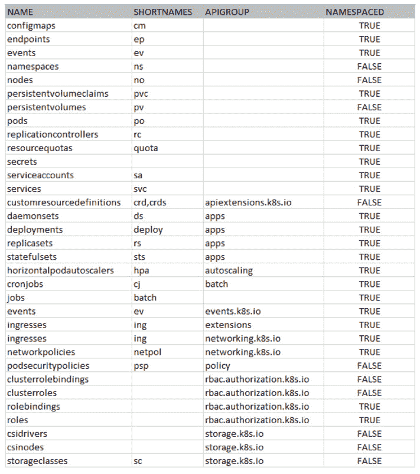

图 5.6-固定 API 资源

由于本章是一个训练营，我们将对列表中的许多对象进行简要回顾。为了确保您能够理解剩下的章节，我们将概述每个对象以及如何与它们交互。一些对象也将在以后的章节中更详细地解释，包括`Ingress`、`RoleBindings`、`ClusterRoles`、`StorageClasses`等等。

## 查看Kubernetes对象

为了使这个部分更容易理解，我们将按照`kubectl api-services`命令提供的顺序呈现每个对象。

集群中的大多数对象都在一个命名空间中运行，要创建/编辑/读取它们，您应该为任何`kubectl`命令提供`-n <namespace>`选项。要查找接受名称空间选项的对象列表，您可以参考我们之前的`get api-server`命令的输出。如果一个对象可以被命名空间引用，命名空间列将显示`true`。如果该对象仅由集群级别引用，则命名空间列将显示`false`。

### 配置地图

配置图将数据存储在键值对中，提供了一种将配置与应用分开的方法。配置映射可能包含来自文字值、文件或目录的数据。

这里有一个命令式的例子:

```
kubectl create configmap <name> <data>
```

`name`选项将根据配置图的来源而变化。要使用文件或目录，您需要提供`--from-file`选项以及文件或整个目录的路径，如下所示:

```
kubectl create configmap config-test --from-file=/apps/nginx-config/nginx.conf
```

这将创建一个名为`config-test`的新配置图，以包含`nginx.conf`文件内容的`nginx.conf`键作为值。

如果需要在单个配置映射中添加多个键，可以将每个文件放入一个目录，并使用目录中的所有文件创建配置映射。例如，在位于`~/config/myapp`的目录中有三个文件。目录中有三个文件，每个文件都包含数据，分别叫做`config1`、`config2`和`config3`。要创建将每个文件添加到密钥中的配置映射，您需要提供`--from-file`选项并指向目录，如下所示:

```
kubectl create configmap config-test --from-file=/apps/config/myapp
```

这将创建一个新的`ConfigMap`，它有三个关键值，分别叫做`config1`、`config2`和`config3`。每个关键字将包含一个等于目录中每个文件内容的值。

为了快速显示一个`ConfigMap`，使用这个例子从一个目录中创建一个`ConfigMap`，我们可以使用 get 命令`kubectl get configmaps config-test`来检索`ConfigMap`，得到如下输出:

```
NAME          DATA   AGE config-test    3     7s
```

我们可以看到配置图包含三个键，显示为`DATA`列下的`3`。更详细地看，我们可以使用与 YAML 相同的`get`命令，并通过向`kubectl get configmaps config-test -o yaml`命令添加`-o yaml`选项来输出每个键的值，从而产生以下输出:

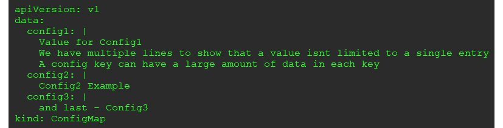

图 5.7-cube config map 输出

查看前面的输出，您可以看到每个键都匹配文件名，并且每个键的值都包含每个相应文件中的数据。

您应该记住的配置映射的一个限制是，任何拥有对象权限的人都可以轻松访问数据。从前面的输出中可以看到，一个简单的`get`命令以明文形式显示数据。由于这种设计，您永远不应该在配置映射中存储敏感信息，如密码。在这一节的后面，我们将介绍一个被设计用来存储敏感信息的对象，称为机密。

### 端点

端点将服务映射到一个或多个 Pod。当我们解释`Service`对象时，这将更有意义。现在，您只需要知道您可以使用命令行界面通过使用`kubectl get endpoints`命令来检索端点。在新的 KinD 集群中，您将在默认命名空间中看到 Kubernetes API 服务器的值，如以下代码片段所示:

```
NAMESPACE   NAME     ENDPOINTS         AGE               
default   kubernetes 172.17.0.2:6443   22h                                
```

输出显示集群有一个名为`kubernetes`的服务，该服务在端口`6443`上的**互联网协议** ( **IP** )地址`172.17.0.2`处有一个端点。稍后，当您查看端点时，您会发现它们可用于解决服务和入口问题。

### 事件

`Events`对象将显示名称空间的任何事件。要获取`kube-system`命名空间的事件列表，可以使用`kubectl get events -n kube-system`命令。

### 命名空间

命名空间是一个将集群划分为逻辑单元的对象。每个名称空间都允许对资源进行精细的管理，包括权限、配额和报告。

`namespace`对象用于命名空间任务，这是集群级别的操作。使用`namespace`对象，您可以执行包括`create`、`delete`、`edit`和`get`在内的命令。

该命令的语法为`kubectl <verb> ns <namespace name>`。

例如，为了描述`kube-system`命名空间，我们将执行一个`kubectl describe namespaces kube-system`命令。这将返回命名空间的信息，包括任何标签、注释和分配的配额，如以下代码片段所示:

```
Name:         kube-system
Labels:       <none>Annotations:  <none>
Status:       Active
No resource quota.
No LimitRange resource.
```

在前面的输出中，您可以看到这个命名空间没有分配任何标签、注释或资源配额。

本节仅旨在介绍名称空间作为多租户集群中的管理单元的概念。如果您计划运行具有多个租户的集群，您需要了解如何使用名称空间来保护集群。

### 节点

`nodes`对象是一个集群级别的资源，用于与集群的节点进行交互。该对象可用于各种动作，包括`get`、`describe`、`label`和`annotate`。

要使用`kubectl`检索集群中所有节点的列表，您需要执行`kubectl get nodes`命令。在运行简单单节点集群的新 KinD 集群上，这将显示如下:

```
NAME               STATUS ROLES    AGE   VERSION
KinD-control-plane Ready  master   22h   v1.17.0
```

您也可以使用节点对象，使用`describe`命令获取单个节点的详细信息。要获得前面列出的 KinD 节点的描述，我们可以执行`kubectl describe node KinD-control-plane`，它将返回节点的详细信息，包括消耗的资源、运行的 Pods、IP **无类域间路由** ( **CIDR** )范围等等。

### 持续批量索赔

我们将在后面的章节中更深入地描述**持久卷声明**(**PVC**，但是现在您只需要知道一个 PVC 被一个 Pod 用来消耗持久存储。聚氯乙烯使用**持久卷** ( **PV** )来映射存储资源。与我们讨论过的大多数其他对象一样，您可以在聚氯乙烯对象上发出`get`、`describe`和`delete`命令。因为这些是由 Pod 使用的，所以它们是一个`namespaced`对象，并且必须在与将使用 PVC 的 Pod 相同的命名空间中创建。

### post-vietnam syndrome 越战战后综合征

物理卷被物理卷用来在物理卷和底层存储系统之间创建链接。手动维护 PVs 是一项麻烦的任务，在现实世界中应该避免，因为 Kubernetes 能够使用**容器存储接口** ( **CSI** )管理大多数常见存储系统。如**聚氯乙烯**对象部分所述，我们将讨论 Kubernetes 如何自动创建将链接到聚氯乙烯的聚氯乙烯。

### 分离舱

吊舱对象用于与运行您的容器的吊舱交互。使用`kubectl`实用程序，您可以使用诸如`get`、`delete`和`describe`等命令。例如，如果您想要获取`kube-system`命名空间中所有 Pods 的列表，您将执行`kubectl get Pods -n kube-system`命令，该命令将返回命名空间中的所有 Pods，如下所示:

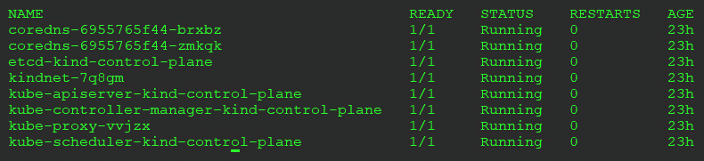

图 5.8–kube 系统命名空间中的所有 Pods

虽然您可以直接创建 Pod，但是您应该避免这样做，除非您使用 Pod 进行快速故障排除。直接创建的 Pods 不能使用 Kubernetes 提供的许多功能，包括缩放、自动重启或滚动升级。您应该使用部署，或者在某些罕见的情况下使用`ReplicaSet`对象或复制控制器，而不是直接创建 Pod。

### 复制控制器

复制控制器将管理运行 Pods 的数量，保持指定的所需副本始终运行。如果您创建一个复制控制器并将副本计数设置为`5`，控制器将始终保持应用的五个 Pods 运行。

复制控制器已经被`ReplicaSet`对象所取代，我们将在它自己的部分中讨论。虽然您仍然可以使用复制控制器，但是您应该考虑使用部署或`ReplicaSet`对象。

### 资源配额

在多个团队之间共享 Kubernetes 集群变得非常普遍，称为多租户集群。由于您将有多个团队在单个集群中工作，因此您应该考虑创建配额，以限制单个租户消耗集群或节点中所有资源的可能性。可以对大多数集群对象设置限制，包括以下内容:

*   **中央处理器** ( **中央处理器**)
*   记忆
*   聚氯乙烯
*   配置地图
*   部署
*   豆荚等等

一旦达到限制，设置限制将停止创建任何其他对象。如果您为命名空间设置了 10 个 Pod 的限制，并且用户创建了一个尝试启动 11 个 Pod 的新部署，则第 11 个 Pod 将无法启动，并且用户将收到一个错误。

创建内存和 CPU 配额的基本清单文件如下所示:

```
apiVersion: v1
KinD: ResourceQuota
metadata:
  name: base-memory-cpu
spec:
  hard:
    requests.cpu: "2"
    requests.memory: 8Gi
    limits.cpu: "4"
    limits.memory: 16Gi
```

这将对名称空间可用于 CPU 和内存请求的资源总量设置限制。

创建配额后，您可以使用`kubectl describe`命令查看使用情况。在我们的例子中，我们将`ResourceQuota`命名为`base-memory-cpu`。为了查看用法，我们将执行`kubectl get resourcequotas base-memory-cpu`命令，产生以下输出:

```
Name:            	base-memory-cpu
Namespace:       	default
Resource         	Used     Hard
--------       	  	----  	----
limits.cpu      	 	 0     	4
limits.memory    	 0     	16Gi
requests.cpu    		 0     	2
requests.memory  	 0     	8Gi
```

`ResourceQuota`对象用于控制集群的资源。通过将资源分配给一个命名空间，您可以保证单个租户拥有运行其应用所需的 CPU 和内存，同时限制写得不好的应用对其他应用的影响。

### 机密

前面我们描述了如何使用`ConfigMap`对象来存储配置信息。我们提到`ConfigMap`对象绝不应该用来存储任何类型的敏感数据。这是一个机密的工作。

机密存储为 Base64 编码的字符串，这不是一种加密形式。那么，为什么要把机密和`ConfigMap`对象分开呢？提供单独的对象类型提供了一种更简单的方法来维护访问控制，并能够使用外部系统注入敏感信息。

可以使用文件、目录或从文字字符串创建机密。例如，我们有一个要执行的 MySQL 映像，我们希望使用一个密码将密码传递给 Pod。在我们的工作站上，我们当前的工作目录中有一个名为`dbpwd`的文件，里面有我们的密码。使用`kubectl`命令，我们可以通过执行`kubectl create secret generic mysql-admin --from-file=./dbpwd`来创建一个机密。

这将在当前命名空间中创建一个名为`mysql-admin`的新机密，其内容为`dbpwd`文件。使用`kubectl`，我们可以通过运行`kubectl get secret mysql-admin -o yaml`命令获得机密的输出，该命令将输出以下内容:

```
apiVersion: v1
data:
  dbpwd: c3VwZXJzZWNyZXQtcGFzc3dvcmQK
KinD: Secret
metadata:
  creationTimestamp: "2020-03-24T18:39:31Z"
  name: mysql-admin
  namespace: default
  resourceVersion: "464059"
  selfLink: /api/v1/namespaces/default/secrets/mysql-admin
  uid: 69220ebd-c9fe-4688-829b-242ffc9e94fc
type: Opaque
```

查看前面的输出，您可以看到`data`部分包含我们的文件名，然后是一个 Base64 编码的值，它是根据文件的内容创建的。

如果我们从 Secret 中复制 Base64 值并将其传送到`base64`实用程序，我们可以轻松解码密码，如下所示:

```
echo c3VwZXJzZWNyZXQtcGFzc3dvcmQK | base64 -d
supersecret-password
```

小费

当使用`echo`命令对字符串进行 Base64 编码时，添加`-n`标志以避免添加额外的`\n`。用`echo -n 'test' | base64`代替`echo 'test' | base64`。

一切都存储在 Etcd 中，但我们担心有人可能会侵入主服务器并窃取 Etcd 数据库的副本。一旦有人有了数据库的副本，他们就可以很容易地使用`etcdctl`实用程序来浏览内容，以检索我们所有的 Base64 编码的机密。幸运的是，Kubernetes 增加了一项功能，可以在机密写入数据库时对其进行加密。

对于许多用户来说，启用这个功能可能相当复杂，虽然这听起来是个好主意，但它确实提出了一些潜在的问题，您应该在实现它之前考虑一下。如果你想在休息时阅读加密你的机密的步骤，你可以在[网站上查看这些步骤，网址是:https://Kubernetes . io/docs/tasks/administrator-cluster/encrypt-data/](https://kubernetes.io/docs/tasks/administer-cluster/encrypt-data/)。

保护机密的另一个选择是使用第三方机密管理工具，如哈希公司的保险库或赛博方舟的魔术师。

### 服务帐户

Kubernetes 使用服务帐户来启用工作负载的访问控制。创建部署时，您可能需要访问其他服务或 Kubernetes 对象。由于 Kubernetes 是一个安全系统，您的应用尝试访问的每个对象或服务都将评估**基于角色的访问控制** ( **RBAC** )规则，以接受或拒绝请求。

使用清单创建服务帐户是一个简单的过程，只需要清单中的几行。以下代码片段显示了为 Grafana 部署创建服务帐户的服务帐户清单:

```
apiVersion: v1
KinD: ServiceAccount
metadata:
  name: grafana
  namespace: monitoring
```

您将服务帐户与角色绑定和角色相结合，以允许访问所需的服务或对象。

### 服务

为了使在 Pod 中运行的应用对网络可用，您需要创建一个服务。服务对象存储关于如何公开应用的信息，包括应用上运行的 Pods 和到达它们的网络端口。

每个服务都有一个在创建时分配的网络类型，包括以下内容:

*   `ClusterIP`:只能在集群内部访问的网络类型。这种类型仍然可以用于使用入口控制器的外部请求，这将在后面的章节中讨论。
*   `NodePort`:将服务暴露给端口`30000` - `32767`之间的随机端口的网络类型。该端口可通过定位指定`NodePort`上集群中的任何工作节点来访问。一旦创建，集群中的每个节点将接收端口信息，传入的请求将通过`kube-proxy`路由。
*   `LoadBalancer`:这种类型需要在集群内部使用附加组件。如果您在公共云提供商上运行 Kubernetes，这种类型将创建一个外部负载平衡器，为您的服务分配一个 IP 地址。大多数内部 Kubernetes 安装不包括对`LoadBalancer`类型的支持，但一些产品，如谷歌的 Anthos 确实提供了对它的支持。在后面的章节中，我们将解释如何向 Kubernetes 集群添加一个名为`MetalLB`的开源项目，为`LoadBalancer`类型提供支持。
*   `ExternalName`:这个类型和其他三个不一样。与其他三个选项不同，这种类型不会为服务分配 IP 地址。相反，这用于将内部Kubernetes**域名系统** ( **域名系统**)名称映射到外部服务。

举个例子，我们已经在端口`80`上部署了一个运行 Nginx 的 Pod。我们想要创建一个服务，它将允许这个 Pod 在端口`80`上接收来自集群内部的传入请求。这方面的代码可以在下面的代码片段中看到:

```
apiVersion: v1
KinD: Service
metadata:
  labels:
    app: nginx-web-frontend
  name: nginx-web
spec:
  ports:
  - name: http
    port: 80
    targetPort: 80
  selector:
    app: nginx-web
```

在我们的清单中，我们创建一个值为`app`的标签，并分配一个值为`nginx-web-frontend`。我们称该服务本身为`nginx-web`，并在端口`80`上公开了该服务，目标是`80`的 Pod 端口。清单的最后两行用于分配服务将转发到的 Pods，也称为端点。在这个清单中，名称空间中标签为`app`值为`nginx-web`的任何 Pod 都将作为端点添加到服务中。

### 自定义资源定义

**自定义资源定义** ( **CRDs** )允许任何人通过将您的应用作为标准对象集成到集群中来扩展 Kubernetes。一旦创建了一个 CRD，您可以使用一个应用编程接口端点来引用它，并且可以使用标准的`kubectl`命令与之交互。

### daemmonsets

一个`DaemonSet`允许在集群中的每个节点或者节点的子集上部署一个 Pod。一个对一个`DaemonSet`的常用是部署一个日志转发 Pod，比如 FluentD 到集群中的每个节点。一旦部署完毕，`DaemonSet`将在所有现有节点上创建一个 FluentD Pod。由于`DaemonSet`部署到所有节点，一旦节点加入集群，添加到集群的任何其他节点都将启动 FluentD Pod。

### 部署

我们前面提到，你永远不应该直接部署 Pod，我们还引入了`ReplicationContoller`对象，作为直接创建 Pod 的替代。虽然这两个都将创建您的豆荚，但每个都有以下限制:直接创建的豆荚不能缩放，也不能使用滚动更新进行升级。

由`ReplicationController`创建的吊舱可以缩放，并且可以执行滚动更新。但是，它们不支持回滚，升级不能以声明方式进行。

部署为您提供了一些优势，包括以声明方式管理升级的方式，以及回滚到以前版本的能力。创建部署实际上是由应用编程接口服务器执行的三步过程:创建部署，创建复制集对象，然后为应用创建 Pod。

即使您不打算使用这些功能，您也应该默认使用部署，以便将来可以利用这些功能。

### 复制集

复制集可以用来创建一个或一组豆荚(复制品)。类似于`ReplicationController`对象，`ReplicaSet`对象将保持在该对象的副本计数中定义的 Pods 的设定数量。如果 Pods 太少，Kubernetes 将协调差异并创建缺少的 Pods。如果副本集的 Pods 太多，Kubernetes 将删除 Pods，直到数量等于对象中的副本集计数。

一般来说，您应该避免直接创建副本集。相反，您应该创建一个部署，它将创建和管理一个复制集。

### 状态集

状态集在创建 Pods 时提供了一些独特的功能。它们提供了其他 Pod 创建方法无法提供的特性，包括以下特性:

*   已知的吊舱名称
*   有序部署和扩展
*   有序更新
*   持久存储创建

理解 StatefulSet 优势的最佳方式是查看 Kubernetes 站点的示例清单，如下面的屏幕截图所示:

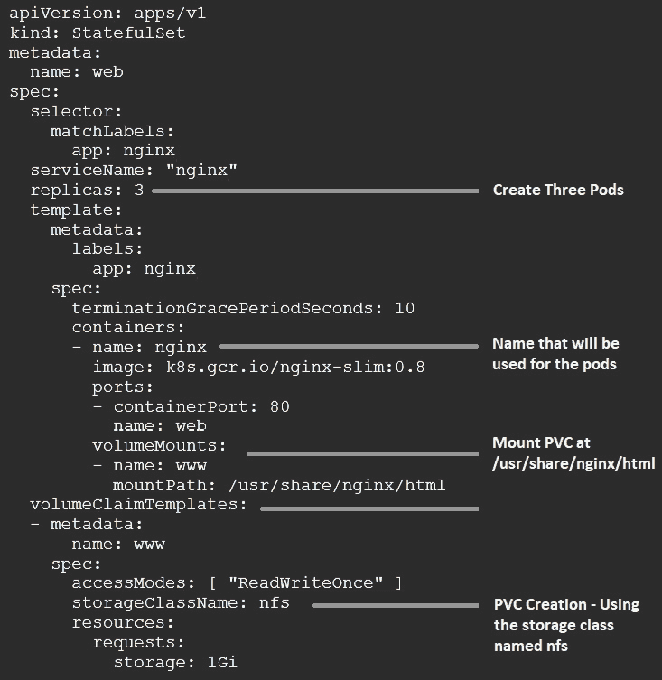

图 5.9–状态集合清单示例

现在，我们可以看看`StatefulSet`对象创建的对象。

清单规定应该有三个名为`nginx`的豆荚复制品。当我们得到一个 Pods 列表时，您会看到三个 Pods 是使用`nginx`名称创建的，带有一个附加的破折号和一个递增的数字。这就是我们在概述中提到将使用已知名称创建 Pods 时的意思，如以下代码片段所示:

```
NAME    READY   STATUS      RESTARTS   AGE
web-0    1/1    Running     0          4m6s
web-1    1/1    Running     0          4m2s
web-2    1/1    Running     0         3m52s
```

吊舱也是按顺序创建的——在创建`web-1`之前，必须完全展开`eb-0`，然后最后是`web-2`。

最后，对于这个例子，我们还使用清单中的`VolumeClaimTemplate`向每个 Pod 添加了一个聚氯乙烯。如果您查看`kubectl get pvc`命令的输出，您会看到创建了三个名称符合我们预期的 PVC(注意，由于空格，我们删除了`VOLUME`列)，如以下代码片段所示:

```
NAME        STATUS   CAPACITY   ACCESS MODES   STORAGECLASS   AGE
www-web-0   	Bound       1Gi             RWO            	      nfs            	    13m
www-web-1   	Bound       1Gi             RWO                       nfs            	    13m
www-web-2   	Bound    	   1Gi             RWO                       nfs            	    12m
```

在货单的`VolumeClaimTemplate`部分，您会看到我们将名称`www`分配给了聚氯乙烯索赔。当您在状态集中分配卷时，聚氯乙烯名称将结合索赔模板中使用的名称和 Pod 的名称。使用这个命名，你可以看到为什么Kubernetes分配了聚氯乙烯名称`www-web-0`、`www-web-1`和`www-web-2`。

### 水平自动缩放器

在 Kubernetes 集群上运行工作负载的最大优势之一是能够轻松扩展您的 Pods。虽然您可以使用`kubectl`命令或通过编辑清单的副本数量来进行缩放，但这些都不是自动的，需要手动干预。

**水平自动缩放器** ( **HPAs** )为提供了基于一组标准缩放应用的能力。使用 CPU 和内存使用量等指标，或者您自己的自定义指标，您可以设置一个规则，以便在需要更多 Pods 来维持服务级别时扩大 Pods。经过一段冷却时间后，Kubernetes 会将应用规模缩小到策略中定义的最小 Pods 数量。

为了快速为`nginx`部署创建 HPA，我们可以使用`autoscale`选项执行`kubectl`命令，如下所示:

```
kubectl autoscale deployment nginx --cpu-percent=50 --min=1 --max=5
```

您也可以创建一个 Kubernetes 清单来创建您的 HPA。使用与 CLI 中相同的选项，我们的清单将如下所示:

```
apiVersion: autoscaling/v1
KinD: HorizontalPodAutoscaler
metadata:
  name: nginx-deployment
spec:
  maxReplicas: 5
  minReplicas: 1
  scaleTargetRef:
    apiVersion: apps/v1
    KinD: Deployment
    name: nginx-deployment
  targetCPUUtilizationPercentage: 50
```

两个选项都将创建一个 HPA，当部署达到 50%的 CPU 利用率时，将我们的`nginx-deployment nginx`部署扩展到五个副本。一旦部署使用率低于 50%，并且达到冷却时间(默认为 5 分钟)，副本数量将减少到 1。

### CronJobs

如果你过去使用过 Linux cronjobs，那么你已经知道什么是 Kubernetes `CronJob`对象了。如果你没有 Linux 背景，一个 cronjob 被用来创建一个预定的任务。作为另一个例子，如果你是一个窗口人，它类似于窗口计划任务。

下面的代码片段显示了一个创建`CronJob`的示例清单:

```
apiVersion: batch/v1beta1
KinD: CronJob
metadata:
  name: hello-world
spec:
  schedule: "*/1 * * * *"
  jobTemplate:
    spec:
      template:
        spec:
          containers:
          - name: hello-world
            image: busybox
            args:
            - /bin/sh
            - -c
            - date; echo Hello World!
          restartPolicy: OnFailure
```

`schedule`格式遵循标准的`cron`格式。从左到右，每个`*`代表以下内容:

*   分钟(0–59)
*   小时(0 -23)
*   第(1 -31)天
*   月份(1-12)
*   一周中的某一天(0–6)(周日= 0，周六= 6)

Cron 作业接受步骤值，这允许您创建一个可以每分钟、每 2 分钟或每小时执行一次的计划。

我们的示例清单将创建一个`cronjob`，它每分钟运行一个名为`hello-world`的映像，并在 Pod 日志中输出`Hello World!`。

### 乔布斯

作业允许您执行一个或多个 Pod 的特定数量的执行。不像一个`cronjob`对象，这些 Pods 不是按照设定的时间表运行的，而是它们将在创建后执行。作业用于执行可能只需要在初始部署阶段执行的任务。

一个示例用例是一个应用，它可能需要创建 Kubernetes CRDs，该 CRDs 必须在部署主应用之前存在。部署将等待作业执行成功完成。

### 事件

事件对象存储Kubernetes对象的事件信息。您不创建事件；相反，您只能检索事件。例如，要检索`kube-system`名称空间的事件，您可以执行`kubectl get events -n kube-system`，或者要显示所有名称空间的事件，您可以执行`kubectl get events --all-namespaces`。

### 入口

您可能已经注意到对象在我们的`api-server`输出中被列出了两次。随着 Kubernetes 升级的发布和 API 服务器中对象的更改，这将发生在对象上。就入口而言，它是扩展应用编程接口的原始部分，在 1.16 版本中被移到了`networking.k8s.io`应用编程接口。该项目将等待几个版本后再取消旧的 API 调用，因此在我们的示例中集群运行 Kubernetes 1.17，使用任何一个 API 都可以。在 1.18 版本中，他们计划完全放弃入口扩展。

### 网络策略

`NetworkPolicy`对象允许您定义网络流量如何流经集群。它们允许你使用 Kubernetes 本地构造来定义哪些 Pods 可以与其他 Pods 对话。如果你曾经在**亚马逊网络服务** ( **AWS** )中使用安全组来锁定两组系统之间的访问，这是一个类似的概念。例如，以下策略将允许端口`443`上的流量从任何带有`app.kubernetes.io/name: ingress-nginx`标签的名称空间(这是`nginx-ingress`名称空间的默认标签)流向`myns`名称空间中的 Pods:

```
apiVersion: networking.k8s.io/v1
KinD: NetworkPolicy
metadata:
  name: allow-from-ingress
  namespace: myns
spec:
  PodSelector: {}
  policyTypes:
  - Ingress
  ingress:
  - from:
    - namespaceSelector:
        matchLabels:
          app.kubernetes.io/name: ingress-nginx    ports:
    - protocol: TCP
      port: 443
```

一个`NetworkPolicy`对象是另一个可以用来保护集群的对象。它们应该在所有生产集群中使用，但是在多租户集群中，它们应该被视为**必备的**来保护集群中的每个命名空间。

### 公共安全策略

`PodSecurityPolicies`(**PSP**)是集群保护节点免受容器攻击的方式。它们允许你限制吊舱在集群中可以执行的动作。一些示例包括拒绝对主机 IPC 和主机路径的访问，以及以特权模式运行容器。

我们将在 [*第 10 章*](10.html#_idTextAnchor260)*创建吊舱安全策略*中详细介绍 PSP。关于 PSP 要记住的关键点是，没有它们，你的容器几乎可以在你的节点上做任何事情。

### 集群角色绑定

一旦你定义了一个`ClusterRole`，你通过`ClusterRoleBinding`将其绑定到一个主体。`ClusterRole`可以绑定到用户、组或服务帐户。

我们将在第 8 章[](08.html#_idTextAnchor228)**【RBAC 策略与审计】*中详细探讨`ClusterRoleBinding`。*

 *### 集群角色

一个`ClusterRole`结合了一组与集群的应用编程接口交互的权限。一个`ClusterRole`将一个动词或动作与一个应用编程接口组结合起来定义一个权限。例如，如果您只希望您的**持续集成/持续交付** ( **CI/CD** )管道能够修补您的部署，以便它能够更新您的映像标签，您可以使用这样的`ClusterRole`:

```
apiVersion: rbac.authorization.k8s.io/v1
KinD: ClusterRole
metadata:
  name: patch-deployment
rules:
- apiGroups: ["apps/v1"]
  resources: ["deployments"]
  verbs: ["get", "list", "patch"]
```

A `ClusterRole`可以应用于集群和命名空间级别的 API。

### 角色绑定

`RoleBinding`对象是如何将角色或`ClusterRole`与主题和名称空间相关联。例如，以下`RoleBinding`对象将允许`aws-codebuild`用户将`patch-openunison`集群角色应用于`openunison`命名空间:

```
apiVersion: rbac.authorization.k8s.io/v1
KinD: RoleBinding
metadata:
  name: patch-openunison
  namespace: openunison
subjects:
- KinD: User
  name: aws-codebuild
  apiGroup: rbac.authorization.k8s.io
roleRef:
  KinD: ClusterRole
  name: patch-deployment
  apiGroup: rbac.authorization.k8s.io
```

即使这引用了一个`ClusterRole`，它也只适用于`openunison`命名空间。如果`aws-codebuild`用户试图在另一个名称空间中修补部署，应用编程接口服务器将停止它。

### 角色

与`ClusterRole`一样，角色结合应用编程接口组和动作来定义一组可以分配给主题的权限。`ClusterRole`和`Role`的区别在于`Role`只能在名称空间级别定义资源，并且只适用于特定的名称空间。

### CsiDrivers

Kubernetes 使用`CsiDriver`对象将节点连接到存储系统。

通过执行`kubectl get csidriver`命令，您可以列出集群上可用的所有 CSI 驱动程序。在我们的一个集群中，我们使用 Netapp 的 SolidFire 进行存储，因此我们的集群安装了 Trident CSI 驱动程序，如下所示:

```
NAME                    	CREATED AT
csi.trident.netapp.io   	2019-09-04T19:10:47Z
```

### CsiNodes

为了避免在节点应用编程接口对象中存储存储信息，将`CSINode`对象添加到应用编程接口服务器中以存储由 CSI 驱动程序生成的信息。存储的信息包括将 Kubernetes 节点名映射到 CSI 节点名、CSI 驱动程序可用性和卷拓扑。

### 存储评估

存储类用于定义存储端点。每个存储类都可以分配标签和策略，允许开发人员为他们的持久数据选择最佳存储位置。您可以为具有所有**非易失性内存快速通道** ( **NVMe** )驱动器的后端系统创建一个存储类，为其分配名称`fast`，同时为运行标准驱动器的 Netapp **网络文件系统** ( **NFS** )卷分配一个不同的类，使用名称`standard`。

当请求一个聚氯乙烯时，用户可以分配一个他们希望使用的`StorageClass`。当应用编程接口服务器收到请求时，它会找到匹配的名称，并使用`StorageClass`配置使用资源调配器在存储系统上创建卷。

在很高的层次上，一份`StorageClass`清单不需要很多信息。下面是一个存储类示例，该存储类使用 Kubernetes 孵化器项目中的置备程序来提供 NFS 自动置备卷，命名为`nfs`:

```
apiVersion: storage.k8s.io/v1 KinD: StorageClass
metadata:
  name: nfs
provisioner: nfs 
```

存储类允许您为用户提供多种存储解决方案。您可以为更便宜、更慢的存储创建一个类别，同时为高数据要求提供支持高吞吐量的第二个类别。通过为每个产品提供不同的类，您允许开发人员为他们的应用选择最佳选择。

# 总结

在这一章中，你被扔进了一个 Kubernetes 训练营，在短时间内展示了大量的技术材料。试着记住，当你更深入地进入Kubernetes世界时，这一切都会变得更容易。我们意识到这一章有很多关于很多物体的信息。许多对象将在后面的章节中使用，它们将被更详细地解释。

您了解了每个 Kubernetes 组件以及它们如何交互来创建集群。有了这些知识，您就具备了查看集群中的错误并确定哪个组件可能导致错误或问题所需的技能。我们介绍了运行`api-server`、`kube-scheduler`、Etcd 和控制管理器的集群的控制平面。控制平面是用户和服务如何与集群交互；使用`api-server`和`kube-scheduler`将决定在哪个工作节点上调度您的 Pod。您还了解了运行`kubelet`和`kube-proxy`组件的 Kubernetes 节点，以及一个容器运行时。

我们介绍了用于与集群交互的`kubectl`实用程序。您还学习了一些日常使用的常用命令，包括`logs`和`describe`。

在下一章中，我们将创建一个开发 Kubernetes 集群，我们将把它用作其余章节的基础集群。在本书的剩余部分，我们将参考本章中介绍的许多对象，通过在现实世界的例子中使用它们来帮助解释它们。

# 问题

1.  A Kubernetes control plane does not include which of the following components?

    A.`api-server`

    B.`kube-scheduler`

    C.和 cd

    D.入口控制器

2.  What is the name of the component that keeps all of the cluster information?

    A.`api-server`

    B.主控制器

    C.`kubelet`

    D.和 cd

3.  Which component is responsible for selecting the node that will run a workload?

    A.`kubelet`

    B.`api-server`

    C.`kube-scheduler`

    D.`Pod-scheduler`

4.  Which option would you add to a `kubectl` command to see additional output from a command?

    A.`Verbose`

    B.`-v`

    C.`–verbose`

    D.`-log`

5.  Which service type creates a randomly generated port, allowing incoming traffic to any worker node on the assigned port to access the service?

    A.`LoadBalancer`

    B.`ClusterIP`

    C.无—这是所有服务的默认值

    D.`NodePort`

6.  If you need to deploy an application on a Kubernetes cluster that requires known node names and a controlled startup of each Pod, which object would you create?

    A.`StatefulSet`

    B.`Deployment`

    C.`ReplicaSet`

    D.`ReplicationController`*