# 六、服务、负载平衡和外部域名系统

当您将一个应用部署到 Kubernetes 集群时，我们的豆荚会被分配短暂的 IP 地址。由于分配的地址可能会随着 pod 的重新启动而改变，因此您永远不应该使用 pod IP 地址来定位服务；相反，您应该使用服务对象，它将根据标签将服务 IP 地址映射到后端 pods。如果您需要为外部请求提供服务访问，您可以部署一个入口控制器，它将根据每个网址向外部流量公开您的服务。对于更高级的工作负载，您可以部署负载平衡器，它为您的服务提供外部 IP 地址，允许您向外部请求公开任何基于 IP 的服务。

我们将解释如何通过在我们的 KinD 集群上部署它们来实现这些。为了帮助我们理解入口如何工作，我们将向集群部署一个 NGINX 入口控制器，并公开一个网络服务器。由于入口规则基于传入的网址名称，我们需要能够提供稳定的域名。在企业环境中，这将使用标准的域名系统来完成。由于我们使用的是没有 DNS 服务器的开发环境，因此我们将使用 nip.io 的流行服务。

在这一章的最后，我们将解释如何使用 ETCD 集成 dns 区域和 Kubernetes 孵化器项目“外部 DNS”来动态注册服务名称。

在本章中，我们将涵盖以下主题:

*   将工作负载暴露给请求
*   负载平衡器简介
*   第 7 层负载平衡器
*   第 4 层负载平衡器
*   使服务名对外可用

# 技术要求

本章有以下技术要求:

*   一台新的 Ubuntu 18.04 服务器，内存至少为 4 GB。
*   使用第 4 章 中的配置配置的 KinD 集群，使用 KinD 部署 Kubernetes。

您可以在 GitHub 资源库[中访问本章的代码。](https://github.com/PacktPublishing/Kubernetes-and-Docker-The-Complete-Guide)

# 将工作负载暴露给请求

Kubernetes 中最容易被误解的三个对象是服务、入口控制器和负载平衡器。为了展示您的工作负载，您需要了解每个对象是如何工作的，以及您可以使用的选项。让我们详细看看这些。

## 了解服务如何工作

正如我们在介绍中提到的，任何运行工作负载的 pod 在 pod 启动时都会被分配一个 IP 地址。许多事件会导致部署重新启动 pod，当 pod 重新启动时，它可能会收到一个新的 IP 地址。由于分配给 pod 的地址可能会改变，因此您永远不要直接针对 pod 的工作负载。

Kubernetes 提供的最强大的功能之一是能够扩展您的部署。当扩展部署时，Kubernetes 将创建额外的单元来处理任何额外的资源需求。每个 pod 都有一个 IP 地址，您可能知道，大多数应用只针对一个 IP 地址或名称。如果您的应用从单个吊舱扩展到十个吊舱，您将如何利用额外的吊舱？

服务使用 Kubernetes 标签在服务本身和运行工作负载的 pods 之间创建动态映射。运行工作负载的单元在启动时会被标记。每个 pod 都有部署中定义的相同标签。例如，如果我们在部署中使用 NGINX web 服务器，我们将创建一个部署，其清单如下:

```
apiVersion: apps/v1
kind: Deployment
metadata:
  creationTimestamp: null
  labels:
    run: nginx-frontend
  name: nginx-frontend
spec:
  replicas: 3
  selector:
    matchLabels:
      run: nginx-frontend
  strategy: {}
  template:
    metadata:
      labels:
        run: nginx-frontend
    spec:
      containers:
      - image: bitnami/nginx
        name: nginx-frontend
```

该部署将创建三个 NGINX 服务器，每个 pod 都标有`run=nginx-frontend`。我们可以通过使用 kubectl 列出豆荚，添加`the --show-labels`选项`kubectl get pods --show-labels.`来验证豆荚是否被正确标记

这将列出每个 pod 和任何相关标签:

```
nginx-frontend-6c4dbf86d4-72cbc           1/1     Running            0          19s    pod-template-hash=6c4dbf86d4,run=nginx-frontend
nginx-frontend-6c4dbf86d4-8zlwc           1/1     Running            0          19s    pod-template-hash=6c4dbf86d4,run=nginx-frontend
nginx-frontend-6c4dbf86d4-xfz6m           1/1     Running            0          19s    pod-template-hash=6c4dbf86d4,run=nginx-frontend
```

从前面的输出中可以看到，每个吊舱都有一个标签`run=nginx-frontend`。当您为应用创建服务时，您将使用此标签，将服务配置为使用标签来创建端点。

### 创建服务

现在您已经知道了服务将如何使用标签来创建端点，让我们讨论一下我们在 Kubernetes 中拥有的服务选项。

本节将介绍每种服务类型，并向您展示如何创建服务对象。每种类型将在一般性介绍后的单独章节中详细介绍。

Kubernetes 服务可以使用以下四种类型之一来创建:

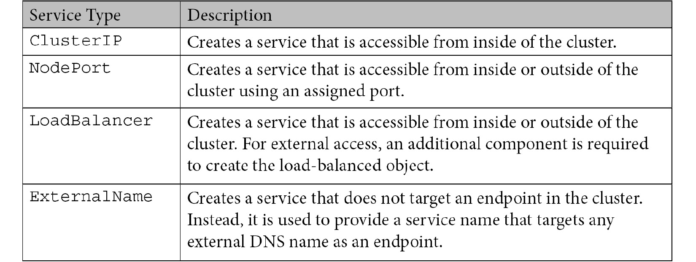

表 6.1:固定服务模式

要创建一个服务，您需要创建一个服务对象，该服务对象包括`kind`、一个`selector`、一个`type`以及将用于连接到该服务的任何`ports`。对于我们的 NGINX 部署，我们希望在端口 80 和 443 上公开该服务。我们用`run=nginx-frontend`标记部署，因此当我们创建清单时，我们将使用该名称作为我们的选择器:

```
apiVersion: v1
kind: Service
metadata:
  labels:
    run: nginx-frontend
  name: nginx-frontend
spec:
  selector:
    run: nginx-frontend
  ports:
  - name: http
    port: 80
    protocol: TCP
    targetPort: 80
  - name: https
    port: 443
    protocol: TCP
    targetPort: 443
  type: ClusterIP
```

如果服务清单中没有定义类型，Kubernetes 将分配一个默认类型`ClusterIP`。

现在已经创建了一个服务，我们可以使用几个`kubectl`命令来验证它是否被正确定义。我们将执行的第一项检查是验证服务对象是否已创建。要检查我们的服务，我们使用`kubectl get services`命令:

```
NAME                   TYPE          CLUSTER-IP    EXTERNAL-IP   PORT(S)                  AGE nginx-frontend   ClusterIP   10.43.142.96  <none>            80/TCP,443/TCP   3m49s
```

在验证服务已经创建之后，我们可以验证端点已经创建。使用 kubectl，我们可以通过执行`kubectl get ep <service name>`来验证端点:

```
NAME                  ENDPOINTS                                                                                            AGE
nginx-frontend   10.42.129.9:80,10.42.170.91:80,10.42.183.124:80 + 3 more...   7m49s
```

我们可以看到服务显示了三个端点，但是它也在端点列表中显示了一个`+3 more`。由于输出被截断，get 的输出是有限的，它不能显示所有的端点。由于我们无法看到整个列表，如果我们描述端点，我们可以获得更详细的列表。使用 kubectl，您可以执行`kubectl describe ep <service name>`命令:

```
Name:         nginx-frontend
Namespace:    default
Labels:       run=nginx-frontend
Annotations:  endpoints.kubernetes.io/last-change-trigger-time: 2020-04-06T14:26:08Z
Subsets:
  Addresses:          10.42.129.9,10.42.170.91,10.42.183.124
  NotReadyAddresses:  <none>
  Ports:
    Name   Port  Protocol
    ----         ----    --------
    http      80      TCP
    https  443   TCP
Events:  <none>
```

如果您比较我们的`get`和`describe`命令的输出，可能会出现端点不匹配的情况。`get`命令总共显示了六个端点:它显示了三个 IP 端点，因为它被截断了，它还列出了一个`+3`，总共六个端点。`describe`命令的输出只显示了三个 IP 地址，而不是六个。为什么两个输出显示不同的结果？

`get`命令将列出地址列表中的每个端点和端口。由于我们的服务被定义为公开两个端口，每个地址将有两个条目，每个公开的端口一个。地址列表将始终包含服务的每个套接字，这可能会多次列出端点地址，每个套接字一次。

`describe`命令以不同的方式处理输出，在一行列出地址，所有端口都列在地址下面。乍一看，它可能看起来像`describe`命令缺少三个地址，但由于它将输出分成多个部分，它将只列出一次地址。所有端口都在地址列表下面；在我们的示例中，它显示了端口 80 和 443。

这两个命令显示相同的数据，但是呈现的格式不同。

现在服务暴露给集群，您可以使用分配的服务 IP 地址连接到应用。虽然这是可行的，但是如果删除并重新创建服务对象，地址可能会改变。您应该使用创建服务时分配给该服务的 DNS，而不是以 IP 地址为目标。在下一节中，我们将解释如何使用内部域名解析服务。

### 使用域名系统解析服务

在物理机和虚拟服务器的世界中，你可能已经瞄准了一个 DNS 记录来与服务器进行通信。如果服务器的 IP 地址发生了变化，那么假设您启用了动态 DNS，它不会对应用产生任何影响。这就是使用名称而不是 IP 地址作为端点的优势。

创建服务时，会创建一个内部 DNS 记录，集群中的其他工作负载可以查询该记录。如果所有的 pods 都在同一个名称空间中，那么我们可以使用一个简单、简短的名称来定位服务，比如，`mysql-web`；但是，您可能有一些服务将被多个命名空间使用，当工作负载需要与它们自己的命名空间之外的服务通信时，您必须使用全名来定位该服务。下面是一个示例表，显示了如何从名称空间中定位服务:

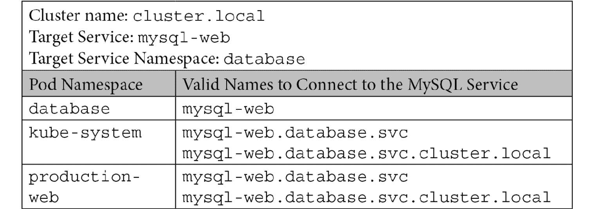

表 6.2:内部域名系统示例

从上表中可以看到，您可以使用标准命名约定*来定位另一个命名空间中的服务。<名称空间> .svc. <集群名称>* 。在大多数情况下，当访问不同名称空间的服务时，您不需要添加集群名称，因为它应该自动追加。

为了构建一般服务概念，让我们深入了解每种类型的细节，以及如何使用它们来访问我们的工作负载。

## 了解不同的服务类型

创建服务时需要指定服务类型。分配的服务类型将配置服务如何暴露给集群或外部流量。

### 集群 IP 服务

最常用，也最容易被误解的服务类型是集群 IP。如果您回顾我们的表格，您可以看到集群 IP 类型的描述指出服务允许从集群内部连接到服务。ClusterIP 类型不允许任何外部流量进入公开的服务。

将服务仅暴露给内部集群工作负载的想法可能是一个令人困惑的概念。为什么要公开只能由集群中的工作负载使用的服务？

一分钟，让我们完全忘记外部流量。我们需要专注于我们当前的部署以及每个组件如何交互来创建我们的应用。使用 NGINX 示例，我们将扩展部署，以包括一个为 web 服务器服务的后端数据库。

我们的应用将有两个部署，一个用于 NGINX 服务器，一个用于数据库服务器。NGINX 部署将创建五个副本，而数据库服务器将由一个副本组成。NGINX 服务器需要连接到数据库服务器来为网页提取数据。

到目前为止，这是一个简单的应用:我们已经创建了我们的部署，一个名为网络前端的 NGINX 服务器服务，以及一个名为`mysql-web`的数据库服务。为了从 web 服务器配置数据库连接，我们决定使用一个以数据库服务为目标的配置图。我们在配置映射中使用什么作为数据库的目标？

你可能会想，既然我们使用的是单个数据库服务器，我们可以简单地使用 IP 地址。虽然这在最初是可行的，但是对 pod 的任何重启都会改变地址，并且网络服务器将无法连接到数据库。应该始终使用服务，即使您只针对单个 pod。由于数据库部署称为 mysql-web，因此我们的 ConfigMap 应该使用该名称作为数据库服务器。

通过使用服务名称，当 pod 重新启动时，我们将不会遇到问题，因为服务的目标是标签而不是 IP 地址。我们的网络服务器将简单地向 Kubernetes DNS 服务器查询服务名称，该名称将包含具有匹配标签的任何 pod 的端点。

### 节点端口服务

节点端口服务将向集群内部以及网络外部公开您的服务。乍一看，当你想要公开一个服务时，这可能看起来像是进入服务。它向所有人公开您的服务，但是它是通过使用一种叫做节点端口的东西来实现的，并且使用它进行外部服务访问可能变得难以维护。当用户需要通过网络访问服务时，使用节点端口或记住它们也非常令人困惑。

要创建使用节点端口类型的服务，您只需要在清单中将类型设置为节点端口。我们可以使用与之前公开集群 IP 示例中的 NGINX 部署相同的清单，只是将`type`更改为`NodePort`:

```
apiVersion: v1
kind: Service
metadata:
  labels:
    run: nginx-frontend
  name: nginx-frontend
spec:
  selector:
    run: nginx-frontend
  ports:
  - name: http
    port: 80
    protocol: TCP
    targetPort: 80
  - name: https
    port: 443
    protocol: TCP
    targetPort: 443
  type: NodePort
```

我们可以使用 kubectl 来查看端点，就像我们查看集群 IP 服务的一样。运行`kubectl get services`将向您显示新创建的服务:

```
NAME                    TYPE           CLUSTER-IP         EXTERNAL-IP   PORT(S)                                         AGE
nginx-frontend    NodePort   10.43.164.118   <none>            80:31574/TCP,443:32432/TCP   4s
```

输出显示类型是节点端口，并且我们已经公开了服务的 IP 地址和端口。如果您查看端口，您会注意到，与集群 IP 服务不同，节点端口服务显示两个端口，而不是一个。第一个端口是内部集群服务可以瞄准的公开端口，第二个端口号是随机生成的端口，可以从集群外部访问。

由于我们为服务公开了两个端口 80 和 443，我们将分配两个节点端口。如果有人需要从集群外部定位服务，他们可以定位具有所提供端口的任何工作节点来访问服务:

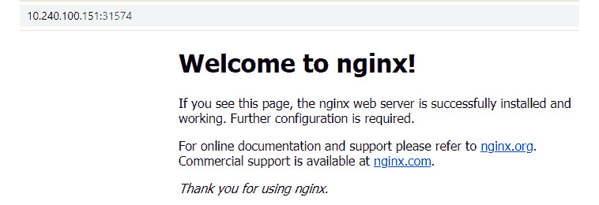

图 6.1–使用节点端口的 NGINX 服务

每个节点维护一个节点端口及其分配服务的列表。由于该列表与所有节点共享，因此您可以使用该端口定位任何正常运行的节点，Kubernetes 会将其路由到一个正在运行的 pod。

为了可视化流量，我们创建了一个图形，向 NGINX 窗格显示网络请求:

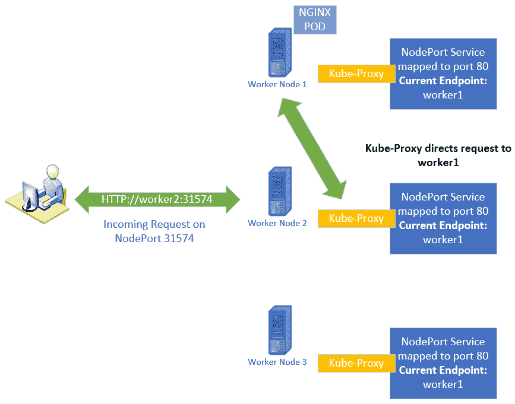

图 6.2–节点端口流量概述

使用节点端口公开服务时，需要考虑一些问题:

*   如果删除并重新创建服务，分配的节点端口将会改变。
*   如果您的目标节点离线或有问题，您的请求将失败。
*   将节点端口用于太多服务可能会令人困惑。您需要记住每个服务的端口，并且记住没有与服务相关联的*外部*名称。这可能会让以集群中的服务为目标的用户感到困惑。

由于这里列出的限制，您应该限制使用节点端口服务。

### 负载平衡器服务

许多人从 Kubernetes 开始阅读服务，发现负载平衡器类型会为服务分配一个外部 IP 地址。由于外部 IP 地址可以由网络上的任何机器直接寻址，这对于服务来说是一个有吸引力的选择，这就是为什么许多人首先尝试使用它。不幸的是，由于许多用户从使用本地 Kubernetes 集群开始，他们在尝试创建负载平衡器服务时遇到了麻烦。

负载平衡器服务依赖于与 Kubernetes 集成的外部组件来创建分配给该服务的 IP 地址。大多数内部 Kubernetes 安装不包括这种类型的服务。当您尝试使用没有支持基础设施的负载平衡器服务时，您会发现您的服务在`EXTERNAL-IP`状态列中显示`<pending>`。

我们将在本章后面解释负载平衡器服务以及如何实现它。

### 外部名称服务

ExternalName 服务是具有特定用例的唯一服务类型。当您查询使用外部名称类型的服务时，最终端点不是运行在集群中的 pod，而是外部域名。

举一个您在 Kubernetes 之外可能很熟悉的例子，这类似于使用`c-name`给主机记录加别名。当您在域名系统中查询`c-name`记录时，它会解析为主机记录，而不是 IP 地址。

在使用此服务类型之前，您需要了解它可能会给您的应用带来的潜在问题。如果目标端点使用 SSL 证书，您可能会遇到问题。由于您正在查询的主机名可能与目标服务器证书上的名称不同，因此您的连接可能不会成功，因为名称不匹配。如果您发现自己处于这种情况，您可能可以使用证书中添加了**主题备选名称** ( **SAN** )的证书。向证书添加替代名称允许您将多个名称与一个证书相关联。

为了解释为什么您可能想要使用 ExternalName 服务，让我们使用以下示例:

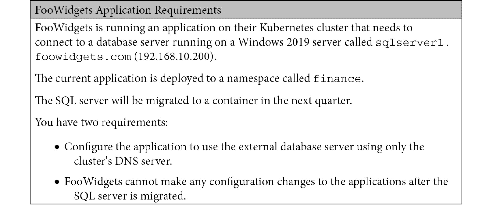

根据需求，使用 ExternalName 服务是完美的解决方案。那么，我们将如何完成要求呢？(这是一个理论练习；您不需要在您的 KinD 集群上执行任何东西)

1.  第一步是创建一个清单，该清单将为数据库服务器创建 ExternalName 服务:

    ```
    apiVersion: v1
    kind: Service
    metadata:
      name: sql-db
      namespace: finance
    spec:
      type: ExternalName
      externalName: sqlserver1.foowidgets.com
    ```

2.  创建服务后，下一步是将应用配置为使用新服务的名称。由于服务和应用在同一个名称空间中，您可以将应用配置为以名称`sql-db`为目标。
3.  现在，当应用查询`sql-db`时，会解析到`sqlserver1.foowidgets.com`，最终解析到 192.168.10.200 的 IP 地址。

这实现了最初的要求，只使用 Kubernetes DNS 服务器将应用连接到外部数据库服务器。

您可能想知道为什么我们不简单地配置应用来直接使用数据库服务器名称。关键是第二个要求，当 SQL server 迁移到容器时，限制任何重新配置。

由于在将 SQL server 迁移到集群后，我们无法重新配置应用，因此将无法在应用设置中更改 SQL server 的名称。如果我们将应用配置为使用原始名称`sqlserver1.foowidgets.com`，则迁移后应用将无法工作。通过使用 ExternalName 服务，我们能够通过用指向 SQL 服务器的标准 Kubernetes 服务替换 ExternalHost 服务名称来更改内部 DNS 服务名称。

要实现第二个目标，请执行以下步骤:

1.  删除`ExternalName`服务。
2.  使用名称`ext-sql-db`创建一个新服务，使用`app=sql-app`作为选择器。清单看起来像这里显示的:

    ```
    apiVersion: v1
    kind: Service
    metadata:
      labels:
        app: sql-db
      name: sql-db
      namespace: finance
      ports:
      - port: 1433
        protocol: TCP
        targetPort: 1433
        name: sql
      selector:
        app: sql-app
      type: ClusterIP
    ```

由于我们为新服务使用相同的服务名称，因此不需要对应用进行任何更改。应用仍将以名称`sql-db`为目标，该名称现在将使用部署在集群中的 SQL 服务器。

现在您已经了解了服务，我们可以继续讨论负载平衡器，它将允许您使用标准的 URL 名称和端口向外部公开服务。

# 负载平衡器简介

在讨论不同类型的负载平衡器之前，了解**开放系统互连** ( **OSI** )模型很重要。了解现场视察模型的不同层将有助于您理解不同的解决方案如何处理传入的请求。

## 了解现场视察模型

当您听说在 Kubernetes 中公开应用的不同解决方案时，您通常会在这里提到第 7 层或第 4 层负载平衡。这些名称指的是各自在现场视察模型中的运行位置。每一层提供不同的功能；运行在第 7 层的组件提供与第 4 层组件不同的功能。

首先，让我们看一下这七个层的简要概述以及每个层的描述。对于本章，我们对两个突出显示的部分**第 4 层和第 7 层**感兴趣:

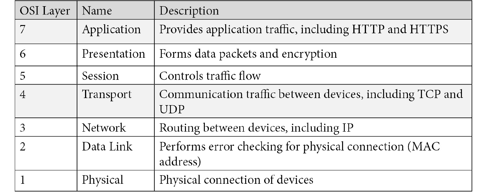

表 6.3 现场视察模型层

您不需要成为现场视察层的专家，但您应该了解第 4 层和第 7 层负载平衡器提供了什么，以及它们各自如何用于集群。

让我们更深入地了解第 4 层和第 7 层的细节:

*   **第 4 层**:如图表描述所述，第 4 层负责设备间的通信流量。运行在第 4 层的设备可以访问 TCP/UPD 信息。基于第 4 层的负载平衡器使您的应用能够为任何 TCP/UDP 端口的传入请求提供服务。
*   **第 7 层**:第 7 层负责为应用提供网络服务。当我们说应用流量时，我们指的不是 Excel 或 Word 等应用；相反，我们指的是支持应用的协议，比如 HTTP 和 HTTPS。

在下一节中，我们将解释每种负载平衡器类型，以及如何在 Kubernetes 集群中使用它们来公开您的服务。

# 第 7 层负载平衡器

Kubernetes 以入口控制器的形式提供第 7 层负载平衡器。有许多解决方案可以为您的集群提供入口，包括:

*   NGINX
*   使者
*   特拉菲克
*   哈普西

通常，第 7 层负载平衡器的功能有限。在 Kubernetes 世界中，它们被实现为入口控制器，可以将传入的 HTTP/HTTPS 请求路由到您公开的服务。我们将在*创建入口规则*部分详细介绍如何将 NGINX 实现为 Kubernetes 入口控制器。

## 名称解析和第 7 层负载平衡器

要在 Kubernetes 集群中处理第 7 层流量，您需要部署一个入口控制器。入口控制器依赖传入的名称将流量路由到正确的服务。在传统服务器部署模型中，您将创建一个 DNS 条目，并将其映射到一个 IP 地址。

部署在 Kubernetes 集群上的应用没有什么不同，用户将使用域名来访问应用。

通常，您会创建一个新的通配符域，通过外部负载平衡器(如 F5、HAproxy 或跷跷板)来定位入口控制器。

让我们假设我们的公司叫做 FooWidgets，我们有三个 Kubernetes 集群，由一个带有多个入口控制器端点的外部负载平衡器作为前端。我们的 DNS 服务器将为每个集群提供条目，使用指向负载平衡器虚拟 IP 地址的通配符域:

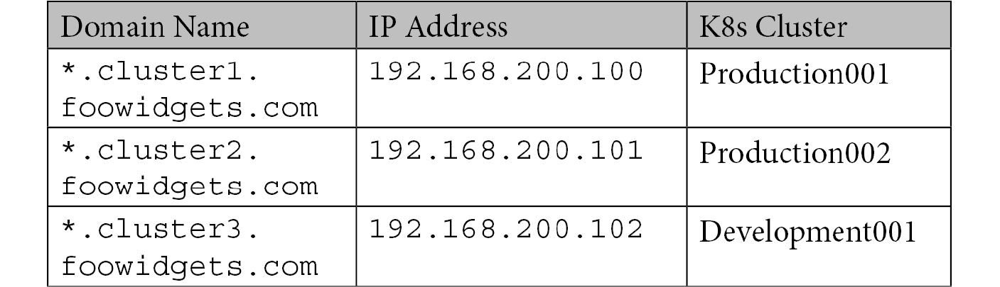

表 6.4 入口的通配符域名示例

下图显示了请求的整个流程:

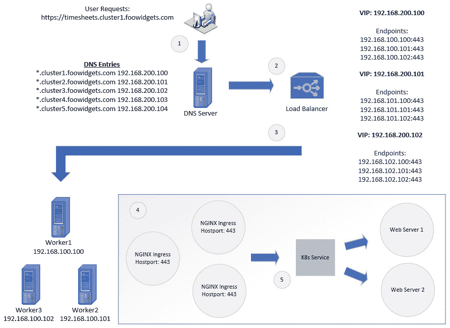

图 6.3–多名称入口流量

图 6.3 中的每个步骤都在这里详细说明:

1.  使用浏览器，用户请求网址[https://timesheets.cluster1.foowidgets.com](https://timesheets.cluster1.foowidgets.com)。
2.  域名系统查询被发送到域名系统服务器。DNS 服务器查找`cluster1.foowidgets.com`的区域详细信息。DNS 区域中有一个条目解析为在负载平衡器上为域分配的 VIP。
3.  `cluster1.foowidgets.com`负载平衡器的 VIP 分配了三个后端服务器，指向我们部署了入口控制器的三个工作节点。
4.  使用其中一个端点，请求被发送到入口控制器。
5.  入口控制器会将请求的网址与入口规则列表进行比较。当找到匹配的请求时，入口控制器将把请求转发给分配给入口规则的服务。

为了帮助加强入口的工作方式，它将有助于在集群上创建入口规则，以查看它们的运行情况。现在，关键要点是入口使用请求的网址将流量导向正确的 Kubernetes 服务。

## 使用 nip.io 进行名称解析

大多数个人开发集群，比如我们的 KinD 安装，可能没有足够的权限向 DNS 服务器添加记录。为了测试入口规则，我们需要针对由入口控制器映射到 Kubernetes 服务的唯一主机名。如果没有 DNS 服务器，您需要创建一个本地主机文件，其中多个名称指向入口控制器的 IP 地址。

例如，如果您部署了四个 web 服务器，您需要将这四个名称都添加到您的本地主机中。这里显示了一个例子:

`192.168.100.100 webserver1.test.local`

`192.168.100.100 webserver2.test.local`

`192.168.100.100 webserver3.test.local`

`192.168.100.100 webserver4.test.local`

这也可以用一行而不是多行来表示:

`192.168.100.100 webserver1.test.local webserver2.test.local webserver3.test.local webserver4.test.local`

如果您使用多台计算机来测试您的部署，您将需要在计划用于测试的每台计算机上编辑主机文件。在多台机器上维护多个文件是一个管理上的噩梦，并且会导致使测试成为一个挑战的问题。

幸运的是，有免费的服务可以提供我们可以使用的 DNS 服务，而不需要为我们的 KinD 集群配置复杂的 DNS 基础设施。

Nip.io 是我们将用于我们的 KinD 集群名称解析需求的服务。使用我们之前的网络服务器示例，我们将不需要创建任何 DNS 记录。我们仍然需要将不同服务器的流量发送到运行在 192.168.100.100 上的 NGINX 服务器，这样【Ingress 就可以将流量路由到适当的服务。Nip.io 使用包含主机名中的 ip 地址的命名格式将名称解析为 IP。例如，假设我们有四个要测试的 web 服务器，称为 webserver1、webserver2、webserver3 和 webserver4，在 192.168.100.100 上运行的入口控制器上有入口规则。

正如我们前面提到的，我们不需要创建任何记录来实现这一点。相反，我们可以使用命名约定让 nip.io 为我们解析名称。每个 web 服务器将使用具有以下命名标准的名称:

`<desired name>.<INGRESS IP>.nip.io`

下表列出了所有四个 web 服务器的名称:

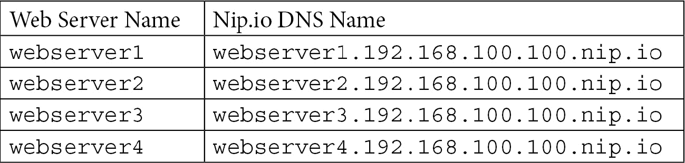

表 6.5–Nip . io 域名示例

当您使用任何前面的名称时，nip.io 会将它们解析为 192.168.100.100。您可以在下面的截图中看到每个名称的 ping 示例:

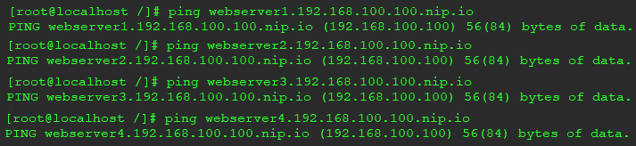

图 6.4–使用 nip.io 的名称解析示例

这可能看起来没有什么好处，因为您在名称中提供了 IP 地址。如果你知道 ip 地址，为什么还需要麻烦使用 nip.io？

请记住入口规则需要一个唯一的名称来将流量路由到正确的服务。虽然您可能不需要该名称来了解服务器的 IP 地址，但入口规则需要该名称。每个名字都是唯一的，使用全名的第一部分——在我们的例子中，即`webserver1`、`webserver2`、`webserver3`和`webserver4`。

通过提供这项服务，nip.io 允许您为入口规则使用任何名称，而不需要在您的开发集群中有一个 DNS 服务器。

现在，您已经知道如何使用 nip.io 来解析集群的名称，让我们解释一下如何在 Ingress 规则中使用 nip.io 名称。

## 创建入口规则

请记住，入口规则使用名称将传入的请求路由到正确的服务。以下是传入请求的图形表示，显示了入口如何路由流量:


图 6.5–入口流量

图 6.5 显示了 Kubernetes 如何处理传入的入口请求的高级概述。为了帮助更深入地解释每一步，让我们更详细地看一下这五个步骤。使用图 6.5 中提供的图形，我们将详细解释每个编号的步骤，以展示 Igress 如何处理请求:

1.  用户在其浏览器中请求一个名为 web server 1 . 192 . 168 . 200 . 20 . nio . io 的 URL。一个 DNS 请求被发送到本地 DNS 服务器，该服务器最终被发送到 nip.io DNS 服务器。
2.  nip.io 服务器将域名解析为 ip 地址 192.168.200.20，并返回给客户端。
3.  客户端将请求发送到运行在 192.168.200.20 上的入口控制器。该请求包含完整的网址名称**web server 1 . 192 . 168 . 200 . 20 . nio . io**。
4.  入口控制器在配置的规则中查找请求的网址名称，并将该网址名称与服务匹配。
5.  服务端点将用于将流量路由到分配的 pods。
6.  该请求被路由到运行 web 服务器的端点 pod。

使用前面的流量流示例，让我们看一下需要创建的 Kubernetes 对象:

1.  首先，我们需要一个运行在命名空间中的简单 web 服务器。我们将简单地在默认命名空间中部署一个基本的 NGINX 服务器。我们可以使用以下`kubectl run`命令快速创建部署，而不是手动创建清单:

    ```
    kubectl run nginx-web --image bitnami/nginx
    ```

2.  使用`run`选项是一个快捷方式，它将在默认命名空间中创建一个名为`nginx-web`的部署。您可能会注意到，输出将向您发出警告，说明运行已被否决。这只是一个警告；它仍将创建我们的部署，尽管使用`run`创建部署在未来的 Kubernetes 版本中可能不起作用。
3.  Next, we need to create a service for the deployment. Again, we will create a service using a kubectl command, `kubectl expose`. The Bitnami NGINX image runs on port 8080, so we will use the same port to expose the service:

    ```
    kubectl expose deployment nginx-web --port 8080 --target-port 8080
    ```

    这将为我们的部署创建一个名为 nginx-web 的新服务，称为 nginx-web。

4.  Now that we have our deployment and service created, the last step is to create the Ingress rule. To create an Ingress rule, you create a manifest using the object type `Ingress`. The following is an example Ingress rule that assumes that the Ingress controller is running on 192.168.200.20\. If you are creating this rule on your host, you should use the **IP address of your Docker host**.

    创建一个名为`nginx-ingress.yaml`的文件，内容如下:

    ```
    apiVersion: networking.k8s.io/v1beta1
    kind: Ingress
    metadata:
      name: nginx-web-ingress
    spec:
      rules:
      - host: webserver1.192.168.200.20.nip.io
        http:
          paths:
          - path: /
            backend:
              serviceName: nginx-web
              servicePort: 8080
    ```

5.  使用`kubectl apply` :

    ```
    kubectl apply -f nginx-ingress.yaml
    ```

    创建入口符文
6.  您可以通过浏览入口网址`http:// webserver1.192.168.200.20.nip.io`，从内部网络上的任何客户端测试部署。
7.  如果一切都创建成功，您应该会看到 NGINX 欢迎页面:

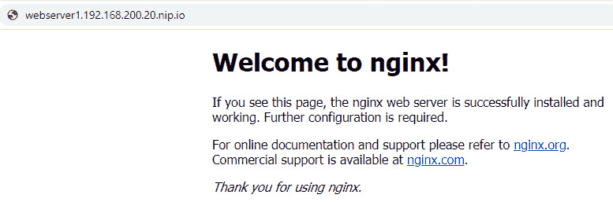

图 6.6–将 nip.io 用于入口的 NGINX 网络服务器

使用本节中的信息，您可以为使用不同主机名的多个容器创建入口规则。当然，你并不局限于使用像 nip.io 这样的服务来解析名字；您可以使用环境中可用的任何名称解析方法。在生产集群中，您将拥有企业 DNS 基础架构，但在实验室环境中，例如我们的 KinD 集群，nip.io 是测试需要适当命名约定的场景的完美工具。

我们将在整本书中使用 nip.io 命名标准，因此在进入下一章之前，了解命名约定非常重要。

第 7 层负载平衡器，如 NGINX Ingress，被许多标准工作负载使用，如网络服务器。将会有需要更复杂的负载平衡器的部署，该负载平衡器运行在 OIS 模型的较低层。当我们向下移动模型时，我们获得了较低级别的特征。在下一节中，我们将讨论第 4 层负载平衡器。

注意

如果您在集群上部署了 NGINX 示例，您应该删除服务和入口规则:

要删除入口规则，请执行以下操作: `kubectl delete ingress nginx-web-ingress`

要删除服务，请执行以下操作: `kubectl delete service nginx-web`

您可以让 NGINX 部署在下一部分继续运行。

# 第 4 层负载平衡器

OSI 模型的第 4 层负责 TCP 和 UDP 等协议。运行在第 4 层的负载均衡器根据唯一的 IP 地址和端口接受输入流量。传入的请求由负载平衡器接受，并根据一组规则，将流量发送到目标 IP 地址和端口。

这个过程中有一些较低级别的网络操作不在本书的讨论范围之内。HAproxy 在 https://www.haproxy.com/fr/blog/loadbalancing-faq/的网站上对术语和示例配置有一个很好的总结。

## 第 4 层负载平衡器选项

如果您想为 Kubernetes 集群配置第 4 层负载平衡器，有多个选项可供选择。一些选项包括以下内容:

*   哈普西
*   坚尼克斯 Pro
*   跷跷板
*   F5 网络
*   梅塔洛
*   还有更多…

每个选项都提供第 4 层负载平衡，但就本书而言，我们认为 MetalLB 是最佳选择。

## 使用 MetalLB 作为第 4 层负载平衡器

重要说明

请记住，在 [*第 4 章*](04.html#_idTextAnchor083) *中，使用 KinD* 部署 Kubernetes 时，我们有一个显示工作站和 KinD 节点之间流量的图表。因为 KinD 是在嵌套的 Docker 容器中运行的，所以第 4 层负载平衡器在网络连接方面会有一定的限制。如果 Docker 主机上没有额外的网络配置，您将无法在 Docker 主机本身之外定位使用负载平衡器类型的服务。

如果您将 MetalLB 部署到在主机上运行的标准 Kubernetes 集群，您将不会被限制访问主机本身之外的服务。

MetalLB 是一个免费的，简单的来配置第 4 层负载平衡器。它包括强大的配置选项，使其能够在开发实验室或企业集群中运行。由于它用途广泛，它已成为需要第 4 层负载平衡的集群的一个非常受欢迎的选择。

在本节中，我们将重点介绍如何在第 2 层模式下安装 MetalLB。这是一个简单的安装，适用于小型 Kubernetes 集群的开发。MetalLB 还提供了使用 BGP 模式部署的选项，该模式允许您建立对等伙伴来交换网络路由。如果你想了解 MetalLB 的 BGP 模式，可以在 MetalLB 的网站[https://metallb.universe.tf/concepts/bgp/](https://metallb.universe.tf/concepts/bgp/)上了解。

### 安装金属

要在您的 KinD 集群上部署 MetalLB，请使用 MetalLB 的 GitHub 存储库中的清单。要安装 MetalLB，请通过以下步骤进入:

1.  下面将创建一个名为`metallb-system`的新名称空间，标签为`app: metallb` :

    ```
    kubectl apply -f https://raw.githubusercontent.com/metallb/metallb/v0.9.3/manifests/namespace.yaml
    ```

2.  这将把 MetalLB 部署到您的集群中。它将创建所有必需的 Kubernetes 对象，包括`PodSecurityPolicies`、`ClusterRoles`、`Bindings`、`DaemonSet`和一个`deployment` :

    ```
    kubectl apply -f https://raw.githubusercontent.com/metallb/metallb/v0.9.3/manifests/metallb.yaml
    ```

3.  最后一个命令将在`metalb-system` 命名空间中创建一个机密，该机密具有随机生成的值。这个机密被 MetalLB 用来加密扬声器之间的通信:

    ```
    kubectl create secret generic -n metallb-system memberlist --from-literal=secretkey="$(openssl rand -base64 128)"
    ```

现在 MetalLB 已经部署到集群中，您需要提供一个配置文件来完成设置。

### 了解 MetalLB 的配置文件

MetalLB 使用包含配置的配置图进行配置。由于我们将在第 2 层模式下使用 MetalLB，所需的配置文件相当简单，只需要一条信息:您想要为服务创建的 IP 范围。

为了保持配置简单，我们将使用运行 KinD 的 Docker 子网的一小部分。如果您在标准的 Kubernetes 集群上运行 MetalLB，您可以分配网络中任何可路由的范围，但是我们的 KinD 集群受到限制。

要获得 Docker 正在使用的子网，我们可以检查我们正在使用的默认桥接网络:

`docker network inspect bridge`

在输出中，您将看到分配的子网，如下所示:

**“子网”:“172 . 17 . 0 . 0/16”**

这是一个完整的 B 类地址范围。我们知道我们不会使用所有的 IP 地址来运行容器，所以我们将使用 MetalLB 配置中子网的一小部分。

让我们创建一个名为`metallb-config.yaml`的新文件，并将以下内容添加到该文件中:

```
apiVersion: v1
kind: ConfigMap
metadata:
  namespace: metallb-system
  name: config
data:
  config: |
    address-pools:
    - name: default
      protocol: layer2
      addresses:
      - 172.17.200.100-172.17.200.125
```

清单将在名为`config`的`metallb-system`命名空间中创建一个配置映射。配置文件将使用名为`default`的 IP 池将 MetalLB 的模式设置为第 2 层，对于负载平衡器服务，使用范围为 172.16.200-100 到 172.16.200.125 的。

您可以根据配置名称分配不同的地址。我们将在解释如何创建负载平衡器服务时展示这一点。

最后，使用 kubectl 部署清单:

`kubectl apply -f metallb-config.yaml`

为了理解 MetalLB 是如何工作的，您需要知道安装的组件以及它们如何相互作用来为服务分配 IP 地址。

### 金属成分

我们的部署中的第二个清单是将 MetalLB 组件安装到集群中。它部署了一个包含扬声器映像的 daemmonset 和一个包含控制器映像的 daemmonset。这些组件相互通信以维护服务列表和分配的 IP 地址:

#### 演讲者

扬声器组件是 MetaLB 用来在节点上宣布负载平衡器服务的组件。它被部署为一个 DaemonSet，因为部署可以在任何工作节点上，因此，每个工作节点都需要宣布正在运行的工作负载。由于服务是使用负载平衡器类型创建的，所以演讲者将宣布服务。

如果我们从节点查看演讲者日志，我们可以看到以下公告:

```
{"caller":"main.go:176","event":"startUpdate","msg":"start of service update","service":"my-grafana-operator/grafana-operator-metrics","ts":"2020-04-21T21:10:07.437231123Z"}
{"caller":"main.go:189","event":"endUpdate","msg":"end of service update","service":"my-grafana-operator/grafana-operator-metrics","ts":"2020-04-21T21:10:07.437516541Z"}
{"caller":"main.go:176","event":"startUpdate","msg":"start of service update","service":"my-grafana-operator/grafana-operator-metrics","ts":"2020-04-21T21:10:07.464140524Z"}
{"caller":"main.go:246","event":"serviceAnnounced","ip":"10.2.1.72","msg":"service has IP, announcing","pool":"default","protocol":"layer2","service":"my-grafana-operator/grafana-operator-metrics","ts":"2020-04-21T21:10:07.464311087Z"}
{"caller":"main.go:249","event":"endUpdate","msg":"end of service update","service":"my-grafana-operator/grafana-operator-metrics","ts":"2020-04-21T21:10:07.464470317Z"}
```

前面的公告是给格拉夫纳的。公告发布后，可以看到它被分配了一个 10.2.1.72 的 IP 地址。

#### 控制器

控制器将从每个工作节点上的扬声器接收通知。使用前面显示的相同服务公告，控制器日志显示公告和控制器分配给服务的 IP 地址:

```
{"caller":"main.go:49","event":"startUpdate","msg":"start of service update","service":"my-grafana-operator/grafana-operator-metrics","ts":"2020-04-21T21:10:07.437701161Z"}
{"caller":"service.go:98","event":"ipAllocated","ip":"10.2.1.72","msg":"IP address assigned by controller","service":"my-grafana-operator/grafana-operator-metrics","ts":"2020-04-21T21:10:07.438079774Z"}
{"caller":"main.go:96","event":"serviceUpdated","msg":"updated service object","service":"my-grafana-operator/grafana-operator-metrics","ts":"2020-04-21T21:10:07.467998702Z"}
```

在日志的第二行，你可以看到控制器分配了 10.2.1.72 的 IP 地址。

## 创建负载平衡器服务

现在，您已经安装了 MetalLB 并了解了组件如何创建服务，让我们在我们的 KinD 集群上创建第一个负载平衡器服务。

在第 7 层负载平衡器部分，我们创建了一个运行 NGINX 的部署，我们通过创建一个服务和一个入口规则公开了该部署。在这一节的最后，我们删除了服务和入口规则，但是我们保留了这一节的 NGINX 部署。如果您遵循了入口部分中的步骤，并且没有删除服务和入口规则，请在创建负载平衡器服务之前删除。如果您根本没有创建部署，您将需要本部分的 NGINX 部署:

1.  您可以通过执行以下命令来创建快速 NGINX 部署:

    ```
    kubectl run nginx-web --image bitnami/nginx
    ```

2.  To create a new service that will use the LoadBalancer type, you can create a new manifest or you can expose the deployment using only kubectl.

    要创建清单，创建一个名为`nginx-lb.yaml`的新文件，并添加以下内容:

    ```
    apiVersion: v1
    kind: Service
    metadata:
      name: nginx-lb
    spec:
      ports:
      - port: 8080
        targetPort: 8080
      selector:
        run: nginx-web
      type: LoadBalancer
    ```

3.  使用 kubectl 将文件应用到集群:

    ```
    kubectl apply -f nginx-lb.yaml
    ```

4.  To verify that the service was created correctly, list the services using `kubectl get services`:

    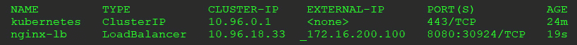

    图 6.7-立方服务输出

    您将看到使用负载平衡器类型创建了一个新的服务，MetalLB 从我们之前创建的配置池中分配了一个 IP 地址。

    快速查看控制器日志将验证 MetalLB 控制器是否为服务分配了 IP 地址:

    ```
    {"caller":"service.go:114","event":"ipAllocated","ip":"172.16.200.100","msg":"IP address assigned by controller","service":"default/nginx-lb","ts":"2020-04-25T23:54:03.668948668Z"}
    ```

5.  Now you can test the service by using `curl` on the Docker host. Using the IP address that was assigned to the service and port 8080, enter the following command:

    ```
    curl 172.17.200.100:8080
    ```

    您将收到以下输出:

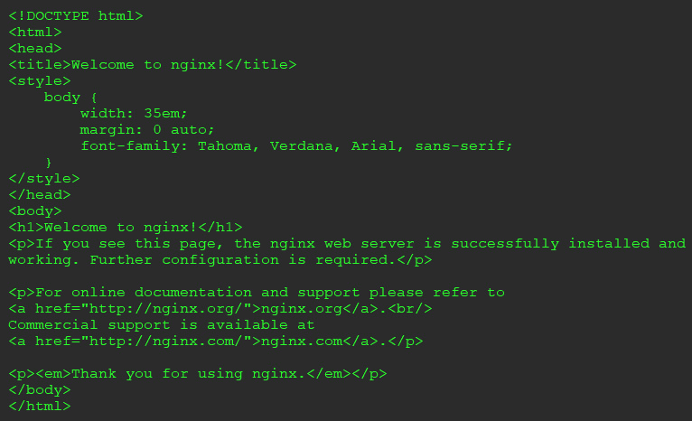

图 6.8–运行 NGINX 的负载平衡器服务的 Curl 输出

向集群添加 MetalLB 允许您公开应用，否则无法使用第 7 层平衡器公开这些应用。将第 7 层和第 4 层服务都添加到集群中，可以让您公开几乎任何您能想到的应用类型，包括数据库。如果您想为服务提供不同的 IP 池，该怎么办？在下一节中，我们将解释如何使用注释创建可分配给服务的多个 IP 池，从而允许您为服务分配一个 IP 范围。

## 向 MetalLB 添加多个 IP 池

可能会有种情况，您需要为集群上的特定工作负载提供不同的子网。一种情况可能是，当您在网络上为您的服务创建一个范围时，您低估了将创建的服务数量，并且您用完了 IP 地址。

根据您使用的原始范围，您可以根据您的配置增加范围。如果无法扩展现有范围，则需要先创建新范围，然后才能创建任何新的负载平衡器服务。您还可以向默认池中添加额外的 IP 范围，但是对于本例，我们将创建一个新池。

我们可以编辑配置文件并将新的范围信息添加到文件中。使用原始的 YAML 文件，`metallb-config.yaml`，我们需要在下面的代码中添加粗体文本:

```
apiVersion: v1
kind: ConfigMap
metadata:
  namespace: metallb-system
  name: config
data:
  config: |
    address-pools:
    - name: default
      protocol: layer2
      addresses:
      - 172.17.200.100-172.17.200.125
    - name: subnet-201
      protocol: layer2
      addresses:
      - 172.17.201.100-172.17.201.125
```

使用`kubectl`应用更新的配置图:

`kubectl apply -f metallb-config.yaml`

更新后的配置映射将创建一个名为子网-201 的新池。MetalLB 现在有两个池可以用来为服务分配 IP 地址:默认的和子网-201。

如果用户创建了负载平衡器服务，但没有指定池名称，Kubernetes 将尝试使用默认池。如果请求的池地址不足，服务将处于挂起状态，直到有地址可用。

要从第二个池创建新服务，您需要向服务请求添加注释。使用我们的 NGINX 部署，我们将创建第二个名为`nginx-web2`的服务，该服务将从子网 201 池中请求一个 IP 地址:

1.  创建一个名为`nginx-lb2.yaml`的新文件，其内容如下:

    ```
    apiVersion: v1
    kind: Service
    metadata:
      name: nginx-lb2
      annotations:
        metallb.universe.tf/address-pool: subnet-201  
    spec:
      ports:
      - port: 8080
        targetPort: 8080
      selector:
        run: nginx-web
      type: LoadBalancer
    ```

2.  要创建新服务，使用 kubectl 部署清单:

    ```
    kubectl apply -f nginx-lb2.yaml
    ```

3.  To verify that the service was created with an IP address from the subnet-201 pool, list all of the services:

    ```
    kubectl get services
    ```

    您将收到以下输出:

    

    图 6.9–使用负载平衡器的示例服务

    列表中的最后一项服务是我们新创建的`nginx-lb2`服务。我们可以确认它已被分配了一个外部 IP 地址 172.17.20.100，该地址来自子网 201 池。

4.  最后，我们可以通过在 Docker 主机上使用`curl` 命令，对端口 8080 上分配的 IP 地址测试服务:


图 6.10–使用第二个 IP 池在负载平衡器上卷曲 NGINX

能够提供不同的地址池允许您为服务分配一个已知的 IP 地址块。您可以决定地址池 1 用于 web 服务，地址池 2 用于数据库，地址池 3 用于文件传输，等等。一些组织这样做是为了根据 IP 分配来识别流量，从而更容易跟踪通信。

向集群添加第 4 层负载平衡器允许您迁移可能无法处理简单的第 7 层流量的应用。

随着越来越多的应用被迁移或重构为容器，您将会遇到许多需要多个协议来实现单个服务的应用。在本地，如果您试图创建一个同时具有 TCP 和 UDP 端口映射的服务，您将收到一个错误，即服务对象不支持多种协议。这可能不会影响许多应用，但是为什么您应该局限于一个服务的单个协议呢？

### 使用多种协议

到目前为止我们所有的例子都使用了一个 TCP 作为协议。当然，MetalLB 也支持使用 UDP 作为服务协议，但是如果您有一个服务要求您同时使用这两种协议呢？

## 多个协议问题

并非所有服务类型都支持为单个服务分配多个协议。下表显示了三种服务类型及其对多种协议的支持:

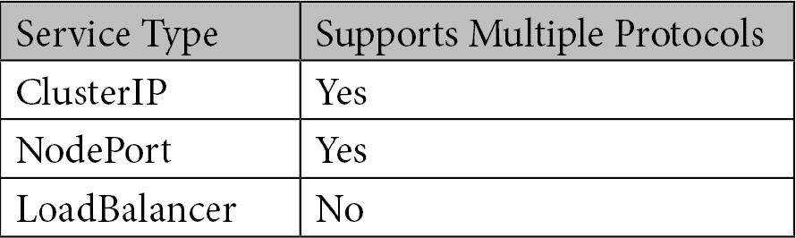

表 6.6–服务类型协议支持

如果您试图创建同时使用这两种协议的服务，您将收到一条错误消息。我们在以下错误消息中突出显示了该错误:

```
The Service "kube-dns-lb" is invalid: spec.ports: Invalid value: []core.ServicePort{core.ServicePort{Name:"dns", Protocol:"UDP", Port:53, TargetPort:intstr.IntOrString{Type:0, IntVal:53, StrVal:""}, NodePort:0}, core.ServicePort{Name:"dns-tcp", Protocol:"TCP", Port:53, TargetPort:intstr.IntOrString{Type:0, IntVal:53, StrVal:""}, NodePort:0}}: cannot create an external load balancer with mix protocols
```

我们试图创建的服务将使用负载平衡器服务向外部 IP 公开我们的核心域名系统服务。我们需要为 TCP 和 UDP 公开端口 50 上的服务。

MetalLB 支持绑定到单个 IP 地址的多种协议。配置需要创建两个不同的服务，而不是一个单独的服务，这在开始可能会显得有些奇怪。正如我们之前所展示的，应用编程接口服务器不允许您创建具有多个协议的服务对象。解决这个限制的唯一方法是创建两个不同的服务:一个分配了 TCP 端口，另一个分配了 UDP 端口。

使用我们的 CoreDNS 示例，我们将逐步创建一个需要多个协议的应用。

## 使用 MetalLB 的多个协议

为了支持同时需要 TCP 和 UDP 的应用，您需要创建两个独立的服务。如果您一直在密切关注服务是如何创建的，您可能已经注意到每个服务都会收到一个 IP 地址。从逻辑上讲，这意味着当我们为应用创建两个服务时，我们会收到两个不同的 IP 地址。

在我们的示例中，我们希望将 CoreDNS 公开为负载平衡器服务，这需要 TCP 和 UDP 协议。如果我们创建了两个标准服务，每个服务定义了一个协议，我们将收到两个不同的 IP 地址。您将如何配置系统以使用需要两个不同 IP 地址进行连接的 DNS 服务器？

简单的回答就是，**你不能**。

但是我们刚刚告诉您，您的 MetalLB 支持这种类型的配置。请继续关注我们——我们正在通过首先解释 MetalLB 将为我们解决的问题来逐步解释这一点。

当我们创建之前从子网-201 IP 池中提取的 NGINX 服务时，我们通过在负载平衡器清单中添加注释来实现。MetalLB 通过为**共享 IP 添加注释，增加了对多种协议的支持。**

## 使用共享 IP

现在您已经理解了 Kubernetes 中多协议支持的局限性，让我们使用 metalllb 向外部请求公开我们的 CoreDNS 服务，同时使用 TCP 和 UDP。

正如我们前面提到的，Kubernetes 不允许您用两种协议创建一个服务。要让一个负载平衡的 IP 同时使用两种协议，您需要为两种协议创建一个服务，一个用于 TCP，另一个用于 UDP。每个服务都需要一个注释，MetalLB 将使用这个注释为两个服务分配相同的 IP。

对于每个服务，您需要为`metallb.universe.tf/allow-shared-ip`注释设置相同的值。我们将覆盖一个完整的示例来公开 CoreDNS，以解释整个过程。

重要说明

大多数 Kubernetes 发行版使用 CoreDNS 作为默认的域名系统提供者，但是其中一些仍然使用 kube-dns 作为默认域名系统提供者时的服务名。KinD 是一开始可能会让您感到困惑的发行版之一，因为服务名称是 kube-dns，但是请放心，部署使用的是 CoreDNS。

那么，让我们开始吧:

1.  First, look at the services in the `kube-system` namespace:

    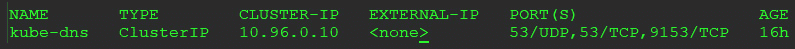

    图 6.11–kube 系统的默认服务列表

    我们唯一的服务是默认的`kube-dns`服务，使用集群 IP 类型，这意味着它只能由集群内部访问。

    您可能已经注意到该服务支持多种协议，同时分配了端口 UDP 和 TCP。请记住，与负载平衡器服务不同，集群 IP 服务**可以被分配多个协议。**

***   The first step to add LoadBalancer support to our CoreDNS server is to create two manifests, one for each protocol.

    我们将首先创建 TCP 服务。创建一个名为`coredns-tcp.yaml`的文件，并添加以下示例清单中的内容。请注意，CoreDNS 的内部服务正在使用`k8s-app: kube-dns`选择器。由于我们公开了相同的服务，这就是我们将在清单中使用的选择器:

    ```
    apiVersion: v1
    kind: Service
    metadata:
      name: coredns-tcp
      namespace: kube-system
      annotations:
        metallb.universe.tf/allow-shared-ip: "coredns-ext"
    spec:
      selector:
        k8s-app: kube-dns
      ports:
      - name: dns-tcp
        port: 53
        protocol: TCP
        targetPort: 53
      type: LoadBalancer
    ```

    这个文件现在应该很熟悉了，注释中的一个例外是添加了`metallb.universe.tf/allow-shared-ip`值。当我们为 UDP 服务创建下一个清单时，这个值的使用将变得清晰。

    *   Create a file called `coredns-udp.yaml` and add the content from the following example manifest.

    ```
    apiVersion: v1
    kind: Service
    metadata:
      name: coredns-udp
      namespace: kube-system
      annotations:
        metallb.universe.tf/allow-shared-ip: "coredns-ext"
    spec:
      selector:
        k8s-app: kube-dns
      ports:
      - name: dns-tcp
        port: 53
        protocol: UDP
        targetPort: 53
      type: LoadBalancer
    ```

    请注意，我们使用了来自 TCP 服务清单`metallb.universe.tf/allow-shared-ip: "coredns-ext"`的相同注释值。这是 MetalLB 将用来创建单个 IP 地址的值，即使正在请求两个独立的服务。

    *   Finally, we can deploy the two services to the cluster using `kubectl apply`:

    **立方申请-f coredns-tcp.yaml 立方申请-f coredns-udp.yaml**

    *   一旦部署完毕，获取`kube-system`名称空间中的服务，以验证我们的服务已经部署:**

 **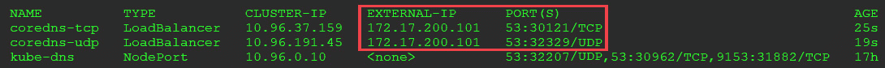

图 6.12–使用 MetalLB 分配的多个协议

您应该看到创建了两个新的服务:`coredns-tcp`和`coredns-udp`服务。在`EXTERNAL-IP`栏下，您可以看到两个服务都被分配了相同的 IP 地址，这允许服务在相同的 IP 地址上接受两个协议。

将 MetalLB 添加到集群中可以让您的用户部署他们可以容器化的任何应用。它使用动态分配服务 IP 地址的 IP 池，以便可以立即访问服务外部请求。

一个问题是 MetalLB 不为服务 IP 提供名称解析。当用户想要访问一项服务时，他们更喜欢以一个容易记住的名字为目标，而不是随机的 IP 地址。Kubernetes 不提供为服务创建外部可访问名称的能力，但是它有一个孵化器项目来启用这个功能。

在下一节中，我们将学习如何使用 CoreDNS，通过一个名为 external-dns 的孵化器项目，在 DNS 中创建服务名条目。

# 使服务名称对外可用

您可能已经想知道为什么我们使用 IP 地址来测试我们创建的 NGINX 服务，而我们使用域名进行入口测试。

虽然 Kubernetes 负载平衡器为服务提供标准的 IP 地址，但它不会为用户创建外部 DNS 名称来连接到服务。使用 IP 地址连接到运行在集群上的应用效率不高，并且在域名系统中为 MetalLB 分配的每个 IP 手动注册名称是一种不可能维护的方法。那么，如何为我们的负载平衡器服务添加名称解析功能，从而提供更像云的体验呢？

与维护 KinD 的团队类似，有一个 Kubernetes SIG 正在为 Kubernetes 开发这个名为`external-dns`的功能。主项目页面位于 https://github.com/kubernetes-sigs/external-dns 的 SIG Github 上。

在撰写本文时，`external-dns`项目支持一长串兼容的 DNS 服务器，包括以下内容:

*   谷歌的云域名系统
*   亚马逊的 53 号公路
*   蔚蓝色
*   云 flare
*   科林斯饭店
*   RFC2136
*   还有更多…

如您所知，我们的 Kubernetes 集群正在运行 CoreDNS 来提供集群 DNS 名称解析。很多人不知道 CoreDNS 并不局限于只提供内部集群 DNS 解析。它还可以提供外部名称解析，解析由 CoreDNS 部署管理的任何 DNS 区域的名称。

## 设置外部域名系统

现在，我们的核心域名系统只是为内部集群名称解析名称，所以我们需要为新的域名系统条目设置一个区域。由于 foowwidgets 希望所有应用都进入`foowidgets.k8s`，我们将把它作为我们的新区域。

## 集成外部域名系统和核心域名系统

向我们的集群提供动态服务注册的最后一步是部署`external-dns`并将其与 CoreDNS 集成。

要将和`external-dns`配置为在集群中工作，我们需要将每个配置为使用 ETCD 作为新的域名系统区域。由于我们的集群运行的是预装 ETCD 的 KinD，我们将部署一个专用于`external-dns`区域的新 ETCD 吊舱。

部署新 ETCD 服务的最快方法是使用官方的 ETCD 运营商 Helm 图表。使用以下单个命令，我们可以安装操作器和一个三节点 ETCD 集群。

首先，我们需要安装 Helm 二进制文件。我们可以使用 Helm 团队提供的脚本快速安装 Helm:

```
curl -fsSL -o get_helm.sh https://raw.githubusercontent.com/helm/helm/master/scripts/get-helm-3
chmod 700 get_helm.sh
./get_helm.sh
```

现在，使用 Helm，我们可以创建将与 CoreDNS 集成的 ETCD 集群。以下命令将部署 ETCD 操作员并创建 ETCD 集群:

```
helm install etcd-dns --set customResources.createEtcdClusterCRD=true stable/etcd-operator --namespace kube-system
```

部署运营商和 ETCD 节点需要几分钟时间。您可以通过查看`kube-system`名称空间中的豆荚来检查状态。完全安装后，您将看到三个 ETCD 操作员舱和三个 ETCD 集群舱:

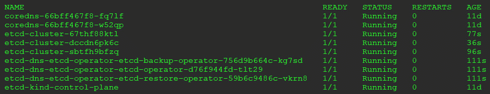

图 6.13–ETCD 算子和节点

一旦部署完成，查看`kube-system`名称空间中的服务，以获取名为`etcd-cluster-client`的新 ETCD 服务的 IP 地址:


图 6.14–et CD IP 服务

在下一节中，我们将需要分配的 IP 地址来配置`external-dns`和 CoreDNS 区域文件。

## 向核心域名系统添加 ETCD 区

`external-dns`要求核心域名系统区域存储在 ETCD 服务器上。之前，我们为 foowidgets 创建了一个新的区域，但是这只是一个标准区域，需要手动为新服务添加新记录。用户没有时间等待测试他们的部署，使用 IP 地址可能会导致代理服务器或内部策略出现问题。为了帮助用户加快应用的交付和测试，我们需要为他们的服务提供动态名称解析。要为 foowidgets 启用 ETCD 集成区域，请编辑 CoreDNS 配置图，并添加以下粗体行。

您可能需要将**端点**更改为在上一页检索到的新 ETCD 服务的 IP 地址:

```
apiVersion: v1
data:
  Corefile: |
    .:53 {
        errors
        health {
           lameduck 5s
        }
        ready
        kubernetes cluster.local in-addr.arpa ip6.arpa {
           pods insecure
           fallthrough in-addr.arpa ip6.arpa
           ttl 30
        }
        prometheus :9153
        forward . /etc/resolv.conf
 etcd foowidgets.k8s {
 stubzones
 path /skydns
 endpoint http://10.96.181.53:2379
 }
        cache 30
        loop
        reload
        loadbalance
    }
kind: ConfigMap        
```

下一步是将`external-dns`部署到集群。

我们已经在`chapter6`目录的 GitHub 存储库中提供了一个清单，该清单将用您的 ETCD 服务端点修补部署。您可以通过从`chapter6`目录执行以下命令，使用此清单部署`external-dns`。以下命令将查询 ETCD 群集的服务 IP，并使用该 IP 作为端点创建部署文件。

新创建的部署将在您的集群中安装`external-dns`:

```
ETCD_URL=$(kubectl -n kube-system get svc etcd-cluster-client -o go-template='{{ .spec.clusterIP }}')
cat external-dns.yaml | sed -E "s/<ETCD_URL>/${ETCD_URL}/" > external-dns-deployment.yaml
kubectl apply -f external-dns-deployment.yaml
```

要将`external-dns`手动部署到您的集群，请使用最后一行中的 ETCD 服务 IP 地址创建一个名为`external-dns-deployment.yaml`的新清单，清单包含以下内容:

```
apiVersion: rbac.authorization.k8s.io/v1beta1
kind: ClusterRole
metadata:
  name: external-dns
rules:
- apiGroups: [""]
  resources: ["services","endpoints","pods"]
  verbs: ["get","watch","list"]
- apiGroups: ["extensions"]
  resources: ["ingresses"]
  verbs: ["get","watch","list"]
- apiGroups: [""]
  resources: ["nodes"]
  verbs: ["list"]
---
apiVersion: rbac.authorization.k8s.io/v1beta1
kind: ClusterRoleBinding
metadata:
  name: external-dns-viewer
roleRef:
  apiGroup: rbac.authorization.k8s.io
  kind: ClusterRole
  name: external-dns
subjects:
- kind: ServiceAccount
  name: external-dns
  namespace: kube-system
---
apiVersion: v1
kind: ServiceAccount
metadata:
  name: external-dns
  namespace: kube-system
---
apiVersion: apps/v1
kind: Deployment
metadata:
  name: external-dns
  namespace: kube-system
spec:
  strategy:
    type: Recreate
  selector:
    matchLabels:
      app: external-dns
  template:
    metadata:
      labels:
        app: external-dns
    spec:
      serviceAccountName: external-dns
      containers:
      - name: external-dns
        image: registry.opensource.zalan.do/teapot/external-dns:latest
        args:
        - --source=service
        - --provider=coredns
        - --log-level=info
        env:
        - name: ETCD_URLS
          value: http://10.96.181.53:2379
```

请记住，如果您的 ETCD 服务器的 IP 地址不是 10.96.181.53，请在部署清单之前更改它。

使用`kubectl apply -f external-dns-deployment.yaml`部署清单。

## 通过外部 dns 集成创建负载平衡器服务

您仍然应该运行本章开头的 NGINX 部署。它有一些与之相关的服务。我们将添加另一个，向您展示如何为部署创建动态注册:

1.  To create a dynamic entry in the CoreDNS zone, you need to add an annotation in your service manifest. Create a new file called `nginx-dynamic.yaml` with the following content:

    ```
    apiVersion: v1
    kind: Service
    metadata:
      annotations:
     external-dns.alpha.kubernetes.io/hostname: nginx.foowidgets.k8s
      name: nginx-ext-dns
      namespace: default
    spec:
      ports:
      - port: 8080
        protocol: TCP
        targetPort: 8080
      selector:
        run: nginx-web
      type: LoadBalancer
    ```

    请注意文件中的注释。要指示`external-dns`创建记录，您需要添加一个带有关键字`external-dns.alpha.kubernetes.io/hostname`的注释，该关键字带有服务的所需名称，在本例中为`nginx.foowidgets.k8s`。

2.  Create the service using `kubectl apply -f nginx-dynamic.yaml`.

    大约需要一分钟`external-dns`才能了解域名系统的变化。

3.  要验证记录是否已创建，请使用`kubectl logs -n kube-system -l app=external-dns`检查`external-dns` pod 日志。一旦记录被`external-dns`提取，您将看到类似如下的条目:

    ```
    time="2020-04-27T18:14:38Z" level=info msg="Add/set key /skydns/k8s/foowidgets/nginx/03ebf8d8 to Host=172.17.201.101, Text=\"heritage=external-dns,external-dns/owner=default,external-dns/resource=service/default/nginx-lb\", TTL=0"
    ```

4.  The last step to confirm that external-dns is fully working is to test a connection to the application. Since we are using a KinD cluster, we must test this from a pod in the cluster. We will use a Netshoot container, as we have been doing throughout this book.

    重要说明

    在本节的最后，我们将展示将 Windows DNS 服务器与我们的 Kubernetes CoreDNS 服务器集成的步骤。提供这些步骤是为了让您全面了解如何将企业域名系统服务器与我们的核心域名系统服务完全集成。

5.  运行网络拍摄容器:

    ```
    kubectl run --generator=run-pod/v1 tmp-shell --rm -i --tty --image nicolaka/netshoot -- /bin/bash
    ```

6.  To confirm that the entry has been created successfully, execute a `nslookup` for the host in a Netshoot shell:

    

    图 6.15–新记录的 Nslookup

    我们可以根据 IP 地址确认正在使用的 DNS 服务器是 CoreDNS，这是分配给`kube-dns`服务的 IP。(还是那句话，服务是`kube-dns`，但是吊舱运行的是 CoreDNS)。

    172.17.201.101 地址是分配给新 NGINX 服务的 IP；我们可以通过列出默认命名空间中的服务来确认这一点:

    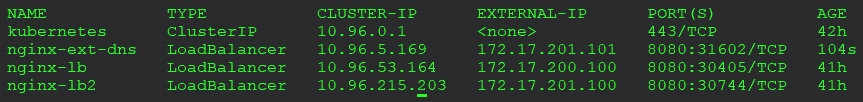

    图 6.16–NGINX 外部 IP 地址

7.  最后，让我们通过使用名称连接到容器来确认与 NGINX 的连接是否正常。在网络拍摄容器中使用`curl`命令，卷曲到端口 8080 上的域名:

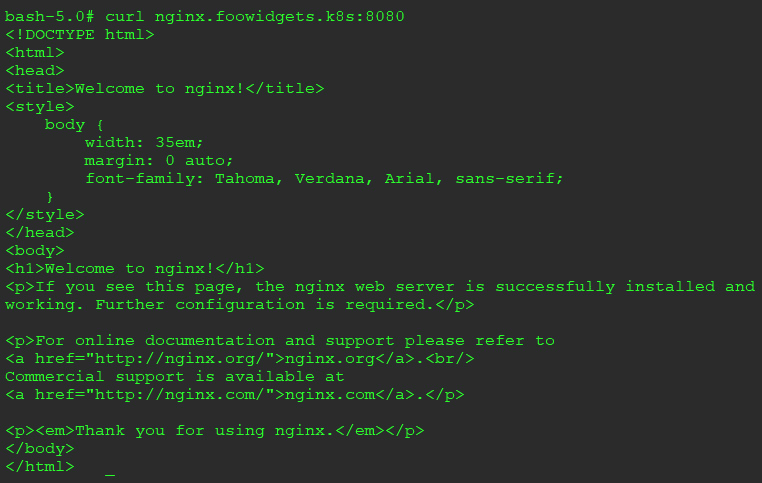

图 6.17–使用外部域名的 Curl 测试

`curl`输出确认我们可以使用动态创建的服务名访问 NGINX web 服务器。

我们意识到其中一些测试并不令人兴奋，因为您可以使用标准浏览器来测试它们。在下一节中，我们将把集群中运行的核心域名系统与一个视窗域名系统服务器集成在一起。

### 将 coreens 与企业 dns 集成

本节将向您展示如何将`foowidgets.k8s`区域的名称解析转发到运行在 Kubernetes 集群上的 CoreDNS 服务器。

注意

本节旨在提供一个将企业域名系统服务器与 Kubernetes 域名系统服务集成的示例。

由于外部要求和额外设置，提供的步骤仅供参考，**不应在您的 KinD 集群上执行**。

对于此场景，主 DNS 服务器运行在 Windows 2016 服务器上。

部署的组件如下:

*   运行域名系统的 Windows 2016 服务器
*   到库伯斯坦的群集
*   Bitnami NGINX 部署
*   创建负载平衡器服务，分配 IP 10.2.1.74
*   配置为使用主机端口 53 的 CoreDNS 服务
*   已部署附加组件，使用本章中的配置，例如外部 dns、用于 CoreDNS 的 ETCD 集群、添加的 CoreDNS ETCD 区域以及使用地址池 10.2.1.60-10.2.1.80 的 MetalLB

现在，让我们通过配置步骤来集成我们的域名系统服务器。

#### 配置主域名系统服务器

第一步是为运行 CoreDNS pod 的节点创建一个条件转发器。

在 Windows DNS 主机上，我们需要为`foowidgets.k8s`创建一个新的条件转发器，指向运行 CoreDNS pod 的主机。在我们的示例中，CoreDNS pod 已分配给主机 10.240.100.102:

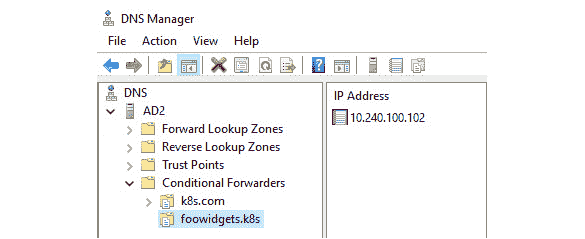

图 6.18–窗口条件转发器设置

这将配置窗口域名系统服务器，将对`foowidgets.k8s`域中主机的任何请求转发到核心域名系统窗格。

#### 测试到 coreens 的 dns 转发

为了测试配置，我们将使用主网络上的工作站，该工作站已经配置为使用 Windows DNS 服务器。

我们将运行的第一个测试是由 MetalLB 注释创建的 NGINX 记录的`nslookup`:

在命令提示符下，我们执行一个`nslookup nginx.foowidgets.k8s`:

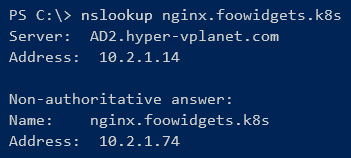

图 6.19–注册名称的 Nslookup 确认

由于查询返回了我们期望记录的 IP 地址，因此我们可以确认 Windows DNS 服务器正在将请求正确转发到 CoreDNS。

我们可以通过笔记本电脑的浏览器再做一次 NGINX 测试:

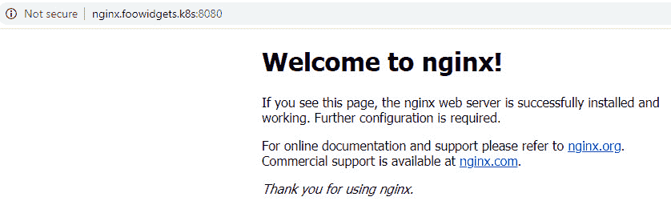

图 6.20–使用 CoreDNS 从外部工作站成功浏览

一项测试证实了转发工作正常，但我们对系统完全正常工作感到不舒服。

为了测试一个新的服务，我们部署了一个不同的 NGINX 服务器，名为 microbot，服务有一个分配名称`microbot.foowidgets.k8s`的注释。MetalLB 已为该服务分配了 10.2.1.65 的 IP 地址。

与我们之前的测试一样，我们使用 nslookup 测试名称解析:


图 6.21–Nslookup 确认一个额外的注册名称

为了确认网络服务器运行正常，我们从工作站浏览到以下网址:

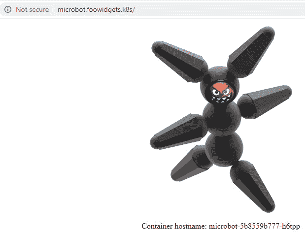

图 6.22–使用 CoreDNS 从外部工作站成功浏览

成功！我们现在已经集成了一个企业域名服务器和一个运行在 Kubernetes 集群上的 CoreDNS 服务器。这种集成为用户提供了通过简单地向服务添加注释来动态注册服务名称的能力。

# 总结

在本章中，您了解了 Kubernetes 中的两个重要对象，它们向其他集群资源和用户公开了您的部署。

我们从服务和可以分配的多种类型开始这一章。三种主要的服务类型是集群 IP、节点端口和负载平衡器。选择服务类型将配置如何访问您的应用。

通常，服务本身并不是用于提供对集群中运行的应用的访问的唯一对象。您将经常使用集群 IP 服务和入口控制器来提供对使用第 7 层的服务的访问。一些应用可能需要额外的通信，这不是由第 7 层负载平衡器提供的。这些应用可能需要第 4 层负载平衡器来向用户公开它们的服务。在负载平衡部分，我们演示了 MetalLB 的安装和使用，MetalLB 是一种常用的开源第 7 层负载平衡器。

在最后一节中，我们解释了如何使用条件转发将动态 CoreDNS 区域与外部企业 DNS 服务器集成。集成两个命名系统提供了一种允许动态注册集群中任何第 4 层负载平衡服务的方法。

既然您知道了如何向用户公开集群上的服务，那么我们如何控制谁有权访问集群来创建新的服务呢？在下一章中，我们将解释如何将认证与您的集群集成。我们将在我们的 KinD 集群中部署一个 OIDC 提供商，并与外部 SAML2 实验室服务器连接以获取身份信息。

# 问题

1.  How does a service know what pods should be used as endpoints for the service?

    A.在服务港口旁边

    B.通过命名空间

    C.作者

    D.通过选择器标签

2.  What kubectl command helps you to troubleshoot services that may not be working properly?

    A.`kubectl get services <service name>`

    B.`kubectl get ep <service name>`

    C.`kubectl get pods <service name>`

    D.`kubectl get servers <service name>`

3.  All Kubernetes distributions include support for services that use the `LoadBalancer` type.

    A.真实的

    B.错误的

4.  Which load balancer type supports all TCP/UDP ports and accepts traffic regardless of the packet's contents?

    A.第 7 层

    B.思科层

    C.第二层

    D.第 4 层

5.  Without any added components, you can use multiple protocols using which of the following service types?

    A.`NodePort`和`ClusterIP`

    B.`LoadBalancer`和`NodePort`

    C.`NodePort`、`LoadBalancer`和`ClusterIP`

    D.`LoadBalancer`和`ClusterIP`**