# 七、将认证集成到您的集群中

一旦构建了集群，用户就需要安全地与之交互。对于大多数企业来说，这意味着对单个用户进行认证，并确保他们只能访问完成工作所需的内容。对于 Kubernetes，这可能很有挑战性，因为集群是 API 的集合，而不是具有可以提示认证的前端的应用。

在本章中，您将学习如何使用 OpenID Connect 协议和 Kubernetes 模拟将企业认证集成到集群中。我们还将介绍几种反模式，并解释为什么应该避免使用它们。

在本章中，我们将涵盖以下主题:

*   理解Kubernetes如何知道你是谁
*   了解 OpenID 连接
*   还有其他选择吗？
*   正在为 OpenID Connect 配置 KinD
*   云·Kubernetes斯怎么知道你是谁
*   为模拟配置集群
*   在没有 OpenUnison 的情况下配置模拟
*   我们开始吧！

# 技术要求

要完成本章中的练习，您将需要以下内容:

*   拥有 8 GB 内存的 Ubuntu 18.04 服务器
*   使用第 5 章*中的配置运行的 KinD 集群，使用 KinD* 部署集群

您可以在以下 GitHub 存储库中访问本章的代码:[https://GitHub . com/PacktPublishing/Kubernetes-and-Docker-The-Complete-Guide/tree/master/chapter 7](https://github.com/PacktPublishing/Kubernetes-and-Docker-The-Complete-Guide/tree/master/chapter7)。

# 了解Kubernetes如何知道你是谁

没有勺子

–矩阵，1999 年

在 1999 年的科幻电影*《黑客帝国》*中，尼奥在一个孩子等着看神谕的时候，和他聊起了黑客帝国。孩子向他解释操纵矩阵的诀窍是意识到*“没有勺子”*。

这是一个观察 Kubernetes 用户的好方法，因为他们不存在。除了我们稍后将讨论的服务帐户之外，Kubernetes 中没有称为“用户”或“组”的对象。每个应用编程接口交互都必须包含足够的信息，以告诉应用编程接口服务器用户是谁以及用户是哪个组的成员。这个断言可以采取不同的形式，这取决于您计划如何将认证集成到集群中。

在本节中，我们将详细介绍 Kubernetes 将用户与集群相关联的不同方式。

## 外部用户

从集群外部访问 Kubernetes API 的用户通常会使用以下两种认证方法之一:

*   **证书**:您可以使用包含您信息的客户端证书来声明您使用的是谁，例如您的用户名和组。该证书被用作 TLS 协商过程的一部分。
*   **承载令牌**:嵌入在每个请求中，承载令牌可以是包含验证自身所需的所有信息的自包含令牌，也可以是可以由 API 服务器中的网络钩子交换该信息的令牌。

您也可以使用服务帐户来访问集群外的应用编程接口服务器，尽管强烈建议不要这样做。我们将在*中介绍使用服务帐户的风险和顾虑，还有哪些选择？*节。

## Kubernetes族

不同的用户可以被分配相同的权限，而无需通过组为每个用户单独创建`RoleBinding objects`。Kubernetes 包括两种类型的组:

*   **系统分配**:这些组以`system:`前缀开始，由 API 服务器分配。一个示例组是`system:authenticated`，它被分配给所有经过认证的用户。系统分配组的其他示例有`system:serviceaccounts:namespace`组，其中`Namespace`是命名空间的名称，包含组中命名空间的所有服务帐户。
*   **用户声明的组**:这些组由认证系统在提供给应用编程接口服务器的令牌中或通过认证网络挂钩来声明。这些团体的命名没有标准或要求。就像用户一样，组在应用编程接口服务器中不作为对象存在。外部用户在认证时声明组，并在本地跟踪系统生成的组。当断言用户的组时，用户的唯一标识和组之间的主要区别是唯一标识应该是唯一的，而组不是。

您可能被授权按组访问，但所有访问仍会根据您用户的唯一标识进行跟踪和审核。

## 服务账户

服务账户是存在于应用编程接口服务器中的对象，用于跟踪哪些吊舱可以访问各种应用编程接口。服务帐户令牌被称为 **JSON 网络令牌**，或 **JWTs** 。根据令牌的生成方式，有两种方法可以获得服务帐户:

*   第一个是服务帐户创建时由 Kubernetes 生成的一个机密。
*   第二种是通过`TokenRequest`应用编程接口，用于通过挂载点将机密注入吊舱或从集群外部使用。所有服务帐户都是通过将令牌作为请求头注入到应用编程接口服务器中来使用的。API 服务器将其识别为服务帐户，并在内部对其进行验证。

与用户不同，服务帐户可以**而不是**分配给任意组。服务帐户是预建组的成员，但是您不能为分配角色创建一组特定的服务帐户。

既然我们已经探索了 Kubernetes 如何识别用户的基本原理，我们将探索这个框架如何适应**OpenID Connect**(**OIDC**)协议。OIDC 提供了大多数企业所需的安全性，并且是基于标准的，但是 Kubernetes 并没有像许多网络应用那样使用它。了解这些差异以及 Kubernetes 需要它们的原因是将集群集成到企业安全环境中的重要一步。

# 了解 OpenID 连接

OpenID Connect 是一个标准身份联邦协议。它建立在 OAuth2 规范的基础上，具有一些非常强大的特性，使其成为与 Kubernetes 集群交互的首选。

OpenID Connect 的主要好处如下:

*   **短命令牌**:如果令牌被泄露，例如通过日志消息或漏洞，您希望令牌尽快过期。使用 OIDC，您可以指定可存活 1-2 分钟的令牌，这意味着当攻击者试图使用令牌时，令牌可能会过期。
*   **用户和组成员身份**:当我们开始谈论授权时，我们会很快看到按组管理访问很重要，而不是直接引用用户来管理访问。OIDC 令牌可以嵌入用户的标识符和他们的组，从而更容易进行访问管理。
*   **刷新超时策略范围内的令牌**:对于短期令牌，您需要能够根据需要刷新它们。刷新令牌的有效时间可以限定在您企业的 web 应用空闲超时策略的范围内，从而使您的集群与其他基于 web 的应用保持一致。
*   **kube CTL**不需要插件:`kubectl`二进制支持 OpenID Connect 原生，所以不需要任何额外的插件。如果因为无法将**命令行界面** ( **CLI** )工具直接安装到工作站上而需要从跳转框或虚拟机访问集群，这尤其有用。
*   **更多多因素认证选项**:很多最强的多因素认证选项都需要网络浏览器。例子包括使用硬件令牌的 FIDO U2F 和 WebAuth。

OIDC 是一个同行评审的标准，已经使用了几年，并正在迅速成为身份联盟的首选标准。

重要说明

身份联合是一个术语，用于描述身份数据的断言和认证，而不共享用户的机密机密或密码。身份联盟的一个经典示例是登录您的员工网站，无需再次登录即可访问您的福利提供商。您的员工网站没有与福利提供商共享您的密码。相反，你的员工网站*断言*你在某个日期和时间登录，并提供了一些关于你的信息。这样，您的帐户将跨两个孤岛(您的员工网站和福利门户)进行*联合*，而您的福利门户不知道您的员工网站密码。

## 开放身份连接协议

正如你所看到的，OIDC 有多个组成部分。为了完全理解 OIDC 是如何工作的，让我们开始 OpenID 连接协议。

我们将重点关注《OIDC 议定书》的以下两个方面:

*   使用带有`kubectl`和应用编程接口服务器的令牌
*   刷新令牌以使您的令牌保持最新

我们不会太专注于获取代币。虽然获取令牌的协议确实遵循标准，但登录过程并不遵循标准。根据您选择如何实现 OIDC **身份提供者** ( **境内流离失所者**)，您从身份提供者处获取令牌的方式会有所不同。

OIDC 登录过程生成了三个令牌:

*   `access_token`:这个令牌是用来对你的身份提供者可能提供的 web 服务进行认证请求，比如获取用户信息。是**不是**Kubernetes用的，可以丢弃。
*   `id_token`:这个令牌是一个 JWT，它封装了你的身份，包括你的唯一标识符(sub)、组和关于你的到期信息，API 服务器可以使用这些信息来授权你的访问。JWT 是由您的身份提供者的证书签署的，Kubernetes斯只需检查 JWT 的签名即可验证。这是您传递给 Kubernetes 的令牌，用于每个验证自己身份的请求。
*   `refresh_token` : `kubectl`知道如何在到期后自动为你刷新`id_token`。为此，它会使用`refresh_token`呼叫您的 IdP 令牌端点，以获取新的`id_token`。A `refresh_token`只能使用一次且不透明，意味着你作为代币持有者，对代币的格式没有可见性，对你来说真的无所谓。它要么起作用，要么不起作用 *refresh_token 从不去 Kubernetes(或任何其他应用)。它仅用于与 IdP 的通信。*

一旦您有了令牌，就可以使用它们向应用编程接口服务器进行认证。使用令牌最简单的方法是使用命令行参数将它们添加到`kubectl`配置中:

```
kubectl config set-credentials username --auth-provider=oidc --auth-provider-arg=idp-issuer-url=https://host/uri --auth-provider-arg=client-id=kubernetes --auth-provider-arg=refresh-token=$REFRESH_TOKEN --auth-provider-arg=id-token=$ID_TOKEN 
```

`config set-credentials`有几个选项需要提供。我们已经解释了`id-token`和`refresh_token`，但是还有两个额外的选项:

*   `idp-issuer-url`:这就是我们将用来配置 API 服务器的同一个 URL，并且指向用于 IdP 的发现 URL 的基本 URL。
*   `client-id`:这是您的 IdP 用来识别您的配置。这是 Kubernetes 部署独有的，不被视为机密信息。

OpenID 连接协议有一个可选元素，称为`client_secret`，即 OIDC 客户端和 IdP 之间共享的。它用于在发出任何请求(如刷新令牌)之前“验证”客户端。虽然 Kubernetes 支持它作为一个选项，但它的建议不要使用它，而是将您的 IdP 配置为使用公共端点(根本不使用机密)。

客户端机密没有实际价值，因为您需要与每个潜在用户共享它，并且因为它是一个密码，所以您企业的法规遵从性框架可能需要定期轮换，从而导致支持问题。总的来说，就安全性而言，它不值得任何潜在的负面影响。

重要说明

Kubernetes 要求您的身份提供者支持发现 URL 端点，这是一个提供一些 JSON 的 URL，告诉您在哪里可以获得密钥来验证 JWTs 和各种可用的端点。取任意发行人网址，添加`/.well-known/openid-configuration`即可查看该信息。

## 跟随 OIDC 和 API 的互动

一旦`kubectl`已经被配置，您的所有应用编程接口交互将遵循以下顺序:

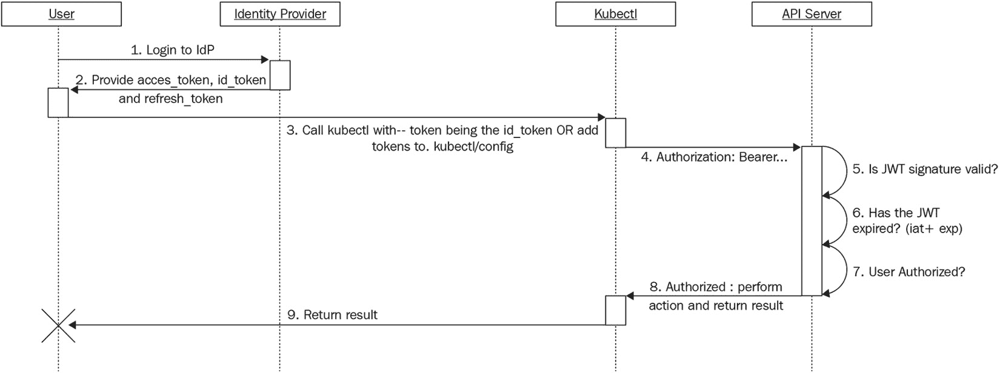

图 7.1-立方体/立方体 OpenID 连接顺序图

上图来自[https://Kubernetes . io/docs/reference/access-authn-authz/authentication/# OpenID-connect-token](https://kubernetes.io/docs/reference/access-authn-authz/authentication/#openid-connect-tokens)的 Kubernetes 认证页面。验证请求包括执行以下操作:

1.  **登录您的身份提供者(IdP)** :这对于每个 IdP 都是不同的。这可能涉及为网络浏览器中的表单、多因素令牌或证书提供用户名和密码。这对于每个实现都是特定于实现的。
2.  **向用户**提供令牌:一旦通过认证，用户需要一种方式来生成`kubectl`访问 Kubernetes APIs 所需的令牌。这可以采取应用的形式，使用户可以轻松地将它们复制并粘贴到配置文件中，也可以是新的下载文件。
3.  这一步是将`id_token`和`refresh_token`添加到`kubectl`配置中。如果令牌在浏览器中呈现给用户，则可以手动将其添加到配置中。如果提供了新的配置以便可以下载，则可以。还有`kubectl`插件，它会启动一个网络浏览器来启动认证过程，一旦完成，就会为你生成你的 c 配置。
4.  **注入 id_token** :一旦调用了`kubectl`命令，每个 API 调用都包含一个添加头，称为`Authorization`头，其中包含`id_token`。
5.  **JWT 签名验证**:一旦 API 服务器收到来自 API 调用的`id_token`，它就根据身份提供者提供的公钥验证签名。应用编程接口服务器还将验证发行者是否与应用编程接口服务器配置的发行者匹配，以及接收者是否与应用编程接口服务器配置的客户端标识匹配。
6.  **检查 JWT 的有效期**:代币只在有限的时间内有效。应用编程接口服务器确保令牌没有过期。
7.  **授权检查**:现在用户已经通过认证，API 服务器将通过将用户的标识符和断言的组与内部策略进行匹配，来确定所提供的`id_token`所标识的用户是否能够执行所请求的动作。
8.  **执行 API** :所有检查完成，API 服务器执行请求，生成响应，发送回`kubectl`。
9.  **Format the response for the user**: Once the API call is complete (or a series of API calls), the JSON is formatted for the user by `kubectl`.

    重要说明

    一般来说，认证是验证你是不是你的过程。当我们将用户名和密码放入网站时，大多数人都会遇到这种情况。我们在证明我们是谁。在企业世界中，授权成为我们是否被允许做某事的决定。首先，我们验证，然后授权。围绕 API 安全性构建的标准没有假设认证，而是直接基于某种令牌进行授权。这并不是说必须要识别打电话的人。例如，当你用实体钥匙开门时，门不知道你是谁，只知道你有正确的钥匙。这个术语可能会变得非常混乱，所以如果你有点迷路了，不要感到难过。你有好伙伴！

`id_token`是自足的；API 服务器需要知道的关于您的一切都在那个令牌中。API 服务器使用身份提供者提供的证书验证`id_token`，并验证令牌没有过期。只要一切正常，API 服务器就会根据自己的 RBAC 配置来授权您的请求。我们将在后面介绍这个过程的细节。最后，假设您获得授权，应用编程接口服务器会提供响应。

注意 Kubernetes 永远看不到你的密码或者任何其他你知道的机密信息，只有你知道。唯一共享的是`id_token`，那是短暂的。这引出了几个要点:

*   由于 Kubernetes 永远看不到您的密码或其他凭据，因此无法泄露它们。这可以为您节省大量与安全团队合作的时间，因为所有与保护密码相关的任务都可以跳过！
*   `id_token`是自包含的，这意味着如果它被泄露，除了重新键入您的身份提供者，您无能为力来阻止它被滥用。这就是为什么你的`id_token`寿命短如此重要。在 1-2 分钟内，攻击者能够获得`id_token`，意识到它是什么，并滥用它的可能性非常低。

如果`kubectl`在执行呼叫时发现`id_token`已过期，它将尝试使用`refresh_token`调用 IdP 的令牌端点来刷新它。如果用户的会话仍然有效，IdP 将生成新的`id_token`和`refresh_token`，它们将在`kubectl`配置中为您存储。这在没有用户干预的情况下自动发生。此外，`refresh_token`具有一次性使用，因此如果有人试图使用以前使用的`refresh_token`，您的 IdP 将无法通过刷新过程。

重要说明

这是必然会发生的。有人可能需要立即被锁在外面。可能是他们被解雇了，也可能是他们的会话被破坏了。这取决于您的 IdP，因此在选择 IdP 时，请确保它支持某种形式的会话撤销。

最后，如果`refresh_token`已经过期或者会话已经被撤销，API 服务器将返回 **401 未授权**消息，以指示它将不再支持令牌。

我们已经花了相当多的时间来研究 OIDC 协议。现在，让我们深入了解一下`id_token`。

### id_token

一个`id_token`是一个 JSON 网络令牌，它是 base64 编码的并且是数字签名的。在 OIDC，JSON 包含一系列属性，称为声明。i `d_token`中有一些标准的索赔，但大部分情况下，您最关心的索赔如下:

*   `iss`:发行人，在你的库比特配置中**必须与发行人**一致
*   `aud`:你的客户 ID
*   `sub`:您的唯一标识符
*   `groups`: Not a standard claim, but should be populated with groups specifically related to your Kubernetes deployment

    重要说明

    许多部署试图通过您的电子邮件地址来识别您。这是一种反模式，因为您的电子邮件地址通常基于您的姓名，并且姓名会改变。子声明应该是一个唯一的标识符，它是不可变的，永远不会改变。这样，即使你的电子邮件因为你的名字改变而改变也没关系。这可就更难调试*“谁是 cd25d 24d-74 b8-4c 4-8 b8c-116 bf4 abb d26？”*但将提供更干净和更容易维护的集群。

还有其他几个声明表明`id_token`何时不应再被接受。这些索赔都是从世界协调时(1970 年 1 月 1 日)开始以秒为单位计算的:

*   `exp`:当`id_token`到期时
*   `iat`:创建`id_token`时
*   `nbf`:应该允许绝对最早的一个`id_token`

为什么令牌没有单一的到期时间？

创建`id_token`的系统上的时钟不太可能与评估它的系统具有完全相同的时间。通常会有偏差，根据时钟的设置，可能会有几分钟。除了到期之外，还有一个“之前没有”给了标准时间偏差一些空间。

在一个`id_token`中有其他的声明，这些声明并不重要，但是有额外的上下文。示例包括您的姓名、联系信息、组织等。

虽然令牌的主要用途是与 Kubernetes API 服务器交互，但它们并不仅限于 API 交互。除了去 API 服务器，webhook 调用也可能收到你的`id_token`。

您可能已经在集群上部署了 OPA 作为验证网络钩子。当有人提交 pod 创建请求时，webhook 会收到用户的`id_token`，可以用于其他决策。

一个例子是，您希望确保基于提交者的组织将 PVC 映射到特定的 PVs。组织包含在`id_token`中，传递给 Kubernetes，再传递到 OPA webhook 上。由于令牌已经被传递给了网络钩子，因此这些信息可以在您的 OPA 策略中使用。

## 其他认证选项

在本节中，我们将重点放在 OIDC，并介绍了为什么它是最佳认证机制的原因。这当然不是唯一的选项，我们将在本节中讨论其他选项以及它们何时合适。

### 证书

这通常是每个人向 Kubernetes 集群进行认证的第一次体验。

一旦 Kubernetes 安装完成，一个包含证书和私钥的预构建 kubectl `config`文件就被创建并准备好使用。该文件仅应在“紧急情况下打碎玻璃”的情况下使用，在这种情况下，所有其他形式的认证都不可用。它应该由贵组织的特权访问标准来控制。当使用这个配置文件时，它不能识别用户，并且很容易被滥用，因为它不允许简单的审计跟踪。

虽然这是证书认证的标准用例，但它不是证书认证的唯一用例。正确完成的证书认证是业内公认的最强凭据之一。

证书认证被美国联邦政府用于其最重要的任务。在高级别上，证书认证包括使用客户端密钥和证书来协商您与 API 服务器的 HTTPS 连接。应用编程接口服务器可以获取您用来建立连接的证书，并根据**证书颁发机构** ( **CA** )证书对其进行验证。一旦通过验证，它会将证书中的属性映射到 API 服务器可以识别的用户和组。

为了获得证书认证的安全优势，私钥需要在隔离的硬件上生成，通常以智能卡的形式，并且永远不要离开该硬件。生成证书签名请求并提交给签署公钥的证书颁发机构，从而创建一个证书，然后安装在专用硬件上。在任何情况下，证书颁发机构都不会获得私钥，因此即使证书颁发机构遭到破坏，您也无法获得用户的私钥。如果证书需要吊销，它会被添加到吊销列表中，可以从 LDAP 目录、文件中提取，也可以使用 OCSP 协议进行检查。

这看起来可能是一个有吸引力的选择，那么为什么不应该使用 Kubernetes 的证书呢？

*   智能卡集成使用一种叫做 PKCS11 的标准，这种标准无论是`kubectl`还是 API 服务器都不支持。
*   API 服务器无法检查证书撤销列表或使用 OCSP，因此一旦创建了证书，就无法撤销它，以便 API 服务器可以使用它。

此外，很少使用正确生成密钥对的过程。它需要构建一个复杂的界面，用户很难将其与需要运行的命令行工具结合使用。为了避免这种情况，会为您生成证书和密钥对，您可以下载它，或者通过电子邮件发送给您，从而降低该过程的安全性。

不应该对用户使用证书认证的另一个原因是很难利用组。虽然您可以将组嵌入到证书的主题中，但是您不能撤销证书。因此，如果用户的角色发生变化，您可以给他们一个新的证书，但不能阻止他们使用旧的证书。

正如本节介绍中所述，在“遇到紧急情况时打碎玻璃”的情况下，使用证书进行认证是证书认证的一种很好的用途。如果所有其他认证方法都遇到问题，这可能是进入群集的唯一方法。

### 服务帐户

服务帐户似乎提供了一种简单的访问方法。创建它们很容易。以下命令创建一个服务帐户对象和一个存储服务帐户令牌的密码:

```
kubectl create sa mysa -n default
```

接下来，以下命令将以 JSON 格式检索服务帐户的令牌，并只返回令牌的值。然后，该令牌可用于访问应用编程接口服务器:

```
kubectl get secret $(kubectl get sa mysa -n default -o json | jq -r '.secrets[0].name') -o json | jq -r '.data.token' | base64 -d
```

为了展示这个例子，让我们直接调用 API 端点，而不提供任何凭据:

```
curl -v --insecure https://0.0.0.0:32768/api
```

您将收到以下信息:

```
.
.
.
{
  "kind": "Status",
  "apiVersion": "v1",
  "metadata": {
  },
  "status": "Failure",
  "message": "forbidden: User \"system:anonymous\" cannot get path \"/api\"",
  "reason": "Forbidden",
  "details": {
  },
  "code": 403
* Connection #0 to host 0.0.0.0 left intact
```

默认情况下，大多数 Kubernetes 发行版不允许匿名访问 API 服务器，因此我们收到一个 *403 错误*，因为我们没有指定用户。

现在，让我们将服务帐户添加到 API 请求中:

```
export KUBE_AZ=$(kubectl get secret $(kubectl get sa mysa -n default -o json | jq -r '.secrets[0].name') -o json | jq -r '.data.token' | base64 -d)
curl  -H "Authorization: Bearer $KUBE_AZ" --insecure https://0.0.0.0:32768/api
{
  "kind": "APIVersions",
  "versions": [
    "v1"
  ],
  "serverAddressByClientCIDRs": [
    {
      "clientCIDR": "0.0.0.0/0",
      "serverAddress": "172.17.0.3:6443"
    }
  ]
}
```

成功！这是一个简单的过程，所以你可能会想，“为什么我需要担心所有复杂的 OIDC 乱局？”该解决方案的简单性带来了多个安全问题:

*   **令牌的安全传输**:服务账户是自包含的，不需要任何东西来解锁或验证所有权，所以如果令牌在运输途中被取走，你没有办法停止它的使用。您可以设置一个系统，让用户登录来下载一个带有令牌的文件，但是现在您有了一个不太安全的 OIDC 版本。
*   **无到期**:当你解码一个服务账号令牌时，没有任何东西告诉你令牌什么时候到期。那是因为令牌永远不会过期。您可以通过删除服务帐户并重新创建它来撤销令牌，但这意味着您需要一个适当的系统来做到这一点。同样，你建造了一个能力较弱的 OIDC。
*   **审核**:一旦找回钥匙，车主就可以轻松发放服务账号。如果有多个用户使用同一个密钥，审计帐户的使用就变得非常困难。

除了这些问题，您不能将服务帐户放入任意组。这意味着 RBAC 绑定必须直接指向服务帐户，或者使用服务帐户所属的预建组之一。当我们谈论授权时，我们将探讨为什么这是一个问题，所以现在请记住这一点。

最后，服务帐户从未被设计为在集群之外使用。就像用锤子敲进一颗螺丝钉。有了足够的肌肉和愤怒，你会把它带进去，但它不会很漂亮，没有人会对结果感到满意。

### TokenRequest API

在撰写本文时，`TokenRequest` API 仍然是一个 **beta** 特性。

`TokenRequest` API 允许您请求特定范围的短期服务帐户。虽然它提供了稍好的安全性，因为它将过期并且范围有限，但它仍然绑定到服务帐户，这意味着没有组，并且仍然存在将令牌安全地提供给用户并审核其使用的问题。

`TokenRequest` API 生成的令牌是为其他系统与你的集群对话而构建的；它们不应该被用户使用。

### 自定义认证 webhooks

如果你已经有了一个不使用现有标准的身份平台，一个定制的认证网钩会让你集成它，而不必定制 API 服务器。托管托管 Kubernetes 实例的云提供商通常使用该功能。

您可以定义一个认证 webhook，API 服务器将使用令牌调用它来验证它并获取关于用户的信息。除非您使用为其构建 Kubernetes 分发版的自定义 IAM 令牌系统来管理公共云，否则不要这样做。编写自己的认证就像编写自己的加密一样，只是不要这样做。我们为 Kubernetes 看到的每个自定义认证系统都可以归结为对 OIDC 的苍白模仿或“传递密码”。就像用锤子敲螺丝一样，你可以做到，但是会很痛苦。这主要是因为你更有可能把螺丝拧进自己的脚，而不是把螺丝穿过木板。

### 拱顶石

熟悉 OpenStack 的人会认出 Keystone 这个名字是一个身份提供者。如果您不熟悉 Keystone，它是 OpenStack 部署中使用的默认身份提供程序。

Keystone 托管处理认证和令牌生成的应用编程接口。OpenStack 将用户存储在 Keystone 的数据库中。虽然使用 Keystone 更常见于 OpenStack，但 Kubernetes 也可以配置为使用 Keystone 进行用户名和密码认证，但有一些限制:

*   使用 Keystone 作为 Kubernetes 的 IdP 的主要限制是，它只能与 Keystone 的 LDAP 实现一起工作。虽然您可以使用这种方法，但是您应该考虑到只支持用户名和密码，因此您正在创建一个具有非标准协议的身份提供者，以向 LDAP 服务器进行认证，这几乎是任何 OIDC IdP 都可以开箱即用的。
*   你不能用 Keystone 来利用 SAML 或 OIDC，尽管 Keystone 支持 OpenStack 的两种协议，这限制了用户进行认证的方式，从而使你无法使用多种多因素选项。
*   很少有应用知道如何在 OpenStack 之外使用 Keystone 协议。您的集群将有多个应用组成您的平台，这些应用不知道如何与 Keystone 集成。

使用 Keystone 当然是一个吸引人的想法，尤其是如果你正在 OpenStack 上部署，但最终，它非常有限，你可能会投入和使用 OIDC 一样多的工作来集成 Keystone。

下一节将讨论我们在这里探讨的细节，并将它们应用于将认证集成到集群中。当您完成实现时，您将看到`kubectl`、应用编程接口服务器和您的身份提供者如何交互来提供对集群的安全访问。我们将把这些特性与常见的企业需求联系起来，以说明为什么理解 OpenID Connect 协议的细节很重要。

# 为 OpenID 连接配置种类

对于我们的示例部署，我们将使用来自客户的场景，FooWidgets。Foowidgets 有一个 Kubernetes 集群，他们希望使用 OIDC 集成这个集群。建议的解决方案需要满足以下要求:

*   Kubernetes 必须使用我们的中央认证系统，活动目录联合服务。
*   我们需要能够将活动目录组映射到我们的 RBAC `RoleBinding`对象。
*   用户需要访问 Kubernetes 仪表板。
*   用户需要能够使用命令行界面。
*   必须满足所有企业合规性要求。

让我们详细探讨 每一项，并解释我们如何满足客户的需求。

## 解决需求

我们企业的需求需要多个移动部件，包括集群内部和外部。我们将研究这些组件中的每一个，以及它们与构建经过认证的集群之间的关系。

### 使用活动目录联合服务

如今，大多数企业使用微软的活动目录来存储关于用户及其凭证的信息。根据您企业的规模，拥有多个用户居住的域或林并不罕见。如果您的 IdP 很好地集成到微软的 Kerberos 环境中，它可能知道如何导航这些不同的系统。大多数非微软应用不是，包括大多数身份提供者。**活动目录联盟服务** ( **ADFS** )是微软的 IdP，支持【SAML2 和 OpenID Connect，它知道如何导航企业实现的域和林。这在许多大企业中很常见。

ADFS 的下一个决定是使用 SAML2 还是 OpenID Connect。在撰写本文时，SAML2 更容易实现，大多数拥有 ADFS 的企业环境更喜欢使用 SAML2。SAML2 的另一个好处是它不需要我们的集群和 ADFS 服务器之间的连接；所有重要信息都通过用户的浏览器传输。这减少了为启动和运行集群而需要实现的潜在防火墙规则。

重要说明

别担心——你不需要 ADFS 准备好去做这个练习。我们有一个方便的 SAML 测试身份提供者，我们将使用它。您不需要安装任何东西就可以在您的 KinD 集群中使用 SAML2。

### 将活动目录组映射到 RBAC 角色绑定

当我们开始谈论授权时，这将变得非常重要。这里需要指出的重要一点是，ADFS 有能力将用户的组成员身份放入 SAML 断言中，然后我们的集群可以使用它。

### 不间断的仪表板访问

仪表板是快速访问集群信息和进行快速更新的强大方式。正确部署后，仪表板不会产生任何安全问题。部署仪表板的正确方式是没有权限，而是依赖用户自己的凭证。我们将使用反向代理来实现这一点，该代理在每个请求中注入用户的 OIDC 令牌，然后仪表板将在调用 API 服务器时使用该令牌。使用这种方法，我们将能够像对任何其他 web 应用一样限制对仪表板的访问。

使用`kubectl`内置代理和端口转发不是访问仪表板的好策略，原因有几个。许多企业不会在本地安装 CLI 实用程序，这迫使您使用跳转框来访问 Kubernetes 等特权系统，这意味着端口转发将不起作用。即使你可以在本地运行`kubectl`，在 loopback (127.0.0.1)上打开一个端口也意味着你系统上的任何东西都可以使用它，而不仅仅是你从你的浏览器。虽然浏览器有适当的控制来阻止您使用恶意脚本访问 loopback 上的端口，但这不会阻止您工作站上的任何其他操作。最后，这并不是一个很好的用户体验。

我们将在 [*第 9 章*](09.html#_idTextAnchor246) *中深入了解这是如何以及为什么起作用的细节，部署一个安全的 Kubernetes 仪表板。*

### 不间断的 CLI 访问

大多数开发人员希望能够访问`kubectl`和其他依赖于`kubectl`配置的工具。例如，Visual Studio Code Kubernetes 插件不需要任何特殊的配置。它只是采用了`kubectl`的内置配置。大多数企业严格限制您可以安装哪些二进制文件，因此我们希望尽量减少我们想要安装的任何附加工具和插件。

### 企业合规要求

云原生并不意味着您可以忽略企业的法规遵从性要求。大多数企业都有要求，比如有 20 分钟的空闲超时，特权访问可能需要多因素认证等等。我们实现的任何解决方案都必须通过上线所需的控制电子表格。还有，这个不用说，但是所有东西都需要加密(我指的是所有东西)。

### 把这一切都拉在一起

为了满足这些要求，我们将使用 OpenUnison。它具有预构建的配置，可与 Kubernetes、仪表板、CLI 和 SAML2 身份提供者(如 ADFS)一起工作。它的部署速度也非常快，因此我们不需要专注于特定于提供商的实现细节，而是专注于 Kubernetes 的配置选项。我们的架构如下所示:

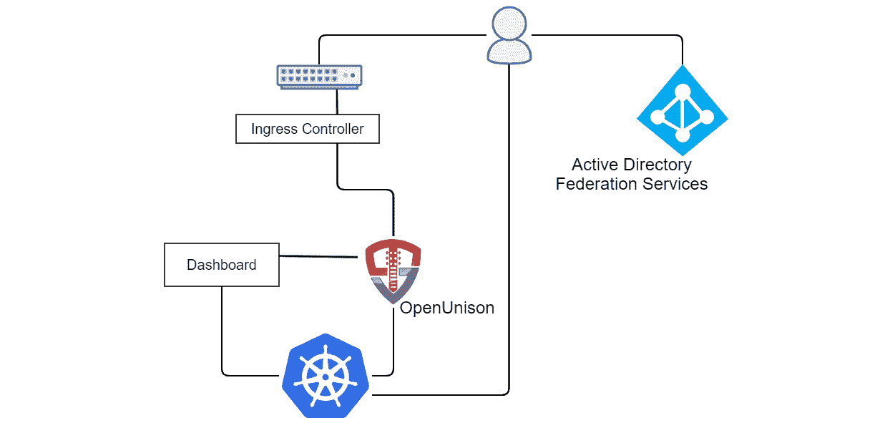

图 7.2–认证架构

对于我们的实现，我们将使用两个主机名:

*   **k8s . apps . X-X-X . nip . io**:访问 OpenUnison 门户，我们将在这里启动登录并获取令牌
*   **k8sdb.apps.X-X-X-X.nip.io**: Access to the Kubernetes dashboard

    重要说明

    作为一个快速复习，`nip.io`是一个公共 DNS 服务，它将从您的主机名中嵌入的那个返回一个 IP 地址。这在实验室环境中非常有用，在实验室环境中设置域名系统可能会很痛苦。在我们的示例中，X-X-X-X 是您的 Docker 主机的 IP。

当用户试图访问`https://k8s.apps.X-X-X-X.nip.io/`时，他们将被重定向到 ADFS，那里将收集他们的用户名和密码(甚至可能是一个多因素认证令牌)。ADFS 将生成一个断言，该断言将被数字签名，并包含我们用户的唯一标识以及他们的组分配。这个断言类似于`id_token`，我们之前已经检查过了，但是它不是 JSON，而是 XML。断言在一个特殊的网页中被发送到用户的浏览器，该网页包含一个表单，该表单会自动将断言提交回 OpenUnison。此时，OpenUnison 将在 OpenUnison 命名空间中创建用户对象，以存储用户信息并创建 OIDC 会话。

前面，我们描述了 Kubernetes 如何没有用户对象。Kubernetes 允许您使用**自定义资源定义** ( **CRDs** )扩展基础 API。OpenUnison 定义了一个用户 CRD 来帮助实现高可用性，并避免需要数据库来存储状态。这些用户对象不能用于 RBAC。

一旦用户登录到 OpenUnison，他们就可以获得他们的`kubectl`配置来使用命令行界面或使用 Kubernetes 仪表板，[https://Kubernetes . io/docs/tasks/access-application-cluster/web-ui-dashboard/](https://kubernetes.io/docs/tasks/access-application-cluster/web-ui-dashboard/)，从他们的浏览器访问集群。一旦用户准备好了，他们可以注销 OpenUnison，这将结束他们的会话并使他们的`refresh_token`无效，使得他们在再次登录之前无法使用`kubectl`或仪表板。如果他们离开办公桌去吃午饭而没有注销，当他们回来时，他们的`refresh_token`将已经过期，因此他们将不再能够在没有重新登录的情况下与 Kubernetes 进行交互。

现在我们已经了解了用户将如何登录并与 Kubernetes 交互，我们将部署 OpenUnison 并将其集成到集群中进行认证。

## 部署 OIDC

我们包含了两个安装脚本来自动化部署步骤。这些脚本`install-oidc-step1.sh`和 `install-oidc-step2.sh`位于本书的 GitHub 存储库中的`chapter7`目录中。

本节将解释脚本自动执行的所有手动步骤。

重要说明

如果您使用脚本安装 OIDC，您**必须**遵循以下流程才能成功部署:

第一步:运行`./install-oidc-step1.sh`脚本。

步骤 2:按照*注册 SAML2 测试实验室*部分中的程序注册 SAML2 测试实验室。

第三步:运行`./install-oidc-step2.sh`脚本完成 OIDC 部署。

使用 OpenUnison 将 OIDC 部署到 Kubernetes 集群需要五个步骤:

1.  部署仪表板。
2.  部署 OpenUnison 操作符。
3.  创造一个机密。
4.  创建`values.yaml`文件。
5.  展开图表。

让我们一个接一个地执行这些步骤。

### 部署 OpenUnison

仪表板是许多用户喜欢的功能。它提供了对资源的快速查看，而我们不需要使用 kubectl 命令行界面。多年来，它因为不安全而受到了一些不好的压力，但是如果部署正确，它是非常安全的。您可能读过或听说过的大多数故事都来自未正确设置的仪表板部署。我们将在 [*第 9 章*](09.html#_idTextAnchor246) *【保护Kubernetes斯仪表板】*中讨论此主题:

1.  首先，我们将从 https://github.com/kubernetes/dashboard:

    ```
    kubectl apply -f https://raw.githubusercontent.com/kubernetes/dashboard/v2.0.0/aio/deploy/recommended.yaml
    namespace/kubernetes-dashboard created
    serviceaccount/kubernetes-dashboard created
    service/kubernetes-dashboard created
    secret/kubernetes-dashboard-certs created
    secret/kubernetes-dashboard-csrf created
    secret/kubernetes-dashboard-key-holder created
    configmap/kubernetes-dashboard-settings created
    role.rbac.authorization.k8s.io/kubernetes-dashboard created
    clusterrole.rbac.authorization.k8s.io/kubernetes-dashboard created
    rolebinding.rbac.authorization.k8s.io/kubernetes-dashboard created
    clusterrolebinding.rbac.authorization.k8s.io/kubernetes-dashboard created
    deployment.apps/kubernetes-dashboard created
    service/dashboard-metrics-scraper created
    deployment.apps/dashboard-metrics-scraper created
    ```

    部署仪表板
2.  Next, we need to add the repository that contains OpenUnison to our Helm list. To add the Tremolo chart repository, use the `Helm repo add` command:

    ```
    Helm repo add tremolo https://nexus.tremolo.io/repository/Helm/
    https://nexus.tremolo.io/repository/Helm/"tremolo" has been added to your repositories
    ```

    重要说明

    Helm 是 Kubernetes 的包装经理。Helm 提供了一个工具，可以将“图表”部署到集群中，并帮助您管理部署状态。我们使用的是 Helm v3，它不需要您将任何组件(如 Tiller)部署到集群中就可以工作。

3.  Once added, you need to update the repository using the `Helm repo update` command:

    ```
    helm repo update
    Hang tight while we grab the latest from your chart repositories...
    ...Successfully got an update from the "tremolo" chart repository
    Update Complete. Happy Helming!
    ```

    您现在准备使用 Helm 图表部署 OpenUnison 操作器。

4.  首先，我们希望在名为`openunison`的新命名空间中部署 OpenUnison。我们需要在部署 Helm 图表之前创建名称空间:

    ```
    kubectl create ns openunison
    namespace/openunison created
    ```

5.  With the namespace created, you can deploy the chart into the namespace using Helm. To install a chart using Helm, use `Helm install <name> <chart> <options>`:

    ```
    helm install openunison tremolo/openunison-operator --namespace openunison
    NAME: openunison
    LAST DEPLOYED: Fri Apr 17 15:04:50 2020
    NAMESPACE: openunison
    STATUS: deployed
    REVISION: 1
    TEST SUITE: None
    ```

    操作员需要几分钟才能完成部署。

    重要说明

    操作员是 CoreOS 首创的概念，其目标是封装管理员可以执行的许多自动化任务。操作员通过观察特定 CRD 的变化并采取相应的行动来实现。OpenUnison 操作符寻找 OpenUnison 类型的对象，并将创建任何需要的对象。用 PKCS12 文件创建了一个机密；部署、服务和入口对象也都已创建。当您对 OpenUnison 对象进行更改时，操作者会根据需要对 Kubernetes 对象进行更新。例如，如果您更改了 OpenUnison 对象中的映像，操作者将更新部署，这将触发 Kubernetes 部署新的 pod。对于 SAML，操作员还会观察元数据，以便在元数据发生变化时，导入更新的证书。

6.  Once the operator has been deployed, we need to create a secret that will store passwords used internally by OpenUnison. Make sure to use your own values for the keys in this secret (remember to base64 encode them):

    ```
    kubectl create -f - <<EOF
     apiVersion: v1
     type: Opaque
     metadata:
     name: orchestra-secrets-source
     namespace: openunison
     data:
     K8S_DB_SECRET: cGFzc3dvcmQK
     unisonKeystorePassword: cGFzc3dvcmQK
     kind: Secret
    EOF
    secret/orchestra-secrets-source created
    ```

    重要说明

    从现在开始，我们将假设您使用的是抖音安全的测试身份提供商。该工具将允许您自定义用户的登录信息，而无需建立目录和身份提供商。前往 https://portal.apps.tremolo.io/**点击**注册**即可注册。**

    **为了提供 OIDC 环境的帐户，我们将使用一个 SAML2 测试实验室，所以在继续之前一定要注册。**

***   First, we need to need to log into the testing identity provider by going to [https://portal.apps.tremolo.io/](https://portal.apps.tremolo.io/) and clicking on the **SAML2 Test Lab** badge:

    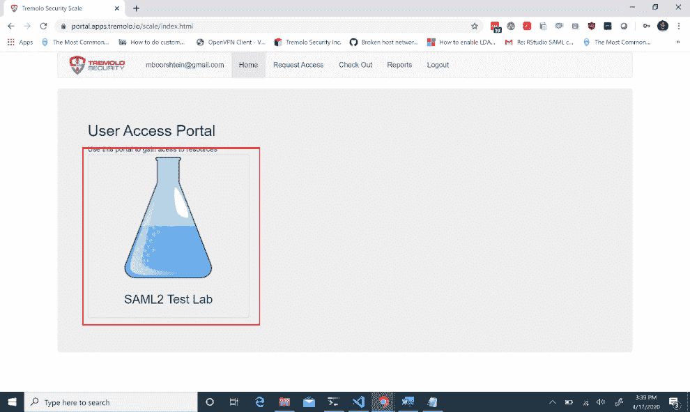

    图 7.3–SAML 2 测试实验室徽章

    *   Once you've clicked on the badge, you'll be presented with a screen that shows your test IdP metadata URL:

    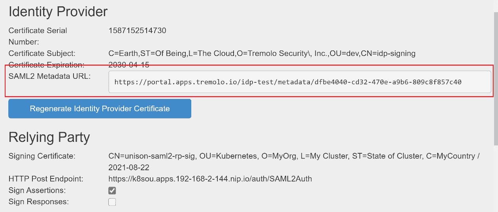

    图 7.4–测试身份提供者页面，突出显示 SAML2 元数据 URL

    复制此值并将其存储在安全的地方。

    *   Now, we need to create a `values.yaml` file that will be used to supply configuration information when we deploy OpenUnison. This book's GitHub repository contains a base file in the `chapter7` directory:

    ```
    network:
      openunison_host: "k8sou.apps.XX-XX-XX-XX.nip.io"
      dashboard_host: "k8sdb.apps.XX-XX-XX-XX.nip.io"
      api_server_host: ""
      session_inactivity_timeout_seconds: 900
      k8s_url: https://0.0.0.0:6443
    cert_template:
      ou: "Kubernetes"
      o: "MyOrg"
      l: "My Cluster"
      st: "State of Cluster"
      c: "MyCountry"
    image: "docker.io/tremolosecurity/openunison-k8s-login-saml2:latest"
    myvd_config_path: "WEB-INF/myvd.conf"
    k8s_cluster_name: kubernetes
    enable_impersonation: false
    dashboard:
      namespace: "kubernetes-dashboard"
      cert_name: "kubernetes-dashboard-certs"
      label: "k8s-app=kubernetes-dashboard"
      service_name: kubernetes-dashboard
    certs:
      use_k8s_cm: false
    trusted_certs: []
    monitoring:
      prometheus_service_account: system:serviceaccount:monitoring:prometheus-k8s
    saml:
      idp_url: https://portal.apps.tremolo.io/idp-test/metadata/dfbe4040-cd32-470e-a9b6-809c840
      metadata_xml_b64: ""
    ```

    您需要为部署更改以下值:

    *   `Network: openunison_host:`该值应该使用集群的 IP 地址，也就是 Docker 主机的 IP 地址；例如，`k8sou.apps.192-168-2=131.nip.io`。
    *   `Network: dashboard_host`:这个值应该使用你的集群的 IP 地址，也就是你的 Docker 主机的 IP 地址；例如，`k8sdb.apps.192-168-2-131.nip.io`。
    *   `saml: idp url`: This value should be the SAML2 metadata URL that you retrieved from the SAML2 lab page in the previous step.

        使用您自己的条目编辑或创建文件后，保存文件并继续部署您的 OIDC 提供商。

        *   要使用您的`values.yaml`文件部署 OpenUnison，请执行一个`Helm install`命令，该命令使用`-f`选项来指定`values.yaml`文件:

    ```
    helm install orchestra tremolo/openunison-k8s-login-saml2 --namespace openunison -f ./values.yaml
    NAME: orchestra
    LAST DEPLOYED: Fri Apr 17 16:02:00 2020
    NAMESPACE: openunison
    STATUS: deployed
    REVISION: 1
    TEST SUITE: None
    ```

    *   In a few minutes, OpenUnison will be up and running. Check the deployment status by getting the pods in the `openunison` namespace:

    ```
    kubectl get pods -n openunison
    NAME                                    READY   STATUS    RESTARTS   AGE
    openunison-operator-858d496-zzvvt       1/1    Running   0          5d6h
    openunison-orchestra-57489869d4-88d2v   1/1     Running   0          85s
    ```

    要完成 OIDC 部署，您还需要遵循另一个步骤:您需要与部署的依赖方一起更新 SAML2 实验室。

    *   现在 OpenUnison 正在运行，我们需要使用`values.yaml`文件中`network.openunison_host`的主机和`/auth/forms/saml2_rp_metadata.jsp`路径

    ```
    curl --insecure https://k8sou.apps.192-168-2-131.nip.io/auth/forms/saml2_rp_metadata.jsp
    <?xml version="1.0" encoding="UTF-8"?><md:EntityDescriptor xmlns:md="urn:oasis:names:tc:SAML:2.0:metadata" ID="fc334f48076b7b13c3fcc83d1d116ac2decd7d665" entityID="https://k8sou.apps.192-168-2-131.nip.io/auth/SAML2Auth">
    .
    .
    .
    ```

    从 OpenUnison 获取 SAML2 元数据*   Copy the output, paste it into the testing identity provider where it says **Meta Data**, and click **Update Relying Party**:

    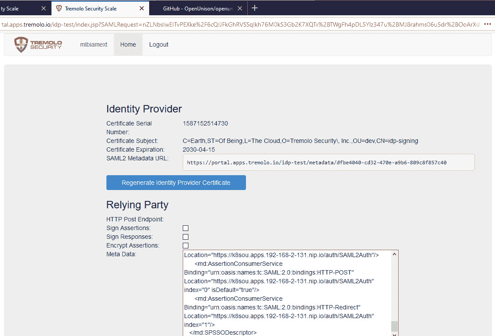

    图 7.5–使用依赖方元数据测试身份提供者

    *   Finally, we need to add some attributes to our test user. Add the attributes shown in the following screenshot:

    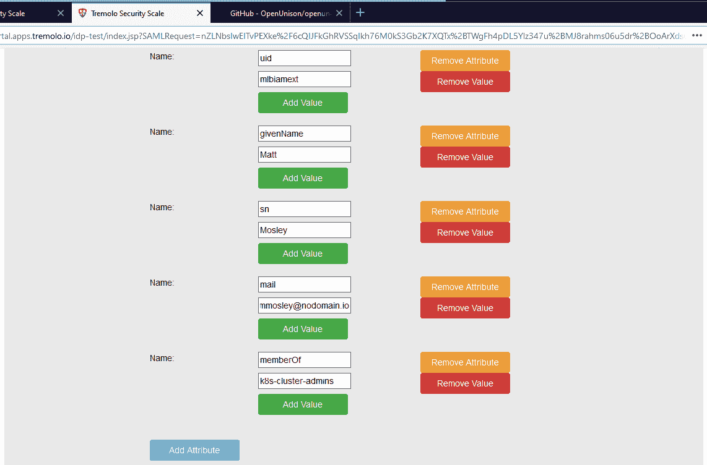

    图 7.6–身份提供者测试用户配置

    *   接下来，点击**更新测试用户数据**保存你的属性。这样，您就可以登录了。*   You can log into the OIDC provider using any machine on your network by using the assigned nip.io address. Since we will test access using the dashboard, you can use any machine with a browser. Navigate your browser to `network.openunison_host` in your `values.yaml` file. Enter your testing identity provider credentials, if needed, and then click **Finish Login** at the bottom of the screen. You should now be logged into OpenUnison:

    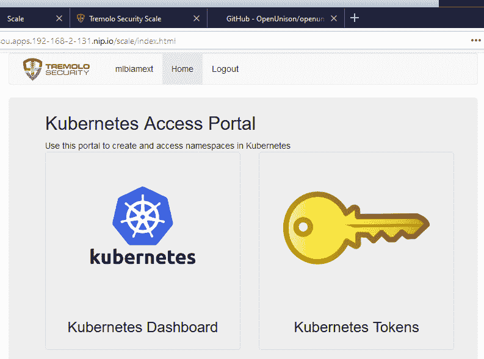

    图 7.7–open unison 主屏幕

    *   让我们通过点击 **Kubernetes 仪表板**链接来测试 OIDC 提供商。当查看初始仪表盘屏幕时，不要惊慌–您将看到如下内容:**

 **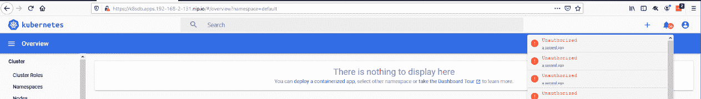

图 7.8–在单点登录与应用编程接口服务器集成完成之前的Kubernetes仪表板

看起来有很多错误！我们在仪表板上，但似乎没有任何授权。这是因为应用编程接口服务器还不信任 OpenUnison 生成的令牌。下一步是告诉 Kubernetes 信任 OpenUnison 作为其 OpenID Connect 身份提供者。

### 将Kubernetes应用编程接口配置为使用 OIDC

此时，您已经将 OpenUnison 部署为 OIDC 提供者，它正在工作，但是您的 Kubernetes 集群尚未配置为将其用作提供者。要将 API 服务器配置为使用 OIDC 提供程序，您需要向 API 服务器添加 OIDC 选项，并提供 OIDC 证书，以便 API 信任 OIDC 提供程序。

因为我们使用的是 KinD，所以我们可以使用几个`kubectl`和`docker`命令添加所需的选项。

为了向 API 服务器提供 OIDC 证书，我们需要检索证书并将其复制到 KinD 主服务器。我们可以在 Docker 主机上使用两个命令来实现这一点:

1.  第一个命令从其机密中提取 OpenUnison 的 TLS 证书。这与 OpenUnison 的入口对象引用的机密相同。我们使用`jq`实用程序从机密中提取数据，然后 base64 将其解码:

    ```
    kubectl get secret ou-tls-certificate -n openunison -o json | jq -r '.data["tls.crt"]' | base64 -d > ou-ca.pem
    ```

2.  第二个命令将证书复制到主服务器进入`/etc/Kubernetes/pki`目录:

    ```
    docker cp ou-ca.pem cluster01-control-plane:/etc/kubernetes/pki/ou-ca.pem
    ```

3.  正如我们前面提到的，要将 API 服务器与 OIDC 集成，我们需要有 API 选项的 OIDC 值。要列出我们将使用的选项，请描述`openunison`名称空间中的`api-server-config`配置图:

    ```
    kubectl describe configmap api-server-config -n openunison
    Name:         api-server-config
    Namespace:    openunison
    Labels:       <none>
    Annotations:  <none>
    Data
    ====
    oidc-api-server-flags:
    ----
    --oidc-issuer-url=https://k8sou.apps.192-168-2-131.nip.io/auth/idp/k8sIdp
    --oidc-client-id=kubernetes
    --oidc-username-claim=sub
    --oidc-groups-claim=groups
    --oidc-ca-file=/etc/kubernetes/pki/ou-ca.pem
    ```

4.  接下来，编辑应用编程接口服务器配置。OpenID Connect 是通过更改 API 服务器上的标志来配置的。这就是为什么托管 Kubernetes 通常不提供 OpenID Connect 作为一个选项，但是我们将在本章后面讨论这个问题。每个发行版对这些更改的处理方式都不同，因此请查看您的供应商文档。对于 KinD，shell 进入控制平面并更新清单文件:

    ```
    docker exec -it cluster-auth-control-plane bash
    apt-get update
    apt-get install vim
    vi /etc/kubernetes/manifests/kube-apiserver.yaml 
    ```

5.  在名为`--oidc-client`和`–oidc-issuer-url`的`command`下寻找两个选项。用产生应用编程接口服务器标志的前面命令的输出替换这两个。确保在前面加上间距和破折号(`-`)。完成后应该是这样的:

    ```
        - --kubelet-preferred-address-types=InternalIP,ExternalIP,Hostname
        - --oidc-issuer-url=https://k8sou.apps.192-168-2-131.nip.io/auth/idp/k8sIdp
        - --oidc-client-id=kubernetes
        - --oidc-username-claim=sub
        - --oidc-groups-claim=groups
        - --oidc-ca-file=/etc/kubernetes/pki/ou-ca.pem
        - --proxy-client-cert-file=/etc/kubernetes/pki/front-proxy-client.crt
    ```

6.  Exit vim and the Docker environment (*ctl+d*) and then take a look at the `api-server` pod:

    ```
    kubectl get pod kube-apiserver-cluster-auth-control-plane -n kube-system
    NAME                      READY   STATUS    RESTARTS  AGE kube-apiserver-cluster-auth-control-plane   1/1  Running 0 73s  
    ```

    请注意，它只有岁。那是因为 KinD 看到清单中有的变化，重新启动了 API 服务器。

    重要说明

    API 服务器吊舱被称为“静态吊舱”。这个吊舱不能直接更换；必须从磁盘上的清单中更改其配置。这为您提供了一个由应用编程接口服务器作为容器管理的过程，但没有为您提供一个在出现问题时需要直接在 EtcD 中编辑 pod 清单的情况。

### 验证 OIDC 集成

一旦 OpenUnison 和 API 服务器已经集成，我们需要测试连接是否工作:

1.  要测试集成，请重新登录 OpenUnison，然后再次单击 **Kubernetes 仪表板**链接。
2.  Click on the bell in the upper right and you'll see a different error:

    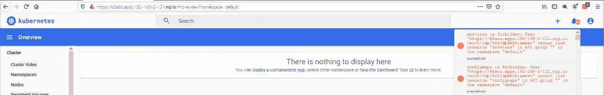

    图 7.9–单点登录已启用，但用户无权访问任何资源

    OpenUnison 之间的 SSO，你会看到 Kubernetes 正在工作！但是，新的错误，**服务被禁止:用户 https://...**，是授权错误，**不是**是认证错误。应用编程接口服务器知道我们是谁，但不让我们访问应用编程接口。

3.  我们将在下一章深入探讨 RBAC 和授权的细节，但是现在，创建这个 RBAC 绑定:

    ```
    kubectl create -f - <<EOF
     apiVersion: rbac.authorization.k8s.io/v1
     kind: ClusterRoleBinding
     metadata:
     name: ou-cluster-admins
     subjects:
     - kind: Group
     name: k8s-cluster-admins
     apiGroup: rbac.authorization.k8s.io
     roleRef:
     kind: ClusterRole
     name: cluster-admin
     apiGroup: rbac.authorization.k8s.io
    EOF
    clusterrolebinding.rbac.authorization.k8s.io/ou-cluster-admins created
    ```

4.  最后，返回仪表板，您将看到您可以完全访问您的集群，并且所有的错误消息都消失了。

API 服务器和 OpenUnison 现在已连接。此外，还创建了一个 RBAC 策略，使我们的测试用户能够以管理员身份管理集群。通过登录到 Kubernetes 仪表板来验证访问，但是大多数交互将使用`kubectl`命令进行。下一步是验证我们能够使用`kubectl`访问集群。

### 将您的令牌用于 kubectl

重要说明

本节假设您的网络上有一台机器，该机器有一个浏览器并且`kubectl`正在运行。

使用仪表板有它的用例，但是你可能会在一天的大部分时间里使用`kubectl`而不是仪表板与应用编程接口服务器交互。在本节中，我们将解释如何检索您的 JWT 以及如何将其添加到您的 Kubernetes 配置文件中:

1.  You can retrieve you token from the OpenUnison dashboard. Navigate to the OpenUnison home page and click on the key that says **Kubernetes Tokens**. You'll see a screen that looks as follows:

    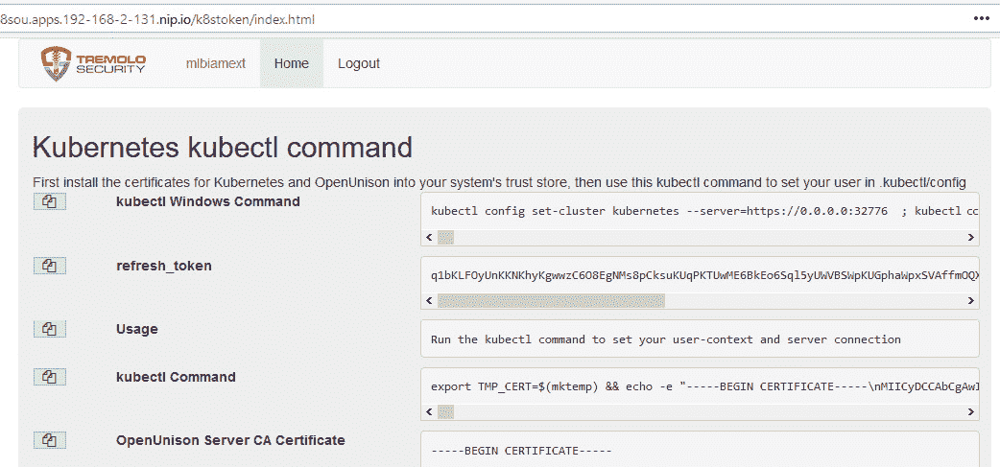

    图 7.10–OpenUnison kube CTL 配置工具

    OpenUnison 提供了一个命令行，您可以将其复制并粘贴到您的主机会话中，从而将所有必需的信息添加到您的配置中。

2.  首先，点击`kubectl`命令旁边的双文档按钮，将你的`kubectl`命令复制到你的缓冲区。让网络浏览器在后台打开。
3.  您可能希望在粘贴来自 OpenUnison 的`kubectl`命令之前备份您的原始配置文件:

    ```
    cp .kube/config .kube/config.bak
    export KUBECONFIG=/tmp/k
    kubectl get nodes
    W0423 15:46:46.924515    3399 loader.go:223] Config not found: /tmp/k error: no configuration has been provided, try setting KUBERNETES_MASTER environment variable
    ```

4.  然后，转到您的主机控制台并将命令粘贴到控制台中(以下输出已被缩短，但您的粘贴将以相同的输出开始):

    ```
    export TMP_CERT=$(mktemp) && echo -e "-----BEGIN CER. . .
    Cluster "kubernetes" set.
    Context "kubernetes" modified.
    User "mlbiamext" set.
    Switched to context "kubernetes".
    ```

5.  现在，验证您可以使用`kubectl get nodes` :

    ```
    kubectl get nodes
    NAME                         STATUS   ROLES    AGE   VERSION
    cluster-auth-control-plane   Ready    master   47m   v1.17.0
    cluster-auth-worker          Ready    <none>   46m   v1.17.0
    ```

    查看集群节点
6.  您现在使用的是您的登录凭据，而不是主证书！工作时，会话将会刷新。退出 OpenUnison 并观察节点列表。一两分钟内，您的令牌将过期，不再工作:

    ```
    $ kubectl get nodes
    Unable to connect to the server: failed to refresh token: oauth2: cannot fetch token: 401 Unauthorized
    ```

恭喜你！现在，您已经设置了您的集群，它可以执行以下操作:

*   使用企业现有的认证系统，使用 SAML2 进行认证。
*   使用来自您的集中式认证系统的组来授权对 Kubernetes 的访问(我们将在下一章中详细介绍如何授权)。
*   使用集中式凭据让您的用户能够访问 CLI 和仪表板。
*   通过使用提供超时方法的短期令牌来维护企业的法规遵从性要求。
*   从用户的浏览器到入口控制器，再到 OpenUnison、仪表板，最后是 API 服务器，一切都使用 TLS。

接下来，您将学习如何将集中式认证集成到托管集群中。

# 引入模拟，将认证与云管理的集群相集成

使用谷歌、亚马逊、微软和数字海洋等云供应商的托管Kubernetes服务非常流行。当涉及到这些服务时，通常可以非常快速地启动和运行，并且它们都共享一个公共线程:它们不支持 OpenID Connect。

在本章的前面，我们讨论了 Kubernetes 如何通过 webhooks 支持自定义认证解决方案，除非您是公共云提供商或 Kubernetes 系统的其他主机，否则您永远不应该使用这种方法。事实证明，几乎每个云供应商都有自己的方法来使用这些 webhooks，它们使用自己的身份和访问管理实现。既然如此，为什么不直接使用供应商提供的东西呢？您可能不想使用云供应商的 IAM 系统有几个原因:

*   **技术**:您可能希望以安全的方式支持云供应商没有提供的功能，例如仪表板。
*   **组织**:将对托管 Kubernetes 的访问与该云的 IAM 紧密耦合会给云团队带来额外的负担，这意味着他们可能不想管理对您的集群的访问。
*   **用户体验**:您的开发人员和管理员可能需要跨多个云工作。提供一致的登录体验使他们更容易，并且需要学习的工具更少。
*   **安全性和合规性**:云实现可能无法提供符合企业安全需求的选择，例如短期令牌和空闲超时。

话虽如此，还是有理由使用云供应商的实现。不过，你需要平衡需求。如果您想继续对托管的 Kubernetes 使用集中式认证和授权，您需要学习如何使用模拟。

## 什么是模仿？

Kubernetes 模拟是一种告诉应用编程接口服务器你是谁的方式，而不需要知道你的凭证或者强迫应用编程接口服务器信任一个 OpenID Connect IdP。当您使用`kubectl`时，API 服务器将接收一个被授权模拟用户的服务帐户或识别证书，以及一组告诉 API 服务器代理代表谁的头，而不是直接接收您的`id_token`:

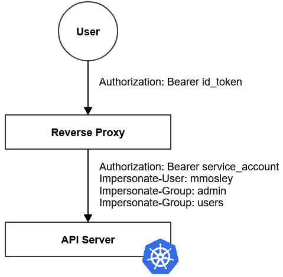

图 7.11–使用模拟时用户如何与应用编程接口服务器交互的示意图

反向代理负责确定如何从用户提供的`id_token`(或任何其他令牌)映射到`Impersonate-User`和`Impersonate-Group` HTTP 头。仪表板永远不应该使用特权身份进行部署，模拟的能力属于特权身份。要允许 2.0 仪表板的模拟，请使用类似的模型，但不要转到 API 服务器，而是转到仪表板:

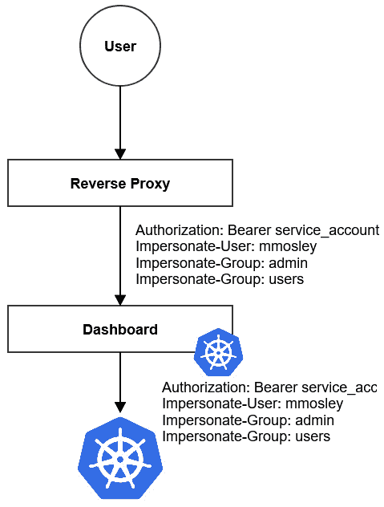

图 7.12–带模拟功能的 Kubernetes 仪表板

用户与反向代理交互就像任何网络应用一样。反向代理使用自己的服务帐户并添加模拟头。仪表板在所有请求上将该信息传递给应用编程接口服务器。仪表板从来没有自己的身份。

## 安全考虑

服务帐户有一个特定的超能力:它可以用来冒充任何人(取决于你的 RBAC 定义)。如果您从集群内部运行您的反向代理，服务帐户是可以的，特别是如果与`TokenRequest`应用编程接口相结合以保持令牌短暂。在这一章的前面，我们谈到了`ServiceAccount`对象没有过期。这一点很重要，因为如果您在集群之外托管反向代理，那么如果它被破坏了，有人可以像任何人一样使用该服务帐户来访问 API 服务。确保您经常轮换该服务帐户。如果您在群集外运行代理，最好使用寿命较短的证书，而不是服务帐户。

在群集上运行代理时，您需要确保它已被锁定。它至少应该在自己的命名空间中运行。也不是`kube-system`。你想尽量减少谁有权访问。使用多因素认证来访问该名称空间始终是一个好主意，控制哪些 pods 可以访问反向代理的网络策略也是如此。

基于我们刚刚了解到的关于模拟的概念，下一步是更新我们集群的配置以使用模拟，而不是直接使用 OpenID Connect。您不需要云管理的集群来使用模拟。

# 为模拟配置集群

让我们为集群部署一个模拟代理。假设您正在重用您现有的集群，我们首先需要删除我们的 orchestra Helm 部署(这不会删除操作符；我们想保留 OpenUnison 运算符)。那么，让我们开始吧:

1.  Run the following command to delete our `orchestra` Helm deployment:

    ```
    $ helm delete orchestra --namespace openunison
    release "orchestra" uninstalled
    ```

    在`openunison`命名空间中运行的唯一一个 pod 是我们的运算符。请注意，所有的机密、入口、部署、服务和其他由操作员在部署管弦乐队掌舵图时创建的对象都已消失。

2.  Next, redeploy OpenUnison, but this time, update our Helm chart to use impersonation. Edit the `values.yaml` file and add the two bold lines shown in the following example file:

    ```
    network:
      openunison_host: "k8sou.apps.192-168-2-131.nip.io"
      dashboard_host: "k8sdb.apps.192-168-2-131.nip.io"
     api_server_host: "k8sapi.apps.192-168-2-131.nip.io"
      session_inactivity_timeout_seconds: 900
      k8s_url: https://192.168.2.131:32776
    cert_template:
      ou: "Kubernetes"
      o: "MyOrg"
      l: "My Cluster"
      st: "State of Cluster"
      c: "MyCountry"
    image: "docker.io/tremolosecurity/openunison-k8s-login-saml2:latest"
    myvd_config_path: "WEB-INF/myvd.conf"
    k8s_cluster_name: kubernetes
    enable_impersonation: true
    dashboard:
      namespace: "kubernetes-dashboard"
      cert_name: "kubernetes-dashboard-certs"
      label: "k8s-app=kubernetes-dashboard"
      service_name: kubernetes-dashboard
    certs:
      use_k8s_cm: false
    trusted_certs: []
    monitoring:
      prometheus_service_account: system:serviceaccount:monitoring:prometheus-k8s
    saml:
      idp_url: https://portal.apps.tremolo.io/idp-test/metadata/dfbe4040-cd32-470e-a9b6-809c8f857c40
      metadata_xml_b64: ""
    ```

    我们在这里做了两个改变:

    *   为应用编程接口服务器代理添加了主机
    *   Enabled impersonation

        这些更改启用了 OpenUnison 的模拟功能，并生成了一个额外的 RBAC 绑定，以在 OpenUnison 的服务帐户上启用模拟。

3.  用新的`values.yaml`文件运行掌舵图:

    ```
    helm install orchestra tremolo/openunison-k8s-login-saml2 –namespace openunison -f ./values.yaml
    NAME: orchestra
    LAST DEPLOYED: Thu Apr 23 20:55:16 2020
    NAMESPACE: openunison
    STATUS: deployed
    REVISION: 1
    TEST SUITE: None
    ```

4.  就像我们与 Kubernetes 的 OpenID Connect 集成一样，完成与测试身份提供者的集成。首先，获取元数据:

    ```
    $ curl --insecure https://k8sou.apps.192-168-2-131.nip.io/auth/forms/saml2_rp_metadata.jsp
    <?xml version="1.0" encoding="UTF-8"?><md:EntityDescriptor xmlns:md="urn:oasis:names:tc:SAML:2.0:metadata" ID="f4a4bacd63709fe486c30ec536c0f552a506d0023" entityID="https://k8sou.apps.192-168-2-131.nip.io/auth/SAML2Auth">
     <md:SPSSODescriptor WantAssertionsSigned="true" protocolSupportEnumeration="urn:oasis:names:tc:SAML:2.0:
    protocol">
    .
    .
    .
    ```

5.  接下来，登录[https://portal.apps.tremolo.io/](https://portal.apps.tremolo.io/)，选择测试身份提供者，并将生成的元数据复制并粘贴到测试身份提供者中，其中显示**元数据**。
6.  最后，要更新变更，点击**更新依赖方**。

新的 OpenUnison 部署被配置为应用编程接口服务器的反向代理，并已与我们的 SAML2 身份提供商重新集成。没有要设置的群集参数，因为模拟不需要任何群集端配置。下一步是测试集成。

## 测试模拟

现在，让我们测试一下我们的模拟设置。请遵循以下步骤:

1.  在浏览器中，输入 OpenUnison 部署的网址。这与您最初在 OIDC 部署时使用的网址相同。
2.  Log into OpenUnison and then click on the dashboard. You should recall that the first time you opened the dashboard on the your initial OpenUnison deployment, you received a lot of errors until you created the new RBAC role, which granted access to the cluster.

    启用模拟并打开仪表板后，您应该不会看到任何错误消息，即使系统提示您输入新证书警告，并且没有告诉应用编程接口服务器信任您在仪表板上使用的新证书。

3.  点击右上角的小圆形图标，查看您的登录身份。
4.  Next, go back to the main OpenUnison dashboard and click on the **Kubernetes Tokens** badge.

    请注意，传递给 kubectl 的`--server`标志不再有 IP。相反，它的主机名来自`values.yaml`文件中的`network.api_server_host`。这是模仿。您现在不是直接与应用编程接口服务器交互，而是与 OpenUnison 的反向代理交互。

5.  最后，让我们将`kubectl`命令复制并粘贴到一个 shell 中:

    ```
    export TMP_CERT=$(mktemp) && echo -e "-----BEGIN CERTIFI...
    Cluster "kubernetes" set.
    Context "kubernetes" created.
    User "mlbiamext" set.
    Switched to context "kubernetes".
    ```

6.  要验证您是否具有访问权限，请列出集群节点:

    ```
     kubectl get nodes
    NAME                         STATUS   ROLES    AGE    VERSION
    cluster-auth-control-plane   Ready    master   6h6m   v1.17.0
    cluster-auth-worker          Ready    <none>   6h6m   v1.17.0
    ```

7.  就像你集成了 OpenID Connect 的原始部署一样，一旦你退出了 OpenUnison 页面，在一两分钟内，令牌就会过期，你将无法刷新它们:

    ```
    kubectl get nodes
    Unable to connect to the server: failed to refresh token: oauth2: cannot fetch token: 401 Unauthorized
    ```

现在，您已经验证了您的集群在模拟方面工作正常。模拟反向代理(OpenUnison)不是直接向应用编程接口服务器进行认证，而是用正确的模拟头将所有请求转发到应用编程接口服务器。通过提供登录和注销过程以及集成活动目录组，您仍然可以满足企业的需求。

# 配置模拟而不打开统一

OpenUnison 操作人员自动执行了几个关键步骤来实现模拟。还有一些项目是专门为 Kubernetes 设计的，比如 JetStack 的 OIDC 代理([https://github.com/jetstack/kube-oidc-proxy](https://github.com/jetstack/kube-oidc-proxy))，旨在让使用模拟变得更容易。您可以使用任何可以生成正确标头的反向代理。当你自己做这件事时，有两个关键事项需要理解。

## 模仿 RBAC 策略

下一章将介绍 RBAC，但目前，授权服务帐户进行模拟的正确策略如下:

```
apiVersion: rbac.authorization.k8s.io/v1
kind: ClusterRole
metadata:
  name: impersonator
rules:
- apiGroups:
  - ""
  resources:
  - users
  - groups
  verbs:
  - impersonate
```

要限制可以模拟哪些帐户，请将`resourceNames`添加到您的规则中。

## 默认组

模拟用户时，Kubernetes 不会将默认组`system:authenticated`添加到模拟组列表中。当使用反向代理时，如果不知道为该组添加头，请配置代理手动添加。否则，像调用`/api`端点这样的简单操作将会失败，因为这对于除集群管理员之外的任何人来说都是未经授权的。

# 总结

本章详细介绍了 Kubernetes 如何识别用户及其成员所在的组。我们详细介绍了应用编程接口服务器如何与身份交互，并探索了几种认证选项。最后，我们详细介绍了 OpenID Connect 协议及其在 Kubernetes 中的应用。

了解 Kubernetes 如何对用户进行认证以及 OpenID Connect 协议的细节是将安全性构建到集群中的重要部分。了解细节以及它们如何应用于常见的企业需求，将有助于您决定向集群进行认证的最佳方式，并为为什么应该避免我们探索的反模式提供理由。

在下一章中，我们将应用我们的认证过程来授权对 Kubernetes 资源的访问。了解某人是谁并不足以保护您的集群。你还需要控制他们可以访问的内容。

## 问题

1.  OpenID Connect is a standard protocol with extensive peer review and usage.

    A.真实的

    B.错误的

2.  Which token does Kubernetes use to authorize your access to an API?

    A.`access_token`

    B.`id_token`

    C.`refresh_token`

    D.`certificate_token`

3.  In which situation is certificate authentication a good idea?

    A.管理员和开发人员的日常使用

    B.从外部 CI/CD 管道和其他服务访问

    C.当所有其他认证解决方案都不可用时，在紧急情况下击碎玻璃

4.  How should you identify users accessing your cluster?

    A.电子邮件地址

    B. Unix 登录 ID

    C.Windows 登录标识

    D.不基于用户名的不可变标识

5.  Where are OpenID Connect configuration options set in Kubernetes?

    A.取决于分布

    B.在配置映射对象中

    C.在机密中

    D.在 Kubernetes API 服务器可执行文件上设置为标志

6.  When using impersonation with your cluster, the groups your user brings are the only ones needed.

    A.真实的

    B.错误的

7.  The dashboard should have its own privileged identity to work properly.

    A.真实的

    B.错误的**