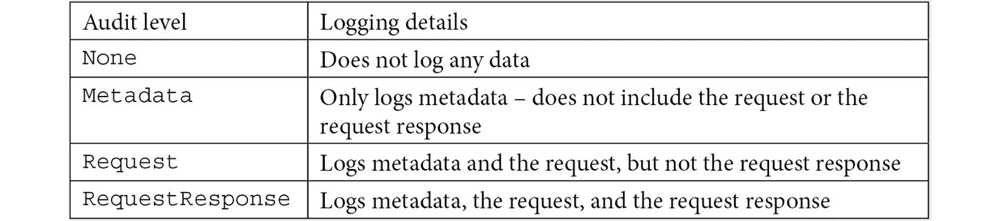
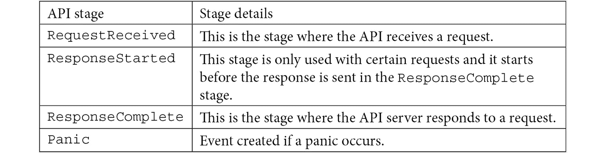
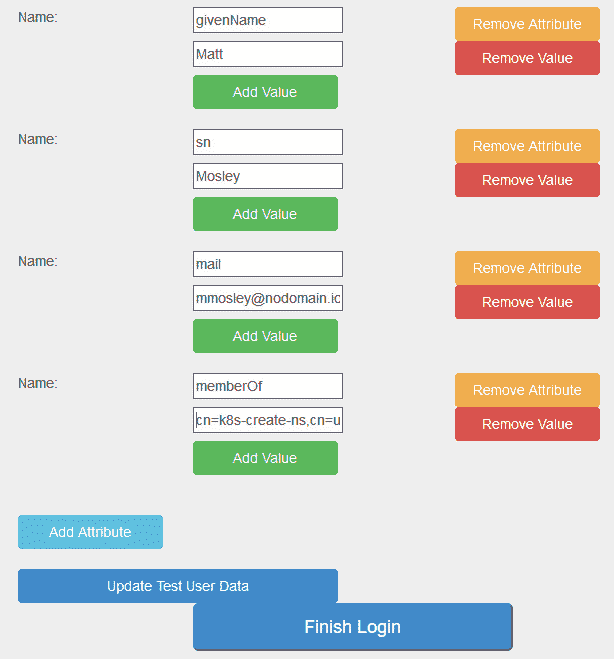

# *第八章* : RBAC 政策与审计

身份验证只是管理集群中访问的第一步。一旦授予对群集的访问权限，根据帐户是用于自动系统还是用户，限制帐户可以做什么就很重要。授权对资源的访问是防止意外问题和不良行为者滥用集群的重要部分。

在本章中，我们将详细介绍 Kubernetes 如何通过其**基于角色的访问控制** ( **RBAC** )模型授权访问。本章的第一部分将深入探讨Kubernetes斯 RBAC 是如何配置的，有哪些选项可用，并将理论转化为实际例子。调试和排除 RBAC 政策的故障将是下半部分的重点。

在本章中，我们将涵盖以下主题:

*   RBAC 简介
*   将企业身份映射到 Kubernetes 以授权访问资源
*   命名空间多租户
*   不可动摇的审计
*   使用`audit2rbac`调试策略

# 技术要求

本章有以下技术要求:

*   运行配置来自 [*第 7 章*](07.html#_idTextAnchor203)*的 KinD 集群，将身份验证集成到您的集群中*
*   从 [*第 6 章*](06.html#_idTextAnchor174)*服务、负载平衡和外部域名系统*访问 SAML2 实验室

您可以在以下 GitHub 存储库中访问本章的代码:[https://GitHub . com/PacktPublishing/Kubernetes-and-Docker-The-Complete-Guide](https://github.com/PacktPublishing/Kubernetes-and-Docker-The-Complete-Guide)。

# RBAC 简介

在我们进入 RBAC 之前，让我们快速了解一下 Kubernetes 和访问控制的历史。

在 Kubernetes 1.6 之前，访问控制基于**基于属性的访问控制** ( **ABAC** )。顾名思义，ABAC 通过比较规则和属性来提供访问，而不是通过角色来提供访问。分配的属性可以分配给任何类型的数据，包括用户属性、对象、环境、位置等。

过去，要为 ABAC 配置 Kubernetes 集群，必须在 API 服务器上设置两个值:

*   `--authorization-policy-file`
*   `--authorization-mode=ABAC`

`authorization-policy-file`是 API 服务器上的本地文件。因为它是每个应用编程接口服务器上的本地文件，所以对文件的任何更改都需要对主机的特权访问，并且需要您重新启动应用编程接口服务器。可以想象，更新 ABAC 策略的过程变得很困难，任何即时的更改都需要在重新启动 API 服务器时短暂中断。

从 Kubernetes 1.6 开始， **RBAC** 成为授权访问资源的首选方法。与 **ABAC** 不同， **RBAC** 使用 Kubernetes 原生对象，更新无需重启 API 服务器即可反映。 **RBAC** 也兼容不同的认证方式。从这里开始，我们将重点关注如何制定 RBAC 政策并将其应用于您的集群。

# 什么是角色？

在 Kubernetes 中，角色是一种将权限绑定到一个可以描述和配置的对象中的方式。角色有规则，规则是资源和动词的集合。向后看，我们有以下几点:

*   **动词**:在一个 API 上可以采取的动作，比如读(`get`)、写(`create`、`update`、`patch`、`delete`)或者列表观看。
*   **资源**:要应用动词的 API 的名称，如`services`、`endpoints`等。也可以列出特定的子资源。可以对特定资源进行命名，以提供对对象的非常特定的权限。

角色没有说谁可以在资源上执行动词——这是由`RoleBindings`和`ClusterRoleBindings`处理的。我们将在*角色绑定和集群角色绑定*部分了解更多信息。

重要说明

“角色”一词可以有多种含义，RBAC 经常在其他语境中使用。在企业世界中，术语“角色”通常与业务角色相关联，用于将权利传递给该角色，而不是特定的人。例如，企业可以向所有应付账款员工分配签发支票的能力，而不是为应付账款部门的每个成员创建签发支票的特定权限的特定分配。当有人在角色之间移动时，他们会失去旧角色的权限，而获得新角色的权限。在从应付账款转移到应收账款的情况下，用户将失去支付能力并获得接受支付的能力。通过将权限绑定到角色，而不是个人，权限的更改会随着角色的更改而自动发生，而不必手动切换每个用户的权限。这是 RBAC 这个词更“经典”的用法。

将构建规则的每个资源由以下内容标识:

*   `apiGroups`:资源所属组的列表
*   `resources`:资源(以及潜在的子资源)的对象类型的名称
*   `resourceNames`:应用此规则的特定对象的可选列表

每个规则*必须*有一个**API group**和**资源**的列表。**资源名称**可选。

重要说明

如果您发现自己授权从命名空间中访问该命名空间中的特定对象，那么是时候重新考虑您的授权策略了。Kubernetes 的租户边界是命名空间。除了非常具体的原因之外，在 RBAC 角色中命名特定的 Kubernetes 对象是一种反模式，应该避免。当特定对象由 RBAC 角色命名时，考虑分解它们所在的命名空间来创建单独的命名空间。

一旦在规则中标识了资源，就可以指定谓词。动词是可以在资源上采取的动作，提供对 Kubernetes 中对象的访问。

如果想要访问的对象应该是`all`，则不需要添加每个动词；相反，通配符可用于识别所有**动词**、**资源**或 **apiGroups** 。

## 确定角色

Kubernetes 授权页面([https://Kubernetes . io/docs/reference/access-authn-authz/RBAC/](https://kubernetes.io/docs/reference/access-authn-authz/rbac/))使用以下角色作为示例，允许某人获取 pod 及其日志的详细信息:

```
apiVersion: rbac.authorization.k8s.io/v1
kind: Role
metadata:
  namespace: default
  name: pod-and-pod-logs-reader
rules:
- apiGroups: [""]
  resources: ["pods", "pods/log"]
  verbs: ["get", "list"]
```

向后工作以确定这个角色是如何定义的，我们将从`resources`开始，因为它是最容易找到的方面。Kubernetes 中的所有对象都由 URL 表示。如果您想获取默认命名空间中所有关于 pod 的信息，您可以调用`/api/v1/namespaces/default/pods` URL，如果您想获取特定 pod 的日志，您可以调用`/api/v1/namespaces/default/pods/mypod/log` URL。

URL 模式将适用于所有命名空间范围的对象。`pods`和`pods/log`一样排到`resources`。当试图确定您想要授权哪些资源时，请使用位于[https://kubernetes.io/docs/reference/#api-reference](https://kubernetes.io/docs/reference/#api-reference)的Kubernetes斯 API 文档中的`api-reference`文档。

如果您试图访问对象名称之后的附加路径组件(如状态和登录 pods)，则需要明确授权。授权 pods 不会立即授权日志或状态。

基于对`resources`的 URL 映射的使用，你的下一个想法可能是`verbs`将是 HTTP 动词。事实并非如此。Kubernetes语中没有`GET`动词。动词由应用编程接口服务器中对象的模式定义。好消息是 HTTP 动词和 RBAC 动词之间有一个静态映射。看这个网址，注意在`PodSecurityPolicies`和模拟的 HTTP 动词上面有动词。这是因为 **RBAC** 模型不仅仅用于授权特定的 API，还用于授权谁可以模拟用户以及如何分配`PodSecurityPolicy`对象。本章的重点将是标准的 HTTP 动词映射。

最后要识别的成分是`apiGroups`。这是 URL 模型的另一个不一致的地方。`pods`是“核心”集团的一部分，但`apiGroups`名单只是一个空字符串(`""`)。这些是旧的 API，是最初的 Kubernetes 的一部分。大多数其他应用编程接口将在一个应用编程接口组中，该组将是其网址的一部分。您可以通过查看您要授权的对象的应用编程接口文档来找到该组。

至少可以说，RBAC 模型中的不一致会使调试变得困难。本章的最后一个实验将完成调试过程，并消除定义规则时的许多猜测。

既然我们已经定义了角色的内容以及如何定义特定的权限，那么需要注意的是，角色可以应用于名称空间和集群级别。

## 角色与集群角色

RBAC 规则的范围可以是特定的名称空间或整个集群。以我们前面的为例，如果我们将其定义为集群角色而不是角色，并删除命名空间，我们将拥有一个角色，该角色授权某人获取集群中所有单元的详细信息和日志。这个新角色也可以在单独的名称空间中使用，以将权限分配给特定名称空间中的 pods:

```
apiVersion: rbac.authorization.k8s.io/v1
kind: ClusterRole
metadata:
  name: cluster-pod-and-pod-logs-reader
rules:
- apiGroups: [""]
  resources: ["pods", "pods/log"]
  verbs: ["get", "list"]
```

该权限是在集群中全局应用还是在特定命名空间的范围内应用，取决于它如何绑定到它所应用的主题。这将在*角色绑定和集群角色绑定*一节中介绍。

除了在集群中应用一组规则之外，集群角色还用于将规则应用于未映射到命名空间的资源，例如 PersistentVolume 和 StorageClass 对象。

在了解了角色的定义之后，让我们来了解针对特定目的设计角色的不同方式。在接下来的部分中，我们将研究定义角色的不同模式及其在集群中的应用。

## 负面角色

最常见的授权请求之一是“我能写一个角色让我做除了 xyz 以外的所有事情吗？”。在 RBAC，答案是*否*。RBAC 要求要么允许每种资源，要么列举具体的资源和动词。这在 RBAC 有两个原因:

*   **通过简单性获得更好的安全性**:能够执行一个规则，该规则规定*除了这个*之外的每个机密都需要比 RBAC 提供的复杂得多的评估引擎。发动机越复杂，测试和验证就越困难，也越容易损坏。更简单的引擎只是更容易编码和保持安全。
*   **意外后果**:随着集群的增长和新功能的增加，允许某人做除 xyz 之外的所有事情*为意外问题打开了大门。*

关于第一点，构建具有这种能力的引擎很难构建和维护。这也让规则变得更加难以跟踪。要表达这种类型的规则，您不仅需要有授权规则，还需要有这些规则的顺序。例如，要说*我想允许除了这个机密*之外的一切，你首先需要一个规则说*允许一切*，然后一个规则说*否认这个机密*。如果你切换规则说*否认这个机密*，那么*允许一切*，第一个规则将被覆盖。您可以为不同的规则分配优先级，但这现在使它变得更加复杂。

有多种方法可以实现这种模式，要么使用自定义授权网络钩子，要么使用控制器动态生成 RBAC `Role`对象。这两者都应该被认为是安全反模式，因此不在本章讨论。

第二点涉及意想不到的后果。越来越流行的是支持基础设施的供应，而不是 Kubernetes 使用的操作员模式，即定制控制器寻找**定制资源定义** ( **CRD** )的新实例来供应基础设施，如数据库。亚马逊网络服务为此发布了一个运营商([https://github.com/aws/aws-controllers-k8s](https://github.com/aws/aws-controllers-k8s))。这些操作者在他们自己的名称空间中运行，并为他们的云提供管理凭证，以寻找他们的对象的新实例来调配资源。如果您有一个允许“除了……”之外的一切的安全模型，那么一旦部署，群集中的任何人都可以调配有实际成本并且会造成安全漏洞的云资源。从安全角度来说，枚举您的资源是了解什么在运行以及谁有权访问的重要部分。

Kubernetes 集群的趋势是通过定制资源 API 提供对集群外部基础设施的更多控制。您可以调配任何资源，从虚拟机到其他节点，再到任何类型的应用编程接口驱动的云基础架构。除了 RBAC 之外，你还可以使用其他工具来降低某些人创建他们不应该创建的资源的风险，但这些应该是次要措施。

## 聚合集群角色

集群角色会很快变得令人困惑，并且很难维护。最好将它们分成更小的集群角色，可以根据需要进行组合。以 admin ClusterRole 为例，它是设计用来让某人在特定的名称空间内做任何事情。当我们查看管理集群角色时，它列举了几乎所有的资源。您可能认为有人编写了这个 ClusterRole，这样它就可以包含所有这些资源，但是这将非常低效，当新的资源类型被添加到 Kubernetes 时会发生什么？管理集群角色是一个聚合集群角色。看一看`ClusterRole`:

```
kind: ClusterRole
apiVersion: rbac.authorization.k8s.io/v1
metadata:
  name: admin
  labels:
    kubernetes.io/bootstrapping: rbac-defaults
  annotations:
    rbac.authorization.kubernetes.io/autoupdate: 'true'
rules:
.
.
.
aggregationRule:
  clusterRoleSelectors:
    - matchLabels:
        rbac.authorization.k8s.io/aggregate-to-admin: 'true'
```

关键是`aggregationRule`段。本节告诉 Kubernetes 合并所有集群角色的规则，其中`rbac.authorization.k8s.io/aggregate-to-admin`标签为真。创建新 CRD 时，如果不添加包含此标签的新集群角色，管理员将无法创建该 CRD 的实例。要允许名称空间管理员用户创建新的`myapi` / `superwidget`对象的实例，请创建新的`ClusterRole`:

```
apiVersion: rbac.authorization.k8s.io/v1
kind: ClusterRole
metadata:
  name: aggregate-superwidget-admin
  labels:
    # Add these permissions to the "admin" default role.
    rbac.authorization.k8s.io/aggregate-to-admin: "true"
rules:
- apiGroups: ["myapi"]
  resources: ["superwidgets"]
  verbs: ["get", "list", "watch", "create", "update", "patch", "delete"]
```

下次查看管理集群角色时，它将包括`myapi` / `superwidgets`。您也可以直接引用该集群角色来获得更具体的权限。

## 角色绑定和集群角色绑定

一旦定义了权限，就需要将它分配给某个东西来启用它。“某物”可以是用户、群组或服务帐户。这些选项被称为主题。与角色和集群角色一样，角色绑定将角色或集群角色绑定到特定的命名空间，集群角色绑定将在集群中应用集群角色。绑定可以有许多主体，但只能引用一个角色或集群角色。要将本章前面创建的`pod-and-pod-logs-reader`角色分配给默认命名空间中名为`mysa`的服务帐户，名为`podreader`的用户或任何拥有`podreaders`组的人，请创建一个`RoleBinding`:

```
apiVersion: rbac.authorization.k8s.io/v1
kind: RoleBinding
metadata:
  name: pod-and-pod-logs-reader
  namespace: default
subjects:
- kind: ServiceAccount
  name: mysa
  namespace: default
  apiGroup: rbac.authorization.k8s.io
- kind: User
  name: podreader
- kind: Group
  name: podreaders
roleRef:
  kind: Role
  name: pod-and-pod-logs-reader
  apiGroup: rbac.authorization.k8s.io
```

前面的`RoleBinding`列出了三个不同的主题:

*   `ServiceAccount`:集群中的任何服务帐户都可以被授权到角色绑定。必须包含命名空间，因为角色绑定可以授权任何命名空间中的服务帐户，而不仅仅是定义角色绑定的那个。
*   `User`:用户是认证过程断言的。从 [*第七章*](07.html#_idTextAnchor203)*整合认证到你的集群*中记住，库本内没有代表用户的对象。
*   `Group`:就像用户一样，组是作为身份验证过程的一部分来声明的，并且有一个与之相关联的对象。

最后，引用我们前面创建的角色。以类似的方式，为相同的主题分配跨集群读取荚及其日志的能力，可以创建集群角色绑定来引用本章前面创建的`cluster-pod-and-pod-logs-reader`集群角色:

```
apiVersion: rbac.authorization.k8s.io/v1
kind: ClusterRoleBinding
metadata:
  name: cluster-pod-and-pod-logs-reader
subjects:
- kind: ServiceAccount
  name: mysa
  namespace: default
  apiGroup: rbac.authorization.k8s.io
- kind: User
  name: podreader
- kind: Group
  name: podreaders
roleRef:
  kind: ClusterRole
  name: cluster-pod-and-pod-logs-reader
  apiGroup: rbac.authorization.k8s.io
```

`ClusterRoleBinding`绑定到相同的主题，但是被绑定到一个集群角色，而不是一个名称空间绑定的角色。现在，这些用户可以读取所有名称空间中的所有 pod 详细信息和 pod/日志，而不是能够读取默认名称空间中的 pod 详细信息和 pod/日志。

### 组合集群角色和角色绑定

我们有一个使用的案例，其中一个日志聚合器想要从多个名称空间中的荚中提取日志，但不是所有的名称空间。集群角色绑定太宽泛。虽然可以在每个名称空间中重新创建角色，但这效率低下，而且维护起来很麻烦。相反，定义一个集群角色，但在适用的名称空间中从角色绑定引用它。这允许重用权限定义，同时仍然将这些权限应用于特定的名称空间。一般来说，请注意以下几点:

*   集群角色+集群角色绑定=集群范围的权限
*   集群角色+角色绑定=特定于命名空间的权限

要在特定的命名空间中应用我们的集群角色绑定，请创建一个角色，引用`ClusterRole`而不是命名空间`Role`对象:

```
apiVersion: rbac.authorization.k8s.io/v1
kind: RoleBinding
metadata:
  name: pod-and-pod-logs-reader
  namespace: default
subjects:
- kind: ServiceAccount
  name: mysa
  namespace: default
  apiGroup: rbac.authorization.k8s.io
- kind: User
  name: podreader
- kind: Group
  name: podreaders
roleRef:
  kind: ClusterRole
  name: cluster-pod-and-pod-logs-reader
  apiGroup: rbac.authorization.k8s.io
```

前面的`RoleBinding`让我们重用现有的`ClusterRole`。这减少了集群中需要跟踪的对象数量，并且在集群角色权限需要更改时，更容易在集群范围内更新权限。

在构建了我们的权限并定义了如何分配它们之后，接下来我们将看看如何将企业身份映射到集群策略中。

# 将企业身份映射到 Kubernetes 以授权对资源的访问

集中身份认证的好处之一是利用企业的现有身份，而不是必须创建与您的集群交互的用户需要记住的新凭据。了解如何将您的策略映射到这些集中式用户非常重要。在 [*第 7 章*](07.html#_idTextAnchor203)*将身份验证集成到您的集群*中，您创建了一个集群，并将其与**活动目录联合服务** ( **ADFS** )或抖音安全的测试身份提供程序集成。为了完成集成，创建了以下`ClusterRoleBinding`:

```
apiVersion: rbac.authorization.k8s.io/v1
kind: ClusterRoleBinding
metadata:
  name: ou-cluster-admins
subjects:
- kind: Group
  name: k8s-cluster-admins
  apiGroup: rbac.authorization.k8s.io
roleRef:
  kind: ClusterRole
  name: cluster-admin
  apiGroup: rbac.authorization.k8s.io
```

该绑定允许属于`k8s-cluster-admins`组成员的所有用户拥有完全集群访问权限。当时，重点是身份验证，所以没有提供很多关于为什么创建这个绑定的细节。

如果我们想直接授权我们的用户呢？这样，我们就可以控制谁可以访问我们的集群。我们的 RBAC 看起来会不一样:

```
apiVersion: rbac.authorization.k8s.io/v1
kind: ClusterRoleBinding
metadata:
  name: ou-cluster-admins
subjects:
- kind: User
  name: https://k8sou.apps.192-168-2-131.nip.io/auth/idp/k8sIdp#mlbiamext
  apiGroup: rbac.authorization.k8s.io
roleRef:
  kind: ClusterRole
  name: cluster-admin
  apiGroup: rbac.authorization.k8s.io
```

使用与之前相同的集群角色，这个集群角色绑定将把`cluster-admin`特权只分配给我的测试用户。

首先要指出的问题是，用户在用户名前面有我们 OpenID Connect 发行者的 URL。最初引入 OpenID Connect 时，人们认为 Kubernetes 将与多个身份提供者和不同类型的身份提供者集成，因此开发人员希望您能够轻松区分来自不同身份源的用户。例如，域 1 中的`mlbiamext`与域 2 中的`mlbiamext`是不同的用户。为了确保一个用户的身份不会与身份提供者中的另一个用户发生冲突，Kubernetes 要求身份提供者的颁发者在您的用户之前。如果应用编程接口服务器标志中定义的用户名声明是邮件，则此规则不适用。如果您使用证书或模拟，它也不适用。

除了不一致的实现需求之外，这种方法还会在几个方面引起问题:

*   **更改您的身份提供者 URL** :今天，您在一个 URL 使用一个身份提供者，但是明天您决定移动它。现在，您需要遍历每个集群角色绑定并更新它们。
*   **审核**:您不能查询与用户相关联的所有角色绑定。相反，您需要枚举每个绑定。
*   **大绑定**:根据你有多少用户，你的绑定会变得相当大，很难追踪。

虽然有一些工具可以帮助您管理这些问题，但是将您的绑定与组而不是单个用户相关联要容易得多。您可以使用`mail`属性来避免 URL 前缀，但这被认为是一种反模式，如果电子邮件地址因任何原因发生变化，将导致集群发生同样困难的变化。

到目前为止，在本章中，我们已经学习了如何定义访问策略并将这些策略映射到企业用户。接下来，我们需要确定如何将集群划分为租户。

# 实现命名空间多租户

为多个利益相关者或租户部署的集群应该按照名称空间进行划分。这是从一开始就被设计到 Kubernetes 中的边界。部署命名空间时，通常有两个集群角色分配给命名空间中的用户:

*   `admin`:这个聚合的集群角色提供了对 Kubernetes 附带的每个动词和几乎每个资源的访问，使管理员用户成为其名称空间的统治者。例外情况是任何可能影响整个集群的命名空间范围的对象，如`ResourceQuotas`。
*   `edit`:类似于`admin`，但是没有创建 RBAC 角色或者角色绑定的能力。

需要注意的是`admin`集群角色不能单独对名称空间对象进行更改。命名空间是集群范围的资源，因此只能通过集群角色绑定来分配权限。

根据您的多租户策略，`admin`集群角色可能不合适。生成 RBAC 角色和角色绑定对象的能力意味着名称空间管理员可以授予自己更改资源配额或运行提升的 PodSecurityPolicy 权限的能力。这就是 RBAC 容易分崩离析的地方，需要一些额外的选择:

*   **不要授予 Kubernetes** 访问权限:很多集群拥有者都想让 Kubernetes 不被自己的用户控制，限制他们与外部 CI/CD 工具的交互。这在微服务中运行良好，但在多条线路上开始崩溃。首先，更多的遗留应用被移入 Kubernetes 意味着更多的遗留管理员需要直接访问他们的命名空间。其次，如果 Kubernetes 团队将用户排除在集群之外，那么他们现在就有责任了。拥有 Kubernetes 的人可能不想成为事情没有按照应用所有者希望的方式发生的原因，并且应用所有者通常希望能够控制自己的基础架构，以确保他们能够处理影响自己性能的任何情况。
*   **将访问视为特权**:大多数企业需要特权用户才能访问基础设施。这通常使用特权访问模式来完成，其中管理员有一个单独的帐户，需要“签出”才能使用它，并且只有在“变更委员会”或流程批准的特定时间才被授权。这些账户的使用受到严密监控。如果您已经有了一个系统，特别是与企业的中央身份验证系统集成的系统，这是一个很好的方法。
*   **给每个租户一个集群**:这个模型将多租户从集群移动到基础设施层。你没有消除问题，只是把它移到了需要解决的地方。这可能会导致蔓延，变得难以控制，并可能会飙升成本，具体取决于您如何实施 Kubernetes。
*   **接纳控制器**:它们通过限制可以创建哪些对象来增强 RBAC。例如，准入控制者可以决定阻止创建 RBAC 策略，即使 RBAC 明确允许。本主题将在 [*第 11 章*](11.html#_idTextAnchor272)*使用开放策略代理*扩展安全性中涉及。

除了授权访问名称空间和资源，多租户解决方案还需要知道如何调配租户。本主题将在最后一章 [*第 14 章*](14.html#_idTextAnchor337)*供应平台*中介绍。

既然我们已经有了实现授权策略的策略，我们就需要一种方法来在创建这些策略时调试它们，并且知道何时违反了这些策略。Kubernetes 提供了一种审计功能，这将是下一节的重点，我们将把审计日志添加到我们的 KinD 集群中，并调试 RBAC 策略的实现。

# 立方审计

Kubernetes 审核日志是您从 API 角度跟踪集群中发生的事情的地方。它是 JSON 格式的使得直接读取更加困难，但是使用 Elasticsearch 之类的工具解析要容易得多。在 [*第 12 章*](12.html#_idTextAnchor295)*使用法尔科和 EFK* 的 Pod 审核中，我们将介绍如何使用 **Elasticsearch、Fluentd 和 Kibana (EFK)** 堆栈创建完整的日志系统。

## 创建审核策略

策略文件用于控制记录哪些事件以及日志存储在哪里，可以是标准日志文件或网络钩子。我们已经在 GitHub 存储库的`chapter8`目录中包含了一个示例审计策略，我们将把它应用到我们在整本书中一直使用的 KinD 集群中。

审计策略是规则的集合，这些规则告诉应用编程接口服务器记录哪些应用编程接口调用以及如何记录。当 Kubernetes 解析策略文件时，所有规则都按顺序应用，只有初始匹配的策略事件将被应用。如果某个事件有多个规则，您可能不会在日志文件中收到预期的数据。出于这个原因，您需要注意事件的创建是否正确。

策略使用`audit.k8s.io`应用编程接口和`Policy`清单类型。以下示例显示了策略文件的开头:

```
apiVersion: audit.k8s.io/v1beta1
kind: Policy
rules:
  - level: Request
    userGroups: ["system:nodes"]
    verbs: ["update","patch"]
    resources:
      - group: "" # core
        resources: ["nodes/status", "pods/status"]
    omitStages:
      - "RequestReceived"
```

重要说明

虽然策略文件可能看起来像标准的 Kubernetes 清单，但您不能使用`kubectl`应用它。策略文件与应用编程接口服务器上的`--audit-policy-file`应用编程接口标志一起使用。这将在*启用集群审核*一节中解释。

为了理解规则以及它将记录什么，我们将详细地浏览每个部分。

规则的第一部分是`level`，它决定了将为事件记录的信息类型。有四个级别可以分配给事件:



表 8.1–库本内斯审计级别

`userGroups`、`verbs`和`resources`值告诉 API 服务器将触发审核事件的对象和动作。在本例中，只有来自`system:nodes`的请求试图对`node/status`或`pod/status`应用编程接口上的`node/status`或`pod/status`执行`update`或`patch`操作，才会创建事件。

`omitStages`告诉 API 服务器在*阶段*跳过任何记录事件，这有助于您限制记录的数据量。应用编程接口请求经历四个阶段:



表 8.2–审计阶段

在我们的例子中，我们已经将事件设置为忽略`RequestReceived`事件，该事件告诉 API 服务器不要为传入的 API 请求记录任何数据。

每个组织都有自己的审核策略，策略文件可能会变得又长又复杂。不要害怕设置一个记录所有事情的策略，直到你掌握了可以创建的事件类型。因为日志文件变得非常大，所以记录所有内容并不是一个好的做法。微调审计策略是一项随着时间推移而学习的技能，随着您对 API 服务器的了解越来越多，您将开始了解哪些事件对审计最有价值。

策略文件只是启用集群审核的开始，现在我们已经了解了策略文件，让我们解释如何在集群上启用审核。

## 在群集上启用审核

启用审核是针对 Kubernetes 的每个发行版的。在本节中，我们将启用 KinD 中的审核日志来了解低级步骤。作为快速复习，最后一章的成品是一个启用了模拟的 KinD 集群(而不是直接与 OpenID Connect 集成)。本章的其余步骤和示例假设正在使用该集群。

您可以手动执行本节中的步骤，也可以在 GitHub 存储库的`chapter8`目录中执行包含的脚本`enable-auditing.sh`:

1.  首先，将示例审核策略从`chapter8`目录复制到 API 服务器:

    ```
    k8s@book:~/kind-oidc-ldap-master$ docker cp k8s-audit-policy.yaml cluster01-control-plane:/etc/kubernetes/audit/
    ```

2.  Next, create the directories to store the audit log and policy configuration on the API server. We will exec into the container since we need to modify the API server file in the next step:

    ```
    k8s@book:~/kind-oidc-ldap-master$ docker exec -ti cluster01-control-plane bash
    root@cluster01-control-plane:/# mkdir /var/log/k8s
    root@cluster01-control-plane:/# mkdir /etc/kubernetes/audit
    root@cluster01-control-plane:/# exit
    ```

    此时，您已经拥有了 API 服务器上的审核策略，并且可以启用 API 选项来使用该文件。

3.  在 API 服务器上，编辑`kubeadm`配置文件`/etc/kubernetes/manifests/kube-apiserver.yaml`，这是我们为启用 OpenID Connect 而更新的同一个文件。要启用审核，我们需要添加三个值。需要注意的是，许多 Kubernetes 集群可能只需要文件和 API 选项。我们需要第二步和第三步，因为我们正在使用一个 KinD 集群进行测试。
4.  First, add command-line flags for the API server that enable the audit logs. Along with the policy file, we can add options to control the log file rotation, retention, and maximum size:

    ```
        - --tls-private-key-file=/etc/kubernetes/pki/apiserver.key
     - --audit-log-path=/var/log/k8s/audit.log
     - --audit-log-maxage=1
     - --audit-log-maxbackup=10
     - --audit-log-maxsize=10
     - --audit-policy-file=/etc/kubernetes/audit/k8s-audit-policy.yaml
    ```

    请注意，该选项指向您在上一步中复制的策略文件。

5.  接下来，将存储策略配置和结果日志的目录添加到`volumeMounts`部分:

    ```
        - mountPath: /usr/share/ca-certificates
          name: usr-share-ca-certificates
          readOnly: true
        - mountPath: /var/log/k8s
     name: var-log-k8s
     readOnly: false
     - mountPath: /etc/kubernetes/audit
     name: etc-kubernetes-audit
     readOnly: true
    ```

6.  最后，将`hostPath`配置添加到`volumes`部分，以便 Kubernetes 知道将本地路径安装到哪里:

    ```
      - hostPath:
          path: /usr/share/ca-certificates
          type: DirectoryOrCreate
        name: usr-share-ca-certificates
     - hostPath:
     path: /var/log/k8s
     type: DirectoryOrCreate
     name: var-log-k8s
     - hostPath:
     path: /etc/kubernetes/audit
     type: DirectoryOrCreate
     name: etc-kubernetes-audit
    ```

7.  保存并退出文件。
8.  Like all API option changes, you need to restart the API server for the changes to take effect; however, KinD will detect that the file has changed and restart the API server's pod automatically.

    从附带的外壳中退出，并检查`kube-system`名称空间中的容器:

    ```
    k8s@book:~/kind-oidc-ldap-master$ kubectl get pods -n kube-system
    NAME                                              READY   STATUS    RESTARTS   AGE
    calico-kube-controllers-5b644bc49c-q68q7          1/1     Running   0          28m
    calico-node-2cvm9                                 1/1     Running   0          28m
    calico-node-n29tl                                 1/1     Running   0          28m
    coredns-6955765f44-gzvjd                          1/1     Running   0          28m
    coredns-6955765f44-r567x                          1/1     Running   0          28m
    etcd-cluster01-control-plane                      1/1     Running   0          28m
    kube-apiserver-cluster01-control-plane            1/1     Running   0          14s
    kube-controller-manager-cluster01-control-plane   1/1     Running   0          28m
    kube-proxy-h62mj                                  1/1     Running   0          28m
    kube-proxy-pl4z4                                  1/1     Running   0          28m
    kube-scheduler-cluster01-control-plane            1/1     Running   0          28m
    ```

    应用编程接口服务器突出显示仅运行了 14 秒，表明它已成功重启。

9.  Having verified that the API server is running, let's look at the audit log to verify that it's working correctly. To check the log, you can use `docker exec` to tail `audit.log`:

    ```
    $ docker exec cluster01-control-plane  tail /var/log/k8s/audit.log
    ```

    此命令生成以下日志数据:

    ```
    {"kind":"Event","apiVersion":"audit.k8s.io/v1","level":"Metadata","auditID":"473e8161-e243-4c5d-889c-42f478025cc2","stage":"ResponseComplete","requestURI":"/apis/crd.projectcalico.org/v1/clusterinformations/default","verb":"get","user":{"usernam
    e":"system:serviceaccount:kube-system:calico-kube-controllers","uid":"38b96474-2457-4ec9-a146-9a63c2b8182e","groups":["system:serviceaccounts","system:serviceaccounts:kube-system","system:authenticated"]},"sourceIPs":["172.17.0.2"],"userAgent":"
    Go-http-client/2.0","objectRef":{"resource":"clusterinformations","name":"default","apiGroup":"crd.projectcalico.org","apiVersion":"v1"},"responseStatus":{"metadata":{},"code":200},"requestReceivedTimestamp":"2020-05-20T00:27:07.378345Z","stageT
    imestamp":"2020-05-20T00:27:07.381227Z","annotations":{"authorization.k8s.io/decision":"allow","authorization.k8s.io/reason":"RBAC: allowed by ClusterRoleBinding \"calico-kube-controllers\" of ClusterRole \"calico-kube-controllers\" to ServiceAc
    count \"calico-kube-controllers/kube-system\""}}
    ```

这个 JSON 中有相当多的信息，直接查看日志文件来找到一个特定的事件将是一个挑战。幸运的是，现在您已经启用了审核，您可以将事件转发到中央日志服务器。我们将在 [*第 12 章*](12.html#_idTextAnchor295) *、审核使用法尔科和 EFK* 中进行，我们将在其中部署 EFK 堆栈。

现在我们已经启用了审核，下一步是练习调试 RBAC 策略。

# 使用 audit2rbac 调试策略

有一个名为`audit2rbac`的工具可以将审核日志中的错误反向工程到 RBAC 策略对象中。在本节中，我们将在发现我们的一个用户无法执行他们需要执行的操作后，使用该工具生成 RBAC 策略。这是一个典型的 RBAC 调试过程，学习如何使用此工具可以为您节省几个小时来隔离 RBAC 问题:

1.  在前一章中，创建了一个通用的 RBAC 策略，允许`k8s-cluster-admins`组的所有成员成为我们集群中的管理员。如果您已登录 OpenUnison，请注销。
2.  Now, log in again, but before hitting the **Finish Login** button at the bottom of the screen, remove the `k8s-cluster-admins` group and add `cn=k8s-create-ns,cn=users,dc=domain,dc=com`:

    

    图 8.1–更新的登录属性

3.  Next, click on **Finish Login**. Once logged in, go to the dashboard. Just as when OpenUnison was first deployed, there won't be any namespaces or other information because the RBAC policy for cluster administrators doesn't apply anymore.

    重要说明

    `memberOf`属性的格式从简单名称更改为 LDAP 可分辨名称，因为这是 ADFS 或活动目录最常呈现的格式。从左到右读取**识别名**或**DN**，最左边的组件是对象的名称，其右边的每个组件是其在 LDAP 树中的位置。例如，`name cn=k8s-create-ns,cn=users,dc=domain,dc=com`组被理解为“在`domain.com`域(`dc`)中的`users`容器(`cn`)中的组`k8s-create-ns`虽然 ADFS 可以生成更多用户友好的名称，但这需要特定的配置或脚本，因此大多数实现只需添加`memberOf`属性，该属性列出了用户所属的所有组。

4.  接下来，从令牌屏幕复制您的`kubectl`配置，确保将其粘贴到不是您的主 KinD 终端的窗口中，以免覆盖您的主配置。
5.  Once your tokens are set, attempt to create a namespace called `not-going-to-work`:

    ```
    PS C:\Users\mlb> kubectl create ns not-going-to-work
    Error from server (Forbidden): namespaces is forbidden: User "mlbiamext" cannot create resource "namespaces" in API group "" at the cluster scope
    ```

    这里有足够的信息来逆转 RBAC 政策。

6.  为了消除这个错误信息，创建一个`ClusterRole`，资源为`"namespaces"`，`apiGroups`设置为`""`，动词为`"create"` :

    ```
    apiVersion: rbac.authorization.k8s.io/v1
    kind: ClusterRole
    metadata:
      name: cluster-create-ns
    rules:
    - apiGroups: [""]
      resources: ["namespaces"]
      verbs: ["create"]
    ```

7.  接下来，为用户和这个集群角色创建一个【T0:

    ```
    apiVersion: rbac.authorization.k8s.io/v1
    kind: ClusterRoleBinding
    metadata:
      name: cluster-create-ns
    subjects:
    - kind: User
      name: mlbiamext
      apiGroup: rbac.authorization.k8s.io
    roleRef:
      kind: ClusterRole
      name: cluster-create-ns
      apiGroup: rbac.authorization.k8s.io
    ```

8.  一旦创建了集群角色和集群角色绑定，尝试再次运行该命令，它将工作:

    ```
    PS C:\Users\mlb> kubectl create ns not-going-to-work namespace/not-going-to-work created
    ```

不幸的是，这不太可能是大多数 RBAC 调试的结果。很多时候，调试 RBAC 不会这么清晰或简单。通常，调试 RBAC 意味着在系统之间获得意外的错误消息。例如，如果您正在部署`kube-Prometheus`项目进行监控，您通常希望通过`Service`对象进行监控，而不是通过显式命名 pods。为了做到这一点，普罗米修斯服务帐户需要能够在您想要监控的服务的命名空间中列出`Service`对象。普罗米修斯不会告诉你这需要发生；你只是看不到你的服务列表。更好的调试方法是使用一种工具，该工具知道如何读取审核日志，并且可以基于日志中的失败对一组角色和绑定进行反向工程。

`audit2rbac`工具是最好的方法。它将读取审核日志，并为您提供一套有效的策略。这可能不是所需要的确切政策，但它将提供一个良好的起点。让我们试一试:

1.  首先，在集群的`control-plane`容器上附加一个外壳，从 GitHub([https://github.com/liggitt/audit2rbac/releases](https://github.com/liggitt/audit2rbac/releases))下载工具:

    ```
    root@cluster01-control-plane:/# curl -L https://github.com/liggitt/audit2rbac/releases/download/v0.8.0/audit2rbac-linux-amd64.tar.gz 2>/dev/null > audit2rbac-linux-amd64.tar.gz
    root@cluster01-control-plane:/# tar -xvzf audit2rbac-linux-amd64.tar.gz
    ```

2.  在使用该工具之前，请确保关闭带有 Kubernetes 仪表板的浏览器，以免污染日志。另外，删除之前创建的`cluster-create-ns`集群角色和集群角色绑定。最后，尝试创建`still-not-going-to-work`命名空间:

    ```
    PS C:\Users\mlb> kubectl create ns still-not-going-to-work
    Error from server (Forbidden): namespaces is forbidden: User "mlbiamext" cannot create resource "namespaces" in API group "" at the cluster scope
    ```

3.  Next, use the `audit2rbac` tool to look for any failures for your test user:

    ```
    root@cluster01-control-plane:/# ./audit2rbac --filename=/var/log/k8s/audit.log  --user=mlbiamext
    Opening audit source...
    Loading events...
    Evaluating API calls...
    Generating roles...
    apiVersion: rbac.authorization.k8s.io/v1
    kind: ClusterRole
    metadata:
     annotations:
     audit2rbac.liggitt.net/version: v0.8.0
     labels:
     audit2rbac.liggitt.net/generated: "true"
     audit2rbac.liggitt.net/user: mlbiamext
     name: audit2rbac:mlbiamext
    rules:
    - apiGroups:
     - ""
     resources:
     - namespaces
     verbs:
     - create
    ---
    apiVersion: rbac.authorization.k8s.io/v1
    kind: ClusterRoleBinding
    metadata:
     annotations:
     audit2rbac.liggitt.net/version: v0.8.0
     labels:
     audit2rbac.liggitt.net/generated: "true"
     audit2rbac.liggitt.net/user: mlbiamext
     name: audit2rbac:mlbiamext
    roleRef:
     apiGroup: rbac.authorization.k8s.io
     kind: ClusterRole
     name: audit2rbac:mlbiamext
    subjects:
    - apiGroup: rbac.authorization.k8s.io
     kind: User
     name: mlbiamext
    Complete!
    ```

    该命令生成了一个策略，该策略将完全允许测试用户创建名称空间。然而，这变成了明确授权用户访问的反模式。

4.  为了更好地利用这一政策，最好使用我们的组:

    ```
    apiVersion: rbac.authorization.k8s.io/v1
    kind: ClusterRole
    metadata:
      name: create-ns-audit2rbac
    rules:
    - apiGroups:
      - ""
      resources:
      - namespaces
      verbs:
      - create
    ---
    apiVersion: rbac.authorization.k8s.io/v1
    kind: ClusterRoleBinding
    metadata:
      name: create-ns-audit2rbac
    roleRef:
      apiGroup: rbac.authorization.k8s.io
      kind: ClusterRole
      name: create-ns-audit2rbac
    subjects:
    - apiGroup: rbac.authorization.k8s.io
      kind: Group
     name: cn=k8s-create-ns,cn=users,dc=domain,dc=com
    ```

的重大变化凸显出来。现在`ClusterRoleBinding`不再直接引用用户，而是引用`cn=k8s-create-ns,cn=users,dc=domain,dc=com`组，这样该组的任何成员都可以创建名称空间。

# 总结

本章的重点是 RBAC 策略的创建和调试。我们探讨了 Kubernetes 如何定义授权策略，以及它如何将这些策略应用于企业用户。我们还研究了如何使用这些策略在集群中启用多租户。最后，我们在我们的 KinD 集群中启用了审计日志，并学习了如何使用`audit2rbac`工具调试 RBAC 问题。

使用 Kubernetes 内置的 RBAC 策略管理对象，您可以在集群中实现运行和开发任务所需的访问。知道如何设计策略有助于限制问题的影响，提供让用户自己做更多事情的信心。

在下一章中，我们将学习如何保护 Kubernetes 仪表板的安全，以及如何为组成集群的其他基础设施应用处理安全问题。您将了解如何将我们所了解的身份验证和授权应用到组成集群的应用中，为您的开发人员和基础架构团队提供更好、更安全的体验。

# 问题

1.  True or false – ABAC is the preferred method of authorizing access to Kubernetes clusters.

    A.真实的

    B.错误的

2.  What are the three components of a Role?

    A.主语、名词和动词

    B.资源、操作和组

    C.`apiGroups`、资源和动词

    D.组、资源和子资源

3.  Where can you go to look up resource information?

    A.kuble API 参考

    B.图书馆

    C.教程和博客文章

4.  How can you reuse Roles across namespaces?

    A.你不能；你需要重新创造它们。

    B.定义一个集群角色，并在每个命名空间中将其作为角色绑定引用。

    C.用其他命名空间的角色绑定引用一个命名空间中的角色。

    D.以上都不是。

5.  How should bindings reference users?

    A.直接列出每个用户。

    B.角色绑定应该只引用服务帐户。

    C.只有集群角色绑定应该引用用户。

    D.只要有可能，角色绑定和集群角色绑定应该引用组。

6.  True or false – RBAC can be used to authorize access to everything except for one resource.

    A.真实的

    B.错误的

7.  True or false – RBAC is the only method of authorization in Kubernetes.

    A.真实的

    B.错误的