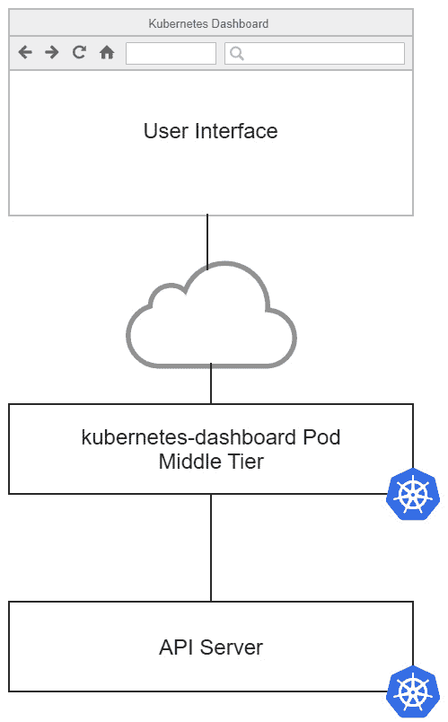
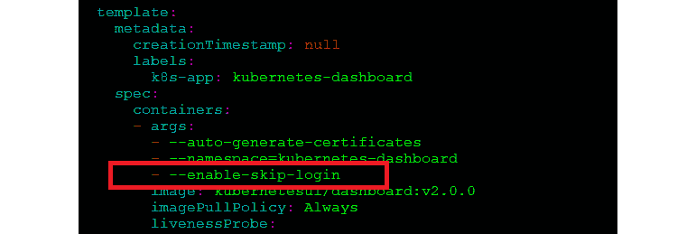
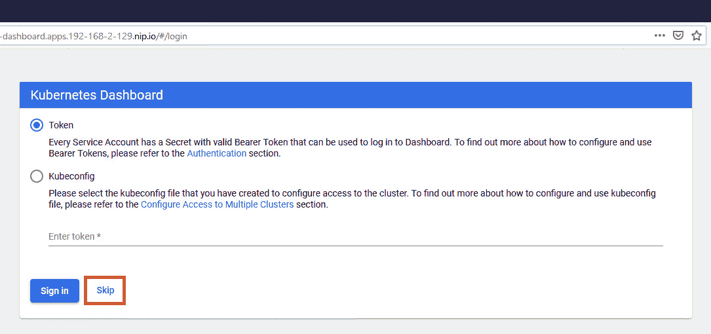
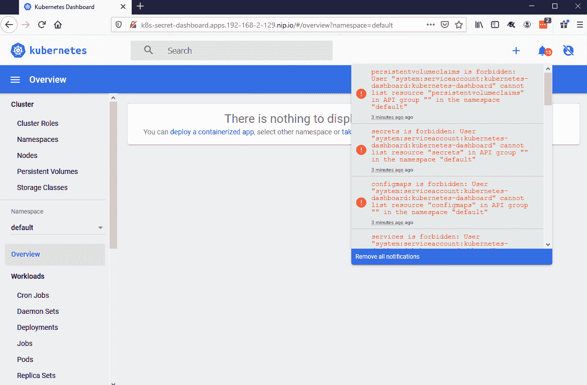
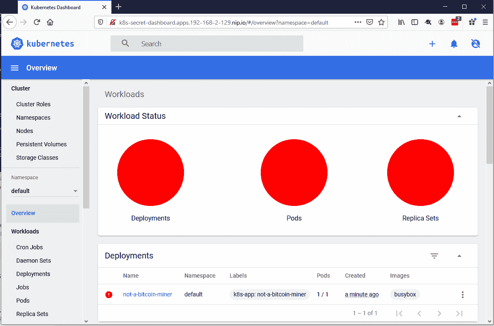
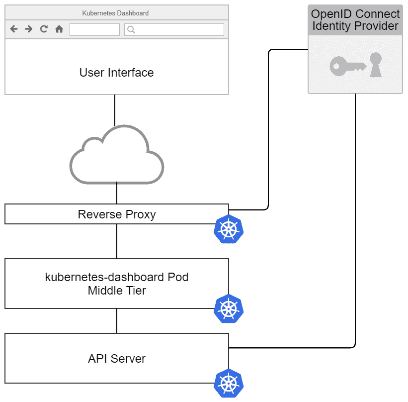
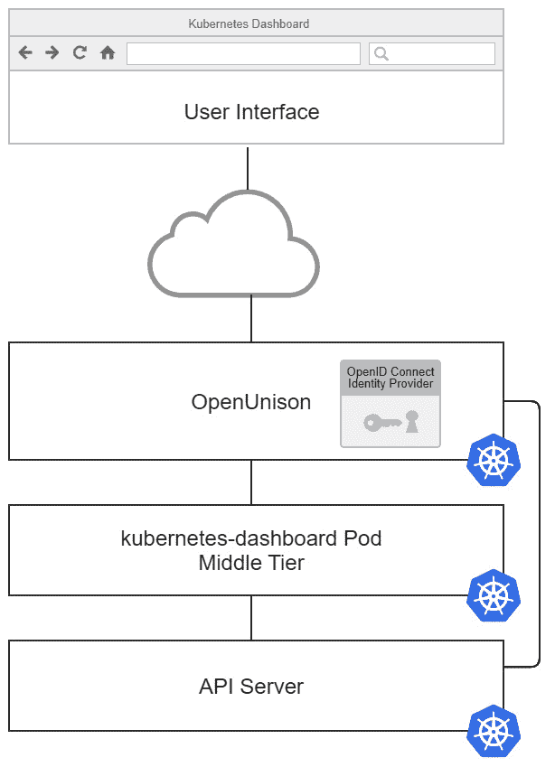

# *第 9 章*:部署安全的库本内斯仪表板

Kubernetes 集群不仅仅由 API 服务器和 kubelet 组成。集群通常由需要保护的附加应用组成，例如容器注册中心、源代码控制系统、管道服务、GitOps 应用和监控系统。集群的用户通常需要直接与这些应用交互。

虽然许多集群专注于验证对面向用户的应用和服务的访问，但集群解决方案并没有获得同样的一流地位。用户经常被要求使用 kubectl 的**端口转发**或**代理**功能来访问这些系统。从安全和用户体验的角度来看，这种访问方法是反模式的。用户和管理员将不得不面对的第一个反模式是 Kubernetes Dashboard。本章将详细说明为什么这种访问方法是反模式的，以及如何正确访问仪表板。我们将指导您如何不部署安全的 web 应用，并指出问题和风险。

我们将使用 Kubernetes Dashboard 来了解 web 应用安全性以及如何在您自己的集群中应用这些模式。这些课程不仅适用于仪表板，还适用于其他以集群为中心的应用，如 Istio、Grafana、Prometheus 的 Kiali 仪表板和其他集群管理应用。

最后，我们将花一些时间讨论本地仪表板以及如何评估它们的安全性。这是一种流行趋势，但并不普遍。理解这两种方法的安全性很重要，我们将在本章中探讨它们。

在本章中，我们将涵盖以下主题:

*   仪表板怎么知道你是谁？
*   仪表板不安全吗？
*   使用反向代理部署仪表板
*   将仪表板与 OpenUnison 集成

# 技术要求

要完成本章中的练习，您需要一个运行 OIDC 集成的 KinD 集群。我们在 [*第 7 章*](07.html#_idTextAnchor203) *中创建了这个，将身份验证集成到您的集群中。*

您可以在以下 GitHub 存储库中访问本章的代码:[https://GitHub . com/PacktPublishing/Kubernetes-and-Docker-The-Complete-Guide](https://github.com/PacktPublishing/Kubernetes-and-Docker-The-Complete-Guide)。

# 仪表盘怎么知道你是谁？

Kubernetes Dashboard 是一个功能强大的网络应用，可以从浏览器中快速访问您的集群。它允许您浏览名称空间和查看节点的状态，甚至提供了一个可以用来直接访问 Pods 的外壳。使用仪表板和 kubectl 有一个根本的区别。作为一个 web 应用，仪表板需要管理您的会话，而 kubectl 不需要。这导致部署过程中出现一系列不同的安全问题，而这些问题往往没有被考虑在内，从而导致严重的后果。在本节中，我们将探讨仪表板如何识别用户并与 API 服务器交互。

## 仪表盘架构

在深入了解仪表板如何认证用户的细节之前，了解仪表板如何工作的基础知识非常重要。高层次的仪表板有三层:

*   **用户界面**:这是 Angular + HTML 前端，显示在你的浏览器中，你可以与之交互。
*   **中间层**:前端与仪表板容器中托管的一组 API 交互，将来自前端的调用转换为 Kubernetes API 调用。
*   **API 服务器**:中间层 API 直接与库本内特斯 API 服务器交互。

下图显示了 Kubernetes 仪表板的三层体系结构:



图 9.1-无缝仪表板体系结构

当用户与仪表板交互时，用户界面调用中间层，中间层又调用应用编程接口服务器。仪表板不知道如何收集凭据，大多数应用用户通常可以通过这些凭据进行访问。没有地方放用户名或密码。它有一个基于 cookies 的非常简单的会话机制系统，但是在大多数情况下，仪表板并不真正知道或关心当前登录的用户是谁。仪表板唯一关心的是在与应用编程接口服务器通信时使用什么令牌。

仪表板怎么知道你是谁？

## 认证方式

仪表板可以通过三种方式确定用户是谁:

*   **无凭证**:仪表盘可以被告知不要收集任何代币或凭证。当这种情况发生时，仪表板将使用容器自己的服务帐户与应用编程接口服务器交互，该帐户具有通过 RBAC 分配的任何权限。
*   **登录/上传 kubectl 配置的令牌**:仪表盘可以提示用户输入 kubectl 配置文件或使用承载令牌。一旦提供了令牌(或从上传到仪表板的配置文件中提取了令牌)，就会创建一个加密的 cookie 来存储令牌。这个 cookie 由中间层解密，里面的令牌被传递给 API 服务器。
*   **来自反向代理的令牌**:如果在从用户界面到中间层的请求中存在包含承载令牌的授权头，则中间层将在向 API 服务器的请求中使用该承载令牌。这是最安全的选项，其实现将在本章中详细介绍。

在本章的其余部分，前两个选项将作为访问仪表板的反模式进行探讨，我们将解释为什么从安全角度和用户体验角度来看，反向代理模式是访问集群仪表板实现的最佳选项。

# 了解仪表盘安全风险

设置新集群时，经常会出现仪表盘的安全性问题。保护仪表板归结为如何部署仪表板，而不是仪表板本身是否安全。回到仪表板应用的体系结构，没有内置的“安全性”感。中间层只需将令牌传递给应用编程接口服务器。

在谈论任何一种 IT 安全的时候，透过*纵深防御*的镜头来看是很重要的。这就是任何系统都应该有多层安全性的想法。如果一个层出现故障，会有其他层来填充间隙，直到故障层可以被处理。一次失败不会让攻击者直接访问。

最常被提及的与仪表板安全相关的事件是 2018 年特斯拉被密码矿工攻破。攻击者能够访问运行在特斯拉集群中的 Pods，因为仪表板没有受到保护。该集群的 Pods 可以访问令牌，这些令牌为攻击者提供了对特斯拉云提供商的访问，攻击者可以在这些提供商处运行他们的加密挖掘系统。

仪表板通常是一个攻击媒介，因为它们很容易找到攻击者正在寻找的东西，并且很容易被不安全地部署。说明这一点，在 KubeCon NA 2019 上，展示了一个**捕捉旗帜** ( **CTF** )的场景，其中一个场景是开发人员“意外”暴露集群的仪表板。

注意

CTF 在 https://securekubernetes.com/ T2 有一个家庭实验室。对于学习 Kubernetes 安全性的人来说，这是一个非常推荐的资源。除了有教育意义，恐怖，还很有趣！

自从特斯拉违规以来，在没有凭据的情况下部署仪表板变得更加困难。它不再是默认设置，需要对仪表板和集群进行更新。为了证明这有多危险，让我们来看看到底会造成什么样的伤害。

经历这些步骤可能会产生这样的想法“真的有人经历所有这些步骤才能到达仪表板吗？”答案可能是没人想谈的。在前一章中，讨论了授权访问集群和设计多租户的多种选项。其中一个选项是集群层的租户，每个租户都有自己的集群。不幸的是，这些部署中的许多都包括租户的集群管理访问权限，这将使他们能够执行这些步骤。集群管理员是一些谷歌搜索远离指令，以轻松绕过讨厌的虚拟专用网开发人员不喜欢在家里使用。

## 部署不安全的仪表板

虽然这听起来很疯狂，但这是我们在野外经常看到的事情。建议的仪表板安装多次声明不要在独立的开发实验室之外使用这种类型的配置。缺点是，由于它确实使部署仪表板变得如此容易，许多较新的管理员使用它，因为它易于设置，并且他们经常在生产集群中使用相同的部署。

现在，让我们展示一下攻击一个部署时没有考虑安全性的仪表板有多容易:

1.  第一步是告诉仪表盘允许用户绕过认证。在`kubernetes-dashboard`名称空间中编辑`kubernetes-dashboard`部署:

    ```
    kubectl edit deployment kubernetes-dashboard -n kubernetes-dashboard
    ```

2.  Look for the `args` option for the container, add `- --enable-skip-login`, then save:

    

    图 9.2–在仪表板上启用跳过登录

3.  现在，我们需要通过创建新的入口规则向网络公开仪表板。使用以下 YAML 创建一个名为`insecure-dashboard.yaml`的新入口清单。请记住将`host`部分中的 IP 地址替换为您的 Docker 主机的 IP 地址:

    ```
    apiVersion: networking.k8s.io/v1beta1
    kind: Ingress
    metadata:
      name: dashboard-external-auth
      namespace: kubernetes-dashboard
      annotations:
        kubernetes.io/ingress.class: nginx
        nginx.ingress.kubernetes.io/affinity: cookie
        nginx.ingress.kubernetes.io/backend-protocol: https
        nginx.ingress.kubernetes.io/secure-backends: "true"
        nginx.org/ssl-services: kubernetes-dashboard
    spec:
      rules:
      - host: k8s-secret-dashboard.apps.192-168-2-129.nip.io
        http:
          paths:
          - backend:
              serviceName: kubernetes-dashboard
              servicePort: 443
            path: /
    ```

4.  通过使用`kubectl`部署清单来创建入口规则。由于我们将名称空间值添加到了清单中，我们确实需要将`-n`添加到 kubectl 命令中:

    ```
    kubectl create -f insecure-dashboard.yaml
    ```

5.  一旦入口被创建，打开浏览器，使用入口规则`host`部分中指定的 Nip.io 名称进入您的秘密仪表板。
6.  You will see an authentication screen that asks for a token or a Kubeconfig file, but since we enabled the option to skip the login when we edited the dashboard, you can simply skip the login by clicking on **Skip**:

    

    图 9.3–禁用登录的 Kubernetes 仪表板

7.  Once in the dashboard, the default service account doesn't have access to anything:

    

    图 9.4–带有默认服务帐户的 Kubernetes 仪表板

    到目前为止，这看起来还不算太糟。你会看到*访问被禁止*的错误，所以现在仪表盘不允许你做任何伤害。不幸的是，许多人走到这一步，采取额外的步骤来更改默认服务帐户在群集上的权限。

8.  Right now, the service account isn't authorized for access to the cluster, so change that by creating a new `ClusterRoleBinding` to the cluster-admin `ClusterRole`.

    创建一个名为`dashboard-role.yaml`的新文件，内容如下:

    ```
    apiVersion: rbac.authorization.k8s.io/v1
    kind: ClusterRoleBinding
    metadata:
      name: secret-dashboard-cluster-admin
    roleRef:
      apiGroup: rbac.authorization.k8s.io
      kind: ClusterRole
      name: cluster-admin
    subjects:
    - apiGroup: ""
      kind: ServiceAccount
      namespace: kubernetes-dashboard
      name: kubernetes-dashboard
    ```

9.  使用`kubectl` :

    ```
    kubectl create -f dashboard-role.yaml
    ```

    创建新的`ClusterRoleBinding`

恭喜你！秘密仪表板现在可供任何想使用它的人使用！

现在，你可能在想*“谁能找到我的仪表盘？他们需要知道网址，我不会告诉任何人它是什么。”*你感到安全，因为没有人知道你仪表板的网址或 IP 地址。这种被称为默默无闻的安全，被普遍认为是保护系统的一种可怕的方法。

让我们来看一个场景，有人可能会在您不知情的情况下利用仪表板。

你是一个红迪粉丝，有一天你看到一个红迪帖子，标题是*这是一个保护你的 Kubernetes 仪表盘*的好工具。这个帖子似乎是合法的，你很兴奋能测试这个新工具。看完帖子后，你会看到底部的实用程序链接和运行它的命令:你可以从[https://raw . githubusercontent . com/PacktPublishing/Kubernetes-and-Docker-The-Complete-Guide/master/chapter 9/kubectl-secure-my-dashboard . go](https://raw.githubusercontent.com/PacktPublishing/Kubernetes-and-Docker-The-Complete-Guide/master/chapter9/kubectl-secure-my-dashboard.go)试试看！

要充分体验这个例子，您可以通过从`chapter9`目录中的克隆存储库中执行以下命令，在您的 KinD 集群上运行该工具。请务必更改仪表板入口主机的网址:

```
go run kubectl-secure-my-dashboard.go https://k8s-secret-dashboard.apps.192-168-2-129.nip.io
Running analysis on https://k8s-secret-dashboard.apps.192-168-2-129.nip.io
Your dashboard has been secured!
```

现在，让我们来回顾一下刚刚发生的事情。打开浏览器，转到您的秘密仪表板站点，查看已更改的内容:



图 9.5–Kubernetes 仪表板显示部署的恶意软件

看来我们的强化插件是部署比特币矿工的诡计。真没礼貌！

既然您已经看到了不安全的仪表板是多么容易被利用，那么就使用 kubectl 删除部署。

虽然可以通过使用批准的映像对注册表进行预授权来减轻这种攻击(当 [*第 11 章*](11.html#_idTextAnchor272)*使用开放策略管理器扩展安全性】*中涵盖`OpenPolicyAgent`时，将涵盖该主题)，但此时安全性是被动的，试图响应而不是阻止威胁。使用准入控制器也不会阻止某人从你的仪表板中提取秘密。

虽然这是不安全地访问仪表板的最简单的方法，但这不是唯一的方法。kubectl 实用程序包括两个功能，可以使访问仪表板变得容易。端口转发实用程序通常用于创建到集群内部 pod 的隧道。该实用程序创建一个到您的 pod 上的特定端口的 TCP 流，使您的本地主机(或更多，如果您想要的话)可以访问它。这仍然会绕过仪表板中的身份验证，要求仪表板的服务帐户可以通过 RBAC 进行访问，以执行任何需要的任务。虽然用户必须拥有 RBAC 授权才能转发到 pod，但这将通过两种攻击方式打开控制面板:

*   **外部**:用户本地工作站上运行的任何脚本都可以访问转发的网络隧道。
*   **内部**:任何位于集群内部的吊舱都可以访问仪表板吊舱。

对于内部访问，可以使用网络策略来限制哪些名称空间和 Pods 可以访问仪表板的 API。首先使用网络策略是一个好主意，但在这种情况下这是一个单点故障。一个错误配置的策略将打开仪表板进行攻击。

来自外部的威胁可能会以您决定运行的脚本(或您使用的其他工具)的形式出现。Web 浏览器无法从本地系统之外的页面访问通过端口转发打开的端口，但是任何运行在工作站上的脚本都可以。例如，虽然您可以通过打开浏览器并直接转到端口来访问端口转发的主机，但是从远程站点加载的带有恶意 JavaScript 的网页无法打开与本地主机的连接。尝试对转发的端口运行本节前面的强化脚本，将会出现相同的结果，这是您的基础架构上不需要的 pod。

提供访问的另一种技术是使用 API 服务器的集成代理实用程序。运行`kubectl proxy`创建一个到 API 服务器的本地网络隧道，然后可以用来将 HTTP 请求代理到任何 pod，包括仪表板。这与`kubectl port-forward`有着相同的缺点，并且会使你的集群容易受到本地运行的任何脚本的攻击。

这些方法的共同点是它们的安全性都有一个单点故障。即使有适当的缓解措施来限制可以部署哪些映像，不安全的仪表板仍然可以用于访问机密对象、删除部署，甚至通过集成到仪表板中的终端远程进入 Pods。

探索了如何绕过仪表板上的所有身份验证及其含义后，接下来我们将了解如何在不部署额外基础架构的情况下向仪表板提供令牌。

## 使用令牌登录

用户可以将令牌或 kubectl 配置文件上传到仪表板作为登录，以避免秘密仪表板的危险。如前所述，仪表板将获取用户的承载令牌，并将其用于对应用编程接口服务器的所有请求。虽然这似乎解决了给仪表板自己的特权服务帐户的问题，但它也带来了自己的问题。仪表板不是 kubectl，不知道如何在令牌过期时刷新令牌。这意味着令牌需要相当长的寿命才能有用。这将需要要么创建可以使用的服务帐户，要么延长您的 OpenID Connect `id_tokens`的寿命。这两个选项都将通过利用 OpenID Connect 进行身份验证来抵消大部分安全性。

到目前为止，我们只关注了部署仪表板的错误方式。虽然理解这一点很重要，但正确的方法是什么？在下一节中，我们将详细介绍使用反向代理部署仪表板的正确方法。

# 使用反向代理部署仪表板

代理是 Kubernetes 中常见的模式。Kubernetes 集群中的每一层都有代理。Kubernetes 上的大多数服务网格实现也使用代理模式，创建将拦截请求的侧车。这里描述的反向代理和这些代理的区别在于它们的意图。微服务代理通常不携带会话，而 web 应用需要会话来管理状态。

下图显示了带有反向代理的 Kubernetes 仪表板的体系结构:



图 9.6–带反向代理的 Kubernetes 仪表板

*图 9.6* 所示的反向代理执行三个角色:

*   **身份验证**:反向代理拦截未经身份验证的请求(或陈旧会话)，并使用 OpenID Connect 身份提供程序触发身份验证过程，以对用户进行身份验证。
*   **会话管理** : Kubernetes 的仪表盘是一个面向用户的应用。它应该具有支持会话超时和撤销的典型控制。警惕将所有会话数据存储在 cookie 中的反向代理。这些方法很难撤销。
*   **身份注入**:一旦代理对用户进行了身份验证，它需要能够在每个请求上注入一个 HTTP 授权头，该请求是标识登录用户的 JWT，由相同的 OpenID Connect 身份提供者签名，并且具有与 API 服务器相同的颁发者和接收者。例外情况是使用模拟，如第 7 章[](07.html#_idTextAnchor203)**所述，将身份验证集成到集群中*将特定的头注入请求中。*

 *反向代理不需要在群集上运行。根据您的设置，这样做可能是有利的，尤其是在集群中使用模拟时。使用模拟时，反向代理使用服务帐户的令牌，因此该令牌最好永远不要离开群集。

本章的重点是库本内斯项目的仪表板。仪表板功能有多个选项。接下来，我们将探讨这些仪表板如何与应用编程接口服务器交互，以及如何评估它们的安全性。

## 本地仪表盘

第三方仪表盘的一个常见主题是在您的工作站上本地运行，并使用 Kubernetes SDK 与 API 服务器进行交互，就像 kubectl 一样。这些工具的好处是不必部署额外的基础架构来保护它们。

Visual Studio Code 的 Kubernetes 插件是一个利用直接 API 服务器连接的本地应用的例子。当启动插件时，Visual Studio Code 访问您当前的 kubectl 配置，并使用该配置与应用编程接口服务器交互。它甚至会在 OpenID 连接令牌过期时刷新它:


图 9.7–带有 Kubernetes 插件的 Visual Studio 代码

Visual Studio Code 的 Kubernetes 插件能够刷新它的 OpenID Connect Token，因为它是用 client-go SDK 构建的，与 Kubernetes 使用的客户端库相同。评估客户端仪表板时，确保它与您的身份验证类型一起工作，即使它不是 OpenID Connect。Kubernetes 的许多 SDK 不支持 OpenID Connect 令牌刷新。Java 和 Python SDKs 最近才开始支持 OpenID Connect 令牌的更新，就像客户端转 SDK 一样。评估本地仪表板时，确保它能够利用您的短期令牌，并能够根据需要刷新它们，就像 kubectl 一样。

## 其他集群级应用

这一章的介绍讨论了集群是如何由除了 Kubernetes 之外的几个应用组成的。其他应用可能会遵循与仪表板相同的安全模型，反向代理方法是比 kubectl 端口转发更好的公开这些应用的方法，即使应用没有内置的安全性。以常见的普罗米修斯栈为例。Grafana 支持用户身份验证，但 Prometheus 和 Alert Manager 不支持。您如何跟踪谁有权访问这些系统，或者何时使用端口转发访问这些系统？

没有提供用户上下文。使用反向代理，每个网址的日志和被认证为访问该网址的用户可以被转发到中央日志管理系统，并由**安全信息和事件管理器** ( **SIEM** )进行分析，从而为集群的使用提供额外的可见性。

就像仪表板一样，在这些应用中使用反向代理提供了一种分层的安全方法。它从有问题的应用中卸载了会话管理，并提供了增强身份验证措施的功能，例如多因素身份验证和会话撤销。这些优势将带来更安全、更易于使用的集群。

# 将仪表板与 OpenUnison 集成

OpenUnison 如何使用模拟将身份头注入到第 7 章[](07.html#_idTextAnchor203)**中，将身份验证集成到您的集群中*中，而不是OpenUnison 如何使用 OpenID Connect 集成集群将用户身份注入到仪表板中。奏效了，但没人解释。本节将使用 OpenUnison 实现作为如何为仪表板构建反向代理的示例。使用本节中的信息来更好地了解 API 安全性，或者构建您自己的仪表板身份验证解决方案。*

 *OpenUnison 部署包括两个集成的应用:

*   **OpenID 连接身份提供者&登录门户**:该应用托管登录过程和发现网址，由应用编程接口服务器用来获取验证`id_token`所需的密钥。它还提供了屏幕，您可以在其中获取 kubectl 的令牌。
*   **仪表盘**:反向代理应用，向集成的 OpenID Connect 身份提供者进行身份验证，并将用户的`id_token`注入到每个请求中。

此图显示了仪表板的用户界面如何通过反向代理与服务器端组件交互，反向代理注入用户的`id_token` `:`



图 9.8–open unison 与仪表板的集成

仪表板使用与 API 服务器相同的 OpenID Connect 身份提供者，但不使用其提供的`id_token`。相反，OpenUnison 有一个插件，它将生成一个新的`id_token`，独立于身份提供者，其中包含用户的身份数据。OpenUnison 之所以能够做到这一点，是因为 kubectl 和 API 服务器使用的用于为 OpenID Connect 身份提供者生成`id_token`的密钥存储在 OpenUnison 中。

一个新的、短暂的令牌独立于与 kubectl 一起使用的 OpenID Connect 会话生成。这样，令牌可以独立于 kubectl 会话进行刷新。这一过程提供了 1 到 2 分钟令牌生命的好处以及直接登录过程的便利。

如果你对安全有眼光，你可能会指出这种方法在安全模型中有一个明显的单点故障，一个用户的凭证！就像本章前面*了解仪表板安全风险部分*中构建的 Secret 仪表板一样，攻击者通常只需要请求凭据就可以获得它们。这通常是通过名为网络钓鱼的攻击中的电子邮件来完成的，在这种攻击中，攻击者向受害者发送一个页面链接，该页面看起来像他们的登录页面，但实际上只是收集凭据。这就是多因素身份验证对于基础架构系统如此重要的原因。

在 2019 年的一项研究中，谷歌显示多因素身份验证阻止了 99%的自动攻击和网络钓鱼攻击(https://security . googleblog . com/2019/05/new-research-how-effective-is-basic . html)。将多因素身份验证添加到身份提供者 OpenUnison 进行身份验证，或者将其直接集成到 OpenUnison 中，是保护仪表板和集群安全的最有效方法之一。

# 总结

在本章中，我们详细探讨了 Kubernetes 仪表板的安全性。首先，我们介绍了体系结构以及仪表板如何将您的身份信息传递给 API 服务器。然后，我们探讨了仪表板是如何被破坏的，最后，我们详细介绍了如何安全地正确部署仪表板。

有了这些知识，您现在可以为用户提供一个安全的工具。许多用户更喜欢通过网络浏览器访问仪表板的简单性。添加多因素身份验证增加了额外的安全和安心层。当您的安全团队质疑仪表板的安全性时，您将获得满足他们的顾虑所需的答案。

前三章集中讨论了 Kubernetes APIs 的安全性。接下来，我们将探索如何保护每个 Kubernetes 部署节点的软肋！

# 问题

1.  The dashboard is insecure.

    A.真实的

    B.错误的

2.  How can the dashboard identify a user?

    A.选项是不进行身份验证，或者从反向代理注入令牌

    B.用户名和密码

    C.服务帐户

    D.多因素认证

3.  How does the dashboard track session state?

    A.会话存储在 etcd 中。

    B.会话存储在名为`DashboardSession`的自定义资源对象中。

    C.没有会话。

    D.如果令牌被上传，它将被加密并作为 cookie 存储在浏览器中。

4.  When using a token, how often can the dashboard refresh it?

    A.一分钟一次

    B.每三十秒

    C.当令牌到期时

    D.以上都不是

5.  What's the best way to deploy the dashboard?

    A.使用`kubectl port-forward`

    B.使用`kubectl proxy`

    C.使用秘密入口主机

    D.反向代理背后

6.  The dashboard doesn't support impersonation.

    A.真实的

    B.错误的

7.  OpenUnison is the only reverse proxy that supports the dashboard.

    A.真实的

    B.错误的**