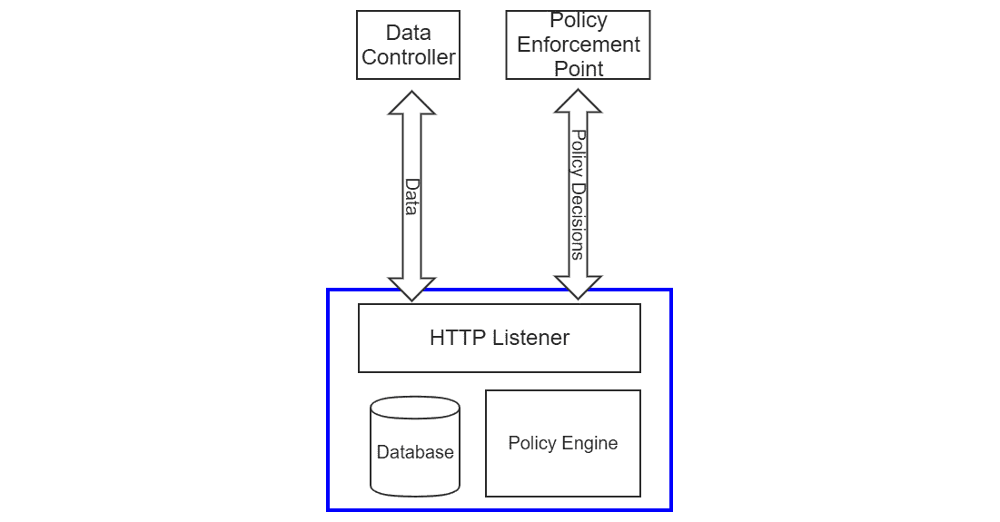
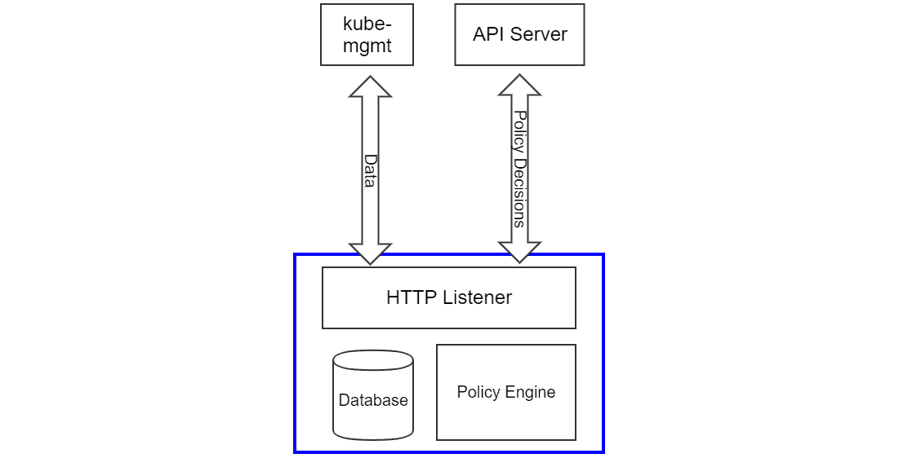
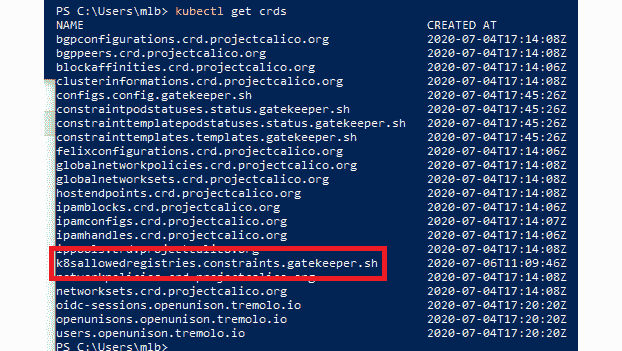
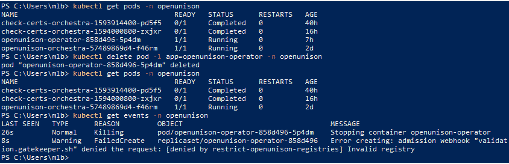
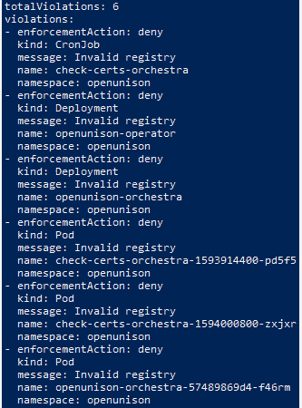
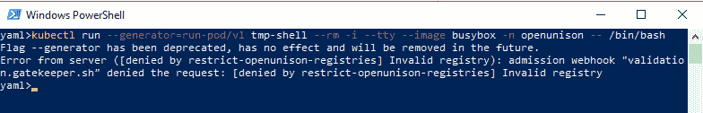
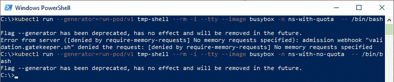

# 十一、使用开放策略代理扩展安全性

到目前为止，我们已经介绍了 Kubernetes 内置的认证和授权功能，这有助于保护集群。虽然这将涵盖大多数用例，但并没有涵盖所有用例。Kubernetes 无法处理的几个安全最佳实践是预先授权容器注册中心，并确保资源请求在所有 **Pod** 对象上。

这些任务留给外部系统，称为动态准入控制器。**开放策略代理** ( **OPA** )及其 Kubernetes 本地子项目，gateway，是处理这些用例最流行的方法之一。本章将详细介绍 OPA 和 gateway 的部署、其架构以及策略的制定。

在本章中，我们将涵盖以下主题:

*   验证 webhooks 简介
*   什么是 OPA，它是如何工作的？
*   利用减压阀来制定策略
*   实现内存限制
*   使用 OPA 实现 Pod 安全策略

# 技术要求

要完成本章的实践练习，您将需要一台 Ubuntu 18.04 服务器，运行一个 KinD 集群，其配置来自 [*第 8 章*](08.html#_idTextAnchor228)*RBAC 策略和审核*。

您可以在以下 GitHub 存储库中访问本章的代码:[https://GitHub . com/PacktPublishing/Kubernetes-and-Docker-The-Complete-Guide/tree/master/chapter 11。](https://github.com/PacktPublishing/Kubernetes-and-Docker-The-Complete-Guide/tree/master/chapter11 )

# 动态准入控制器介绍

有两种方法可以扩展 Kubernetes:

*   建立一个自定义的资源定义，这样你就可以定义自己的对象和 API。
*   实现一个网络钩子，监听来自应用编程接口服务器的请求，并用必要的信息进行响应。您可能还记得，在 [*第 7 章*](07.html#_idTextAnchor203)*将认证集成到您的集群*中，我们解释了使用自定义网络钩子来验证令牌。

从 Kubernetes 1.9 开始，一个 webhook 可以定义为动态准入控制器，到了 1.16，动态准入控制器 API 变成了**通用** ( **GA** )。

协议非常简单。一旦为特定的对象类型注册了动态准入控制器，每当创建或编辑该类型的对象时，就会用 HTTP post 调用 webhook。然后，webhook 将返回表示它是否被允许的 JSON。

重要说明

从 1.16 开始，`admission.k8s.io/v1`处于 GA。所有示例都将使用应用编程接口的正式版。

提交给 webhook 的请求由几个部分组成:

*   **对象标识符**:属性`resource`和`subResource`标识对象、应用编程接口和组。如果对象的版本正在升级，则指定`requestKind`、`requestResource`和`requestSubResource`。另外，提供`namespace`和`operation`来知道对象在哪里，以及它是`CREATE`、`UPDATE`、`DELETE`还是`CONNECT`操作。
*   **提交者标识符**:对象`userInfo`标识提交者的用户和组。提交者和创建原始请求的用户并不总是相同的。例如，如果一个用户创建了一个`Deployment`，那么`userInfo`对象将不会是创建原始`Deployment`的用户；这将用于`ReplicaSet`控制器的服务帐户，因为`Deployment`创建一个`ReplicaSet`来创建`Pod`。
*   **对象** : `object`表示正在提交的对象的 JSON，其中`oldObject`表示如果这是更新，正在替换什么。最后，`options`为请求指定了附加选项。

来自网络钩子的响应将简单地有两个属性，来自请求的原始`uid`和`allowed`，它们可以是**真**或**假**。

`userInfo`对象可以快速创建复杂。由于 Kubernetes 经常使用多层控制器来创建对象，因此很难根据与 API 服务器交互的用户来跟踪使用创建情况。基于 Kubernetes 中的对象授权要好得多，例如命名空间标签或其他对象。

一个常见的用例是允许开发人员拥有一个他们是管理员的“沙箱”，但是这个沙箱的容量非常有限。不要试图验证特定用户没有试图请求太多内存的事实，而是用一个限制来注释一个个人名称空间，这样准入控制器就有具体的东西可以参考，而不管用户提交的是`Pod`还是`Deployment`。这样，策略将检查`namespace`上的`annotation`而不是单个用户。为了确保只有拥有命名空间的用户才能在其中创建东西，请使用 RBAC 来限制访问。

关于通用验证 webhooks 的最后一点:没有办法指定密钥或密码。这是匿名请求。虽然理论上，验证性的网络钩子可以用来实现更新，但不建议这样做。

既然我们已经介绍了 Kubernetes 如何实现动态访问控制器，我们将看看 OPA 中最流行的选项之一。

# 什么是 OPA，它是如何工作的？

OPA 是一个轻量级的授权引擎，非常适合 Kubernetes。它不是从Kubernetes开始的，但它肯定在那里找到了家。在 OPA 中没有构建动态准入控制器的要求，但是它非常擅长，有大量的资源和现有的策略可以用来启动你的策略库。

本节提供了 OPA 及其组件的高级概述，本章的其余部分将详细介绍在 Kubernetes 中的 OPA 实现。

## OPA 架构

OPA由三个组件组成 HTTP 侦听器、策略引擎和数据库:



图 11.1–OPA 架构

OPA 使用的数据库在内存中，而且是短暂的。它不会保存用于决策的信息。一方面，这使得 OPA 非常具有可扩展性，因为它本质上是一个授权微服务。另一方面，这意味着 OPA 的每个实例都必须独立维护，并且必须与权威数据保持同步:



图 11.2-祖父在库伯内斯

当在 Kubernetes 中使用时，OPA 使用名为 *kube-mgmt* 的边车填充其数据库，该边车在您想要导入到 OPA 中的对象上设置手表。随着对象的创建、删除或更改， *kube-mgmt* 会更新其 OPA 实例中的数据。这意味着 OPA 与 API 服务器“最终是一致的”，但它不一定是 API 服务器中对象的实时表示。由于整个 etcd 数据库基本上是一次又一次地复制，因此需要非常小心，以避免复制 OPA 数据库中的敏感数据，如`Secrets`。

## 减压阀，OPA 策略语言

我们将在下一节详细介绍减压阀的细节。这里要提到的要点是减压阀是一种策略评估语言，不是通用编程语言。对于习惯于 Golang、Java 或 JavaScript 等语言的开发人员来说，这可能很困难，这些语言支持迭代器和循环等复杂逻辑。减压阀旨在评估策略，因此是精简的。例如，如果您想用 Java 编写代码来检查一个`Pod`中的所有容器映像都是从注册表列表中的一个开始的，那么它看起来如下所示:

```
public boolean validRegistries(List<Container> containers,List<String> allowedRegistries) {
  for (Container c : containers) {
      boolean imagesFromApprovedRegistries = false;
	for (String allowedRegistry : allowedRegistries) {
        imagesFromApprovedRegistries =  imagesFromApprovedRegistries  || c.getImage().startsWith(allowedRegistry);		
   	}
      if (! imagesFromApprovedRegistries) {
	  return false;
     }
   }
   return true;
}
```

这段代码遍历每个容器和每个允许的注册表，以确保所有映像符合正确的策略。减压阀的相同代码要小得多:

```
invalidRegistry {
  ok_images = [image | startswith(input_images[j],input.parameters.registries[_]) ; image = input_images[j] ]
  count(ok_images) != count(input_images)
}
```

如果容器上的任何映像来自未经授权的注册中心，上述规则将评估为`true`。我们将在本章的后面部分详细介绍这段代码是如何工作的。理解为什么这段代码如此紧凑的关键在于，循环和测试的样板文件大部分是在减压阀推断出来的。第一行生成符合映像的列表，第二行确保符合映像的数量与总映像的数量相匹配。如果它们不匹配，则一个或多个映像必须来自无效的注册表。能够编写简洁的策略代码是减压阀非常适合准入控制的原因。

## 守门人

到目前为止，讨论的所有内容都是针对 OPA 的。章节开头提到 OPA 在 Kubernetes 没有起步。早期的实现有一个 sidecar，它使 OPA 数据库与 API 服务器保持同步，但是您必须手动创建策略作为`ConfigMap`对象，并手动为 webhooks 生成响应。2018 年，微软推出了网守[https://github.com/open-policy-agent/gatekeeper](https://github.com/open-policy-agent/gatekeeper)，提供Kubernetes斯本地体验。

除了从`ConfigMap`对象转移到适当的定制资源之外，GateWay 还增加了一个审计功能，允许您针对现有对象测试策略。如果某个对象违反了策略，则会创建一个违规条目来跟踪它。通过这种方式，您可以获得集群中现有策略违规的快照，或者知道在 GateWay 停机期间是否因为升级而遗漏了什么。

网守和通用 OPA 的一个主要区别是，在网守中，OPA 的功能不是通过任何人都可以调用的 API 公开的。OPA 是嵌入式的，gateway 直接调用 OPA 来执行策略并保持数据库最新。只能根据 Kubernetes 中的数据或通过在评估时提取数据来做出决定。

### 部署网守

将使用的示例将假设使用网守而不是通用 OPA 部署。根据 GateWay 项目的指示，使用以下命令:

```
$ kubectl apply -f https://raw.githubusercontent.com/open-policy-agent/gatekeeper/master/deploy/gatekeeper.yaml
```

这将启动 GateWay 命名空间`Pods`，并创建验证 webhook。部署完成后，进入下一部分。在本章的剩余部分，我们将讨论使用 GateWay 的细节。

## 自动化测试框架

OPA 为您的策略提供了内置的自动化测试框架。这是 OPA 最有价值的方面之一。能够在部署前一致地测试策略可以为您节省数小时的调试时间。当写入策略时，有一个与您的策略文件同名的文件，但名称中有`_test`。例如，让测试用例与`mypolicies.rego`相关联，让`mypolicies_test.rego`中的测试用例在同一个目录中。运行`opa test`将运行您的测试用例。我们将在下一节展示如何使用它来调试您的代码。

已经介绍了 OPA 的基础知识以及它是如何构建的，下一步是学习如何使用减压阀来编写策略。

# 用减压阀写策略

减压阀是一种专门为策略写作设计的语言。它不同于你可能用其编写代码的大多数语言。典型的授权代码如下所示:

```
//assume failure
boolean allowed = false;
//on certain conditions allow access
if (someCondition) {
  allowed = true;
}
//are we authorized?
if (allowed) {
  doSomething();
}
```

授权代码通常默认为未授权，必须发生特定的情况才能授权最终操作。减压阀采取了不同的方法。减压阀通常被写为授权一切，除非一组特定的条件发生。

减压阀和更通用的编程语言的另一个主要区别是没有显式的“`if` / `then` / `else`”控制语句。当减压阀的一行要做决定时，代码被解释为“如果这一行是假的，就停止执行。”例如，减压阀的以下代码表示“如果映像以`myregistry.lan/`开头，则停止执行策略并通过该检查，否则会生成错误消息”:

```
not startsWith(image,"myregistry.lan/")
msg := sprintf("image '%v' comes from untrusted registry", [image])
```

Java 中的相同代码可能如下所示:

```
if (! image.startsWith("myregistry.lan/")) {
   throw new Exception("image " + image + " comes from untrusted registry");	
}
```

在学习减压阀时，推断控制语句和明确控制语句之间的差异通常是学习曲线中最陡的部分。这可能会产生比其他语言更陡峭的学习曲线，而减压阀通过让测试和构建策略变得更容易以自动化和可管理的方式来弥补这一点。

OPA 可用于自动测试策略。当编写集群安全性所依赖的代码时，这非常重要。自动化您的测试将有助于加快您的开发速度，并通过捕获任何通过新的工作代码引入到先前工作代码中的错误来提高您的安全性。接下来，让我们完成编写 OPA 策略、测试它并将其部署到我们的集群的生命周期。

## 制定 OPA 策略

使用 OPA 的一个常见例子是限制 Pod 可以来自哪些注册中心。这是集群中常见的安全措施，有助于限制哪些 Pods 可以在集群上运行。例如，我们多次提到比特币矿工。如果集群不接受`Pods`除了从你自己的内部注册表，那么这是一个坏演员滥用你的集群需要采取的又一个步骤。首先，让我们写下我们的策略，摘自 OPA 文档网站(https://www . open policy agent . org/docs/latest/kubernetes-introduction/):

```
package k8sallowedregistries
invalidRegistry {
  input_images[image]
  not startswith(image, "quay.io/")
}
input_images[image] {
  image := input.review.object.spec.containers[_].image
}
input_images[image] {
  image := input.review.object.spec.template.spec.containers[_].image
} 
```

这段代码的第一行声明`package`我们的策略生效了。无论是数据还是策略，一切都存储在一个包中的 OPA 中。OPA 中的包就像文件系统中的目录。当你把一份保单放在一个包裹里时，一切都与那个包裹有关。在这种情况下，我们的策略是在`k8sallowedregistries`套餐中。

下一节定义了一个规则。如果我们的`Pod`有一个来自`quay.io`的映像，这个规则最终将是**未定义的**。如果`Pod`没有来自`quay.io`的映像，规则将返回`true`，表示注册表无效。当在动态准入审查期间评估`Pod`时，网守将把这解释为失败并将`false`返回给应用编程接口服务器。

接下来的两条规则看起来非常相似。第一个`input_images`规则说“针对对象的`spec.container`中的每个`container`评估调用规则”，匹配直接提交给 API 服务器的`Pod`对象，提取每个`container`的所有`image`值。第二条`input_images`规则指出:“针对对象的`spec.template.spec.containers`中的每个`container`评估调用规则，以短路`Deployment`对象和`StatefulSets`。

最后，我们添加了网守通知应用编程接口服务器评估失败所需的规则:

```
violation[{"msg": msg, "details": {}}] {
  invalidRegistry
  msg := "Invalid registry"
}
```

如果注册表有效，该规则将返回一个空的`msg`。将您的代码分解为做出策略决策的代码和做出反馈响应的代码是一个好主意。这使得测试变得更加容易，这将是我们接下来要做的。

## 测试 OPA 策略

一旦我们写好了我们的策略，我们就想建立一个自动化测试。就像测试任何其他代码一样，重要的是您的测试用例要涵盖预期和意外的输入。测试积极和消极的结果也很重要。这不足以证实我们的策略允许正确的注册；我们还需要确保它停止一个无效的。下面是我们代码的八个测试用例:

```
package k8sallowedregistries
test_deployment_registry_allowed {
    not invalidRegistry with input as {"apiVersion"...
}
test_deployment_registry_not_allowed {
    invalidRegistry with input as {"apiVersion"...
}
test_pod_registry_allowed {
    not invalidRegistry with input as {"apiVersion"...
}
test_pod_registry_not_allowed {
    invalidRegistry with input as {"apiVersion"...
}
test_cronjob_registry_allowed {
    not invalidRegistry with input as {"apiVersion"...
}
test_cronjob_registry_not_allowed {
    invalidRegistry with input as {"apiVersion"...
}
test_error_message_not_allowed {
    control := {"msg":"Invalid registry","details":{}}
    result = violation with input as {"apiVersion":"admissi…
    result[_] == control
}
test_error_message_allowed {
    result = violation with input as {"apiVersion":"admissi…
    control := {"msg":"Invalid registry","details":{}}
}
```

总共有八个测试；两个测试确保出现问题时返回正确的错误消息，六个测试覆盖三种输入类型的两个用例。我们正在测试简单的`Pod`定义、`Deployment`和`CronJob`。为了验证预期的成功或失败，我们包含了具有`image`属性的定义，这些属性包含每个输入类型的`docker.io`和`quay.io`。代码为印刷体缩写，但可从[https://github . com/PacktPublishing/Kubernetes-and-Docker-The-Complete-Guide/tree/master/chapter 11/simple-opa-policy/rego/](https://github.com/PacktPublishing/Kubernetes-and-Docker-The-Complete-Guide/tree/master/chapter11/simple-opa-policy/rego/)下载。

要运行测试，首先根据 OPA 网站-https://www.openpolicyagent.org/docs/latest/#running-opa.安装 OPA 命令行可执行文件。下载后，进入`simple-opa-policy/rego`目录并运行测试:

```
$ opa test . 
data.kubernetes.admission.test_cronjob_registry_not_allowed: FAIL (248ns)
--------------------------------------------------------------
PASS: 7/8
FAIL: 1/8
```

7 次测试通过，但`test_cronjob_registry_not_allowed`失败。作为`input`提交的`CronJob`不应被允许，因为其`image`使用 *docker.io* 。它偷偷通过的原因是因为`CronJob`对象遵循与`Pod`和`Deployment`不同的模式，所以我们的两个`input_image`规则不会从`CronJob`加载任何容器对象。好消息是当`CronJob`最终提交`Pod`时，网守不会对其进行验证，从而阻止其运行。坏消息是，在`Pod`应该运行之前，没有人会知道这一点。确保我们除了拾取其他带有容器的对象之外，还拾取了`CronJob`对象，这将使调试变得更加容易，因为`CronJob`不会被接受。

为了通过所有测试，在 Github repo 的`limitregistries.rego`文件中添加一个新的`input_container`规则，该规则将与`CronJob`使用的容器相匹配:

```
input_images[image] {
  image := input.review.object.spec.jobTemplate.spec.template.spec.containers[_].image
} 
```

现在，运行测试将显示一切都通过了:

```
$ opa test . 
PASS: 8/8
```

有了经过测试的策略，下一步就是将策略集成到 GateWay 中。

## 向网守部署策略

我们创建的策略需要部署到 GateWay，GateWay 提供了策略需要加载到其中的 Kubernetes 定制资源。第一个自定义资源是`ConstraintTemplate`，这是我们策略的减压阀代码存储的地方。这个对象允许我们指定与我们的策略执行相关的参数，接下来我们将介绍这一点。为了简单起见，创建一个没有参数的模板:

```
apiVersion: templates.gatekeeper.sh/v1beta1
kind: ConstraintTemplate
metadata:
  name: k8sallowedregistries
spec:
  crd:
    spec:
      names:
        kind: K8sAllowedRegistries
        listKind: K8sAllowedRegistriesList
        plural: k8sallowedregistries
        singular: k8sallowedregistries
      validation: {}
  targets:
    - target: admission.k8s.gatekeeper.sh
      rego: |
        package k8sallowedregistries
        .
        .
        .
```

该模板的完整源代码可在[https://raw . githubusercontent . com/PACKTPUSHING/Kubernetes-and-Docker-The-Complete-Guide/master/chapter 11/simple-opa-policy/YAML/gateway-policy-template . YAML](https://raw.githubusercontent.com/PacktPublishing/Kubernetes-and-Docker-The-Complete-Guide/master/ch)上获得。

创建后，下一步是通过基于模板创建约束来应用策略。基于`ConstraintTemplate`的配置，约束是Kubernetes的对象。请注意，我们的模板定义了一个自定义资源定义。这将被添加到`constraints.gatekeeper.sh`应用编程接口组。如果您查看集群上的 CRD 列表，您会看到`k8sallowedregistries`列表:



图 11.3–由约束模板创建的 CRD

创建约束意味着创建模板中定义的对象的实例。

为了防止在我们的集群中造成太大的破坏，我们将把这个策略限制在`openunison`命名空间:

```
apiVersion: constraints.gatekeeper.sh/v1beta1
kind: K8sAllowedRegistries
metadata:
  name: restrict-openunison-registries
spec:
  match:
    kinds:
      - apiGroups: [""]
        kinds: ["Pod"]
      - apiGroups: ["apps"]
        kinds:
        - StatefulSet
        - Deployment
      - apiGroups: ["batch"]
        kinds:
        - CronJob
    namespaces: ["openunison"]
  parameters: {}
```

约束将我们编写的策略限制在 OpenUnison 命名空间中的`Deployment`、`CronJob`和`Pod`对象。一旦被创建，如果我们试图杀死`openunison-operator`吊舱，它将无法被副本集控制器成功地重新创建，因为映像来自`dockerhub.io`，而不是`quay.io`:



图 11.4–由于网守策略，Pod 无法创建

接下来，看看策略对象。您会看到对象的`status`部分有几个违规:



图 11.5–违反映像注册表策略的对象列表

部署了第一个 GateWay 策略后，您可能会很快注意到它有一些问题。首先是注册表是硬编码的。这意味着我们需要为每一次注册变更复制我们的代码。名称空间也不灵活。抖音安全的所有映像都存储在`docker.io/tremolosecurity`中，所以我们可能不想限制特定的注册服务器，而是希望每个名称空间都有灵活性，并允许多个注册。接下来，我们将更新我们的策略来提供这种灵活性。

## 构建动态策略

我们目前的注册策略是有限的。它是静态的，只支持一个注册表。减压阀和网守都提供功能来构建一个动态策略，该策略可以在我们的集群中重用，并基于单个名称空间需求进行配置。这给了我们一个代码库来工作和调试，而不是维护重复的代码。我们将要使用的代码在[中。](https://github.com/packtpublishing/Kubernetes-and-Docker-The-Complete-Guide/blob/master/chapter11/pa)

检查`rego/limitregistries.rego`时，`parameter-opa-policy`和`simple-opa-policy`中代码的主要区别归结为`invalidRegistry`规则:

```
invalidRegistry {
  ok_images = [image | startswith(input_images[i],input.parameters.registries[_]) ; image = input_images[i] ]
  count(ok_images) != count(input_images)
} 
```

该规则第一行的目标是使用理解来确定哪些映像来自批准的注册管理机构。理解提供了一种基于某种逻辑构建集合、数组和对象的方法。在这种情况下，我们只想将映像添加到`ok_images`数组中，该数组从`input.parameters.registries`中任何允许的注册表开始。

阅读理解，从括号的类型开始。我们的以方括号开始，所以结果将是一个数组。也可以生成对象和集合。开括号和管道字符(`|`)之间的单词称为 head，如果满足正确的条件，这个变量将被添加到我们的数组中。管道字符右侧的所有内容(`|`)都是一组规则，用于确定`image`应该是什么，以及它是否应该有值。如果规则中的任何语句解析为 undefined 或 false，则针对该迭代退出执行。

我们理解的第一条规则是大部分工作在哪里完成。`startswith`功能用于确定我们的每个映像是否以正确的注册表名称开头。我们不是将两个字符串传递给函数，而是传递数组。第一个数组有一个我们还没有声明的变量，`i`，另一个使用下划线(`_`)来表示索引的位置。减压阀将`i`解释为“对数组中的每个值执行此操作，递增 1，并在理解过程中引用它。”下划线在减压阀是“对所有价值观都这样做”的简写由于我们指定了两个数组，这两个数组的每个组合都将被用作`startswith`函数的输入。这意味着如果有两个容器和三个潜在的预先批准的注册表，那么`startswith`将被调用六次。当任意组合从`startswith`返回**真**时，执行下一个规则。这会将`image`变量设置为带有索引`i`的`input_image`，这意味着映像被添加到`ok_images`。Java 中的相同代码看起来如下所示:

```
ArrayList<String> okImages = new ArrayList<String>();
for (int i=0;i<inputImages.length;i++) {
  for (int j=0;j<registries.length;j++) {
    if (inputImages[i].startsWith(registries[j])) {
      okImages.add(inputImages[i]);
    }
  }
}
```

一行减压阀删除了七行大部分是样板代码。

规则的第二行将`ok_images`数组中的条目数量与已知容器映像的数量进行比较。如果它们相等，我们知道每个容器都包含一个有效的映像。

随着我们更新了支持多个注册中心的减压阀规则，下一步是部署新的策略模板(如果您还没有这样做，请删除旧的`k8sallowedregistries` `ConstraintTemplate`和`restrict-openunison-registries` `K8sAllowedRegistries`)。以下是我们最新的`ConstraintTemplate`:

```
apiVersion: templates.gatekeeper.sh/v1beta1
kind: ConstraintTemplate
metadata:
  name: k8sallowedregistries
spec:
  crd:
    spec:
      names:
        kind: K8sAllowedRegistries
        listKind: K8sAllowedRegistriesList
        plural: k8sallowedregistries
        singular: k8sallowedregistries
      validation:
        openAPIV3Schema:
 properties:
 registries:
 type: array
 items: string
  targets:
    - target: admission.k8s.gatekeeper.sh
      rego: |
        package k8sallowedregistries
        .
        .
        .
```

除了包括我们的新规则在内的之外，突出显示的部分显示我们向模板添加了一个模式。这将允许使用特定参数重用模板。该模式进入将要创建的`CustomResourceDefenition`中，并用于验证我们将要创建的`K8sAllowedRegistries`对象的输入，以便实现我们的预授权注册表列表。

最后，让我们为`openunison`命名空间创建策略。由于在此命名空间中运行的唯一容器应该来自抖音安全的`dockerhub.io`注册中心，我们将使用以下策略将所有 Pods 限制在`docker.io/tremolosecurity/`:

```
apiVersion: constraints.gatekeeper.sh/v1beta1
kind: K8sAllowedRegistries
metadata:
  name: restrict-openunison-registries
spec:
  match:
    kinds:
      - apiGroups: [""]
        kinds: ["Pod"]
      - apiGroups: ["apps"]
        kinds:
        - StatefulSet
        - Deployment
      - apiGroups: ["batch"]
        kinds:
        - CronJob
    namespaces: ["openunison"]
  parameters:
    registries: ["docker.io/tremolosecurity/"]
```

与我们以前的版本不同，此策略指定了哪些注册表是有效的，而不是将策略数据直接嵌入到我们的减压阀中。有了我们的策略，让我们尝试运行`openunison`命名空间中的`busybox`容器来获得一个 shell:



图 11.6–故障 busybox 外壳

使用这个通用策略模板，我们可以限制名称空间能够从哪些注册中心获取。例如，在多租户环境中，您可能希望将所有`Pods`限制在所有者自己的注册表中。如果一个命名空间被用于商业产品，您可以规定只有该供应商的容器可以在其中运行。在转向其他用例之前，了解如何调试代码和处理减压阀的怪癖是很重要的。

## 调试减压阀

调试减压阀可能具有挑战性。与 Java 或 Go 等更通用的编程语言不同，没有方法可以在调试器中单步执行代码。以我们刚刚编写的用于检查注册表的通用策略为例。所有的工作都在一行代码中完成。穿过它不会有什么好处。

为了使减压阀更容易调试，当在命令行上设置详细输出时，OPA 项目提供了所有失败测试的跟踪。这是使用 OPA 内置测试工具的另一个很好的理由。

为了更好地利用这个痕迹，减压阀有一个名为`trace`的接受字符串的函数。将该功能与`sprintf`相结合，可以让您更容易地跟踪您的代码没有按预期工作的地方。在`chapter11/paramter-opa-policy-fail/rego`目录中，有一个测试将会失败。还有一个添加了多个跟踪选项的`invalidRegistry`规则:

```
invalidRegistry {
  trace(sprintf("input_images : %v",[input_images]))
  ok_images = [image |   
    trace(sprintf("image %v",[input_images[j]]))
    startswith(input_images[j],input.parameters.registries[_]) ; 
    image = input_images[j] 
  ]
  trace(sprintf("ok_images %v",[ok_images]))
  trace(sprintf("ok_images size %v / input_images size %v",[count(ok_images),count(input_images)]))
  count(ok_images) != count(input_images)
}
```

当测试运行时，OPA 将输出每个比较和代码路径的详细跟踪。无论在哪里遇到`trace`函数，都会在跟踪中添加一个“注释”。这相当于在代码中添加打印语句进行调试。OPA 跟踪的输出非常冗长，而且包含的文本太多，无法打印。在这个目录中运行`opa test.` `-v`会给你完整的跟踪，你可以用它来调试你的代码。

## 使用现有策略

在进入 OPA 和 gateway 的更高级用例之前，理解 OPA 如何构建和使用的含义是很重要的。如果您检查我们在上一节中处理过的代码，您可能会注意到我们没有检查`initContainers`。我们只寻找主要容器。`initContainers`是特殊的容器，在`Pod`中列出的容器预计结束之前运行。它们通常用于准备卷装载的文件系统，以及在`Pod`的容器运行之前应该执行的其他“初始”任务。如果一个糟糕的演员试图推出一个带 T5 的 T4，吸引一个比特币矿工(或者更糟)，我们的策略不会阻止它。

在策略的设计和实现中非常详细是很重要的。在构建策略时，确保不遗漏任何内容的方法之一是使用已经存在并经过测试的策略。GateWay 项目维护了几个预先测试的策略库，以及如何在 GitHub repo 中使用它们，网址为 https://GitHub . com/open-policy-agent/GateWay/tree/master/library。在尝试构建您自己的策略之前，请先看看那里是否已经存在一个策略。

本节概述了减压阀及其在策略评估中的作用。它没有涵盖所有内容，但是应该为您处理减压阀的文档提供一个很好的参考点。接下来，我们将学习如何构建依赖于请求之外的数据的策略，例如集群中的其他对象。

# 实现内存限制

到目前为止，在本章中，我们已经构建了独立的策略。当检查映像是否来自预先授权的注册表时，我们需要的唯一数据来自策略和容器。这通常不足以做出策略决定。在本节中，我们将致力于构建一个依赖于集群中其他对象来做出策略决策的策略。

在深入研究实现之前，让我们来谈谈用例。提交给 API 服务器的任何`Pod`上至少包含内存需求是个好主意。但是，有些名称空间并没有多大意义。例如，`kube-system`命名空间中的许多容器没有 CPU 和内存资源请求。

我们有多种方法可以解决这个问题。一种方法是部署一个约束模板，并将其应用于我们想要强制执行内存资源请求的每个命名空间。这可能会导致重复的对象，或者要求我们显式更新策略以将它们应用于特定的名称空间。另一种方法是在命名空间中添加一个标签，让 OPA 知道它需要所有`Pod`对象来拥有内存资源请求。由于 Kubernetes 已经有了用于管理内存的`ResourceQuota`对象，我们还可以确定一个名称空间是否有`ResourceQuota`，如果有，那么我们就知道应该有内存请求。

对于我们的下一个示例，我们将编写一个策略，该策略规定在具有`ResourceQuota`的命名空间中创建的任何`Pod`必须具有内存资源请求。策略本身应该很简单。伪代码看起来像这样:

```
if (hasResourceQuota(input.review.object.metdata.namespace) &&  containers.resource.requests.memory == null) {
  generate error;
}
```

这里最难的是理解名称空间是否有`ResourceQuota`。Kubernetes 有一个 API，您可以查询它，但这意味着要么在策略中嵌入一个机密，这样它就可以与 API 服务器对话，要么允许匿名访问。这些选项都不是好主意。查询应用编程接口服务器的另一个问题是很难自动化测试，因为您现在依赖于无论您在哪里运行测试都可用的应用编程接口服务器。

我们之前讨论过，OPA 可以在自己的数据库中复制来自 API 服务器的数据。网守使用这一功能来创建可以测试的对象的“缓存”。一旦这个缓存被填充，我们就可以在本地复制它，为我们的策略测试提供测试数据。

## 启用网守缓存

通过在`gatekeeper-system`命名空间中创建一个`Config`对象来启用网守缓存。将此配置添加到您的集群:

```
apiVersion: config.gatekeeper.sh/v1alpha1
kind: Config
metadata:
  name: config
  namespace: "gatekeeper-system"
spec:
  sync:
    syncOnly:
      - group: ""
        version: "v1"
        kind: "Namespace"
      - group: ""
        version: "v1"
        kind: "ResourceQuota"
```

这将开始复制网守内部 OPA 数据库中的`Namespace`和`ResourceQuota`对象。让我们创建一个有`ResourceQuota`的`Namespace`和一个没有`ResourceQuota`的:

```
apiVersion: v1
kind: Namespace
metadata:
  name: ns-with-no-quota
spec: {}
---
apiVersion: v1
kind: Namespace
metadata:
  name: ns-with-quota
spec: {}
---
kind: ResourceQuota
apiVersion: v1
metadata:
  name: memory-quota
  namespace: ns-with-quota
spec:
  hard:
    requests.memory: 1G
    limits.memory: 1G
```

一个时刻后，数据应该在 OPA 数据库中，准备查询。

重要说明

GateWay 服务帐户拥有对集群中所有内容的读取权限。这包括机密物品。小心您在网守缓存中复制的内容，因为减压阀策略中没有安全控制。如果不小心，您的策略很容易记录机密对象数据。此外，确保控制谁有权访问`gatekeeper-system`名称空间。任何获得服务帐户令牌的人都可以使用它来读取集群中的任何数据。

## 嘲讽测试数据

为了自动测试我们的策略，我们需要创建测试数据。在前面的例子中，我们使用了注入到`input`变量中的数据。缓存数据存储在`data`变量中。具体来说，为了访问我们的资源配额，我们需要访问`data.inventory.namespace["ns-with-quota"]["v1"]["ResourceQuota"]["memory-quota"]`。这是您在 GateWay 中查询来自减压阀的数据的标准方式。就像我们处理输入一样，我们可以通过创建一个数据对象来注入这个数据的模拟版本。以下是我们的 JSON 的外观:

```
{
    "inventory": {
        "namespace":{
            "ns-with-no-quota" : {},
            "ns-with-quota":{
                "v1":{
                    "ResourceQuota": {
                        "memory-quota":{
                                "kind": "ResourceQuota",
                                "apiVersion": "v1",
                                "metadata": {
                                    "name": "memory-quota",
                                    "namespace": "ns-with-quota"
                                },
                                "spec": {
                                    "hard": {
                                    "requests.memory": "1G",
                                    "limits.memory": "1G"
                                    }}}}}}}}}
```

当您查看`chapter11/enforce-memory-request/rego/enforcememory_test.rego`时，您会看到测试以之前的文档作为我们的控制数据。这让我们可以用 GateWay 中存在的数据测试我们的策略，而不必在集群中部署我们的代码。

## 构建和部署我们的策略

就像之前一样，在编写策略之前，我们已经编写了测试用例。接下来，我们将检查我们的策略:

```
package k8senforcememoryrequests
violation[{"msg": msg, "details": {}}] {
  invalidMemoryRequests
  msg := "No memory requests specified"
}
invalidMemoryRequests {
    data.
      inventory
      .namespace
      [input.review.object.metadata.namespace]
      ["v1"]
      ["ResourceQuota"]   
    containers := input.review.object.spec.containers
    ok_containers = [ok_container | 
      containers[j].resources.requests.memory ; 
      ok_container = containers[j]  ]

    count(containers) != count(ok_containers)
}
```

这段代码看起来应该很熟悉。它遵循与我们早期策略相似的模式。第一个规则`violation`是网守的标准报告规则。第二个规则是我们在哪里测试我们的`Pod`。如果指定的`Pod`的命名空间不包含`ResourceQuota`对象，第一行将失败并退出。下一行装载`Pod`的所有容器。在此之后，使用一个组合来构造一个指定了内存请求的容器列表。最后，只有当兼容容器的数量与容器的总数不匹配时，该规则才会成功。如果`invalidMemoryRequests`成功，这意味着一个或多个容器没有指定内存请求。这将强制设置`msg`和`violation`以通知用户该问题。

要部署，请将`chapter11/enforce-memory-request/yaml/gatekeeper-policy-template.yaml`和`chapter11/enforce-memory-request/yaml/gatekeeper-policy.yaml`添加到集群中。为了测试这一点，在我们的`ns-with-quota`和`ns-with-no-quota`名称空间中创建一个没有内存请求的`Pod`:



图 11.7–创建没有内存请求的容器

第一次在`ns-with-quota`命名空间中创建`Pod`的尝试失败了，因为我们的`require-memory-requests`策略拒绝了它，因为`ns-with-quota`中有一个`ResourceQuota`。第二次尝试成功，因为它运行在没有`ResourceQuota`的命名空间中。

这一章的大部分时间都花在了撰写策略上。OPA 的最终用例将集中于使用 GateWay 的预构建策略来替换 Pod 安全策略。

# 使用 OPA 实现 Pod 安全策略

在 [*第 10 章*](10.html#_idTextAnchor260)*创建 Pod 安全策略*中，我们讨论了Kubernetes斯现有的 Pod 安全策略实现永远不会变成“GA”的事实。使用 Kubernetes 实现的替代方法之一是使用 OPA 和 gateway 来实现相同的策略，但是是在 OPA 中，而不是在 API 服务器上。这个过程的工作方式与 Kubernetes 实现的标准不同，但是使用它可以使您的集群更加独立于供应商，并且不太容易受到 Kubernetes 的 Pod 安全策略随后发生的变化的影响。

网守的策略全部发布在[https://github . com/open-policy-agent/网守/tree/master/library/pod-security-policy](https://github.com/open-policy-agent/gatekeeper/tree/master/library/pod-security-policy)。它们被构建为一系列`ConstraintTemplate`对象和示例约束。Pod 安全策略的这种方法在策略的实现方式上有一些特殊的差异。

第一个主要区别是，使用 GateWay 时，您必须声明 Pod 定义中的所有内容，以便 GateWay 可以进行审核。这对于 Pod 安全策略来说是不必要的，因为 Kubernetes 会改变 Pod 定义以符合策略。为了说明这一点，请看我们的 KinD 集群中的`openunison`命名空间中的`openunison-operator`、`Deployment`。没有宣布`runAsUser`。现在看看实际的吊舱定义，你会看到`runAsUser`被设置为`1`。网守版本 3 还不能支持 Pod 突变，所以为了保证`Deployment`或者`Pod`有`runAsUser`设置，单独的突变网钩需要相应的设置`runAsUser`属性。

Kubernetes 标准策略实现和使用 GateWay 之间的下一个主要区别是如何为 Pod 分配策略。Kubernetes 标准实现使用了 RBAC 的组合，利用提交者的账户信息和`Pod`的`serviceAccount`以及`Pod`请求的功能来确定使用哪个策略。当分配策略时，这会导致一些意想不到的结果。相反，GateWay 使用名称空间和标签选择器提供了与 GateWay 实现的任何其他约束相同的匹配标准。

例如，要使用特权约束运行 Pod，可以使用特定的`labelSelector`创建约束。然后，当提交 Pod 时，该标签需要在`Pod`上，以便网守知道如何应用它。这使得将策略明确应用于 T2 变得更加容易。它没有包括如何强制资源的标签。你可能不希望有人给自己的`Pod`贴上特权的标签。

最后，GateWay 的策略库被分解，而不是成为一个对象的一部分。为了应用强制执行在特定用户范围内运行的非特权容器的策略，您需要两个单独的策略约束实现和两个单独的约束。

在撰写本文时，您无法复制我们在 [*第 10 章*](10.html#_idTextAnchor260)*创建 Pod 安全策略*中构建的内容，除非进行大量的额外工作。GateWay 项目的目标是在未来达到这一点。更完整的解决方案仍然是 Kubernetes 中 Pod 安全策略的标准实现。

# 总结

在本章中，我们探讨了如何使用网守作为动态准入控制器，在 Kubernetes 内置的 RBAC 功能之上提供额外的授权策略。我们研究了 GateWay 和 OPA 的架构。最后，我们学习了如何在减压阀构建、部署和测试策略。

扩展 Kubernetes 的策略可以增强集群的安全性，并增强集群上运行的工作负载的完整性。通过应用连续审计，使用 GateWay 还可以帮助捕获以前遗漏的策略违规。使用这些功能将为您的集群提供更强大的基础。

本章重点讨论是否推出`Pod`。在下一章中，我们将学习如何跟踪`Pods`一旦激活后正在做什么。

# 问题

1.  Are OPA and GateKeeper the same thing?

    A.是的。

    B.没有。

2.  How is Rego code stored in GateKeeper?

    A.它被存储为被观看的`ConfigMap`对象。

    B.减压阀必须被安装到吊舱。

    C.减压阀需要作为机密物品储存。

    D.减压阀被保存为`ConstraintTemplate`。

3.  How do you test Rego policies?

    A.生产中

    B.使用直接内置于 OPA 中的自动化框架

    C.首先编译成网页组件

4.  In Rego, how do you write a `for` loop?

    A.你不需要；减压阀将确定迭代步骤。

    B.通过使用`for all`语法。

    C.通过在循环中初始化计数器。

    D.减压阀没有环路。

5.  What is the best way to debug Rego policies?

    A.使用集成开发环境连接到集群中的网守容器。

    B.在生产中。

    C.向代码中添加跟踪函数，并用`-v`运行`opa test`命令查看执行跟踪。

    D.包括`System.out`语句。

6.  Constraints all need to be hardcoded.

    A.没错。

    B.假的。

7.  GateKeeper can replace Pod security policies.

    A.没错。

    B.假的。