# *第十二章*:法尔科和 EFK 审计

坏人做坏事。

好人做坏事。

事故时有发生。

前面的每一个陈述都有一个共同点:当其中任何一个发生时，你需要找出发生了什么。

通常，只有当我们想到某种形式的攻击时，才会考虑审计。虽然我们当然需要审计来发现“坏人”，但我们也需要审计日常的标准系统交互。

Kubernetes 包含您需要审核的大多数重要系统事件的日志，但它并不包含所有内容。正如我们在前面几章中所讨论的，所有的 API 交互都将被系统记录下来，其中包括您需要审核的大多数事件。但是，有些用户执行的任务不会通过应用编程接口服务器，如果您依赖应用编程接口日志进行所有审计，则可能无法检测到。

有一些工具可以弥补本地日志记录功能的不足。像 Falco 这样的开源项目将为您的 pods 提供增强的审计，为 API 服务器记录的事件提供详细信息。

没有日志记录系统的日志不是很有用。像 Kubernetes 中的许多组件一样，有许多开源项目提供了完整的日志记录系统。最受欢迎的系统之一是 EFK 栈，其中包括弹性搜索、Fluentd 和 Kibana。

本章将详细介绍所有这些项目。您将部署这些组件中的每一个，以获得实践经验并加强本章中涵盖的材料。

在本章中，我们将涵盖以下主题:

*   探索审计
*   介绍法尔科
*   探索法尔科的配置文件
*   部署法尔科
*   Falco 内核模块

# 技术要求

要完成本章中的练习，您需要满足以下技术要求:

*   一台 Ubuntu 18.04 服务器，至少有 8 GB 内存，至少有 5 GB 可用磁盘空间用于 Docker 卷
*   使用 [*第 4 章*](04.html#_idTextAnchor083)*中的说明安装的 KinD 集群，使用 KinD* 部署 Kubernetes
*   Helm3 二进制(也应该安装在 [*第 4 章*](04.html#_idTextAnchor083) 、*使用 KinD* 部署 Kubernetes)

您可以在本书的 GitHub 资源库中访问本章的代码，该资源库位于[https://GitHub . com/PACKTPUSHING/Kubernetes-and-Docker-The-Complete-Guide](https://github.com/PacktPublishing/Kubernetes-and-Docker-The-Complete-Guide)。

# 探索审计

在大多数运行 Kubernetes 集群的环境中，您需要有一个审计系统。虽然 Kubernetes 有一些审计功能，但是对于企业来说，这些功能通常太有限，无法依靠它们来进行完整的审计跟踪，日志通常只存储在每个主机文件系统上。

为了关联事件，您需要在本地系统上提取所有要搜索的日志，并手动查看日志或将日志提取到电子表格中，然后尝试创建一些宏来搜索和关联信息。

幸运的是，Kubernetes 有许多第三方日志记录系统。可选的支付系统，如 Splunk 和 Datadog 是受欢迎的解决方案，包括 EFK 栈在内的开源系统是常用的，并包含在许多 Kubernetes 发行版中。所有这些系统都包括某种形式的日志转发器，允许您集中 Kubernetes 日志，以便您可以创建警报、自定义查询和仪表板。

本机审核的另一个限制是事件范围有限，仅限于 API 访问。虽然这对于审计很重要，但是大多数企业将需要在简单的 API 事件之外增加或定制审计目标的基本集合。扩展基础审计功能可能是一个挑战，大多数公司没有专业知识或时间来创建自己的审计插件。

Kubernetes 缺少的一个审计领域涉及 pod 事件。正如我们提到的，Kubernetes 的基础审计功能侧重于 API 访问。用户执行的大多数任务都会触发对应用编程接口服务器的调用。让我们举一个用户在 pod 上执行 shell 来查看文件的例子。用户可以使用`kubectl exec -it <pod name> bash`在交互模式下在豆荚上生成一个 bash 外壳。这实际上是向 API 服务器发送一个请求，要执行的主要调用如下:

```
I0216 11:42:58.872949   13139 round_trippers.go:420] POST https://0.0.0.0:32771/api/v1/namespaces/ingress-nginx/pods/nginx-ingress-controller-7d6bf88c86-knbrx/exec?command=bash&container=nginx-ingress-controller&stdin=true&stdout=true&tty=true
```

查看事件，您可以看到一个`exec`命令被发送到`nginx-ingress-controller` pod 来运行 bash 进程。

有人运行 shell 可能有很好的理由，例如，查看错误日志或快速修复问题。但是这里的问题是，一旦进入运行窗格，执行的任何命令都不会访问 Kubernetes API，因此，您将不会收到在窗格中执行的操作的任何记录事件。对于大多数企业来说，这是审计系统中的一个大洞，因为如果容器中执行的操作是恶意的，就不存在端到端的审计跟踪。

审核所有外壳对 pod 的访问将导致许多假阳性的线索，如果 pod 重新启动，您将丢失 pod 中的任何本地审核文件。相反，您可以忽略简单的外壳访问，但是如果有人试图从外壳执行某些任务，例如修改`/etc/passwd`文件，您希望记录一个事件。

所以，你可能会问，“*解决办法是什么？*“答案是用法尔科。

# 介绍法尔科

Falco 是来自 Sysdig 的开放源代码系统，它为 Kubernetes 集群中的 pods 增加了异常检测功能。开箱即用，Falco 包括一套强大的社区创建的基本规则，可以监控许多潜在的恶意事件，包括以下事件:

*   当用户试图修改`/etc`下的文件时
*   当用户在豆荚上产卵时
*   当用户将敏感信息存储在机密中时
*   当 pod 试图调用 Kubernetes API 服务器时
*   任何修改系统集群角色的尝试
*   或者您为满足需求而创建的任何其他自定义规则

当 Falco 在 Kubernetes 集群上运行时，它会监视事件，并根据一组规则，在 Falco pod 上记录事件，该事件可以被 Fluentd 等系统拾取，然后该系统会将事件转发到外部日志记录系统。

在本章中，我们将使用我们公司对 FooWidgets 场景的技术要求来解释 Falco 的配置。本章结束时，您将知道如何使用自定义配置选项在 Kubernetes 集群上设置 Falco。您还将了解 Falco 使用的规则，以及当您需要审核未包含在基本规则中的事件时，如何创建规则。最后，您将使用 Fluentd 将事件转发到 Elasticsearch，使用 Kibana 将 Falco 生成的事件可视化。

# 探索法尔科的配置文件

在安装 Falco 之前，您需要了解可用的配置选项，这从初始配置文件开始，该文件将用于配置 Falco 如何创建事件。

Falco 项目包括一组基本配置文件，您可以将其用于初始审核。您很可能希望更改基本配置以满足您的特定企业需求。在本节中，我们将浏览一个 Falco 部署，并提供对配置文件的基本理解。

Falco 是一个功能强大的系统，可以定制以满足您对安全性的几乎任何要求。由于它是如此的可扩展，不可能在一章中涵盖配置的每个细节，但是像许多流行的项目一样，在[https://github.com/falcosecurity/falco](https://github.com/falcosecurity/falco)有一个活跃的 GitHub 社区，您可以在那里发布问题或加入他们的 Slack 频道。

Falco 配置文件包括一个基本配置文件和规则文件，这些文件包含将由系统审核的事件。基本配置文件是一个简单的 YAML 文件，其中包含每个配置选项的`key:value`对，以及使用`key:value`对的其他 YAML 文件，但它们包含审核事件的详细信息和配置。

有四个基本的配置文件可以用来配置您的部署，如下所示:

*   `falco.yaml`
*   `falco_rules.yaml`
*   `falco_rules.local.yaml`
*   `k8s_audit_rules.yaml`

包含的配置文件将开箱即用，但是您可能希望更改一些值来满足您的日志记录要求。在本节中，我们将详细解释最重要的配置选项。前三个配置文件是基本 Falco 部署的一部分，将在本章中详细解释。基本 Falco 安装不需要最后一个配置文件。它是一个附加组件，可以为应用编程接口服务器添加额外的审计功能。

## Falco . YAML 配置文件

您需要编辑的第一个文件是**基本配置文件**，用于配置法尔科如何创建审计事件。它允许您自定义 Falco 的基本设置，包括事件输出格式、时间戳配置和端点目标，如 Slack 通道。让我们详细演练一下这个文件，并尝试一点一点地理解它。

配置文件的第一部分是`rules_files`部分。本节采用键`rules_file`的格式，规则文件的值用破折号表示。(这也可以表示为`rules_file: [file1, file2, file3, etc…]`。)

我们将在本章中解释每个规则文件的功能。在这个示例配置中，我们告诉 Falco 使用三个文件作为规则，并且在安装过程中每个文件都是从一个 ConfigMap 装载的:

```
rules_file:
  - /etc/falco/falco_rules.yaml
  - /etc/falco/falco_rules.local.yaml
  - /etc/falco/k8s_audit_rules.yaml
```

下一组值将配置 Falco 如何输出事件，包括时间格式，以及将事件输出为文本或 JSON 的选项。

默认情况下，`time_format_iso_8601`值设置为`false`，这告诉法尔科使用本地`/etc/localtime`格式。将该值设置为`true`会告诉法尔科使用 YYYY-MM-DD 的日期格式、使用 24 小时制的时间格式和 UTC 的时区来标记每个事件。

选择合适的格式是贵组织的决定。如果您有一个全球组织，将所有日志设置为使用 ISO 8601 格式可能会有所帮助。但是，如果您有一个地区组织，您可能更愿意使用本地日期和时间格式，因为您可能不需要担心将事件与其他时区的日志记录系统相关联:

```
time_format_iso_8601: false
```

接下来的两行允许您将事件的输出配置为文本或 JSON 格式。默认值设置为`false`，告知 Falco 以文本格式输出事件。如果第一个键被设置为`false`，则第二个值将不会被评估，因为 JSON 没有被启用:

```
json_output: false
json_include_output_property: true
```

您可能需要以 JSON 格式输出事件，这取决于您的日志记录系统所需的格式。例如，如果您要向弹性搜索服务器发送 Falco 事件，您可能希望启用 JSON 来允许弹性搜索解析警报字段。Elasticsearch 不要求事件以 JSON 格式发送，对于本模块中的实验，我们将此设置保留为默认值`false`。

以下是文本格式和 JSON 格式中相同类型事件的一些示例:

*   Falco 文本日志输出如下所示:

    ```
    19:17:23.139089915: Notice A shell was spawned in a container with an attached terminal (user=root k8s.ns=default k8s.pod=falco-daemonset-9mrn4 container=0756e87d121d shell=bash parent=runc cmdline=bash terminal=34816 container_id=0756e87d121d image=<NA>) k8s.ns=default k8s.pod=falco-daemonset-9mrn4 container=0756e87d121d k8s.ns=default k8s.pod=falco-daemonset-9mrn4 container=0756e87d121d
    ```

*   法尔科 JSON 日志输出如下所示:

    ```
    {"output":"20:47:39.535071657: Notice A shell was spawned in a container with an attached terminal (user=root k8s.ns=default k8s.pod=falco-daemonset-mjv2d container=daeaaf1c0551 shell=bash parent=runc cmdline=bash terminal=34816 container_id=daeaaf1c0551 image=<NA>) k8s.ns=default k8s.pod=falco-daemonset-mjv2d container=daeaaf1c0551 k8s.ns=default k8s.pod=falco-daemonset-mjv2d container=daeaaf1c0551","priority":"Notice","rule":"Terminal shell in container","time":"2020-02-13T20:47:39.535071657Z", "output_fields": {"container.id":"daeaaf1c0551","container.image.repository":null,"evt.time":1581626859535071657,"k8s.ns.name":"default","k8s.pod.name":"falco-daemonset-mjv2d","proc.cmdline":"bash","proc.name":"bash","proc.pname":"runc","proc.tty":34816,"user.name":"root"}}
    ```

继续，接下来的两个选项告诉法尔科将**法尔科级**事件记录到`stderr`和`syslog`:

```
log_stderr: true
log_syslog: true
```

此设置对您的规则文件将监控的事件没有任何影响，而是配置如何记录 **Falco 系统事件**:

```
log_stderr: true
log_syslog: true
log_level: info
```

两个选项的默认值都是`true`，因此所有事件都将记录到`stderr`和`syslog`中。

接下来是您想要捕获的日志级别，接受的值包括`emergency`、`alert`、`critical`、`error`、`warning`、`notice`、`info`和`debug`。

继续，优先级别指定法尔科将使用的规则集。任何规则优先级等于或高于配置值的规则集都将由 Falco 评估以生成警报:

```
priority: debug
```

默认值为`debug`。其他可以设置的值有`emergency`、`alert`、`critical`、`error`、`warning`、`notice`、`info`。

接下来是启用或禁用`buffered_output`的值。默认情况下，`buffered_outputs`设置为`false`:

```
buffered_outputs: false
```

为了传递系统调用，Falco 使用了一个可以填满的共享缓冲区，当该值设置为`true`时，可以配置缓冲区告诉 Falco 如何反应。默认值通常是初始配置的良好起始值。法尔科团队在他们位于[https://falco.org/docs/event-sources/dropped-events/](https://falco.org/docs/event-sources/dropped-events/)的主文档页面上有关于丢弃事件的详细解释。

`syscall_events_drops`设置可以设置为`ignore`、`log`、`alert`和`exit`。该速率配置 Falco 执行已配置操作的频率。该值为每秒操作数，因此该示例告诉 Falco 每 30 秒执行一个操作:

```
syscall_event_drops:
  actions:
    - log
    - alert
  rate: .03333
  max_burst: 10
```

`outputs`部分允许您限制来自 Falco 的通知，包含两个值，`rate`和`max_burst`:

```
outputs:
  rate: 1
  max_burst: 1000
```

`syslog_output`部分告诉法尔科将事件输出到系统日志。默认情况下，该值设置为`true`:

```
syslog_output:
  enabled: true
```

在某些使用情况下，您可能希望将 Falco 配置为将事件输出到一个文件中，作为 stdout 的补充或替代。默认情况下，该选项设置为`false`，但您可以通过将其设置为`true`并提供文件名来启用它。`keep_alive`值默认设置为`false`，这将配置 Falco 保持文件打开并连续写入数据，而不关闭文件。如果设置为`false`，文件将在每个事件发生时打开，并在事件写入后关闭:

```
file_output:
  enabled: false
  keep_alive: false
  filename: ./events.txt
```

默认情况下，Falco 会将事件输出到`stdout`，所以设置为`true`。如果您需要禁用`stdout`的日志事件，您可以将该值更改为`false`:

```
stdout_output:
  enabled: true
```

`webserver`配置用于将 Kubernetes 审计事件与 Falco 集成。默认情况下，它能够使用 HTTP 监听端口`8765`。

您可以通过将`ssl_enabled`值更改为`true`，并为`ssl_certificate`值提供证书来启用安全通信:

```
webserver:
  enabled: true
  listen_port: 8765
  k8s_audit_endpoint: /k8s_audit
  ssl_enabled: false
  ssl_certificate: /etc/falco/falco.pem
```

法尔科可以配置为向其他系统发出警报。在我们的示例配置中，他们展示了一个使用`jq`和`curl`向 Slack 通道发送警报的示例。默认情况下，该部分被**禁用**，但是如果您想在触发警报时调用外部程序，您可以启用该选项并提供要执行的程序。与前面描述的文件输出类似，`keep_alive`选项默认为`false`，它告诉法尔科为每个事件运行程序:

```
program_output:
  enabled: false
  keep_alive: false
  program: "jq '{text: .output}' | curl -d @- -X POST https://hooks.slack.com/services/XXX"
```

Falco 可以向 HTTP 端点发送警报。我们将为法尔科部署一个名为`falcosidekick`的插件，它运行一个网络服务器来接收来自法尔科吊舱的请求。默认情况下是禁用的，但是我们已经启用了它，并将其设置为将在本章稍后部署`Falcosidekick`时创建的服务的名称:

```
http_output:
  enabled: true
  url: http://falcosidekick:2801
```

文件的其余部分用于启用和配置 gRPC 服务器。这在将 Falco 与 Kubernetes 一起使用时并不是常见的配置，仅在此处提供，因为它在基础`falco.yaml`文件中:

```
grpc:
  enabled: false
  bind_address: "0.0.0.0:5060"
  threadiness: 8
  private_key: "/etc/falco/certs/server.key"
  cert_chain: "/etc/falco/certs/server.crt"
  root_certs: "/etc/falco/certs/ca.crt"
grpc_output:
  enabled: false
```

基本配置只是 Falco 部署的初始配置文件。它只设置 Falco 系统配置；它不创建任何用于创建警报的规则。在下一节中，我们将解释如何配置用于创建 Falco 警报的文件。

## 法尔科规则配置文件

回想一下，在我们的配置文件中，第一部分有一个名为`rules_files`的键，该键可以有多个值。您提供的值将包含文件名，这些文件名使用`configmap`挂载，告诉法尔科要审计什么以及如何就给定事件向我们发出警报。

规则文件可以包含三种类型的元素:

*   **规则**:配置法尔科警报
*   **宏**:创建一个可以缩短规则中定义的函数
*   **列出**:可以在规则中使用的项目集合

在接下来的小节中，我们将逐一介绍这些元素。

### 理解规则

Falco 包含一组示例 Kubernetes 规则，您可以按原样使用，也可以修改现有规则以适应您的特殊要求。

Falco 是一个强大的审计系统，可以增强集群安全性。像任何提供审计的系统一样，创建规则来监控系统会变得复杂，Falco Kubernetes 也不例外。为了有效地使用 Falco，您需要了解它如何使用规则文件，以及如何正确地定制规则来满足您的需求。

默认的 Falco 安装将包括三个规则集:

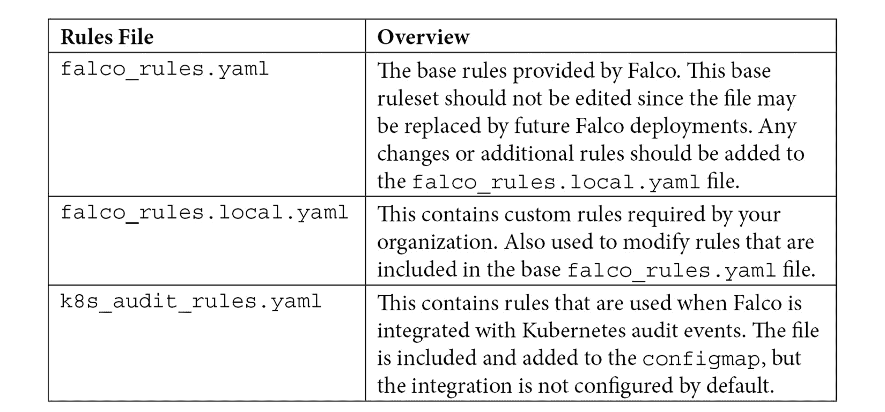

表 12.1–规则文件概述

每个规则文件都有相同的语法，所以在更详细地解释每个文件之前，让我们解释一下规则、宏和列表是如何一起工作来创建规则的。

我们的第一个示例将在不属于 Kubernetes 本身的 pod 尝试联系 API 服务器时生成警报。这种类型的活动可能表明攻击者想要利用 Kubernetes API 服务器。为了实现最高效的警报，我们不希望从属于 Kubernetes 集群的需要与 API 服务器通信的 pods 生成警报。

包含的规则列表包含此事件。在`falco_rules.yaml`文件中，对于 API 服务器通信有一个规则:

```
- rule: Contact K8S API Server From Container
  desc: Detect attempts to contact the K8S API Server from a container
  condition: evt.type=connect and evt.dir=< and (fd.typechar=4 or fd.typechar=6) and container and not k8s_containers and k8s_api_server
  output: Unexpected connection to K8s API Server from container (command=%proc.cmdline %container.info image=%container.image.repository:%container.image.tag connection=%fd.name)
  priority: NOTICE
  tags: [network, k8s, container, mitre_discovery]
```

您可以看到一个规则可能包含多个条件和值。Falco 包含一大组可以检查的条件，所以让我们从详细解释这条规则开始。

为了解释该规则的工作原理，我们将下表中的每一部分进行了细分:

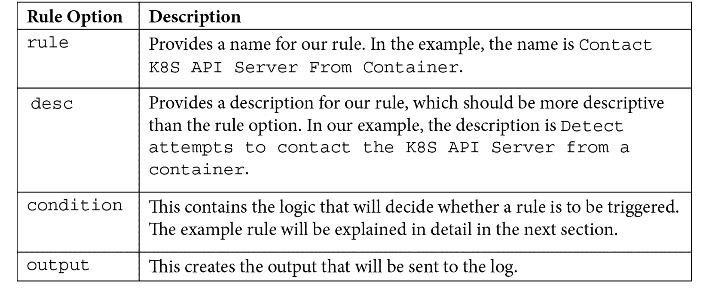

表 12.2–法尔科规则的部分内容

表中的大部分内容相当简单，但是条件部分有一些复杂的逻辑，可能对您没有多大意义。像大多数日志记录系统一样，Falco 使用自己的语法来创建规则条件。

因为规则可能很难创建，所以 Falco 社区提供了一个广泛的预制规则列表。许多人会发现社区规则将完全满足他们的需求，但是在某些情况下，您可能需要创建自定义规则，或者需要更改现有规则之一来减少您可能不关心的事件的警报。在尝试创建或更改事件之前，您需要了解条件的完整逻辑。

涵盖 Falco 提供的所有逻辑和语法超出了本书的范围，但是理解示例规则是创建或编辑现有规则的第一步。

### 理解条件(字段和值)

示例条件包含几个不同的条件，我们将在这里分成三个部分，分步骤描述条件的每个部分。

条件的第一个组成部分是`class` `fields`。一个条件可以包含多个类字段，并且可以使用标准的`and`、`not`或`equals`条件进行评估。分解示例条件，我们使用`event (evt)`和`file descriptor (fd)`类字段:


图 12.1–类别字段示例

每个类可以有一个`field`值:

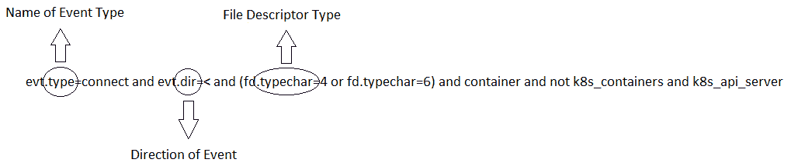

图 12.2–类别字段值

最后，每个字段类型都有一个`value`:

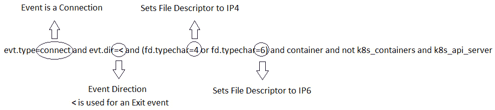

图 12.3–条件值

重要说明

你可以在法尔科的网站[https://falco.org/docs/rules/supported-fields/](https://falco.org/docs/rules/supported-fields/)获得可用课程的完整列表。

Falco 有许多用于规则的类字段和值。有太多的类需要在一章中解释，但是为了帮助创建您自己的自定义规则，我们使用原始的示例条件提供了一个解释:

```
condition: evt.type=connect and evt.dir=< and (fd.typechar=4 or fd.typechar=6) and container and not k8s_containers and k8s_api_server
```

下表解释了事件类及其值:

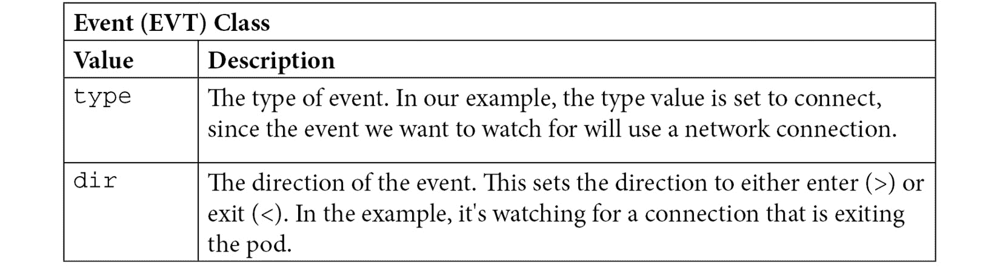

表 12.3–事件类别示例

除了使用事件类，该规则还使用文件描述符类，解释如下:

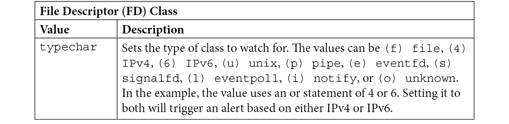

表 12.4–文件描述符示例

以`and container`值开始的规则的最后一部分将包括任何容器。然而，由于我们不想从Kubernetes本身发送有效通信的警报，值`and not k8s_containers and k8s_api_server`告诉条件省略Kubernetes容器和`api_server`。本例中的值使用在`falco_rules.yaml`文件中定义的宏。我们将在下一节讨论宏。

### 使用宏

宏允许你创建一个集合，使规则创建更快更容易。在前面的例子中，条件使用了两个宏，`k8s_containers`和`k8s_api_server.`

`k8s_containers`宏被定义为包含以下条件:

```
# In a local/user rules file, list the namespace or container images that are
# allowed to contact the K8s API Server from within a container. This
# might cover cases where the K8s infrastructure itself is running
# within a container.
- macro: k8s_containers
  condition: >
    (container.image.repository in (gcr.io/google_containers/hyperkube-amd64,
     gcr.io/google_containers/kube2sky, sysdig/agent, sysdig/falco,
     sysdig/sysdig, falcosecurity/falco) or (k8s.ns.name = "kube-system"))
```

宏和规则一样，使用类来创建条件。要评估`k8s_containers`条件，宏使用两个类:

*   `container.image.repository`类字段，用于验证条件的存储库。
*   `k8s.ns.name`类字段，用于包含在`kube-system`命名空间中运行的任何容器。

`k8s_api_server`已被定义为包含以下条件:

```
- macro: k8s_api_server
  condition: (fd.sip.name="kubernetes.default.svc.cluster.local")
```

对于`k8s_api_server`条件，宏使用单个类字段来评估条件——即`fd.sip.name`类字段，该字段检查**服务器 IP** ( **SIP** )的域名。如果等于`kubernetes.default.svc.cluster.local`，则认为匹配。

将上述两个宏用于规则条件将会阻止任何 Kubernetes 集群单元在与 API 服务器通信时生成警报。

### 理解列表

列表允许您将项目分组到一个对象中，该对象可用于规则、宏或嵌套在其他列表中。

一个列表在一个规则文件中只需要两个键，`list`和`items`。例如，您可以将二进制文件分组到一个`list`中，而不是在一个条件下列出多个二进制文件:

```
- list: editors
  items: [vi, nano, emacs]
```

使用列表允许您使用单个条目，而不是在一个条件中包含多个项目。

规则可能很有挑战性，但是当你阅读更多包含的规则并开始创建自己的规则时，它会变得更容易。到目前为止，我们已经介绍了如何创建规则、宏和列表的基础知识。对我们腰带下的这些对象有了基本的了解后，我们将进入下一个配置文件，您将在其中创建并附加 Falco 规则。

## 创建和附加自定义规则

法尔科附带了许多基本规则，位于`falco_rules.yaml`文件中。此文件不应编辑–如果您需要更改或创建新规则，您应编辑`falco_rules.local.yaml`文件。

### 附加到现有规则

重要说明

您不仅限于添加规则。Falco 允许您添加规则、宏和列表。

默认情况下，包含的为空。只有在需要修改或删除现有规则或添加新规则时，才需要编辑此文件。由于文件用于更改或添加基础`falco_rules.yaml`文件的值，因此文件被 Falco 使用的顺序非常重要。

Falco 将根据所有规则文件中的名称构建规则。这些文件按照它们在基本 Falco 配置文件中被引用的顺序进行读取和评估。我们在本章开头用作示例的基本文件的规则文件顺序如下:

```
rules_file:
  - /etc/falco/falco_rules.yaml
  - /etc/falco/falco_rules.local.yaml
  - /etc/falco/k8s_audit_rules.yaml
```

注意`falco.rules.local.yaml`文件在基础`falco_rules.yaml`文件之后。保持对文件顺序的控制将有助于您跟踪规则的任何预期/意外行为。

使用 Falco 文档中的一个示例，让我们展示如何向规则追加内容。

从`falco_rules.yaml`开始的原始规则如下代码块所示:

```
- rule: program_accesses_file
  desc: track whenever a set of programs opens a file
  condition: proc.name in (cat, ls) and evt.type=open
  output: a tracked program opened a file (user=%user.name command=%proc.cmdline file=%fd.name)
  priority: INFO
```

正如描述所述，每当一组程序打开一个文件时，这个规则就会触发。当使用`cat`或`ls`打开文件时，该条件将触发。

当前规则不会忽略任何用户的打开操作。您已经决定不需要知道根用户何时使用`cat`或`ls`打开文件，并且您希望阻止 Falco 为根用户生成警报。

在`falco_rules.local.yaml`文件中，需要为现有规则创建一个`append`。要添加到规则中，您必须使用相同的规则名称，然后添加`append: true`和您想要对规则进行的任何更改。下面的代码片段显示了一个示例:

```
- rule: program_accesses_file
  append: true
  condition: and not user.name=root
```

创建新规则比附加到现有规则更容易。让我们看看它是如何工作的。

### 创建新规则

由于您正在创建一个新规则，您只需要向`falco_rules.local.yaml`添加一个标准规则。由于这是一个新规则，它将被简单地添加到 Falco 用来创建警报的规则列表中。

重要说明

Falco 的配置文件是从配置映射中读取的，因此如果您更改了配置映射中的任何值，您将需要重新启动 Falco pods。

恭喜你！这里已经向您展示了很多信息，您可能希望看到 Falco 在行动，将您的知识付诸实践。在下一节中，我们将解释如何部署 Falco，您将最终看到它的实际应用。

# 部署法尔科

我们在`chapter12`文件夹的 GitHub 存储库中包含了一个用来部署法尔科的脚本，名为`falco-install.sh`。

将 Falco 部署到 Kubernetes 集群的两种最流行的方法是使用官方的 Helm 图表或 Falco repo 中的 DaemonSet 清单。出于本模块的目的，我们将使用本书的 GitHub 存储库中修改过的 DaemonSet 安装来部署 Falco。

要使用包含的脚本部署 Falco，请通过执行`./install-falco.sh`从`chapter12`文件夹中执行脚本。我们还在同一个目录中包含了一个名为`delete-falco.sh`的脚本，它将从集群中移除法尔科。

该脚本执行的步骤在下面的列表中有详细说明，并将在本节中详细解释。

该脚本分两部分执行以下任务:

在**第 1 节**中，它创建一个法尔科探针，并执行以下步骤:

1.  使用`apt`安装围棋
2.  拉出法尔科的`driverkit-builder`容器
3.  从 Git 中提取 driverkit 源并构建可执行文件
4.  使用 driverkit 创建一个 ubuntu 通用的 Falco 探测器
5.  将`falco.ko`复制到`modules`文件夹
6.  使用`modprobe`添加法尔科探针

在**第 2 节**中，它将 Falco 添加到集群中，执行以下步骤:

1.  创建一个 Falco 命名空间
2.  从`falco/falco-config`中的文件创建名为`falco-config`的配置图
3.  部署法尔科 DaemonSet

为了更好地理解安装脚本以及为什么需要这些步骤，我们将从 Falco 探针开始解释安装细节。

# Falco 内核模块

Falco 部署了一个内核模块来监控主机系统上的系统调用。因为内核模块必须与主机内核兼容，所以您需要一个能与工作节点的主机操作系统一起工作的模块。

Falco 试图以几种不同的方式加载或创建模块:

*   如果有一个预构建的模块可供主机内核使用，Falco 将自动下载并使用该模块。
*   如果工作节点的内核不存在预构建的模块，Falco 将尝试使用来自主机的任何已安装的内核头来构建模块。

在写这篇文章的时候，法尔科为法尔科探测器提供了一种早期访问的替代方法，它们是使用名为“T2”的实用程序创建的。这个新的实用程序根据主机的内核信息自动创建新的探测器。将详细介绍使用 driverkit 创建探测器的过程，因为我们将使用它来为我们的 KinD 集群创建 Falco 探测器。

重要说明

如果您的节点没有安装正确的内核头，Falco pods 将尝试下载与主机内核版本匹配的预编译探测。

您可以通过在主机上执行`uname -r`找到您的内核信息，然后通过在以下链接中搜索可用的探测器来检查支持:

[https://S3 . amazonaws . com/download . draios . com/stable/sysdig-probe-binary/index . html](https://s3.amazonaws.com/download.draios.com/stable/sysdig-probe-binaries/index.html)

由于这需要互联网连接，因此您可能不适合在企业环境中使用，在该环境中，许多服务器运行在空气间隙环境中。在这种类型的环境中，更常见的是使用 driverkit 或内核头创建方法。

## 使用安装的内核头创建内核模块

重要说明

正如我提到的，我们不会使用这个方法来创建内核模块。本部分仅供参考。相反，我们将使用 driverkit，这将在下一节中介绍

在标准的 Kubernetes 节点上，您可能需要也可能不需要安装 Linux 头文件。根据您创建基础工作节点的方式，内核头可能已经包含在您的安装中。如果某个模块不可用，并且主机上没有安装标头，Falco 吊舱将无法启动，吊舱将进入`crashloopback`状态。这意味着在部署 Falco 之前，您需要选择并配置您的模块创建过程。

对于不同的 Linux 安装，所需的包、版本和存储库是不同的。如果您打算在您的节点上安装头，您将需要知道需要什么模块，以及任何额外的回购。由于我们已经使用 Ubuntu 作为实践练习的分发版，我们将提供为 Ubuntu 系统添加内核头的步骤。

## 使用头文件创建 Falco 模块

Falco 已经引入了一个名为 DriverKit 的实用程序，我们将使用它来为我们的 KinD Falco 安装创建内核模块。在 Falco 驱动程序可能不支持您的 Linux 发行版的情况下，我们包括使用内核头作为备份过程的过程。

如果您计划让 Falco 使用头文件创建一个内核模块，那么第一步就是为您的 Linux 版本下载内核头文件。

要为 Ubuntu 下载正确的标题，您可以使用`uname -r`命令和`linux-headers`的`apt get`命令。

`sudo apt install linux-headers-$(uname -r)`

`uname -r`将追加主机上运行的内核版本，为运行的内核提供`apt install`命令。在我们的示例主机上，运行内核是`4.4.0-142-generic`，使我们的`apt install`命令`sudo apt install linux-headers- linux-headers-4.4.0-142-generic`。

安装后，可以通过查看`/lib/modules/`目录来验证是否添加了头文件，在这里会看到一个以内核版本命名的目录；在我们的例子中，这是`4.4.0-142-generic`。

重要说明

必须在运行 Falco 的每个工作节点上安装头。

现在已经安装了头，Falco pods 将在使用工作节点上安装的头启动时构建一个内核模块。

如前所述，团队已经推出了一种更新的方法，它使用了一个名为 driverkit 的实用程序。这个过程创建了一个内核模块，您可以使用 modprobe 将其添加到主机中。我们选择这个作为我们的探针创建过程，使在 KinD 集群上部署 Falco 比使用头创建过程更容易。

## 使用 driverkit 创建内核模块

在的特殊用例中，安装内核头可能是有挑战性的或者不可能的。如果您不能使用头来构建您的模块，您可以使用一个名为 driverkit 的 Falco 实用程序来创建一个模块。

Driverkit 允许您为许多不同的 Linux 发行版创建一个内核模块。在撰写本文时，该实用程序目前支持以下发行版:

*   Ubuntu-通用
*   Ubuntu AWS(Ubuntu AWS)
*   CentOS 8
*   CentOS 7
*   CentOS 6
*   AmazonLinux
*   AmazonLinux2
*   一种自由操作系统
*   香草核

该团队正在积极寻找其他发行版的建议，因此我们可以确定，随着 driverkit 的开发，将会添加更多的发行版。

我们将使用 Ubuntu-generic 选项来查看细节，为 Ubuntu 创建一个模块。

### Driverkit 要求

在使用 driverkit 创建模块之前，您需要满足几个先决条件:

*   运行坞站守护程序。
*   应该安装 Go(既然我们用的是 Ubuntu，就用`longsleep/golang-backports`)。
*   您的目标内核版本和内核修订版。

如果您要使用 GitHub 存储库中的安装脚本，所有的构建和模块安装步骤都会得到处理，但是为了更好地理解这个过程，我们将在下一节中对其进行完整的解释。

### 安装 Falco 的驱动程序

构建内核模块的第一步是安装 driverkit 所需的依赖项:

1.  The first requirement is to install Go. Since we are using Ubuntu, we can install Go using `snap`:

    ```
    sudo snap install --classic go
    ```

    您的个人资料中应该已经有了第 5 章 *【Kubernetes斯训练营】*中的 KinD 安装中的 Go 变量。如果您使用的机器不同于您的 KinD 主机，请添加任何必需的 Go 变量。

2.  我们选择使用 Docker 构建方法进行构建。driverkit 项目页面上记录了多种方法，如果您想使用不同的构建方法，可以使用这些方法构建模块。我们将提取 Docker 映像，以便在运行构建时可以执行:

    ```
    docker pull falcosecurity/driverkit-builder
    ```

3.  一旦下载了容器，我们就可以构建 driverkit 可执行文件。构建过程将从 GitHub 下载源代码，然后使用 Go 创建可执行文件。整个过程需要几分钟才能完成:

    ```
    GO111MODULE="on" go get github.com/falcosecurity/driverkit
    ```

4.  可执行文件将在您的执行路径中创建。要验证 driverkit 可执行文件是否已成功创建，请通过键入以下命令来检查版本:

    ```
    driverkit -v
    ```

5.  这可能会返回一个版本号，或者在当前的早期版本中，可能只是返回如下:

    ```
    driverkit version -+
    ```

如果 driverkit 命令返回`-+`或版本号，则成功创建。但是，如果您在检查版本时收到一个`driverkit: command not found`错误，则构建可能已经失败，或者您的 Go 路径可能没有在您的环境变量中正确设置。如果在运行构建后找不到可执行文件，请验证 Go 环境变量是否正确，然后再次运行 Go 构建步骤。

### 创建模块并将其添加到主机

随着 driverkit 的构建和验证，我们可以构建我们的模块并将其添加到主机中。

在构建模块之前，我们需要知道主机的内核版本和发行版本。对于我们的例子，我们将使用我们在本书前面章节中一直使用的 KinD 集群。Linux 内置了一些命令来获取我们需要的两个细节:

1.  To get the kernel version, execute `uname -v`, and for the release, `uname -r`:

    

    图 12.4–Docker 主机内核版本

    版本是`#`符号之后、破折号之前的数字。在我们的主机上，我们有 100 版本。版本是从`uname -r`命令返回的全名。您需要将这两者都提供给`driverkit`命令来构建内核模块。

2.  If you are using the installation script, we retrieve the options and supply them automatically. If you are doing this step manually, you can use the following two lines of code to store the information in variables to be passed to the build command:

    ```
    kernelversion=$(uname -v | cut -f1 -d'-' | cut -f2 -d'#')
    kernelrelease=$(uname -r)
    ```

    我们使用`cut`命令从`uname -v`命令中删除不必要的信息，并将其存储在名为`kernelversion`的变量中。我们还将`uname -r`命令的输出存储在一个名为`kernelrelease`的变量中。

3.  现在，您可以使用我们提取的 Docker 映像和 driverkit 可执行文件来创建模块:

    ```
    driverkit docker --output-module /tmp/falco.ko --kernelversion=$kernelversion --kernelrelease=$kernelrelease --driverversion=dev --target=ubuntu-generic
    ```

4.  模块构建过程需要一分钟，一旦构建完成，driverkit 将向您显示新模块的位置:

    ```
    INFO driver building, it will take a few seconds   processor=docker
    INFO kernel module available                       path=/tmp/falco.ko
    ```

5.  对于添加新模块的最后一步，我们需要将其复制到正确的位置，并使用`modprobe` :

    ```
    sudo cp /tmp/falco.ko /lib/modules/$kernelrelease/falco.ko
    sudo depmod
    sudo modprobe falco
    ```

    加载模块
6.  You can verify that the module has been added by running `lsmod`:

    ```
    lsmod | grep falco
    ```

    如果加载成功，您将看到类似如下的输出:

    ```
    falco                 634880  4
    ```

就这样！现在主机上有 Falco 模块，它将提供给你的 KinD 集群。

## 使用集群上的模块

在标准的 Kubernetes 集群上，法尔科部署会将法尔科容器中的`/dev`挂载映射到主机的`/dev`挂载。通过安装`/dev`，Falco 吊舱可以使用在工作节点的主机操作系统上运行的内核模块。

## 使用 KinD 中的模块

您可能会问自己，将 Falco 模块添加到主机将如何使其对 KinD 集群可用？我们只将其添加到主机本身，而 KinD 集群是在另一个 Docker 容器中运行的容器。那么，KinD pod 如何使用 Docker 主机中的模块呢？

还记得 KinD 在启动 KinD 容器时有一个装载额外卷的功能吗？在我们的安装中，我们为`/dev:/dev`添加了一个挂载点，这将在我们的容器中创建一个挂载点，挂载到主机的`/dev`文件系统中。如果我们查看主机的`/dev`文件系统，我们会在列表中看到 Falco 条目，如下所示:

```
cr--------  1 root root    244,   0 May  4 00:58 falco0
```

这是法尔科吊舱启动时将用作其模块的东西。

但是等等！我们刚刚说过`/dev`安装在我们的 KinD 容器中，指向主机的`/dev`文件系统。那么Kubernetes集群中的容器如何访问`/dev`文件系统呢？

如果我们看一下我们将在下一节中使用的 Falco DaemonSet 文件，我们会看到清单为 pod 创建了几个挂载点。

`volumeMount`条目之一如下:

```
- mountPath: /host/dev
  name: dev-fs
  readOnly: true
```

`volumeMount` 条目使用的是 DaemonSet 的 *卷*部分中声明的卷:

```
- name: dev-fs
  hostPath:
    path: /dev
```

当法尔科吊舱启动时，它会将吊舱的`/dev`底座安装到 KinD 容器的`/dev`底座上。最后，KinD 容器的`/dev`底座安装在 Docker 主机的`/dev`上，Falco 模块位于该处。(记得套娃的比喻。)

具备所有先决条件后，我们就可以部署法尔科了。

## 部署法尔科·达蒙塞特

如果您要去从 GitHub 存储库中运行`install-falco.sh`脚本，将使用本节中提供的相同步骤安装 Falco。在本书的 GitHub repo 中，所有的 Falco 文件都位于`chapter12`目录中。

由于本章有几个不同的部分，下图提供了`chapter12`目录内容的描述:

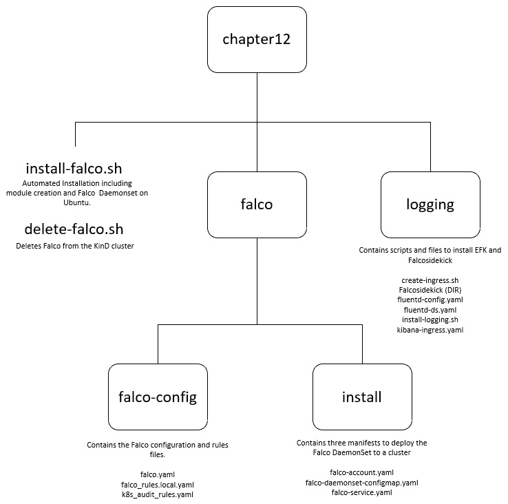

图 12.5–书的 GitHub 存储库中第 12 章目录的图表

请记住，Falco 包括一套标准规则，其中包括标准审计规则。我们已经将规则文件放在`falco/falco-config`目录中。我们从默认安装更改的唯一值是日志格式，我们将其更改为 JSON，并额外设置了`http_output`的值以使用 Falcosidekick。

要手动部署 Falco DaemonSet，您需要在`install`目录中部署三个清单，并使用`falco-config`目录内容创建一个机密。

### 创建法尔科服务帐户和服务

由于我们希望在专用的名称空间中运行 Falco，因此我们需要在集群上创建一个名为`falco`的名称空间。运行以下命令:

```
kubectl create ns falco
```

像所有的 Kubernetes 应用一样，我们需要为应用创建一个拥有正确的 RBAC 权限的帐户来执行必要的任务。我们的第一步是创建该服务帐户，该帐户将用于在 DaemonSet 部署中分配 RBAC 权限:

1.  使用`kubectl`，创建服务账户:

    ```
    kubectl apply -f falco/install/falco-account.yaml -n falco
    ```

2.  接下来，我们需要为 Falco 创建一个服务。包含的`falco-service.yaml`文件将在 TCP 端口`8765`上创建一个新服务。使用 kubectl，应用清单:

    ```
    kubectl apply -f falco/install/falco-service.yaml -n falco
    ```

3.  Falco uses files for the base configuration and rules. Since we are running Falco in Kubernetes, we need to store the files in a Kubernetes object so they can be used by the Falco pods. To store the files in a ConfigMap, create a new ConfigMap called `falco-config` using all of the files in the `falco-config` directory:

    ```
    kubectl create configmap falco-config --from-file=falco/falco-config -n falco
    ```

    重要说明

    如果您在部署 Falco 后需要修改任何配置文件，您应该删除配置映射，并使用新更新的文件重新创建它。更新配置映射后，您还需要重新启动每个 Falco pod，以便从配置映射中重新加载更新的文件。

4.  最后一步是部署 daemmonset:

    ```
    kubectl apply -f falco/install/falco-daemonset-configmap.yaml -n falco
    ```

一旦法尔科吊舱运行，您可以通过查看吊舱的日志来验证运行状况。输出将类似于下面的输出(错误是预期的，Falco 试图在所有位置找到内核模块，其中一些不存在，导致“错误”):

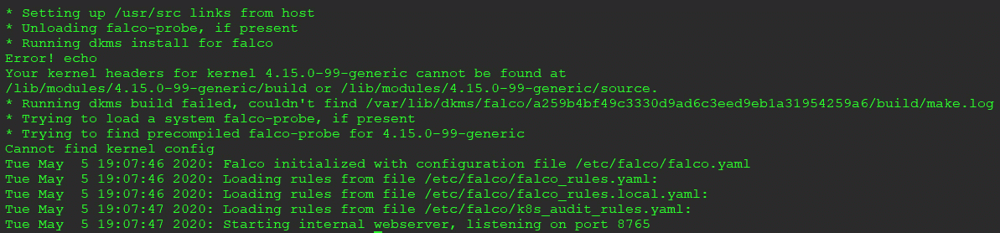

图 12.6–成功的 Falco 吊舱启动日志

你现在有一个法尔科daemmonset 设置，将审计事件在你的豆荚。

重要说明

您可能会在 Falco pod 日志的最后一行收到一个错误，类似于以下示例:

**2020 年 5 月 5 日星期二 20:38:14:运行时错误:打开设备/主机/dev/falco0 时出错。请确保您有根凭据，并且 falco-probe 模块已加载。正在退出。**

在这种情况下，您的 Falco 模块可能没有被加载，所以回到 modprobe 步骤并再次执行它们。您不需要重新启动法尔科吊舱，因为一旦法尔科能够在`/dev`目录中看到该模块，更改将被拾取，并且法尔科将开始记录。

当然，为了有用，我们需要将事件转发到中央日志系统。在默认部署中，Falco 日志仅在每台主机上运行的 pod 上可用。如果您有 30 台主机，您将有 30 个唯一的 Falco 日志，每台主机上一个。俗话说，在分散的系统中发现一个事件就像大海捞针。

Falco 日志使用标准输出，因此我们可以轻松地将日志转发到任何第三方日志系统。虽然我们可以选择许多选项作为我们的日志服务器，但是我们选择了来使用**弹性搜索、Fluentd 和 Kibana** ( **EFK** )以及 Falcosidekick 转发我们的日志。

## 部署 EFK

我们的第一步将是部署**弹性搜索**来接收事件数据。要安装弹性搜索，我们需要数据的持久存储。幸运的是，由于 Rancher 的本地置备程序，我们使用了一个 KinD 集群，因此我们拥有持久存储。

为了简化部署，我们将使用 Bitnami 的 Helm 图表为 Elasticsearch 和 Kibana 部署我们的栈。您需要安装 Helm 二进制文件才能将图表部署到集群中。如果你正在做书中的练习，你应该已经在 [*第五章*](05.html#_idTextAnchor150) *中的 KinD 部署中安装了 Helm3，Kubernetes Bootcamp* 。

通过运行`helm version`命令，验证您已经安装并运行了 Helm。如果您的路径上安装了 Helm，您应该会收到一个回复，其中包含您正在运行的 Helm 版本:

```
version.BuildInfo{Version:"v3.2.0", GitCommit:"e11b7ce3b12db2941e90399e874513fbd24bcb71", GitTreeState:"clean", GoVersion:"go1.13.10"}
```

如果您收到错误，您将需要重新安装 Helm，然后才能继续。

在 GitHub 存储库中，我们包含了一个部署 EFK 的脚本。脚本名为`install-logging.sh`，位于`chapter12/logging`目录下。与前面的所有脚本一样，我们将详细介绍脚本和执行的命令。

### 创建新的命名空间

由于我们可能希望将访问权委托给一个集中的日志记录团队，因此我们将创建一个名为`logging`的新名称空间:

```
kubectl create ns logging
```

### 将图表重新发布到 Helm

由于我们将使用 Helm 从 Bitnami 部署图表，我们需要将 Bitnami 图表存储库添加到 Helm。您可以使用`helm repo add <repo name> <repo url>`命令添加图表副本:

```
helm repo add bitnami https://charts.bitnami.com/bitnami
```

您应该会收到一份确认信息，表明已添加 Bitnami:

```
"bitnami" has been added to your repositories
```

添加 Bitnami 存储库后，您可以开始从 Bitnami repo 部署图表。

### 部署弹性搜索图表

弹性搜索部署将数据存储在永久磁盘上。我们希望控制创建的磁盘的大小，因此我们在`helm install`命令中传递值，将大小限制为 1 GB。

要使用选项部署 Bitnami 的 Elasticsearch，请使用以下`helm install`命令。我们只是为我们的安装设置了一些值，但是像任何 Helm 图表一样，有一长串选项允许我们自定义安装。对于我们的示例部署，我们仅将持久卷大小设置为 1 GB，并将数据副本数量设置为`2`。我们还希望图表部署在`logging`名称空间中，因此我们还添加了`--namespace logging`选项:

```
helm install elasticsearch bitnami/elasticsearch --set master.persistence.size=1Gi,data.persistence.size=1Gi,data.replicas=2 --namespace logging
```

一旦您开始部署图表，您将收到关于`vm.max_map_count`内核设置的警告。对于我们的 KinD 集群，包含的`initContainer`将在我们的工作节点上设置该值。在生产环境中，您可能不允许特权容器运行，这将导致 initContainer 失败。如果您不允许特权吊舱在您的集群中运行(这是一个非常**的**好主意)，您将需要在部署弹性搜索之前在每台主机上手动设置该值。

您可以通过检查`logging`命名空间中的 pods 来检查部署的状态。使用`kubectl`，在进入下一步之前，确认所有的吊舱都处于运行状态:

```
kubectl get pods -n logging
```

您应该会收到以下输出:

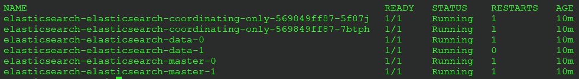

图 12.7-弹性搜索 pod 列表

如我们所见，赫尔姆图表创建了几个Kubernetes对象。主要对象包括以下内容:

*   弹性搜索服务器窗格(`elasticsearch-elasticsearch-coordinating-only`)
*   弹性搜索数据状态集(`elasticsearch-elasticsearch-data-x`)
*   弹性搜索主状态集(`elasticsearch-elasticsearch-master-x`)

每个状态集为创建的每个 pod 创建一个 1 GB 的持久卷声明。我们可以使用`kubectl get pvc -n logging`查看 PVC，产生以下输出:

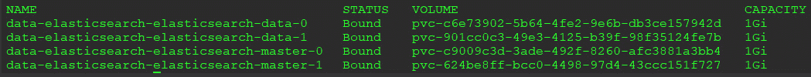

图 12.8–弹性搜索使用的聚氯乙烯列表

创建了三个集群 IP 服务，因为 Elasticsearch 将只被其他 Kubernetes 对象使用。我们可以使用`kubectl get services -n logging`查看服务，产生以下输出:

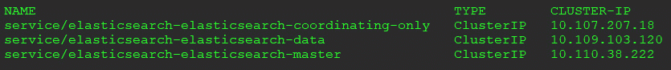

图 12.9-弹性搜索服务

通过查看吊舱、服务和 PVC，我们可以确认图表部署是成功的，并且我们可以继续下一个组件，Fluentd。

### 部署 Fluentd

我们在`chapter12/logging`目录中的 GitHub repo 中包含了一个fluent部署。

Fluentd 是一个常见的日志转发器，与 Kubernetes 一起使用，将日志转发到一个中心位置。我们正在安装它，以便将 Kubernetes 日志转发到 Elasticsearch，从而提供 EFK 部署的完整示例。我们的 Falco 活动将使用 Falcosidekick 转发。

将 Fluentd 部署到集群的第一步是应用 Fluentd 配置。`fluentd-config.yaml`文件将创建一个包含 Fluentd 部署配置选项的配置图。

配置 Fluentd 超出了本书的范围。要使用 Fluentd 转发日志，我们确实需要解释 ConfigMap 的`output.conf`部分，它配置 Fluentd 将向其发送日志的主机。

在`fluentd-config.yaml`文件中，在文件的底部，你会看到一个标题为`output.conf`的部分:

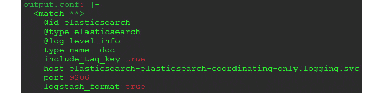

图 12.10–流体输出配置

你可以看到我们对`elasticsearch`的`id`和`type`进行了选项设置，主机设置已经设置为`elasticsearch-elasticsearch-coordinating-only.logging.svc`。如果您返回几页并查看`kubectl get services -n logging`命令的输出，您将在输出中看到一个具有该名称的服务。这是与弹性搜索部署交互时必须针对的服务:

```
elasticsearch-elasticsearch-coordinating-only   ClusterIP   10.107.207.18
```

请注意，我们还向主机名添加了名称空间和 svc。Fluentd DaemonSet 将安装到`kube-system`命名空间，因此为了与另一个命名空间中的服务进行通信，我们需要提供服务的全名。在我们的 KinD 集群中，我们不需要将集群名称添加到`hostname`值中。

我们可以使用`kubectl apply`部署配置图:

```
kubectl apply -f fluentd-config.yaml
```

配置映射后，我们可以使用以下命令部署 DaemonSet:

```
kubectl apply -f fluentd-ds.yaml
```

通过检查`kube-system`命名空间中的吊舱，验证 Fluentd 吊舱是否正在运行:

```
kubectl get pods -n kube-system
```

因为我们只有一个节点，所以只能看到一个 Fluentd pod:

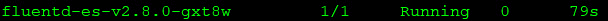

图 12.11–Fluentd daemmonset 吊舱列表

Fluentd 将用于将所有**容器日志转发到 Elasticsearch。**

 **为了更容易使用 Kibana，我们将在本章的后面部分讨论，我们希望转发 Falco 日志，而不转发任何其他容器日志。最简单的方法是使用 Falco 团队的另一个项目，叫做 Falcosidekick。

### 部署 Falcosidekick

Falco 有一个实用程序，可以格式化并将 Falco 事件转发到不同的日志服务器。项目位于 https://github.com/falcosecurity/falcosidekick[的 GitHub 上。在撰写本文时，它支持 15 种不同的日志记录系统，包括 Slack、Teams、Datadog、Elasticsearch、AWS Lamda、SMTP 和 Webhooks。](https://github.com/falcosecurity/falcosidekick)

由于 Falcosidekick 为各种不同的后端打开了一种简单的转发方法，我们将部署它来将 Falco 事件转发到 Elasticsearch。

为了部署 Falcosidekick，我们将使用 Helm 从我们的 GitHub 存储库中使用本地副本来部署图表。图表文件位于`chapter12/logging/falcosidekick`目录:

1.  像所有图表一样，我们可以使用`values.yaml`文件来配置图表选项。我们提供了一个预配置的文件，其中包含将 Falco 事件发送到弹性搜索部署所需的条目。我们配置的文件中的条目显示在下面的代码块中。我们必须配置主机端口，使我们的弹性搜索服务以 HTTP 和端口`9200` :

    ```
     elasticsearch:
        host port: "http://elasticsearch-elasticsearch-coordinating-only.logging.svc:9200"
        index: "falco"
        type: "event"
        minimumpriority: ""
    ```

    为目标
2.  部署图表最简单的方法是将您的工作目录更改为`falcosidkick`目录。进入目录后，运行以下`helm install`命令部署图表:

    ```
    helm install falcosidekick -f values.yaml . --namespace falco
    ```

3.  要验证图表是否正确部署，请从运行在`logging`命名空间:

    ```
    kubectl logs falcosidekick-7656785f89-q2z6q -n logging
    2020/05/05 23:40:25 [INFO]  : Enabled Outputs : Elasticsearch
    2020/05/05 23:40:25 [INFO]  : Falco Sidekick is up and listening on port 2801
    ```

    中的 Falcosidekick 实例中获取日志
4.  一旦 Falcosidekick 吊舱启动从 Falco 吊舱接收数据，日志文件将包含显示成功的弹性搜索帖子的条目:

    ```
    2020/05/05 23:42:40 [INFO]  : Elasticsearch - Post OK (201)
    2020/05/05 23:42:40 [INFO]  : Elasticsearch - Post OK (201)
    2020/05/05 23:42:40 [INFO]  : Elasticsearch - Post OK (201)
    2020/05/05 23:42:40 [INFO]  : Elasticsearch - Post OK (201)
    ```

到目前为止，这给了我们什么？我们已经部署了弹性搜索来存储 Fluentd 代理将从我们的工作节点转发的信息。现在，我们的工作节点正在使用 Fluentd 代理将其所有日志发送到 Elasticsearch 实例，Falcosidekick 正在转发 Falco 事件。

Elasticsearch 将有大量信息需要整理，以使数据有用。为了解析数据并为日志创建有用的信息，我们需要安装一个系统，我们可以使用它来创建自定义仪表板并搜索收集的数据。这就是 **EFK** 栈中的 **K** 出现的地方。我们部署的下一步是安装基巴纳。

### 部署基巴纳

下一个图表将安装基巴纳服务器。我们选择使用只通过 HTTP 为基巴纳服务的部署，没有认证。在生产环境中，您应该同时启用两者来提高安全性。当然，在集群之外还不能访问基巴纳，因此我们需要创建一个入口规则，将我们的 NGINX 入口配置为将流量定向到 pod:

1.  要使用 Bitnami 图表将 Kibana 部署到集群，请使用以下命令:

    ```
    helm install kibana --set elasticsearch.hosts[0]=elasticsearch-elasticsearch-coordinating-only -- elasticsearch.port=9200,persistence.size=1Gi --namespace logging bitnami/kibana
    ```

2.  一旦部署开始，您将看到 Helm 的一些输出，告诉您如何使用 kubectl 端口转发来访问 Kibana:

    ```
    Get the application URL by running these commands:
      export POD_NAME=$(kubectl get pods --namespace logging -l "app.kubernetes.io/name=kibana,app.kubernetes.io/instance=kibana" -o jsonpath="{.items[0].metadata.name}")
      echo "Visit http://127.0.0.1:8080 to use your application"
      kubectl port-forward svc/kibana 8080:80
    ```

您可以忽略这些说明，因为我们将使用入口规则公开基巴纳，以便它可以在网络上的任何工作站上被访问。

### 为基巴纳创建入口规则

对于入口规则，我们将基于 nip.io 域创建一个规则:

1.  To create the ingress rule with the correct nip.io name, we have provided a script in the `chaper12/logging` folder called `create-ingress.sh`:

    ```
    ingressip=$(hostname  -I | cut -f1 -d' ')
    ingress=`cat "kibana-ingress.yaml" | sed "s/{hostip}/$ingressip/g"`
    echo "$ingress" | kubectl apply -f -
    ```

    该脚本将找到 Docker 主机的 ip 地址，并使用 **kibana.w.x.y.z.nip.ip** 用 nip.io 主机修补入口清单(这里， **w.x.y.z** 将包含主机的 IP 地址)。

2.  创建入口规则后，将显示访问您的基巴纳仪表板的详细信息:

    ```
    You can access your Kibana dashboard in any browser on your local network using http://kibana.10.2.1.107.nip.io
    ```

现在我们已经安装了基巴纳，我们可以打开基巴纳仪表板开始我们的配置。

### 使用基巴纳仪表板

要浏览至基巴纳仪表盘，请按照以下步骤操作:

1.  从本地网络上的任何计算机打开浏览器。
2.  使用在`install-ingress.sh`脚本中显示的入口名。在我们的例子中，我们会浏览到。
3.  The request will come back to your client with the IP address `10.2.1.107` and will be sent to your Docker host on port `80`.

    小费

    请记住，我们在端口`80`和`443`上公开了 KinD worker 节点的 Docker 容器。

4.  当您的 Docker 主机收到端口`80`上的主机名请求时，它将被转发到 Docker 容器，并最终到达 NGINX 入口控制器。
5.  NGINX 将寻找与主机名匹配的规则，并将流量发送到 Kibana pod。在您的浏览器中，您将看到基巴纳欢迎屏幕:

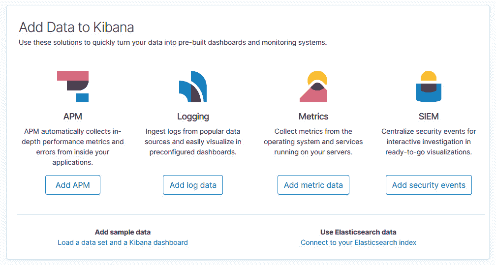

图 12.12–基巴纳欢迎屏幕

虽然您现在已经运行了一个功能齐全的审计日志记录系统，但是使用 Kibana 还有一步:您需要创建一个默认索引。

#### 创建基巴纳索引

要查看日志或创建可视化和仪表板，您需要创建一个索引。单个基巴纳服务器上可以有多个索引，允许您从单个位置查看不同的日志。在我们的示例服务器上，我们将有两组不同的传入日志，一组以 logstash 开头，另一组以 falco 开头。

logstash 文件容器中的数据由 Kubernetes 日志文件组成，其中包括 Fluentd 转发器转发的所有日志。法尔科文件由法尔科西迪基克转发，仅包含来自法尔科吊舱的警报。在本章中，我们将重点介绍法尔科文件，因为它们只包含法尔科数据:

1.  在基巴纳，点击位于左侧的设置工具，打开基巴纳管理页面。
2.  要创建索引并将其设置为默认值，请单击浏览器左上角的索引模式链接。
3.  接下来，点击右上角的按钮创建一个新的索引模式。
4.  Since we only want to create an index that contains the Falco data, enter `falco*` in the box. This will create an index that contains all current and future Falco logs:

    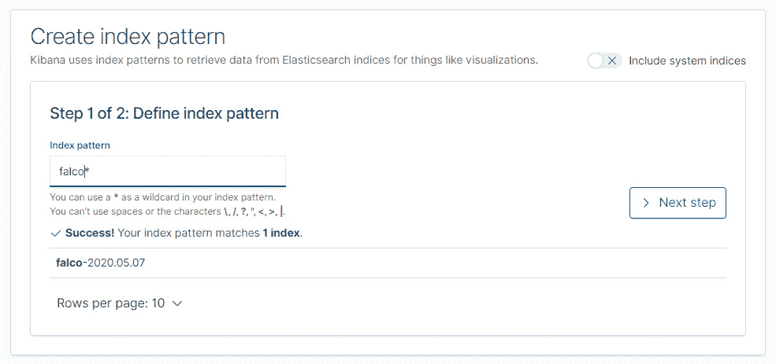

    图 12.13–基巴纳指数模式定义

5.  点击**下一步**按钮继续。
6.  In the configuration settings, click the dropdown and select **time**, then click **Create index pattern** to create the pattern:

    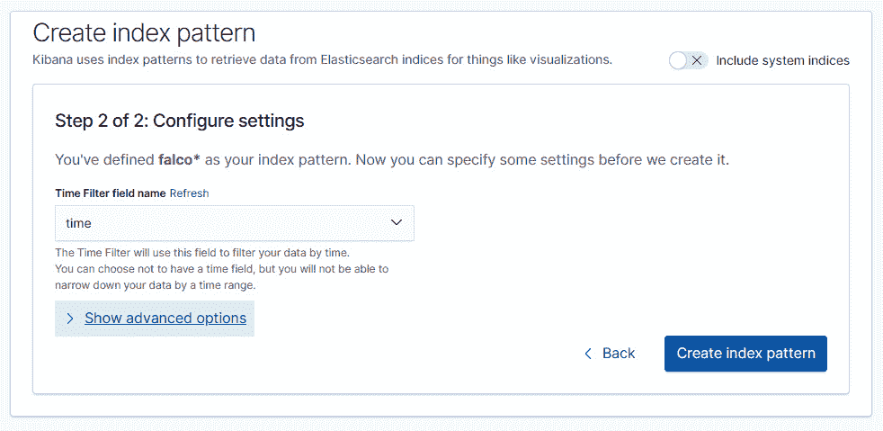

    图 12.14–创建索引

7.  最后，通过点击最终屏幕右上角的星号，将索引设置为默认索引:

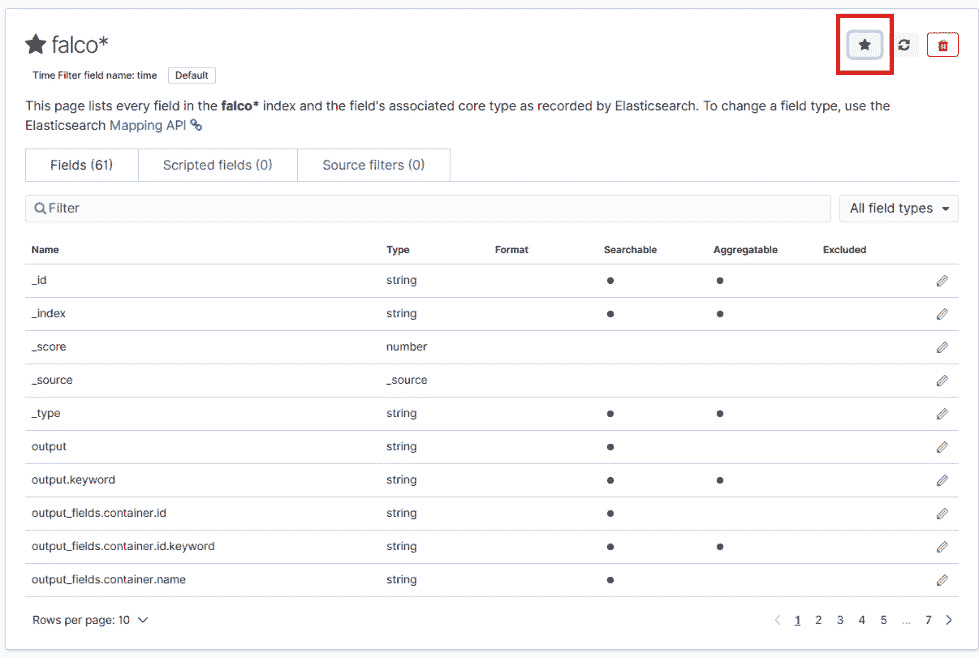

图 12.15–设置默认索引

就是这样，现在您的集群上运行了一个完整的 Falco 日志记录系统。

要开始查看数据，请单击位于基巴纳屏幕左上角的发现按钮，该按钮将带您进入基巴纳主页面，您将在该页面上看到集群中的事件:

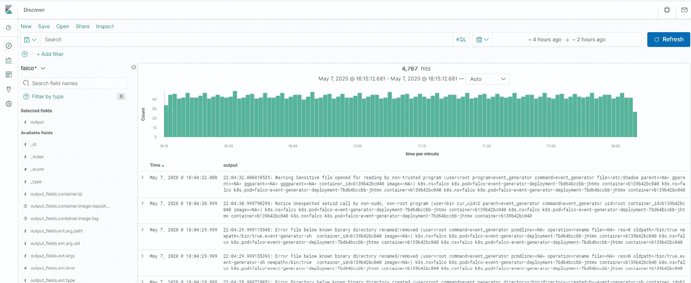

图 12.16–基巴纳主页

您可以通过在搜索栏中键入关键字来搜索事件。如果您正在寻找单一类型的事件，并且知道要搜索什么值，这将很有帮助。

像基巴纳这样的日志记录系统的真正好处是能够创建自定义仪表板，提供对多个事件的视图，这些事件可以按计数、平均值等进行分组。在下一节中，我们将解释如何创建一个提供 Falco 事件集合的仪表板。

创建仪表板是您需要发展的一项技能，了解如何对数据进行分组以及在仪表板中使用什么值需要时间。本节旨在为您提供开始创建仪表板所需的基本工具，如下所示:

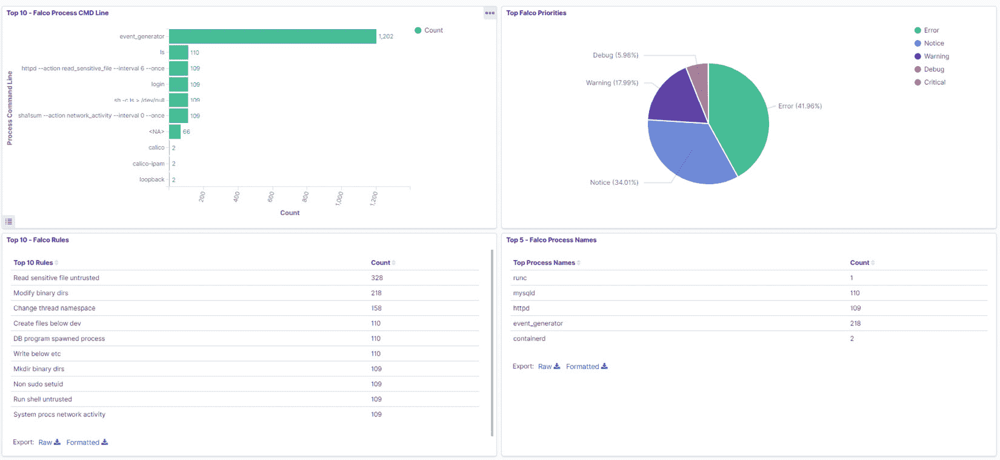

图 12.17–仪表板示例

人们喜欢仪表板，Kibana 提供了工具来创建系统的动态且易于解释的视图。仪表板可以使用基巴纳有权访问的任何数据来创建，包括法尔科事件。在我们创建仪表板之前，让我们了解一下*可视化*意味着什么。

#### 形象化

可视化是一组数据的图形表示——在我们的上下文中，来自基巴纳索引。Kibana 包括一组可视化功能，允许您将数据分组为表格、仪表、水平条、饼图、竖线等。

要创建新的可视化效果，请单击左侧栏上的可视化图标，该图标看起来像一个小图形。这将显示新的可视化选择屏幕。然后，按照以下步骤操作:

1.  To select the visualization you want to create, select it from the list. Let's use a common one for this visualization, the pie chart:

    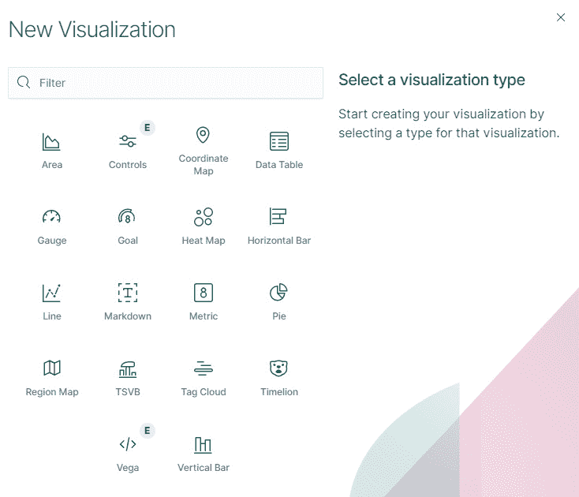

    图 12.18–法尔科可视化

2.  Each visualization requires a source. For our example, we only have one index created called `falco*`, so select that as the source:

    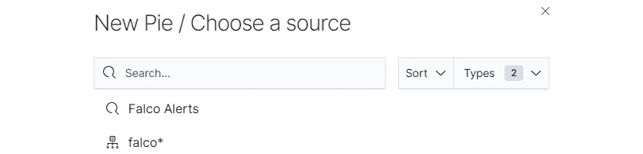

    图 12.19–选择可视化源

3.  下一步是选择一个指标和一个桶。度量定义了如何聚合桶中的结果。桶是您想要可视化的值。例如，我们希望饼图显示事件优先级的总数，范围从**错误**、**通知**和**警告**到**调试**。
4.  First, set the metric aggregation value to **Count**:

    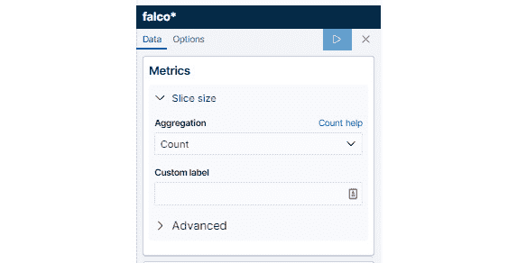

    图 12.20–可视化指标选项

5.  Next, we need to select the field we want to aggregate. For **Aggregation**, select **Terms**, and for **Field**, select **priority.keyword**:

    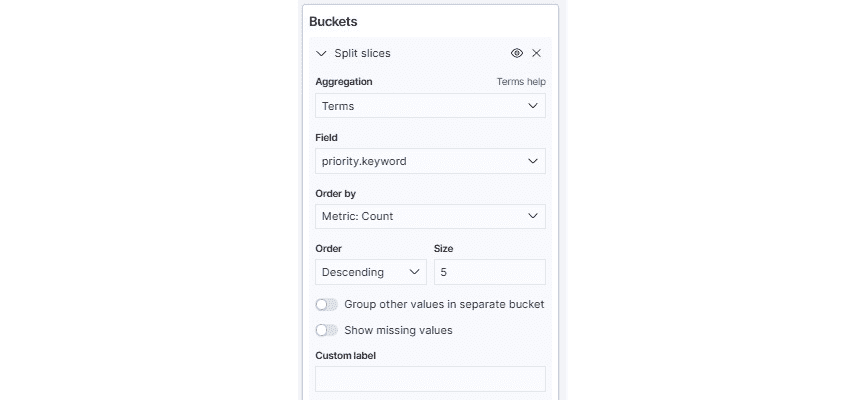

    图 12.21–选择铲斗值

6.  Before saving the visualization, you can preview the results by clicking the arrow button at the top of the metric box. A preview of the results will be shown in the right-hand pane:

    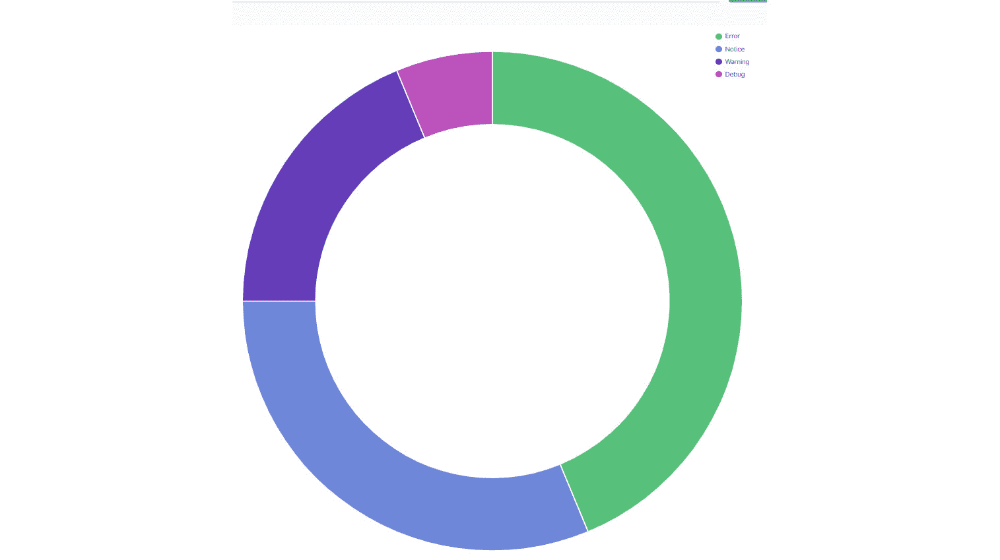

    图 12.22–可视化预览

7.  如果结果是您所期望的，您可以通过单击主视图顶部的**保存**链接来保存可视化效果。输入可视化效果的名称，以便您稍后在创建仪表板时可以找到它:

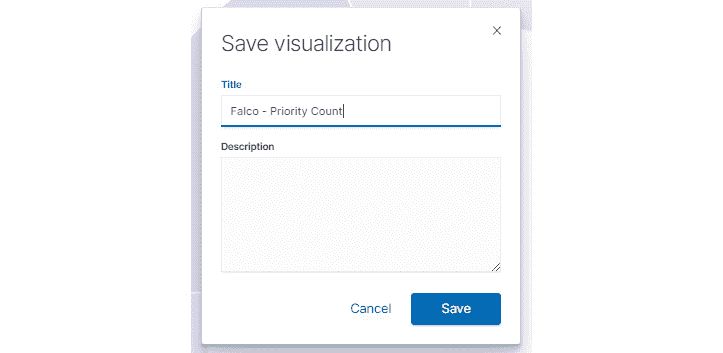

图 12.23–保存新的可视化效果

保存可视化时，它将保留在屏幕上，但您应该会在右下角看到保存成功的确认。

要创建其他可视化效果，您只需再次单击可视化效果按钮，并选择所需的类型来创建另一个可视化效果。使用我们在第一个可视化中看到的内容，创建两个使用以下参数的附加可视化:

*   **Visualization Type**: Horizontal bar

    **来源** : `falco*`

    **度量**:聚合:计数

    **桶** : X 轴，聚合:术语，字段:`rule.keyword`

    **度量**:计数，大小:5，自定义标签:前 5 条法尔科规则

    **可视化名称**:前 5 大法尔科规则

*   **Visualization Type**: Data Table

    **来源** : `falco*`

    **度量**:聚合:计数

    **桶**:拆分行，聚合:术语，字段:`output_fields.fd.name.keyword`，度量:计数，大小:5，自定义标签:前 5 个修改文件

    **可视化名称**:前 5 名法尔科修改文件

在下一节中，我们将创建一个显示您创建的可视化效果的仪表板。

#### 创建仪表板

仪表板允许您在一个集合中显示可视化效果，该集合易于阅读，信息每分钟更新一次:

1.  To create a dashboard, click on the dashboard button  on the sidebar.

    按钮看起来像 4 个堆叠的块。

2.  This will bring up the **Create your first dashboard screen**. Click the **Create new dashboard** button to start creating your dashboard.

    屏幕上将出现一个空白仪表盘，上面有一个按钮:

    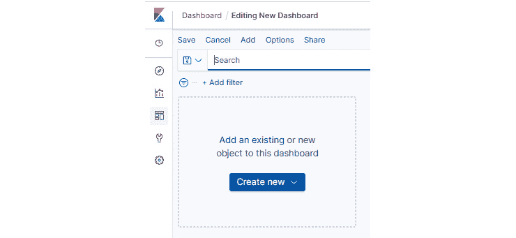

    图 12.24–创建新仪表板

3.  This button provides you the option to use an existing visualization or to create a new one. Since we created three visualizations earlier, click the **Add an existing** link. Once selected, all existing visualizations will be presented on the right-hand side of the dashboard in the **Add panels** box:

    

    图 12.25–向仪表板添加面板

4.  我们想添加我们创建的三个可视化效果:**法尔科优先级计数**、**前 5 名法尔科修改文件**和**前 5 名法尔科规则**。要添加每一个，点击它们每一个**一次**。
5.  Once you have added all of the visualizations to the dashboard, you can close the **Add panels** pane by clicking the **X** in the upper right-hand of that pane. Once it's closed, you should see your dashboard with the visualizations you selected:

    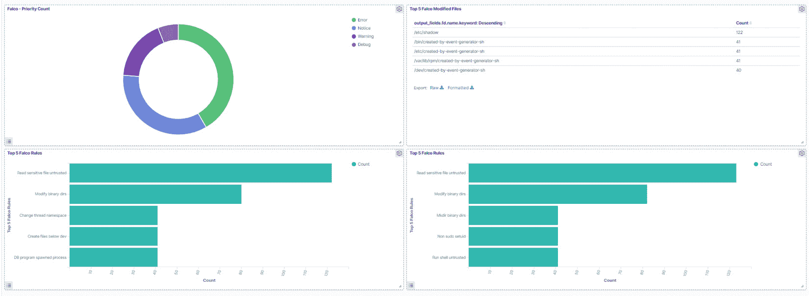

    图 12.26–添加可视化后的仪表板视图

    哎呀！看起来我们可能已经添加了两次前 5 名的法尔科规则可视化。当我们完成添加可视化的步骤时，我们在步骤中强调了一个关键词:“要添加每个可视化，请单击每个可视化**一次**。”每次点击时都会添加可视化效果。当我们将 Falco 规则添加到仪表板时，我们双击了它。

    如果您碰巧双击了一个可视化，它将被添加到仪表板两次。如果不小心添加了两次可视化效果，只需点击可视化效果角落的齿轮，从仪表盘中选择**删除，即可删除其中一个可视化效果:**

    

    图 12.27–从仪表板中删除面板

6.  删除重复的可视化后，您可以通过单击浏览器窗口顶部的保存链接来保存仪表板。这将提示您保存您的仪表板，因此将其命名为`Falco Dashboard`并单击**保存**:

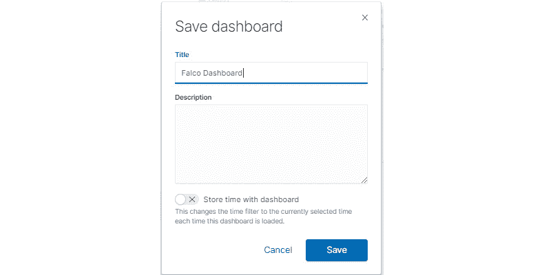

图 12.28–保存仪表板

一旦您保存了一个仪表盘，它将通过基巴纳主页左侧的仪表盘按钮可用。这与您之前创建第一个仪表板时使用的按钮相同。

# 总结

本章讲述了如何为 Kubernetes 集群创建一个增强的审计系统。我们从介绍法尔科开始这一章，法尔科是 Sysdig 捐赠给 CNCF 的一个审计附件。Falco 增加了 Kubernetes 不包括的审计级别，并与 including auditing 功能相结合，为从 API 访问到 pod 中的操作的所有内容提供了审计跟踪。

如果您不能将日志存储在日志记录系统中，日志就没有用了，该系统允许您将日志存储在持久存储上，并且通常提供一个管理界面来搜索日志和创建仪表板。我们在我们的 KinD 集群上安装了通用的 EFK 栈，并创建了一个自定义仪表板来显示基巴纳的 Falco 事件。

通过本章中学习的主题，您应该对如何将 Falco 添加到集群并使用 EFK 存储日志以及在可视化和仪表板中呈现数据有了很好的基础知识。

虽然日志记录和审核很重要，但在发生灾难时，拥有恢复工作负载的流程也同样重要。在下一章中，我们将介绍来自 Heptio 的开源备份实用程序 Velero。

# 问题

1.  If you need to edit an included Falco rule, which file would you edit?

    A.`falco.yaml`

    B.`falco_rules.yaml`

    C.`falco_rules.changes.yaml`

    D.`falco_rules.local.yaml`

2.  Which of the following is a common log forwarder used by Kubernetes?

    A. 多维数据集向前。

    B. 流利。

    C.货代。

    D.Kubernetes 不使用转发器。

3.  What is the product that provides a way to present logs using visualizations and dashboards when you deploy the EFK stack?

    A.流体

    B. Elasticsearch

    C. 基巴纳

    D.擅长

4.  Which of the following tools forwards only Falco logs to a central logging system?

    A.猎鹰队。

    B.法尔考西迪克。

    C.永恒的 API 服务器。

    D.所有产品都会转发每个日志，而不仅仅是法尔科日志。

5.  What is the name of the object in Falco that allows you to create a collection of items?

    A.列表

    B.规则

    C.数组

    D.收集**