# *第 13 章*:备份工作负载

意外和灾难时有发生，就像您在现实生活中可能有这些事件的保险一样，您也应该有集群和工作负载的保险。

大多数 Kubernetes 发行版都不包含任何用于备份工作负载的组件，但是开源社区和 Kasten 等公司的供应商支持的解决方案都提供了大量产品。

在本章中，您将了解 Velero，它可用于备份集群中的工作负载。我们将解释如何使用 Velero 来备份命名空间和计划备份作业，以及如何恢复工作负载。

在本章中，我们将涵盖以下主题:

*   了解 Kubernetes 备份
*   执行 etcd 备份
*   介绍和建立赫普西奥的韦莱罗
*   使用 Velero 备份工作负载
*   使用命令行界面管理 Velero
*   从备份恢复

# 技术要求

要执行本章中的动手实验，您将需要以下内容:

*   一个不可思议的群集的孩子
*   一台新的 Ubuntu 18.04 服务器，内存至少为 4 GB

您可以在以下 GitHub 存储库中访问本章的代码:[https://GitHub . com/PacktPublishing/Kubernetes-and-Docker-The-Complete-Guide](https://github.com/PacktPublishing/Kubernetes-and-Docker-The-Complete-Guide)。

# 了解 Kubernetes 备份

备份 Kubernetes 集群不仅需要备份集群上运行的工作负载，还需要备份集群本身。请记住，集群状态是在 etcd 数据库中维护的，这使得它成为您需要备份以从任何灾难中恢复的一个非常重要的组件。

创建集群和正在运行的工作负载的备份允许您执行以下操作:

*   迁移集群。
*   从生产集群创建开发集群。
*   从灾难中恢复群集。
*   从永久卷恢复数据。
*   命名空间和部署恢复。

在本章中，我们将提供详细信息和工具来备份您的 etcd 数据库以及集群中的每个名称空间和对象。

重要说明

从企业中的完全灾难中恢复集群通常涉及为各种组件(如入口控制器、负载平衡器和应用编程接口服务器)备份自定义 SSL 证书。

因为备份所有定制组件的过程对于所有环境都是不同的，所以我们将重点关注大多数 Kubernetes 发行版中常见的过程。

如您所知，集群状态在 etcd 中维护，如果您丢失了所有 etcd 实例，您将丢失您的集群。在多节点控制平面中，至少有三个 etcd 实例，为集群提供冗余。如果您丢失了一个实例，集群将保持运行，您可以构建一个新的 etcd 实例并将其添加到集群中。一旦添加了新实例，它将收到 etcd 数据库的副本，您的集群将恢复完全冗余。

如果您在没有任何数据库备份的情况下丢失了所有的 etcd 服务器，您将丢失集群，包括集群状态本身和所有工作负载。由于 etcd 非常重要，`etcdctl`实用程序包括一个内置的备份功能。

# 执行 etcd 备份

由于我们正在为我们的 Kubernetes 集群使用 KinD，我们可以创建 etcd 数据库的备份，但是我们将无法恢复它。

我们的 etcd 服务器运行在名为`etcd-cluster01-control-plane`的集群上的一个 pod 中，该 pod 位于`kube-system`命名空间中。运行容器包括`etcdctl`实用程序，我们可以使用`kubectl`命令执行备份。

## 备份所需的证书

大多数Kubernetes装置将证书存储在`/etc/kuberetes/pki`中。在这方面，KinD 没有什么不同，所以我们可以使用`docker cp`命令备份我们的证书。让我们看看如何通过两个简单的步骤来实现这一点:

1.  首先，我们将创建一个目录来存储证书和 etcd 数据库。将您的目录更改为您克隆图书仓库的`chapter13`文件夹。在`chapter13`文件夹下，创建一个名为`backup`的目录，并将其作为当前路径:

    ```
    mkdir backup cd ./backup
    ```

2.  To back up the certificates located on the API server, use the following `docker cp` command:

    ```
    docker cp cluster01-control-plane:/etc/kubernetes/pki ./
    ```

    这将把控制平面节点上`pki`文件夹的内容复制到`chapter13/backup/pki`文件夹中新文件夹的`localhost`中。

下一步是创建 etcd 数据库的备份。

## 备份 etcd 数据库

要备份您的 KinD 集群上的 etcd 数据库，请执行以下步骤:

重要说明

较旧版本的`etcdctl`要求您使用`ETCDCTL_API=3`将应用编程接口版本设置为 3，因为它们默认为版本 2 应用编程接口。Etcd 3.4 将默认的 API 更改为 3，因此我们在使用`etcdctl`命令之前不需要设置该变量。

1.  备份 etcd 窗格中的数据库，并将其存储在容器的根文件夹中。使用`kubectl exec`，在 etcd 吊舱上运行一个外壳:

    ```
    kubectl exec -it etcd-cluster01-control-plane /bin/sh -n kube-system
    ```

2.  In the etcd pod, back up the etcd database using `etcdctl`:

    ```
    etcdctl snapshot save etcd-snapshot.db --endpoints=https://127.0.0.1:2379 --cacert=/etc/kubernetes/pki/etcd/ca.crt --cert=/etc/kubernetes/pki/etcd/healthcheck-client.crt --key=/etc/kubernetes/pki/etcd/healthcheck-client.key
    ```

    您将收到以下输出:

    ```
    {"level":"info","ts":1591637958.297016,"caller":"snapshot /v3_snapshot.go:110","msg":"created temporary db file","path":"etcd-snapshot.db.part"}
    {"level":"warn","ts":"2020-06-08T17:39:18.323Z","caller":"clientv3/retry_interceptor.go:116","msg":"retry stream intercept"}
    {"level":"info","ts":1591637958.3238735,"caller":"snapshot/v3_snapshot.go:121","msg":"fetching snapshot","endpoint":"https://127.0.0.1:2379"}
    {"level":"info","ts":1591637958.7283804,"caller":"snapshot/v3_snapshot.go:134","msg":"fetched snapshot","endpoint":"https://127.0.0.1:2379","took":0.431136053}
    Snapshot saved at etcd-snapshot.db
    {"level":"info","ts":1591637958.732125,"caller":"snapshot /v3_snapshot.go:143","msg":"saved","path":"etcd-snapshot.db"}
    ```

3.  离开 etcd 舱。
4.  将备份复制到您的本地机器:

    ```
    kubectl cp kube-system/etcd-cluster01-control-plane:etcd-snapshot.db ./etcd-snap-kind.db
    ```

5.  通过查看当前文件夹的内容确认复制成功:

    ```
    ls -la 
    ```

你应该看到`pki`目录和 etcd 备份，`etcd-snap-kind.db`。如果没有看到备份，请再次重复这些步骤，并观察输出中的任何错误。

当然，这个过程只备份 etcd 数据库一次。在现实世界中，您应该创建一个计划的进程，定期执行 etcd 的快照，并将备份文件存储在安全的位置。

注意

由于 KinD 运行控制平面的方式，我们无法使用本节中的恢复过程。我们提供了本节中的步骤，以便您知道如何在企业环境中恢复损坏的 etcd 数据库或节点。

# 介绍和解释赫普西奥的韦莱罗

Velero 是来自 Heptio 的 Kubernetes 的开源备份解决方案。它提供了许多仅在商业产品中可用的功能，包括调度、备份挂钩和精细备份控制，所有这些都是免费的。

虽然 Velero 是免费的，但它有一个学习曲线，因为它不像大多数商业产品那样包括易于使用的图形用户界面。Velero 中的所有操作都是使用它们的命令行实用程序来执行的，这是一个名为`velero`的可执行文件。这个单一的可执行文件允许您安装 Velero 服务器、创建备份、检查备份状态、恢复备份等等。由于每个管理操作都可以通过一个文件来完成，因此恢复集群的工作负载变得非常容易。在本章中，我们将创建第二个 KinD 集群，并用现有集群的备份填充它。

但在此之前，我们需要照顾几个要求。

## 韦莱罗要求

Velero 由几个组件组成创建一个备份系统:

*   **韦莱罗命令行界面**:这提供了韦莱罗组件的安装。它用于所有备份和恢复功能。
*   **韦莱罗服务器**:负责执行备份和恢复程序。
*   **存储提供商插件**:用于备份和恢复特定的存储系统。

除了基本的 Velero 组件之外，您还需要提供一个用于存储备份的对象存储位置。如果没有对象存储解决方案，可以部署 MinIO，这是一个提供 S3 兼容对象存储的开源项目。我们将在我们的 KinD 集群中部署 MinIO，以演示 Velero 提供的备份和恢复功能。

## 安装 Velero 命令行界面

部署 Velero 的第一步是下载最新的 Velero CLI 二进制文件。要安装命令行界面，请执行以下步骤:

1.  从 Velero 的 GitHub 存储库中下载版本:

    ```
    wget  https://github.com/vmware-tanzu/velero/releases/download/v1.4.0/velero-v1.4.0-linux-amd64.tar.gz
    ```

2.  提取档案内容:

    ```
    tar xvf velero-v1.4.0-linux-amd64.tar.gz
    ```

3.  将 Velero 二进制移动到`/usr/bin` :

    ```
    sudo mv velero-v1.4.0-linux-amd64/velero /usr/bin
    ```

4.  Verify that you can run the Velero CLI by checking the version:

    ```
    velero version
    ```

    您应该从 Velero 的输出中看到您正在运行 1.4.0 版:

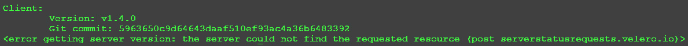

图 13.1–Velero 客户端版本输出

您可以放心地忽略最后一行，它显示了在查找 Velero 服务器时的错误。现在，我们只安装了 Velero 可执行文件，所以我们将在下一步安装服务器。

## 安装 Velero

Velero 的系统要求很少，大部分都很容易满足:

*   运行 1.10 或更高版本的 Kubernetes 集群
*   Velero 可执行文件
*   系统组件的映像
*   兼容的存储位置
*   卷快照插件(可选)

根据您的基础架构，您可能没有备份或快照卷的兼容位置。幸运的是，如果您没有兼容的存储系统，可以向集群中添加开源选项来满足要求。

在下一节中，我们将解释本机支持的存储选项，并且由于我们的示例将使用 KinD 集群，我们将安装开源选项来添加兼容的存储以用作备份位置。

### 备份存储位置

Velero 需要一个与 S3 兼容的存储桶来存储备份。有许多官方支持的系统，包括来自 AWS、Azure 和谷歌的所有对象存储产品。

除了官方支持的提供商之外，还有许多由社区和供应商支持的提供商，如 DigitalOcean、惠普和 Portworx。下表列出了所有当前的提供商:

重要说明

在下表中，**备份支持**栏表示插件提供了一个兼容的位置来存储 Velero 备份。卷快照支持意味着插件支持备份持久卷。

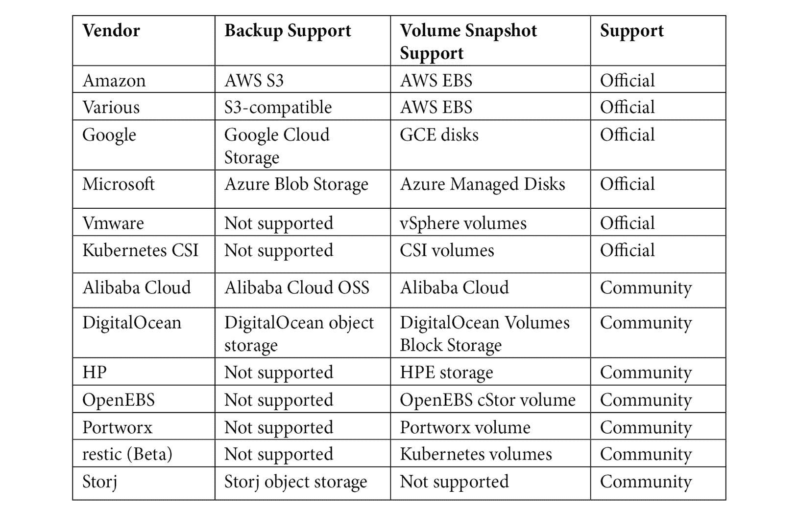

表 13.1–Velero 存储选项

注意

Velero 的 AWS S3 驱动程序与许多第三方存储系统兼容，包括 EMC ECS、IBM Cloud、Oracle Cloud 和 MinIO。

如果您没有现有的对象存储解决方案，您可以部署开源的 S3 提供商 MinIO。

现在我们已经安装了 Velero 可执行文件，并且我们的 KinD 集群具有持久存储，这要归功于 Rancher 的自动资源调配器，我们可以继续讨论第一个要求——为 Velero 添加一个 S3 兼容的备份位置。

### 部署 mini

MinIO 是一个开源对象存储解决方案，与亚马逊的 S3 云服务 API 兼容。你可以在 https://github.com/minio/minio 的 GitHub 存储库中阅读更多关于 MinIO 的信息。

如果您使用来自互联网的清单安装 MinIO，在尝试将其用作备份位置之前，请确保验证部署中声明了哪些卷。网上很多例子都用`emptyDir: {}`，不是持久的。

我们在`chapter13`文件夹中包含了一个来自 Velero GitHub 存储库的修改过的 MinIO 部署。由于我们的群集上有持久存储，我们编辑了部署中的卷，以使用**持久卷声明** ( **PVCs** )，这将为 Velero 的数据和配置使用自动资源调配器。

要部署 MinIO 服务器，将目录更改为`chapter13`并执行`kubectl create`。该部署将在您的 KinD 集群上创建一个 Velero 命名空间、PVCs 和 MinIO:

```
kubectl create -f minio-deployment.yaml
```

这将部署 MinIO 服务器，并在端口`9000/TCP`上将其公开为`minio`，如下所示:


图 13.2–Minio 服务创建

使用端口`9000`上的`minio.velero.svc`，集群中的任何吊舱都可以使用正确的访问键来定位 MinIO 服务器。

### 暴露 MinIO 仪表板

MinIO 包括一个仪表盘，允许您浏览服务器上 S3 存储桶的内容。要允许访问仪表板，您可以部署一个公开 MinIO 服务的入口规则。我们已经在`chapter13`文件夹中包含了一个入口清单示例。您可以使用包含的文件或从以下清单创建它:

1.  记得更改主机，在`nip.io`网址中加入主机的 IP 地址:

    ```
    apiVersion: networking.k8s.io/v1beta1
    kind: Ingress
    metadata:
      name: minio-ingress
      namespace: velero
    spec:
      rules:
      - host: minio.[hostip].nip.io
        http:
          paths:
          - path: /
            backend:
              serviceName: minio
              servicePort: 9000
    ```

2.  Once deployed, you can use a browser on any machine and open the URL you used for the Ingress rule. On our cluster, the host IP is `10.2.1.121`, so our URL is `minio.10.2.1.121.nip.io`:

    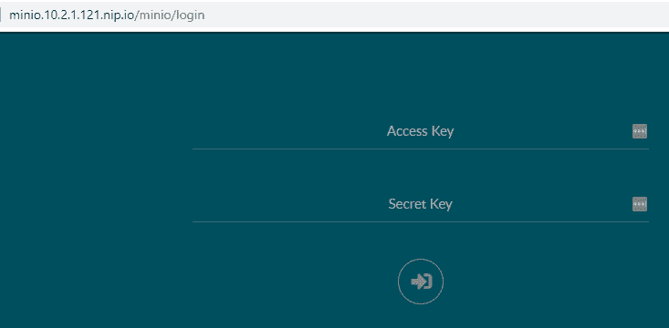

    图 13.3–MiniO 仪表板

3.  要访问仪表板，请从 MinIO 部署中提供访问密钥和密钥。如果您使用的是 GitHub 存储库中的 MinIO 安装程序，则访问密钥和密钥为`packt` / `packt`。
4.  登录后，您将看到一个存储桶和存储在其中的任何项目的列表。现在，它将相当空，因为我们还没有创建备份。在对我们的 KinD 集群执行备份后，我们将重新访问仪表板:


图 13.4–迷你浏览器

重要说明

如果您不熟悉对象存储，请注意，虽然这在您的集群中部署了存储解决方案，但它**不会**创建存储类或以任何方式与 Kubernetes 集成。使用我们将在下一节中提供的网址完成对 S3 桶的所有 pod 访问。

现在您已经运行了一个与 S3 兼容的对象存储，您需要创建一个配置文件，Velero 将使用它来定位您的 MinIO 服务器。

### 创建 S3 目标配置

首先，我们需要创建一个带有S3 桶凭证的文件。当我们从`chapter13`文件夹部署 MinIO 清单时，它创建了一个初始密钥 ID 和访问密钥`packt` / `packt`:

1.  在名为`credentials-velero` :

    ```
    vi credentials-velero
    ```

    的`chapter13`文件夹中创建新的凭据文件
2.  Add the following lines to the credentials file and save the file:

    ```
    [default]
     aws_access_key_id = packt
     aws_secret_access_key = packt
    ```

    现在，我们可以使用 Velero 可执行文件和`install`选项来部署 Velero。

3.  从`chapter13`文件夹中使用以下命令执行 Velero 安装，以部署 Velero:

    ```
    velero install \
     --provider aws \
     --plugins velero/velero-plugin-for-aws:v1.1.0 \
     --bucket velero \
     --secret-file ./credentials-velero \
     --use-volume-snapshots=false \
     --backup-location-config region=minio,s3ForcePathStyle="true",s3Url=http://minio.velero.svc:9000
    ```

让我们解释安装选项以及这些值的含义:

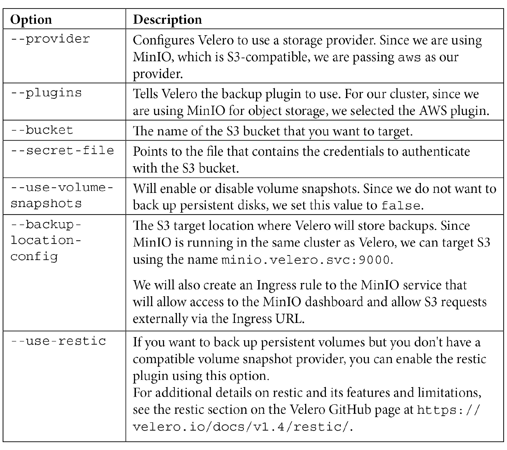

表 13.2–Velero 安装选项

当您执行安装时，您将看到许多正在创建的对象，包括许多由 Velero 用来处理备份和恢复操作的**自定义资源定义** ( **CRDs** )和机密。如果您遇到 Velero 服务器启动不正确的问题，您可以查看一些可能包含不正确信息的CRD 和机密。在下表中，我们解释了使用 Velero 时可能需要与之交互的一些常见对象:

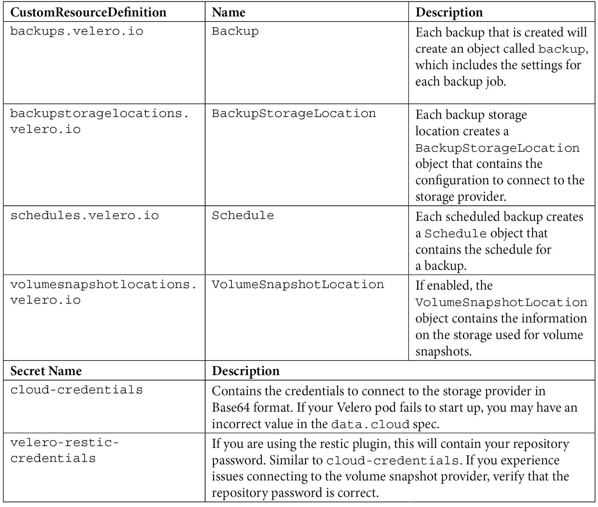

表 13.3–韦莱罗的 CRD 和秘密

虽然您与这些对象的大部分交互将通过 Velero 可执行文件进行，但了解实用程序如何与 API 服务器交互始终是一个很好的做法。如果您没有访问 Velero 可执行文件的权限，但需要查看或潜在地更改对象值以快速解决问题，那么了解对象及其功能是有帮助的。

现在我们已经安装了 Velero，并且对 Velero 对象有了较高的理解，我们可以继续为集群创建不同的备份作业。

# 使用 Velero 备份工作负载

Velero 支持使用单个命令或定期运行“一次性”备份。无论您选择运行单一备份还是重复备份，都可以使用`include`和`exclude`标志备份所有对象或仅备份某些对象。

## 运行一次性集群备份

要创建初始备份，您可以运行单个 Velero 命令来备份集群中的所有名称空间。

在没有任何标志来包括或排除任何集群对象的情况下执行备份将备份每个命名空间和命名空间中的所有对象。

要创建一次性备份，请使用`backup create <backup name>`选项执行`velero`命令。在我们的示例中，我们将备份命名为`initial-backup`:

```
velero backup create initial-backup
```

您将收到的唯一确认是备份请求已提交:

```
Backup request "initial-backup" submitted successfully.
Run `velero backup describe initial-backup` or `velero backup logs initial-backup` for more details.
```

幸运的是，韦莱罗还告诉您检查备份状态和日志的命令。输出的最后一行告诉我们，我们可以使用带有`backup`选项的`velero`命令和`describe`或`logs`来检查备份操作的状态。

`describe`选项将显示作业的所有细节:

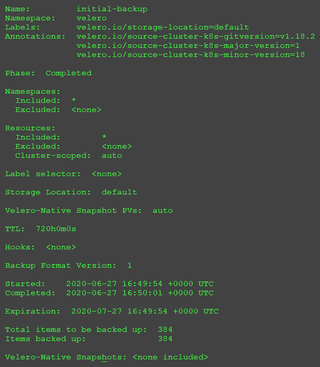

图 13.5–韦莱罗描述输出

注意

为了加强上一节，我们提到了 Velero 使用的一些 CRD，我们还想解释 Velero 实用程序从哪里检索这些信息。

创建的每个备份都将在 Velero 命名空间中创建一个备份对象。对于我们的初始备份，创建了一个名为`initial-backup`的新备份对象。使用`kubectl`，我们可以描述对象来查看 Velero 可执行文件将提供的类似信息。

如图 13.5 所示，`describe`选项显示了备份作业的所有设置。因为我们没有向备份请求传递任何选项，所以该作业包含所有的名称空间和对象。要验证的一些最重要的细节是阶段、要备份的项目总数和要备份的项目。

如果阶段的状态是除了`success`之外的任何状态，那么您的备份中可能没有您想要的所有项目。检查备份的项目也是个好主意；如果备份的项目数少于要备份的项目数，我们的备份不会备份所有项目。

您可能需要检查备份的状态，但是您可能没有安装 Velero 可执行文件。由于此信息在 CR 中，我们可以描述 CR 以检索备份详细信息。在备份对象上运行`kubectl describe`将显示备份的状态:

```
kubectl describe backups initial-backup -n velero
```

如果我们从`describe`命令跳到输出的底部，您将看到以下内容:

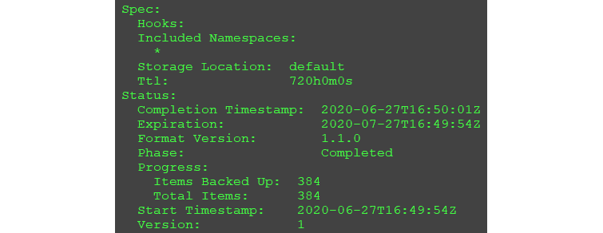

图 13.6–库描述了备份资源的输出

在输出中，您可以看到阶段已完成、开始和完成时间，以及备份和备份中包含的对象数量。

最好使用集群插件，它可以根据日志文件中的信息或对象的状态生成警报，例如 AlertManager。您总是希望备份成功，如果备份失败，您应该立即查看失败的原因。

## 计划群集备份

如果您计划了群集操作或者命名空间中有重大软件升级，则创建一次性备份非常有用。由于这些事件很少发生，因此您需要安排一次定期备份群集的备份，而不是随机的一次性备份。

要创建定时备份，您可以使用`schedule`选项，并用 Velero 可执行文件创建一个标记。随着时间表和创建，您需要提供作业的名称和`schedule`标志，它接受基于 *cron* 的表达式。以下时间表告诉韦莱罗每天凌晨 1 点备份:


图 13.7–Cron 调度表达式

使用*图 13.7* 中的信息，我们可以使用以下`velero schedule create`命令创建一个将在凌晨 1 点创建备份的备份:

```
velero schedule create cluster-daily --schedule="0 1 * * *"
```

Velero 将回复已成功创建计划:

```
Schedule "cluster-daily" created successfully.
```

如果您不熟悉 cron 和可用的选项，您应该阅读位于[https://godoc.org/github.com/robfig/cron](https://godoc.org/github.com/robfig/cron)的 cron 软件包文档。

cron 还将接受一些简写表达式，这可能比使用标准的 cron 表达式更容易。下表包含预定义计划的简写:

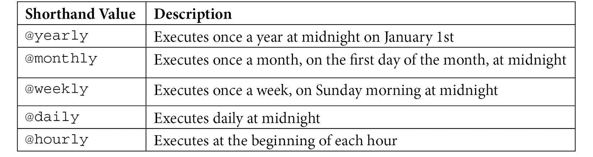

表 13.4–cron 速记计划

使用简写表中的值来计划每天午夜执行的备份作业，我们使用以下 Velero 命令:

```
velero schedule create cluster-daily --schedule="@daily"
```

计划作业将在作业执行时创建一个备份对象。备份名称将包含计划的名称，并带有破折号以及备份的日期和时间。使用前面例子中的名称，我们的初始备份是用名称`cluster-daily-20200627174947`创建的。这里，`20200627`是备份运行的日期，`174947`是备份以世界协调时时间运行的时间。这相当于 **2020-06-27 17:49:47 +0000 世界协调时**。

到目前为止，我们的所有示例都被配置为备份集群中的所有名称空间和对象。您可能需要根据您的特定集群创建不同的计划或排除/包括某些对象。

在下一节中，我们将解释如何创建自定义备份，该备份允许您使用特定的标记来包括和排除名称空间和对象。

## 创建自定义备份

当您创建任何备份作业时，您可以向提供标志，以自定义哪些对象将包含在备份作业中或从备份作业中排除。这里详细介绍了一些最常见的标志:

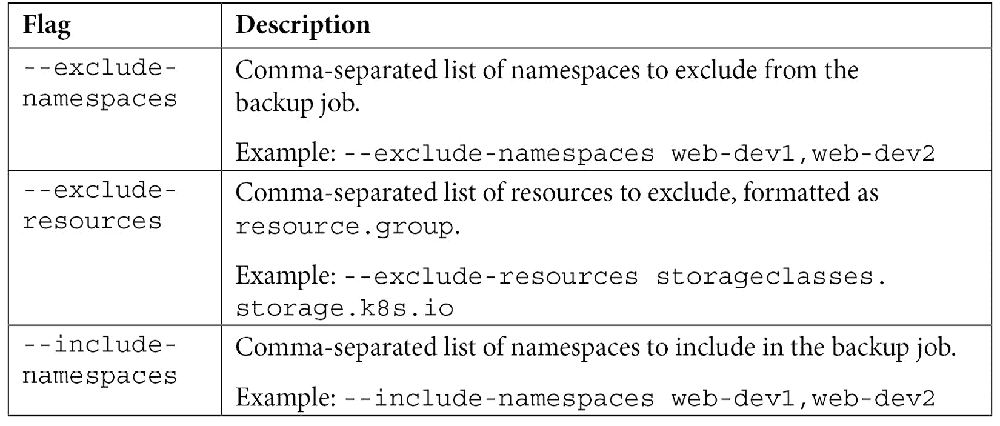

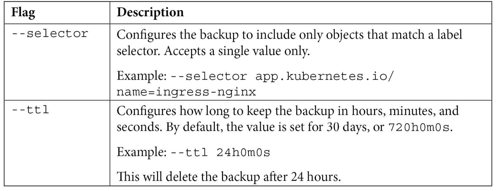

表 13.5–Velero 备份标志

要创建每天运行且仅包含 Kubernetes 系统命名空间的计划备份，我们将使用`--include-namespaces`标志创建计划作业:

```
velero schedule create cluster-ns-daily --schedule="@daily" --include-namespaces ingress-nginx,kube-node-lease,kube-public,kube-system,local-path-storage,velero
```

由于 Velero 命令对所有操作都使用 CLI，我们应该从解释您将用于管理备份和恢复操作的常见命令开始。

# 使用命令行界面管理韦莱罗

现在，所有的 Velero 操作必须使用 Velero 可执行文件来完成。在没有图形用户界面的情况下管理备份系统起初可能是一个挑战，但是一旦您习惯了 Velero 管理命令，执行操作就变得容易了。

Velero 可执行文件接受两个选项:

*   命令
*   旗帜

命令是一种操作，如`backup`、`restore`、`install`和`get`。大多数初始命令需要第二个命令才能完成操作。例如，`backup`命令需要另一个命令，如`create`或`delete`，才能形成完整的操作。

有两种类型的标志——命令标志和全局标志。全局标志是可以为任何命令设置的标志，而命令标志特定于正在执行的命令。

像许多命令行界面工具一样，Velero 包括每个命令的内置帮助。如果您忘记了一些语法或想知道命令可以使用哪些标志，您可以使用`-h`标志来获得帮助:

```
velero backup create -h
```

以下是`backup create`命令的简短帮助输出:

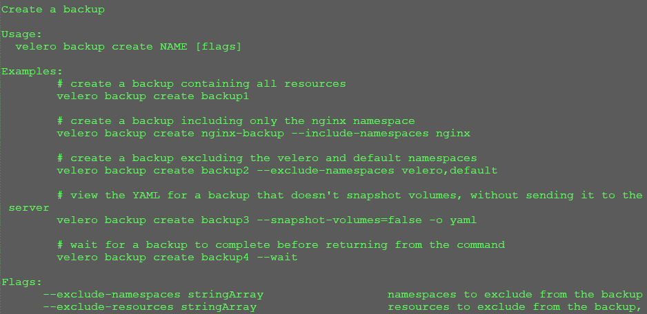

图 13.8–Velero 帮助输出

我们发现 Velero 的帮助系统非常有帮助；一旦你熟悉了 Velero 的基础知识，你会发现内置的帮助为大多数命令提供了足够的信息。

## 使用常用的 Velero 命令

因为你们中的许多人可能是 Velero 的新手，所以我们想提供一个最常用命令的快速概述，让您对操作 Velero 感到舒适。

### 列出 Velero 对象

正如我们提到的，Velero 管理是通过使用 CLI 驱动的。您可以想象，当您创建额外的备份作业时，可能很难记住已经创建的内容。这就是`get`命令派上用场的地方。

命令行界面可以检索或获取以下 Velero 对象的列表:

*   备份位置
*   备份
*   插件
*   恢复
*   时间表
*   快照位置

如您所料，执行`velero get <object>`将返回由 Velero 管理的对象列表:

```
velero get backups
```

以下是输出:

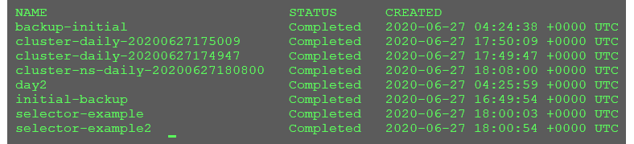

图 13.9–韦莱罗获得输出

所有`get`命令将产生一个类似的输出，其中包含每个对象的名称和对象的任何唯一值。

`get`命令对于快速查看存在哪些对象很有用，但它通常被用作执行下一个命令`describe`的第一步。

### 正在检索 Velero 对象的详细信息

在你得到你想要详细信息的对象名称后，你可以使用`describe`命令得到对象的详细信息。使用上一节中`get`命令的输出，我们想要查看`cluster-daily-20200627175009`备份作业的详细信息:

```
velero describe backup cluster-daily-20200627175009
```

该命令的输出提供了所请求对象的所有细节。您会发现自己正在使用`describe`命令来解决备份故障等问题。

### 创建和删除对象

由于我们已经使用了`create`命令几次，我们将在本节重点介绍`delete`命令。

概括地说，`create`命令允许您创建将由 Velero 管理的对象，包括备份、计划、恢复以及备份和快照的位置。我们已经创建了备份和时间表，在下一节中，我们将创建一个恢复。

一旦创建了对象，您可能会发现需要删除它。要删除 Velero 中的对象，可以使用`delete`命令，以及要删除的对象和名称。

在我们的`get backups`输出示例中，我们有一个名为`day2`的备份。要删除该备份，我们将执行以下`delete`命令:

```
velero delete backup day2
```

由于删除是单向操作，您需要确认是否要删除对象。一旦确认，可能需要几分钟时间才能将对象从 Velero 中移除，因为它会等待，直到所有相关数据都被移除:

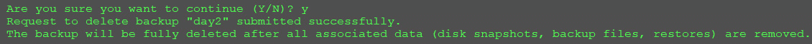

图 13.10–Velero 删除输出

正如您在输出中看到的，当我们删除备份时，Velero 将删除备份的所有对象，包括快照的备份文件和恢复。

您还可以使用其他命令，但是本节中介绍的命令是您熟悉 Velero 所需的主要命令。

现在，您可以创建和计划备份，并知道如何使用 Velero 中的帮助系统，我们可以继续使用备份来恢复对象。

# 从备份恢复

运气好的话，你将很少需要执行任何 Kubernetes 对象的恢复。即使您在信息技术领域的时间不长，您也可能经历过驱动器故障或意外删除重要文件的个人情况。如果您没有丢失数据的备份，这是一个非常令人沮丧的情况。在企业领域，丢失数据或没有备份可能会导致巨大的收入损失，或者在某些情况下，在受监管的行业中导致巨额罚款。

要从备份运行恢复，可以使用带有`--from-backup <backup name>`标签的`create restore`命令。

在本章的前面，我们创建了一个名为`initial-backup`的一次性备份，它包括集群中的每个名称空间和对象。如果我们决定需要恢复该备份，我们将使用 Velero 命令行界面执行恢复:

```
velero restore create --from-backup initial-backup
```

`restore`命令的输出可能看起来很奇怪:

```
Restore request "initial-backup-20200627194118" submitted successfully.
```

一眼看去，这似乎是一个备份请求，因为韦莱罗回复了`"initial-backup-20200627194118" submitted successfully`。Velero 使用备份名称创建还原请求，由于我们将备份命名为`initial-backup`，还原作业名称将使用该名称并附加还原请求的日期和时间。

您可以使用`describe`命令查看恢复状态:

```
velero restore describe initial-backup-20200627194118
```

根据还原的大小，还原整个备份可能需要一些时间。在恢复阶段，备份状态将为`InProgress`。一旦完成，状态将变为`Completed`。

## 恢复运行

有了背后的所有理论，让我们用两个例子来看看韦莱罗的行动。对于示例，我们将从一个简单的部署开始，该部署将在同一个集群上删除和恢复。下一个例子会更复杂；我们将使用主 KinD 集群的备份，并将集群对象恢复到新的 KinD 集群。

### 从备份恢复部署

对于第一个例子，我们将使用 NGINX 网络服务器创建一个简单的部署。我们将部署应用，验证它是否按预期工作，然后删除部署。使用备份，我们将恢复部署，并通过浏览 web 服务器的主页来测试恢复是否有效。

我们已经在您的克隆存储库的`chapter13`文件夹中包含了一个部署。这个部署将为我们的练习创建一个新的名称空间、NGINX 部署、一个服务和一个入口规则。还包括了部署清单。

与我们在本书中创建的任何入口规则一样，您需要编辑其网址以反映您的主机的 IP 地址，以便`nip.io`正确工作。我们的实验室服务器的 IP 地址为`10.2.1.121`–将该 IP 更改为您的主机的 IP:

1.  从名为`nginx-deployment.yaml`的`chapter13`文件夹下的 GitHub 存储库中编辑清单，以包含您的`niop.io`网址。您需要更改的部分如下所示:

    ```
    spec:
      rules:
     - host: nginx-lab.10.2.1.121.nip.io
    ```

2.  Deploy the manifest using `kubectl`:

    ```
    kubectl apply -f nginx-deployment.yaml
    ```

    这将创建部署所需的对象:

    ```
    namespace/nginx-lab created
    pod/nginx-deployment created
    ingress.networking.k8s.io/nginx-ingress created
    service/nginx-lab created
    ```

3.  最后，使用任何浏览器测试部署，并从入口规则打开网址:

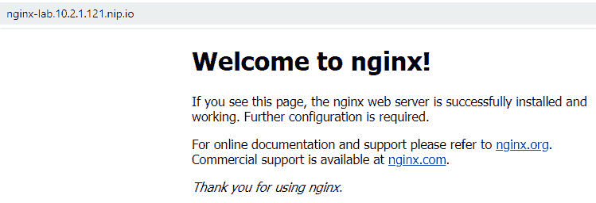

图 13.11–验证 NGINX 是否正在运行

现在您已经验证了部署工作正常，我们需要使用 Velero 创建一个备份。

### 备份命名空间

使用 Velero `create backup`命令创建新命名空间的一次性备份。为备份作业指定名称`nginx-lab`:

```
velero create backup nginx-lab --include-namespaces=nginx-lab
```

由于命名空间只包含一个小的部署，备份应该会很快完成。使用`describe`命令验证备份是否成功完成:

```
velero backup describe nginx-lab
```

验证阶段状态是否完成。如果您在阶段状态中有错误，您可能在`create backup`命令中输入了错误的名称空间名称。

验证备份成功后，您可以继续下一步。

### 模拟失败

为了模拟需要对我们的命名空间进行备份的事件，我们将使用`kubectl`删除整个命名空间:

```
kubectl delete ns nginx-lab
```

删除命名空间中的对象可能需要一分钟。一旦您返回提示，删除应该已经完成。

通过在浏览器中打开网址来验证 NGINX 服务器没有回复；如果您使用的是与初始测试相同的浏览器，请刷新页面。刷新或打开网址时，您应该会收到一个错误:

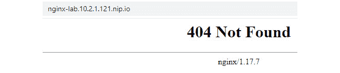

图 13.12–验证 NGINX 是否正在运行

随着确认 NGINX 部署已经被删除，我们将从备份中恢复整个命名空间和对象。

## 恢复命名空间

想象这是一个“真实世界”的场景。你接到一个电话，说一个开发人员不小心删除了他们名字空间中的每个对象，并且他们没有源文件。

当然，你已经为这类事件做好了准备。您的群集中有几个正在运行的备份作业，您告诉开发人员，您可以通过备份将其恢复到昨晚的状态:

1.  我们知道备份的名字是`nginx-lab`，所以使用 Velero，我们可以使用`--from-backup`选项

    ```
    velero create restore --from-backup nginx-lab
    ```

    执行`restore create`命令
2.  Velero 将返回已提交还原作业:

    ```
    Restore request "nginx-lab-20200627203049" submitted successfully.
    Run `velero restore describe nginx-lab-20200627203049` or `velero restore logs nginx-lab-20200627203049` for more details.
    ```

3.  您可以使用`velero restore describe`命令来检查状态:

    ```
    velero restore describe nginx-lab-20200627203049
    ```

4.  验证阶段状态显示`completed`，如果已经打开，通过浏览网址或刷新页面验证部署已经恢复:

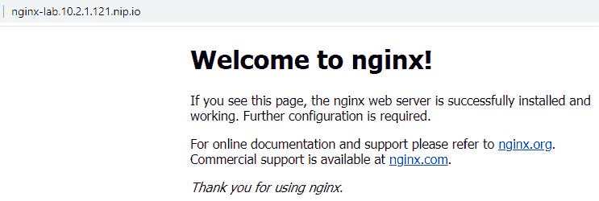

图 13.13–验证 NGINX 是否已恢复

恭喜，您刚刚为开发人员节省了大量工作，因为您有了名称空间的备份！

Velero 是一个强大的产品，您应该考虑在每个集群中使用它来保护工作负载免受灾难。

## 使用备份在新集群中创建工作负载

恢复集群中的对象只是 Velero 的一个用例。虽然这是大多数用户的主要使用情形，但是您也可以使用备份文件来恢复另一个集群上的一个工作负载或所有工作负载。如果您需要创建新的开发或灾难恢复集群，这是一个有用的选项。

重要说明

请记住，Velero 备份作业只是命名空间和命名空间中的对象。要将备份恢复到新群集，您必须有一个正在运行的群集运行 Velero，然后才能恢复任何工作负载。

### 备份群集

在本章的这一点上，我们假设您已经看过这个过程几次，并且您知道如何使用 Velero CLI。如果需要复习，可以回到章节中的几页参考，或者使用 CLI 帮助功能。

首先，我们应该创建一些名称空间，并为每个名称空间添加一些部署，以使其更有趣:

1.  让我们创建几个演示名称空间:

    ```
    kubectl create ns demo1
    kubectl create ns demo2
    kubectl create ns demo3
    kubectl create ns demo4
    ```

2.  We can add a quick deployment to a namespace using the `kubectl run` command:

    ```
    kubectl run nginx --image=bitnami/nginx -n demo1
    kubectl run nginx --image=bitnami/nginx -n demo2
    kubectl run nginx --image=bitnami/nginx -n demo3
    kubectl run nginx --image=bitnami/nginx -n demo4
    ```

    现在我们有了一些额外的工作负载，我们需要创建集群的备份。

3.  使用备份名称`namespace-demo` :

    ```
    velero backup create namespace-demo --include-namespaces=demo1,demo2,demo3,demo4
    ```

    备份新的命名空间

继续之前，请验证备份是否已成功完成。

### 构建新集群

由于我们只是演示如何使用 Velero 从备份创建新集群上的工作负载，因此我们将创建一个简单的单节点 KinD 集群作为我们的还原点:

注意

这个部分有点复杂，因为你的`kubeconfig`文件中有两个簇。如果您不熟悉切换配置上下文，请仔细遵循这些步骤。

完成本练习后，我们将删除第二个集群，因为我们不需要有两个集群。

1.  Create a new KinD cluster with the name `velero-restore`:

    ```
    kind create cluster --name velero-restore
    ```

    这将创建一个包含控制平面和工作节点的新单节点群集，并将您的群集上下文设置为新群集。

2.  Once the cluster has deployed, verify that your context has been switched to the `velero-restore` cluster:

    ```
    kubectl config get-contexts
    ```

    输出如下:

    

    图 13.14–验证您当前的上下文

3.  验证当前上下文是否设置为`kind-velero-restore`集群。您将在正在使用的集群的当前字段中看到一个`*`。
4.  最后，使用`kubectl`验证集群中的名称空间。您应该只看到新集群中包含的默认命名空间:


图 13.15–新的集群命名空间

现在我们已经创建了一个新集群，我们可以开始恢复工作负载的过程。第一步是在新集群上安装 Velero，指向现有的 S3 存储桶作为备份位置。

## 将备份恢复到新群集

随着我们新的 KinD 集群的启动和运行，我们需要安装 Velero 来恢复我们的备份。我们可以使用在原始集群中使用的大部分相同的清单和设置，但是由于我们在不同的集群中，我们需要将 S3 目标更改为用于公开 MinIO 仪表板的外部 URL。

### 在新集群中安装 Velero

我们已经在`chapter13`文件夹中有了文件，所以我们可以直接使用`velero install`命令来安装 Velero:

1.  请务必将`s3Url target`中的 IP 地址更改为您主机的 IP 地址:

    ```
    velero install \
     --provider aws \
     --plugins velero/velero-plugin-for-aws:v1.1.0 \
     --bucket velero \
     --secret-file ./credentials-velero \
     --use-volume-snapshots=false \
     --backup-location-config region=minio,s3ForcePathStyle="true",s3Url=http://minio.10.2.1.121.nip.io
    ```

2.  安装需要几分钟时间，但是一旦 pod 启动并运行，查看日志文件以验证 Velero 服务器是否启动并运行，以及是否连接到 S3 目标:

    ```
    kubectl logs deployment/velero -n velero
    ```

3.  如果您的所有设置都是正确的，Velero 日志将有一个条目，表示它在备份位置找到了需要与新 Velero 服务器同步的备份(备份数量可能因您的 KinD 集群而异):

    ```
    time="2020-06-27T22:14:02Z" level=info msg="Found 9 backups in the backup location that do not exist in the cluster and need to be synced" backupLocation=default controller=backup-sync logSource="pkg/controller/backup_sync_controller.go:196"
    ```

4.  确认安装后，使用`velero get backups`确认 Velero 可以看到现有的备份文件:


图 13.16–查看新群集上的备份

您的备份列表将与我们的不同，但您应该看到与原始群集中相同的列表。

此时，我们可以使用任何备份文件在新集群中创建恢复作业。

### 在新集群中恢复备份

在本节中，我们将使用上一节中创建的备份，并将工作负载恢复到全新的 KinD 集群，以模拟工作负载迁移。

在我们添加名称空间和部署之后，在原始集群中创建的备份被称为`namespace-demo`:

1.  使用该备份名称，我们可以通过运行`velero restore create`命令来恢复名称空间和对象:

    ```
    velero create restore --from-backup=namespace-demo
    ```

2.  请等待恢复完成，然后继续下一步。要验证恢复是否成功，请将`velero describe restore`命令与执行`create restore` 命令时创建的恢复作业的名称一起使用。在我们的集群中，恢复作业被分配了名称`namespace-demo-20200627223622` :

    ```
    velero restore describe namespace-demo-20200627223622
    ```

3.  Once the phase has changed from `InProgress` to `Completed`, verify that your new cluster has the additional demo namespaces using `kubectl get ns`:

    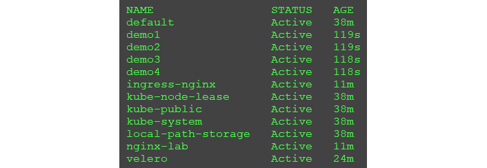

    图 13.17–查看新群集上的备份

4.  You will see that the new namespaces were created, and if you look at the pods in each namespace, you will see that each has a pod called `nginx.`You can verify that the pods were created using kubectl get pods. For example, to verify the pods in the demo1 namespace: **kubectl get pods -n demo1**

    输出如下:


图 13.18–验证恢复的名称空间中的 pods

恭喜你！您已经成功地将对象从一个集群恢复到一个新的集群。

### 删除新群集

因为我们不需要两个集群，所以让我们删除备份恢复到的新的 KinD 集群:

1.  要删除集群，执行`kind delete cluster`命令:

    ```
    kind delete cluster --name velero-restore
    ```

2.  将您当前的上下文设置为原始的 KinD 集群，`kind-cluster01` :

    ```
    kubectl config use-context kind-cluster01
    ```

你现在准备好继续本书的最后一章， [*第 14 章*](14.html#_idTextAnchor337)*供应一个平台*。

# 总结

备份集群和工作负载是任何企业集群的要求。在本章中，我们回顾了如何使用`etcdctl`和快照功能备份 etcd 集群数据库。我们还详细介绍了如何在集群中安装 Heptio 的 Velero 来备份和恢复工作负载。我们通过在新群集上恢复现有备份来复制现有备份中的工作负载，从而结束了这一章。

有了备份解决方案，您就可以从灾难或人为错误中恢复。典型的备份解决方案允许您恢复任何 Kubernetes 对象，包括命名空间、持久卷、RBAC、服务和服务帐户。您还可以从一个集群中取出所有工作负载，并将其恢复到完全不同的集群中进行测试或故障排除。

接下来，在我们的最后一章中，我们将汇集本书中的许多以前的课程，为您的开发人员和管理员构建一个平台。我们将添加源代码控制和管道来构建一个平台，允许开发人员构建一个“项目”，签入源代码来创建一个运行的应用。

# 问题

1.  True or false – Velero can only use an S3 target to store backup jobs.

    A.真实的

    B.错误的

2.  If you do not have an object storage solution, how can you provide an S3 target using a backend storage solution such as NFS?

    A.你不能——没有办法在 NFS 面前添加任何东西来呈现 S3。

    B.Kubernetes 可以使用本机 CSI 功能来做到这一点。

    C.安装 MinIO，并将 NFS 卷用作部署中的永久磁盘。

    D.您不需要使用对象存储；你可以直接用 NFS 和韦莱罗。

3.  True or false – Velero backups can only be restored on the same cluster where the backup was originally created.

    A.真实的

    B.错误的

4.  What utility can you use to create an etcd backup?

    A.帆船运动。

    B.迷你咪！

    C.没有理由备份 etcd 数据库。

    D.`etcdctl`。

5.  Which command will create a scheduled backup that runs every day at 3 a.m.?

    A.`velero create backup daily-backup`

    B.`velero create @daily backup daily-backup`

    C.`velero create backup daily-backup –schedule="@daily3am"`

    D.`velero create schedule daily-backup --schedule="0 3 * * *"`