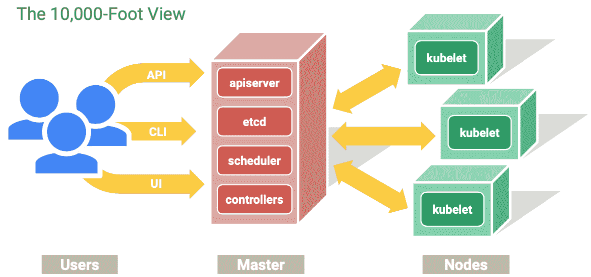

# 一、`kubectl`介绍和安装

Kubernetes 是一个开源容器编排系统，用于管理集群中多个主机上的容器化应用。

Kubernetes 提供了应用部署、调度、更新、维护和扩展的机制。Kubernetes 的一个关键特性是它主动管理容器，以确保集群的状态始终符合用户的期望。

Kubernetes 使您能够通过扩展或推出新功能来快速响应客户需求。它还允许您充分利用您的硬件。

Kubernetes 如下:

*   **瘦**:轻便、简单、易接近
*   **便携**:公共云、私有云、混合云和多云
*   **可扩展**:模块化、可插拔、可连接、可组合和可工具化
*   **自愈**:自动放置、自动重启、自动复制

Kubernetes 基于在谷歌大规模运行生产工作负载的 15 年经验，结合了来自社区的最佳想法和最佳实践:



图 1.1–Kubernetes 建筑的 10，000 英尺视图

管理 Kubernetes 集群的方法之一是`kubectl` —Kubernetes 的命令行管理工具，它是访问 Kubernetes 集群的工具，允许您针对 Kubernetes 集群运行不同的命令，以部署应用、管理节点、排除部署故障等。

在本章中，我们将涵盖以下主要主题:

*   介绍 kubectl
*   安装 kubectl
*   kubectl 命令

# 技术要求

要学习 kubectl，您需要访问 Kubernetes 集群；它可以是这些云之一:

*   谷歌云 GKE:[https://cloud.google.com/kubernetes-engine](https://cloud.google.com/kubernetes-engine)
*   azure AK eks:[https://azure . Microsoft . com/en-us/free/kubrites 服务](https://azure.microsoft.com/en-us/free/kubernetes-service)
*   例如:[https://AWS . Amazon . com/ex/](https://aws.amazon.com/eks/)
*   数字海洋文档:[https://www . digital ocean . com/docs/kuberates/](https://www.digitalocean.com/docs/kubernetes/)

或者，它可以是本地的:

*   种类:[https://kind.sigs.k8s.io/docs/user/quick-start/](https://kind.sigs.k8s.io/docs/user/quick-start/)
*   minikube:[https://kubernetes . io/docs/setup/learning-environment/minikube/](https://kubernetes.io/docs/setup/learning-environment/minikube/)
*   Docker 桌面:[https://www.docker.com/products/docker-desktop](https://www.docker.com/products/docker-desktop)

在这本书里，我们将使用谷歌云的 GKE Kubernetes 集群。

# 介绍 kubectl

您可以使用`kubectl`部署应用、检查和管理它们、检查集群资源、查看日志等等。

`kubectl`是一个命令行工具，可以从您的计算机运行，在 CI/CD 管道中，作为操作系统的一部分，或者作为 Docker 映像。这是一个非常自动化友好的工具。

`kubectl`在`$HOME`文件夹中查找名为`.kube`的配置文件。在`.kube`文件中，`kubectl`存储了访问 Kubernetes 集群所需的集群配置。您也可以设置`KUBECONFIG`环境变量或使用`--kubeconfig`标志指向`kubeconfig`文件。

# 安装 kubectl

让我们来看看你如何在 macOS、Windows 和 CI/CD 管道中安装`kubectl`。

## 安装在 macOS 上

在 macOS 上安装`kubectl`最简单的方法是使用家酿软件包管理器([https://brew.sh/](https://brew.sh/)):

1.  要安装，请运行以下命令:

    ```
    $ brew install kubectl
    ```

2.  要查看您安装的版本，请使用以下命令:

    ```
    $ kubectl version –client --short
    Client Version: v1.18.1
    ```

## 安装在窗户上

要在 Windows 上安装`kubectl`，可以使用简单的命令行安装程序勺([https://scoop.sh/](https://scoop.sh/)):

1.  要安装，请运行以下命令:

    ```
    $ scoop install kubectl
    ```

2.  要查看您安装的版本，请使用以下命令:

    ```
    $ kubectl version –client --short
    Client Version: v1.18.1
    ```

3.  在你的主目录中创建`.kube`目录:

    ```
    $ mkdir %USERPROFILE%\.kube
    ```

4.  导航至`.kube`目录:

    ```
    $ cd %USERPROFILE%\.kube
    ```

5.  将`kubectl`配置为使用远程 Kubernetes 集群:

    ```
    $ New-Item config -type file
    ```

## 安装在 Linux 上

当你想在 Linux 上使用时，你有两个选项:

*   使用`curl` :

    ```
    $ curl -LO https://storage.googleapis.com/kubernetes-release/release/`curl -s https://storage.googleapis.com/kubernetes-release/release/stable.txt`/bin/linux/amd64/kubectl
    ```

*   If your Linux system supports Docker images, use [https://hub.docker.com/r/bitnami/kubectl/](https://hub.docker.com/r/bitnami/kubectl/).

    注意

    Linux 是一个非常常见的 CI/CD 管道环境。

要获得支持的`kubectl`命令列表，运行以下命令:

```
$ kubectl --help
```

`kubectl`命令按类别分组。让我们看看每个类别。

## 基本命令

以下是基本`kubectl`命令:

*   `create`:从文件或从`stdin`创建资源；例如，从该文件创建一个 Kubernetes 部署。
*   `expose`:获取一个服务、部署或 pod，并将其公开为一个新的 Kubernetes 服务。
*   `run`:在集群上运行特定的映像。
*   `set`:设置对象的特定特征——例如，设置环境变量，更新 pod 模板中的 Docker 映像，等等。
*   `explain`:获取资源的文档——例如，关于部署的文档。
*   `get`:显示一个或多个资源。例如，您可以获得运行 Pod 的列表或 Pod 的 YAML 输出。
*   `edit`:编辑资源—例如，编辑部署。
*   `delete`:通过文件名、`stdin`、资源和名称删除资源，或者通过资源和标签选择器删除资源。

## 部署命令

以下是`kubectl` 部署命令:

*   `rollout`:管理资源的部署。
*   `scale`:为部署、复制集或状态集设置新的大小。
*   `autoscale`:自动扩展部署、复制集或状态集。

## 集群管理命令

以下是`kubectl`集群管理命令:

*   `certificate`:修改证书资源。
*   `cluster-info`:显示集群信息。
*   `top`:显示资源(CPU/内存/存储)使用情况。
*   `cordon`:将节点标记为不可割集。
*   `uncordon`:将节点标记为可调度。
*   `drain`:排空一个节点，准备维护。
*   `taint`:更新一个或多个节点上的污点。

## 故障排除和调试命令

以下是`kubectl`故障排除和调试命令:

*   `describe`:显示特定资源或资源组的详细信息。
*   `logs`:打印容器中容器的日志。
*   `attach`:附着在运行的容器上。
*   `exec`:在容器中执行命令。
*   `port-forward`:将一个或多个本地端口转发到一个 pod。
*   `proxy`:运行 Kubernetes API 服务器的代理。
*   `cp`:在容器之间复制文件和目录。
*   `auth`:检查授权。

## 高级命令

以下是`kubectl`高级命令:

*   `diff`:显示实时版本与潜在应用版本的差异。
*   `apply`:通过文件名或`stdin`将配置应用到资源。
*   `patch`:使用战略合并补丁更新资源的字段。
*   `replace`:通过文件名或`stdin`替换资源。
*   `wait`:在一个或多个资源上等待特定条件。
*   `convert`:在不同的 API 版本之间转换配置文件。
*   `kustomize`:从一个目录或者一个远程 URL 构建一个 kustomization 目标。

## 设置命令

以下是`kubectl`中命令的设置:

*   `label`:更新资源上的标签。
*   `annotate`:更新资源上的注释。

## 其他命令

以下是在`kubectl`中使用的其他几个命令:

*   `alpha`:阿尔法中特征的命令。
*   `api-resources`:打印服务器上支持的 API 资源。
*   `api-versions`:在服务器上打印支持的 API 版本，以组/版本的形式。
*   `config`:修改`kube-config`文件。
*   `plugin`:提供与插件交互的实用程序。
*   `version`:打印客户端和服务器版本信息。

从列表中可以看出，命令分为不同的组。在接下来的章节中，我们将学习这些命令的大部分，但不是全部。

撰写时`kubectl`版本为 1.18；在较新的版本中，命令可能已经改变。

# 总结

在本章中，我们已经学习了什么是`kubectl`以及如何在 macOS、Windows 和 CI/CD 管道上安装它。我们还检查了`kubectl`支持的不同命令及其作用。

在下一章中，我们将学习如何使用`kubectl`获取 Kubernetes 集群的信息。