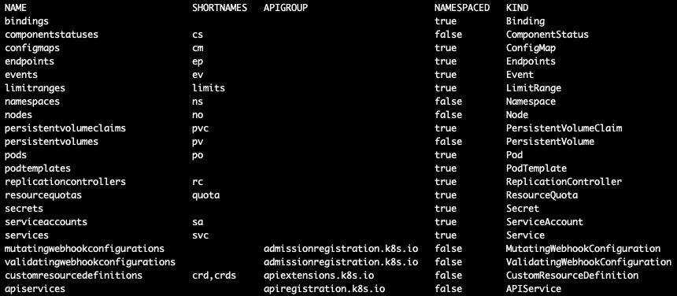

# 二、获取集群信息

当您管理一个 Kubernetes 集群时，有必要知道它运行在什么版本的 Kubernetes 上，关于主机(也称为控制平面)的细节，集群上安装的任何插件，以及可用的 API 和资源。由于不同的 Kubernetes 版本支持不同的资源应用编程接口版本，因此不为您的(例如，入口)设置正确/不受支持的应用编程接口版本将导致部署失败。

在本章中，我们将涵盖以下主题:

*   聚类信息
*   集群应用编程接口版本
*   集群应用编程接口资源

# 聚类信息

知道为 Kubernetes 集群安装了哪个版本的 Kubernetes 服务器(API)总是好的，因为您可能想要使用该版本中可用的特定功能。要检查服务器版本，请运行以下命令:

```
$ kubectl version --short
Client Version: v1.18.1
Server Version: v1.17.5-gke.9
```

服务器版本为`v1.17.5`，`kubectl`版本为`v1.18.1`。注意服务器版本的`-gke.9`位是内部 GKE 版本；正如我们前面提到的，出于本书的目的，使用了 GKE 集群。

重要说明

`kubectl`版本可以是更新的版本；它实际上不必与服务器版本相匹配，因为最新版本通常是向后兼容的。但是，不建议使用较旧的`kubectl`版本和较新的服务器版本。

接下来，让我们通过运行以下命令来检查集群服务器信息:

```
$ kubectl cluster-info
Kubernetes master is running at https://35.223.200.75
GLBCDefaultBackend is running at https://35.223.200.75/api/v1/namespaces/kube-system/services/default-http-backend:http/proxy
KubeDNS is running at https://35.223.200.75/api/v1/namespaces/kube-system/services/kube-dns:dns/proxy
Metrics-server is running at https://35.223.200.75/api/v1/namespaces/kube-system/services/https:metrics-server:/proxy
```

在前面的输出日志中，我们看到了以下内容:

*   主端点 IP ( `35.223.200.75`)，您的`kubectl`连接到 Kubernetes 应用编程接口。
*   A list of installed addons, which in this setup are more GKE cluster-specific:

    a.`GLBDefaultBackend`

    b.`KubeDNS`

    c.`Metrics-server`

插件列表因基于云的安装和内部安装而异。

最后，让我们使用以下命令检查集群节点信息:

```
$ kubectl get nodes
```

前面命令的输出如下图所示:


图 2.1–显示节点信息的输出

前面的命令显示了集群中可用节点的列表及其状态和 Kubernetes 版本。

# 集群应用编程接口版本

检查可用的集群 API 版本是一个很好的做法，因为每个新的 Kubernetes 版本通常都会带来新的 API 版本，并且会弃用/删除一些旧的版本。

要获取应用编程接口列表，请运行以下命令:

```
$ kubectl api-versions
```

前面命令的输出为我们提供了一个 API 列表，如下图所示:


图 2.2–应用编程接口列表

您需要知道哪些 API 可以在您的应用中使用，否则，如果您使用的 API 版本不再受支持，部署可能会失败。

# 集群资源列表

另一个 er 得心应手的列表是资源列表，它显示可用的资源、它们的简称(与`kubectl`一起使用)、资源所属的 API 组、资源是否有命名空间以及`KIND`类型。

要获取资源列表，请运行以下命令:

```
$ kubectl api-resources
```

前面的命令给出了以下资源列表:



图 2.3–资源列表

由于列表很长，我们在前面的截图中只显示了一部分。

获取资源列表将帮助您使用简短的资源名称运行`kubectl`命令，并知道资源属于哪个 API 组。

# 总结

在本章中，我们学习了如何使用`kubectl`来获取关于 Kubernetes 集群、可用 API 以及集群中 API 资源的信息。

在下一章中，我们将了解如何获取 Kubernetes 集群中节点的信息。