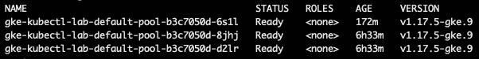
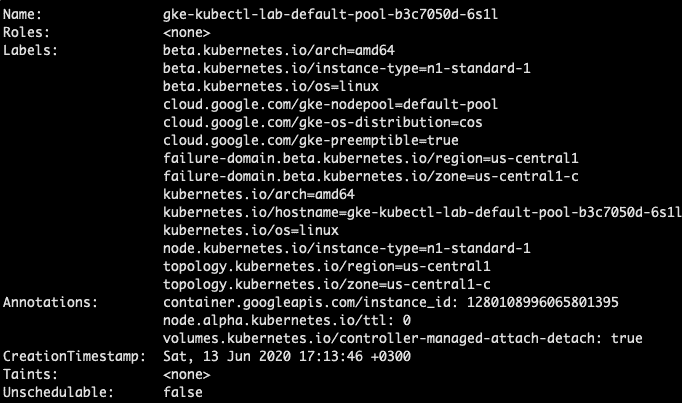
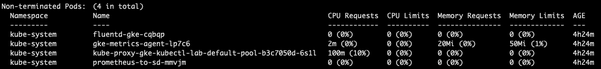
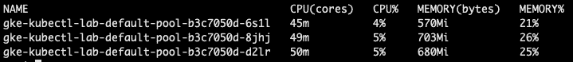
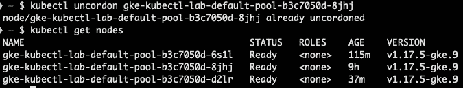
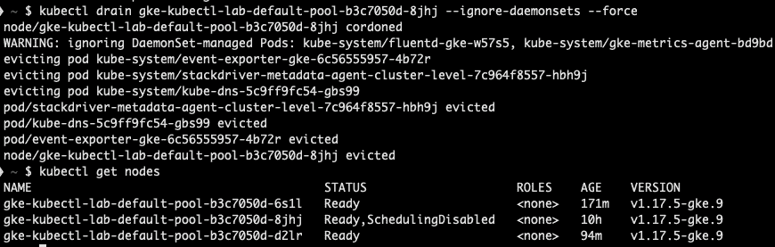

# 三、使用节点

熟悉 Kubernetes 的人都知道，集群工作负载在节点中运行，所有 Kubernetes pods 都在节点中被调度、部署、重新部署和销毁。

Kubernetes 通过将容器放入 pod 来运行工作负载，然后安排它们在节点上运行。根据群集设置，节点可以是虚拟机或物理机。每个节点都有运行 Pod 所需的服务，由 Kubernetes 控制平面管理。

该节点的主要组件如下:

*   **kubelet** :向 Kubernetes API 注册/注销节点的代理。
*   **容器运行时**:这运行容器。
*   **kube-代理**:网络代理。

如果 Kubernetes 集群支持节点自动缩放，那么节点可以按照自动缩放规则的规定来来去去:通过设置最小和最大节点数。如果集群中运行的负载不多，将不必要的节点减少到自动缩放规则设置的最小节点。当负载增加时，将部署所需数量的节点来容纳新调度的 Pod 。

有时，您需要进行故障排除，获取有关集群中节点的信息，找出它们正在运行的 Pod ，查看它们消耗了多少 CPU 和内存，等等。

总会有这样的情况:您需要停止在某些节点上调度 pods，或者将 pods 重新调度到不同的节点，或者暂时禁止将任何 pods 调度到某些节点，删除节点，或者任何其他原因。

在本章中，我们将涵盖以下主要主题:

*   获取节点列表
*   描述节点
*   显示节点资源使用情况
*   封锁节点
*   排出节点
*   删除节点
*   节点池简介

# 获取节点列表

要开始处理节点，您需要先获取它们的列表。要获取节点列表，请运行以下命令:

```
$ kubectl get nodes
```

我们使用前面的命令获得以下节点列表:



图 3.1–节点列表

上面的列表显示我们的 Kubernetes 集群中有三个节点，状态为`Ready`，版本为`1.17.5-gke.9`。但是，如果您有支持自动扩展的云节点池，则您的节点列表可能会有所不同，因为节点的添加/删除将取决于集群中运行的应用的数量。

# 描述节点

`kubectl describe`命令允许我们获取 Kubernetes 集群中对象的状态、元数据和事件。在本节中，我们将使用它来描述节点。

我们有一个节点列表，让我们来看看其中的一个:

1.  To describe a node, run the following command:

    ```
    $ kubectl describe node gke-kubectl-lab-default-pool-b3c7050d-6s1l
    ```

    由于该命令的输出相当大，我们将只显示其中的一些部分。您可以自己查看完整的输出。

2.  In the following screenshot, we see the assigned `Labels` (which can be used to organize and select subsets of objects) and `Annotations` (extra information about the node is stored there) for the node, and `Unschedulable: false` means that the node accepts pods to be scheduled on to it. For example, `Labels` can be used for `Node Affinity` (which allows us to constrain which nodes the pod is eligible to be scheduled on, based on the labels on the node) to schedule pods on particular nodes:

    

    图 3.2–节点描述–检查标签和注释

3.  In the following screenshot, we see the assigned internal and external IPs, the internal DNS name, and the hostname:

    

    图 3.3–节点描述–分配的内部和外部 IP

4.  The following screenshot shows the running pods on the node with CPU/memory requests and limits per pod:

    

    图 3.4–节点描述–每个 pod 的 CPU/内存请求和限制

5.  下面的屏幕截图显示了为节点分配的资源:


图 3.5–节点描述–为节点分配的资源

正如您所见，`$ kubectl describe node`命令允许您获取关于该节点的各种信息。

# 显示节点资源使用情况

了解节点消耗了哪些资源很方便。要显示节点使用的资源，请运行以下命令:

```
$ kubectl top nodes
```

我们使用前面的命令获得以下节点列表:



图 3.6–使用资源的顶级节点列表

前面的命令显示了节点指标，如中央处理器内核、内存(以字节为单位)以及中央处理器和内存的使用百分比。

此外，通过使用`$ watch kubectl top nodes`，您可以在例如负载测试应用或执行其他节点操作时实时观察和监控节点。

注意

`watch`命令可能不在您的计算机中，您可能需要安装它。`watch`命令将运行指定的命令，并每隔几秒钟刷新一次屏幕。

# 封锁节点

让我们假设我们将要运行一个应用的负载测试，我们希望让一个节点远离负载测试。在我们在*获取节点列表*部分看到的节点列表中，我们有三个节点，它们都处于`Ready`状态。让我们选择一个节点`gke-kubectl-lab-default-pool-b3c7050d-8jhj`，我们不希望在这个节点上安排新的 Pod 。

`kubectl`有一个名为`cordon`的命令，它允许我们使一个节点不可剖分:

```
$ kubectl cordon -h
Mark node as unschedulable.
Examples:
  # Mark node "foo" as unschedulable.
  kubectl cordon foo
Options:
      --dry-run='none': Must be "none", "server", or "client". If client strategy, only print the object that would be
sent, without sending it. If server strategy, submit server-side request without persisting the resource.
  -l, --selector='': Selector (label query) to filter on
Usage:
  kubectl cordon NODE [options]
```

让我们封锁`gke-kubectl-lab-default-pool-b3c7050d-8jhj`节点，然后打印一个节点列表。要封锁节点，请运行以下命令:

```
$ kubectl cordon gke-kubectl-lab-default-pool-b3c7050d-8jhj
```

运行前面的命令后，我们会得到以下输出:


图 3.8–封锁节点

我们已经封锁了`gke-kubectl-lab-default-pool-b3c7050d-8jhj`节点，因此从现在开始，不会在该节点上安排新的 Pod ，但是在那里运行的任何 Pod 都将在该节点上保持运行。

重要说明

如果被封锁的节点重新启动，那么所有在其上调度的 Pod 将被重新调度到不同的节点，因为即使重新启动节点，其就绪状态也不会改变。

如果我们希望节点再次被调度，您只需使用`uncordon`命令。要取消节点注册，请运行以下命令:

```
$ kubectl uncordon gke-kubectl-lab-default-pool-b3c7050d-8jhj
```

运行前面的命令后，我们会得到以下输出:



图 3.9–未编码节点

从前面的截图中可以看到，`gke-kubectl-lab-default-pool-b3c7050d-8jhj`节点再次处于`Ready`状态，从现在开始将在其上调度新的 Pod 。

# 引流节点

例如，您可能希望从将要被删除、升级或重新启动的节点中移除/驱逐所有 pods。有一个命令，`drain`，为了那个。它的输出相当长，所以只显示部分输出:

```
$ kubectl drain –help
```

我们从前面的命令中获得以下输出:


图 3.10–部分库比特漏极–帮助输出

从输出中可以看到，需要传递几个标志来正确地清空节点:`--ignore-daemonsets`和`–force`。

注意

daemmonset 确保所有指定的 Kubernetes 节点运行 daemmonset 中指定的同一个 pod 的副本。不能从 Kubernetes 节点中删除 DaemonSet，因此必须使用`--ignore-daemonsets`标志来强制清空节点。

让我们使用以下命令清空`gke-kubectl-lab-default-pool-b3c7050d-8jhj`节点:

```
$ kubectl drain gke-kubectl-lab-default-pool-b3c7050d-8jhj --ignore-daemonsets –force
```

我们使用前面的命令清空节点。该命令的输出如下图所示:



图 3.11–漏极节点

重要说明

我们已经通过了`--ignore-daemonsets`标志，因此如果节点上有任何 DaemonSets 运行，`drain`命令不会失败。

所以，我们已经排干了节点。`drain`还做什么？它还封锁了节点，因此无法在节点上安排更多的 Pod 。

现在我们准备删除该节点。

# 移除节点

`gke-kubectl-lab-default-pool-b3c7050d-8jhj`节点被耗尽，没有运行任何部署、Pod 或状态集，因此现在可以轻松删除它。

我们使用`delete node`命令来完成:

```
$ kubectl delete node gke-kubectl-lab-default-pool-b3c7050d-8jhj
```

我们使用前面的命令删除该节点。该命令的输出如下图所示:


图 3.12–删除节点

从`kubectl get nodes`输出中可以看到，该节点从 Kubernetes API 中取消注册并被删除。

重要说明

实际的节点删除取决于您的 Kubernetes 设置。在云托管的集群中，节点会被取消注册和删除，但是如果您运行的是内部自托管的 Kubernetes 集群，则实际的节点不会被删除，而只会从 Kubernetes API 中取消注册。

此外，当您在云设置中指定集群大小时，新节点将在一段时间后替换已删除的节点。

让我们运行`kubectl get nodes`来检查节点:


图 3.13–节点列表

几分钟后，我们看到第三个节点回来了，甚至是同名的。

# 节点池介绍

将 Kubernetes 作为托管服务支持节点池的云提供商。让我们了解它们是什么。

节点池只是一组具有相同计算规格和相同 Kubernetes 节点标签的 Kubernetes 节点，没有其他太花哨的东西。

例如，我们有两个节点池:

*   带有`node-pool: default-pool`节点标签的默认池
*   带有`node-pool: web-app`节点标签的网络应用池

Kubernetes 节点标签可用于节点选择器和节点相似性，以控制如何将工作负载调度到您的节点。

我们将在 [*第 5 章*](05.html#_idTextAnchor055)*更新和删除应用*中学习如何使用具有节点相似性的 Kubernetes 节点池。

# 总结

在本章中，我们学习了如何使用`kubectl`列出集群中运行的节点，获取节点及其资源使用情况的信息；我们已经看到了如何封锁、引流和移除节点；我们介绍了节点池。

我们学到了新的技能，可以应用于现实场景中，在 Kubernetes 节点上进行维护。

在下一章中，我们将学习如何使用`kubectl`创建应用并将其部署到 Kubernetes 集群中。