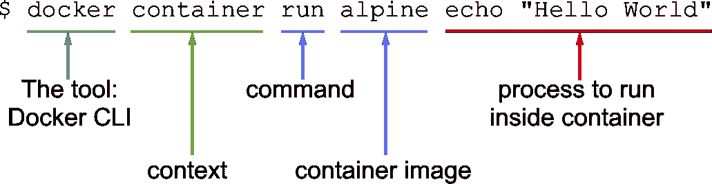
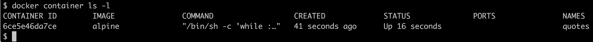
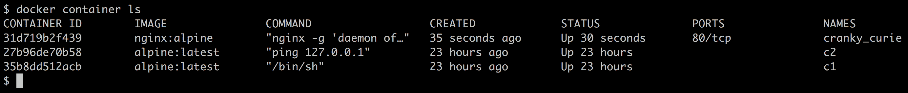
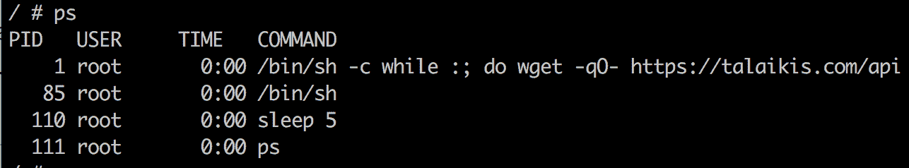
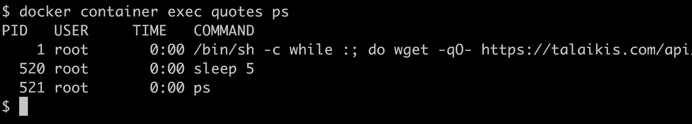
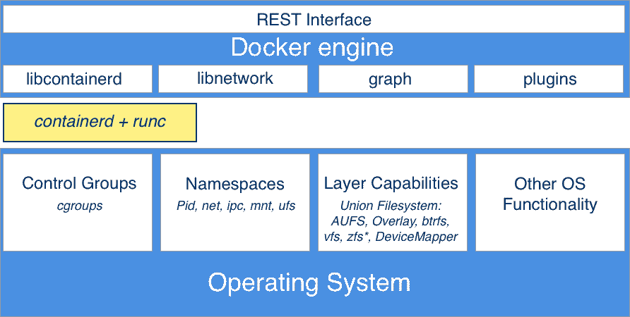
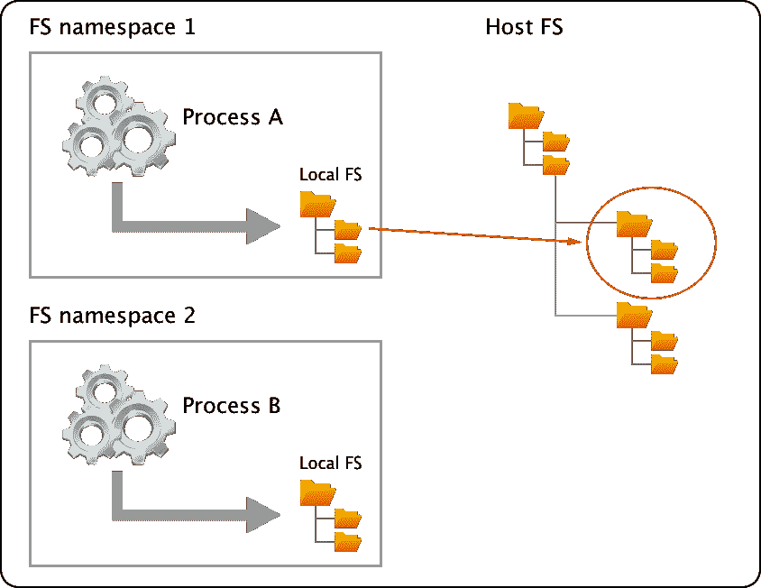
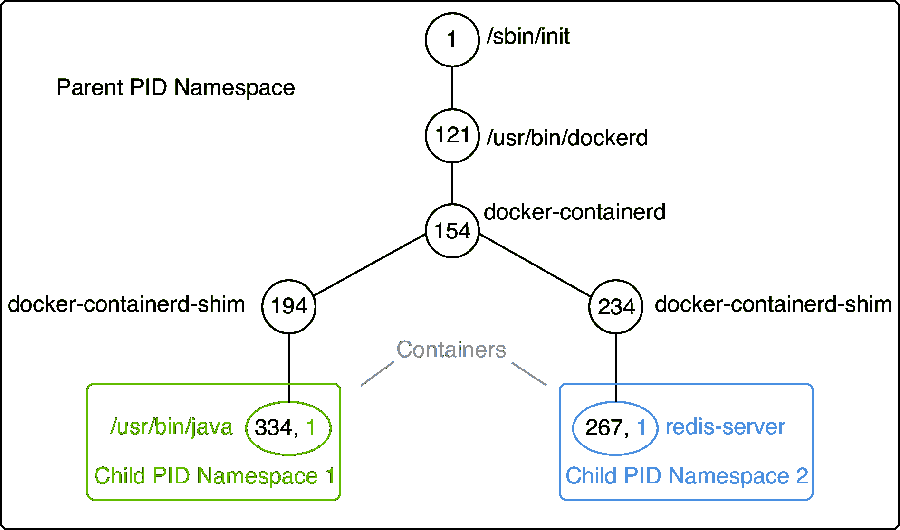

# 使用容器

在前一章中，您学习了如何为 Docker 的高效和无摩擦使用优化您的工作环境。在这一章中，我们将把我们的手弄脏，并学习使用容器的所有重要知识。以下是我们将在本章中讨论的主题:

*   运行第一个容器
*   启动、停止和移除容器
*   检查容器
*   执行到正在运行的容器中
*   连接到运行的容器
*   正在检索容器日志
*   容器解剖

完成本章后，您将能够完成以下工作:

*   基于现有映像运行、停止和删除容器，例如 NGINX、busybox 或 alpine
*   列出系统上的所有容器
*   检查正在运行或停止的容器的元数据
*   检索容器内运行的应用产生的日志
*   在已经运行的容器中运行一个进程，如`/bin/sh`。
*   将终端连接到已经运行的容器
*   用你自己的话向感兴趣的外行解释容器的基础

# 技术要求

对于本章，您应该已经安装了 Mac 的 Docker 或 Windows 的 Docker。如果您使用的是旧版本的 Windows 或使用的是 Windows 10 家庭版，那么您应该已经安装了 Docker 工具箱并准备好使用。在 macOS 上，使用终端应用，在 Windows 上，使用 PowerShell 控制台尝试您将要学习的命令。

# 运行第一个容器

在我们开始之前，我们希望确保 Docker 正确安装在您的系统上，并准备好接受您的命令。打开一个新的终端窗口，输入以下命令:

```
$ docker -v 
```

如果一切正常，您应该会在终端中看到安装在笔记本电脑输出上的 Docker 版本。在写的时候，看起来是这样的:

```
Docker version 17.12.0-ce-rc2, build f9cde63 
```

如果这不起作用，那么你的安装有问题。请确保您已经遵循了上一章中关于如何在您的系统上安装 Docker for Mac 或 Docker for Windows 的说明。

所以，你准备好看到一些行动了。请在您的终端窗口中键入以下命令，然后点击返回:

```
$ docker container run alpine echo "Hello World" 
```

当您第一次运行前面的命令时，您应该会在终端窗口中看到类似如下的输出:

```
Unable to find image 'alpine:latest' locally
latest: Pulling from library/alpine
2fdfe1cd78c2: Pull complete
Digest: sha256:ccba511b...
Status: Downloaded newer image for alpine:latest
Hello World
```

这很简单！让我们再次尝试运行同样的命令:

```
$ docker container run alpine echo "Hello World" 
```

第二次、第三次或第 n 次运行前面的命令时，您应该只能在终端中看到以下输出:

```
 Hello World  
```

尝试推理为什么第一次运行命令时会看到不同于所有后续时间的输出。但是如果你想不出来也不用担心，我们会在本章后面的章节中详细解释原因。

# 启动、停止和移除容器

您已经成功运行了上一节中的容器。现在我们要详细调查到底发生了什么，为什么。让我们再次看看我们使用的命令:

```
$ docker container run alpine echo "Hello World" 
```

该命令包含多个部分。首先，我们有一个词`docker`。这是 Docker **命令行界面** ( **CLI** )的名称，我们使用它与负责运行容器的 Docker 引擎进行交互。接下来，我们有一个词`container`，它表示我们正在使用的上下文。当我们想要运行一个容器时，我们的上下文是单词`container`。接下来是我们想要在给定上下文中执行的实际命令，即`run`。

让我回顾一下——到目前为止，我们有`docker container run`，这意味着，*嘿，Docker，我们想运行一个容器....*

现在我们还需要告诉 Docker 运行哪个容器。在这种情况下，这就是所谓的`alpine`容器。最后，我们需要定义当容器运行时，应该在容器内部执行什么样的进程或任务。在我们的例子中，这是命令的最后一部分，`echo "Hello World"`。

也许下图可以帮助你更好地理解整件事:



Anatomy of the docker container run expression

既然我们已经理解了运行一个容器的命令的各个部分，让我们尝试运行另一个容器，并在其中运行一个不同的进程。在终端中键入以下命令:

```
$ docker container run centos ping -c 5 127.0.0.1
```

您应该会在终端窗口中看到类似以下内容的输出:

```
Unable to find image 'centos:latest' locally
latest: Pulling from library/centos
85432449fd0f: Pull complete
Digest: sha256:3b1a65e9a05...
Status: Downloaded newer image for centos:latest
PING 127.0.0.1 (127.0.0.1) 56(84) bytes of data.
64 bytes from 127.0.0.1: icmp_seq=1 ttl=64 time=0.022 ms
64 bytes from 127.0.0.1: icmp_seq=2 ttl=64 time=0.019 ms
64 bytes from 127.0.0.1: icmp_seq=3 ttl=64 time=0.029 ms
64 bytes from 127.0.0.1: icmp_seq=4 ttl=64 time=0.030 ms
64 bytes from 127.0.0.1: icmp_seq=5 ttl=64 time=0.029 ms

--- 127.0.0.1 ping statistics ---
5 packets transmitted, 5 received, 0% packet loss, time 4103ms
rtt min/avg/max/mdev = 0.021/0.027/0.029/0.003 ms 
```

改变的是，这一次，我们使用的容器映像是`centos`，而我们在`centos`容器内执行的进程是`ping -c 5 127.0.0.1`，它五次 pings 环回地址，直到它停止。

让我们详细分析一下输出:

*   第一行如下:

```
Unable to find image 'centos:latest' locally
```

这告诉我们 Docker 在系统的本地缓存中没有找到名为`centos:latest`的映像。因此，Docker 知道它必须从存储容器映像的某个注册表中提取映像。默认情况下，您的 Docker 环境配置为在`docker.io`从 Docker 集线器中提取映像。这由第二行表示，如下所示:

```
    latest: Pulling from library/centos 
```

*   接下来的三行输出如下:

```
    85432449fd0f: Pull complete
    Digest: sha256:3b1a65e9a05...
    Status: Downloaded newer image for centos:latest
```

这告诉我们 Docker 已经成功地从 Docker Hub 中拉出了映像`centos:latest`。

输出的所有后续行都是由我们在容器中运行的进程生成的，在这种情况下是 ping 工具。如果你一直关注到现在，那么你可能已经注意到关键词`latest`出现了几次。每个映像都有一个版本(也称为标签)，如果我们没有明确指定版本，那么 Docker 会自动假设它是最新的。

如果我们在系统上再次运行前面的容器，输出的前五行将丢失，因为这一次，Docker 将在本地找到缓存的容器映像，因此不必先下载它。试试看，验证一下我刚才说的。

# 运行随机报价容器

对于本章的后续部分，我们需要一个在后台连续运行并产生一些有趣输出的容器。这就是为什么，我们选择了一种产生随机报价的算法。产生这些免费随机报价的 API 可以在[https://talaikis.com/random_quotes_api/](https://talaikis.com/random_quotes_api/)找到。

现在的目标是让一个进程在一个容器中运行，每五秒钟生成一个新的随机报价，并将报价输出到 STDOUT。以下脚本将完全做到这一点:

```
while : 
do 
    wget -qO- https://talaikis.com/api/quotes/random 
    printf 'n' 
    sleep 5 
done 
```

在终端窗口中尝试。按 *Ctrl* + *C* 停止脚本。输出应该如下所示:

```
{"quote":"Martha Stewart is extremely talented. Her designs are picture perfect. Our philosophy is life is messy, and rather than being afraid of those messes we design products that work the way we live.","author":"Kathy Ireland","cat":"design"}
{"quote":"We can reach our potential, but to do so, we must reach within ourselves. We must summon the strength, the will, and the faith to move forward - to be bold - to invest in our future.","author":"John Hoeven","cat":"faith"}
```

每个响应都是一个 JSON 格式的字符串，包含引用、作者和类别。

现在，让我们在一个`alpine`容器中运行它，作为后台的守护进程。为此，我们需要将前面的脚本压缩成一行，并使用`/bin/sh -c "..."`语法执行它。我们的 Docker 表达式如下所示:

```
$ docker container run -d --name quotes alpine \
 /bin/sh -c "while :; do wget -qO- https://talaikis.com/api/quotes/random; printf '\n'; sleep 5; done"
```

在前面的表达式中，我们使用了两个新的命令行参数，`-d`和`--name`。`-d`告诉 Docker 作为一个 Linux 守护程序运行容器中运行的进程。`--name`参数又可以用来给容器一个显式的名称。在前面的例子中，我们选择的名字是`quotes`。

如果我们在运行容器时没有指定显式的容器名称，那么 Docker 会自动为容器分配一个随机但唯一的名称。这个名字将由一位著名科学家的名字和一个形容词组成。这样的名字可以是`boring_borg`或`angry_goldberg`。我们的码头工人很幽默，不是吗？

一个重要的要点是，容器名称在系统中必须是唯一的。让我们确保报价容器已经启动并运行:

```
$ docker container ls -l 
```

这应该给我们这样的东西:



Listing the last run container

前面输出的重要部分是`STATUS`列，在本例中是`Up 16 seconds`。也就是说，容器现在已经启动并运行了 16 秒。

如果您还不熟悉最后一个 Docker 命令，请不要担心，我们将在下一节中回到它。

# 列出容器

随着时间的推移，我们继续运行容器，我们的系统中有很多容器。要了解我们的主机上当前正在运行什么，我们可以使用容器`list`命令，如下所示:

```
$ docker container ls 
```

这将列出所有当前运行的容器。这样的列表可能看起来类似于这样:



List of all containers running on the system

默认情况下，Docker 输出具有以下含义的七列:

| 
**列**
 | 
**描述**
 |
| `Container ID` | 容器的唯一标识。它是阿沙-256。 |
| `Image` | 从中实例化此容器的容器映像的名称。 |
| `Command` | 用于运行容器中主进程的命令。 |
| `Created` | 创建容器的日期和时间。 |
| `Status` | 容器的状态(创建、重新启动、运行、删除、暂停、退出或死亡)。 |
| `Ports` | 已映射到主机的容器端口列表。 |
| `Names` | 分配给此容器的名称(可以有多个名称)。 |

如果我们不仅要列出当前运行的容器，还要列出系统中定义的所有容器，那么我们可以使用命令行参数`-a`或`--all`，如下所示:

```
$ docker container ls -a 
```

这将列出任何状态的容器，如`created`、`running`或`exited`。

有时，我们只想列出所有容器的标识。对此，我们有参数`-q`:

```
$ docker container ls -q 
```

你可能想知道这在哪里有用。我给你看一个非常有用的命令:

```
$ docker container rm -f $(docker container ls -a -q)
```

向后靠，深呼吸。然后，尝试找出前面的命令是做什么的。在找到答案或放弃之前，不要继续阅读。

右:前面的命令删除当前在系统上定义的所有容器，包括停止的容器。`rm`命令代表移除，下面将进一步解释。

在上一节中，我们使用了列表命令中的参数`-l`。尝试使用 Docker 帮助找出`-l`参数代表什么。您可以调用 list 命令的帮助，如下所示:

```
$ docker container ls -h 
```

# 停止和启动容器

有时，我们想(暂时)停止一个正在运行的容器。让我们用之前使用的报价容器来尝试一下。使用以下命令再次运行容器:

```
$ docker container run -d --name quotes alpine \
 /bin/sh -c "while :; do wget -qO- https://talaikis.com/api/quotes/random; printf '\n'; sleep 5; done"
```

现在，如果我们想要停止这个容器，那么我们可以通过发出以下命令来完成:

```
$ docker container stop quotes 
```

当您尝试停止报价容器时，您可能会注意到，执行该命令需要一段时间。准确地说，大约需要 10 秒钟。*为什么会这样？*

Docker 向容器内部运行的主进程发送一个 Linux `SIGTERM`信号。如果进程没有对这个信号做出反应而自行终止，Docker 等待 10 秒后发送`SIGKILL`，会强行终止进程，终止容器。

在前面的命令中，我们使用了容器的名称来指定要停止的容器。但是我们也可以使用容器标识来代替。

*如何获取集装箱的 ID？*这样做有几种方式。手动方法是列出所有正在运行的容器，并在列表中找到我们正在寻找的容器。从那里，我们复制它的 ID。更自动化的方法是使用一些 shell 脚本和环境变量。例如，如果我们想要获取报价容器的标识，我们可以使用以下表达式:

```
$ export CONTAINER_ID = $(docker container ls | grep quotes | awk '{print $1}')
```

现在，我们可以在表达式中使用变量
`$CONTAINER_ID`，而不是使用容器名称:

```
$ docker container stop $CONTAINER_ID 
```

一旦我们停止了容器，它的状态将变为`Exited`。

如果容器停止，可以使用`docker container start`命令再次启动。让我们用报价容器来做这件事。让它再次运行是很好的，因为我们将在本章的后续章节中用到它:

```
$ docker container start quotes
```

# 移除容器

当我们运行`docker container ls -a`命令时，我们可以看到相当多的容器处于`Exited`状态。如果我们不再需要这些容器，那么将它们从内存中移除是一件好事，否则它们会不必要地占用宝贵的资源。移除容器的命令是:

```
$ docker container rm <container ID> 
```

移除容器的另一个命令是:

```
$ docker container rm <container name> 
```

尝试使用它的标识删除一个已退出的容器。

有时，移除容器将不起作用，因为它仍在运行。如果我们想强制移除，无论容器当前的状态如何，我们都可以使用命令行参数`-f`或`--force`。

# 检查容器

容器是一个映像的运行时实例，并且有许多表征其行为的相关数据。要获得特定容器的更多信息，我们可以使用`inspect`命令。像往常一样，我们必须提供容器标识或名称来标识我们想要获取其数据的容器。那么，让我们检查一下我们的样品容器:

```
$ docker container inspect quotes 
```

响应是一个充满细节的大 JSON 对象。它看起来像这样:

```
    [
        {
            "Id": "c5c1c68c87...",
            "Created": "2017-12-30T11:55:51.223271182Z",
            "Path": "/bin/sh",
            "Args": [
                "-c",
                "while :; do wget -qO- https://talaikis.com/api/quotes/random; printf '\n'; sleep 5; done"
            ],
            "State": {
                "Status": "running",
                "Running": true,
                ...
            },
            "Image": "sha256:e21c333399e0...",
            ...
            "Mounts": [],
            "Config": {
                "Hostname": "c5c1c68c87dd",
                "Domainname": "",
                ...
            },
            "NetworkSettings": {
                "Bridge": "",
                "SandboxID": "2fd6c43b6fe5...",
                ...
            }
        }
    ]

```

为了可读性，输出被缩短了。

请花点时间分析一下你得到了什么。您应该会看到以下信息:

*   容器的标识
*   容器的创建日期和时间
*   从哪个映像构建容器等等

输出的许多部分，如`Mounts`或`NetworkSettings`现在没有太大意义，但我们肯定会在本书即将到来的章节中讨论这些。您在这里看到的数据也被命名为容器的**元数据**。在本书的剩余部分，我们将经常使用`inspect`命令作为信息来源。

有时，我们只需要整体信息的一点点，为了实现这一点，我们可以使用 **grep 工具**或**过滤器**。前一种方法并不总是能得到预期的答案，所以让我们来看看后一种方法:

```
$ docker container inspect -f "{{json .State}}" quotes | jq 
```

`-f`或`--filter`参数用于定义过滤器。过滤器表达式本身使用**围棋模板**语法。在这个例子中，我们只想看到 JSON 格式的整个输出的状态部分。

为了很好地格式化输出，我们将结果导入 jq 工具:

```
    {
      "Status": "running",
      "Running": true,
      "Paused": false,
      "Restarting": false,
      "OOMKilled": false,
      "Dead": false,
      "Pid": 6759,
      "ExitCode": 0,
      "Error": "",
      "StartedAt": "2017-12-31T10:31:51.893299997Z",
      "FinishedAt": "0001-01-01T00:00:00Z"
    }

```

# 执行到正在运行的容器中

有时，我们想在一个已经运行的容器中运行另一个进程。一个典型的原因可能是试图调试一个行为不当的容器。*我们如何做到这一点？*首先，我们需要知道容器的 ID 或名称，然后我们可以定义我们想要运行哪个进程以及我们想要它如何运行。我们再次使用当前运行的报价容器，并在其中使用以下命令交互运行一个 shell:

```
$ docker container exec -i -t quotes /bin/sh 
```

标志`-i`表示我们想要交互运行附加的进程，`-t`告诉 Docker 我们想要它为我们提供命令的 TTY(一个终端仿真器)。最后，我们运行的流程是`/bin/sh`。

如果我们在终端中执行前面的命令，那么我们将看到一个新的提示。我们现在在报价容器的外壳中。我们可以很容易地证明这一点，例如，通过执行`ps`命令，该命令将列出上下文中所有正在运行的进程:

```
# / ps
```

结果应该有点类似于这样:



List of Processes running inside the quotes Container

我们可以清楚地看到带有`PID 1`的过程是我们已经定义的在报价容器内部运行的命令。带有`PID 1`的流程也称为主流程。

在提示下输入`exit`离开容器。我们不能只在一个容器中执行额外的交互过程。请考虑以下命令:

```
$ docker container exec quotes ps
```

输出显然与前面的输出非常相似:



List of Processes running inside the quotes Container

我们甚至可以使用标志`-d`作为守护进程运行进程，并使用`-e`标志变量定义环境变量，如下所示:

```
$ docker container exec -it \
 -e MY_VAR="Hello World" \
 quotes /bin/sh
# / echo $MY_VAR
Hello World
# / exit
```

# 连接到运行的容器

我们可以使用`attach`命令，使用容器的 ID 或名称，将终端的标准输入、输出和错误(或三者的任意组合)附加到正在运行的容器上。让我们为报价容器这样做:

```
$ docker container attach quotes 
```

在这种情况下，我们将每五秒钟左右看到输出中出现一个新的报价。

要退出容器而不停止或杀死它，我们可以按组合键*Ctrl*+*P**Ctrl*+*Q*。这将我们从容器中分离出来，同时让它在后台运行。另一方面，如果我们想同时分离和停止容器，我们可以只按 *Ctrl* + *C* 。

让我们运行另一个容器，这次是一个 Nginx 网络服务器:

```
$ docker run -d --name nginx -p 8080:80 nginx:alpine 
```

在这里，我们在一个名为`nginx`的容器中运行作为守护进程的高山版本的 Nginx。`-p 8080:80`命令行参数打开主机上的端口`8080`，用于访问容器内部运行的 Nginx 网络服务器。不要担心这里的语法，因为我们将在[第 7 章](07.html)、*单主机网络*中更详细地解释这个特性。

让我们看看是否可以访问 Nginx，使用`curl`工具并运行以下命令:

```
$ curl -4 localhost:8080 
```

如果一切正常，您应该会看到 Nginx 的欢迎页面:

```
<html> 
<head> 
<title>Welcome to nginx!</title> 
<style> 
    body { 
        width: 35em; 
        margin: 0 auto; 
        font-family: Tahoma, Verdana, Arial, sans-serif; 
    } 
</style> 
</head> 
<body> 
<h1>Welcome to nginx!</h1> 
<p>If you see this page, the nginx web server is successfully installed and 
working. Further configuration is required.</p> 

<p>For online documentation and support please refer to 
<a href="http://nginx.org/">nginx.org</a>.<br/> 
Commercial support is available at 
<a href="http://nginx.com/">nginx.com</a>.</p> 

<p><em>Thank you for using nginx.</em></p> 
</body> 
</html> 
```

现在，让我们将终端连接到`nginx`容器上，观察发生了什么:

```
$ docker container attach nginx 
```

一旦你附着在容器上，你首先将看不到任何东西。但是现在打开另一个终端，在这个新的终端窗口中，重复几次`curl`命令，例如，使用以下脚本:

```
$ for n in {1..10}; do curl -4 localhost:8080; done  
```

您应该会看到 Nginx 的日志输出，类似于下面这样:

```
172.17.0.1 - - [06/Jan/2018:12:20:00 +0000] "GET / HTTP/1.1" 200 612 "-" "curl/7.54.0" "-"
172.17.0.1 - - [06/Jan/2018:12:20:03 +0000] "GET / HTTP/1.1" 200 612 "-" "curl/7.54.0" "-"
172.17.0.1 - - [06/Jan/2018:12:20:05 +0000] "GET / HTTP/1.1" 200 612 "-" "curl/7.54.0" "-"
...
```

按下 *Ctrl* + *C* 退出容器。这将分离您的终端，同时停止`nginx`容器。

要清理，使用以下命令移除`nginx`容器:

```
$ docker container rm nginx 
```

# 正在检索容器日志

对于任何好的应用来说，最好的做法是生成一些日志信息，开发人员和操作人员都可以使用这些信息来找出应用在给定时间正在做什么，以及是否有任何问题来帮助找出问题的根本原因。

当在容器中运行时，应用最好将日志项输出到 STDOUT 和 STDERR，而不是输出到文件中。如果日志输出指向 STDOUT 和 STDERR，那么 Docker 可以收集这些信息，并准备好供用户或任何其他外部系统使用。

要访问给定容器的日志，我们可以使用`docker container logs`命令。例如，如果我们想要检索我们的`quotes`容器的日志，我们可以使用以下表达式:

```
$ docker container logs quotes 
```

这将从应用存在的一开始就检索它产生的整个日志。

Stop, wait a second—this is not quite true, what I just said. By default, Docker uses the so-called `json-file` logging driver. This driver stores the logging information in a file. And if there is a file rolling policy defined, then `docker container logs` only retrieves what is in the current active log file and not what is in previous, rolled files that might still be available on the host.

如果我们只想获取几个最新的条目，我们可以使用`-t`或`--tail`参数，如下所示:

```
$ docker container logs --tail 5 quotes 
```

这将只检索在容器内部运行的进程产生的最后五个项目。

有时，我们想跟踪容器产生的日志。当使用参数`-f`或`--follow`时，这是可能的。以下表达式将输出最后五个日志项，然后按照容器化过程生成的日志进行操作:

```
$ docker container logs --tail 5 --follow quotes 
```

# 日志驱动程序

Docker 包括多种日志机制来帮助我们从运行的容器中获取信息。这些机制被命名为**日志驱动程序**。可以在 Docker 守护程序级别配置使用哪个日志驱动程序。默认的日志驱动是`json-file`。当前本地支持的一些驱动程序有:

| 
**驾驶员**
 | 
**描述**
 |
| `none` | 不会产生特定容器的日志输出。 |
| `json-file` | 这是默认驱动程序。日志信息存储在格式为 JSON 的文件中。 |
| `journald` | 如果日志守护程序在主机上运行，我们可以使用这个驱动程序。它将日志记录转发给`journald`守护程序。 |
| `syslog` | 如果`syslog`守护进程在主机上运行，我们可以配置这个驱动，它会将日志消息转发给`syslog`守护进程。 |
| `gelf` | 当使用该驱动程序时，日志消息被写入一个**灰色日志扩展日志格式** ( **GELF** )端点。这种端点的常见例子是 Graylog 和 Logstash。 |
| `fluentd` | 假设`fluentd`守护程序安装在主机系统上，这个驱动程序会向它写入日志消息。 |

If you change the logging driver, please be aware that the `docker container logs` command is only available for the `json-file` and `journald` drivers.

# 使用特定于容器的日志驱动程序

我们已经看到，可以在 Docker 守护程序配置文件中全局设置日志驱动程序。但是我们也可以逐个容器地定义日志驱动程序。在下面的例子中，我们正在运行一个`busybox`容器，并使用`--log-driver`参数来配置`none`日志驱动程序:

```
$ docker container run --name test -it \
 --log-driver none \
 busybox sh -c 'for N in 1 2 3; do echo "Hello $N"; done'
```

我们应该看到以下内容:

```
Hello 1
Hello 2 Hello 3 
```

现在，让我们尝试获取前面容器的日志:

```
$ docker container logs test 
```

输出如下:

```
Error response from daemon: configured logging driver does not support reading
```

这是意料之中的，因为`none`驱动程序不产生任何日志输出。让我们清理并移除`test`容器:

```
$ docker container rm test 
```

# 高级主题–更改默认日志驱动程序

让我们更改 Linux 主机的默认日志驱动程序。最简单的方法是在真正的 Linux 主机上。为此，我们将使用带有 Ubuntu 映像的游民:

```
$ vagrant init bento/ubuntu-17.04
$ vagrant up
$ vagrant ssh
```

一旦进入 Ubuntu 虚拟机，我们希望编辑 Docker 守护程序配置文件。导航至文件夹`/etc/docker`并运行`vi`，如下所示:

```
$ vi daemon.json 
```

输入以下内容:

```
{
  "Log-driver": "json-log",
  "log-opts": {
    "max-size": "10m",
    "max-file": 3
  }
}
```

首先按下 *Esc* ，然后输入`:w:q`，最后按下*回车*键，保存并退出虚拟仪器。

前面的定义告诉 Docker 守护程序在回滚之前使用最大日志文件大小为 10 MB 的`json-log`驱动程序，在清除最旧的文件之前，系统上可以存在的最大日志文件数为`3`。

现在，我们必须向 Docker 守护程序发送一个`SIGHUP`信号，以便它获取配置文件中的更改:

```
$ sudo kill -SIGHUP $(pidof dockerd) 
```

请注意，前面的命令只重新加载配置文件，而不重新启动守护程序。

# 容器解剖

许多人错误地将容器比作虚拟机。然而，这是一个有问题的比较。容器不仅仅是轻量级虚拟机。好吧，那么，*容器的正确描述是什么？*

容器是运行在主机系统上的特殊封装和安全的进程。

容器利用了 Linux 操作系统中许多可用的特性和原语。最重要的是**名称空间**和**组**。在容器中运行的所有进程共享底层主机操作系统的相同 Linux 内核。与虚拟机相比，这是根本不同的，因为每个虚拟机都包含自己的完整操作系统。

典型容器的启动时间可以用毫秒来衡量，而虚拟机通常需要几秒到几分钟才能启动。虚拟机注定是长寿的。每个运营工程师的主要目标是最大限度地延长其虚拟机的正常运行时间。与此相反，容器是短暂的。他们来去匆匆。

首先，让我们对能够运行容器的架构有一个高层次的概述。

# 体系结构

这里，我们有一个体系结构图，展示了这一切是如何结合在一起的:



High level architecture of Docker

在上图的下半部分，我们有 Linux 操作系统及其 cgroups、名称空间和层功能，以及我们在这里不需要明确提及的其他功能。然后是由**容器**和 **runc** 组成的中间层。除此之外，现在还有 Docker 引擎。Docker 引擎为外部世界提供了一个 RESTful 界面，任何工具都可以访问该界面，例如 Docker CLI、Docker for Mac 和 Docker for Windows 或 Kubernetes 等等。

现在让我们更详细地描述一下主要的构建模块。

# 命名空间

Linux 名称空间在被 Docker 用于容器之前已经存在多年了。命名空间是对全局资源的抽象，如文件系统、网络访问、进程树(也称为 PID 命名空间)或系统组标识和用户标识。Linux 系统是用每个命名空间类型的单个实例初始化的。初始化后，可以创建或加入其他名称空间。

Linux 命名空间起源于 2002 年的 2.4.19 内核。在内核版本 3.8 中，引入了用户命名空间，有了它，容器就可以使用命名空间了。

如果我们将一个正在运行的进程包装在一个文件系统名称空间中，那么这个进程就有一种错觉，认为它拥有自己完整的文件系统。这当然不是真的；它只是一个虚拟文件系统。从主机的角度来看，包含的进程获得了整个文件系统的屏蔽子部分。它就像文件系统中的文件系统:



这同样适用于存在名称空间的所有其他全局资源。用户标识命名空间是另一个例子。有了用户命名空间，我们现在可以在系统上多次定义用户`jdoe`，只要它生活在自己的命名空间中。

PID 命名空间是防止一个容器中的进程看到另一个容器中的进程或与之交互的东西。一个进程可能在一个容器中有明显的 PID **1** ，但是如果我们从主机系统检查它，它将有一个普通的 PID，比如说 **334** :



Process tree on a Docker host

在给定的命名空间中，我们可以运行一个到多个进程。当我们谈论容器时，这很重要，当我们在一个已经运行的容器中执行另一个过程时，我们已经体验到了这一点。

# 控制组

Linux cgroups 用于限制、管理和隔离系统上运行的进程集合的资源使用。资源是指 CPU 时间、系统内存、网络带宽或这些资源的组合等等。

谷歌的工程师最初从 2006 年开始实施这一功能。在 2008 年 1 月发布的内核版本 2.6.24 中，cgroups 功能被合并到 Linux 内核主线中。

使用 cgroups，管理员可以限制容器可以消耗的资源。这样就可以避免经典的*噪音邻居*问题，在这个问题中，在一个容器中运行的流氓进程消耗了所有的 CPU 时间或者保留了大量的内存，因此，使主机上运行的所有其他进程都变得饥饿，无论它们是否被容器化。

# 联合文件系统

UnionFS 构成了所谓的容器映像的主干。我们将在下一章详细讨论容器映像。此时，我们只想更好地理解什么是 UnionFS 以及它是如何工作的。UnionFS 主要在 Linux 上使用，它允许不同文件系统的文件和目录被覆盖，并与它一起形成一个统一的文件系统。在这种情况下，各个文件系统被称为分支。在合并的分支中具有相同路径的目录的内容将一起出现在新的虚拟文件系统中的单个合并目录中。合并分支时，会指定分支之间的优先级。这样，当两个分支包含相同的文件时，在最终的文件系统中可以看到优先级较高的分支。

# 集装箱管道

建造码头工人引擎的地下室；我们也可以称之为**集装箱管道**，由两部分组成——**runc**和**集装箱**。

最初，Docker 是以整体方式构建的，包含了运行容器所需的所有功能。随着时间的推移，这变得过于僵化，Docker 开始将部分功能分解成自己的组件。两个重要的组件是 runc 和 containerd。

# Runc

Runc 是一个轻量级、可移植的容器运行时。它提供了对 Linux 命名空间的完全支持，以及对 Linux 上所有可用安全功能的本机支持，例如 SELinux、AppArmor、seccomp 和 cgroups。

Runc 是根据**开放容器倡议** ( **OCI** )规范产卵和运行容器的工具。这是一种正式指定的配置格式，由 Linux 基金会赞助的**开放容器项目** ( **OCP** )管理。

# 包含在内

Runc 是容器运行时的低级实现；containerd 建立在它之上，并添加了更高级别的功能，如映像传输和存储、容器执行和监督，以及网络和存储附件。这样，它就管理了容器的整个生命周期。Containerd 是 OCI 规范的参考实现，是迄今为止最流行和使用最广泛的容器运行时。

集装箱已于 2017 年捐赠给 CNCF 并被其接受。存在 OCI 规范的替代实现。其中一些是 CoreOS 的 rkt，RedHat 的 CRI-O，以及 Linux 容器的 LXD。然而，此时的 containerd 是迄今为止最流行的容器运行时，并且是 Kubernetes 1.8 或更高版本以及 Docker 平台的默认运行时。

# 摘要

在本章中，您学习了如何使用基于现有映像的容器。我们展示了如何运行、停止、启动和移除容器。然后，我们检查了容器的元数据，提取了它的日志，并学习了如何在已经运行的容器中运行任意进程。最后但并非最不重要的是，我们深入研究了容器是如何工作的，以及它们利用了底层 Linux 操作系统的哪些特性。

在下一章中，您将了解什么是容器映像，以及我们如何构建和共享自己的自定义映像。我们还将讨论构建自定义映像时常用的最佳实践，例如最小化映像大小和利用映像缓存。敬请关注！

# 问题

要评估您的学习进度，请回答以下问题:

1.  集装箱的状态是什么？
2.  哪个命令有助于我们了解主机上当前运行的是什么？
3.  哪个命令用于列出所有容器的标识？

# 进一步阅读

以下文章为您提供了与我们在本章中讨论的主题相关的更多信息:

*   *http://dockr.ly/2iLBV2I码头工人集装箱*
*   *在[http://dockr.ly/2gmxKWB](http://dockr.ly/2gmxKWB)开始使用集装箱*
*   *在[http://dockr.ly/2gmyKdf](http://dockr.ly/2gmyKdf)隔离具有用户命名空间*的容器
*   *在[http://dockr.ly/2wqN5Nn](http://dockr.ly/2wqN5Nn)限制集装箱资源*