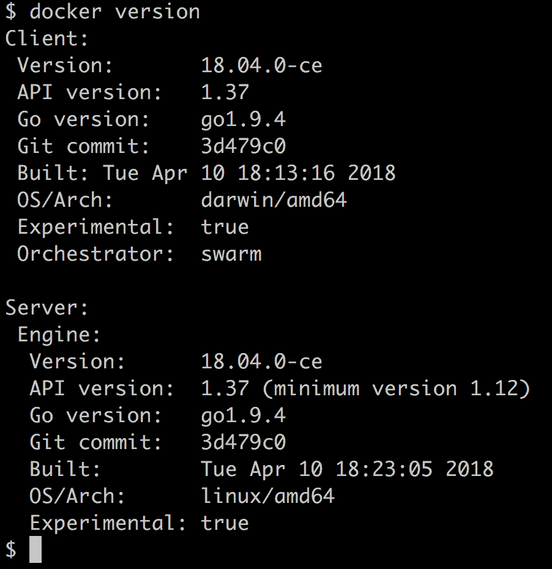
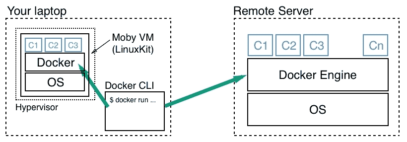
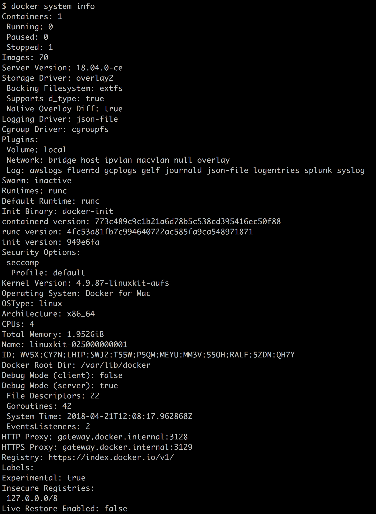
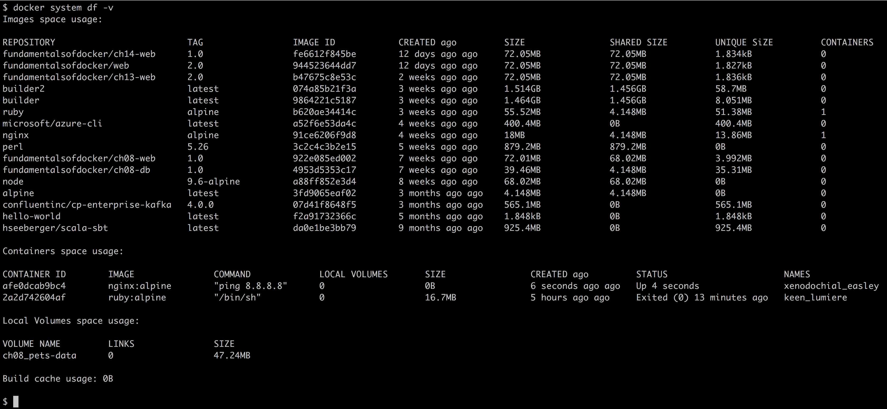

# 数据量和系统管理

在最后一章中，我们学习了如何构建和共享我们自己的容器映像。特别关注的是如何通过只包含容器化应用真正需要的工件来构建尽可能小的映像。

在本章中，我们将学习如何使用有状态容器，即消费和产生数据的容器。我们还将学习如何保持我们的 Docker 环境干净，没有未使用的资源。最后但同样重要的是，我们将研究 Docker 引擎正在产生的事件流。

以下是我们将要讨论的主题列表:

*   创建和装载数据卷
*   在容器之间共享数据
*   使用主机卷
*   定义映像中的体积
*   获取详尽的 Docker 系统信息
*   列出资源消耗
*   清理未使用的资源
*   消耗 Docker 系统事件

完成本章后，您将能够:

*   创建、删除和列出数据卷
*   将现有数据卷装入容器
*   使用数据卷从容器中创建持久数据
*   使用数据卷在多个容器之间共享数据
*   使用数据卷将任何主机文件夹装入容器
*   当访问数据卷中的数据时，定义容器的访问模式(读/写或只读)
*   列出给定主机上 Docker 资源消耗的空间量，如映像、容器和卷
*   从未使用的 Docker 资源(如容器、映像和卷)中释放您的系统
*   在控制台中实时显示 Docker 系统事件

# 技术要求

对于本章，您需要在机器上安装 Docker 工具箱，或者访问在笔记本电脑或云中运行 Docker 的 Linux 虚拟机。本章没有附带代码。

# 创建和装载数据卷

所有有意义的应用都会消耗或产生数据。然而容器最好是无状态的。我们要怎么处理这件事？一种方法是使用 Docker 卷。卷允许容器消费、生产和修改状态。卷的生命周期超出了容器的生命周期。当使用卷的容器死亡时，该卷继续存在。这对于状态的持久性是很大的。

# 修改容器层

在深入讨论卷之前，让我们先讨论一下如果容器中的应用更改了容器文件系统中的某些内容，会发生什么情况。在这种情况下，更改都发生在可写容器层。让我们通过运行一个容器并在其中执行一个创建新文件的脚本来快速演示这一点:

```
$ docker container run --name demo \
 alpine /bin/sh -c 'echo "This is a test" > sample.txt'
```

前面的命令创建了一个名为`demo`的容器，在这个容器中创建了一个名为`sample.txt`的文件，内容为`This is a test`。容器在此之后退出，但仍保留在内存中，可供我们进行调查。让我们使用`diff`命令找出容器文件系统中与映像文件系统相关的变化:

```
$ docker container diff demo
```

输出应该如下所示:

```
A /sample.txt
```

显然，一个新文件`A`已经如预期的那样被添加到容器的文件系统中。由于源自底层映像(在本例中为`alpine`)的所有层都是不可变的，因此更改只能发生在可写容器层。

如果我们现在从内存中移除容器，它的容器层也将被移除，并且所有的更改都将被不可逆地删除。如果我们需要我们的更改甚至在容器的生命周期之后持续存在，这不是一个解决方案。幸运的是，我们在 Docker 卷的形式上有更好的选择。让我们去了解他们。

# 创建卷

因为此时，当使用 Docker for Mac 或 Windows 时，容器不是在 OS X 或 Windows 上本地运行，而是在 Docker for Mac 和 Windows 创建的(隐藏)虚拟机中运行，所以我们最好使用`docker-machine`来创建和使用运行 Docker 的显式虚拟机。此时，我们假设您的系统上安装了 Docker 工具箱。如果没有，那么请返回[第 2 章](02.html)、*设置工作环境、*我们提供如何安装工具箱的详细说明。

使用`docker-machine`列出当前在 VirtualBox 中运行的所有虚拟机:

```
$ docker-machine ls 
```

如果您没有列出名为`node-1`的虚拟机，请创建一个:

```
$ docker-machine create --driver virtualbox node-1 
```

如果您有一个名为`node-1`的虚拟机，但它没有运行，请启动它:

```
$ docker-machine start node-1
```

现在一切准备就绪，SSH 进入这个名为`node-1`的虚拟机:

```
$ docker-machine ssh node-1
```

你应该得到一个 boot2docker 欢迎图片。

要创建新的数据卷，我们可以使用`docker volume create`命令。这将创建一个命名卷，然后可以将其装入容器中，用于持久数据访问或存储。以下命令使用默认的卷驱动程序创建卷`my-data`:

```
$ docker volume create my-data 
```

默认的卷驱动程序是所谓的本地驱动程序，它将数据本地存储在主机文件系统中。找出数据在主机上存储位置的最简单方法是在我们刚刚创建的卷上使用`inspect`命令。实际位置可能因系统而异，因此，这是查找目标文件夹的最安全方法:

```
 $ docker volume inspect my-data 
[ 
    { 
        "CreatedAt": "2018-01-28T21:55:41Z", 
        "Driver": "local", 
        "Labels": {}, 
        "Mountpoint": "/mnt/sda1/var/lib/docker/volumes/my-data/_data", 
        "Name": "my-data", 
        "Options": {}, 
        "Scope": "local" 
    } 
] 
```

主机文件夹可以在`Mountpoint`下的输出中找到。在我们的例子中，当在运行于 VirtualBox 的基于 LinuxKit 的虚拟机上使用`docker-machine`时，文件夹是`/mnt/sda1/var/lib/docker/volumes/my-data/_data`。

目标文件夹通常是一个受保护的文件夹，因此我们可能需要使用`sudo`来导航到该文件夹并执行其中的任何操作。在我们的情况下，我们不需要使用`sudo`:

```
$ cd /mnt/sda1/var/lib/docker/volumes/my-data/_data
```

If you are using Docker for Mac to create a volume on your laptop and then do a `docker volume inspect` on the volume you just created, the `Mountpoint` is shown as `/var/lib/docker/volumes/my-data/_data`. But you will discover that there is no such folder on the Mac. The reason is that the path is in relation to the hidden VM that Docker for Mac uses to run containers. At this time, containers cannot run natively on OS X. The same applies to volumes created with Docker for Windows.

第三方以插件的形式提供其他卷驱动程序。我们可以使用`create`命令中的`--driver`参数来选择不同的音量驱动器。其他卷驱动程序使用不同类型的存储系统来备份卷，例如云存储、NFS 驱动器、软件定义的存储等。

# 安装卷

一旦我们创建了一个命名卷，我们就可以将其装入容器中。为此，我们可以使用`docker container run`命令中的`-v`参数:

```
$ docker container run --name test -it \
 -v my-data:/data alpine /bin/sh
```

前面的命令将`my-data`卷装入容器内的`/data`文件夹。在容器中，我们现在可以在`/data`文件夹中创建文件，然后退出:

```
# / cd /data 
# / echo "Some data" > data.txt 
# / echo "Some more data" > data2.txt 
# / exit 
```

如果我们导航到包含卷数据的主机文件夹并列出其内容，我们应该会看到我们刚刚在容器中创建的两个文件:

```
$ cd /mnt/sda1/var/lib/docker/volumes/my-data/_data 
$ ls -l 
total 8 
-rw-r--r-- 1 root root 10 Jan 28 22:23 data.txt
-rw-r--r-- 1 root root 15 Jan 28 22:23 data2.txt
```

我们甚至可以尝试输出第二个文件的内容:

```
$ cat data2.txt
```

让我们尝试从主机在此文件夹中创建一个文件，然后将该卷与另一个容器一起使用:

```
$ echo "This file we create on the host" > host-data.txt 
```

现在，让我们删除`test`容器，运行另一个基于 CentOS 的容器。这一次，我们甚至将卷装载到不同的容器文件夹`/app/data`:

```
$ docker container rm test
$ docker container run --name test2 -it \
 -v my-data:/app/data \
 Centos:7 /bin/bash 
```

进入 CentOS 容器后，我们可以导航到我们将卷装载到的文件夹`/app/data`，并列出其内容:

```
# / cd /app/data 
# / ls -l 
```

不出所料，我们应该会看到这三个文件:

```
-rw-r--r-- 1 root root 10 Jan 28 22:23 data.txt
-rw-r--r-- 1 root root 15 Jan 28 22:23 data2.txt
-rw-r--r-- 1 root root 32 Jan 28 22:31 host-data.txt
```

这是 Docker 卷中的数据在容器的生命周期内持续存在的确凿证据，也是卷可以被其他容器重用的确凿证据，甚至是与最初使用它的容器不同的容器。

重要的是要注意，我们装载 Docker 卷的容器内的文件夹被排除在联合文件系统之外。也就是说，该文件夹及其任何子文件夹中的每个更改都不会成为容器层的一部分，而是保留在卷驱动程序提供的后备存储中。这个事实非常重要，因为当相应的容器停止并从系统中移除时，容器层就会被删除。

# 删除卷

可以使用`docker volume rm`命令删除卷。请务必记住，删除卷会不可逆地破坏包含的数据，因此被视为危险的命令。Docker 在这方面帮了我们一点忙，因为它不允许我们删除容器仍在使用的卷。在移除或删除卷之前，请务必确保您有其数据的备份，或者您确实不再需要这些数据。

以下命令删除我们之前创建的`my-data`卷:

```
$ docker volume rm my-data 
```

执行上述命令后，请仔细检查主机上的文件夹是否已被删除。

要删除所有正在运行的容器以清理系统，请运行以下命令:

```
$ docker container rm -f $(docker container ls -aq)  
```

# 在容器之间共享数据

容器就像运行在其中的应用的沙箱。为了保护运行在不同容器中的应用，这是非常有益的，也是非常必要的。这也意味着在容器中运行的应用可见的整个文件系统对于该应用是私有的，并且在不同容器中运行的其他应用都不能干扰它。

尽管有时，我们希望在容器之间共享数据。假设一个运行在容器 A 中的应用产生一些数据，这些数据将被另一个运行在容器 b 中的应用消耗掉*我们如何实现这一点？*我相信你已经猜到了——我们可以为此使用 Docker 卷。我们可以创建一个卷，并将其装入容器 A 和容器 B。这样，应用 A 和 B 都可以访问相同的数据。

现在，像往常一样，当多个应用或进程同时访问数据时，我们必须非常小心，以避免不一致。为了避免并发性问题，例如竞争条件，我们理想情况下只有一个应用或进程在创建或修改数据，而同时访问这些数据的所有其他进程只读取数据。通过将卷装载为只读，我们可以强制在容器中运行的进程只能读取卷中的数据。请看下面的命令:

```
$ docker container run -it --name writer \
 -v shared-data:/data \
 alpine /bin/sh
```

这里我们创建一个名为`writer`的容器，它有一个以默认读/写模式装载的卷`shared-data`。尝试在此容器内创建一个文件:

```
# / echo "I can create a file" > /data/sample.txt 
```

它应该会成功。退出此容器，然后执行以下命令:

```
$ docker container run -it --name reader \
 -v shared-data:/app/data:ro \
 ubuntu:17.04 /bin/bash
```

我们有一个名为`reader`的容器，其安装的体积与只读的 ( **ro** 相同。首先，确保您可以看到在第一个容器中创建的文件:

```
$ ls -l /app/data 
total 4
-rw-r--r-- 1 root root 20 Jan 28 22:55 sample.txt
```

然后尝试创建一个文件:

```
# / echo "Try to break read/only" > /app/data/data.txt
```

它将失败，并显示以下消息:

```
bash: /app/data/data.txt: Read-only file system
```

让我们通过在命令提示符下键入`exit`退出容器。回到主机上，让我们清理所有容器和卷:

```
$ docker container rm -f $(docker container ls -aq) 
$ docker volume rm $(docker volume ls -q) 
```

完成后，通过在命令提示符下输入`exit`退出`docker-machine`虚拟机。你应该回到你的苹果电脑或视窗系统上。使用`docker-machine`停止虚拟机:

```
$ docker-machine stop node-1 
```

# 使用主机卷

在某些情况下，例如当开发新的容器化应用时，或者当容器化应用需要使用某个文件夹中的数据时，例如由遗留应用生成的数据，使用装载特定主机文件夹的卷非常有用。让我们看看下面的例子:

```
$ docker container run --rm -it \
 -v $(pwd)/src:/app/src \
 alpine:latest /bin/sh
```

前面的表达式用一个 shell 交互式地启动一个`alpine`容器，并将当前目录的子文件夹`src`装载到位于`/app/src`的容器中。我们需要使用当前目录`$(pwd)`(或者说`'pwd'`，因为在处理卷时，我们总是需要使用绝对路径。

当开发人员处理在容器中运行的应用时，他们一直使用这些技术，并且希望确保容器始终包含他们对代码所做的最新更改，而不需要在每次更改后重建映像并重新运行容器。

让我们制作一个示例来演示这是如何工作的。假设我们想创建一个简单的静态网站，使用 Nginx 作为我们的网络服务器。首先，让我们在主机上创建一个新文件夹，我们将在其中放置我们的 web 资产，如 HTML、CSS 和 JavaScript 文件，并导航到它:

```
$ mkdir ~/my-web 
$ cd ~/my-web 
```

然后我们创建一个简单的网页，如下所示:

```
$ echo "<h1>Personal Website</h1>" > index.html 
```

现在，我们添加一个 Dockerfile，它将包含如何构建包含示例网站的映像的说明。将名为 Dockerfile 的文件添加到包含以下内容的文件夹中:

```
FROM nginx:alpine
COPY . /usr/share/nginx/html
```

Dockerfile 从 Nginx 的最新 Alpine 版本开始，然后将所有文件从当前主机目录复制到 containers 文件夹`/usr/share/nginx/html`。这是 Nginx 期望网络资产的位置。现在，让我们使用以下命令构建映像:

```
$ docker image build -t my-website:1.0 . 
```

最后，我们用这张图片运行一个容器。我们将以分离模式运行容器:

```
$ docker container run -d \
 -p 8080:80 --name my-site\
 my-website:1.0
```

注意`-p 8080:80`参数。我们还没有讨论这个问题，但是我们将在[第 7 章](07.html)、*单主机网络*中详细讨论。目前，只需知道这将 Nginx 监听传入请求的容器端口`80`映射到您的笔记本电脑的端口`8080`，然后您就可以访问该应用。现在，打开一个浏览器标签，导航到`http://localhost:8080/index.html`，你会看到你的网站，目前只有一个标题，`Personal Website`。

现在，在您最喜欢的编辑器中编辑文件`index.html`如下所示:

```
<h1>Personal Website</h1> 
<p>This is some text</p> 
```

省省吧。然后刷新浏览器。好吧，那没用。浏览器仍然显示仅由标题组成的`index.html`的先前版本。因此，让我们停止并移除当前容器，然后重建映像，并重新运行容器:

```
$ docker container rm -f my-site
$ docker image build -t my-website:1.0 .
$ docker container run -d \
 -p 8080:80 --name my-site\
 my-website:1.0
```

这一次，当您刷新浏览器时，应该会显示新内容。嗯，它起作用了，但是有太多的摩擦。想象一下，每当你在网站上做一个简单的改变时，你都必须这样做。这是不可持续的。

现在是使用主机装载卷的时候了。再次删除当前容器，并使用卷装载重新运行它:

```
$ docker container rm -f my-site
$ docker container run -d \
 -v $(pwd):/usr/share/nginx/html \
 -p 8080:80 --name my-site\
 my-website:1.0
```

现在，向`index.html`追加一些内容并保存。然后刷新浏览器。你应该看看变化。这正是我们想要实现的；我们也称之为编辑-继续体验。您可以在 web 文件中进行尽可能多的更改，并且总是可以在浏览器中立即看到结果，而无需重建映像和重新启动包含您的网站的容器。

需要注意的是，更新现在是双向传播的。如果您在主机上进行更改，它们将被传播到容器，反之亦然。同样重要的是，当您将当前文件夹装载到容器目标文件夹`/usr/share/nginx/html`中时，已经存在的内容将被主文件夹的内容替换。

# 定义映像中的体积

如果我们回顾一下我们在[第 3 章](03.html)、*中所学的关于容器的知识，那么我们就有了这个:当启动时，每个容器的文件系统由底层映像的不可变层加上一个特定于这个容器的可写容器层组成。容器内运行的进程对文件系统所做的所有更改都将保存在这个容器层中。一旦容器停止并从系统中移除，相应的容器层将从系统中删除，并且不可逆转地丢失。*

一些应用，例如在容器中运行的数据库，需要在容器的生命周期之外保存它们的数据。在这种情况下，他们可以使用卷。为了让事情更明确一点，让我们看一个具体的例子。MongoDB 是一个流行的开源文档数据库。许多开发人员将 MongoDB 用作其应用的存储服务。MongoDB 的维护者已经创建了一个映像，并将其发布在 Docker Hub 上，该映像可用于运行容器中的数据库实例。该数据库将产生需要长期保存的数据。但是 MongoDB 的维护者不知道谁使用了这个映像，也不知道它是如何使用的。因此，它们对数据库用户用来启动这个容器的`docker container run`命令没有影响。*他们现在如何定义卷？*

幸运的是，有一种方法可以在 Dockerfile 中定义卷。这样做的关键字是`VOLUME`，我们可以将绝对路径添加到单个文件夹中，也可以添加逗号分隔的路径列表。这些路径代表容器文件系统的文件夹。让我们看几个这样的体积定义的例子:

```
VOLUME /app/data 
VOLUME /app/data, /app/profiles, /app/config 
VOLUME ["/app/data", "/app/profiles", "/app/config"] 
```

第一行定义了要在`/app/data`安装的单个体积。第二行将三个卷定义为逗号分隔的列表，最后一行的定义与第二行相同，但这次该值被格式化为 JSON 数组。

当容器启动时，Docker 会自动创建一个卷，并为 Dockerfile 中定义的每个路径将其装载到容器的相应目标文件夹中。因为每个卷都是由 Docker 自动创建的，所以它会有一个 SHA-256 作为 ID。

在容器运行时，在 Dockerfile 中定义为卷的文件夹被排除在联合文件系统之外，因此这些文件夹中的任何更改都不会更改容器层，而是保留在相应的卷中。现在，运营工程师有责任确保正确备份卷的备份存储。

我们可以使用`docker image inspect`命令获取 Dockerfile 中定义的卷的信息。让我们看看 MongoDB 给了我们什么。首先，我们使用以下命令来拉取映像:

```
$ docker image pull mongo:3.7 
```

然后我们检查该映像，并使用`--format`参数从大量数据中仅提取基本部分:

```
 $ docker image inspect \
   --format='{{json .ContainerConfig.Volumes}}' \
    mongo:3.7 | jq 
```

这将返回以下结果:

```
{
"/data/configdb": {},
"/data/db": {}
}
```

显然，MongoDB 的 Dockerfile 在`/data/configdb`和`/data/db`定义了两个卷。

现在，让我们运行一个 MongoDB 实例，如下所示:

```
$ docker run --name my-mongo -d mongo:3.7
```

我们现在可以使用`docker container inspect`命令来获取已经创建的卷的信息。使用此命令仅获取卷信息:

```
$ docker inspect --format '{{json .Mounts}}' my-mongo | jq
```

表达式应该输出如下内容:

```
[
  {
    "Type": "volume",
    "Name": "b9ea0158b5...",
    "Source": "/var/lib/docker/volumes/b9ea0158b.../_data",
    "Destination": "/data/configdb",
    "Driver": "local",
    "Mode": "",
    "RW": true,
    "Propagation": ""
  },
  {
    "Type": "volume",
    "Name": "5becf84b1e...",
    "Source": "/var/lib/docker/volumes/5becf84b1.../_data",
    "Destination": "/data/db",
    "Driver": "local",
    "Mode": "",
    "RW": true,
    "Propagation": ""
  }
]
```

请注意，`Name`和`Source`字段的值已被修剪以提高可读性。`Source`字段为我们提供了存储容器中 MongoDB 产生的数据的主机目录的路径。

# 获取 Docker 系统信息

每当我们需要对系统进行故障排除时，本节中介绍的命令是必不可少的。它们为我们提供了许多关于安装在主机上的 Docker 引擎和主机操作系统的信息。我们先介绍一下`docker version`命令。它提供了您当前配置使用的 Docker 客户机和服务器的丰富信息。如果在 CLI 中输入该命令，您应该会看到类似如下的内容:



Version Information about Docker

在我的例子中，我可以看到在客户端和服务器端，我都在使用 Docker 引擎的版本`18.04.0-ce-rc2`。我也可以看到我的指挥是 Swarm 等等。

现在，为了阐明什么是客户端，什么是服务器，让我们看一下下图:



CLI accessing different Docker Hosts

您可以看到，客户端是一个小 CLI，我们通过它向 Docker 主机的远程 API 发送 Docker 命令。Docker 主机是托管容器的容器运行时，可能与 CLI 运行在同一台机器上，也可能运行在远程服务器、本地或云中。我们可以使用命令行界面来管理不同的服务器。我们通过设置一系列环境变量来做到这一点，例如`DOCKER_HOST`、`DOCKER_TLS_VERIFY`和`DOCKER_CERT_PATH`。如果这些环境变量没有在您的工作机器上设置，并且您正在使用 Docker for Mac 或 Windows，那么这意味着您正在使用在您的机器上运行的 Docker 引擎。

下一个重要命令是`docker system info`命令。该命令提供了关于 Docker 引擎以什么模式运行(集群模式与否)、联合文件系统使用什么存储驱动程序、我们的主机上有什么版本的 Linux 内核等信息。运行命令时，请仔细查看系统生成的输出。分析显示什么样的信息:



Output of the Command docker system info

# 列出资源消耗

随着时间的推移，Docker 主机可以在内存和磁盘上积累相当多的资源，例如映像、容器和卷。就像每个好家庭一样，我们应该保持环境清洁，释放未使用的资源来回收空间。否则，将会有 Docker 不允许我们添加任何新资源的时刻，这意味着由于磁盘或内存中缺乏可用空间，拉映像等操作可能会失败。

Docker CLI 提供了一个方便的小`system`命令，该命令列出了我们的系统上当前使用了多少资源，以及其中有多少空间可以回收。命令是:

```
$ docker system df 
```

如果您在系统上执行此命令，您应该会看到类似如下的输出:

```
TYPE          TOTAL   ACTIVE   SIZE      RECLAIMABLE
Images        21      9        1.103GB   845.3MB (76%)
Containers    14      11       9.144kB   4.4kB (48%)
Local Volumes 14      14       340.3MB   0B (0%)
Build Cache                    0B        0B
```

输出中的最后一行`Build Cache`仅在较新版本的 Docker 上显示。最近添加了此信息。前面的输出解释如下:

*   在我的例子中，输出告诉我，在我的系统上，我当前有本地缓存的`21`映像，其中`9`正在使用中。如果当前至少有一个运行或停止的容器基于某个映像，则该映像被视为处于活动状态。这些映像占用了`1.1` GB 的磁盘空间。接近`845` MB 技术上可以回收，因为目前没有使用相应的映像。
*   此外，我的系统中有`11`个正在运行的容器和三个停止的容器，总共有`14`个容器。我可以收回被停止的容器所占据的空间，就我而言，这就是`4.4 kB`。
*   我的主机上也有`14`活动卷，总共消耗约`340` MB 的磁盘空间。由于所有卷都在使用中，我现在无法回收任何空间。
*   最后，我的`Build Cache`目前是空的，因此我当然也不能在那里回收任何空间。

如果我想获得更多关于系统资源消耗的详细信息，我可以使用`-v`标志在详细模式下运行相同的命令:

```
$ docker system df -v 
```

这将为我提供所有映像、容器和卷及其各自大小的详细列表。可能的输出如下所示:



Verbose output of the system resources consumed by Docker

这个冗长的输出应该给我们足够详细的信息，以便我们做出明智的决定，是否需要开始清理我们的系统，以及哪些部分可能需要清理。

# 清理未使用的资源

一旦我们得出结论，需要进行一些清理，Docker 就会为我们提供所谓的修剪命令。对于每个资源，例如映像、容器、卷和网络，都存在一个`prune`命令。

# 清洗容器

在本节中，我们希望通过修剪容器来重新获得未使用的系统资源。让我们从这个命令开始:

```
$ docker container prune
```

上述命令将从系统中移除所有不处于`running`状态的容器。在删除当前处于`exited`或`created`状态的容器之前，Docker会要求确认。如果您想跳过此确认步骤，您可以使用`-f`(或`--force`)标志:

```
$ docker container prune -f 
```

在某些情况下，我们可能希望从系统中移除所有容器，甚至是正在运行的容器。我们不能为此使用`prune`命令。相反，我们应该使用一个命令，比如下面的组合表达式:

```
$ docker container rm -f $(docker container ls -aq) 
```

请小心前面的命令。它会毫无预警地移除所有容器，甚至是正在运行的容器！在您继续之前，请再次详细查看前面的命令，并尝试解释到底发生了什么以及为什么。

# 拍摄映像

接下来是映像。如果我们想释放所有未使用的映像层占用的空间，我们可以使用以下命令:

```
$ docker image prune 
```

在我们向 Docker 再次确认我们确实想要释放未使用的映像层所占用的空间后，这些被移除。现在我必须说明当我们谈论未使用的映像层时，我们指的是什么。正如您在上一章中回忆的那样，映像是由一堆不可变的层组成的。现在，当我们多次构建自定义映像时，每次对构建映像的应用的源代码进行一些更改，然后我们重新创建图层，同一图层的早期版本就会变成孤立的。*为什么会这样？*原因是图层是不可变的，上一章已经详细讨论过了。因此，当源代码中用于构建图层的内容发生变化时，必须重新构建该图层，而之前的版本将被放弃。

在我们经常构建映像的系统中，孤立映像图层的数量会随着时间的推移而大幅增加。所有这些孤立层都将通过前面的`prune`命令移除。

类似于容器的`prune`命令，我们可以通过使用 force 标志来避免 Docker 要求我们确认:

```
$ docker image prune -f 
```

映像`prune`命令还有一个更激进的版本。有时，我们不只是想删除孤立的映像层，而是删除系统中当前未使用的所有映像。为此，我们可以使用`-a`(或`--all`)标志:

```
$ docker image prune --force --all  
```

执行前面的命令后，只有一个或多个容器当前使用的映像会保留在本地映像缓存中。

# 采购量

Docker 卷用于允许容器对数据的持久访问。这些数据可能很重要，因此本节中讨论的命令应该特别小心地应用。

如果您知道要回收卷占用的空间并以此不可逆转地销毁底层数据，您可以使用以下命令:

```
$ docker volume prune 
```

此命令将删除至少一个容器当前未使用的所有卷。

This is a destructive command and cannot be undone. You should always create a backup of the data associated with the volumes before you delete them except when you're sure that the data has no further value.

为了避免系统损坏或应用出现故障，Docker 不允许您删除至少一个容器当前正在使用的卷。这甚至适用于卷被停止的容器使用的情况。您总是必须首先移除使用卷的容器。

修剪卷时，一个有用的标志是`-f`或`--filter`标志，它允许我们指定要修剪的卷集。请看下面的命令:

```
$ docker volume prune --filter 'label=demo' 
```

这将仅将命令应用于具有带`demo`值的`label`的卷。过滤标志格式为`key=value`。如果需要多个过滤器，那么我们可以使用多个标志:

```
$ docker volume prune --filter 'label=demo' --filter 'label=test'
```

在修剪其他资源(如容器和映像)时，也可以使用过滤器标志。

# 普鲁宁网络

最后一个可以修剪的资源是网络。我们将在[第 7 章](07.html)、*单主机联网*中详细讨论网络。要删除所有未使用的网络，我们使用以下命令:

```
$ docker network prune
```

这将删除当前没有连接容器或服务的网络。这个时候请不要太担心网络。我们会回到他们身边，这一切对你来说会更有意义。

# 准备好一切

如果我们只想一次性删除所有内容，而不必输入多个命令，我们可以使用以下命令:

```
$ docker system prune
```

Docker CLI 将要求我们确认，然后以正确的顺序一次性删除所有未使用的容器、映像、卷和网络。

同样，为了避免 Docker 要求我们确认，我们可以在命令中使用 force 标志。

# 消耗 Docker 系统事件

Docker 引擎在创建、运行、停止和删除容器和其他资源(如卷或网络)时，会生成事件日志。这些事件可以被外部系统消费，例如一些基础设施服务使用它们来做出明智的决策。这种服务的一个例子可以是创建系统上当前运行的所有容器的清单的工具。

我们可以通过使用以下命令，将自己连接到这个系统事件流中，并输出它们，例如在终端中:

```
$ docker system events
```

该命令是一个阻塞命令。因此，当您在终端会话中执行它时，相应的会话将被阻止。因此，我们建议您在想要使用此命令时总是打开一个额外的窗口。

假设我们已经在一个额外的终端窗口中执行了前面的命令，我们现在可以测试它并运行一个容器，如下所示:

```
$ docker container run --rm alpine echo "Hello World"
```

生成的输出应该如下所示:

```
2018-01-28T15:08:57.318341118-06:00 container create 8e074342ef3b20cfa73d17e4ef7796d424aa8801661765ab5024acf166c6ecf3 (image=alpine, name=confident_hopper)

2018-01-28T15:08:57.320934314-06:00 container attach 8e074342ef3b20cfa73d17e4ef7796d424aa8801661765ab5024acf166c6ecf3 (image=alpine, name=confident_hopper)

2018-01-28T15:08:57.354869473-06:00 network connect c8fd270e1a776c5851c9fa1e79927141a1e1be228880c0aace4d0daebccd190f (container=8e074342ef3b20cfa73d17e4ef7796d424aa8801661765ab5024acf166c6ecf3, name=bridge, type=bridge)

2018-01-28T15:08:57.818494970-06:00 container start 8e074342ef3b20cfa73d17e4ef7796d424aa8801661765ab5024acf166c6ecf3 (image=alpine, name=confident_hopper)

2018-01-28T15:08:57.998941548-06:00 container die 8e074342ef3b20cfa73d17e4ef7796d424aa8801661765ab5024acf166c6ecf3 (exitCode=0, image=alpine, name=confident_hopper)

2018-01-28T15:08:58.304784993-06:00 network disconnect c8fd270e1a776c5851c9fa1e79927141a1e1be228880c0aace4d0daebccd190f (container=8e074342ef3b20cfa73d17e4ef7796d424aa8801661765ab5024acf166c6ecf3, name=bridge, type=bridge)

2018-01-28T15:08:58.412513530-06:00 container destroy 8e074342ef3b20cfa73d17e4ef7796d424aa8801661765ab5024acf166c6ecf3 (image=alpine, name=confident_hopper)
```

在这个输出中，我们可以跟踪容器的确切生命周期。容器被创建、启动，然后被销毁。如果此命令生成的输出不符合您的喜好，您可以使用`--format`参数随时更改。格式的值必须使用 Go 模板语法编写。以下示例输出事件的类型、映像和动作:

```
$ docker system events --format 'Type={{.Type}} Image={{.Actor.Attributes.image}} Action={{.Action}}'
```

如果我们像以前一样运行完全相同的容器`run`命令，现在生成的输出如下所示:

```
Type=container  Image=alpine     Action=create
Type=container  Image=alpine     Action=attach
Type=network    Image=<no value> Action=connect
Type=container  Image=alpine     Action=start
Type=container  Image=alpine     Action=die
Type=network    Image=<no value> Action=disconnect
Type=container  Image=alpine     Action=destroy
```

# 摘要

在这一章中，我们介绍了 Docker 卷，它可以用来持久化容器产生的状态并使其持久化。我们还可以使用卷向容器提供来自各种来源的数据。我们已经学习了如何创建、装载和使用卷。我们学习了各种定义卷的技术，例如通过名称、装载主机目录或在容器映像中定义卷。

在这一章中，我们还讨论了各种系统级命令，这些命令或者为我们排除系统故障提供了丰富的信息，或者管理和删减了 Docker 使用的资源。最后，我们学习了如何可视化和潜在地使用容器运行时生成的事件流。

在下一章中，我们将介绍容器编排的基础知识。在这里，我们将讨论当我们不仅需要管理和运行一个或几个容器，而且可能需要在集群中的许多节点上运行数百个容器时需要什么。我们会看到有很多挑战需要解决。这就是编排引擎发挥作用的地方。

# 问题

请尝试回答以下问题来评估您的学习进度:

1.  如何使用默认驱动创建一个有名称的命名数据卷，例如`my-products`？
2.  如何使用映像`alpine`运行容器，并将只读模式的卷`my-products`装入/data 容器文件夹？
3.  如何定位与卷`my-products`关联的文件夹并导航到该文件夹？还有，你会如何创建一个包含一些内容的文件，`sample.txt`？
4.  在读/写模式下，如何运行另一个将`my-products`卷装入`/app-data`文件夹的`alpine`容器？在这个容器中，导航到`/app-data`文件夹，创建一个包含一些内容的`hello.txt `文件。
5.  如何将主机卷(例如`~/my-project`)装入容器？
6.  如何从系统中删除所有未使用的卷？
7.  您将如何确定您的系统上运行的 Linux 内核和 Docker 的确切版本？

# 进一步阅读

以下文章提供了更深入的信息:

*   在[http://dockr.ly/2EUjTml](http://dockr.ly/2EUjTml)使用体积
*   管理 http://dockr.ly/2EhBpzD Docker的数据
*   http://bit.ly/2sjIfDj 的 PWD Docker卷
*   容器——在[http://bit.ly/2bVrCBn](http://bit.ly/2bVrCBn)清理你的房子
*   http://dockr.ly/2BlZmXY Docker系统事件