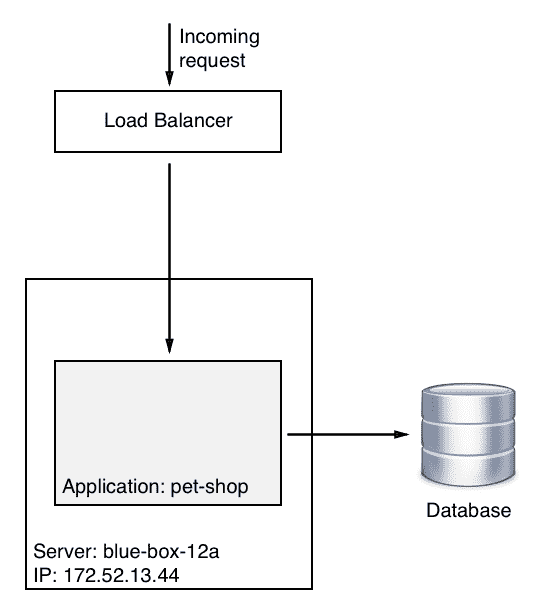
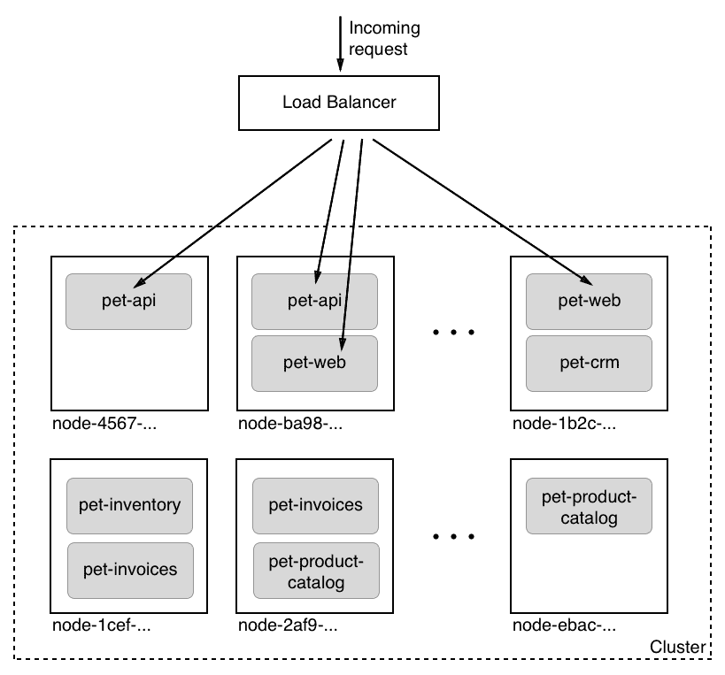
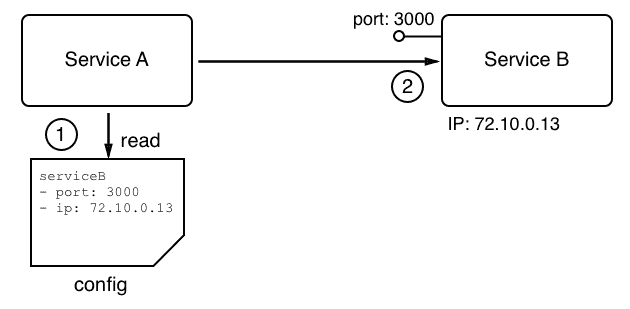
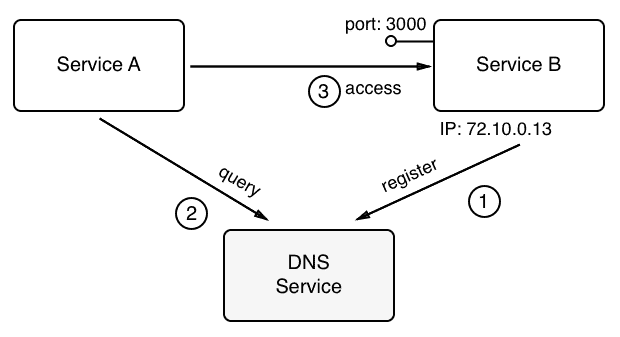
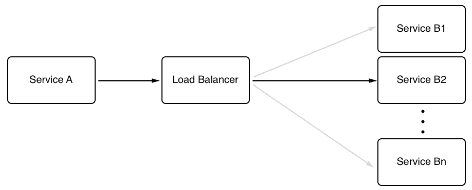
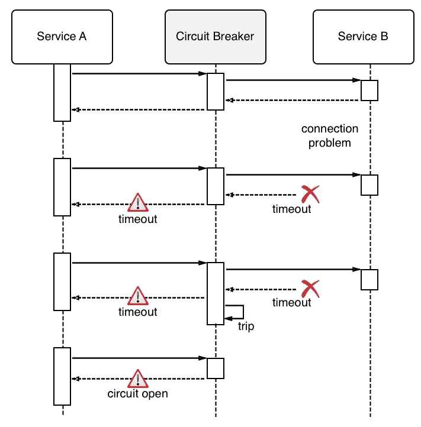
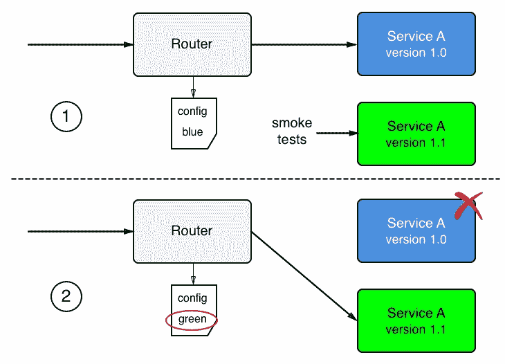
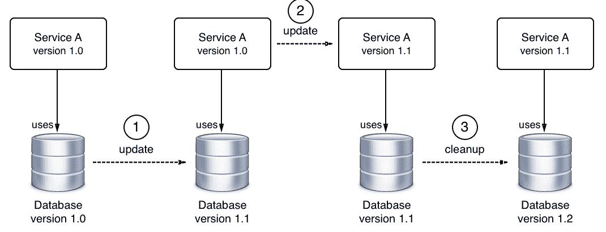

# 六、分布式应用架构

在前一章中，我们学习了如何使用 Docker 卷来保持已创建或已修改的状态，以及如何在容器中运行的应用之间共享数据。我们还学习了如何处理 Docker 守护程序生成的事件，并清理未使用的资源。

在本章中，我们介绍了分布式应用架构的概念，并讨论了成功运行分布式应用所需的各种模式和最佳实践。最后，我们将讨论在生产中运行这样的应用需要满足的附加要求。

在本章中，我们将涵盖以下主题:

*   什么是分布式应用架构？
*   模式和最佳实践
*   投入生产

完成本章后，您将能够执行以下操作:

*   说出分布式应用架构的至少四个特征
*   说出至少四种需要为生产就绪的分布式应用实现的模式

# 什么是分布式应用架构？

在本节中，我们将详细解释当我们谈论分布式应用架构时，我们的意思是什么。首先，我们需要确保我们使用的所有单词或首字母缩略词都有意义，并且我们都在说同一种语言。

# 定义术语

在这一章和随后的章节中，我们将谈论很多可能不是每个人都熟悉的概念。为了确保我们都使用相同的语言，让我们简要介绍和描述其中最重要的概念或单词:

| **虚拟机** | 虚拟机的缩写。这是一台虚拟计算机。 |
| **节点** | 用于运行应用的单个服务器。这可以是物理服务器，通常称为**裸机**，也可以是虚拟机。节点可以是大型机、超级计算机、标准业务服务器，甚至是树莓 Pi。节点可以是公司自己的数据中心或云中的计算机。通常，节点是集群的一部分。 |
| **集群** | 由网络连接的一组节点，用于运行分布式应用。 |
| **网络** | 集群的各个节点和这些节点上运行的程序之间的物理和软件定义的通信路径。 |
| **港口** | 应用(如 web 服务器)监听传入请求的通道。 |
| **服务** | 不幸的是，这是一个非常超载的术语，它的真正含义取决于它的使用环境。如果我们在应用(如应用服务)的上下文中使用术语*服务*，那么它通常意味着这是一个实现一组有限功能的软件，然后由应用的其他部分使用。随着本书的深入，我们将讨论定义略有不同的其他类型的服务。 |

天真地说，分布式应用架构是单片应用架构的对立面，但先看看这种单片架构并不是没有道理的。传统上，大多数业务应用都是以这样一种方式编写的，即结果可以被视为一个单一的、紧密耦合的程序，运行在数据中心某处的命名服务器上。它的所有代码都被编译成一个二进制文件或几个紧密耦合的二进制文件，这些文件在运行应用时需要位于同一位置。在这种情况下，运行应用的服务器(或者更一般的主机)具有定义明确的名称或静态 IP 地址也很重要。让我们看下面的图表来更清楚地说明这种类型的应用架构:

Monolithic application architecture

在上图中，我们看到一个名为**的蓝色盒子-12a** 的服务器，其 IP 地址为`172.52.13.44`，运行一个名为**宠物店**的应用，该应用由一个主模块和几个紧密耦合的库组成。

现在，让我们看看下图:

Distributed application architecture

在这里，突然之间，我们不再只有一个命名服务器，而是有很多，它们没有人性化的名称，而是一些唯一的标识，可以是类似于**通用唯一标识符** ( **UUID** )的东西。突然之间，宠物店应用不再由单一的整体块组成，而是由大量交互但松散耦合的服务组成，例如**宠物 api** 、**宠物网络**和**宠物库存**。此外，每个服务都在服务器或主机群集中的多个实例中运行。

你可能想知道为什么我们在一本关于 Docker 容器的书中讨论这个，你问得对。虽然我们将要研究的所有主题都同样适用于容器尚不存在的世界，但重要的是要认识到容器和容器编排引擎有助于以更高效、更直接的方式解决所有问题。过去在分布式应用架构中很难解决的大多数问题在容器化的世界中变得非常简单。

# 模式和最佳实践

分布式应用架构有许多引人注目的好处，但与单一应用架构相比，它也有一个非常显著的缺点——前者要复杂得多。为了驯服这种复杂性，业界提出了一些重要的最佳实践和模式。在接下来的章节中，我们将更详细地探讨一些最重要的问题。

# 松散耦合的组件

解决一个复杂问题的最好方法一直是把它分成更容易处理的小问题。举个例子，一步建成一所房子是极其复杂的。用简单的部件建造房子要容易得多，然后再组合成最终的结果。

这同样适用于软件开发。如果我们将一个非常复杂的应用划分成互操作的更小的组件，并一起组成整个应用，那么开发这个应用会容易得多。现在，如果这些组件只是松散地相互耦合，那么单独开发它们就容易得多。这意味着组件 A 对组件 B 和 C 的内部工作方式不做任何假设，而只对如何通过定义良好的接口与这两个组件进行通信感兴趣。如果每个组件都有一个定义良好且简单的公共接口，通过该接口可以与系统中的其他组件和外部世界进行通信，那么这就使我们能够单独开发每个组件，而不会隐含地依赖于其他组件。在开发过程中，系统中的其他组件可以被存根或模拟代替，以允许我们测试我们的组件。

# 有状态与无状态

每个有意义的业务应用都创建、修改或使用数据。数据也称为状态。创建或修改持久数据的应用服务称为有状态组件。典型的有状态组件是数据库服务或创建文件的服务。另一方面，不创建或修改持久数据的应用组件称为无状态组件。

在分布式应用架构中，无状态组件比有状态组件更容易处理。无状态组件可以很容易地放大和缩小。它们还可以在群集的完全不同的节点上快速、轻松地拆除和重新启动，所有这些都是因为它们没有与之关联的持久数据。

考虑到这一事实，以一种大多数应用服务都是无状态的方式来设计系统是有帮助的。最好将所有有状态组件推到应用的边界，并限制它们的数量。管理有状态组件很难。

# 服务发现

当我们构建由许多相互通信的独立组件或服务组成的应用时，我们需要一种机制来允许独立组件在集群中找到彼此。找到对方通常意味着需要知道目标组件在哪个节点上运行，以及在哪个端口上监听通信。大多数情况下，节点由一个 IP 地址和一个端口来标识，这只是一个定义明确的范围内的数字。

技术上，我们可以告诉**服务 A** ，它想和一个目标**服务 B** 通信，目标的 IP 地址和端口是什么。例如，这可能通过配置文件中的一个条目发生:

Components are hardwired

虽然这在运行在一个或几个知名和精选的服务器上的单一应用的环境中可能非常有效，但是在分布式应用架构中，它完全崩溃了。首先，在这个场景中，我们有许多组件，手动跟踪它们变成了一场噩梦。它肯定是不可扩展的。此外，服务 A 通常应该或者永远不会知道其他组件在集群的哪个节点上运行。它们的位置甚至可能不稳定，因为由于应用外部的各种原因，组件 B 可能会从节点 X 移动到另一个节点 Y。因此，我们需要服务 A 找到服务 B 或者任何其他服务的另一种方法。最常用的是外部权威机构在任何给定时间知道系统的拓扑。该外部机构或服务知道当前属于集群的所有节点及其 IP 地址；它知道所有正在运行的服务及其运行位置。通常，这种服务被称为**域名服务**，其中**域名服务**代表**域名系统**。正如我们将看到的，Docker 有一个作为底层引擎的一部分实现的 DNS 服务。Kubernetes 还使用 DNS 服务来促进集群中运行的组件之间的通信:

Components consult an external locator service

在上图中，我们看到了服务 A 想要如何与服务 b 进行通信，但是它不能直接这样做；它必须首先向外部权威机构，一个注册服务，这里称为 a **DNS Service** ，查询服务 b 的去向，注册服务会用请求的信息进行回答，并分发服务 A 可以到达服务 b 的 IP 地址和端口号，然后服务 A 使用这些信息，并与服务 b 建立通信，当然，这是一个低层次上真实发生的事情的天真画面，但它是理解服务发现的架构模式的好画面。

# 按指定路线发送

路由是将数据包从源组件发送到目标组件的机制。路由分为不同的类型。人们使用所谓的现场视察模型(参见本章*进一步阅读*一节中的参考资料)来区分不同类型的路由。在容器和容器编排的上下文中，第 2、3、4 和 7 层的路由是相关的。我们将在后续章节中深入探讨路由的更多细节。在这里，我们只说第 2 层路由是最低级的路由类型，它将一个 MAC 地址连接到一个 MAC 地址，而第 7 层路由，也称为应用层路由，是最高级的路由。例如，后者用于将具有目标标识符(如`example.com/pets`的网址)的请求路由到我们系统中适当的目标组件。

# 负载平衡

每当服务 A 向服务 B 请求服务，但后者在多个实例中运行时，就会使用负载平衡，如下图所示:

Request of Service A load balanced to Service B 

如果我们的系统中运行着多个服务实例，比如服务 B，我们希望确保每个实例都获得相同数量的工作负载。这个任务是一个通用的任务，这意味着我们不希望调用者必须进行负载平衡，而是希望一个外部服务拦截该调用，并接管决定将该调用转发到哪个目标服务实例的部分。这个外部服务被称为**负载平衡器**。负载平衡器可以使用不同的算法来决定如何将传入的呼叫分配给目标服务实例。最常用的算法叫做循环法。该算法只是以重复的方式分配请求，从实例 1 开始，然后是实例 2，直到实例 *n* 。最后一个实例完成后，负载平衡器从实例号 1 开始。

# 防御性编程

为分布式应用开发服务时，一定要记住，该服务不是独立的，而是依赖于其他应用服务，甚至依赖于第三方提供的外部服务，例如信用卡验证服务或股票信息服务，仅举两个例子。所有这些其他服务都在我们正在开发的服务之外。我们无法控制它们在任何给定时间的正确性或可用性。因此，在编码时，我们总是需要假设最坏的情况，希望最好的情况。假设最坏的情况意味着我们必须明确处理潜在的失败。

# 重试次数

当外部服务可能暂时不可用或响应不足时，可以使用以下程序。当对另一个服务的调用失败或超时时，调用代码的结构应该使同一调用在短暂的等待时间后重复。如果呼叫再次失败，在下一次尝试之前，等待时间应该稍长一些。这些呼叫应该重复到最大次数，每次都增加等待时间。之后，服务应该放弃并提供一个降级的服务，这可能意味着返回一些过时的缓存数据或者根本没有数据，这取决于具体情况。

# 记录

应始终记录服务中的重要操作。日志信息需要分类才能具有真正的价值。常见的类别有调试、信息、警告、错误和致命。日志信息应该由中央日志聚合服务收集，而不是存储在集群的单个节点上。聚合日志易于解析和过滤相关信息。

# 错误处理

如前所述，分布式应用中的每个应用服务都依赖于其他服务。作为开发人员，我们应该总是做最坏的打算，并做好适当的错误处理。最重要的最佳实践之一是快速失败。对服务进行编码，以便尽早发现不可恢复的错误，如果检测到此类错误，则让服务立即失败。但是不要忘记将有意义的信息记录到 STDERR 或 STDOUT 中，开发人员或系统操作员以后可以使用这些信息来跟踪系统的故障。此外，向调用方返回一个有用的错误，尽可能准确地指出调用失败的原因。

快速失败的一个例子是总是检查调用者提供的输入值。*数值是否在预期范围内且完整？*如果没有，那么不要尝试继续处理，而是立即中止操作。

# 裁员

关键任务系统必须全天候可用。停机是不可接受的，因为它可能会导致公司机会或声誉的巨大损失。在高度分布式的应用中，许多相关组件中至少有一个出现故障的可能性是不可忽视的。可以说，问题不在于某个组件是否会发生故障，而在于什么时候会发生故障。

为了避免当系统中的许多组件之一出现故障时停机，系统的每个单独部分都需要冗余。这包括应用组件以及所有基础架构部分。这意味着，如果我们有一个支付服务作为我们应用的一部分，那么我们需要冗余地运行这个服务。最简单的方法是在集群的不同节点上运行这个服务的多个实例。这同样适用于边缘路由器或负载平衡器。我们承受不起这样的事情。因此，路由器或负载平衡器必须是冗余的。

# 健康检查

我们已经多次提到，在分布式应用架构中，由于它有许多部分，单个组件的故障很有可能发生，并且发生故障只是时间问题。因此，我们冗余地运行系统的每个组件。代理服务然后在服务的各个实例之间负载平衡流量。

但是现在又出现了另一个问题。*代理或路由器如何知道某个服务实例是否可用？*可能已经崩溃，也可能没有反应。为了解决这个问题，人们使用所谓的健康检查。代理或代表代理的一些其他系统服务定期轮询所有服务实例并检查它们的运行状况。问题基本上是*你还在吗？* *你健康吗？*每个服务的答案要么是*是*要么是*否*，或者如果实例不再响应，则运行状况检查超时。

如果组件回答*否*或发生超时，则系统会终止相应的实例，并在其位置旋转一个新实例。如果这一切都以完全自动化的方式发生，那么我们说我们有一个自动修复系统。

# 断路器模式

**断路器**是一种用于避免分布式应用由于许多重要组件的级联故障而停机的机制。断路器有助于避免一个失败的组件在多米诺骨牌效应中摧毁其他相关服务。像电气系统中的断路器一样，它通过中断电源线来保护房屋不会因有故障的插入式电器的故障而烧毁，分布式应用中的断路器会在服务 A 没有响应或出现故障时中断服务 B 的连接。

这可以通过将受保护的服务调用包装在断路器对象中来实现。此对象监视故障。一旦故障次数达到某个阈值，断路器就会跳闸。对断路器的所有后续调用都将返回一个错误，根本不进行受保护的调用:

Circuit breaker pattern

# 投入生产

为了在生产中成功运行分布式应用，我们需要考虑前面几节中介绍的最佳实践和模式之外的一些方面。脑海中浮现的一个特定领域是自省和监控。让我们详细讨论最重要的方面。

# 记录

一旦分布式应用投入生产，就不可能对其进行调试。但是我们如何才能找出*用户报告的应用故障的根本原因到底是什么？*解决这个问题的办法是产生丰富而有意义的测井信息。开发人员需要以输出有用信息的方式来检测他们的应用服务，例如当发生错误或遇到潜在的意外或不想要的情况时。通常，这些信息被输出到 STDOUT 和 STDERR，然后由系统守护程序从那里收集，这些守护程序将信息写入本地文件或将其转发到中央日志聚合服务。

如果日志中有足够的信息，开发人员可以使用这些日志来跟踪系统中已报告错误的根本原因。

在具有许多组件的分布式应用体系结构中，日志记录甚至比单片应用更重要。通过应用的所有组件执行单个请求的路径可能非常复杂。此外，请记住组件分布在一群节点上。因此，记录所有重要的事情是有意义的，在每个日志条目中添加一些东西，例如发生的确切时间、发生的组件以及组件运行的节点等。此外，日志信息应该集中在一个中心位置，以便开发人员和系统操作员可以轻松地进行分析。

# 描摹

跟踪用于发现单个请求是如何通过分布式应用传递的，以及整个请求和每个组件花费了多少时间。如果收集了这些信息，可以将其用作显示系统行为和运行状况的仪表板的来源之一。

# 监视

操作员喜欢让仪表板显示系统的实时关键指标，这样可以一目了然地显示应用的整体运行状况。这些指标可以是非功能性指标，例如内存和 CPU 使用情况、系统或应用组件的崩溃次数、节点的运行状况等，也可以是功能性指标，因此是特定于应用的指标，例如订购系统中的结帐次数或库存服务中的缺货项目数。

大多数情况下，用于聚合仪表板数字的基础数据是从日志信息中提取的。这可以是主要用于非功能性指标的系统日志，也可以是用于功能性指标的应用级日志。

# 应用更新

公司的竞争优势之一是能够及时对不断变化的市场形势做出反应。其中一部分是能够快速调整应用，以满足新的和变化的需求，或者添加新的功能。我们更新应用的速度越快越好。如今，许多公司每天多次推出新功能或更改功能。

由于应用更新如此频繁，这些更新必须是非破坏性的。升级时，我们不能让系统停机维护。这一切都必须无缝透明地进行。

# 滚动更新

更新应用或应用服务的一种方式是使用滚动更新。这里的假设是，必须更新的特定软件在多个实例中运行。只有这样，我们才能使用这种类型的更新。

发生的情况是，系统停止当前服务的一个实例，并用新服务的实例替换它。一旦新实例准备好了，它将获得流量。通常，新实例会被监视一段时间，以查看它是否按预期工作，如果工作正常，当前服务的下一个实例将被关闭，并由新实例替换。重复这种模式，直到所有服务实例都被替换。

由于在任何给定时间总是有一些实例在运行，无论是当前的还是新的，所以应用一直都在运行。不需要停机。

# 蓝绿色部署

在蓝绿色部署中，应用服务的当前版本，称为*蓝色*，处理所有的应用流量。然后，我们在生产系统上安装名为*绿色*的新版本应用服务。新服务尚未与应用的其余部分连接。

一旦安装了绿色，就可以对这种新服务执行冒烟测试，如果测试成功，路由器就可以配置为将以前变为蓝色的所有流量汇集到新服务绿色。然后仔细观察绿色的行为，如果满足所有成功标准，蓝色可以退出使用。但是，如果出于某种原因，绿色显示一些意外或不需要的行为，路由器可以重新配置，将所有流量返回到蓝色。然后可以移除并修复绿色，并使用修正后的版本执行新的蓝绿色部署:

Blue-green deployment

# 金丝雀释放

加那利版本是我们将应用服务的当前版本和新版本并行安装在系统上的版本。因此，它们类似于蓝绿色部署。起初，所有流量仍然通过当前版本路由。然后，我们配置一个路由器，使其将总流量的一小部分，比如 1%，汇集到新版本的应用服务中。然后密切监视新服务的行为，以发现它是否如预期的那样工作。如果成功的所有标准都得到满足，那么路由器被配置为通过新服务传输更多的流量，比如这次是 5%。同样，新服务的行为受到密切监控，如果成功，越来越多的流量将被路由到它，直到我们达到 100%。一旦所有流量都被路由到新服务，并且它已经稳定了一段时间，旧版本的服务就可以退出使用。

*为什么我们称之为金丝雀释放？*它是以煤矿工人的名字命名的，他们会用金丝雀作为矿井的预警系统。金丝雀对有毒气体特别敏感，如果这种金丝雀死亡，矿工们知道他们必须立即放弃矿井。

# 不可逆的数据变化

如果我们的更新过程的一部分是在我们的状态中执行一个不可逆的改变，比如在一个支持关系数据库中的一个不可逆的模式改变，那么我们需要特别小心地解决这个问题。如果使用正确的方法，可以在不停机的情况下执行这些更改。重要的是要认识到，在这种情况下，不能在对数据进行更改的同时，在数据存储中部署需要新数据结构的代码更改。相反，整个更新必须分为三个不同的步骤。第一步，推出向后兼容的模式和数据变更。如果成功，则在第二步中推出新代码。同样，如果成功了，我们将在第三步中清理模式，并消除向后兼容性:

Rolling out an irreversible data or schema change

# 反转

如果我们对在生产环境中运行的应用服务进行频繁更新，这些更新中的一个迟早会出现问题。也许一个开发人员在修复一个 bug 时，引入了一个新的 bug，这个 bug 没有被所有的自动化测试(也可能是手动测试)捕获，所以应用运行不正常，我们必须将服务回滚到以前的好版本。在这方面，回滚是从灾难中恢复。

同样，在分布式应用架构中，问题不在于是否需要回滚，而在于何时需要回滚。因此，我们需要绝对确保我们总能回滚到组成我们应用的任何服务的早期版本。回滚不能是事后的想法，而必须是我们部署过程中经过测试和验证的一部分。

如果我们使用蓝绿色部署来更新我们的服务，那么回滚应该相当简单。我们只需要将路由器从新的绿色服务版本切换回以前的蓝色版本。

# 摘要

在本章中，我们学习了什么是分布式应用架构，以及成功运行分布式应用需要哪些模式和最佳实践。最后，我们讨论了在生产中运行这样的应用还需要什么。

在下一章中，我们将深入探讨仅限于单个主机的网络。我们将详细讨论位于同一主机上的容器如何相互通信，以及外部客户端如何在必要时访问容器化的应用。

# 问题

请回答以下问题，以评估您对本章内容的理解。

1.  分布式应用架构中的每个部分何时以及为什么都必须是冗余的？用几句简短的话解释一下。
2.  为什么我们需要 DNS 服务？用 3 到 5 句话解释。
3.  什么是断路器，为什么需要它？
4.  单体应用和分布式或多服务应用之间有哪些重要区别？
5.  什么是蓝绿色部署？

# 进一步阅读

以下文章提供了更深入的信息:

*   *http://bit.ly/1NU1sgW 断路器*
*   *现场视察模型解释了[http://bit.ly/1UCcvMt](https://bit.ly/2BIRpJY)的*
*   *蓝绿部署*在[http://bit.ly/2r2IxNJ](http://bit.ly/2r2IxNJ)