# 单主机网络

在最后一章中，我们了解了在处理分布式应用程序架构时使用的最重要的架构模式和最佳实践。

在本章中，我们将以桥接网络的形式介绍 Docker 容器网络模型及其单主机实现。本章还介绍了软件定义网络的概念以及如何使用它们来保护容器化应用程序的安全。最后，它展示了集装箱港口如何向公众开放，从而使集装箱化的组件可以向外界开放。

本章将包含以下主题:

*   集装箱网络模型
*   网络防火墙
*   桥接网络
*   主机网络
*   零网络
*   在现有网络命名空间中运行
*   港口管理

完成本模块后，您将能够执行以下操作:

*   起草容器网络模型，以及白板上的所有基本组件
*   创建和删除自定义网桥网络
*   运行连接到自定义网桥网络的容器
*   检查桥接网络
*   通过在不同的桥接网络上运行容器，将它们相互隔离
*   将容器端口发布到您选择的主机端口

# 技术要求

对于本章，您唯一需要的是一个能够运行 Linux 容器的 Docker 主机。您可以使用装有 Docker for Mac 或 Windows 或 Docker 工具箱的笔记本电脑。

# 集装箱网络模型

到目前为止，我们已经使用了单个容器。但实际上，一个容器化的业务应用程序由几个容器组成，它们需要协作来实现一个目标。因此，我们需要一种方法让单个容器相互通信。这是通过建立我们可以用来在容器之间来回发送数据包的路径来实现的。这些路径被称为**网络**。Docker 定义了一个非常简单的网络模型，即所谓的**集装箱网络模型** ( **CNM** )，以指定任何实现集装箱网络的软件必须满足的要求。以下是 CNM 的图示:

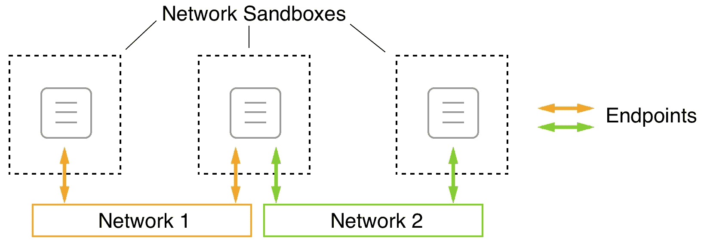

The Docker container network model

CNM 有三个要素——沙箱、端点和网络:

*   **沙盒:**沙盒完美地将一个容器与外界隔离开来。不允许入站网络连接进入沙盒容器。然而，如果绝对不可能与容器通信，那么容器在系统中就不太可能有任何价值。为了解决这个问题，我们有第二个元素，也就是端点。
*   **端点:**端点是从外部世界进入网络沙箱的受控网关，用于屏蔽容器。端点将网络沙箱(而不是容器)连接到模型的第三个元素，即网络。
*   **网络:**网络是将通信实例的数据包从一个端点传输到另一个端点，或者最终从一个容器传输到另一个容器的路径。

需要注意的是，网络沙箱可以有零到多个端点，或者换句话说，网络沙箱中的每个容器要么根本不连接到任何网络，要么可以同时连接到多个不同的网络。在上图中，三个网络沙箱的中间通过各自的端点连接到网络 1 和 2。

这种网络模型非常通用，并且没有指定相互通信的各个容器在网络上的运行位置。例如，所有容器可以在同一个主机(本地)上运行，也可以分布在多个主机(全局)上。

当然，CNM 只是描述容器之间网络如何工作的一个模型。为了能够使用我们的容器联网，我们需要 CNM 的真正实现。对于本地和全球范围，我们有多个 CNM 实现。在下表中，我们简要概述了现有的实现及其主要特征。名单没有特别的顺序:

| **网络** | **公司** | **范围** | **描述** |
| 桥 | 码头工人 | 当地的 | 基于 Linux 网桥的简单网络，允许在单个主机上联网 |
| Macvlan | 码头工人 | 当地的 | 在单个物理主机接口上配置多个第 2 层(即 MAC)地址 |
| 覆盖物 | 码头工人 | 全球的 | 基于**虚拟可扩展局域网** ( **VXLan** )的多节点集装箱网络 |
| 编织网 | 编织厂 | 全球的 | 简单、灵活、多主机的 Docker 网络 |
| 网络插件 | 加拿大白鲑 | 全球的 | 开源容器网络 |

Docker 不直接提供的所有网络类型都可以作为插件添加到 Docker 主机中。

# 网络防火墙

Docker 一直有“安全第一”的口头禅。这一理念直接影响了如何在单一和多主机 Docker 环境中设计和实现网络。软件定义的网络创建起来既容易又便宜，但是它们完美地防火墙了从其他未连接的容器和外部世界连接到该网络的容器。属于同一个网络的所有容器都可以自由地相互通信，而其他容器则没有这样做的手段:

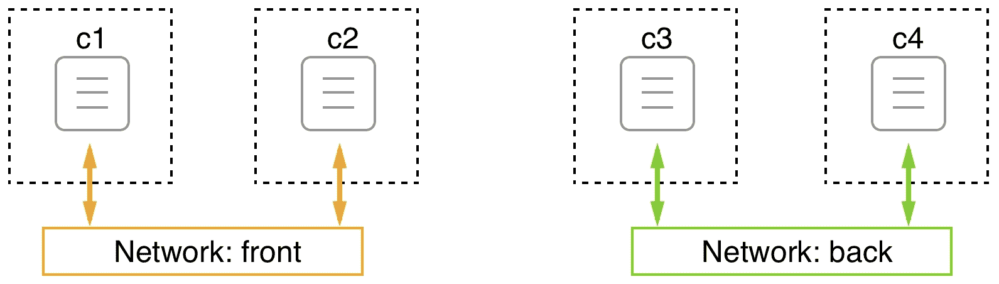

Docker networks

在上图中，我们有两个网络，分别叫做**前**和**后**。连接到前端网络的有集装箱 **c1** 和 **c2** ，连接到后端网络的有集装箱 **c3** 和 **c4** 。 **c1** 和 **c2** 可以自由通信，同样 **c3** 和 **c4** 也可以。但是 **c1** 和 **c2** 无法与 **c3** 或 **c4** 通信，反之亦然。

现在，如果我们有一个由三个服务组成的应用程序，即 **webAPI** 、**产品目录**和**数据库**，情况会怎样？我们希望 webAPI 能够与 productCatalog 通信，但不能与数据库通信，我们希望 productCatalog 能够与数据库服务通信。我们可以通过将 webAPI 和数据库放在不同的网络上，并将 productCatalog 附加到这两个网络上来解决这种情况，如下图所示:

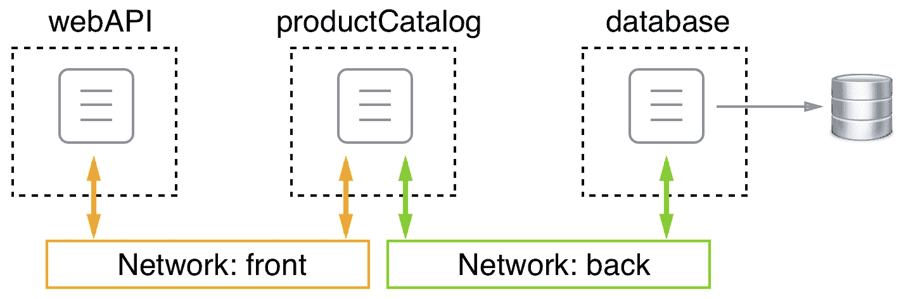

Container attached to multiple networks

由于创建 sdn 很便宜，并且每个网络都通过隔离资源以防止未经授权的访问来提供额外的安全性，因此强烈建议您设计和运行应用程序，以便它们使用多个网络，并且只在绝对需要相互通信的同一网络上运行服务。在前面的例子中，web API 组件绝对不需要直接与数据库服务通信，所以我们将它们放在不同的网络上。如果最坏的情况发生了，黑客破坏了网络应用编程接口，那么如果不首先入侵产品目录服务，他们就无法从那里访问数据库。

# 桥接网络

Docker 桥网络是我们将详细讨论的容器网络模型的第一个实现。这个网络实现是基于 Linux 桥的。当 Docker 守护进程第一次运行时，它会创建一个 Linux 桥并调用它`docker0`。这是默认行为，可以通过更改配置来更改。Docker 然后用这个 Linux 网桥创建一个网络，并调用网桥。我们在 Docker 主机上创建的并且没有显式绑定到另一个网络的所有容器都会导致 Docker 自动连接到该桥接网络。

为了验证我们的主机上确实定义了一个名为`bridge``bridge`类型的网络，我们可以使用以下命令列出主机上的所有网络:

```
$ docker network ls
```

这将提供类似于以下内容的输出:

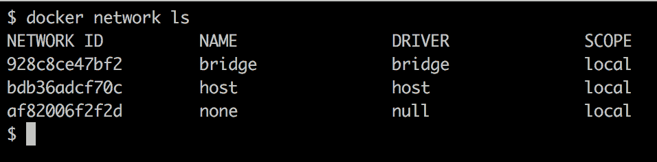

Listing of all Docker networks available by default

在您的例子中，标识会有所不同，但是输出的其余部分看起来应该是一样的。我们确实有一个名为`bridge`的第一个使用驱动程序`bridge`的网络。`local`的范围只是意味着这种类型的网络仅限于单个主机，不能跨越多个主机。在后面的章节中，我们还将讨论具有全局范围的其他类型的网络，这意味着它们可以跨越整个主机集群。

现在，让我们更深入地了解一下这个桥接网络是怎么回事。为此，我们将使用 Docker `inspect`命令:

```
$ docker network inspect bridge
```

执行时，它会输出一大块关于所讨论网络的详细信息。这些信息应该如下所示:

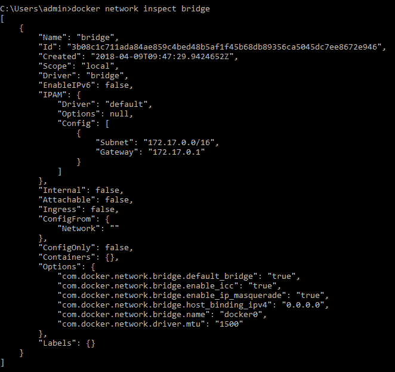

Output generated when inspecting the Docker bridge network

当我们列出所有网络时，我们已经看到了`ID`、`Name`、`Driver`和`Scope`的值，所以这不是什么新鲜事。但是我们来看看**的 IP 地址管理** ( **IPAM** )块。IPAM 是一种软件，用于跟踪计算机上使用的 IP 地址。`IPAM`块中的重要部分是`Config`节点，其值为`Subnet`和`Gateway`。默认情况下，桥接网络的子网定义为`172.17.0.0/16`。这意味着所有连接到该网络的容器将获得一个由 Docker 分配的 IP 地址，该地址取自给定的范围，即`172.17.0.2`到`172.17.255.255`。`172.17.0.1`地址是为该网络的路由器保留的，该路由器在该类型网络中的角色由 Linux 网桥承担。可以预期，Docker 将连接到该网络的第一个容器将获得`172.17.0.2 `地址。所有后续容器将获得更高的编号；下图说明了这一事实:

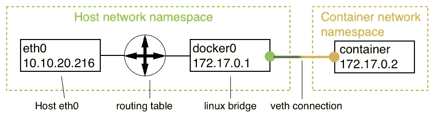

The bridge network

在上图中，我们可以看到主机的网络命名空间，其中包括主机的`eth0`端点，如果 Docker 主机在裸机上运行，则该端点通常是 NIC，如果 Docker 主机是 VM，则是虚拟 NIC。到主机的所有流量都通过`eth0`来。Linux 网桥负责主机网络和网桥网络子网之间的网络流量路由。

默认情况下，只允许来自出口的流量，所有入口都被阻止。这意味着，尽管集装箱化的应用程序可以到达互联网，但任何外部流量都无法到达。每个连接到网络的容器都有自己的虚拟以太网与网桥的连接。下图说明了这一点:

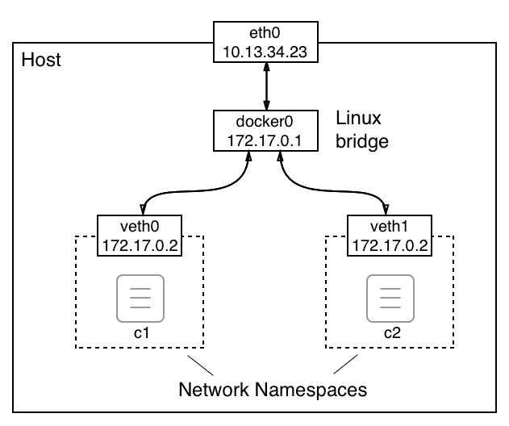

Details of the bridge network

上图从主人的角度向我们展示了这个世界。我们将在本节的后面部分探讨容器中的情况。

我们不仅仅局限于`bridge`网络，因为 Docker 允许我们定义自己的定制桥接网络。这不仅仅是一个值得拥有的特性，但建议的最佳实践是不要在同一个网络上运行所有容器，而是使用额外的桥接网络来进一步隔离不需要相互通信的容器。要创建名为`sample-net`的自定义网桥网络，请使用以下命令:

```
$ docker network create --driver bridge sample-net
```

如果我们这样做了，我们就可以检查 Docker 为这个新的定制网络创建了什么子网，如下所示:

```
$ docker network inspect sample-net | grep Subnet
```

这将返回以下值:

```
"Subnet": "172.18.0.0/16",
```

显然，Docker 刚刚为我们新的定制网桥网络分配了下一个空闲的 IP 地址块。如果出于某种原因，我们想在创建网络时指定我们自己的子网范围，我们可以通过使用`--subnet`参数来实现:

```
$ docker network create --driver bridge --subnet "10.1.0.0/16" test-net
```

为了避免因重复的 IP 地址而产生冲突，请确保避免创建子网重叠的网络。

既然我们已经讨论了什么是桥接网络以及如何创建自定义桥接网络，我们想了解如何将容器附加到这些网络。首先，让我们交互式地运行一个 Alpine 容器，而不指定要连接的网络:

```
$ docker container run --name c1 -it --rm alpine:latest /bin/sh
```

在另一个终端窗口，让我们检查`c1`容器:

```
$ docker container inspect c1
```

在大量的输出中，让我们暂时集中在提供网络相关信息的部分。可以在`NetworkSettings`节点下找到。我在以下输出中列出了它:

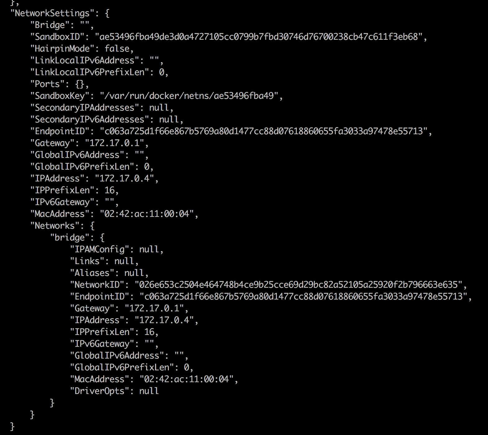

Network settings section of the container metadata

在前面的输出中，我们可以看到由于`NetworkID`等于`026e65...`，所以容器确实是附着在`bridge`网络上的，从前面的代码中我们可以看到这是`bridge`网络的 ID。我们还可以看到容器按照预期分配了`172.17.0.4`的 IP 地址，网关在`172.17.0.1`。请注意，该容器还有一个与之相关的`MacAddress`。这很重要，因为 Linux 网桥使用 Mac 地址进行路由。

到目前为止，我们已经从容器网络名称空间的外部着手处理这个问题。现在，让我们看看当我们不仅在容器内，而且在容器的网络命名空间内时的情况。在`c1`容器内部，让我们使用`ip`工具来检查发生了什么。运行`ip addr`命令，观察如下产生的输出:

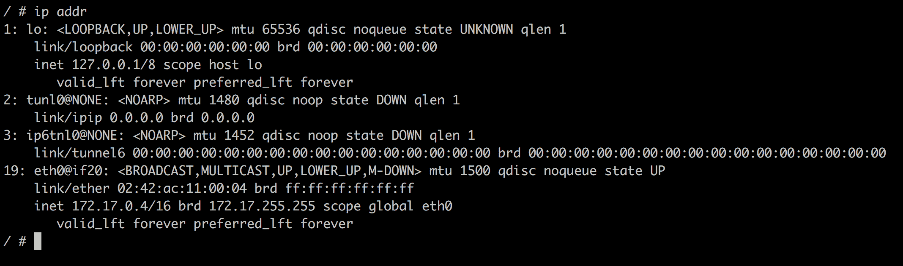

Container namespace as seen by the IP tool

前面输出的有趣部分是数字`19`，即`eth0`端点。Linux 桥在容器命名空间外部创建的`veth0`端点被映射到容器内部的`eth0`。从名称空间内部看，Docker 总是将容器网络名称空间的第一个端点映射到`eth0`。如果网络名称空间附加到附加网络，则该端点将被映射到`eth1`，以此类推。

由于此时我们对除`eth0`以外的任何端点都不感兴趣，因此我们可以使用该命令的更具体的变体，它将为我们提供以下内容:

```
/ # ip addr show eth0
195: eth0@if196: <BROADCAST,MULTICAST,UP,LOWER_UP,M-DOWN> mtu 1500 qdisc noqueue state UP
 link/ether 02:42:ac:11:00:02 brd ff:ff:ff:ff:ff:ff
 inet 172.17.0.2/16 brd 172.17.255.255 scope global eth0
 valid_lft forever preferred_lft forever
```

在输出中，我们还可以看到 Docker 已经将什么 MAC 地址(`02:42:ac:11:00:02`)和什么 IP ( `172.17.0.2`)与这个容器网络命名空间相关联。

我们还可以通过使用`ip route`命令获得一些关于如何路由请求的信息:

```
/ # ip route
default via 172.17.0.1 dev eth0
172.17.0.0/16 dev eth0 scope link src 172.17.0.2
```

该输出告诉我们所有在`172.17.0.1`到达网关的流量都是通过`eth0 `设备路由的。

现在，让我们在同一个网络上运行另一个名为`c2`的容器:

```
$ docker container run --name c2 -d alpine:latest ping 127.0.0.1
```

由于我们没有指定任何其他网络，因此`c2`容器也将连接到`bridge`网络。它的 IP 地址将是子网中的下一个空闲地址，也就是`172.17.0.3`，我们可以很容易地测试到:

```
$ docker container inspect --format "{{.NetworkSettings.IPAddress}}" c2
172.17.0.3
```

现在，我们有两个容器连接到`bridge`网络。我们可以尝试再次检查这个网络，以在输出中找到所有附加到它的容器的列表。：

```
$ docker network inspect bridge
```

信息位于`Containers`节点下:

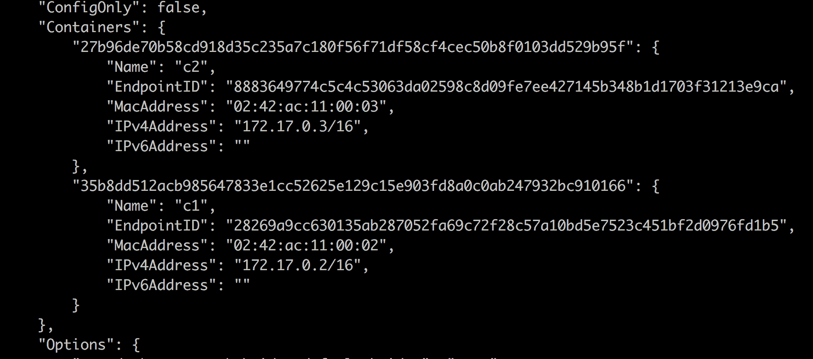

The containers section of the output of docker network inspect bridge

为了可读性，我们再次将输出缩短为要点。

现在，让我们创建两个额外的容器，`c3`和`c4`，并将它们连接到`test-net`。为此，我们使用`--network `参数:

```
$ docker container run --name c3 -d --network test-net \
 alpine:latest ping 127.0.0.1
$ docker container run --name c4 -d --network test-net \
 alpine:latest ping 127.0.0.1
```

让我们检查`network test-net`并确认容器`c3`和`c4`确实附着在上面:

```
$ docker network inspect test-net
```

这将为`Containers`部分提供以下输出:

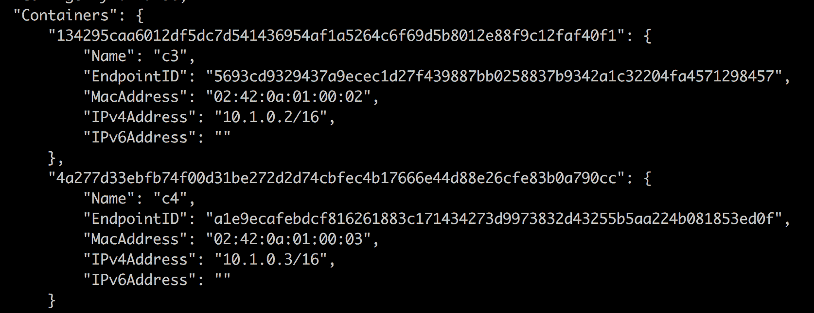

Containers section of the command docker network inspect test-net

我们要问自己的下一个问题是两个`c3`和`c4`容器是否可以自由地相互通信。为了证明确实如此，我们可以将`exec`放入`c3`容器中:

```
$ docker container exec -it c3 /bin/sh
```

一旦进入容器，我们可以尝试通过名称和 IP 地址 ping 容器`c4`:

```
/ # ping c4
PING c4 (10.1.0.3): 56 data bytes
64 bytes from 10.1.0.3: seq=0 ttl=64 time=0.192 ms
64 bytes from 10.1.0.3: seq=1 ttl=64 time=0.148 ms
...
```

以下是使用容器的 IP 地址进行 ping 操作的结果`c4`:

```
/ # ping 10.1.0.3
PING 10.1.0.3 (10.1.0.3): 56 data bytes
64 bytes from 10.1.0.3: seq=0 ttl=64 time=0.200 ms
64 bytes from 10.1.0.3: seq=1 ttl=64 time=0.172 ms
...
```

这两种情况下的答案都向我们证实，连接到同一网络的容器之间的通信工作正常。事实上，我们甚至可以使用我们想要连接的容器的名称，这向我们表明 Docker DNS 服务提供的名称解析在这个网络中是有效的。

现在，我们希望确保`bridge`和`test-net`网络相互之间有防火墙。为了演示这一点，我们可以尝试从`c3`容器 ping`c2`容器，通过它的名称或它的 IP 地址:

```
/ # ping c2
ping: bad address 'c2'
```

以下是使用目标容器的 IP 地址进行 ping 操作的结果`c2`:

```
/ # ping 172.17.0.3
PING 172.17.0.3 (172.17.0.3): 56 data bytes 
^C
--- 172.17.0.3 ping statistics ---
43 packets transmitted, 0 packets received, 100% packet loss
```

前面的命令仍然悬而未决，我不得不用 *Ctrl* + *C* 终止命令。从 pinging】的答案中，我们也可以看到名称解析并不能跨网络工作。这是意料之中的行为。网络为容器提供了额外的隔离层，从而提供了安全性。

之前，我们了解到一个容器可以连接到多个网络。让我们将一个`c5`容器同时连接到`sample-net`和`test-net`网络:

```
$ docker container run --name c5 -d \
 --network sample-net \
 --network test-net \
 alpine:latest ping 127.0.0.1
```

然后，我们可以测试`c5`是否可以从`c2`容器到达，就像我们测试容器`c4`和`c2`一样。结果将显示连接确实有效。

如果我们想删除一个现有的网络，我们可以使用`docker network rm`命令，但是请注意，不能意外删除一个连接了容器的网络:

```
$ docker network rm test-net
Error response from daemon: network test-net id 863192... has active endpoints
```

在继续之前，让我们清理并移除所有容器:

```
$ docker container rm -f $(docker container ls -aq)
```

然后，我们删除我们创建的两个自定义网络:

```
$ docker network rm sample-net
$ docker network rm test-net
```

# 主机网络

有些情况下，我们希望在主机的网络命名空间中运行容器。当我们需要在用于分析或调试主机网络流量的容器中运行一些软件时，这可能是必要的。但是请记住，这些都是非常具体的场景。在容器中运行业务软件时，没有充分的理由运行连接到主机网络的各个容器。出于安全原因，强烈建议您不要在生产或类似生产的环境中运行连接到主机网络的任何此类容器。

也就是说，*如何在主机的网络命名空间内运行容器？*只需将容器连接到`host`网络:

```
$ docker container run --rm -it --network host alpine:latest /bin/sh
```

如果我们现在使用`ip`工具从容器内部分析网络名称空间，我们将看到我们得到的图片与我们直接在主机上运行`ip`工具得到的图片完全相同。例如，如果我检查主机上的`eth0`设备，我会得到以下信息:

```
/ # ip addr show eth0
2: eth0: <BROADCAST,MULTICAST,UP,LOWER_UP> mtu 1500 qdisc pfifo_fast state UP qlen 1000
 link/ether 02:50:00:00:00:01 brd ff:ff:ff:ff:ff:ff
 inet 192.168.65.3/24 brd 192.168.65.255 scope global eth0
 valid_lft forever preferred_lft forever
 inet6 fe80::c90b:4219:ddbd:92bf/64 scope link
 valid_lft forever preferred_lft forever
```

这里我发现`192.168.65.3`是主机已经分配的 IP 地址，这里显示的 MAC 地址也对应着主机的 MAC 地址。

我们还可以检查路线，以获得以下(缩短的):

```
/ # ip route
default via 192.168.65.1 dev eth0 src 192.168.65.3 metric 202
10.1.0.0/16 dev cni0 scope link src 10.1.0.1
127.0.0.0/8 dev lo scope host
172.17.0.0/16 dev docker0 scope link src 172.17.0.1
...
192.168.65.0/24 dev eth0 scope link src 192.168.65.3 metric 202
```

在我让你进入本章的下一节之前，我想再次指出使用`host`网络是危险的，需要尽可能避免。

# 零网络

有时，我们需要运行一些根本不需要任何网络连接的应用程序服务或作业来执行任务。强烈建议您在连接到`none`网络的容器中运行这些应用程序。该容器将被完全隔离，因此不会受到任何外界的影响。让我们运行这样一个容器:

```
$ docker container run --rm -it --network none alpine:latest /bin/sh
```

一旦进入容器，我们就可以验证没有`eth0`网络端点可用:

```
/ # ip addr show eth0
ip: can't find device 'eth0'
```

也没有可用的路由信息，我们可以使用以下命令进行演示:

```
/ # ip route
```

这不返回任何东西。

# 在现有网络命名空间中运行

通常，Docker 会为我们运行的每个容器创建一个新的网络命名空间。容器的网络命名空间对应于我们前面描述的容器网络模型的沙箱。当我们将容器附加到网络时，我们定义了一个端点，它将容器网络命名空间与实际网络连接起来。这样，每个网络名称空间都有一个容器。

Docker 提供了一种额外的方法来定义容器运行的网络命名空间。当创建一个新的容器时，我们可以指定它应该附加到或者应该说包括在现有容器的网络命名空间中。使用这种技术，我们可以在单个网络命名空间中运行多个容器:

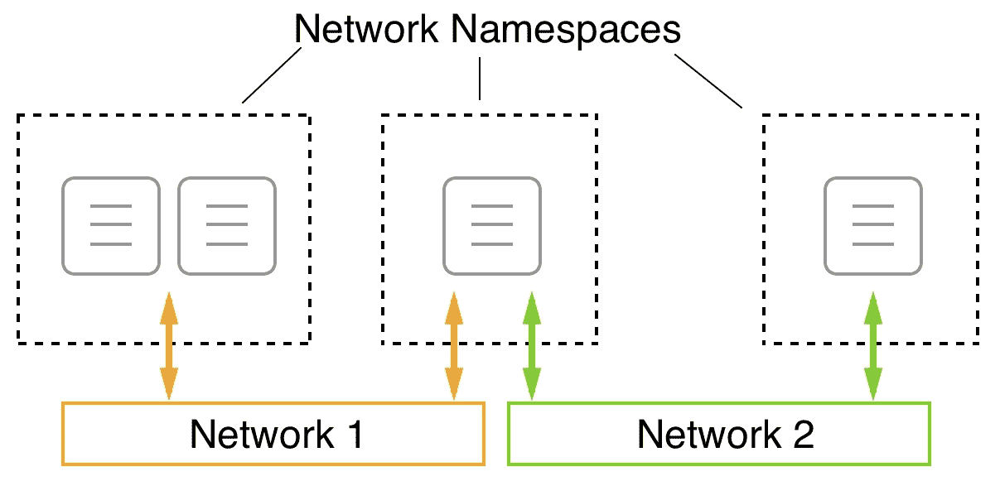

Multiple containers running in a single network namespace

在上图中，我们可以看到在最左边的网络名称空间中，我们有两个容器。这两个容器共享同一个名称空间，因此可以在本地主机上相互通信。网络名称空间(而不是单个容器)然后被附加到**网络 1** 。

当我们想要调试现有容器的网络而不在该容器内运行额外的进程时，这很有用。我们只需将一个特殊的实用程序容器附加到容器的网络命名空间中进行检查。Kubernetes 在创建 pod 时也使用了该功能。我们将在本书的后续章节中听到更多关于 Kubernetes 和 pods 的内容。

现在，让我们演示一下这是如何工作的。首先，我们创建一个新的桥接网络:

```
$ docker network create --driver bridge test-net
```

接下来，我们运行一个连接到该网络的容器:

```
$ docker container run --name web -d --network test-net nginx:alpine
```

最后，我们运行另一个容器，并将其连接到我们的`web`容器的网络:

```
$ docker container run -it --rm --network container:web alpine:latest /bin/sh
```

具体来说，注意我们如何定义网络:`--network container:web`。这告诉 Docker，我们的新容器将使用与名为`web`的容器相同的网络命名空间。

由于新容器与运行 Nginx 的 web 容器在同一个网络命名空间中，我们现在可以在 localhost 上访问 Nginx 了！我们可以通过使用`wget`工具来证明这一点，该工具是 Alpine 容器的一部分，用于连接到 Nginx。我们应该看到以下内容:

```
/ # wget -qO - localhost
<!DOCTYPE html>
<html>
<head>
<title>Welcome to nginx!</title>
...
</html>
```

请注意，为了可读性，我们缩短了输出。还请注意，运行连接到同一网络的两个容器和运行在同一网络命名空间中的两个容器之间有一个重要的区别。在这两种情况下，容器可以自由地相互通信，但是在后一种情况下，通信通过 localhost 进行。

要清理容器和网络，我们可以使用以下命令:

```
$ docker container rm --force web
$ docker network rm test-net
```

# 港口管理

既然我们知道了如何通过将容器放在不同的网络上来将它们相互隔离或防火墙，并且我们可以将一个容器连接到多个网络，那么我们就有一个问题尚未解决。*如何向外界公开一个应用服务？*想象一个容器运行一个网络服务器，托管我们以前的网络应用编程接口。我们希望来自互联网的客户能够访问这个应用编程接口。我们将其设计为一个可公开访问的应用编程接口。为了实现这一点，我们必须，形象地说，在我们的防火墙中打开一扇门，通过它我们可以将外部流量汇集到我们的应用编程接口。出于安全考虑，我们不只是想把门开得大一点，而是希望只有一个受控制的大门，让车流通过。

我们可以通过将容器端口映射到主机上的可用端口来创建这样的入口。我们还调用这个容器端口来发布一个端口。请记住，容器有自己的虚拟网络堆栈，主机也是如此。因此，容器端口和主机端口完全独立存在，默认情况下根本没有任何共同点。但是，我们现在可以将一个容器端口与一个免费的主机端口连接起来，并通过此链接汇集外部流量，如下图所示:

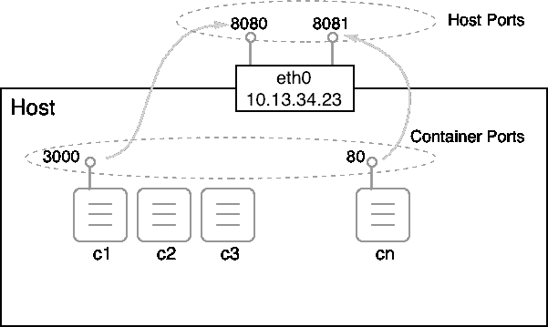

Mapping container ports to host ports

但是现在是演示如何将容器端口映射到主机端口的时候了。这是在创建容器时完成的。我们有不同的方法:

*   首先，我们可以让 Docker 决定我们的容器端口应该映射到哪个主机端口。Docker 将选择 32xxx 范围内的一个空闲主机端口。该自动映射通过使用`-P`参数完成:

```
$ docker container run --name web -P -d nginx:alpine
```

前面的命令在容器中运行 Nginx 服务器。Nginx 正在集装箱内的港口`80`监听。使用`-P`参数，我们告诉 Docker 将所有暴露的容器端口映射到 32xxx 范围内的自由端口。我们可以通过使用`docker container port`命令找到 Docker 正在使用的主机端口:

```
$ docker container port web
80/tcp -> 0.0.0.0:32768
```

Nginx 容器只公开了端口`80`，我们可以看到它已经映射到了主机端口`32768`。如果打开一个新的浏览器窗口，导航到`localhost:32768`，应该会看到下面的截图:

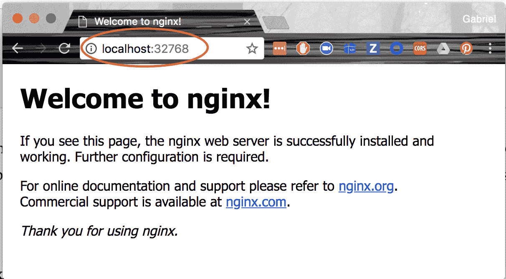

The welcome page of Nginx

*   找出 Docker 正在为我们的容器使用哪个主机端口的另一种方法是检查它。主机端口是`NetworkSettings`节点的一部分:

```
$ docker container inspect web | grep HostPort
32768
```

*   最后，获取这些信息的第三种方法是列出容器:

```
$ docker container ls
CONTAINER ID    IMAGE         ...   PORTS                  NAMES
56e46a14b6f7    nginx:alpine  ...   0.0.0.0:32768->80/tcp  web
```

请注意，在前面的输出中，`/tcp`部分告诉我们，端口已经打开，可以与 TCP 协议通信，但不能与 UDP 协议通信。TCP 是默认的，如果我们想要指定我们想要为 UDP 打开端口，那么我们必须显式地指定它。映射中的`0.0.0.0`告诉我们，来自任何主机 IP 地址的流量现在都可以到达`web`集装箱的集装箱港口`80`。

有时，我们希望将一个容器端口映射到一个非常特定的主机端口。我们可以通过使用参数`-p`(或`--publish`)来实现。让我们看看这是如何通过以下命令完成的:

```
$ docker container run --name web2 -p 8080:80 -d nginx:alpine
```

`-p`参数的值采用`<host port>:<container port>`的形式。因此，在前面的例子中，我们将集装箱港口`80`映射到主机港口`8080`。一旦`web2`容器运行，我们可以通过导航到`localhost:8080`在浏览器中测试它，我们应该会收到与我们在前面的例子中看到的处理自动端口映射的相同的 Nginx 欢迎页面。

当使用 UDP 协议通过某个端口进行通信时，`publish`参数看起来像`-p 3000:4321/udp`。请注意，如果我们希望允许通过同一个端口与 TCP 和 UDP 协议进行通信，那么我们必须分别映射每个协议。

# 摘要

在本章中，我们学习了在单个主机上运行的容器如何相互通信。首先，我们看了定义容器网络需求的 CNM，然后我们看了 CNM 的几个实现，比如桥接网络。然后，我们详细研究了桥接网络是如何工作的，以及 Docker 为我们提供了哪些关于网络和连接到这些网络的容器的信息。我们还学习了从容器外部和内部采用两种不同的视角。

在下一章中，我们将介绍 Docker Compose。我们将学习如何创建由多个服务组成的应用程序，每个服务都在一个容器中运行，以及 Docker Compose 如何允许我们使用声明性方法轻松构建、运行和扩展这样的应用程序。

# 问题

要评估您的技能，请尝试回答以下问题:

1.  说出**集装箱网络模型** ( **CNM** )的三个核心要素。
2.  您将如何创建一个名为前端的自定义桥接网络？
3.  你将如何运行两个 nginx:连接到前端网络的高山集装箱。
4.  对于前端网络，获取以下信息:
    1.  所有附加容器的 IPs。
    2.  与网络关联的子网。
5.  主机网络的目的是什么？
6.  说出一两个适合使用主机网络的场景。
7.  无网络的目的是什么？
8.  在什么情况下应该使用无网络？

# 进一步阅读

以下是一些更详细描述本章主题的文章:

*   *http://dockr.ly/2sXGzQn[码头工人网络概述](http://dockr.ly/2sXGzQn)*
*   *http://dockr.ly/2HJfQKn集装箱联网*
*   什么是 https://bit.ly/2HyC3Od 的桥
*   *在[http://dockr.ly/2BNxjRr](http://dockr.ly/2BNxjRr)使用桥接网络*
*   *在[http://dockr.ly/2ETjy2x](http://dockr.ly/2ETjy2x)使用 Macvlan 网络*
*   *在[http://dockr.ly/2F4aI59](http://dockr.ly/2F4aI59)使用主机网络*联网