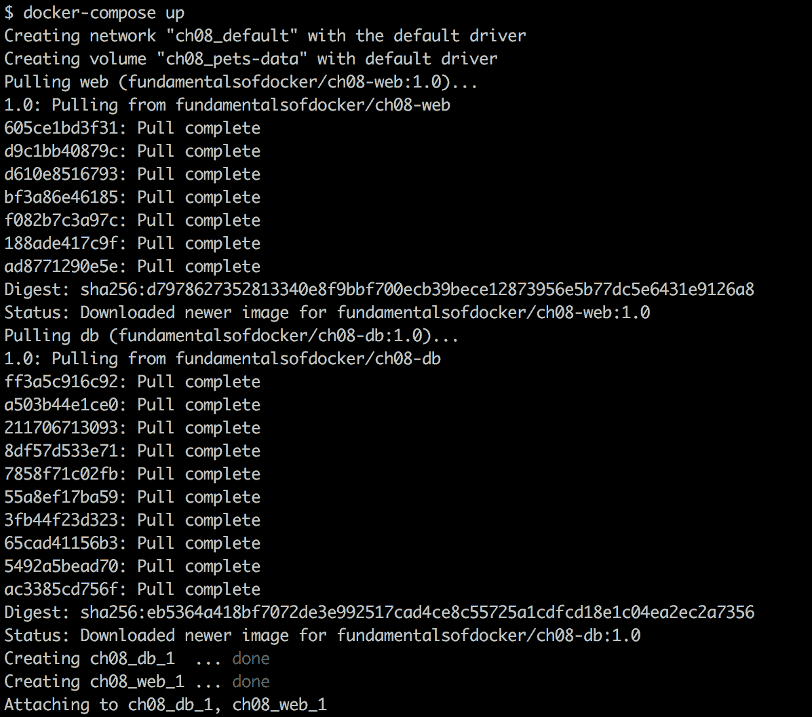
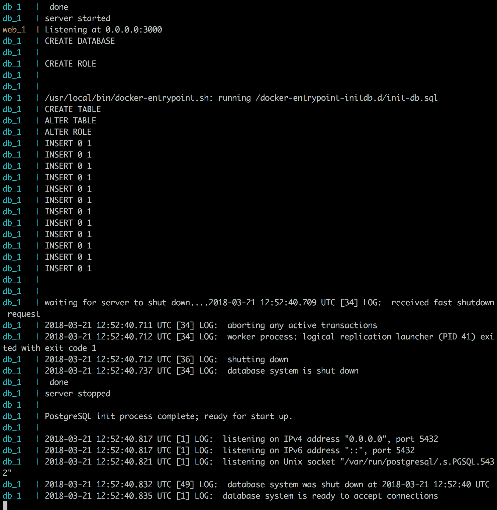
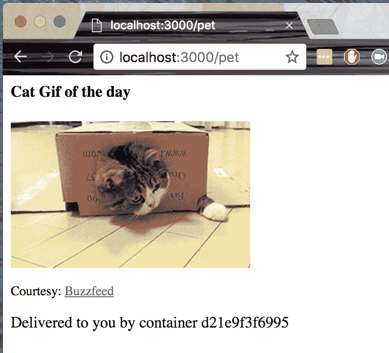
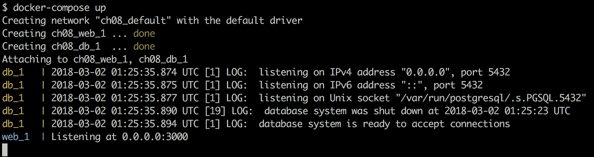
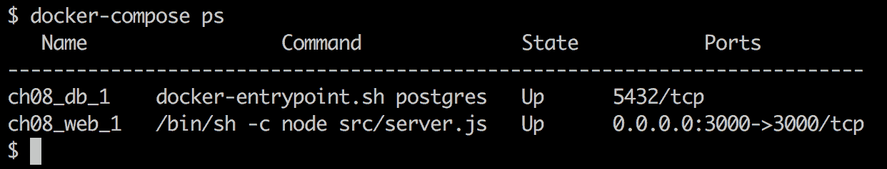
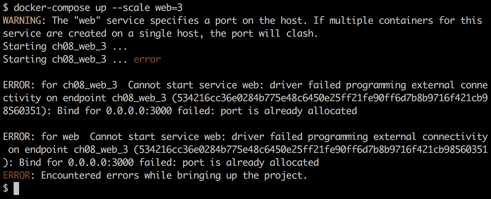
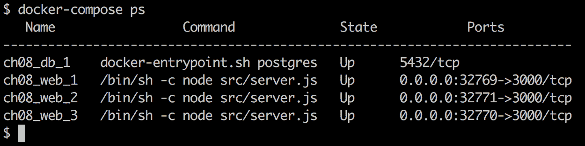

# 八、Docker 组合

在前一章中，我们学习了很多关于容器网络如何在单个 Docker 主机上工作的知识。我们引入了**容器网络模型** ( **CNM** )，它构成了 Docker 容器之间所有网络的基础，然后我们深入研究了 CNM 的不同实现，特别是桥接网络。

本章介绍了由多个服务组成的应用的概念，每个服务都在一个容器中运行，以及 Docker Compose 如何允许我们使用声明性方法轻松构建、运行和扩展这样的应用。

本章涵盖以下主题:

*   揭秘陈述句和祈使句
*   运行多服务应用
*   扩展服务
*   构建和推送应用

完成本章后，读者将能够执行以下操作:

*   用几个简短的句子解释定义和运行应用的命令式和声明式方法之间的主要区别
*   用他们自己的话描述容器和 Docker Compose 服务之间的区别
*   为一个简单的多服务应用编写一个 Docker 撰写 YAML 文件
*   使用 Docker Compose 构建、推送、部署和拆除一个简单的多服务应用
*   使用 Docker Compose 可上下扩展应用服务

# 技术要求

本章随附的代码可在[https://github . com/原教旨主义 docker/labs/tree/master/ch08](https://github.com/fundamentalsofdocker/labs/tree/master/ch08)上找到。

# 揭秘陈述句和祈使句

Docker Compose 是 Docker 提供的工具，主要用于需要运行和编排在单个 Docker 主机上运行的容器的地方。这包括但不限于开发、**持续集成** ( **CI** )、自动化测试和人工 QA。

Docker Compose 使用 YAML 格式的文件作为输入。默认情况下，Docker Compose 期望这些文件被称为`docker-compose.yml`，但其他名称也是可能的。据说`docker-compose.yml`的内容是描述和运行可能由多个容器组成的容器化应用的*声明性*方式。

那么，*陈述句的意思是什么？*

首先，*陈述句*是*祈使句*的反义词。嗯，那没多大帮助。现在我已经介绍了另一个定义，我需要解释这两个定义:

*   **命令式:**这是一种我们可以通过指定系统必须遵循的确切程序来解决问题的方法。

如果我告诉像 Docker 守护程序这样的系统如何运行一个应用，那么这意味着我必须一步一步地描述系统必须做什么，以及如果发生一些意外情况它必须如何反应。我的指示必须非常明确和精确。我需要涵盖所有边缘病例以及如何治疗它们。

*   **声明式:**这是一种我们可以解决问题的方式，而不需要程序员指定要遵循的确切过程。

声明性方法意味着我告诉 Docker 引擎我对一个应用的期望状态是什么，它必须自己弄清楚如何实现这个期望状态，以及如果系统偏离它，如何协调它。

Docker 明确推荐在处理容器化应用时使用声明式方法。因此，Docker 编写工具使用了这种方法。

# 运行多服务应用

在大多数情况下，应用不仅仅由一个整体块组成，而是由几个协同工作的应用服务组成。使用 Docker 容器时，每个应用服务都在自己的容器中运行。当我们想要运行这样的多服务应用时，我们当然可以用众所周知的`docker container run`命令启动所有参与的容器。但这充其量是低效的。使用 Docker Compose 工具，我们可以在使用 YAML 格式的文件中以声明的方式定义应用。

我们来看看一个简单的`docker-compose.yml`文件的内容:

```
version: "3.5"
services:
  web:
    image: fundamentalsofdocker/ch08-web:1.0
    ports:
      - 3000:3000
  db:
    image: fundamentalsofdocker/ch08-db:1.0
    volumes:
      - pets-data:/var/lib/postgresql/data

volumes:
  pets-data:
```

文件中的行解释如下:

*   `version`:在这一行，我们指定想要使用的 Docker Compose 格式的版本。在撰写本文时，这是 3.5 版本。
*   `services`:在本节中，我们在`services`块中指定组成我们的应用的服务。在我们的示例中，我们有两个应用服务，我们称之为`web`和`db`:
    *   `web`:`web`服务正在使用来自 Docker Hub 的映像`fundamentalsofdocker/ch08-web:1.0`，并将容器端口`3000`发布到主机端口，也就是`3000`。
    *   `db`:另一方面，`db`服务使用的是图片`fundamentalsofdocker/ch08-db:1.0`，这是一个定制的 PostgreSQL 数据库。我们正在将名为`pets-data`的卷装入`db`服务的容器中。

*   `volumes`:任何服务使用的卷都必须在此部分声明。在我们的示例中，这是文件的最后一部分。应用第一次运行时，Docker 将创建一个名为`pets-data`的卷，然后在后续运行中，如果该卷仍然存在，它将被重用。当应用由于某种原因崩溃并不得不重新启动时，这可能很重要。然后，以前的数据仍然存在，并准备好由重新启动的数据库服务使用。

导航到`labs`文件夹的子文件夹`ch08`，并使用 Docker Compose 启动应用:

```
$ docker-compose up
```

如果我们输入前面的命令，那么该工具将假设在当前目录中必须有一个名为`docker-compose.yml`的文件，并且它将使用该文件运行。在我们的例子中，情况确实如此，应用将启动。我们应该看到如下输出:



Running the sample application, part 1



Running the sample application, part 2

前面的输出解释如下:

*   在输出的第一部分，我们可以看到 Docker Compose 是如何拉出构成我们的应用的两个映像的。接下来是网络`ch08_default`和卷`ch08_pets-data`的创建，然后是两个容器`ch08_web_1`和`ch08_db_1`，每个服务一个容器`web`和`db`。所有名称自动以父目录的名称作为 Docker Compose 的前缀，在这种情况下称为`ch08`。
*   之后，我们看到两个容器生产的原木。输出的每一行都方便地以服务的名称作为前缀，并且每个服务的输出都有不同的颜色。这里，最大的份额是由数据库产生的，只有一行来自`web`服务。

我们现在可以打开浏览器标签并导航到`localhost:3000/pet`。我们应该会收到一张漂亮的猫图片和一些关于它来自的容器的附加信息，如下面的截图所示:



The sample application in the browser

刷新浏览器几次，查看其他卡特彼勒映像。应用从一组 12 个映像中随机选择当前映像，这些映像的网址存储在数据库中。

由于应用以交互模式运行，因此我们运行 Docker Compose 的终端被阻止，我们可以通过按 *Ctrl* + *C* 取消应用。如果我们这样做，我们将看到以下内容:

```
^CGracefully stopping... (press Ctrl+C again to force)
Stopping ch08_web_1 ... done
Stopping ch08_db_1 ... done
```

我们会注意到数据库服务会立即停止，而 web 服务大约需要 10 秒钟。这样做的原因是数据库服务监听并响应 Docker 发送的`SIGTERM`信号，而 web 服务没有，因此 Docker 在 10 秒后将其杀死。

如果我们再次运行该应用，输出将会短得多:



Output of docker-compose up

这一次，我们不必下载映像，数据库也不必从头开始初始化，但它只是重用了上一次运行时卷`pets-data`中已经存在的数据。

我们也可以在后台运行应用。所有容器都将作为守护程序运行。为此，我们只需要使用`-d`参数，如下代码所示:

```
$ docker-compose up -d
```

Docker Compose 为我们提供了比`up`更多的命令。我们可以使用它来列出应用中的所有服务:



Output of docker-compose ps

这个命令类似于`docker container ls`，唯一的区别是它只列出了属于应用的容器。

要停止并清理应用，我们使用`docker-compose down`命令:

```
$ docker-compose down
Stopping ch08_web_1 ... done
Stopping ch08_db_1 ... done
Removing ch08_web_1 ... done
Removing ch08_db_1 ... done
Removing network ch08_default
```

如果我们还想删除数据库的卷，那么我们可以使用以下命令:

```
$ docker volume rm ch08_pets-data
```

*卷名中为什么有`ch08`前缀？*在`docker-compose.yml`文件中，我们已经调用了卷来使用`pets-data`。但是正如我们已经提到的，Docker Compose 用`docker-compose.yml`文件的父文件夹名称加上下划线作为所有名称的前缀。在这种情况下，父文件夹被称为`ch08`。

# 扩展服务

现在，让我们暂时假设我们的示例应用已经在网络上运行并且非常成功。很多人想看我们可爱的动物形象。所以现在我们面临一个问题，因为我们的应用已经开始变慢了。为了解决这个问题，我们希望运行 web 服务的多个实例。有了 Docker Compose，这很容易做到。

运行更多实例也称为纵向扩展。我们可以使用这个工具来扩展我们的`web`服务，比如说，扩展到三个实例:

```
$ docker-compose up --scale web=3
```

如果我们这样做，我们会大吃一惊。输出将类似于下面的截图:



Output of docker-compose --scale

web 服务的第二个和第三个实例无法启动。错误消息告诉我们为什么:我们不能多次使用同一个主机端口。当实例 2 和 3 试图启动时，Docker 意识到端口`3000`已经被第一个实例占用。*我们能做什么？*我们可以让 Docker 决定每个实例使用哪个主机端口。

如果在`compose`文件的`ports`部分，我们只指定了容器端口而忽略了主机端口，那么 Docker 会自动选择一个临时端口。让我们这样做:

1.  首先，让我们拆下应用:

```
$ docker-compose down
```

2.  然后，我们将`docker-compose.yml`文件修改如下:

```
version: "3.5"
services:
  web:
    image: fundamentalsofdocker/ch08-web:1.0
    ports:
      - 3000
  db:
    image: fundamentalsofdocker/ch08-db:1.0
    volumes:
      - pets-data:/var/lib/postgresql/data

volumes:
  pets-data:
```

3.  现在，我们可以再次启动应用，并在此之后立即进行扩展:

```
$ docker-compose up -d
$ docker-compose scale web=3
Starting ch08_web_1 ... done
Creating ch08_web_2 ... done
Creating ch08_web_3 ... done
```

4.  如果我们现在做一个`docker-compose ps`，应该会看到下面的截图:



Output of docker-compose ps

5.  如我们所见，每个服务都与不同的主机端口相关联。我们可以试着看看它们是否有效，例如使用`curl`。让我们测试第三个实例，`ch08_web_3`:

```
$ curl -4 localhost:32770
Pets Demo Application
```

答案`Pets Demo Application`告诉我们，实际上，我们的应用仍在按预期工作。为了确保万无一失，尝试一下另外两个例子。

# 构建和推送应用

我们也可以使用`docker-compose build`命令来构建底层`compose`文件中定义的应用的映像。但是为了使这个工作，我们必须将构建信息添加到`docker-compose`文件中。在文件夹中，我们有一个文件，`docker-compose.dev.yml`，其中已经添加了那些说明:

```
version: "3.5"
services:
  web:
    build: web
    image: fundamentalsofdocker/ch08-web:1.0
    ports:
      - 3000:3000
  db:
    build: database
    image: fundamentalsofdocker/ch08-db:1.0
    volumes:
      - pets-data:/var/lib/postgresql/data

volumes:
  pets-data:
```

请注意每项服务的`build`键。该键的值指示 Docker 期望在其中找到 Docker 文件以构建相应映像的上下文或文件夹。

让我们现在使用该文件:

```
$ docker-compose -f docker-compose.dev.yml build
```

`-f`参数将告诉 Docker 编写应用使用哪个编写文件。

要将所有映像推送到 Docker Hub，我们可以使用`docker-compose push`。我们需要登录到 Docker Hub，这样才能成功，否则推送时会出现认证错误。因此，在我的例子中，我做了以下事情:

```
$ docker login -u fundamentalsofdocker -p <password>
```

假设登录成功，那么我可以推送以下代码:

```
$ docker-compose -f docker-compose.dev.yml push
```

前面的命令将两个映像推送到 Docker Hub 上的账户`fundamentalsofdocker`。你可以在网址上找到这两张图片:[https://hub.docker.com/u/fundamentalsofdocker/](https://hub.docker.com/u/fundamentalsofdocker/)。

# 摘要

本章我们介绍了工具`docker-compose`。该工具主要用于在单个 Docker 主机上运行和扩展多服务应用。通常，开发人员和配置项服务器与单个主机一起工作，这两个主机是 Docker Compose 的主要用户。该工具使用 YAML 文件作为输入，这些文件以声明的方式包含应用的描述。

该工具还可以用于构建和推送映像以及许多其他有用的任务。本章附带的代码可以在`labs/ch08`中找到。

在下一章中，我们将介绍编排器。一个**指挥器**是一个基础设施软件，用于运行和管理集群中的容器化应用，它确保这些应用始终处于它们期望的状态。

# 问题

要评估您的学习进度，请回答以下问题:

1.  如何使用`docker-compose`在守护模式下运行应用？
2.  您将如何使用`docker-compose`显示正在运行的服务的详细信息？
3.  你将如何扩展一个特定的 web 服务，比如说，三个实例？

# 进一步阅读

以下链接提供了有关本章中讨论的主题的附加信息:

*   *YAML 官方网站*在[http://www.yaml.org/](http://www.yaml.org/)
*   坞站复合文档 at[http://docker . ly/1 fl 2 VQ 6](http://dockr.ly/1FL2VQ6)
*   *在[http://dockr.ly/2iHUpeX](http://dockr.ly/2iHUpeX)撰写文件版本 3 参考*