# Docker Swarm 简介

在最后一章，我们介绍了管弦乐队。就像管弦乐队中的指挥一样，管弦乐队确保我们所有的容器化应用服务能够很好地协同工作，并和谐地为一个共同的目标做出贡献。这样的管弦乐队有相当多的职责，我们已经详细讨论过了。最后，我们简要概述了市场上最重要的容器编排器。

本章介绍 Docker 的原生管弦乐手 **SwarmKit** 。它详细阐述了 SwarmKit 用来在本地集群或云中部署和运行分布式、弹性、健壮和高可用性应用的所有概念和对象。本章还介绍了如何通过使用**软件定义的网络** ( **SDN** )来隔离容器，从而确保应用的安全性。此外，本章还演示了如何在云中安装高可用性的 Docker Swarm。它引入了提供第 4 层路由和负载平衡的路由网格。最后，它演示了如何将由多个服务组成的第一个应用部署到群中。

这些是我们将在本章中讨论的主题:

*   体系结构
*   群集节点
*   堆栈、服务和任务
*   多主机联网
*   创建码头工人群
*   部署第一个应用
*   群体路由网格

完成本章后，您将能够:

*   在白板上勾画高度可用的 Docker Swarm 的基本部分
*   用两三句简单的话向感兴趣的外行解释什么是(群体)服务
*   在 AWS 中创建一个高可用性的 Docker Swarm，它由三个管理节点和两个工作节点组成
*   在 Docker Swarm 上成功部署了一个复制服务，如 Nginx
*   向上和向下扩展正在运行的 Docker Swarm 服务
*   检索复制的 Docker Swarm 服务的聚合日志
*   为至少包含两个交互服务的示例应用编写一个简单的堆栈文件
*   将堆栈部署到码头工人群中

# 体系结构

从 30，000 英尺的视角来看，Docker Swarm 的架构由两个主要部分组成——奇数个管理节点组成的 raft 共识组，以及通过八卦网络(也称为**控制平面**)相互通信的一组工作节点。下图说明了这种体系结构:

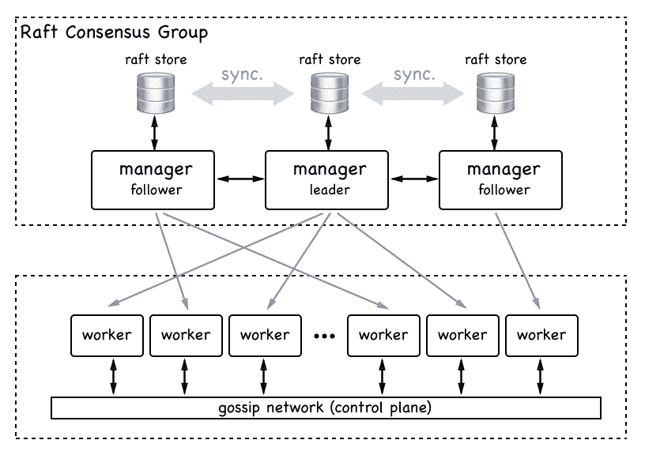

High-level architecture of a Docker Swarm

管理节点管理群，而工作节点执行部署到群中的应用。每个经理都有一份完整的本地筏式商店的蜂群状态副本。经理们以同步的方式相互交流，筏式商店总是同步的。

另一方面，出于可伸缩性的原因，工作人员彼此异步通信。一个群中可能有数百个(如果不是数千个)工作节点。现在我们已经对什么是码头工人群有了一个高层次的概述，让我们更详细地描述码头工人群的所有单个元素。

# 群集节点

群是节点的集合。我们可以将节点分类为物理计算机或**虚拟机** ( **虚拟机**)。如今，物理计算机通常被称为*裸机*。人们说*我们在裸机上运行*以区别于在虚拟机上运行。

当我们在这样一个节点上安装 Docker 时，我们称这个节点为 **Docker 主机**。下图更好地说明了什么是节点，什么是 Docker 主机:


Bare metal and VM type Docker Swarm nodes

要成为 Docker Swarm 的成员，节点还必须是 Docker 主机。Docker Swarm 中的节点可以有两种角色之一。可以是经理，也可以是工人。管理器节点顾名思义；他们管理蜂群。工作节点依次执行应用工作负载。

从技术上讲，管理器节点也可以是工作节点，因此可以运行应用工作负载，尽管不建议这样做，尤其是当群是运行任务关键型应用的生产系统时。

# 群体经理

每个 Docker Swarm 需要至少有一个管理器节点。出于高可用性的原因，群集中应该有多个管理器节点。对于生产或类似生产的环境尤其如此。如果我们有多个管理器节点，那么这些节点使用 **Raft 共识协议**一起工作。Raft 共识协议是一种标准协议，当多个实体需要一起工作并且总是需要就下一步执行哪个活动达成一致时，通常会使用该协议。

为了更好地工作，Raft 共识协议要求在所谓的**共识组**中有奇数个成员。因此，我们应该总是有 1、3、5、7 等管理器节点。在这样一个共识团体中，总有一个领导者。在 Docker Swarm 的情况下，启动群的第一个节点最初会成为领导者。如果领导者离开了，那么剩下的管理者节点会选出一个新的领导者。共识组中的其他节点称为**追随者**。

现在假设我们出于维护原因关闭了当前的 leader 节点。剩余的经理节点将选举新的领导。当前一个领导者节点重新上线时，他现在将成为一个追随者。新领导人仍然是领导人。

共识小组的所有成员以同步的方式相互交流。每当共识小组需要做出决定时，领导者会要求所有追随者达成一致。如果大多数管理者节点给出肯定的答案，那么领导者执行任务。这意味着，如果我们有三个经理节点，那么至少有一个追随者必须同意领导者的意见。如果我们有五个经理节点，那么至少有两个追随者必须同意。

由于所有的管理者追随者节点都必须与领导者节点同步通信才能在集群中做出决策，因此决策过程越慢，我们形成共识组的管理者节点就越多。Docker 的建议是为开发、演示或测试环境使用一个管理器。在小型到中型集群中使用三个管理器节点，在大型到特大型集群中使用五个管理器。在一群人中使用五个以上的经理几乎是不合理的。

管理节点不仅负责管理群，还负责维护群的状态。我们这样说是什么意思？当我们谈论群的状态时，我们指的是关于它的所有信息——例如，*群中有多少个节点*，*每个节点的属性是什么，例如名称或 IP 地址*。我们还指的是什么容器在群中的哪个节点上运行等等。另一方面，群的状态中不包括的是在群的容器中运行的应用服务产生的数据。这称为应用数据，绝对不是由管理器节点管理的状态的一部分:

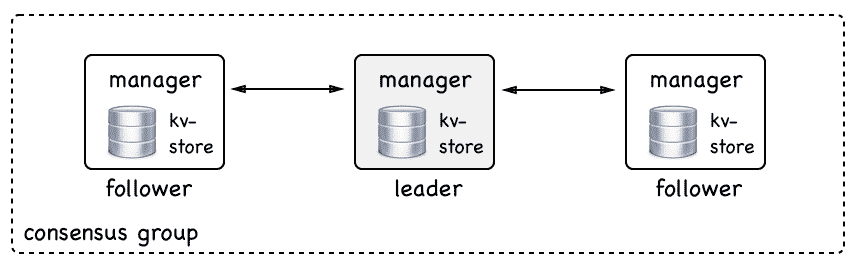

A swarm manager consensus group

所有群状态都存储在每个管理器节点上的高性能键值存储( **kv-store** )中。没错，每个管理器节点都存储了整个群状态的完整副本。这种冗余使得群体高度可用。如果一个管理器节点关闭，剩余的管理器都具有手边的完整状态。

如果一个新的管理器加入了共识组，那么它会将群状态与该组的现有成员同步，直到有一个完整的副本。这种复制在典型的集群中通常非常快，但是如果集群很大并且许多应用正在其上运行，则可能需要一段时间。

# 成群的工人

正如我们前面提到的，一个群工作节点意味着托管和运行包含我们感兴趣的在集群上运行的实际应用服务的容器。他们是群体中的主力。理论上，管理节点也可以是工作者。但是，正如我们已经说过的，不建议在生产系统上这样做。在生产系统中，我们应该让经理成为经理。

工作节点通过所谓的控制平面相互通信。他们使用八卦协议进行交流。这种通信是异步的，这意味着在任何给定的时间，不是所有的工作节点都必须完全同步。

现在您可能会问— *工作节点交换什么信息？*主要是服务发现和路由所需的信息，即关于哪些容器与节点一起运行的信息，等等:

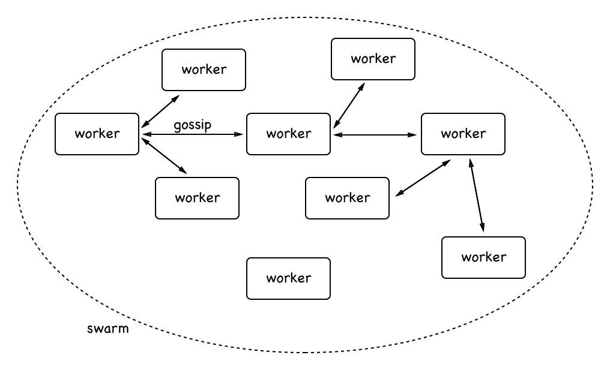

Worker nodes communicating with each other

在上图中，您可以看到工作人员如何相互交流。为了确保八卦在一个大群中能够很好地扩展，每个工作节点只与三个随机邻居同步自己的状态。对于那些熟悉大 0 符号的人来说，这意味着使用流言协议的工作节点的同步随着 O(0)而扩展。

工作者节点有点被动。除了运行管理节点分配给他们的工作负载，他们从不主动做其他事情。但是，工作人员确保尽最大能力运行这些工作负载。在本章的后面，我们将更详细地了解管理器节点具体分配给工作节点的工作负载。

# 堆栈、服务和任务

当使用 Docker Swarm 相对于单个 Docker 主机时，会有一个范例变化。我们不再谈论运行流程的单个容器，而是抽象出代表每个流程的一组副本的服务，并使之变得高度可用。我们也不再谈论我们部署容器的具有众所周知的名称和 IP 地址的单个 Docker 主机；我们现在指的是我们部署服务的主机集群。我们不再关心单个主机或节点。我们没有给它取一个有意义的名字；每个节点对我们来说都是一个数字。我们也不再关心单个容器以及它们部署在哪里——我们只关心通过服务定义一个期望的状态。我们可以尝试描述如下图所示:


Containers are deployed to well known servers

我们将容器 **web** 部署到带有 IP 地址`52.120.12.1`的服务器 **alpha** ，将容器**支付**部署到带有 IP 地址`52.121.24.33`的服务器 **beta** ，而不是将单个容器部署到像前面这样众所周知的服务器，而是切换到这种新的服务和集群范式(或者更一般地说，集群):

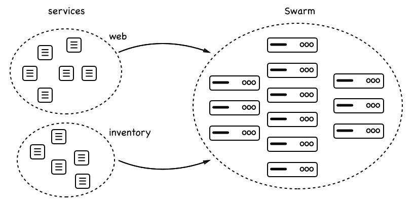

Services are deployed to swarms

在上图中，我们看到一个服务 **web** 和一个服务**库存**都被部署到由许多节点组成的集群中。每个服务都有一定数量的副本；六个用于网络，五个用于库存。我们并不真正关心副本将在哪个节点上运行，我们只关心请求数量的副本总是在群调度器决定将它们放在的任何节点上运行。

# 服务

群服务是一个抽象的东西。它是对我们希望在集群中运行的应用或应用服务的期望状态的描述。swarm 服务就像一个清单，描述了这样的事情:

*   服务名称
*   从中创建容器的映像
*   要运行的副本数量
*   服务容器所连接的网络
*   应该映射的端口

然后，让这个服务显示群管理器，确保所描述的期望状态总是一致的，如果实际状态偏离它的话。因此，例如，如果服务的一个实例崩溃，那么群管理器上的调度器在具有空闲资源的节点上调度服务的新实例，以便重新建立期望的状态。

# 工作

我们已经了解到，服务对应于应用服务应该一直处于的期望状态的描述。描述的一部分是服务应该运行的副本数量。每个副本由一个任务表示。就这一点而言，swarm 服务包含一组任务。在 Docker Swarm 上，任务是部署的原子单元。服务的每个任务都由群调度器部署到工作节点。该任务包含工作节点运行基于映像的容器所需的所有必要信息，这是服务描述的一部分。任务和容器之间是一对一的关系。容器是在工作节点上运行的实例，而任务是作为群服务的一部分的这个容器的描述。

# 堆

既然我们已经很好地了解了什么是群服务，什么是任务，我们就可以引入堆栈了。堆栈用于描述相关的群服务的集合，很可能是因为它们是同一个应用的一部分。从这个意义上说，我们也可以说堆栈描述了一个应用，它由一个到多个服务组成，我们希望在集群上运行这些服务。

通常，我们在使用 YAML 格式化的文本文件中声明性地描述堆栈，该文件使用与已知的 Docker 编写文件相同的语法。这就导致了人们有时会说堆栈是由`docker-compose`文件描述的情况。一个更好的措辞应该是——一个堆栈被描述在一个堆栈文件中，该文件使用类似于`docker-compose`文件的语法。

让我们尝试在下图中说明堆栈、服务和任务之间的关系，并将其与堆栈文件的典型内容联系起来:

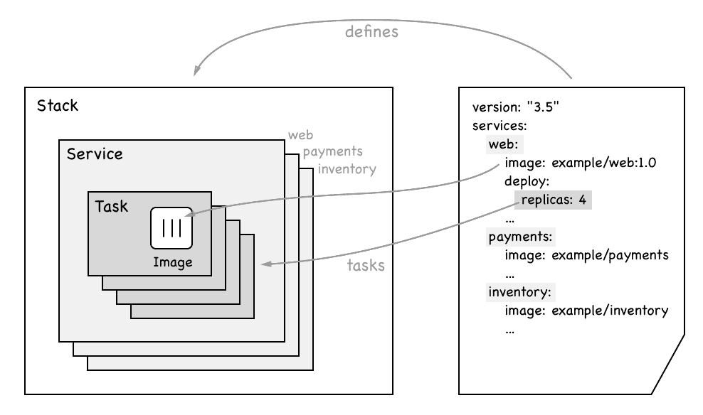

Diagram showing the relationship between stack, services and tasks

在上图中，我们在右侧看到了示例堆栈的声明性描述。这个堆栈由三个服务组成，分别是**网络**、**支付**和**库存**。我们还看到服务 **web** 使用了映像**示例/web:1.0** 并且有四个副本。

在图的左侧，我们看到堆栈包含了提到的三个服务。每个服务又包含一组任务，和副本一样多。在服务 **web** 的情况下，我们有四个任务的集合。每个任务都包含映像的名称，一旦任务在群节点上被调度，它将从映像实例化一个容器。

# 多主机联网

在第 7 章、*单主机网络、*中，我们讨论了容器如何在单个 Docker 主机上通信。现在，我们有一个由一群节点或 Docker 主机组成的集群。位于不同节点上的容器需要能够相互通信。有许多技术可以帮助人们实现这个目标。Docker 已选择为 Docker Swarm 实现覆盖网络驱动程序。这个覆盖网络允许连接到同一个**覆盖网络**的容器彼此发现并自由地相互通信。以下是覆盖网络的工作模式:

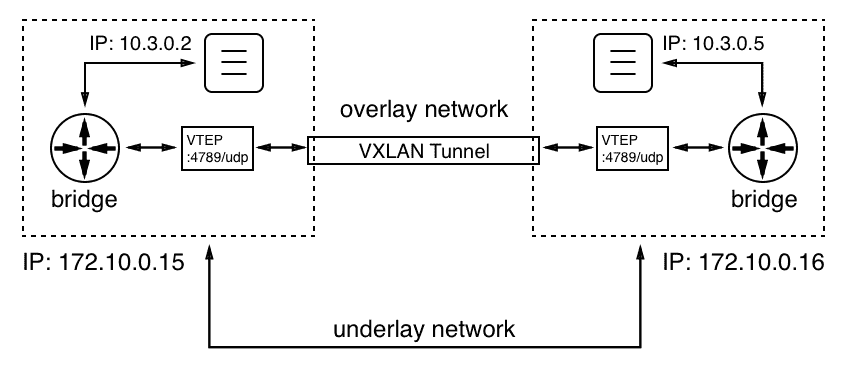

Overlay network

我们有两个节点或 Docker 主机，其 IP 地址为`172.10.0.15`和`172.10.0.16`。我们为 IP 地址选择的值并不重要；重要的是，两台主机都有一个不同的 IP 地址，并通过一个物理网络(网络电缆)连接，该网络称为底层网络。

在左侧的节点上，我们有一个使用 IP 地址`10.3.0.2`运行的容器，在右侧的节点上有另一个使用 IP 地址`10.3.0.5`的容器。现在，前一个容器想要与后一个容器通信。*这怎么可能发生？*在[第 7 章](07.html)、*单主机联网、*中，我们看到了当两个容器位于同一个节点上时，这是如何工作的；通过使用 Linux 桥。但是 Linux 桥只在本地运行，不能跨节点。所以，我们需要另一种机制。Linux VXLAN 来拯救。自从容器出现之前，VXLAN 就已经出现在 Linux 上了。

当左侧容器发送数据包时，网桥意识到数据包的目标不在该主机上。现在，参与覆盖网络的每个节点都获得一个所谓的 **VXLAN 隧道端点** ( **VTEP** )对象，该对象拦截数据包(此时的数据包是 OSI 第 2 层数据包)，用包含运行目标容器的主机的目标 IP 地址的报头包裹它(这使它现在成为 OSI 第 3 层数据包)，并通过 VXLAN 隧道发送它。隧道另一端的 VTEP 将数据包解包并转发给本地网桥，网桥再将数据包转发给目标容器。

叠加驱动程序包含在 SwarmKit 中，并且在大多数情况下是 Docker Swarm 推荐的网络驱动程序。第三方还有其他支持多节点的网络驱动程序，可以作为插件安装到每个参与的 Docker 主机上。经认证的网络插件可从 Docker 商店获得。

# 创建码头工人群

创建一个 Docker Swarm 几乎是微不足道的。这太容易了，如果一个人知道管弦乐队是怎么回事，那就显得不真实了。但这是真的，Docker 在使群集简单而优雅地使用方面做得非常出色。同时，Docker Swarm 已被大型企业证明非常健壮且可扩展。

# 创建本地单节点群

所以，别再幻想了，让我们演示一下如何创造一个群体。最简单的形式是，一个功能齐全的 Docker Swarm 只包含一个节点。如果你正在使用 Docker for Mac 或 Windows，或者即使你正在使用 Docker 工具箱，那么你的个人电脑或笔记本电脑就是这样一个节点。因此，我们可以从这里开始，展示蜂群的一些最重要的特征。

让我们初始化一个群。在命令行上，只需输入以下命令:

```
$ docker swarm init
```

经过一段令人难以置信的短暂时间后，您应该会看到如下截图:

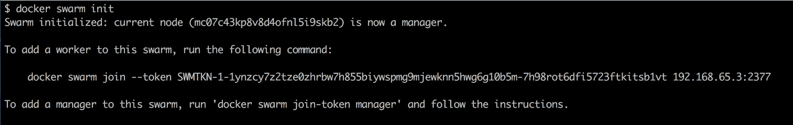

Output of the docker swarm init command

我们的计算机现在是一个群体节点。它的角色是经理，它是领导者(经理中的领导者，这很有意义，因为此时只有一个经理)。虽然只花了很短的时间就完成了`docker swarm init`，但是在那段时间里指挥部做了很多事情，其中有一些是:

*   它创建了根**证书颁发机构** ( **CA** )
*   它创建了一个键值存储，用来存储整个群体的状态

现在，在前面的输出中，我们可以看到一个命令，它可以用来将其他节点加入到我们刚刚创建的群中。命令如下:

```
$ docker swarm join --token <join-token> <IP address>:2377
```

这里:

*   `<join-token>`是群领袖在初始化群时生成的令牌
*   `<IP address>`是领导的 IP 地址

虽然我们的集群仍然很简单，因为它只有一个成员，但我们仍然可以要求 Docker CLI 列出集群的所有节点。这将类似于下面的截图:

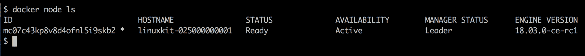

Listing the nodes of the Docker Swarm

在这个输出中，我们首先看到给节点的标识。ID 后面的星号(`*`)表示这是执行`docker node ls`的节点；基本上，说这是活动节点。然后我们有了节点的(人类可读的)名称、状态、可用性和管理器状态。如前所述，群的第一个节点自动成为领导者，如前面的截图所示。最后，我们看看我们使用的是哪个版本的 Docker 引擎。

要获得关于节点的更多信息，我们可以使用`docker node inspect`命令，如下图所示:

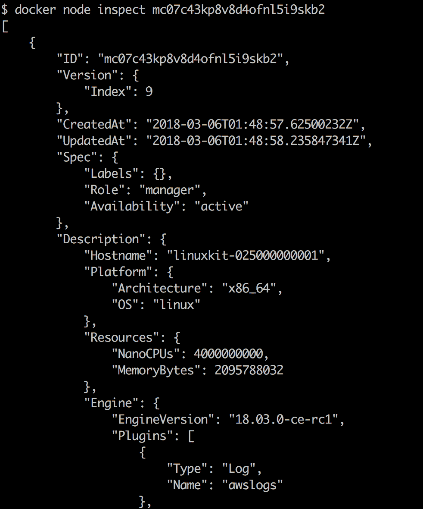

Truncated output of the command docker node inspect

这个命令生成了很多信息，所以我们只呈现了输出的截断版本。例如，当需要对行为不良的群集节点进行故障排除时，此输出可能会很有用。

# 在 VirtualBox 或 Hyper-V 中创建本地集群

有时候单个节点群是不够的，但是我们没有或者不想用一个账号在云中创建群。在这种情况下，我们可以在 VirtualBox 或 Hyper-V 中创建一个本地集群。在 VirtualBox 中创建集群比在 Hyper-V 中创建集群稍微容易一点，但是如果您使用的是 Windows 10 并且运行了 Docker for Windows，那么您就不能同时使用 VirtualBox。这两个虚拟机管理程序是互斥的。

假设我们的笔记本电脑上安装了 VirtualBox 和`docker-machine`。然后，我们可以使用`docker-machine`列出所有当前已定义并可能在 VirtualBox 中运行的 Docker 主机:

```
$ docker-machine ls
NAME      ACTIVE   DRIVER       STATE      URL    SWARM   DOCKER    ERRORS
default   -        virtualbox   Stopped                   Unknown
```

在我的例子中，我定义了一个名为`default`的虚拟机，该虚拟机当前已停止。我可以通过发出`docker-machine start default`命令轻松启动虚拟机。此命令需要一段时间，并将产生以下(缩短的)输出:

```
$ docker-machine start default
Starting "default"...
(default) Check network to re-create if needed...
(default) Waiting for an IP...
Machine "default" was started.
Waiting for SSH to be available...
Detecting the provisioner...
Started machines may have new IP addresses. You may need to re-run the `docker-machine env` command.
```

现在，如果我再次列出我的虚拟机，我应该会看到下面的截图:

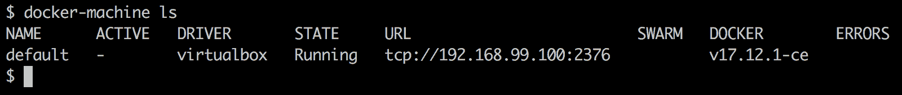

List of all VMs running in VirtualBox

如果我们还没有名为`default`的虚拟机，我们可以使用`create`命令轻松创建一个:

```
docker-machine create --driver virtualbox default
```

这将产生以下输出:


Output of docker-machine create

我们可以在前面的输出中看到`docker-machine` 如何从一个 ISO 映像创建 VM，定义 SSH 密钥和证书，并将它们复制到 VM 和本地`~/.docker/machine`目录，稍后当我们想要通过 Docker CLI 远程访问这个 VM 时，我们将在这里使用它。它还为新虚拟机提供了一个 IP 地址。

我们使用参数为`--driver virtualbox`的`docker-machine create`命令。Docker 机器还可以与其他驱动程序一起工作，如 Hyper-V、AWS、Azure、DigitalOcean 等。有关更多信息，请参见 docker-machine 的文档。默认情况下，新虚拟机会获得 1 GB 的相关内存，这足以将该虚拟机用作开发或测试群的节点。

现在，让我们为一个五节点群集创建五个虚拟机。我们可以使用一些脚本来减少手动工作:

```
$ for NODE in `seq 1 5`; do
  docker-machine create --driver virtualbox "node-${NODE}"
done
```

Docker 机器现在将创建五个名为`node-1`到`node-5`的虚拟机。这可能需要一些时间，所以这是给自己泡杯热茶的好时机。创建虚拟机后，我们可以列出它们:

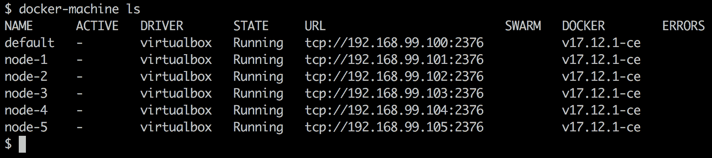

List of all VMs we need for the swarm

现在我们准备建造一个蜂群。从技术上讲，我们可以将 SSH 引入第一个虚拟机`node-1`并初始化一个群，然后将 SSH 引入所有其他虚拟机，并将它们加入群领导。但这是没有效率的。让我们再次使用一个脚本来完成所有的艰苦工作:

```
# get IP of Swarm leader
$ export IP=$(docker-machine ip node-1)
# init the Swarm
$ docker-machine ssh node-1 docker swarm init --advertise-addr $IP
# Get the Swarm join-token
$ export JOIN_TOKEN=$(docker-machine ssh node-1 \
    docker swarm join-token worker -q)
```

现在我们有了加入令牌和群领导的 IP 地址，我们可以要求其他节点加入群，如下所示:

```
$ for NODE in `seq 2 5`; do
  NODE_NAME="node-${NODE}"
  docker-machine ssh $NODE_NAME docker swarm join \
        --token $JOIN_TOKEN $IP:2377
done
```

为了使群体高度可用，我们现在可以提升，例如，`node-2`和`node-3`成为经理:

```
$ docker-machine ssh node-1 docker node promote node-2 node-3
Node node-2 promoted to a manager in the swarm.
Node node-3 promoted to a manager in the swarm.
```

最后，我们可以列出群的所有节点:

```
$ docker-machine ssh node-1 docker node ls
```

我们应该会看到下面的截图:

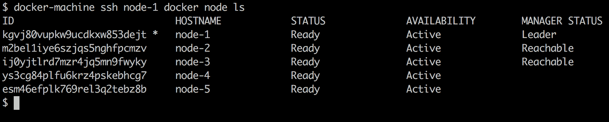

List of all the nodes of the Docker Swarm on VirtualBox

这证明我们刚刚在笔记本电脑或工作站上本地创建了一个高度可用的 Docker Swarm。让我们把所有的代码片段放在一起，让整个事情变得更加健壮。脚本如下所示:

```
alias dm="docker-machine"
for NODE in `seq 1 5`; do
  NODE_NAME=node-${NODE}
  dm rm --force $NODE_NAME
  dm create --driver virtualbox $NODE_NAME
done
alias dms="docker-machine ssh"
export IP=$(docker-machine ip node-1)
dms node-1 docker swarm init --advertise-addr $IP;
export JOIN_TOKEN=$(dms node-1 docker swarm join-token worker -q);
for NODE in `seq 2 5`; do
  NODE_NAME="node-${NODE}"
  dms $NODE_NAME docker swarm join --token $JOIN_TOKEN $IP:2377
done;
dms node-1 docker node promote node-2 node-3
```

前面的脚本首先删除(如果存在)，然后重新创建名为`node-1`到`node-5`的五个虚拟机，然后在`node-1`上初始化一个 Swarm。之后，剩余的四个虚拟机被添加到群中，最后，`node-2`和`node-3`被提升为经理状态，以使群高度可用。整个脚本执行不到 5 分钟，可以根据需要重复多次。完整的脚本可以在仓库中找到，在子文件夹`docker-swarm`中；它被称为`create-swarm.sh`

强烈建议始终编写脚本，从而实现操作自动化。

# 使用与多克一起玩(PWD)生成一个群

为了试验 Docker Swarm 而不必在我们的计算机上本地安装或配置任何东西，我们可以使用 PWD。PWD 是一个可以用浏览器访问的网站，它为我们提供了创建一个最多由五个节点组成的 Docker Swarm 的能力。顾名思义，它绝对是一个游乐场，我们可以使用它的时间仅限于每节课四个小时。我们可以打开任意多个会话，但每个会话会在四小时后自动结束。除此之外，这是一个功能齐全的 Docker 环境，非常适合修补 Docker 或演示一些功能。

让我们现在进入网站。在浏览器中，导航至网站[https://labs.play-with-docker.com](https://labs.play-with-docker.com)。您将看到一个欢迎和登录屏幕。使用您的码头工人身份证登录。成功登录后，您将看到一个屏幕，如下图所示:

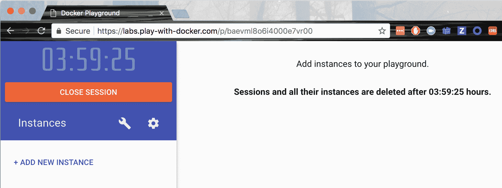

Play with Docker window

我们可以立即看到，有一个大计时器从四个小时开始倒计时。这就是我们在这堂课还剩多少时间。此外，我们看到一个+ ADD NEW INSTANCE 链接。单击它以创建新的 Docker 主机。当您这样做时，您的屏幕应该如下图所示:


PWD with one new node

在左侧，我们看到新创建的节点，它有自己的 IP 地址(`192.168.0.53`)和名称(`node1`)。在右侧，我们在屏幕的上半部分有一些关于这个新节点的附加信息，在下半部分有一个终端。是的，这个终端用于在我们刚刚创建的这个节点上执行命令。该节点安装了 Docker CLI，因此我们可以在其上执行所有熟悉的 Docker 命令，如`docker version`。试试看。

但是现在我们想创建一个 Docker Swarm。在浏览器的终端中执行以下命令:

```
$ docker swarm init --advertise-addr=eth0
```

由前面的命令生成的输出对应于我们之前在工作站上使用单节点集群和使用 VirtualBox 或 Hyper-V 的本地集群的试验中已经知道的内容。重要的信息再次是`join`命令，我们希望使用该命令将其他节点加入到我们刚刚创建的集群中。

您可能已经注意到，这次我们在群组`init`命令中指定了参数`--advertise-addr`。*为什么这里有这个必要？*原因是 PWD 生成的节点有多个关联的 IP 地址。通过在节点上执行命令`ip a`，可以很容易地验证这一点。该命令将向我们显示确实存在两个端点，`eth0`和`eth1`。因此，我们必须向新的群管理器明确指定我们想要使用哪一个。在我们的情况下，是`eth0`。

通过单击+添加新实例链接四次，在 PWD 创建另外四个节点。新节点将被称为`node2`、`node3`、`node4`和`node5`，并将全部列在左侧。如果单击左侧的某个节点，则右侧会显示相应节点的详细信息以及该节点的终端窗口。

选择每个节点(2 到 5)，并在各自的终端中执行从引导节点(`node1`)复制的`docker swarm join`命令:

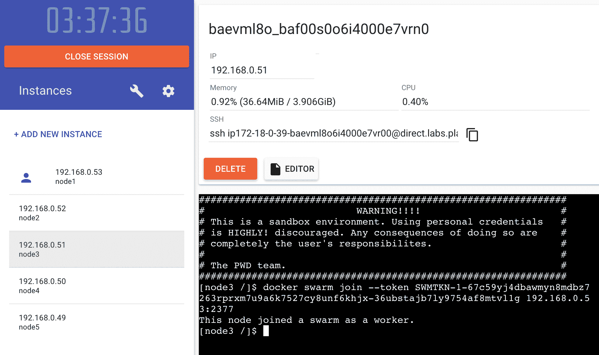

Joining a node to the swarm in PWD

一旦您将所有四个节点加入群，切换回`node1`并列出所有节点，不出所料，结果如下:

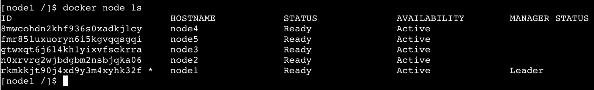

List of all the nodes of the swarm in PWD

还是在`node1`上，我们现在可以提升`node2`和`node3`，让蜂群高度可用:

```
$ docker node promote node2 node3
Node node2 promoted to a manager in the swarm.
Node node3 promoted to a manager in the swarm.
```

有了这些，我们在 PWD 的蜂群就可以接受工作量了。我们创建了一个高可用性的 Docker Swarm，它有三个管理节点，形成了一个 Raft 共识组和两个工作节点。

# 在云中创建码头工人群

到目前为止，我们创建的所有 Docker 群集都非常适合用于开发、实验或演示目的。但是，如果我们想创建一个可以用作生产环境的群，在其中运行我们的任务关键型应用，那么我们需要创建一个，我很想说，真正的云中或内部的群。在本书中，我们将演示如何在亚马逊 AWS 中创建一个 Docker Swarm。

创建集群的一种方法是使用 **Docker 机器** ( **DM** )。DM 有一个针对亚马逊 AWS 的驱动。如果我们在 AWS 上有一个账户，我们需要 AWS 访问密钥 ID 和 AWS 秘密访问密钥。我们可以将这两个值添加到名为`~/.aws/configuration`的文件中。它应该如下所示:

```
[default]
aws_access_key_id = AKID1234567890
aws_secret_access_key = MY-SECRET-KEY
```

每次我们运行`docker-machine create`，DM 都会在那个文件中查找那些值。关于如何获取 AWS 账号以及如何获取两个密钥的更深入的信息，请查阅此链接:[http://dockr.ly/2FFelyT](http://dockr.ly/2FFelyT)。

一旦我们有了一个 AWS 帐户，并且已经将访问密钥存储在配置文件中，我们就可以开始构建我们的群了。必要的代码看起来与我们在 VirtualBox 中本地机器上创建群时使用的代码完全相同。让我们从第一个节点开始:

```
$ docker-machine create --driver amazonec2 \
 --amazonec2-region us-east-1 aws-node-1
```

这将在请求的区域中创建一个名为`aws-node-1`的 EC2 实例(在我的例子中为`us-east-1`)。前面命令的输出如下图所示:


Creating a swarm node on AWS with Docker machine

它看起来非常类似于我们通过使用 VirtualBox 已经知道的输出。我们现在可以配置我们终端来远程访问 EC2 实例:

```
$ eval $(docker-machine env aws-node-1)
```

这将相应地配置 Docker CLI 使用的环境变量:

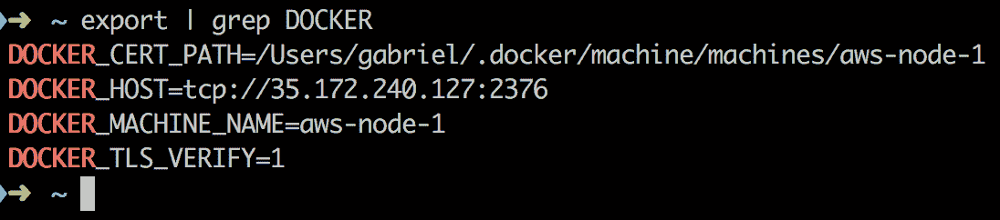

Environment variables used by Docker to enable remote access to the AWS EC2 node

出于安全原因，**传输层安全性** ( **TLS** )用于我们的命令行界面和远程节点之间的通信。DM 将必要的证书复制到我们分配给环境变量`DOCKER_CERT_PATH`的路径中。

我们现在在终端中执行的所有 Docker 命令都将在我们的 EC2 实例上的亚马逊 AWS 中远程执行。让我们尝试在此节点上运行 Nginx:

```
$ docker container run -d -p 8000:80 nginx:alpine
```

我们可以使用`docker container ls`来验证容器是否正在运行。如果是，那我们就用`curl`来测试一下:

```
$ curl -4 <IP address>:8000
```

这里，`<IP address>`是 AWS 节点的公共 IP 地址；就我而言，应该是`35.172.240.127`。可悲的是，这不起作用；前面的命令超时:

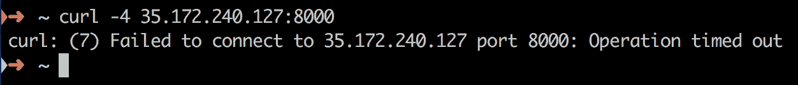

Accessing Nginx on the AWS node times out

原因是我们的节点是 AWS **安全组** ( **SG** )的一部分。默认情况下，拒绝访问该 SG 内的对象。因此，我们必须找出我们的实例属于哪个 SG，并显式配置访问。为此，我们通常使用 AWS 控制台。转到 EC2 仪表板，并选择左侧的实例。找到名为`aws-node-1`的 EC2 实例并选择它。在详细信息视图中的“安全组”下，单击链接 docker-machine，如下图所示:

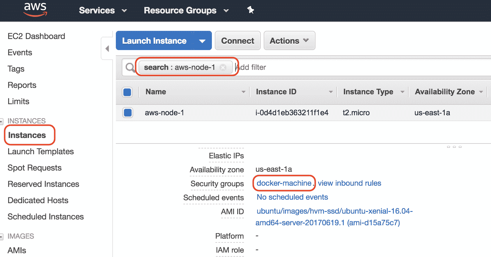

Locating the SG to which our swarm node belongs This will lead us to the SG page with the SG `docker-machine` pre-selected. In the details section under the tab Inbound, add a new rule for your IP address (the IP address of workstation):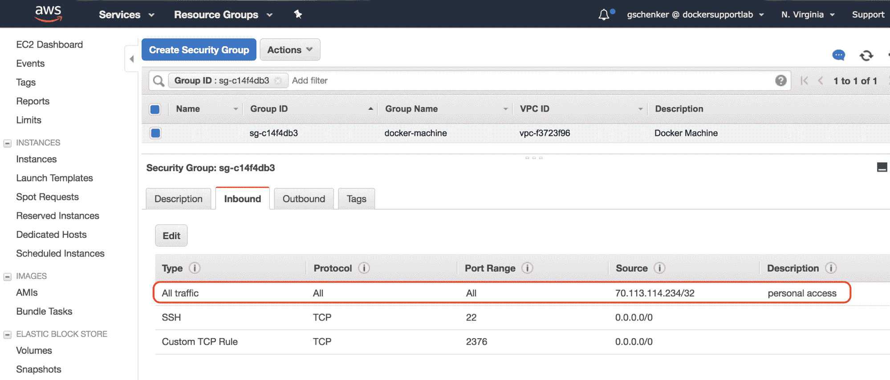 Open access to SG for our computer

在前面的截图中，IP 地址`70.113.114.234`恰好是分配给我个人工作站的那个。我已经启用了从这个 IP 地址到`docker-machine` SG 的所有入站流量。请注意，在生产系统中，您应该非常小心 SG 的哪些端口向公众开放。通常是端口`80`和`443`进行 HTTP 和 HTTPS 访问。其他一切都是对黑客的潜在邀请。

你可以通过像[https://www.whatismyip.com/](https://www.whatismyip.com/)这样的服务获得自己的 IP 地址。现在，如果我们再次执行 [`curl`](https://www.whatismyip.com/) 命令，将返回 Nginx 的问候页面。

在我们离开 SG 之前，我们应该给它添加另一个规则。群节点需要能够通过 TCP 和 UDP 在端口`7946`和`4789`上自由通信，并通过 TCP 在端口`2377`上自由通信。我们现在可以用这些需求添加五个规则，其中源是 SG 本身，或者我们只定义一个更粗糙的规则，允许 SG 内的所有入站流量(在我的例子中为`sg-c14f4db3`):

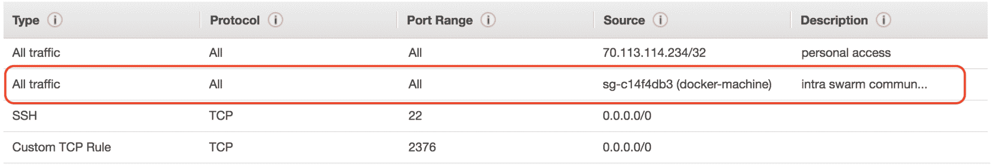

SG rule to enable intra-swarm communication

现在，让我们继续创建剩余的四个节点。同样，我们可以使用脚本来简化这个过程:

```
$ for NODE in `seq 2 5`; do
    docker-machine create --driver amazonec2 \
        --amazonec2-region us-east-1 aws-node-${NODE}
done
```

在完成节点的配置后，我们可以用 DM 列出所有节点。在我的例子中，我看到了这个:

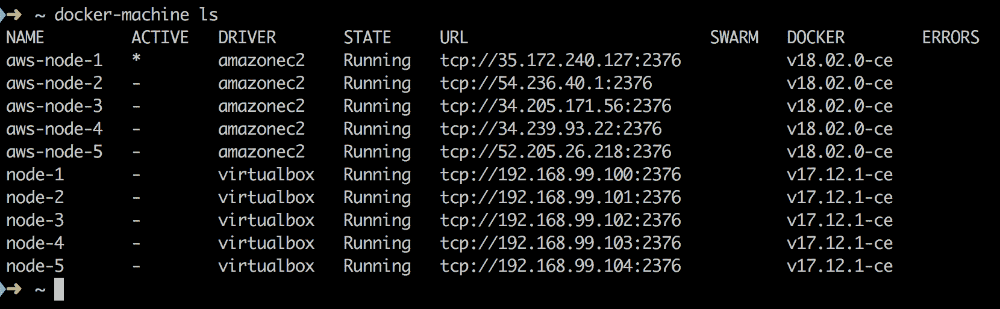

List of all the nodes created by Docker Machine

在前面的截图中，我们可以看到我们最初在 VirtualBox 中创建的五个节点，以及我们在 AWS 中创建的五个新节点。显然，AWS 上的节点正在使用 Docker 的新版本；这里的版本是`18.02.0-ce`。我们在`URL`栏中看到的 IP 地址是我的 EC2 实例的公共 IP 地址。

由于我们的命令行界面仍然配置为远程访问节点`aws-node-1`，因此我们可以按如下方式运行`swarm init`命令:

```
$ docker swarm init
```

然后我们需要`join-token`:

```
$ export JOIN_TOKEN=$(docker swarm join-token -q worker)
```

领导的地址用以下命令:

```
$ export LEADER_ADDR=$(docker node inspect \
 --format "{{.ManagerStatus.Addr}}" self)
```

有了这些信息，我们现在可以将其他四个节点加入群领导:

```
$ for NODE in `seq 2 5`; do
  docker-machine ssh aws-node-${NODE} \
    sudo docker swarm join --token ${JOIN_TOKEN} ${LEADER_ADDR}
done
```

另一种无需在单个节点上进行 SSH 即可实现相同目的的方法是，每当我们想要访问不同的节点时，重新配置我们的客户端 CLI:

```
$ for NODE in `seq 2 5`; do
  eval $(docker-machine env aws-node-${NODE})
  docker swarm join --token ${JOIN_TOKEN} ${LEADER_ADDR}
done
```

作为最后一步，我们希望将节点 2 和 3 升级到 manager:

```
$ eval $(docker-machine env node-1)
$ docker node promote aws-node-2 aws-node-3
```

然后我们可以列出所有的群节点，如下图所示:

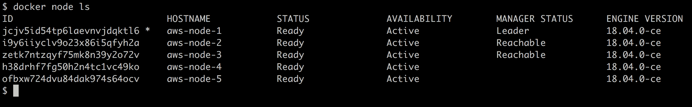

List of all nodes of our swarm in the cloud

因此，我们在云中运行着一个高可用性的 Docker Swarm。为了清理云中的群集并避免产生不必要的成本，我们可以使用以下命令:

```
$ for NODE in `seq 1 5`; do
  docker-machine rm -f aws-node-${NODE}
done
```

# 部署第一个应用

我们已经在不同的平台上创建了一些 Docker 群集。一旦创建，群体在任何平台上的行为都是一样的。我们在群集上部署和更新应用的方式不依赖于平台。Docker 的主要目标之一是在使用集群时避免供应商锁定。可以毫不费力地将群就绪应用从内部运行的群迁移到基于云的群。从技术上讲，甚至可以在内部运行一部分集群，在云中运行另一部分集群。这是可行的，但是由于地理位置较远的节点之间的延迟较高，人们当然必须考虑可能的副作用。

现在我们已经有了一个高可用性的 Docker Swarm 并开始运行，是时候在它上面运行一些工作负载了。我使用的是用 Docker Machine 创建的本地集群。我们将首先创建一个服务。为此，我们需要 SSH 到一个管理器节点中。我选择`node-1`:

```
$ docker-machine ssh node-1
```

# 创建服务

服务可以作为堆栈的一部分创建，也可以直接使用 Docker CLI 创建。让我们首先看一下定义单个服务的示例堆栈文件:

```
version: "3.5"
services:
  whoami:
    image: training/whoami:latest
    networks:
      - test-net
    ports:
      - 81:8000
    deploy:
      replicas: 6
      update_config:
        parallelism: 2
        delay: 10s
      labels:
        app: sample-app
        environment: prod-south

networks:
  test-net:
    driver: overlay
```

在前面的例子中，我们看到了被称为`whoami`的服务的期望状态是什么:

*   基于映像`training/whoami:latest`
*   服务的容器连接到网络`test-net`
*   集装箱港口`8000`发布到港口`81`
*   它运行着六个副本(或任务)
*   在滚动更新期间，单个任务分两批更新，每个成功的批之间有 10 秒的延迟
*   服务(及其任务和容器)被分配了两个标签`app`和`environment`，值分别为`sample-app`和`prod-south`

我们可以为服务定义更多的设置，但是前面的设置是一些更重要的设置。大多数设置都有有意义的默认值。例如，如果我们没有指定副本的数量，那么 Docker 将其默认为`1`。服务的名称和形象当然是强制性的。请注意，服务的名称在群中必须是唯一的。

为了创建前面的服务，我们使用`docker stack deploy`命令。假设存储前面内容的文件叫做`stack.yaml`，我们有:

```
$ docker stack deploy -c stack.yaml sample-stack
```

这里，我们创建了一个名为`sample-stack`的堆栈，它由一个服务`whoami`组成。我们可以列出群中的所有堆栈，这样我们就可以得到:

```
$ docker stack ls
NAME             SERVICES
sample-stack     1
```

如果我们列出群中定义的服务，我们会得到以下输出:

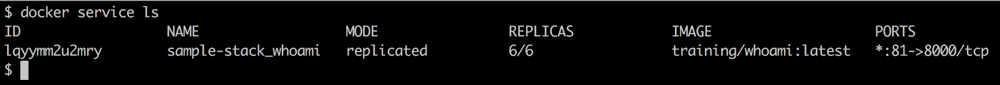

List of all services running in the swarm

在输出中，我们可以看到目前只有一个服务在运行，这是意料之中的。该服务有一个标识。相反，到目前为止，您对容器、网络或卷使用的标识格式是字母数字。我们还可以看到，服务的名称是我们在堆栈文件中定义的服务名称和堆栈名称的组合，堆栈名称用作前缀。这是有意义的，因为我们希望能够使用相同的堆栈文件将多个堆栈(具有不同的名称)部署到我们的群中。为了确保服务名是唯一的，Docker 决定将服务名和堆栈名结合起来。

在第三列我们看到了模式，也就是`replicated`。副本数量显示为`6/6`。这告诉我们，六个请求的副本中有六个正在运行。这对应于期望的状态。在输出中，我们还看到了服务使用的映像和服务的端口映射。

# 检查服务及其任务

在前面的输出中，我们看不到已经创建的`6`副本的细节。为了更深入地了解这一点，我们可以使用`docker service ps`命令。如果我们为我们的服务执行这个命令，我们将得到以下输出:

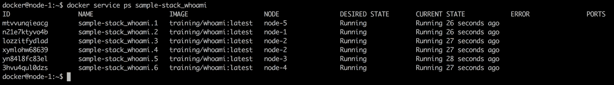

Details of the whoami service 

在前面的输出中，我们可以看到六个任务的列表，这些任务对应于我们的`whoami`服务的六个请求副本。在`NODE`列中，我们还可以看到每个任务已经部署到的节点。每个任务的名称是服务名称加上递增索引的组合。还要注意，与服务本身类似，每个任务都被分配了一个字母数字标识。

在我的情况下，显然名为`sample-stack_whoami.2`的任务 2 已经部署到`node-1`了，它是我们蜂群的首领。因此，我应该找到一个在这个节点上运行的容器。让我们看看如果我们列出所有在`node-1`上运行的容器会得到什么:

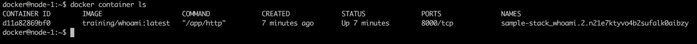

List of containers on node-1

不出所料，我们发现一个从`training/whoami:latest`映像运行的容器，其名称是其父任务名称和 ID 的组合。我们可以尝试可视化部署示例堆栈时生成的整个对象层次结构:

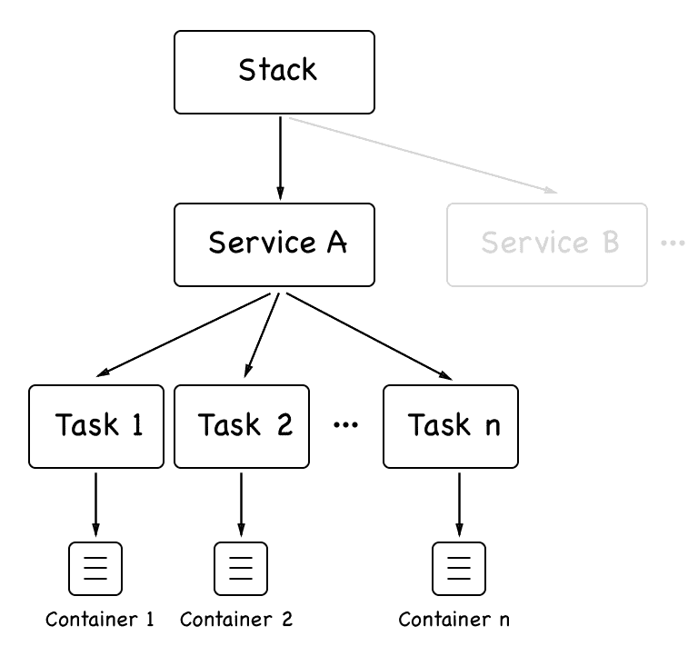

Object hierarchy of a Docker Swarm stack

一个堆栈可以由一到多个服务组成。每个服务都有一组任务。每个任务都与一个容器一一对应。堆栈和服务被创建并存储在 Swarm 管理器节点上。然后，任务被调度到集群工作节点，在那里工作节点创建相应的容器。我们也可以通过检查来获得更多关于我们服务的信息。执行以下命令:

```
$ docker service inspect sample-stack_whoami
```

这提供了关于服务的所有相关设置的丰富信息。这包括我们在`stack.yaml`文件中明确定义的那些，但也包括那些我们没有指定的，因此被赋予默认值的。我们不打算在这里列出整个输出，因为它太长了，但我鼓励读者在自己的机器上检查它。我们将在*群路由网格*部分更详细地讨论部分信息。

# 服务日志

在前面的章节中，我们处理了由容器产生的日志。在这里，我们专注于一项服务。请记住，最终，一个具有许多副本的服务会有许多容器在运行。因此，我们期望，如果我们向服务请求日志，Docker 会返回属于该服务的那些容器的所有日志的集合。事实上，这就是我们使用`docker service logs`命令得到的结果:


Logs of the whoami service

目前日志中没有太多信息，但足以讨论我们得到了什么。日志中每一行的第一部分总是包含容器的名称以及日志条目来源的节点名称。然后，用竖线(`|`)隔开，我们得到实际的日志条目。因此，如果我们直接询问列表中第一个容器的日志，我们只会得到一个条目，在这种情况下，我们看到的值将是`Listening on :8000`。

我们通过`docker service logs`命令获得的聚合日志没有以任何特定的方式进行排序。因此，如果事件的关联发生在不同的容器中，您应该将信息添加到日志输出中，以使这种关联成为可能。通常，这是每个日志条目的时间戳。但这必须在源头上进行；例如，生成日志条目的应用也需要确保添加了时间戳。

我们还可以通过提供任务标识而不是服务标识或名称来查询服务的单个任务的日志。因此，查询任务 2 中的日志会得到下面的截图:

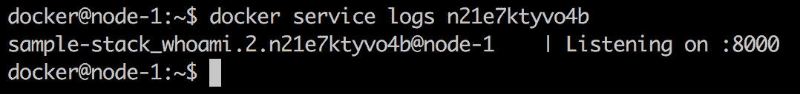

Logs of an individual task of the whoami service

# 调和期望的状态

我们已经了解到，群服务是我们希望应用或应用服务在其中运行的期望状态的描述或清单。现在，让我们看看 Docker Swarm 如何协调这个期望的状态，如果我们做了一些事情，导致服务的实际状态不同于期望的状态。最简单的方法是强制杀死服务的一个任务或容器。

让我们用已经安排在`node-1`的容器来做这件事:

```
$ docker container rm -f sample-stack_whoami.2.n21e7ktyvo4b2sufalk0aibzy
```

如果我们这样做，然后立即执行`docker service ps`，我们将看到以下输出:

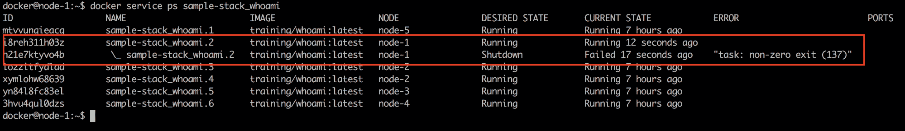

Docker Swarm reconciling the desired state after one task failed

我们看到任务 2 以退出代码`137`失败，并且群通过在具有空闲资源的节点上重新调度失败的任务来立即协调期望的状态。在这种情况下，调度程序选择了与失败任务相同的节点，但情况并非总是如此。因此，在没有我们干预的情况下，swarm 完全解决了这个问题，并且由于服务在多个副本中运行，因此服务从未中断。

让我们尝试另一个失败场景。这一次，我们将关闭整个节点，并观察蜂群的反应。让我们以`node-2`为例，因为它上面运行着两个任务(任务 3 和任务 4)。为此我们需要打开一个新的终端窗口，使用 Docker 机器停止`node-2`:

```
$ docker-machine stop node-2
```

回到`node-1`，我们现在可以再次运行`docker service ps`来看看发生了什么:

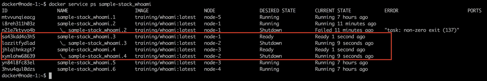

Swarm reschedules all tasks of a failed node

在前面的截图中，我们可以看到任务 3 立即被重新安排在`node-1`上，而任务 4 被重新安排在`node-3`上。即使是这种更彻底的失败也由 Docker Swarm 优雅地处理。

但是需要注意的是，如果`node-2`在集群中重新上线，先前运行在其上的任务将不会自动转移回集群。但是节点现在已经为新的工作负载做好了准备。

# 删除服务或堆栈

如果我们想从群中移除一个特定的服务，我们可以使用`docker service rm`命令。另一方面，如果我们想从群体中移除一个堆栈，我们类似地使用`docker stack rm`命令。此命令删除堆栈定义中的所有服务。就`whoami`服务而言，它是通过使用堆栈文件创建的，因此我们将使用后一个命令:

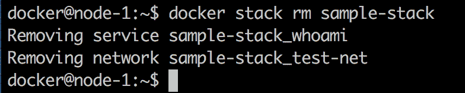

Removing a stack

前面的命令将确保堆栈的每个服务的所有任务都被终止，并且通过首先发送`SIGTERM`来停止相应的容器，然后，如果不成功，则在 10 秒的超时后发送`SIGKILL`。

需要注意的是，停止的容器不会从 Docker 主机中移除。因此，建议不时清除工作节点上的容器，以回收未使用的资源。为此使用`docker container purge -f`。

# 部署多服务堆栈

在[第 8 章](08.html)、 *Docker Compose、*中，我们使用了一个由两个服务组成的应用，这两个服务在 Docker Compose 文件中进行了声明性描述。我们可以使用这个合成文件作为模板来创建一个堆栈文件，允许我们将同一个应用部署到一个群中。我们的堆栈文件`pet-stack.yaml`的内容是这样的:

```
version: "3.5"
services:
  web:
    image: fundamentalsofdocker/ch08-web:1.0
    networks:
      - pets-net
    ports:
      - 3000:3000
    deploy:
      replicas: 3
  db:
    image: fundamentalsofdocker/ch08-db:1.0
    networks:
      - pets-net
    volumes:
      - pets-data:/var/lib/postgresql/data

volumes:
  pets-data:

networks:
  pets-net:
    driver: overlay
```

我们要求服务`web`有三个副本，并且两个服务都连接到覆盖网络`pets-net`。我们可以使用`docker stack deploy`命令部署该应用:

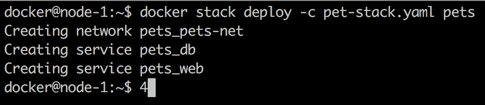

Deploy the pets stack

Docker 创建了`pets_pets-net`覆盖网络，然后创建了两个服务`pets_web`和`pets_db`。然后我们可以列出`pets`堆栈中的所有任务:

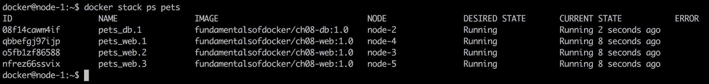

List of all the tasks in the pets stack

最后，让我们使用`curl`测试应用。实际上，该应用的工作情况与预期一致:

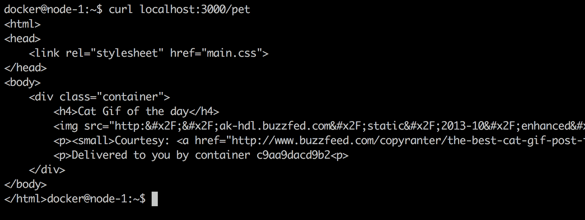

Testing the pets application using curl

容器标识在输出中，表示`Delivered to you by container c9aa9dacd9b2`。如果多次运行`curl`命令，ID 应该在三个不同的值之间循环。这些是我们请求服务的三个容器(或复制品)的 ID`web`。

完成后，我们可以用`docker stack rm pets`移除堆栈。

# 群体路由网格

如果你一直在注意，那么你可能在最后一节注意到了一些有趣的东西。我们部署了 pets 应用，结果是服务实例 **web** 安装在三个节点`node-3`、`node-4`和`node-5`上。然而，我们可以通过`localhost`访问`node-1`上的**网络**服务，并从那里到达每个集装箱。*这怎么可能？*嗯，这是由于所谓的群体路由网格。路由网格确保当我们发布一个服务的端口时，该端口会发布在群的所有节点上。因此，命中群的任何节点并请求使用特定端口的网络流量将通过路由网格被转发到服务容器之一。让我们看看下图，看看它是如何工作的:

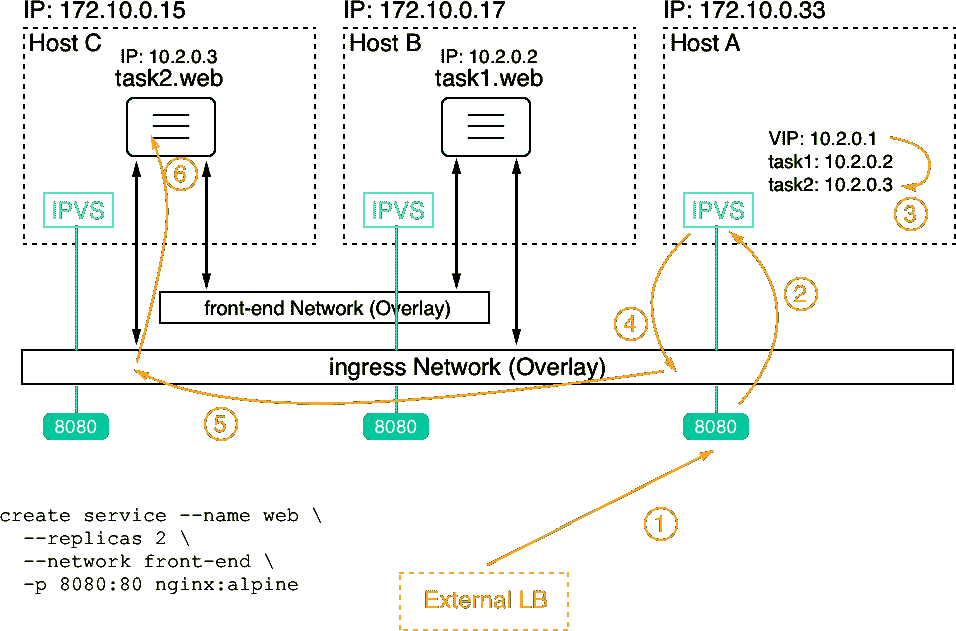

Docker Swarm routing mesh

在这种情况下，我们有三个节点，称为**主机 A** 到**主机 C** ，IP 地址为`172.10.0.15`、`172.10.0.17`和`172.10.0.33`。在图的左下角，我们看到了创建带有两个副本的服务 **web** 的命令。相应的任务已经安排在**主机 B** 和**主机 C** 上。任务 1 降落在主机 B 上，而任务 2 降落在主机 c 上。

当一项服务在 Docker Swarm 上创建时，它会自动获得一个分配的**虚拟 IP** ( **贵宾**)地址。该 IP 地址在服务的整个生命周期中是稳定和保留的。让我们假设在我们的情况下，贵宾是`10.2.0.1`。

如果现在来自外部**负载平衡器** ( **LB** )的端口`8080`请求是针对我们群集的一个节点，那么这个请求由该节点上的 Linux **IP 虚拟服务器** ( **IPVS** )服务处理。该服务在 IP 表中查找给定端口`8080`，会发现这对应于服务 **web** 的 VIP。现在，由于 VIP 不是真正的目标，IPVS 服务将对与该服务相关联的任务的 IP 地址进行负载平衡。在我们的例子中，它选择了任务 2，其 IP 地址为`10.2.0.3`。最后，**入口**覆盖网络用于将请求转发到主机 c 上的目标容器。

需要注意的是，外部 LB 将外部请求转发到哪个群节点并不重要。路由网格将始终正确处理请求，并将其转发给目标服务的任务之一。

# 摘要

在这一章中，我们已经介绍了 Docker Swarm，它是仅次于 Kubernetes 的第二大最受欢迎的容器编排器。我们研究了群的体系结构，讨论了群中运行的所有类型的资源，如服务、任务等，并且在群中创建了服务，部署了由多个相关服务组成的应用。

在下一章中，我们将探讨如何将服务或应用部署到具有零宕机和自动回滚功能的 Docker Swarm 上。我们还将引入秘密作为保护敏感信息的手段。

# 问题

要评估您的学习进度，请回答以下问题:

1.  如何初始化一个新的 Docker Swarm？
    1.  码头工人初始化群
    2.  码头工人群初始化-广告-地址
    3.  坞站 swarm 联接令牌
2.  您希望从 Docker Swarm 中删除一个工作节点。需要哪些步骤？
3.  如何创建一个名为`front-tier`的覆盖网络？使网络可连接。
4.  如何从带有五个副本的`nginx:alpine`映像创建名为`web`的服务，该服务暴露入口网络上的端口 3000 并连接到`front-tier`网络？
5.  您将如何将 web 服务缩减到三个实例？

# 进一步阅读

有关所选主题的更多详细信息，请参考以下链接:

*   *亚马逊 AWS EC2 示例*在[http://dockr.ly/2FFelyT](http://dockr.ly/2FFelyT)