# 零停机部署和机密

在最后一章中，我们详细探讨了 Docker Swarm 及其资源。我们学习了如何在本地和云中构建一个高度可用的集群。然后，我们深入讨论了群服务和堆栈。最后，我们在群中创建了服务和堆栈。

在本章中，我们将向您展示如何在不中断服务和堆栈可用性的情况下更新在 Docker Swarm 中运行的服务和堆栈。这叫做**零停机部署**。我们还将引入群机密，作为一种安全地向使用这些机密的服务容器提供敏感信息的手段。

本章的主题是:

*   零停机部署
*   机密

完成本章后，您将能够:

*   列出两到三种不同的部署策略，通常用于在不停机的情况下更新服务
*   批量更新服务，而不会导致服务中断
*   为更新失败时使用的服务定义回滚策略
*   在服务中使用机密
*   更新机密的价值而不会导致停机

# 技术要求

本章的代码文件可以在[https://github . com/原教旨主义文档/labs/tree/master/ch11](https://github.com/fundamentalsofdocker/labs/tree/master/ch11) 链接中找到。

# 零停机部署

需要频繁更新的任务关键型应用最重要的一个方面是能够以完全不需要停机的方式进行更新。我们称之为零停机部署。在任何时候，被更新的应用都是完全可操作的。

# 流行的部署策略

有各种方法可以实现这一点。其中一些如下:

*   滚动更新
*   蓝绿色部署
*   金丝雀释放

Docker Swarm 支持开箱即用的滚动更新。另外两种类型的部署可以通过我们的额外努力来实现。

# 滚动更新

在任务关键型应用中，每个应用服务都必须在多个副本中运行。根据负载的不同，可以少至两到三个实例，多至几十个、几百个或几千个实例。在任何给定的时间，我们都希望所有服务实例中有明显多数在运行。因此，如果我们有三个副本，我们希望至少有两个副本一直运行。如果我们有 100 个副本，我们可以满足于至少 90 个副本，这些副本必须可用。然后，我们可以定义副本的批量大小，以便进行升级。在第一种情况下，批次大小为 1，在第二种情况下，批次大小为 10。

当我们关闭副本时，Docker Swarm 将自动从负载平衡池中取出这些实例，并且所有流量将在剩余的活动实例之间进行负载平衡。因此，这些剩余的实例的流量将略有增加。在下图中，在滚动更新开始之前，如果**任务 A3** 想要访问**服务 B，**可以通过 SwarmKit 对服务 B 的三个任务中的任何一个进行负载平衡。滚动更新开始后，SwarmKit 关闭**任务 B1** 进行更新。然后，该任务会自动从目标池中取出。因此，如果**任务 A3** 现在请求连接到**服务 B** ，负载平衡将仅从剩余任务 B2 和 B3 中选择。因此，这两个任务可能会暂时承受更高的负载:

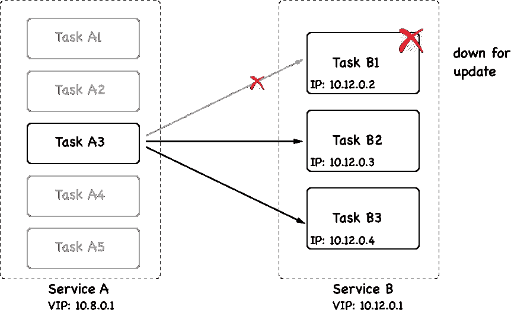

Task B1 is taken down for update

然后，停止的实例被应用服务的新版本的同等数量的新实例替换。一旦新的实例启动并运行，我们就可以让蜂群观察它们一段给定的时间，并确保它们是健康的。如果一切都好，那么我们可以通过取下下一批实例并用新版本的实例替换它们来继续。重复这个过程，直到应用服务的所有实例都被替换。

在下图中，我们看到**服务 B** 的**任务 B1** 已经更新到版本 2。**任务 B1** 的容器分配了一个新的 IP 地址，并部署到另一个有空闲资源的工作节点:

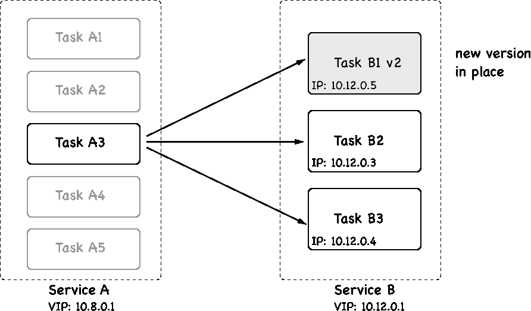

First batch updated in a rolling update

重要的是要理解，当一个服务的任务被更新时，在大多数情况下，它会被部署到一个不同的工作节点，而不是它曾经生活的节点。但是只要相应的服务是无状态的，这应该没问题。如果我们有一个位置或节点感知的有状态服务，并且我们想要更新它，那么我们必须调整我们的方法，但是这超出了本书的范围。

现在，让我们来看看我们如何实际指示群执行应用服务的滚动更新。当我们在堆栈文件中声明一个服务时，我们可以定义多个与这个上下文相关的选项。让我们看一个典型堆栈文件的片段:

```
version: "3.5"
services:
 web:
   image: nginx:alpine
   deploy:
     replicas: 10
     update_config:
       parallelism: 2
       delay: 10s
...
```

在这个片段中，我们看到一个部分，`update_config`，具有属性`parallelism`和`delay`。并行度定义滚动更新期间一次将更新多少副本的批量大小。延迟定义了 Docker Swarm 在各个批次的更新之间要等待多长时间。在前面的例子中，我们有`10`副本，每次更新两次，在每次成功更新之间，Docker Swarm 等待`10`秒。

让我们测试这样一个滚动更新。我们导航到`labs`文件夹的子文件夹`ch11`，并使用文件`stack.yaml`创建一个为滚动更新配置的网络服务。该服务使用基于阿尔卑斯山的 Nginx 映像，版本为`1.12-alpine`。然后我们将更新服务到一个更新的版本`1.13-alpine`。

我们将把这个服务部署到我们在 VirtualBox 本地创建的集群中。首先，我们确保我们的终端窗口配置为访问我们集群的一个主节点。我们可以带领导`node-1`:

```
$ eval $(docker-machine env node-1)
```

现在，我们可以使用堆栈文件部署服务:

```
$ docker stack deploy -c stack.yaml web
```

前面命令的输出如下所示:

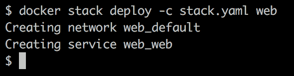

Deployment of the stack called web

部署服务后，我们可以使用以下命令对其进行监控:

```
$ watch docker stack ps web
```

我们将看到以下输出:

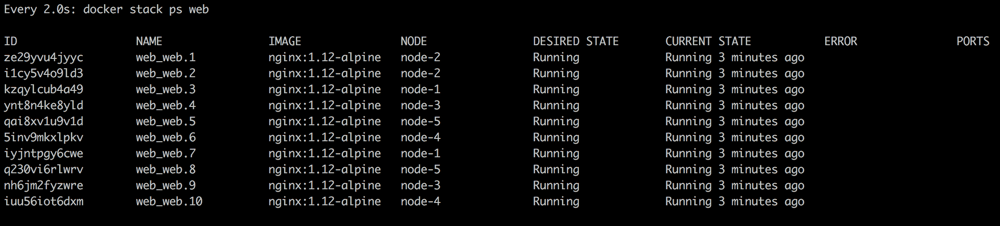

Service web of stack web running in swarm with 10 replicas If you're working on a Mac, you need to make sure your watch tool is installed. Use this command to do so: `brew install watch`.

前面的命令将持续更新输出，并为我们提供滚动更新期间发生的事情的良好概述。

现在，我们需要打开第二个终端，并将其配置为远程访问我们集群的管理节点。完成后，我们可以执行`docker`命令，该命令将更新堆栈的`web`服务(也称为`web`)的映像:

```
$ docker service update --image nginx:1.13-alpine web_web
```

前面的命令导致以下输出，指示滚动更新的进度:

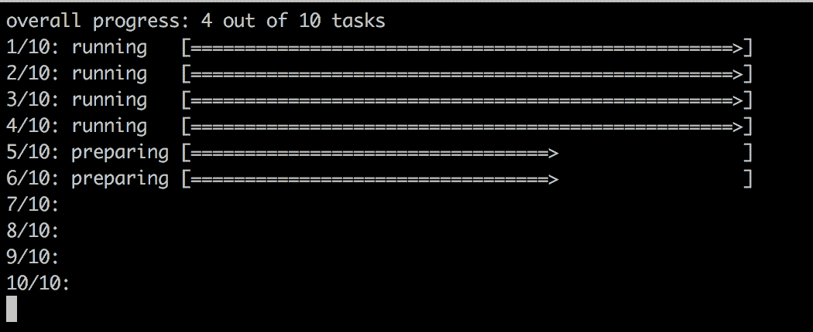

Screen showing progress of rolling update

输出表明前两个批次和每两个任务已经成功，第三个批次正在准备中。

在我们观察堆栈的第一个终端窗口中，我们现在应该看到 Docker Swarm 如何以 10 秒的间隔一批一批地更新服务。第一批完成后，应该如下图所示:

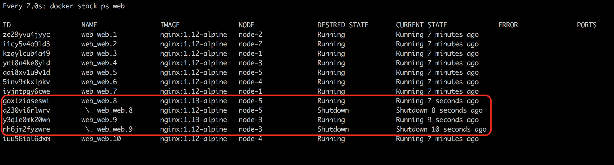

Rolling update of a service in Docker Swarm

在前面的截图中，我们可以看到第一批的两个任务`8`和`9`已经更新了。Docker正在等待`10 seconds`进行下一批。

It is interesting to note that in this particular case, SwarmKit deploys the new version of the task to the same node as the previous version. This is accidental since we have five nodes and two tasks on each node. SwarmKit always tries to balance the workload evenly across the nodes. So, when SwarmKit takes down a task, then the corresponding node has less workload than all the others and thus gets the new instance scheduled. Normally, you cannot expect to find the new instance of a task on the same node. Just try it out yourself by deleting the stack with `docker stack rm web` and changing the number of replicas to say, seven, and then redeploy and update. 

所有任务更新后，我们手表`docker stack ps web`命令的输出看起来类似于下面的截图:

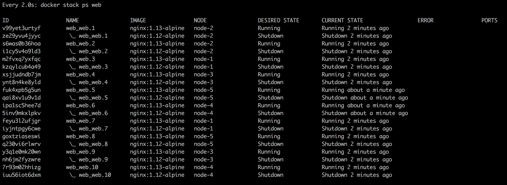

All tasks have been updated successfully

请注意，SwarmKit 不会立即从相应的节点中移除任务的早期版本的容器。这是有意义的，因为我们可能想要，例如，从那些容器中检索日志用于调试目的，或者我们可能想要使用`docker container inspect`检索它们的元数据。在清除旧的任务实例之前，SwarmKit 会保留四个最新终止的任务实例，以免未使用的资源阻塞系统。

完成后，我们可以使用以下命令来拆除堆栈:

```
$ docker stack rm web
```

虽然使用堆栈文件来定义和部署应用是推荐的最佳实践，但是我们也可以在服务`create`语句中定义更新行为。如果我们只想部署单个服务，这可能是首选方式。我们来看这样一个`create`命令:

```
$ docker service create --name web \
 --replicas 10 \
 --update-parallelism 2 \
 --update-delay 10s \
 nginx:alpine
```

该命令定义了与前面的堆栈文件相同的所需状态。我们希望服务以`10`副本运行，并且希望滚动更新一次以 2 个任务的批次进行，连续批次之间有`10`秒的间隔。

# 健康检查

例如，为了做出明智的决定，在 swarm 服务的滚动更新期间，无论刚刚安装的新服务实例批次是否运行正常，或者是否需要回滚，SwarmKit 都需要一种方法来了解系统的整体健康状况。通过它自己，FlowKit(和 Docker)可以收集相当多的信息。但这是有限度的。想象一个包含应用的容器。从外面看，这个容器看起来绝对健康，笑起来也很舒服。但这并不一定意味着容器内运行的应用也运行良好。例如，应用可能处于无限循环或损坏状态，但仍在运行。但是，只要应用运行，容器运行，从外部来看，一切看起来都很完美。

因此，SwarmKit 提供了一个接缝，我们可以为它提供一些帮助。我们，群中容器内运行的应用服务的作者，最清楚我们的服务是否处于健康状态。SwarmKit 让我们有机会定义一个针对我们的应用服务执行的命令，以测试其运行状况。*这个命令具体做什么对 Swarm* 来说并不重要，命令只需要返回 OK 或 NOT OK 或者超时即可。后两种情况，即“不正常”或“超时”，将告诉 SwarmKit 它正在调查的任务可能是不健康的。在这里，我有意写下*潜在的*，稍后，我们将看到原因:

```
FROM alpine:3.6
...
HEALTHCHECK --interval=30s \
    --timeout=10s
    --retries=3
    --start-period=60s
    CMD curl -f http://localhost:3000/health || exit 1
...
```

在前面的 Dockerfile 片段中，我们看到了关键字`HEALTHCHECK`。它有几个选项或参数和一个实际命令`CMD`。让我们首先讨论一下选项:

*   `--interval`定义健康检查之间的等待时间。因此，在我们的例子中，指挥者每`30`秒执行一次检查。
*   `--timeout`参数定义了如果健康检查没有响应，Docker 应该等待多长时间，直到因错误而超时。在我们的示例中，这是`10`秒。现在，如果一次运行状况检查失败，SwarmKit 会重试几次，直到它放弃并将相应的任务声明为不健康，并为 Docker 关闭该任务并将其替换为新实例打开了大门。
*   重试次数由参数`--retries`定义。在前面的代码中，我们希望有三次重试。
*   接下来，我们有开始期。有些容器需要一些时间来启动(这并不是推荐的模式，但有时这是不可避免的)。在此启动期间，服务实例可能无法响应运行状况检查。有了启动周期，我们可以定义在执行第一次运行状况检查之前，SwarmKit 应该等待多长时间，从而给应用初始化时间。为了定义启动时间，我们使用`--start-period`参数。在我们的情况下，我们在`60`秒后进行第一次检查。这个启动周期需要多长时间完全取决于应用及其启动行为。建议从相对较低的值开始，如果您有许多误报和多次重新启动的任务，您可能希望增加时间间隔。
*   最后，我们在最后一行用`CMD`关键字定义实际的探测命令。在我们的例子中，我们将对端口`3000`处的`localhost`的`/health`端点的请求定义为探测命令。本次电话会议预计有三种可能的结果:
    *   命令成功
    *   命令失败
    *   命令超时

后两者被 FlowKit 以同样的方式对待。这向指挥者表明相应的任务可能是不健康的。我确实有意说了*可能*，因为 SwarmKit 不会立即假设最坏的情况，而是假设这可能只是任务的暂时侥幸，它会从中恢复过来。这就是我们有`--retries`参数的原因。在这里，我们可以定义 SwarmKit 应该重试多少次，然后它才能假设任务确实是不健康的，并因此杀死它，并在另一个空闲节点上重新调度该任务的另一个实例，以协调服务的期望状态。

*为什么我们可以在探测命令中使用 localhost？*这是一个非常好的问题，原因是因为 SwarmKit 在探测一个在 swarm 中运行的容器时，会在容器内部执行这个`probing`命令(也就是说，它会做一些类似`docker container exec <containerID> <probing command>`的事情)。因此，该命令在与容器内运行的应用相同的网络命名空间中执行。在下图中，我们从一开始就看到了服务任务的生命周期:

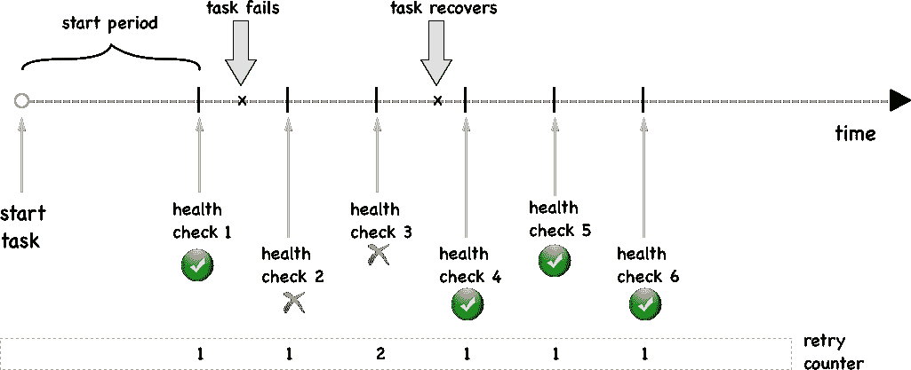

Service task with transient health failure

首先，FlowKit 等待探测，直到开始周期结束。然后，我们进行第一次健康检查。此后不久，探测任务失败。它连续失败了两次，但后来又恢复了。因此，第 4 次运行状况检查再次成功，SwarmKit 让任务继续运行。

在这里，我们看到了一个永远失败的任务:

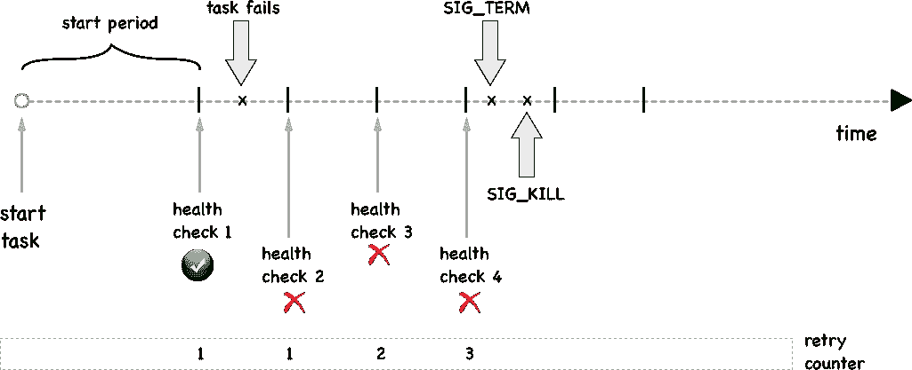

Permanent failure of task

如果任务没有恢复，并且在重试三次(或您定义的次数)后，SwarmKit 首先向任务的容器发送`SIGTERM`，如果 10 秒后超时，它将发送`SIGKILL`信号。

我们刚刚学习了如何在其映像的 Dockerfile 中定义服务的运行状况检查。但这不是唯一的办法。我们还可以在一个堆栈文件中定义运行状况检查，我们使用该文件将我们的应用部署到 Docker Swarm 中。下面是这样一个堆栈文件的简短片段:

```
version: "3.5"
services:
  web:
    image: example/web:1.0
    healthcheck:
      test: ["CMD", "curl", "-f", "http://localhost:3000/health"]
      interval: 30s
      timeout: 10s
      retries: 3
      start_period: 60s
...
```

在这个片段中，我们看到了健康检查相关信息是如何在堆栈文件中定义的。首先，重要的是要认识到，我们必须为每项服务单独定义健康检查。应用或全局级别没有运行状况检查。

类似于我们之前在 Dockerfile 中定义的，由 SwarmKit 用来执行健康检查的命令是`curl -f http://localhost:3000/health`。我们还有`interval`、`timeout`、`retries`和`start_period`的定义。后四个键值对与我们在 Dockerfile 中使用的相应参数具有相同的含义。如果映像中定义了与运行状况检查相关的设置，则堆栈文件中定义的设置会覆盖 Dockerfile 中的设置。

现在，让我们尝试使用定义了运行状况检查的服务。在我们的`lab`文件夹中，有一个名为`stack-health.yaml`的文件，内容如下:

```
version: "3.5"
services:
  web:
    image: nginx:alpine
    healthcheck:
      test: ["CMD", "wget", "-qO", "-", "http://localhost"]
      interval: 5s
      timeout: 2s
      retries: 3
      start_period: 15s
```

我们现在要部署的:

```
$ docker stack deploy -c stack-health.yaml myapp
```

我们可以使用`docker stack ps myapp`找到单个任务被部署到哪里。在那个特定的节点上，我们可以列出所有的容器来找到我们栈中的一个。在我的例子中，任务已经部署到`node-3`:

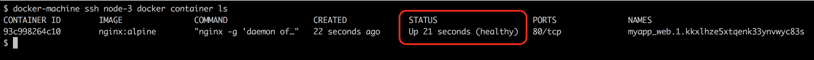

Displaying the health status of a running task instance

这个截图有趣的是`STATUS`栏。Docker，或者更准确地说是 SwarmKit，已经认识到服务已经定义了健康检查功能，并且正在使用它来确定服务的每个任务的健康状况。

# 反转

有时候，事情并不像预期的那样发展。应用版本中的最后一分钟修复无意中引入了新的 bug，或者新版本显著降低了组件的吞吐量，等等。在这种情况下，我们需要有一个 B 计划，在大多数情况下，这意味着能够将更新回滚到以前的好版本。

与更新一样，回滚必须以不会导致应用中断的方式进行；它需要零停机时间。从这个意义上说，回滚可以被视为反向更新。我们正在安装一个新版本，然而这个新版本实际上是以前的版本。

与更新行为一样，我们可以在堆栈文件或 Docker 服务`create`命令中声明系统在需要执行回滚时应该如何表现。这里，我们有以前使用过的堆栈文件，但这次带有一些与回滚相关的属性:

```
version: "3.5"
services:
  web:
    image: nginx:1.12-alpine
    ports:
      - 80:80
    deploy:
      replicas: 10
      update_config:
        parallelism: 2
        delay: 10s

        failure_action: rollback
        monitor: 10s

    healthcheck:
      test: ["CMD", "wget", "-qO", "-", "http://localhost"]
      interval: 2s
      timeout: 2s
      retries: 3
      start_period: 2s
```

在这个堆栈文件中，我们已经定义了关于滚动更新、运行状况检查和回滚期间行为的细节。健康检查被定义为在初始等待时间`2`秒后，指挥者开始每`2`秒轮询一次`http://localhost`上的服务，并在认为任务不健康之前重试`3`次。如果我们计算一下，那么如果一个任务由于错误而不健康，至少需要 8 秒钟才能停止。因此，现在在部署下，我们有了一个新条目`monitor`。此条目定义了新部署的任务应监控多长时间的运行状况，作为是否继续滚动更新中的下一批的决策点。这里，在这个例子中，我们给了它`10`秒。这比我们计算出的发现已部署有缺陷的服务所需的 8 秒稍长。这很好。

我们还有一个新的条目`failure_action`，它定义了如果编排器在滚动更新过程中遇到故障，比如服务不健康，它会做什么。默认情况下，该操作只是停止整个更新过程，并使系统处于中间状态。系统没有停机，因为它是一个滚动更新，并且至少服务的一些健康实例仍在运行，但是一些运行工程师更擅长查看和修复问题。

在我们的例子中，我们将动作定义为`rollback`。因此，在出现故障的情况下，SwarmKit 将自动将所有已经更新的任务恢复到它们以前的版本。

# 蓝绿部署

我们已经在[第 6 章](06.html)、*分布式应用架构、*中抽象地讨论了什么是蓝绿色部署。事实证明，在 Docker Swarm 上，我们无法真正实现任意服务的蓝绿色部署。在 Docker Swarm 中运行的两个服务之间的服务发现和负载平衡是 Swarm 路由网格的一部分，并且不能(容易地)定制。如果**服务 A** 想要调用**服务 B** ，那么 Docker 会隐式地完成这一切。给定目标服务的名称，Docker 将使用 Docker DNS 服务将该名称解析为一个**虚拟 IP** ( **VIP** )地址。当请求以 VIP 为目标时，Linux IPVS 服务将使用 VIP 在 Linux 内核 IP 表中进行另一次查找，并将请求负载平衡到 VIP 所代表的服务任务的物理 IP 地址之一，如下图所示:

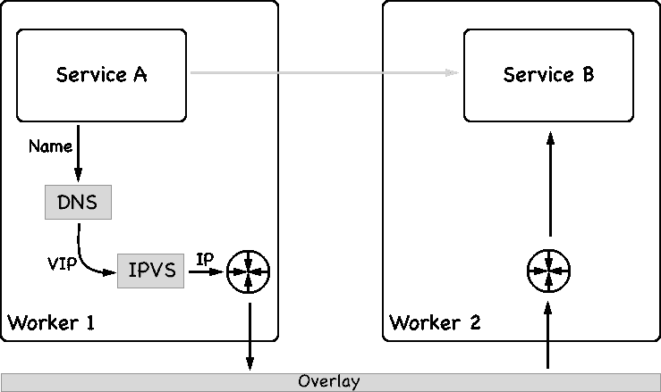

How service discovery and load balancing work in Docker Swarm

不幸的是，没有简单的方法可以拦截这种机制，并用自定义行为来替换它。但是这需要考虑到**服务 B** 的真正蓝绿部署，这是我们示例中的目标服务。正如我们将在[第 13 章](13.html)、*中看到的，使用 Kubernetes 部署、更新和保护应用，* Kubernetes 在这方面更加灵活。

也就是说，我们可以始终以蓝绿色的方式部署面向公众的服务。我们可以使用互锁 2 及其第 7 层路由机制来实现真正的蓝绿色部署。

# 金丝雀释放

从技术上讲，滚动更新是一种金丝雀式的发布。但是由于它们没有接缝，你可以在系统中插入定制的逻辑，滚动更新只是加那利版本的一个非常有限的版本。

真正的金丝雀版本要求我们对更新过程有更精细的控制。此外，真正的金丝雀版本不会关闭旧版本的服务，直到 100%的流量通过新版本。在这方面，它们被视为蓝绿部署。

在加那利发布场景中，我们不仅希望使用健康检查等因素作为决定是否通过新版本的服务输送越来越多流量的因素，而且我们还希望在决策中考虑外部输入，例如日志聚合器收集和聚合的指标或跟踪信息。可以用作决策者的例子是符合**服务级别协议** ( **服务级别协议**，即如果服务的新版本显示响应时间超出公差带。如果我们向现有服务添加新的功能，就会发生这种情况，但是这种新功能会降低响应时间。

# 机密

机密用于以安全的方式处理机密数据。群体机密在静止和运输中是安全的。也就是说，当一个新的机密在一个管理器节点上创建时，它只能在一个管理器节点上创建，它的值被加密并存储在 raft 共识存储中。这就是为什么它在休息时是安全的。如果一个服务获得一个分配给它的机密，那么管理器从存储中读取该机密，解密它，并将其转发给所有容器，这些容器是请求该机密的 Swarm 服务的实例。由于群中的节点到节点通信使用的是相互的**传输层安全性** ( **TLS** )，因此机密值虽然被解密，但在传输过程中仍然是安全的。管理器仅将机密转发给运行服务实例的工作节点。机密随后作为文件装入目标容器。每个机密对应一个文件。机密的名称将是容器内文件的名称，机密的值是相应文件的内容。机密从不存储在工作节点的文件系统中，而是使用`tmpFS`装载到容器中。默认情况下，机密在`/run/secrets`装载到容器中，但是您可以将其更改为任何自定义文件夹。

# 创造机密

首先，让我们看看我们如何实际创建一个机密:

```
$ echo "sample secret value" | docker secret create sample-secret - 
```

该命令创建一个名为`sample-secret`的机密，值为`sample secret value`。请注意`docker secret create`命令末尾的连字符。这意味着 Docker 期望机密的值来自标准输入。这正是我们通过将值`sample secret value`输入到`create`命令中所做的。

或者，我们可以使用一个文件作为机密值的来源:

```
$ docker secret create other-secret ~/my-secrets/secret-value.txt
```

这里，名为`other-secret`的机密的值是从文件`~/my-secrets/secret-value.txt`中读取的。一旦机密被创造出来，就没有办法获得它的价值。例如，我们可以列出我们所有的机密，我们将获得以下截图:


List of all secrets

在这个列表中，我们只看到机密的 ID 和名称加上一些其他元数据，但是机密的实际值是不可见的。我们也可以使用 inspect on a secret，例如，获取更多关于`other-secret`的信息:

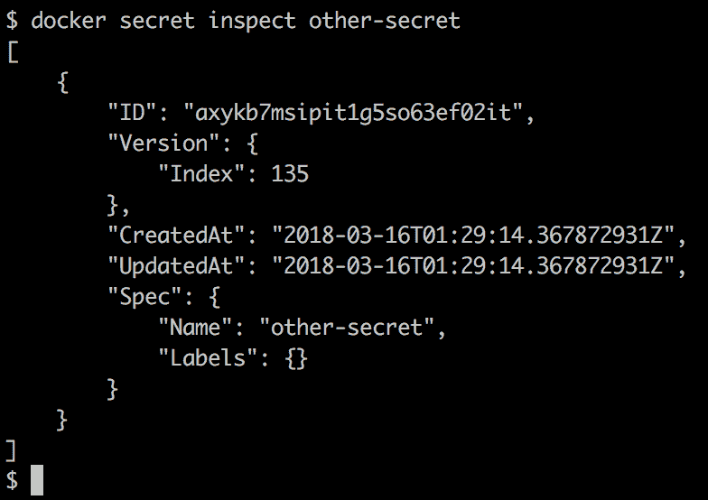

Inspecting a swarm secret

即使在这里，我们也无法找回机密的价值。这当然是有意的，机密就是机密，因此需要保密。如果我们对 Docker 开箱即用的产品不满意，我们可以根据需要为机密分配标签，甚至可以使用不同的驱动程序来加密和解密机密。

# 使用机密

机密被成群运行的服务使用。通常，机密是在创建时分配给服务的。因此，如果我们想要运行一个名为`web`的服务，并为其分配一个机密，`api-secret-key,`的语法如下所示:

```
$ docker service create --name web \
 --secret api-secret-key \
 --publish 8000:8000 \
 fundamentalsofdocker/whoami:latest
```

该命令基于映像`fundamentalsofdocker/whoami:latest`创建名为`web`的服务，将容器港口`8000`发布到所有群节点上的港口`8000`，并为其分配机密`api-secret-key`。

只有在群中定义了名为`api-secret-key`的机密时，这才会起作用，否则文本`secret not found: api-secret-key`会产生错误。因此，让我们现在创建这个机密:

```
$ echo "my secret key" | docker secret create api-secret-key -
```

现在，如果我们重新运行服务`create`命令，它将成功:

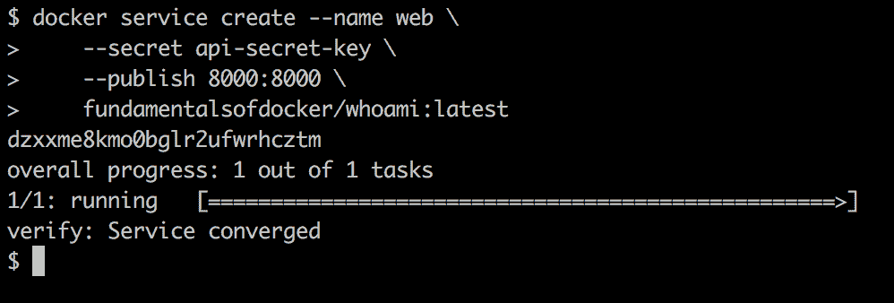

Creating a service with a secret

我们现在可以做一个`docker service ps web`来找出在哪个节点上部署了唯一的服务实例，然后执行到这个容器中。在我的例子中，实例已经被部署到`node-3,`中，因此我 SSH 到该节点中:

```
$ docker-machine ssh node-3
```

然后，我列出该节点上的所有容器，以找到属于我的服务的一个实例，并复制其容器 ID。然后，我们可以运行以下命令，以确保该机密确实可以在容器内明文包含机密值的预期文件名下获得:

```
$ docker exec -it <container ID> cat /run/secrets/api-secret-key
```

再一次，在我的例子中，这看起来像这样:

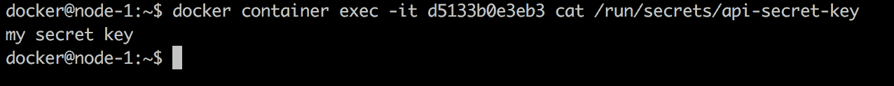

A secret as a container sees it

如果出于某种原因，Docker 在容器内装载机密的默认位置不为您所接受，您可以定义一个自定义位置。在下面的命令中，我们将机密挂载到`/app/my-secrets`:

```
$ docker service create --name web \
 --name web \
 -p 8000:8000 \
 --secret source=api-secret-key,target=/run/my-secrets/api-secret-key \
 fundamentalsofdocker/whoami:latest
```

在这个命令中，我们使用扩展语法来定义一个包含目标文件夹的机密。

# 在开发环境中模拟机密

当在开发中工作时，我们的机器上通常没有本地集群。但是机密只在群体中起作用。那么，*我们能做什么*？嗯，幸运的是，这真的很简单。由于机密被视为文件，我们可以轻松地将包含机密的卷装入容器中的预期位置，默认位置为`/run/secrets`。

假设我们在本地工作站上有一个文件夹`./dev-secrets`。对于每个机密，我们都有一个文件，其名称与机密名称相同，并且以机密的未加密值作为文件内容。例如，我们可以通过在工作站上执行以下命令来模拟一个名为`demo-secret`的具有机密值`demo secret value`的机密:

```
$ echo "demo secret value" > ./dev-secrets/sample-secret
```

然后，我们可以创建一个容器来装载这个文件夹，如下所示:

```
$ docker container run -d --name whoami \
 -p 8000:8000 \
 -v $(pwd)/dev-secrets:/run/secrets \
 fundamentalsofdocker/whoami:latest
```

并且在容器内运行的进程将无法区分这些装载的文件和源自机密的文件。因此，例如，`demo-secret`在容器内作为文件`/run/secrets/demo-secret`可用，并且具有期望值`demo secret value`。

为了测试这一点，我们可以在前面的容器中执行一个 shell:

```
$ docker container exec -it whoami /bin/bash
```

然后导航到文件夹`/run/secrets`，显示文件`demo-secret`的内容:

```
/# cd /run/secrets
/# cat demo-secret
demo secret value
```

# 机密和遗留应用

有时，我们想要将一个我们不能轻易改变或者不想改变的遗留应用容器化。这个遗留应用可能希望有一个机密值作为环境变量。*我们现在要怎么处理？* Docker 将机密作为文件呈现给我们，但是应用希望它们以环境变量的形式出现。

在这种情况下，定义一个在容器启动时运行的脚本(所谓的入口点或启动脚本)是很有帮助的。该脚本将从相应的文件中读取机密值，并定义一个与文件同名的环境变量，将从文件中读取的值分配给新变量。在名为`demo-secret`的机密的情况下，其值应该在名为`DEMO_SECRET,`的环境变量中可用，这个启动脚本中必要的代码片段可能如下所示:

```
export DEMO_SECRET=`cat /run/secrets/demo-secret`
```

类似地，如果遗留应用期望机密值作为条目出现在例如位于`/app/bin`文件夹中的名为`app.config`的 YAML 配置文件中，该文件的相关部分如下所示:

```
...
secrets:
  demo-secret: "<<demo-secret-value>>"
  other-secret: "<<other-secret-value>>"
  yet-another-secret: "<<yet-another-secret-value>>"
...
```

我们的初始化脚本现在需要从`secret`文件中读取机密值，并用机密值替换配置文件中相应的占位符。对于`demo-secret,`来说，可能是这样的:

```
file=/app/bin/app.conf
demo_secret=`cat /run/secret/demo-secret`
sed -i "s/<<demo-secret-value>>/$demo_secret/g" "$file"
```

在这个片段中，我们使用`sed`工具将占位符替换为适当的值。我们可以对配置文件中的另外两个机密使用相同的技术。

我们将所有初始化逻辑放入一个名为`entrypoint.sh`的文件中，使该文件可执行，例如，将其添加到容器文件系统的根目录中，然后我们在 Dockerfile 中将该文件定义为`ENTRYPOINT`，或者我们可以在`docker container run`命令中覆盖映像的现有`ENTRYPOINT`。

让我们做一个样本。假设我们有一个遗留应用在一个由映像`fundamentalsofdocker/whoami:latest`定义的容器中运行，该容器期望在应用文件夹中的文件`whoami.conf`中定义一个机密`db_password`。我们可以在本地机器上定义一个文件`whoami.conf`，内容如下:

```
database:
  name: demo
  db_password: "<<db_password_value>>"
others:
  val1=123
  val2="hello world"
```

重要的部分是这个片段的第 3 行。它定义了启动脚本必须将机密值放在哪里。让我们在本地文件夹中添加一个名为`entrypoint.sh`的文件，内容如下:

```
file=/app/whoami.conf
db_pwd=`cat /run/secret/db-password`
sed -i "s/<<db_password_value>>/$db_pwd/g" "$file"

/app/http
```

该脚本的最后一行源于这样一个事实，即这是原始 Dockerfile 中使用的启动命令。现在，将此文件的模式更改为可执行:

```
$ sudo chmod +x ./entrypoint.sh
```

现在，我们定义一个继承自映像`fundamentalsofdocker/whoami:latest`的 Dockerfile。将名为`Dockerfile`的文件添加到当前文件夹，内容如下:

```
FROM fundamentalsofdocker/whoami:latest
COPY ./whoami.conf /app/
COPY ./entrypoint.sh /
CMD ["/entrypoint.sh"]
```

让我们从这个 Dockerfile 构建映像:

```
$ docker image build -t secrets-demo:1.0 .
```

一旦构建了映像，我们就可以从中运行服务。但在我们做到这一点之前，我们需要定义群体中的机密:

```
$ echo "passw0rD123" | docker secret create demo-secret -
```

现在我们可以创建使用以下机密的服务:

```
$ docker service create --name demo \
 --secret demo-secret \
 secrets-demo:1.0
```

# 更新机密

有时，我们需要更新正在运行的服务中的机密，原因是机密可能会泄露给公众或被恶意的人窃取，例如黑客。在这种情况下，我们需要更改我们的机密数据，因为从它泄露给不可信实体的那一刻起，它就必须被视为不安全的。

像任何其他更新一样，机密的更新必须以零停机时间的方式进行。在这方面，SwarmKit 支持我们。

首先，我们在蜂群中创造新的机密。建议在这样做时使用版本控制策略。在我们的示例中，我们使用版本作为机密名称的后缀。我们最初是从名为`db-password`的机密开始的，现在这个机密的新版本叫做`db-password-v2`:

```
$ echo "newPassw0rD" | docker secret create db-password-v2 -
```

假设使用该机密的原始服务是这样创建的:

```
$ docker service create --name web \
 --publish 80:80
 --secret db-password
 nginx:alpine
```

在容器内运行的应用能够在`/run/secrets/db-password`访问机密。现在，SwarmKit 不允许我们在运行的服务中更新现有的机密，因此我们必须首先删除这个机密的过时版本，然后添加新的版本。让我们从以下命令开始删除:

```
$ docker service update --secret-rm db-password web
```

然后我们可以用下面的命令添加新的机密:

```
$ docker service update \
 --secret-add source=db-password-v2, target=db-password \
 web
```

# 摘要

在这一章中，我们学习了 FlowKit 如何允许我们在不需要停机的情况下更新服务。我们还讨论了与零停机时间部署相关的 FlowKit 的当前限制。在这一章的第二部分，我们介绍了机密作为一种以高度安全的方式向服务提供机密数据的手段。

在下一章中，我们将介绍当前最流行的容器编排器 Kubernetes。我们将讨论用于在 Kubernetes 集群中定义和运行分布式、弹性、健壮和高可用性应用的对象。此外，这一章将让我们熟悉 MiniKube，一个用于在本地部署 Kubernetes 应用的工具，并演示 Kubernetes 与 Mac 的 Docker 和 Windows 的 Docker 的集成。

# 问题

为了评估您对本章讨论的主题的理解，请回答以下问题:

1.  用几句简单的话向感兴趣的外行解释一下*零停机部署*的含义。
2.  FlowKit 如何实现零宕机部署？
3.  与传统(非容器化)系统相反，为什么 Docker Swarm *中的回滚只是起作用*？用几句简短的话解释一下。
4.  描述 Docker 机密的两到三个特征。
5.  您需要推出新版本的`inventory`服务。你的命令看起来像什么？以下是一些更多信息:
    1.  新映像称为`acme/inventory:2.1`。
    2.  我们希望使用批量为两个任务的滚动更新策略。
    3.  我们希望系统在每批后等待一分钟。

6.  您需要使用通过 Docker 机密提供的新密码更新名为`inventory`的现有服务。新的机密叫做`MYSQL_PASSWORD_V2`。服务中的代码期望这个机密被称为`MYSQL_PASSWORD`。更新命令是什么样子的？(注意:我们不希望更改服务的代码！)

# 进一步阅读

以下是一些外部来源的链接:

*   *在[https://dockr.ly/2HfGjlD](https://dockr.ly/2HfGjlD)对服务*应用滚动更新
*   *在[https://dockr.ly/2vUNbuH](https://dockr.ly/2vUNbuH)管理带有Docker机密的敏感数据*
*   *在[https://dockr.ly/2k7zwzE](https://dockr.ly/2k7zwzE)引入Docker机密管理*
*   *从环境变量到Docker的机密[https://bit.ly/2GY3UUB](https://bit.ly/2GY3UUB)*