# 十二、Kubernetes 简介

在前一章中，我们学习了 FlowKit 如何使用滚动更新来实现零宕机部署。我们还了解了 Docker 机密，它用于与 Docker Swarm 中运行的应用服务共享机密数据。

在本章中，我们将介绍 Kubernetes。Kubernetes 目前是容器编排领域的明显领导者。我们从 Kubernetes 集群架构的高级概述开始，然后我们将讨论 Kubernetes 中用于定义和运行容器化应用的主要对象。

本章讨论的主题是:

*   体系结构
*   Kubernetes 大师赛
*   群集节点
*   MiniKube 简介
*   Mac Docker 和 Windows Docker 中的无缝支持
*   分离舱
*   立方复制集
*   库比涅斯部署
*   库比涅斯的服务，库比涅斯的服务，库比涅斯的服务，库比涅斯的服务，库比涅斯的服务，库比涅斯的服务，库比涅斯的服务，库比涅斯的服务
*   基于上下文的路由
*   将 FlowKit 与 Kubernetes 进行比较

完成本章后，您将能够:

*   在餐巾纸上绘制 Kubernetes 集群的高层架构
*   解释 Kubernetes 豆荚的三至四个主要特征
*   用两到三个短句描述 Kubernetes 复制集的作用
*   解释 Kubernetes 服务的两到三个主要职责
*   在 Minikube 中创建一个 pod
*   将 Mac 或 Windows 的 Docker 配置为使用 Kubernetes 作为编排器
*   在 Docker 中为 Mac 或 Windows 创建部署
*   创建一个 Kubernetes 服务，向集群内部(或外部)公开一个应用服务

# 技术要求

代码文件的链接可以在这里找到[https://github . com/原教旨主义 docker/labs/tree/master/ch12。](https://github.com/fundamentalsofdocker/labs/tree/master/ch12)

# 体系结构

Kubernetes 集群由一组服务器组成。这些服务器可以是虚拟机或物理服务器。后者也叫*裸机*。集群的每个成员可以有两种角色之一。它要么是一个 Kubernetes 主节点，要么是一个(工作)节点。前者用于管理集群，而后者将运行应用工作负载。我将 worker 放在括号中，因为按照 Kubernetes 的说法，在谈论运行应用工作负载的服务器时，您只谈论节点。但是用 Docker 和 Swarm 的说法，这相当于一个*工人节点*。我认为工作节点的概念比简单的节点更好地描述了服务器的角色。

在集群中，您有少量奇数个主节点和所需数量的工作节点。小型集群可能只有几个工作节点，而更现实的集群可能有几十个甚至几百个工作节点。从技术上讲，一个集群可以有多少工作节点没有限制；然而，实际上，在处理数千个节点时，您可能会经历一些管理操作的显著减速。集群的所有成员都需要通过物理网络连接，即所谓的**底层网络**。

Kubernetes 为整个集群定义了一个平面网络。Kubernetes 不提供任何现成的网络实现，而是依赖于第三方的插件。Kubernetes 只定义了**容器网络接口** ( **CNI** )，将实现留给其他人。CNI 很简单。它基本上规定，集群中运行的每个 pod 必须能够到达集群中运行的任何其他 pod，而其间不会发生任何**网络地址转换** ( **NAT** )。集群节点和 pod 之间也必须如此，也就是说，直接在集群节点上运行的应用或守护程序必须能够到达集群中的每个 pod，反之亦然。

在下图中，我试图说明 Kubernetes 集群的高级架构:

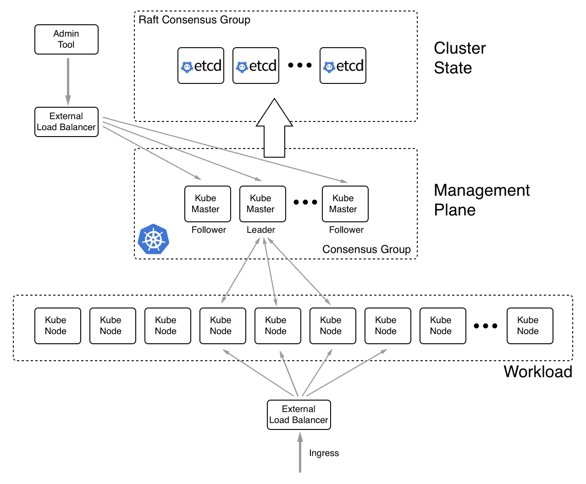

High-level architecture diagram of Kubernetes

上图解释如下:

*   在顶部，中间有一簇 **etcd** 节点。etcd 是一个分布式键值存储，在 Kubernetes 集群中，用于存储集群的所有状态。etcd 节点的数量必须是奇数，这是 Raft 共识协议规定的，它们用来相互协调。当我们谈论集群状态时，我们不包括在集群中运行的应用产生或使用的数据，而是我们谈论关于集群拓扑、正在运行的服务、网络设置、使用的机密等的所有信息。也就是说，这个 etcd 集群对于集群来说确实是至关重要的，因此，我们永远不应该在生产环境或任何需要高可用性的环境中只运行一台 etcd 服务器。
*   然后我们有一个 Kubernetes**主**节点的集群，它们之间也形成了一个共识组，类似于 etcd 节点。主节点的数量也必须是奇数。我们可以用单个主节点运行集群，但是我们永远不应该在生产或关键任务系统中这样做。在那里，我们总是应该至少有三个主节点。由于主节点用于管理整个集群，所以我们也在谈论管理平面。主节点使用 etcd 集群作为它们的后备存储。将一个**负载平衡器** ( **LB** )放在一个知名的**全限定域名** ( **FQDN** )的主节点前面，比如`https://admin.example.com`，是一个很好的做法。所有用于管理 Kubernetes 集群的工具都应该通过这个 LB 访问它，而不是使用其中一个主节点的公共 IP 地址。这显示在上图的左上角。
*   在图的底部，我们有一个工作者节点集群。节点数量可以低至一个，并且没有上限。Kubernetes 主节点和工作节点相互通信。这是一种双向的交流方式，不同于我们从 Docker Swarm 那里知道的方式。在 Docker Swarm 中，只有管理节点与工作节点通信，而从来没有其他节点。访问集群中运行的应用的所有入口流量应该通过另一个负载平衡器。这是应用负载平衡器或反向代理。我们从不希望外部流量直接访问任何工作节点。

现在我们已经对 Kubernetes 集群的高级架构有了一个概念，让我们深入一点，首先看看 Kubernetes 主节点和工作节点。

# 不可扩展的主节点

Kubernetes 主节点用于管理 Kubernetes 集群。以下是这种主机的高级示意图:

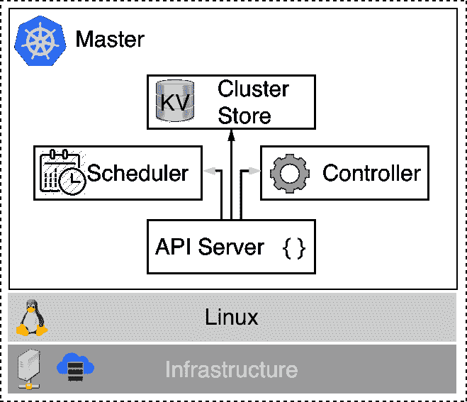

Kubernetes master

在上图的底部，我们有**基础设施**，它可以是内部部署的虚拟机或云中的虚拟机或服务器(通常称为裸机)，也可以是内部部署的虚拟机或云中的虚拟机。目前，Kubernetes masters 只在 Linux 上运行。支持大多数流行的 Linux 发行版，如 RHEL、CentOS 和 Ubuntu。在这个 Linux 机器上，我们至少运行了以下四个 Kubernetes 服务:

*   **API 服务器**:这里是 Kubernetes 的门户。列出、创建、修改或删除群集中任何资源的所有请求都必须通过此服务。它公开了一个 REST 接口，像`kubectl`这样的工具用来管理集群和集群中的应用。
*   **控制器**:控制器，或者更准确地说是控制器管理器，是一个控制回路，通过 API 服务器观察集群的状态并做出改变，试图将当前或有效状态移向期望状态。
*   **调度器**:调度器是一种在考虑各种边界条件(如资源需求、策略、服务质量需求等)的情况下，尽力在工作节点上调度 pods 的服务。
*   **集群存储**:这是 etcd 的一个实例，用来存储集群状态的所有信息。

更准确地说，用作集群存储的 etcd 不必安装在与其他 Kubernetes 服务相同的节点上。有时，Kubernetes 集群被配置为使用独立的 etcd 服务器集群，如前一节的架构图所示。但是使用哪种变体是高级管理决策，不在本书的讨论范围之内。

我们至少需要一个主节点，但是为了实现高可用性，我们需要三个或更多的主节点。这与我们所了解的 Docker Swarm 的管理器节点非常相似。在这方面，Kubernetes 主节点相当于 Swarm 管理器节点。

Kubernetes masters 从不运行应用工作负载。他们的唯一目的是管理集群。Kubernetes 大师建立一个 Raft 共识小组。Raft 协议是一种标准协议，用于一组成员需要做出决定的情况。它被用在许多著名的软件产品中，如 MongoDB、Docker FlowKit 和 Kubernetes。有关 Raft 协议的更详细讨论，请参见*进一步阅读*部分中的链接。

正如我们在上一节中提到的，Kubernetes 集群的状态存储在 etcd 中。如果 Kubernetes 集群应该是高度可用的，那么 etcd 也必须配置为高可用性模式，这通常意味着一个集群至少有三个 etcd 实例在不同的节点上运行。

让我们再次声明整个集群状态存储在 etcd 中。这包括关于所有集群节点、所有副本集、部署、机密、网络策略、路由信息等的所有信息。因此，我们必须为这个关键价值商店制定一个强大的备份战略。

现在，让我们看看将运行集群实际工作负载的节点。

# 群集节点

集群节点是 Kubernetes 调度应用工作负载的节点。他们是集群中的主力。Kubernetes 集群可以有几个、几十个、几百个甚至几千个集群节点。Kubernetes 是为了高扩展性而从头开始构建的。不要忘记，Kubernetes 是以谷歌博格为模型的，多年来，谷歌博格已经运行了数万个容器:

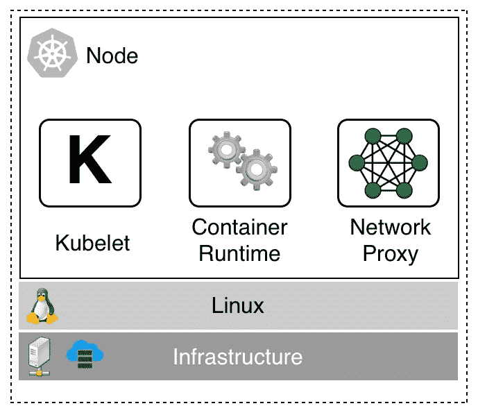

Kubernetes worker node

工作节点可以在虚拟机、裸机、内部部署或云中运行。最初，工作节点只能在 Linux 上配置。但是从 1.10 版本的 Kubernetes 开始，工作节点也可以在 Windows Server 2010 上运行。拥有一个包含 Linux 和 Windows 工作节点的混合集群是非常好的。

在每个节点上，我们有三个需要运行的服务，描述如下:

*   **Kubelet** :这是第一位的服务。Kubelet 就是所谓的主节点代理。kubelet 服务使用 pod 规范来确保相应 pod 的所有容器都运行正常。Pod 规范是以 YAML 或 JSON 格式编写的文件，它们声明性地描述了 pod。我们将在下一节了解什么是豆荚。PodSpecs 主要通过 API 服务器提供给 Kubelet。
*   **容器运行时**:需要出现在每个工作节点上的第二个服务是容器运行时。默认情况下，Kubernetes 使用 1.9 版以来的`containerd`作为其容器运行时。在此之前，它将使用 Docker 守护程序。可以使用其他容器运行时，如 rkt 或 CRI-O。容器运行时负责管理和运行 pod 的各个容器。
*   **kube-proxy** :最后是 kube-proxy。它作为守护程序运行，是在该特定节点上运行的所有应用服务的简单网络代理和负载平衡器。

现在，我们已经了解了 Kubernetes 的体系结构以及主节点和工作节点，是时候介绍我们可以用来开发针对 Kubernetes 的应用的工具了。

# Minikube 简介

Minikube 是一种在 VirtualBox 或 Hyper-V(支持其他虚拟机管理程序)中创建单节点 Kubernetes 集群的工具，准备在容器化应用的开发过程中使用。我们已经在[第 2 章](02.html)、*设置工作环境、*中展示了如何将 Minikube 和工具`kubectl`安装到您的 Mac 或 Windows 笔记本电脑上。如上所述，Minikube 是一个单节点 Kubernetes 集群，因此该节点同时是 Kubernetes 主节点和工作节点。

让我们确保 Minikube 使用以下命令运行:

```
$ minikube start
```

一旦 Minikube 准备好，我们就可以使用`kubectl`访问它的单节点集群。我们应该会看到类似以下截图的内容:

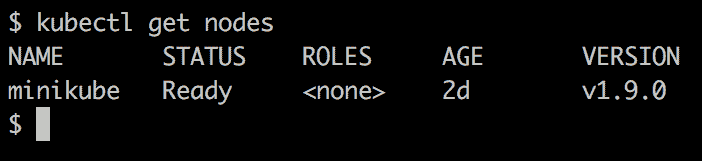

Listing all nodes in Minikube

如前所述，我们有一个单节点集群，节点名为`minikube`。不要被`ROLES`一栏的数值`<none>`所迷惑；该节点同时扮演工作节点和主节点的角色。

现在，让我们尝试在这个集群中部署一个 pod。不要担心此时的吊舱到底是什么；在这一章中，我们将深入探讨有关它的所有细节。目前，就这样吧。

我们可以使用`labs`文件夹的子文件夹`ch12`中的文件`sample-pod.yaml`来创建这样一个 pod。它有以下内容:

```
apiVersion: v1
kind: Pod
metadata:
  name: nginx
spec:
  containers:
  - name: nginx
    image: nginx:alpine
    ports:
    - containerPort: 80
    - containerPort: 443
```

让我们使用名为`kubectl`的 Kubernetes 命令行界面来部署这个 pod:

```
$ kubectl create -f sample-pod.yaml
pod "nginx" created
```

如果我们现在列出所有的吊舱，我们应该会看到:

```
$ kubectl get pods
NAME    READY   STATUS    RESTARTS   AGE
nginx   1/1     Running   0          51s
```

为了能够访问这个 pod，我们需要创建一个服务。让我们使用`sample-service.yaml`文件，它有以下内容:

```
apiVersion: v1
kind: Service
metadata:
  name: nginx-service
spec:
  type: LoadBalancer
  ports:
  - port: 8080
    targetPort: 80
    protocol: TCP
    name: http
  - port: 443
    protocol: TCP
    name: https
  selector:
    app: nginx
```

同样，此时不要担心服务到底是什么。我们将进一步详细解释这一切。让我们创建这个服务:

```
$ kubectl create -f sample-service.yaml
```

现在我们可以使用`curl`来访问服务:

```
$ curl -4 http://localhost
```

我们应该会收到 Nginx 欢迎页面作为回答。继续之前，请删除您刚刚创建的两个对象:

```
$ kubectl delete po/nginx
$ kubectl delete svc/nginx-service
```

# 桌面 Docker 中的 Kubernetes 支持

从版本`18.01-ce,`开始，Mac 的 Docker 和 Windows 的 Docker 已经开始支持开箱即用的 Kubernetes。希望将其容器化应用部署到 Kubernetes 的开发人员可以使用这个编排器，而不是 SwarmKit。默认情况下，Kubernetes 支持已关闭，必须在设置中启用。第一次启用 Kubernetes 时，Mac 或 Windows 的 Docker 将需要一点时间来下载创建单节点 Kubernetes 集群所需的所有组件。与同样是单节点集群的 Minikube 相反，Docker 工具提供的版本使用了所有 Kubernetes 组件的容器化版本:

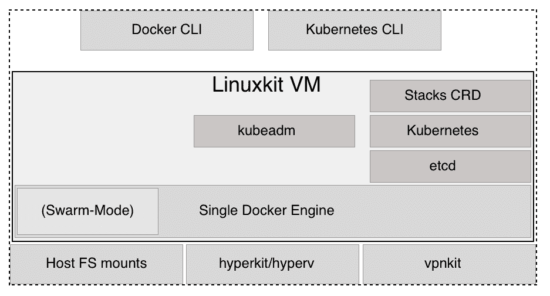

Kubernetes support in Docker for Mac and Windows

上图大致概述了如何将 Kubernetes 支持添加到 Mac 和 Windows 的 Docker 中。Docker 使用 hyperkit 来运行基于 LinuxKit 的虚拟机。Windows docker 使用 Hyper-V 实现了同样的效果。在虚拟机内部，安装了 Docker 引擎。引擎的一部分是 SwarmKit，它启用了 Swarm 模式。Mac 或 Windows 的 Docker 使用**kube dam**工具在该虚拟机中设置和配置 Kubernetes。以下三个事实值得一提:Kubernetes 将其集群状态存储在 etcd 中，因此我们在该虚拟机上运行了 etcd。然后，我们有了组成 Kubernetes 的所有服务，最后，还有一些支持将 Docker 栈从 Docker CLI 部署到 Kubernetes 的服务。这项服务不是官方 Kubernetes 发行版的一部分，而是 Docker 特有的。

Kubernetes 的所有组件都在基于 LinuxKit 的虚拟机的容器中运行。这些容器可以通过 Mac 或 Windows 的 Docker 中的设置隐藏。如果您启用了 Kubernetes 支持，请参阅下一节，了解笔记本电脑上运行的 Kubernetes 系统容器的完整列表。为了避免重复，从现在开始我将只谈论桌面的 Docker，而不是 Mac 的 Docker 和 Windows 的 Docker。我要说的一切同样适用于这两个版本。

与 Minikube 相比，支持 Kubernetes 的 Docker for Desktop 的一大优势是，前者允许开发人员使用单一工具来构建、测试和运行针对 Kubernetes 的容器化应用。甚至可以使用 Docker Compose 文件将多服务应用部署到 Kubernetes 中。

现在，让我们把手弄脏。首先，我们必须启用 Kubernetes。在 Mac 上，单击菜单栏中的 Docker 图标，然后选择首选项。在打开的对话框中，选择 Kubernetes，如下图所示:

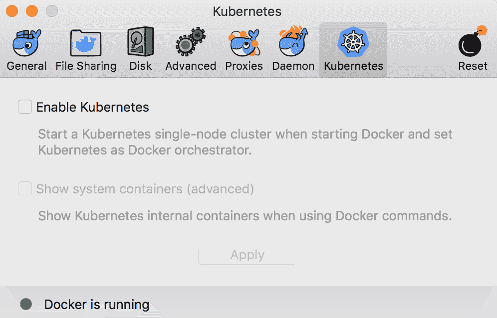

Enabling Kubernetes in Docker for Mac

然后，选择启用 Kubernetes 复选框。此外，勾选其他复选框显示系统容器(高级)。然后，单击应用按钮。您将被警告，Kubernetes 的安装和配置需要几分钟时间:

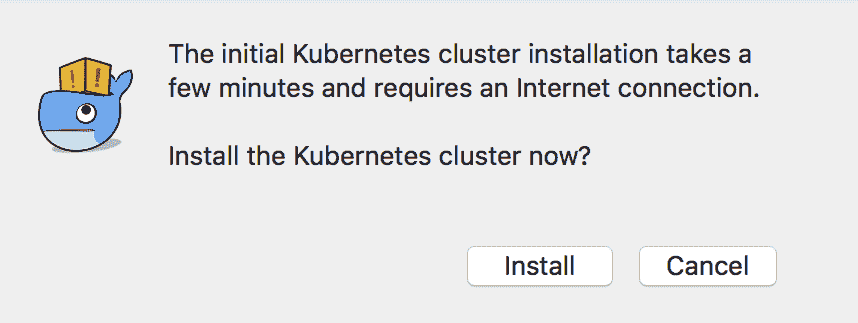

Warning that installation and configuration of Kubernetes takes a while

单击“安装”开始安装。现在是你休息一下，享受一杯好茶的时候了。

一旦安装完成(Docker 通过在设置对话框中显示绿色状态图标来通知我们)，我们就可以测试它了。由于我们现在的笔记本电脑上运行着两个 Kubernetes 集群，Minikube 和 Docker for Mac，我们需要配置`kubectl`来访问后者。首先，让我们列出我们拥有的所有上下文:

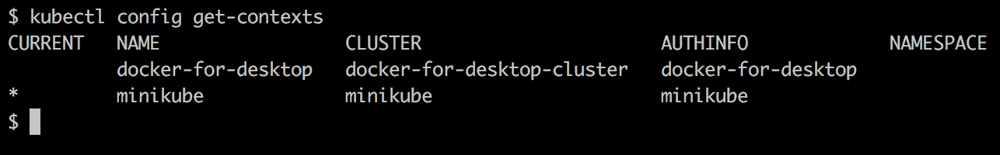

List of contexts for kubectl

在这里，我们可以看到，在我的笔记本电脑上，我有前面提到的两个上下文。目前，Minikube 上下文仍处于活动状态，通过`CURRENT`列中的星号可见。我们可以使用以下命令切换到`docker-for-desktop`上下文:

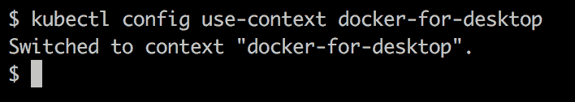

Changing the context for the Kubernetes CLI

现在，我们可以使用`kubectl`来访问 Docker for Mac 刚刚创建的集群。我们应该看到这一点:

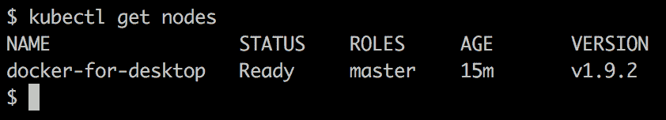

The single node Kubernetes cluster created by Docker for Mac

好吧，这个看起来很眼熟。这与我们在使用 Minikube 时看到的几乎相同。我的 Mac Docker 正在使用的 Kubernetes 版本是`1.9.2`。我们还可以看到该节点是一个主节点。

如果我们列出当前在我们的 Docker for Mac 上运行的所有容器，我们会得到这个列表(注意我使用`--format`参数只输出容器的`Container ID`和`Names`，如下图所示:

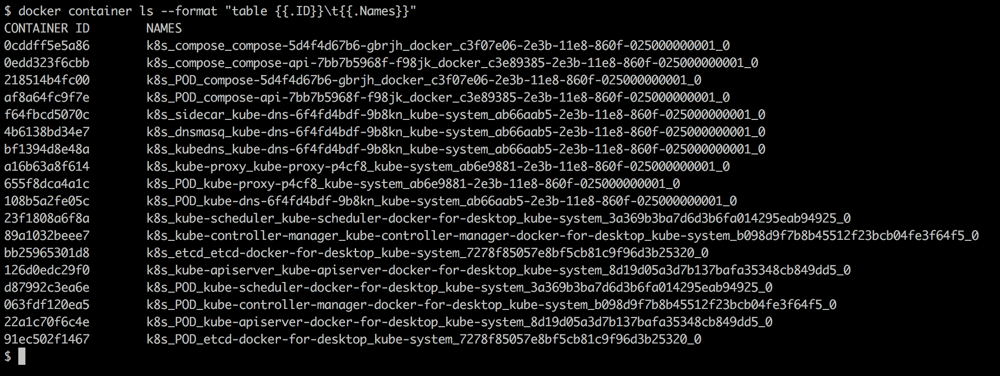

Kubernetes system containers

在该列表中，我们可以识别组成 Kubernetes 的所有现在熟悉的组件，例如:

*   应用编程接口服务器
*   和 cd
*   多维数据集代理
*   域名服务
*   Kube 控制器
*   多维数据集计划程序

也有容器里面有`compose`这个词。这些是 Docker 特定的服务，用于允许我们将 Docker Compose 应用部署到 Kubernetes 上。Docker 翻译 Docker Compose 语法，并隐式创建必要的 Kubernetes 对象，如部署、pods 和服务。

通常情况下，我们不想让这些系统容器打乱我们的容器列表。因此，我们可以在 Kubernetes 的设置中取消选中“显示系统容器”复选框。

现在，让我们尝试将 Docker Compose 应用部署到 Kubernetes。导航到我们的`labs`文件夹的子文件夹`ch12`。我们使用`docker-compose.yaml`文件将应用部署为栈:

```
$ docker stack deploy -c docker-compose.yml app
```

这就是我们看到的:

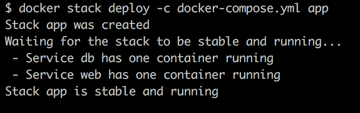

Deploy stack to Kubernetes

我们可以测试应用，例如，使用`curl`，我们将看到它正在按预期运行:

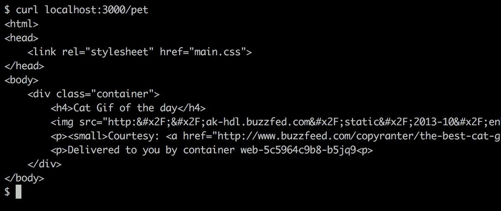

Pets application running in Kubernetes on Docker for Mac

现在，你应该很好奇，想知道当我们执行`docker stack deploy`命令时，Docker 到底做了什么。我们可以用`kubectl`来了解一下:

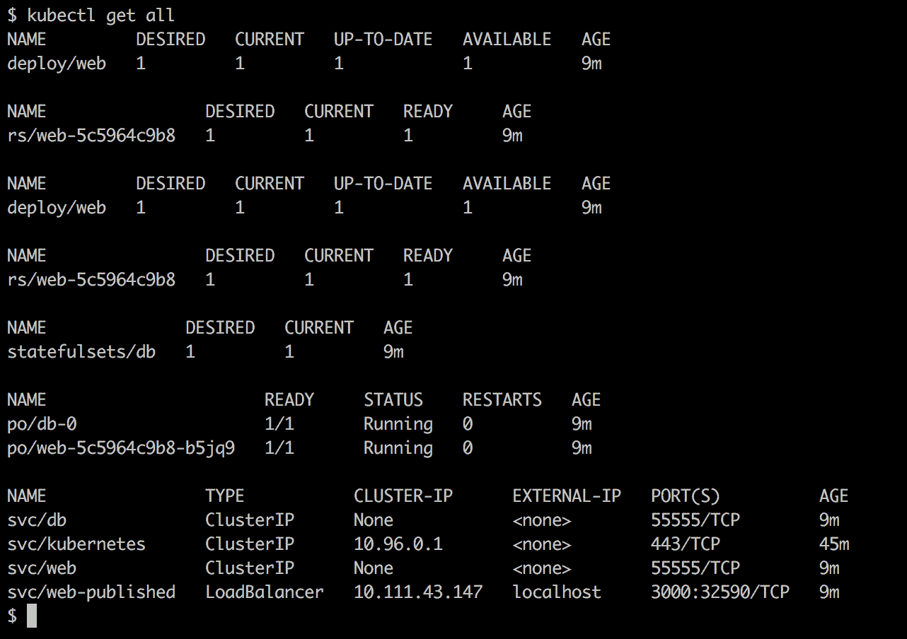

Listing all Kubernetes objects created by docker stack deploy

Docker 为`web`服务创建了一个部署，为`db`服务创建了一个状态集。它还自动为`web`和`db`创建了 Kubernetes 服务，以便可以在集群内访问它们。它还创建了用于外部访问的 Kubernetes 服务`svc/web-published`。

至少可以说，这非常酷，并且极大地减少了以 Kubernetes 为指挥者的团队在开发过程中的摩擦。

继续之前，请从群集中删除栈:

```
$ docker stack rm app
```

还要确保您将`kubectl`的上下文重置回 Minikube，因为我们将在本章的所有示例中使用 Minikube:

```
$ kubectl config use-context minikube
```

现在，我们已经介绍了可以用来开发最终将在 Kubernetes 集群中运行的应用的工具，现在是时候了解用于定义和管理此类应用的所有重要 Kubernetes 对象了。我们从吊舱开始。

# 分离舱

与 Docker Swarm 中可能出现的情况相反，您不能在 Kubernetes 集群中直接运行容器。在 Kubernetes 集群中，您只能运行 pods。吊舱是 Kubernetes 斯部署的原子单位。pod 是共享相同内核命名空间(如网络命名空间)的一个或多个位于同一位置的容器的抽象。Docker CroMkit 中不存在等效的。事实上，多个容器可以位于同一位置并共享同一个网络命名空间是一个非常强大的概念。下图显示了两个吊舱:

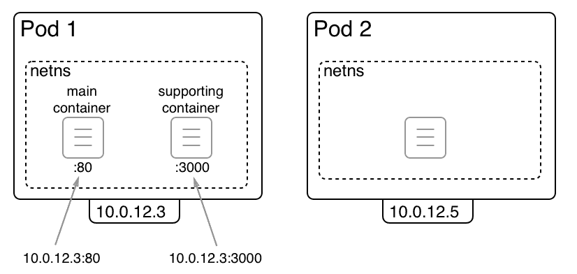

Kubernetes pods

在上图中，我们有两个吊舱，**吊舱 1** 和**吊舱 2** 。第一个容器包含两个容器，而第二个容器只包含一个容器。每个 pod 都获得一个由 Kubernetes 分配的 IP 地址，该地址在整个 Kubernetes 集群中是唯一的。在我们的例子中，这些是 IP 地址`10.0.12.3`和`10.0.12.5`。两者都是由 Kubernetes 网络驱动程序管理的专用子网的一部分。

一个豆荚可以容纳一到多个容器。所有这些容器共享相同的内核命名空间，特别是它们共享网络命名空间。这由包围容器的虚线矩形来标记。由于在同一个 pod 中运行的所有容器共享网络名称空间，每个容器都需要确保使用自己的端口，因为在单个网络名称空间中不允许有重复的端口。在这种情况下，在**舱 1** 中，主容器使用港口`80`，而辅助容器使用港口`3000`。

来自其他容器或节点的请求可以使用容器的 IP 地址和相应的端口号来访问各个容器。例如，您可以通过`10.0.12.3:80`访问运行在 **Pod 1** 主容器中的应用。

# Docker 容器和 Kubernetes pod 网络的比较

现在，让我们比较一下 Docker 的容器网络和 Kubernetes pod 的网络。在这里的图表中，前者在左手边，后者在右手边:


Containers in Pod sharing network namespace

当 Docker 容器被创建并且没有指定特定网络时，Docker 引擎创建一个**虚拟以太网** ( **veth** )端点。第一个容器得到 **veth0** ，下一个容器得到 **veth1** ，以此类推。这些虚拟以太网端点连接到安装时 docker 自动创建的 Linux 桥 **docker0** 。流量从网桥**路由到每个连接的 veth 端点。每个容器都有自己的网络命名空间。没有两个容器使用相同的命名空间。这是有意的，目的是将容器内运行的应用相互隔离。**

对于 Kubernetes 豆荚来说，情况就不同了。创建新的 pod 时，Kubernetes 首先创建一个所谓的暂停容器，其唯一目的是创建和管理 pod 将与所有容器共享的名称空间。除此之外，它没有任何用处，只是睡觉。**暂停**容器通过 **veth0** 连接至桥梁**Docker 0** 。将成为 pod 一部分的任何后续容器都使用 Docker 引擎的特殊功能，该功能允许它重用现有的网络命名空间。这样做的语法如下:

```
$ docker container create --net container:pause ... 
```

重要的部分是`--net`参数，它用作值`container:<container name>`。如果我们以这种方式创建一个新的容器，那么 Docker 不会创建一个新的 veth 端点，而是使用与`pause`容器相同的容器。

多个容器共享同一个网络命名空间的另一个重要后果是它们相互通信的方式。让我们考虑包含两个容器的吊舱的以下情况，一个在港口`80`监听，另一个在港口`3000`:

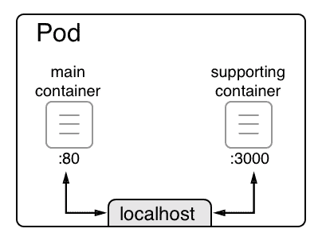

Containers in pods communicate via localhost

当两个容器使用相同的 Linux 内核网络命名空间时，它们可以通过 localhost 相互通信，类似于当两个进程在同一主机上运行时，它们也可以通过 localhost 相互通信。这在上图中有所说明。从主容器开始，其内部的容器化应用可以通过`http://localhost:3000`到达在支持容器内部运行的服务。

# 共享网络命名空间

在所有这些理论之后，你可能会想知道一个豆荚实际上是如何被 Kubernetes 创造出来的。Kubernetes 只使用 Docker 提供的内容。那么，*这个网络命名空间共享是如何工作的呢？*首先，Kubernetes 创建了前面提到的所谓的`pause`容器。这个容器除了为那个容器保留内核命名空间并保持它们活动之外没有其他功能，即使容器中没有其他容器在运行。那么，让我们模拟一个吊舱的创建。我们从创建`pause`容器开始，并为此使用 Nginx:

```
$ docker container run -d --name pause nginx:alpine
```

现在我们添加第二个名为`main`的容器，将其附加到与`pause`容器相同的网络命名空间:

```
$ docker container run --name main -dit \
 --net container:pause \
 alpine:latest /bin/sh
```

由于`pause`和样本容器都是同一个网络命名空间的一部分，它们可以通过`localhost`相互联系。为了说明这一点，我们首先得把`exec`放进主容器:

```
$ docker exec -it main /bin/sh
```

现在，我们可以测试运行在`pause`容器中并在端口`80`上侦听的与 Nginx 的连接。如果我们使用`wget`实用程序这样做，我们会得到以下结果:

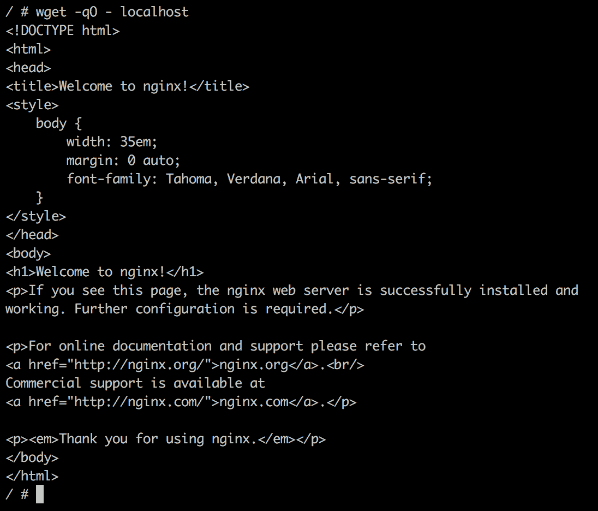

Two containers sharing the same network namespace

输出显示我们确实可以在`localhost`上访问 Nginx。这证明了两个容器共享同一个命名空间。如果这还不够，我们可以使用`ip`工具在两个容器中显示`eth0`，我们将获得完全相同的结果，具体来说，相同的 IP 地址，这是 pod 的特征之一，其中所有容器共享相同的 IP 地址:

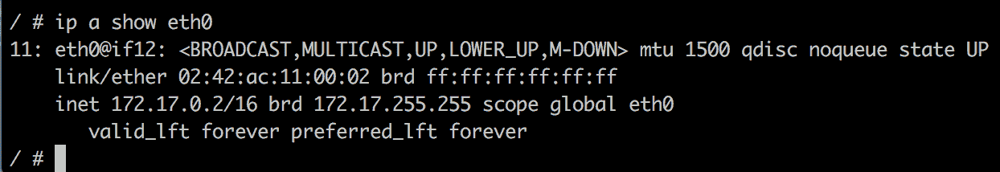

Displaying the properties of eth0 with the ip tool

如果我们检查`bridge`网络，只能看到`pause`容器被列出。另一个容器没有在`Containers`列表中获得条目，因为它正在重用`pause`容器的端点:

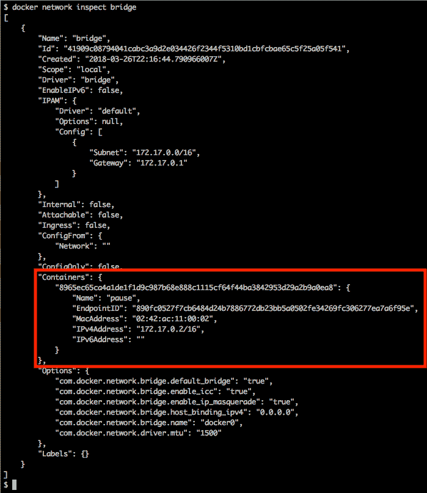

Inspecting the Docker default bridge network

# 豆荚生命周期

我们在本书前面已经了解到容器有一个生命周期。容器被初始化、运行并最终退出。当一个容器退出时，它可以用退出代码零优雅地完成这个操作，或者它可以用一个错误终止，这相当于一个非零的退出代码。

同样，豆荚也有生命周期。由于一个容器可以包含多个容器，因此这个生命周期比单个容器的生命周期稍微复杂一些。下图描绘了 pod 的生命周期:

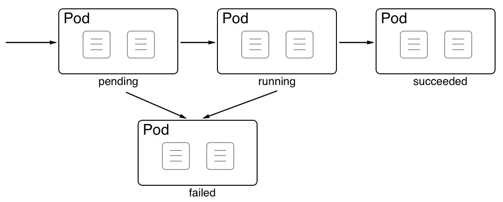

Life cycle of Kubernetes pods

当在集群节点上创建 pod 时，它首先进入**待定**状态。一旦吊舱的所有容器启动并运行，吊舱进入**运行**状态。只有当所有容器都成功运行时，pod 才会进入这种状态。如果 pod 被要求终止，它将请求它的所有容器终止。如果所有容器都以出口代码零结束，则容器进入**成功**状态。这是幸福的道路。

现在，让我们看看导致吊舱处于**故障**状态的一些场景。有三种可能的情况:

*   如果在吊舱启动过程中，至少有一个容器无法运行且出现故障(即，它以非零退出代码退出)，吊舱将从**待定**状态进入**故障**状态
*   如果运输舱处于运行状态，并且其中一个容器突然崩溃或以非零退出代码退出，则运输舱从**运行**状态转换到**故障**状态
*   如果吊舱被要求终止，并且在关闭期间，至少一个容器以非零退出代码退出，那么吊舱也进入**故障**状态

# Pod 规格

在 Kubernetes 集群中创建 pod 时，我们可以使用命令式或声明式方法。我们在本书前面已经讨论了这两种方法的区别，但是为了重新表述重要的方面，使用声明性方法意味着我们编写了一个描述我们想要达到的最终状态的清单。我们把*如何*的细节留给指挥者。我们想要达到的最终状态也叫做**想要的状态**。总的来说，声明式方法在所有已建立的编排器中都是非常受欢迎的，Kubernetes 也不例外。

因此，在本章中，我们将专门关注声明性方法。pod 的清单或规范可以使用 YAML 或 JSON 格式编写。在这一章中，我们将集中讨论 YAML，因为它对我们人类来说更容易阅读。让我们看一个示例规范。以下是`labs`文件夹`ch12`子文件夹中`pod.yaml`文件的内容:

```
apiVersion: v1
kind: Pod
metadata:
  name: web-pod
spec:
  containers:
  - name: web
    image: nginx:alpine
    ports:
    - containerPort: 80
```

Kubernetes 中的每个规范都是从版本信息开始的。Pods 已经存在了相当长的时间，因此 API 版本是 v1。第二行指定了我们想要定义的 Kubernetes 对象或资源的类型。显然，在这种情况下，我们想要指定一个 pod。接下来是带有元数据的块。至少，我们需要给这个舱起个名字。在这里，我们称之为`web-pod`。接下来的下一个块是`spec`块，它包含了吊舱的规格。最重要的部分(也是这个简单示例中唯一的部分)是这个容器的所有容器的列表。我们这里只有一个容器，但是可以有多个容器。我们为容器选择的名称是`web`，容器映像是`nginx:alpine`。最后，我们定义容器公开的端口列表。

一旦我们编写了这样的规范，我们就可以使用 Kubernetes CLI `kubectl`将其应用到集群中。在终端中，导航到`ch12`子文件夹并执行以下命令:

```
$ kubectl create -f pod.yaml
```

其将以`pod "web-pod" created`回应。然后我们可以用`kubectl get pods`列出群集中的所有豆荚:

```
$ kubectl get pods
NAME      READY   STATUS    RESTARTS   AGE
web-pod   1/1     Running   0          2m
```

不出所料，我们有一个吊舱处于运行状态。根据定义，吊舱被称为`web-pod`。我们可以通过使用`describe`命令获得更多关于运行吊舱的详细信息:

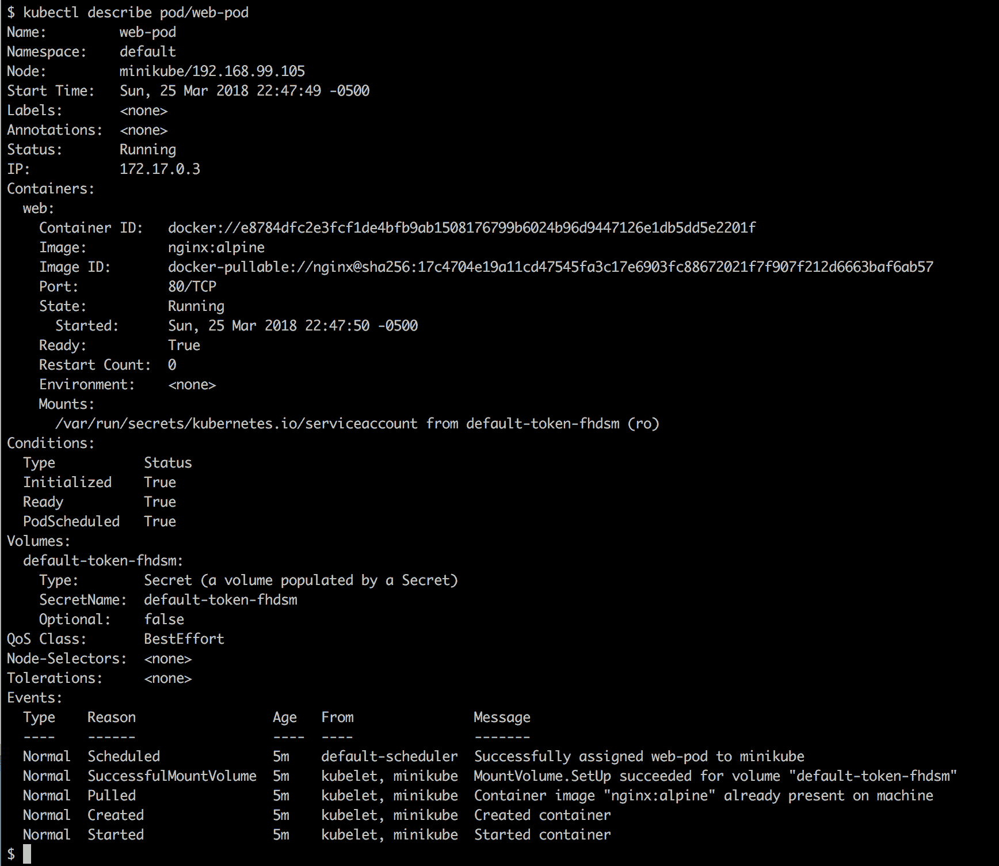

Describing a pod running in the cluster

请注意前面`describe`命令中的符号`pod/web-pod`。其他变体也是可能的，例如`pods/web-pod`或`po/web-pod`。`pod`和`po`是`pods`的别名。`kubectl`工具定义了很多别名，让我们的生活轻松一点。

`describe`命令给了我们大量关于吊舱的有价值的信息，尤其是这个吊舱受到影响时发生的事件列表。该列表显示在输出的末尾。

`Containers`部分的信息与我们在`docker container inspect`输出中找到的信息非常相似。

我们还看到一个带有一些类型为`Secret`的条目的`Volumes`部分。我们将在下一章讨论 Kubernetes 的机密。另一方面，接下来将讨论卷。

# 荚和卷

在关于容器的一章中，我们已经了解了卷及其访问和存储持久数据的目的。由于容器可以装载大量货物，豆荚也可以这样做。实际上，装载卷的确实是容器，但这只是一个语义细节。让我们首先看看如何在 Kubernetes 中定义一个卷。Kubernetes 支持过多的卷类型，我们不会过多地讨论这方面的细节。让我们通过定义一个名为`my-data-claim`的`PersistentVolumeClaim`来隐式创建一个本地卷:

```
apiVersion: v1
kind: PersistentVolumeClaim
metadata:
  name: my-data-claim
spec:
  accessModes:
    - ReadWriteOnce
  resources:
    requests:
      storage: 2Gi
```

我们定义了一个请求 2 GB 数据的声明。让我们创建这个声明:

```
$ kubectl create -f volume-claim.yaml
```

我们可以使用`kubectl` ( `pvc`是`PersistentVolumeClaim`的快捷方式)列出索赔:

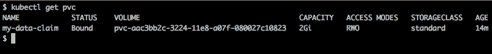

List of PersistentStorageClaim objects in the cluster

在输出中，我们可以看到声明已经隐式创建了一个名为`pvc-<ID>`的卷。我们现在可以在 pod 中使用索赔创建的卷了。让我们使用之前使用的 pod 规范的修改版本。我们可以在`ch12`文件夹的`pod-with-vol.yaml`文件中找到这个更新的规范。让我们详细看看这个规范:

```
apiVersion: v1
kind: Pod
metadata:
  name: web-pod
spec:
  containers:
  - name: web
    image: nginx:alpine
    ports:
    - containerPort: 80
    volumeMounts:
    - name: my-data
      mountPath: /data
  volumes:
  - name: my-data
    persistentVolumeClaim:
      claimName: my-data-claim
```

在最后四行中，在块`volumes`中，我们定义了要用于此 pod 的卷列表。我们在这里列出的卷可以被任何容器使用。在我们的特殊情况下，我们只有一卷。我们定义我们有一个卷`my-data`，它是一个持久的卷声明，其声明名称是我们之前刚刚创建的名称。然后在容器规范中，我们有`volumeMounts`块，在这里我们定义了我们想要使用的卷和容器内将要装载该卷的(绝对)路径。在我们的例子中，我们将卷装载到容器文件系统的`/data`文件夹中。让我们创建这个 pod:

```
$ kubectl create -f pod-with-vol.yaml
```

然后，我们可以将`exec`放入容器中，通过导航到`/data`文件夹来再次检查卷是否已经挂载，在那里创建一个文件，并退出容器:

```
$ kubectl exec -it web-pod -- /bin/sh
/ # cd /data
/data # echo "Hello world!" > sample.txt
/data # exit
```

如果我们是对的，那么这个容器中的数据必须持续到容器的生命周期之后。因此，让我们删除 pod，然后重新创建它并对其执行，以确保数据仍然存在。这就是结果:

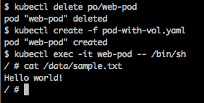

Data stored in volume survives pod recreation

# 立方复制集

在高可用性要求的环境中，单个 pod 是不够的。*如果吊舱坠毁怎么办？* *如果我们需要更新 pod 内运行的应用，但无法承受任何服务中断，该怎么办？*这些问题以及更多问题只能说明光有 pod 是不够的，我们需要一个更高级的概念，可以管理同一个 pod 的多个实例。在 Kubernetes 中，**复制集**用于定义和管理运行在不同集群节点上的相同豆荚的集合。其中，复制集定义了在一个容器内运行的容器使用哪些容器映像，以及该容器将在集群中运行多少个实例。这些属性和许多其他属性被称为期望状态。

复制集负责在任何时候协调期望的状态，如果实际状态曾经偏离它。这里有一个 Kubernetes 复制集:

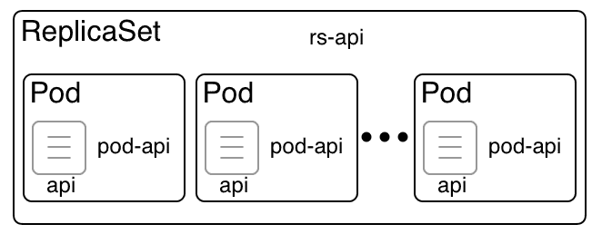

Kubernetes ReplicaSet

在上图中，我们看到了这样一个名为**RS-API**的复制集，它控制着许多豆荚。这些吊舱被称为**吊舱-api** 。复制器组负责确保在任何给定时间总是有期望数量的吊舱运行。如果其中一个 pod 由于某种原因崩溃，ReplicaSet 会在一个节点上调度一个新的 pod 来释放资源。如果豆荚的数量超过了期望的数量，那么复制集就会杀死多余的豆荚。因此，我们可以说，复制集保证了一个自我修复和可扩展的豆荚集。复制集可以由多少个豆荚组成没有限制。

# 复制集规范

类似于我们对豆荚的了解，Kubernetes 斯还允许我们强制或声明性地定义和创建一个`ReplicaSet`。由于在大多数情况下，声明式方法是目前推荐的方法，我们将集中讨论这种方法。这是一个 Kubernetes 斯`ReplicaSet`的样本规格:

```
apiVersion: apps/v1
kind: ReplicaSet
metadata:
  name: rs-web
spec:
  selector:
    matchLabels:
      app: web
  replicas: 3
  template: 
    metadata:
      labels:
        app: web
    spec:
      containers:
      - name: nginx
        image: nginx:alpine
        ports:
        - containerPort: 80
```

这看起来非常像我们之前介绍的 pod 规范。那么，让我们把注意力集中在差异上。首先，在第 2 行，我们有曾经的`Pod`和现在的`ReplicaSet`。然后，在第 6-8 行，我们有一个选择器来决定将成为`ReplicaSet`一部分的吊舱。在这种情况下，所有的豆荚都有一个标签`app`，值为`web`。然后，在第 9 行，我们定义要运行多少个 pod 副本；三，在这种情况下。最后，我们有`template`部分，它首先定义了`metadata`，然后是`spec`，它定义了在容器内运行的容器。在我们的例子中，我们有一个使用`nginx:alpine`映像和出口端口`80`的单个容器。

真正重要的元素是复制品的数量和选择器，选择器指定由`ReplicaSet`控制的一组豆荚。

在我们的`ch12`文件夹中，我们有一个名为`replicaset.yaml`的文件，它包含了前面的规范。让我们用这个文件来创建`ReplicaSet`:

```
$ kubectl create -f replicaset.yaml
replicaset "rs-web" created
```

如果我们列出集群中的所有副本集，我们会得到这个(`rs`是`replicaset`的快捷方式):

```
$ kubectl get rs
NAME     DESIRED   CURRENT   READY   AGE
rs-web   3         3         3       51s
```

在前面的输出中，我们可以看到我们有一个名为`rs-web`的复制集，它的期望状态是三(豆荚)。当前状态还显示三个吊舱，所有三个吊舱都准备好了。我们还可以列出系统中的所有吊舱，我们会得到:

```
$ kubectl get pods
NAME           READY   STATUS    RESTARTS   AGE
rs-web-6qzld   1/1     Running   0          4m
rs-web-frj2m   1/1     Running   0          4m
rs-web-zd2kt   1/1     Running   0          4m
```

在这里，我们看到了三个预期的吊舱。吊舱的名称使用复制集的名称，每个吊舱附加一个唯一的标识。在`READY`列中，我们看到在 pod 中定义了多少个容器，其中有多少个容器已经准备好了。在我们的例子中，每个吊舱只有一个容器，在每种情况下，它都是准备好的。因此，吊舱的整体状态为`Running`。我们还会看到每个吊舱需要重启多少次。在我们的例子中，我们还没有任何重启。

# 自愈

现在让我们通过随机杀死它的一个豆荚并观察将要发生的事情来测试`ReplicaSet`的自我修复的魔力。让我们从前面的列表中删除第一个窗格:

```
$ kubectl delete po/rs-web-6qzld
pod "rs-web-6qzld" deleted
```

然后，让我们再次列出所有的豆荚。我们预计只能看到两个吊舱，对吗？错误:

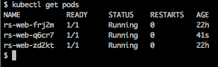

List of pods after having killed a pod of the ReplicaSet

好的，显然列表中的第二个窗格已经被重新创建，正如我们从`AGE`栏中看到的。这是行动中的自动修复。让我们看看如果我们描述复制集会发现什么:

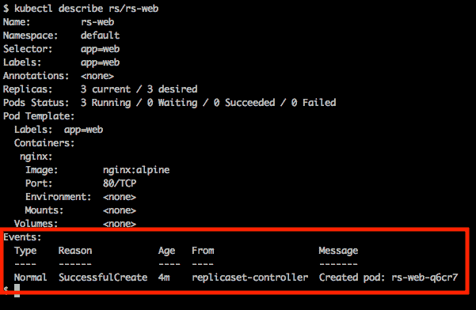

Describe the ReplicaSet

事实上，我们在`Events`下找到一个条目，告诉我们`ReplicaSet`创造了新的豆荚`rs-web-q6cr7`。

# 库比涅斯部署

Kubernetes 非常重视单一责任原则。所有 Kubernetes 对象都被设计成只做一件事。他们被设计来很好地做这件事。在这方面，我们必须了解 Kubernetes**副本集**和**部署**。我们已经了解到，复制集负责实现和协调应用服务的期望状态。这意味着复制集管理一组豆荚。

**部署**通过在其之上提供滚动更新和回滚功能来扩展副本集。在 Docker Swarm 中，Swarm 服务将包含复制集和部署的功能。在这一点上，SwarmKit 比 Kubernetes 要单一得多。下图显示了部署与复制集的关系:

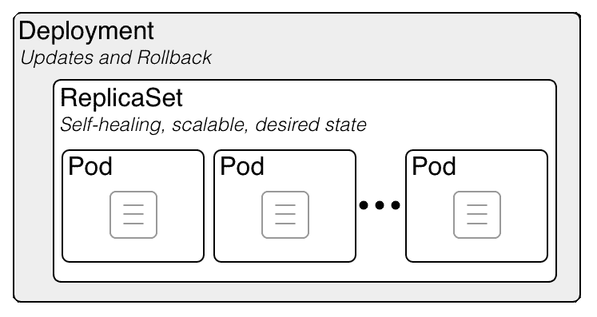

Kubernetes deployment

在上图中，**复制集**定义并管理一组相同的豆荚。ReplicaSet 的主要特点是自我修复、可扩展，并且总是尽最大努力协调所需的状态。Kubernetes 部署反过来为该板增加了滚动更新和回滚功能。在这方面，部署实际上是复制集的包装对象。

我们将在本书的下一章中了解更多关于滚动更新和回滚的信息。

# 库比涅斯的服务，库比涅斯的服务，库比涅斯的服务，库比涅斯的服务，库比涅斯的服务，库比涅斯的服务，库比涅斯的服务，库比涅斯的服务

当我们开始使用由多个应用服务组成的应用时，我们需要服务发现。在下图中，我们说明了这个问题:

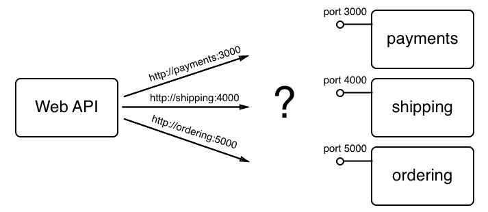

Service discovery

在此图中，我们有一个**网络应用编程接口**服务，需要访问其他三个服务— **支付**、**运输**和**订购**。网络应用编程接口在任何时候都不应该关心如何以及在哪里找到这三个服务。在 API 代码中，我们只想使用我们想要到达的服务的名称及其端口号。一个示例是用于访问支付服务实例的网址`http://payments:3000`。

在 Kubernetes 中，支付应用服务由一组复制的 pods 表示。由于高度分布式系统的性质，我们不能假设吊舱有稳定的端点。一个吊舱可以在一个软骨头里来来去去。但是，如果我们需要从内部或外部客户端访问相应的应用服务，这是一个问题。如果我们不能依赖 pod 端点稳定，*我们还能做什么？*

这就是 Kubernetes 服务发挥作用的地方。它们旨在为复制集或部署提供稳定的端点，如下所示:

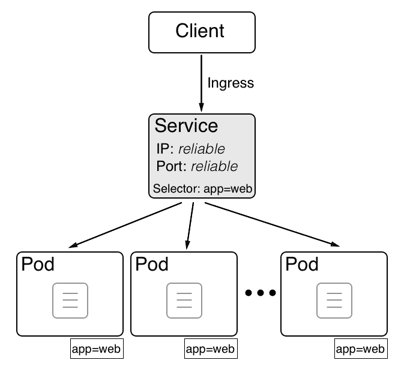

Kubernetes service providing stable endpoints to clients

在上图中，在中间，我们看到了这样一个 Kubernetes 服务。它提供了一个可靠的集群范围的 IP 地址，也称为**虚拟 IP** ( **贵宾**)，以及一个在整个集群中独一无二的可靠端口。Kubernetes 服务代理的荚由服务规范中定义的选择器决定。选择器总是基于标签。每个 Kubernetes 对象可以分配零到多个标签。在我们的例子中，选择器是 **app=web** ，也就是说，所有具有标签为 app 且值为 web 的豆荚都被代理。

# 基于上下文的路由

通常，我们希望为 Kubernetes 集群配置基于上下文的路由。Kubernetes 为我们提供了各种方法。此时，首选且最具可扩展性的方法是使用 **IngressController** 来完成这项工作。下图试图说明这个入口控制器是如何工作的:

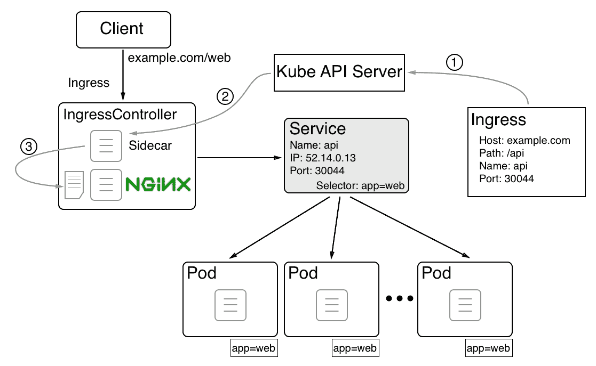

Context-based routing using a Kubernetes ingress controller

在此图中，我们可以看到使用入口控制器(如 Nginx)时，基于上下文(或第 7 层)的路由是如何工作的。这里，我们部署了一个名为 **web** 的应用服务。这个应用服务的所有豆荚都有一个标签 **app=web** 。然后，我们有一个名为 web 的 Kubernetes 服务，它为这些豆荚提供了一个稳定的端点。服务有一个`52.14.0.13`的(虚拟)IP，并公开端口`30044`。也就是说，如果一个名称为 **web** 和端口`30044`的请求到达 Kubernetes 集群的任何节点，那么它将被转发到这个服务。然后，服务将请求负载平衡到其中一个吊舱。

到目前为止还不错，*但是从客户端到 URL `http[s]://example.com/web`的入口请求是如何路由到我们的 web 服务的呢？*首先，我们必须定义从基于上下文的请求到相应的`<service name>/<port>`请求的路由。这是通过一个**入口**对象完成的:

1.  在入口对象中，我们将主机和路径定义为源，将(服务)名称和端口定义为目标。当这个入口对象由 Kubernetes API 服务器创建时，一个在 IngressController 中作为 sidecar 运行的进程会接受这个变化
2.  修改 Nginx 反向代理的配置文件
3.  通过添加新的路由，Nginx 然后被要求重新加载其配置，因此将能够正确地将任何传入的请求路由到`http[s]://example.com/web`。

# 将 FlowKit 与 Kubernetes 进行比较

现在，我们已经了解了 Kubernetes 中最重要的资源的许多细节，通过匹配重要的资源来比较两个编排器，即 SwarmKit 和 Kubernetes 是有帮助的。这是桌子:

| **群组** | **立方〔t1〕** | **描述** |
| 蜂群 | 串 | 由各自的编排者管理的一组服务器/节点。 |
| 结节 | 集群成员 | 作为群/集群成员的单个主机(物理或虚拟)。 |
| 管理器节点 | 掌握 | 管理群/集群的节点。这是控制平面。 |
| 工作节点 | 结节 | 运行应用工作负载的群/集群成员。 |
| 容器 | 容器** | 在节点上运行的容器映像的实例。在 Kubernetes 集群中，我们不能运行容器。 |
| 工作 | 豆荚 | 在节点上运行的服务(群)或复制集(Kubernetes)的实例。一个任务管理一个容器，而一个 Pod 包含一个到多个容器，它们共享同一个网络名称空间。 |
| 服务 | replication set-复制集 | 定义并协调由多个实例组成的应用服务的期望状态。 |
| 服务 | 部署 | 部署是一个具有滚动更新和回滚功能的复制集。 |
| 路由网格 | 服务 | 群路由网状网使用 IPVS 提供 L4 路由和负载平衡。Kubernetes 服务是一个抽象，它定义了一组逻辑的 pods 和访问它们的策略。它是一组吊舱的稳定端点。 |
| 堆 | 栈** | 由多个(群集)服务组成的应用的定义。虽然栈不是 Kubernetes 本地的，但 Docker 的工具 Docker for Mac 或 Windows 会将它们翻译成部署到 Kubernetes 集群上。 |
| 网络 | 网络策略 | Swarm **软件定义网络**(**sdn**)用于防火墙容器。Kubernetes 只定义了一个平面网络。除非明确定义网络策略来约束 pod 之间的通信，否则每个 pod 都可以到达其他每个 pod 和/或节点。 |

# 摘要

在本章中，我们学习了 Kubernetes 的基础知识。我们对它的体系结构进行了概述，并介绍了用于在 Kubernetes 集群中定义和运行应用的主要资源。我们还在 Docker 中引入了 Minikube 和 Kubernetes 对 Mac 和 Windows 的支持。

在下一章中，我们将把一个应用部署到 Kubernetes 集群中。然后，我们将使用零停机策略更新该应用的一项服务。最后，我们将使用机密来检测在 Kubernetes 中运行的带有敏感数据的应用服务。敬请关注。

# 问题

请回答以下问题来评估您的学习进度:

1.  用几句简短的话解释一下 Kubernetes 斯大师的角色是什么。
2.  列出需要出现在每个 Kubernetes(工作节点)上的元素。
3.  是或否:我们不能在 Kubernetes 集群中运行单个容器。
4.  解释为什么一个吊舱的容器可以使用`localhost`相互通信。
5.  吊舱中所谓的暂停容器的目的是什么？
6.  Bob 告诉您:*我们的应用由三个 Docker 映像组成:`web`、`inventory`、*、*和`db`。由于我们可以在一个 Kubernetes 容器中运行多个容器，我们将在一个容器*中部署我们应用的所有服务。列举三到四个为什么这是个坏主意的原因。
7.  用你自己的话解释为什么我们需要 Kubernetes 复制集。
8.  在什么情况下我们需要 Kubernetes 部署？
9.  列出至少三种类型的 Kubernetes 服务，并解释它们的目的和区别。

# 进一步阅读

以下是一个文章列表，其中包含本章中讨论的各种主题的更详细信息:

*   *在[https://raft.github.io/](https://raft.github.io/)的筏共识算法*
*   *复合式和立方式 Docker 与台式 Docker*at[https://docker . ly/2g 8iqb9](https://dockr.ly/2G8Iqb9)