# 使用 Kubernetes 部署、更新和保护应用

在最后一章中，我们学习了容器编排器 Kubernetes 的基础知识。我们对 Kubernetes 的架构有了一个高层次的概述，并了解了 Kubernetes 用来定义和管理容器化应用的重要对象。

在本章中，我们将学习如何将应用部署、更新和扩展到 Kubernetes 集群中。我们还将解释如何实现零宕机部署，以实现任务关键型应用的无中断更新和回滚。最后，在本章中，我们将介绍 Kubernetes 机密，作为配置服务和保护敏感数据的一种手段。

本章涵盖以下主题:

*   部署第一个应用
*   零停机部署
*   不可告人的机密

完成本章后，您将能够:

*   将多服务应用部署到 Kubernetes 集群中
*   更新在 Kubernetes 中运行的应用服务，而不会导致停机
*   定义Kubernetes集群中的机密
*   配置应用服务以使用 Kubernetes 机密

# 技术要求

在本章中，我们将在本地计算机上使用 Minikube。有关如何安装和使用 Minikube 的更多信息，请参考[第 2 章](02.html)、*设置工作环境、*。

本章的代码可以在`labs`文件夹的`ch13`子文件夹中找到。请确保您已经在[https://github.com/fundamentalsofdocker/labs,](https://github.com/fundamentalsofdocker/labs)克隆了 GitHub 存储库，如[第 2 章](02.html)、*设置工作环境*中所述。

在您的终端中，导航至文件夹`labs/ch13`。

# 部署第一个应用

我们将采用我们在[第 8 章](08.html)、 *Docker Compose、*中首次介绍的 pets 应用，并将其部署到 Kubernetes 集群中。我们的集群将是 Minikube，正如您所知，它是一个单节点集群。但是，从部署的角度来看，集群有多大以及位于何处并不重要，无论是在云中、公司的数据中心还是个人工作站上。

# 部署 web 组件

提醒一下，我们的应用由两个应用服务组成，基于 Node.js 的 web 组件和支持 PostgreSQL 的数据库。在前一章中，我们了解到需要为每个要部署的应用服务定义一个 Kubernetes `Deployment`对象。让我们首先为 web 组件做这件事。在本书中，我们将一如既往地选择声明性的方式来定义我们的对象。下面是 YAML 为 web 组件定义的`Deployment`对象:

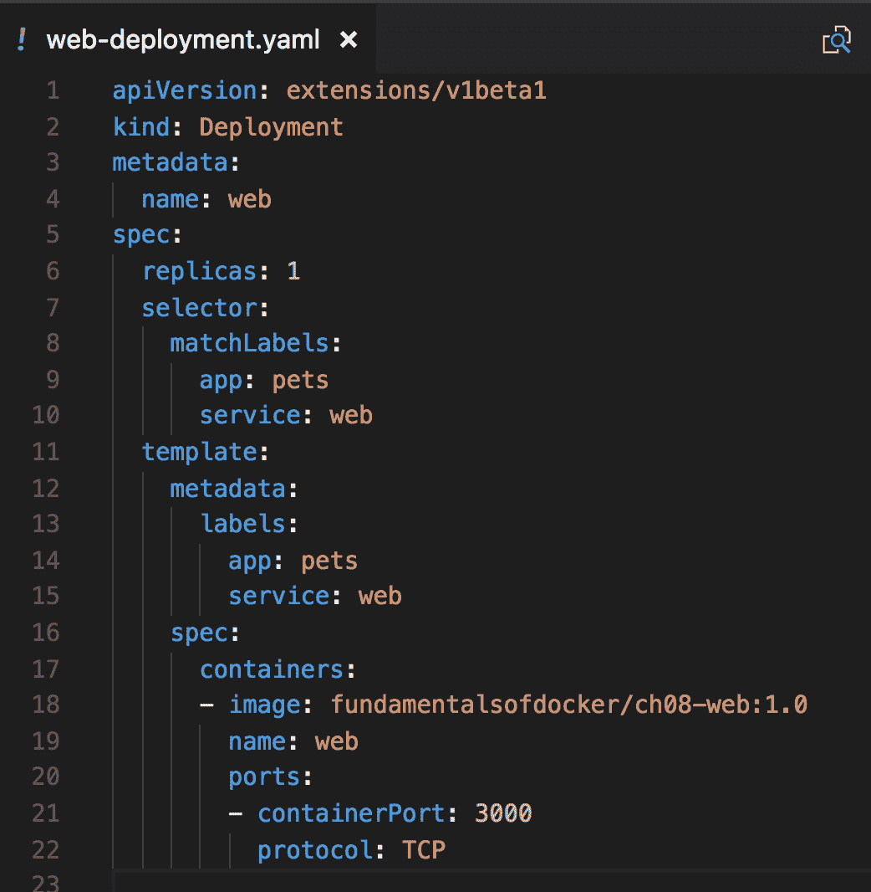

Kubernetes deployment definition for the web component 

前面的部署定义可以在`ch13`文件夹中的`web-deployment.yaml`文件中找到。代码行如下:

*   **在第 4 行**:我们将`Deployment`对象的`name`定义为`web`
*   **在第 6 行**:我们声明我们想要让`web`组件的一个实例运行
*   **从 8 号线到 10 号线**:我们定义了哪些吊舱将成为我们部署的一部分，即那些分别带有标签`app`和`service`以及数值`pets`和`web`的吊舱
*   **第 11 行**:在从第 11 行开始的豆荚模板中，我们定义每个豆荚将应用两个标签`app`和`service`
*   **从第 17 行**:我们定义将在吊舱中运行的单个容器。容器的映像是我们熟知的`fundamentalsofdocker/ch08-web:1.0`映像，容器的名称将是`web`
*   **端口**:最后，我们声明容器为 TCP 类型的流量公开端口`3000`

Please make sure that you have set the context of `kubectl` to `Minikube`. See [Chapter 2](02.html), *Setting up a Working Environment,* for details on how to do that.

我们可以使用`kubectl`部署这个`Deployment`对象:

```
$ kubectl create -f web-deployment.yaml
```

我们可以使用 Kubernetes CLI 再次检查部署是否已经创建，我们应该会看到以下输出:

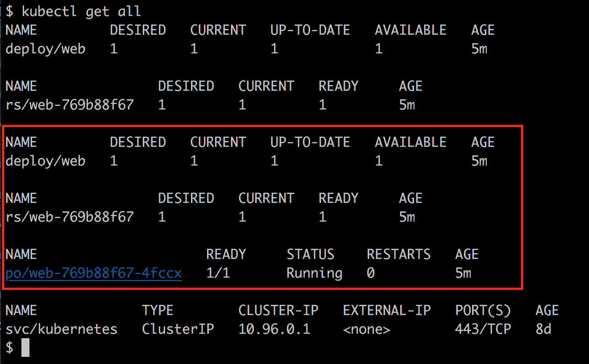

Listing all resources running in Minikube At the time of writing, there seems to be a bug in Minikube or `kubectl` that displays certain resources twice when using the command `kubectl get all`. You can just ignore the duplicate output.

在前面的输出中，我们看到 Kubernetes 创建了三个对象——部署、一个附属的`ReplicaSet`和一个单独的 pod(记得我们指定我们只需要一个副本)。当前状态对应于所有三个对象的期望状态，因此到目前为止我们都很好。

现在，网络服务需要向公众公开。为此，我们需要定义一个类型为`NodePort`的 Kubernetes `Service`对象。这是定义，可以在`labs`文件夹`ch13`的`web-service.yaml`文件中找到:

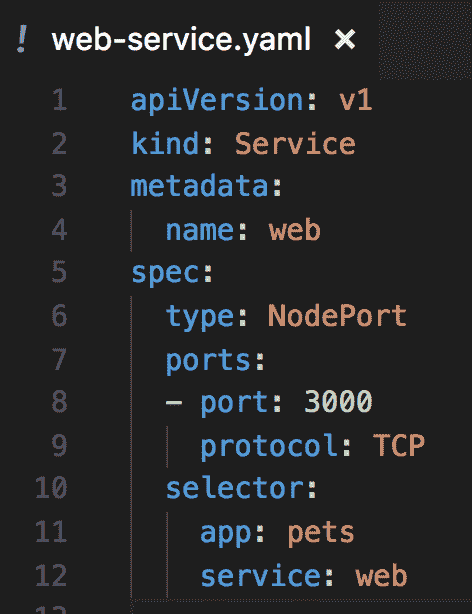

Definition of the Service object for our web component

前面几行代码如下:

*   **第 4 行**:我们将这个`Service`对象的名称设置为`web`。
*   **第 6 行**:我们定义正在使用的`Service`对象的类型。由于`web`组件必须可以从集群外部访问，因此它不能是`ClusterIP`类型的`Service`对象，而必须是`NodePort`或`LoadBalancer`类型。在前一章中，我们已经讨论了各种类型的 Kubernetes 服务，因此不再赘述。在我们的示例中，我们使用的是`NodePort`类型的服务。
*   **在第 8 行和第 9 行**:我们指定要公开端口`3000`以便通过 TCP 协议进行访问。Kubernetes 会自动将容器端口`3000`映射到 30，000 到 32，768 范围内的自由主机端口。Kubernetes 有效选择的端口可以在服务创建后使用`kubectl get service`或`kubectl describe`命令来确定。
*   **从 10 号线到 12 号线**:我们为豆荚定义了过滤标准，对于豆荚，该服务将是一个稳定的端点。在这种情况下，所有的豆荚都有标签`app`和`service`，分别带有数值`pets`和`web`。

有了这个`Service`对象的规范，我们可以使用`kubectl`来创建它:

```
$ kubectl create -f web-service.yaml
```

我们可以列出所有服务来查看前面命令的结果:

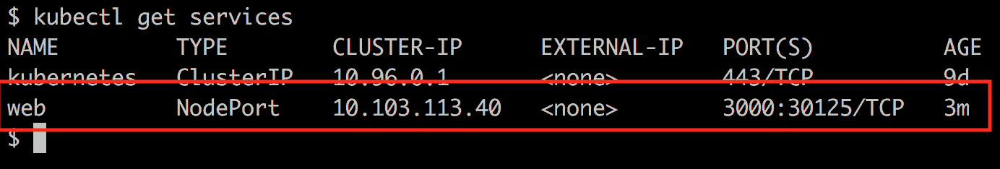

The Service object created for the web component

在输出中，我们看到已经创建了一个名为`web`的服务。唯一的`clusterIP` `10.103.113.40`已分配给该服务，容器港口`3000`已在所有集群节点的港口`30125`上发布。

如果我们想要测试这个部署，我们需要首先找出 Minikube 有什么 IP 地址，然后使用这个 IP 地址来访问我们的`web`服务。下面是我们可以用来执行此操作的命令:

```
$ IP=$(minikube ip)
$ curl -4 $IP:30125/
Pets Demo Application
```

好的，回应是`Pets Demo Application`，这也是我们所期待的。web 服务在 Kubernetes 集群中启动并运行。接下来，我们要部署数据库。

# 部署数据库

数据库是有状态的组件，必须与无状态组件区别对待，比如我们的 web 组件。我们已经在[第 6 章](06.html)、*分布式应用架构、*和[第 9 章](09.html)、*orchestrator*中详细讨论了分布式应用架构中有状态和无状态组件之间的区别。

Kubernetes 为有状态组件定义了一种特殊类型的`ReplicaSet`对象。这个物体叫做`StatefulSet`。让我们使用这种对象来部署我们的数据库。定义可以在`labs/ch13/db-stateful-set.yaml`文件中找到。详情如下:

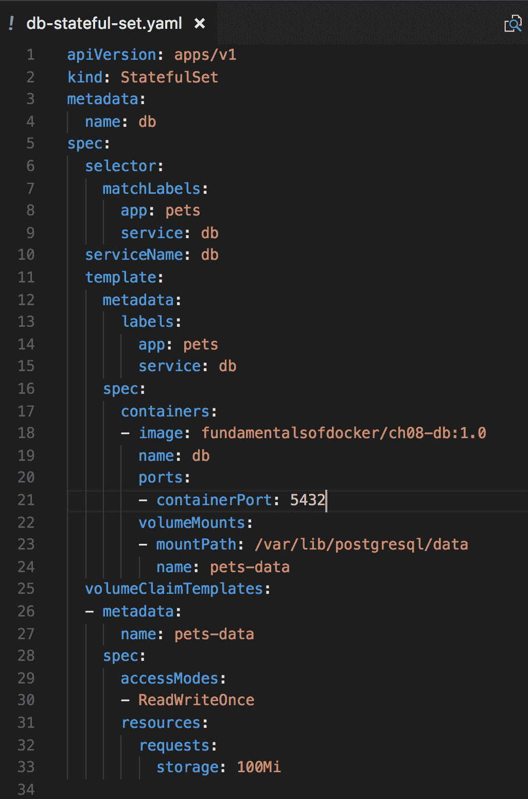

A StatefulSet for the DB component

好吧，这看起来有点可怕，但事实并非如此。它比 web 组件的部署定义要长一点，因为我们还需要定义一个 PostgreSQL 数据库可以存储数据的卷。批量索赔定义在第 25 行到第 33 行。我们想创建一个名为`pets-data`的卷，其最大大小等于 100 兆字节。在第 22 行到第 24 行，我们使用这个卷，并将其安装到 PostgreSQL 期望的容器`/var/lib/postgresql/data`中。在第 21 行，我们还声明 PostgreSQL 正在端口`5432`监听。

一如既往，我们使用`kubectl`来部署`StatefulSet`:

```
$ kubectl create -f db-stateful-set.yaml
```

如果我们现在列出集群中的所有资源，我们可以看到创建的附加对象:

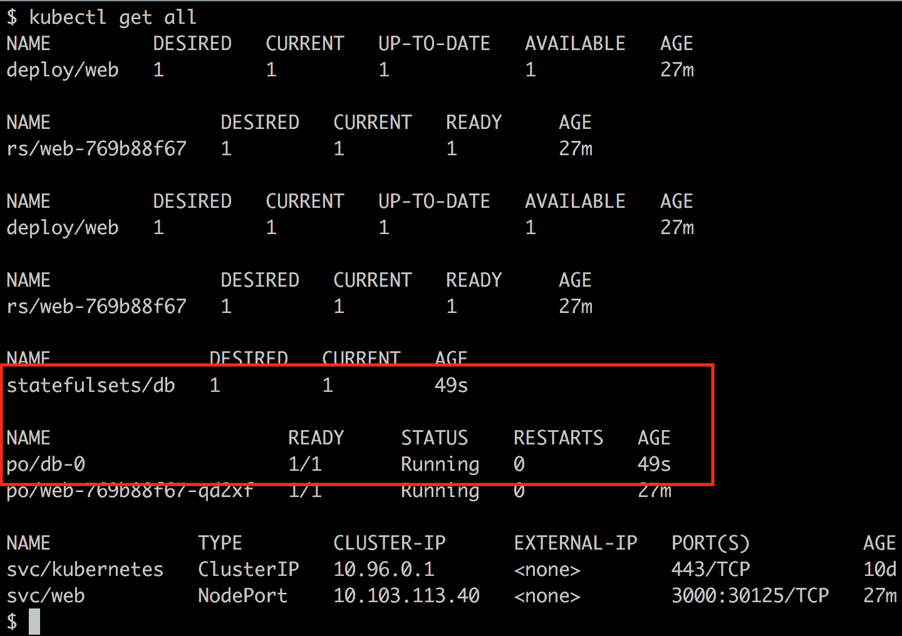

The StatefulSet and its pod

我们看到一个`StatefulSet`和一个豆荚已经被创造出来。对于这两种情况，当前状态对应于期望的状态，因此系统是健康的。但这并不意味着`web`组件此时可以访问数据库。服务发现目前还行不通。请记住，`web`组件想要以`db`的名称访问`db`服务。

为了使服务发现在集群中工作，我们还必须为数据库组件定义一个 Kubernetes `Service`对象。因为数据库应该只能从集群内部访问，所以我们需要的对象类型是`ClusterIP`。这是说明书，可以在`labs/ch13/db-service.yaml`文件中找到:

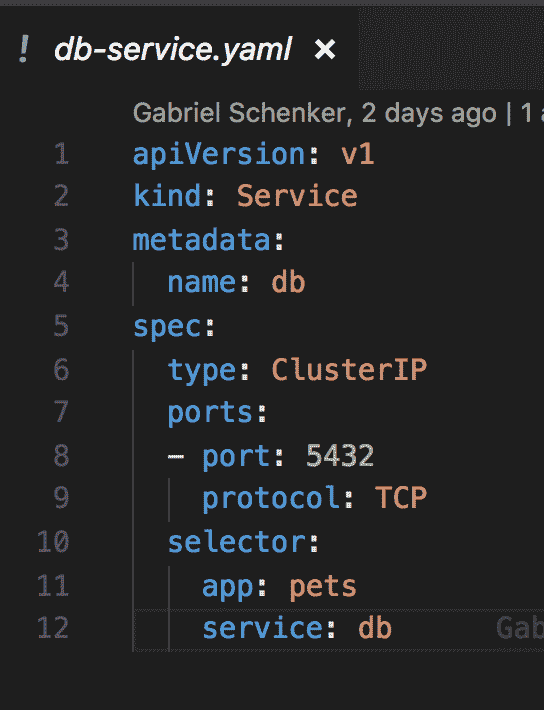

Definition of the Kubernetes Service object for the database

数据库组件将由这个`Service`对象表示，并且可以通过名称`db`到达，这是服务的名称，如第 4 行所定义的。数据库组件不必是公共可访问的，所以我们决定使用类型为`ClusterIP`的`Service`对象。第 10 行到第 12 行的选择器定义了该服务代表了定义了相应标签的所有吊舱的稳定端点，即`app: pets`和`service: db`。

让我们使用以下命令部署该服务:

```
$ kubectl create -f db-service.yaml
```

我们现在应该准备好测试应用了。这次我们可以使用浏览器欣赏有趣的猫形象:

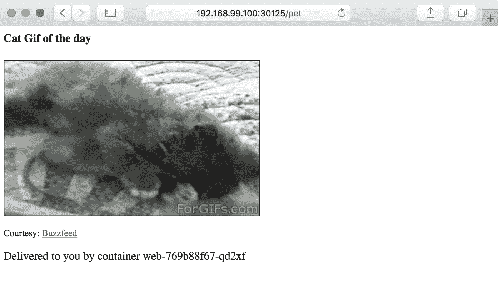

Testing the pets application running in Kubernetes `192.168.99.100` is the IP address of my Minikube. Verify your address using the command `minikube ip`. The port number `30125` is the number that Kubernetes automatically selected for my web `Service` object. Replace this number with the port that Kubernetes assigned to your service. Get the number by using the command **`kubectl get services`**.

现在，我们已经成功地将 pets 应用部署到 Minikube，这是一个单节点 Kubernetes 集群。为此，我们必须定义四个工件，如下所示:

*   网络组件的一个`Deployment`和一个`Service`对象
*   数据库组件的一个`StatefulSet`和一个`Service`对象

要从集群中删除应用，我们可以使用以下小脚本:

```
kubectl delete svc/web
kubectl delete deploy/web
kubectl delete svc/db
kubectl delete statefulset/db
```

# 简化部署

到目前为止，我们已经创建了四个需要部署到集群的工件。这只是一个非常简单的应用，由两个组件组成。想象一下有一个更复杂的应用。这将很快成为一场维护噩梦。幸运的是，关于如何简化部署，我们有几个选项。我们将在这里讨论的方法是在一个文件中定义构成 Kubernetes 应用的所有组件的可能性。

本书范围之外的其他解决方案包括使用包管理器，例如 **Helm** 。

如果我们有一个由许多 Kubernetes 对象组成的应用，例如`Deployment`和`Service`对象，那么我们可以将它们都保存在一个文件中，并用三个破折号分隔各个对象定义。例如，如果我们希望将 web 组件的部署和服务定义放在一个文件中，这将如下所示:

```
apiVersion: extensions/v1beta1
kind: Deployment
metadata:
  name: web
spec:
  replicas: 1
  selector:
    matchLabels:
      app: pets
      service: web
  template:
    metadata:
      labels:
        app: pets
        service: web
    spec:
      containers:
      - image: fundamentalsofdocker/ch08-web:1.0
        name: web
        ports:
        - containerPort: 3000
          protocol: TCP
---
apiVersion: v1
kind: Service
metadata:
  name: web
spec:
  type: NodePort
  ports:
  - port: 3000
    protocol: TCP
  selector:
    app: pets
    service: web
```

我们已经在`labs/ch13/pets.yaml`文件中收集了 pets 应用的所有四个对象定义，我们可以一次部署该应用:

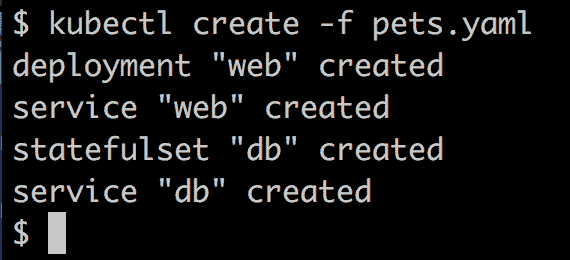

Using a single script to deploy the pets application

同样，我们创建了一个脚本`labs/ch13/remove-pets.sh`，从Kubernetes集群中移除 pets 应用的所有工件:

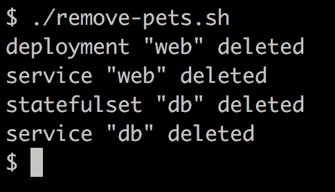

Removing pets from the Kubernetes cluster

我们已经采用了我们在[第 8 章](08.html)、 *Docker Compose、*中介绍的 pets 应用，并定义了将该应用部署到 Kubernetes 集群中所需的所有 Kubernetes 对象。在每一步中，我们都确保得到了预期的结果，一旦集群中存在所有工件，我们就展示了正在运行的应用。

# 零停机部署

在任务关键型环境中，应用始终处于启动和运行状态非常重要。这些天来，我们再也承受不起任何停机时间了。Kubernetes 为我们提供了实现这一目标的各种方法。集群中不导致停机的应用更新称为**零停机部署**。在本章中，我们将介绍实现这一目标的两种方法。这些措施如下:

*   滚动更新
*   蓝绿色部署

让我们从讨论滚动更新开始。

# 滚动更新

在前一章中，我们了解到 Kubernetes `Deployment`对象与`ReplicaSet`对象的区别在于，它在后者的功能之上添加了滚动更新和回滚。让我们用我们的`web`组件来演示这一点。显然，我们将不得不修改`web`组件的部署清单或描述。

我们将使用与上一节相同的部署定义，但有一个重要的区别——我们将运行 web 组件的五个副本。以下定义也可以在`labs/ch13/web-deploy-rolling-v1.yaml `文件中找到:

```
apiVersion: extensions/v1beta1
kind: Deployment
metadata:
  name: web
spec:
  replicas: 5
  selector:
    matchLabels:
      app: pets
      service: web
  template:
    metadata:
      labels:
        app: pets
        service: web
    spec:
      containers:
      - image: fundamentalsofdocker/ch08-web:1.0
        name: web
        ports:
        - containerPort: 3000
          protocol: TCP
```

我们现在可以像往常一样创建这个部署，同时还可以创建使我们的组件可访问的服务:

```
$ kubectl create -f web-deploy-rolling-v1.yaml
$ kubectl create -f web-service.yaml
```

一旦我们部署了 pods 和服务，我们就可以使用以下命令测试我们的 web 组件:

```
$ PORT=$(kubectl get svc/web -o yaml | grep nodePort | cut -d' ' -f5)
$ IP=$(minikube ip)
$ curl -4 ${IP}:${PORT}/
Pets Demo Application
```

如我们所见，应用已经启动并运行，并向我们返回了预期的消息`Pets Demo Application`。

现在我们的开发人员已经创建了新版本的`web`组件。新版本`web`组件的代码可以在` labs/ch13/web`文件夹中找到，唯一的变化位于文件`server.js`的第 12 行:

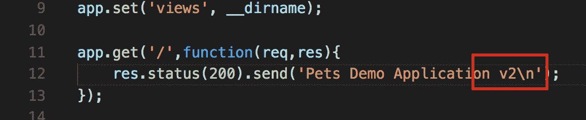

Code change for version 2.0 of the web component

开发人员构建了如下新映像:

```
$ docker image build -t fundamentalsofdocker/ch13-web:2.0 web
```

随后，他们将映像推送到 Docker Hub:

```
$ docker image push fundamentalsofdocker/ch13-web:2.0

```

我们现在想要更新我们的豆荚使用的映像，它是`web` `Deployment`对象的一部分。我们可以通过使用`kubectl`的`set image`命令来做到这一点:

```
$ kubectl set image deployment/web \
 web=fundamentalsofdocker/ch13-web:2.0
```

如果我们再次测试应用，我们会得到更新确实已经发生的确认:

```
curl -4 ${IP}:${PORT}/
Pets Demo Application v2
```

现在，*我们怎么知道这次更新没有停机？* *更新真的是滚动进行的吗？* *滚动更新到底是什么意思？*我们来调查一下。首先，通过使用`rollout status`命令，我们可以从 Kubernetes 获得部署确实已经发生并且成功的确认:

```
$ kubectl rollout status deploy/web
deployment "web" successfully rolled out
```

如果我们用`kubectl describe deploy/web`描述部署`web`，我们会在输出的末尾得到以下事件列表:

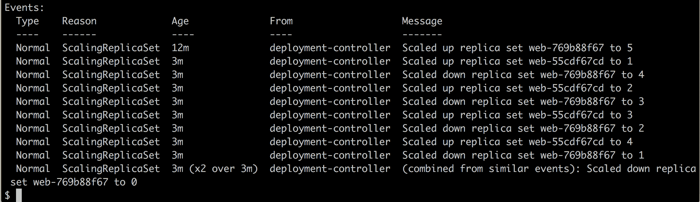

List of events found in the output of the deployment description of the web component

第一个事件告诉我们，当我们创建部署时，创建了一个具有五个副本的`ReplicaSet` `web-769b88f67`。然后我们执行`update`命令，列表中的第二个事件告诉我们，这意味着创建一个名为`web-55cdf67cd`的新`ReplicaSet`，最初只有一个副本。因此，在那个特殊的时刻，系统上有六个吊舱，五个初始吊舱，一个新版本的吊舱。但是由于`Deployment`对象的期望状态声明我们只想要五个副本，所以 Kubernetes 现在将旧的`ReplicaSet`缩小到四个实例，我们在第三个事件中看到了这一点。然后，新的`ReplicaSet`被放大到两个实例，随后，旧的`ReplicaSet`被缩小到三个实例，以此类推，直到我们有五个新的实例，并且所有旧的实例都被停用。虽然，我们看不到任何精确的时间(除了三分钟)，但是事件的顺序告诉我们，整个更新是以滚动的方式发生的。

在很短的时间内，对 web 服务的一些调用会收到来自旧版本组件的响应，一些调用会收到来自新版本组件的响应。但是这项服务从未中断过。

我们还可以列出集群中的`Recordset`对象，并将得到我在前面部分所说的确认:

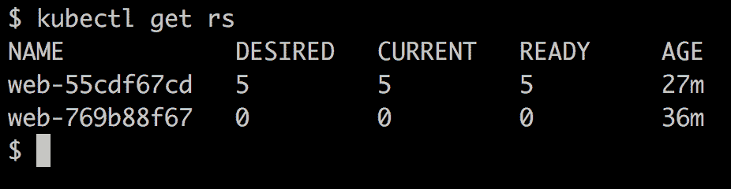

List all Recordset objects in the cluster

我们看到新的记录集有五个实例在运行，旧的记录集已经缩小到零个实例。旧的`Recordset`对象仍然存在的原因是 Kubernetes 为我们提供了回滚更新的可能性，在这种情况下，将重用`Recordset`。

为了在一些未被发现的 bug 潜入新代码的情况下回滚映像的更新，我们可以使用`rollout undo`命令:

```
$ kubectl rollout undo deploy/web
deployment "web"
$ curl -4 ${IP}:${PORT}/
Pets Demo Application
```

我还在前面的片段中使用`curl`列出了测试命令，以验证回滚确实发生了。如果我们列出记录集，我们会看到以下输出:

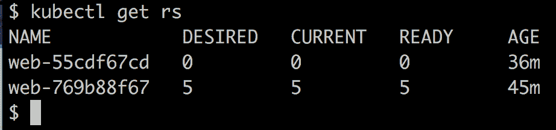

Listing RecordSet objects after rollback

这确认了旧的`RecordSet` ( `web-769b88f67`)对象已经被重用，并且新的对象已经缩小到零个实例。

尽管有时我们不能，或者不想，容忍旧版本和新版本共存的混合状态。我们想要一个全有或全无的策略。这就是蓝绿色部署发挥作用的地方，我们接下来将讨论这一点。

# 蓝绿部署

如果我们想为 pets 应用的组件 web 进行蓝绿色风格的部署，那么我们可以通过创造性地使用标签来实现。让我们首先提醒自己蓝绿部署是如何工作的。下面是一个粗略的分步说明:

1.  将组件的第一个版本`web`部署为`blue`。为此，我们将在豆荚上贴上标签`color: blue`。
2.  在`selector`部分为这些带有标签`color: blue`的豆荚部署 Kubernetes 服务。
3.  现在我们可以部署版本 2 的`web`组件，但是这次吊舱有一个标签，`color: green`。
4.  我们可以测试绿色版本的服务，它的工作如预期。
5.  现在，我们通过更新`web`组件的 Kubernetes 服务，将流量从`blue`转移到`green`。我们修改选择器使用标签`color: green`。

让我们为版本 1 定义一个`Deployment`对象，蓝色:

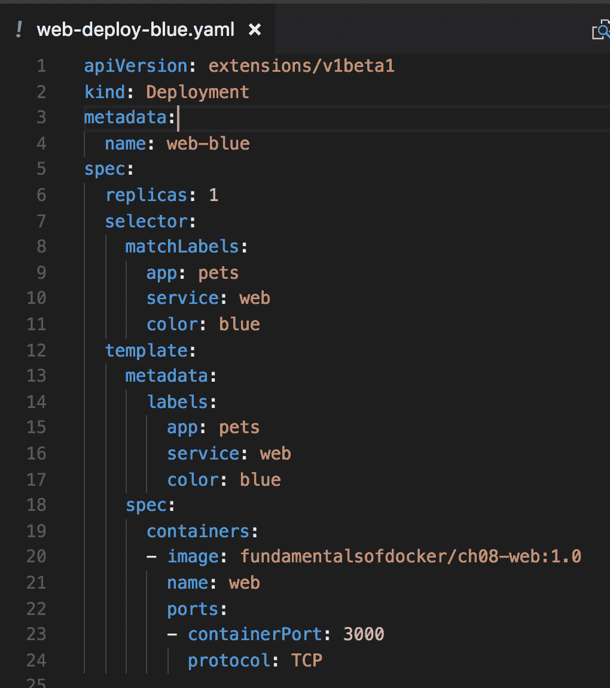

Specification of the deployment blue for the web component

前面的定义可以在`labs/ch13/web-deploy-blue.yaml `文件中找到。请注意第 4 行，我们将部署名称定义为`web-blue`，以区别于即将到来的部署`web-green`。还要注意，我们在第 11 行和第 17 行添加了标签`color: blue`。其他一切都和以前一样。

现在我们为`web`组件定义`Service`对象。它将与我们之前使用的相同，只是做了一些小的更改，您将在下面的截图中看到:


Kubernetes service for the web component supporting blue–green deployments

与我们在本章前面使用的服务定义唯一不同的是第 13 行，它在`selector`上添加了标签`color: blue`。我们可以在`labs/ch13/web-svc-blue-green.yaml `文件中找到前面的定义。

然后，我们可以使用以下命令部署`blue`版本的 web 组件:

```
$ kubectl create -f web-deploy-blue.yaml
$ kubectl create -f web-svc-blue-green.yaml
```

一旦服务启动并运行，我们就可以确定其 IP 地址和端口号，并对其进行测试:

```
$ PORT=$(kubectl get svc/web -o yaml | grep nodePort | cut -d' ' -f5)
$ IP=$(minikube ip)
$ curl -4 ${IP}:${PORT}/
Pets Demo Application
```

不出所料，我们得到了回应`Pets Demo Application`。

现在我们可以部署`green`版本的 web 组件了。其`Deployment`对象的定义可以在`labs/ch13/web-deploy-green.yaml`文件中找到，如下所示:

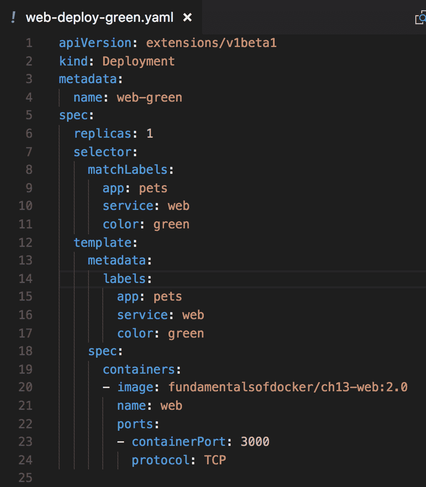

Specification of the deployment green for the web component

有趣的台词如下:

*   **4 号线**:用`web-green`来区别于`web-blue`，允许并联安装
*   **第 11、17 行**:有颜色`green`
*   **第 20 行**:现在使用版本`2.0`的图片

现在我们准备部署这个`green`版本的服务，它应该与`blue`服务分开运行:

```
$ kubectl create -f web-deploy-green.yaml
```

我们可以确保两种部署共存:

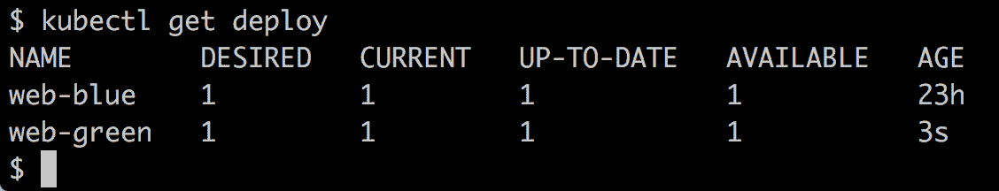

Displaying the list of Deployment objects running in the cluster

不出所料，我们同时运行了`blue`和`green`。我们可以证实`blue`仍然是现役军人:

```
$ curl -4 ${IP}:${PORT}/
Pets Demo Application
```

有趣的部分来了。我们可以通过编辑 web 组件的现有服务，将流量从`blue`翻转到`green`。因此，执行以下命令:

```
$ kubectl edit svc/web
```

将标签`color`的值从`blue`更改为`green`。然后保存并退出编辑器。Kubernetes 命令行界面将自动更新服务。当我们现在再次查询 web 服务时，我们会得到这样的结果:

```
$ curl -4 ${IP}:${PORT}/
Pets Demo Application v2
```

这确认了流量确实已经切换到了 web 组件的`green`版本(注意对`curl`命令的响应末尾的`v2`)。

如果我们意识到我们的绿色部署出了问题，并且新版本有缺陷，我们可以通过再次编辑服务网站并将标签颜色的值从`green`替换回`blue`来轻松切换回`blue`版本。这种回滚是即时的，应该总是有效的。然后，我们可以移除有问题的绿色部署并修复组件。当我们纠正了问题后，我们可以再次部署`green`版本。

一旦组件的`green`版本按预期运行并表现良好，我们就可以停用`blue`版本:

```
$ kubectl delete deploy/web-blue
```

当我们准备部署新版本 3.0 时，这个版本就变成了蓝色版本。我们相应地更新`labs/ch13/web-deploy-blue.yaml`文件并部署它。然后我们将服务网站从`green`翻转到`blue`，以此类推。

我们已经成功地用我们的 pets 应用组件`web`演示了如何在 Kubernetes 集群中实现蓝绿色部署。

# 不可告人的机密

有时，我们希望在 Kubernetes 集群中运行的服务必须使用机密数据，例如密码、机密 API 密钥或证书，仅举几例。我们希望确保这些敏感信息只能被授权或专门的服务机构看到。群集中运行的所有其他服务都不应对此数据有任何访问权限。

为此，引入了 Kubernetes 的机密。机密是密钥-值对，其中密钥是机密的唯一名称，值是实际的敏感数据。机密储存在 etcd 里。Kubernetes 可以配置为在静止时(即在 etcd 中)和传输时(即当机密从主节点通过线路传输到运行使用该机密的服务的 pods 的工作节点时)对机密进行加密。

# 手动定义机密

我们可以像在 Kubernetes 中创建任何其他对象一样，声明性地创建一个机密。下面是 YAML 的这么一个机密:

```
apiVersion: v1
kind: Secret
metadata:
  name: pets-secret
type: Opaque
data:
  username: am9obi5kb2UK
  password: c0VjcmV0LXBhc1N3MHJECg==
```

前面的定义可以在`labs/ch13/pets-secret.yaml `文件中找到。现在你可能想知道价值是什么。*这些是真实的(未加密的)值吗？*不，他们不是。它们也不是真正的加密值，只是`base64`编码值。因此，它们并不真正安全，因为 base64 编码的值可以很容易地还原为明文值。*我是怎么得到这些价值观的？*这很简单:

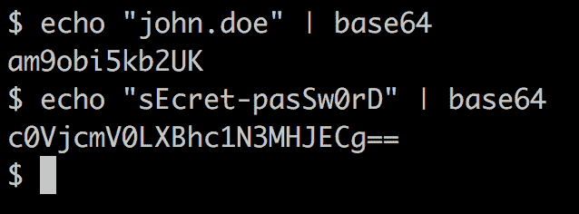

Creating base64-encoded values for the secret

然后我们可以创造机密并描述它:

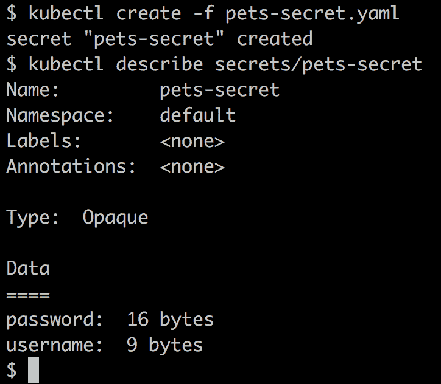

Creating and describing the Kubernetes secret

在机密的描述中，值是隐藏的，只给出了它们的长度。*那么也许机密现在安全了？*不，不是真的。我们可以使用`kubectl get`命令轻松破解这个机密:

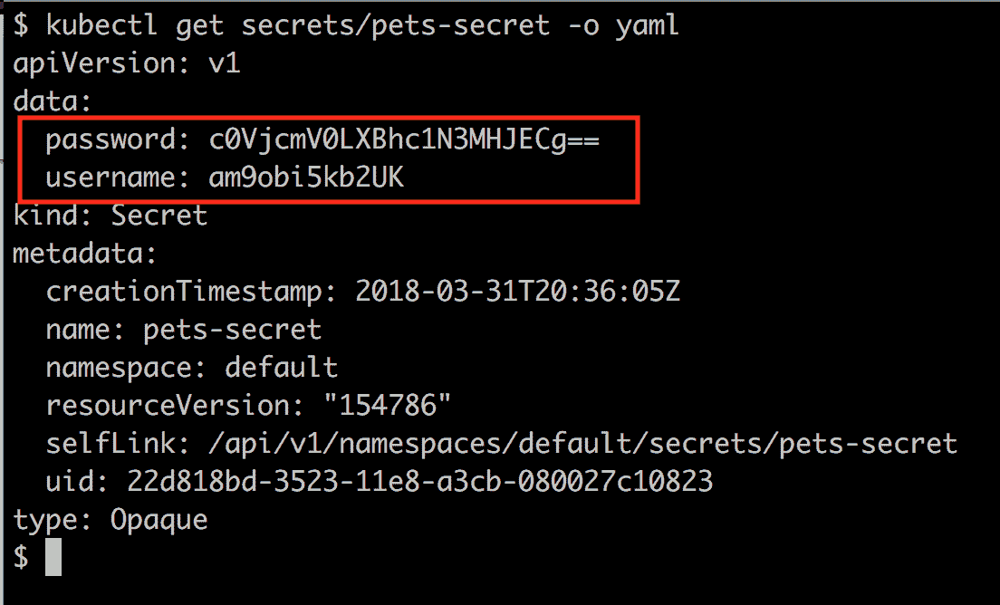

Kubernetes secret decoded

正如我们在前面的截图中看到的，我们恢复了原来的机密值。我们可以解码它们:

```
$ echo "c0VjcmV0LXBhc1N3MHJECg==" | base64 --decode
sEcret-pasSw0rD
```

因此，结果是这种创建 Kubernetes 的方法不能用于开发之外的任何环境，在开发环境中，我们处理非敏感数据。在所有其他环境中，我们需要一种更好的方式来处理机密。

# 用 kubectl 创造机密

更安全的定义机密的方法是使用`kubectl`。首先，我们创建包含 base64 编码机密值的文件，类似于我们在前面部分中所做的，但是这次我们将这些值存储在临时文件中:

```
$ echo "sue-hunter" | base64 > username.txt
$ echo "123abc456def" | base64 > password.txt
```

现在我们可以使用`kubectl`从这些文件中创建一个机密，如下所示:

```
$ kubectl create secret generic pets-secret-prod \
 --from-file=./username.txt \
 --from-file=./password.txt
secret "pets-secret-prod" created
```

这个机密可以像手动创建的机密一样使用。

*为什么这个方法比你可能会问的另一个方法更安全？*嗯，首先，没有 YAML 定义了一个机密，并存储在一些源代码版本控制系统中，比如 GitHub，很多人都可以访问它，所以可以看到和解码这个机密。只有被授权知道机密的管理员才能看到它们的值，并使用它们在(生产)集群中直接创建机密。集群本身受到基于角色的访问控制的保护，因此没有未经授权的人可以访问它，也不可能解码集群中定义的机密。

但是现在，让我们看看我们如何实际使用我们已经定义的机密。

# 在豆荚里使用机密

假设我们想要创建一个`Deployment`对象，其中`web`组件使用我们在前面部分中介绍的名为`pets-secret`的机密。我们使用以下命令在集群中创建机密:

```
$ kubectl create -f pets-secret.yaml
```

在`labs/ch13/web-deploy-secret.yaml`文件中，我们可以找到`Deployment`对象的定义。我们必须将从第 23 行开始的部分添加到`Deployment`对象的原始定义中:

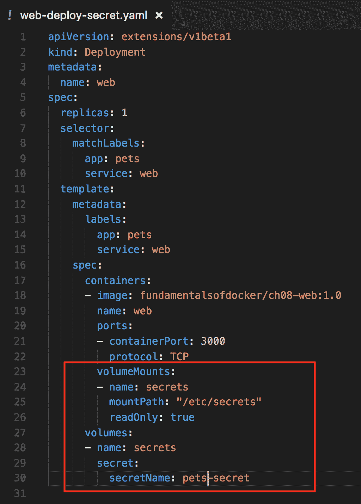

Deployment object for web component with a secret

在第 27 行到第 30 行，我们根据我们的机密`pets-secret`定义了一个名为`secrets`的体积。然后我们在容器中使用这个体积，如第 23 行到第 26 行所述。我们在`/etc/secrets`的容器文件系统中装载机密，并以只读模式装载卷。因此，机密值将作为所述文件夹中的文件对容器可用。文件的名称将对应于键名，文件的内容将是对应键的值。这些值将以未加密的形式提供给容器内运行的应用。

在我们的例子中，密钥的用户名和密码在机密中，我们将在容器文件系统的`/etc/secrets`文件夹中找到两个文件，名为`username`和`password`。文件`username`应该包含值`john.doe`，文件`password`应该包含值`sEcret-pasSw0rD`。以下是确认:

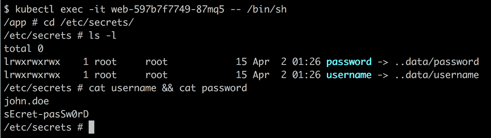

Confirming that secrets are available inside the container

在前面输出的第 1 行，我们执行到 web 组件运行的容器中。然后，在第 2 行到第 5 行，我们列出了`/etc/secrets`文件夹中的文件，最后，在第 6 行到第 8 行，我们显示了两个文件的内容，不出所料，这两个文件以明文形式显示了机密值。

因为用任何语言编写的任何应用都可以读取简单的文件，所以这种使用机密的机制是非常向后兼容的。即使是旧的 Cobol 应用也可以从文件系统中读取明文文件。

然而，有时应用期望机密在环境变量中可用。让我们看看在这种情况下 Kubernetes 为我们提供了什么。

# 环境变量中的机密值

假设我们的 web 组件需要环境变量`PETS_USERNAME`中的用户名和`PETS_PASSWORD`中的密码，那么我们可以修改我们的部署 YAML，如下所示:

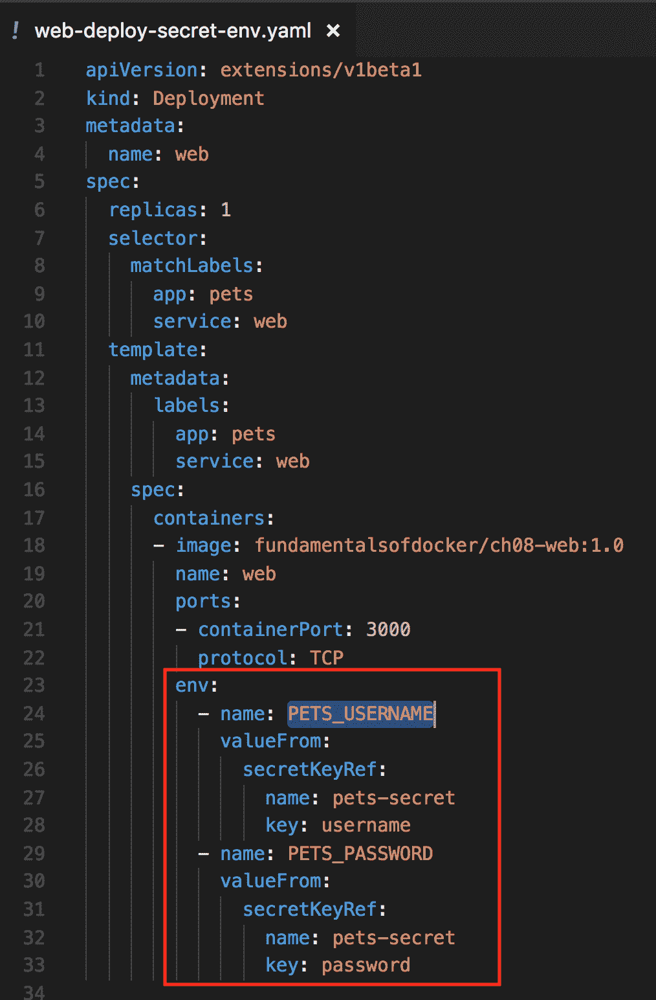

Deployment mapping secret values to environment variables

在第 23 行到第 33 行，我们定义了两个环境变量`PETS_USERNAME`和`PETS_PASSWORD`，并将`pets-secret`对应的键值对映射到它们。

注意，我们不再需要卷了，但是我们直接将`pets-secret`的各个键映射到容器内有效的相应环境变量中。下面的命令序列表明，机密值确实在容器内部的各个环境变量中可用:

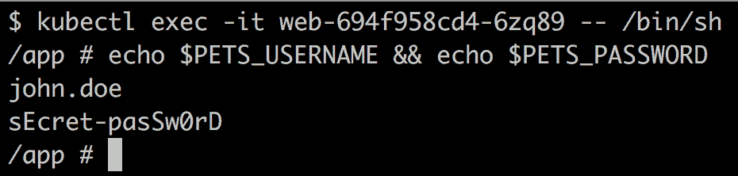

Secret values are mapped to environment variables

在本节中，我们展示了如何在 Kubernetes 集群中定义机密，以及如何在作为部署的一部分运行的容器中使用这些机密。我们展示了如何在容器中映射机密的两种变体，第一种使用文件，第二种使用环境变量。

# 摘要

在本章中，我们学习了如何将应用部署到 Kubernetes 集群中，以及如何为此应用设置应用级路由。此外，我们还学习了更新运行在 Kubernetes 集群中的应用服务而不导致任何停机的方法。最后，我们使用机密向集群中运行的应用服务提供敏感信息。

在下一章也是最后一章，我们将学习如何使用云供应商提供的不同产品在云中运行容器化的示例应用，例如微软 Azure、亚马逊 AWS 和谷歌云。敬请关注。

# 问题

要评估您的学习进度，请回答以下问题:

1.  您有一个由两个服务组成的应用，第一个是网络应用编程接口，第二个是数据库，比如 Mongo。您希望将该应用部署到 Kubernetes 集群中。用几句简短的话，解释你是如何进行的。
2.  用自己的话用几句话描述为应用建立第 7 层(或应用级)路由所需的组件。
3.  列出为简单应用服务实现蓝绿色部署所需的主要步骤。避免讲太多细节。
4.  说出您将通过 Kubernetes secrets 向应用服务提供的三四种类型的信息。
5.  说出 Kubernetes 在创建机密时接受的来源。

# 进一步阅读

以下几个链接提供了有关本章中讨论的主题的附加信息:

*   在[https://bit.ly/2o2okEQ](https://bit.ly/2o2okEQ)执行滚动更新
*   蓝绿部署在[https://bit.ly/2r2IxNJ](https://bit.ly/2r2IxNJ)
*   https://bit.ly/2C6hMZF Kubernetes的机密