# 码头工人概述

欢迎来到*掌握码头工人* *，第三版*！第一章将介绍 Docker 的基础知识，你应该已经掌握了。但是如果你在这一点上还没有所需的知识，这一章将帮助你掌握基础知识，这样后续章节就不会觉得那么沉重。到本书结束时，您应该是一名 Docker 大师，并且能够在您的环境中实现 Docker，在它们之上构建和支持应用。

在本章中，我们将回顾以下高级主题:

*   理解码头工人
*   专用主机、虚拟机和 Docker 之间的区别
*   坞站安装程序/安装
*   码头工人命令
*   码头工人和集装箱生态系统

# 技术要求

在本章中，我们将讨论如何在本地安装 Docker。为此，您需要一台运行以下三种操作系统之一的主机:

*   麦考高中及以上
*   Windows 10 专业版
*   Ubuntu 18.04

查看以下视频，了解《行为准则》:

[http://bit.ly/2NXf3rd](http://bit.ly/2NXf3rd)

# 理解码头工人

在我们考虑安装 Docker 之前，让我们先了解一下 Docker 技术旨在解决的问题。

# 开发商

Docker 背后的公司一直将该程序描述为修复了“*它在我的机器上工作”*的问题。这个问题最好用一个基于灾难女孩迷因的图片来总结，这个图片有一个标语*在开发中运行良好，现在是运营问题*，几年前开始出现在演示、论坛和 Slack 频道。虽然这很有趣，但不幸的是，这是一个太真实的问题，也是我个人最关心的问题——让我们看一个例子，说明这是什么意思。

# 问题是

即使在遵循 DevOps 最佳实践的世界中，开发人员的工作环境仍然很容易与最终的生产环境不匹配。

例如，使用例如 PHP 的 macOS 版本的开发人员可能不会运行与托管生产代码的 Linux 服务器相同的版本。即使版本匹配，您也必须处理运行 PHP 版本的配置和整体环境中的差异，例如不同操作系统版本之间处理文件权限的方式差异，这只是一个潜在的问题。

当开发人员需要将他们的代码部署到宿主时，所有这些都变得不可思议，并且不起作用。那么，应该将生产环境配置为与开发人员的机器相匹配，还是开发人员应该只在与生产中使用的环境相匹配的环境中工作？

在理想的世界中，一切都应该是一致的，从开发人员的笔记本电脑一直到您的生产服务器；然而，这个乌托邦传统上很难实现。每个人都有自己的工作方式和个人偏好——当只有一个工程师在系统上工作时，在多个平台上实现一致性就足够困难了，更不用说一个工程师团队与一个可能有数百名开发人员的团队合作了。

# Docker 解决方案

使用 Docker for Mac 或 Docker for Windows，开发人员可以在与系统管理员或运营团队一起工作时，轻松地将他们的代码包装在他们自己定义的容器中，或者创建为 Dockerfile。我们将在[第 2 章](02.html)、*构建容器映像*以及 Docker Compose 文件中对此进行介绍，我们将在[第 5 章](05.html)、 *Docker Compose* 中对此进行更详细的介绍。

他们可以继续使用他们选择的集成开发环境，并在使用代码时维护他们的工作流。正如我们将在本章接下来的章节中看到的，安装和使用 Docker 并不难；事实上，考虑到在过去保持一致的环境是一件多么繁重的家务，即使有自动化，Docker 也觉得有点太容易了——几乎就像作弊一样。

# 经营者

我从事运营工作的时间比我想承认的要长，下面这个问题经常出现。

# 问题是

假设您正在管理五个服务器:三个负载平衡的 web 服务器，以及两个数据库服务器，它们处于专门运行应用 1 的主或从配置中。您正在使用一个工具，如木偶或厨师，来自动管理您的五个服务器的软件堆栈和配置。

一切都很顺利，直到你被告知*我们需要在运行应用 1* 的相同服务器上部署应用 2。从表面上看，这没有问题——您可以调整您的 Puppet 或 Chef 配置来添加新用户、vhosts、拉下新代码等等。但是，您注意到应用 2 需要您为应用 1 运行的软件的更高版本。

更糟糕的是，您已经知道应用 1 完全拒绝使用新的软件堆栈，并且应用 2 不是向后兼容的。

传统上，这给你留下了一些选择，所有这些都以这样或那样的方式增加了问题:

1.  要求更多服务器？虽然这在传统上可能是最安全的技术解决方案，但它并不自动意味着会有额外资源的预算。
2.  重新设计解决方案？从技术角度来看，从负载平衡器或复制中取出一个 web 和数据库服务器，并用应用 2 的软件堆栈重新部署它们，似乎是下一个最简单的选择。但是，您为应用 2 引入了单点故障，也减少了应用 1 的冗余:最初运行三个 web 服务器和两个数据库服务器可能是有原因的。
3.  尝试在您的服务器上并排安装新的软件堆栈？嗯，这当然是可能的，看起来是一个很好的短期计划，可以让项目走出大门，但它可能会给你留下一堆卡片，当任何一个软件堆栈都需要第一个关键的安全补丁时，这些卡片可能会倒塌。

# Docker 解决方案

这就是 Docker 开始独辟蹊径的地方。如果您让应用 1 在容器中跨三个 web 服务器运行，那么您实际上可能运行了三个以上的容器；事实上，您可能已经运行了六个，在容器上加倍，允许您运行应用的滚动部署，而不会降低应用 1 的可用性。

在这种环境中部署应用 2 很简单，只需跨三个主机启动更多容器，然后使用负载平衡器路由到新部署的应用。因为您只是在部署容器，所以不需要担心在同一台服务器上部署、配置和管理同一个软件堆栈的两个版本的后勤工作。

我们将在 [第 5 章](05.html)*Docker Compose*中研究这个确切场景的示例。

# 企业

企业面临着与前面描述的相同的问题，因为它们既有开发人员，也有运营商；然而，他们同时拥有这两个实体，规模要大得多，而且涉及的风险也要大得多。

# 问题是

由于前面提到的风险，以及任何宕机都可能导致销售损失或影响声誉的事实，企业需要在发布之前测试每个部署。这意味着，当发生以下情况时，新特性和修复会停留在保持模式中:

*   测试环境被加速和配置
*   应用部署在新启动的环境中
*   执行测试计划，调整应用和配置，直到测试通过
*   编写、提交和讨论变更请求，以便将更新的应用部署到生产中

这个过程可能需要几天到几周，甚至几个月，这取决于应用的复杂性和变更带来的风险。虽然该流程是确保企业在技术层面的连续性和可用性所必需的，但它确实有可能在业务层面引入风险。如果你有一个新的特性卡在这个保持模式中，而竞争对手在你前面发布了一个类似的——或者更糟的——相同的特性，会怎么样？

这种情况对销售和声誉的损害可能与最初为保护您而实施的流程的停机时间一样大。

# Docker 解决方案

我首先要说的是，Docker 并没有消除像刚才描述的那样的流程存在或被遵循的需要。然而，正如我们已经谈到的，这确实让事情变得容易得多，因为你已经在持续地工作。这意味着您的开发人员一直在使用生产环境中运行的相同容器配置。这意味着这并不是将方法应用于测试的重要步骤。

例如，当开发人员检查他们的代码时，他们知道这些代码可以在他们的本地开发环境中工作(因为这是他们一直在做的工作)，您的测试工具可以启动相同的容器来运行您的自动化测试。一旦容器被使用，它们就可以被移除，为下一批测试释放资源。这意味着，突然间，您的测试过程和步骤变得更加灵活，您可以继续重用同一个环境，而不是为下一组测试重新部署或重新映像服务器。

这种流程的简化可以延伸到让您的新应用容器一直推进到生产。

这个过程完成得越快，你就能越快自信地推出新功能或修复，并保持领先。

# 专用主机、虚拟机和 Docker 之间的区别

所以，我们知道 Docker 是为了解决什么问题而开发的。我们现在需要讨论 Docker 到底是什么，它是做什么的。

Docker 是一个容器管理系统，帮助我们以更简单和通用的方式轻松管理 **Linux 容器(LXC)** 。这使您可以在笔记本电脑上的虚拟环境中创建映像，并对其运行命令。当容器在您的生产环境中运行时，您对容器执行的操作(在这些环境中本地运行于您的机器上)将与您对它们运行的命令或操作相同。

这有助于我们，因为当您从开发环境(如本地计算机上的开发环境)进入服务器上的生产环境时，您不必做不同的事情。现在，让我们看看 Docker 容器和典型虚拟机环境之间的区别。

下图展示了专用裸机服务器和运行虚拟机的服务器之间的区别:

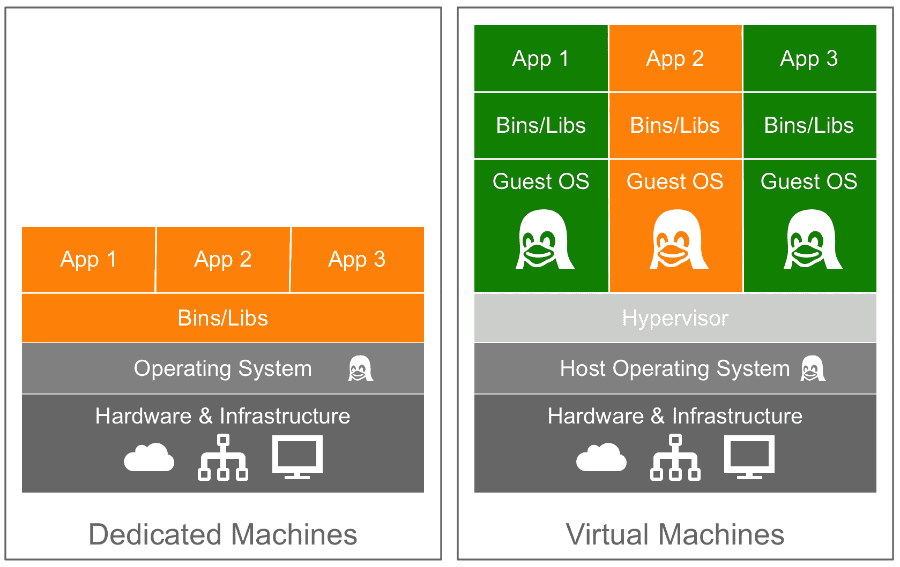

如您所见，对于一台专用机器，我们有三个应用，它们共享同一个橙色软件堆栈。运行虚拟机允许我们运行三个应用，运行两个完全不同的软件堆栈。下图显示了使用 Docker 在容器中运行的相同橙色和绿色应用:

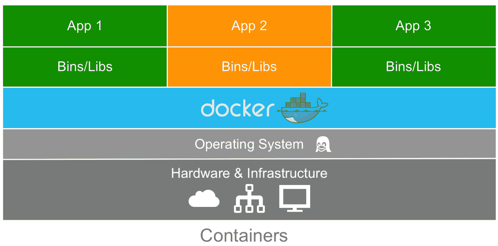

这个图让我们对 Docker 最大的关键好处有了很大的了解，那就是每次我们需要调出一个新的容器时，都不需要一个完整的操作系统，这就减少了容器的整体大小。由于几乎所有版本的 Linux 都使用标准内核模型，Docker 依赖于将主机操作系统的 Linux 内核用于其所基于的操作系统，如红帽、CentOS 和 Ubuntu。

由于这个原因，您几乎可以将任何 Linux 操作系统作为您的主机操作系统，并且能够在主机之上分层其他基于 Linux 的操作系统。嗯，也就是说，您的应用被引导相信实际上已经安装了完整的操作系统，但实际上，我们只安装二进制文件，例如包管理器，以及 Apache/PHP 和所需的库，以便获得足够的操作系统来运行您的应用。

例如，在前面的图表中，我们可以让 Red Hat 运行橙色应用，Debian 运行绿色应用，但是永远不需要在主机上实际安装 Red Hat 或 Debian。因此，Docker 的另一个好处是创建映像时的大小。它们的构建没有最大的部分:内核或操作系统。这使得它们非常小，紧凑，易于运输。

# 码头工人安装

安装程序是您首先需要在本地计算机和服务器环境中使用 Docker 启动和运行的部分之一。让我们先来看看可以在哪些环境中安装 Docker:

*   Linux(各种 Linux 风格)
*   苹果电脑
*   Windows 10 专业版

此外，您可以在公共云上运行它们，例如亚马逊网络服务、微软 Azure 和数字海洋等。对于前面列出的各种类型的安装程序，Docker 实际上在操作系统上以不同的方式运行。例如，Docker 在 Linux 上本地运行，所以如果您正在使用 Linux，那么 Docker 如何在您的系统上运行是非常简单的。但是，如果您使用的是 macOS 或 Windows 10，那么它的操作方式会有些不同，因为它依赖于使用 Linux。

让我们看看如何在运行 Ubuntu 18.04 的 Linux 桌面上快速安装 Docker，然后在 macOS 和 Windows 10 上安装。

# 在 Linux 上安装 Docker(Ubuntu 18.04)

如前所述，这是我们将看到的三个系统中最简单的安装。要安装 Docker，只需从终端会话运行以下命令:

```
$ curl -sSL https://get.docker.com/ | sh
$ sudo systemctl start docker
```

还会要求您将当前用户添加到 Docker 组。为此，请运行以下命令，确保将用户名替换为您自己的用户名:

```
$ sudo usermod -aG docker username
```

这些命令将从 Docker 自己下载、安装和配置 Docker 的最新版本。在撰写本文时，官方安装脚本安装的 Linux 操作系统版本是 18.06。

运行以下命令应确认 Docker 已安装并正在运行:

```
$ docker version
```

您应该会看到类似于以下输出的内容:

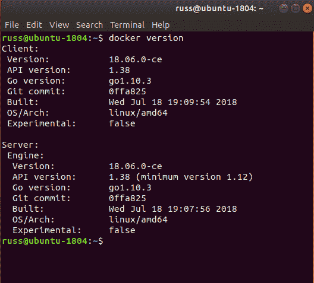

我们将在未来的章节中使用两个支持工具，它们是作为 macOS 或 Windows 10 安装程序的 Docker 的一部分安装的。

为了确保我们准备好在后面的章节中使用这些工具，我们现在应该安装它们。第一个工具是**码头工人机器**。要安装这个，我们首先需要获得最新的版本号。你可以在[https://github.com/docker/machine/releases/](https://github.com/docker/machine/releases/)的项目 GitHub 页面的发布部分找到这个。在撰写本文时，版本为 0 . 15 . 0—安装时，请使用最新版本更新以下代码块中命令的版本号:

```
$ MACHINEVERSION=0.15.0
$ curl -L https://github.com/docker/machine/releases/download/v$MACHINEVERSION/docker-machine-$(uname -s)-$(uname -m) >/tmp/docker-machine
$ chmod +x /tmp/docker-machine
$ sudo mv /tmp/docker-machine /usr/local/bin/docker-machine
```

要下载并安装下一个也是最后一个工具 **Docker Compose** ，运行以下命令，通过访问位于[https://github.com/docker/compose/releases/](https://github.com/docker/compose/releases/)的发布页面再次检查您正在运行最新版本:

```
$ COMPOSEVERSION=1.22.0
$ curl -L https://github.com/docker/compose/releases/download/$COMPOSEVERSION/docker-compose-`uname -s`-`uname -m` >/tmp/docker-compose
$ chmod +x /tmp/docker-compose
$ sudo mv /tmp/docker-compose /usr/local/bin/docker-compose
```

安装后，您应该能够运行以下两个命令来确认软件版本是否正确:

```
$ docker-machine version
$ docker-compose version
```

# 在 macOS 上安装 docker

与命令行 Linux 安装不同，Docker for Mac 有一个图形安装程序。

Before downloading, you should make sure that you are running Apple macOS Yosemite 10.10.3 or above. If you are running an older version, all is not lost; you can still run Docker. Refer to the other older operating systems section of this chapter.

可以从 Docker 商店下载安装程序，网址为[https://store . Docker . com/editions/community/Docker-ce-desktop-MAC](https://store.docker.com/editions/community/docker-ce-desktop-mac)。只需点击获取 Docker 链接。下载后，您应该有一个 DMG 文件。双击它将挂载该映像，打开挂载在桌面上的映像应该会显示如下内容:

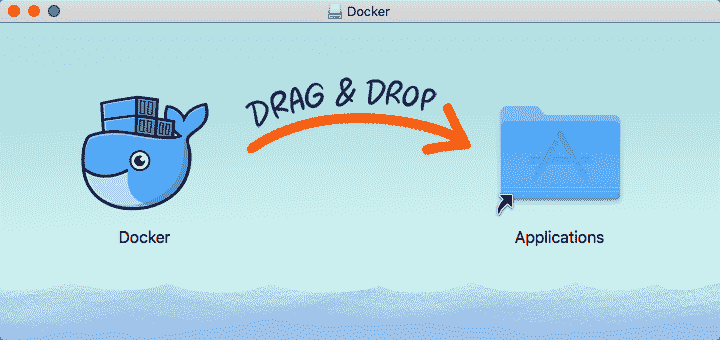

将 Docker 图标拖到“应用”文件夹后，双击它，系统会询问您是否要打开已下载的应用。单击是将打开 Docker 安装程序，显示如下内容:

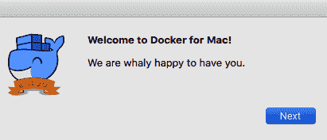

单击下一步，并按照屏幕上的说明进行操作。安装并启动后，您应该会在屏幕左上角的图标栏中看到一个 Docker 图标。单击图标并选择“关于码头工人”将向您显示类似于以下内容的内容:

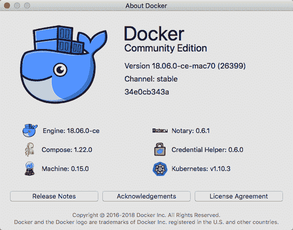

您也可以打开终端窗口。运行以下命令，就像我们在 Linux 安装中所做的那样:

```
$ docker version
```

您应该会看到类似以下终端输出的内容:

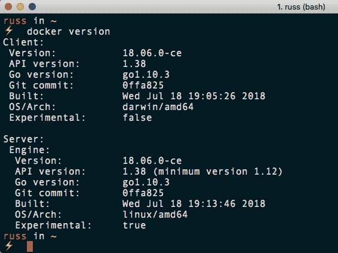

您还可以运行以下命令来检查安装在 Docker 引擎旁边的 Docker Compose 和 Docker Machine 版本:

```
$ docker-compose version
$ docker-machine version 
```

# 在 Windows 10 专业版上安装 Docker

和 Mac 的 Docker 一样，Windows 的 Docker 也使用图形安装程序。

Before downloading, you should make sure that you are running Microsoft Windows 10 Professional or Enterprise 64-bit. If you are running an older version or an unsupported edition of Windows 10, you can still run Docker; refer to the other older operating systems section of this chapter for more information. 

Docker for Windows has this requirement due to its reliance on Hyper-V. Hyper-V is Windows' native hypervisor and allows you to run x86-64 guests on your Windows machine, be it Windows 10 Professional or Windows Server. It even forms part of the Xbox One operating system.

您可以从 Docker 商店下载 Docker for Windows 安装程序，网址为[https://store . Docker . com/editions/community/Docker-ce-desktop-Windows/](https://store.docker.com/editions/community/docker-ce-desktop-windows/)。只需点击获取 Docker 按钮下载安装程序。下载后，运行 MSI 包，您将收到以下消息:


单击是，然后按照屏幕上的提示进行操作，这不仅需要安装 Docker，还需要启用 Hyper-V(如果您尚未启用的话)。

安装后，您应该会在屏幕右下角的图标托盘中看到一个 Docker 图标。单击它并从菜单中选择关于码头工人将显示以下内容:

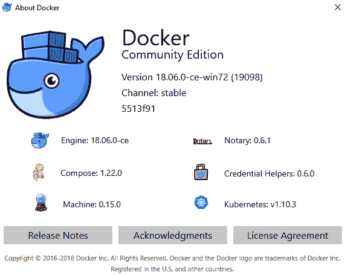

打开一个 PowerShell 窗口，键入以下命令:

```
$ docker version
```

这也将向您显示类似于 Mac 和 Linux 版本的输出:

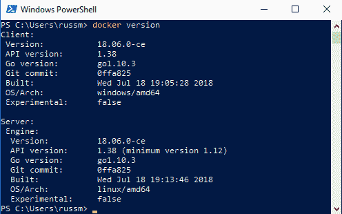

同样，您也可以运行以下命令来检查安装在 Docker 引擎旁边的 Docker Compose 和 Docker Machine 版本:

```
$ docker-compose version
$ docker-machine version
```

同样，您应该会看到类似于 macOS 和 Linux 版本的输出。正如您可能已经开始收集的，一旦安装了软件包，它们的使用将非常相似。这将在本章后面更详细地介绍。

# 旧操作系统

如果您没有在苹果电脑或视窗系统上运行足够新的操作系统，那么您将需要使用 Docker 工具箱。考虑通过运行以下命令打印的输出:

```
$ docker version
```

在我们到目前为止执行的所有三个安装中，它显示了两个不同的版本，一个客户端和一个服务器。可以预见的是，Linux 版本显示客户端和服务器的架构都是 Linux；但是，您可能会注意到，Mac 版本显示客户端运行在达尔文上，达尔文是苹果类似 Unix 的内核，Windows 版本显示 Windows。然而，这两个服务器都显示了 Linux 架构，那么是什么呢？

这是因为 Mac 和 Windows 版本的 Docker 都在后台下载并运行一个虚拟机，而这个虚拟机运行的是一个基于 Alpine Linux 的小型轻量级操作系统。虚拟机使用 Docker 自己的库运行，该库连接到您选择的环境的内置虚拟机管理程序。

对于 macOS，这是内置的 Hypervisor.framework，对于 Windows，这是 Hyper-V

为了确保没有人错过 Docker 体验，不使用这些内置虚拟机管理程序的 Docker 版本可用于旧版本的 macOS 和不受支持的 Windows 版本。这些版本利用 VirtualBox 作为虚拟机管理程序来运行供本地客户端连接的 Linux 服务器。

**VirtualBox** is an open source x86 and AMD64/Intel64 virtualization product developed by Oracle. It runs on Windows, Linux, Macintosh, and Solaris hosts, with support for many Linux, Unix, and Windows guest operating systems. For more information on VirtualBox, see [https://www.virtualbox.org/](https://www.virtualbox.org/).

有关 **Docker 工具箱**的更多信息，请查看位于[https://www.docker.com/products/docker-toolbox/](https://www.docker.%20com/products/docker-toolbox/)的项目网站，在这里您还可以下载 macOS 和 Windows 安装程序。

This book assumes that you have installed the latest Docker version on Linux, or have used Docker for Mac or Docker for Windows. While Docker installations using Docker Toolbox should be able to support the commands in this book, you may run into issues around file permissions and ownership when mounting data from your local machine to your containers.

# Docker 命令行客户端

现在我们已经安装了 Docker，让我们看看一些您应该已经熟悉的 Docker 命令。我们将从一些常见的命令开始，然后看一下用于 Docker 映像的命令。然后，我们将深入研究用于容器的命令。

Docker has restructured their command-line client into more logical groupings of commands, as the number of features provided by the client grows quickly and commands start to cross over each other. Throughout this book, we will be using the new structure.

我们将看到的第一个命令是最有用的命令之一，不仅在 Docker 中，而且在您使用的任何命令行实用程序中都是如此——即`help`命令。它是这样运行的:

```
$ docker help
```

该命令将为您提供一个您可以使用的所有 Docker 命令的完整列表，以及每个命令的简要描述。有关特定命令的进一步帮助，您可以运行以下命令:

```
$ docker <COMMAND> --help
```

接下来，让我们运行`hello-world`容器。为此，只需运行以下命令:

```
$ docker container run hello-world
```

不管你在什么主机上运行 Docker，同样的事情也会在 Linux、macOS 和 Windows 上发生。Docker 会下载`hello-world`容器镜像然后执行，一旦执行就停止容器。

您的终端会话应该如下所示:

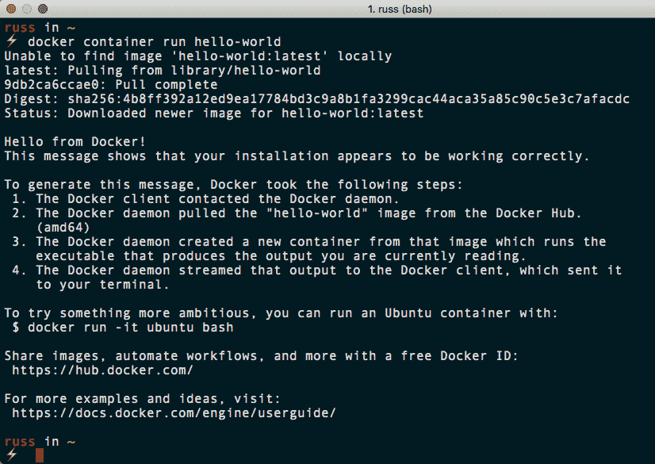

让我们尝试一些更冒险的东西—让我们通过运行以下两个命令来下载并运行 nginx 容器:

```
$ docker image pull nginx
$ docker container run -d --name nginx-test -p 8080:80 nginx
```

两个命令中的第一个命令下载 nginx 容器映像，第二个命令使用我们拉的`nginx`映像在后台启动一个名为`nginx-test`的容器。它还将主机上的端口`8080`映射到集装箱上的端口`80`，使我们在`http://localhost:8080/`的本地浏览器可以访问它。

从下面的截图中可以看出，在所有三种操作系统类型上，命令和结果完全相同。这里我们有 Linux:

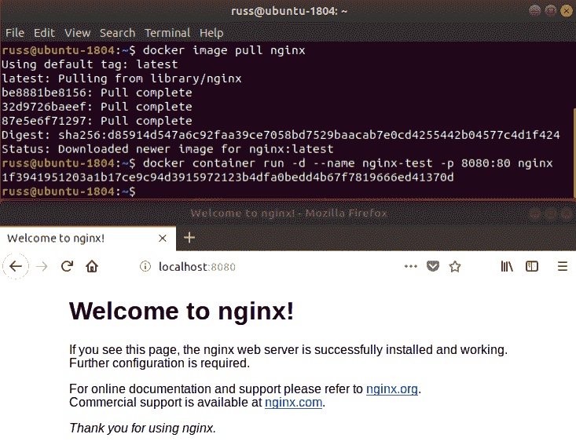

这是 macOS 上的结果:

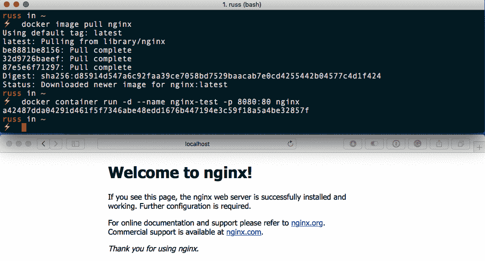

这是它在 Windows 上的外观:

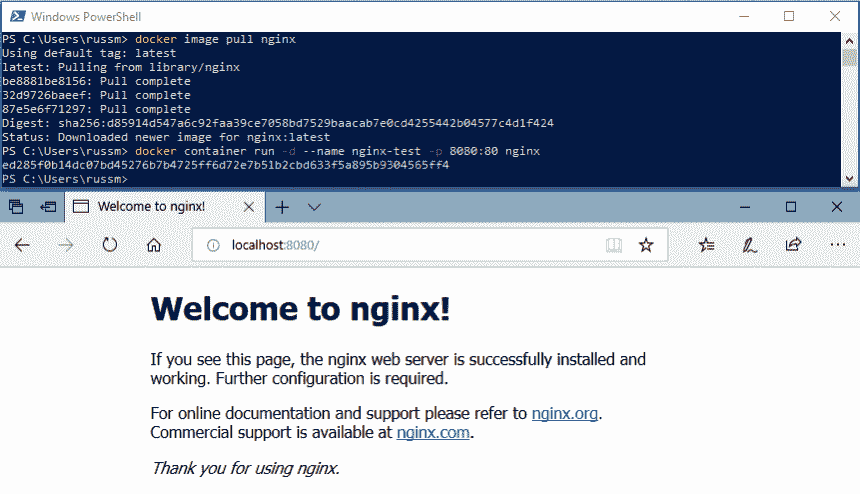

在接下来的三章中，我们将更详细地了解如何使用 Docker 命令行客户端。现在，让我们通过运行以下命令来停止并移除我们的`nginx-test`容器:

```
$ docker container stop nginx-test
$ docker container rm nginx-test
```

如您所见，在我们安装了 Docker 的所有三个主机上运行简单 nginx 容器的体验完全相同。我相信你可以想象，试图在三个平台上都没有 Docker 这样的东西的情况下实现这一点是一个挑战，也是每个平台上非常不同的体验。传统上，这是当地发展环境不同的原因之一。

# 码头工人和集装箱生态系统

如果你一直在关注 Docker 和容器的崛起，你会注意到，在过去的几年里，Docker 网站上的消息传递一直在慢慢变化，从关于什么是容器的标题，到更多地关注 Docker 作为一家公司提供的服务。

这种情况的核心驱动因素之一是，传统上一切都被归为“Docker”，这可能会令人困惑。现在，人们不需要那么多关于什么是容器或他们可以用 Docker 解决的问题的教育，该公司需要尝试并开始将自己与其他支持各种容器技术的公司区分开来。

所以，让我们试着解开 Docker 的所有东西，包括以下内容:

*   **开源项目**:Docker 启动了几个开源项目，现在由一个很大的开发者社区维护。
*   **Docker CE 和 Docker EE** :这是构建在开源组件之上的免费使用和商业支持的 Docker 工具的核心集合。
*   **Docker，Inc.** :这是为了支持和开发 Docker 核心工具而成立的公司。

我们还将在后面的章节中研究一些第三方服务。与此同时，让我们从开源项目开始，更详细地了解每一个项目。

# 开源项目

Docker，Inc .在过去两年里一直致力于开源，并向各种开源基金会和社区捐赠了大量核心项目。这些项目包括:

*   **莫比项目**是 Docker Engine 所基于的上游项目。它提供了组装一个功能齐全的容器系统所需的所有组件。
*   **Runc** 是一个用于创建和配置容器的命令行界面，并且是按照 OCI 规范构建的。
*   **容器**是一个容易嵌入的容器运行时。这也是莫比项目的核心组成部分。
*   **LibNetwork** 是一个为容器提供联网的 Go 库。
*   **公证**是一个客户端和服务器，旨在为已签名的容器映像提供一个信任系统。
*   **HyperKit** 是一个工具包，允许您将虚拟机管理程序功能嵌入到自己的应用中，目前它只支持 macOS 和 Hypervisor.framework。
*   **VPNKit** 为 HyperKit 提供 VPN 功能。
*   **DataKit** 允许您使用类似 Git 的工作流编排应用数据。
*   **SwarmKit** 是一个工具包，允许你使用与 Docker Swarm 相同的 raft 共识算法构建分布式系统。
*   **LinuxKit** 是一个框架，允许你构建和编译一个小型的可移植的 Linux 操作系统来运行容器。
*   **InfraKit** 是一个工具集合，您可以使用它来定义运行您的 LinuxKit 生成的发行版的基础设施。

就他们自己而言，你可能永远不会使用单个组件；然而，提到的每个项目都是由 Docker，Inc .维护的工具的一个组成部分。我们将在最后一章对这些项目进行更深入的讨论。

# CE 对接器和 EE 对接器

Docker，Inc .提供并支持许多工具。有些我们已经提到过，有些我们将在后面的章节中介绍。在我们完成第一章之前，我们应该对将要使用的工具有一个概念。其中最重要的是核心的 Docker 引擎。

这是 Docker 的核心，我们将介绍的所有其他工具都使用它。我们已经在本章的 Docker 安装和 Docker 命令部分使用了它。Docker Engine 目前有两个版本；有 Docker **企业版** ( **EE** )和 Docker **社区版** ( **CE** )。我们将在本书中使用 Docker CE。

从 2018 年 9 月开始，Docker CE 稳定版的发布周期将为一年两次，这意味着它将有 7 个月的维护周期。这意味着您有足够的时间来审查和规划任何升级。在撰写本文时，Docker CE 发布的当前时间表是:

*   **Docker 18.06 CE** :这是 Docker CE 季度发布的最后一期，发布于 2018 年 7 月 18 日。
*   **Docker 18.09 CE** :本次发布，定于 2018 年 9 月下旬/10 月上旬，是 Docker CE 半年发布周期的首次发布。
*   **Docker 19.03 C**E:2019 年首款支持的 Docker CE 定于 2019 年 3/4 月发布。
*   **Docker 19.09 CE**:2019 年第二个支持的版本定于 2019 年 9/10 月发布。

除了 Docker CE 的稳定版本，Docker 还将通过夜间存储库(正式的 Docker CE Edge)提供 Docker 引擎的夜间构建，并通过 Edge 渠道提供 Mac Docker 和 Windows Docker 的每月构建。

Docker 还提供以下工具和服务:

*   **Docker Compose** :允许定义和共享多容器定义的工具；详见[第五章](05.html)、*码头工人作曲*。
*   **Docker 机**:在多个平台上推出 Docker 主机的工具；我们将在[第 7 章](07.html)、*码头工人机器*中介绍这一点。
*   **Docker Hub**:Docker 映像的存储库，将在接下来的三章中介绍。
*   **Docker 商店**:Docker 官方图片和插件以及授权产品的店面。同样，我们将在接下来的三章中讨论这个问题。
*   **Docker Swarm** :多主机感知编排工具，在[第 8 章](08.html)*Docker Swarm*中有详细介绍。
*   **Mac 的 Docker**:我们在本章已经介绍了 Mac 的 Docker。

*   **Windows 的 Docker**:这一章我们已经介绍了 Windows 的 Docker。
*   **亚马逊网络服务的 Docker**:针对 AWS 的最佳实践 Docker Swarm 安装，在[第 10 章](10.html)中介绍，在公共云中运行*Docker*。
*   **Docker for Azure** :针对 Azure 的最佳实践 Docker Swarm 安装，在[第 10 章](10.html)中介绍，在公共云中运行 *Docker。*

# 码头工人公司。

Docker，Inc .是为开发 Docker CE 和 Docker EE 而成立的公司。它还为 Docker EE 提供基于 SLA 的支持服务。最后，他们为那些希望将现有应用纳入 Docker 的“传统应用现代化”计划的公司提供咨询服务。

# 摘要

在本章中，我们介绍了一些您应该已经知道(或现在知道)的基本信息，以便在后面的章节中使用。我们复习了什么是 Docker 的基础知识，以及它与其他主机类型相比的表现。我们检查了安装程序，它们如何在不同的操作系统上运行，以及如何通过命令行控制它们。请务必记住查看安装程序的要求，以确保您为操作系统使用正确的安装程序。

然后，我们开始使用 Docker，并发出一些基本命令来帮助您开始。我们将在未来的章节中查看所有的管理命令，以更深入地了解它们是什么，以及如何和何时使用它们。最后，我们讨论了 Docker 生态系统和每个不同工具的职责。

在接下来的章节中，我们将了解如何构建基本容器，我们还将深入研究 Dockerfiles 和存储映像的位置，以及使用环境变量和 Docker 卷。

# 问题

1.  从哪里可以下载 Mac 的 Docker 和 Windows 的 Docker？
2.  我们使用了什么命令来下载 NGINX 映像？
3.  哪个开源项目是核心 Docker Engine 的上游？
4.  稳定的 Docker CE 版本的支持生命周期有几个月？
5.  您会运行哪个命令来了解关于 Docker 容器命令子集的更多信息？

# 进一步阅读

在本章中，我们提到了以下虚拟机管理程序:

*   macOS 虚拟机管理程序框架:[https://developer.apple.com/reference/hypervisor/](https://developer.apple.com/reference/hypervisor/)
*   hyper-V:[https://www . Microsoft . com/en-GB/云平台/服务器-虚拟化](https://www.microsoft.com/en-gb/cloud-platform/server-virtualization)

我们引用了 Docker 的以下博客文章:

*   docker cli 重构博客 post:【https://blog . docker . com/2017/01/whats-new-in-docker-1-13/
*   Docker 扩展支持公告:[https://blog . docker . com/2018/07/extending-Support-cycle-docker-community-edition/](https://blog.docker.com/2018/07/extending-support-cycle-docker-community-edition/)

接下来，我们讨论了以下开源项目:

*   莫比项目:[https://mobyproject.org/](https://mobyproject.org/)
*   runc:https://github . com/open containers/runc
*   容器 d:[https://container d . io/](https://containerd.io/)
*   LibNetwork(利比亚网络)；[https://github . com/docker/libnetwork](https://github.com/docker/libnetwork)
*   公证员:[https://github.com/theupdateframework/notary](https://github.com/theupdateframework/notary)
*   超集:t0 https://github . com/Moby/hyperkit
*   vpnket:https://github . com/Moby/vpnket
*   datakit:https://github . com/Moby/datakit

*   swamkit:https://github . com/dock/swamkit
*   linuxkit:https://github . com/linuxkit/linuxkit
*   infra kit:https://github . com/dock/infra kit
*   OCI 规格:[https://github.com/opencontainers/runtime-spec/](https://github.com/opencontainers/runtime-spec/)

最后，本章开头提到的模因可以在这里找到:

*   *在 Dev，Ops 问题中工作正常现在*-[http://www . developer mes . com/2013/12/13/工作正常-Dev-Ops-问题-现在/](http://www.developermemes.com/2013/12/13/worked-fine-dev-ops-problem-now/)