# 构建容器映像

在本章中，我们将让您开始构建容器映像。我们将研究几种不同的方法，您可以使用 Docker 内置的工具来定义和构建您的映像。我们将涵盖以下主题:

*   介绍 Dockerfile
*   使用 Dockerfile 构建容器映像
*   使用现有容器构建容器映像
*   从头开始构建容器映像
*   使用环境变量构建容器映像
*   使用多阶段构建构建容器映像

# 技术要求

在前一章中，我们在以下目标操作系统上安装了 Docker:

*   麦考高中及以上
*   Windows 10 专业版
*   Ubuntu 18.04

在本章中，我们将使用我们的 Docker 安装来构建映像。虽然本章中的截图将来自我的首选操作系统，即 macOS，但我们将运行的 Docker 命令将在迄今为止安装了 Docker 的所有三个操作系统上运行。然而，一些支持命令可能只适用于 macOS 和基于 Linux 的操作系统，而且数量很少。

本章所用代码的完整副本可在以下网址找到:[https://github . com/PacktPublishing/Mastering-Docker-第三版/tree/master/chapter02](https://github.com/PacktPublishing/Mastering-Docker-Third-Edition/tree/master/chapter02)

查看以下视频，了解《行为准则》:

[http://bit.ly/2D0JA6v](http://bit.ly/2D0JA6v)

# 介绍 Dockerfile

在本节中，我们将深入讨论 Dockerfiles，以及要使用的最佳实践。那么什么是 Dockerfile 呢？

一个**文件**只是一个包含一组用户定义指令的纯文本文件。当 Dockerfile 被`docker image build`命令调用时(我们接下来会看到这个命令)，它被用来组装一个容器映像。文件如下所示:

```
FROM alpine:latest
LABEL maintainer="Russ McKendrick <russ@mckendrick.io>"
LABEL description="This example Dockerfile installs NGINX."
RUN apk add --update nginx && \
 rm -rf /var/cache/apk/* && \
 mkdir -p /tmp/nginx/

COPY files/nginx.conf /etc/nginx/nginx.conf
COPY files/default.conf /etc/nginx/conf.d/default.conf
ADD files/html.tar.gz /usr/share/nginx/

EXPOSE 80/tcp

ENTRYPOINT ["nginx"]
CMD ["-g", "daemon off;"]
```

如您所见，即使没有解释，也很容易了解 Dockerfile 的每一步指示`build`命令做什么。

在我们继续浏览之前的文件之前，我们应该先快速了解一下 Alpine Linux。

**Alpine Linux** is a small, independently developed, non-commercial Linux distribution designed for security, efficiency, and ease of use. While small (see the following section), it offers a solid foundation for container images due to its extensive repository of packages, and also thanks to the unofficial port of grsecurity/PaX, which is patched into its kernel it offers proactive protection dozens of potential zero-day and other vulnerabilities.

Alpine Linux，由于它的大小和它的强大，已经成为 Docker 提供的官方容器映像的默认映像库。正因为如此，我们将在整本书中使用它。为了让您了解 Alpine Linux 的官方映像有多小，让我们将其与撰写本文时可用的一些其他发行版进行比较:

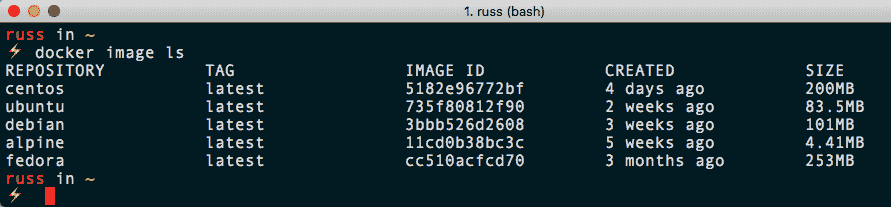

从终端输出可以看出，Alpine Linux 的重量仅为 4.41 MB，而最大的映像是 Fedora，为 253 MB。Alpine Linux 的裸机安装容量约为 130 兆字节，几乎只有 Fedora 容器映像的一半大小。

# 深入查看文档

让我们看一下 Dockerfile 示例中使用的指令。我们将按照它们出现的顺序来看它们:

*   `FROM   `
*   `LABEL`
*   `RUN`
*   `COPY`和`ADD`
*   `EXPOSE`
*   `ENTRYPOINT`和`CMD`
*   其他文件说明

# 从

`FROM`指令告诉 Docker 你想为你的映像使用哪个基础；如前所述，我们使用的是 Alpine Linux，所以我们只需输入我们希望使用的映像名称和发布标签。在我们的例子中，要使用最新的官方 Alpine Linux 映像，我们只需要添加`alpine:latest`。

# 标签

`LABEL`指令可用于向映像添加额外信息。这些信息可以是从版本号到描述的任何信息。还建议您限制使用的标签数量。一个好的标签结构会帮助以后不得不使用我们形象的人。

然而，使用太多的标签也会导致映像变得低效，所以我建议使用在[http://label-schema.org/](http://label-s%20chema.org/)详细描述的标签模式。您可以使用以下 Docker `inspect`命令查看容器标签:

```
$ docker image inspect <IMAGE_ID>
```

或者，您可以使用以下内容仅过滤标签:

```
$ docker image inspect -f {{.Config.Labels}} <IMAGE_ID>
```

在我们的示例 Dockerfile 中，我们添加了两个标签:

1.  `maintainer="Russ McKendrick <russ@mckendrick.io>"`向映像的最终用户添加一个标签，帮助识别谁在维护映像
2.  `description="This example Dockerfile installs NGINX."`添加映像是什么的简要描述。

一般来说，最好在从映像创建容器时定义标签，而不是在构建时，因此最好将标签保持为关于映像的元数据，而不是其他内容。

# 奔跑

`RUN`指令是我们与映像交互以安装软件和运行脚本、命令和其他任务的地方。从我们的`RUN`指令中可以看出，我们实际上正在运行三个命令:

```
RUN apk add --update nginx && \
 rm -rf /var/cache/apk/* && \
 mkdir -p /tmp/nginx/
```

如果我们在 Alpine Linux 主机上有一个外壳，我们的三个命令中的第一个相当于运行以下命令:

```
$ apk add --update nginx
```

这个命令使用 Alpine Linux 的包管理器安装 nginx。

We are using the `&&` operator to move on to the next command if the previous command was successful. To make it more obvious which commands we are running, we are also using `\` so that we can split the command over multiple lines, making it easy to read.

我们链中的下一个命令删除任何临时文件等，以将映像的大小保持在最小:

```
$ rm -rf /var/cache/apk/*
```

我们链中的最后一个命令创建一个路径为`/tmp/nginx/`的文件夹，这样当我们运行容器时，nginx 将正确启动:

```
$ mkdir -p /tmp/nginx/
```

我们也可以在 Dockerfile 中使用以下内容来获得相同的结果:

```
RUN apk add --update nginx
RUN rm -rf /var/cache/apk/*
RUN mkdir -p /tmp/nginx/
```

然而，就像添加多个标签一样，这被认为是低效的，因为它会增加映像的整体大小，这在很大程度上是我们应该尽量避免的。这方面有一些有效的用例，我们将在本章后面部分讨论。在大多数情况下，在构建映像时，应该避免使用这种运行命令的方法。

# 复制并添加

乍一看，`COPY`和`ADD`看起来是在做同样的任务；然而，有一些重要的区别。`COPY`指令是两者中比较直接的:

```
COPY files/nginx.conf /etc/nginx/nginx.conf
COPY files/default.conf /etc/nginx/conf.d/default.conf
```

您可能已经猜到，我们正在从构建映像的主机上的文件文件夹中复制两个文件。第一个文件是`nginx.conf`，包含一个基本的 nginx 配置文件:

```
user nginx;
worker_processes 1;

error_log /var/log/nginx/error.log warn;
pid /var/run/nginx.pid;

events {
 worker_connections 1024;
}

http {
    include /etc/nginx/mime.types;
    default_type application/octet-stream;
    log_format main '$remote_addr - $remote_user [$time_local] "$request" '
                      '$status $body_bytes_sent "$http_referer" '
                      '"$http_user_agent" "$http_x_forwarded_for"';
    access_log /var/log/nginx/access.log main;
    sendfile off;
    keepalive_timeout 65;
    include /etc/nginx/conf.d/*.conf;
}
```

这将覆盖在`RUN`说明中作为 APK 安装的一部分安装的 NGINX 配置。下一个文件`default.conf`，是我们可以配置的最简单的虚拟主机，内容如下:

```
server {
  location / {
      root /usr/share/nginx/html;
  }
}
```

同样，这将覆盖任何现有文件。到目前为止，一切都很好，那么我们为什么要使用`ADD`指令呢？在我们的例子中，它看起来如下:

```
ADD files/html.tar.gz /usr/share/nginx/
```

如您所见，我们正在添加一个名为`html.tar.gz`的文件，但是我们实际上并没有对归档文件做任何事情来将其解压缩到我们的 Dockerfile 中。这是因为`ADD`会自动上传、解压缩，并将结果文件夹和文件放在我们告诉它的路径上，在我们的例子中是`/usr/share/nginx/`。这为我们提供了`/usr/share/nginx/html/`的网络根，正如我们在复制到映像的`default.conf`文件中的虚拟主机块中定义的那样。

`ADD`指令也可用于添加远程来源的内容。例如，考虑以下情况:

```
ADD http://www.myremotesource.com/files/html.tar.gz /usr/share/nginx/
```

前面的命令行将从`http://www.myremotesource.com/files/`下载`html.tar.gz`，并将文件放在映像上的`/usr/share/nginx/`文件夹中。来自远程源的归档文件被视为文件，并且不是未压缩的，在使用它们时，您必须考虑到这一点，这意味着文件必须在`RUN`指令之前添加，这样我们就可以手动取消文件夹归档，并删除`html.tar.gz` 文件。

# 揭露

`EXPOSE`指令让 Docker 知道，当执行映像时，定义的端口和协议将在运行时暴露。该指令不将端口映射到主机，而是打开端口以允许访问容器网络上的服务。

例如，在我们的 Dockerfile 中，我们告诉 Docker 在每次运行映像时打开端口`80`:

```
EXPOSE 80/tcp
```

# ENTRYPOINT 和 CMD

使用`ENTRYPOINT`比使用`CMD`的好处，我们接下来会看到，就是可以互相结合使用。`ENTRYPOINT`可以单独使用，但是请记住，只有当您希望您的容器可执行时，您才会希望单独使用`ENTRYPOINT`。

作为参考，如果您想到一些可能使用的命令行界面命令，您必须指定的不仅仅是命令行界面命令。您可能需要添加您希望命令解释的额外参数。这将是仅使用`ENTRYPOINT`的用例。

例如，如果您想要在容器中执行一个默认命令，您可以执行类似于以下示例的操作，但是一定要使用一个保持容器活动的命令。在我们的案例中，我们使用了以下内容:

```
ENTRYPOINT ["nginx"]
CMD ["-g", "daemon off;"]
```

这意味着每当我们从我们的映像中启动一个容器时，都会执行 nginx 二进制文件，因为我们已经将其定义为我们的`ENTRYPOINT`，然后执行我们作为`CMD`拥有的任何东西，这相当于运行以下命令:

```
$ nginx -g daemon off;
```

如何使用`ENTRYPOINT`的另一个例子如下:

```
$ docker container run --name nginx-version dockerfile-example -v
```

这相当于在我们的主机上运行以下命令:

```
$ nginx -v
```

请注意，我们不必告诉 Docker 使用 nginx。因为我们有 nginx 二进制文件作为入口点，所以我们传递的任何命令都会覆盖 Dockerfile 中定义的`CMD`。

这将显示我们已经安装的 nginx 版本，我们的容器将停止，因为 nginx 二进制文件将只被执行来显示版本信息，然后进程将停止。一旦我们建立了自己的形象，我们将在本章的后面查看这个例子。

# 其他文件说明

在我们的示例 Dockerfile 中，有一些指令没有包括在内。让我们在这里看看他们。

# 用户

`USER`指令允许您指定运行命令时要使用的用户名。`USER`指令可用于文件中的`RUN`指令、`CMD`指令或`ENTRYPOINT`指令。此外，`USER`指令中定义的用户必须存在，否则您的映像将无法构建。使用`USER`指令还会引入权限问题，不仅是在容器本身上，而且在装载卷时也是如此。

# 工作目录

`WORKDIR`指令为`USER`指令可以使用的同一组指令设置工作目录(`RUN`、`CMD`和`ENTRYPOINT`)。它还允许您使用`CMD`和`ADD`指令。

# 构建时

`ONBUILD`指令允许您隐藏一组命令，以便在将来使用该映像时使用，作为另一个容器映像的基础映像。

例如，如果您想给开发人员一个映像，并且他们都有不同的代码库要测试，您可以使用`ONBUILD`指令在需要实际代码之前打好基础。然后，开发人员只需将他们的代码添加到您告诉他们的目录中，当他们运行新的 Docker 构建命令时，它会将他们的代码添加到运行的映像中。

`ONBUILD`指令可以与`ADD`和`RUN`指令结合使用，例如在以下示例中:

```
ONBUILD RUN apk update && apk upgrade && rm -rf /var/cache/apk/*
```

每当我们的映像被用作另一个容器映像的基础时，这将运行更新和包升级。

# 包封/包围（动词 envelop 的简写）

`ENV`指令在构建和执行时设置映像中的环境变量。当您启动映像时，这些变量可以被覆盖。

# 最佳实践

既然我们已经介绍了 Dockerfile 指令，那么让我们来看看编写自己的 docker file 的最佳实践:

*   你应该试着养成使用`.dockerignore`文件的习惯。我们将在下一节介绍`.dockerignore`文件；如果你习惯于使用`.gitignore`文件，这看起来会很熟悉。它将在构建过程中忽略您在文件中指定的项目。
*   记住每个文件夹只有一个 Dockerfile 来帮助您组织容器。

*   为你的 Dockerfile 使用一个版本控制系统，比如 Git 就像任何其他基于文本的文档一样，版本控制不仅可以帮助您向前移动，还可以根据需要向后移动。

*   尽量减少每个映像安装的软件包数量。在建立你的形象时，你想要达到的最大目标之一就是让它们尽可能的小。不安装不必要的软件包将大大有助于实现这一目标。

*   确保每个容器只有一个应用进程。每次需要新的应用进程时，最好使用新的容器来运行该应用。

*   把事情简单化；过于复杂的 Dockerfile 会增加膨胀，还可能导致进一步的问题。

*   以身作则！Docker 自己有一个相当详细的风格指南来发布他们在 Docker Hub 上托管的官方映像。你可以在本章末尾的阅读部分找到相关链接。

# 构建容器映像

在本节中，我们将介绍`docker image build`命令。正如他们所说，这是橡胶与道路的交汇处。现在是我们开始建立未来形象的时候了。我们将寻找不同的方法来实现这个目标。请将此视为您之前使用虚拟机创建的模板。这将有助于通过完成艰苦的工作来节省时间；您只需要创建需要添加到新映像中的应用。

使用`docker build`命令时，有很多开关可以使用。因此，让我们使用总是很方便的`docker image build`命令上的`--help`开关来查看我们能做的所有事情:

```
$ docker image build --help
```

然后有很多不同的旗帜列出，你可以通过时，建立你的形象。现在，这看起来似乎需要消化很多，但是在所有这些选项中，我们只需要使用`-- tag`，或者它的简写`-t`，来命名我们的映像。

您可以使用其他选项来限制构建过程将使用多少 CPU 和内存。在某些情况下，您可能不希望`build`命令占用尽可能多的 CPU 或内存。这个过程可能会运行得慢一点，但是如果您在本地计算机或生产服务器上运行它，并且这是一个很长的构建过程，您可能需要设置一个限制。还有一些选项会影响为构建我们的形象而推出的容器的网络配置。

通常，您不会使用`--file`或`-f`开关，因为您是从 Dockerfile 所在的同一个文件夹运行`docker build`命令的。将 Dockerfile 保存在不同的文件夹中有助于对文件进行排序，并保持文件的命名约定不变。

还值得一提的是，虽然您能够在构建时传递额外的环境变量作为参数，但是它们是在构建时使用的，并且您的容器映像不会继承它们。这对于传递代理设置等信息非常有用，这些信息可能只适用于您的初始构建/测试环境。

我们前面讨论过的`.dockerignore`文件用于排除那些我们不想包含在`docker build`中的文件或文件夹，因为默认情况下，与 Dockerfile 在同一文件夹中的所有文件都将被上传。我们还讨论了将 Dockerfile 放在单独的文件夹中，这同样适用于`.dockerignore`。它应该放在 Dockerfile 所在的文件夹中。

将映像中要使用的所有项目保存在同一个文件夹中，有助于将`.dockerignore`文件中的项目数量(如果有)保持在最低限度。

# 使用 Dockerfile 构建容器映像

第一种方法是创建一个 Dockerfile，这是我们在构建基本容器映像时要考虑的。事实上，我们将使用上一节中的 Dockerfile，然后对其执行`docker image build`命令，从而获得一个 nginx 映像。所以，让我们从再次查看 Dockerfile 开始:

```
FROM alpine:latest
LABEL maintainer="Russ McKendrick <russ@mckendrick.io>"
LABEL description="This example Dockerfile installs NGINX."
RUN apk add --update nginx && \
 rm -rf /var/cache/apk/* && \
 mkdir -p /tmp/nginx/

COPY files/nginx.conf /etc/nginx/nginx.conf
COPY files/default.conf /etc/nginx/conf.d/default.conf
ADD files/html.tar.gz /usr/share/nginx/

EXPOSE 80/tcp

ENTRYPOINT ["nginx"]
CMD ["-g", "daemon off;"]
```

Don't forget that you will also need the `default.conf`, `html.tar.gz`,and `nginx.conf` files in the files folder. You can find these in the accompanying GitHub repository.

所以，我们有两种方法来建立这个形象。第一种方法是在使用`docker image build`命令时指定`-f`开关。我们还将使用`-t`开关为新映像命名:

```
$ docker image build --file <path_to_Dockerfile> --tag <REPOSITORY>:<TAG> .
```

现在，`<REPOSITORY>`通常是您在 Docker Hub 上注册的用户名。我们将在[第 3 章](03.html) *、存储和分发映像*中更详细地了解这一点；目前，我们将使用`local`，`<TAG>`是您想要提供的独特容器价值。通常，这将是版本号或其他描述符:

```
$ docker image build --file /path/to/your/dockerfile --tag local:dockerfile-example .
```

通常不使用`--file`开关，当您有其他文件需要包含在新映像中时，这可能会有点棘手。一种更简单的构建方法是将 Dockerfile 单独放在一个单独的文件夹中，以及您将使用`ADD`或`COPY`指令注入到映像中的任何其他文件:

```
$ docker image build --tag local:dockerfile-example .
```

要记住的最重要的事情是最后的点(或周期)。这是告诉`docker image build`命令在当前文件夹中构建。构建映像时，您应该会看到类似以下终端输出的内容:

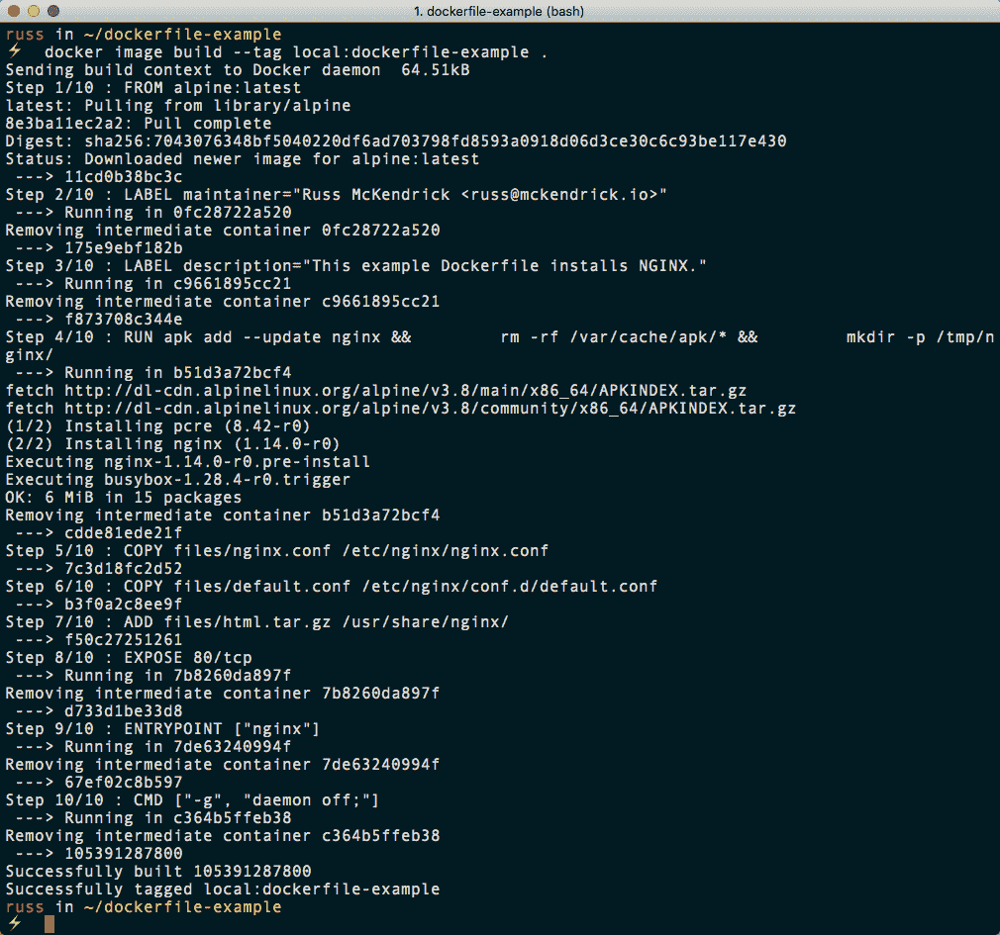

构建完成后，您应该能够运行以下命令来检查映像是否可用，以及映像的大小:

```
$ docker image ls
```

从以下终端输出可以看出，我的映像大小为 5.98 MB:

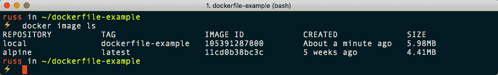

通过运行以下命令，您可以使用新构建的映像启动容器:

```
$ docker container run -d --name dockerfile-example -p 8080:80 local:dockerfile-example
```

这将启动一个名为`dockerfile-example`的容器，您可以使用以下命令检查它是否正在运行:

```
$ docker container ls 
```

打开浏览器，转到`http://localhost:8080/`会显示一个极其简单的网页，如下所示:

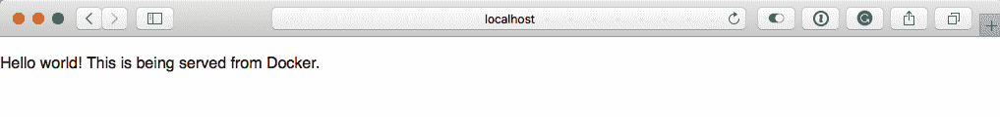

接下来，我们可以快速运行本章前面部分提到的一些命令，从下面开始:

```
$ docker container run --name nginx-version local:dockerfile-example -v
```

从以下终端输出可以看出，我们当前运行的是 nginx 1 . 14 . 0 版:

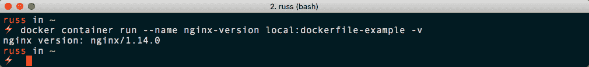

现在我们已经构建了第一个映像，接下来我们可以看到运行的命令显示了我们在构建时嵌入的标签。要查看此信息，请运行以下命令:

```
$ docker image inspect -f {{.Config.Labels}} local:dockerfile-example
```

从下面的输出可以看出，这显示了我们输入的信息:

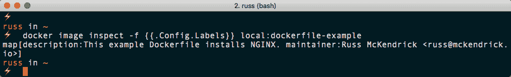

在我们继续之前，您可以使用以下命令停止并移除我们启动的容器:

```
$ docker container stop dockerfile-example
$ docker container rm dockerfile-example nginx-version  
```

我们将在第 4 章*管理容器*中详细介绍 Docker 容器命令。

# 使用现有容器

构建基础映像最简单的方法是从 Docker Hub 的一个官方映像开始。Docker 还将这些正式构建的 docker 文件保存在他们的 GitHub 存储库中。因此，对于使用他人已经创建的现有映像，您至少有两种选择。通过使用 Dockerfile，您可以准确地看到构建中包含的内容，并添加您需要的内容。如果您以后想要更改或共享该 Dockerfile，则可以对其进行版本控制。

有另一种方法可以实现这一点；但是，不建议也不认为这是好的做法，我强烈建议您不要使用它。

I would only use this method during a prototyping phase to check that the commands I am running work as expected in an interactive shell before putting them in a Dockerfile. You should always use a Dockerfile.

首先，我们应该下载我们想要用作基础的映像；和以前一样，我们将使用 Alpine Linux:

```
$ docker image pull alpine:latest
```

接下来，我们需要在前台运行一个容器，以便与它进行交互:

```
$ docker container run -it --name alpine-test alpine /bin/sh
```

容器运行后，您可以根据需要使用`apk`命令添加包，或者使用任何适合您的 Linux 风格的包管理命令。

例如，以下命令将安装 nginx:

```
$ apk update
$ apk upgrade
$ apk add --update nginx
$ rm -rf /var/cache/apk/*
$ mkdir -p /tmp/nginx/
$ exit
```

安装完所需的包后，需要保存容器。前一组命令末尾的`exit`命令将停止正在运行的容器，因为我们正在脱离的外壳进程恰好是保持容器在前台运行的进程。您可以在终端输出中看到如下内容:

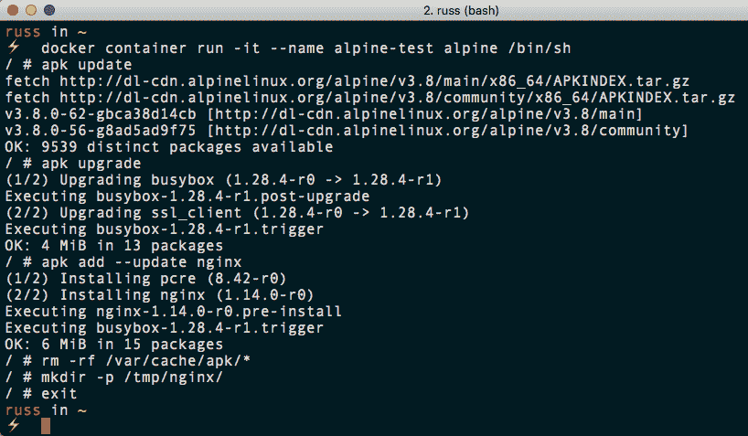

It is at this point that you should really stop; I do not recommend you use the preceding commands to create and distribute images, apart from the one use case we will cover in the next part of this section.

因此，要将停止的容器保存为映像，您需要执行类似以下的操作:

```
$ docker container commit <container_name> <REPOSITORY>:<TAG>
```

例如，我运行以下命令来保存我们启动和定制的容器的副本:

```
$ docker container commit alpine-test local:broken-container 
```

注意我如何称呼我的形象`broken-container`？采用这种方法的一个用例是，如果由于某种原因，您的容器出现了问题，那么将失败的容器保存为映像，或者甚至将其导出为 TAR 文件，以便在您需要一些帮助来找到问题的根源时与其他人共享，这是非常有用的。

要保存映像文件，只需运行以下命令:

```
$ docker image save -o <name_of_file.tar> <REPOSITORY>:<TAG>
```

因此，对于我们的示例，我运行了以下命令:

```
$ docker image save -o broken-container.tar local:broken-container
```

这给了我一个 6.6 MB 的文件，叫做`broken-container.tar`。当我们有这个文件时，您可以解压缩它并四处看看，从下面的结构中可以看到:

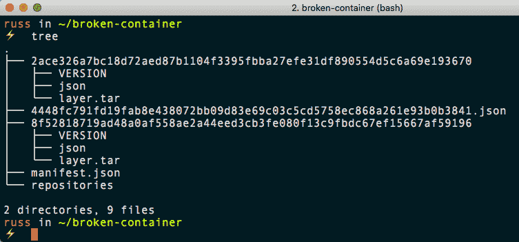

映像由 JSON 文件、文件夹和其他 TAR 文件的集合组成。所有的映像都遵循这个结构，所以你可能在想，*为什么这个方法这么差*？

最大的原因是信任——如前所述，您的最终用户将无法轻松看到他们正在运行的映像中的内容。您会从未知来源随机下载预打包的映像来运行您的工作负载，而不检查映像是如何构建的吗？谁知道它是如何配置的，安装了哪些软件包？使用 Dockerfile，您可以确切地看到创建映像时执行了什么，但是使用这里描述的方法，您对此一无所知。

另一个原因是你很难建立一套好的默认值；例如，如果你以这种方式建立你的形象，那么你将无法真正利用诸如`ENTRYPOINT`和`CMD`之类的功能，甚至是最基本的指令，如`EXPOSE`。相反，用户必须定义他们的`docker container run`命令期间所需的一切。

在 Docker 早期，分发以这种方式准备的映像是常见的做法。事实上，我自己也为此感到内疚，因为从运营背景来看，启动一台“机器”，引导它，然后创建一个黄金大师是完全有意义的。幸运的是，在过去的几年里，Docker 已经将构建功能扩展到甚至不再考虑这个选项的程度。

# 从头开始构建容器映像

到目前为止，我们一直使用 Docker Hub 中准备好的映像作为基础映像。完全避免这种情况(某种程度上)并从头开始展示自己的形象是可能的。

现在，当你通常听到短语*来自* *刮擦*时，它的字面意思是你从零开始。这就是我们现在所拥有的——你什么也得不到，必须在此基础上再接再厉。现在，这可能是一个好处，因为它将保持映像尺寸非常小，但它也可能是有害的，如果你是相当新的 Docker，因为它可能会变得复杂。

Docker 已经为我们做了一些艰苦的工作，并在 Docker Hub 上创建了一个名为`scratch`的空 TAR 文件；你可以在你的文档的`FROM`部分使用它。您可以在此基础上构建整个 Docker，然后根据需要添加部件。

同样，让我们看看使用 Alpine Linux 作为映像的基本操作系统。这样做的原因不仅包括它是以 ISO、Docker 映像和各种虚拟机映像的形式分发的，还包括整个操作系统是以压缩 TAR 文件的形式提供的。您可以在存储库中或阿尔卑斯 Linux 下载页面上找到下载内容。

要下载副本，只需从下载页面选择合适的下载，可在[https://www.alpinelinux.org/downloads/](https://www.alpinelinux.org/downloads/)找到。我使用的是**迷你根文件系统**部分的 **x86_64** 。

下载后，您需要创建一个使用`scratch`的 Dockerfile，然后添加`tar.gz`文件，确保使用正确的文件，如下例所示:

```
FROM scratch
ADD files/alpine-minirootfs-3.8.0-x86_64.tar.gz /
CMD ["/bin/sh"]
```

现在，您已经将 Docker 文件和操作系统保存在 TAR 文件中，您可以像构建任何其他 Docker 映像一样，通过运行以下命令来构建映像:

```
$ docker image build --tag local:fromscratch .
```

您可以通过运行以下命令将映像大小与我们构建的其他容器映像进行比较:

```
$ docker image ls
```

正如您在下面的截图中看到的，我构建的映像与我们一直在 Docker Hug 中使用的 Alpine Linux 映像大小完全相同:

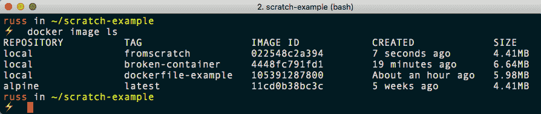

现在我们已经构建了自己的映像，我们可以通过运行以下命令来测试它:

```
$ docker container run -it --name alpine-test local:fromscratch /bin/sh
```

If you get an error, then you may already have a container called alpine-test created or running . Remove it by running `docker` `container stop alpine-test`, followed by `docker container rm alpine-test`.

这应该会在 Alpine Linux 映像上启动一个外壳。您可以通过运行以下命令来检查这一点:

```
$ cat /etc/*release
```

这将显示容器正在运行的版本信息。要了解整个过程的样子，请参见以下终端输出:


虽然一切看起来都很简单，但这要归功于 Alpine Linux 打包操作系统的方式。当您选择使用以不同方式打包操作系统的其他发行版时，它可能会变得更加复杂。

有几种工具可以用来生成一个操作系统包。我们不打算在这里详细讨论如何使用这些工具，因为如果您必须考虑这种方法，您可能有一些非常具体的要求。本章末尾的进一步阅读部分有一个工具列表。

那么这些要求是什么呢？对于大多数人来说，它将是遗留应用；例如，如果您有一个应用需要不再受 Docker Hub 支持或不可用的操作系统，但您需要一个更现代的平台来支持该应用，会发生什么？嗯，您应该能够旋转您的映像并在那里安装应用，允许您将旧的遗留应用托管在现代的、可支持的操作系统/体系结构上。

# 使用环境变量

在这一节中，我们将介绍非常强大的**环境变量** ( **ENVs** ，因为您将会看到很多。你可以在你的文档中使用 ENVs 做很多事情。如果你熟悉编码，这些可能对你来说是熟悉的。

对于像我这样的其他人来说，起初他们似乎令人生畏，但不要气馁。一旦你掌握了它们，它们将成为一个很好的资源。它们可以用来在运行容器时设置信息，这意味着您不必去更新 Dockerfile 或服务器上运行的脚本中的许多命令。

要在 Dockerfile 中使用 env，可以使用`ENV`指令。`ENV`指令的结构如下:

```
ENV <key> <value>
ENV username admin
```

或者，您可以始终在两者之间使用等号:

```
ENV <key>=<value>
ENV username=admin
```

现在，问题是，为什么有两种方法可以定义它们，它们有什么区别？第一个例子，每行只能设置一个`ENV`；然而，它很容易阅读和理解。第二个`ENV`例子，可以在同一行设置多个环境变量，如下图所示:

```
ENV username=admin database=wordpress tableprefix=wp
```

您可以使用 Docker `inspect`命令查看映像上设置了哪些环境变量:

```
$ docker image inspect <IMAGE_ID> 
```

现在我们知道了它们需要如何设置在我们的 Dockerfile 中，让我们来看看它们是如何工作的。到目前为止，我们已经使用 Dockerfile 构建了一个简单的映像，只安装了 nginx。让我们看看构建一些更有活力的东西。使用 Alpine Linux，我们将执行以下操作:

*   设置一个`ENV`来定义我们想要安装哪个版本的 PHP。
*   安装 Apache2 和我们选择的 PHP 版本。
*   设置映像，以便 Apache2 可以顺利启动。
*   删除默认的`index.html`并添加一个显示`phpinfo`命令结果的`index.php`文件。
*   露出容器上的端口`80`。
*   设置 Apache，使其成为默认进程。

我们的 Dockerfile 如下所示:

```
FROM alpine:latest
LABEL maintainer="Russ McKendrick <russ@mckendrick.io>"
LABEL description="This example Dockerfile installs Apache & PHP."
ENV PHPVERSION=7

RUN apk add --update apache2 php${PHPVERSION}-apache2 php${PHPVERSION} && \
 rm -rf /var/cache/apk/* && \
 mkdir /run/apache2/ && \
 rm -rf /var/www/localhost/htdocs/index.html && \
 echo "<?php phpinfo(); ?>" > /var/www/localhost/htdocs/index.php && \
 chmod 755 /var/www/localhost/htdocs/index.php

EXPOSE 80/tcp

ENTRYPOINT ["httpd"]
CMD ["-D", "FOREGROUND"]
```

如您所见，我们选择安装 PHP7 我们可以通过运行以下命令来构建映像:

```
$ docker build --tag local/apache-php:7 .
```

注意我们是如何稍微改变命令的。这一次，我们将映像称为`local/apache-php`，并将版本标记为`7`。通过运行前面的命令获得的完整输出可以在这里找到:

```
Sending build context to Docker daemon 2.56kB
Step 1/8 : FROM alpine:latest
 ---> 11cd0b38bc3c
Step 2/8 : LABEL maintainer="Russ McKendrick <russ@mckendrick.io>"
 ---> Using cache
 ---> 175e9ebf182b
Step 3/8 : LABEL description="This example Dockerfile installs Apache & PHP."
 ---> Running in 095e42841956
Removing intermediate container 095e42841956
 ---> d504837e80a4
Step 4/8 : ENV PHPVERSION=7
 ---> Running in 0df665a9b23e
Removing intermediate container 0df665a9b23e
 ---> 7f2c212a70fc
Step 5/8 : RUN apk add --update apache2 php${PHPVERSION}-apache2 php${PHPVERSION} && rm -rf /var/cache/apk/* && mkdir /run/apache2/ && rm -rf /var/www/localhost/htdocs/index.html && echo "<?php phpinfo(); ?>" > /var/www/localhost/htdocs/index.php && chmod 755 /var/www/localhost/htdocs/index.php
 ---> Running in ea77c54e08bf
fetch http://dl-cdn.alpinelinux.org/alpine/v3.8/main/x86_64/APKINDEX.tar.gz
fetch http://dl-cdn.alpinelinux.org/alpine/v3.8/community/x86_64/APKINDEX.tar.gz
(1/14) Installing libuuid (2.32-r0)
(2/14) Installing apr (1.6.3-r1)
(3/14) Installing expat (2.2.5-r0)
(4/14) Installing apr-util (1.6.1-r2)
(5/14) Installing pcre (8.42-r0)
(6/14) Installing apache2 (2.4.33-r1)
Executing apache2-2.4.33-r1.pre-install
(7/14) Installing php7-common (7.2.8-r1)
(8/14) Installing ncurses-terminfo-base (6.1-r0)
(9/14) Installing ncurses-terminfo (6.1-r0)
(10/14) Installing ncurses-libs (6.1-r0)
(11/14) Installing libedit (20170329.3.1-r3)
(12/14) Installing libxml2 (2.9.8-r0)
(13/14) Installing php7 (7.2.8-r1)
(14/14) Installing php7-apache2 (7.2.8-r1)
Executing busybox-1.28.4-r0.trigger
OK: 26 MiB in 27 packages
Removing intermediate container ea77c54e08bf
 ---> 49b49581f8e2
Step 6/8 : EXPOSE 80/tcp
 ---> Running in e1cbc518ef07
Removing intermediate container e1cbc518ef07
 ---> a061e88eb39f
Step 7/8 : ENTRYPOINT ["httpd"]
 ---> Running in 93ac42d6ce55
Removing intermediate container 93ac42d6ce55
 ---> 9e09239021c2
Step 8/8 : CMD ["-D", "FOREGROUND"]
 ---> Running in 733229cc945a
Removing intermediate container 733229cc945a
 ---> 649b432e8d47
Successfully built 649b432e8d47
Successfully tagged local/apache-php:7 
```

我们可以通过运行以下命令来使用该映像启动一个容器，从而检查一切是否按预期运行:

```
$ docker container run -d -p 8080:80 --name apache-php7 local/apache-php:7
```

一旦启动，打开浏览器，进入`http://localhost:8080/`，你会看到一个页面显示正在使用 PHP7:

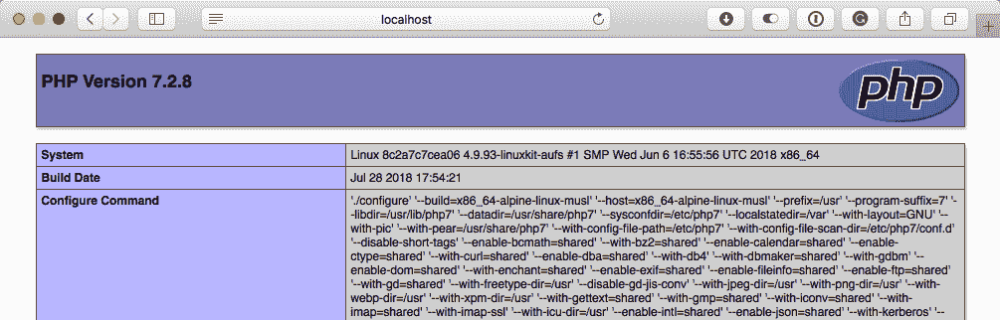

Don't be confused by the next part; there is no PHP6\. For an explanation of why not, go to [https://wiki.php.net/rfc/php6](https://wiki.php.net/rfc/php6).

现在，在您的 Dockerfile 中，将`PHPVERSION`从`7`更改为`5`，然后运行以下命令来构建新映像:

```
$ docker image build --tag local/apache-php:5 .
```

从下面的终端输出可以看出，除了正在安装的软件包之外，大多数输出都是相同的:

```
Sending build context to Docker daemon 2.56kB
Step 1/8 : FROM alpine:latest
 ---> 11cd0b38bc3c
Step 2/8 : LABEL maintainer="Russ McKendrick <russ@mckendrick.io>"
 ---> Using cache
 ---> 175e9ebf182b
Step 3/8 : LABEL description="This example Dockerfile installs Apache & PHP."
 ---> Using cache
 ---> d504837e80a4
Step 4/8 : ENV PHPVERSION=5
 ---> Running in 0646b5e876f6
Removing intermediate container 0646b5e876f6
 ---> 3e17f6c10a50
Step 5/8 : RUN apk add --update apache2 php${PHPVERSION}-apache2 php${PHPVERSION} && rm -rf /var/cache/apk/* && mkdir /run/apache2/ && rm -rf /var/www/localhost/htdocs/index.html && echo "<?php phpinfo(); ?>" > /var/www/localhost/htdocs/index.php && chmod 755 /var/www/localhost/htdocs/index.php
 ---> Running in d55a7726e9a7
fetch http://dl-cdn.alpinelinux.org/alpine/v3.8/main/x86_64/APKINDEX.tar.gz
fetch http://dl-cdn.alpinelinux.org/alpine/v3.8/community/x86_64/APKINDEX.tar.gz
(1/10) Installing libuuid (2.32-r0)
(2/10) Installing apr (1.6.3-r1)
(3/10) Installing expat (2.2.5-r0)
(4/10) Installing apr-util (1.6.1-r2)
(5/10) Installing pcre (8.42-r0)
(6/10) Installing apache2 (2.4.33-r1)
Executing apache2-2.4.33-r1.pre-install
(7/10) Installing php5 (5.6.37-r0)
(8/10) Installing php5-common (5.6.37-r0)
(9/10) Installing libxml2 (2.9.8-r0)
(10/10) Installing php5-apache2 (5.6.37-r0)
Executing busybox-1.28.4-r0.trigger
OK: 32 MiB in 23 packages
Removing intermediate container d55a7726e9a7
 ---> 634ab90b168f
Step 6/8 : EXPOSE 80/tcp
 ---> Running in a59f40d3d5df
Removing intermediate container a59f40d3d5df
 ---> d1aadf757f59
Step 7/8 : ENTRYPOINT ["httpd"]
 ---> Running in c7a1ab69356d
Removing intermediate container c7a1ab69356d
 ---> 22a9eb0e6719
Step 8/8 : CMD ["-D", "FOREGROUND"]
 ---> Running in 8ea92151ce22
Removing intermediate container 8ea92151ce22
 ---> da34eaff9541
Successfully built da34eaff9541
Successfully tagged local/apache-php:5
```

我们可以通过运行以下命令来启动一个容器，这次是在港口`9090`:

```
$ docker container run -d -p 9090:80 --name apache-php5 local/apache-php:5
```

再次打开浏览器，但这次转到`http://localhost:9090/`，应该显示我们正在运行 PHP5:

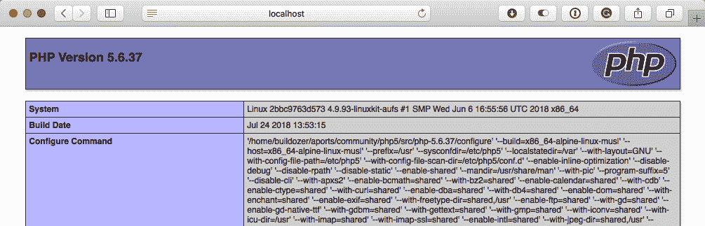

最后，您可以通过运行以下命令来比较映像的大小:

```
$ docker image ls
```

您应该会看到以下终端输出:

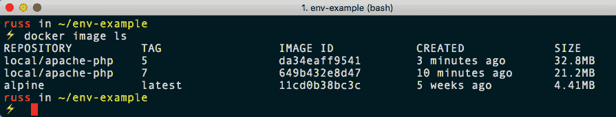

这表明 PHP7 的映像比 PHP5 的映像小很多。让我们讨论一下当我们构建两个不同的容器映像时实际发生了什么。

发生了什么？当 Docker 启动 Alpine Linux 映像来创建我们的映像时，它做的第一件事是设置我们定义的 env，使它们对容器中的所有外壳都可用。

幸运的是，Alpine Linux 中 PHP 的命名方案只是替换了版本号，并为我们需要安装的包维护了相同的名称，这意味着我们运行以下命令:

```
RUN apk add --update apache2 php${PHPVERSION}-apache2 php${PHPVERSION}
```

但实际上解释如下:

```
RUN apk add --update apache2 php7-apache2 php7
```

或者，对于 PHP5，它被解释为以下内容:

```
RUN apk add --update apache2 php5-apache2 php5
```

这意味着我们不必遍历整个 Dockerfile，手动替换版本号。这种方法在从远程网址安装软件包时特别有用，例如软件发布页面。

接下来是一个更高级的例子——一个由哈希公司安装和配置 Consul 的 Dockerfile。在这个 Dockerfile 中，我们使用环境变量来定义我们下载的文件的版本号和 SHA256 哈希:

```
FROM alpine:latest
LABEL maintainer="Russ McKendrick <russ@mckendrick.io>"
LABEL description="An image with the latest version on Consul."

ENV CONSUL_VERSION=1.2.2 CONSUL_SHA256=7fa3b287b22b58283b8bd5479291161af2badbc945709eb5412840d91b912060

RUN apk add --update ca-certificates wget && \
 wget -O consul.zip https://releases.hashicorp.com/consul/${CONSUL_VERSION}/consul_${CONSUL_VERSION}_linux_amd64.zip && \
 echo "$CONSUL_SHA256 *consul.zip" | sha256sum -c - && \
 unzip consul.zip && \
 mv consul /bin/ && \
 rm -rf consul.zip && \
 rm -rf /tmp/* /var/cache/apk/*

EXPOSE 8300 8301 8301/udp 8302 8302/udp 8400 8500 8600 8600/udp

VOLUME [ "/data" ]

ENTRYPOINT [ "/bin/consul" ]
CMD [ "agent", "-data-dir", "/data", "-server", "-bootstrap-expect", "1", "-client=0.0.0.0"]
```

如您所见，Dockerfiles 可能变得相当复杂，使用 env 可以帮助维护。每当新版本的执政官发布时，我只需要更新`ENV`行并将其提交给 GitHub，这将触发新映像的构建——嗯，如果我们将它配置为这样做，它就会这样做；我们将在下一章讨论这个问题。

您可能还注意到，我们在 Dockerfile 中使用了一个我们没有涉及的指令。别担心，我们会看第四章*管理集装箱*中的`VOLUME`说明。

# 使用多阶段构建

这是我们使用 Dockerfiles 和构建容器映像之旅的最后一部分，我们将研究使用一种相对较新的方法来构建映像。在本章这一部分的前几节中，我们研究了通过包管理器(如 Alpine Linux 的 APK)或者通过从软件供应商下载预编译的二进制文件，将二进制文件直接添加到我们的映像中。

如果我们想要编译我们自己的软件作为构建的一部分呢？从历史上看，我们必须使用包含完整构建环境的容器映像，这可能非常大。这意味着我们可能不得不凑齐一个脚本，运行类似以下过程:

1.  下载构建环境容器映像并启动“构建”容器
2.  将源代码复制到“构建”容器
3.  在“构建”容器上编译源代码
4.  将编译后的二进制文件复制到“构建”容器之外
5.  移除“构建”容器
6.  使用预写的 Dockerfile 构建映像并将二进制文件复制到其中

这是一个很大的逻辑——在一个理想的世界里，它应该是 Docker 的一部分。幸运的是，Docker 社区是这样认为的，实现这一点的功能(称为多阶段构建)是在 Docker 17.05 中引入的。

Dockerfile 包含两个不同的构建阶段。第一个名为`builder`，使用 Docker Hub 的官方 Go 容器映像。这里，我们正在安装一个先决条件，直接从 GitHub 下载源代码，然后将其编译为静态二进制文件:

```
FROM golang:latest as builder
WORKDIR /go-http-hello-world/
RUN go get -d -v golang.org/x/net/html 
ADD https://raw.githubusercontent.com/geetarista/go-http-hello-world/master/hello_world/hello_world.go ./hello_world.go
RUN CGO_ENABLED=0 GOOS=linux go build -a -installsuffix cgo -o app .

FROM scratch 
COPY --from=builder /go-http-hello-world/app .
CMD ["./app"] 
```

因为我们的静态二进制文件有一个内置的 web 服务器，所以从操作系统的角度来看，我们真的不需要任何其他东西。正因为如此，我们能够使用`scratch`作为基础映像，这意味着我们所有的映像都将包含我们从构建器映像中复制的静态二进制文件，并且根本不会包含任何`builder`环境。

要构建映像，我们只需要运行以下命令:

```
$ docker image build --tag local:go-hello-world .
```

该命令的输出可以在下面的代码块中找到——有趣的位发生在步骤 5 和 6 之间:

```
Sending build context to Docker daemon 9.216kB
Step 1/8 : FROM golang:latest as builder
latest: Pulling from library/golang
55cbf04beb70: Pull complete
1607093a898c: Pull complete
9a8ea045c926: Pull complete
d4eee24d4dac: Pull complete
9c35c9787a2f: Pull complete
6a66653f6388: Pull complete
102f6b19f797: Pull complete
Digest: sha256:957f390aceead48668eb103ef162452c6dae25042ba9c41762f5210c5ad3aeea
Status: Downloaded newer image for golang:latest
 ---> d0e7a411e3da
Step 2/8 : WORKDIR /go-http-hello-world/
 ---> Running in e1d56745f358
Removing intermediate container e1d56745f358
 ---> f18dfc0166a0
Step 3/8 : RUN go get -d -v golang.org/x/net/html
 ---> Running in 5e97d81db53c
Fetching https://golang.org/x/net/html?go-get=1
Parsing meta tags from https://golang.org/x/net/html?go-get=1 (status code 200)
get "golang.org/x/net/html": found meta tag get.metaImport{Prefix:"golang.org/x/net", VCS:"git", RepoRoot:"https://go.googlesource.com/net"} at https://golang.org/x/net/html?go-get=1
get "golang.org/x/net/html": verifying non-authoritative meta tag
Fetching https://golang.org/x/net?go-get=1
Parsing meta tags from https://golang.org/x/net?go-get=1 (status code 200)
golang.org/x/net (download)
Removing intermediate container 5e97d81db53c
 ---> f94822756a52
Step 4/8 : ADD https://raw.githubusercontent.com/geetarista/go-http-hello-world/master/hello_world/hello_world.go ./hello_world.go
Downloading 393B
 ---> ecf3944740e1
Step 5/8 : RUN CGO_ENABLED=0 GOOS=linux go build -a -installsuffix cgo -o app .
 ---> Running in 6e2d39c4d8ba
Removing intermediate container 6e2d39c4d8ba
 ---> 247fcbfb7a4d
Step 6/8 : FROM scratch
 --->
Step 7/8 : COPY --from=builder /go-http-hello-world/app .
 ---> a69cf59ab1d3
Step 8/8 : CMD ["./app"]
 ---> Running in c99076fad7fb
Removing intermediate container c99076fad7fb
 ---> 67296001bdc0
Successfully built 67296001bdc0
Successfully tagged local:go-hello-world
```

如您所见，在第 5 步和第 6 步之间，我们的二进制文件已经被编译，包含`builder`环境的容器被移除，留给我们一个存储我们的二进制文件的映像。第 7 步将二进制文件复制到一个使用 scratch 启动的新容器中，只留下我们需要的内容。

如果您要运行以下命令，您会明白为什么不在构建环境完整的情况下交付应用是个好主意:

```
$ docker image ls
```

下面我们输出的截图显示`golang`映像为`794MB`；随着我们的源代码和先决条件的增加，大小增加到`832MB`:

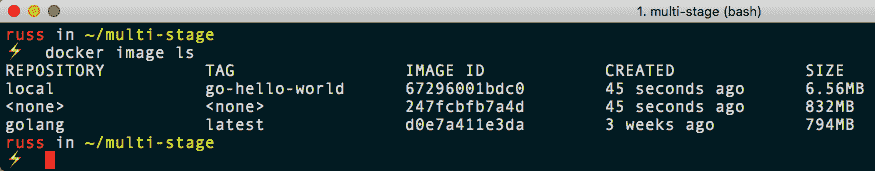

然而，最终的形象只是`6.56MB`。我相信你会同意这是相当大的节省空间。它还遵循本章前面讨论的最佳实践，只在映像中包含与我们的应用相关的内容，并且非常非常小。

您可以通过使用以下命令启动容器来测试应用:

```
$ docker container run -d -p 8000:80 --name go-hello-world local:go-hello-world
```

该应用可通过浏览器访问，并在每次加载页面时简单地增加一个计数器。要在 macOS 和 Linux 上进行测试，可以使用`curl`命令，如下所示:

```
$ curl http://localhost:8000/
```

这应该会给你类似以下的东西:

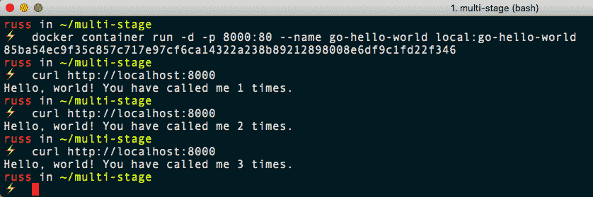

Windows 用户只需在浏览器中访问`http://localhost:8000/`。要停止并删除正在运行的容器，请使用以下命令:

```
$ docker container stop go-hello-world
$ docker container rm go-hello-world
```

如您所见，使用多阶段构建是一个相对简单的过程，并且符合已经开始熟悉的说明。

# 摘要

在本章中，我们深入了解了 Dockerfiles、编写它们的最佳实践、docker 映像构建命令以及我们构建容器的各种方法。我们还了解了环境变量，您可以使用这些变量将 Dockerfile 传递给容器中的各种项目。

在下一章中，既然我们知道了如何使用 Dockerfiles 构建映像，我们将了解 Docker Hub 以及使用注册表服务带来的所有优势。我们还将看看 Docker 注册表，它是开源的，因此您可以滚动自己的位置来存储映像，而无需 Docker Enterprise 的费用，以及第三方注册表服务。

# 问题

1.  对还是错:`LABEL`指令一旦建立就标记你的映像？
2.  `ENTRYPOINT`和`CMD`指令有什么区别？
3.  对还是错:使用`ADD`指令时，不能下载并自动解压缩外部托管的档案？
4.  使用现有容器作为映像基础的有效用途是什么？
5.  `EXPOSE`指令揭示了什么？

# 进一步阅读

您可以在以下网址找到官方 Docker 容器映像的指南:

*   [https://github.com/docker-library/official-img/](https://github.com/docker-library/official-img/)

帮助您从现有安装创建容器的一些工具如下:

*   德波特带:[https://wiki.debian.org/Debootstrap/](https://wiki.debian.org/Debootstrap/)
*   尤姆自举:[https://github . com/doze/尤姆自举/](https://github.com/dozzie/yumbootstrap/)
*   rense:[https://salsa . debian . org/debian/rinse/](https://salsa.debian.org/debian/rinse/)
*   坞站 ib 脚本:https://github . com/Moby/Moby/tree/master/IB/

最后，Go HTTP Hello World 应用的完整 GitHub 存储库可以在以下位置找到:

*   [https://github . com/geeta/go-http-hello-world/](https://github.com/geetarista/go-http-hello-world/)