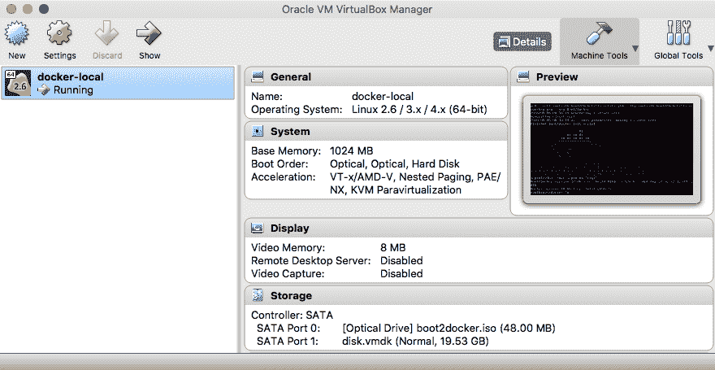
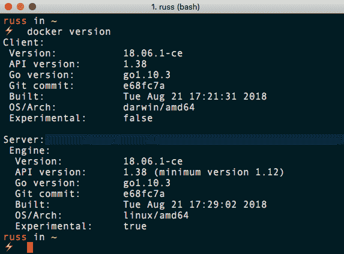
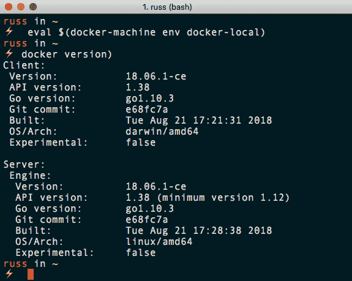
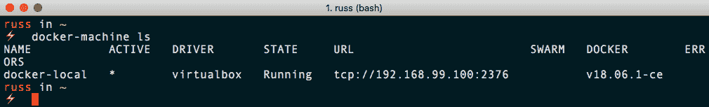
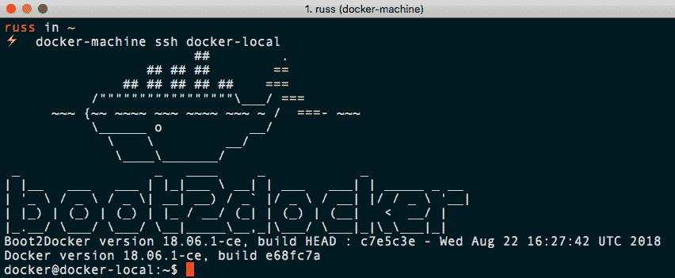
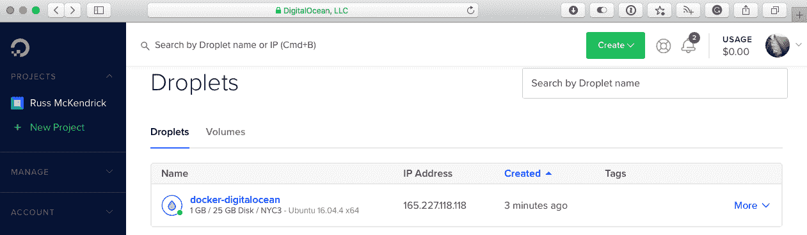
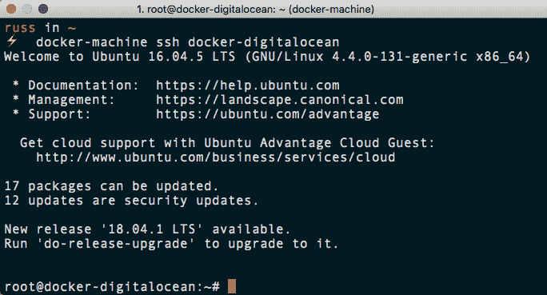
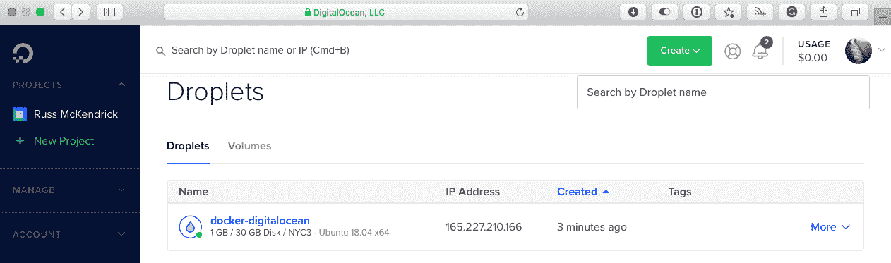
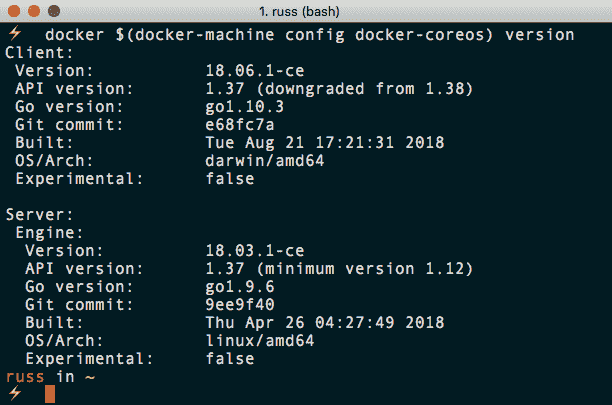

# 码头工人机器

在本章中，我们将更深入地了解我们在上一章中提到的 Docker Machine。它可以用来轻松启动和引导针对各种平台的 Docker 主机，包括本地或云环境。你也可以用它来控制你的 Docker 主机。让我们看一下本章将讲述的内容:

*   码头工人机器介绍
*   使用码头工人机器设置本地码头工人主机
*   在云中启动 Docker 主机
*   使用其他基本操作系统

# 技术要求

与前几章一样，我们将继续使用本地 Docker 安装。同样，本章的截图将来自我的首选操作系统，macOS。

我们将研究如何使用 Docker Machine 在本地使用 VirtualBox 以及在公共云中启动基于 Docker 的虚拟机，因此，如果您希望遵循本章中的示例，您将需要一个数字海洋帐户。

和以前一样，我们将运行的 Docker 命令将在迄今为止安装了 Docker 的所有三个操作系统上运行。然而，一些支持命令可能只适用于 macOS 和基于 Linux 的操作系统，而且数量很少。

查看以下视频，了解《行为准则》:

[http://bit.ly/2Ansb5v](http://bit.ly/2Ansb5v)

# 码头工人机器介绍

在我们卷起袖子开始使用 Docker Machine 之前，我们应该花点时间讨论一下它在整个 Docker 生态系统中占据什么位置。

Docker Machine 最大的优势在于，它为亚马逊 Web Services、DigitalOcean、微软 Azure、谷歌云等多家公有云提供商，以及包括 OpenStack、VMware vSphere 在内的自托管虚拟机/云平台提供了一致的接口。最后，支持以下本地托管的虚拟机管理程序，例如 Oracle VirtualBox 和 VMware Workstation 或 Fusion。

如果您需要在某一天快速访问亚马逊网络服务中的 Docker 主机，然后在下一天访问 DigitialOcean，那么能够使用一个命令以最少的用户交互来定位所有这些技术是非常节省时间的——您知道您将获得一致的体验。

由于它是一个命令行工具，所以向同事传递指令甚至编写启动脚本并在 Docker 主机上拆除也非常容易:想象一下，每天早上用为您构建的全新环境开始工作，然后为了节省成本，每天晚上都要拆除它。

# 使用码头工人机器部署本地码头工人主机

在我们进入云之前，我们将通过启动 Docker Machine，使用 Oracle VirtualBox 提供虚拟机，在本地了解它的基础知识。

VirtualBox is a free virtualization product from Oracle. It allows you to install virtual machines across many different platforms and CPU types. Download and install VirtualBox from [https://www.virtualbox.org/wiki/Downloads/](https://www.virtualbox.org/wiki/Downloads/).

要启动机器，您只需运行以下命令:

```
$ docker-machine create --driver virtualbox docker-local
```

这将启动部署，在此期间，您将获得 Docker Machine 正在运行的任务列表。要启动您的 Docker 主机，用 Docker Machine 启动的每个主机都要经过相同的步骤。

首先，Docker Machine 运行一些基本检查，例如确认 VirtualBox 已安装，并创建证书和目录结构来存储其所有文件和虚拟机:

```
Creating CA: /Users/russ/.docker/machine/certs/ca.pem
Creating client certificate: /Users/russ/.docker/machine/certs/cert.pem
Running pre-create checks...
(docker-local) Image cache directory does not exist, creating it at /Users/russ/.docker/machine/cache...
```

然后，它会检查将用于虚拟机的映像是否存在。如果不存在，将下载映像:

```
(docker-local) No default Boot2Docker ISO found locally, downloading the latest release...
(docker-local) Latest release for github.com/boot2docker/boot2docker is v18.06.1-ce
(docker-local) Downloading /Users/russ/.docker/machine/cache/boot2docker.iso from https://github.com/boot2docker/boot2docker/releases/download/v18.06.1-ce/boot2docker.iso...
(docker-local) 0%....10%....20%....30%....40%....50%....60%....70%....80%....90%....100%
```

检查通过后，它将使用选定的驱动程序创建虚拟机:

```
Creating machine...
(docker-local) Copying /Users/russ/.docker/machine/cache/boot2docker.iso to /Users/russ/.docker/machine/machines/docker-local/boot2docker.iso...
(docker-local) Creating VirtualBox VM...
(docker-local) Creating SSH key...
(docker-local) Starting the VM...
(docker-local) Check network to re-create if needed...
(docker-local) Found a new host-only adapter: "vboxnet0"
(docker-local) Waiting for an IP...
Waiting for machine to be running, this may take a few minutes...
```

如您所见，Docker Machine 为虚拟机创建了一个唯一的 SSH 密钥。这意味着您将能够通过 SSH 访问虚拟机，但稍后会有更多信息。一旦虚拟机启动，Docker Machine 就会与虚拟机建立连接:

```
Detecting operating system of created instance...
Waiting for SSH to be available...
Detecting the provisioner...
Provisioning with boot2docker...
Copying certs to the local machine directory...
Copying certs to the remote machine...
Setting Docker configuration on the remote daemon...
Checking connection to Docker...
```

如您所见，Docker Machine 检测正在使用的操作系统，并选择适当的引导脚本来部署 Docker。一旦安装了 Docker，Docker Machine 就会在本地主机和 Docker 主机之间生成并共享证书。然后，它为证书身份验证配置远程 Docker 安装，这意味着您的本地客户端可以连接到远程 Docker 服务器并与之交互:

一旦安装了 Docker，Docker Machine 就会在本地主机和 Docker 主机之间生成并共享证书。然后，它为证书身份验证配置远程 Docker 安装，这意味着您的本地客户端可以连接到远程 Docker 服务器并与之交互:

```
Docker is up and running!
To see how to connect your Docker Client to the Docker Engine running on this virtual machine, run: docker-machine env docker-local
```

最后，它检查您的本地 Docker 客户端是否可以进行远程连接，并通过向您提供如何将您的本地客户端配置到新启动的 Docker 主机的说明来完成任务。

如果您打开 VirtualBox，您应该能够看到您的新虚拟机:



接下来，我们需要配置我们的本地 Docker 客户端，以连接到新启动的 Docker 主机；正如在启动主机的输出中已经提到的，运行以下命令将向您展示如何建立连接:

```
$ docker-machine env docker-local
```

此命令返回以下内容:

```
export DOCKER_TLS_VERIFY="1"
export DOCKER_HOST="tcp://192.168.99.100:2376"
export DOCKER_CERT_PATH="/Users/russ/.docker/machine/machines/docker-local"
export DOCKER_MACHINE_NAME="docker-local"
# Run this command to configure your shell:
# eval $(docker-machine env docker-local)
```

这将通过提供新启动的 Docker 主机的 IP 地址和端口号以及用于身份验证的证书路径来覆盖本地 Docker 安装。在输出的最后，它给你一个命令来运行和配置你的终端会话，以便建立连接。

在运行命令之前，让我们运行`docker version`来获取当前设置的信息:



这基本上是我运行的 Mac 安装的 Docker。运行以下命令，然后再次运行`docker version`应该会向服务器显示一些更改:

```
$ eval $(docker-machine env docker-local)
```

该命令的输出如下所示:



如您所见，Docker Machine 推出的服务器与我们在本地安装的服务器相当一致；事实上，唯一的区别是构建时间。如您所见，我的 Docker for Mac 安装上的 Docker Engine 二进制文件是在 Docker Machine 版本后一分钟构建的。

从这里，我们可以像本地 Docker 安装一样与 Docker 主机交互。在我们继续在云中启动 Docker 主机之前，还有一些其他基本的 Docker Machine 命令需要介绍。

第一个列表列出了当前配置的 Docker 主机:

```
$ docker-machine ls
```

该命令的输出如下所示:



如您所见，它列出了机器名称、使用的驱动程序和 Docker 端点 URL 的详细信息，以及主机运行的 Docker 版本。

你还会注意到在`ACTIVE`列有一个`*`；这表明您的本地客户端当前配置为与哪个 Docker 主机交互。你也可以通过运行`docker-machine active`找到激活的机器。

下一个命令使用 SSH 将您连接到 Docker 主机:

```
$ docker-machine ssh docker-local
```

该命令的输出如下所示:



如果您需要在 Docker Machine 之外安装附加软件或配置，这非常有用。如果需要查看日志等，也很有用，因为可以通过运行`exit`退出远程 shell。您可以通过在本地计算机上运行以下命令找到 Docker 主机的 IP 地址:

```
$ docker-machine ip docker-local
```

我们将在本章的后面使用它。还有一些命令用于建立有关 Docker 主机的更多详细信息:

```
$ docker-machine inspect docker-local
$ docker-machine config docker-local
$ docker-machine status docker-local
$ docker-machine url docker-local
```

最后，还有命令`stop`、`start`、`restart`，移除你的 Docker 主机。使用最后一个命令删除本地启动的主机:

```
$ docker-machine stop docker-local
$ docker-machine start docker-local
$ docker-machine restart docker-local
$ docker-machine rm docker-local
```

运行`docker-machine rm`命令将提示您确定是否真的要删除实例:

```
About to remove docker-local
WARNING: This action will delete both local reference and remote instance.
Are you sure? (y/n): y
Successfully removed docker-local
```

既然我们已经对基础知识有了一个非常快速的概述，让我们尝试一些更具冒险性的东西。

# 在云中启动 Docker 主机

在本节中，我们将只看一下 Docker Machine 支持的公共云驱动程序之一。如前所述，有很多可用的，但 Docker Machine 的部分吸引力在于它提供了一致的体验，因此驱动程序之间没有太多差异。

我们将使用 Docker Machine 在数字海洋推出 Docker 主机。我们唯一需要做的就是一个 API 访问令牌。您可以按照[https://www.digitalocean.com/help/api/](https://www.digitalocean.com/help/api/)的说明进行操作，而不是在这里解释如何生成。

Launching a Docker host using the API token will incur a cost; ensure you keep track of the Docker hosts you launch. Details on DigitalOcean's pricing can be found at [https://www.digitalocean.com/pricing/](https://www.digitalocean.com/pricing/). Also, keep your API token secret as it could be used to gain unauthorized access to your account. All of the tokens used in this chapter have been revoked.

我们要做的第一件事是将令牌设置为环境变量，这样我们就不必一直使用它。为此，请运行以下命令，确保用您自己的令牌替换 API 令牌:

```
$ DOTOKEN=0cb54091fecfe743920d0e6d28a29fe325b9fc3f2f6fccba80ef4b26d41c7224
```

Due to the additional flags that we need to pass to the Docker Machine command, I will be using `\` to split the command across multiple lines to make it more readable.

要启动名为`docker-digtialocean`的 Docker 主机，我们需要运行以下命令:

```
$ docker-machine create \
 --driver digitalocean \ --digitalocean-access-token $DOTOKEN \ docker-digitalocean
```

由于 Docker 主机是一台远程机器，启动、配置和访问需要一点时间。从以下输出可以看出，Docker Machine 引导 Docker 主机的方式也有一些变化:

```
Running pre-create checks...
Creating machine...
(docker-digitalocean) Creating SSH key...
(docker-digitalocean) Creating Digital Ocean droplet...
(docker-digitalocean) Waiting for IP address to be assigned to the Droplet...
Waiting for machine to be running, this may take a few minutes...
Detecting operating system of created instance...
Waiting for SSH to be available...
Detecting the provisioner...
Provisioning with ubuntu(systemd)...
Installing Docker...
Copying certs to the local machine directory...
Copying certs to the remote machine...
Setting Docker configuration on the remote daemon...
Checking connection to Docker...
Docker is up and running!
To see how to connect your Docker Client to the Docker Engine running on this virtual machine, run: docker-machine env docker-digitalocean
```

一旦启动，您应该能够在数字海洋控制面板中看到 Docker 主机:



通过运行以下命令，重新配置本地客户端以连接到远程主机:

```
$ eval $(docker-machine env docker-digitalocean)
```

另外，您可以运行`docker version`和`docker-machine inspect docker-digitalocean`来了解更多关于 Docker 主机的信息。

最后，运行`docker-machine ssh docker-digitalocean`将把你 SSH 到主机中。从以下输出以及首次启动 Docker 主机时的输出中可以看出，所使用的操作系统有所不同:



可以通过运行`exit`退出远程 shell。如您所见，我们不必告诉 Docker Machine 使用哪个操作系统、Docker 主机的大小，甚至不必告诉它在哪里启动。这是因为每个驱动程序都有一些非常合理的默认值。将这些默认值添加到我们的命令中使其看起来如下所示:

```
$ docker-machine create \
 --driver digitalocean \
 --digitalocean-access-token $DOTOKEN \
 --digitalocean-image ubuntu-16-04-x64 \
 --digitalocean-region nyc3 \
 --digitalocean-size 512mb \
 --digitalocean-ipv6 false \
 --digitalocean-private-networking false \
 --digitalocean-backups false \
 --digitalocean-ssh-user root \
 --digitalocean-ssh-port 22 \
 docker-digitalocean
```

如您所见，您可以自定义大小、区域和操作系统，甚至 Docker 主机启动时使用的网络。假设我们想改变操作系统和液滴的大小。在这种情况下，我们可以运行以下命令:

```
$ docker-machine create \
 --driver digitalocean \
 --digitalocean-access-token $DOTOKEN \
 --digitalocean-image ubuntu-18-04-x64 \
 --digitalocean-size 1gb \
 docker-digitalocean
```

正如您在 DigitalOcean 控制面板中看到的，这将启动一台类似如下的机器:



您可以通过运行以下命令来删除数字海洋 Docker 主机:

```
$ docker-machine rm docker-digitalocean
```

# 使用其他基本操作系统

您不必使用 Docker Machine 的默认操作系统；它确实为其他基本操作系统提供了资源，包括那些面向运行容器的系统。在我们完成这一章之前，我们将看看如何启动其中的一个，CoreOS。

我们要看的发行版有足够的操作系统来运行内核、网络堆栈和容器，就像 Docker 自己的 MobyOS 一样，它被用作 Mac 的 Docker 和 Windows 的 Docker 的基础。

虽然 CoreOS 支持自己的容器运行时，称为 RKT(发音为火箭)，但它也附带 Docker。然而，正如我们将看到的那样，目前与稳定版本的 CoreOS 一起发布的 Docker 版本有点过时了。

要启动数字海洋管理的`coreos-stable`版本，运行以下命令:

```
$ docker-machine create \
 --driver digitalocean \
 --digitalocean-access-token $DOTOKEN \
 --digitalocean-image coreos-stable \
 --digitalocean-size 1GB \
 --digitalocean-ssh-user core \
 docker-coreos
```

就像在公共云上启动我们的其他 Docker 主机一样，输出几乎是一样的。您会注意到 Docker Machine 使用了 CoreOS 置备程序:

```
Running pre-create checks...
Creating machine...
(docker-coreos) Creating SSH key...
(docker-coreos) Creating Digital Ocean droplet...
(docker-coreos) Waiting for IP address to be assigned to the Droplet...
Waiting for machine to be running, this may take a few minutes...
Detecting operating system of created instance...
Waiting for SSH to be available...
Detecting the provisioner...
Provisioning with coreOS...
Copying certs to the local machine directory...
Copying certs to the remote machine...
Setting Docker configuration on the remote daemon...
Checking connection to Docker...
Docker is up and running!
To see how to connect your Docker Client to the Docker Engine running on this virtual machine, run: docker-machine env docker-coreos
```

启动后，您可以运行以下程序:

```
$ docker-machine ssh docker-coreos cat /etc/*release
```

这将返回`release`文件的内容:

```
DISTRIB_ID="Container Linux by CoreOS"
DISTRIB_RELEASE=1800.7.0
DISTRIB_CODENAME="Rhyolite"
DISTRIB_DESCRIPTION="Container Linux by CoreOS 1800.7.0 (Rhyolite)"
NAME="Container Linux by CoreOS"
ID=coreos
VERSION=1800.7.0
VERSION_ID=1800.7.0
BUILD_ID=2018-08-15-2254
PRETTY_NAME="Container Linux by CoreOS 1800.7.0 (Rhyolite)"
ANSI_COLOR="38;5;75"
HOME_URL="https://coreos.com/"
BUG_REPORT_URL="https://issues.coreos.com"
COREOS_BOARD="amd64-usr"
```

运行以下内容将向您展示运行在 CoreOS 主机上的 Docker 版本的更多信息:

```
$ docker $(docker-machine config docker-coreos) version
```

您可以从以下输出中看到这一点；此外，正如已经提到的，它是当前版本的背后:



这意味着，我们在本书中使用的命令可能并不都有效。要删除 CoreOS 主机，请运行以下命令:

```
$ docker-machine rm docker-coreos
```

# 摘要

在本章中，我们了解了如何使用 Docker Machine 在 VirtualBox 上本地创建 Docker 主机，并回顾了可以用来与 Docker Machine 启动的 Docker 主机进行交互和管理的命令。

然后，我们研究了如何使用 Docker Machine 将 Docker 主机部署到您的云环境，即数字海洋。最后，我们快速了解了如何启动一个不同的容器优化的 Linux 操作系统，它就是 CoreOS。

我相信你会同意使用 Docker Machine 来运行这些任务，它们通常有非常不同的方法，非常一致的体验，并且从长远来看，这将节省大量时间以及解释。

在下一章中，我们将从与单个 Docker 主机交互转向启动和运行 Docker Swarm 集群。

# 问题

1.  运行`docker-machine create`时，哪个标志让您定义 Docker Machine 使用哪个服务或提供商来启动您的 Docker 主机？
2.  对还是错:运行`docker-machine env my-host`将重新配置您的本地 Docker 客户端与`my-host`交互？
3.  解释 Docker Machine 背后的基本原理。

# 进一步阅读

有关 Docker Machine 支持的各种平台的信息，请参考以下内容:

*   亚马逊网络服务:[https://aws.amazon.com/](https://aws.amazon.com/)
*   微软 Azure:[https://azure.microsoft.com/](https://azure.microsoft.com/)
*   数字海洋:[https://www . digital ocean . com/](https://www.digitalocean.com/)
*   系外鳞片:[https://www.exoscale.ch/](https://www.exoscale.ch/)
*   谷歌计算引擎:[https://cloud.google.com/](https://cloud.google.com/)
*   rackspace:[https://www.rackspace.com/](https://www.rackspace.com/)
*   IBM soft layer:https://www . soft layer . com/
*   微软 Hyper-V:[https://www . Microsoft . com/en-GB/云平台/服务器-虚拟化/](https://www.microsoft.com/en-gb/cloud-platform/server-virtualization/)
*   open stack:[https://www.openstack.org/](https://www.openstack.org/)
*   VMware 虚拟圈:[https://www.vmware.com/uk/products/vsphere.html](https://www.vmware.com/uk/products/vsphere.html)
*   甲骨文虚拟盒子:[https://www.virtualbox.org/](https://www.virtualbox.org/)
*   VMware Fusion:[https://www.vmware.com/uk/products/fusion.html](https://www.vmware.com/uk/products/fusion.html)
*   VMware 工作站:[https://www.vmware.com/uk/products/workstation.html](https://www.vmware.com/uk/products/workstation.html)
*   韩文: [https://coreos.com/](https://coreos.com/)