# 码头工人群

在这一章中，我们将看一下 Docker Swarm。使用 Docker Swarm，您可以创建和管理 Docker 集群。Swarm 可用于跨多个主机分发容器，并且还具有扩展容器的能力。我们将涵盖以下主题:

*   引入 Docker Swarm
*   码头工人集群中的角色
*   创建和管理群
*   Docker Swarm 服务和堆栈
*   集群负载平衡和调度

# 技术要求

与前几章一样，我们将继续使用本地 Docker 安装。同样，本章的截图将来自我的首选操作系统，macOS。

和以前一样，我们将运行的 Docker 命令将在迄今为止安装了 Docker 的所有三个操作系统上运行。然而，一些支持命令可能只适用于 macOS 和基于 Linux 的操作系统，而且数量很少。

查看以下视频，了解《行为准则》:

[http://bit.ly/2yWA4gl](http://bit.ly/2yWA4gl)

# 引入 Docker Swarm

在我们进一步讨论之前，我应该提到 Docker Swarm 有两个非常不同的版本。有一个独立版本的 Docker Swarm 这在 Docker 1.12 之前一直得到支持，现在不再积极开发；但是，您可能会发现一些旧文档提到了它。不建议安装独立的 Docker Swarm，因为 Docker 在 2017 年第一季度结束了对 1.11.x 版本的支持。

Docker 1.12 版本引入了 Docker Swarm 模式。这将独立 Docker Swarm 中可用的所有功能引入了核心 Docker 引擎，以及大量附加功能。由于我们在本书中涵盖了 Docker 18.06 及更高版本，我们将使用 Docker Swarm 模式，在本章的剩余部分，我们将称之为 Docker Swarm。

由于您已经在运行一个内置了 Docker Swarm 支持的 Docker 版本，所以您不需要做任何事情来安装 Docker Swarm；您可以通过运行以下命令来验证 Docker Swarm 在您的安装中是否可用:

```
$ docker swarm --help
```

运行命令时，您应该会看到类似以下终端输出的内容:

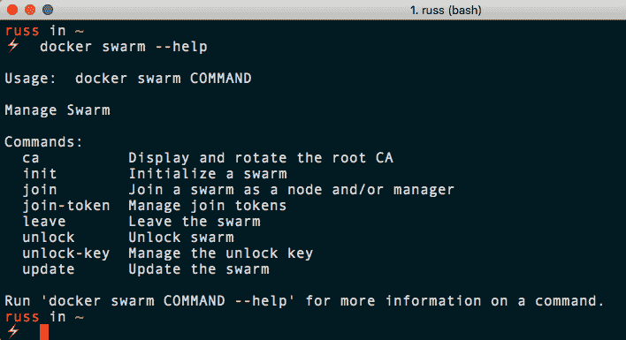

如果出现错误，请确保您运行的是 Docker 18.06 或更高版本，我们在[第 1 章](01.html)*【Docker 概述】*中介绍了该版本的安装。既然我们知道我们的 Docker 客户端支持 Docker Swarm，那么 Swarm 是什么意思呢？

A **Swarm** 是主机的集合，所有主机都运行 Docker，它们被设置为在集群配置中相互交互。配置完成后，您将能够使用我们到目前为止针对单个主机运行的所有命令，并让 Docker Swarm 通过使用部署策略来决定在哪个主机上启动您的容器来决定容器的位置。

码头工人群由两种类型的主机组成。现在让我们来看看这些。

# 码头工人集群中的角色

Docker Swarm 涉及哪些角色？让我们来看看主机在 Docker Swarm 集群中运行时可以承担的两个角色。

# 群管理器

**群管理器**是一个主机，是所有群主机的中央管理点。群管理器是你发布所有命令来控制这些节点的地方。您可以在节点之间切换、加入节点、移除节点以及操作这些主机。

每个集群可以运行几个 Swarm 管理器。对于生产，建议您至少运行五个 Swarm 管理器:这意味着在您开始遇到任何错误之前，我们的集群最多可以处理两个 Swarm 管理器节点故障。群管理器使用 Raft 共识算法(更多细节参见后续阅读部分)来保持所有管理器节点的一致状态。

# 群体工作者

我们之前看到的被称为 Docker 主机的**群工作人员**是那些运行 Docker 容器的人。群组工作人员由群组管理器管理:

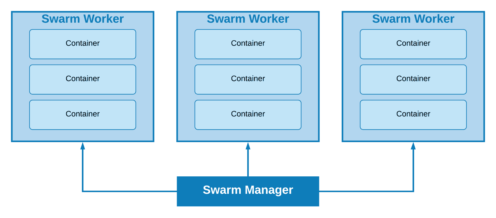

这是所有 Docker Swarm 组件的示例。我们看到 Docker Swarm 管理器与每个具有 Docker Swarm 工作人员角色的 Swarm 主机进行对话。工人们确实有某种程度的连通性，我们将很快看到。

# 创建和管理群

现在让我们看看如何使用 Swarm，以及如何执行以下任务:

*   创建集群
*   加入工人
*   正在列出节点
*   管理集群

# 创建集群

让我们从创建一个集群开始，从 Swarm 管理器开始。由于我们将在本地计算机上创建一个多节点集群，因此我们应该使用 Docker Machine 通过运行以下命令来启动主机:

```
$ docker-machine create \
 -d virtualbox \
 swarm-manager 
```

您获得的输出的节略版本如下所示:

```
(swarm-manager) Creating VirtualBox VM...
(swarm-manager) Starting the VM...
(swarm-manager) Check network to re-create if needed...
(swarm-manager) Waiting for an IP...
Waiting for machine to be running, this may take a few minutes...
Checking connection to Docker...
Docker is up and running!
To see how to connect your Docker Client to the Docker Engine running on this virtual machine, run: docker-machine env swarm-manager
```

Swarm 管理器节点现在已经启动并使用 VirtualBox 运行。我们可以通过运行以下命令来确认这一点:

```
$ docker-machine ls
```

您应该会看到类似于以下输出的内容:

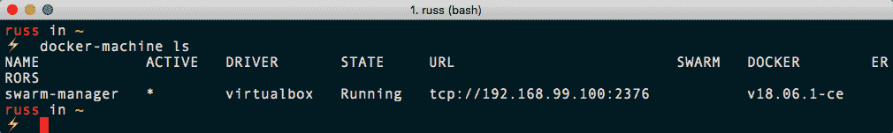

现在，让我们把 Docker Machine 指向新的 Swarm 管理器。从前面创建 Swarm 管理器时的输出中，我们可以看到它告诉我们如何指向节点:

```
$ docker-machine env swarm-manager
```

这将向您展示配置本地 Docker 客户端以与我们新启动的 Docker 主机对话所需的命令。以下代码块显示了我运行该命令时返回的配置:

```
export DOCKER_TLS_VERIFY="1"
export DOCKER_HOST="tcp://192.168.99.100:2376"
export DOCKER_CERT_PATH="/Users/russ/.docker/machine/machines/swarm-manager"
export DOCKER_MACHINE_NAME="swarm-manager"
# Run this command to configure your shell:
# eval $(docker-machine env swarm-manager)
```

运行前一个命令后，我们被告知运行以下命令来指向 Swarm 管理器:

```
$ eval $(docker-machine env swarm-manager)
```

现在，如果我们看看主机上有哪些机器，我们可以看到我们有 Swarm 主主机，并且它现在被设置为`ACTIVE`，这意味着我们现在可以在它上面运行命令:

```
$ docker-machine ls
```

它应该向您展示如下内容:


现在我们已经启动并运行了第一台主机，我们应该添加两个工作节点。为此，只需运行以下命令来启动另外两台 Docker 主机:

```
$ docker-machine create \
 -d virtualbox \
 swarm-worker01
$ docker-machine create \
 -d virtualbox \
 swarm-worker02
```

启动另外两台主机后，您可以使用以下命令获取主机列表:

```
$ docker-machine ls
```

它应该向您展示如下内容:

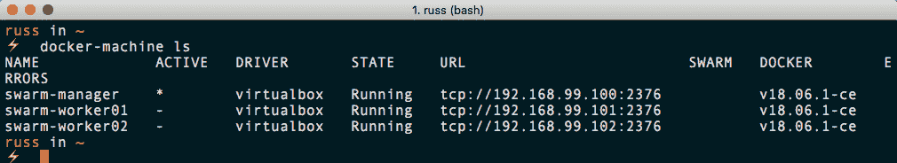

值得指出的是，到目前为止，我们还没有做任何事情来创建我们的 Swarm 集群；我们只启动了它将运行的主机。

You may have noticed that one of the columns when running the `docker-machine ls` command is `SWARM`. This only contains information if you have launched your Docker hosts using the standalone Docker Swarm command, which is built into Docker Machine.

# 向集群添加群管理器

让我们引导我们的 Swarm 管理器。为此，我们将把一些 Docker Machine 命令的结果传递给我们的主机。为了创建我们的管理器，要运行的命令如下:

```
$ docker $(docker-machine config swarm-manager) swarm init \
 --advertise-addr $(docker-machine ip swarm-manager):2377 \
 --listen-addr $(docker-machine ip swarm-manager):2377
```

您应该会收到类似以下的消息:

```
Swarm initialized: current node (uxgvqhw6npr9glhp0zpabn4ha) is now a manager.

To add a worker to this swarm, run the following command:

 docker swarm join --token SWMTKN-1-1uulmpx4j4hub2qmd8q2ozxmonzcehxcomt7cw92xarg3yrkx2-dfiqnfisl75bwwh8yk9pv3msh 192.168.99.100:2377

To add a manager to this swarm, run 'docker swarm join-token manager' and follow the instructions.
```

从输出中可以看到，一旦您的管理器被初始化，您就会得到一个唯一的令牌。在前面的例子中，完整的令牌是`SWMTKN-1-1uulmpx4j4hub2qmd8q2ozxmonzcehxcomt7cw92xarg3yrkx2-dfiqnfisl75bwwh8yk9pv3msh`。工作节点需要这个令牌来验证自己并加入我们的集群。

# 将群集工作人员加入群集

要将我们的两个工作人员添加到集群中，请运行以下命令。首先，让我们设置一个环境变量来保存令牌，确保您用初始化自己的管理器时收到的令牌替换令牌:

```
$ SWARM_TOKEN=SWMTKN-1-1uulmpx4j4hub2qmd8q2ozxmonzcehxcomt7cw92xarg3yrkx2-dfiqnfisl75bwwh8yk9pv3msh
```

现在我们可以运行以下命令将`swarm-worker01`添加到集群中:

```
$ docker $(docker-machine config swarm-worker01) swarm join \
 --token $SWARM_TOKEN \
 $(docker-machine ip swarm-manager):2377
```

对于`swarm-worker02`，需要运行以下命令:

```
$ docker $(docker-machine config swarm-worker02) swarm join \
 --token $SWARM_TOKEN \
 $(docker-machine ip swarm-manager):2377
```

这两次，您都应该得到节点已加入群集的确认:

```
This node joined a swarm as a worker.
```

# 正在列出节点

您可以通过运行以下命令来检查群:

```
$ docker-machine ls
```

检查本地 Docker 客户端是否仍配置为连接到 Swarm 管理器节点，如果不是，请重新运行以下命令:

```
$ eval $(docker-machine env swarm-manager)
```

现在我们已经连接到了 Swarm 管理器节点，您可以运行以下命令:

```
$ docker node ls
```

这将连接到 Swarm 主节点，并查询组成我们集群的所有节点。您应该看到我们的三个节点都列出来了:

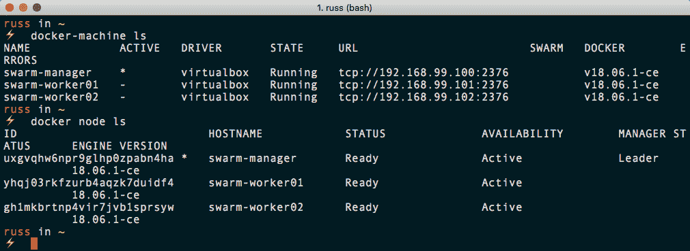

# 管理集群

让我们看看如何对我们正在创建的所有这些集群节点进行管理。

只有两种方法可以管理这些 Swarm 主机和您正在创建的每个主机上的容器，但是首先，您需要了解一些关于它们的信息。

# 查找有关集群的信息

正如我们已经看到的，我们可以使用本地 Docker 客户端列出集群中的节点，因为它已经被配置为连接到 Swarm 管理器主机。我们可以简单地键入以下内容:

```
$ docker info
```

这将为我们提供大量关于主机的信息，正如您可以从下面的输出中看到的，我已经截断了该输出:

```
Containers: 0
 Running: 0
 Paused: 0
 Stopped: 0
Images: 0
Plugins:
 Volume: local
 Network: bridge host macvlan null overlay
 Log: awslogs fluentd gcplogs gelf journald json-file logentries splunk syslog
Swarm: active
 NodeID: uxgvqhw6npr9glhp0zpabn4ha
 Is Manager: true
 ClusterID: pavj3f2ym8u1u1ul5epr3c73f
 Managers: 1
 Nodes: 3
 Orchestration:
 Task History Retention Limit: 5
 Raft:
 Snapshot Interval: 10000
 Number of Old Snapshots to Retain: 0
 Heartbeat Tick: 1
 Election Tick: 10
 Dispatcher:
 Heartbeat Period: 5 seconds
 CA Configuration:
 Expiry Duration: 3 months
 Force Rotate: 0
 Autolock Managers: false
 Root Rotation In Progress: false
 Node Address: 192.168.99.100
 Manager Addresses:
 192.168.99.100:2377
Runtimes: runc
Default Runtime: runc
Init Binary: docker-init
containerd version: 468a545b9edcd5932818eb9de8e72413e616e86e
runc version: 69663f0bd4b60df09991c08812a60108003fa340
init version: fec3683
Kernel Version: 4.9.93-boot2docker
Operating System: Boot2Docker 18.06.1-ce (TCL 8.2.1); HEAD : c7e5c3e - Wed Aug 22 16:27:42 UTC 2018
OSType: linux
Architecture: x86_64
CPUs: 1
Total Memory: 995.6MiB
Name: swarm-manager
ID: NRV7:WAFE:FWDS:63PT:UMZY:G3KU:OU2A:RWRN:RC7D:5ESI:NWRN:NZRU
```

如您所见，在 Swarm 部分有关于集群的信息；但是，我们只能针对我们的客户端当前配置为与之通信的主机运行`docker info`命令。幸运的是，`docker node`命令是集群感知的，因此我们可以使用它来获取集群中每个节点的信息，例如:

```
$ docker node inspect swarm-manager --pretty
```

Assessing the `--pretty` flag with the `docker node inspect` command will render the output in the easy-to-read format you see as follows. If `-- pretty` is left out, Docker will return the raw `JSON` object containing the results of the query the `inspect` command runs against the cluster.

这将为我们的 Swarm 管理器提供以下信息:

```
ID: uxgvqhw6npr9glhp0zpabn4ha
Hostname: swarm-manager
Joined at: 2018-09-15 12:14:59.663920111 +0000 utc
Status:
 State: Ready
 Availability: Active
 Address: 192.168.99.100
Manager Status:
 Address: 192.168.99.100:2377
 Raft Status: Reachable
 Leader: Yes
Platform:
 Operating System: linux
 Architecture: x86_64
Resources:
 CPUs: 1
 Memory: 995.6MiB
Plugins:
 Log: awslogs, fluentd, gcplogs, gelf, journald, json-file, logentries, splunk, syslog
 Network: bridge, host, macvlan, null, overlay
 Volume: local
Engine Version: 18.06.1-ce
Engine Labels:
 - provider=virtualbox
```

运行相同的命令，但这次针对一个工作节点:

```
$ docker node inspect swarm-worker01 --pretty
```

这给了我们类似的信息:

```
ID: yhqj03rkfzurb4aqzk7duidf4
Hostname: swarm-worker01
Joined at: 2018-09-15 12:24:09.02346782 +0000 utc
Status:
 State: Ready
 Availability: Active
 Address: 192.168.99.101
Platform:
 Operating System: linux
 Architecture: x86_64
Resources:
 CPUs: 1
 Memory: 995.6MiB
Plugins:
 Log: awslogs, fluentd, gcplogs, gelf, journald, json-file, logentries, splunk, syslog
 Network: bridge, host, macvlan, null, overlay
 Volume: local
Engine Version: 18.06.1-ce
Engine Labels:
 - provider=virtualbox
```

但是如您所见，它缺少关于管理器功能状态的信息。这是因为工作节点不需要知道管理节点的状态；他们只需要知道他们被允许接受经理的指示。

通过这种方式，我们可以看到关于该主机的信息，例如容器的数量、主机上图像的数量、关于 CPU 和内存的信息，以及其他有趣的信息。

# 提升工作节点

假设您想要在单个管理器节点上执行一些维护，但是您想要维护集群的可用性。没问题；您可以将工作节点提升为管理节点。

当我们启动并运行本地三节点集群时，让我们将`swarm-worker01`提升为新经理。为此，请运行以下命令:

```
$ docker node promote swarm-worker01
```

执行以下命令后，您应该会收到一条消息，确认您的节点已立即升级:

```
Node swarm-worker01 promoted to a manager in the swarm.
```

通过运行以下命令列出节点:

```
$ docker node ls
```

这将向您显示，您现在有两个节点在`MANAGER STATUS`列中显示一些内容:

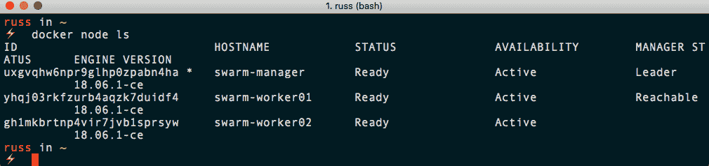

但是我们的`swarm-manager`节点仍然是主管理器节点。让我们看看做些什么。

# 降级管理器节点

您可能已经将两个和两个放在了一起，但是要将`demote`管理器节点转换为工作器，您只需运行以下命令:

```
$ docker node demote swarm-manager
```

同样，您将立即收到以下反馈:

```
Manager swarm-manager demoted in the swarm.
```

现在我们已经降级了节点，您可以通过运行以下命令来检查集群中节点的状态:

```
$ docker node ls
```

当您的本地 Docker 客户端仍然指向新降级的节点时，您将收到一条消息，声明如下:

```
Error response from daemon: This node is not a swarm manager. Worker nodes can't be used to view or modify cluster state. Please run this command on a manager node or promote the current node to a manager.
```

正如我们已经了解到的，使用 Docker Machine 更新我们的本地客户端配置以与其他节点通信是很容易的。要将本地客户端指向新的管理器节点，请运行以下命令:

```
$ eval $(docker-machine env swarm-worker01)
```

现在，外部客户端再次与管理器节点对话，请重新运行以下命令:

```
$ docker node ls
```

它应该按照预期列出节点:

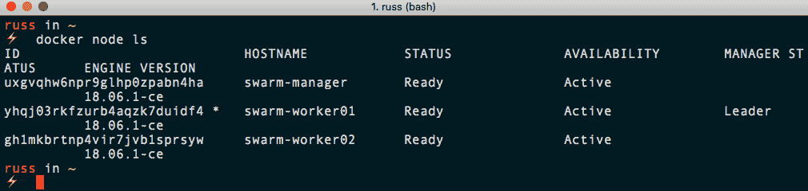

# 清空节点

要从我们的集群中临时删除一个节点以便我们可以执行维护，我们需要将该节点的状态设置为 Drain。让我们看一下清空我们以前的经理节点。为此，我们需要运行以下命令:

```
$ docker node update --availability drain swarm-manager
```

这将停止任何新任务，例如新容器的启动或对我们正在排出的节点执行。一旦新任务被阻止，所有正在运行的任务将从我们正在排出的节点迁移到状态为`ACTIVE`的节点。

从下面的终端输出可以看出，现在列出节点表明`swarm-manager`节点在`AVAILABILITY`列中被列为`Drain`:

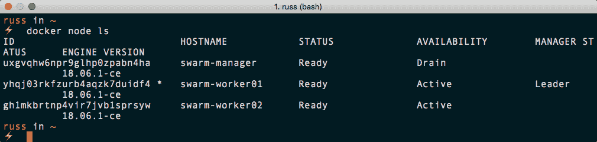

现在，我们的节点不再接受新任务，所有正在运行的任务都已迁移到剩下的两个节点，我们可以安全地执行维护，例如重新启动主机。要重新启动 Swarm 管理器，请运行以下两个命令，确保您已连接到 Docker 主机(您应该会看到`boot2docker`横幅，如命令后面的截图所示):

```
$ docker-machine ssh swarm-manager
$ sudo reboot
```

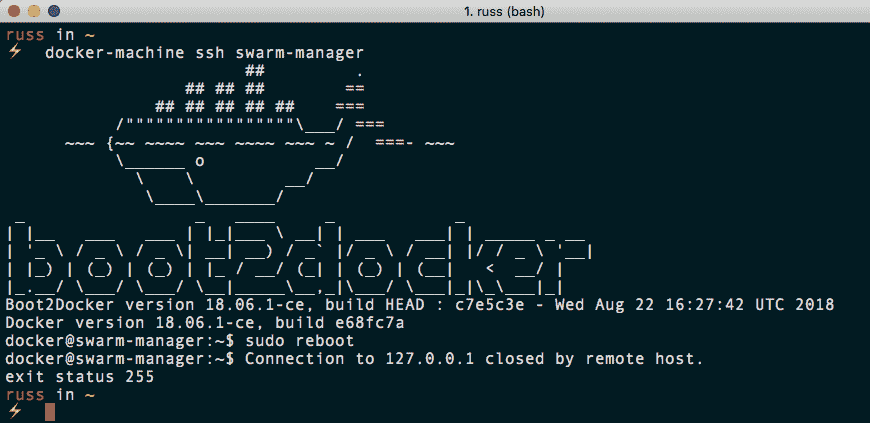

主机重新启动后，运行以下命令:

```
$ docker node ls
```

应该显示该节点的`AVAILABILITY`为`Drain`。要将节点重新添加到集群中，只需运行以下命令将`AVAILABILITY`更改为活动状态:

```
$ docker node update --availability active swarm-manager
```

从下面的终端输出可以看出，我们的节点现在是活动的，这意味着可以对它执行新的任务:

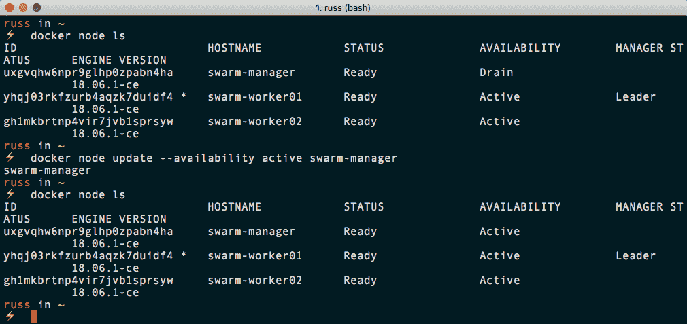

既然我们已经了解了如何创建和管理 Docker Swarm 集群，那么我们应该了解如何运行任务，例如创建和扩展服务。

# Docker Swarm 服务和堆栈

到目前为止，我们已经了解了以下命令:

```
$ docker swarm <command>
$ docker node <command>
```

这两个命令允许我们从现有的 Docker 主机集合中引导和管理我们的 Docker Swarm 集群。我们接下来要看的两个命令如下:

```
$ docker service <command>
$ docker stack <command>
```

`service`和`stack`命令允许我们执行任务，进而启动、扩展和管理我们的 Swarm 集群中的容器。

# 服务

`service`命令是启动利用 Swarm 集群的容器的一种方式。让我们看看在我们的 Swarm 集群上启动一个真正基本的单容器服务。为此，请运行以下命令:

```
$ docker service create \
 --name cluster \
 --constraint "node.role == worker" \
 -p:80:80/tcp \
 russmckendrick/cluster
```

这将创建一个名为集群的服务，该服务由一个容器组成，端口`80`从容器映射到主机，并且它将只在具有工作者角色的节点上运行。

在我们考虑使用该服务做更多事情之前，我们可以检查它是否在我们的浏览器上工作。为此，我们需要两个工作节点的 IP 地址。首先，我们需要通过运行以下命令来仔细检查哪些是工作节点:

```
$ docker node ls
```

一旦我们知道哪个节点具有哪个角色，您就可以通过运行以下命令找到您的节点的 IP 地址:

```
$ docker-machine ls
```

查看以下终端输出:

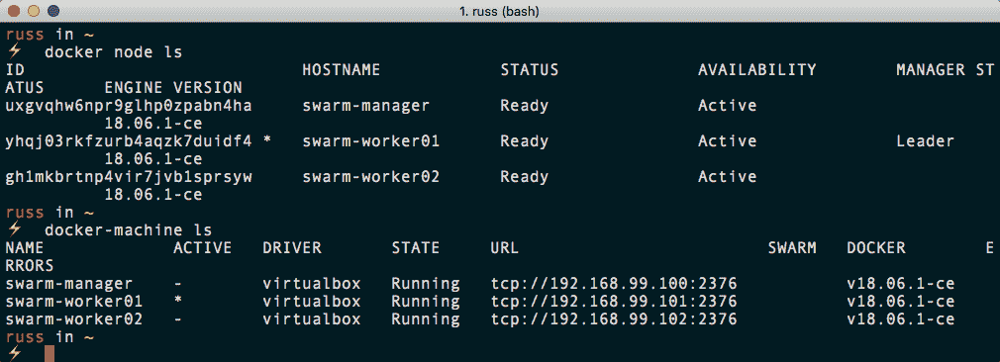

我的工作节点是`swarm-manager`和`swarm-worker02`，它们的 IP 地址分别是`192.168.99.100`和`192.168.99.102`。

转到您的工作节点的任一 IP 地址，如 [http://192.168.99.100/](http://192.168.99.100/) 或 [http://192.168.99.102/](http://192.168.99.102/) ，在浏览器中将显示`russmckendrick/cluster`应用程序的输出，这是 Docker Swarm 图形和提供页面的容器的主机名:

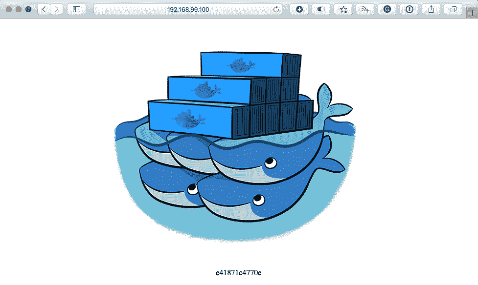

现在我们的服务已经在我们的集群上运行，我们可以开始了解更多关于它的信息。首先，我们可以通过运行以下命令再次列出服务:

```
$ docker service ls
```

在我们的例子中，这应该返回我们启动的单一服务，称为集群:

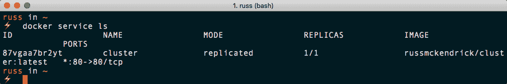

如您所见，这是一项`replicated`服务，`1/1`容器处于活动状态。接下来，您可以通过运行`inspect`命令来深入查看服务的更多信息:

```
$ docker service inspect cluster --pretty
```

这将返回服务的详细信息:

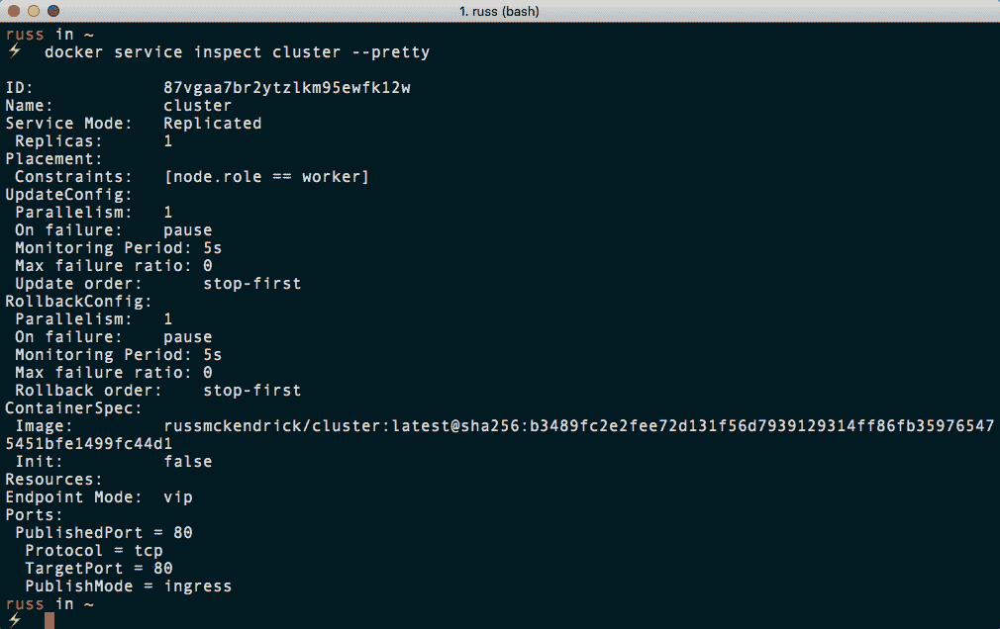

您可能已经注意到，到目前为止，我们还不必关心服务当前运行在两个工作节点中的哪一个上。这是 Docker Swarm 的一个非常重要的特性，因为它完全消除了您对单个容器放置的担心。

在考虑扩展我们的服务之前，我们可以通过运行以下命令快速了解一下我们的单个容器在哪个主机上运行:

```
$ docker node ps
$ docker node ps swarm-manager
$ docker node ps swarm-worker02
```

这将列出我们每个主机上运行的容器。默认情况下，它会列出命令所针对的主机，在我的例子中是`swarm-worker01`:

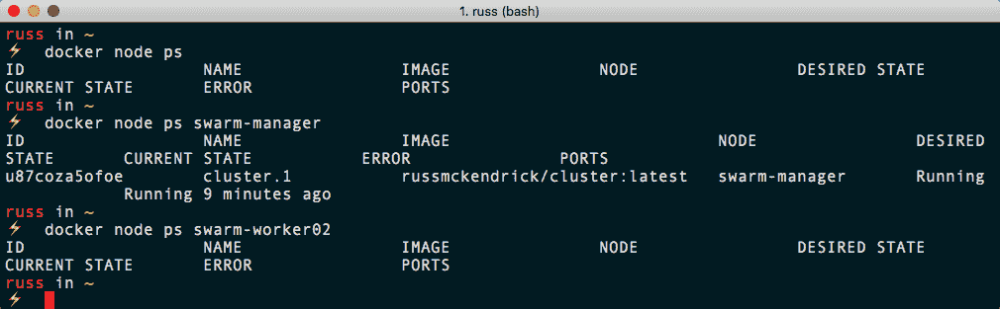

让我们看看将我们的服务扩展到我们的应用程序容器的六个实例。运行以下命令来扩展和检查我们的服务:

```
$ docker service scale cluster=6
$ docker service ls
$ docker node ps swarm-manager
$ docker node ps swarm-worker02
```

我们只检查了两个节点，因为我们最初告诉我们的服务在工作节点上启动。从下面的终端输出可以看出，我们现在有三个容器在每个工作节点上运行:

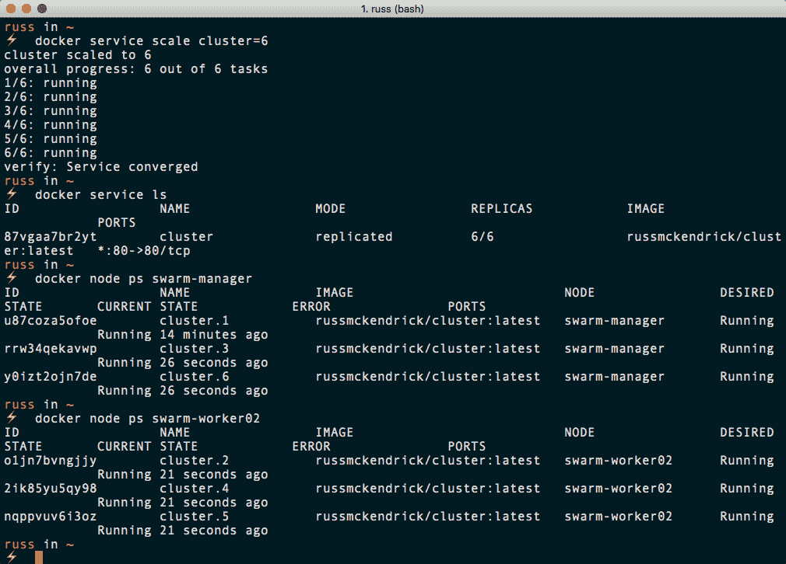

在我们继续查看堆栈之前，让我们删除我们的服务。为此，请运行以下命令:

```
$ docker service rm cluster
```

这将删除所有容器，同时将下载的映像留在主机上。

# 大量

使用 Swarm 和服务创建非常复杂、高度可用的多容器应用程序是完全可能的。在非 Swarm 集群中，为应用程序的一部分手动启动每组容器可能会变得有些费力，也很难共享。为此，Docker 创建了允许您在 Docker 撰写文件中定义服务的功能。

下面的 Docker Compose 文件应该命名为`docker-compose.yml`，它将创建与我们在上一节中启动的服务相同的服务:

```
version: "3"
services:
 cluster:
 image: russmckendrick/cluster
 ports:
 - "80:80"
 deploy:
 replicas: 6
 restart_policy:
 condition: on-failure
 placement:
 constraints:
 - node.role == worker
```

如您所见，堆栈可以由多个服务组成，每个服务都在 Docker Compose 文件的`services`部分下定义。

除了正常的 Docker Compose 命令，还可以添加一个`deploy`部分；这是您定义与堆栈的 Swarm 元素相关的所有内容的地方。

在前面的示例中，我们说我们想要六个副本，它们应该分布在我们的两个工作节点上。此外，我们更新了默认的重启策略，您可以在我们检查上一节中的服务时看到，它显示为暂停，因此，如果容器变得无响应，它总是会重启。

要启动我们的堆栈，请将前面的内容复制到名为`docker-compose.yml`的文件中，然后运行以下命令:

```
$ docker stack deploy --compose-file=docker-compose.yml cluster
```

Docker 将像使用 Docker Compose 启动容器一样，创建一个新的网络，然后在其上启动您的服务。

您可以通过运行以下命令来检查您的`stack`状态:

```
$ docker stack ls
```

这将显示已经创建了一个服务。通过运行以下命令，您可以获得由`stack`创建的服务的详细信息:

```
$ docker stack services cluster
```

最后，运行以下命令将显示`stack`内的容器运行的位置:

```
$ docker stack ps cluster
```

看看终端输出:

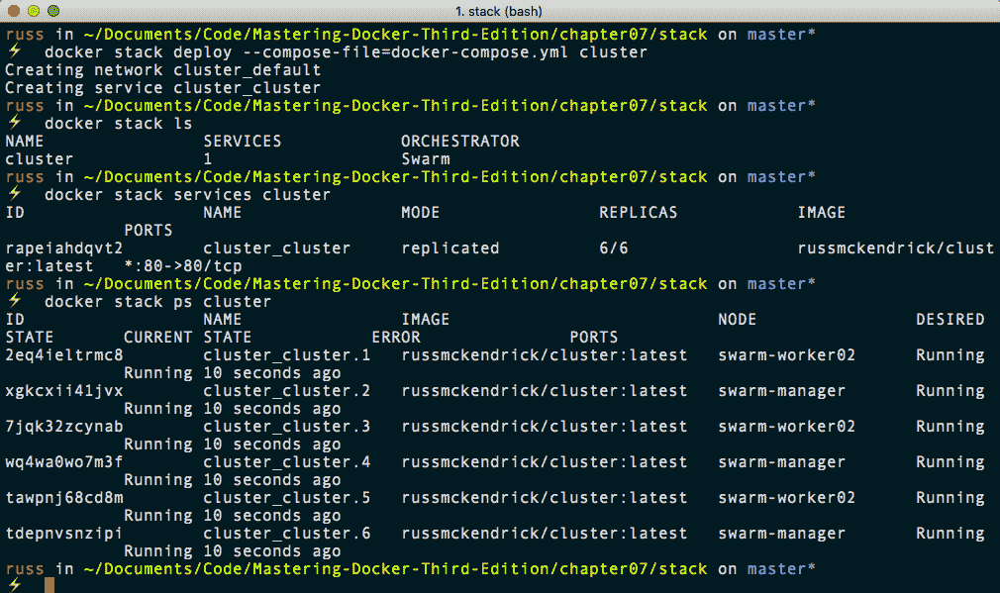

同样，您将能够使用节点的 IP 地址访问堆栈，并且您将被路由到一个正在运行的容器。要删除堆栈，只需运行以下命令:

```
$ docker stack rm cluster
```

这将删除堆栈启动时创建的所有服务和网络。

# 删除群群集

在继续之前，由于下一节不再需要它，您可以通过运行以下命令来删除您的 Swarm 集群:

```
$ docker-machine rm swarm-manager swarm-worker01 swarm-worker02
```

如果您因为任何原因需要重新启动 Swarm 集群，只需按照本章开头的说明重新创建集群。

# 负载平衡、覆盖和调度

在最后几节中，我们看了启动服务和堆栈。为了访问我们启动的应用程序，我们可以使用集群中的任何主机 IP 地址；这怎么可能？

# 入口负载平衡

Docker Swarm 内置了入口负载平衡器，可以轻松地将流量分配给面向公众的容器。

这意味着您可以将 Swarm 集群中的应用程序公开给服务，例如，Amazon Elastic Load Balancer 之类的外部负载平衡器，因为您知道无论当前哪个主机托管您的请求，您的请求都将被路由到正确的容器，如下图所示:

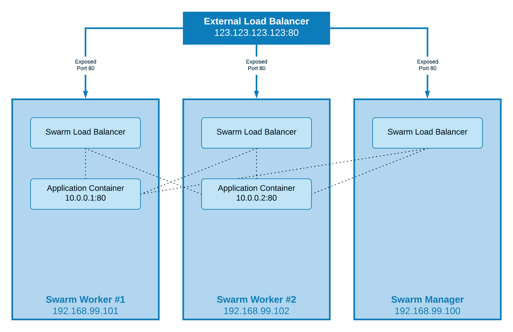

这意味着我们的应用程序可以扩大或缩小、失败或更新，而不需要重新配置外部负载平衡器。

# 网络覆盖

在我们的示例中，我们启动了一个运行单个应用程序的简单服务。假设我们想在应用程序中添加一个数据库层，它通常是网络中的一个固定点；我们怎么能这样做？

Docker Swarm 的网络覆盖层扩展了您在多个主机上启动容器的网络，这意味着每个服务或堆栈都可以在自己的独立网络中启动。这意味着我们运行 MongoDB 的数据库容器将可以被运行在端口`27017`上相同覆盖网络上的所有其他容器访问，无论这些容器运行在哪个主机上。

你可能在想自己*等一下。这是否意味着我必须将一个 IP 地址硬编码到我的应用程序配置中？*嗯，这不太适合 Docker Swarm 试图解决的问题，所以不，你不适合。

每个覆盖网络都有自己内置的域名系统服务，这意味着网络中启动的每个容器都能够将同一网络中另一个容器的主机名解析为其当前分配的 IP 地址。这意味着，当我们配置我们的应用程序连接到我们的数据库实例时，我们只需要告诉它连接到，比如说，`mongodb:27017`，它就会连接到我们的 MongoDB 容器。

这将使我们的图表如下所示:

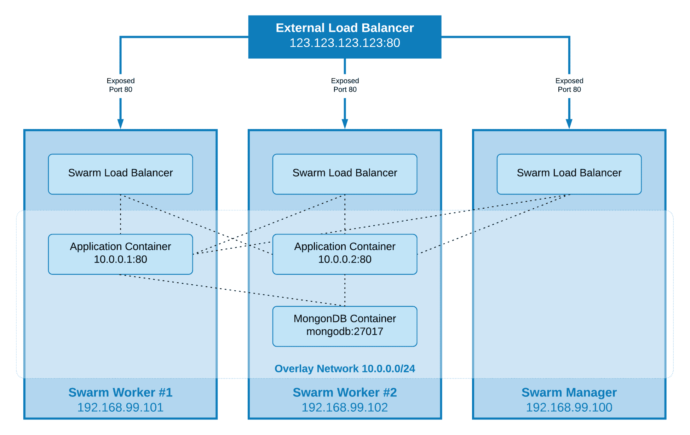

采用这种模式时，您还需要考虑其他一些因素，但我们将在[第 14 章](13.html)*【Docker workflow】*中介绍这些因素。

# 行程安排

在撰写本文时，Docker Swarm 中只有一种单一的调度策略，称为 Spread。这种策略的作用是安排任务在负载最小的节点上运行，该节点满足您在启动服务或堆栈时定义的任何约束。在大多数情况下，您不应该需要给服务添加太多约束。

Docker Swarm 目前不支持的一个特性是相似性和反相似性规则。虽然使用约束很容易绕过这一点，但我敦促您不要让事情过于复杂，因为如果您在定义服务时设置了太多约束，很容易导致主机过载或创建单点故障。

# 摘要

在这一章中，我们探索了 Docker Swarm。我们看了如何安装 Docker Swarm 和组成 Docker Swarm 的 Docker Swarm 组件。我们看了如何使用 Docker Swarm:加入、列出和管理 Swarm 管理器和工作者节点。我们回顾了服务和堆栈命令以及如何使用它们，并谈到了 Swarm 内置的入口负载平衡器、覆盖网络和调度器。

在下一章中，我们将看到 Docker Swarm 的另一个替代品，叫做 Kubernetes。Docker 以及其他提供商也支持这一点。

# 问题

1.  对还是错:您应该使用独立的 Docker Swarm 而不是内置的 Docker Swarm 模式来运行您的 Docker Swarm？
2.  启动 Docker Swarm 管理器以将您的员工添加到 Docker Swarm 集群后，您需要哪两件事？
3.  您会使用哪个命令来找出 Docker Swarm 集群中每个节点的状态？

4.  您会在 docker 节点检查 Swarm 管理器中添加哪个标志，以使其更具可读性？
5.  如何将一个节点提升为经理？
6.  您可以使用什么命令来扩展您的服务？

# 进一步阅读

关于 Raft 共识算法的详细解释，我建议通过名为*数据的秘密生命*的精彩演示来了解，该演示可在[http://thesecretlivesofdata.com/raft](http://thesecretlivesofdata.com/raft)找到。它通过一个易于理解的动画解释了发生在管理器节点后台的所有过程。