# 十一、Portainer——Docker 的图形用户界面（GUI）

在本章中，我们将看一下 Portainer。 **Portainer** 是一个工具，允许你从 web 界面管理 Docker 资源。将涉及的主题如下:

*   通往港口的道路
*   启动并运行 Portainer
*   使用 Portainer 和 Docker 群集

# 技术要求

与前几章一样，我们将继续使用本地 Docker 安装。此外，本章的截图将来自我的首选操作系统，macOS。在这一章的最后，我们将使用 Docker Machine 和 VirtualBox 来启动一个本地 Docker Swarm 集群。

像以前一样，我们将运行的 Docker 命令将在迄今为止安装了 Docker 的所有三个操作系统上工作——然而，一些支持命令可能只适用于基于 macOS 和 Linux 的操作系统，而且数量很少。

查看以下视频，了解《行动守则》:
[http://bit.ly/2yWAdQV](http://bit.ly/2yWAdQV)

# 通往港口的道路

在我们卷起袖子开始安装和使用 Portainer 之前，我们应该讨论一下项目的背景。这本书的第一版涵盖了 Docker UI。Docker UI 是迈克尔·克罗斯比写的，他在大约一年的开发后把这个项目交给了凯旺·阿勒奎斯特。正是在这个阶段，由于商标问题，这个项目被重新命名为 Docker 的用户界面。

Docker 的用户界面开发一直持续到 Docker 开始加速将 Swarm 模式等功能引入核心 Docker 引擎。大约在这个时候，Docker 项目的 UI 被分叉到将成为 Portainer 的项目中，Portainer 在 2016 年 6 月发布了它的第一个主要版本。

自第一次公开发布以来，Portainer 背后的团队估计大部分代码已经更新或重写，到 2017 年年中，添加了新功能，例如基于角色的控件和 Docker Compose 支持。

2016 年 12 月，向 Docker GitHub 存储库的 UI 提交了一份通知，声明该项目现已弃用，应使用 Portainer。

# 启动并运行 Portainer

我们将首先考虑使用 Portainer 来管理本地运行的单个 Docker 实例。我正在为 Mac 运行 Docker，所以我将使用它，但是这些指令也应该适用于其他 Docker 安装:

1.  首先，要从 Docker Hub 获取容器映像，我们只需要运行以下命令:

```
$ docker image pull portainer/portainer
$ docker image ls
```

2.  如您所见，当我们运行`docker image ls`命令时，Portainer 映像只有 58.7MB。要启动 Portainer，如果您运行的是 macOS 或 Linux，我们只需运行以下命令:

```
$ docker container run -d \
 -p 9000:9000 \
 -v /var/run/docker.sock:/var/run/docker.sock \
 portainer/portainer
```

3.  Windows 用户必须运行以下程序:

```
$ docker container run -d -p 9000:9000 -v \\.\pipe\docker_engine:\\.\pipe\docker_engine portainer/portainer
```

As you can see from the command we have just run, we are mounting the socket file for the Docker Engine on our Docker Host machine. Doing this will allow Portainer full unrestricted access to the Docker Engine on our host machine. It needs this so it can manage Docker on the host; however, it does mean that your Portainer container has full access to your host machine, so be careful in how you give access to it and also when publicly exposing Portainer on remote hosts.

下面的截图显示了这是在 macOS 上执行的:

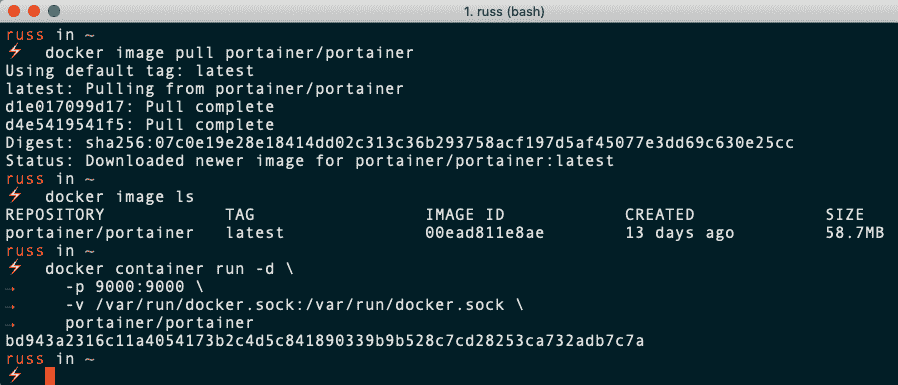

4.  对于最基本的安装类型，这是我们需要运行的全部内容。还有几个步骤可以完成安装；它们都在浏览器中执行。要完成它们，请转到 [http://localhost:9000/](http://localhost:9000/) 。

迎接您的第一个屏幕要求您为管理员用户设置密码。

5.  设置好密码后，会进入登录页面:输入用户名`admin`和刚才配置的密码。登录后，系统会询问您希望管理的 Docker 实例。有两种选择:
    *   管理运行 Portainer 的 Docker 实例
    *   管理远程 Docker 实例

目前，我们希望管理 Portainer 运行的实例，这是本地选项，而不是默认的远程选项:

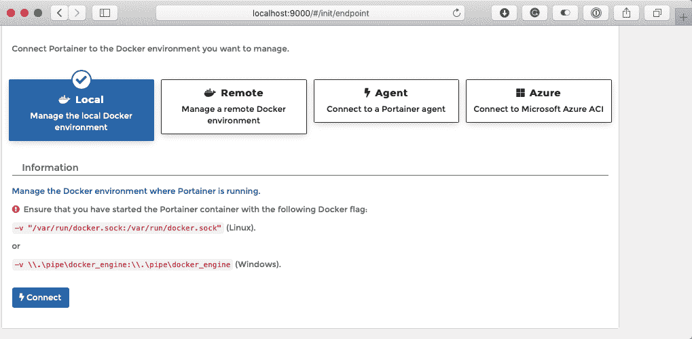

由于我们在启动 Portainer 容器时已经考虑了安装 Docker 套接字文件，我们可以点击**连接**来完成我们的安装。这将带我们直接进入 Portainer 本身，向我们展示仪表板。

# 使用 Portainer

现在，我们已经运行了 Portainer 并将其配置为与我们的 Docker 安装进行通信，我们可以开始使用左侧菜单中列出的功能，从顶部的 Dashboard 开始，这也是 Portainer 安装的默认登录页面。

# 仪表板

从下面的截图中可以看到，**仪表板**向我们概述了 Portainer 被配置为与之通信的 Docker 实例的当前状态:

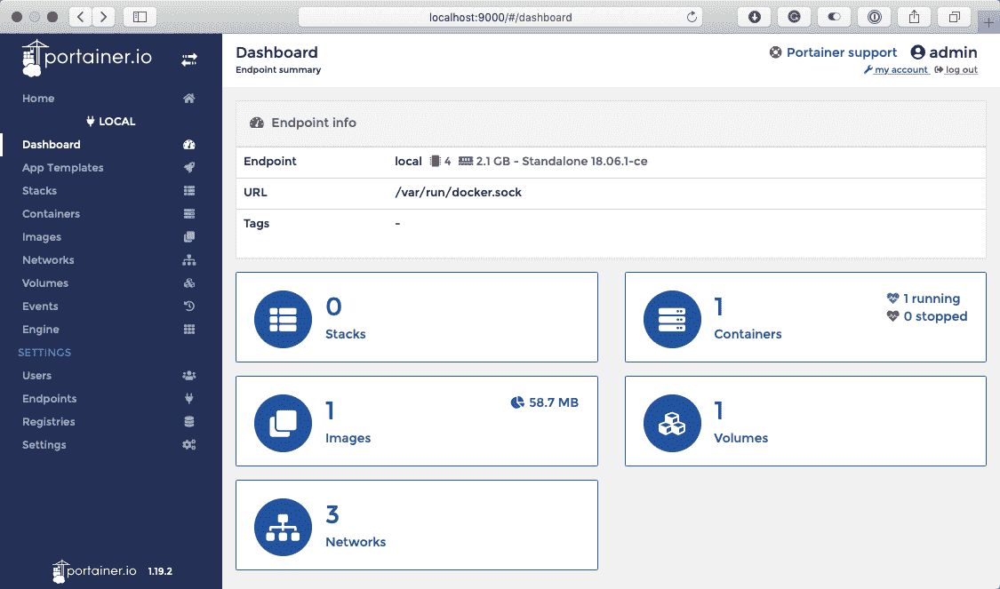

在我的例子中，这显示了我运行了多少**容器**，这在此刻只是已经运行的 Portainer 容器，以及我下载的映像数量。我们还可以在 Docker 实例上看到**卷**和**网络**的数量，它还会显示正在运行的**栈**的数量。

它还显示了 Docker 实例本身的基本信息；可以看到，Docker 实例运行的是莫比 Linux，有两个 CPU 和 2 GB 的 RAM。这是 Mac Docker 的默认配置。

**仪表板**将适应您运行 Portainer 的环境，因此当我们考虑将 Portainer 连接到 Docker Swarm 集群时，我们将重新讨论它。

# 应用模板

接下来，我们有**应用模板**。这一部分可能是核心 Docker Engine 中唯一不直接可用的功能；相反，这是一种使用从 Docker Hub 下载的容器启动常见应用的方式:

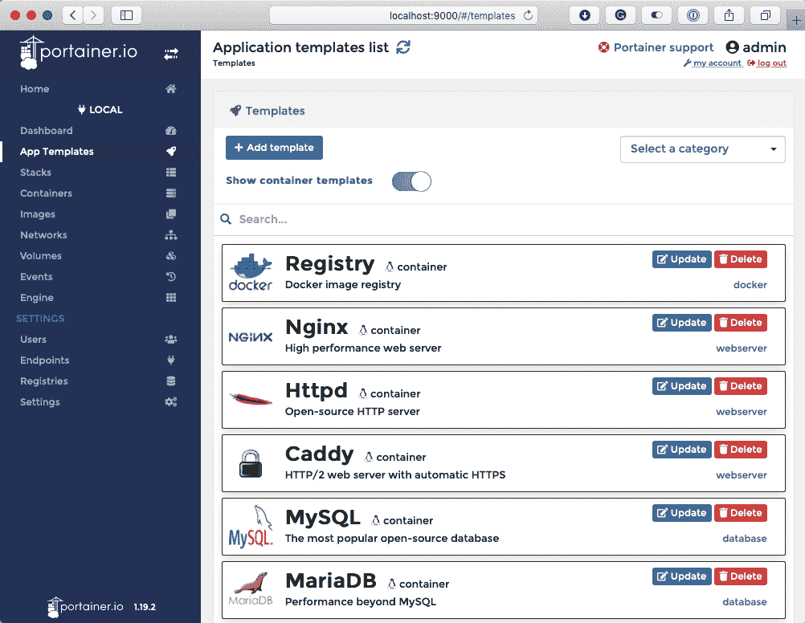

默认情况下，Portainer 附带大约 25 个模板。模板是以 JSON 格式定义的。例如，nginx 模板如下所示:

```
 {
 "type": "container",
 "title": "Nginx",
 "description": "High performance web server",
 "categories": ["webserver"],
 "platform": "linux",
 "logo": "https://portainer.io/img/logos/nginx.png",
 "image": "nginx:latest",
 "ports": [
 "80/tcp",
 "443/tcp"
 ],
 "volumes": ["/etc/nginx", "/usr/share/nginx/html"]
 }
```

您可以添加更多选项，例如 MariaDB 模板:

```
 {
 "type": "container",
 "title": "MariaDB",
 "description": "Performance beyond MySQL",
 "categories": ["database"],
 "platform": "linux",
 "logo": "https://portainer.io/img/logos/mariadb.png",
 "image": "mariadb:latest",
 "env": [
 {
 "name": "MYSQL_ROOT_PASSWORD",
 "label": "Root password"
 }
 ],
 "ports": [
 "3306/tcp"
 ],
 "volumes": ["/var/lib/mysql"]
 }
```

如您所见，模板看起来类似于 Docker Compose 文件；但是，这种格式仅由 Portainer 使用。在很大程度上，选项是不言自明的，但是我们应该触及**名称**和**标签**选项。

对于通常需要通过环境变量传递自定义值来定义选项的容器，**名称**和**标签**选项允许您向用户显示需要在容器启动前完成的自定义表单字段，如下图所示:

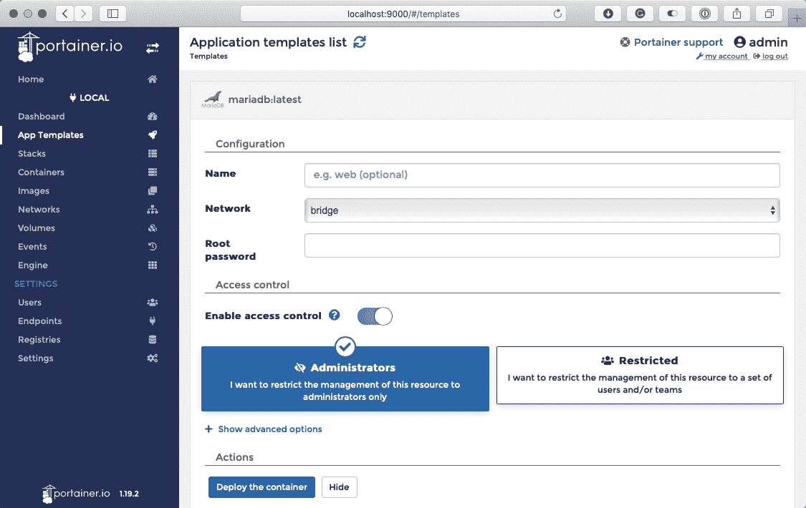

如您所见，我们有一个字段，可以在其中输入我们希望用于 MariaDB 容器的根密码。填写此内容将采用该值并将其作为环境变量传递，构建以下命令来启动容器:

```
$ docker container run --name [Name of Container] -p 3306 -e MYSQL_ROOT_PASSWORD=[Root password] -d mariadb:latest
```

有关应用模板的更多信息，我建议查看文档，可以在本章的进一步阅读部分找到相关链接。

# 容器

我们接下来要看的是左侧菜单中的**容器**。这是您启动 Docker 实例上运行的容器并与之交互的地方。点击**容器**菜单条目将在你的 Docker 实例中显示所有运行和停止的容器列表。

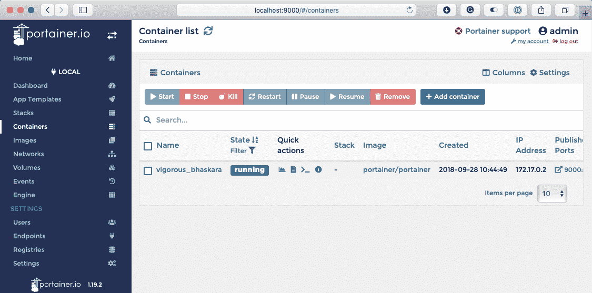

如您所见，我目前只有一个容器在运行，而这恰好是 Portainer 容器。与其与之交互，不如按下 **+添加容器**按钮，启动一个运行我们在前面章节中使用的集群应用的容器。

**创建容器**页面有几个选项；这些应填写如下:

*   **名称**:T0
*   **映像** : `russmckendrick/cluster`
*   **始终拉映像**:开
*   **发布所有暴露的端口**:开

最后，通过点击 **+映射附加端口**，添加从主机上的端口`8080`到容器上的端口`80`的端口映射。您完成的表单应该类似于下面的截图:

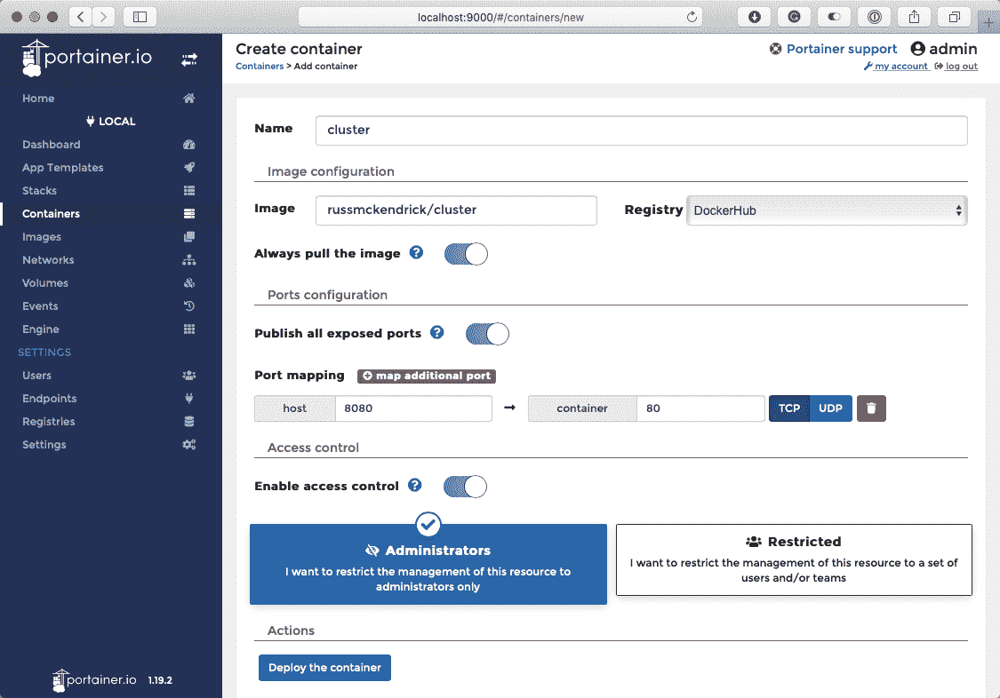

完成后，点击**部署容器**，几秒钟后，您将返回正在运行的容器列表，您应该会看到您新启动的容器:

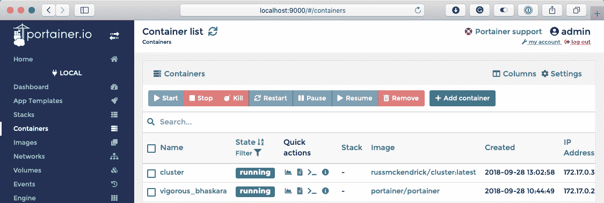

使用列表中每个容器左侧的勾号框将启用顶部的按钮，您可以在其中控制容器的状态-确保不要**杀死**或**移除**容器。点击容器的名称，在我们的例子中是**集群**，将显示更多关于容器本身的信息:

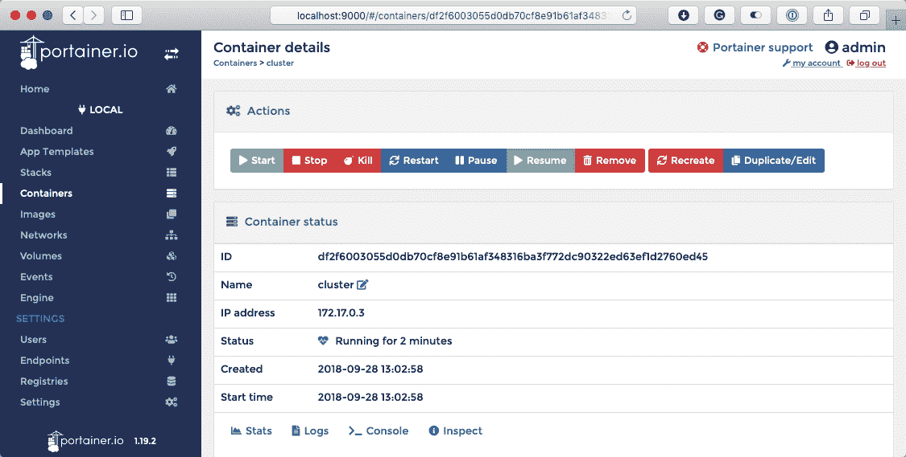

如您所见，关于容器的信息与您运行此命令时得到的信息相同:

```
$ docker container inspect cluster
```

点击**检查**，可以看到该命令的完整输出。你还会注意到**统计**、**日志**和**控制台**都有按钮。

# 统计数据

**统计数据**页面显示了 CPU、内存和网络利用率，以及您正在检查的容器的进程列表:

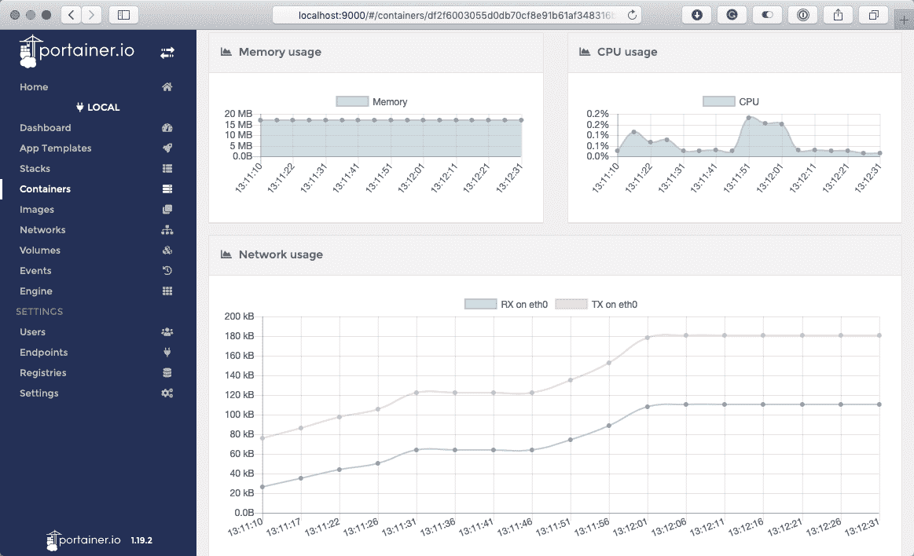

如果您保持页面打开，图表将自动刷新，刷新页面将使图表归零并重新开始。这是因为 Portainer 正在使用以下命令从 Docker API 接收此信息:

```
$ docker container stats cluster
```

每次刷新页面时，命令都会从头开始，因为 Portainer 当前不会在后台轮询 Docker 来记录每个正在运行的容器的统计信息。

# 日志

接下来，我们有**日志**页面。这将向您显示运行以下命令的结果:

```
$ docker container logs cluster
```

它同时显示`STDOUT`和`STDERR`日志:

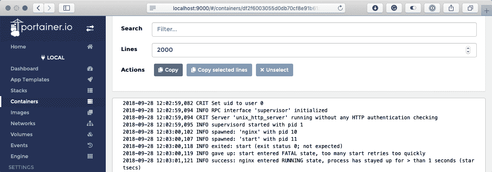

您还可以选择向输出中添加时间戳；这相当于运行以下命令:

```
$ docker container logs --timestamps cluster
```

# 安慰

最后，我们有**控制台**。这将打开一个 HTML5 终端，并允许您登录到您的运行容器。在连接到容器之前，您需要选择一个外壳。您可以选择使用三个外壳:`/bin/bash`、`/bin/sh `或`/bin/ash`以及作为哪个用户连接，root 是默认设置。当集群映像安装了两个外壳时，我选择使用`/bin/bash`:

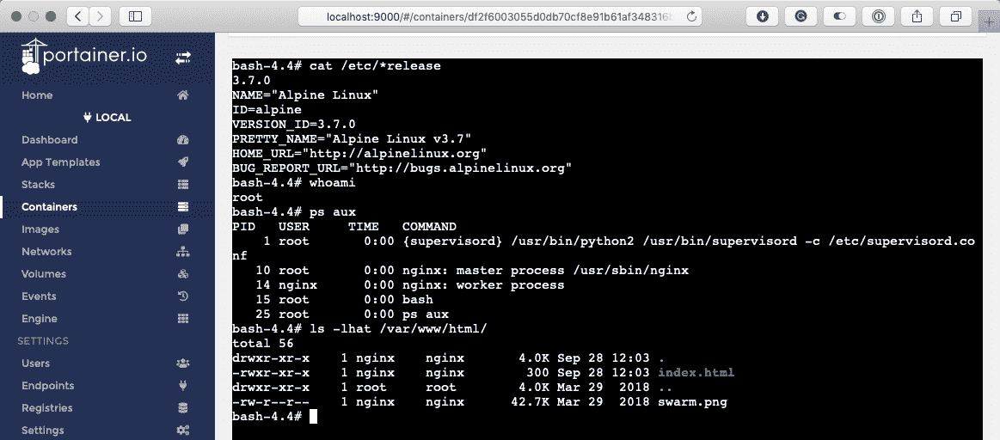

这相当于运行以下命令来访问您的容器:

```
$ docker container exec -it cluster /bin/sh
```

从截图中可以看到，`bash`流程的 PID 为`15`。这个进程是由`docker container exec`命令创建的，这将是唯一一个在您断开 shell 会话后终止的进程。

# 形象

左侧菜单中的下一个是**映像**。从这里，您可以管理、下载和上传映像:

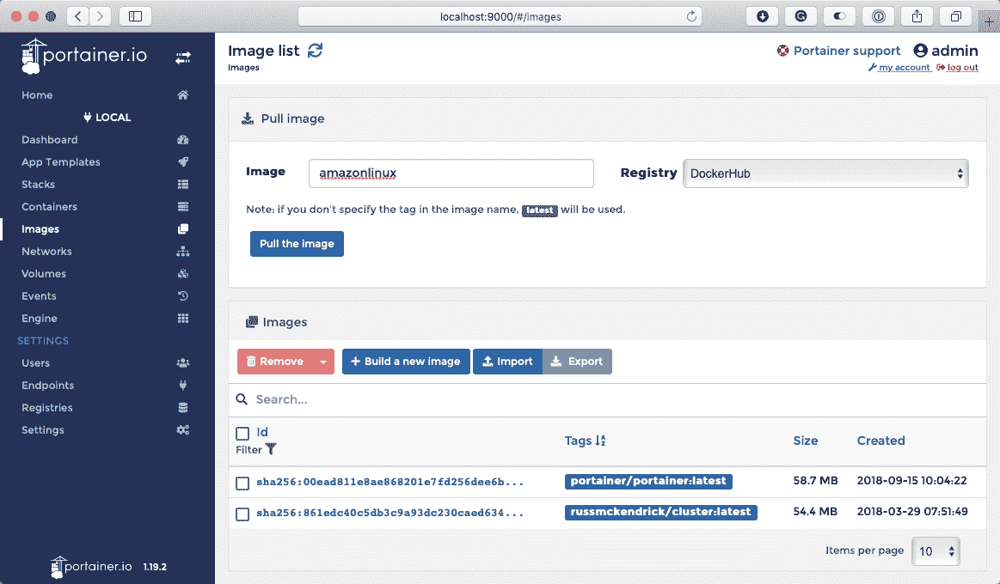

在页面顶部，您可以选择拖动映像。例如，只需在框中输入`amazonlinux`，然后点击**拉动**，就会从 Docker Hub 下载一份亚马逊 Linux 容器映像。Portainer 执行的命令是这样的:

```
$ docker image pull amazonlinux
```

您可以通过单击映像标识找到每个映像的更多信息；这将带您进入一个页面，该页面很好地呈现了运行此命令的输出:

```
$ docker image inspect russmckendrick/cluster
```

请看下面的截图:

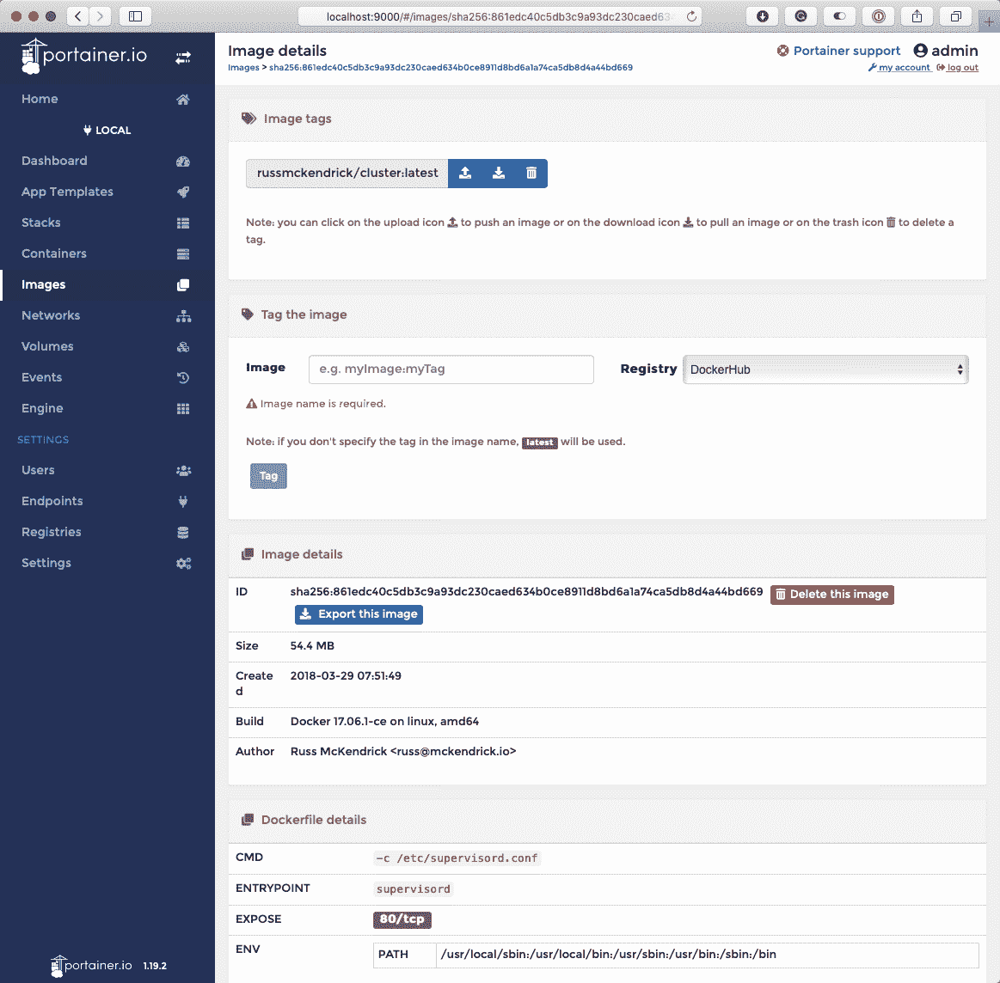

您不仅可以获得有关映像的所有信息，还可以选择将映像的副本推送到您选择的注册表，或者默认情况下推送到 Docker Hub。

您还可以获得映像中包含的每个层的完整分解，显示在构建期间执行的命令和每个层的大小。

# 网络和卷

菜单中的下两个项目允许您管理网络和卷；我不打算在这里讲太多细节，因为它们并不多。

# 网络

在这里，您可以使用默认网桥驱动程序快速添加网络。点击**高级设置**将带您进入更多选项的页面。这些包括使用其他驱动程序、定义子网、添加标签和限制外部网络访问。与其他部分一样，您也可以删除网络并检查现有网络。

# 卷

除了添加或删除卷，这里没有太多选项。添加卷时，您可以选择驱动程序，也可以填写传递给驱动程序的选项，这允许使用第三方驱动程序插件。除此之外，这里没有什么可看的，甚至没有检查选项。

# 事件

“事件”页面显示过去 24 小时内的所有事件；您还可以选择过滤结果，这意味着您可以快速找到您想要的信息:

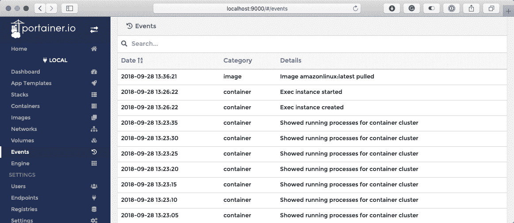

这相当于运行以下命令:

```
$ docker events --since '2018-09-27T16:30:00' --until '2018-09-28T16:30:00'
```

# 发动机

最后一个条目只是向您显示了以下内容的输出:

```
$ docker info
```

下面显示了命令的输出:

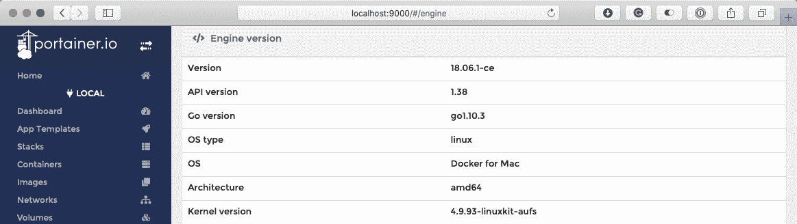

如果您以多个 Docker 实例端点为目标，并且需要端点运行环境的信息，这将非常有用。

此时，我们将继续关注在 Docker Swarm 上运行的 Portainer，因此现在是删除正在运行的容器以及首次启动 Portainer 时创建的卷的好时机，您可以使用以下方法删除该卷:

```
$ docker volume prune
```

# 搬运工和Docker

在前一节中，我们研究了如何在独立的 Docker 实例上使用 Portainer。Portainer 还支持 Docker Swarm 集群，界面中的选项适应集群环境。我们应该考虑创建一个 Swarm，然后启动 Portainer 作为服务，看看会有什么变化。

# 创造蜂群

正如在 Docker Swarm 一章中，我们将使用 Docker Machine 在本地创建 Swarm；为此，请运行以下命令:

```
$ docker-machine create -d virtualbox swarm-manager
$ docker-machine create -d virtualbox swarm-worker01
$ docker-machine create -d virtualbox swarm-worker02
```

三个实例启动后，运行以下命令初始化 Swarm:

```
$ docker $(docker-machine config swarm-manager) swarm init \
 --advertise-addr $(docker-machine ip swarm-manager):2377 \
 --listen-addr $(docker-machine ip swarm-manager):2377
```

然后运行以下命令，插入您自己的令牌来添加工作节点:

```
$ SWARM_TOKEN=SWMTKN-1-45acey6bqteiro42ipt3gy6san3kec0f8dh6fb35pnv1xz291v-4l89ei7v6az2b85kb5jnf7nku
$ docker $(docker-machine config swarm-worker01) swarm join \
 --token $SWARM_TOKEN \
 $(docker-machine ip swarm-manager):2377
$ docker $(docker-machine config swarm-worker02) swarm join \
 --token $SWARM_TOKEN \
 $(docker-machine ip swarm-manager):2377
```

现在我们已经形成了集群，运行以下命令将本地 Docker 客户端指向管理器节点:

```
$ eval $(docker-machine env swarm-manager)
```

最后，使用以下命令检查 Swarm 的状态:

```
$ docker node ls
```

# Portainer 服务

现在我们有了一个 Docker Swarm 集群，并且我们的本地客户端被配置为与管理器节点通信，我们可以通过简单地运行以下命令来启动 Portainer 服务:

```
$ docker service create \
 --name portainer \
 --publish 9000:9000 \
 --constraint 'node.role == manager' \
 --mount type=bind,src=/var/run/docker.sock,dst=/var/run/docker.sock \
 portainer/portainer \
 -H unix:///var/run/docker.sock
```

如您所见，这将在管理器节点上启动 Portainer 作为服务，并使该服务装载管理器节点套接字文件，以便它可以看到 Swarm 的其余部分。您可以使用以下命令检查服务是否已启动且没有任何错误:

```
$ docker service ls 
$ docker service inspect portainer --pretty
```

以下显示了输出:

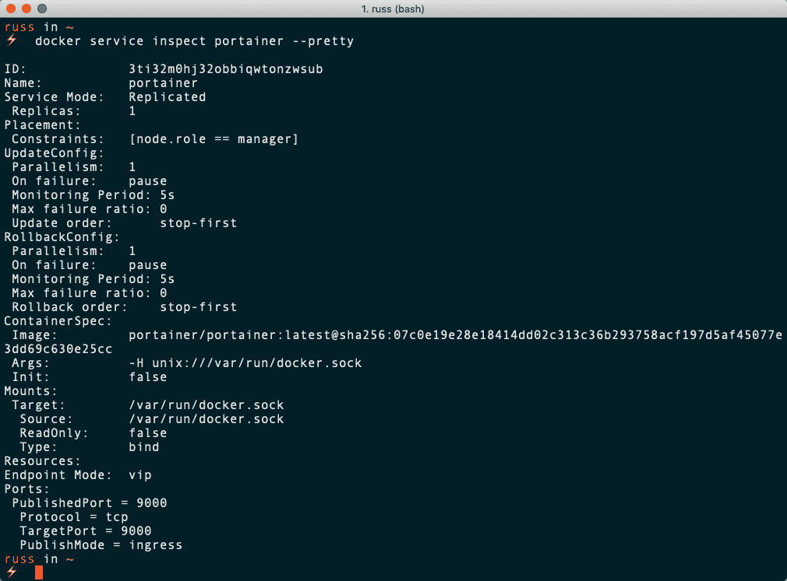

现在服务已经启动，您可以在集群中的任何节点的 IP 地址上访问端口`9000`上的 Portainer，或者运行以下命令:

```
$ open http://$(docker-machine ip swarm-manager):9000
```

当页面打开时，您将再次被要求为管理员用户设置密码；设置完成后，您将收到登录提示。登录后，您将直接进入仪表板。这样做的原因是，我们这次启动 Portainer 时，给它传递了参数`-H unix:///var/run/docker.sock`，它告诉 Portainer 选择我们在单个主机上启动 Portainer 时手动选择的选项。

# 群体差异

如前所述，当连接到 Docker Swarm 集群时，Portainer 接口会有一些变化。在本节中，我们将介绍它们。如果没有提到接口的一部分，那么在单主机模式下运行 Portainer 没有区别。

# 端点

当您登录时，首先要做的是选择一个端点，从下面的屏幕中可以看到，有一个名为 **primary** 的端点:

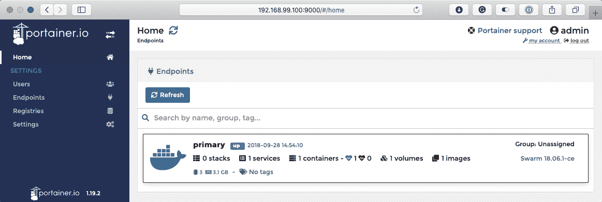

点击端点将带您进入**仪表盘**，我们将在本节末尾再次查看**端点**。

# 仪表板和群

您将注意到的第一个变化是仪表板现在显示了有关 Swarm 集群的信息，例如:

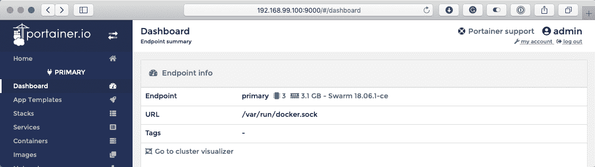

请注意，中央处理器显示为 3，总内存为 3.1 GB，集群中的每个节点都有 1 GB 的内存和 1 个中央处理器，因此这些值是集群总数。

点击**转到集群 vizualizer** 将带您进入 Swam 页面，这为您提供了集群的可视化概述，其中当前唯一运行的服务是 Portainer:

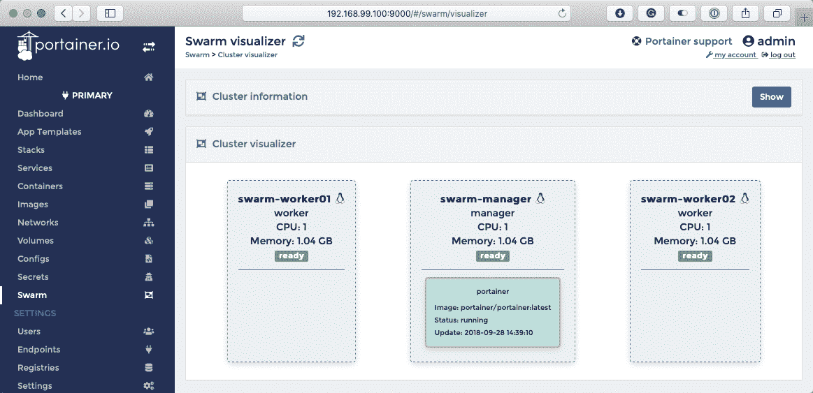

# 大量

左侧菜单中我们没有涉及的一个项目是**栈**，从这里您可以启动栈，就像我们在查看 Docker Swarm 时所做的那样。事实上，让我们以我们使用的 Docker Compose 文件为例，它看起来如下:

```
version: "3"

services:
   redis:
     image: redis:alpine
     volumes:
       - redis_data:/data
     restart: always
   mobycounter:
     depends_on:
       - redis
     image: russmckendrick/moby-counter
     ports:
       - "8080:80"
     restart: always

volumes:
    redis_data:
```

点击 **+添加栈**按钮，然后将上面的内容粘贴到网页编辑器中，输入名称`MobyCounter`，不要在名称中添加任何空格或特殊字符，因为这是 Docker 使用的，然后点击**部署栈**。

部署后，您将能够点击**移动计数器**并管理栈:


Stacks 是服务的集合，接下来让我们看看它们。

# 服务

您可以在此页面创建和管理服务；它应该已经展示了包括 Portainer 在内的多项服务。为了不让运行的 Portainer 容器出现任何问题，我们将创建一个新的服务。为此，点击 **+添加服务**按钮。在加载的页面上，输入以下内容:

*   **名称**:T0
*   **映像** : `russmckendrick/cluster`
*   **调度模式** : **复制**
*   **复制品** : **1**

这次我们需要为主机上的端口`8000`添加一个端口映射，以将端口`80`映射到容器，这是因为我们在上一节中启动的栈已经在使用主机上的端口`8080`:

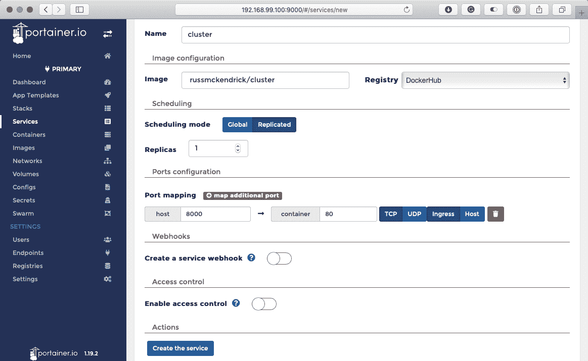

输入信息后，点击**创建服务**按钮。您将返回到服务列表，该列表现在应该包含我们刚刚添加的集群服务。您可能已经注意到，在计划模式列中，有一个缩放选项。点击它，将我们的**集群**服务的副本数量增加到 **6** 。

点击**名称**栏中的**集群**，我们将看到该服务的概述。如您所见，该服务有很多信息:

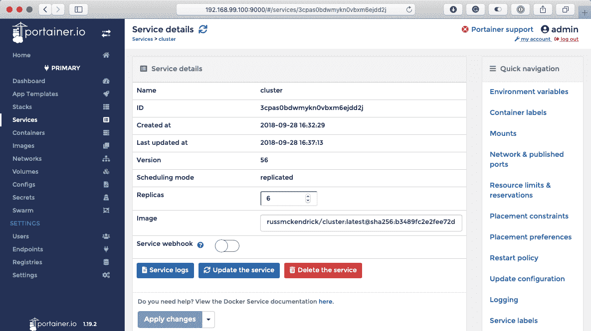

您可以动态地对**服务**进行许多更改，包括放置约束、重启策略、添加服务标签等等。页面底部是与服务相关的任务列表:

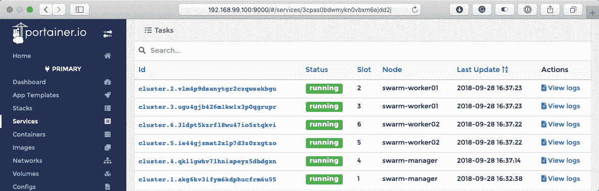

如您所见，我们有六个正在运行的任务，三个节点各有两个。点击左侧菜单中的**容器**可能会显示与您预期不同的内容:

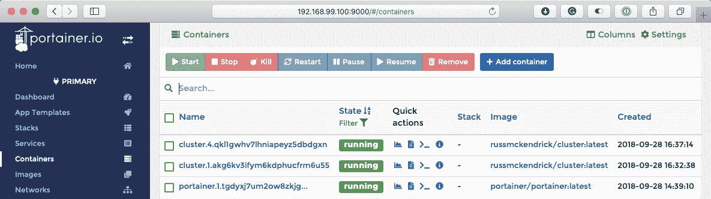

这里只列出了三个容器，其中一个用于 Portainer 服务。为什么会这样？

好吧，如果你还记得在 Docker Swarm 一章中，我们了解到`docker container`命令只真正适用于运行它们的节点，并且由于 Portainer 只与我们的管理器节点对话，所以这是 Docker 容器命令执行的唯一节点。请记住，Portainer 只是 Docker API 的一个 web 界面，因此它反映了您在命令行上运行`docker container ls`时得到的相同结果。

# 添加端点

但是，我们可以将剩下的两个集群节点添加到 Portainer 中。为此，点击左侧菜单中的**端点**条目。

要添加端点，我们需要知道端点的网址，并有权访问证书，这样 Portainer 就可以针对节点上运行的 Docker 守护程序进行认证。幸运的是，当我们使用 Docker Machine 启动主机时，这是一个简单的任务。要获取端点 URL，请运行以下命令:

```
$ docker-machine ls
```

对我来说，两个端点 URL 分别是`192.168.99.101:2376`和`192.168.99.102:2376`；你的可能不一样。我们需要上传的证书可以在您机器上的`~/.docker/machine/certs/`文件夹中找到。我建议运行以下命令来打开 finder 中的文件夹:

```
$ cd ~/.docker/machine/certs/
$ open .
```

添加节点后，您可以使用**设置/端点**页面中的 **+添加端点**按钮来更改节点。

从这里输入以下信息:

*   **名称**:T0
*   **端点网址** : `192.168.99.101:2376`
*   **公共 IP:** `192.168.99.101`
*   **TLS** :开
*   **带服务器和客户端验证的 TLS**:勾选
*   从`~/.docker/machine/certs/`上传证书

然后点击 **+添加端点**按钮，点击**主页**将带您进入本章开头我们首次看到的端点概述屏幕。正如您从下面的截图中看到的，我们可以看到工作人员每个人运行三个容器，并且他们被标记为独立的，而不是 Swarm:

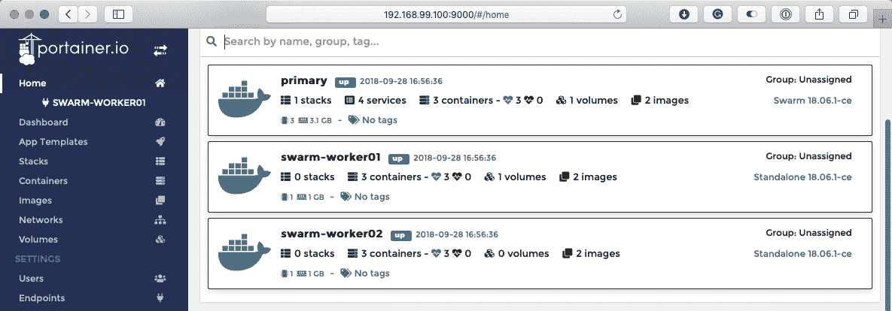

您还会注意到，除了端点中提到的 Swarm 之外，没有提到 Swarm 服务。同样，这是因为 Portainer 只知道与您的 Docker 节点一样多的信息，而 Swarm 模式只允许具有管理器角色的节点启动服务和任务，并与集群中的其他节点进行交互。

不要忘记运行以下命令来删除本地 Docker Swarm 集群:

```
$ docker-machine rm swarm-manager swarm-worker01 swarm-worker02
```

# 摘要

我们在 Portainer 的深度潜水到此结束。正如您所看到的，Portainer 非常强大，但使用起来很简单，并且随着功能的发布，它只会继续增长并集成更多的 Docker 生态系统。使用 Portainer，不仅可以对主机进行大量操作，还可以对运行在单个或集群主机上的容器和服务进行大量操作。

在下一章中，我们将了解如何保护您的 Docker 主机，以及如何对您的容器映像运行扫描。

# 问题

1.  在 macOS 或 Linux 机器上，挂载 Docker 套接字文件的路径是什么？
2.  Portainer 运行的默认端口是什么？
3.  对还是错:您可以使用 Docker 编写文件作为应用模板？
4.  真假:Portainer 显示的统计数据只是实时的，你不能查看历史数据？

# 进一步阅读

您可以在以下网址找到有关 Portainer 的更多信息:

*   主网站:[https://portainer.io/](https://portainer.io/)
*   inter Handel on github:https://github . com/porter/
*   最新文档:[https://portainer.readthedocs.io/en/latest/index.html](https://portainer.readthedocs.io/en/latest/index.html)
*   模板文档:[http://portainer.readthedocs.io/en/latest/templates.html](https://portainer.readthedocs.io/en/latest/templates.html)