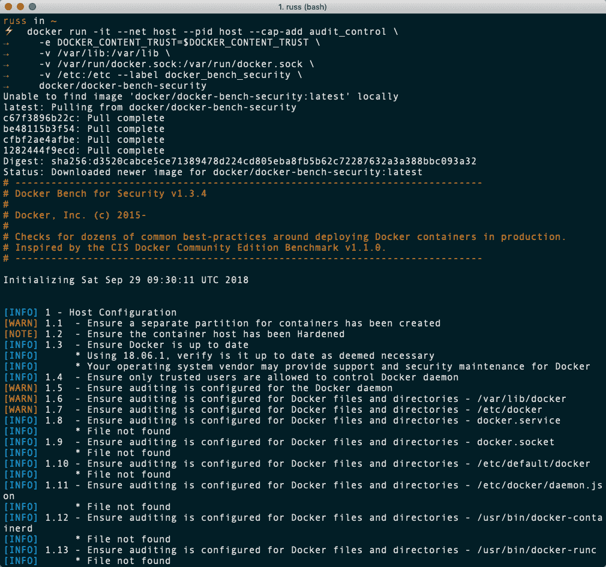
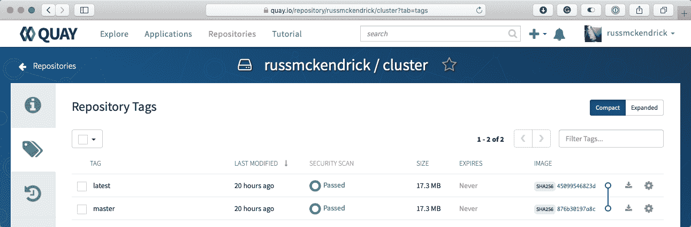
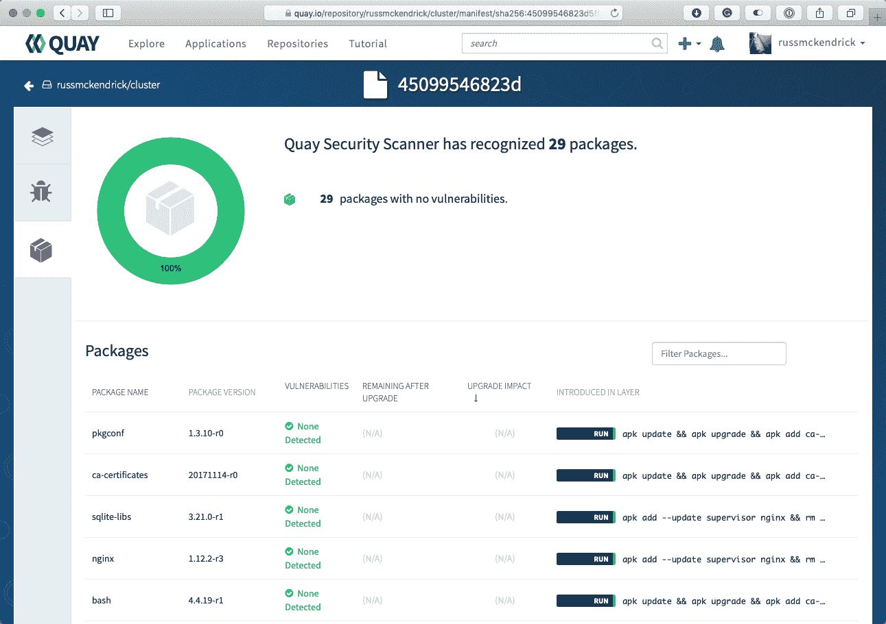
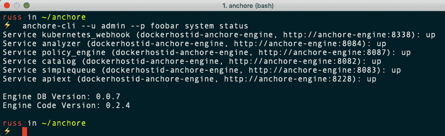
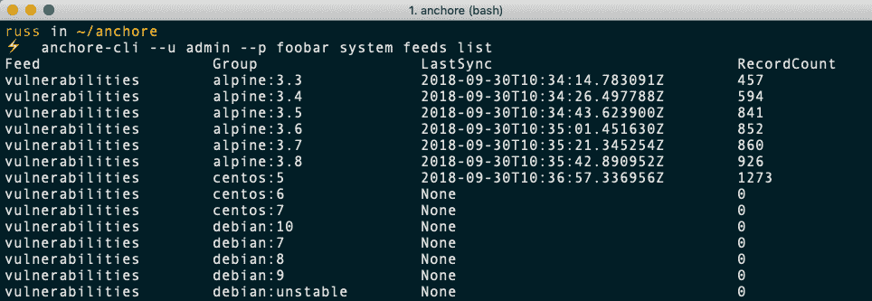
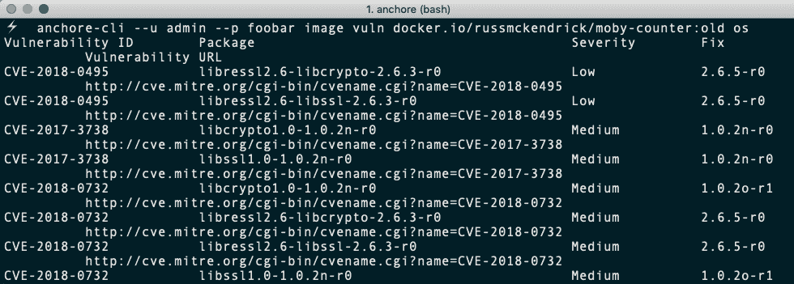

# 码头保安

在这一章中，我们将看看 Docker 安全性，这是目前每个人脑海中最前沿的话题。我们将把这一章分成以下五个部分:

*   容器注意事项
*   Docker 命令
*   最佳实践
*   Docker Bench 安全应用
*   第三方安全服务

# 技术要求

在本章中，我们将在桌面上使用 Docker，我们将使用 Docker Machine 在云中启动 Docker 主机。和前面几章一样，我将使用我喜欢的操作系统，也就是 macOS。如前所述，我们将运行的 Docker 命令将在迄今为止安装了 Docker 的所有三个操作系统上运行。然而，一些支持命令可能只适用于基于 macOS 和 Linux 的操作系统，而且数量很少。

查看以下视频，了解《行动守则》:
[http://bit.ly/2AnEv5G](http://bit.ly/2AnEv5G)

# 容器注意事项

当 Docker 首次发布时，有很多关于 Docker 与虚拟机的讨论。记得在杂志上看文章，在 Reddit 上评论帖子，看不完的博文。在 Docker alpha 和 beta 版本的早期，人们习惯于像虚拟机一样接近 Docker 容器，因为实际上没有任何其他参考点，我们将它们视为微小的虚拟机。

过去，我会启用 SSH，在容器中运行多个进程，甚至通过启动一个容器并运行命令来安装我的软件栈来创建我的容器映像。这是我们在[第二章](02.html) *中讨论过的，建造容器映像*；你永远不应该这样做，因为这被认为是一种不好的做法。

因此，与其讨论容器和虚拟机，不如让我们看看在运行容器而不是虚拟机时需要考虑的一些问题。

# 优点

当您启动一个 Docker 容器时，Docker 引擎会在幕后做很多工作。Docker 引擎在启动容器时执行的任务之一是设置名称空间和控制组。这是什么意思？通过设置名称空间，Docker 将进程隔离在每个容器中——不仅与其他容器隔离，还与主机系统隔离。控制组确保每个容器都获得自己的项目份额，如中央处理器、内存和磁盘输入/输出。更重要的是，它们确保一个容器不会耗尽给定 Docker 主机上的所有资源。

正如您在前面几章中看到的，能够将容器启动到 Docker 控制的网络中意味着您可以在应用级别隔离容器；应用 A 的所有容器都不能在网络层访问应用 b 的容器

此外，这种网络隔离可以通过使用默认网络驱动程序在单个 Docker 主机上运行，也可以通过使用 Docker Swarm 的内置多主机网络驱动程序或来自 Weave 的 Weave Net 驱动程序跨越多个 Docker 主机。

最后，我认为 Docker 相对于典型虚拟机的最大优势之一是，您不必登录容器。Docker 正在尽最大努力避免您需要登录容器来管理它正在运行的进程。有了`docker container exec`、`docker container top`、`docker container logs`和`docker container stats`这样的命令，你可以做任何你需要做的事情，而不会暴露出比你必须暴露的更多的服务。

# 你的Docker主持人

当您处理虚拟机时，您可以控制谁有权访问哪个虚拟机。假设您只希望开发人员用户 1 能够访问开发虚拟机。但是，用户 2 是负责开发和生产环境的操作员，因此他需要访问所有虚拟机。大多数虚拟机管理工具都允许您授予虚拟机基于角色的访问权限。

对于 Docker，您有一个小缺点，因为无论谁能够访问您的 Docker 主机上的 Docker 引擎，无论是通过被授予 sudo 访问权限，还是通过将其用户添加到 Docker Linux 组，都可以访问您正在运行的每个 Docker 容器。他们可以运行新的容器，可以停止现有的容器，还可以删除映像。请注意您授予谁访问主机上的 Docker 引擎的权限。他们实际上掌握着王国的钥匙，关于你所有的容器。了解了这一点，建议只对 Docker 使用 Docker 主机；将其他服务与 Docker 主机分开。

# 映像信任

如果您正在运行虚拟机，您很可能会自己从头开始设置它们。很可能，由于下载的规模(以及启动它的努力)，你不会下载某个互联网上的随机人创建的预建机器映像。通常，如果您要这样做，它将是来自可信软件供应商的预构建虚拟设备。

因此，您将知道虚拟机内部有什么，什么没有，因为您负责构建和维护它。

Docker 的部分吸引力在于它的易用性；然而，这种易用性会使它很容易忽略一个非常关键的安全考虑:你知道它在你的容器里面运行什么吗？

在前面的章节中，我们已经谈到了**映像信任**。例如，我们谈到不发布或下载尚未使用 Dockerfiles 定义的映像，不将自定义代码或机密(等等)直接嵌入到您将推送到 Docker Hub 的映像中。

虽然容器有名称空间、控制组和网络隔离的保护，但我们讨论了判断不佳的映像下载如何会给您的环境带来安全问题和风险。例如，运行未修补软件的完全合法的容器会给应用和数据的可用性带来风险。

# Docker 命令

让我们看一下 Docker 命令，这些命令可以用来帮助加强安全性，以及查看您可能正在使用的映像的信息。

我们将重点关注两个命令。第一个将是`docker container run`命令，这样你就可以看到一些你可以用这个命令对你有利的物品。其次，我们来看一下`docker container diff`命令，您可以使用它来查看您计划使用的映像的处理情况。

# 运行命令

关于`docker run`命令，我们将主要关注允许您将容器内的所有内容设置为只读的选项，而不是指定的目录或卷。这有助于限制恶意应用可能造成的损害，恶意应用还可能通过更新易受攻击的应用的二进制文件来劫持该应用。

让我们看看如何启动只读容器，然后分解它的功能，如下所示:

```
$ docker container run -d --name mysql --read-only -v /var/lib/mysql -v /tmp -v /var/run/mysqld -e MYSQL_ROOT_PASSWORD=password mysql
```

这里，我们正在运行一个 MySQL 容器，并将整个容器设置为只读，除了以下文件夹:

*   `/var/lib/mysql`
*   `/var/run/mysqld`
*   `/tmp`

这些卷将创建为三个独立的卷，然后以读/写方式装载。如果您不添加这些卷，那么 MySQL 将无法启动，因为它需要读/写访问才能在`/var/run/mysqld`中创建套接字文件，在`/tmp`中创建一些临时文件，最后在`/var/lib/mysql`中创建数据库本身。

容器内的任何其他位置都不允许您在其中写入任何内容。如果您尝试运行以下内容，将会失败:

```
$ docker container exec mysql touch /trying_to_write_a_file
```

前面的命令会给你以下信息:

```
touch: cannot touch '/trying_to_write_a_file': Read-only file system
```

如果您想要控制容器可以写入(或不写入)的位置，这将非常有帮助。一定要明智地使用这个。彻底测试，因为当应用无法写入特定位置时，可能会有后果。

与前面的命令`docker container run`类似，我们将所有内容设置为只读(除了指定的卷)，我们可以反其道而行之，将单个卷(或者更多，如果您使用更多的`-v`开关)设置为只读。关于卷要记住的一点是，当您使用一个卷并将其装入容器时，它将作为一个空卷装入容器内的目录顶部，除非您在容器启动后使用`--volumes-from`开关或以其他方式向其添加数据:

```
$ docker container run -d -v /local/path/to/html/:/var/www/html/:ro nginx
```

这将把`/local/path/to/html/`从 Docker 主机挂载到`/var/www/html/`，并将它设置为只读。如果您不想让正在运行的容器写入卷，以保持数据或配置文件完好无损，这将非常有用。

# 差异命令

我们再来看看`docker diff`命令；由于它涉及容器的安全方面，您可能希望使用 Docker Hub 或其他相关存储库中托管的映像。

请记住，任何有权访问您的 Docker 主机和 Docker 守护程序的人都有权访问您所有正在运行的 Docker 容器。也就是说，如果您没有适当的监控，有人可能会对您的容器执行命令并做恶意的事情。

让我们看一下我们在上一节中启动的 MySQL 容器:

```
$ docker container diff mysql
```

您会注意到没有文件被返回。为什么会这样？

好吧，`diff`命令告诉你自从容器启动后对映像所做的改变。在前一节中，我们启动了带有只读映像的 MySQL 容器，然后将卷装载到我们知道 MySQL 需要能够读写的位置，这意味着我们下载的映像和我们正在运行的容器之间没有文件差异。

停止并删除 MySQL 容器，然后通过运行以下命令清理卷:

```
$ docker container stop mysql
$ docker container rm mysql
$ docker volume prune
```

然后，再次启动同一个容器，去掉只读标志和卷；这给了我们一个不同的故事，如下:

```
$ docker container run -d --name mysql -e MYSQL_ROOT_PASSWORD=password mysql
$ docker container exec mysql touch /trying_to_write_a_file
$ docker container diff mysql
```

如您所见，创建了两个文件夹并添加了几个文件:

```
A /trying_to_write_a_file
C /run
C /run/mysqld
A /run/mysqld/mysqld.pid
A /run/mysqld/mysqld.sock
A /run/mysqld/mysqld.sock.lock
A /run/mysqld/mysqlx.sock
A /run/mysqld/mysqlx.sock.lock
```

这是发现容器内可能发生的任何异常或意外的好方法。

# 最佳实践

在本节中，我们将了解 Docker 的最佳实践，以及*互联网安全中心*指南，以正确保护 Docker 环境的各个方面。

# Docker 最佳实践

在深入了解互联网安全中心指南之前，让我们先来看一下使用 Docker 的一些最佳实践，如下所示:

*   **每个容器一个应用**:将您的应用分散到每个容器一个。Docker 就是为此而生的，它让一切变得更容易，在一天结束的时候。我们之前讨论的隔离是关键所在。
*   **只安装你需要的东西**:前面几章我们已经讲过了，只在你的容器镜像中安装你需要的东西。如果您必须安装更多的来支持您的容器应该运行的一个进程，我建议您回顾一下原因。这不仅使您的映像小巧便携，还减少了潜在的攻击面。
*   **查看谁有权访问您的 Docker 主机**:请记住，无论谁对您的 Docker 主机拥有 root 或 sudo 访问权限，都有权操作主机上的所有映像和容器。
*   **使用最新版本**:始终使用最新版本的 Docker。这将确保所有安全漏洞都已修补，并且您也拥有最新的功能。在修复安全问题时，使用社区版本保持最新可能会引入由功能变化或新功能引起的问题。如果这是你关心的问题，那么你可能会想看看 LTS 企业版可从 Docker，以及红帽。
*   **利用资源**:如果需要帮助，就利用可以利用的资源。Docker 内部的社区非常庞大，非常有帮助。在规划您的 Docker 环境和评估平台时，使用他们的网站、文档和 Slack 聊天室对您有利。有关如何访问 Slack 和社区其他部分的更多信息，请参见[第 14 章](14.html) *，Docker 的下一步*。

# 互联网安全基准中心

**互联网安全中心(CIS)** 是一个独立的非营利组织，其目标是提供安全的在线体验。他们发布基准和控制，这些被认为是信息技术所有方面的最佳实践。

Docker 的 CIS 基准测试可以免费下载。您应该注意到，它目前是一个 230 页的 PDF，在知识共享许可下发布，涵盖了 Docker CE 17.06 和更高版本。

当您实际运行扫描(在本章的下一节)并获得需要(或应该)修复的结果时，您将参考本指南。该指南分为以下几个部分:

*   主机配置
*   Docker 守护程序配置
*   Docker 守护程序配置文件
*   容器映像/运行时
*   码头保安业务

# 主机配置

指南的这一部分是关于 Docker 主机的配置。这是 Docker 环境的一部分，您的所有容器都在这里运行。因此，保持它的安全是最重要的。这是抵御攻击者的第一道防线。

# docker daemon configuration(坞站守护程序配置)

本指南的这一部分提供了保护正在运行的 Docker 守护程序的建议。您对 Docker 守护程序配置所做的一切都会影响每个容器。这些开关可以连接到我们之前看到的 Docker 守护程序，也可以连接到我们在下一节运行该工具时看到的项目。

# 停靠守护程序配置文件

指南的这一部分涉及 Docker 守护程序使用的文件和目录。范围从权限到所有权。有时，这些区域可能包含您不想让其他人知道的信息，这些信息可能是纯文本格式的。

# 容器映像/运行时和构建文件

指南的这一部分包含保护容器映像和构建文件的信息。

第一部分包含映像、封面基本映像和使用的构建文件。正如我们之前介绍的，您需要确定您正在使用的映像，不仅是基础映像，还有 Docker 体验的任何方面。本指南的这一部分涵盖了创建自己的基本映像时应遵循的事项。

# 容器运行时

本节以前是后面一节的一部分，但在 CIS 指南中，它已被移到自己的部分。容器运行时涵盖了许多与安全相关的项目。

小心您正在使用的运行时变量。在某些情况下，当你认为你在利用他们为自己谋利时，攻击者可以利用他们。在容器中暴露太多，例如将应用机密和数据库连接暴露为环境变量，不仅会危及容器的安全，还会危及 Docker 主机和在该主机上运行的其他容器的安全。

# 码头保安业务

指南的这一部分涵盖了涉及部署的安全领域；这些项目与 Docker 最佳实践联系更紧密。正因为如此，最好遵循这些建议。

# Docker Bench 安全应用

在本节中，我们将介绍您可以安装和运行的 Docker Benchmark 安全应用。该工具将检查以下内容:

*   主机配置
*   Docker 守护程序配置
*   Docker 守护程序配置文件
*   容器映像和构建文件
*   容器运行时
*   Docker安全行动
*   Docker群配置

眼熟吗？它应该，因为这些是我们在上一节中回顾过的相同的项目，只构建到一个将为您做大量繁重工作的应用中。它将向您显示在您的配置中出现了哪些警告，并将提供关于其他配置项的信息，甚至是已经通过测试的项。

现在，我们将看看如何运行这个工具，一个真实的例子，以及这个过程的输出意味着什么。

# 在 macOS 的 Docker 和 Windows 的 Docker 上运行该工具

运行工具很简单。它已经为我们包装好了，在一个 Docker 容器里面。虽然您可以获取源代码并定制输出或以某种方式对其进行操作(例如，通过电子邮件发送输出)，但默认设置可能是您所需要的。

该工具的 GitHub 项目可以在[https://github.com/docker/docker-bench-security/](https://github.com/docker/docker-bench-security/)找到，要在 macOS 或 Windows 机器上运行该工具，您只需将以下内容复制并粘贴到您的终端中。以下命令缺少检查`systemd`所需的行，因为作为 macOS 的 Docker 和 Windows 的 Docker 的底层操作系统的莫比 Linux 不运行`systemd`。我们将很快看到一个基于 T2 的系统:

```
$ docker run -it --net host --pid host --cap-add audit_control \
 -e DOCKER_CONTENT_TRUST=$DOCKER_CONTENT_TRUST \
 -v /var/lib:/var/lib \
 -v /var/run/docker.sock:/var/run/docker.sock \
 -v /etc:/etc --label docker_bench_security \
 docker/docker-bench-security
```

下载映像后，它将启动并立即开始审核您的 Docker 主机，同时打印结果，如下图所示:



可以看到，有几个警告(`[WARN]`)，还有备注(`[NOTE]`)和信息(`[INFO]`)；然而，正如您所料，由于该主机由 Docker 管理，因此无需过多担心。

# 在 Ubuntu Linux 上运行

在我们更详细地查看审计输出之前，我将在 DigitalOcean 中启动一个普通的 Ubuntu 16.04.5 LTS 服务器，并使用 Docker Machine 执行 Docker 的干净安装，如下所示:

```
$ DOTOKEN=0cb54091fecfe743920d0e6d28a29fe325b9fc3f2f6fccba80ef4b26d41c7224
$ docker-machine create \
 --driver digitalocean \
 --digitalocean-access-token $DOTOKEN \
 docker-digitalocean
```

一旦安装好了，我会推出几个容器，它们都没有非常明智的设置。我将从 Docker Hub 启动以下两个容器:

```
$ docker container run -d --name root-nginx -v /:/mnt nginx
$ docker container run -d --name priv-nginx --privileged=true nginx
```

然后，我将基于 Ubuntu 16.04 构建一个自定义映像，使用以下`Dockerfile`运行 SSH:

```
FROM ubuntu:16.04

RUN apt-get update && apt-get install -y openssh-server
RUN mkdir /var/run/sshd
RUN echo 'root:screencast' | chpasswd
RUN sed -i 's/PermitRootLogin prohibit-password/PermitRootLogin yes/' /etc/ssh/sshd_config
RUN sed 's@session\s*required\s*pam_loginuid.so@session optional pam_loginuid.so@g' -i /etc/pam.d/sshd
ENV NOTVISIBLE "in users profile"
RUN echo "export VISIBLE=now" >> /etc/profile
EXPOSE 22
CMD ["/usr/sbin/sshd", "-D"]
```

我将使用以下代码构建并启动它:

```
$ docker image build --tag sshd .
$ docker container run -d -P --name sshd sshd
```

如您所见，在一张图片中，我们正在`root-nginx container`中装载具有完全读/写访问权限的主机的根文件系统。我们也在`priv-nginx`中以扩展权限运行，最后，在`sshd`中运行 SSH。

为了在我们的 Ubuntu Docker 主机上开始审计，我运行了以下内容:

```
$ docker run -it --net host --pid host --cap-add audit_control \
 -e DOCKER_CONTENT_TRUST=$DOCKER_CONTENT_TRUST \
 -v /var/lib:/var/lib \
 -v /var/run/docker.sock:/var/run/docker.sock \
 -v /usr/lib/systemd:/usr/lib/systemd \
 -v /etc:/etc --label docker_bench_security \
 docker/docker-bench-security
```

当我们运行在支持`systemd`的操作系统上时，我们正在挂载`/usr/lib/systemd`，以便我们可以对其进行审计。

产出很多，消化的也很多，但这一切意味着什么？让我们来看看并分解每个部分。

# 理解输出

我们将看到三种类型的输出，如下所示:

*   **`[PASS]`** :这些物品都很结实，很好走。它们不需要任何关注，但很好读，让你内心感到温暖。这些越多越好！
*   `[WARN]`:这些都是需要固定的项目。这些是我们不想看到的东西。
*   `[INFO]`:如果您觉得这些项目与您的设置和安全需求相关，那么您应该检查并修复这些项目。
*   `[NOTE]`:这些给出了最佳实践建议。

如前所述，审计包括以下七个主要部分:

*   主机配置
*   docker daemon configuration(坞站守护程序配置)
*   停靠守护程序配置文件
*   容器映像和构建文件
*   容器运行时
*   码头保安业务
*   Docker群配置

让我们看看我们在扫描的每个部分看到了什么。这些扫描结果来自默认的 Ubuntu Docker 主机，此时不会对系统进行任何调整。我们要关注每一节的`[WARN]`项。当你运行你的程序时，可能会出现其他警告，但这些警告首先会出现在大多数人身上(如果不是所有人的话)。

# 主机配置

我的主机配置有五个状态为`[WARN]`的项目，如下所示:

```
[WARN] 1.1 - Ensure a separate partition for containers has been created
```

默认情况下，Docker 在主机上使用`/var/lib/docker`存储其所有文件，包括默认驱动程序创建的所有映像、容器和卷。这意味着此文件夹可能会快速增长。由于我的主机运行单个分区(取决于您的容器正在做什么)，这可能会填满整个驱动器，从而使我的主机不可用:

```
[WARN] 1.5 - Ensure auditing is configured for the Docker daemon
[WARN] 1.6 - Ensure auditing is configured for Docker files and directories - /var/lib/docker
[WARN] 1.7 - Ensure auditing is configured for Docker files and directories - /etc/docker
[WARN] 1.10 - Ensure auditing is configured for Docker files and directories - /etc/default/docker
```

这些警告被标记是因为`auditd`未安装，并且没有针对 Docker 守护程序和相关文件的审核规则；更多关于`auditd`的信息，请查看[的博文。](https://www.linux.com/learn/customized-file-monitoring-auditd/)

# docker daemon configuration(坞站守护程序配置)

我的 Docker 守护程序配置标记了八种`[WARN]`状态，如下所示:

```
[WARN] 2.1 - Ensure network traffic is restricted between containers on the default bridge
```

默认情况下，Docker 允许流量在同一主机上不受限制地在容器之间传递。有可能改变这种行为；有关 Docker 网络的更多信息，请参见[https://docs.docker.com/engine/userguide/networking/](https://docs.docker.com/engine/userguide/networking/)。

```
[WARN] 2.5 - Ensure aufs storage driver is not used
```

在 Docker 早期，AUFS 被大量使用；但是，它不再被认为是最佳实践，因为它可能负责主机内核中的问题:

```
[WARN] 2.8 - Enable user namespace support
```

默认情况下，不会重新映射用户命名空间。映射它们，虽然可能，但目前可能会导致几个 Docker 特性的问题；有关已知限制的更多详细信息，请参见[https://docs . docker . com/engine/reference/command line/dockerd/](https://docs.docker.com/engine/reference/commandline/dockerd/):

```
[WARN] 2.11 - Ensure that authorization for Docker client commands is enabled
```

Docker 的默认安装允许无限制地访问 Docker 守护程序；您可以通过启用授权插件来限制对经过身份验证的用户的访问。详见[https://docs . docker . com/engine/extend/plugins _ authorization/](https://docs.docker.com/engine/extend/plugins_authorization/):

```
[WARN] 2.12 - Ensure centralized and remote logging is configured
```

由于我只运行单个主机，所以我没有使用服务(如`rsyslog`)将我的 Docker 主机的日志发送到中央服务器，也没有在我的 Docker 守护程序上配置日志驱动程序；详见[https://docs.docker.com/engine/admin/logging/overview/](https://docs.docker.com/engine/admin/logging/overview/):

```
[WARN] 2.14 - Ensure live restore is Enabled
```

`--live-restore`标志支持 Docker 中无守护程序容器的完全支持；这意味着，守护程序不会在关闭时停止容器，而是继续运行，并在重新启动时正确地重新连接到容器。由于向后兼容性问题，默认情况下不启用它；更多详情请见[https://docs.docker.com/engine/admin/live-restore/](https://docs.docker.com/engine/admin/live-restore/):

```
[WARN] 2.15 - Ensure Userland Proxy is Disabled
```

您的容器可以通过两种方式路由到外部世界:要么使用发夹 NAT，要么使用 userland 代理。对于大多数安装，发夹 NAT 模式是首选模式，因为它利用了 iptables 的优势，并且具有更好的性能。如果这不可用，Docker 将使用 userland 代理。现代操作系统上的大多数 Docker 安装将支持发夹 NAT 有关如何禁用 userland 代理的详细信息，请参见[https://docs . docker . com/engine/user guide/networking/default _ network/binding/](https://docs.docker.com/engine/userguide/networking/default_network/binding/):

```
[WARN] 2.18 - Ensure containers are restricted from acquiring new privileges
```

这将停止容器内的进程，这些进程可能无法通过设置 suid 或 sgid 位获得任何额外的特权；这可以限制任何试图访问特权二进制文件的危险操作的影响。

# 停靠守护程序配置文件

我在这一部分没有`[WARN]`状态，这是意料之中的，因为 Docker 是使用 Docker Machine 部署的。

# 容器映像和构建文件

对于容器映像和构建文件，我有三种`[WARN]`状态；您可能会注意到，多行警告在状态后带有`*`前缀:

```
[WARN] 4.1 - Ensure a user for the container has been created
[WARN]     * Running as root: sshd
[WARN]     * Running as root: priv-nginx
[WARN]     * Running as root: root-nginx
```

我正在运行的容器中的进程都是作为根用户运行的；这是大多数容器的默认操作。更多信息见[https://docs.docker.com/engine/security/security/](https://docs.docker.com/engine/security/security/):

```
[WARN] 4.5 - Ensure Content trust for Docker is Enabled
```

为 Docker 启用内容信任可确保您正在提取的容器映像的来源，因为它们在您推送时经过数字签名；这意味着您总是在运行您想要运行的映像。有关内容信任的更多信息，请参见[https://docs . docker . com/engine/security/trust/content _ trust/](https://docs.docker.com/engine/security/trust/content_trust/):

```
[WARN] 4.6 - Ensure HEALTHCHECK instructions have been added to the container image
[WARN]     * No Healthcheck found: [sshd:latest]
[WARN]     * No Healthcheck found: [nginx:latest]
[WARN]     * No Healthcheck found: [ubuntu:16.04]
```

在建立自己的形象时，有可能建立在一个`HEALTHCHECK`；这确保了当一个容器从您的映像启动时，Docker 会定期检查您的容器的状态，如果需要，它会重新启动或重新启动它。更多详情可在[https://docs . docker . com/engine/reference/builder/# health check](https://docs.docker.com/engine/reference/builder/#healthcheck)上找到。

# 容器运行时

当我们在我们审计的 Docker 主机上启动容器时，我们有点傻，我们知道这里会有很多漏洞，总共有 11 个:

```
[WARN] 5.2 - Ensure SELinux security options are set, if applicable
[WARN]     * No SecurityOptions Found: sshd
[WARN]     * No SecurityOptions Found: root-nginx
```

前面的漏洞是假阳性；我们没有运行 SELinux，因为它是一台 Ubuntu 机器，SELinux 只适用于基于 Red Hat 的机器；相反，`5.1`向我们显示结果，这是一个`[PASS]`，这是我们想要的:

```
[PASS] 5.1  - Ensure AppArmor Profile is Enabled
```

接下来的两个`[WARN]`状态是我们自己创造的，如下所示:

```
[WARN] 5.4 - Ensure privileged containers are not used
[WARN]     * Container running in Privileged mode: priv-nginx
```

以下也是我们自己制作的:

```
[WARN] 5.6 - Ensure ssh is not run within containers
[WARN]     * Container running sshd: sshd
```

这些可以放心地忽略；你必须启动一个运行在`Privileged mode`中的容器，这应该是非常罕见的。只有当您的容器需要与您的 Docker 主机上运行的 Docker 引擎交互时；例如，当你运行一个图形用户界面(比如 Portainer)时，我们在[第 11 章](11.html) *中介绍过，Portainer -一个用于 Docker* 的图形用户界面。

我们还讨论了不应该在容器中运行 SSH 有一些用例，比如在某个网络中运行跳转主机；然而，这些应该是例外。

接下来的两个`[WARN]`状态被标记，因为在 Docker 上，默认情况下，Docker 主机上所有正在运行的容器都平等地共享资源；为容器设置内存和 CPU 优先级限制将确保您想要具有较高优先级的容器不会因较低优先级的容器而缺少资源:

```
[WARN] 5.10 - Ensure memory usage for container is limited
[WARN]      * Container running without memory restrictions: sshd
[WARN]      * Container running without memory restrictions: priv-nginx
[WARN]      * Container running without memory restrictions: root-nginx [WARN] 5.11 - Ensure CPU priority is set appropriately on the container [WARN]      * Container running without CPU restrictions: sshd
[WARN]      * Container running without CPU restrictions: priv-nginx
[WARN]      * Container running without CPU restrictions: root-nginx
```

正如我们在本章前面已经讨论过的，如果可能的话，您应该以只读方式启动容器，并将卷装载到您知道流程需要向其中写入数据的位置:

```
[WARN] 5.12 - Ensure the container's root filesystem is mounted as read only
[WARN]      * Container running with root FS mounted R/W: sshd
[WARN]      * Container running with root FS mounted R/W: priv-nginx
[WARN]      * Container running with root FS mounted R/W: root-nginx
```

引发以下标志的原因是，我们没有告诉 Docker 将我们公开的端口绑定到 Docker 主机上的特定 IP 地址:

```
[WARN] 5.13 - Ensure incoming container traffic is binded to a specific host interface
[WARN] * Port being bound to wildcard IP: 0.0.0.0 in sshd
```

由于我的测试 Docker 主机只有一个网卡，这不是太大的问题；然而，如果我的 Docker 主机有多个接口，那么这个容器将暴露给所有的网络，例如，如果我有一个外部和内部网络，这可能是一个问题。详见[https://docs.docker.com/engine/userguide/networking/](https://docs.docker.com/engine/userguide/networking/):

```
[WARN] 5.14 - Ensure 'on-failure' container restart policy is set to '5'
[WARN]      * MaximumRetryCount is not set to 5: sshd
[WARN]      * MaximumRetryCount is not set to 5: priv-nginx
[WARN]      * MaximumRetryCount is not set to 5: root-nginx
```

虽然我还没有使用`--restart`标志启动我的容器，但是`MaximumRetryCount`没有默认值。这意味着，如果一个容器一次又一次地发生故障，它会很高兴地坐在那里试图重启。这可能会对 Docker 主机产生负面影响；添加一个`5`的`MaximumRetryCount`将意味着容器将尝试重启五次，然后放弃:

```
[WARN] 5.25 - Ensure the container is restricted from acquiring additional privileges
[WARN]      * Privileges not restricted: sshd
[WARN]      * Privileges not restricted: priv-nginx
[WARN]      * Privileges not restricted: root-nginx
```

默认情况下，Docker 不会限制进程或其子进程通过 suid 或 sgid 位获得新权限。要了解如何停止此行为的详细信息，请参见[http://www . project atomic . io/blog/2016/03/no-new-privs-docker/](http://www.projectatomic.io/blog/2016/03/no-new-privs-docker/):

```
[WARN] 5.26 - Ensure container health is checked at runtime
[WARN]      * Health check not set: sshd
[WARN]      * Health check not set: priv-nginx
[WARN]      * Health check not set: root-nginx
```

同样，我们没有使用任何健康检查，这意味着 Docker 不会定期检查您的容器的状态。要查看引入此功能的拉请求的 GitHub 问题，请浏览至[https://github.com/moby/moby/pull/22719/](https://github.com/moby/moby/pull/22719/):

```
[WARN] 5.28 - Ensure PIDs cgroup limit is used
[WARN]      * PIDs limit not set: sshd
[WARN]      * PIDs limit not set: priv-nginx
[WARN]      * PIDs limit not set: root-nginx
```

攻击者可能会在您的容器中用一个命令触发叉式炸弹。这可能会使您的 Docker 主机崩溃，恢复的唯一方法是重新启动主机。您可以使用`--pids-limit`标志来防止这种情况。有关更多信息，请参见 https://github.com/moby/moby/pull/18697/的拉取请求。

# 码头保安业务

本节包括关于最佳实践的`[INFO]`，如下所示:

```
[INFO] 6.1 - Perform regular security audits of your host system and containers
[INFO] 6.2 - Monitor Docker containers usage, performance and metering
[INFO] 6.3 - Backup container data
[INFO] 6.4 - Avoid image sprawl
[INFO]     * There are currently: 4 images
[INFO] 6.5 - Avoid container sprawl
[INFO]     * There are currently a total of 8 containers, with 4 of them currently running
```

# Docker群配置

本节包括`[PASS]`信息，因为我们没有在主机上启用 Docker Swarm:

```
[PASS] 7.1 - Ensure swarm mode is not Enabled, if not needed
[PASS] 7.2 - Ensure the minimum number of manager nodes have been created in a swarm (Swarm mode not enabled)
[PASS] 7.3 - Ensure swarm services are binded to a specific host interface (Swarm mode not enabled)
[PASS] 7.5 - Ensure Docker's secret management commands are used for managing secrets in a Swarm cluster (Swarm mode not enabled)
[PASS] 7.6 - Ensure swarm manager is run in auto-lock mode (Swarm mode not enabled)
[PASS] 7.7 - Ensure swarm manager auto-lock key is rotated periodically (Swarm mode not enabled)
[PASS] 7.8 - Ensure node certificates are rotated as appropriate (Swarm mode not enabled)
[PASS] 7.9 - Ensure CA certificates are rotated as appropriate (Swarm mode not enabled)
[PASS] 7.10 - Ensure management plane traffic has been separated from data plane traffic (Swarm mode not enabled)
```

# 总结Docker工作台

正如您所看到的，对您的 Docker 主机运行 Docker Bench 是一种更好的方式，可以了解您的 Docker 主机如何与 CIS Docker Benchmark 竞争；这当然比手动完成 230 页文档中的每一个测试要容易管理得多。

# 第三方安全服务

在我们完成本章之前，我们将了解一些可用的第三方服务，以帮助您评估映像的漏洞。

# 码头

**Quay** ，由红帽购买的 CoreOS 提供的影像注册服务，类似于 Docker Hub/Registry；一个不同之处是，Quay 实际上是在推送/构建每个映像后对其进行安全扫描。

您可以通过查看所选映像的存储库标签来查看扫描结果；在这里，您将看到“安全扫描”栏。从下面的截图中可以看到，在我们创建的示例映像中，没有任何问题:



点击**通过**将带您更详细地了解映像中检测到的任何漏洞。由于目前没有漏洞(这是一件好事)，这个屏幕没有告诉我们太多。然而，点击左侧菜单中的**包裹**图标，我们会看到扫描发现的包裹列表。对于我们的测试映像，它发现了 29 个没有漏洞的包，所有这些包都显示在这里，同时还确认了包的版本，以及它们是如何引入映像的:



您还可以看到，Quay 正在扫描我们的公开映像，该映像托管在 Quay 提供的免费开源计划中。码头上的所有计划都标配了安全扫描。

# 克莱尔

**Clair** 是一个来自 CoreOS 的开源项目。本质上，它是一种服务，为托管版本的 Quay 和商业支持的企业版本提供静态分析功能。

它通过创建以下漏洞数据库的本地镜像来工作:

*   Debian 安全漏洞跟踪器:[https://security-tracker.debian.org/tracker/](https://security-tracker.debian.org/tracker/)
*   Ubuntu CVE 跟踪器:[https://launch pad . net/Ubuntu-CVE 跟踪器/](https://launchpad.net/ubuntu-cve-tracker/)
*   红帽安全数据:[https://www.redhat.com/security/data/metrics/](https://www.redhat.com/security/data/metrics/)
*   甲骨文 Linux 安全数据:[https://linux.oracle.com/security/](https://linux.oracle.com/security/)
*   alpine secdb:https://git . alpine linos . org/cgit/alpine-secdb/
*   NIST nvd:[https://nvd . NIST . gov/](https://nvd.nist.gov/)

一旦镜像了数据源，它就装载映像的文件系统，然后对已安装的包执行扫描，将它们与前面数据源中的签名进行比较。

克莱尔不是一个简单的服务；它只有一个 API 驱动的接口，默认情况下没有 Clair 附带的花哨的基于 web 或命令行的工具。原料药的文件可以在[https://coreos.com/clair/docs/latest/api_v1.html](https://coreos.com/clair/docs/latest/api_v1.html)找到。

安装说明可以在项目的 GitHub 页面[https://github.com/coreos/clair/](https://github.com/coreos/clair/)找到。

此外，您可以在 https://coreos.com/clair/docs/latest/integrations.html的集成页面上找到支持克莱尔的工具列表。

# 锚

我们要介绍的最后一个工具是**锚定**。这有几个版本；有基于云的产品和内部企业版本，两者都带有完整的基于网络的图形界面。有一个版本与 Jenkins 挂钩，还有开源命令行扫描器，这就是我们现在要看的。

这个版本是作为 Docker Compose 文件分发的，所以我们将从创建我们需要的文件夹开始，我们还将从项目 GitHub 存储库中下载 Docker Compose 和基本配置文件:

```
$ mkdir anchore anchore/config
$ cd anchore
$ curl https://raw.githubusercontent.com/anchore/anchore-engine/master/scripts/docker-compose/docker-compose.yaml -o docker-compose.yaml
$ curl https://raw.githubusercontent.com/anchore/anchore-engine/master/scripts/docker-compose/config.yaml -o config/config.yaml
```

现在我们已经具备了基础知识，您可以提取映像并启动容器，如下所示:

```
$ docker-compose pull
$ docker-compose up -d
```

在我们可以与 Anchore 部署交互之前，我们需要安装命令行客户端。如果您正在运行 macOS，那么您必须运行以下命令，如果您已经安装了`pip`，则忽略第一个命令:

```
$ sudo easy_install pip
$ pip install --user anchorecli
$ export PATH=${PATH}:${HOME}/Library/Python/2.7/bin
```

对于 Ubuntu 用户，您应该运行以下命令，如果您已经有了`pip`，这次将忽略前两个命令:

```
$ sudo apt-get update
$ sudo apt-get install python-pip
$ sudo pip install anchorecli
```

安装完成后，您可以运行以下命令来检查安装状态:

```
$ anchore-cli --u admin --p foobar system status
```

这将向您显示安装的整体状态；从你第一次启动到一切显示为`up`可能需要一两分钟:



下一个命令显示了 Anchore 在数据库同步中的位置:

```
$ anchore-cli --u admin --p foobar system feeds list
```

正如您在下面的截图中看到的，我的安装当前正在同步 CentOS 6 数据库。这个过程可能需要几个小时；然而，对于我们的例子，我们将扫描一个基于 Alpine Linux 的映像，如图所示:



接下来，我们必须抓取映像进行扫描；让我们抓取一个旧的映像，如下所示:

```
$ anchore-cli --u admin --p foobar image add docker.io/russmckendrick/moby-counter:old
```

运行初始扫描需要一两分钟；您可以通过运行以下命令来检查状态:

```
$ anchore-cli --u admin --p foobar image list
```

过一会儿，状态应该从`analyzing`变为`analyzed`:

```
$ anchore-cli --u admin --p foobar image get docker.io/russmckendrick/moby-counter:old
```

这将向您显示映像的概述，如下所示:


然后，您可以通过运行以下命令来查看问题列表(如果有):

```
$ anchore-cli --u admin --p foobar image vuln docker.io/russmckendrick/moby-counter:old os
```



如您所见，列出的每个软件包都有当前版本、指向 CVE 问题的链接，以及修复报告问题的版本号的确认。

您可以使用以下命令删除锚定容器:

```
$ docker-compose stop
$ docker-compose rm
```

# 摘要

在本章中，我们介绍了 Docker 安全性的一些方面。首先，我们看一下在运行容器(相对于典型的虚拟机)时，在安全性方面您必须考虑的一些事情。我们看了优势和你的 Docker 主机，然后我们讨论了映像信任。然后，我们看一下可以用于安全目的的 Docker 命令。

我们启动了一个只读容器，这样我们就可以最大限度地减少入侵者在我们运行的容器中可能造成的任何潜在损害。由于并非所有应用都适合在只读容器中运行，因此我们研究了如何跟踪自映像启动以来对其所做的更改。当试图查看任何问题时，能够轻松发现运行时对文件系统所做的任何更改总是很有用的。

接下来，我们讨论了 Docker 的互联网安全中心指南。本指南将帮助您设置 Docker 环境的多个方面。最后，我们看了一下 Docker Bench Security。我们研究了如何让它启动和运行，并通过一个例子展示了输出是什么样子。然后我们分析了输出，看看这意味着什么。请记住应用涵盖的七个项目:主机配置、Docker 守护程序配置、Docker 守护程序配置文件、容器映像和构建文件、容器运行时、Docker 安全操作和 Docker Swarm 配置。

在下一章中，我们将了解 Docker 如何适应您现有的工作流，以及处理容器的一些新方法。

# 问题

1.  当启动一个容器时，我们如何使它的全部或部分成为只读的？
2.  每个容器应该运行多少个进程？
3.  根据 CIS Docker 基准检查 Docker 安装的最佳方法是什么？
4.  运行 Docker Bench 安全应用时，应该安装什么？
5.  对或错:Quay 只支持私人映像的映像扫描。

# 进一步阅读

更多信息请访问[https://www.cisecurity.org/](https://www.cisecurity.org/)网站；Docker基准可以在[https://www.cisecurity.org/benchmark/docker/](https://www.cisecurity.org/benchmark/docker/)找到。