# 坞站工作流

在本章中，我们将研究 Docker 和 Docker 的各种工作流。我们将把所有的部分放在一起，这样您就可以在您的生产环境中开始使用 Docker，并且感觉很舒服。让我们来看一下本章将讲述的内容:

*   发展码头工人
*   监控码头工人
*   扩展到外部平台
*   生产是什么样子的？

# 技术要求

在本章中，我们将在桌面上使用 Docker。和前几章一样，我将使用我喜欢的操作系统，也就是 macOS。到目前为止，我们将运行的 Docker 命令将在安装了 Docker 的所有三个操作系统上运行。然而，一些支持命令可能只适用于 macOS 和基于 Linux 的操作系统，而且数量很少。

本章所用代码的完整副本可在 GitHub 存储库中找到，网址为[https://GitHub . com/PacktPublishing/Mastering-Docker-第三版/tree/master/chapter14](https://github.com/PacktPublishing/Mastering-Docker-Third-Edition/tree/master/chapter14) 。

查看以下视频，了解《行动守则》:
[http://bit.ly/2SaG0uP](http://bit.ly/2SaG0uP)

# 发展码头工人

我们将从讨论如何使用 Docker 来帮助开发人员开始我们对工作流的研究。回到第 1 章*码头工人概述*的开头，我们在*了解码头工人*一节讨论的第一件事就是开发人员和*在我的机器上工作*的问题。到目前为止，我们还没有完全解决这个问题，所以现在就开始吧。

在这一节中，我们将研究开发人员如何在本地机器上使用 Docker for macOS 或 Docker for Windows 以及 Docker Compose 开发他们的 WordPress 项目。

这样做的目的是让我们启动一个 WordPress 安装，这是您将通过以下步骤完成的:

1.  下载并安装 WordPress。
2.  允许从本地机器上的桌面编辑器访问 WordPress 文件，如 Atom、Visual Studio Code 或崇高文本。
3.  使用 WordPress 命令行工具(`WP-CLI`)配置和管理 WordPress。这允许您停止、启动甚至移除容器，而不会丢失您的工作。

在我们启动 WordPress 安装之前，让我们看一下 Docker Compose 文件和我们正在运行的服务:

```
version: "3"

services:
 web:
 image: nginx:alpine
 ports:
 - "8080:80"
 volumes:
 - "./wordpress/web:/var/www/html"
 - "./wordpress/nginx.conf:/etc/nginx/conf.d/default.conf"
 depends_on:
 - wordpress
 wordpress:
 image: wordpress:php7.2-fpm-alpine
 volumes:
 - "./wordpress/web:/var/www/html"
 depends_on:
 - mysql
 mysql:
 image: mysql:5
 environment:
 MYSQL_ROOT_PASSWORD: "wordpress"
 MYSQL_USER: "wordpress"
 MYSQL_PASSWORD: "wordpress"
 MYSQL_DATABASE: "wordpress"
 volumes:
 - "./wordpress/mysql:/var/lib/mysql"
 wp:
 image: wordpress:cli-2-php7.2
 volumes:
 - "./wordpress/web:/var/www/html"
 - "./wordpress/export:/export"
```

我们可以使用 PMSIpilot 中的`docker-compose-viz`工具来可视化 Docker 编写文件。为此，在与`docker-compose.yml`文件相同的文件夹中运行以下命令:

```
$ docker container run --rm -it --name dcv -v $(pwd):/input pmsipilot/docker-compose-viz render -m image docker-compose.yml
```

这将输出一个名为`docker-compose.png`的文件，您应该会得到类似如下的内容:

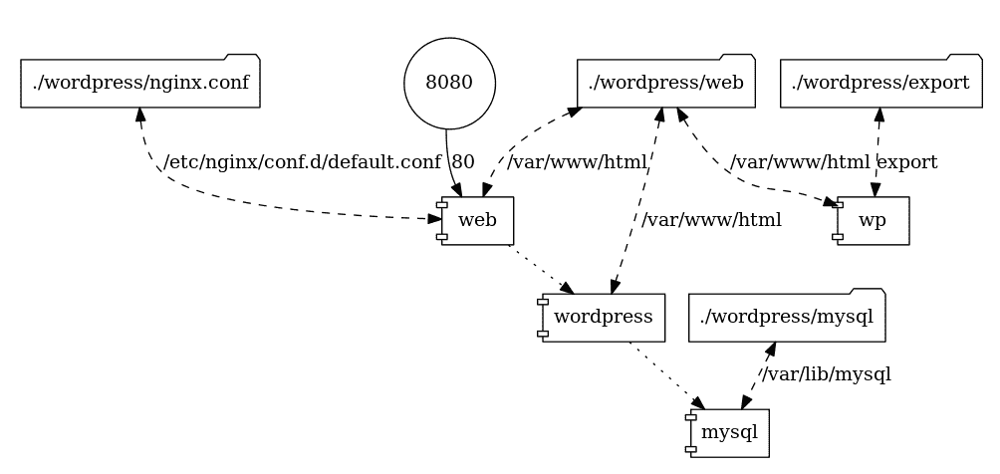

您可以使用`docker-compose-viz`给自己一个任何 Docker 编写文件的可视化表示。从我们的报告中可以看出，我们定义了四种服务。

第一个叫做`web`。该服务是四个服务中唯一暴露给主机网络的一个，它充当我们的 WordPress 安装的前端。它运行来自[https://store.docker.com/img/nginx/](https://store.docker.com/img/nginx/)的官方 nginx 映像，它扮演两个角色。在看这些之前，先看一下以下 nginx 配置:

```
server {
 server_name _;
 listen 80 default_server;

 root /var/www/html;
 index index.php index.html;

 access_log /dev/stdout;
 error_log /dev/stdout info;

 location / {
 try_files $uri $uri/ /index.php?$args;
 }

 location ~ .php$ {
 include fastcgi_params;
 fastcgi_pass wordpress:9000;
 fastcgi_index index.php;
 fastcgi_param SCRIPT_FILENAME $document_root$fastcgi_script_name;
 fastcgi_buffers 16 16k;
 fastcgi_buffer_size 32k;
 }
}
```

您可以看到，除了 PHP 之外，我们正在使用 nginx 从`/var/www/html/`提供所有内容，我们正在使用 nginx 从我们的主机安装 nginx，并且对 PHP 文件的所有请求都被代理到我们在`9000`端口上的第二个服务，称为`wordpress`。nginx 配置本身正在从我们的主机安装到`/etc/nginx/conf.d/default.conf`。

这意味着我们的 nginx 容器充当静态内容的 web 服务器，这是第一个角色，也是动态内容的 WordPress 容器的代理，这是容器承担的第二个角色。

第二个服务是`wordpress`；这是来自[https://store.docker.com/img/wordpress](https://store.docker.com/img/wordpress)的官方 WordPress 图片，我用的是`php7.2-fpm-alpine`标签。这给了我们一个在 PHP 7.2 上运行的 WordPress 安装，使用建立在 Alpine Linux 基础之上的`PHP-FPM`。

**FastCGI Process Manager** (**PHP-FPM**) is a PHP FastCGI implementation with some great features. For us, it allows PHP to run as a service that we can bind to a port and pass requests to; this fits in with the Docker approach of running a single service on each container.

我们安装的 web 根与我们为 web 服务安装的相同，在主机上是`wordpress/web`，在服务上是`/var/www/html/`。首先，我们主机上的文件夹将是空的；然而，一旦 WordPress 服务启动，它将检测到没有任何核心 WordPress 安装，并将其中一个复制到该位置，从而有效地引导我们的 WordPress 安装，并将其复制到我们的主机上，为我们开始工作做好准备。

下一个服务是 MySQL，它使用的是官方的 MySQL 镜像([https://store.docker.com/img/mysql/](https://store.docker.com/img/mysql/))并且是我们正在使用的四个镜像中唯一没有使用 Alpine Linux 的镜像(来吧 MySQL，伸出你的手指，发布一个基于 Alpine Linux 的镜像！).取而代之的是使用`debian:stretch-slim`。我们传递了一些环境变量，以便在容器第一次运行时创建数据库、用户名和密码；如果您将此用作项目的基础，您应该更改密码。

像`web`和`wordpress`容器一样，我们正在从主机安装一个文件夹。在这种情况下，它是`wordpress/mysql`，我们将其安装到`/var/lib/mysql/`，这是 MySQL 存储其数据库和相关文件的默认文件夹。

您会注意到，当容器启动时，`wordpress/mysql`会填充一些文件。我不建议使用本地 IDE 编辑它们。

最后的服务简称`wp`。它不同于其他三个服务:这个服务在执行时会立即退出，因为容器中没有长时间运行的进程。它不是一个长时间运行的过程，而是在一个与我们的主`wordpress`容器完全匹配的环境中提供对 WordPress 命令行工具的访问。

您会注意到，我们正在挂载 web 根，就像我们在 web 和 WordPress 上所做的那样，还有一个名为`/export`的第二次挂载；一旦配置好 WordPress，我们将更详细地了解这一点。

要启动 WordPress，我们只需要运行以下命令来提取映像:

```
$ docker-compose pull
```

这将拉取映像并启动`web`、`wordpress`和`mysql`服务以及准备`wp`服务。在服务开始之前，我们的`wordpress`文件夹如下所示:

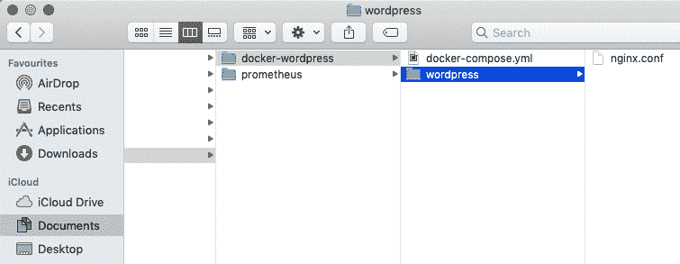

如您所见，我们只有`nginx.conf`在那里，这是 Git 存储库的一部分。然后，我们可以使用以下命令来启动容器并检查它们的状态:

```
$ docker-compose up -d
$ docker-compose ps
```

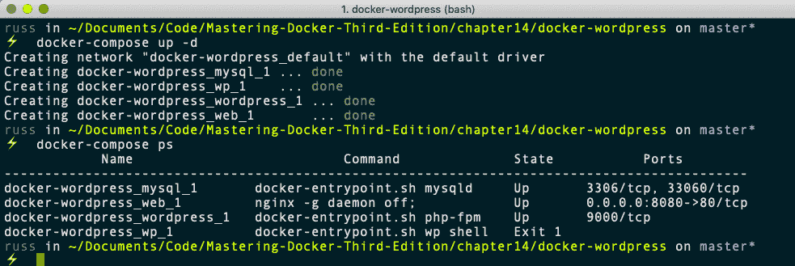

您应该看到在`wordpress`文件夹中已经创建了三个文件夹:`export`、`mysql`和`web`。此外，请记住我们期望`dockerwordpress_wp_1`有一个`exit`状态，所以没关系:

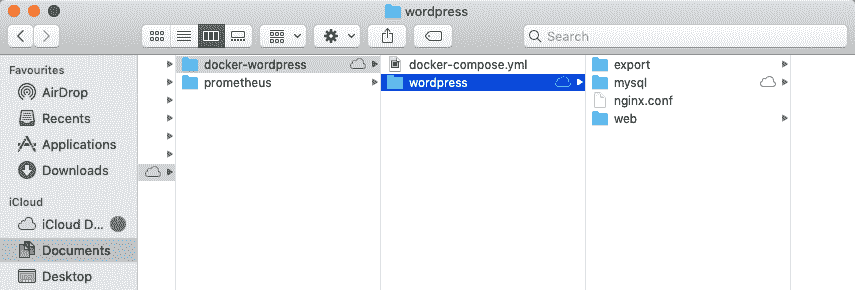

打开浏览器，进入`http://localhost:8080/`会显示标准的 WordPress 预安装欢迎页面，您可以在其中选择您希望安装使用的语言:

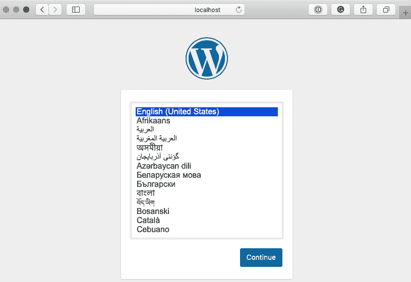

不要点击**继续**，因为它将带你进入基于图形用户界面的安装的下一个屏幕。相反，回到你的终端。

我们将使用 WP-CLI，而不是使用 GUI 来完成安装。这有两个步骤。第一步是创建`wp-config.php`文件。为此，请运行以下命令:

```
$ docker-compose run wp core config \
    --dbname=wordpress \
    --dbuser=wordpress \
    --dbpass=wordpress \
    --dbhost=mysql \
    --dbprefix=wp_
```

正如您将在下面的终端输出中看到的，在我运行命令之前，我只有`wp-config-sample.php`文件，它随核心 WordPress 一起提供。然后，运行命令后，我有了自己的`wp-config.php`文件:

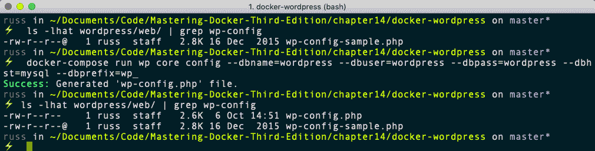

您会注意到，在命令中，我们正在传递我们在 Docker Compose 文件中定义的数据库详细信息，并告诉 WordPress 它可以连接到`mysql`地址的数据库服务。

现在我们已经配置了数据库连接的细节，我们需要配置我们的 WordPress 站点以及创建一个管理员用户和设置一个密码。为此，请运行以下命令:

```
$ docker-compose run wp core install \
 --title="Blog Title" \
 --url="http://localhost:8080" \
 --admin_user="admin" \
 --admin_password="password" \
 --admin_email="email@domain.com"
```

运行此命令将产生一个关于电子邮件服务的错误；不要担心这个消息，因为这只是一个本地开发环境。我们不太担心离开 WordPress 安装的电子邮件:

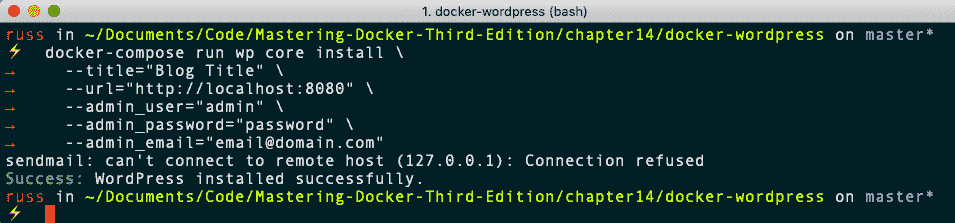

我们已经在 WordPress 中使用 WP-CLI 配置了以下内容:

*   我们的网址是`http://localhost:8080`
*   我们的网站标题应该是`Blog Title`
*   我们的管理员用户名是`admin`，密码是`password`，用户有一封`email@domain.com`的邮件

回到你的浏览器，输入 [http://localhost:8080/](http://localhost:8080/) 你会看到一个普通的 WordPress 网站:


在我们做任何进一步的工作之前，让我们稍微定制一下我们的安装，首先安装并启用 JetPack 插件:

```
$ docker-compose run wp plugin install jetpack --activate
```

该命令的输出如下所示:

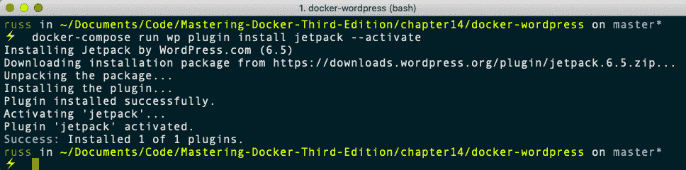

然后，安装并启用`sydney`主题:

```
$ docker-compose run wp theme install sydney --activate
```

该命令的输出如下所示:

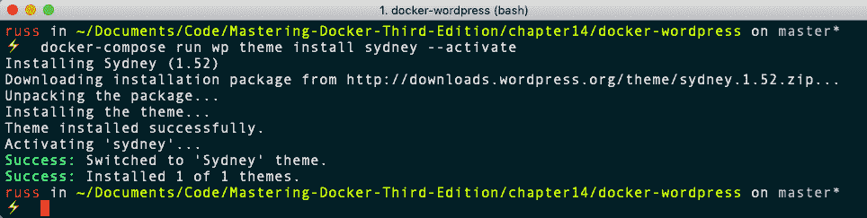

在 [http://localhost:8080/](http://localhost:8080/) 刷新我们的 WordPress 页面应该会显示如下内容:

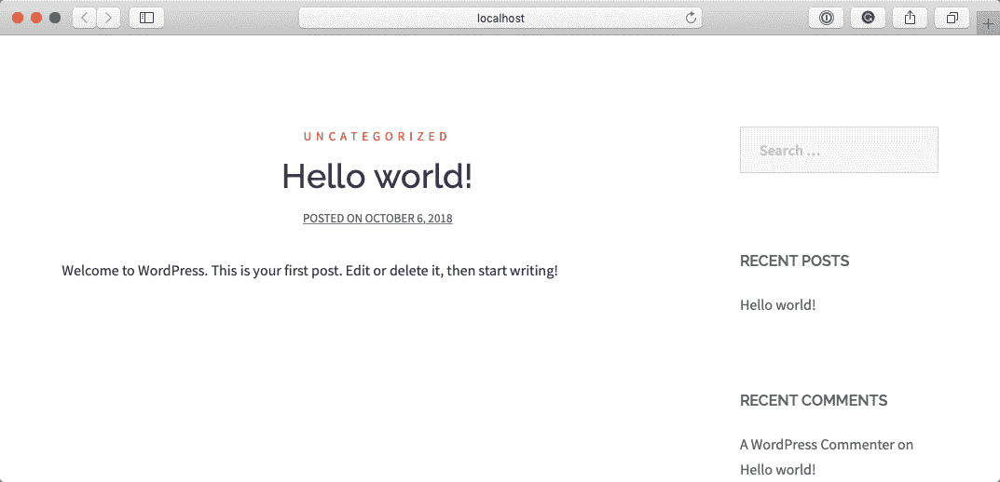

在打开 IDE 之前，让我们使用以下命令销毁运行 WordPress 安装的容器:

```
$ docker-compose down 
```

该命令的输出如下所示:

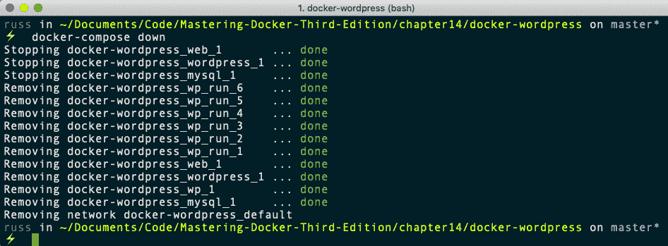

由于我们的整个 WordPress 安装，包括所有的文件和数据库，都存储在我们的本地机器上，我们应该能够运行以下命令返回到我们离开它的 WordPress 站点:

```
$ docker-compose up -d
```

一旦您通过转到 [http://localhost:8080/](http://localhost:8080/) 确认它已按预期启动并运行，请在桌面编辑器中打开`docker-wordpress`文件夹。我使用了崇高的文本。在编辑器中，打开`wordpress/web/wp-blog-header.php`文件，在打开的 PHP 语句中添加以下一行并保存:

```
echo "Testing editing in the IDE";
```

该文件应该如下所示:

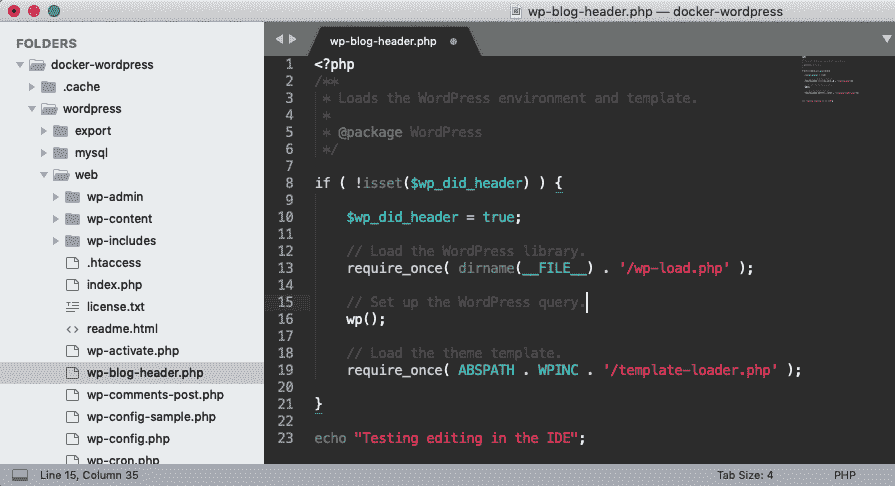

一旦保存，刷新你的浏览器，你应该会在页面最底部的集成开发环境中看到**测试编辑**的消息(以下屏幕被缩放；如果你跟着读，可能更难发现，因为文本很小):

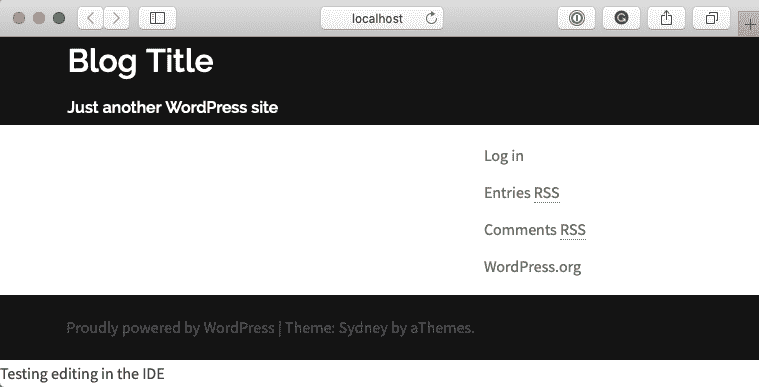

我们要看的最后一件事是为什么我们把`wordpress/export`文件夹安装在`wp`容器上。

正如本章前面已经提到的，您不应该真正接触`wordpress/mysql`文件夹的内容；这也包括分享。虽然如果您压缩项目文件夹并将其传递给同事可能会有效，但这并不被认为是最佳做法。因此，我们已经装载了导出文件夹，允许我们使用 WP-CLI 进行数据库转储并导入它。

为此，请运行以下命令:

```
$ docker-compose run wp db export --add-drop-table /export/wordpress.sql
```

以下终端输出显示了导出以及前后`wordpress/export`的内容，最后是 MySQL 转储的前几行:

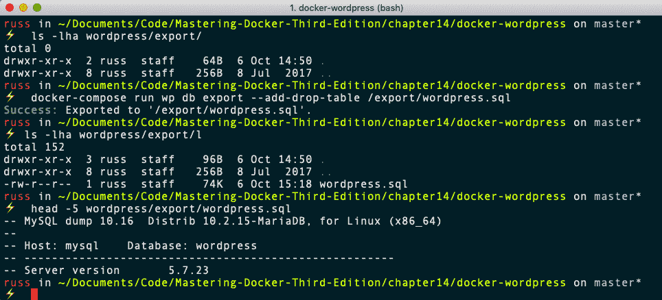

如果需要，比如说，因为我在开发过程中犯了一个错误，我可以通过运行以下命令回滚到数据库的那个版本:

```
$ docker-compose run wp db import /export/wordpress.sql
```

该命令的输出如下所示:

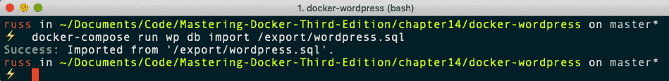

如您所见，我们已经安装了 WordPress，使用 WP-CLI 和浏览器与它交互，编辑代码，还备份和恢复了数据库，所有这些都无需安装或配置 nginx、PHP、MySQL 或 WP-CLI。我们也不用登录集装箱。通过从我们的主机装载卷，当我们拆掉 WordPress 容器时，我们的内容是安全的，并且我们没有丢失任何工作。

此外，如果需要，我们可以很容易地将项目文件夹的副本传递给安装了 Docker 的同事，并且通过一个命令，他们就可以处理我们的代码，知道它运行在与我们自己的安装完全相同的环境中。

最后，当我们使用 Docker 商店的官方映像时，我们知道我们可以放心地要求将它们部署到生产中，因为它们是根据 Docker 的最佳实践构建的。

Don't forget to stop and remove your WordPress containers by running `docker-compose down`.

# 监视

接下来，我们将看看如何监控我们的容器以及 Docker 主机。在[第 4 章](04.html) *【管理容器】*中，我们讨论了`docker container top`和`docker container stats`命令。您可能还记得，这两个命令都只显示实时信息；没有保存历史数据。

虽然这在您试图调试正在运行的问题或想要快速了解容器内发生的情况时非常有用，但如果您需要回顾问题，这并没有太大帮助:可能您已经配置了容器，如果它们变得无响应，则可以重新启动。虽然这将有助于提高应用的可用性，但是如果您需要了解为什么您的容器变得没有响应，这并没有多大帮助。

在`/chapter14`文件夹的 GitHub 存储库中，有一个名为`prometheus`的文件夹，其中有一个 Docker Compose 文件，在两个网络上启动三个不同的容器。与其看 Docker Compose 文件本身，不如让我们看一下可视化:

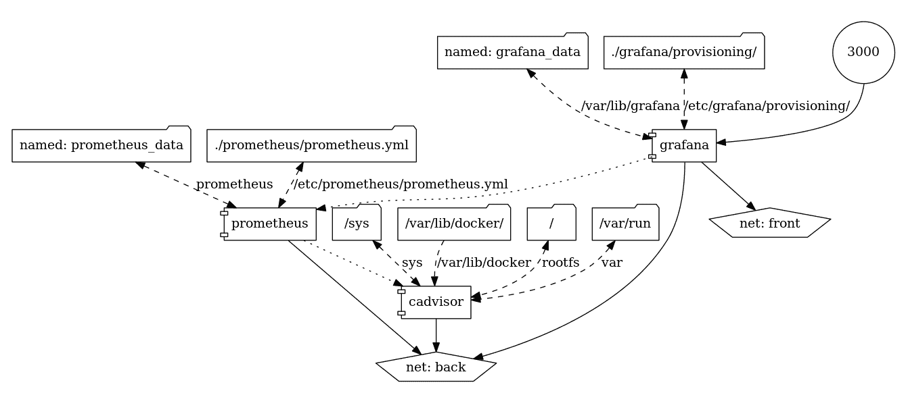

如你所见，发生了很多事情。我们正在运行的三项服务是:

*   **球童**
*   **普罗米修斯**
*   **围巾**

在我们启动和配置 Docker Compose 服务之前，我们应该先从 cadvisor 开始讨论为什么需要每一个服务。

`cadvisor`是谷歌发布的一个项目。从我们正在使用的映像中的 Docker Hub 用户名中可以看到，Docker Compose 文件中的服务部分如下所示:

```
 cadvisor:
 image: google/cadvisor:latest
 container_name: cadvisor
 volumes:
 - /:/rootfs:ro
 - /var/run:/var/run:rw
 - /sys:/sys:ro
 - /var/lib/docker/:/var/lib/docker:ro
 restart: unless-stopped
 expose:
 - 8080
 networks:
 - back
```

我们正在安装主机文件系统的各个部分，以允许`cadvisor`访问我们的 Docker 安装，就像我们在[第 11 章](11.html) *中所做的一样，Portainer–Docker 的图形用户界面*。这样做的原因是，在我们的案例中，我们将使用`cadvisor`来收集容器的统计数据。虽然它可以用作独立的容器监控服务，但我们不想公开 cadvisor 容器。相反，我们只是让它对后端网络上 Docker Compose 堆栈中的其他容器可用。

`cadvisor`是 Docker 容器`stat`命令的独立 web 前端，显示图形，并允许您从易于使用的界面从 Docker 主机深入到容器中。然而，它不会保留超过 5 分钟的指标。

由于我们试图记录可能在几小时甚至几天后可用的指标，不超过 5 分钟的指标意味着我们将不得不使用额外的工具来记录 it 处理的指标。`cadvisor`在以下端点将我们想要记录到容器中的信息公开为结构化数据:`http://cadvisor:8080/metrics/`。

稍后我们将了解为什么这很重要。我们的下一个服务`prometheus`正在自动抓取`cadvisor`端点。这是大部分繁重工作发生的地方。`prometheus`是由 SoundCloud 编写并开源的监控工具:

```
 prometheus:
 image: prom/prometheus
 container_name: prometheus
 volumes:
 - ./prometheus/prometheus.yml:/etc/prometheus/prometheus.yml
 - prometheus_data:/prometheus
 restart: unless-stopped
 expose:
 - 9090
 depends_on:
 - cadvisor
 networks:
 - back
```

从前面的服务定义中可以看到，我们正在挂载一个名为`./prometheus/prometheus.yml`的配置文件和一个名为`prometheus_data`的卷。配置文件包含有关我们要清除的源的信息，从以下配置中可以看到:

```
global:
 scrape_interval: 15s 
 evaluation_interval: 15s
 external_labels:
 monitor: 'monitoring'

rule_files:

scrape_configs:

 - job_name: 'prometheus'
 static_configs:
 - targets: ['localhost:9090']

 - job_name: 'cadvisor'
 static_configs:
 - targets: ['cadvisor:8080']
```

我们指示普罗米修斯每`15`秒从我们的端点抓取数据。端点是在`scrape_configs`部分定义的，正如你所看到的，我们已经定义了`cadvisor`和普罗米修斯本身。我们创建和安装`prometheus_data`卷的原因是普罗米修斯将存储我们所有的指标，所以我们需要保证它的安全。

普罗米修斯的核心是一个时间序列数据库。它获取抓取的数据，对其进行处理以找到度量名称和值，然后将其与时间戳一起存储。

普罗米修斯还配备了强大的查询引擎和应用编程接口，使其成为这类数据的完美数据库。虽然它确实带有基本的绘图功能，但建议您使用 Grafana，这是我们的最终服务，也是唯一公开的服务。

**Grafana** 是一个用于显示监控图和指标分析的开源工具，它允许您使用时间序列数据库创建仪表板，例如石墨、InfluxDB 以及 Prometheus。还有更多后端数据库选项可以作为插件使用。

Grafana 的 Docker Compose 定义遵循与我们其他服务类似的模式:

```
 grafana:
 image: grafana/grafana
 container_name: grafana
 volumes:
 - grafana_data:/var/lib/grafana
 - ./grafana/provisioning/:/etc/grafana/provisioning/
 env_file:
 - ./grafana/grafana.config
 restart: unless-stopped
 ports:
 - 3000:3000
 depends_on:
 - prometheus
 networks:
 - front
 - back
```

我们使用`grafana_data`卷来存储 Grafana 自己的内部配置数据库，而不是将环境变量存储在 Docker Compose 文件中，而是从名为`./grafana/grafana.config`的外部文件中加载它们。

变量如下:

```
GF_SECURITY_ADMIN_USER=admin
GF_SECURITY_ADMIN_PASSWORD=password
GF_USERS_ALLOW_SIGN_UP=false
```

如您所见，我们在这里设置用户名和密码，因此将它们保存在外部文件中意味着您可以在不编辑核心 Docker Compose 文件的情况下更改这些值。

现在我们知道了这四种服务各自所扮演的角色，让我们来启动它们。为此，只需从`prometheus`文件夹运行以下命令:

```
$ docker-compose pull
$ docker-compose up -d 
```

这将创建网络和卷，并从 Docker Hub 中提取映像。然后，它将着手推出四项服务:

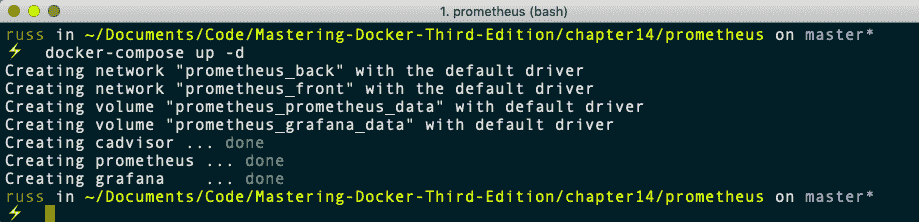

你可能会想立即去你的格拉夫纳仪表板。如果您这样做了，您将看不到任何东西，因为 Grafana 需要几分钟来初始化自己。您可以通过跟踪日志来跟踪其进度:

```
$ docker-compose logs -f grafana
```

该命令的输出如下所示:

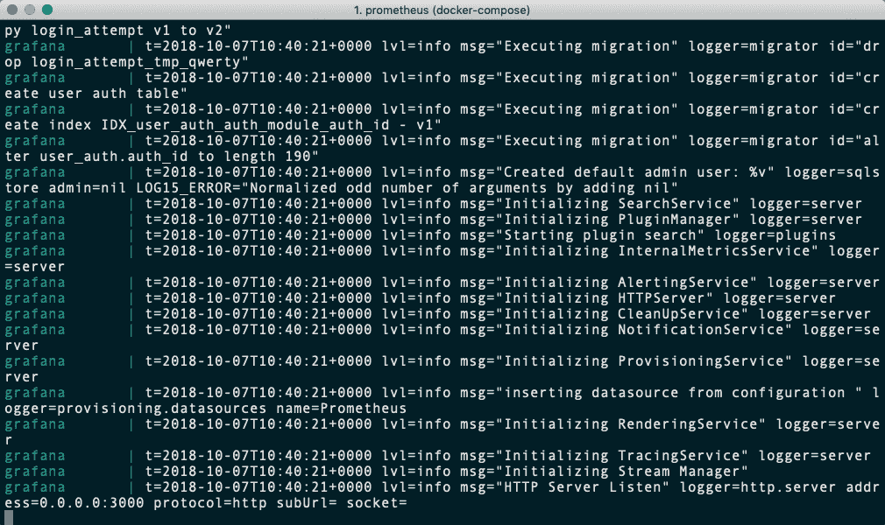

一旦您看到`HTTP Server Listen`信息，Grafana 将可用。借助 Grafana 5，您现在可以导入数据源和仪表板，这就是我们将`./grafana/provisioning/`安装到`/etc/grafana/provisioning/`的原因。该文件夹包含自动配置格拉夫纳与我们的普罗米修斯服务对话的配置，并且还导入仪表板，该仪表板将显示普罗米修斯从 cadvisor 中抓取的数据。

打开浏览器进入`http://localhost:3000/`，应该会出现登录画面:

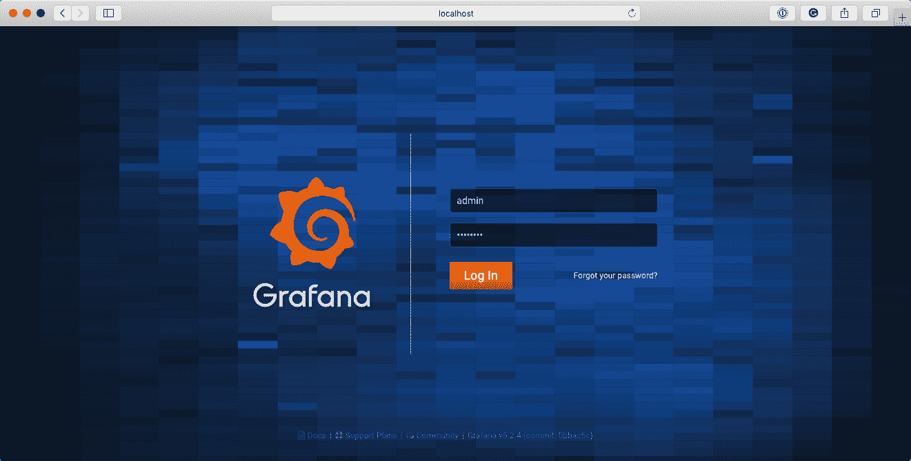

输入**用户**为`admin`，输入**密码**为`password`。登录后，如果您已经配置了数据源，您应该会看到以下页面:

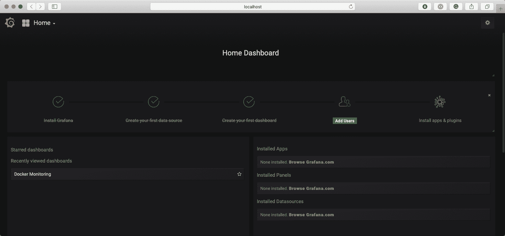

如您所见，安装 Grafana |创建您的第一个数据源|创建您的第一个仪表板的初始步骤已经全部执行，只剩下剩下两个。目前，我们将忽略这些。单击左上角的主页按钮将弹出一个菜单，列出可用的仪表板:

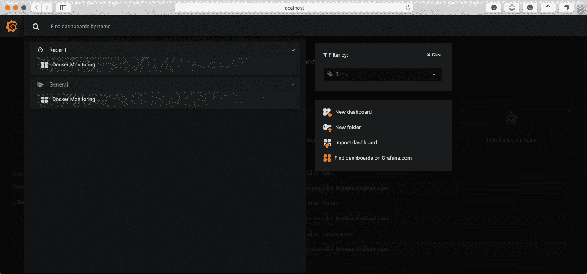

如您所见，我们有一个名为 Docker Monitoring 的。点击它将带您进入以下页面:

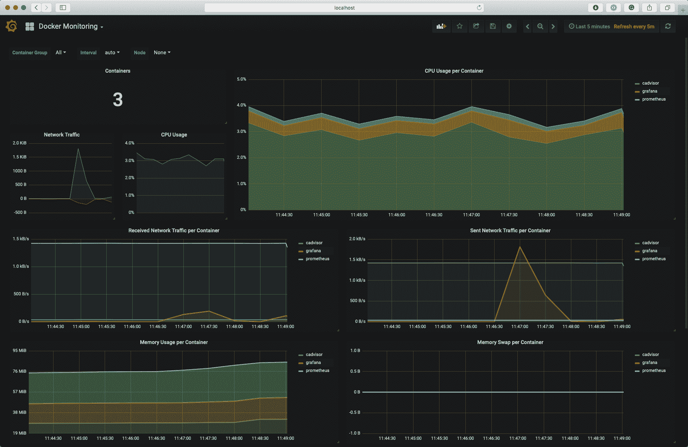

从屏幕右上角的计时信息中可以看到，默认情况下，它会显示最后五分钟的数据。点击它将允许您更改时间框架显示。例如，下面的屏幕显示了最后 15 分钟，这显然比 cadvisor 记录的 5 分钟多:

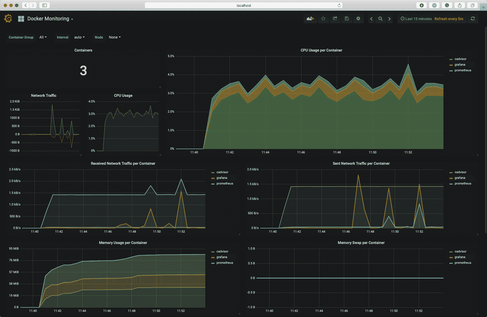

我已经提到，这是一个复杂的解决方案；最终，Docker 将扩展最近发布的内置端点，该端点目前只公开关于 Docker Engine 的信息，而不公开容器本身。有关内置端点的更多信息，请查看官方 Docker 文档，该文档可在[https://docs.docker.com/config/thirdparty/prometheus/](https://docs.docker.com/config/thirdparty/prometheus/)找到。

还有其他监控解决方案；大部分采取第三方**软件即服务** ( **SaaS** )的形式。正如您在*进一步阅读*部分的服务列表中所看到的，这里列出了一些成熟的监控解决方案。事实上，您可能已经在使用它们了，所以在扩展配置时，您很容易在监控容器时考虑到它们。

完成 Prometheus 安装探索后，不要忘记运行以下命令将其删除:

```
$ docker-compose down --volumes --rmi all
```

这将删除所有容器、卷、映像和网络。

# 扩展到外部平台

我们已经研究了如何使用 Docker Machine、Docker Swarm、Docker for Amazon Web Services 和 Rancher 等工具扩展到其他一些外部平台，以推出集群以及来自公共云服务的集群和容器服务，如 Amazon Web Services、Microsoft Azure 和 DigitalOcean。

# 英雄库

**Heroku** 与其他云服务略有不同，因为它被认为是一个**平台即服务** ( **PaaS** )。不是在其上部署容器，而是将容器链接到 Heroku 平台，从该平台运行服务，如 PHP、Java、Node.js 或 Python。因此，您可以在 Heroku 上运行您的 Rails 应用，然后将您的 Docker 容器附加到该平台。

We will not be covering installing Heroku here as it is a little off topic. Please see the *Further readin*g section of the chapter for more details on Heroku.

您可以一起使用 Docker 和 Heroku 的方法是在 Heroku 平台上创建您的应用，然后在您的代码中，您将拥有类似于以下内容的内容:

```
{
 "name": “Application Name",
 "description": “Application to run code in a Docker container",
 "image": “<docker_image>:<tag>”,
 "addons": [ "heroku-postgresql" ]
}
```

退一步来说，我们首先需要安装插件，以便让这个功能正常工作。只需运行以下命令:

```
$ heroku plugins:install heroku-docker
```

现在，如果您想知道可以或应该从 Docker Hub 使用什么映像，Heroku 维护了许多可以在前面代码中使用的映像:

*   `heroku/nodejs`
*   `heroku/ruby`
*   `heroku/jruby`
*   `heroku/python`
*   `heroku/scala`
*   `heroku/clojure`
*   `heroku/gradle`
*   `heroku/java`
*   `heroku/go`
*   `heroku/go-gb`

# 生产是什么样子的？

在本章的最后一节，我们将讨论产品应该是什么样的。这部分不会像你想象的那么长。这是因为可供选择的方案非常多，所以不可能涵盖所有方案。此外，根据前面的章节，您应该已经有了一个最适合您的好主意。

相反，我们将关注在规划环境时您应该问自己的一些问题。

# 码头工人主机

Docker 主机是您环境的关键组件。没有这些，你将没有地方运行你的容器。正如我们在前面几章中已经看到的，在运行 Docker 主机时有一些注意事项。您需要考虑的第一件事是，如果您的主机正在运行 Docker，它们不应该运行任何其他服务。

# 过程混合

您应该抵制在现有主机上快速安装 Docker 并启动容器的诱惑。这不仅会对您在单个主机上混合使用隔离和非隔离进程带来安全隐患，还会导致性能问题，因为您无法向非容器化的应用添加资源限制，这意味着它们还可能对您正在运行的容器产生负面影响。

# 多个隔离的 Docker 主机

如果你有几台以上的 Docker 主机，你打算如何管理它们？运行 Portainer 这样的工具很棒，但是当试图管理多个主机时会很麻烦。此外，如果运行多个独立的 Docker 主机，则不能选择在主机之间移动容器。

当然，您可以使用诸如 Weave Net 之类的工具来跨越多个单独的 Docker 主机的容器网络。根据您的托管环境，您也可以选择在外部存储上创建卷，并根据需要将其呈现给 Docker 主机，但您实际上是在创建一个手动过程来管理主机之间的容器迁移。

# 发送到您的容器

如果您有多个主机，您需要考虑如何在容器之间路由请求。

例如，如果您有一个外部负载平衡器，例如 AWS 中的 ELB，或者一个内部集群前面的专用设备，您是否有能力动态地将到达负载平衡器上的`port x`的流量添加到 Docker 主机上的`port y`的路由，然后流量通过该路由到达您的容器？

如果您有多个容器都需要在同一个外部端口上访问，您将如何处理？

您是否需要安装一个代理(如 Traefik、HAProxy 或 nginx)来接受请求，然后基于域或子域基于虚拟主机路由您的请求，而不仅仅是使用基于端口的路由？

例如，您可以只使用网站的端口，从端口`80`和`443`到 Docker 配置的容器的所有内容，来接受这些端口上的流量。使用虚拟主机路由意味着您可以将`domain-a.com`路由到`container a`，然后将[domainb.com](https://www.domain-b.com/)路由到`container b`。`domain-a.com`和`domain-b.com`都可以指向同一个 IP 地址和端口。

# 使聚集

我们在上一节中讨论的许多问题都可以通过引入集群工具来解决，例如 Docker Swarm 和 Kubernetes

# 和睦相处

即使应用在开发人员的本地 Docker 安装中运行良好，您也需要能够保证，如果您将应用部署到例如 Kubernetes 集群中，它也能以同样的方式运行。

十有八九，您不会有问题，但是您确实需要考虑应用如何与同一应用集中的其他容器进行内部通信。

# 参考架构

您选择的集群技术是否有参考体系结构？部署集群时，最好总是进行检查。有一些最佳实践指南接近或符合您建议的环境。毕竟，没有人想制造一个大的单点故障。

还有，有哪些推荐的资源？部署一个具有五个管理节点和一台 Docker 主机的集群没有意义，就像部署五台 Docker 主机和一台管理服务器没有意义一样，因为您有相当大的单点故障。

您的集群技术支持哪些支持技术(例如，远程存储、负载平衡器和防火墙)？

# 集群通信

当集群与管理主机或 Docker 主机通信时，有什么要求？您需要内部网络还是独立网络来隔离集群流量？

您可以轻松地将集群成员锁定到您的集群吗？集群通信是否加密？您的集群可能会暴露哪些信息？这是否使其成为黑客的目标？

集群需要什么外部访问 API，例如您的公共云提供商？任何应用编程接口/访问凭证的存储有多安全？

# 映像注册表

您的应用是如何打包的？你把代码烤成映像了吗？如果是，您是否需要托管一个私有的本地映像注册中心，或者您是否可以使用外部服务，如 Docker Hub、Docker 可信注册中心(DTR)或 Quay？

如果您需要托管自己的私有注册表，它应该在您的环境中的什么位置？谁拥有或需要访问权限？它能连接到您的目录提供商吗，比如活动目录安装？

# 摘要

在本章中，我们看了 Docker 的一些不同的工作流，以及如何对您的容器和 Docker 主机进行一些监控。

当涉及到您自己的环境时，您能做的最好的事情是构建一个概念证明，并尽可能努力覆盖您能想到的每一个灾难场景。您可以通过使用云提供商提供的容器服务或寻找一个好的参考体系结构来获得领先，这都应该会限制您的试错。

在下一章中，我们将看看你在容器世界的下一步会是什么。

# 问题

1.  哪个容器为我们的 WordPress 网站服务？
2.  `wp`容器为什么不保持运行？
3.  以分钟为单位，cadvisor 将指标保留多长时间？
4.  什么 Docker Compose 命令可以用来删除与应用相关的所有内容？

# 进一步阅读

您可以在以下网站找到我们在本章中使用的软件的详细信息:

*   http://wordpress.org/
*   WP-CLI:[https://WP-CLI . org/](https://wp-cli.org/)
*   PHP-fpm:https://PHP-fpm . org/
*   蒸发器:[https://github . com/Google/cadvisor/](https://github.com/google/cadvisor/)
*   普罗米修斯:https://prometheus.io/
*   grafana:[https://grafana . com/](https://grafana.com/)
*   普罗米修斯数据模型:[https://prometheus.io/docs/concepts/data_model/](https://prometheus.io/docs/concepts/data_model/)
*   Traefik： [https://traefik.io/](https://traefik.io/)
*   haproxy:[https://www . haproxy . org/](https://www.haproxy.org/)
*   基尼系数:[https://基尼系数. org/](https://nginx.org/)
*   heroku:[https://www . heroku . com](https://www.heroku.com)

其他外部托管的 Docker 监控平台包括:

*   sys dig cloud:[https://sys dig . com/](https://sysdig.com/)
*   数据犬:[http://docs.datadoghq.com/integrations/docker/](http://docs.datadoghq.com/integrations/docker/)
*   CoScale:[http://www.coscale.com/docker-monitoring](http://www.coscale.com/docker-monitoring)
*   dyna trace:[https://www . dyna trace . com/capabilities/microservice-and-container-monitoring/](https://www.dynatrace.com/capabilities/microservices-and-container-monitoring/)
*   signal FX:https://signal FX . com/dock-monitoring/
*   新遗迹:[https://newrelic.com/partner/docker](https://newrelic.com/partner/docker)
*   sematext:https://sematext . com/dock/

还有其他自托管选项，例如:

*   弹性节拍:[https://www.elastic.co/products/beats](https://www.elastic.co/products/beats)
*   系统： [https://www.sysdig.org](https://www.sysdig.org)
*   zabix:https://github . com/monitoringartist/zabix 坞站监控