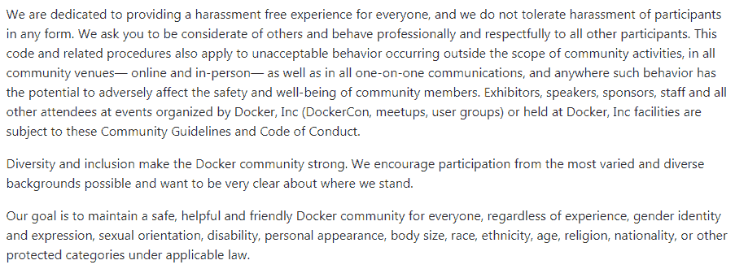

# Docker 的后续步骤

你坚持到了这本书的最后一章，并且坚持到了最后！在本章中，我们将了解莫比项目，以及您如何为 Docker 和社区做出贡献。然后，我们将通过对云原生计算基础的快速概述来结束本章。让我们从讨论莫比项目开始。

# 莫比项目

在 2017 年 DockerCon 上发布的公告之一是莫比项目。当这个项目被宣布时，我有几个关于这个项目是什么的问题，来自工作同事，因为从表面上看，Docker 似乎已经发布了另一个容器系统。

那么，我怎么回答呢？经过几天的困惑，我得出了以下答案:

<q>莫比项目是一个开源项目的统称，该项目收集了几个用于构建基于容器的系统的库。该项目有自己的框架，将这些库组合成一个可用的系统，还有一个名为莫比起源的参考系统；把它想象成一个“你好世界”，允许你建立甚至定制你自己的 Docker。</q>

我给出这个答案后发生了两件事之一；通常，回答是*，但这实际上意味着什么？*。我回答说:

<q>莫比项目是 Docker(该公司)和其他任何希望为该项目做出贡献的人的开源游乐场，他们希望开发新的功能，并将现有功能扩展到库和框架，从而在公共论坛上组成基于容器的系统。其中一个输出是名为莫比 Origin 的前沿容器系统，另一个是 Docker(产品)，它作为开源社区版或商业支持的企业版交付。</q>

如果有人想要一个类似项目的例子，该项目结合了前沿版本、稳定的开源版本和企业支持的版本，我将解释红帽如何使用红帽企业 Linux:

<q>把它想象成红帽对红帽企业版 Linux 采取的方法。你有 Fedora，它是 *b*</q> *leeding edge 版本开发游乐场，为 Red Hat 的操作系统开发人员引入新的包、功能，同时也删除旧的、过时的组件。通常，Fedora 比 Red Hat Enterprise Linux 中发现的特性提前一两年，Red Hat Enterprise Linux 是基于 Fedora 项目中所做工作的商业支持的长期版本；除了这个版本，您还有 CentOS 形式的社区支持版本。*

你可能在想，*为什么这本书的最后才提到？*嗯，在写这本书的时候，这个项目还非常处于起步阶段。事实上，将莫比项目所需的所有组件从主要的 Docker 项目中转移出来的工作仍在进行中。

在我写这篇文章的时候，这个项目唯一真正可用的组件是 *LinuxKit* ，它是一个将所有库集合在一起并输出一个能够运行容器的可引导系统的框架。

由于这个项目的速度非常快，我不会给出任何关于如何使用 LinuxKit 的例子，也不会详细介绍莫比项目，因为当你读到这里时，它可能会改变；相反，我建议为以下页面添加书签，以跟上这一令人兴奋的发展:

*   项目主网站，位于:[https://mobyproject.org/](https://mobyproject.org/)
*   Moby Project GitHub pages，at:[https://github . com/Moby/](https://github.com/moby/)
*   莫比项目推特账户，一个好的新闻来源和指南链接，位于:[https://twitter.com/moby/](https://twitter.com/moby/)
*   LinuxKit 的主页，包含如何开始的示例和说明，位于:[https://github.com/linuxkit/](https://github.com/linuxkit/)

# 向 Docker 投稿

所以，你想帮助 Docker 吗？你有一个你想在 Docker 或它的一个组件中看到的好主意吗？让我们为您提供实现这一目标所需的信息和工具。如果你不是程序员类型的人，还有其他方法可以帮助你。Docker 拥有大量受众，您可以帮助贡献的另一种方式是帮助支持其他用户的服务。让我们也学习一下如何做到这一点。

# 为代码做出贡献

您可以为 Docker 做出贡献的最大方式之一是帮助编写 Docker 代码。由于 Docker 都是开源的，您可以将代码下载到您的本地机器上，并开发新的功能，然后将它们作为拉取请求呈现给 Docker。然后，他们将定期接受审查，如果他们觉得您所做的贡献应该在服务中，他们将批准拉取请求。当你知道你写的东西已经被接受时，这可能是非常令人羞愧的。

你首先需要知道你是如何建立贡献的:这几乎是 Docker([https://github.com/docker/](https://github.com/docker/))和莫比项目([https://github.com/moby/](https://github.com/moby/))的全部内容，我们在前面的部分已经谈到了。但是我们如何着手建立帮助贡献呢？最好的开始是遵循在[https://docs.docker.com/project/who-written-for/](https://docs.docker.com/project/who-written-for/)的官方 Docker 文档中可以找到的指南。

正如您可能已经猜到的，您不需要太多就可以启动和运行开发环境，因为许多开发都是在容器中完成的。例如，除了拥有一个 GitHub 帐户，Docker 还列出了以下三个软件作为最低要求:

*   去吧" t0 https://git-SCM . com/
*   制造:[https://www.gnu.org/software/make/](https://www.gnu.org/software/make/)
*   如果你已经走了这么远，你就不需要链接了

关于如何为 Mac 和 Linux 准备自己的 Docker 开发的更多详细信息，请访问:[https://docs . Docker . com/open source/project/software-required/](https://docs.docker.com/opensource/project/software-required/)和 Windows 用户，请访问:[https://docs . Docker . com/open source/project/software-req-win/](https://docs.docker.com/opensource/project/software-req-win/)。

要成为一个成功的开源项目，必须有一些社区指南。我建议阅读位于 https://docs.docker.com/opensource/code/的优秀快速入门指南，以及位于 T2 的更详细的投稿工作流程文档。

Docker 有一套行为准则，涵盖了他们的员工和整个社区应该如何行动。它是开源的，并在知识共享属性 3.0 下获得许可，声明如下:

<q></q>

完整的行为准则可以在 https://github.com/docker/code-of-conduct/找到。

# 提供码头工人支持

除了贡献 Docker 代码或特性集，您还可以通过其他方式贡献 Docker。你可以通过利用你所获得的知识来帮助他人的支持渠道。社区非常开放，总有人愿意帮忙。当我碰到什么东西时，发现我在挠头，我觉得这很有帮助。得到帮助也很好，但也能回馈他人；这是一个很好的交换。这也是一个收获想法供你使用的好地方。你可以看到其他人根据他们的设置提出了什么问题，这可能会激发你想在你的环境中使用的想法。

您还可以关注关于服务的 GitHub 问题。这些可能是功能请求以及 Docker 如何实现它们，也可能是在使用服务时突然出现的问题。您可以帮助测试其他人遇到的问题，看看您是否可以复制该问题，或者您是否找到了他们问题的可能解决方案。

Docker 有一个非常活跃的社区，可以在:[https://community.docker.com/](https://community.docker.com/)找到；在这里，您不仅可以看到最新的社区新闻和事件，还可以在 Docker 用户和开发人员的 Slack 频道中与他们聊天。在撰写本书时，有超过 80 个渠道涵盖了各种主题，例如 Mac 的 Docker、Windows 的 Docker、Alpine Linux、Swarm、Storage 和 Network 等等，任何时候都有数百名活跃用户。

最后还有 Docker 论坛，可以在:[https://forums.docker.com/](https://forums.docker.com/)找到。如果你想搜索主题/问题或关键词，这些是很好的来源。

# 其他贡献

还有其他方式来为 Docker 做贡献。你可以做一些事情，比如推广这项服务，在你的机构引起兴趣。您可以通过自己组织的沟通方式开始这种沟通，无论是电子邮件分发列表、小组讨论、信息技术圆桌会议还是定期安排的会议。

您还可以在组织内安排会议，让人们交流。这些会议不仅包括您的组织，还包括您的组织所在的城市或镇的成员，以便更广泛地交流和推广服务。

您可以通过访问:[https://www.docker.com/community/meetup-groups/](https://www.docker.com/community/meetup-groups/)来搜索您所在地区是否已经有会议。

# 云原生计算基金会

我们在[第 9 章](09.html)、 *Docker 和 Kubernetes* 中简要讨论了云原生计算基础。云原生计算基金会，简称 CNCF 基金会，旨在为允许您管理容器和微服务架构的项目提供一个供应商中立的场所。

其成员包括 Docker、亚马逊网络服务、谷歌云、微软 Azure、红帽、甲骨文、VMWare 和数字海洋等。2018 年 6 月，Linux 基金会报告称，CNCF 有 238 名成员。这些成员不仅贡献项目，还贡献工程时间、代码和资源。

# 毕业项目

在写这本书的时候，有两个毕业设计，这两个我们在前面几章都讨论过。这些可以说也是基金会维护的项目中最著名的两个，它们如下:

*   **Kubernetes**([https://Kubernetes . io](https://kubernetes.io)):这是第一个捐赠给基金会的项目。正如我们已经提到的，它最初是由谷歌开发的，现在有超过 2300 名来自基金会和开源社区的贡献者。
*   **普罗米修斯**([https://Prometheus . io](https://prometheus.io)):本项目由 SoundCloud 捐赠给基金会。正如我们在[第 13 章](13.html)*Docker workflow*中看到的，它是一个实时监控和警报系统，由强大的时间序列数据库引擎支持。

要毕业，项目必须完成以下工作:

*   通过了《CNCF 行为准则》，该准则与 Docker 发布的准则相似。完整的行为准则可在[https://github . com/cncf/foundation/blob/master/行为准则. md](https://github.com/cncf/foundation/blob/master/code-of-conduct.md) 上找到。
*   获得了 **Linux 基金会**(**【LF】**)**核心基础架构计划** ( **CII** )最佳实践徽章，该徽章表明该项目正在使用一套既定的最佳实践进行开发——其完整标准可在以下网址找到:[https://github . com/Core infra structure/最佳实践徽章/blob/master/doc/criteria . MD](https://github.com/coreinfrastructure/best-practices-badge/blob/master/doc/criteria.md)。
*   获得了至少两个有项目委托人的组织。
*   通过`GOVERNANCE.md`和`OWNERS.md`文件公开定义提交者流程和项目治理。
*   在一个`ADOPTERS.md`文件中或通过项目网站上的标志公开列出项目采纳者。
*   获得了技术监督委员会的超级多数票。你可以在[https://github.com/cncf/toc](https://github.com/cncf/toc)找到更多关于委员会的信息。

还有另一种项目状态，这是大多数项目目前所处的状态。

# 孵化项目

处于孵化阶段的项目最终应该具有毕业状态。以下项目都完成了以下工作:

*   证明项目至少由三个独立的最终用户(不是项目发起人)使用
*   获得了相当数量的内部和外部贡献者
*   表现出成长性和良好的成熟度

TOC 大量参与项目工作，以确保活动水平足以满足前面的标准，因为不同项目的度量标准可能不同。

目前的项目清单如下:

*   **open tracking**([https://opentracing.io/](https://opentracing.io/)):这是目前在 CNCF 旗下的两个追踪项目中的第一个。您下载并使用的不是一个应用程序，而是一组库和 API，这些库和 API 允许您在基于微服务的应用程序中内置行为跟踪和监控。
*   **Fluentd**([https://www.fluentd.org](https://www.fluentd.org)):该工具允许您从大量来源收集日志数据，然后将日志数据路由到多个日志管理、数据库、归档和警报系统，例如 Elastic Search、AWS S3、MySQL、SQL Server、Hadoop、Zabbix 和 DataDog 等。
*   **gRPC**([https://gRPC . io](https://grpc.io)):和 Kubernetes 一样，gRPC 也是谷歌捐赠给 CNCF 的。它是一个开源、可扩展和性能优化的 RPC 框架，已经在网飞、思科和瞻博网络等公司投入生产。
*   **Containerd**([https://Containerd . io](https://containerd.io)):我们在[第 1 章](01.html)*Docker 概述*中简要提到了 Containerd，作为 Docker 一直致力于的开源项目之一。这是一个标准的容器运行时，允许开发人员在其平台或应用程序中嵌入一个可以管理 Docker 和 OCI 兼容映像的运行时。
*   **Rkt**([https://github.com/rkt/rkt](https://github.com/rkt/rkt)):Rkt 是 Docker 集装箱发动机的替代产品。Rkt 不是使用守护进程来管理主机系统上的容器，而是使用命令行来启动和管理容器。它是由科里奥斯捐赠给 CNCF 的，现在属于红帽公司。
*   **CNI**([https://github.com/containernetworking](https://github.com/containernetworking)):CNI，集装箱联网接口的简称，也不是你下载使用的。相反，它是一个网络接口标准，旨在嵌入到容器运行时中，如 Kubernetes、Rkt 和 Mesos。通过第三方插件和扩展，拥有一个公共接口和一组 API 允许在这些运行时更一致地支持高级网络功能。
*   **特使**([https://www . Envoy proxy . io](https://www.envoyproxy.io)):特使最初是在 Lyft 内部创建的，由苹果、网飞和谷歌等公司使用，是一个高度优化的服务网格，可提供负载平衡、跟踪以及跨环境的数据库和网络活动的可观察性。
*   **Jaeger**([https://jaegertracing . io](https://jaegertracing.io)):这是列表中的第二个追踪系统。与 OpenTracing 不同，它是一个完全分布式的跟踪系统，最初由优步开发，用于监控其广泛的微服务环境。现在被像红帽这样的公司使用，它有一个现代的用户界面和对开放跟踪和各种后端存储引擎的本地支持。它被设计成与其他 CNCF 项目如库本内特斯和普罗米修斯相结合。
*   **公证员**([https://github.com/theupdateframework/notary](https://github.com/theupdateframework/notary)):这个项目最初是 Docker 写的，是 TUF 的一个实现，接下来我们会讲到。它被设计成允许开发者通过给他们一个加密工具来签署他们的容器图像，该加密工具提供了一种机制来验证他们的容器图像和内容的出处。
*   **TUF**([https://theudateframework . github . io](https://theupdateframework.github.io)):**更新框架** ( **TUF** )是一个允许软件产品通过使用密钥在安装和更新过程中保护自己的标准。它是由 NYU 工程学院开发的。
*   **Vitess**([https://Vitess . io](https://vitess.io)):自 2011 年以来，Vitess 一直是 YouTube MySQL 数据库基础架构的核心组件。这是一个通过分片横向扩展 MySQL 的集群系统。
*   **CoreDNS**([https://CoreDNS . io](https://coredns.io)):这是一款小型、灵活、可扩展且高度优化的 DNS 服务器，用 Go 编写，从头开始设计，可在可运行数千个容器的基础架构中运行。
*   **NATS**([https://NATs . io](https://nats.io)):这里，我们有一个消息传递系统，它是为运行支持物联网设备的微服务或架构的环境而设计的。
*   **Linkerd**([https://Linkerd . io](https://linkerd.io)):Linkerd 由 Twitter 构建，是一个服务网格，旨在扩展和处理每秒数万个安全请求。
*   **Helm**([https://www . Helm . sh](https://www.helm.sh)):Helm 专为 Kubernetes 打造，是一款包管理器，允许用户以易于分发的格式打包自己的 Kubernetes 应用，并迅速成为标准。
*   **Rook**([https://Rook . io](https://rook.io)):目前，Rook 处于早期开发阶段，专注于为管理 Kubernetes 上 Red Hat 的分布式存储系统 Ceph 提供编排层。最终，它将扩展以支持其他分布式块和对象存储系统。

我们已经在本书的不同章节中使用了其中的一些项目，我相信当您寻求解决诸如路由到您的容器和在您的环境中监控您的应用程序等问题时，其他项目也会引起您的兴趣。

# CNCF 风景

CNCF 提供了他们及其成员管理的所有项目的互动地图，可在[https://landscape.cncf.io/](https://landscape.cncf.io/)找到。其中一个关键要点如下:

<q>你正在观看 590 张卡片，总计 1，227，036 颗星，市值 6.52 万亿美元，资金 163 亿美元。</q>

虽然我相信你会同意这是一些令人印象深刻的数字，但这有什么意义呢？由于 CNCF 的工作，我们有了像 Kubernetes 这样的项目，这些项目提供了一套标准化的工具、应用编程接口和方法，用于跨多个云基础架构提供商以及内部部署和裸机服务，为您创建和部署自己的高可用性、可扩展和高性能的容器和微服务应用程序提供了构建模块。

# 摘要

我希望这一章已经给了你一个关于你在集装箱之旅中可以采取的下一步措施的想法。我发现的一件事是，虽然简单地使用这些服务很容易，但通过成为大型、友好和受欢迎的开发人员和其他用户社区的一部分，你会从中获得更多，他们和你一样，围绕着各种软件和项目涌现出来。

云原生计算基金会的成立进一步加强了这种社区感和协作感。这让大型企业走到了一起，直到几年前，这些企业还不会考虑与其他被视为大型项目竞争对手的企业公开合作。