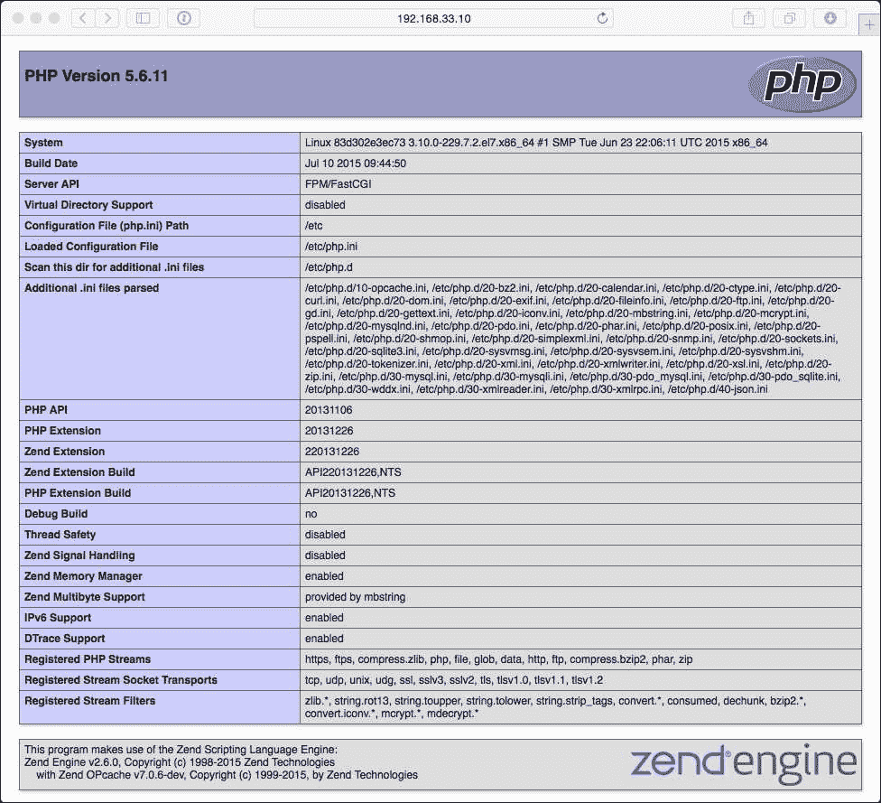
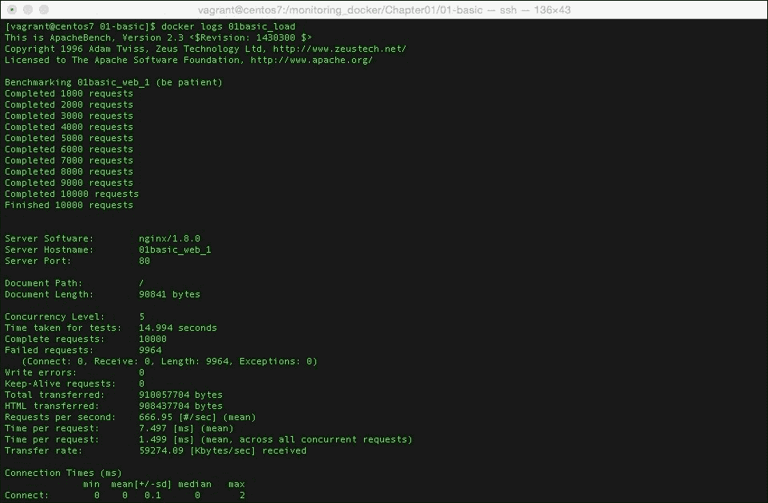
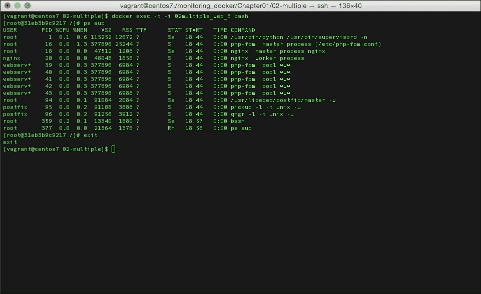

# 二、使用内置工具

在本书的后面几章中，我们将探索在过去 24 个月中，在 Docker 周围开始蓬勃发展的大型生态系统的监控部分。然而，在我们继续之前，我们应该看看 Docker 的普通安装有什么可能。在本章中，我们将涵盖以下主题:

*   使用 Docker 内置的工具获取容器性能的实时指标
*   使用标准操作系统命令来获取 Docker 正在做什么的指标
*   生成测试负载，以便您可以查看度量的变化

# Docker 统计

从 1.5 版本开始，Docker 内置了一个基本的统计命令:

```
docker stats --help

Usage: docker stats [OPTIONS] CONTAINER [CONTAINER...]

Display a live stream of one or more containers' resource usage statistics

 --help=false         Print usage
 --no-stream=false    Disable streaming stats and only pull the first result

```

该命令将实时显示容器资源利用率的详细信息。了解该命令的最好方法是查看它的运行情况。

## 运行 Docker 统计

让我们使用流浪环境来启动一个容器，我们在上一章已经介绍过了:

```
[russ@mac ~]$ cd ~/Documents/Projects/monitoring-docker/vagrant-centos/
[russ@mac ~]$ vagrant up
Bringing machine 'default' up with 'virtualbox' provider...
==> default: Importing base box 'russmckendrick/centos71'...
==> default: Matching MAC address for NAT networking...
==> default: Checking if box 'russmckendrick/centos71' is up to date...

.....

==> default: => Installing docker-engine ...
==> default: => Configuring vagrant user ...
==> default: => Starting docker-engine ...
==> default: => Installing docker-compose ...
==> default: => Finished installation of Docker
[russ@mac ~]$ vagrant ssh

```

现在您已经连接到了流浪服务器，使用`/monitoring_docker/Chapter01/01-basic/`中的 Docker 编写文件启动容器:

```
[vagrant@centos7 ~]$ cd /monitoring_docker/Chapter01/01-basic/
[vagrant@centos7 01-basic]$ docker-compose up -d
Creating 01basic_web_1...

```

您现在已经下拉并在后台启动了一个容器。这个容器叫做`01basic_web_1`，它运行 NGINX 和 PHP，服务于一个单独的 PHP 信息页面([http://php.net/manual/en/function.phpinfo.php](http://php.net/manual/en/function.phpinfo.php))。

要检查一切是否如预期启动，运行`docker-compose ps`。你应该看到你的单个容器上有`Up`的`State`:

```
[vagrant@centos7 01-basic]$ docker-compose ps
 Name             Command         State         Ports 
---------------------------------------------------------------
01basic_web_1   /usr/local/bin/run   Up      0.0.0.0:80->80/tcp

```

最后，您应该能够在`http://192.168.33.10/`处看到包含 PHP 信息输出的页面(该 IP 地址被硬编码到游民配置中)，如果您将它放在本地浏览器中:



现在，你有一个容器开始运行；让我们看看一些基本的统计数据。从`docker-compose`的输出中我们知道我们的容器叫做`01basic_web_1`，所以输入下面的命令在你的终端开始流式统计:

```
docker stats 01basic_web_1

```

启动需要一秒钟；完成此操作后，您应该会看到您的容器以及以下内容的统计信息:

*   `CPU %`:这显示了容器当前使用了多少可用的 CPU 资源。
*   `MEM USEAGE/LIMIT`:这告诉你容器正在使用多少内存；它还显示容器有多少余量。如果您没有明确设置限制，它将显示主机上的内存总量。
*   `MEM %`:这显示了容器使用的内存余量的百分比。
*   `NET I/O`:这给出了进出容器的带宽传输总量。

如果你回到你的浏览器窗口并开始刷新`http://192.168.33.10/`，你会看到每一列的值开始改变。要停止统计流，请按 *Ctrl* + *c* 。

与其一遍又一遍地点击刷新，不如让我们为`01basic_web_1`产生大量流量，这会让容器承受很大的负载。

在这里，我们将使用 Apache bench([https://httpd.apache.org/docs/2.2/programs/ab.html](https://httpd.apache.org/docs/2.2/programs/ab.html))启动一个容器，向`01basic_web_1`发送 10，000 个请求。虽然需要一两分钟才能执行，但是我们应该尽快运行`docker stats`:

```
docker run -d --name=01basic_load --link=01basic_web_1 russmckendrick/ab ab -k -n 10000 -c 5 http://01basic_web_1/ && docker stats 01basic_web_1 01basic_load

```

在下载了 ApacheBench 映像并且将被称为`01basic_load`的容器启动后，您应该会看到`01basic_web_1`和`01basic_load`的统计数据开始在您的终端中流动:

```
CONTAINER     CPU %     MEM USAGE/LIMIT     MEM %    NET I/O
01basic_load  18.11%    12.71 MB/1.905 GB   0.67%    335.2 MB/5.27 MB
01basic_web_1 139.62%   96.49 MB/1.905 GB   5.07%    5.27 MB/335.2 MB

```

过一会儿，你会注意到`01basic_load`的大部分统计会降到零；这意味着测试已经完成，运行测试的容器已经退出。`docker stats`命令只能对正在运行的容器进行流统计；已经退出的不再运行，因此运行时不产生输出`docker stats`。

使用 *Ctrl* + *c* 退出`docker stats`；要查看 ApacheBench 命令的结果，可以键入`docker logs 01basic_load`；您应该会看到如下截图:



如果您在前面的输出中看到任何失败，您不应该担心。这个练习纯粹是为了演示如何查看正在运行的容器的统计数据，而不是调整一个 web 服务器来处理我们使用 ApacheBench 发送给它的流量。

要删除我们启动的容器，请运行以下命令:

```
[vagrant@centos7 01-basic]$ docker-compose stop
Stopping 01basic_web_1...
[vagrant@centos7 01-basic]$ docker-compose rm
Going to remove 01basic_web_1
Are you sure? [yN] y
Removing 01basic_web_1...
[vagrant@centos7 01-basic]$ docker rm 01basic_load
01basic_load

```

要检查是否已成功移除所有内容，请运行`docker ps -a`，您将看不到任何名称中有`01basic_`的正在运行或退出的容器。

# 刚刚发生了什么？

在运行 ApacheBench 测试时，您可能已经注意到运行 NGINX 和 PHP 的容器上的 CPU 利用率很高；在上一节的示例中，它使用了 139.62%的可用 CPU 资源。

由于我们没有对启动的容器附加任何资源限制，所以我们的测试很容易使用主机**虚拟机** ( **虚拟机**)上的所有可用资源。如果该虚拟机正由几个用户使用，所有用户都运行自己的容器，他们可能已经开始注意到他们的应用已经开始变慢，或者更糟糕的是，应用已经开始显示错误。

如果你曾经发现自己处于这种情况，你可以使用`docker stats`来帮助追查罪魁祸首。

运行`docker stats $(docker ps -q)`将流式传输所有当前运行容器的统计数据:

```
CONTAINER       CPU %     MEM USAGE/LIMIT     MEM %    NET I/O
361040b7b33e    0.07%     86.98 MB/1.905 GB   4.57%    2.514 kB/738 B
56b459ae9092    120.06%   87.05 MB/1.905 GB   4.57%    2.772 kB/738 B
a3de616f84ba    0.04%     87.03 MB/1.905 GB   4.57%    2.244 kB/828 B
abdbee7b5207    0.08%     86.61 MB/1.905 GB   4.55%    3.69 kB/738 B
b85c49cf740c    0.07%     86.15 MB/1.905 GB   4.52%    2.952 kB/738 B

```

您可能已经注意到，这将显示容器 ID，而不是名称；但是，这些信息应该足以发现资源猪，以便您可以快速阻止它:

```
[vagrant@centos7 01-basic]$ docker stop 56b459ae9092
56b459ae9092

```

一旦停止，您就可以通过运行以下命令获得流氓容器的名称:

```
[vagrant@centos7 01-basic]$ docker ps -a | grep 56b459ae9092
56b459ae9092        russmckendrick/nginx-php   "/usr/local/bin/run" 9 minutes ago       Exited (0) 26 seconds ago      my_bad_container

```

或者，为了获得更详细的信息，您可以运行`docker inspect 56b459ae9092`，它将为您提供容器上所需的所有信息。

# 流程呢？

Docker 的一大优点是它不是真正的虚拟化；如前一章所述，这是隔离进程而不是运行整个操作系统的好方法。

这在运行`top`或`ps`等工具时会变得混乱。为了了解这会有多混乱，让我们使用`docker-compose`启动几个容器，自己看看:

```
[vagrant@centos7 ~]$ cd /monitoring_docker/Chapter01/02-multiple
[vagrant@centos7 02-multiple]$ docker-compose up -d
Creating 02multiple_web_1...
[vagrant@centos7 02-multiple]$ docker-compose scale web=5
Creating 02multiple_web_2...
Creating 02multiple_web_3...
Creating 02multiple_web_4...
Creating 02multiple_web_5...
Starting 02multiple_web_2...
Starting 02multiple_web_3...
Starting 02multiple_web_4...
Starting 02multiple_web_5...

```

现在，我们有五个网络服务器，它们都是使用相同的配置从相同的映像启动的。登录服务器排查问题首先要做的一件事就是运行`ps -aux`；这将显示所有正在运行的进程。如您所见，在运行该命令时，列出了许多进程。

即使只是试图查看 NGINX 的流程也是令人困惑的，因为没有什么可以将流程从容器区分到另一个容器，如以下输出所示:


那么，如何知道哪个容器拥有哪些进程呢？

## Docker 顶

该命令列出了在容器中运行的所有进程；把它想象成一种过滤我们在主机上运行的`ps aux`命令的输出的方式:


由于`docker top`是标准`ps`命令的实现，您通常传递给`ps`的任何标志都应该如下工作:

```
[vagrant@centos7 02-multiple]$ docker top 02multiple_web_3 –aux
[vagrant@centos7 02-multiple]$ docker top 02multiple_web_3 -faux

```

## Docker 工执行

另一种方式查看容器内发生的事情是进入容器。为了让能够做到这一点，Docker 引入了`docker exec`命令。这允许您在已经运行的容器中生成一个额外的进程，然后附加到该进程；因此，如果我们想看看当前在`02multiple_web_3`上运行的是什么，我们应该使用下面的命令在一个已经运行的容器中生成一个 bash shell:

```
docker exec -t -i 02multiple_web_3 bash

```

一旦你在容器上有了一个活动的外壳，你会注意到你的提示已经变成了容器的 ID。您的会话现在被隔离到容器的环境中，这意味着您将只能与属于您输入的容器的进程进行交互。

从这里，您可以像在主机上一样运行`ps aux`或`top`命令，并且只看到与您感兴趣的容器相关联的进程:



要离开容器，输入`exit`，您应该会在主机中看到您的提示更改。

最后，你可以通过运行`docker-compose stop`和`docker-compose kill`来停止和移除容器。

# 总结

在本章中，我们看到了如何获得运行容器的实时统计数据，以及如何使用我们熟悉的命令来获得作为每个容器的一部分启动的进程的信息。

从表面上看，`docker stats`似乎是一个非常基本的功能，实际上只不过是一个工具，帮助您识别哪个容器在发生问题时使用了所有资源。然而，Docker 命令实际上是从一个相当强大的 API 中提取信息。

这个应用编程接口构成了我们将在接下来几章中看到的许多监控工具的基础。