# 第三章。会议记录者群体模式

在 Dockercon 16 上，Docker 团队提出了一种操作 Swarm 集群的新方法，称为 Swarm 模式。这一宣布被一套新工具的引入略微提前，据说这套工具可以操作任何规模的分布式系统，称为**群集工具包**。

在本章中，我们将:

*   引入群集工具包
*   引入群体模式
*   比较群 v1、群套件和群模式
*   创建一个测试集群，并在其上启动服务

不要跳过阅读群集工具包部分，因为群集工具包是群集模式的基础。看到 Swarmkit 是我们选择引入 Swarm Mode 概念的方式，比如节点、服务、任务。

我们将在[第 4 章](04.html "Chapter 4. Creating a Production-Grade Swarm")*中展示如何创建生产级大集群模式集群，创建生产级集群*。

# 蜂群

除了群模式，Docker 16 的 Docker 团队还发布了群工具包，定义为:

> *“用于在任何规模上编排分布式系统的工具包。它包括用于节点发现、基于 raft 的共识、任务调度等的原语。”*

**集群**集群由活跃的节点组成，既可以作为管理者，也可以作为工作者。

经理通过 Raft 进行协调(也就是说，如[第 2 章](02.html "Chapter 2. Discover the Discovery Services")、*发现发现服务*中所述，他们在法定人数可用时选举领导者)，负责分配资源、协调服务和沿集群分派任务。工人执行任务。

集群的目标是执行*服务*，所以需要运行的是在高层定义的。例如，服务可以是“web”。分配给节点的工作单元被称为**任务**。例如，分配给“web”服务的任务可以是运行 nginx 容器的容器，并且可以被命名为 web.5。

非常重要的一点是要注意，我们说的是服务，服务可能是容器。可能是，没必要。在本书中，我们的重点当然是容器，但是 Swarmkit 的意图是从理论上抽象任何对象的编排。

## 版本和支持

版本注释。我们将在接下来的章节中介绍的 Docker Swarm 模式仅与 Docker 1.12+兼容。相反，使用 Swarmkit，您甚至可以编排 Docker Engines 的早期版本，例如 1.11 或 1.10。

## 群套件架构

**Swarmkit** 是为了处理任何规模的服务集群而发布的编排机制。

在群集工具包集群中，节点可以是**管理人员**(集群的)或**工作人员**(集群的主力，执行计算操作的节点)。

应该有奇数个经理，最好是 3 个或 5 个，这样如果没有分裂的大脑(如[第 2 章](02.html "Chapter 2. Discover the Discovery Services")、*发现发现服务*中所解释的)，大多数经理将驱动集群。Raft 共识算法总是需要法定人数。

一个群集工具包集群可以容纳任意数量的工作人员:1、10、100 或 2，000。

在管理器上，**服务**可以被定义和负载平衡。例如，服务可以是“web”。一个“网络”服务将由运行在集群节点上的几个**任务**组成，包括管理器，例如，一个任务可以是一个 nginx Docker 容器。

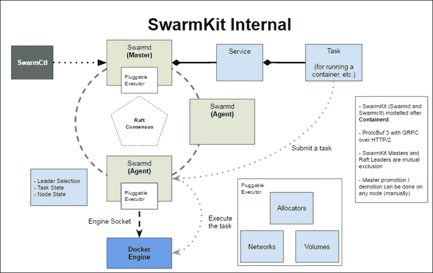

在群集工具包中，操作员使用**群集工具**二进制文件与系统远程交互，调用领导者主机上的操作。运行名为**群集**的二进制程序的 Masters 通过 Raft 就领导者达成一致，保持服务和任务的状态，并为工人安排工作。

工作人员运行 Docker 引擎，并将运行它们的作业作为单独的容器。

Swarmkit 架构可能会被重新绘制，但是核心组件(主组件和工作组件)会保留下来。相反，新对象可能会添加插件，用于分配资源，如网络和卷。

### 管理者如何为任务选择最佳节点

群集工具包在集群上生成任务的方式称为**调度**。调度程序是一种算法，它使用过滤器等标准来决定从哪里开始一项任务。

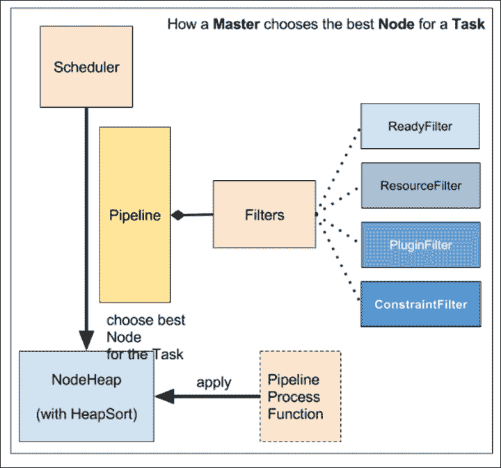

## 蜂群之心:蜂群

启动 FlowKit 服务的核心二进制文件叫做`swarmd`，它是创建主服务器和连接从服务器的守护程序。

它可以将自己绑定到本地 UNIX 套接字和 TCP 套接字，但在这两种情况下，都可以通过连接到(另一个)专用的 UNIX 本地套接字由`swarmctl`实用程序管理。

在下一节接下来的示例中，我们将使用`swarmd`创建第一个监听端口`4242/tcp`的管理器，然后再次在其他工作节点上使用`swarmd`，使它们加入管理器，最后我们将使用`swarmctl`检查关于我们集群的一些事实。

这些二进制文件被封装到 Docker Hub 上可用的`fsoppelsa/swarmkit`映像中，我们将在这里使用它来简化解释并避免 Go 代码编译。

这是群集的在线帮助。它的可调参数不言自明，所以我们不打算详细介绍所有选项。实际上，最重要的选项是`--listen-remote-api`，定义`swarmd`绑定的`address:port`，以及从其他节点加入集群的`--join-addr`。

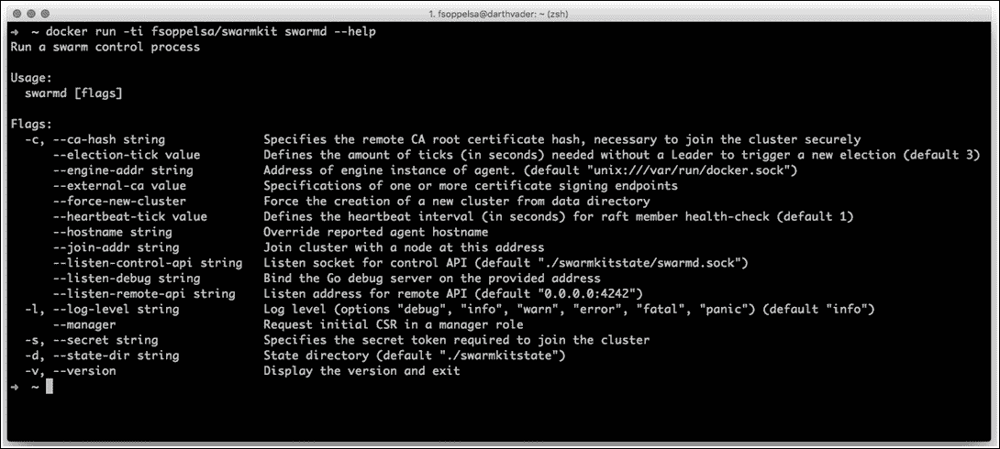

## swarm kit 的控制器:swarmctl

`swarmctl`是 SwarmKit 的客户端部分。它是用于操作 SwarmKit 集群的工具，因为它能够显示连接节点的列表、服务和任务的列表以及其他信息。这里，再次从`fsoppelsa/swarmkit``swarmctl`在线帮助:

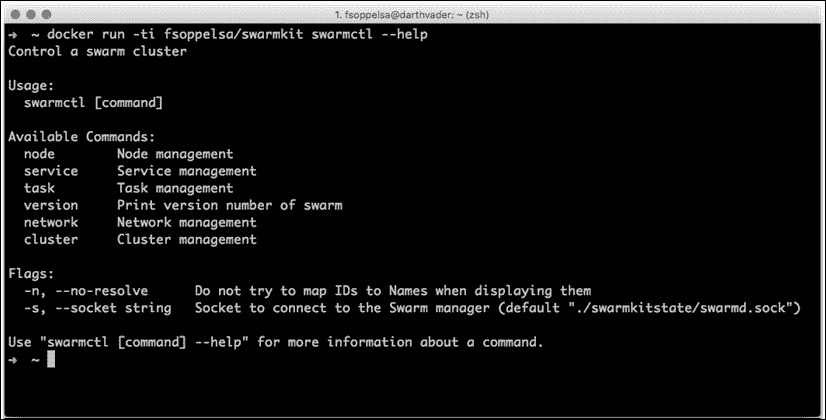

## 为群集工具包群集提供 Ansible

在这一节中，我们将提供一个最初由单个管理器和任意数量的从机组成的 FlowKit 集群。

为了创建这样的设置，我们将使用 Ansible 使操作可重复且更加健壮，除了说明命令之外，我们还将继续检查行动手册的结构。您可以轻松地调整这些行动手册，使其在您的提供商或本地运行，但在这里，我们将转到亚马逊 EC2。

要运行这个示例，有一些基本要求。

如果你想在 AWS 上遵循这个例子，当然你必须有一个 AWS 帐户，并配置访问密钥。密钥可从您的**帐户名** | **安全凭证**下的 AWS 控制台中检索。您需要复制以下键的值:

*   访问密钥标识
*   秘密访问密钥

我用`awsctl`设置那些键。只要从 *brew* (Mac)或从你的包装系统(如果你使用的是 Linux 或 Windows)安装它，并配置它:

```
aws configure

```

需要时，通过粘贴按键回答提示问题。配置，您可以在其中指定，例如，最喜欢的 AWS 区域(如`us-west-1`)存储在`~/.aws/config`中，而凭据存储在`~/.aws/credentials`中。这样，密钥由 Docker Machine 自动配置和读取。

如果您想运行 Ansible 示例而不是命令，这些是软件要求:

*   Ansible 2.2+
*   与 docker-machine 将在 EC2 上安装的映像兼容的 docker 客户端(在我们的例子中，默认的是 Ubuntu 15.04 LTS)，在编写本文时，Docker 客户端 1.11.2
*   Docker机器
*   Docker-py 客户端(Ansible 使用的)，可以安装`pip install docker-py`

此外，该示例使用标准端口`4242/tcp`，使集群节点相互交互。因此需要在安全组中打开该端口。

在[https://github.com/fsoppelsa/ansible-swarmkit](https://github.com/fsoppelsa/ansible-swarmkit)克隆存储库，并从设置群集管理器节点开始:

```
ansible-playbook aws_provision_master.yml

```

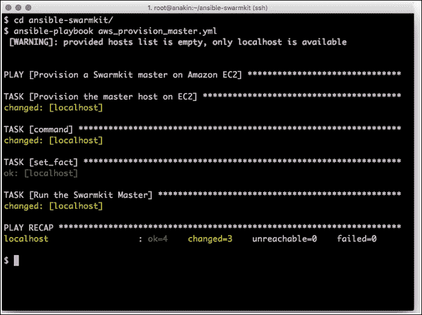

在一些 docker-machine 设置之后，剧本将在管理器主机上启动一个容器，充当一个 SwarmKit 管理器。以下是播放片段:

```
- name: Run the Swarmkit Master 
  docker: 
  name: swarmkit-master 
  image: "fsoppelsa/swarmkit" 
  command: swarmd --listen-remote-api 0.0.0.0:4242 
  expose: 
    - "4242" 
  ports: 
    - "0.0.0.0:4242:4242/tcp" 
  volumes: 
    - "/var/run/docker.sock:/var/run/docker.sock" 
  detach: yes 
  docker_url: "{{ dhost }}" 
  use_tls: encrypt 
  tls_ca_cert: "{{ dcert }}/ca.pem" 
  tls_client_cert: "{{ dcert }}/cert.pem" 
  tls_client_key: "{{ dcert }}/key.pem" 

```

在主机上，映像`fsoppelsa/swarmkit`中名为`swarmkit-master`的容器在管理器模式下运行`swarmd`(它在`0.0.0.0:4242`监听)。`swarmd`二进制直接使用主机上的 Docker 引擎，因此引擎的插座安装在容器内。容器将端口`4242`映射到主机端口`4242`，这样从机通过连接到主机`4242`端口就可以直接到达`swarmd`。

实际上，它相当于这个 Docker 命令:

```
docker run -d -v /var/run/docker.sock:/var/run/docker.sock -p 
    4242:4242 fsoppelsa/swarmkit swarmd --listen-remote-api  
    0.0.0.0:4242

```

该命令以分离模式(`-d`)运行，通过卷(`-v`)传递容器内的 Docker 机器 Docker 套接字，将端口`4242`从容器暴露给主机(`-p`)，并通过在端口`4242`上的任何地址上将容器本身置于监听模式来运行`swarmd`。

剧本完成后，您可以获取`swarmkit-master`机器凭证，并检查我们的容器是否正常运行:

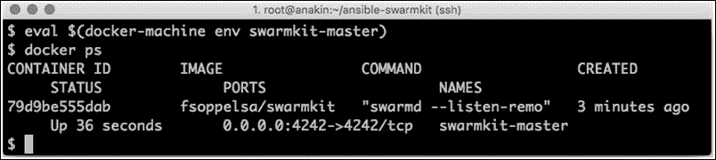

现在是时候加入一些奴隶了。要开始一个奴隶，你可以，你猜怎么着，直接跑:

```
ansible-playbook aws_provision_slave.yml

```

但是，由于我们希望将至少几个节点加入到 SwarmKit 集群中，所以我们使用了一点 shell 脚本:

```
for i in $(seq 5); do ansible-playbook aws_provision_slave.yml; 
    done

```

该命令运行五次行动手册，因此创建了五个工作节点。剧本在创建名为`swarmkit-RANDOM`的机器后，将启动一个`fsoppelsa/swarmkit`容器，执行以下操作:

```
- name: Join the slave to the Swarmkit cluster
  docker:
    name: "{{machine_uuid}}"
    image: "fsoppelsa/swarmkit"
    command: swarmd --join-addr "{{ masterip }}":4242
    volumes:
      - "/var/run/docker.sock:/var/run/docker.sock"
    detach: yes
    docker_url: "{{ shost }}"
```

这里，集群以加入模式运行，并通过连接到端口`4242/tcp`加入在主机上启动的集群。这相当于以下 docker 命令:

```
docker run -d -v /var/run/docker.sock:/var/run/docker.sock 
    fsoppelsa/swarmkit swarmd --join-addr $(docker-machine ip swarmkit- 
    master):4242

```

ansible `loop`命令需要几分钟才能完成，这取决于有多少工人开始工作。剧本完成后，我们可以使用`swarmctl`控制集群的正确创建。如果您还没有获得`swarmkit-master`机器证书，现在是时候:

```
eval $(docker-machine env swarmkit-master)

```

现在，我们使用 exec 调用运行集群主服务器的容器:

```
docker exec -ti 79d9be555dab swarmctl -s /swarmkitstate/swarmd.sock 
    node ls

```

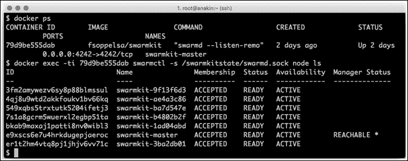

所以，这里我们列出了已经加入主的工人。

## 在群集工具包上创建服务

使用通常的`swarmctl`二进制，我们现在可以创建一个由 nginx 容器组成的服务(web)。

我们首先检查以确保这个全新的集群上没有活动服务:

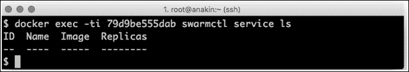

所以我们准备开始一个，用这个命令:

```
docker exec -ti 79d9be555dab swarmctl service create --name web --
    image nginx --replicas 5

```

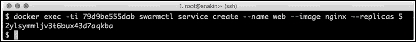

该命令指定创建一个名为`web`的服务，由`nginx`容器映像组成，并以`5`的因子进行复制，从而在集群中创建 5 个 nginx 容器。这需要几秒钟才能生效，因为在集群的每个节点上，Swarm 将拉取并启动 nginx 映像，但最后:


**5/5** 表示在 5 个想要的副本中，有 5 个是可用的。我们可以使用`swarmctl task ls`详细查看这些容器是从哪里产生的:

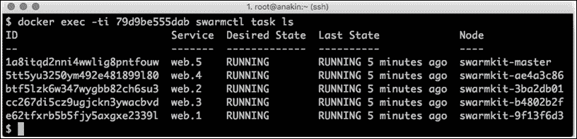

但是，等等，在管理器节点上运行的是 nginx 服务(web.5)吗？是的。默认情况下，允许群集工具包和群集模式管理器运行任务，调度器可以向它们分派作业。

在实际的生产配置中，如果您想保留管理器以不运行作业，则需要应用带有标签和约束的配置。这是[第五章](05.html "Chapter 5. Administer a Swarm Cluster")*管理蜂群*的一个话题。

# 群体模式

Docker Swarm 模式(适用于 1.12 版或更高版本的 Docker Engines)导入了 SwarmKit 库，以便在多个主机上实现分布式容器编排，并且易于操作。

SwarmKit 和 Swarm Mode 的主要区别是 Swarm Mode 集成到 Docker 本身，从 1.12 版本开始。这意味着群模式命令，如`swarm`、`nodes`、`service`和`task`在 docker 客户端的中可用*，并且通过 Docker 命令可以启动和管理群，以及部署服务和任务:*

*   `docker swarm init`:这是初始化一个 Swarm 集群
*   `docker node ls`:用于列出可用节点
*   `docker service tasks`:用于列出与特定服务相关的任务

## 旧的对新的蜂群对蜂群

在撰写本文时(2016 年 8 月)，我们有三个 Docker 编排系统:旧的(即)Swarm v1、SwarmKit 和新的(即)集成 Swarm Mode。

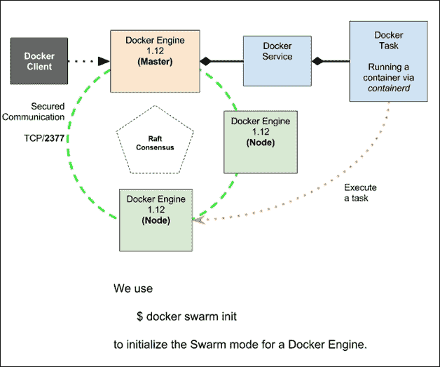

最初的 Swarm v1，我们在[第 1 章](01.html "Chapter 1. Welcome to Docker Swarm")、*中展示过的，现在还在使用的，还没有被弃用。这是一种利用(回收？)较旧的基础设施。但是从 Docker 1.12 开始，新的 Swarm Mode 是开始一个新的编排项目的推荐方式，尤其是如果它需要扩展到很大的规模。*

为了使事情更简单，让我们用一些表格总结一下这些项目之间的差异。

首先，旧的 Swarm v1 与新的 Swarm 模式的对比:

<colgroup><col> <col></colgroup> 
| **集群独立** | **群体模式** |
| 这是自 Docker 1.8 以来可用的 | 这是自 Docker 1.12 以来可用的 |
| 这是一个容器 | 这被集成到 Docker 引擎中 |
| 这需要一个外部发现服务(比如 Consul、Etcd 或 Zookeeper) | 这不需要外部发现服务，集成了 Etcd |
| 默认情况下，这是不安全的 | 默认情况下，这是安全的 |
| 副本和缩放功能不可用 | 副本和缩放功能可用 |
| 没有用于建模微服务的服务和任务概念 | 有现成的服务、任务、负载平衡和服务发现 |
| 没有其他网络可用 | 这集成了 VxLAN(网状网络) |

现在，为了澄清想法，让我们比较一下 SwarmKit 和 Swarm 模式:

<colgroup><col> <col></colgroup> 
| **群组** | **群体模式** |
| 这些是以二进制文件(`swarmd`和`swarmctl`)的形式发布的——使用 swarmctl | 这些都集成到Docker引擎使用Docker |
| 这些是一般任务 | 这些是容器任务 |
| 这些包括服务和任务 | 这些包括服务和任务 |
| 这些不包括服务高级功能，如负载平衡和 VxLAN 网络 | 其中包括现成的服务高级功能，如负载平衡和 VxLAN 网络 |

## 群体模式放大

正如我们在前面的 Swarm 独立模式和 Swarm 模式对比表中总结的那样，Swarm 模式中可用的主要新功能是集成到引擎中，不需要外部发现服务，包括副本、扩展、负载平衡和网络。

### 集成到发动机中

随着 docker 1.12+，一些新的命令被添加到 docker 客户端。我们现在对与这本书相关的内容进行调查。

#### Docker群命令

这是当前管理群的命令:

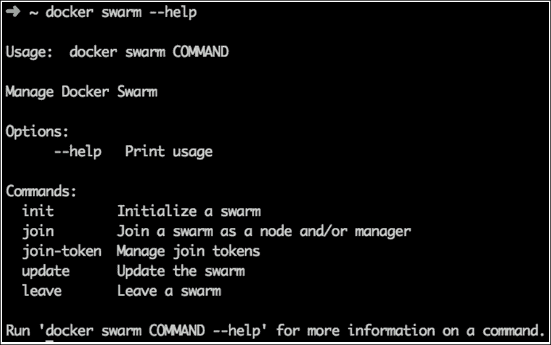

它接受以下选项:

*   `init`:这初始化了一个蜂群。在幕后，这个命令为当前的 Docker 主机创建一个管理器，并生成一个*秘密*(它的密码是工作人员将传递给 API 以便被授权加入集群)。
*   `join`:这是一个工人加入集群时使用的，必须指定*秘密*和一个管理者 IP 端口值列表。
*   `join-token`: This is used to manage the `join-tokens`. `join-tokens` are special token secrets used to make join managers or workers (managers and workers have different token values). This command is a convenient way to make Swarm print the necessary command to join a manager or a worker:

    ```
     docker swarm join-token worker

    ```

    要向该群添加工作人员，请运行以下命令:

    ```
     docker swarm join \ --token SWMTKN-1-  
            36gj6glgi3ub2i28ekm1b1er8aa51vltv00760t7umh3wmo1sc- 
            aucj6a94tqhhn2k0iipnc6096 \ 192.168.65.2:2377
     docker swarm join-token manager

    ```

    要向该群添加管理器，请运行以下命令:

    ```
     docker swarm join \ --token SWMTKN-1- 
            36gj6glgi3ub2i28ekm1b1er8aa51vltv00760t7umh3wmo1sc- 
            98glton0ot50j1yn8eci48rvq \ 192.168.65.2:2377

    ```

*   `update`:这将通过更改集群的一些值来更新集群，例如，您可以使用它来指定证书端点的新 URL
*   `leave`:这命令当前节点离开集群。如果有什么东西阻碍了操作，有一个有用的`--force`选项。

#### Docker节点

这是处理群节点的命令。您必须从管理器启动它，因此您需要连接到管理器才能使用它。

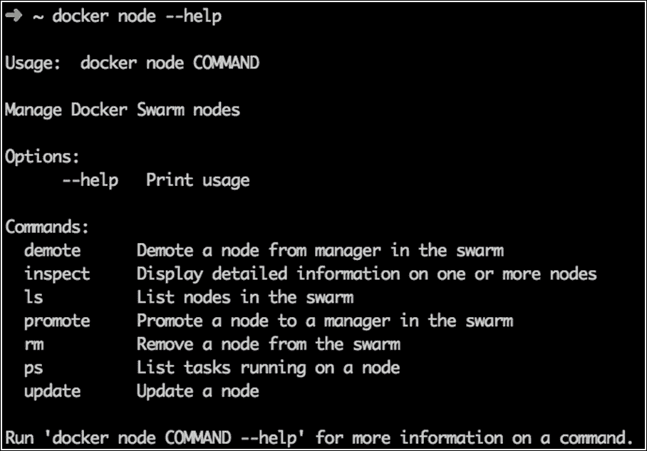

*   `demote`和`promote`:这些是用来管理节点状态的命令。通过这种机制，您可以将节点提升为经理，或者将其降级为工人。实际上，Swarm 会尝试`demote` / `promote`。我们将在本章稍后介绍这个概念。
*   `inspect`:这相当于 docker 信息，但是对于 Swarm 节点。它打印关于节点的信息。
*   `ls`:列出了连接到集群的节点。
*   `rm`:这试图移除一个工人。如果你想删除一个经理，你必须将其降级为工人。
*   `ps`:显示在指定节点上运行的任务列表。
*   `update`:这允许您更改节点的一些配置值，即标签。

#### Docker服务

这是管理群集中运行的服务的命令:

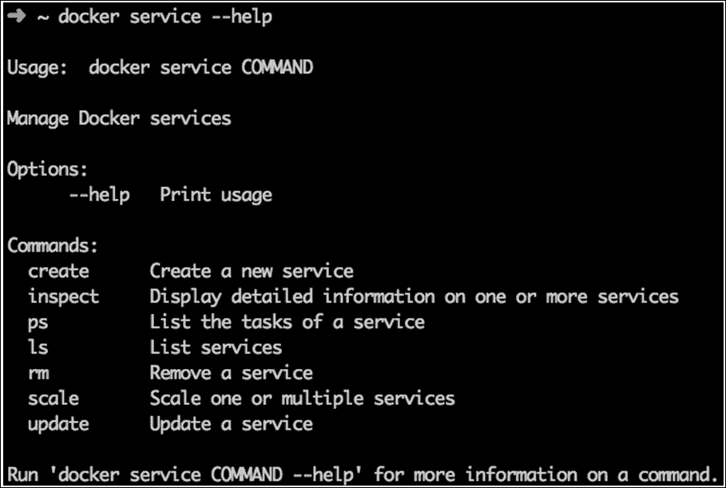

除了预期的`create`、`inspect`、`ps`、`ls`、`rm`、`update`等命令外，还有一个新的有趣的命令:`scale`。

#### Docker栈

不是 Swarm 操作直接必需的，但是在 Docker 1.12 中作为实验引入，有`stack`命令。堆栈现在是一捆捆的容器。例如，一个 nginx + php + mysql 容器设置可以堆叠在一个独立的 Docker Stack 中，称为**分布式应用捆绑包** ( **DAB** )并由一个 JSON 文件描述。

docker 堆栈的核心命令将被部署，这使得创建和更新 DABs 成为可能。稍后我们将在[第 6 章](06.html "Chapter 6. Deploy Real Applications on Swarm")、*中讨论在 Swarm* 上部署真实应用。

### Etcd 的筏已经整合好了

Docker Swarm 模式已经通过 CoreOS Etcd Raft 库集成了 RAFT。不再需要集成外部发现服务，如 Zookeeper 或 Consul。Swarm 直接负责基本服务，如域名系统和负载平衡。

安装群模式集群只需启动 Docker 主机并运行 Docker 命令，设置起来非常简单。

### 负载均衡和 DNS

根据设计，集群管理器为集群中的每个服务分配一个唯一的域名，并使用内部域名系统来平衡运行容器的负载。查询和解决方案会自动开箱即用。

对于使用`--name myservice`创建的每个服务，群中的每个容器都将能够使用 Docker 嵌入式 DNS 服务器解析服务 IP 地址，就像它们解析(`dig myservice`)内部网络名称一样。所以，如果你有一个`nginx-service`(比如用 nginx 容器做的)，你只需要`ping nginx-service`就可以到达前端。

此外，在 Swarm 模式下，运营商有可能将`publish`服务端口连接到外部负载平衡器。然后，港口暴露在从`30000`到`32767`范围内的港口之外。在内部，Swarm 使用 iptables 和 IPVS 分别执行包过滤和转发以及负载平衡。

Iptables 是 Linux 使用的默认包过滤防火墙，而 IPVS 是 Linux 内核中定义的经验丰富的 IP 虚拟服务器，可以用于负载平衡流量，这正是 Docker Swarm 使用的。

使用`--publish-add`选项，在创建或更新新服务时发布端口。使用此选项，可以发布内部服务，并获得负载平衡。

例如，如果我们有一个集群，其中有三个工作人员，每个人运行 nginx(在名为`nginx-service`的服务上)，我们可以通过以下方式向负载平衡器公开他们的目标端口:

```
docker service update --port-add 80 nginx-service

```

这将在任何节点集群上发布的端口`30000`和`nginx`容器(端口 80)之间创建映射。如果您将任何节点连接到端口`30000`，您将会看到 Nginx 欢迎页面。

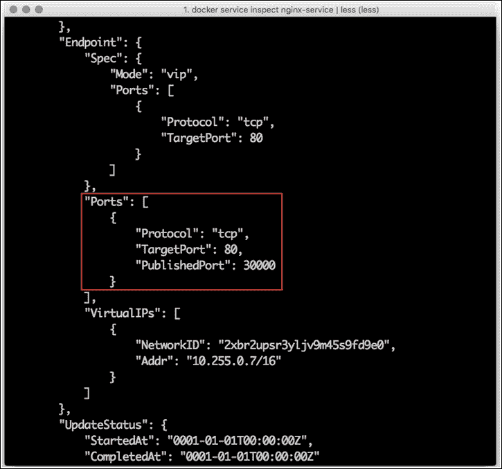

但是这是如何工作的呢？正如您在前面的截图中看到的，有一个关联的虚拟化(T0)，或 VIP，它被配置在覆盖网络 **2xbr2upsr3yl** 上，由 Swarm 创建，用于进入负载平衡器:

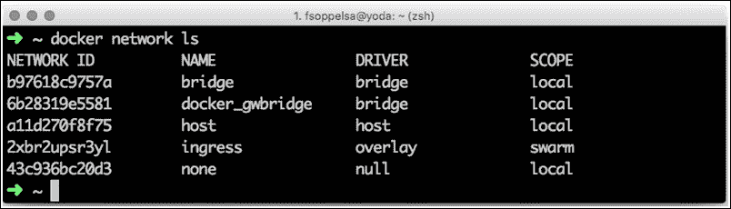

从任何主机，您都可以到达`nginx-service`，因为域名解析为 VIP，这里是 10.255.0.7，充当负载平衡器的前端:

在群的每个节点上，swarm 通过在专用于网络的网络命名空间内的 OUTPUT 链中添加一个 MARK 规则，在内核中，特别是命名空间内实现负载平衡，如下图所示:


稍后，我们将在[第 5 章](05.html "Chapter 5. Administer a Swarm Cluster")、*管理集群*和[第 8 章](08.html "Chapter 8. Exploring Additional Features of Swarm")、*探索集群的其他特性*中更详细地介绍网络概念。

### 升降级

通过`docker node`命令，集群操作员可以将节点从工作人员提升到管理人员，反之亦然，将节点从管理人员降级到工作人员。

将节点从管理器降级为工作器是从集群中删除管理器(现在是工作器)的唯一方法。

我们将在[第 5 章](05.html "Chapter 5. Administer a Swarm Cluster")、*管理蜂群*中详细介绍升级和降级操作。

### 副本和规模

在 Swarm 集群上部署应用意味着定义和配置服务，启动它们，并等待分散在集群中的 Docker 引擎启动容器。我们将在[第 6 章](06.html "Chapter 6. Deploy Real Applications on Swarm")*中在 Swarm* 上部署完整的应用。

### 服务和任务

Swarm 工作负载的核心分为服务。服务只是对任意数量的任务进行分组的抽象(这个数字被称为*副本因子*，或者仅仅是*副本*)。任务正在运行容器。

#### Docker服务规模

使用`docker service scale`命令，您可以命令 Swarm 确保集群上同时运行一定数量的副本。例如，您可以从 10 个容器开始运行一些分布在集群中的*任务*，然后当您需要将它们的大小扩展到 30 时，您只需执行:

```
 docker service scale myservice=30

```

Swarm 被命令调度 20 个新容器，因此它为负载平衡、域名系统和网络一致性做出适当的决定。如果*任务*的容器关闭，使副本因子等于 29，Swarm 将在另一个集群节点上重新计划另一个容器(该节点将有一个新的标识)，以保持因子等于 30。

关于副本和新节点添加的注记。人们经常询问 Swarm 的自动功能。如果您有五个工作人员运行 30 个任务，并添加了五个新节点，您不应该期望 Swarm 自动在新节点之间平衡这 30 个任务，将它们从原始节点移动到新节点。Swarm 调度程序的行为是保守的，直到某个事件(例如，操作员干预)触发新的`scale`命令。只有在这种情况下，调度程序才会考虑五个新节点，并可能在五个新工作节点上启动新的副本任务。

我们将在[第 7 章](07.html "Chapter 7. Scaling Up Your Platform")、*扩展你的平台*中看到`scale`命令在实践中是如何工作的。

# 总结

在这一章中，我们遇到了 Docker 生态系统中的新参与者:SwarmKit 和 Swarm Mode。我们在亚马逊 AWS 上用 Ansible 实现了一个简单的 FlowKit 集群。然后，我们介绍了 Swarm Mode 的基本概念，介绍了它的接口和内部结构，包括 DNS、负载平衡、服务、副本和升级/降级机制。现在，是时候进入真正的群体模式部署了，正如我们将在[第 4 章](04.html "Chapter 4. Creating a Production-Grade Swarm")*中看到的，创建一个生产级群体*。