# 第四章。创建生产级群体

在本章中，您将学习如何创建具有数千个节点的真实 Swarm 集群；具体来说，我们将涵盖以下主题:

*   部署大型集群的工具
*   Swarm2k:有史以来最大的 Swarm 模式集群之一，由 2300 个节点组成
*   Swarm3k:第二个实验，一个有 4700 个节点的集群
*   如何规划硬件资源
*   高可用性集群拓扑
*   群集基础架构管理、网络和安全
*   监控仪表板
*   你从 Swarm2k 和 Swarm3k 实验中学到了什么

# 工具

借助 Swarm 模式，我们可以轻松设计生产级集群。

我们在这里阐述的原则和架构总体上很重要，并为如何设计生产安装奠定了基础，而不管工具是什么。然而，从实用的角度来看，使用的工具也很重要。

在撰写本书时，Docker Machine 并不是用于大型集群设置的理想单一工具，因此我们正在用本书附带的工具演示我们的生产规模部署，我们已经在[第 1 章](01.html "Chapter 1. Welcome to Docker Swarm")、*中介绍了该工具欢迎来到 Docker Swarm*:belt([https://github.com/chanwit/belt](https://github.com/chanwit/belt))。我们将结合 Docker Machine、Docker Networking 和 DigitalOcean 的`doctl`命令使用它。

在[第 5 章](05.html "Chapter 5. Administer a Swarm Cluster")、*管理蜂群*中，你将学习如何能够自动创建蜂群；尤其是，如何快速加入大量具有脚本和其他机制的工作人员，例如 Ansible。

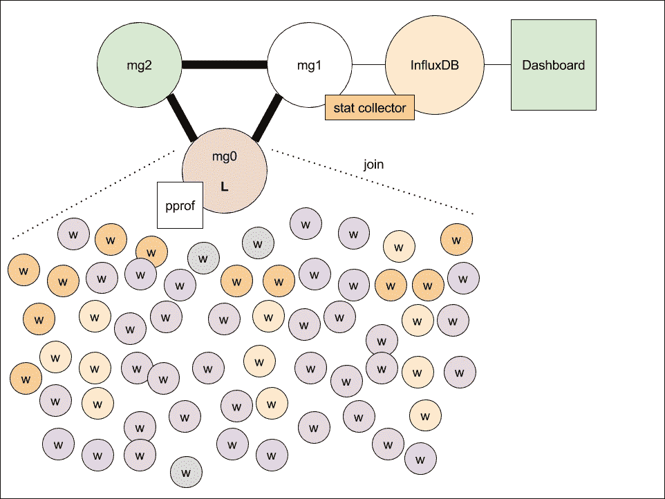

# 集群 2k 的高可用性拓扑

Swarm2k 和 Swarm3k 是协同实验。我们以 Docker Hosts 的形式筹集资金，而不是金钱，并号召大家参与。结果令人惊讶——有几十个个人和公司地理分布的贡献者加入了 Swarm2k 和 Swarm3k。总的来说，对于群集 2k，我们收集了大约 2300 个节点，而对于群集 3k，大约 4700 个。

我们来讨论一下 *Swarm2k* 的架构。在上图中，有三个经理，分别为 **mg0** 、 **mg1** 和 **mg2** 。我们将使用三名经理，因为这是 Docker 核心团队建议的最佳经理人数。管理人员在高速网络链路上形成法定人数，raft 节点使用大量资源来同步其活动。因此，我们决定将我们的经理部署在同一个数据中心的 40GB 以太网链路上。

在实验开始时，我们有以下配置:

*   mg0 是集群的管理者领导者
*   mg1 托管了 stat 收集器
*   mg2 是一个准备好的(后备)经理

相反， **W** 节点是 Swarm 工作人员。

安装在 mg1 上的 stat 收集器从本地 Docker 引擎中查询信息，并将它们发送到远程时间序列数据库 *InfluxDB* 中存储。我们选择了英菲尼克斯数据库，因为它是由我们的监控代理*电信*本地支持的。为了显示集群的统计数据，我们使用了*格拉夫纳*作为仪表板，我们将在后面看到。

## 管理者规范

管理器受 CPU 限制，而不是受内存限制。对于一个 500-1000 节点的 Swarm 集群，我们根据经验观察到三个管理器，每个管理器有 8 个 vCPUs，足以保持负载。但是，如果超过 2000 个节点，我们建议每个管理器至少有 16-20 个 vCPUs，以满足最终的 Raft 恢复。

### 如果是筏式回收

下图显示了硬件升级期间以及大量工作人员加入过程中的 CPU 使用情况。在硬件升级到 8 个虚电路的过程中(机器停机时间由线路断开表示)，我们可以看到当 mg **1** 和 mg **2** 重新加入集群时，领导者 mg0 的 CPU 使用率飙升到 75-90%。触发此峰值的事件是 Raft 日志同步和恢复。

在正常情况下，由于不需要恢复，每个管理器的 CPU 使用率都很低，如下图所示。

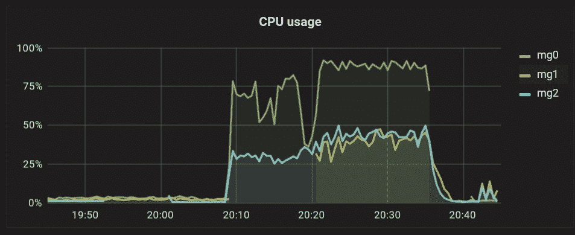

## 筏形文件

在管理主机中，群数据保存在`/var/lib/docker/swarm`中，称为*群目录*。具体来说，Raft 数据保存在`/var/lib/docker/swarm/raft`中，由提前写日志(WAL)和快照文件组成。

在这些文件中，有节点、服务和任务的条目，由 Protobuf 格式定义。

WAL 和快照文件经常被写入磁盘。在 SwarmKit 和 Docker Swarm 模式下，每 10，000 个条目就会写入磁盘。根据这一行为，我们将 swarm 目录映射到一个具有更高吞吐量的快速专用磁盘，特别是固态硬盘。

我们将在[第 5 章](05.html "Chapter 5. Administer a Swarm Cluster")、*管理集群*中解释集群目录损坏时的备份和恢复过程。

## 正在运行的任务

Swarm 集群的目标是运行服务，例如，由大量容器组成的大规模 Web 应用。我们将这种部署类型称为 *Mono* 模型。在这个模型中，网络端口被认为是必须全局发布的资源。在 Docker Swarm Mode 的未来版本中，有了*名称空间*，部署可以在 *Multi* 模型中进行，在该模型中，我们可以有多个子集群，它们为不同的服务公开相同的端口。

在小规模集群中，我们可以决定允许经理谨慎地主持工人任务。相反，对于更大的设置，经理使用更多的资源。此外，如果管理器负载使其资源饱和，集群将变得不稳定和无响应，并且不会接受任何命令。我们称这种状态为*狂暴*T2 状态。

要使一个大型集群(如群集 2k 或群集 3k)保持稳定，所有管理人员的可用性必须设置为“耗尽”状态，这样所有任务就不会安排在他们身上，只安排在工作人员身上，条件是:

```
 docker node update --availability drain node-name

```

## 管理器拓扑

我们将在[第 5 章](05.html "Chapter 5. Administer a Swarm Cluster")、*中再次讨论这个高可用性属性，但是在这里，我们将介绍它来说明一些群拓扑理论。高可用性理论强制要求形成具有奇数个节点的高可用性集群。下表显示了单个数据中心的容错系数。在本章中，我们将称之为 5(1)-3-2 公式，即具有 3 节点仲裁的数据中心的群集大小为 5，允许 2 个节点发生故障:*

<colgroup><col> <col> <col></colgroup> 
| **集群大小** | **号房**号房 | **允许节点故障** |
| three | Two | one |
| five | three | Two |
| seven | four | three |
| nine | five | four |

但是，有几种管理器拓扑可以设计用于具有多个数据中心的生产环境。例如，3(3)个管理器拓扑可以分布为 1 + 1 + 1，而 5(3)个管理器拓扑可以分布为 2 + 2 + 1。下图显示了最佳的 5(3)管理器拓扑:

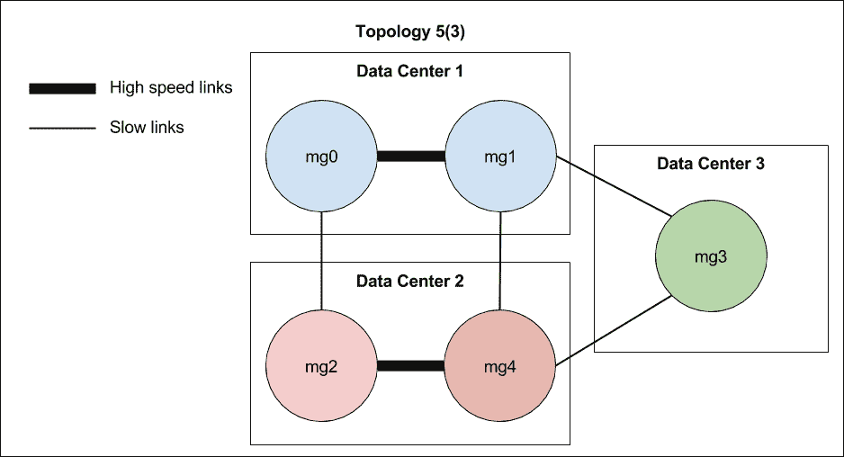

在具有相同容差级别的情况下，下图显示了一个备选的 5(4)拓扑，其中包含 4 个数据中心的 5 个管理器。有 2 个管理器 mg0 和 mg1 在数据中心 1 中运行，而其余管理器 mg2、mg3 和 mg4 分别在数据中心 2、3 和 4 中运行。mg0 和 mg1 管理器连接在高速网络上，而 mg2、mg3 和 mg4 可以使用较慢的链路。因此，跨 3 个数据中心的 2 + 2 + 1 将重新排列为跨 4 个数据中心的 2 + 1 + 1 + 1。

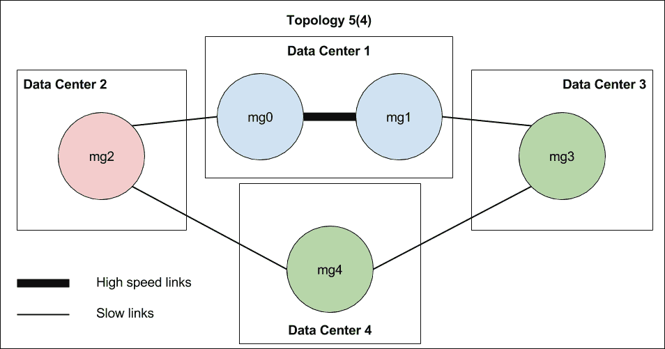

最后，还有另一种分布式拓扑 6(4)，它的性能更高，因为在它的核心，有 3 个节点组成高速链路上的中央仲裁。6 管理器群集需要 4 的仲裁大小。如果数据中心 1 出现故障，群集的控制平面将停止工作。在正常情况下，除主节点外，可以有 2 个节点或 2 个数据中心停机。

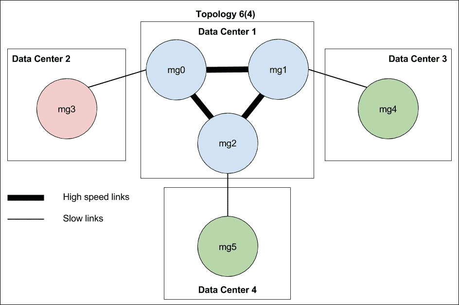

总而言之，只要有可能，就坚持奇数个经理。如果你想要稳定的管理法定人数，形成高速链接。如果你想避免单点故障，尽可能地分布它们。

要确认哪种拓扑适合您，请尝试构建它，并通过有意让一些管理器停机来测试管理器延迟，然后测量它们恢复的速度。

对于群集 2k 和群集 3k，我们选择将所有三个管理器放在一个数据中心来形成拓扑，因为我们希望实现最佳性能。

# 为基础设施配备皮带

首先，我们使用以下命令为数字海洋创建了一个名为`swarm2k`的集群模板:

```
$ belt cluster new --driver digitalocean swarm2k

```

前面的命令在当前目录下创建了一个名为`.belt/swarm2k/config.yml`的配置模板文件。这是我们定义其他属性的起点。

我们检查了我们的集群是否是通过运行以下命令定义的:

```
$ belt cluster ls
CLUSTER       ACTIVE    LEADER    MASTERS    #NODES
swarm2k       -         -         -          0 / 0

```

通过使用命令，我们可以切换和使用可用的`swarm2k`集群，如下所示:

```
$ belt use swarm2k
swarm2k

```

至此，我们细化了`swarm2k`模板的属性。

通过发出以下命令将数字海洋的实例区域设置为`sgp1`:

```
$ belt cluster update region=sgp1

```

用此命令定义所有必要值所需的皮带。以下是我们在`config.yml`中指定的数字海洋驱动程序所需的模板密钥列表:

*   `image`:这是指定数字海洋映像标识或快照标识
*   `region`:指定数字海洋区域，例如 sgp1 或 nyc3
*   `ssh_key_fingerprint`:这是指定数字海洋 SSH 密钥 ID 或指纹
*   `ssh_user`:这是指定镜像使用的用户名，例如 root
*   `access_token`:这是指定 DigitalOcean 的访问令牌；建议不要在这里放任何代币

### 类型

每个模板属性都有其对应的环境变量。例如`access_token`属性可以通过`DIGITALOCEAN_ACCESS_TOKEN`设置。因此，在实践中，我们也可以在继续之前将`DIGITALOCEAN_ACCESS_TOKEN`导出为壳变量。

配置就绪后，我们通过运行以下代码来验证当前的模板属性:

```
$ belt cluster config
digitalocean:
 image: "123456"
 region: sgp1
 ssh_key_fingerprint: "800000"
 ssh_user: root

```

现在，我们使用以下语法创建了一组 3 个 512MB 的管理器节点，称为 mg0、mg1 和 mg2:

```
$ belt create 8192MB mg[0:2]
NAME   IPv4         MEMORY  REGION  IMAGE       STATUS
mg2    128.*.*.11   8192     sgp1   Ubuntu docker-1.12.1 new
mg1    128.*.*.220  8192     sgp1   Ubuntu docker-1.12.1 new
mg0    128.*.*.21   8192     sgp1   Ubuntu docker-1.12.1 new

```

所有新节点都已初始化并进入新状态。

我们可以使用以下命令等待，直到所有 3 个节点变为活动状态:

```
$ belt status --wait active=3
STATUS  #NODES  NAMES
new         3   mg2, mg1, mg0
STATUS  #NODES  NAMES
new         3   mg2, mg1, mg0
STATUS  #NODES  NAMES
new         3   mg2, mg1, mg0
STATUS  #NODES  NAMES
active      3   mg2, mg1, mg0

```

然后，我们将 node1 设置为主动管理器主机，我们的 Swarm 将准备好形成。可以通过运行 active 命令来设置活动主机，如下所示:

```
$ belt active mg0
swarm2k/mg0

```

在这一点上，我们形成了一个群体。我们将 mg0 初始化为经理领导，如下所示:

```
$ belt docker swarm init --advertise-addr 128.*.*.220
Swarm initialized: current node (24j7sytbomhshtayt74lf7njo) is now 
    a manager.

```

前面的命令输出要复制和粘贴的字符串，以连接其他经理和员工，例如，看一下下面的命令:

```
 docker swarm join \
 --token SWMTKN-1-1wwyxnfcgqt...fwzc1in3 \
 128.*.*.220:2377

```

Belt 提供了一个便捷的快捷方式，通过以下语法连接节点，这就是我们用来将 mg1 和 mg2 连接到群的方法。：

```
$ belt --host mg[1:2] docker swarm join \
 --token --token SWMTKN-1-1wwyxnfcgqt...fwzc1in3 \
 128.*.*.220:2377

```

现在，我们已经配置了 mg0、mg1 和 mg2 管理器，并准备好接收大批工作人员。

# 用Docker机器保护经理

Docker Machine 不能很好地扩展到大规模的 Docker Engine 部署，但是它对于自动保护少量节点非常有用。在下一节中，我们将使用 Docker Machine 使用通用驱动程序来保护我们的 Swarm 管理器，该驱动程序允许我们控制现有的主机。

在我们的例子中，我们已经在 mg0 上设置了一个 Docker Swarm 管理器。此外，我们希望通过为其远程端点启用 TLS 连接来保护 Docker 引擎。

Docker Machine 如何为我们做这项工作？首先，Docker Machine 通过 SSH 连接到主机；检测 mg0 的操作系统，在我们这里是 Ubuntu 在我们的例子中，供应方是系统。

之后，安装 Docker 引擎；但是，如果一个已经在适当的位置，像这里，它将跳过这一步。

然后，作为最重要的部分，它生成一个根证书颁发机构证书以及所有证书，并将它们存储在主机上。它还会自动配置 Docker 来使用这些证书。最后，它重新启动 Docker。

如果一切顺利，Docker 引擎将在启用 TLS 的情况下再次启动。

然后，我们使用 Docker Machine 为 mg0、mg1 和 mg2 上的引擎生成根 CA，并配置 TLS 连接。然后，我们后来使用 Docker 客户端来进一步控制 Swarm，而不需要 SSH，后者速度较慢。

```
$ docker-machine create \
 --driver generic \
 --generic-ip-address=$(belt ip mg0) mg0
Running pre-create checks...
Creating machine...
(mg0) No SSH key specified. Assuming an existing key at the default 
    location.
Waiting for machine to be running, this may take a few minutes...
Detecting operating system of created instance...
Waiting for SSH to be available...
Detecting the provisioner...
Provisioning with ubuntu(systemd)...
Installing Docker...
Copying certs to the local machine directory...
Copying certs to the remote machine...
Setting Docker configuration on the remote daemon...
Checking connection to Docker...
Then we can test our working swarm with `docker info`. We grep only 
    15 lines for the brevity.
$ docker $(docker-machine config mg0) info | grep -A 15 Swarm
Swarm: active
 NodeID: 24j7sytbomhshtayt74lf7njo
 Is Manager: true
 ClusterID: 8rshkwfq4hsil2tdb3idpqdeg
 Managers: 3
 Nodes: 3
 Orchestration:
 Task History Retention Limit: 5
 Raft:
 Snapshot Interval: 10000
 Heartbeat Tick: 1
 Election Tick: 3
 Dispatcher:
 Heartbeat Period: 5 seconds
 CA Configuration:
 Expiry Duration: 3 months

```

此外，`docker node ls`在这种设置下将正常工作我们现在验证了 3 个经理组成了最初的群体，并且能够接受一群工人:

```
$ docker $(docker-machine config mg0) node ls
ID                       HOSTNAME  STATUS  AVAILABILITY  MANAGER STATUS
24j7sytbomhshtayt74lf7njo *  mg0       Ready   Active        Leader
2a4jcvp32aoa6olaxlelthkws    mg1       Ready   Active        Reachable
94po1ln0j0g5fgjnjfvm1w02r    mg2       Ready   Active        Reachable

```

### 类型

**这个集群有多安全？**

我们将使用 Docker 客户端连接到配备 Docker 引擎的 TLS 此外，群的节点之间还有另一个 TLS 连接，CA 将在三个月后到期，它将自动轮换。高级安全设置将在[第 9 章](09.html "Chapter 9. Securing a Swarm Cluster and the Docker Software Supply Chain")、*中讨论，以保护集群和 Docker 软件供应链*。

# 了解一些群体内部

在这一点上，我们通过创建具有 3 个副本的服务 nginx 来检查 Swarm 是否有效:

```
$ eval $(docker-machine env mg0)
$ docker service create --name nginx --replicas 3 nginx
du2luca34cmy

```

之后，我们找到了运行 Nginx 的网络命名空间标识在哪里。我们通过 SSH 连接到 mg0，通过 SSH 连接到 mg0。Swarm 的路由网格的网络名称空间与特殊网络名称空间`1-5t4znibozx`具有相同的时间戳。在这个例子中，我们要寻找的命名空间是`fe3714ca42d0`。

```
root@mg0:~# ls /var/run/docker/netns -al
total 0
drwxr-xr-x 2 root root 120 Aug 22 15:38 .
drwx------ 5 root root 100 Aug 22 13:39 ..
-r--r--r-- 1 root root   0 Aug 22 15:17 1-5t4znibozx
-r--r--r-- 1 root root   0 Aug 22 15:36 d9ef48834a31
-r--r--r-- 1 root root   0 Aug 22 15:17 fe3714ca42d0

```

我们可以用 ipvsadm 计算出我们的 IPVS 条目，并使用 nsenter 工具([https://github.com/jpetazzo/nsenter](https://github.com/jpetazzo/nsenter))在网络命名空间内运行它，如下所示:

```
root@node1:~# nsenter --net=/var/run/docker/netns/fe3714ca42d0 ipvsadm -L
IP Virtual Server version 1.2.1 (size=4096)
Prot LocalAddress:Port Scheduler Flags
 -> RemoteAddress:Port           Forward Weight ActiveConn InActConn
FWM  259 rr
 -> 10.255.0.8:0                 Masq    1      0          2

```

在这里，我们可以注意到有一个活跃的循环 IPVS 条目。IPVS 是内核级负载平衡器，它被 Swarm 用来与 iptables 一起平衡流量，iptables 用于转发和过滤数据包。

清理 nginx 测试服务(`docker service rm nginx`)后，我们将管理人员设置为 Drain 模式，以避免他们承担任务:

```
$ docker node update --availability drain mg0
$ docker node update --availability drain mg1
$ docker node update --availability drain mg2

```

现在，我们准备在推特和 Github 上宣布我们的经理的可用性，并开始实验！

## 加入工人

我们的贡献者开始将他们的节点作为工人加入到管理 mg0 中。任何人都使用自己喜欢的方法，包括以下几种:

*   循环`docker-machine ssh sudo docker swarm join`命令
*   Ansible
*   自定义脚本和程序

我们将在[第 5 章](05.html "Chapter 5. Administer a Swarm Cluster")、*管理蜂群*中介绍其中的一些方法。

过了一段时间，我们达到了 2300 名工人的配额，推出了复制因子为 10 万的**高山**服务:

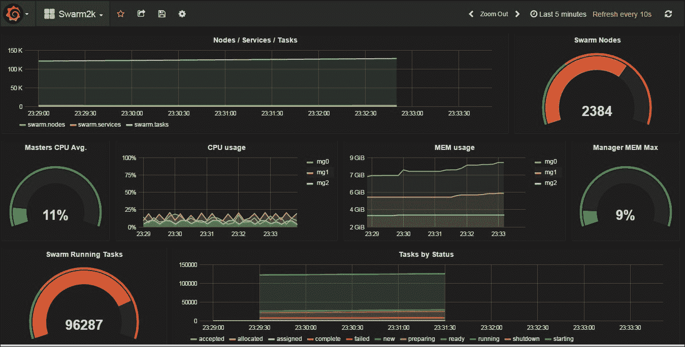

## 升级经理

一段时间后，我们达到了经理的最大能力，我们不得不增加他们的物理资源。经理的实时升级和维护可能是生产中的预期操作。我们是这样做的。

### 经理的实时升级

法定人数为奇数时，可以安全地将经理降级进行维护。

```
$ docker node ls
ID                  HOSTNAME  STATUS  AVAILABILITY  MANAGER STATUS
4viybni..h24zxde    mg1       Ready   Active        Reachable
6xxwumb..j6zvtyg *  mg0       Ready   Active        Leader
f1vs2e3..abdehnh    mg2       Ready   Active

```

在这里，我们将 mg1 作为可访问的管理器，并使用以下语法将其降级为 worker:

```
$ docker node demote mg1
Manager mg1 demoted in the swarm.

```

我们可以看到`mg1`的`Reachable`状态在成为工作者时从节点 ls 输出中消失。

```
$ docker node ls
ID                  HOSTNAME  STATUS  AVAILABILITY  MANAGER STATUS
4viybni..h24zxde    mg1       Ready   Active 
6xxwumb..j6zvtyg *  mg0       Ready   Active        Leader
f1vs2e3..abdehnh    mg2       Ready   Active 

```

当节点不再是管理器时，关闭它是安全的，例如，使用 DigitalOcean CLI，正如我们所做的:

```
$ doctl compute droplet-action shutdown 23362382

```

列出节点后，我们注意到 mg1 已经关闭。

```
$ docker node ls
ID                   HOSTNAME  STATUS  AVAILABILITY  MANAGER STATUS
4viybni0ud2gjpay6ih24zxde    mg1       Down    Active
6xxwumbdac34bbgh6hj6zvtyg *  mg0       Ready   Active        Leader
f1vs2e3hjiqjaukmjqabdehnh    mg2       Ready   Active

```

我们升级了它的资源，使其具有 16G 内存，然后我们再次启动机器:

```
$ doctl -c .doctlcfg compute droplet-action power-on 23362382

```

当这次列出时，我们可以预期一些延迟，因为 mg1 正在返回并重新进入集群。

```
$ docker node ls
ID                  HOSTNAME  STATUS  AVAILABILITY  MANAGER STATUS
4viybni..h24zxde    mg1       Ready   Active 
6xxwumb..j6zvtyg *  mg0       Ready   Active        Leader
f1vs2e3..abdehnh    mg2       Ready   Active

```

最后，我们可以将其提升回经理，如下所示:

```
$ docker node promote mg1
Node mg1 promoted to a manager in the swarm.

```

完成后，集群将正常运行。所以，我们对 mg0 和 mg2 重复操作。

# 监测群 2k

对于生产级集群，我们通常希望设置某种监控。到目前为止，还没有一种特定的方法可以在 Swarm 模式下监控 Docker 服务和任务。我们用 Telegraf、InfluxDB 和 Grafana 为 Swarm2k 做了这个。

## 流入数据库时间序列数据库

InfluxDB 是一个时间序列数据库，因为没有依赖性，所以很容易安装。InfluxDB 有助于存储指标、事件信息，并用于以后的分析。对于群集 2k，我们使用 InfluxDB 存储集群、节点、事件的信息，并使用 Telegraf 存储任务的信息。

Telegraf 是可插拔的，并且有一定数量的输入插件，对观察系统环境很有用。

### telegraph Swarm 插件

我们为 Telegraf 开发了一个新的插件，将统计数据存储到 InfluxDB 中。这个插件可以在[http://github.com/chanwit/telegraf](http://github.com/chanwit/telegraf)找到。数据可能包含*值*、*标签*和*时间戳*。将根据时间戳计算或汇总值。此外，标签将允许您根据时间戳将这些值组合在一起。

Telegraf Swarm 插件收集数据并创建以下包含值的系列，我们确定这些值是对 InfluxDB 中的 Swarmk2、标签和时间戳最感兴趣的:

*   系列`swarm_node`:该系列包含`cpu_shares`和`memory`作为值，允许您按`node_id`和`node_hostname`标签分组。
*   系列`swarm`:该系列包含节点数的【n_nodes】、服务数的`n_services`和任务数的`n_tasks`。本系列不包含标签。
*   系列`swarm_task_status`:该系列包含一次按状态分组的任务数。该系列的标签是任务状态名称，例如“已启动”、“正在运行”和“失败”。

要启用 Telegraf Swarm 插件，我们需要通过添加以下配置来调整`telegraf.conf`:

```
# Read metrics about swarm tasks and services
[[inputs.swarm]]
  # Docker Endpoint
  #   To use TCP, set endpoint = "tcp://[ip]:[port]"
#   To use environment variables (ie, docker-machine), set endpoint = 
 "ENV"
  endpoint = "unix:///var/run/docker.sock"
  timeout = “10s”

```

首先，按如下方式设置一个 InfluxDB 实例:

```
 $ docker run -d \
 -p 8083:8083 \
 -p 8086:8086 \
 --expose 8090 \
 --expose 8099 \
 -e PRE_CREATE_DB=telegraf \
 --name influxsrv
 tutum/influxdb

```

然后，设置一个 Grafana 实例，如下所示:

```
docker run -d \
 -p 80:3000 \
 -e HTTP_USER=admin \
 -e HTTP_PASS=admin \
 -e INFLUXDB_HOST=$(belt ip influxdb) \
 -e INFLUXDB_PORT=8086 \
 -e INFLUXDB_NAME=telegraf \
 -e INFLUXDB_USER=root \
 -e INFLUXDB_PASS=root \
 --name grafana \
 grafana/grafana

```

在我们设置了 Grafana 的实例之后，我们可以从以下 JSON 配置创建仪表板:

[https://objects-us-west-1 . dream . io/swarm 2k/swarm 2k _ final _ grafana _ dashboard . JSON](https://objects-us-west-1.dream.io/swarm2k/swarm2k_final_grafana_dashboard.json)

要将仪表板连接到 InfluxDB，我们必须定义默认数据源，并将其指向 InfluxDB 主机端口`8086`。下面是定义数据源的 JSON 配置。将`$INFLUX_DB_IP`替换为您的英菲尼克斯数据库实例。

```
{
 "name":"telegraf",
 "type":"influxdb",
 "access":"proxy",
 "url":"http://$INFLUX_DB_IP:8086",
 "user":"root",
 "password":"root",
 "database":"telegraf",
 "basicAuth":true,
 "basicAuthUser":"admin",
 "basicAuthPassword":"admin",
 "withCredentials":false,
 "isDefault":true
}

```

将所有内容链接在一起后，我们会看到一个如下所示的仪表板:


# Swarm3k

Swarm3k 是第二个试图用 Swarm 模式形成一个非常大的 Docker 集群的合作项目。该项目于 2016 年 10 月 28 日启动，超过 50 名个人和公司加入了该项目。

Sematext 是最早通过提供 Docker 监控和日志解决方案来帮助我们的公司之一。它们成为了 Swarm3k 的官方监控系统。斯特凡、奥蒂斯和他们的团队从一开始就为我们提供了极好的支持。

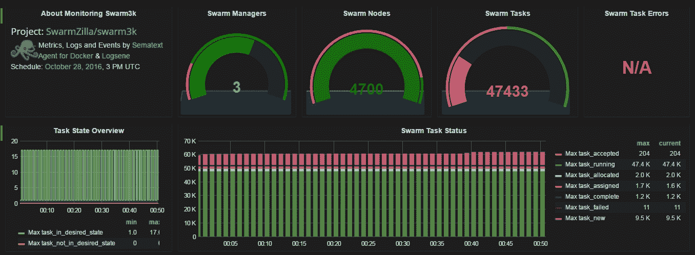

*Sematext Dashboard*

Sematext 是目前唯一一家允许我们将监控代理部署为全球 Docker 服务的 Docker 监控公司。这种部署模式大大简化了监控过程。

## 群集 3k 设置和工作负载

我们的目标是 3000 个节点，但最终，我们成功地形成了一个工作的、地理上分布的 4700 节点 Docker Swarm 集群。

管理人员的规格是同一数据中心的高内存 128GB 数字海洋节点，每个节点有 16 个虚拟存储库。

集群初始化配置包括一个未记录的“KeepOldSnapshots”，它告诉 Swarm 模式不要删除，而是保留所有数据快照供以后分析。每个管理器的 Docker 守护程序都是在 DEBUG 模式下启动的，以便随时获取更多信息..

正如我们在上一节中所展示的，我们使用 belt 来设置经理，并等待贡献者加入他们的员工。

Docker 1.12.3 用于经理，而 workers 是 1.12.2 和 1.12.3 的混合。我们在*入口*和*覆盖*网络上组织服务。

我们计划了以下两种工作负载:

*   带有 Wordpress 集群的 MySQL
*   C1M(100 万容器)

25 个节点旨在形成一个 MySQL 集群。首先，我们创建了一个覆盖网络`mydb`:

```
$ docker network create -d overlay mydb

```

然后，我们准备了以下`entrypoint.sh`脚本:

```
#!/bin/bash
ETCD_SUBNET=${ETCD_SUBNET:-10.0.0.0}
ETCD_HOST=$(ip route get $ETCD_SUBNET | awk 'NR==1 {print $NF}')
/usr/local/bin/etcd \
 -name etcd0 \
 -advertise-client-urls 
       http://${ETCD_HOST}:2379,http://${ETCD_HOST}:4001 \
 -listen-client-urls http://0.0.0.0:2379,http://0.0.0.0:4001 \
 -initial-advertise-peer-urls http://${ETCD_HOST}:2380 \
 -listen-peer-urls http://0.0.0.0:2380 \
 -initial-cluster-token etcd-cluster-1 \
 -initial-cluster etcd0=http://${ETCD_HOST}:2380 \
 -initial-cluster-state new

```

然后，我们将为我们的特殊版本的 Etcd 准备一个新的 Dockerfile，如下所示:

```
FROM quay.io/coreos/etcd
COPY entrypoint.sh /usr/local/bin/entrypoint.sh
RUN  chmod +x /usr/local/bin/entrypoint.sh
ENTRYPOINT ['/usr/local/bin/entrypoint.sh'] 

```

开始使用前别忘了用`$ docker build -t chanwit/etcd.`来打造。

第三，我们启动了一个 Etcd 节点，作为 MySQL 集群的中心发现服务，如下所示:

```
$ docker service create --name etcd --network mydb chanwit/etcd

```

通过检查 Etcd 的虚拟 IP，我们将获得如下服务 VIP:

```
$ docker service inspect etcd -f "{{ .Endpoint.VirtualIPs }}"
[{... 10.0.0.2/24}]

```

有了这些信息，我们创建了我们的`mysql`服务，它可以在任何程度上扩展。看看下面的例子:

```
docker service create \
--name mysql \
-p 3306:3306 \
--network mydb \
--env MYSQL_ROOT_PASSWORD=mypassword \
--env DISCOVERY_SERVICE=10.0.0.2:2379 \
--env XTRABACKUP_PASSWORD=mypassword \
--env CLUSTER_NAME=galera \
--mount "type=bind,src=/var/lib/mysql,dst=/var/lib/mysql" \
perconalab/percona-xtradb-cluster:5.6

```

由于 Libnetwork 错误，我们在 mynet 和入口网络中都遇到了一些 IP 地址问题；查看[https://github.com/docker/docker/issues/24637](https://github.com/docker/docker/issues/24637)了解更多信息。我们通过将集群只绑定到一个*单个*覆盖网络`mydb.`来解决这个问题

现在，我们尝试了一个 WordPress 容器的复制因子为 1 的`docker service create`。我们故意没有控制 Wordpress 容器将被安排在哪里。然而，当我们试图将这个 Wordpress 服务连接到 MySQL 服务时，连接多次超时。我们的结论是，对于这种规模的 Wordpress + MySQL 组合，最好对集群施加一些限制，使所有服务在同一个数据中心一起运行。

## 大规模群体表现

您还从这个问题中了解到，覆盖网络的性能在很大程度上取决于每台主机上网络配置的正确调整。正如一位 Docker 工程师所建议的，当 ARP 请求太多(网络很大)并且每台主机都无法回复时，我们可能会遇到“邻居表溢出”错误。这些是我们在 Docker 主机上增加的可调参数，用于修复以下行为:

```
net.ipv4.neigh.default.gc_thresh1 = 30000 
    net.ipv4.neigh.default.gc_thresh2 = 32000    
    net.ipv4.neigh.default.gc_thresh3 = 32768

```

这里，`gc_thresh1`是期望的主机数量，`gc_thresh2`是软限制，`gc_thresh3`是硬限制。

因此，当 MySQL + Wordpress 测试失败时，我们改变了计划，在路由网格上实验 NGINX。

入口网络设置有/16 池，因此最多可容纳 64，000 个 IP 地址。根据亚历克斯·埃利斯的建议，我们从 4000 英镑(4000 英镑！)集群上的 NGINX 容器。在这个测试中，节点仍然进进出出。最终，几分钟后，NGINX 服务启动，路由网格形成。即使某些节点不断出现故障，它也能正常工作，因此该测试验证了 1.12.3 中的路由网格是坚如磐石的，并且已经为生产做好了准备。然后我们停止了 NGINX 服务，开始测试尽可能多的容器的调度，目标是 100 万个，一百万个。

因此，我们创建了一个“高山之巅”服务，就像我们为 Swarm2k 所做的那样。但是，这次的调度速度稍微慢了一点。我们在大约 30 分钟内到达了 47，000 个容器。因此，我们预计用 1，000，000 个容器填满集群大约需要 10.6 小时。

由于预计这需要太多时间，我们决定再次改变计划，购买 7 万个容器。

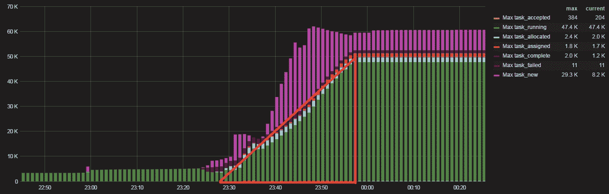

调度大量容器(**Docker规模 alpine=70000** )使集群不堪重负。这创建了一个巨大的调度队列，在所有 70，000 个容器完成调度之前，该队列不会提交。因此，当我们决定关闭管理器时，所有的调度任务都消失了，集群变得不稳定，因为 Raft 日志被破坏了。

在途中，我们希望通过收集 CPU 配置文件信息来检查的最有趣的事情之一是查看哪些 Swarm 原语正在更多地加载集群。

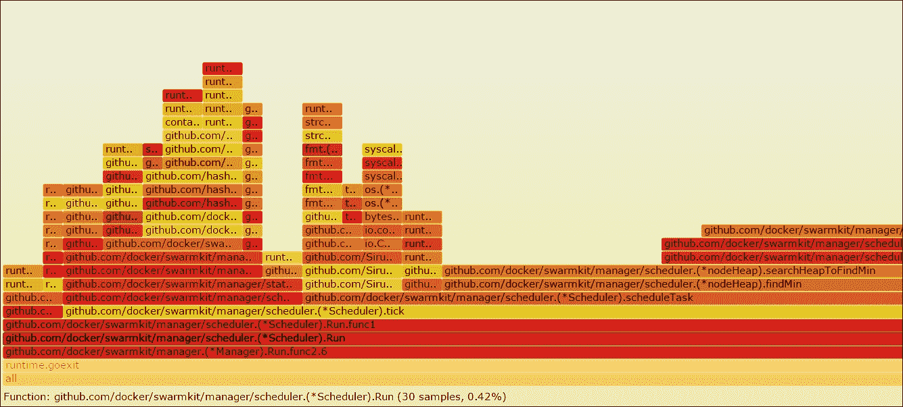

在这里，我们可以看到只有 0.42%的 CPU 花在了调度算法上。我们通过一些近似得出结论，1.12 版本中的 Docker Swarm 调度算法相当快。这意味着有机会引入更复杂的调度算法，通过增加一些可接受的开销，可以在 Swarm 的未来版本中获得更好的资源利用率。

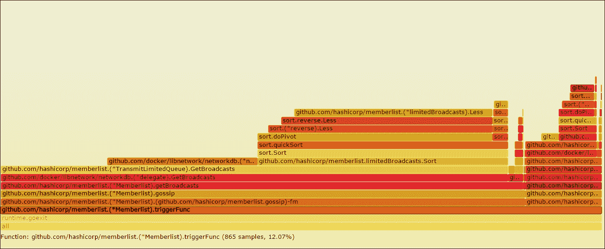

此外，我们发现大量的 CPU 周期花费在节点通信上。在这里，我们可以看到 list 成员列表层。它使用了大约 12%的总 CPU。

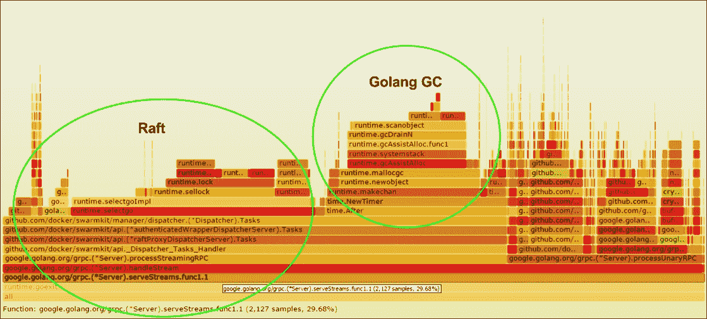

然而，似乎主要的 CPU 消费者是 Raft，它也在这里显著地调用了 Go 垃圾收集器。这使用了大约 30%的总 CPU。

# Swarm2k 和 Swarm3k 的经验教训

以下是你从这些实验中学到的总结:

*   对于一大群工人来说，管理者需要大量的 CPU。每当 Raft 恢复过程开始时，CPU 就会激增。
*   如果领先的管理器死亡，最好在那个节点上停止 Docker，等待集群再次变得稳定，使用 n-1 个管理器。
*   尽可能减少快照保留。默认的 Docker Swarm 配置就可以了。持久化 Raft 快照会使用额外的 CPU。
*   数千个节点需要管理大量资源，包括 CPU 和网络带宽。尝试保持服务和管理器的拓扑在地理上紧凑。
*   数十万个任务需要高内存节点。
*   现在，为了稳定的生产设置，建议最多使用 500-1000 个节点。
*   如果经理们似乎被卡住了，等待；他们最终会康复的。
*   `advertise-addr`参数是路由网格工作所必需的。
*   将计算节点尽可能靠近数据节点。覆盖网络很棒，需要对所有主机的 Linux 网络配置进行调整，以使其发挥最佳作用。
*   Docker群体模式是稳健的。即使不可预测的网络将这个巨大的集群连接在一起，也没有任务失败。

对于 Swarm3k，我们要感谢所有的英雄:`@FlorianHeigl`；`@jmaitrehenry`来自 PetalMD`@everett_toews`来自泰国互联网 Rackspace`@squeaky_pl`、`@neverlock`、`@tomwillfixit`来自 Demonware`@sujaypillai`来自贾比尔；`@pilgrimstack`来自 OVH；`@ajeetsraina`来自 Collabnix`@AorJoa`和`@PNgoenthai`来自艾雅拉集群；`@GroupSprint3r`、`@toughIQ`、`@mrnonaki`、`@zinuzoid`来自 HotelQuickly`@_EthanHunt_`；`@packethost`来自 Packet.io`@ContainerizeT-ContainerizeThis`、大会；`@_pascalandy`来自 FirePress@来自 TRAXxs 的 lucjuggery@ alexellisuk@来自湖里的斯维加；@ BretFisher`@voodootikigod`来自新兴技术顾问；`@AlexPostID`；`@gianarb`出自 ThumpFlow`@Rucknar`、`@lherrerabenitez`；`@abhisak`来自帕尼科技；和耐克威集团的`@djalal`。

我们还要再次感谢 Sematext 提供了一流的 Docker 监控系统；和数字海洋为我们提供所有资源。

# 总结

在这一章中，我们向您展示了如何使用传送带在数字海洋上部署两个巨大的 Swarm 集群。这些故事给了你很多可以学习的东西。我们总结了经验教训，并概述了运行大规模生产群的一些技巧。在旅途中，我们还引入了一些 Swarm 特性，例如服务和安全性，并讨论了管理器的拓扑结构。在下一章中，我们将详细讨论如何管理 Swarm。包括的主题将是使用皮带、脚本和 Ansible 部署工人、管理节点、监控和图形界面。