# 第七章。扩展您的平台

在本章中，我们将扩展我们在[第 6 章](06.html "Chapter 6. Deploy Real Applications on Swarm")、*中看到的在 Swarm* 上部署真实应用。我们的目标是在 Swarm 之上部署一个实际的生产级 Spark 集群，增加存储容量，启动一些 Spark 作业，并为底层基础架构设置监控。

为此，本章主要面向基础设施。事实上，我们将看到如何将 **Libnetwork** 、 **Flocker** 和 **Prometheus** 与 Swarm 联合起来。

对于网络，我们将使用基于 Libnetwork 的基本 Docker 网络覆盖系统。有一些很棒的网络插件，比如 Weave 和其他插件，但是要么它们还不兼容新的 Docker Swarm 模式，要么它们被 Swarm 集成的路由网格机制淘汰了。

仓储方面，情况比较红火，因为选择多了很多(参考[https://docs.docker.com/engine/extend/plugins/](https://docs.docker.com/engine/extend/plugins/))。我们和弗洛克一起去。Flocker 是 Docker 存储的“T2”祖父，可以配置大量存储后端，使其成为生产负载的最佳选择之一。被弗洛克的复杂性吓到了？不合理:我们将在几分钟内看到如何为任何用途设置多节点 Flocker 集群。

对于监控，最后我们来介绍一下普罗米修斯。它是目前 Docker 可用的监控系统中最有前途的，它的 API 可能很快就会集成到 Docker 引擎中。

因此，我们将在这里介绍:

*   Swarm 上的火花示例，准备运行任何火花作业
*   大规模自动安装用于基础设施的 Flocker
*   演示如何在本地使用 Flocker
*   在群体模式下使用闪烁
*   扩展我们的火花应用
*   使用普罗米修斯监控此基础架构的运行状况

# 火花的例子，又来了

我们将重新构建[第 6 章](06.html "Chapter 6. Deploy Real Applications on Swarm")、*在 Swarm* 上部署真实应用的示例，因此我们将在 Swarm 上部署 Spark，但这次采用的是真实的网络和存储设置。

Spark 存储后端通常运行在 Hadoop 上，或者在文件系统上运行在 NFS 上。对于不需要存储的作业，Spark 将在 workers 上创建本地数据，但是对于存储计算，您将需要每个节点上的共享文件系统，这不能由 Docker 卷插件自动保证(至少到目前为止)。

在 Swarm 上实现这一目标的一种可能性是在每个 Docker 主机上创建 NFS 共享，然后将它们透明地安装在服务容器中。

我们这里的重点不是说明 Spark 的工作细节及其存储组织，而是为 Docker 引入一个固执己见的存储选项，并给出如何在 Docker Swarm 上组织和扩展一个相当复杂的服务的想法。

# 坞站插件

关于 Docker 插件的详细介绍，我们可以建议阅读官方文档页面。这里有一个起点[https://docs.docker.com/engine/extend/](https://docs.docker.com/engine/extend/)还有，Docker 很可能会发布一个工具，用一个命令就能获得插件，参考[https://docs . Docker . com/engine/reference/command line/plugin _ install/](https://docs.docker.com/engine/reference/commandline/plugin_install/)。

如果你想探索如何将新功能集成到 Docker 中，我们建议你参考*扩展 Docker* 一书，Packt。这本书的重点是 Docker 插件，卷插件，网络插件，以及如何创建自己的插件。

对于 Flocker， **ClusterHQ** 提供了一种自动部署机制，可以使用 **CloudForm** 模板在 AWS 上部署 Flocker 集群，您可以使用 **Volume Hub** 安装该模板。注册和启动这样一个集群，请访问[https://flocker-docs . cluster HQ . com/en/latest/docker-integration/cloud formation . html](https://flocker-docs.clusterhq.com/en/latest/docker-integration/cloudformation.html)。有关详细程序的分步说明，请参考 Packt 的*扩展 Docker* 的第 3 章。

这里我们将手动进行，因为我们必须集成 Flocker 和 Swarm。

# 实验室

在本教程中，我们将在 AWS 上创建基础架构。理想情况下，对于生产环境，您应该设置三个或五个 Swarm 管理器和一些工作人员，并最终根据负载在以后添加新的工作人员节点。

这里我们将设置一个 Swarm 集群，其中有三个 Swarm 管理器、六个 Swarm 工作器和一个带有 Machine 的 Flocker 控制节点，并且不会添加新的工作器。

安装 Flocker 需要几个手动步骤，这些步骤可以是自动化的(正如我们将看到的)。因此，为了使示例尽可能不那么复杂，我们将首先以线性顺序运行所有这些命令，而不重复增加系统容量的过程。

如果你不喜欢 Ansible，可以很容易地将流程适配到你喜欢的工具上，无论是**木偶**、**盐**、**厨师**还是其他。

## 一把独特的钥匙

为了简单起见，我们将使用临时生成的 SSH 密钥来安装我们的实验室，并且我们将安装 Docker Machines，该密钥复制到`authorized_keys`中的主机。我们的目标是拥有一个唯一的密钥来在以后验证 Ansible，我们将使用它来自动化许多我们应该手动执行的步骤。

因此，我们首先生成一个`flocker`键，并将其放入`keys/`目录:

```
ssh-keygen -t rsa -f keys/flocker

```

## Docker机器

为了配置我们的 Docker 主机，我们将使用 Docker Machine。以下是本教程的系统详细信息:

AWS 实例将从 aws-101 调用到 aws-110。稍后，当我们需要为 Flocker 生成和创建节点证书时，这种标准化命名将非常重要:

*   节点 aws-101、102、103 将是我们的 Swarm 管理器
*   节点 aws-104 将是弗洛克控制节点
*   从 aws-105 到 aws-110 的节点将是我们的 Swarm 工作人员。

实例类型为`t2.medium` (2 个 vCPUs，4G 内存，EBS 存储)

味道将是 Ubuntu 14.04 Trusty(用`--amazonec2-ami`参数指定)

安全组将是标准`docker-machine`(几秒钟后我们将再次总结需求)

弗洛克版本将是 1.15。

具体使用的 AMI ID 可以在[https://cloud-images.ubuntu.com/locator/ec2/](https://cloud-images.ubuntu.com/locator/ec2/)上搜索。

AWS 计算器计算出该设置的成本约为每月 380 美元，不包括存储使用。


因此，我们创建了基础设施:

```
for i in `seq 101 110`; do
docker-machine create -d amazonec2 \
--amazonec2-ami ami-c9580bde \
--amazonec2-ssh-keypath keys/flocker \
--amazonec2-instance-type "t2.medium" \
aws-$i;
done

```

跑步。

一段时间后，我们会让它开始运行。

## 安全组

此外，我们还需要在 EC2 控制台的安全组中打开三个新端口，用于本项目(`docker-machine`)。Flocker 服务使用的端口有:

*   港口`4523/tcp`
*   港口`4524/tcp`

另外，以下是 Swarm 使用的端口:

*   Port `2377/tcp`

    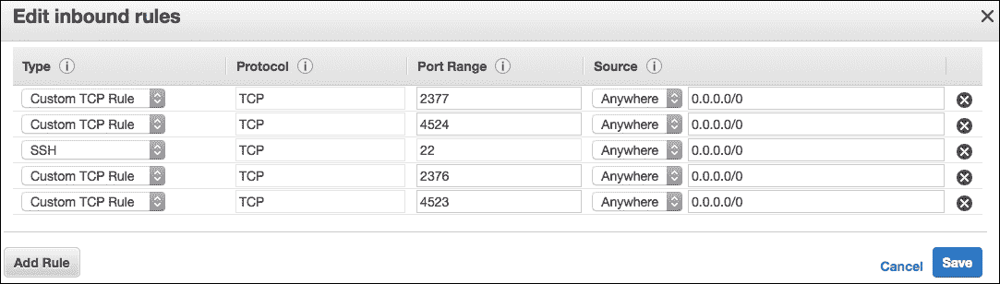

## 网络配置

我们使用带有附加覆盖网络的标准配置，称为**火花**。流量数据将通过 spark 网络传输，这使得扩展实验室配置成为可能，新的主机和工作人员甚至可以在其他提供商上运行，如**数字海洋**或**开放栈**。当新的 Swarm 工作人员加入该集群时，该网络会传播给他们，并可供 Swarm 服务使用。

## 存储配置和架构

如前所述，我们选择了 Flocker([https://clusterhq.com/flocker/introduction/](https://clusterhq.com/flocker/introduction/))，这是顶级 Docker 存储项目之一。集群总部将其描述为:

> *Flocker 是一个开源的容器数据卷管理器，适用于您的 Dockerized 应用。通过提供数据迁移工具，Flocker 为运营团队提供了运行容器化有状态服务(如生产中的数据库)所需的工具。与绑定到单个服务器的 Docker 数据卷不同，称为数据集的 Flocker 数据卷是可移植的，可以与集群中的任何容器一起使用。*

Flocker 支持非常广泛的存储选项，从 AWS EBS 到 EMC、NetApp、戴尔、华为解决方案，再到 OpenStack child 和 Ceph，仅举几例。

它的设计很简单:Flocker 有一个**控制节点**，它公开了它的服务 API 来管理 Flocker 集群和 Flocker 卷，一个 **Flocker 代理**和 Docker 插件一起运行在集群的每个**节点**上。

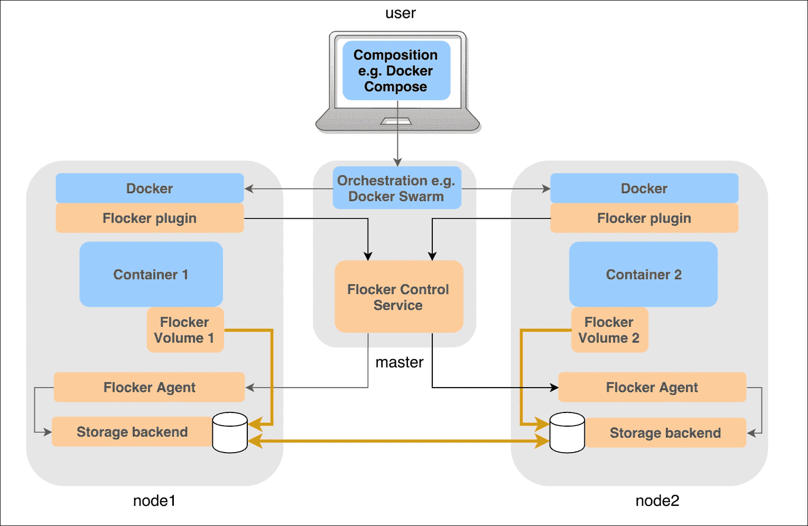

要使用 Flocker，在命令行中，您需要使用 Docker 运行类似这样的程序，在容器内装载为`/data`的 Flocker `myvolume`卷上读取或写入有状态数据:

```
docker run -v myvolume:/data --volume-driver flocker image command

```

此外，您可以使用`docker volume`命令管理音量:

```
docker volume ls
docker volume create -d flocker

```

在本教程的架构中，我们将在 aws-104 上安装 flocker 控制节点，这将是专用的，并在所有节点(包括节点-104)上安装 Flocker 代理。

此外，我们将安装用于与 Flocker 控制节点 API 交互的 Flocker 客户端，以便管理集群状态和卷。为了方便起见，我们也将从 aws-104 使用它。

# 安装弗洛克

要让 Flocker 集群运行，需要一系列操作:

1.  安装`flocker-ca`实用程序生成证书。
2.  生成授权证书。
3.  生成控制节点证书。
4.  生成节点证书，每个节点一个。
5.  生成 flocker 插件证书。
6.  生成客户端证书。
7.  从软件包中安装一些软件。
8.  向弗洛克集群分发证书。
9.  配置安装，添加主配置文件，`agent.yml`。
10.  在主机上配置数据包过滤器。
11.  启动并重新启动系统服务。

您可以在一个小集群上手动执行它们，但是它们是重复且繁琐的，所以我们将使用一些发布到[https://github.com/fsoppelsa/ansible-flocker](https://github.com/fsoppelsa/ansible-flocker)的不言自明的 Ansible 行动手册来说明这个过程。

这些戏很琐碎，可能还没有制作好。也有针对弗洛克角色的官方 ClusterHQ 行动手册(参考[https://github.com/ClusterHQ/ansible-role-flocker](https://github.com/ClusterHQ/ansible-role-flocker))，但是为了解释的线性，我们将使用第一个存储库，所以让我们克隆它:

```
git clone git@github.com:fsoppelsa/ansible-flocker.git

```

## 生成弗洛克证书

对于证书生成，需要`flocker-ca`实用程序。如何安装的说明可以在[https://docs . cluster HQ . com/en/latest/flocker-standalone/install-client . html](https://docs.clusterhq.com/en/latest/flocker-standalone/install-client.html)上找到。对于 Linux 发行版，这是一个安装软件包的问题。相反，在 Mac OS X 上，可以使用 Python 的`pip`实用程序来拉取该工具。

**在 Ubuntu** 上:

```
sudo apt-get -y install --force-yes clusterhq-flocker-cli

```

**在 Mac OS X** 上:

```
pip install https://clusterhq-
    archive.s3.amazonaws.com/python/Flocker-1.15.0-py2-none-any.whl

```

一旦拥有了这个工具，我们就会生成所需的证书。为了使事情变得简单，我们将创建以下证书结构:

包含所有证书和密钥的目录`certs/`:

*   `cluster.crt`和`.key`是权限证书和密钥
*   `control-service.crt`和`.key`是控制节点证书和密钥
*   `plugin.crt`和`.key`是 Docker Flocker 插件证书和密钥
*   `client.crt`和`.key`是弗洛克客户端证书和密钥
*   从`node-aws-101.crt`和`.key`到`node-aws-110.crt`和`.key`是节点证书和密钥，每个节点一个

以下是步骤:

1.  生成授权证书:`flocker-ca initialize cluster`
2.  一旦拥有了权限证书和密钥，就在同一个目录下生成控制节点证书:`flocker-ca create-control-certificate aws-101`
3.  然后生成插件证书: `flocker-ca create-api-certificate plugin`
4.  然后生成客户端证书: `flocker-ca create-api-certificate client`
5.  最后，生成每个节点的证书:`flocker-ca create-node-certificate node-aws-X`

当然，我们必须欺骗并使用`ansible-flocker`存储库中可用的`utility/generate_certs.sh`脚本，它将为我们完成以下工作:

```
cd utils
./generate_certs.sh

```

在这个脚本执行之后，我们现在在`certs/`中拥有了所有可用的证书:

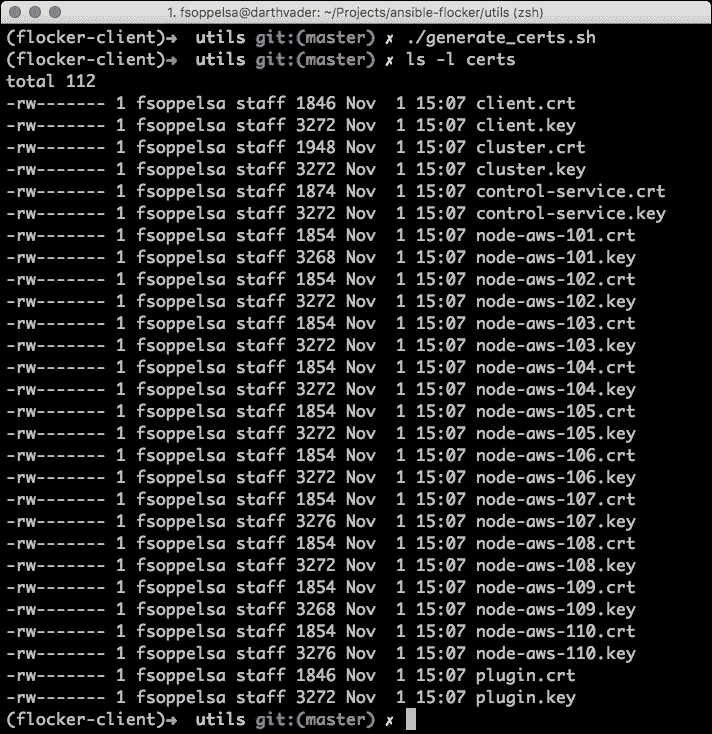

## 安装软件

在每个 Flocker 节点上，我们必须执行以下步骤:

1.  将 ClusterHQ Ubuntu 存储库添加到 APT 源列表。
2.  更新包缓存。
3.  安装这些软件包:
    *   `clusterhq-python-flocker`
    *   `clusterhq-flocker-node`
    *   `clusterhq-flocker-docker-plugin`
4.  创建目录`/etc/flocker`。
5.  将弗洛克配置文件`agent.yml`复制到`/etc/flocker`。
6.  将适用于该节点的证书复制到`/etc/flocker`。
7.  通过启用 **ufw** ，并打开 TCP 端口`2376`、`2377`、`4523`、`4524`来配置安全性。
8.  启动系统服务。
9.  重新启动 docker daemon。

同样，我们喜欢机器为我们工作，所以让我们边喝咖啡边用 Ansible 设置它。

但是，在此之前，我们必须指定谁将是 Flocker 控制节点，谁将是裸节点，所以我们用节点的主机 IP 填充`inventory`文件。文件为`.ini`格式，只需要指定节点列表即可:

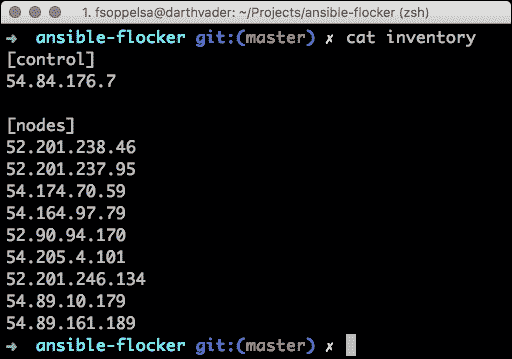

然后，我们创建目录，Ansible 将从该目录中获取文件、证书和配置以复制到节点:

```
mkdir files/

```

我们现在将之前创建的所有证书从`certs/`目录复制到`files/`:

```
cp certs/* files/

```

最后，我们在`files/agent.yml`中定义 Flocker 配置文件，内容如下，适配 AWS 区域，修改`hostname`、`access_key_id`、`secret_access_key`:

```
control-service:
 hostname: "<Control node IP>"
 port: 4524
dataset:
 backend: "aws"
 region: "us-east-1"
 zone: "us-east-1a"
 access_key_id: "<AWS-KEY>"
 secret_access_key: "<AWS-ACCESS-KEY>"
version: 1

```

这是核心的 Flocker 配置文件，将在每个节点上的`/etc/flocker`中。在这里，您可以指定和配置所选后端的凭据。在我们的例子中，我们选择了基本的 AWS 选项 EBS，所以我们包括了我们的 AWS 凭证。

有了库存、`agent.yml`和`files/`中准备好的所有凭证，我们就可以继续了。

## 安装控制节点

安装控制节点的剧本是`flocker_control_install.yml`。该播放器执行软件安装脚本，复制集群证书、控制节点证书和密钥、节点证书和密钥、客户端证书和密钥、插件证书和密钥，为 SSH、Docker 和 Flocker 配置防火墙打开端口，并启动这些系统服务:

*   `flocker-control`
*   `flocker-dataset-agent`
*   `flocker-container-agent`
*   `flocker-docker-plugin`

最后，它刷新`docker`服务，重新启动它。

让我们运行它:

```
$ export ANSIBLE_HOST_KEY_CHECKING=False
$ ansible-playbook \
-i inventory \
--private-key keys/flocker \
playbooks/flocker_control_install.yml

```

## 安装集群节点

同样，我们用另一个剧本`flocker_nodes_install.yml`安装其他节点:

```
$ ansible-playbook \
-i inventory \
--private-key keys/flocker \
playbooks/flocker_nodes_install.yml

```

步骤和之前差不多，只是这个剧本没有复制一些证书，没有启动`flocker-control`服务。只有弗洛克代理和弗洛克 Docker 插件服务在那里运行。我们等了一段时间，直到 Ansible 退出。

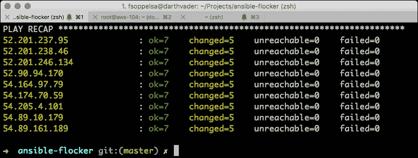

## 测试是否一切正常

为了检查是否正确安装了 Flocker，我们现在登录控制节点，检查 Flocker 插件是否正在运行(唉，它有`.sock`文件)，然后使用`curl`命令安装`flockerctl`实用程序(参考[https://docs . cluster HQ . com/en/latest/Flocker-features/Flocker CTL . html](https://docs.clusterhq.com/en/latest/flocker-features/flockerctl.html)):

```
$ docker-machine ssh aws-104
$ sudo su -
# ls /var/run/docker/plugins/flocker/
flocker.sock  flocker.sock.lock
# curl -sSL https://get.flocker.io |sh

```

我们现在设置一些`flockerctl:`使用的环境变量

```
export FLOCKER_USER=client
export FLOCKER_CONTROL_SERVICE=54.84.176.7
export FLOCKER_CERTS_PATH=/etc/flocker

```

我们现在可以列出节点和卷(当然，我们还没有卷):

```
flockerctl status
flockerctl list

```

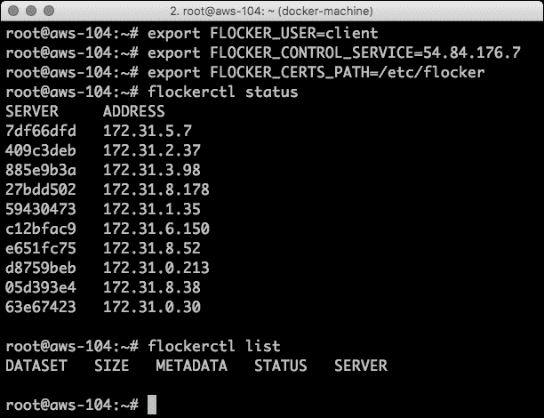

现在，我们可以去集群的另一个节点检查 Flocker 集群的连接性(特别是如果插件和代理可以到达并认证到控制节点)，比如`aws-108`，创建一个卷并向其中写入一些数据:

```
$ docker-machine ssh aws-108
$ sudo su -
# docker run -v test:/data --volume-driver flocker \
busybox sh -c "echo example > /data/test.txt"
# docker run -v test:/data --volume-driver flocker \
busybox sh -c "cat /data/test.txt"
example

```

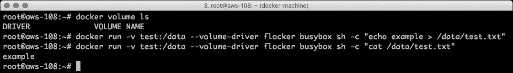

如果我们回到控制节点`aws-104`，我们可以通过用 docker 和`flockerctl`命令列出它们来验证是否创建了具有持久数据的卷:

```
docker volume ls
flockerctl list

```

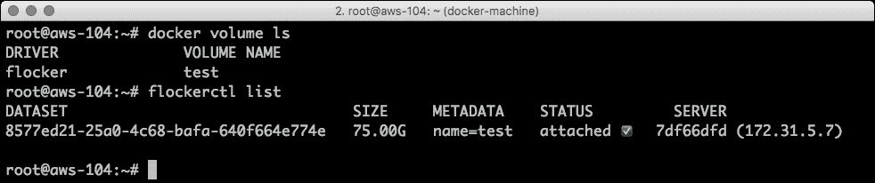

太棒了！现在我们可以移除退出的容器，从 Flocker 中删除测试卷数据集，然后我们准备安装 Swarm:

```
# docker rm -v ba7884944577
# docker rm -v 7293a156e199
# flockerctl destroy -d 8577ed21-25a0-4c68-bafa-640f664e774e

```

# 安装和配置 Swarm

我们现在可以用我们最喜欢的方法安装 Swarm 了，如前几章所示。我们将有 **aws-101** 到 **aws-103** 作为经理，其余节点除 **aws-104** 外，都是工人。这个集群可以进一步扩展。实际上，我们将保持 10 节点大小。

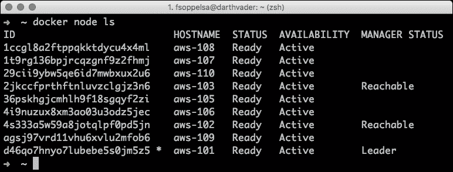

我们现在添加一个专用的`spark` 覆盖 VxLAN 网络:

```
docker network create --driver overlay --subnet 10.0.0.0/24 spark

```

## 火花的体积

我们现在连接到任何 Docker 主机，并创建一个`75G`大小的卷，用于保存一些持久的 Spark 数据:

```
docker volume create -d flocker -o size=75G -o profile=bronze --
    name=spark

```

这里讨论的选项是`profile`。这是一种存储风格(主要是速度)。如链接[中所述，集群总部为 AWS EBS 维护三个可用的配置文件:](https://docs.clusterhq.com/en/latest/flocker-features/aws-configuration.html#aws-dataset-backend)

*   **黄金** : EBS 供应的 IOPS /名为 io1 的原料药。针对其最大 IOPS 配置- 30 IOPS/GB，最大 20，000 IOPS
*   **银色** : EBS 通用固态硬盘/ API 命名为 gp2
*   **青铜** : EBS 磁性/ API 命名标准

我们可以在 Flocker 控制节点上用`flockerctl list`检查这个卷是否生成。

# 再次部署火花

我们选择一个我们想要运行 Spark 独立管理器的主机，成为`aws-105`，并将其标记为:

```
docker node update --label-add type=sparkmaster aws-105

```

其他节点将托管我们的 Spark 工作人员。

我们在`aws-105`启动星火大师:

```
$ docker service create \
--container-label spark-master \
--network spark \
--constraint 'node.labels.type == sparkmaster' \
--publish 8080:8080 \
--publish 7077:7077 \
--publish 6066:6066 \
--name spark-master \
--replicas 1 \
--env SPARK_MASTER_IP=0.0.0.0 \
--mount type=volume,target=/data,source=spark,volume-driver=flocker 
    \
fsoppelsa/spark-master

```

首先是形象。我发现谷歌图片中包含了一些烦人的东西(比如取消设置一些环境变量，所以从外部进行配置，用`--env`开关，不可能)。因此，我为自己创建了一对 Spark 1.6.2 主映像和工作映像。

然后，`--network`。在这里，我们对这个容器说，连接到用户定义的覆盖网络称为火花。

最后是存储:`--mount`，它与 Docker 卷一起工作。我们将其指定为:

*   使用卷:`type=volume`
*   将容器内的容积安装在`/data` : `target=/data`上
*   使用我们之前创建的`spark`体积:`source=spark`
*   用弗洛克作为`volume-driver`

当您创建服务并装载某个卷时，如果卷不存在，它将被创建。

### 注

当前版本的 Flocker 仅支持 1 的副本。原因是 iSCSI/数据块级装载不能跨多个节点连接。因此，在给定时间点，只有一个服务可以使用复制因子为 1 的卷。这使得 Flocker 在存储和移动数据库数据方面更加有用(尤其是它的用途)。但是在这里，我们将使用它来展示一个在 Spark 主容器的`/data`中有持久数据的小例子。

因此，有了这个配置，让我们添加老黄牛，三个 Spark 工人:

```
$ docker service create \
--constraint 'node.labels.type != sparkmaster' \
--network spark \
--name spark-worker \
--replicas 3 \
--env SPARK\_MASTER\_IP=10.0.0.3 \
--env SPARK\_WORKER\_CORES=1 \
--env SPARK\_WORKER\_MEMORY=1g \
fsoppelsa/spark-worker

```

这里，我们将一些环境变量传递到容器中，以将资源使用限制在每个容器 1 个内核和 1G 内存。

几分钟后，系统启动，我们连接到`aws-105`，端口`8080`，看到这个页面:

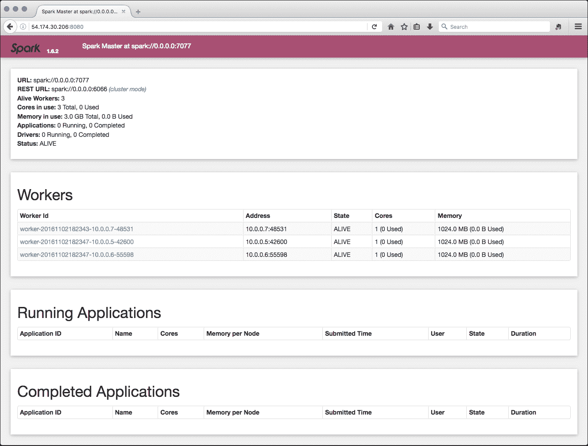

## 测试火花

因此，我们访问 Spark shell 并运行 Spark 任务来检查事情是否正常运行。

我们准备一个带有一些 Spark 实用程序的容器，例如`fsoppelsa/spark-worker`，并运行它来使用 Spark 二进制`run-example`计算 Pi 的值:

```
docker run -ti fsoppelsa/spark-worker /spark/bin/run-example 
    SparkPi

```

在大量的输出信息之后，Spark 完成了计算，给出了我们:

```
...
Pi is roughly 3.14916
...

```

如果我们回到 Spark UI，我们可以看到我们惊人的 Pi 应用已经成功完成。

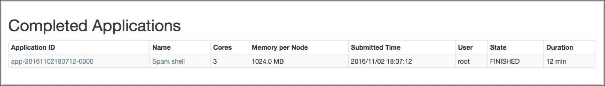

更有趣的是运行一个连接到主服务器的交互式 Scala shell 来执行 Spark 作业:

```
$ docker run -ti fsoppelsa/spark-worker \
/spark/bin/spark-shell --master spark://<aws-105-IP>:7077

```

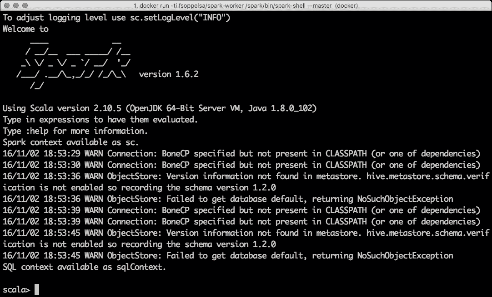

## 使用弗洛克储存

仅出于本教程的目的，我们现在使用之前创建的 spark 卷运行一个示例，以从 Spark 读取和写入一些持久性数据。

为了做到这一点，并且由于弗洛克对复制因子的限制，我们杀死了当前的三个工人，创建了一个只有一个工人的集合，安装火花:

```
$ docker service rm spark-worker
$ docker service create \
--constraint 'node.labels.type == sparkmaster' \
--network spark \
--name spark-worker \
--replicas 1 \
--env SPARK\_MASTER\_IP=10.0.0.3 \
--mount type=volume,target=/data,source=spark,volume-driver=flocker\
fsoppelsa/spark-worker

```

我们现在通过以下方式获得主机`aws-105`的 Docker 凭证:

```
$ eval $(docker-machine env aws-105) 

```

我们可以通过连接到 Spark 主容器来尝试在`/data`中写入一些数据。在本例中，我们只需将一些文本数据(lorem ipsum 的内容，例如可在[http://www.loremipsum.net](http://www.loremipsum.net/)获得)保存到`/data/file.txt`。

```
$ docker exec -ti 13ad1e671c8d bash
# echo "the content of lorem ipsum" > /data/file.txt

```

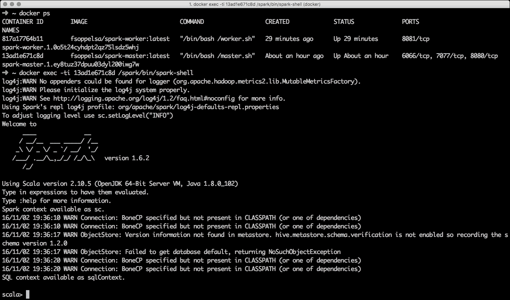

然后，我们连接到 Spark shell 来执行一个简单的 Spark 作业:

1.  加载`file.txt`。
2.  将它包含的单词映射到它们出现的次数。
3.  Save the result in `/data/output`:

    ```
    $ docker exec -ti 13ad1e671c8d /spark/bin/spark-shell
    ...
    scala> val inFile = sc.textFile("file:/data/file.txt")
    scala> val counts = inFile.flatMap(line => line.split(" 
            ")).map(word => (word, 1)).reduceByKey(_ + _)
    scala> counts.saveAsTextFile("file:/data/output")
    scala> ^D

    ```

    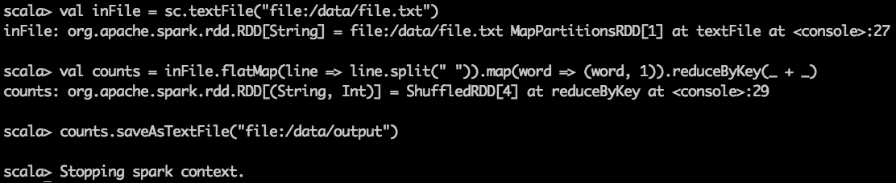

现在，让我们在任何 Spark 节点上启动一个`busybox`容器，并检查`spark` 卷的内容，验证输出是否已写入。我们运行以下代码:

```
$ docker run -v spark:/data -ti busybox sh
# ls /data
# ls /data/output/
# cat /data/output/part-00000

```

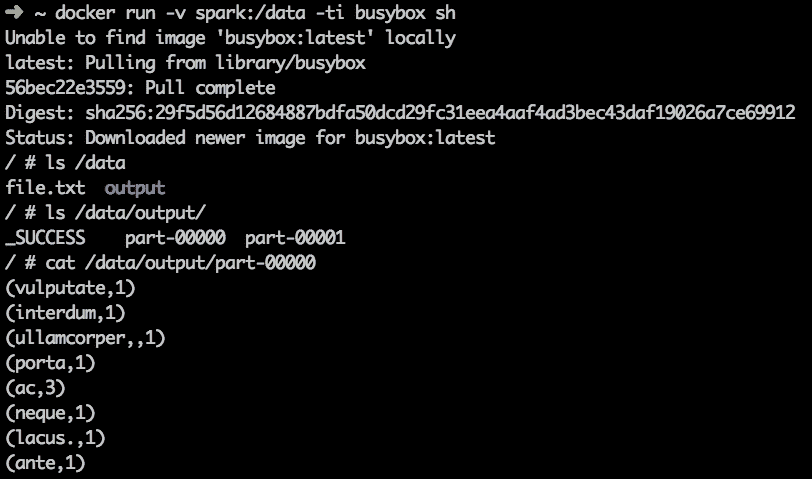

前面的截图显示了预期的输出。Flocker 卷的有趣之处在于，它们甚至可以从一台主机移动到另一台主机。许多操作可以用可靠的方式完成。如果你正在为 Docker 寻找一个好的存储解决方案，Flocker 是一个好主意。例如，Swisscom Developer cloud([http://developer.swisscom.com/](http://developer.swisscom.com/))在生产中使用了它，它允许您调配数据库，例如由 Flocker 技术支持的 **MongoDB** 。即将发布的弗洛克将致力于精简弗洛克代码库，使其更加精简和耐用。接下来要做的事情包括内置高可用性、快照、证书分发和容器中易于部署的代理。所以，前途一片光明！

# 缩放火花

现在我们来说明蜂群模式最惊人的特点-`scale`命令。我们恢复了在尝试 Flocker 之前的配置，因此我们销毁了`spark-worker`服务，并使用`3`的副本因子重新创建了它:

```
aws-101$ docker service create \
--constraint 'node.labels.type != sparkmaster' \
--network spark \
--name spark-worker \
--replicas 3 \
--env SPARK_MASTER_IP=10.0.0.3 \
--env SPARK\_WORKER\_CORES=1 \
--env SPARK\_WORKER\_MEMORY=1g \
fsoppelsa/spark-worker

```

现在，我们使用下面的代码通过`30` Spark 员工来扩展服务:

```
aws-101$ docker service scale spark-worker=30

```

几分钟后，最终需要拉出映像，我们再次检查:

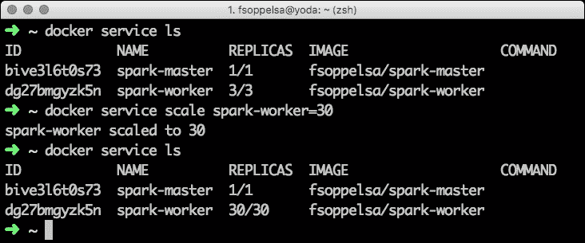

从火花网络用户界面:

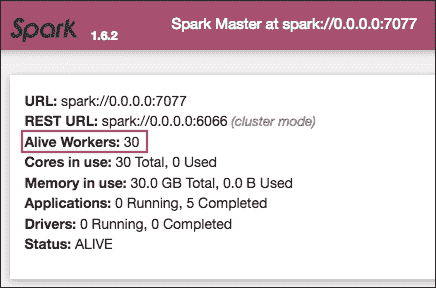

缩放可用于放大或缩小副本的大小。到目前为止，仍然没有用于自动扩展或向新添加的节点分配负载的自动化机制。但是它们可以用定制的实用程序来实现，或者我们甚至可以期待它们很快被集成到 Swarm 中。

# 监控群托管应用

2016 年 8 月，我(Fabrizio)在 Reddit([https://www . Reddit . com/r/docker/comments/4 zous 1/monitoring _ containers _ under _ 112 _ Swarm/](https://www.reddit.com/r/docker/comments/4zous1/monitoring_containers_under_112_swarm/))上关注一个线程，用户抱怨新的 Swarm Mode 更难监控。

如果说目前还没有官方的 Swarm 监控解决方案，那么新兴技术最受欢迎的组合之一就是:谷歌的 **cAdvisor** 收集数据， **Grafana** 展示图形， **Prometheus** 作为数据模型。

## 普罗米修斯

普罗米修斯的团队将该产品描述为:

> *Prometheus 是一个开源的系统监控和警报工具包，最初是在 SoundCloud 构建的。*

普罗米修斯的主要特点是:

*   多维数据模型
*   灵活的查询语言
*   不依赖分布式存储
*   时间序列收集通过拉模型进行
*   通过网关支持推送时间序列
*   支持多种绘图和仪表板模式

关于 https://prometheus.io/docs/introduction/overview/有一个很棒的介绍，我们在这里不再重复。在我们看来，普罗米修斯的首要特点是易于安装和使用。普罗米修斯本身只包含一个由 Go 代码构建的二进制文件，外加一个配置文件。

## 安装监控系统

事情可能很快就会发生变化，所以我们只是勾画了一个为 Swarm 建立监控系统的方法，在 Docker 1 . 12 . 3 版本上进行了尝试。

首先，我们创建一个新的覆盖网络来不干扰`ingress`或`spark`网络，称为`monitoring`:

```
aws-101$ docker network create --driver overlay monitoring

```

然后，我们在模式`global`下启动一个 cAdvisor 服务，这意味着一个 cAdvisor 容器将在每个 Swarm 节点上运行。我们在容器内安装了一些系统路径，以便 cAdvisor 可以访问:

```
aws-101$ docker service create \
 --mode global \
 --name cadvisor \
 --network monitoring \
 --mount type=bind,src=/var/lib/docker/,dst=/var/lib/docker \
 --mount type=bind,src=/,dst=/rootfs \
 --mount type=bind,src=/var/run,dst=/var/run \
 --publish 8080 \
 google/cadvisor

```

然后我们用`basi/prometheus-swarm`来建立普罗米修斯:

```
aws-101$ docker service create \
 --name prometheus \
 --network monitoring \
 --replicas 1 \
 --publish 9090:9090 \
 prom/prometheus-swarm

```

我们添加了`node-exporter`服务(同样`global`，必须在每个节点上运行):

```
aws-101$ docker service create \
 --mode global \
 --name node-exporter \
 --network monitoring \
 --publish 9100 \
 prom/node-exporter

```

最后，我们从一个副本开始 **Grafana** :

```
aws-101$ docker service create \
 --name grafana \
 --network monitoring \
 --publish 3000:3000 \
 --replicas 1 \
 -e "GF_SECURITY_ADMIN_PASSWORD=password" \
 -e "PROMETHEUS_ENDPOINT=http://prometheus:9090" \
 grafana/grafana

```

## 在格拉夫纳进口普罗米修斯

当 Grafana 可用时，为了获得令人印象深刻的 Swarm 运行状况图，我们使用以下凭证登录 Grafana 运行的节点，端口`3000`:

```
"admin":"password"

```

作为管理员，我们点击 Grafana 标志，进入**数据源**，添加`Prometheus`:

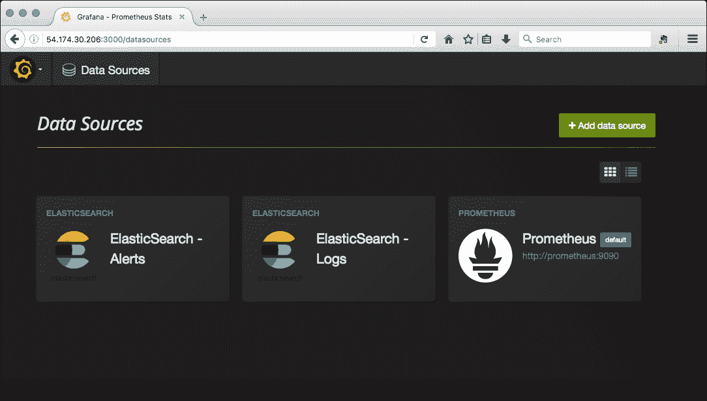

会出现一些选项，但是映射已经存在，所以**保存&测试**就足够了:

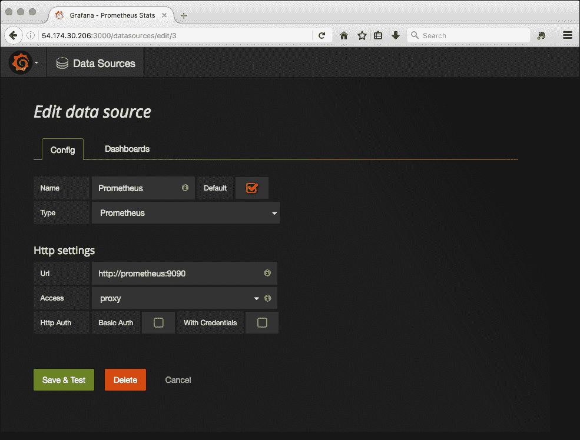

现在我们可以回到仪表板，点击**普罗米修斯**，这样我们将看到格拉夫纳主面板:

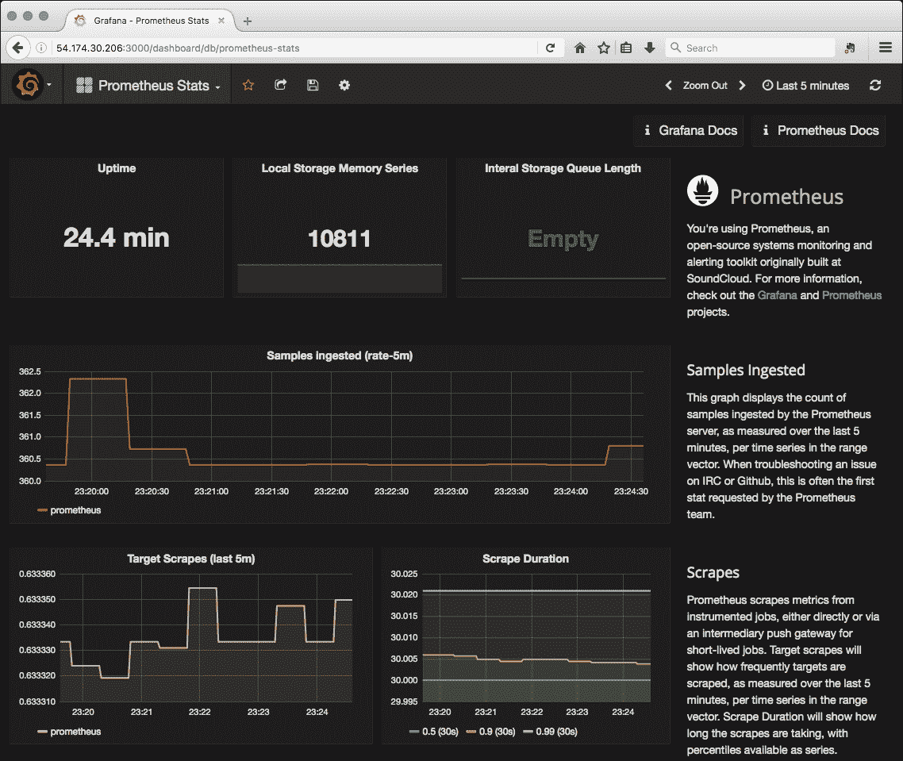

我们再次利用开源社区发布的东西，仅仅用一些简单的命令就将不同的固执己见的技术粘在一起，以获得期望的结果。监控 Docker Swarm 及其应用是一个现在完全开放的研究领域，因此我们也可以期待那里的惊人发展。

# 总结

在这一章中，我们使用 Flocker 为 Swarm 基础设施增加了存储容量，并设置了一个专用的覆盖网络，使我们的示例应用 Spark 集群能够在其上工作，并通过添加新节点(也在新的提供商上，如 DigitalOcean)而易于扩展。在使用了我们的 Spark 安装和 Flocker 之后，我们最终引入了 Prometheus 和 Grafana 来监控 Swarm 的健康和状态。在接下来的两章中，我们将看到可以插入 Swarm 的新的附加功能，以及如何保护 Swarm 基础设施。