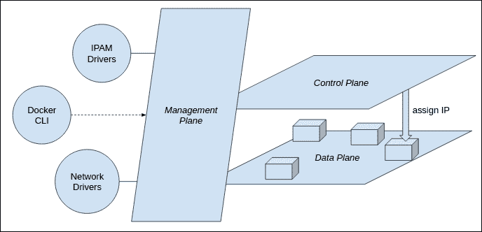
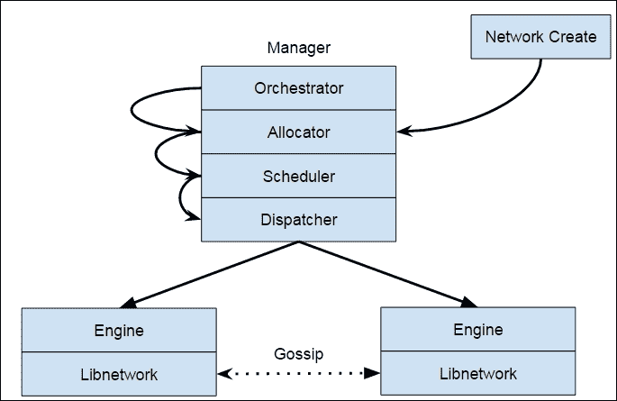
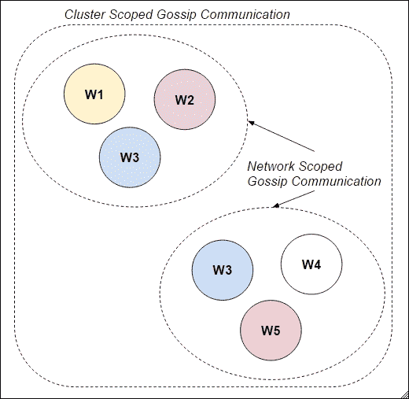
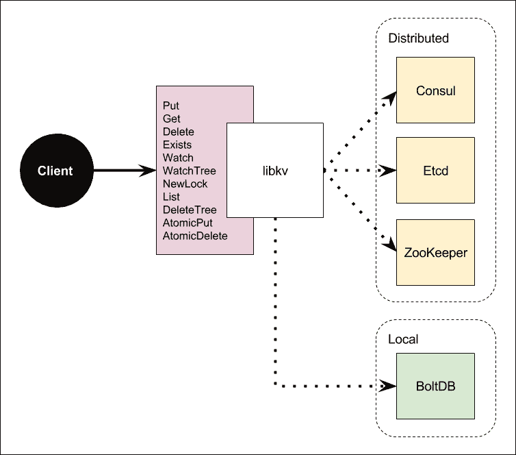

# 第八章。探索 Swarm 的其他特性

在本章中，我们将讨论和深化与 Docker 和编排系统相关的两个非常重要的主题:网络和共识。特别是，我们将了解如何:

*   图书馆网络的基础
*   图书馆网络的基本安全
*   路由网格
*   覆盖网络
*   网络控制平面
*   Libkv

# Libnet

Libnetwork 是从头开始设计的网络栈，无论平台、环境、操作系统或基础架构如何，都可以与 Docker 一起工作。Libnetwork 不仅是网络驱动程序的接口。它不仅仅是一个管理 VLAN 或 VXLAN 网络的图书馆，它还做得更多。

Libnetwork 是一个完整的网络栈，由三个平面组成:**管理平面**、**控制平面**和**数据平面**，如下图所示:



*   **管理平面**允许用户、运营商或工具管理网络基础设施。这些操作包括网络监控。管理平面代表 Docker 网络用户体验，提供 API。它还可以通过管理插件进行扩展，例如 IPAM 插件，它允许我们控制如何为每个容器分配 IP 地址。
*   **控制平面**是在范围内的流言协议中实现的，直接增加了服务发现、加密密钥分发。
*   简而言之，**数据平面**负责在两个端点之间移动网络数据包。网络插件适用于每个数据平面。默认情况下，有几个内置驱动程序。例如，我们在前几章中遇到的覆盖驱动程序直接使用了 Linux 和 Windows 内核中的功能，因此没有这种网络的驱动程序代码。这也适用于网桥、IPVLAN 和 MacVLAN 驱动程序。相比之下，其他第三方网络需要自己的插件形式的实现。

按照通常的 Docker UX 的说法，组件应该只在任何环境下工作，网络栈也必须是可移植的。为了使 Docker 的网络栈可移植，它的设计和实现必须是坚实的。例如，管理平面不能由任何其他组件控制。此外，控制平面不能被其他组件替换。如果我们允许这样做，当我们将应用环境从一个环境更改为另一个环境时，网络栈将会崩溃。

## 联网插件

数据平面设计为可插拔的。事实上，它只能由内置或外部插件来管理。例如，MacVLAN 被实现为 Docker 1.12 的插件，而不影响系统的其他部分。

最值得注意的是，我们可以在同一个网络栈上有几个驱动程序和插件，它们可以在不相互干扰的情况下工作。因此，通常在 Swarm 中，我们可以有一个覆盖网络、一个桥接网络以及一个运行在同一集群上的主机驱动程序。

## 容器联网模型

Libnetwork 的设计和实现旨在满足 Docker Swarm 的要求，以运行 Docker 的分布式应用。也就是说，Libnetwork 实际上就是 Docker Networking 结构。Libnetwork 的基础是一个名为**容器联网模型** ( **CNM** )。这是一个定义良好的基本模型，用于描述容器如何连接到给定的网络。CNM 由三部分组成:

*   **沙盒**:这是一个包含容器网络栈配置的隔离。
*   **端点**:这是一个只属于网络和沙盒的连接点。
*   **网络**:这是一组允许在其中自由社区的端点。网络由一个或多个端点组成。

驱动程序代表数据平面。每一个驱动程序，无论是覆盖、桥接还是虚拟局域网，都是插件的形式。每个插件都在特定的数据平面中工作。

在系统中，默认有一个内置的 IPAM。这是一个重要的问题，因为每个容器都必须附加一个 IP 地址。因此，有必要内置一个 IPAM 系统，它允许每个容器能够像我们用传统方式那样相互连接，我们需要一个 IP 地址让其他人与容器对话。我们还要求定义子网以及 IP 地址范围。此外，该系统是为 IPAM 设计的可插拔。这意味着它允许我们拥有自己的 DHCP 驱动程序，或者允许将系统连接到现有的 DHCP 服务器。

如前所述，Libnetwork 支持现成的多主机网络。多主机网络值得讨论的组件是它的数据和控制平面。

目前包含在 Docker 1.12 中的控制平面使用流言机制作为节点的一般发现系统。这种基于八卦协议的网络在 Raft 共识系统的另一个并行层上工作。基本上，我们有两个不同的成员机制同时工作。Libnetwork 允许来自其他插件的驱动程序共同使用控制平面。

这些是 Libnetwork 控制平面的特性:

*   它是安全的，加密的，开箱即用
*   每个数据平面都可以使用它
*   它提供本机服务发现和现成的负载平衡

Docker 1.12 在 Swarm 中实现了基于 VIP 的服务发现。该服务通过将容器的虚拟 IP 地址映射到 DNS 记录来工作。然后所有的 DNS 记录都通过八卦分享。在 Docker 1.12 中，随着服务概念的引入，这个概念直接符合发现的概念。

在 Docker 1.11 和以前的版本中，有必要使用容器名称和别名来“模拟”服务发现，并进行 DNS 循环来执行某种原始负载平衡。

Libnetwork 继承了电池内置但可拆卸的原理，实现为插件系统。未来，Libnetwork 将逐步扩展插件系统，以覆盖其他网络部分，例如负载平衡。

# 加密和路由网格

如前所述，Libnetwork 的核心模式是 CNM。在 Swarm 模式下，libnetwork 以集群感知模式构建，支持多主机联网，无需外部键值存储。覆盖网络自然适合这个模型。并且引入了数据平面和控制平面加密。使用加密的控制平面，VXLAN 上的路由信息(例如，哪个容器有哪个媒体访问控制地址和哪个 IP 地址)会自动得到保护。此外，通过路由网格，CNM 提供了一种分散的机制，允许您从集群的任何 IP 访问服务。当请求来自外部并到达集群的任何节点时，流量将被路由到一个工作容器。

# MacVLAN

1.12 中的新驱动程序是 MacVLAN。MacVLAN 是一个高性能的驱动程序，旨在允许 Docker 网络垂直于现有的 VLAN，例如，一个公司网络，让一切继续工作。有一种情况是，我们将逐步将工作负载从最初的 VLAN 迁移到 Docker，而 MacVLAN 将有助于将 Docker 集群垂直迁移到最初的 VLAN。这将使Docker网络与底层网络集成，容器将能够在同一个 VLAN 工作。

我们可以用 MacVLAN 驱动程序创建一个网络，并指定网络的真实子网。我们也可以只为容器指定一个 IP 地址范围。此外，我们可以排除一些 IP 地址，例如网关，分配给带有`--aux-address`的容器。MacVLAN 驱动程序的父接口是我们希望将此网络连接到的接口。如前所述，MacVLAN 产生了所有驱动程序中最好的性能。它的 Linux 实现非常轻量级。它们只是加强了网络之间的隔离和与物理父网络的连接，而不是作为传统的 Linux 网桥来实现网络隔离。使用 MacVLAN 驱动需要 Linux 内核 3.9 - 3.19 或 4.x。

## 覆盖网络

因为 Swarm 集群现在是 Docker Engine 内置的一个本地特性，这使得无需使用外部键值存储就可以非常容易地创建覆盖网络。

管理节点负责管理网络的状态。所有的网络状态都保存在 Raft 日志中。Swarm 模式下的 Raft 实现与外部键值存储的主要区别在于嵌入式 Raft 的性能远高于外部。我们自己的实验证实，外部键值存储将停留在 100-250 个节点左右，而嵌入式 Raft 帮助我们在 Swarm3k 事件中将系统扩展到 4700 个节点。这是因为外部 Raft 商店基本上有很高的网络延迟。当我们需要在某些状态上达成一致时，我们会被网络往返所招致，而嵌入式 Raft 商店就在记忆中。

例如，在过去，当我们想要执行任何与网络相关的操作(例如，为容器分配 IP 地址)时，由于我们总是与外部存储对话，因此会出现显著的网络延迟。对于嵌入式 Raft，当我们希望在价值观上达成共识时，我们可以立即使用内存存储。



当我们使用覆盖驱动程序创建网络时，如下所示:

```
$ docker network create --driver overlay --subnet 10.9.0.0/24 mh_net

```

该命令将与分配器对话。然后将会有一个子网预留，在这种情况下是`10.9.0.0/24`，并且一旦被分配，就在管理器主机的内存中立即同意相关的值。我们希望在此之后创建一项服务。然后，我们稍后会将该服务连接到网络。当我们创建服务时，如下所示:

```
$ docker service create --network mh_net nginx

```

编排者为该服务创建许多任务(容器)。然后，每个创建的任务将被分配一个 IP 地址。分配将在本次任务中再次生效。

任务创建完成后:

*   该任务获得一个 IP 地址
*   其网络相关信息将提交到 Raft 日志存储中
*   在分配完成提交后，调度程序会将任务移动到另一个状态
*   调度程序将每个任务分派给一个工作节点
*   最后，与该任务相关联的容器将在 Docker 引擎上运行

如果一个任务不能分配其网络资源，它将停留在分配的状态，不会被调度。这与之前版本的 Docker 的重要区别在于，在 Swarm 模式的网络系统中，分配状态的概念很明显。这样就大大提高了系统的整体分配周期。当我们谈论分配时，我们不仅指 IP 地址的分配，还指相关的驱动程序工件。对于覆盖网络，它需要保留一个 VXLAN 标识符，这是每个 VXLAN 的一组全局标识符。这个标识符保留是由网络分配器完成的。

未来，一个插件做同样的分配机制，只实现一些接口，让状态由 Libnetwork 自动管理并存储到 Raft 日志中就足够了。有了这一点，资源分配是集中的，所以我们可以达到一致性和共识。有了共识，我们需要一个高效的共识协议。

# 网络控制平面

网络控制平面是 Libnetwork 的一个子系统，用于管理路由信息，我们需要一个快速收敛的协议来完成这项工作。例如，Libnet 不使用 BGP 作为协议(尽管 BGP 在支持非常多的端点的可伸缩性方面非常出色)，因为点 BGP 不会快速收敛到足以在高度动态的环境(如软件容器环境)中使用。

在一个以容器为中心的世界中，网络系统预计会发生非常迅速的变化，尤其是对于新的 Docker 服务模式，这需要大量且快速的 IP 分配。我们希望路由信息也能非常快速地收敛，尤其是在大规模的情况下，例如，超过 10，000 个容器。在 Swarm2k 和 Swarm3k 实验中，我们确实一次启动了 10，000 个容器。特别是在 Swarm3k 中，我们在 Ingress 负载平衡网络上启动了 4，000 个 NGINX 容器。如果没有一个良好的实现，这个数字的规模将无法正常工作。

为了解决这个问题，Libnetwork 团队选择在网络控制平面中包含八卦协议。协议的内部算法是这样工作的:它选择 3 个邻居，然后传播相同的信息；在 Libnetwork 的情况下，路由和其他网络相关信息。流言协议将重复这个过程，直到每个节点共享相同的信息。使用这种技术，整个集群将在几秒钟内非常快速地接收信息。



无论如何，整个集群并不总是需要相同的信息。集群中的每个节点不需要知道所有网络的信息。只有特定网络中的节点需要知道自己的网络信息。为了优化 Libnetwork，团队实现了两个范围，*集群范围的流言传播*和*网络范围的流言传播*。到目前为止，我们解释的是集群范围的流言传播，而网络范围的流言传播限制了特定网络中的网络信息。当一个网络扩展到覆盖更多的节点时，它的八卦范围的广播也将覆盖它们。

这项活动建立在多克的 CNM 之上，因此突出了网络抽象。从图中，我们在左侧网络中有节点 **w1** 、 **w2** 、 **w3** ，在右侧网络中还有 **w3** 、 **w4** 、 **w5** 。左侧网络执行流言蜚语，只有 **w1** 、 **w2** 、 **w3** 知道其路由信息。您可能会发现 w3 同时存在于两个网络中。因此，它将接收所有左右网络的路由信息。

# 立千伏

`libkv`是一个统一的库，用于与不同的键值存储后端进行交互。`libkv`最初是 Docker Swarm v1 的一部分，在开发的最初版本中。后来，所有与键值存储发现服务相关的代码都被重构并转移到了[www.github.com/docker/libkv](https://github.com/docker/libkv)。

`libkv`允许您执行 CRUD 操作，还可以从不同的后端观看键值条目，因此我们可以使用相同的代码来处理所有 HA 分布式键值存储，它们是**consult**、 **Etcd** 和 **ZooKeeper** ，如下图所示。在撰写本文时，libkv 还支持使用 **BoltDB** 实现的本地存储。



## 如何使用 libkv

首先`libkv,`我们需要先了解如何调用它的 API。以下是 Go 中的`libkv Store`界面，适用于每个商店实现:

```
type Store interface {
 Put(key string, value []byte, options *WriteOptions) error
 Get(key string) (*KVPair, error)
 Delete(key string) error
 Exists(key string) (bool, error)
 Watch(key string, stopCh <-chan struct{}) (<-chan *KVPair, error)
 WatchTree(directory string, stopCh <-chan struct{}) (<-chan  
       []*KVPair, 
       error)
 NewLock(key string, options *LockOptions) (Locker, error)
 List(directory string) ([]*KVPair, error)
 DeleteTree(directory string) error
 AtomicPut(key string, value []byte, previous *KVPair, options 
       *WriteOptions) (bool, *KVPair, error)
 AtomicDelete(key string, previous *KVPair) (bool, error)
 Close()
}

```

我们需要知道如何`Put`、`Get`、`Delete`、`Watch`与一个店铺基本互动。

确保你的机器上也安装了 Go 和 Git，并且 Git 可执行文件在你的路径上。然后，我们需要为我们的程序安装一些 go get 依赖项:

```
$ go get github.com/docker/libkv
$ go get github.com/davecgh/go-spew/spew
$ go get github.com/hashicorp/consul/api

```

这里我们提供了一个骨架。在尝试运行以下程序之前，您需要启动单节点`Consul`:

```
# Delete all keys in Consul
$ curl -X DELETE http://localhost:8500/v1/kv/?recurse
# Compile the program
$ go build main.go
# Run it
$ ./main
# Spew is dumping the result for us in details
([]*store.KVPair) (len=1 cap=2) {
(*store.KVPair)(0x10e00de0)({
 Key: (string) (len=27) "docker/nodes/127.0.0.1:2375",
 Value: ([]uint8) (len=14 cap=15) {
 00000000  31 32 37 2e 30 2e 30 2e  31 3a 32 33 37 35        
      |127.0.0.1:2375|
 },
 LastIndex: (uint64) 736745
})
}

```

你也可以用 curl 测试你的价值。你投入的价值应该在那里。我们应该继续玩 libkv APIs，分别是`Get`和`Delete`。留给读者作为练习。

# 总结

本章介绍 Libnetwork，它是 Docker Swarm 最重要的部分之一。我们已经讨论了它的管理平面、控制平面和数据平面。本章还包括一些关于如何使用`libkv`，一个键值抽象来实现你自己的服务发现系统的技术。在下一章中，我们将重点讨论安全性。在下一章中，我们将学习如何保护集群。