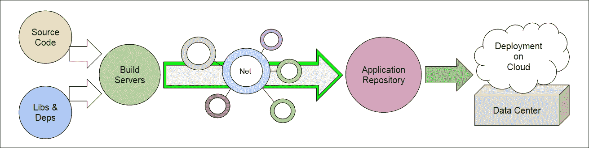
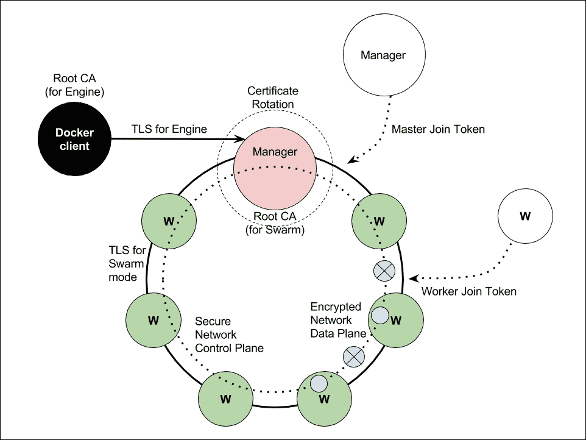
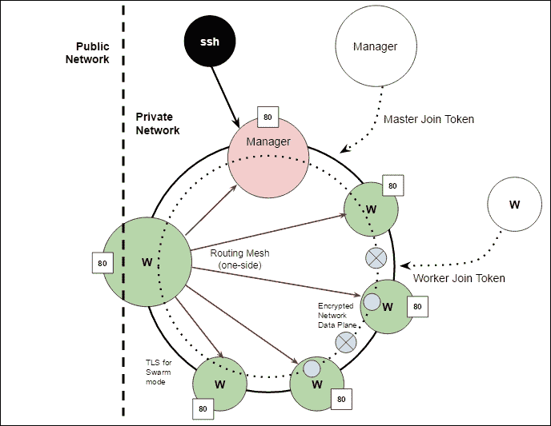

# 第九章。保护集群和 Docker 软件供应链

本章是关于 Swarm 集群安全性的。特别是，我们将研究以下主题:

*   带有 Docker 的软件供应链
*   关于如何保护群集的建议
*   使用文件公证来保护软件供应链

# 软件供应链



Docker 编排只是更大的软件供应链的一个组成部分。我们基本上以*源码*为原料*开始。*我们的源代码被编译并与*库和依赖包*链接。我们使用*构建服务*不断地将我们的源代码及其依赖项集成在一起，最终将它们组装成一个*产品*。然后，我们在互联网上运输产品，将其储存在其他地方。我们通常称这个仓库为*应用存储库*或简称为*存储库*。最后，我们将产品发送到客户的环境中，例如云或物理数据中心。

Docker 非常适合这个工作流程。开发人员在本地使用 Docker 来编译和测试应用，系统管理员使用 Docker 在构建服务器上部署这些应用，Docker 也可能在持续集成的过程中发挥重要作用。

这里有保安。我们需要一种安全的方式来签署我们的产品，然后将它推送到应用存储库。在以Docker为中心的世界里，我们将现成的产品储存在一个名为*Docker登记处*的仓库里。然后，每次在将签名的产品部署到我们运行 Docker Swarm 模式集群的生产系统之前，都会对其进行验证。

在本章的剩余部分，我们将讨论安全性的以下两个方面:

*   如何保护生产 Swarm 集群，这是我们通过最佳实践实现的
*   如何保证软件供应链的安全，这是我们通过 Docker 公证实现的

# 保护集群集群

回忆一下[第 4 章](04.html "Chapter 4. Creating a Production-Grade Swarm")、*创建生产级集群*中的安全集群的图片；我们将解释在 Docker Swarm 模型集群中发现的安全方面。



我们将管弦乐队作为 Docker Swarm 管理器的主要部分之一。Docker 安全团队的成员迪奥戈·莫尼卡在 2016 年柏林的编排最低特权演示中提到，编排中的每个组件都必须有它能做什么的限制。

*   **节点管理**:集群操作员可以指示指挥者为一组节点执行操作
*   **任务分配**:指挥者还负责给每个节点分配任务
*   **集群状态协调**:协调器通过将每个状态协调到期望的状态来维护集群的状态
*   **资源管理**:协调者为提交的任务提供和撤销资源

具有最低权限的编排者将使系统安全，基于这些功能定义了最低权限的编排者。遵循最小特权原则，经理和工人必须只能访问执行给定任务所需的信息和资源。

此外，迪奥戈还列出了以下五种不同的攻击模式，可应用于 Docker。它们被从最低到最高风险列出。

*   **外部攻击者**:防火墙外试图危害集群。
*   **内部攻击者**:不拥有交换机，但可以访问交换机。它可以发送数据包与集群中的节点通信。
*   **中间人**:可以监听网络中发生的一切，并可以进行主动攻击的攻击者。利用该模型，有一个 Swarm 集群，工作节点到管理节点的通信被拦截。
*   **恶意工作者节点**:工作者拥有的资源被攻击者有效拥有。
*   **恶意管理器节点**:管理器是一个攻击者，可以控制整个 Orchestrator 并获得所有可用资源的访问权限。这是最坏的情况。如果我们可以实现最少的特权，恶意的管理器节点只能攻击与之相关的工作人员。

# 保护集群:最佳实践

我们现在将总结保护 Swarm 集群的清单。Swarm 团队正在努力实现防止全栈攻击的目标，但以下规则适用于任何情况。

## 认证机构

保证安全性的第一个重要步骤是决定如何使用 CA。当您与第一个节点组成一个集群时，它将自动为整个集群创建一个自签名证书颁发机构。在旋转之后，它创建 CA，自己签署证书，为管理器添加证书，管理器就是它自己，并成为准备运行的 1 节点集群。当新节点加入时，它通过提供正确的令牌获得证书。每个节点都有自己的身份，并且是加密签名的。此外，系统为每个规则、工作人员或经理提供一个证书。角色在身份信息中，用来告诉谁是节点。在管理器泄漏根证书颁发机构的情况下，整个集群都会受到影响。Docker Swarm 模式支持外部 ca 来维护经理的身份。经理可以简单地将企业社会责任转发给外部认证中心，这样它就不需要维护自己的认证中心。请注意，目前唯一支持的协议是` cfssl`。以下命令是用外部证书颁发机构初始化集群。

```
$ docker swarm init --external-ca \  
    protocol=cfssl,url=https://ca.example.com

```

## 证书和相互 TLS

网络控制平面上的每个单个端点通信都必须有一个相互的 TLS，并且默认情况下是加密和授权的。这意味着工作人员不能伪装成管理员，外部攻击者也不能连接到端点并成功完成 TLS 握手，因为攻击者没有相互验证自身的密钥。这意味着每个节点都必须提供有效的 CA 签名证书，该证书具有与集群的每个规则相匹配的 OU 字段。如果工作人员连接到管理器端点，它将被拒绝访问。

证书轮换由 Swarm 自动完成。在 SwarmKit 和 Docker Swarm 模式下，您可以将证书轮换缩短至一小时。以下是调整证书到期时间的命令。

```
$ docker swarm update --cert-expiry 1h

```

## 加入令牌

节点用来加入群集的每个令牌都有以下四个组件:

*   SWMTKN，Swarm 前缀，允许在令牌泄露时进行查找或加密
*   令牌版本，当前为 1
*   允许引导的 CA 根证书的加密散列值
*   随机生成的秘密

以下是令牌的示例:

`SWMTKN-1-11lo1xx5bau6nmv5jox26rc5mr7l1mj5wi7b84w27v774frtko-e82x3ti068m9eec9w7q2zp9fe`

要访问群集，需要发送令牌作为证明。它就像集群密码。

好消息是，在令牌泄露的情况下，令牌可以是*使用以下命令之一简单地旋转* d。

```
$ docker swarm join-token --rotate worker
$ docker swarm join-token --rotate manager

```

## 用Docker机器添加 TLS

另一个好的实践是为所有管理器节点提供 Docker Machine 来自动设置额外的 TLS 层，以便远程 Docker 客户端可以安全地访问每个管理器。这可以简单地使用以下命令来完成，类似于我们在上一章中所做的:

```
 $ docker-machine create \
      --driver generic \
      --generic-ip-address=<IP> \
    mg0

```

### 在专用网络上形成集群

如果组建一个混合集群不是必需的，那么最佳实践之一就是我们应该组建一个所有节点都在本地专用网络上的集群。这样一来，覆盖网的数据就不需要加密，集群的性能也会更快。

当形成这种集群时，路由网格允许我们向公共网络接口公开任何工作人员，不一定是管理员。下图显示了集群配置。您可以看到，使用这种配置和 Docker 服务在入口网络上发布了端口 80。路由网格形成了一个星形网格，但我们对其进行了简化，仅显示了将 IPVS 负载平衡连接到其他节点的大 W 节点的一侧。大 W 节点有两个网络接口。它的公共接口允许节点充当整个集群的前端节点。通过这种架构，我们可以通过不向公共网络公开任何管理器节点来实现一定程度的安全性。



# 码头公证人

Docker 内容信任机制是使用 Docker 公证员([https://github.com/docker/notary](https://github.com/docker/notary))实现的，该公证员位于更新框架([https://github.com/theupdateframework/tuf](https://github.com/theupdateframework/tuf))上。TUF 是一个安全的框架，允许我们一次交付一组可信的内容。通过使发布和验证内容变得更容易，公证允许客户端和服务器形成可信的*集合*。如果我们有 Docker 映像，我们可以使用高度安全的离线密钥对其进行离线签名。然后，当我们发布该映像时，我们可以将其推送到公证服务器，该服务器可用于交付受信任的映像。公证是使用 Docker 为企业启用*安全软件供应链*的方式。

我们演示了如何设置我们自己的公证服务器，并使用它在推送至 Docker 注册表之前对 Docker 映像内容进行签名。先决条件是安装 Docker Compose 的最新版本。

第一步是克隆公证人(在本例中，我们将其版本固定为 0.4.2):

```
git clone https://github.com/docker/notary.git
cd notary
git checkout v0.4.2
cd notary

```

打开`docker-compose.yml`并添加映像选项，为签名者和服务器指定映像名称和标签。在这个例子中，我使用了 Docker Hub 来存储构建映像。所以是`chanwit/server:v042`和`hanwit/signer:v042`。更改此设置以反映您的本地配置。


那就从

```
$ docker-compose up -d

```

我们现在有一个公证服务器在 [https://127.0.0.1:4443](https://127.0.0.1:4443) 运行。为了使 Docker 客户端能够与公证人进行握手，我们需要将公证人服务器证书复制为该受信任地址的 CA(`127.0.0.4443`)。

```
$ mkdir -p ~/.docker/tls/127.0.0.1:4443/
$ cp ./fixtures/notary-server.crt 
    ~/.docker/tls/127.0.0.1:4443/ca.crt

```

之后，我们启用 Docker 内容信任，并将 Docker 内容信任服务器指向我们自己的`https://127.0.0.1:4443`公证处。

```
$ export DOCKER_CONTENT_TRUST=1
$ export DOCKER_CONTENT_TRUST_SERVER=https://127.0.0.1:4443 

```

然后，我们将该映像标记为新映像，并在启用 Docker 内容信任的同时推送该映像:

```
$ docker tag busybox chanwit/busybox:signed
$ docker push chanwit/busybox:signed

```

如果设置正确完成，我们将看到 Docker 客户端要求新的根密钥和新的存储库密钥。然后确认`chanwit/busybox:signed`签署成功。

```
The push refers to a repository [docker.io/chanwit/busybox]
e88b3f82283b: Layer already exists
signed: digest: 
sha256:29f5d56d12684887bdfa50dcd29fc31eea4aaf4ad3bec43daf19026a7ce69912 size: 527
Signing and pushing trust metadata
You are about to create a new root signing key passphrase. This passphrase
will be used to protect the most sensitive key in your signing system. Please
choose a long, complex passphrase and be careful to keep the password and the
key file itself secure and backed up. It is highly recommended that you use a
password manager to generate the passphrase and keep it safe. There will be no
way to recover this key. You can find the key in your config directory.
Enter passphrase for new root key with ID 1bec0c1:
Repeat passphrase for new root key with ID 1bec0c1:
Enter passphrase for new repository key with ID ee73739 (docker.io/chanwit/busybox):
Repeat passphrase for new repository key with ID ee73739 (docker.io/chanwit/busybox):
Finished initializing "docker.io/chanwit/busybox"
Successfully signed "docker.io/chanwit/busybox":signed

```

现在，我们可以试着画出同样的映像:

```
$ docker pull chanwit/busybox:signed
Pull (1 of 1): chanwit/busybox:signed@sha256:29f5d56d12684887bdfa50dcd29fc31eea4aaf4ad3bec43daf19026a7ce69912
sha256:29f5d56d12684887bdfa50dcd29fc31eea4aaf4ad3bec43daf19026a7ce69912: Pulling from chanwit/busybox
Digest: sha256:29f5d56d12684887bdfa50dcd29fc31eea4aaf4ad3bec43daf19026a7ce69912
Status: Image is up to date for chanwit/busybox@sha256:29f5d56d12684887bdfa50dcd29fc31eea4aaf4ad3bec43daf19026a7ce69912
Tagging chanwit/busybox@sha256:29f5d56d12684887bdfa50dcd29fc31eea4aaf4ad3bec43daf19026a7ce69912 as chanwit/busybox:signed

```

当我们提取一个未签名的映像时，这一次它将显示没有可信数据:

```
$ docker pull busybox:latest
Error: remote trust data does not exist for docker.io/library/busybox: 127.0.0.1:4443 does not have trust data for docker.io/library/busybox

```

# 介绍Docker的秘密

Docker 1.13 在 Swarm 中包含了秘密管理的新概念。

众所周知，我们需要 Swarm 模式来使用秘密。当我们初始化 Swarm 时，Swarm 会为我们生成一些秘密:

```
$ docker swarm init

```

Docker 1.13 为机密管理增加了一个新的命令 secret，目的是有效地处理它们。创建秘密子命令来检查和维护。

让我们创造我们的第一个秘密。`secret create`子命令从标准输入中获取一个秘密。所以我们需要输入我们的秘密，然后按 *Ctrl* + *D* 保存内容。注意不要按*进入*键。我们只需要`1234`而不需要`1234\n`作为我们的密码，例如:

```
$ docker secret create password
1234

```

然后按 *Ctrl* + *D* 两次关闭标准输入。

我们可以检查是否有一个名为密码的秘密:

```
$ docker secret ls 
ID                      NAME                CREATED             UPDATED
16blafexuvrv2hgznrjitj93s  password  25 seconds ago      25 seconds ago 
uxep4enknneoevvqatstouec2  test-pass 18 minutes ago      18 minutes ago

```

这是如何工作的？当我们创建新服务时，可以通过传递 secret 选项将 secret 的内容绑定到服务。秘密将是`/run/secrets/`目录中的一个文件。在我们的例子中，我们将有包含弦`1234`的`/run/secrets/password`。

秘密旨在取代环境变量的滥用。例如，在 MySQL 或 MariaDB 容器的情况下，其根密码应该设置为秘密，而不是通过环境变量以明文形式传递。

我们将展示一个小黑客，让 MariaDB 支持新的 Swarm 秘密，从以下`entrypoint.sh`开始:

```
$ wget https://raw.githubusercontent.com/docker-
library/mariadb/2538af1bad7f05ac2c23dc6eb35e8cba6356fc43/10.1/docker-entrypoint.sh

```

在`MYSQL_ROOT_PASSWORD`检查之前，我们将这一行放入这个脚本中，大约在第 56 行。

```
# check secret file. if exist, override
 if [ -f "/run/secrets/mysql-root-password" ]; then
 MYSQL_ROOT_PASSWORD=$(cat /run/secrets/mysql-root-password)
 fi

```

该代码检查是否存在`/run/secrets/mysql-root-password`。如果是这样，它会将秘密分配给环境变量`MYSQL_ROOT_PASSWORD`。

之后，我们可以准备一个 Dockerfile 来覆盖 MariaDB 的默认设置`docker-entrypoint.sh`。

```
FROM mariadb:10.1.19
RUN  unlink /docker-entrypoint.sh
COPY docker-entrypoint.sh /usr/local/bin/
RUN  chmod +x /usr/local/bin/docker-entrypoint.sh
RUN  ln -s usr/local/bin/docker-entrypoint.sh /

```

然后我们建立新的形象。

```
$ docker build -t chanwit/mariadb:10.1.19 .

```

回想一下，我们有一个名为密码的秘密，我们有一个映像，它允许我们从秘密文件`/run/secrets/mysql-root-password`中设置根密码。因此，映像在`/run/secrets`下需要一个不同的文件名。有了这个，我们可以使用带有完整选项的秘密(`source=password`、`target=mysql-root-password`)来使 Swarm 服务工作。例如，我们现在可以从这个马里亚数据库映像开始一个新的`mysql` Swarm 服务:

```
$ docker network create -d overlay dbnet
lsc7prijmvg7sj6412b1jnsot
$ docker service create --name mysql \
 --secret source=password,target=mysql-root-password \
 --network dbnet \
 chanwit/mariadb:10.1.19

```

为了查看我们的秘密是否有效，我们可以在同一个覆盖网络上启动一个 PHPMyAdmin 实例。不要忘记通过将`-e PMA_HOST=mysql`传递给`myadmin`服务来将这些服务链接在一起。

```
$ docker service create --name myadmin \
 --network dbnet --publish 8080:80 \
 -e PMA_HOST=mysql \
 phpmyadmin/phpmyadmin

```

然后你可以打开你的浏览器进入`http://127.0.0.1:8080`并以 root 用户身份登录`PHPMyAdmin`，密码是`1234`，我们通过 Docker 秘密提供的。

# 总结

在本章中，我们学习了保护群模式和 Docker 软件供应链。我们讨论了一些关于如何保护 Docker Swarm 集群在生产中使用的最佳实践。然后，我们进行公证，一个安全的交付机制，以允许 Docker 内容信任。本章最后概述了 Docker 1.13 中的一个新特性:机密管理。我们展示了如何使用 Docker Secret 安全地部署 MySQL MariaDB 服务器，而无需通过环境传递根密码。在下一章中，我们将了解如何在一些公共云提供商和 OpenStack 上部署 Swarm。