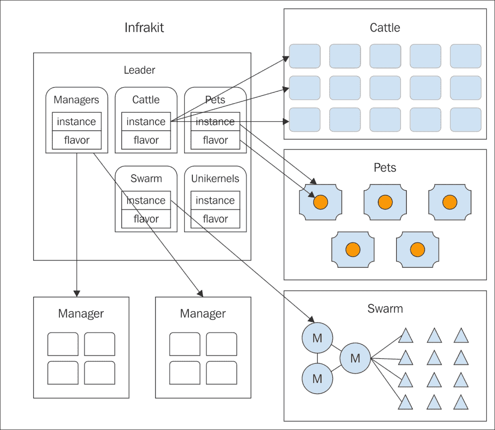
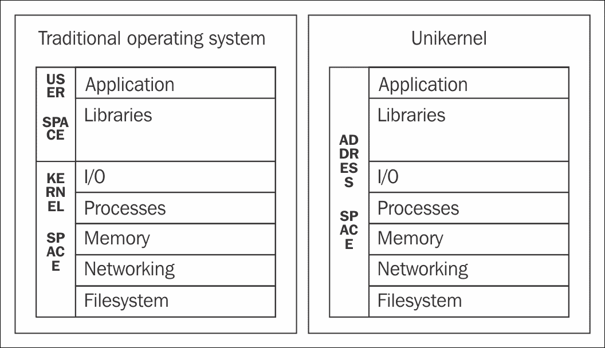

# 第十一章。下一步是什么？

Docker 生态系统正朝着更大的方向发展，Swarm 将是其中的核心组件之一。让我们假设一个路线图。

# 供应的挑战

目前还没有官方工具来创建一个大规模的 Swarm。目前，操作人员使用内部脚本、临时工具(如 Belt)、配置管理器(如 Puppet 或 Ansible)或编排模板(如 AWS 的 CloudFormation 或 OpenStack 的 Heat)，正如我们在前面几章中看到的那样。最近，AWS 和 Azure 的 Docker 作为替代品出现了。

但是这个用例可能会用软件定义的基础设施工具包以统一的方式来解决。

# 软件定义的基础设施

从容器作为构建模块开始，到创建系统来设计、编排、扩展、保护和部署应用和基础设施，长期目标可能是*可编程互联网*。

继 FlowKit 之后，这是编排套件，Docker 于 2016 年 10 月开源了基础架构套件 **Infrakit** 。

## 基础设施

而 Docker Engine 的重点是容器，Docker Swarm 的重点是编排，Infrakit 的重点是将*组*作为原语。群组适用于任何对象:宠物、牛、单核和蜂群。

Infrakit 解决了在不同基础设施中管理 Docker 的问题。在 Infrakit 之前，这很困难，而且不便携。其想法是从构建数据中心到运行裸容器提供一致的用户体验。Infrakit 是 Docker 目前用于创建可编程基础设施的最高级别抽象，它将自己描述为:

> *“infra kit 是一个用于创建和管理声明性、自我修复基础设施的工具包。它将基础设施自动化分解为简单的可插拔组件。这些组件协同工作，积极确保基础架构状态符合用户的规范。”*

栈中的 Infrakit 靠在容器发动机的侧面。

该组织是按组划分的。Infrakit 本身的结构有一个组，由保持配置的经理组成。一次只有一个领导者，例如，一些追随者有两个。每个经理都包括一些组声明。群体可以是牛、宠物、蜂群、单核等等。每个组都用实例(真正的资源，例如容器)和风格(资源的类型，例如 Ubuntu Xenial 或 MySQL Docker 映像)来定义。

Infrakit 是声明性的。它依赖于 JSON 配置，并在内部使用众所周知的封装和组合模式来将配置作为输入进行处理，并使基础架构收敛到特定的配置。

Infrakit 的目标是:

*   提供统一的工具包来管理组
*   可插拔
*   提供自我修复
*   发布滚动更新

组抽象了对象的概念。它们可以是任何大小和比例的组，也可以是命名的宠物、未命名的牛、Infrakit 经理本身和/或以上所有的组合。目前，在 Infrakit 中只有一个默认的组配置(默认插件)，但是新的组定义可能会在以后出现。默认组是一个显示操作的界面，例如监视/取消监视(启动和停止组)、执行/停止更新、更改组大小。

组由实例组成。它们可能是物理资源，如虚拟机或容器，或者是其他服务的接口，如 Terraform。

在实例上，你可以运行各种风格，例如，Zookeeper，MySQL，或者 Ubuntu Xenial。

组、实例和风格是可插入的:它们实际上作为可以用任何语言编写的插件运行。目前，Infrakit 提供了一些 Go 代码，这些代码在编译时会给出一组二进制文件，如 cli，可用于控制、检查和执行对组、实例和风格的操作，以及插件二进制文件，如 terraform、swarm 或 zookeeper。

Infrakit 被认为能够通过持续监控、检测异常和触发动作来管理不一致。这种适当性被称为自我修复，可以用来创建更强大的系统。

Infrakit 支持的主要操作之一是发布滚动更新来更新实例。例如，更新容器中的包，更新容器映像，或者其他，可以使用 **TUF** ( **更新框架**，这是下一节中描述的项目。

Infrakit 在写作的时候是如此的早和年轻，以至于我们不能展示任何不是 Hello World 的例子。在互联网上，它将很快充满 Infrakit Hello Worlds，Infrakit 团队自己也发布了一个分步教程，将它与文件或 Terraform 插件一起使用。我们可以将它描述为 Docker 生态系统中的架构层，并期望它能够部署甚至集群，提供主机并将其互连。

Infrakit 有望被包括在引擎中，可能在 1.14 版本中作为实验。

## TUF -更新框架

在柏林举行的 Docker Summit 16 上，讨论了另一个主题，TUF([https://theupdateframework.github.io/](https://theupdateframework.github.io/))，这是一个旨在提供安全的滚动更新方式的工具包。

有许多可用的更新工具，可以在实践中进行更新，但 TUF 要多得多。从项目的主页:

> *“TUF 帮助开发人员保护新的或现有的软件更新系统，这些系统经常容易受到许多已知攻击。TUF 通过提供一个全面、灵活的安全框架来解决这个普遍存在的问题，开发人员可以与任何软件更新系统集成。”*

TUF 已经集成到 Docker 中，该工具被称为公证人，正如我们在[第 9 章](09.html "Chapter 9. Securing a Swarm Cluster and the Docker Software Supply Chain")、*保护集群和 Docker 软件供应链*中看到的，公证人可以使用。公证可以用来验证内容，使密钥管理变得容易。通过公证，开发人员可以使用密钥对其内容进行离线签名，然后通过将其签名的可信集合推送到公证服务器来使内容可用。

TUF 会被合并到 Docker Infrakit 中作为滚动更新机制吗？这将是又一个惊人的进步。

# 坞站堆和复合物

开发人员可以使用但仍处于实验阶段的另一个 Docker 特性是 Stacks。我们在[第 6 章](06.html "Chapter 6. Deploy Real Applications on Swarm")、*中介绍了栈，在 Swarm* 上部署真实应用。它们将成为在集群上部署应用的默认方法。这个想法不是将容器放入运动中，而是将包装成捆的容器组推出。

此外，组合和新的 Swarm 之间的新集成也是可以预期的。

# CaaS -容器即服务

在 XaaS 竞技场，一切都被视为软件，不仅容器是一流的公民，而且编排系统和基础设施也将是。所有这些抽象将导致运行这个工具生态系统的云定义方式:容器即服务。

CaaS 的一个例子是 Docker 数据中心。

# 单核

我们说，作为一个工具包，SwarmKit 不仅会运行容器集群，还会运行 unikernels 集群。

什么是 unikernels，为什么它们如此神奇？

如果你使用 Docker For Mac，你已经在使用单内核了。它们是这些系统的核心。在 Mac 上，**xyve，**FreeBSD 虚拟化系统的一个端口 **(bhyve)，**在单内核模式下运行 Docker 主机。

我们都喜欢容器，因为它们又小又快，但是拥有一种机制来抽象内核并使其组件(容器)共享系统资源、库、二进制文件的安全含义确实令人担忧。只要在任何搜索引擎上寻找关于容器安全的 CVEs 公告。这是一个严重的问题。

Unikernels 承诺在最高级别重新评估软件架构。这里很快解释一下。有一种有效的方法来保证最大的安全性，并且由于它们的性质，它们以非常非常小的尺寸运行。在我们谈论 Terabytes、Petabytes 和更高版本的世界中，你会惊讶地知道像 ukvm 这样的 KVM 的单内核实现可以容纳 67Kb(千字节)、300Kb 的网络服务器二进制文件或几兆字节量级的操作系统映像。

这是可能的，因为 unikernels 基本上不会向栈公开所有的系统调用，但是这些调用包含在二进制文件本身中。一个 **ping** 二进制不需要任何系统调用来访问磁盘、使用加密函数或管理系统进程。那么，为什么不切断 ping 的这些呼叫，并为其提供所需的最低限度呢？这是 unikernels 背后的主要思想。在内部会用*编译一个 ping 命令，一些网络输入输出，原始套接字，仅此而已。*

对于 unikernels，内核和用户空间没有区别，因为地址表是统一的。这意味着地址表是*连续的*。如前所述，这是可能的，因为编译单内核二进制文件时，会在二进制文件中嵌入所需的系统功能，如输入/输出操作、内存管理或共享库*。在传统的操作系统模型中，应用在*运行时*查看和使用系统调用，而对于 unikernels，这些系统调用在*编译时*静态链接。*

乍一看这可能很奇怪，但就进程隔离和安全性而言，这是一个巨大的进步。即使有人能够欺诈性地引入一些运行单内核的系统，她也几乎不可能发现任何安全漏洞。攻击面是如此之小，以至于除了正在使用的系统调用或功能之外，极不可能有任何可利用的未使用的系统调用或功能，可能已经被强化了。没有外壳可以调用，没有外部实用程序库或脚本，没有配置或密码文件，没有额外的端口绑定。

那么 unikernels 和 Docker 呢？

在巴塞罗那的 DockerConEU 15 上，一些人跳到舞台上展示如何将 Docker 与 unikernels 集成，后来 Docker Inc .最终收购了该公司，在其他事物之间签署了 Docker For Mac 的诞生。

在柏林举行的 Docker Summit 16 上，有人提到了 unikernels 与容器一起在 SwarmKit 中运行。融合的未来即将到来。

# 向Docker投稿

Docker 中的所有这些创新都是可能的，因为这些项目依赖于非常广泛的社区。Docker 是一个非常紧张和活跃的项目，分为几个 Github 存储库，其中最值得注意的是:

*   Docker本身，发动机:[www.github.com/docker/docker](https://github.com/docker/docker)
*   机器，Docker 托管实例化器:[www.github.com/docker/machine](https://github.com/docker/machine)
*   Swarm，编排服务:[www.github.com/docker/swarmkit](https://github.com/docker/swarmkit)
*   组合，微服务建模工具:[www.github.com/docker/compose](https://github.com/docker/compose)
*   Infrakit，基础设施经理:[www.github.com/docker/infrakit](https://github.com/docker/infrakit)

但是，没有它们的库，这些项目也不会运行，例如 Libcontainer、Libnet、Libcust(等待与 not 合并)和许多其他项目。

没有 Docker 团队和 Docker 社区的承诺，所有这些代码都不会存在。

## Github

鼓励任何公司或个人为项目做出贡献。在[https://github . com/docker/docker/blob/master/CONTINUED . MD](https://github.com/docker/docker/blob/master/CONTRIBUTING.md)有一些指南。

## 文件问题

一个很好的开始方式是通过在相关项目的 GitHub 空间中打开问题来报告异常、bug 或提交想法。

## 代码

另一个很受欢迎的帮助方式是提交请求来修复问题或提出新的特性。这些报告应遵循并参考记录在“问题”页面中的一些问题，并与指导原则保持一致。

## 带等项目

此外，伴随着这本书，许多迷你项目开始了:

*   Swarm2k 和 Swarm3k，作为面向社区的实验，大规模创建 Swarm。一些代码、指令和结果可在[www.github.com/swarmzilla](https://github.com/swarmzilla)各自的存储库中获得。
*   皮带作为 Docker 主机供应器。目前只包括 DigitalOcean 驱动，但可以进一步扩展。
*   用于 Swarm、Machine 和 Docker 证书的可转换模块，将在可转换游戏手册中使用。
*   容器被推送到 Docker Hub 以说明特定组件(如`fsoppelsa/etcd`)或引入新功能(如`fsoppelsa/swarmkit`)。
*   其他次要的请求、黑客攻击和代码部分..

本着开源的精神，以上所有都是自由软件，任何贡献、改进或批评都非常值得赞赏。

# 总结

最后，几句关于这本书历史的话，以及一个关于 Docker 发展速度惊人的注释。

当写一本关于 Docker Swarm 的书的项目刚刚起草时，当时只有旧的 Docker Swarm 独立模式，Swarm 容器负责编排容器的基础设施，不得不依赖外部发现系统，如 Etcd、Consul 或 Zookeeper。

回顾这些时间，就在几个月前，就像思考史前史。就在 6 月下旬，当 SwarmKit 作为一个编排工具包开源，并作为 Swarm Mode 包含在引擎中时，Docker 在编排方面向前迈出了一大步。发布了一个完整的、可扩展的、安全的、简单的本地编排 Docker 的方法。然后，事实证明，编排 Docker 的最佳方式只是 Docker 本身。

但是当 Infrakit 在 2016 年 10 月开源时，在基础设施方面又向前迈出了一大步:现在不仅业务流程和容器组是原语，而且其他对象组，甚至混合在 Infrakit 的原始意图中，也是:容器、虚拟机、单内核，可能还有裸机。

在(不久的)将来，我们可以期望所有这些项目都被粘合起来，让 Infrakit 作为基础设施管理器，能够提供群集(任何东西)，其中容器或其他对象被编排、互连、存储(完全状态)、滚动更新、通过覆盖网络互连和保护。

Swarm 只是这个大生态系统的开始。