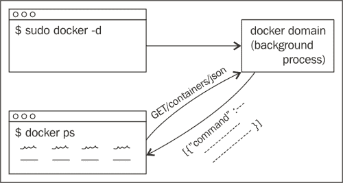
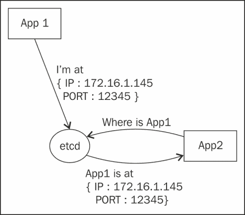
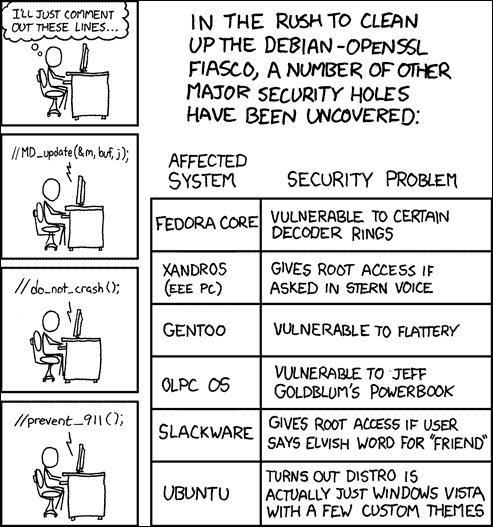

# 四、自动化和最佳实践

在这一点上，我们现在知道如何在我们的开发环境中设置 Docker，对 Docker 命令感到满意，并且对 Docker 适合的情况有了一个很好的想法。我们还知道如何配置 Docker 及其容器来满足我们的所有需求。

在这一章中，我们将集中讨论各种使用模式，这些模式将帮助我们在生产环境中部署 web 应用。我们将从 Docker 的远程 API 开始，因为登录到生产服务器并运行命令总是被认为是危险的。因此，最好运行一个应用来监控和编排主机中的容器。Docker 目前有大量的编排工具可用，随着 v1.0 的发布，Docker 还宣布了一个新项目 **libswarm** ，它为管理和编排分布式系统提供了一个标准界面，这将是我们将深入研究的另一个主题。

Docker 开发人员建议每个容器只运行一个进程。如果你想检查一个已经运行的容器，这是很困难的。我们将看一个命令，它允许我们将一个进程注入到一个已经运行的容器中。

随着组织的增长，负载也在增长，您需要开始考虑扩展。Docker 本身意味着在单个主机中使用，但是通过使用大量工具，如`etcd`和`coreos`，您可以轻松地在集群中运行一堆 Docker 主机，并发现该集群中的所有其他容器。

每个在生产环境中运行 web 应用的组织都知道安全性的重要性。在本章中，我们将不仅讨论`docker`守护进程的安全方面，还将讨论 Docker 使用的各种 Linux 特性。总之，在本章中，我们将了解以下内容:

*   远程 API Docker
*   使用 Docker exec 命令将进程注入容器
*   服务发现
*   安全

# Docker 远程 API

Docker 二进制文件既可以作为客户端运行，也可以作为守护进程运行。当 docker 作为守护进程运行时，默认情况下，它会在`unix:///var/run/docker.sock`将自己附加到一个 Unix 套接字上(当然，这可以在启动 Docker 时更改)，并通过 REST 接受命令。然后，相同的 Docker 二进制文件可以用于运行所有其他命令(这只是客户端对`docker`守护程序进行 REST 调用)。

`docker`守护进程的示意图如下所示:



这一部分将主要用例子来解释，因为我们在查看 Docker 命令时已经遇到了这些操作的工作。

要测试这些应用编程接口，请在一个 TCP 端口上运行`docker`守护程序，如下所示:

```
$ export DOCKER_HOST=tcp://0.0.0.0:2375
$ sudo service docker restart
$ export DOCKER_DAEMON=http://127.0.0.1:2375 # or IP of your host

```

### 注

这不是参考指南，因为当我们在[第 2 章](2.html "Chapter 2. Docker CLI and Dockerfile")、 *Docker CLI 和 Dockerfile* 中讨论 Docker 命令时，我们已经介绍了 Docker 可用的特性。相反，我们将覆盖一个精选的几个原料药，你可以在[docs.docker.com/reference/api/docker_remote_api](http://docs.docker.com/reference/api/docker_remote_api)查阅其余的。

在我们开始之前，让我们确保`docker`守护程序正在响应我们的请求:

```
$ curl $DOCKER_DAEMON/_ping
OK

```

好吧，一切都很好。我们走吧。

## 容器远程 API

让我们首先看看有助于创建和管理容器的几个可用端点。

### 创建命令

`create`命令创建一个容器:

```
$ curl \
> -H "Content-Type: application/json" \
> -d '{"Image":"ubuntu:14.04",\
> "Cmd":["echo", "I was started with the API"]}' \
> -X POST $DOCKER_DAEMON/containers/create?\
> name=api_container;
{"Id":"4e145a6a54f9f6bed4840ac730cde6dc93233659e7eafae947efde5caf583f c3","Warnings":null}

```

### 注

`curl`实用程序是一个简单的 Unix 实用程序，可以用来构造 HTTP 请求和分析响应。

在这里，我们向`/containers/create`端点发出`POST`请求，并传递一个`JSON`对象，该对象包含我们希望容器基于的映像细节和我们期望容器运行的命令。

请求类型:开机自检

`JSON`数据随`POST`请求一起发送给:

<colgroup><col style="text-align: left"> <col style="text-align: left"> <col style="text-align: left"></colgroup> 
| 

参数

 | 

类型

 | 

说明

 |
| --- | --- | --- |
| 

```
config

```

 | `JSON` | 描述要启动的容器的配置 |

开机自检请求的查询参数:

<colgroup><col style="text-align: left"> <col style="text-align: left"> <col style="text-align: left"></colgroup> 
| 

参数

 | 

类型

 | 

说明

 |
| --- | --- | --- |
| 

```
name

```

 | `String` | 这个给容器指定一个名称。必须匹配`/?[a-zA-Z0-9_-]+`正则表达式。 |

下表显示了响应的状态代码:

<colgroup><col style="text-align: left"> <col style="text-align: left"></colgroup> 
| 

状态代码

 | 

意义

 |
| --- | --- |
| 

```
201

```

 | 没有错误 |
| 

```
404

```

 | 没有这样的容器 |
| 

```
406

```

 | 无法连接(容器未运行) |
| 

```
500

```

 | 内部服务器错误 |

### 列表命令

`list`命令获取容器列表:

```
$ curl $DOCKER_DAEMON/containers/json?all=1\&limit=1
[{"Command":"echo 'I was started with the API'","Created":1407995735,"Id":"96bdce1493715c2ca8940098db04b99e3629 4a333ddacab0e04f62b98f1ec3ae","Image":"ubuntu:14.04","Names":["/api_c ontainer"],"Ports":[],"Status":"Exited (0) 3 minutes ago"}

```

这是一个`GET`请求 API。对`/containers/json`的请求将返回一个包含符合标准的容器列表的`JSON`响应。这里，通过`all`查询参数将列出没有运行的容器。`limit`参数是将在响应中列出的容器数量。

这些 API 调用可以提供查询参数，可以微调响应。

请求类型:获取

<colgroup><col style="text-align: left"> <col style="text-align: left"> <col style="text-align: left"></colgroup> 
| 

参数

 | 

类型

 | 

说明

 |
| --- | --- | --- |
| 

```
all

```

 | 1/ `True` / `true`或 0/ `False` / `false` | 这个告诉是否应该显示所有的容器。默认情况下，只显示正在运行的容器。 |
| 

```
limit

```

 | `Integer` | 此显示最后[ *n* ]个容器，包括非运行容器。 |
| 

```
since

```

 | `Container` `ID` | 此仅显示从[x]开始的容器，包括未运行的容器。 |
| 

```
before

```

 | `Container` `ID` | 这仅显示在[x]之前启动的容器，包括未运行的容器。 |
| 

```
size

```

 | 1/ `True` / `true`或 0/ `False` / `false` | 这个告诉是否应该在响应中显示容器尺寸。 |

响应的状态代码遵循相关**请求******注释** ( **RFC** ) 2616:**

 **<colgroup><col style="text-align: left"> <col style="text-align: left"></colgroup> 
| 

状态代码

 | 

意义

 |
| --- | --- |
| 

```
200

```

 | 没有错误 |
| 

```
400

```

 | 错误参数和客户端错误 |
| 

```
500

```

 | 服务器错误 |

容器的其他端点可以在[docs . docker . com/reference/API/docker _ remote _ API _ v 1.13/# 21-containers](http://docs.docker.com/reference/api/docker_remote_api_v1.13/#21-containers)上阅读。

## 远程映像应用编程接口

类似于容器，也有构建和管理映像的 API。

### 列出本地 Docker 映像

以下命令列出了本地映像:

```
$ curl $DOCKER_DAEMimg/json
[{"Created":1406791831,"Id":"7e03264fbb7608346959378f270b32bf31daca14d15e9979a5803ee32e9d2221","ParentId":"623cd16a51a7fb4ecd539eb1e5d9778 c90df5b96368522b8ff2aafcf9543bbf2","RepoTags":["shrikrishna/apt- moo:latest"],"Size":0,"VirtualSize":281018623} ,{"Created":1406791813,"Id":"c5f4f852c7f37edcb75a0b712a16820bb8c729a6 a5093292e5f269a19e9813f2","ParentId":"ebe887219248235baa0998323342f7f 5641cf5bff7c43e2b802384c1cb0dd498","RepoTags":["shrikrishna/onbuild:l atest"],"Size":0,"VirtualSize":281018623} ,{"Created":1406789491,"Id":"0f0dd3deae656e50a78840e58f63a5808ac53cb4 dc87d416fc56aaf3ab90c937","ParentId":"061732a839ad1ae11e9c7dcaa183105 138e2785954ea9e51f894f4a8e0dc146c","RepoTags":["shrikrishna/optimus:g it_url"],"Size":0,"VirtualSize":670857276}

```

这个是一个 `GET`请求 API。img/json`的请求将返回一个`JSON`响应，其中包含符合标准的映像的详细信息。

请求类型:获取

<colgroup><col style="text-align: left"> <col style="text-align: left"> <col style="text-align: left"></colgroup> 
| 

参数

 | 

类型

 | 

说明

 |
| --- | --- | --- |
| 

```
all

```

 | 1/ `True` / `true`或 0/ `False` / `false` | 这个告诉是否应该显示中间容器。默认情况下为 False。 |
| 

```
filters

```

 | `JSON` | 这些用于提供过滤后的映像列表。 |

映像的其他端点可在[docs . docker . com/reference/API/docker _ remote _ API _ v 1.13/# 22-images](http://docs.docker.com/reference/api/docker_remote_api_v1.13/#22-images)上阅读。

## 其他操作

还有其他的 API 也有，比如我们在本节开头检查的 ping API。其中一些将在下一节中探讨。

### 获取全系统信息

以下命令获取 Docker 上的全系统信息。这是处理`docker info`命令的端点:

```
$ curl $DOCKER_DAEMON/info
{"Containers":41,"Debug":1,"Driver":"aufs","DriverStatus":[["Root Dir","/mnt/sda1/var/lib/docker/aufs"],["Dirs","225"]],"ExecutionDrive r":"native- 0.2","IPv4Forwarding":1,"Images":142,"IndexServerAddress":"https://in dex.docker.io/v1/","InitPath":"/usr/local/bin/docker","InitSha1":""," KernelVersion":"3.15.3- tinycore64","MemoryLimit":1,"NEventsListener":0,"NFd":15,"NGoroutines ":15,"Sockets":["unix:///var/run/docker.sock","tcp://0.0.0.0:2375"]," SwapLimit":1}

```

### 从容器提交映像

以下命令提交一个来自容器的映像:

```
$ curl \
> -H "Content-Type: application/json" \
> -d '{"Image":"ubuntu:14.04",\
> "Cmd":["echo", "I was started with the API"]}' \
> -X POST $DOCKER_DAEMON/commit?\
> container=96bdce149371\
> \&m=Created%20with%20remote%20api\&repo=shrikrishna/api_image;

{"Id":"5b84985879a84d693f9f7aa9bbcf8ee8080430bb782463e340b241ea760a5a 6b"}

```

提交是对`/commit`参数的`POST`请求，该参数包含其所基于的映像的数据以及与将在提交时创建的映像相关联的命令。关键信息包括要提交的`container` `ID`参数、提交消息及其所属的存储库，所有这些都作为查询参数传递。

请求类型:开机自检

随着`POST`请求一起发送的`JSON`数据:

<colgroup><col style="text-align: left"> <col style="text-align: left"> <col style="text-align: left"></colgroup> 
| 

参数

 | 

类型

 | 

说明

 |
| --- | --- | --- |
| 

```
config

```

 | `JSON` | 这个描述了要提交的容器的配置 |

下表显示了`POST`请求的查询参数:

<colgroup><col style="text-align: left"> <col style="text-align: left"> <col style="text-align: left"></colgroup> 
| 

参数

 | 

类型

 | 

说明

 |
| --- | --- | --- |
| 

```
container

```

 | `Container ID` | 您打算提交的容器的`ID` |
| 

```
repo

```

 | `String` | 要在其中创建映像的存储库 |
| 

```
tag

```

 | `String` | 新映像的标签 |
| 

```
m

```

 | `String` | 提交消息 |
| 

```
author

```

 | `String` | 作者信息 |

下表显示了响应的状态代码:

<colgroup><col style="text-align: left"> <col style="text-align: left"></colgroup> 
| 

状态代码

 | 

意义

 |
| --- | --- |
| 

```
201

```

 | 没有错误 |
| 

```
404

```

 | 没有这样的容器 |
| 

```
500

```

 | 内部服务器错误 |

### 保存映像

从以下命令获取存储库的所有映像和元数据的 tarball 备份:

```
$ curl $DOCKER_DAEMimg/shrikrishna/code.it/get > \
> code.it.backup.tar.gz

```

这将需要一些时间，因为映像必须首先被压缩成一个 tarball，然后进行流式传输，但之后它将被保存在 tar 档案中。

其他端点可以在[docs . docker . com/reference/API/docker _ remote _ API _ v 1.13/# 23-misc](http://docs.docker.com/reference/api/docker_remote_api_v1.13/#23-misc)上阅读。

## Docker 的工作方式

现在我们已经意识到我们运行的每个 Docker 命令只不过是客户端执行的一系列 RESTful 操作，让我们进一步了解当您运行一个`docker run`命令时会发生什么:

1.  要创建一个应用编程接口，需要调用`/containers/` `create`参数。
2.  如果响应的状态代码是 404，则表示映像不存在。尝试使 img/create`参数拉取映像，返回步骤 1。
3.  获取创建的容器的`ID`，并使用`/containers/(id)/start`参数启动它。

这些应用编程接口调用的查询参数将取决于传递给`docker run`命令的标志和参数。

# 使用 Docker 执行命令将进程注入容器

在您探索 Docker 的过程中，您可能想知道 Docker 实施的每个容器一个命令规则是否限制了它的功能。事实上，假设 Docker 容器只运行一个进程是可以原谅的。但是没有！一个容器可以运行任意数量的进程，但只能从一个命令开始，并且只要与该命令相关联的进程运行，该容器就会一直存在。这个限制已经被强制执行，因为 Docker 相信每个容器一个应用的理念。典型的依赖于 Docker 的应用架构将由多个容器组成，每个容器运行一个专门的服务，所有容器都链接在一起，而不是将所有内容加载到一个容器中。这有助于保持容器的轻便，使调试更容易，减少攻击媒介，并确保如果一个服务出现故障，其他服务不会受到影响。

但是，有时您可能需要在容器运行时查看它。随着时间的推移，Docker 社区已经采用了许多方法来调试正在运行的容器。一些成员将 SSH 加载到容器中，并运行一个流程管理解决方案，如 **主管**来运行 SSH +应用服务器。然后出现了诸如**和**这样的工具，它们帮助在容器运行的命名空间中生成一个外壳。然而，所有这些解决方案都是黑客攻击。因此，对于 v1.3，Docker 决定提供`docker exec`命令，这是一个可以调试正在运行的容器的安全替代方法。****

 **`docker exec`命令允许用户通过 Docker API 和 CLI 在 Docker 容器中生成一个进程，例如:

```
$ docker run -dit --name exec_example -v $(pwd):/data -p 8000:8000 dockerfile/python python -m SimpleHTTPServer
$ docker exec -it exec_example bash

```

第一个命令启动一个简单的文件服务器容器。容器通过`-d`选项发送到后台。在第二个命令中，使用`docker` `exec`，我们通过在容器内部创建一个 bash 进程来登录容器。现在，我们将能够检查容器、读取日志(如果我们已经登录到一个文件中)、运行诊断(如果由于一个错误而需要检查)等等。

### 注

Docker 仍然没有改变其每个容器一个应用的理念。`docker exec`命令的存在只是为了给我们提供一种检查容器的方法，否则就需要变通办法或黑客攻击。

# 服务发现

Docker 从可用地址池中动态地为容器分配一个 IP。虽然这在某些方面是好的，但是当您运行需要相互通信的容器时，它会产生一个问题。你只是不知道当建立一个映像时它的 IP 地址会是什么。你的第一反应可能是启动容器，然后登录它们(通过`docker` `exec`)，并手动设置其他容器的 IP 地址。但是请记住，当容器重新启动时，该 IP 地址可能会改变，因此您必须手动登录到每个容器并输入新的 IP 地址。有没有更好的方法？是的，有。

服务发现是为了让服务知道如何找到其他服务并与之通信而需要做的一切的集合。在服务发现下，容器在刚启动时并不知道它们的对等体。相反，他们动态地发现它们。当容器在同一个主机中时，以及当它们在集群中时，这都应该起作用。

有两种技术可以实现服务发现:

*   使用默认的 Docker 功能，如名称和链接
*   使用专用服务，如`Etcd`或`Consul`

## 使用 Docker 名称、链接和大使容器

我们在[第 3 章](3.html "Chapter 3. Configuring Docker Containers")*配置 Docker 容器*的*链接容器*一节中学习了如何链接 Docker。为了刷新你的记忆，这就是它的工作原理。

### 使用链接使容器彼此可见

链接的使用如下图所示:


链接允许一个容器连接到另一个容器，而不需要硬编码它的 IP 地址。在启动第二个容器时，通过在`/etc/hosts`中插入第一个容器的 IP 地址来实现。

使用`--link`选项启动容器时，可以指定一个链接:

```
$ docker run --link CONTAINER_IDENTIFIER:ALIAS . . .

```

您可以在[第 3 章](3.html "Chapter 3. Configuring Docker Containers")、*配置 Docker 容器*中找到更多关于链接的信息。

### 使用大使容器的跨主机链接

下图表示使用大使容器的跨主机链接:


大使容器用于跨主机链接容器。在这种架构下，无需重启应用容器，就可以重启/替换数据库容器。

您可以在[第 3 章](3.html "Chapter 3. Configuring Docker Containers")、*配置 Docker 容器*中找到更多关于大使容器的信息。

## 使用 etcd 的服务发现

为什么我们需要专门的服务发现解决方案？虽然大使容器和链接解决了不需要知道其 IP 地址就能找到容器的问题，但它们确实有一个致命的缺陷。您仍然需要手动监控容器的运行状况。

想象一下这样一种情况，您有一个后端服务器和前端服务器通过大使容器链接到它们的集群。如果其中一台服务器出现故障，前端服务器仍然会继续尝试连接后端服务器，因为就它们而言，这是唯一可用的后端服务器，这当然是错误的。

现代服务发现解决方案，如`etcd`、`Consul`和`doozerd`不仅仅是提供正确的 IP 地址和端口。实际上，它们是分布式键值存储，但具有容错性和一致性，并在失败时处理主选举。它们甚至可以充当锁服务器。

`etcd`服务是由 **CoreOS** 开发的开源分布式键值商店。在集群中，`etcd`客户端运行在集群中的每台机器上。`etcd`服务在网络分区和当前主设备丢失期间优雅地处理主设备选举。

您的应用可以向`etcd`服务读写数据。`etcd`服务的常见示例是存储数据库连接详细信息、缓存设置等。

这里列出了`etcd`服务的特性:

*   简单、可卷曲的应用编程接口(HTTP + JSON)
*   可选 **安全** **套接字** **层** ( **SSL** )客户端证书认证
*   按键支持**时间**T3】到 T5】直播 ( **TTL**

### 注

`Consul`服务是`etcd`服务的一个很好的替代。没有理由选择一个而不是另一个。本节旨在向您介绍服务发现的概念。

我们在以下两个阶段使用`etcd`服务:

1.  我们向`etcd`服务注册我们的服务。
2.  We do a lookup to find services thus registered.

    下图显示了`etcd`服务:

    

这看起来像是一个简单的任务，但是构建一个容错和一致的解决方案并不简单。如果服务失败，您还需要得到通知。如果您以简单的集中式方式运行服务发现解决方案本身，它可能会成为单点故障。因此，服务发现服务器集群中的所有实例都需要与正确的答案同步，这就产生了有趣的方法。CoreOS 的团队开发了一种被称为**筏**的共识算法来解决这个问题。你可以在[网站上了解更多。](http://raftconsensus.github.io)

让我们看一个例子来了解一下情况。在这个例子中，我们将在一个容器中运行`etcd`服务器，看看注册一个服务并发现它有多容易。

1.  第一步:运行`etcd`服务器:

    ```
    $ docker run -d -p 4001:4001 coreos/etcd:v0.4.6 -name myetcd

    ```

2.  Step 2: Once the image is downloaded and the server starts, run the following command to register a message:

    ```
    $ curl -L -X PUT http://127.0.0.1:4001/v2/keys/message -d value="Hello"
    {"action":"set","node":{"key":"/message","value":"Hello","modifiedIndex":3,"createdIndex":3}}

    ```

    这只不过是在`/v2/keys/message`路径上对服务器的`PUT`请求(`message`是这里的关键)。

3.  第三步:用以下命令取回钥匙:

    ```
    $ curl -L http://127.0.0.1:4001/v2/keys/message
    {"action":"get","node":{"key":"/message","value":"Hello","modifiedIndex":4,"createdIndex":4}}

    ```

您可以通过更改值、尝试无效密钥等方式继续进行实验。你会发现响应在`JSON`中，这意味着你可以很容易地将其与你的应用集成在一起，而不需要使用任何库。

但是我将如何在我的应用中使用它呢？如果你的应用需要运行多个服务，可以用链接和大使容器连接在一起，但是如果其中一个变得不可用或者需要重新部署，需要做大量的工作来恢复链接。

现在假设您的服务使用`etcd`服务。每个服务根据它的名称注册它的 IP 地址和端口号，并通过它们的名称发现其他服务(这些名称是不变的)。现在，如果一个容器因为崩溃/重新部署而重新启动，新容器将根据修改后的 IP 地址进行注册。这将更新`etcd`服务为后续发现请求返回的值。然而，这意味着单个`etcd`服务器也可能是单点故障。对此的解决方案是运行一组`etcd`服务器。这就是由 CoreOS(创建`etcd`服务的团队)开发的 Raft 共识算法的作用。通过`etcd`服务部署应用服务的完整示例可在[http://jasonwilder . com/blog/2014/07/15/docker-service-discovery/](http://jasonwilder.com/blog/2014/07/15/docker-service-discovery/)上找到

## Docker 编排

一旦你从简单的应用扩展到复杂的架构，你就会开始使用工具和服务，比如`etcd`、`consul`和`serf`，你会注意到它们都有自己的一套 API，即使它们有重叠的特性。如果您将您的基础架构设置为一套工具，并且发现需要切换，那么切换供应商需要相当大的努力，有时甚至需要更改代码。这种情况可能会导致供应商锁定，这将破坏 Docker 成功创建的有前途的生态系统。为了给这些服务提供商提供一个标准的接口，以便他们几乎可以用作即插即用的解决方案，Docker 发布了一套编排服务。在本节中，我们将看一看它们。然而，请注意，在撰写本书时，这些项目(机器、群和合成)仍在 Alpha 中并处于积极开发中。

## Docker 机器

Docker Machine 旨在提供一个单一的命令，带你从零到 Docker 项目。

在 Docker Machine 之前，如果您打算在新主机上开始使用 Docker，无论是虚拟机还是基础架构提供商(如**亚马逊** **网络** **服务** ( **AWS** )或数字海洋)中的远程主机，您都必须登录该实例，并运行该实例中运行的操作系统特定的设置和配置命令。

对于 Docker Machine，无论是在新笔记本电脑上、在数据中心的虚拟机上还是在公共云实例上配置`docker`守护程序，同一个命令都会让目标主机准备好运行 Docker 容器:

```
$ machine create -d [infrastructure provider] [provider options] [machine name]

```

然后，您可以从同一个界面管理多个 Docker 主机，而不管它们的位置如何，并在它们上面运行任何 Docker 命令。

除此之外，该机器还具有可插拔后端，这使得向基础设施提供商添加支持变得容易，同时保留了通用的面向用户的应用编程接口。默认情况下，机器附带驱动程序，以便在本地使用 Virtualbox 以及在数字海洋实例上远程配置 Docker。

注意 Docker Machine 是一个独立于 Docker 引擎的项目。你可以在 https://github.com/docker/machine 的 Github 页面找到这个项目的更新细节。

## 蜂群

**Swarm** 是 Docker 提供的原生聚类解决方案。它采用了 Docker 引擎，并将其扩展到，使您能够处理一组容器。使用 Swarm，您可以管理 Docker 主机的资源池，并安排容器在上面透明地运行，自动管理工作负载并提供故障转移服务。

为了进行调度，它会考虑容器的资源需求，查看主机中的可用资源，并尝试优化工作负载的放置。

例如，如果您想要调度一个需要 1 GB 内存的 Redis 容器，以下是您如何使用 Swarm 调度它:

```
$ docker run -d -P -m 1g redis

```

除了资源调度，Swarm 还支持基于策略的调度，具有标准和自定义约束。例如，如果您想在固态硬盘支持的主机上运行您的 **MySQL** 容器(为了确保更好的读写性能)，您可以指定如下:

```
$ docker run -d -P -e constraint:storage=ssd mysql

```

除了所有这些，Swarm 还提供高可用性和故障转移。它持续监控容器的运行状况，如果一个容器发生故障，它会通过将 Docker 容器从故障主机移动并重新启动到新主机来自动重新平衡。最好的部分是，无论您是从一个实例开始还是扩展到 100 个实例，界面都保持不变。

和 Docker Machine 一样，Docker Swarm 也在 Alpha 中，并且在不断进化。前往 Github 上的知识库了解更多信息:[https://github.com/docker/swarm/](https://github.com/docker/swarm/)。

## 复合 Docker

**缀**是最后一块的拼图。借助 Docker Machine，我们提供了 Docker 守护程序。有了 Docker Swarm，我们可以放心，我们将能够从任何地方控制我们的容器，如果出现任何故障，它们将保持可用。Compose 帮助我们在这个集群上组合分布式应用。

将它与我们已经知道的东西进行比较，可能有助于我们理解所有这些是如何协同工作的。Docker Machine 的作用就像操作系统对程序的作用一样。它为容器提供了一个运行的地方。Docker Swarm 就像程序的编程语言运行时。它管理资源，为容器提供异常处理等等。

Docker Compose 更像是一个 IDE，或者说是一种语言语法，它提供了一种表达程序需要做什么的方式。使用 Compose，我们可以指定分布式应用必须如何在集群中运行。

我们通过编写一个`YAML`文件来声明我们的多容器应用的配置和状态，从而使用 Docker Compose。例如，假设我们有一个使用 Redis DB 的 Python 应用。下面是我们如何为 Compose 编写`YAML`文件:

```
containers:
  web:
     build: .
     command: python app.py
     ports:
     - "5000:5000"
     volumes:
     - .:/code
     links:
     - redis
     environment:
     - PYTHONUNBUFFERED=1
  redis:
     image: redis:latest
     command: redis-server --appendonly yes
```

在前面的示例中，我们定义了两个应用。一个是 Python 应用，需要从当前目录中的 Dockerfile 构建。它有一个公开的端口(`5000`)，并且有一个卷或一段代码绑定装载到当前工作目录。它还定义了一个环境变量，并链接到第二个应用容器`redis`。第二个容器使用 Docker 注册表中的`redis`容器。

定义好配置后，我们可以用以下命令启动两个容器:

```
$ docker up

```

通过这个命令，Python 容器使用 Dockerfile 构建，并且从注册表中获取`redis`映像。但是，`redis`容器首先启动，因为 Python 容器规范中的 links 指令，也因为 Python 容器依赖于它。

与 Docker Machine 和 Docker Swarm 一样，Docker Compose 是一个“进行中的工作”，它的发展可以在[https://github.com/docker/docker/issues/9459](https://github.com/docker/docker/issues/9459)进行跟踪。

更多关于 swarm 的信息可以在[上找到。](http://blog.docker.com/2014/12/announcing-docker-machine-swarm-and-compose-for-orchestrating-distributed-apps/)

# 安全

在决定是否投资某项技术时，安全性是最重要的，尤其是当该技术对基础设施和工作流程有影响时。Docker 容器大多是安全的，由于 Docker 不会干扰其他系统，所以可以使用额外的安全措施来加强`docker`守护进程周围的安全性。最好在专用主机上运行`docker`守护进程，其他服务作为容器运行(除了`ssh`、`cron`等服务)。

在本节中，我们将讨论 Docker 中使用的与安全性相关的内核特性。我们还将把`docker`守护进程本身视为可能的攻击媒介。

形象信用[http://xkcd.com/424/](http://xkcd.com/424/)



## 内核命名空间

名称空间为容器提供沙箱。当一个容器启动时，Docker 为该容器创建一组名称空间和组。因此，属于特定命名空间的容器不能看到或影响属于其他命名空间或主机的另一个容器的行为。

下图解释了 Docker 中的容器:


内核命名空间还为容器创建了一个网络栈，它可以被配置到最后一个细节。默认的 Docker 网络设置类似于一个简单的网络，主机充当路由器，`docker0`网桥充当以太网交换机。

命名空间功能是仿照 OpenVZ，这是一种基于 Linux 内核和操作系统的操作系统级虚拟化技术。OpenVZ 是当今市场上大多数廉价 VPSes 中使用的。它从 2005 年开始出现，命名空间特性在 2008 年被添加到内核中。从那以后，它一直被用于生产，所以它可以被称为“久经沙场”。

## 对照组

控制组提供资源管理功能。虽然这与权限无关，但它与安全相关，因为它有可能成为抵御拒绝服务攻击的第一道防线。对照组也已经存在了相当长的时间，因此可以认为是安全的生产使用。

控制组的进一步阅读，请参考。

## 容器中的根

容器中的 `root`命令被剥夺了许多权限。例如，默认情况下，您不能使用`mount`命令安装设备。另一方面，运行带有`--privileged flag`标志的容器将使容器中的`root`用户拥有主机中根用户所拥有的所有权限。docker 是如何做到这一点的？

你可以把标准的`root`用户想象成拥有广泛能力的人。其中之一是绑定到任何端口(甚至低于 1024)的`net_bind_service`服务。另一项服务`cap_sys_admin`是安装物理驱动器所需的服务。这些被称为能力，进程用来证明它被允许执行操作的令牌。

Docker 容器从一个缩减的功能集开始。因此，您会发现您可以执行一些根操作，但不能执行其他操作。具体来说，非权限容器中的`root`用户不可能执行以下操作:

*   装载/卸载设备
*   管理原始套接字
*   文件系统操作，如创建设备节点和更改文件所有权

在 v1.2 之前，如果您需要使用任何被列入黑名单的功能，唯一的解决方案是运行带有`--privileged`标志的容器。但是 v1.2 引入了三个新的标志:`--cap-add`、`--cap-drop`和`--device`，来帮助我们运行一个需要特定功能的容器，而不会影响主机的安全性。

`--cap-add`标志为容器增加了功能。例如，让我们更改容器接口的状态(需要`NET_ADMIN`服务能力):

```
$ docker run --cap-add=NET_ADMIN ubuntu sh -c "ip link eth0 down"

```

`--cap-drop`标志将容器中的功能列入黑名单。例如，让我们将除`chown`命令之外的所有命令列入一个容器中的黑名单，然后尝试添加一个用户。这将失败，因为它需要`CAP_CHOWN`服务:

```
$ docker run --cap-add=ALL --cap-drop=CHOWN -it ubuntu useradd test
useradd: failure while writing changes to /etc/shadow

```

`--devices`标志是用于将外部/虚拟设备直接安装在容器上。在 v1.2 之前，我们必须将其安装在主机上，并用`--privileged`容器中的`-v`标志绑定安装。有了`--device`标志，您现在可以在容器中使用设备，而无需使用`--privileged`容器。

例如，要将笔记本电脑的 DVD-RW 设备安装到容器上，运行以下命令:

```
$ docker run --device=/dev/dvd-rw:/dev/dvd-rw ...

```

更多关于旗帜的信息可以在[http://blog.docker.com/tag/docker-1-2/](http://blog.docker.com/tag/docker-1-2/)找到。

Docker 1.3 版本引入了额外的改进。命令行界面中添加了一个`--security-opts`标志，允许您设置自定义 **SELinux** 和**appamor**标签和配置文件。例如，假设您有一个允许容器进程只监听 Apache 端口的策略。假设您已经在`svirt_apache`中定义了该策略，您可以将其应用于容器，如下所示:

```
$ docker run --security-opt label:type:svirt_apache -i -t centos \ bash

```

这个特性的好处之一是，用户将能够在 Docker 中运行 Docker，而不必在支持 SELinux 或 AppArmor 的内核上使用`docker run --privileged`容器。不像`--privileged`容器那样给予正在运行的容器所有主机访问权限，会显著减少潜在威胁的表面积。

来源:[http://blog . docker . com/2014/10/docker-1-3-签名-映像-流程-注入-安全-选项-MAC-共享-目录/](http://blog.docker.com/2014/10/docker-1-3-signed-images-process-injection-security-options-mac-shared-directories/) 。

您可以在[https://github . com/docker/docker/blob/master/daemon/exec driver/native/template/default _ template . go](https://github.com/docker/docker/blob/master/daemon/execdriver/native/template/default_template.go)上看到已启用功能的完整列表。

### 注

对于好奇的人来说，所有可用功能的完整列表可以在功能的 Linux 手册页中找到。也可以在网上[http://man7.org/linux/man-pages/man7/capabilities.7.html](http://man7.org/linux/man-pages/man7/capabilities.7.html)找到。

## 对接守护程式攻击面

`docker`守护进程负责创建和管理容器，包括创建文件系统、分配 IP 地址、路由数据包、管理进程以及许多需要根权限的任务。因此作为`sudo`用户启动守护进程势在必行。这就是为什么`docker`守护进程默认将自己绑定到一个 Unix 套接字，而不是它在 5.2 版之前一直使用的 TCP 套接字

Docker 的最终目标之一是能够以非根用户的身份运行守护程序，而不影响其功能，并将需要根用户的操作(如文件系统操作和网络)委托给具有提升权限的专用子进程。

如果您确实想向外界公开 Docker 的端口(以利用远程 API)，建议确保只允许受信任的客户端访问。一个简单的方法是用 SSL 保护 Docker。你可以在[https://docs.docker.com/articles/https](https://docs.docker.com/articles/https)找到设置的方法。

## 安全最佳实践

现在让我们总结一下在您的基础架构中运行 Docker 时的一些关键安全最佳实践:

*   始终在专用服务器上运行`docker`守护程序。
*   除非您有多实例设置，否则请在 Unix 套接字上运行`docker`守护程序。
*   特别注意将装载主机目录绑定为卷，因为容器可以获得完全的读写访问权限，并在这些目录中执行不可逆的操作。
*   如果您必须绑定到一个 TCP 端口，请使用基于 SSL 的身份验证来保护它。
*   避免在容器中运行具有根权限的进程。
*   绝对没有合理的理由说明为什么在生产中需要运行权限容器。
*   考虑在主机中启用 apparemor/SELinux 配置文件。这使您能够为主机增加额外的安全层。
*   与虚拟机不同，所有容器共享主机的内核。所以用最新的安全补丁更新内核是很重要的。

# 总结

在这一章中，我们学习了各种工具、应用编程接口和实践，它们帮助我们在基于 Docker 的环境中部署应用。最初，我们查看了远程应用编程接口，并意识到所有 Docker 命令只不过是对`docker`守护程序的基于 REST 的调用的结果。

然后我们看到了如何注入进程来帮助调试正在运行的容器。

然后，我们研究了实现服务发现的各种方法，既使用本地 Docker 功能(如链接)，也借助专门的`config`商店(如`etcd`服务)。

最后，我们讨论了使用 Docker 时安全性的各个方面，它所依赖的各种内核特性，它们的可靠性，以及它们对容器运行的主机的安全性的影响。

在下一章中，我们将进一步探讨本章的方法，并检查各种开源项目。我们将学习如何整合或使用它们来充分实现 Docker 的潜力。****