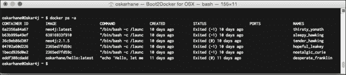
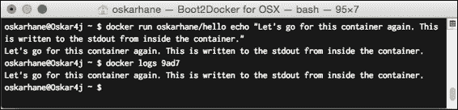
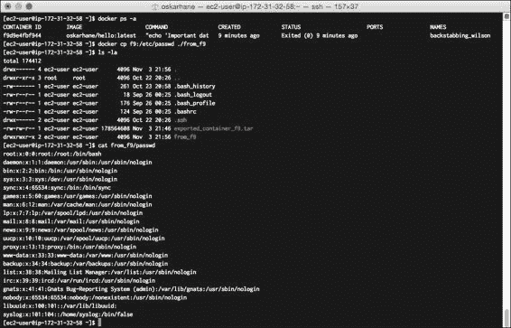
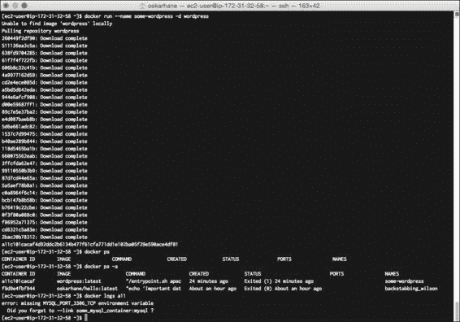
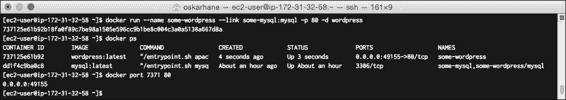

# 二、探索Docker

读完这一章，你会发现自己更容易谈论和使用 Docker。这里将涉及以下主题:

*   Docker的形象
*   Docker集装箱
*   Docker 命令行界面
*   码头注册中心

在构建您的 PaaS 时，您会发现这些主题很重要，并且在本书中，您将使用这些主题并与之互动。

# Docker的形象

在开头，可能很难理解 Docker 映像和 Docker(或 Linux)容器之间的区别。

假设我们的 Linux 内核是零层。每当我们运行 Docker 映像时，都会在内核层之上放置一个层。该映像(第一层)是只读映像，不能更改或保持状态。

一个 Docker 映像可以建立在另一个 Docker 映像之上，后者建立在另一个 Docker 映像之上等等。第一个映像图层称为**基础映像**，除了最后一个映像图层之外的所有其他图层都称为**父映像**。它们继承父映像的所有属性和设置，并在 Dockerfile 中添加自己的配置。

Docker 映像由一个映像 ID 来标识，它是一个 64 个字符长的十六进制字符串，但是在处理映像时，我们几乎永远不会用这个 ID 来引用映像，而是使用映像名称。要列出所有本地可用的 Docker 映像，我们使用`docker images`命令。请看下面的映像，了解映像是如何列出的:


图片可以分发不同的版本供我们选择，这个的机制叫做**标签**。前面的截图用 **neo4j** 映像说明了这一点，该映像具有**最新的**和 **2.1.5** 标签。这是用于拉取特定标签的命令的外观:

```
docker pull ubuntu:14.04
docker pull ubuntu:12.02

```

# Docker集装箱

当我们执行`docker run imagename`时，一个 Docker 容器被创建。可写层被添加到所有映像层的顶部。这一层有运行在中央处理器上的进程，可以有两种不同的状态:运行或退出。这是集装箱。当我们用 Docker run 命令启动一个容器时，它进入运行状态，直到由于某种原因，它自己停止或者被我们停止，然后进入退出状态。

当我们运行一个容器时，我们对其文件系统所做的所有更改在启动和停止之间是永久的。请记住，对容器文件系统所做的更改不会写入底层 Docker 映像。

我们可以从同一个映像中启动任意多的运行容器的实例；他们会一起生活，完全被彼此分开。我们对容器所做的所有更改都仅限于该容器。

如果对容器的底层映像进行了更改，运行中的容器将不受影响，并且不会发生自动更新。如果我们想将我们的容器更新到其映像的更新版本，我们必须小心，并确保我们已经以正确的方式设置了数据结构，否则我们有丢失容器中所有数据的风险。在本书的后面，我将向您展示在哪里保存重要数据，而不会有丢失的风险。

对应的截图如下所示:



一个 64 个字符长的十六进制字符串称为**容器标识**标识Docker容器。这个 ID 可以在与容器交互时使用，根据我们运行了多少个容器，我们通常只需要键入容器 ID 的前四个字符。我们也可以使用容器名，但是通常更容易键入 ID 的开头。

# Docker 命令行界面

命令行界面是我们使用 Docker 命令与守护进程通信的地方。Docker 守护进程是接收我们键入的命令的后台进程。

在前一章中，我们运行了几个 Docker 命令来启动和停止容器，以及列出容器和映像。现在，我们将了解更多有助于我们处理平台即服务容器的信息，如下所示:

*   `docker logs <container-ID|name>`: Everything that is written to the `STDOUT` containers will end up in the file that can be accessed via this command. This is a very handy way to output information from within a container, as shown here:

    

*   `docker export <container-ID|name>`: If you have a container that holds data that you want to export, this is the command to be used. This creates a tar archive and sends it to `STDOUT`:

    

*   `docker cp CONTAINER:PATH HOSTPATH`: If you don't want the whole file system from a container but just one directory or a file, you can use `docker cp` instead of `export`, as shown in the following screenshot:

    

# Docker注册中心

Docker 受欢迎的一个重要部分是它的社区，以及您可以轻松共享、查找和扩展 Docker 映像。中心位置是码头注册中心，可以在[https://hub.docker.com/](https://hub.docker.com/)找到。

## 浏览存储库

在这里，我们可以搜索并以多种方式浏览映像库，以找到我们想要的东西。如果我们看看流行的，我们会看到其他人使用最多的。

如果我们点击 Ubuntu 存储库，我们会看到很多关于映像的信息，可用的标签，用户的评论，它有多少颗星，以及它是什么时候更新的。

屏幕截图显示如下:


如果我们在主视图中点击标签上的，我们会看到一个叫做`Dockerfile`的东西。这是创建映像时运行的映像描述。在这本书的后面，我们会写我们自己的。

如果您对 Docker 中心的映像感兴趣，我建议您阅读信息/自述文件以及其他用户的评论。通常，您会在那里找到有价值的信息，这些信息将帮助您选择正确的映像，并向您展示如何以维护开发人员想要的方式运行它。

通常，您会找到几乎符合您需求的映像，因为大多数映像都很普通，但是作为开发人员，您可能需要安装特定的设置或服务。

## 探索已发布的映像

以官方 WordPress Docker 图片为例，([https://registry.hub.docker.com/_/wordpress/](https://registry.hub.docker.com/_/wordpress/))。你可以在 Docker hub 的浏览页面找到它，或者你可以搜索它。

让我们暂时忘掉这些缺点，看看信息页面上是怎么说的:


该映像从 Docker 容器的环境变量中读取设置。这意味着映像必须从使用`docker run –e`命令注入的环境变量开始，或者您可以将另一个容器`--link`注入这些变量。我们将在本书的后面讨论容器链接。

让我们看看如果我们拉这张图片会得到什么。单击 apache 目录中 Dockerfile 的链接:

```
FROM php:5.6-apache

RUN a2enmod rewrite

# install the PHP extensions we need
RUN apt-get update && apt-get install -y libpng12-dev libjpeg-dev && rm -rf /var/lib/apt/lists/* \
 && docker-php-ext-configure gd --with-png-dir=/usr --with-jpeg-dir=/usr \
 && docker-php-ext-install gd
RUN docker-php-ext-install mysqli

VOLUME /var/www/html

ENV WORDPRESS_VERSION 4.1.1
ENV WORDPRESS_UPSTREAM_VERSION 4.1.1
ENV WORDPRESS_SHA1 15d38fe6c73121a20e63ccd8070153b89b2de6a9

# upstream tarballs include ./wordpress/ so this gives us /usr/src/wordpress
RUN curl -o wordpress.tar.gz -SL https://wordpress.org/wordpress-${WORDPRESS_UPSTREAM_VERSION}.tar.gz \
 && echo "$WORDPRESS_SHA1 *wordpress.tar.gz" | sha1sum -c - \
 && tar -xzf wordpress.tar.gz -C /usr/src/ \
 && rm wordpress.tar.gz

COPY docker-entrypoint.sh /entrypoint.sh

# grr, ENTRYPOINT resets CMD now
ENTRYPOINT ["/entrypoint.sh"]
CMD ["apache2-foreground"]

```

好了，我们看到它建立在 Debian 喘息之上，并安装了 Apache2、PHP5 和其他一些东西。之后设置一堆环境变量，然后下载 WordPress。

我们看到几行以命令`COPY`开始。这意味着文件随 Docker 映像一起运送，并在启动时复制到容器内部。WordPress 映像附带的`docker-apache.conf`文件是这样的:

```
<VirtualHost *:80>
 DocumentRoot /var/www/html
 <Directory /var/www/html>
 AllowOverride all
 </Directory>
</VirtualHost>
# vim: syntax=apache ts=4 sw=4 sts=4 sr noet

```

前一行代码告诉 Apache 在哪里查找文件。

`docker-entrypoint.sh`文件呢？

`ENTRYPOINT`关键字告诉 Docker 守护程序，如果没有指定其他内容，则每当容器运行时，都应该执行该文件。就好像整个容器是一个可执行文件。

如果我们看一下这个文件中的内容，我们会发现它基本上建立了到 MySQL 数据库的连接，并配置了`.htaccess`和 WordPress:

```
#!/bin/bash
set -e
if [ -z "$MYSQL_PORT_3306_TCP" ]; then
 echo >&2 'error: missing MYSQL_PORT_3306_TCP environment variable'
 echo >&2 '  Did you forget to --link some_mysql_container:mysql ?'
 exit 1
fi

```

首先要做的是检查用户是否为 MySQL 连接设置了环境变量。如果没有，则退出并向`STDERR`写入一些信息。

为什么不你试试看你能不能触发写**错误的 MySQL 错误:丢失 MYSQL_PORT_3306_TCP 环境变量**到`STDERR`，如下:

```
docker run –-name some-wordpress –d wordpress

```



`--name some-wordpress`命令给容器命名，所以我们以后可以用这个名字引用它。此外，`–d`参数告诉容器以分离模式运行，这意味着它不再从我们启动它的地方监听命令。最后一个`wordpress`参数是我们要运行的 Docker 映像的名称。

如果我们检查新容器的日志，我们将看到屏幕截图显示的内容:预期的错误消息。

让我们运行一个 MySQL 容器，看看我们是否能让它工作。导航到[https://registry.hub.docker.com/_/mysql/](https://registry.hub.docker.com/_/mysql/)，以便访问 docker 注册中心的官方 MySQL docker 存储库。这里声明，为了启动一个 MySQL 实例，我们需要在 shell 中调用**docker run-name some-MySQL-e MYSQL _ ROOT _ PASSWORD = my secret PASSWORD-d MySQL**。既然我们现在做这个是为了教育目的，我们就不用选择强根用户密码了。在下载了一些相关的映像之后，当我们执行`docker ps`时，我们应该能够看到我们的运行容器。如果有，运行`docker logs some-mysql`查看安装日志，如下图所示:


很好，现在我们有了一个运行的 MySQL 容器，这是启动 WordPress 实例所需要的。让我们用 MySQL 链接启动一个新的 WordPress 实例:

```
docker run --name some-wordpress --link some-mysql:mysql –p 80 -d wordpress

```

`--link`参数通过注入到`some-wordpress`容器的环境变量来暴露`some-mysql`容器的环境变量、接口和暴露的端口。

为了打开可从外部到达的端口，端口 80 通过`–p 80`参数暴露。

如果你从守护进程收到一条错误消息说**错误响应:冲突，这个名字已经被分配给 a11c101cacaf。**，您必须删除(或重命名)该容器才能再次将`some-wordpress`分配给容器。你需要给新的容器一个新的名字或者删除旧的(失败的)WordPress 容器。调用`docker rm some-wordpress`使用所需名称删除旧容器。

当容器运行时，调用`docker ps`命令，找出我们的哪个端口被分配给容器的私有端口 80。

我们可以查看容器列表中的端口列，也可以调用`docker port some-wordpress 80`显式查找，如下所示:



我的情况是港口 **49155** 。

在你的网络浏览器中输入你的 Docker hosts 的 **ip:port** ，看看你是否能到达。如果你在运行 Windows 或 OS X 的本地计算机上，你可以通过调用`boot2docker ip`找到你的 Docker IP。如果你在本地的 Linux 上， **127.0.0.1** 应该没问题。

我在亚马逊 EC2 上做这个，所以我必须去 EC2 管理控制台获取我的公共 IP 或公共 DNS。

将您的网络浏览器指向`http://yourip:yourport`(在我的例子中为`http://myamazon-dns.com:49155`)，您应该会看到:


### 注

默认的亚马逊 AWS 安全策略是阻止默认的 Docker 公共端口，所以我们必须在 EC2 仪表盘的**安全组**部分更改这个。如何操作请参见【第 1 章、*安装 Docker、*中的【亚马逊 EC2 上的*Docker*部分。

太棒了，它起作用了！

# 总结

Docker 映像可以被看作是容器的只读模板，指定容器启动时应该安装、复制、配置和公开什么。

我们了解了更多关于如何与 Docker 守护程序和单个 Docker 容器交互以读取日志、复制文件和导出完整文件系统的信息。

Docker hub 被引入，我们查看了官方 WordPress Docker 映像由什么组成，以及他们如何在 Dockerfile 以及某种程度上在`ENTRYPOINT`文件中配置操作系统。

我们下载并运行了按预期失败的 WordPress 映像，并通过将所需的 MySQL 容器链接到它来修复它。

在下一章中，我们将创建一个 Docker 文件，并将 Docker 映像发布到 Docker 注册中心，这样我们就有办法将定制的 Docker 映像发送到我们决定放置 PaaS 的任何地方。