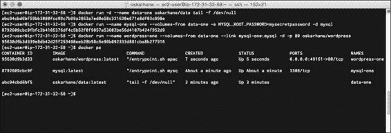
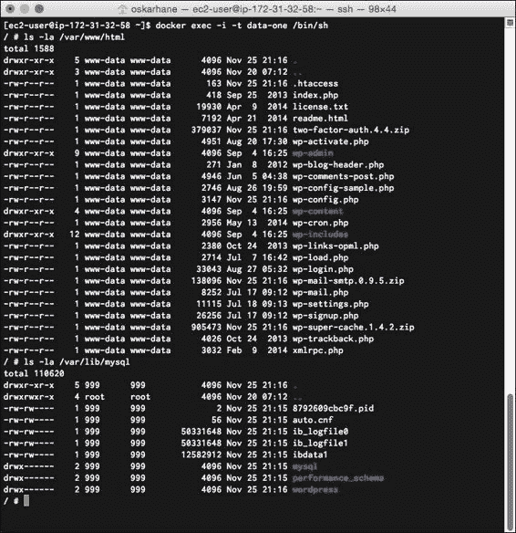
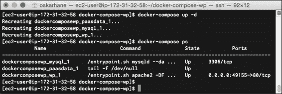
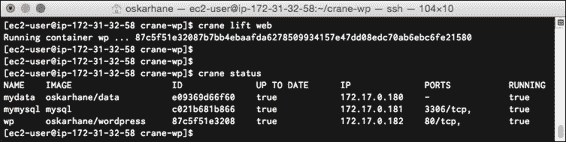

# 第五章。连接容器

是时候将我们所有的三个容器连接起来，形成一个由模块化部件组成的单一单元了。我将向您介绍两种服务， **Docker Compose** 和 **Crane** ，它们可用于实现自动化。我们将通过本章中的以下主题来了解:

*   手动将容器连接在一起
*   探索数据卷容器的内容
*   使用 Docker Compose 将容器连接到配置文件
*   使用 Crane 将容器连接到配置文件

# 手动连接容器

让我们来看看如何将服务容器连接到数据量容器。首先，我们必须运行我们的数据量容器，然后运行我们的 MySQL 容器，最后运行我们的 WordPress 容器，如下命令所示:

```
docker run -d --name data-one oskarhane/data tail -f /dev/null
docker run --name mysql-one --volumes-from data-one -e MYSQL_ROOT_PASSWORD=mysecretpassword -d mysql
docker run --name wordpress-one --volumes-from data-one --link mysql-one:mysql -d -p 80 oskarhane/wordpress

```

这里，我们已经启动并命名了数据量容器`data-one`。下一行启动名为`mysql-one`的 MySQL 容器，并给它数据量容器。最后一行启动我们的 WordPress 容器，命名为`wordpress-one`，链接`mysql-one`作为 MySQL 链接，并给它数据量容器。

将显示以下输出:



打开你的网络浏览器，前往容器的网址和端口，以验证所有的服务都在运行，并且容器按照它们应该的方式绑定在一起。您应该会看到现在很熟悉的 WordPress 安装页面。

现在您可能已经知道了，您可以使用相同的 MySQL 链接和相同的数据量容器启动另一个 WordPress 容器。你认为会发生什么？

新的 WordPress 容器将是同一个 WordPress 站点的另一个实例，具有相同的文件和相同的数据库。

当您链接容器时，Docker 将在目标容器中设置一些环境变量，以便您能够获得关于链接的源容器的信息。在我们的例子中，这些环境变量将在我们链接 MySQL 容器时设置，如以下命令所示:

```
MYSQL_NAME=/wordpress-one/mysql-one
MYSQL_PORT=tcp://ip:3306
MYSQL_3306_TCP=tcp://ip:3306
MYSQL_3306_TCP_PROTO=tcp
MYSQL_3306_TCP_PORT=3306
MYSQL_3306_TCP_ADDR=ip
```

# 探索数据卷容器的内容

数据是否正在写入数据卷容器？或者，当连接时，数据是否存储在 MySQL 和 WordPress 容器中？你怎么知道？

确定这一点的一种方法是通过 shell 进入一个容器，这样您就可以在它的文件系统中导航。从 1.3 版本开始，Docker 能够启动容器外壳的新实例。运行旧的`docker attach`命令只是让你进入当前的 shell 实例，在我们的例子中`tail –f /dev/null`正在运行。如果我们退出这个`tail`命令，容器将退出并关闭。因此，我们需要在一个正在运行的容器中有一个新的 shell 实例，这样我们就可以在容器中调用任何我们想要的命令，而不会有容器退出的风险。以下命令可用于执行此操作:

```
docker exec -i -t data-one /bin/sh

```

`–i`和`–t`标志意味着我们希望保持会话的交互性并分配一个伪 TTY。`data-one`是集装箱的名称，但是如果你愿意，可以使用集装箱 ID。我会选择`/bin/bash` 而不是 `/bin/sh`，但是容器运行 BusyBox，并且`/bin/bash`在那里不可用。对于我们将要执行的任务类型，我们使用哪个外壳并不重要。

我们要做的是在这个数据卷容器中查看我们公开为`VOLUMES`的目录。目录是`/var/www/html`和`/var/lib/mysql`。

让我们在下面的命令中探索一下:

```
ls -la /var/www/html
ls -la /var/lib/mysql

```

将显示以下输出:



我们在这两个目录上都看到了文件，这表明另外两个容器正在写入这个目录。它将服务和数据分开。如果需要进一步的证明，在 shell 中启动`vi`，编辑一个文件，在浏览器中重新加载站点。

这件事很顺利，不是吗？容器之间相互作用，我们所要做的就是用一个命令将它们链接在一起。

# 使用 Docker Compose 连接容器

Docker Compose 之前叫 Fig，但是 Docker 收购了 Fig，这个名字就改了。Docker 是这样描述 Docker 撰写的:

> *“Compose”是一个用 Docker 定义和运行复杂应用程序的工具。使用 Compose，您可以在一个文件中定义一个多容器应用程序，然后在一个命令中启动您的应用程序，该命令执行所有需要执行的操作来使它运行。”*

Docker Compose 基本上为我们提供了一种在配置文件中定义设置的方法，因此在将所有容器链接在一起时，我们不必记住它们的所有名称、要公开的端口、要使用的数据卷容器等等。

## 安装复合坞站

Docker Compose 在 GitHub 上有定期发布，在撰写本书的时，最新的版本是 1.0.1。

我们将使用 Python 包管理器 pip 安装 Docker Compose。我们的 EC2 实例没有安装 pip，所以我们必须从安装开始，如下所示:

```
sudo su
wget https://bootstrap.pypa.io/get-pip.py && python ./get-pip.py

```

将显示以下输出:


安装 pip后，可以继续安装 Docker Compose:

```
sudo pip install -U docker-compose

```

现在，您将看到安装了 Docker Compose 及其所有依赖项。调用`docker-compose --version`验证它是否如预期那样工作。

## 基本坞站组成命令

以下是您应该熟悉的基本 Docker 编写命令:

*   `build`:这里是用来构建或者重建服务
*   `kill`:此强制服务容器停止
*   `logs`:这个查看服务的输出
*   `port`:此用于打印端口绑定的公共端口
*   `ps`:这里是用来列出集装箱
*   `pull`:此用于拉取服务图片
*   `rm`:此用于移除停止的服务容器
*   `run`:这是用来对一个服务运行一次性命令
*   `scale`:此设置服务要运行的容器数量
*   `start`:此用于启动服务的现有容器
*   `stop`:此停止运行容器，不移除它们
*   `up`:这个为一个服务构建、重新创建、启动和连接到容器；链接容器将被启动，除非它们已经在运行

如您所见，这些命令与 Docker 客户端命令非常相似，它们中的大多数都通过将命令转发给 Docker 守护程序来完成同样的工作。我们将更详细地讨论其中的一些。

### 服务

当一词与 Docker Compose 一起使用时，它指的是`docker-compose.yml`配置文件中的命名容器。

### 使用运行命令

我们习惯于用 Docker 客户端的`run`命令来启动容器。对于 docker-compose 来说，`run`命令是非常不同的。当你用 docker-compose`run`一个命令时，它是一个服务的一次性命令。这意味着如果我们命名一个容器配置`Ubuntu`并调用`docker-compose run ubuntu /bin/bash echo hello`，容器将启动并执行`/bin/bash echo hello`然后关闭。这与直接用 Docker 运行命令的区别在于，当您使用 docker-compose 时，所有链接的容器和`VOLUME`容器都将被启动和连接。

### 使用缩放命令

`scale`命令很有意思。当我们调用`docker-compose scale web=3`时，我们实际上启动了我们命名为`web`的服务的三个容器。

## 用 Docker 编写来设置我们的 PaaS

每个 Docker Compose 实例都位于自己的目录中，并且其中有一个名为`docker-compose.yml`的配置文件:

```
mkdir docker-compose-wp && cd $_
touch docker-compose.yml

```

这就是我们`docker-compose.yml`文件的内容:

```
wp:
 image: oskarhane/wordpress
 links:
 - mysql:mysql
 ports:
 - "80"
 volumes_from:
 - paasdata
mysql:
 image: mysql
 volumes_from:
 - paasdata
 environment:
 - MYSQL_ROOT_PASSWORD=myrootpass
paasdata:
 image: oskarhane/data
 command: tail -f /dev/null

```

你可以看到我们在这里定义了三个服务，分别是`wp`、`mysql`、`paasdata`。

让我们尝试这些服务，并显示以下输出:



调用`docker-compose up –d`以守护模式运行`docker-compose`和容器。

这是多么容易。打开你的网络浏览器前往你的 Docker 主机和表中所述的端口(我的情况是端口**49155**)；您应该会看到非常熟悉的 WordPress 安装页面。

# 使用起重机连接集装箱

Crane 很像 Docker Compose，但它有更多的配置可能性。它的创造者 T2 是这样描述克雷恩的:

> *“起重机是编排 Docker 容器的工具。它通过读入一些描述如何获取图像和如何运行容器的配置(JSON 或 YAML)来工作。这大大简化了开发环境的设置，因为您不必手动调出每个容器，记住您需要传递的所有参数。通过将数据和应用程序旁边的配置存储在存储库中，您可以轻松共享整个环境。”*

如你所见，这一段也可以是关于 Docker Compose 的。

## 安装起重机

起重机安装方便但不容易保持更新。相同的命令是用来安装和更新，所以我们必须偶尔调用这个才能有最新的版本。

在一行中调用以下命令来安装起重机:

```
bash -c "`curl -sL https://raw.githubusercontent.com/michaelsauter/crane/master/download.sh`" && sudo mv crane /usr/local/bin/crane

```

起重机现在安装在`/usr/local/bin`中。

## 用法

我不会在这里浏览所有的命令，因为它们类似于 Docker Compose 的命令，但我会在这里评论一些命令:

*   `lift`:这个命令，像 Docker Compose 的`up`命令一样，从你的配置文件中构建和运行容器
*   `graph`:这个从配置文件中打印你的容器关系
*   `logs`:这个映射到 Dockers Compose 的命令，但是在这里你可以得到整个组的日志
*   `status`:这个也映射到 Dockers Compose 的命令，但是让你得到一个组的日志

## 配置

这就是克雷恩真正把 Docker Compose 抛在身后的地方。对于 Crane 应用程序，您有更多的配置选项。配置文件必须命名为`crane.json`或`crane.yaml`。对于每个容器，这是您可以配置的:

*   `image`(字符串，必选):这是要构建/提取的图像的名称
*   `dockerfile`(字符串，可选):这给出了 Dockerfile 的相对路径
*   `run`(对象，可选):这些参数映射到 Docker 的`run`和`create`命令:
    *   添加主机(阵列):这将添加自定义的主机到 IP 的映射
    *   cpuset(整数)
    *   cpu 份额(整数)
    *   分离(布尔)`sudo docker attach <container name>`将正常工作
    *   设备(阵列):这将添加主机设备
    *   dns(数组)
    *   entrypoint(字符串)
    *   环境(数组)
    *   暴露(数组):这表示要暴露给链接容器的端口
    *   主机名(字符串)
    *   交互式(布尔型)
    *   链接(数组):这将链接容器
    *   内存(字符串)
    *   特权(布尔)
    *   发布(数组):这将网络端口映射到容器
    *   全部发布(布尔值)
    *   重启(字符串)重启策略
    *   rm （布尔值）
    *   tty （布尔值）
    *   卷(数组):与普通 Docker 相比，中的主机路径可以是相对的
    *   卷-来自(阵列):这用于从其他容器装载卷
    *   工作目录 （字符串）
    *   `cmd`(数组/字符串):该命令用于追加到`docker run`(覆盖 CMD)
*   `rm (object, optional):`这些参数被映射到 Docker 的`rm`命令:
    *   体积(布尔值)
*   `start (object, optional)`:这些参数映射到 Docker 的`start`命令:
    *   附加(布尔值)
    *   交互式(布尔型)

设置与在 Docker Compose 中相同的配置；它看起来像下面的代码。正如您可能理解的那样，您也可以用 JSON 格式编写它，但是为了尽可能容易地与 Docker Compose 的版本进行比较，我将保持`yaml`格式:

```
containers:
 wp:
 image: oskarhane/wordpress
 run:
 volumes-from: ["mydata"]
 link: 
 - mymysql:mysql
 publish: ["80"]
 detach: true
 mymysql:
 image: mysql
 run:
 volumes-from: ["mydata"]
 detach: true
 env: ["MYSQL_ROOT_PASSWORD=rootpass"]
 mydata:
 image: oskarhane/data
 run:
 detach: true
 cmd: "tail -f /dev/null"

```

这里，我们指定三个容器，其中数据容器作为数据量容器添加到其他容器中，MySQL 容器链接到 WordPress 容器。

将此文件保存为`crane.yaml`并键入`crane lift`以运行您的应用程序。

将显示以下输出:


要查看集装箱的当前状态，我们可以输入`crane status`。看看我们`wp`容器中的最后一列。它说它没有运行。键入`crane` `logs wp`并查看其在以下命令中的内容:

```
wp * WordPress not found in /var/www/html - copying now...
wp * Complete! WordPress has been successfully copied to /var/www/html
wp | 
wp | Warning: mysqli::mysqli(): (HY000/2002): Connection refused in - on line 5
wp * MySQL Connection Error: (2002) Connection refused

```

好像我们的 WordPress 容器启动比我们的 MySQL 容器快，所以 WordPress 容器启动的时候找不到。

这也可能发生在 Docker Compose 中，因为没有检查`--link:ed`容器是否已打开，至少在写入时没有。

这在 Docker Compose 中无法解决；我们不得不依靠纯粹的运气，在 WordPress 容器尝试使用链接的 MySQL 容器之前，MySQL 容器就会准备好。

使用 Crane，您可以将配置文件中的容器分组到不同的组中，然后对该组而不是整个配置执行`run`命令。

这很容易；我们只需在我们的`crane.yaml`文件末尾添加这些行:

```
groups:
 default: ['mydata', 'mymysql', 'wp']
 data_db: ['mydata', 'mymysql']
 web: ['wp']

```

这里，我们已经将 WordPress 容器与另外两个容器分开，这样我们就可以分别对它们执行`run`命令。

让我们首先通过调用`crane lift data_db --recreate`命令来启动我们的`data_db`组。我添加了“T2”标志，以确保我们正在创建新的容器，而不是重复使用旧的容器。运行`crane status data_db`以确保他们正在运行。

现在我们知道 MySQL 容器正在运行，我们可以通过调用`crane lift web --recreate`命令来启动 WordPress 容器。

将显示以下输出:



# 总结

现在，我们可以用不同的方式连接容器，以在不同的容器上保持不同的服务。我们学习了如何手动完成这项工作，当容器之间有很多依赖关系时，这可能会非常困难。

我们简单看了两个编排工具:Docker Compose 和 Crane。对于想要更多控制集装箱的管理员来说，Crane 是一个独立且更先进的工具。当依赖关系中可能存在时间问题时，在 Crane 中对容器进行分组的能力使其更加可靠。

在下一章中，我们将使用 Crane 运行我们的应用程序的两个实例，看看当我们想让我们的两个博客都可以在常规 HTTP 端口(80)上公开访问时，会出现什么问题和可能性。