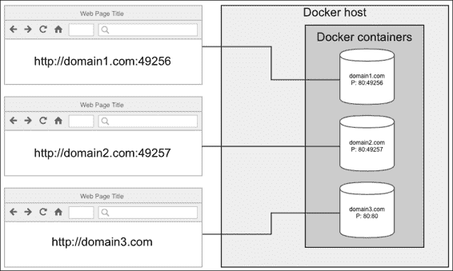
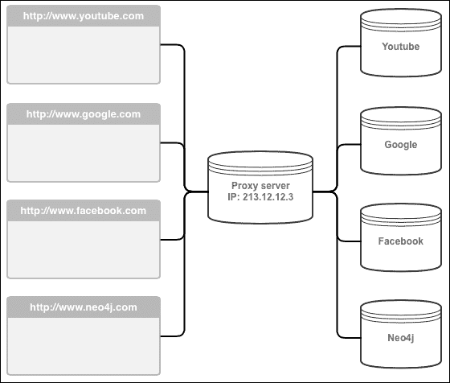
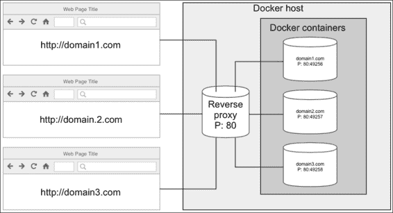
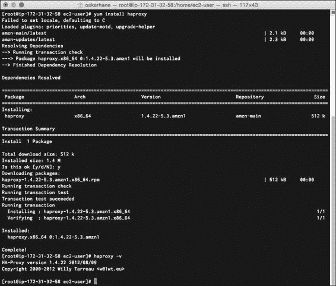
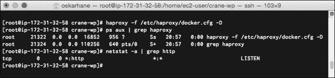
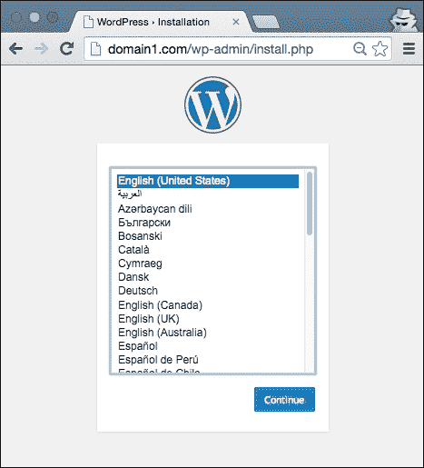

# 六、反向代理请求

在同一个服务器上有许多带有公共端口的容器的一个大问题是，它们不能都监听它们服务种类的标准端口。如果我们有一个 MySQL 后端服务，并且有 10 个 MySQL 容器在运行，那么其中只有一个可以监听 MySQL 标准端口`3306`。对于那些公开网络服务器的人来说，标准端口`80`只能由他们的一个 WordPress 容器使用。在本章中，我们将涵盖以下主题:

*   解释问题
*   想出解决问题的办法
*   用 Nginx 和 HAProxy 实现解决方案
*   自动化映射域的过程

# 解释问题

在同一台主机上有许多服务相同的容器的问题是，用户应用使用的是标准端口。默认情况下，使用网络浏览器并向运行 WordPress 容器的 Docker 主机输入 IP 将会请求端口`80`上的资源。你不能指望你的用户记住一个非标准端口来进入你的网站。



到达这三个容器的唯一方法是手动输入容器的公开端口号。

# 找到解决方案

在我们转向解决方案之前，让我解释一下什么是常规代理服务器，以防你不熟悉它。

一个代理服务器是一个代表你连接服务并将所有结果转发给你的服务器。在您设置好通过代理服务器路由所有流量后，作为用户，您不会注意到它在那里。一切都会照常进行。

但是，服务所有者只看到某台机器(代理服务器)连接到他们。如果另一个用户使用与您相同的代理服务器和相同的服务，服务所有者无法区分，并且会将您视为一个单独的用户。



通过代理服务器连接的不同用户显示为一个用户。

从上图可以看到，服务拥有者只是看到有一个 IP 为**213.12.12.3**的人连接到了他们。

那么，如果我们在 Docker 主机上使用这个呢？如果我们把一些东西放在所有的容器前面呢？根据所请求的域名，这个东西会将请求转发到正确的容器和端口，然后将请求的响应转发给请求的用户。

有些东西是专门为解决这种问题而做的。它们被称为**反向代理**(反向是因为代理在另一端，使用户只看到一个 IP 并转发请求)。

如果我们在 Docker 主机服务器上安装和配置反向代理，那么图表将是这样的:



反向代理让所有 Docker 容器作为一个整体出现。

反向代理监听端口`80`(标准网络端口)，当`domain1.com`的请求到来时，代理查看其配置，查看该域是否有指定的转发端点。如果有，反向代理会将请求转发到正确的 Docker 容器，等待其响应，并在容器响应到来时将其转发给请求用户。

这就是我们所追求的解决方案。现在唯一的问题是我们将使用哪个反向代理。外面有很多这样的人。有些反向代理有更具体的用途，比如负载平衡，有些是做很多其他事情的服务，也有这个功能，比如 web 服务器。

# 实施解决方案

选择解决问题的工具时，您将始终有偏好。有时候，你选择一个工具是因为你觉得使用它很舒服，而且它足够好；有时候，你选择它是因为它有很好的性能，或者因为你只是想尝试一些新的东西。

这就是为什么我们将通过两种不同的工具来解决这个问题。最终结果将是相同的，但是工具的设置略有不同。

在我们开始实现解决方案之前，我们使用 Crane 启动我们的三容器应用的一个实例，并通过将其连接到站点来验证它是否在工作。让Docker为你决定公共港口，所以是`491XX`。请记住这个端口，因为我们将在实施解决方案时使用它。

我们需要指出我们想要用于 Docker 主机的 IP 地址的域名。我们可以通过将域名 A-record 设置为我们的服务器的 IP 地址，或者在我们的本地`/etc/hosts`文件中添加一行，将对域名的请求定向到我们的服务器的 IP 地址。

我会选择后者，并将其输入我的 Mac 的`/etc/hosts`文件中:

```
54.148.253.187 domain1.com
54.148.253.187 domain2.com
54.148.253.187 domain3.com

```

### 注

请确保用服务器的 IP 地址替换上述 IP 地址。

## 用 HAProxy 实现

HAProxy([http://www.haproxy.org](http://www.haproxy.org))是一个负载均衡器，其作用是将流量转发到其背后的不同服务。

这就是哈普罗西对自己的描述:

> *“HAProxy 是一个免费的、非常快速和可靠的解决方案，为基于 TCP 和 HTTP 的应用提供高可用性、负载平衡和代理。它特别适合流量非常高的网站，并为世界上许多访问量最大的网站提供动力。多年来，它已经成为事实上的标准开源负载平衡器，现在与大多数主流 Linux 发行版一起提供，并且通常默认部署在云平台中。”*

这听起来像是符合我们需要的东西。

### 安装羟基磷灰石

正如报价中的所述，许多系统已经安装并随其一起发货。如果你找不到它，如果你使用 Ubuntu 或 Debian ( `apt-get install haproxy`)的话，它应该可以在你的包管理器中找到，或者在其他有包管理器的发行版中找到。

在我运行亚马逊 Linux 的亚马逊 EC2 实例上，可以使用`yum install haproxy`安装 HAProxy。

将获得如下和输出:



这不是最新的版本，但对于我们将要做的事情来说，这是可以的。

### 配置 HAProxy

我们将在文件`/etc/haproxy/docker.cfg`中编写一个 HAProxy 配置，这样我们就不必删除默认配置文件中的所有内容，因为将来可能会有很好的参考价值。

HAProxy 将其配置分为四个部分:全局、默认、前端和后端。不要把前端和后端与前端和后端开发混为一谈。这里，前端是指面向互联网的服务器部分，后端是 HAProxy 后面的服务器部分，在我们的例子中是 Docker 容器。

打开配置文件，从输入通用内容开始，如下所示:

```
global
    daemon
    maxconn 4096
    pidfile /var/run/haproxy.pid
defaults
    mode http
    timeout connect 5000ms
    timeout client 50000ms
    timeout server 50000ms
```

现在，我们输入要监听的端口和要用于哪个域的后端配置:

```
frontend http-in
    bind *:80
    acl is_site1 hdr_end(host) -i domain1.com
    use_backend site1 if is_site1
```

我们定义应该捕获端口`80`上的常规传入 HTTP 流量。这里的`acl`是指访问控制列表，是一个基于从请求中提取的内容做出决定的灵活解决方案。`hdr_end(host) -i domain1.com`函数调用意味着标头主机的结尾不区分大小写，与字符串`domain1.com`匹配。该匹配的结果(布尔)保存在`is_site1`变量中。

请注意，这意味着`domain1.com`的所有子域都将与该设置相匹配。如果只是想搭配`www.domain1.com`，可以用`hdr(host) -i www.domain1.com`代替。

现在我们在`is_site1`变量中有了匹配结果，我们可以将请求发送到名为`site1`的后端配置。

我们将其附加到配置文件中:

```
backend site1
    balance roundrobin
    option httpclose
    option forwardfor
    server s1 127.0.0.1:49187 maxconn 450
```

我们将后端名称定义为`site1`，设置几个选项，并将服务器和端口添加到我们的 WordPress 容器中。

### 注

确保您输入了 WordPress 容器的公开端口，而不是前面代码中的`49187`。

是时候尝试这种配置了。保存配置文件，并使用以下命令在 shell 中测试它:

```
haproxy -f /etc/haproxy/docker.cfg –c

```

输出应该是`Configuration file is valid`。

确保您的机器上没有正在收听端口`80`的内容。您可以使用诸如`netstat –a`之类的东西来验证`80`或 HTTP 未列出。如果是，找到正在监听的应用并关闭它。

使用以下命令启动 HAProxy:

```
haproxy -f /etc/haproxy/docker.cfg –D

```

`-D`选项意味着我们希望在后台将其作为守护进程运行。当您调用这个命令时，您不应该看到任何输出。

让我们通过调用`ps aux | grep haproxy`来检查 HAProxy 是否正在运行。你应该看到它列在那里。最后，让我们通过调用`netstat –a | grep http`来验证它正在监听端口`80`。现在，你应该在那份名单上有些东西。

获得的输出显示在这里:



一切看起来都很好！

简单回顾一下我们在这里所做的工作:我们在服务器的端口`80`上设置了一个监听传入请求的服务。当该端口上的请求进入时，会对请求头的主机进行检查，看其是否匹配`domain1.com`。如果匹配，请求将被转发到 IP 地址`127.0.0.1`和端口`49187`。来自这个 IP 和端口的响应被发送回请求者。

现在到了真相大白的时刻。打开你的网页浏览器，输入网址`domain1.com`。

确保你的主机文件中有`domain1.com`的条目，指向你的服务器。

执行上述说明后，您将看到以下网站屏幕:



您可以看到在定位栏中，没有指定端口。太棒了！

### 向 HAProxy 添加更多域

我们做并不是为了在端口`80`上服务一个单一的网络应用，这可以在没有反向代理的情况下完成。用 Crane 启动另一个 WordPress 应用，方法是将旧配置复制到一个新目录，并更改服务的名称，如下所示:

```
cd..
cp –r crane-wp crane-wp2
cd crane-wp2
sed -i "s/wp/wp2/g" crane.yaml
sed -i "s/mydata/mydata2/g" crane.yaml
sed -i "s/mymysql/mymysql2/g" crane.yaml
crane lift data_db
crane lift wp2

#check out port for new container named wp2
docker ps

```

再次打开 HAProxy 配置文件，在前端增加两行:

```
acl is_site2 hdr_end(host) -i domain2.com
use_backend site2 if is_site2

```

之后，添加一个名为`site2`的新后端配置:

```
backend site2
 balance roundrobin
 option httpclose
 option forwardfor
 server s2 127.0.0.1:49188 maxconn 450

```

请确保用您拥有的端口替换该端口。重新启动 HAProxy，并进行上次启动时所做的检查。

要重启 HAProxy，运行`/etc/init.d/haproxy restart`。

### 注

使用以下命令，HAProxy 可以在不删除活动会话的情况下重新加载新配置:

```
haproxy -f /etc/haproxy/docker.cfg -p /var/run/haproxy.pid -sf $(cat /var/run/haproxy.pid)

```

打开你的浏览器，进入`domain1.com`确认旧的还在工作。如果是，转到`domain2.com`。您应该会看到另一个 WordPress 安装站点。为了确保不一样，继续安装其中一个。或者，去`domain3.com`看看当一个域指向服务器而没有在 HAProxy 中匹配时会发生什么。

## 用 Nginx 实现

现在，我们将做和 HAProxy 一样的事情，但是我们将使用优秀的网络服务器 Nginx([http://nginx.org/en/](http://nginx.org/en/))作为我们的反向代理。Nginx 是一款功能齐全、速度非常快的网络服务器，在内存中只留下很小的空间。

Nginx 是这样描述的:

> *“nginx[engine x]是一个 HTTP 和反向代理服务器，也是一个邮件代理服务器，伊戈尔·塞索耶夫写的。很长一段时间以来，它一直在包括 Yandex、Mail 在内的许多负载很重的俄罗斯网站上运行。茹、VK 和漫步者。根据 Netcraft 的数据，2014 年 11 月，nginx 服务或代理了 20.41%最繁忙的站点。以下是一些成功案例:网飞、Wordpress.com、快邮*

这个听起来也像是我们需要的，就像它对 HAProxy 做的那样。

### 安装 Nginx

Nginx 在所有 Linux 包管理器中都有，比如`aptitude` / `apt`、`yum`和其他，所以安装可以简单的用`apt-get install nginx`或者`yum install nginx`来完成。因为它是开源的，你当然也可以从源代码安装它。

### 配置 Nginx

我们将把配置添加到名为`/etc/nginx/conf.d/wp1.conf`的文件中。

在您最喜欢的文本编辑器中创建并打开此文件:

```
server {
    listen 80;
    server_name domain1.com;
    charset UTF-8;

    if ($host !~ ^(domain1.com)$ ) {
         return 444;
    }
}
```

如您所见，这个块使服务器监听端口`80`并匹配域`domain1.com`以应用该配置。指定服务器字符集总是好的，这样网站文本在转发过程中就不会得到错误的编码；所以，我们也添加了那一行。只听`domain1.com`而不听其他(如果服务器名称部分没有匹配项，Nginx 会使用第一个配置作为默认配置)，我们会针对进入的其他请求返回 HTTP 状态代码`444`(无响应)。

我们将如何处理端口`80`对`domain1.com`的请求？

将它添加到服务器的范围内(花括号):

```
location / {
    proxy_pass http://wp1;
    proxy_set_header X-Real-IP $remote_addr;
    proxy_set_header X-Forwarded-For $proxy_add_x_forwarded_for;
    proxy_set_header X-NginX-Proxy true;
    proxy_set_header Host $host;
    proxy_set_header X-Forwarded-Proto $scheme;
    proxy_redirect off;
}
```

`location`块将匹配所有请求，因为它匹配`/`。我们一会儿将回到`proxy_pass`部分。除此之外，您会看到我们设置了很多头，其中大多数告诉我们的 Docker 容器请求者的真实 IP 地址等等。

回到`proxy_pass`部分。这是真正将请求转发给名为`wp1`的东西的部分。这叫做上游，我们必须定义它。

将此添加到服务器范围之外:

```
upstream wp1 {
    server 127.0.0.1:49187;
}
```

名为`/etc/nginx/conf.d/wp1.conf`的完整配置文件现在应该如下所示:

```
upstream wp1 {
  server 127.0.0.1:49187;
}

server {
  listen 80;
  server_name domain1.com;
  charset UTF-8;

  if ($host !~ ^(domain1.com)$ ) {
    return 444;
  }

  location / {
    proxy_pass http://wp1;
    proxy_set_header X-Real-IP $remote_addr;
    proxy_set_header X-Forwarded-For $proxy_add_x_forwarded_for;
    proxy_set_header X-NginX-Proxy true;
    proxy_set_header Host $host;
    proxy_set_header X-Forwarded-Proto $scheme;
    proxy_redirect off;
  }
}
```

保存文件，在大多数 Linux 系统上，您可以使用命令`sudo /etc/init.d/nginx configtest`或`sudo service nginx configtest`测试它的语法错误。

### 注

在启动 Nginx 之前确保已经关闭了 HAProxy，否则会得到一个说 Nginx 无法绑定到端口`80`的错误。您可以使用以下命令来完成此操作:

```
/etc/init.d/haproxy stop

```

如果测试成功，我们现在可以重启(或启动)Nginx 服务器。同样，在大多数系统上使用`sudo /etc/init.d/nginx restart`或`sudo service nginx restart`。

前往您的网络浏览器，输入网址`domain1.com`查看我们的 WordPress 安装站点。为了确保除了`domain1.com`什么都没用，试着去`domain2.com`并期待没有回应。

### 向 Nginx 添加更多域

要在 Nginx 中添加另一个要匹配的域，可以在`/etc/nginx/conf.d/`目录中创建新文件，重新加载 Nginx 配置，如下代码所示:

```
cp /etc/nginx/conf.d/wp1.conf /etc/nginx/conf.d/wp2.conf
sed -i "s/wp1/wp2/g" /etc/nginx/conf.d/wp2.conf
sed -i "s/domain1/domain2/g" /etc/nginx/conf.d/wp2.conf
sed -i "s/49187/49188/g" /etc/nginx/conf.d/wp2.conf

#test config
/etc/init.d/nginx configtest

#reload config
/etc/init.d/nginx reload

```

复制配置文件，替换几个名字，运行`configtest`，重新加载 Nginx。

在浏览器中尝试`domain1.com`以确保它仍然有效。你应该还是会看到 WordPress 的安装页面(当然除非你安装了 WordPress)；之后前往`domain2.com`查看是否使用了我们的新配置。

如果你想关闭一个网站，只需将文件的扩展名从`.conf`更改为其他内容，然后重新加载 Nginx。

# 自动化映射域的过程

这种设置的局限性在于，每次添加新域时都是手动操作。在我的网站([http://oskarhane.com](http://oskarhane.com))上，我写了一些关于这个过程如何自动化的博客文章，这些文章是我一直以来阅读量最大的文章。

当我找到杰森·怀尔德的《T2》时，我非常高兴。nginx-proxy 通过 Docker Remote API 监控 Docker 事件，比我更聪明地解决了这个问题。

### 注

你可以在 nginx-proxy 的 GitHub 页面上阅读更多关于 nginx-proxy 的信息(https://github.com/jwilder/nginx-proxy)。

`nginx-proxy`作为一个容器出现，我们可以通过执行以下命令来运行它:

```
docker run -d -p 80:80 -v /var/run/docker.sock:/tmp/docker.sock jwilder/nginx-proxy

```

我们给容器我们的 Docker 套接字，这样它就可以监听我们感兴趣的事件，也就是容器的开始和停止。我们还将 Docker 主机的端口 80 绑定到这个新容器，使其成为所有传入 web 请求的入口容器。在启动`nginx-proxy`容器之前，请确保在 Docker 主机上停止 Nginx。您可以使用以下命令来完成此操作:

```
/etc/init.d/nginx stop

```

当一个容器启动时，`nginx-proxy`创建一个 nginx 反向代理`config`文件并重新加载 Nginx——就像我们所做的那样，但是通过`nginx-proxy`完全自动化。

为了告诉`nginx-proxy`我们想要映射到哪个域哪个容器，我们必须用一个名为`VIRTUAL_HOST`的环境变量来运行我们的容器。

在我们的`crane.yaml file` 中，我们在`wp`运行部分添加了一个环境变量:

```
containers:
 wp:
 image: oskarhane/wordpress
 run:
 volumes-from: ["mydata"]
 link:
 - mymysql:mysql
 publish: ["80"]
 detach: true
 env: ["VIRTUAL_HOST=domain1.com"]

```

现在，我们只需要用起重机再次将这个容器提升到上，将这个容器映射到港口`80`上的域`domain1.com`:

```
crane lift web --recreate

```

# 总结

在本章中，我们看到了如何解决多个容器希望在同一个公共端口上提供数据的问题。我们了解了什么是代理服务器和反向代理服务器，以及反向代理如何用于负载平衡。

我们安装并配置了两个不同的反向代理:HAProxy 和 Nginx。在我的工作流程中，Nginx 设置更适合，只需复制一个文件，替换几个单词，然后重新加载 Nginx 使其工作。HAProxy 可能在您的设置中工作得更好；选择权在你，不能说一个比另一个好。

`nginx-proxy`自动化为已启动的容器创建反向代理的过程，是一个不错的 PaaS 解决方案，除了一件事:简单明了的部署。这就是下一章的内容。