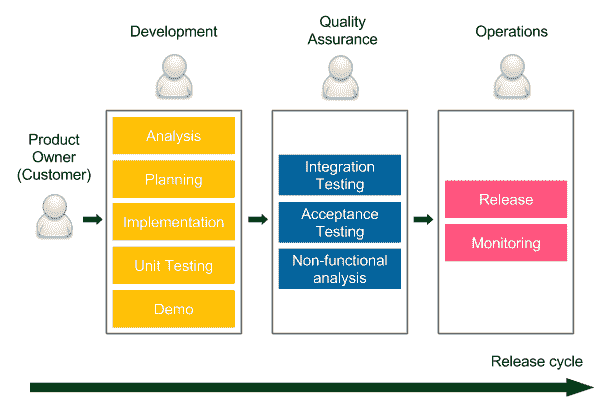
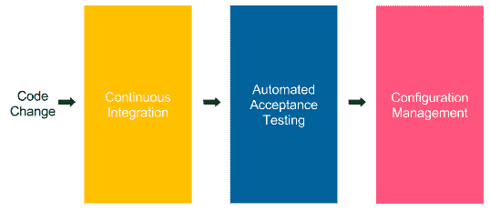
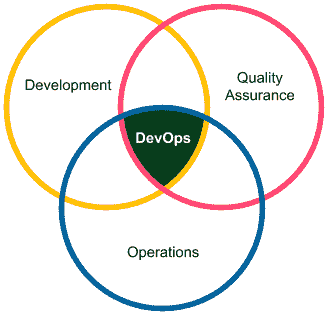
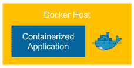
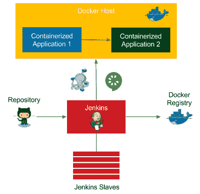
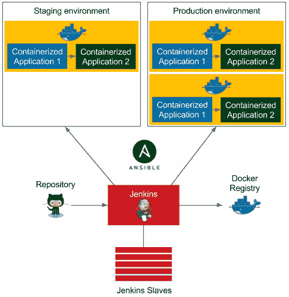
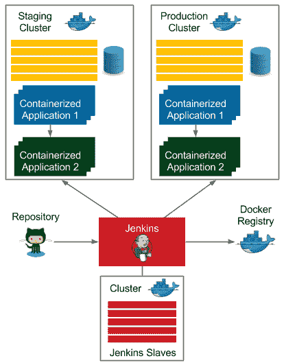

# 引入连续交付

大多数开发人员面临的共同问题是如何快速安全地发布实现的代码。然而，传统上使用的交付过程是陷阱的来源，通常会导致开发人员和客户的失望。本章介绍了连续交付方法的思想，并为本书的其余部分提供了背景。

本章包括以下几点:

*   介绍传统的交付流程及其缺点
*   描述持续交付的理念及其带来的好处
*   比较不同公司交付软件的方式
*   解释自动化部署管道及其阶段
*   对不同类型的测试及其在流程中的位置进行分类
*   指出成功持续交付流程的先决条件
*   展示将在整本书中使用的工具
*   展示了整本书将要构建的完整系统

# 什么是持续交付？

Jez Humble 对持续交付的最准确定义如下:“持续交付是以可持续的方式将所有类型的更改(包括新功能、配置更改、错误修复和实验)安全、快速地投入生产或用户手中的能力。”该定义涵盖了关键点。

为了更好地理解它，让我们想象一个场景。你负责产品，比如说，电子邮件客户端应用程序。用户带着一个新的要求来找你——他们想按大小对电子邮件进行分类。你决定开发大约需要一周时间。用户何时可以使用该功能？通常，在开发完成后，您首先将完成的特性交给质量保证团队，然后交给运营团队，这需要几天到几个月的额外时间。因此，即使开发只花了一周时间，用户也能在几个月内收到它！连续交付方法通过自动化手动任务来解决这个问题，以便用户可以在新功能实施后立即获得它。

为了更好地展示自动化的内容和方式，让我们从描述当前用于大多数软件系统的交付过程开始。

# 传统的交付流程

顾名思义，传统的交付流程已经存在多年，并在大多数信息技术公司中实施。让我们定义它是如何工作的，并评论它的缺点。

# 介绍传统的交付流程

任何交付过程都是从客户定义的需求开始，到产品发布结束。区别在两者之间。传统上，它看起来如下面的发布周期图所示:

发布周期从代表**客户**(利益相关方)的**产品负责人**提供的要求开始。然后有三个阶段，在此期间工作在不同的团队之间传递:

*   **开发**:这里，开发人员(有时和业务分析师一起)在产品上工作。他们经常使用敏捷技术(Scrum 或看板)来提高开发速度和改善与客户的沟通。组织演示会议是为了获得客户的快速反馈。所有好的开发技术(如测试驱动开发或极限编程实践)都是受欢迎的。实现完成后，代码被传递给质量保证团队。
*   **质量保证**:这个阶段通常被称为**用户验收测试** ( **UAT** )，它需要在主干代码库中冻结代码，这样就不会有新的开发破坏测试。QA 团队执行一套**集成测试**、**验收测试**、**非功能测试**(性能、恢复、安全等)。任何被检测到的 bug 都会返回到开发团队，所以开发人员通常也会忙得不可开交。UAT 阶段完成后，质量保证团队批准计划在下一个版本中使用的功能。
*   **运营**:最后一个阶段，通常是最短的一个阶段，就是把代码传递给**运营**团队，让他们执行发布，监控生产。如果出现任何问题，他们会联系开发人员来帮助生产系统。

发布周期的长度取决于系统和组织，但通常从一周到几个月不等。我听说的最长的是一年。我工作时间最长的是以季度为基础，每个部分的时间如下:开发-1.5 个月，UAT-1 个月零 3 周，发布(和严格的生产监控)-1 周。

传统的交付流程在信息技术行业中被广泛使用，您可能不是第一次读到这种方法。然而，它有许多缺点。让我们看看它们的明确性，以理解为什么我们需要为更好的东西而奋斗。

# 传统交付流程的缺点

传统交付流程的最大缺点包括:

*   **慢发货**:这里，客户在指定需求很久之后才收到产品。这导致了不令人满意的上市时间和客户反馈的延迟。
*   **反馈周期长**:反馈周期不仅和客户有关，也和开发者有关。想象一下，你不小心创建了一个 bug，并在 UAT 阶段了解了它。修复你两个月前做的东西需要多长时间？即使是很小的 bug 也需要几周的时间。
*   **缺乏自动化**:稀有版本不鼓励自动化，导致不可预测的发布。
*   **有风险的修补程序**:修补程序通常不能等到完整的 UAT 阶段，所以它们往往会被不同的测试(UAT 阶段被缩短)或者根本不被测试。
*   **压力**:不可预测的释放对运营团队来说是有压力的。此外，发布周期通常安排得很紧，这给开发人员和测试人员带来了额外的压力。
*   **沟通不畅**:从一个团队传递到另一个团队的工作代表了瀑布式的方法，在这种方法中，人们开始只关心自己的部分，而不是整个产品。万一出了什么问题，通常会导致指责游戏，而不是合作。
*   **共担责任**:从 A 到 z 没有一个团队对产品负责，对于开发人员来说:“完成”意味着需求得到实现。对于测试人员来说:“完成”意味着代码被测试。对于操作:“完成”意味着代码被发布。

*   **工作满意度降低**:每个阶段对于不同的团队来说都是有趣的，但是其他团队需要支持这个过程。例如，开发阶段对开发人员来说很有趣，但是在另外两个阶段，他们仍然需要修复 bug 并支持发布，这通常对他们来说一点也不有趣。

这些缺点只是与传统交付流程相关的挑战的冰山一角。您可能已经感觉到必须有一种更好的方法来开发软件，而这种更好的方法显然是持续交付方法。

# 持续交付的优势

“您的组织需要多长时间来部署只涉及一行代码的变更？您是在可重复、可靠的基础上做到这一点的吗？”以上是 Mary 和 Tom Poppendieck(实现精益软件开发*的作者)提出的著名问题，被 Jez Humble 等作者多次引用。事实上，这些问题的答案是衡量你的交付过程健康程度的唯一有效方法。*

 *为了能够持续交付，并且不在全天候工作的运营团队大军上花费大量资金，我们需要自动化。这就是为什么，简而言之，连续交付就是将传统交付过程的每个阶段都变成一系列脚本，称为自动化部署管道或连续交付管道。然后，如果不需要手动步骤，我们可以在每次代码更改后运行该过程，从而将产品持续交付给用户。

连续交付让我们摆脱了繁琐的发布周期，因此带来了以下好处:

*   **快速交付**:上市时间大幅缩短，因为客户一完成开发就可以使用产品。请记住，该软件只有在其用户手中才能带来收入。
*   **快速反馈周期**:想象一下你在代码中创建了一个 bug，当天就投入生产了。修理你当天工作的东西需要多长时间？可能不多。这与快速回滚策略一起，是保持生产稳定的最佳方式。
*   **低风险释放**:如果你每天释放，那么这个过程就变得可重复，因此安全多了。俗话说:“痛了就多做。”
*   **灵活发布选项**:如果需要立即发布，一切都已经准备好了，所以发布决定不需要额外的时间/成本。

不用说，我们可以简单地通过消除所有交付阶段并直接在产品上进行开发来实现所有好处。然而，这会导致质量下降。实际上，引入连续交付的全部困难是担心质量会随着取消手动步骤而下降。在本书中，我们将展示如何以安全的方式接近它，并解释为什么与普遍的信念相反，持续交付的产品缺陷更少，并且更好地适应客户的需求。

# 成功案例

罗尔夫·拉塞尔在他的一次演讲中讲述了我最喜欢的关于持续交付的故事。事情是这样的。2005 年，雅虎收购了 Flickr，这是开发者世界中两种文化的冲突。那时，Flickr 是一家考虑到创业方式的公司。相反，雅虎是一家拥有严格规则和安全第一态度的大公司。它们的发布过程有很大不同。虽然雅虎使用传统的交付流程，但 Flickr 一天发布多次。开发人员实施的每一项变更都在同一天投入生产。他们甚至在页面底部有一个页脚，显示最后一次发布的时间和进行更改的开发人员的头像。

雅虎很少部署，每个版本都带来了很多经过充分测试和准备的变化。Flickr 以非常小的块工作，每个特性被分成小的增量部分，每个部分被快速部署到产品中。下图显示了差异:

你可以想象当两家公司的开发人员相遇时发生了什么。雅虎显然把 Flickr 的同事们当成了不负责任的初级开发人员，“一群不知道自己在做什么的软件牛仔。”因此，他们想要改变的第一件事是在 Flickr 的交付过程中增加一个质量保证团队和 UAT 阶段。然而，在应用这一改变之前，Flickr 的开发者只有一个愿望。他们要求评估整个雅虎公司中最可靠的产品。当雅虎所有软件中，Flickr 的停机时间最少时，真是令人惊讶。雅虎团队起初并不理解，但无论如何还是让 Flickr 继续他们目前的流程。毕竟他们是工程师，所以评估结果是确凿的。只是过了一段时间，他们才意识到持续交付流程可以对雅虎的所有产品都有好处，他们开始逐步在各地推出。

这个故事最重要的问题仍然是 Flickr 怎么可能是最可靠的系统？事实上，这一事实的原因是我们在前面的章节中已经提到的。在以下情况下，发布风险较低:

*   代码变化的增量很小
*   这个过程是可重复的

这就是为什么，尽管发布本身是一项困难的活动，但是频繁地发布会更安全。

雅虎和 Flickr 的故事只是连续交付流程被证明是正确的许多成功公司的一个例子。他们中的一些人甚至自豪地分享他们系统中的细节，如下所示:

*   **亚马逊**:2011 年，他们宣布部署间隔达到 11.6 秒(平均)
*   **脸书**:2013 年，他们一天两次宣布部署代码变更
*   **HubSpot**:2013 年，他们每天宣布部署 300 次
*   **Atlassian**:2016 年，他们发布了一项调查，称 65%的客户实行连续交付

You can read more about the research on the Continuous Delivery process and individual case studies at [https://continuousdelivery.com/evidence-case-studies/](https://continuousdelivery.com/evidence-case-studies/).

请记住，统计数据一天比一天好。然而，即使没有任何数字，只要想象一个你实现的每一行代码都安全进入生产的世界。客户可以快速反应并调整他们的需求，开发人员很高兴，因为他们不必解决那么多 bug，经理很满意，因为他们总是知道当前的工作状态。毕竟，请记住，衡量进步的唯一真正标准是发布的软件。

# 自动化部署管道

我们已经知道什么是持续交付流程，以及我们为什么使用它。在本节中，我们将描述如何实现它。

让我们从强调传统交付过程中的每个阶段都很重要开始。否则，它根本就不会被创造出来。没有人想不先测试就交付软件！UAT 阶段的作用是检测错误，并确保开发人员创建的是客户想要的。这同样适用于运营团队—必须对软件进行配置、部署到生产中并进行监控。那是不可能的。那么，我们如何自动化这个过程，从而保留所有的阶段呢？这就是自动化部署管道的作用，它由三个阶段组成，如下图所示:

自动化部署管道是一系列脚本，在提交给存储库的每个代码更改之后执行。如果该过程成功，它最终会部署到生产环境中。

每个步骤对应于传统交付流程中的一个阶段，如下所示:

*   **持续集成**:这个检查是为了确保不同开发人员编写的代码集成在一起
*   **自动化验收测试**:这取代了手动 QA 阶段，检查开发人员实现的特性是否满足客户的需求
*   **配置管理**:这取代了手动操作阶段——配置环境和部署软件

让我们更深入地了解每个阶段，了解它的职责是什么，包括哪些步骤。

# 连续累计

持续集成阶段向开发人员提供第一个反馈。它从存储库中检出代码，编译它，运行单元测试，并验证代码质量。如果任何一个步骤失败，管道执行就会停止，开发人员应该做的第一件事就是修复持续集成构建。这个阶段的本质是时间；必须及时执行。例如，如果这个阶段花了一个小时来完成，那么开发人员会更快地提交代码，这将导致管道不断失败。

持续集成管道通常是起点。设置它很简单，因为一切都是在开发团队中完成的，不需要与质量保证和运营团队达成一致。

# 自动化验收测试

自动化验收测试阶段是与客户(和质量保证人员)一起编写的一套测试，它应该取代手动 UAT 阶段。它作为一个质量门来决定一个产品是否准备好发布。如果任何验收测试失败，则停止管道执行，不再运行进一步的步骤。它阻止移动到配置管理阶段，从而阻止发布。

自动化验收阶段的整个想法是将质量构建到产品中，而不是在以后进行验证。换句话说，当开发人员完成实现时，软件已经与验收测试一起交付，验收测试验证软件是客户想要的。这是软件测试思维的一个巨大转变。不再有一个人(或团队)批准发布，但一切都取决于通过验收测试套件。这就是为什么创建这个阶段通常是连续交付过程中最困难的部分。它需要与客户密切合作，并在流程的开始(而不是结束)创建测试。

Introducing automated acceptance tests is especially challenging in the case of legacy systems. We describe more on that topic in [Chapter 9](09.html), *Advanced Continuous Delivery*.

对于测试的类型以及它们在持续交付过程中的位置，通常会有很多混淆。通常也不清楚如何自动化每种类型，覆盖范围应该是什么，质量保证团队在整个开发过程中应该扮演什么角色。让我们用敏捷测试矩阵和测试金字塔来阐明它。

# 敏捷测试矩阵

Brian Marick 在他的一系列博客文章中，以所谓的敏捷测试矩阵的形式对软件测试进行了分类。它将测试放在两个维度:面向业务或技术，支持程序员或评论产品。让我们来看看这个分类:

让我们简单地评论一下每种类型的测试:

*   **验收测试(自动化)**:这些测试代表了从业务角度看的功能需求。它们是由客户和开发人员以故事或例子的形式编写的，以就软件应该如何工作达成一致。
*   **单元测试(自动化)**:这些测试帮助开发人员提供高质量的软件，并最大限度地减少 bug。
*   **探索性测试(手动)**:这是手动黑盒测试，试图打破或改进系统。
*   **非功能测试(自动化)**:这些测试代表与性能、可伸缩性、安全性等相关的系统属性。

这个分类回答了关于持续交付过程的一个最重要的问题:质量保证在这个过程中扮演什么角色？

手动 QAs 执行探索性测试，所以他们玩系统，尝试打破它，提出问题，思考改进。自动化 QAs 帮助进行非功能和验收测试，例如，他们编写代码来支持负载测试。一般来说，质量保证在交付过程中没有特殊的位置，而是在开发团队中扮演一个角色。

In the automated Continuous Delivery process, there is no longer a place for manual QAs who perform repetitive tasks.

你可能会看着分类，想知道为什么你在那里看不到集成测试。布莱恩·马里克的目标是什么，以及如何将它们放在持续交付管道中？

为了很好地解释它，我们首先需要提到集成测试的含义根据上下文的不同而不同。对于(微)服务架构，它们通常意味着与验收测试完全相同，因为服务很小，只需要单元和验收测试。如果您构建了一个模块化的应用程序，那么通过集成测试，我们通常指的是绑定多个模块(但不是整个应用程序)并将它们测试在一起的组件测试。在这种情况下，集成测试将自己置于验收测试和单元测试之间。它们的编写方式与验收测试类似，但通常更具技术性，不仅需要模仿外部服务，还需要模仿内部模块。与单元测试类似，集成测试代表“代码”的观点，而验收测试代表“用户”的观点。关于连续交付管道，集成测试只是作为过程中的一个单独阶段来实现的。

# 测试金字塔

上一节解释了每个测试类型在过程中代表什么，但是没有提到我们应该开发多少测试。那么，在单元测试的情况下，代码覆盖率应该是多少呢？验收测试呢？

为了回答这些问题，迈克·科恩在他的《敏捷的成功:使用 Scrum 的软件开发》一书中创建了一个所谓的测试金字塔。让我们看一下图表，以便更好地理解它。

当我们沿着金字塔向上移动时，测试会变得更慢，创建成本也会更高。他们经常需要接触用户界面并雇佣一个独立的测试自动化团队。这就是为什么验收测试不应该以 100%的覆盖率为目标。相反，它们应该面向特性，并且只验证选定的测试场景。否则，我们将在测试开发和维护上花费一大笔钱，我们的连续交付管道构建将需要很长时间来执行。

金字塔底部的情况不同。单元测试既便宜又快，所以我们应该争取 100%的代码覆盖率。它们是由开发人员编写的，提供它们应该是任何成熟团队的标准程序。

我希望敏捷测试矩阵和测试金字塔能阐明验收测试的作用和重要性。

让我们进入连续交付流程的最后一个阶段，配置管理。

# 结构管理

配置管理阶段负责跟踪和控制软件及其环境的变化。它涉及准备和安装必要的工具、扩展服务实例的数量及其分布、基础架构清单以及与应用程序部署相关的所有任务。

配置管理解决了在生产环境中手动部署和配置应用程序带来的问题。这种常见的做法导致了一个问题，即我们不再知道每个服务在哪里运行以及使用什么属性。配置管理工具(如 Ansible、Chef 或 Puppet)支持将配置文件存储在版本控制系统中，并跟踪生产服务器上所做的每一项更改。

取代操作团队手动任务的另一项工作是负责应用程序监控。这通常是通过将正在运行的系统的日志和指标流式传输到一个公共仪表板来完成的，该仪表板由开发人员(或 DevOps 团队，如下一节所述)监控。

# 持续交付的先决条件

本书的其余部分致力于如何实现成功的连续交付管道的技术细节。然而，这个过程的成功不仅取决于我们在整本书中展示的工具。在本节中，我们从整体上审视整个流程，并从三个方面定义持续交付要求:

*   您的组织结构及其对开发过程的影响
*   您的产品及其技术细节
*   您的开发团队和您使用的实践

# 组织先决条件

您的组织的工作方式对引入持续交付流程的成功有很大影响。这有点类似于介绍 Scrum。许多组织希望使用敏捷过程，但是他们不会改变他们的文化。你不能在你的开发团队中使用 Scrum，除非组织的结构被调整到那样。例如，您需要一个产品所有者、利益相关者和管理层，他们理解在冲刺阶段不可能有需求变化。否则，即使有善意，你也做不到。这同样适用于持续交付流程；它需要调整组织的结构。让我们看看三个方面:DevOps 文化、流程中的客户和业务决策。

# 德沃普斯文化

很久以前，当软件由个人或微流编写时，开发、质量保证和操作之间没有明确的分离。一个人开发了代码，测试了它，然后把它投入生产。如果出现任何问题，同一个人会调查问题，修复问题，然后重新部署到生产中。当系统变得更大，开发团队成长时，开发的组织方式现在逐渐改变。然后，工程师开始在一个领域变得专业化。这很有道理，因为专业化提高了生产率。然而，副作用是通信开销。如果开发人员、质量保证和运营在组织中的不同部门下，位于不同的建筑中，或者外包给不同的国家，这一点尤其明显。这样的组织结构对持续交付过程没有好处。我们需要更好的东西，我们需要适应所谓的 DevOps 文化。

在某种意义上，DevOps 文化意味着回归根源。一个人或一个团队负责所有三个领域，如下图所示:

之所以能够在不损失生产力的情况下转向 DevOps 模式，是因为自动化。大多数与质量保证和操作相关的任务被转移到自动化交付管道，因此可以由开发团队管理。

A DevOps team doesn't necessarily need to consist only of developers. A very common scenario in many organization's under transformation is to create teams with four developers, one QA, and one person from operations. They need, however, to work closely together (sit in one area, have stand-ups together, work on the same product).

小型开发团队的文化影响着软件架构。功能需求必须很好地分成(微)服务或模块，这样每个团队都可以处理一个独立的部分。

The impact of the organization's structure on the software architecture was already observed in 1967 and formulated as Conway's Law: "Any organization that designs a system (defined broadly) will produce a design whose structure is a copy of the organization's communication structure."

# 过程中的客户

在采用持续交付的过程中，客户(或产品所有者)的角色略有变化。传统上，客户参与定义需求，回答开发人员的问题，参加演示，并参加 UAT 阶段，以确定构建的内容是否是他们想要的。

在持续交付中，没有 UAT，在编写验收测试的过程中，客户是必不可少的。对于一些已经以可测试的方式编写了需求的客户来说，这并不是一个大的转变。对其他人来说，这意味着思维方式的改变，使需求更加面向技术。

In the Agile environment, some teams don't even accept user stories (requirements) without acceptance tests attached. Such techniques, even though they may sound too strict, often lead to better development productivity.

# 商业决策

在大多数公司中，业务对发布时间表有影响。毕竟，交付什么功能以及何时交付的决定与公司的不同部门(例如，市场营销)相关，并且对企业具有战略意义。这就是为什么发布时间安排必须在业务和开发团队之间重新评估和讨论。

显然，有一些技术，如功能切换或手动管道步骤，有助于在指定时间释放功能。我们将在本书后面描述它们。准确地说，术语“持续交付”与“持续部署”并不相同。前者意味着对存储库的每次提交都会自动发布到产品中。连续交付没有那么严格，意味着每个提交都以一个候选版本结束，所以它允许最后一步(发布到产品)是手动的。

In the rest of the book, we will use the terms Continuous Delivery and Continuous Deployment interchangeably.

# 技术和开发先决条件

从技术方面来说，有几个要求需要记住。我们将在整本书中讨论它们，所以我们只在这里提到它们，不做详细介绍:

*   **自动化构建、测试、打包和部署操作**:所有操作都需要能够自动化。如果我们处理不可自动化的系统，例如，由于安全原因或其复杂性，那么就不可能创建完全自动化的交付管道。
*   **快速管道执行**:管道必须及时执行，最好 5-15 分钟。如果我们的管道执行需要几个小时或几天，那么就不可能在每次提交到存储库之后运行它。
*   **快速故障恢复**:必须具备快速回滚或系统恢复的可能性。否则，我们会因频繁发布而危及生产健康。
*   **零宕机部署**:部署不能有任何宕机，因为我们一天发布很多次。
*   **基于主干的开发**:开发人员必须定期签到一个主分支。否则，如果每个人都在自己的分支中开发，集成很少，因此发布也很少，这与我们想要实现的正好相反。

我们将在整本书中详细介绍这些先决条件以及如何解决它们。记住这一点，让我们转到本章的最后一节，介绍我们计划在本书中构建什么系统，以及我们将为此使用什么工具。

# 构建连续交付流程

我们介绍了持续交付流程的理念、优势和先决条件。在这一节中，我们描述了将在整本书中使用的工具以及它们在整个系统中的位置。

If you're interested more in the idea of the Continuous Delivery process, then have a look at an excellent book by Jez Humble and David Farley, *Continuous Delivery: Reliable Software Releases through Build, Test, and Deployment Automation*.

# 介绍工具

首先，具体的工具总是不如理解它在过程中的作用重要。换句话说，任何工具都可以用另一个起同样作用的工具来代替。比如詹金斯可以换成亚特兰蒂斯的竹子，酋长可以换成 Ansible。这就是为什么每一章都以这样一个工具的必要性和它在整个过程中的作用的一般描述开始。然后，通过与其替代品的比较来描述确切的工具。该表单为您提供了选择适合您环境的表单的灵活性。

另一种方法是在思想层面上描述持续交付过程；然而，我坚信，用代码摘录给出一个确切的例子，读者可以自己运行，会导致对这个概念有更好的理解。

There are two ways to read this book. The first is to read and understand the concepts of the Continuous Delivery process. The second is to create your own environment and execute all scripts while reading to understand the details.

让我们快速浏览一下我们将在整本书中使用的工具。然而，在这一部分，它只是对每种技术的简单介绍，随着这本书的深入，会呈现更多的细节。

# 码头生态系统

Docker 作为集装箱化运动的明确领导者，近年来一直主导着软件行业。它允许在与环境无关的映像中打包应用程序，因此将服务器视为资源场，而不是必须为每个应用程序配置的机器。Docker 是这本书的明确选择，因为它完全适合(微)服务世界和持续交付流程。

与 Docker 一起出现的还有其他技术，如下所示:

*   **Docker Hub** :这是 Docker 映像的注册表
*   **Docker 编写**:这是一个定义多容器 Docker 应用程序的工具
*   **Docker Swarm** :这是一个集群和调度工具

# 詹金斯

Jenkins 是目前市场上最受欢迎的自动化服务器。它有助于创建连续集成和连续交付管道，通常还有任何其他自动化脚本序列。高度面向插件，它有一个伟大的社区，不断扩展新功能。此外，它允许将管道编写为代码，并支持分布式构建环境。

# Ansible

Ansible 是一个自动化工具，有助于软件配置、配置管理和应用程序部署。它的发展趋势比任何其他配置管理引擎都要快，很快就能超过它的两个主要竞争对手:Chef 和 Puppet。它采用无代理架构，与 Docker 平滑集成。

# 开源代码库

GitHub 绝对是所有托管版本控制系统中的第一名。它提供了一个非常稳定的系统，一个伟大的基于网络的用户界面，以及一个面向公共存储库的免费服务。话虽如此，任何源代码管理服务或工具都将与 Continuous Delivery 一起工作，无论它是在云中还是自托管，也无论它是基于 Git、SVN、Mercurial 还是任何其他工具。

# 爪哇/春船/格拉德尔

多年来，Java 一直是最流行的编程语言。这就是为什么它被用于本书的大多数代码示例。与 Java 一起，大多数公司使用 Spring 框架进行开发，因此我们使用它来创建一个简单的 web 服务，需要解释一些概念。Gradle 被用作构建工具。然而，它仍然不如 Maven 受欢迎，趋势要快得多。一如既往，任何编程语言、框架或构建工具都可以交换，并且连续交付过程将保持不变，因此如果您的技术堆栈不同，请不要担心。

# 其他工具

任意选择黄瓜作为验收测试框架。其他类似的解决方案是 Fitnesse 和 jbehavior。对于数据库迁移，我们使用 Flyway，但是任何其他工具都可以，例如，Liquibase。

# 创建完整的连续交付系统

你可以从两个角度来看这本书是如何组织的。

第一个是基于自动化部署管道的步骤。每一章都让您更接近完整的持续交付流程。如果你看一下章节的名字，有些章节甚至被命名为管道阶段:

*   连续集成管道
*   自动化验收测试
*   使用 Ansible 进行配置管理

其余章节给出了介绍、总结或补充过程的附加信息。

这本书的内容还有第二个视角。每章描述环境的一部分，依次为持续交付过程做好准备。换句话说，这本书呈现了，一步一步，一个技术接一个技术，如何构建一个完整的系统。为了帮助您了解我们计划在整本书中构建什么，现在让我们看看系统将如何在每一章中发展。

Don't worry if you don't understand the concepts and the terminology at this point. We explain everything from scratch in the corresponding chapters.

# 介绍 Docker

在[第 2 章](02.html)*介绍 Docker* 中，我们从系统的中心开始，构建一个打包成 Docker 映像的工作应用程序。本章的输出如下图所示:

一个码头化的应用程序(网络服务)作为一个容器在一个**码头主机**上运行，并且可以直接在主机上运行。这要归功于端口转发(Docker 术语中的端口发布)。

# 配置詹金斯

在[第 3 章](03.html)、*配置詹金斯*中，我们准备了詹金斯环境。由于多个代理(从)节点的支持，它能够处理繁重的并发负载。结果如下图所示:

**詹金斯**主设备接受构建请求，但是在其中一台**詹金斯从设备**(代理)上开始执行。这种方法提供了詹金斯环境的横向扩展。

# 持续集成管道

在[第 4 章](04.html)、*持续集成管道*中，我们展示了如何创建持续交付管道的第一阶段，即提交阶段。本章的输出是下图所示的系统:

该应用程序是一个简单的 web 服务，使用 Spring Boot 框架用 Java 编写。Gradle 用作构建工具，GitHub 用作源代码存储库。对 GitHub 的每次提交都会自动触发 Jenkins 构建，该构建使用 Gradle 编译 Java 代码、运行单元测试并执行额外的检查(代码覆盖率、静态代码分析等)。詹金斯构建完成后，会向开发人员发送通知。

完成本章后，您将能够创建一个完整的连续集成管道。

# 自动化验收测试

在[第 5 章](05.html)、*自动化验收测试*中，我们最终从书名中合并了两项技术: *Docker* 和 *Jenkins* 。它导致系统如下图所示:

图表中的附加元素与自动化验收测试阶段相关:

*   **Docker 注册表**:持续集成阶段结束后，先将应用打包成 JAR 文件，再打包成 Docker 镜像。该图像随后被推送到**码头工人登记处**，该登记处充当码头化应用程序的存储器。
*   **Docker 主机**:在执行验收测试套件之前，必须启动应用程序。詹金斯触发一台**码头工人主机**机器，从**码头工人注册表**中提取码头化的应用程序并启动它。
*   **Docker Compose** :如果完整的应用程序由一个以上的 Docker 容器组成(例如，两个 web 服务:应用 1 使用应用 2)，那么 **Docker Compose** 帮助它们一起运行。
*   **黄瓜**:在 **Docker 主机**上启动应用后，Jenkins 运行一套写在**黄瓜**框架中的验收测试。

# 具有可转换/连续交付管道的配置管理

接下来的两章，即[第 6 章](06.html)、*带 Ansible* 的配置管理、[第 7 章](01.html)、*持续交付管道*，我们完成持续交付管道。输出是下图中显示的环境:

Ansible 负责环境，并支持在多台机器上部署相同的应用程序。因此，我们将应用程序部署到试运行环境，运行验收测试套件，最后将应用程序发布到生产环境，通常在许多情况下(在多台 Docker Host 机器上)。

# 具有码头工人群/高级连续交付的集群

在[第 8 章](08.html)、*集群与 Docker Swarm* 中，我们将每个环境中的单个主机替换为机器集群。[第 9 章](09.html)、*高级连续交付*，在连续交付流程中增加了数据库。本书中创建的最终环境如下图所示:

暂存和生产环境配备了 Docker Swarm 集群，因此应用程序的多个实例在集群上运行。我们不再需要考虑我们的应用程序部署在哪台机器上。我们只关心它们的实例数量。这同样适用于詹金斯的奴隶，他们也是在集群上运行的。最后一项改进是使用集成到交付过程中的 Flyway 迁移自动管理数据库模式。

我希望你已经对我们在本书中计划构建的内容感到兴奋。我们将一步一步地接近它，解释每个细节和所有可能的选项，以帮助您理解程序和工具。读完这本书，你将能够在你的项目中引入或改进连续交付过程。

# 摘要

在这一章中，我们介绍了连续交付过程，从这个想法开始，讨论了先决条件，最后是本书其余部分中使用的工具。本章的要点如下:

*   大多数公司目前使用的交付流程都有明显的缺点，可以使用现代自动化工具进行改进
*   持续交付方法提供了许多好处，其中最重要的是:快速交付、快速反馈周期和低风险发布
*   持续交付管道由三个阶段组成:持续集成、自动化验收测试和配置管理
*   引入持续交付通常需要改变组织的文化和结构
*   连续交付环境中最重要的工具是 Docker、Jenkins 和 Ansible

在下一章中，我们将介绍 Docker，并介绍如何构建一个 Docker 化的应用程序。*