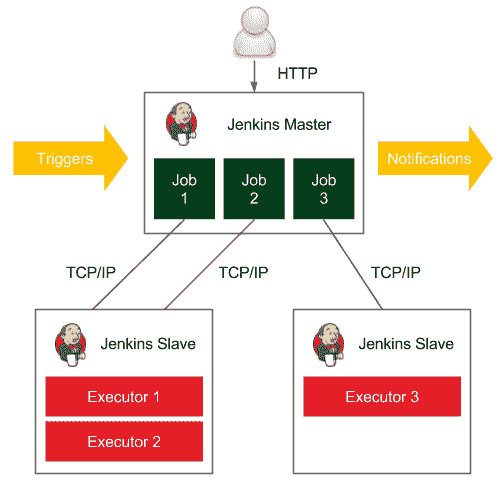
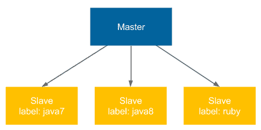
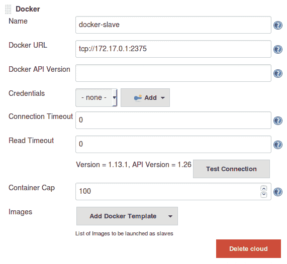
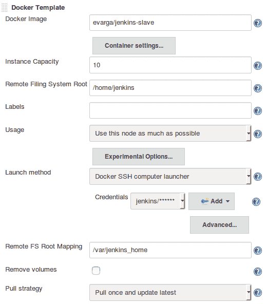
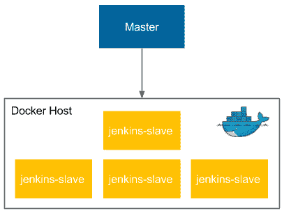
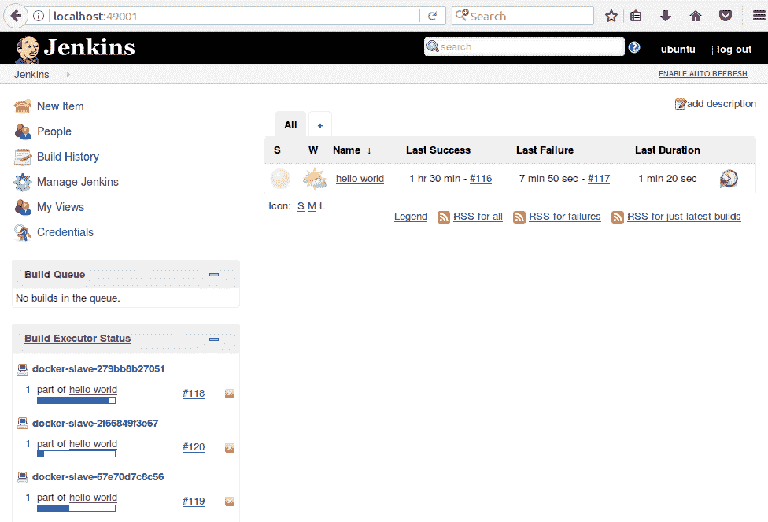
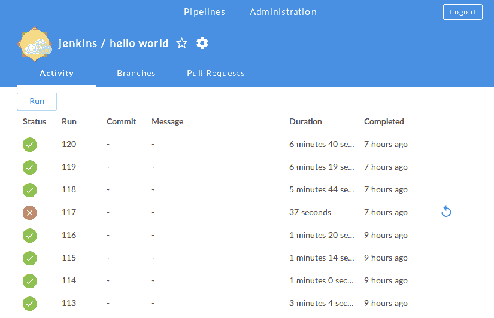

# 三、配置Jenkins

我们已经看到了如何配置和使用 Docker。在本章中，我们将介绍Jenkins，它可以单独使用或与 Docker 一起使用。我们将展示这两种工具的组合会产生令人惊讶的好结果:自动化配置和灵活的可伸缩性。

本章涵盖以下主题:

*   介绍Jenkins及其优势
*   安装和启动Jenkins
*   创建第一个管道
*   用代理扩展Jenkins
*   配置基于 Docker 的代理
*   构建自定义主和从 Docker 映像
*   配置安全和备份策略

# Jenkins是什么？

Jenkins 是一个用 Java 编写的开源自动化服务器。凭借非常活跃的基于社区的支持和大量插件，它是实现持续集成和持续交付流程的最流行工具。原名哈德逊，在甲骨文收购哈德逊并决定将其开发为专有软件后更名。Jenkins仍在麻省理工学院的许可下工作，因其简单性、灵活性和多功能性而受到高度评价。

Jenkins超越了其他的持续集成工具，是同类软件中使用最广泛的。这一切都是可能的，因为它的特点和能力。

让我们来看看Jenkins性格中最有趣的部分。

*   **语言不可知** : Jenkins 有很多插件，支持大部分的编程语言和框架。此外，由于它可以使用任何 shell 命令和安装的任何软件，因此它适用于所有可以想象的自动化过程。
*   **通过插件扩展** : Jenkins 有一个很棒的社区，有很多可用的插件(1000 加)。它还允许您编写自己的插件，以便根据您的需要定制Jenkins。
*   **便携** : Jenkins 是用 Java 写的，所以可以在任何操作系统上运行。为了方便起见，它还提供了许多版本:网络应用存档(WAR)、Docker 映像、Windows 二进制、Mac 二进制和 Linux 二进制。
*   **支持大多数 SCM** : Jenkins 几乎与现有的每一个源代码管理或构建工具集成在一起。同样，由于其广泛的社区和插件，没有其他持续集成工具支持如此多的外部系统。
*   **分布式** : Jenkins 有一个内置的主/从模式的机制，它将它的执行分布在位于多台机器上的多个节点上。它也可以使用异构环境，例如，不同的节点可以安装不同的操作系统。
*   **简单性**:安装配置过程简单。不需要配置任何额外的软件，也不需要配置数据库。它可以完全通过图形用户界面、XML 或 Groovy 脚本进行配置。
*   **面向代码** : Jenkins 管道定义为代码。此外，Jenkins本身可以使用 XML 文件或 Groovy 脚本进行配置。这允许将配置保存在源代码库中，并有助于 Jenkins 配置的自动化。

# Jenkins装置

Jenkins安装过程快速简单。有不同的方法可以做到这一点，但是由于我们已经熟悉了 Docker 工具及其带来的好处，我们将从基于 Docker 的解决方案开始。这也是最容易、最可预测、最聪明的方法。不过，我们先提一下安装要求。

# 安装要求

最低系统要求相对较低:

*   Java 8
*   256 兆可用内存
*   1 GB+可用磁盘空间

然而，理解需求严格取决于您计划如何处理 Jenkins 是至关重要的。如果使用 Jenkins 作为 Continuous Integration 服务器为整个团队服务，那么即使是小团队的情况，也建议有 1 GB 加空闲内存和 50 GB 加空闲磁盘空间。不用说，Jenkins 还会执行一些计算，并通过网络传输大量数据，因此 CPU 和带宽至关重要。

To get a feeling what could be the requirements in case of a big company, the Netflix example is presented in the *Jenkins architecture* section.

# 安装在 Docker 上

让我们看看使用 Docker 安装 Jenkins 的分步过程。

Jenkins 映像可在正式的 Docker Hub 注册表中找到，因此为了安装它，我们应该执行以下命令:

```
$ docker run -p <host_port>:8080 -v <host_volume>:/var/jenkins_home jenkins:2.60.1
```

我们需要指定第一个`host_port`参数——Jenkins在容器外部可见的端口。第二个参数`host_volume`指定了Jenkins家映射到的目录。它需要被指定为卷，因此需要永久保存，因为它包含配置、管道构建和日志。

例如，让我们看看在 Linux/Ubuntu 上安装 Docker 主机的情况下，安装步骤会是什么样子。

1.  **准备卷目录**:我们需要一个单独的目录，拥有管理员的所有权，以保持Jenkins家。让我们用以下命令准备一个:

```
 $ mkdir $HOME/jenkins_home
 $ chown 1000 $HOME/jenkins_home
```

2.  **运行 Jenkins 容器**:让我们将容器作为一个守护进程运行，并赋予它一个合适的名称:

```
 $ docker run -d -p 49001:8080 
        -v $HOME/jenkins_home:/var/jenkins_home --name 
        jenkins jenkins:2.60.1
```

3.  **检查Jenkins是否在运行**:过一会儿，我们可以通过打印日志来检查Jenkins是否已经正确启动:

```
 $ docker logs jenkins
 Running from: /usr/share/jenkins/jenkins.war
 webroot: EnvVars.masterEnvVars.get("JENKINS_HOME")
 Feb 04, 2017 9:01:32 AM Main deleteWinstoneTempContents
 WARNING: Failed to delete the temporary Winstone file 
        /tmp/winstone/jenkins.war
 Feb 04, 2017 9:01:32 AM org.eclipse.jetty.util.log.JavaUtilLog info
 INFO: Logging initialized @888ms
 Feb 04, 2017 9:01:32 AM winstone.Logger logInternal
 ...
```

In the production environment, you may also want to set up the reverse proxy in order to hide the Jenkins infrastructure behind the proxy server. The short description how to do it using the Nginx server can be found at [https://wiki.jenkins-ci.org/display/JENKINS/Installing+Jenkins+with+Docker](https://wiki.jenkins-ci.org/display/JENKINS/Installing+Jenkins+with+Docker).

完成这几个步骤后，Jenkins就可以使用了。基于 Docker 的安装有两个主要优势:

*   **故障恢复**:如果 Jenkins 崩溃了，那么运行一个相同指定体积的新容器就足够了。
*   **自定义映像**:可以根据需要配置 Jenkins，存储为 Jenkins 映像。然后它可以在您的组织或团队中共享，并且不需要一直重复相同的配置步骤，很多次。

Everywhere in this book, we use Jenkins in version 2.60.1.

# 不带 Docker 安装

出于前面提到的原因，建议安装 Docker。但是，如果这不是一个选项，或者有其他原因需要继续，那么安装过程也很简单。例如，在 Ubuntu 的情况下，运行以下内容就足够了:

```
$ wget -q -O - https://pkg.jenkins.io/debian/jenkins.io.key | sudo apt-key add -
$ sudo sh -c 'echo deb http://pkg.jenkins.io/debian-stable binary/ > /etc/apt/sources.list.d/jenkins.list'
$ sudo apt-get update
$ sudo apt-get install jenkins
```

All installation guides (Ubuntu, Mac, Windows, and others) can be found on the official Jenkins page [https://jenkins.io/doc/book/getting-started/installing/](https://jenkins.io/doc/book/getting-started/installing/).

# 初始配置

无论您选择哪种安装，Jenkins 的第一次启动都需要几个配置步骤。让我们一步一步来了解它们:

1.  在浏览器中打开 Jenkins:`http://localhost:49001`(对于二进制安装，默认端口为`8080`)。
2.  Jenkins应该询问管理员密码。这可以在Jenkins日志中找到:

```
 $ docker logs jenkins
 ...
 Jenkins initial setup is required. An admin user has been created 
        and a password generated.
 Please use the following password to proceed to installation:

 c50508effc6843a1a7b06f6491ed0ca6

 ...
```

3.  接受初始密码后，Jenkins询问是否安装建议的插件，这些插件被调整为最常见的用例。你的答案当然取决于你的需求。但是，作为第一次Jenkins安装，让Jenkins安装所有推荐的插件是合理的。
4.  插件安装后，Jenkins要求设置用户名、密码和其他基本信息。如果您跳过它，步骤 2 中的令牌将用作管理员密码。

安装完成，您应该会看到 Jenkins 仪表板:


我们准备使用Jenkins并创建第一个管道。

# Jenkins你好世界

整个 IT 世界的一切都是从 Hello World 的例子开始的。

让我们遵循这条规则，看看创建第一个 Jenkins 管道的步骤:

1.  点击新项目。
2.  输入`hello world`作为项目名称，选择管道，点击确定。
3.  有很多选择。我们将暂时跳过它们，直接转到管道部分。
4.  在脚本文本框中，我们可以输入管道脚本:

```
      pipeline {
           agent any
           stages {
                stage("Hello") {
                     steps {
                          echo 'Hello World'
                     }
                }
           }
      }
```

5.  点击保存。
6.  单击立即构建。

我们应该在构建历史下看到#1。如果我们点击它，然后点击控制台输出，我们将看到来自管道构建的日志。


我们刚刚看到了第一个例子，它的成功输出意味着 Jenkins 安装正确。现在，让我们转到稍微高级一点的Jenkins配置。

We will describe more on the pipeline syntax in [Chapter 4](04.html), *Continuous Integration Pipeline*.

# Jenkins建筑

hello world 的工作几乎在任何时间内完成。然而，管道通常更复杂，并且花费时间在诸如从互联网下载文件、编译源代码或运行测试等任务上。一次构建可能需要几分钟到几小时。

在常见的场景中，也有许多并发管道。通常，整个团队，甚至整个组织都使用相同的 Jenkins 实例。如何确保构建快速而顺利地运行？

# 主人和奴隶

Jenkins比看起来更快地超载。即使是小型(微型)服务，构建也需要几分钟。这意味着一个频繁提交的团队很容易杀死Jenkins实例。

因此，除非项目真的很小，否则 Jenkins 根本不应该执行构建，而是将它们委托给从属(代理)实例。准确地说，我们目前运行的Jenkins被称为Jenkins大师，它可以委托给Jenkins代理。

让我们看看呈现主从交互的图表:



在分布式构建环境中，Jenkins大师负责:

*   接收构建触发器(例如，在提交到 GitHub 之后)
*   发送通知(例如，在构建失败后发送的电子邮件或 HipChat 消息)
*   处理 HTTP 请求(与客户端的交互)
*   管理构建环境(编排从机上的作业执行)

构建代理是一台处理构建开始后发生的所有事情的机器。

由于主人和奴隶的责任不同，他们有不同的环境要求:

*   **Master** :这通常是(除非项目真的很小)一台专用机，RAM 从小项目的 200 MB 到大型单主项目的 70GB 以上。
*   **Slave** :没有通用的要求(除了它应该能够执行单个构建的事实，例如，如果项目是一个需要 100 GB RAM 的巨大整体，那么从机需要满足这些需求)。

代理也应该尽可能通用。例如，如果我们有不同的项目:一个在 Java 中，一个在 Python 中，一个在 Ruby 中，那么如果每个代理都可以构建这些项目中的任何一个，那将是完美的。在这种情况下，代理可以互换，这有助于优化资源的使用。

If agents cannot be generic enough to match all projects, then it's possible to label (tag) agents and projects, so that the given build would be executed on a given type of agent.

# 可量测性

我们可以使用Jenkins从机来平衡负载，并扩展Jenkins基础设施。这样的过程称为水平缩放。另一种可能性是只使用一个主节点并增加其机器的资源。这个过程叫做垂直缩放。让我们仔细看看这两个概念。

# 垂直缩放

垂直扩展意味着，当主机的负载增加时，更多的资源被应用到主机上。因此，当新项目出现在我们的组织中时，我们会购买更多的内存，添加 CPU 内核，并扩展硬盘驱动器。这听起来像是一个不可行的解决方案；然而，它经常被使用，即使是知名组织也是如此。在超高效的硬件上拥有一个单独的Jenkins主机有一个非常强大的优势:维护。任何升级、脚本、安全设置、角色分配或插件安装都只能在一个地方完成。

# 水平缩放

水平扩展意味着，当一个组织发展壮大时，会启动更多的主实例。这需要为团队智能分配实例，在极端情况下，每个团队都可以有自己的Jenkins大师。在这种情况下，甚至有可能不需要奴隶。

缺点是跨项目集成可能很难自动化，团队的一部分开发时间花在了 Jenkins 维护上。然而，水平缩放有一些显著的优点:

*   主机在硬件方面不需要特别
*   不同的团队可以有不同的 Jenkins 设置(例如，不同的插件集)
*   如果实例是他们自己的，团队通常感觉更好，与 Jenkins 一起工作效率更高
*   如果一个主实例停机，不会影响整个组织
*   基础设施可以分为标准的和关键任务的
*   一些维护方面可以简化，例如，五人小组可以重复使用相同的 Jenkins 密码，因此我们可以跳过角色和安全设置(当然，这只有在公司网络防火墙良好的情况下才有可能)

# 测试和生产实例

除了缩放方法，还有一个问题:如何测试Jenkins升级、新插件或管道定义？Jenkins对整个公司至关重要。它保证软件的质量，并(在持续交付的情况下)部署到生产服务器。这就是为什么它需要高度可用，所以它肯定不是为了测试。这意味着应该总是有两个相同的Jenkins基础设施的实例:测试和生产。

Test environment should always be as similar as possible to the production, so it also requires the similar number of agents attached.

# 示例架构

我们已经知道应该有从设备(可能有多个)主设备，并且所有的东西都应该复制到测试和生产环境中。然而，完整的画面会是什么样子呢？

幸运的是，有很多公司发布了他们如何使用Jenkins以及他们创建了什么样的架构。很难衡量他们中是否有更多的人喜欢垂直或水平缩放，但范围从只有一个主实例到每个团队有一个主实例。

让我们看看网飞的例子，了解Jenkins基础设施的完整情况(他们在 2012 年旧金山Jenkins用户大会上将其作为**计划的基础设施**进行了分享):


它们有测试和生产主实例，每个实例都有一个从机和额外的临时从机的轮询。总共，它每天服务大约 2000 个构建。还要注意，他们基础设施的一部分托管在 AWS 上，一部分在他们自己的服务器上。

根据组织的类型，我们至少应该对 Jenkins 基础架构的样子有一个大致的了解。

现在让我们把重点放在设置代理的实际方面。

# 配置代理

我们已经看到了什么是代理以及何时可以使用它们。但是，如何设置代理并让它与主服务器通信呢？让我们从问题的第二部分开始，描述主机和代理之间的通信协议。

# 通信协议

为了让主机和代理进行通信，必须建立双向连接。

有不同的启动方式:

*   **SSH** :主机使用标准的 SSH 协议连接到从机。Jenkins 内置了一个 SSH 客户端，所以唯一的要求是在从机上配置 SSHD 服务器。这是最方便和稳定的方法，因为它使用标准的 Unix 机制。
*   **Java Web Start** :在每个代理机上启动 Java 应用，并在 Jenkins 从应用和主 Java 应用之间建立 TCP 连接。如果代理位于防火墙网络内部，并且主服务器无法发起连接，则通常会使用这种方法。
*   **Windows 服务**:主机在远程机器上注册一个代理作为 Windows 服务。不建议使用这种方法，因为设置很复杂，而且图形界面的使用也有限制。

如果我们知道通信协议，让我们看看如何使用它们来设置代理。

# 设置代理

在底层，代理总是使用上述协议之一与Jenkins主机通信。然而，在更高的层次上，我们可以通过各种方式将奴隶附加到主人身上。差异涉及两个方面:

*   **静态对动态**:最简单的选择就是在Jenkins主中永久添加从机。这种解决方案的缺点是，如果我们需要更多(或更少)的从节点，我们总是需要手动更改一些东西。一个更好的选择是在需要时动态配置从机。
*   **特定与通用**:代理可以是特定的(例如，基于 Java 7 的项目的不同代理和 Java 8 的不同代理)或通用的(代理充当 Docker 主机，管道构建在 Docker 容器内)。

这些差异导致了代理配置的四种常见策略:

*   常驻代理人
*   永久Docker代理人
*   Jenkins蜂群智能体
*   动态配置的 Docker 代理

让我们检查每个解决方案。

# 常驻代理人

我们从最简单的选项开始，即永久添加特定的代理节点。这可以完全通过Jenkins网络界面完成。

# 配置永久代理

在 Jenkins 主界面中，当我们打开“管理 Jenkins”，然后打开“管理节点”时，我们可以查看所有连接的代理。然后，通过单击新节点，给它一个名称，并使用确定按钮进行确认，我们应该最终看到代理的设置页面:


让我们浏览一下需要填充的参数:

*   **名称**:这是代理的唯一名称
*   **描述**:这是任何人类可读的代理描述
*   **#个执行器**:这是可以在从机上运行的并发构建数
*   **远程根目录**:这是从机上的专用目录，代理可以用来运行构建作业(例如`/var/jenkins`)；最重要的数据被传输回主机，所以目录并不重要
*   **标签**:这包括只匹配特定构建的标签(标签相同)，例如，只匹配基于 Java 8 的项目
*   **用法**:这是决定代理应该只用于匹配的标签(例如，只用于验收测试版本)还是任何版本的选项

*   **发射方式**:包括以下内容:
    *   **通过 Java Web Star 启动代理** t:这里由代理建立连接；可以下载 JAR 文件以及如何在从机上运行它的说明

    *   **通过在主机上执行命令来启动代理**:这是在主机上运行的自定义命令，用于启动从机；在大多数情况下，它将发送 Java Web Start JAR 应用程序，并在从机上启动它(例如，`ssh <slave_hostname> java -jar ~/bin/slave.jar`)
    *   **通过 SSH 启动从代理:**这里，主代理将使用 SSH 协议连接到从代理
    *   **让 Jenkins 作为 Windows 服务控制这个 Windows 从机**:这里，主机将启动一个内置在 Windows 中的远程管理设施
*   **可用性**:这是决定代理是应该一直开机，还是在一定条件下主机应该让其离线的选项

当代理设置正确时，可以将主节点切换到离线状态，这样就不会在其上执行任何构建，并且它将只充当 Jenkins UI 和构建的协调器。

# 了解永久代理

如前所述，这种解决方案的缺点是我们需要为不同的项目类型维护多个从属类型(标签)。下图显示了这种情况:



在我们的例子中，如果我们有三种类型的项目( **java7** 、 **java8** 和 **ruby** )，那么我们需要维护三个单独标记的(套)从项目。正如[第 2 章](02.html)、*介绍 Docker* 中所述，这也是我们在维护多种生产服务器类型时遇到的相同问题。我们通过在生产服务器上安装 Docker 引擎来解决这个问题。让我们试着对Jenkins的奴隶做同样的事情。

# 永久Docker代理人

该解决方案背后的想法是永久添加通用从机。每个从机的配置都是相同的(安装了 Docker Engine)，并且每个构建都与构建在其中运行的 Docker 映像一起定义。

# 配置永久 Docker 代理

配置是静态的，因此它的实现方式与我们对永久代理的实现方式完全相同。唯一的区别是，我们需要在每台将用作从机的机器上安装 Docker。然后，我们通常不需要标签，因为所有的奴隶都可以是一样的。配置完从属后，我们在每个管道脚本中定义 Docker 映像。

```
pipeline {
     agent {
          docker {
               image 'openjdk:8-jdk-alpine'
          }
     }
     ...
}
```

当构建开始时，Jenkins从属从 Docker 映像`openjdk:8-jdk-alpine`启动一个容器，然后执行该容器内的所有管道步骤。这样，我们总是知道执行环境，而不必根据特定的项目类型分别配置每个从机。

# 了解永久Docker代理

看看我们对永久代理采用的相同场景，图表如下所示:


每个从属都完全相同，如果我们想要构建一个依赖于 Java 8 的项目，那么我们在管道脚本中定义适当的 Docker 映像(而不是指定从属标签)。

# Jenkins蜂群智能体

到目前为止，我们总是不得不永久地定义Jenkins大师中的每个特工。这样的解决方案，即使在很多情况下已经足够好了，但是如果我们需要频繁地扩展从机的数量，它可能会成为一个负担。Jenkins Swarm 允许您动态添加从机，而无需在 Jenkins master 中配置它们。

# 配置Jenkins群代理

使用 Jenkins Swarm 的第一步是在 Jenkins 安装**自组织 Swarm 插件模块**插件。我们可以通过管理Jenkins和管理插件下的Jenkins网络用户界面来实现。在这一步之后，Jenkins大师为动态连接Jenkins奴隶做好准备。

第二步是在每台充当Jenkins从机的机器上运行Jenkins群从机应用程序。我们可以使用`swarm-client.jar`应用程序来完成。

The `swarm-client.jar` application can be downloaded from the Jenkins Swarm plugin page: [https://wiki.jenkins-ci.org/display/JENKINS/Swarm+Plugin](https://wiki.jenkins-ci.org/display/JENKINS/Swarm+Plugin). On that page, you can also find all the possible options of its execution.

为了附加 Jenkins Swarm 从节点，运行以下命令就足够了:

```
$ java -jar swarm-client.jar -master <jenkins_master_url> -username <jenkins_master_user> -password <jenkins_master_password> -name jenkins-swarm-slave-1
```

By the time of writing this book, there was an open bug that `client-slave.jar` didn't work via the secured HTTPS protocol, so it was necessary to add the `-disableSslVerification` option to the command execution.

成功执行后，我们应该注意到一个新的从机出现在 Jenkins 主机上，如截图所示:


现在，当我们运行一个构建时，它将在这个代理上启动。

The other possibility to add the Jenkins Swarm agent is to use the Docker image built from the `swarm-client.jar` tool. There are a few of them available on the Docker Hub. We can use the `csanchez/jenkins-swarm-slave` image.

# 理解Jenkins蜂群智能体

Jenkins Swarm 允许动态添加代理，但它没有说明是使用特定的还是基于 Docker 的从代理，因此我们可以将它用于两者。乍一看，Jenkins·斯旺似乎不是很有用。毕竟，我们将设置代理从主服务器移动到了从服务器，但是仍然需要手动操作。然而，正如我们将在[第 8 章](08.html)、*中看到的那样，使用 Docker Swarm* 进行集群，Jenkins Swarm 支持在服务器集群上动态扩展从机。

# 动态配置的 Docker 代理

另一个选项是设置 Jenkins 在每次构建开始时动态创建一个新代理。这样的解决方案显然是最灵活的，因为从机的数量会根据构建的数量动态调整。让我们看看如何以这种方式配置 Jenkins。

# 配置动态配置的 Docker 代理

我们需要首先安装 Docker 插件。和Jenkins插件一样，我们可以在管理Jenkins和管理插件中完成。安装插件后，我们可以开始以下配置步骤:

1.  打开“管理Jenkins”页面。
2.  单击配置系统链接。
3.  页面底部是云部分。
4.  单击添加新云，然后选择 Docker。
5.  填写 Docker 代理详细信息。



6.  大多数参数不需要更改；但是，我们需要将其中两个设置如下:

If you plan to use the same Docker host where the master is running, then the Docker daemon needs to listen on the `docker0` network interface. You can do it in a similar way as described in the *Installing on a server* section ofts of) slaves. That is the same issue we had while maintaining multiple production server types, as described in [Chapter 2](02.html), *Introducing Docker*, by changing one line in the `/lib/systemd/system/docker.service` file to `ExecStart=/usr/bin/dockerd -H 0.0.0.0:2375 -H fd://`

7.  单击添加Docker模板，然后选择Docker模板。
8.  填充 Docker 从映像的详细信息:



我们可以使用以下参数:

*   **Docker形象**:Jenkins社区最受欢迎的奴隶形象是`evarga/jenkins-slave`
*   **凭证**:到`evarga/jenkins-slave`映像的凭证有:
    *   用户名:`jenkins`
    *   密码:`jenkins`
*   **实例容量**:定义同时运行的代理最大数量；开始时，它可以设置为 10

Instead of `evarga/jenkins-slave`, it's possible to build and use your own slave images. This is necessary when there are specific environment requirements, for example, the Python interpreter installed. In all examples for this book we used `leszko/jenkins-docker-slave`.

保存后，一切都设置好了。我们可以运行管道来观察执行是否真正发生在 Docker 代理上，但是首先让我们更深入地了解 Docker 代理是如何工作的。

# 了解动态配置的 Docker 代理

动态配置的 Docker 代理可以被视为标准代理机制之上的一层。它既不改变通信协议，也不改变代理的创建方式。那么，Jenkins 如何处理我们提供的 Docker 代理配置呢？

下图展示了我们配置的 Docker 主从架构:



让我们逐步描述 Docker 代理机制是如何使用的:

1.  当Jenkins作业开始时，主机从从属 Docker 主机上的`jenkins-slave`映像运行一个新容器。
2.  jenkins-slave 容器实际上是安装了 SSHD 服务器的 ubuntu 映像。
3.  Jenkins 主程序会自动将创建的代理添加到代理列表中(与我们在*设置代理*部分手动进行的操作相同)。
4.  使用 SSH 通信协议访问代理以执行构建。
5.  构建完成后，主容器停止并移除从容器。

Running Jenkins master as a Docker container is independent from running Jenkins agents as Docker containers. It's reasonable to do both, but any of them will work separately.

该解决方案在某种程度上类似于永久 Docker 代理解决方案，因为结果是，我们在 Docker 容器中运行构建。然而，不同之处在于从节点配置。在这里，整个从属是文档化的，而不仅仅是构建环境。因此，它有以下两大优势:

*   **自动代理生命周期**:创建、添加和移除代理的过程是自动化的。
*   **可扩展性**:实际上从 Docker 主机可能不是一台机器，而是由多台机器组成的集群(我们将在[第 8 章](08.html)、*用 Docker Swarm* 介绍使用 Docker Swarm 进行集群)。在这种情况下，添加更多资源就像在集群中添加一台新机器一样简单，并且不需要在 Jenkins 中进行任何更改。

Jenkins build usually needs to download a lot of project dependencies (for example, Gradle/Maven dependencies), which may take a lot of time. If Docker slaves are automatically provisioned for each build, then it may be worth to set up a Docker volume for them to enable caching between the builds.

# 测试代理

无论您选择哪种代理配置，我们现在都应该检查它是否正常工作。

让我们回到 hello world 管道。通常，构建比 hello-world 示例持续的时间更长，因此我们可以通过向管道脚本添加 sleeping 来模拟它:

```
pipeline {
     agent any
     stages {
          stage("Hello") {
               steps {
                    sleep 300 // 5 minutes
                    echo 'Hello World'
               }
          }
     }
}
```

单击立即构建并转到Jenkins主页后，我们应该会看到构建是在代理上执行的。现在，如果我们多次点击构建，那么不同的代理应该执行不同的构建(如下图所示):



To prevent job executions on master, remember about turning the master node offline or setting **# of executors** to `0` in the Manage Nodes configuration.

看到代理正在执行我们的构建，我们已经确认它们配置正确。现在，让我们看看如何以及出于什么原因，我们可以创建自己的Jenkins映像。

# 自定义Jenkins映像

到目前为止，我们已经使用了从互联网上提取的Jenkins映像。我们使用`jenkins`作为主容器，使用`evarga/jenkins-slave`作为从容器。但是，我们可能希望构建自己的映像来满足特定的构建环境要求。在本节中，我们将介绍如何做到这一点。

# 建造Jenkins奴隶

让我们从奴隶形象开始，因为它更经常被定制。构建执行是在代理上执行的，因此需要根据我们想要构建的项目调整环境的是代理。例如，如果我们的项目是用 Python 编写的，它可能需要 Python 解释器。这同样适用于任何库、工具、测试框架或项目所需的任何东西。

You can check what is already installed inside the `evarga/jenkins-slave` image by looking at its Dockerfile at [https://github.com/evarga/docker-images](https://github.com/evarga/docker-images).

构建和使用自定义映像有三个步骤:

1.  创建一个 Dockerfile。
2.  建立形象。
3.  更改主机上的代理配置。

例如，让我们创建一个服务于 Python 项目的从属。为了简单起见，我们可以将其建立在`evarga/jenkins-slave`映像之上。让我们使用以下三个步骤来完成:

1.  **Dockerfile** : 让我们在 Dockerfile 内部创建一个新目录，内容如下:

```
 FROM evarga/jenkins-slave
 RUN apt-get update && \
 apt-get install -y python
```

The base Docker image `evarga/jenkins-slave` is suitable for the dynamically provisioned Docker agents solution. In case of permanent Docker agents, it's enough to use `alpine`, `ubuntu`, or any other image, since it's not the slave that is dockerized, but only the build execution environment.

2.  **构建映像**:我们可以通过执行以下命令来构建映像:

```
 $ docker build -t jenkins-slave-python .
```

3.  **配置主**:最后一步当然是在Jenkins主配置中设置`jenkins-slave-python`而不是`evarga/jenkins-slave`(如*设置Docker代理*部分所述)。

The slave Dockerfile should be kept in the source code repository and the image build can be performed automatically by Jenkins. There is nothing wrong with building the new Jenkins slave image using the old Jenkins slave.

如果我们需要 Jenkins 构建两种不同类型的项目，例如，一个基于 Python，另一个基于 Ruby，会怎么样？在这种情况下，我们可以准备一个代理，它足够通用以支持两者:Python 和 Ruby。但是在 Docker 的情况下，建议创建第二个从映像(【类比 T0】)。然后，在 Jenkins 配置中，我们需要创建两个 Docker 模板，并对它们进行相应的标记。

# 建筑大师Jenkins

我们已经有了一个定制的奴隶形象。为什么我们也要建立自己的大师形象？其中一个原因可能是我们根本不想使用奴隶，而且，由于执行将在主服务器上完成，它的环境必须根据项目的需要进行调整。然而，这是一个非常罕见的案例。更多时候，我们会想要配置主服务器本身。

想象以下场景，您的组织水平扩展 Jenkins，每个团队都有自己的实例。但是，有一些常见的配置，例如:一组基本插件、备份策略或公司徽标。然后，为每个团队重复相同的配置是浪费时间。因此，我们可以准备共享的主映像，并让团队使用它。

Jenkins 是使用 XML 文件配置的，它提供了基于 Groovy 的 DSL 语言来操作它们。这就是为什么我们可以将 Groovy 脚本添加到 Dockerfile 中，以便操作 Jenkins 配置。此外，如果Jenkins配置需要的不仅仅是 XML 更改，比如插件安装，还有特殊的脚本来帮助它。

All possibilities of the Dockerfile instructions are well described on the GitHub page [https://github.com/jenkinsci/docker](https://github.com/jenkinsci/docker).

作为一个例子，让我们创建一个主映像，其中 docker 插件已经安装，并且一些执行器设置为 5。为了做到这一点，我们需要:

1.  创建要在`config.xml`上操作的 Groovy 脚本，并将执行器的数量设置为`5`。
2.  创建 docker 文件来安装 docker 插件并执行 Groovy 脚本。
3.  建立形象。

让我们使用上面提到的三个步骤，构建Jenkins大师形象。

1.  **Groovy 脚本**:让我们在`executors.groovy`文件内创建一个新目录，内容如下:

```
import jenkins.model.*
Jenkins.instance.setNumExecutors(5)
```

The complete Jenkins API can be found on the official page [http://javadoc.jenkins.io/](http://javadoc.jenkins.io/).

2.  **Dockerfile** :在同一个目录下，我们创建 Dockerfile:

```
FROM jenkins
COPY executors.groovy 
      /usr/share/jenkins/ref/init.groovy.d/executors.groovy
RUN /usr/local/bin/install-plugins.sh docker-plugin
```

3.  **构建形象**:我们终于可以构建形象了:

```
$ docker build -t jenkins-master .
```

创建映像后，组织中的每个团队都可以使用它来启动自己的 Jenkins 实例。

拥有自己的主映像和从映像可以让我们为组织中的团队提供配置和构建环境。在下一节中，我们将看到在 Jenkins 中还有哪些值得配置的地方。

# 配置和管理

我们已经介绍了 Jenkins 配置中最关键的部分:代理配置。由于 Jenkins 是高度可配置的，您可以期待更多的可能性来根据您的需求调整它。好消息是，配置是直观的，可以通过网络界面访问，因此不需要任何详细的描述。在“管理Jenkins”子页面下，一切都可以更改。在这一节中，我们将只关注最有可能被改变的几个方面:插件、安全性和备份。

# 插件

Jenkins 是高度面向插件的，这意味着很多特性都是通过使用插件来实现的。他们几乎可以以无限的方式扩展Jenkins，考虑到庞大的社区，这是Jenkins成为如此成功的工具的原因之一。Jenkins的开放性带来了风险，最好只从可靠的来源下载插件或检查它们的源代码。

有大量的插件可供选择。其中一些已经在初始配置期间自动安装。设置 Docker 代理时安装了另一个插件(Docker 插件)。有云集成插件、源代码控制工具、代码覆盖等等。你也可以自己写插件，但是最好先检查一下你需要的插件是否已经写好了。

There is an official Jenkins page to browse plugins from [https://plugins.jenkins.io/](https://plugins.jenkins.io/).

# 安全

您应该如何对待 Jenkins 安全性取决于您在组织中选择的 Jenkins 体系结构。如果每个小团队都有一个Jenkins大师，那么你可能根本不需要它(假设公司网络是防火墙)。但是，如果整个组织只有一个 Jenkins 主实例，那么您最好确保它得到了很好的保护。

Jenkins 自带用户数据库——我们已经在初始配置过程中创建了一个用户。您可以通过打开“管理用户”设置页面来创建、删除和修改用户。在小型组织的情况下，内置数据库可以是一个解决方案；但是，对于庞大的用户群，您可能会希望改用 LDAP。您可以在“配置全局安全性”页面上选择它。在那里，您还可以分配角色、组和用户。默认情况下，登录用户可以做任何事情选项被设置，但是在大规模组织中，您可能应该考虑更详细的粒度。

# 支持

古语有云:<q>有两种人:备份的人和会备份的人</q>。信不信由你，备份可能是你想要配置的东西。哪些文件要备份，从哪些机器备份？幸运的是，代理会自动将所有相关数据发送回主服务器，因此我们不需要为它们费心。如果您在容器中运行 Jenkins，那么容器本身也没什么意思，因为它没有任何持久状态。我们唯一感兴趣的地方是Jenkins的主目录。

我们可以安装一个 Jenkins 插件(它将帮助我们设置定期备份)或者简单地设置一个 cron 作业来将目录存档到一个安全的地方。为了减少大小，我们可以排除不感兴趣的子文件夹(这将取决于您的需求；然而，几乎可以肯定的是，您不需要复制:“war”、“cache”、“tools”和“workspace”)。

There are quite a few plugins, which can help with the backup process; the most common one is called **Backup Plugin**.

# 蓝色海洋用户界面

哈德森(前Jenkins)的第一版于 2005 年发布。它已经上市 10 多年了。然而，它的外观和感觉没有太大变化。我们已经用了一段时间了，很难否认它看起来已经过时了。蓝海是插件，重新定义了Jenkins的用户体验。如果Jenkins在美学上让你不愉快，那么它绝对值得一试。

You can read more on the Blue Ocean page at [https://jenkins.io/projects/blueocean/](https://jenkins.io/projects/blueocean/).



# 练习

在本章中，我们已经了解了很多关于Jenkins配置的知识。为了巩固知识，我们推荐两个关于准备 Jenkins 映像和测试 Jenkins 环境的练习。

1.  创建 Jenkins 主和从 Docker 映像，并使用它们来运行能够构建 Ruby 项目的 Jenkins 基础架构:
    *   创建主 Docker 文件，它会自动安装 Docker 插件。
    *   构建主映像并运行 Jenkins 实例
    *   创建从属 Dockerfile(适用于动态从属配置)，它安装 Ruby 解释器
    *   建立奴隶形象
    *   更改 Jenkins 实例中的配置以使用从属映像
2.  创建一个管道，运行 Ruby 脚本打印`Hello World from Ruby`:
    *   创建新管道
    *   使用以下 shell 命令动态创建`hello.rb`脚本:
        `sh "echo "puts 'Hello World from Ruby'" > hello.rb"`
    *   使用 Ruby 解释器添加运行`hello.rb`的命令
    *   运行构建并观察控制台输出

# 摘要

在本章中，我们已经介绍了 Jenkins 环境及其配置。获得的知识足以建立完整的基于 Docker 的 Jenkins 基础架构。本章的要点如下:

*   Jenkins 是一个通用的自动化工具，可以用于任何语言或框架。
*   Jenkins 可以通过插件高度扩展，插件可以在互联网上编写或找到。
*   Jenkins 是用 Java 写的，所以可以安装在任何操作系统上。它也以 Docker 映像的形式正式交付。
*   Jenkins 可以使用主从架构进行扩展。主实例可以根据组织的需求进行水平或垂直缩放。
*   Jenkins 的代理可以使用 Docker 来实现，这有助于自动配置和动态从机分配。
*   可以为两者创建自定义 Docker 映像:Jenkins主映像和Jenkins从映像。
*   Jenkins 是高度可配置的，应该始终考虑的方面是:安全性和备份。

在下一章中，我们将重点讨论我们已经在“hello world”示例中接触过的部分，管道。我们将描述构建完整的持续集成管道的思想和方法。